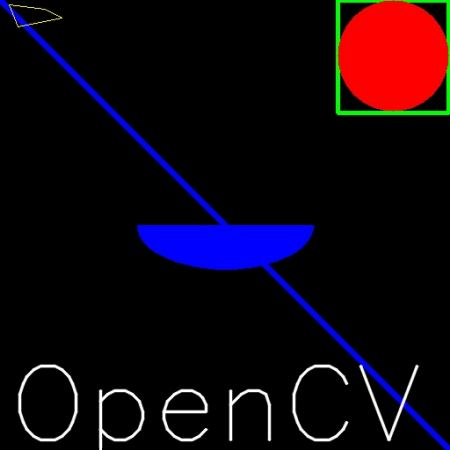

# 绘图功能

## 目标

在本次会议中：

* 用 OpenCV 画不同的几何图形

* 你要学习这些函数：**[cv.line()](https://docs.opencv.org/4.0.0/d6/d6e/group__imgproc__draw.html#ga7078a9fae8c7e7d13d24dac2520ae4a2 "Draws a line segment connecting two points. ")**, **[cv.circle()](https://docs.opencv.org/4.0.0/d6/d6e/group__imgproc__draw.html#gaf10604b069374903dbd0f0488cb43670 "Draws a circle. ")** , **[cv.rectangle()](https://docs.opencv.org/4.0.0/d6/d6e/group__imgproc__draw.html#ga07d2f74cadcf8e305e810ce8eed13bc9 "Draws a simple, thick, or filled up-right rectangle. ")**, **[cv.ellipse()](https://docs.opencv.org/4.0.0/d6/d6e/group__imgproc__draw.html#ga28b2267d35786f5f890ca167236cbc69 "Draws a simple or thick elliptic arc or fills an ellipse sector. ")**, **[cv.putText()](https://docs.opencv.org/4.0.0/d6/d6e/group__imgproc__draw.html#ga5126f47f883d730f633d74f07456c576 "Draws a text string. ")** 等。

## Code

上面的这些函数，你能看到一些相同的参数：

* img：你想画的图片

* color：形状的颜色，如 BGR，它是一个元组，例如：蓝色(255,0,0)。对于灰度图，只需传一个标量值。

* thickness： 线或圆等的厚度。如果传 **-1** 就是像圆的闭合图形，它将填充形状。_ 默认 thickness = 1_ 

* lineType：线条类型，如 8 连接，抗锯齿线等。默认情况下，它是 8 连接。**[cv.LINE_AA](https://docs.opencv.org/4.0.0/d6/d6e/group__imgproc__draw.html#ggaf076ef45de481ac96e0ab3dc2c29a777a85fdabe5335c9e6656563dfd7c94fb4f "antialiased line ")** 画出抗锯齿线，非常好看的曲线。

## 画线

去画一条线，你需要传递线条的开始和结束的坐标。我们将创建一个黑色图像，并在坐上角到右下角画一条蓝色的线

```python
import numpy as np
import cv2 as cv
# 创建一个黑色的图像
img = np.zeros((512,512,3), np.uint8)
# 画一条 5px 宽的蓝色对角线
cv.line(img,(0,0),(511,511),(255,0,0),5)
```

## 画矩形

画一个矩形，你需要矩形的左上角和右下角。这次我们将会在图像的右上角画一个绿色的矩形。

```python
cv.rectangle(img,(384,0),(510,128),(0,255,0),3)
```

## 画圆

画一个圆，你需要它的圆心和半径。我们将在上面绘制的矩形上画一个内圆。

```python
cv.circle(img,(447,63), 63, (0,0,255), -1)
```

## 画椭圆

画一个椭圆，你需要传好几个参数。一个参数是圆心位置  (x,y)。下个参数是轴的长度 (长轴长度，短轴长度)。角度是椭圆在你逆时针方向的旋转角度。startAngle 和 endAngle 表示从长轴顺时针方向测量的椭圆弧的起点和终点。如整圆就传 0 和 360。更多细节请看 **[cv.ellipse()](https://docs.opencv.org/4.0.0/d6/d6e/group__imgproc__draw.html#ga28b2267d35786f5f890ca167236cbc69 "Draws a simple or thick elliptic arc or fills an ellipse sector. ")** 的文档。下面是在这个图像中间画的一个半椭圆例子。

```python
cv.ellipse(img,(256,256),(100,50),0,0,180,255,-1)
```

## 画多边形

画多边形，首先你需要顶点的做坐标。将这些点组成一个形状为 ROWSx1x2 的数组，ROWS 是顶点数，它应该是 int32 类型。这里我们绘制一个顶点是黄色的小多边形。

```python
pts = np.array([[10,5],[20,30],[70,20],[50,10]], np.int32)
pts = pts.reshape((-1,1,2))
cv.polylines(img,[pts],True,(0,255,255))
```

**Note**

* 如果地三个是 False，你将获得所有点的折线，而不是一个闭合形状。

* **[cv.polylines()](https://docs.opencv.org/4.0.0/d6/d6e/group__imgproc__draw.html#ga1ea127ffbbb7e0bfc4fd6fd2eb64263c)** 能画很多线条。只需创建你想绘制所有线条的列表，然后将其传给这个函数。所有线条都将单独绘制。绘制一组线条比调用 **[cv.line()](https://docs.opencv.org/4.0.0/d6/d6e/group__imgproc__draw.html#ga7078a9fae8c7e7d13d24dac2520ae4a2 "Draws a line segment connecting two points. ")** 好很多，快很多。

## 给图像加文字

在图像上加文字，你需要指定以下内容。

* 你想写的文字数据。

* 你想写的位置坐标 (如 左下角开始)。

* 字体类型 (支持的字体，查看 **[cv.putText()](https://docs.opencv.org/4.0.0/d6/d6e/group__imgproc__draw.html#ga5126f47f883d730f633d74f07456c576 "Draws a text string. ")** 文档)

* 常规的如颜色，粗细，线型等。为了更好看，线型使用 lintType = [cv.LINE_AA](https://docs.opencv.org/4.0.0/d6/d6e/group__imgproc__draw.html#ggaf076ef45de481ac96e0ab3dc2c29a777a85fdabe5335c9e6656563dfd7c94fb4f "antialiased line ")

我们将在图像上写一个白色的 **OpenCV** 。

## 结果

所以是时候看看我们绘制的最终结果。正如你之前学习那样，显示图像并查看。




## 其他资源


1. 椭圆函数中使用的角度不是我们的圆角。获取更多信息，参考 **[this discussion](http://answers.opencv.org/question/14541/angles-in-ellipse-function/)**。


## 练习


1. 尝试着用 OpenCV 绘制函数画一个 OpenCV 的 logo。

