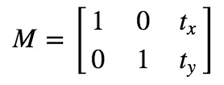
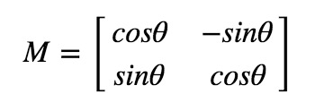
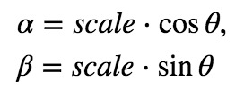
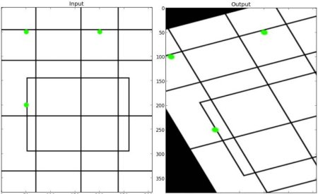

## 目标

在本教程中：

* 你将会学到将不同的几何变换应用于图像，如平移、旋转、仿射变换等。
* 你会学到如下函数：**[cv.getPerspectiveTransform](https://docs.opencv.org/4.0.0/da/d54/group__imgproc__transform.html#ga20f62aa3235d869c9956436c870893ae )**

## 变换

OpenCV 提供了两个变换函数， **[ cv.warpAffine](https://docs.opencv.org/4.0.0/da/d54/group__imgproc__transform.html#ga0203d9ee5fcd28d40dbc4a1ea4451983)** 和 **[cv.getPerspectiveTransform](https://docs.opencv.org/4.0.0/da/d54/group__imgproc__transform.html#ga20f62aa3235d869c9956436c870893ae)** ，用这两个函数就可以完成所有类型的变换。**[ cv.warpAffine](https://docs.opencv.org/4.0.0/da/d54/group__imgproc__transform.html#ga0203d9ee5fcd28d40dbc4a1ea4451983)** 输入为 2x3 的变换矩阵， **[cv.getPerspectiveTransform](https://docs.opencv.org/4.0.0/da/d54/group__imgproc__transform.html#ga20f62aa3235d869c9956436c870893ae)** 输入为 2x3 的变换矩阵。

## 缩放

缩放是调整图片的大小。 OpenCV 使用 **[cv.resize()](https://docs.opencv.org/4.0.0/da/d54/group__imgproc__transform.html#ga47a974309e9102f5f08231edc7e7529d)** 函数进行调整。可以手动指定图像的大小，也可以指定比例因子。可以使用不同的插值方法。对于下采样(图像上缩小)，最合适的插值方法是 **[cv.INTER_AREA](https://docs.opencv.org/4.0.0/da/d54/group__imgproc__transform.html#gga5bb5a1fea74ea38e1a5445ca803ff121acf959dca2480cc694ca016b81b442ceb)** 对于上采样(放大),最好的方法是 **[cv.INTER_CUBIC](https://docs.opencv.org/4.0.0/da/d54/group__imgproc__transform.html#gga5bb5a1fea74ea38e1a5445ca803ff121a55e404e7fa9684af79fe9827f36a5dc1)** （速度较慢）和 **[cv.INTER_LINEAR](https://docs.opencv.org/4.0.0/da/d54/group__imgproc__transform.html#gga5bb5a1fea74ea38e1a5445ca803ff121ac97d8e4880d8b5d509e96825c7522deb )** (速度较快)。默认情况下，所使用的插值方法都是 **[cv.INTER_AREA](https://docs.opencv.org/4.0.0/da/d54/group__imgproc__transform.html#gga5bb5a1fea74ea38e1a5445ca803ff121acf959dca2480cc694ca016b81b442ceb)** 。你可以使用如下方法调整输入图片大小：

```python
import numpy as np
import cv2 as cv
img = cv.imread('messi5.jpg')
res = cv.resize(img,None,fx=2, fy=2, interpolation = cv.INTER_CUBIC)
#OR
height, width = img.shape[:2]
res = cv.resize(img,(2*width, 2*height), interpolation = cv.INTER_CUBIC)
```

## 平移变换

平移变换是物体位置的移动。如果知道 **（x，y）** 方向的偏移量，假设为 **(t_x,t_y)**，则可以创建如下转换矩阵 **M**：



您可以将变换矩阵存为 np.float32 类型的 numpy 数组，并将其作为 **[ cv.warpAffine](https://docs.opencv.org/4.0.0/da/d54/group__imgproc__transform.html#ga0203d9ee5fcd28d40dbc4a1ea4451983)** 的第二个参数。请参见以下转换（100,50）的示例：

```python
import numpy as np
import cv2 as cv
img = cv.imread('messi5.jpg',0)
rows,cols = img.shape
M = np.float32([[1,0,100],[0,1,50]])
dst = cv.warpAffine(img,M,(cols,rows))
cv.imshow('img',dst)
cv.waitKey(0)
cv.destroyAllWindows()
```

### 警告

**[ cv.warpAffine](https://docs.opencv.org/4.0.0/da/d54/group__imgproc__transform.html#ga0203d9ee5fcd28d40dbc4a1ea4451983 )** 函数的第三个参数是输出图像的大小，其形式应为（宽度、高度）。记住宽度=列数，高度=行数。

结果：


## 旋转

以 角度旋转图片的转换矩阵形式为：



但 Opencv 提供了可变旋转中心的比例变换，所以你可以在任意位置旋转图片，修改后的转换矩阵为：


其中：



为了找到这个转换矩阵，opencv 提供了一个函数， **[cv.getRotationMatrix2D](https://docs.opencv.org/4.0.0/da/d54/group__imgproc__transform.html#gafbbc470ce83812914a70abfb604f4326)** 。请查看下面的示例，它将图像相对于中心旋转 90 度，而不进行任何缩放。

```python
img = cv.imread('messi5.jpg',0)
rows,cols = img.shape
# cols-1 and rows-1 are the coordinate limits.
M = cv.getRotationMatrix2D(((cols-1)/2.0,(rows-1)/2.0),90,1)
dst = cv.warpAffine(img,M,(cols,rows))
```

结果：


## 仿射变换

在仿射变换中，原始图像中的所有平行线在输出图像中仍然是平行的。为了找到变换矩阵，我们需要从输入图像中取三个点及其在输出图像中的对应位置。然后 **[cv.getAffineTransform](https://www.docs.opencv.org/4.0.0/da/d54/group__imgproc__transform.html#ga8f6d378f9f8eebb5cb55cd3ae295a999)** 将创建一个 2x3 矩阵，该矩阵将传递给 **[cv.warpAffine](https://docs.opencv.org/4.0.0/da/d54/group__imgproc__transform.html#ga0203d9ee5fcd28d40dbc4a1ea4451983)** 。

查看下面的示例，并注意我选择的点（用绿色标记）：

```python
img = cv.imread('drawing.png')
rows,cols,ch = img.shape
pts1 = np.float32([[50,50],[200,50],[50,200]])
pts2 = np.float32([[10,100],[200,50],[100,250]])
M = cv.getAffineTransform(pts1,pts2)
dst = cv.warpAffine(img,M,(cols,rows))
plt.subplot(121),plt.imshow(img),plt.title('Input')
plt.subplot(122),plt.imshow(dst),plt.title('Output')
plt.show()
```

结果：



## 透视变换

对透视转换，你需要一个 3x3 变换矩阵。即使在转换之后，直线也将保持直线。要找到这个变换矩阵，需要输入图像上的 4 个点和输出图像上的相应点。在这四点中，任意三点不应该共线。然后通过 **[cv.getPerspectiveTransform](https://docs.opencv.org/4.0.0/da/d54/group__imgproc__transform.html#ga20f62aa3235d869c9956436c870893ae)** 找到变换矩阵。然后对这个 3x3 变换矩阵使用  **[cv.warpPerspective](https://docs.opencv.org/4.0.0/da/d54/group__imgproc__transform.html#gaf73673a7e8e18ec6963e3774e6a94b87)**。

请看代码：

```python
img = cv.imread('sudoku.png')
rows,cols,ch = img.shape
pts1 = np.float32([[56,65],[368,52],[28,387],[389,390]])
pts2 = np.float32([[0,0],[300,0],[0,300],[300,300]])
M = cv.getPerspectiveTransform(pts1,pts2)
dst = cv.warpPerspective(img,M,(300,300))
plt.subplot(121),plt.imshow(img),plt.title('Input')
plt.subplot(122),plt.imshow(dst),plt.title('Output')
plt.show()
```

结果：


## 其他资源

1、"Computer Vision: Algorithms and Applications", Richard Szelisk

## 练习
