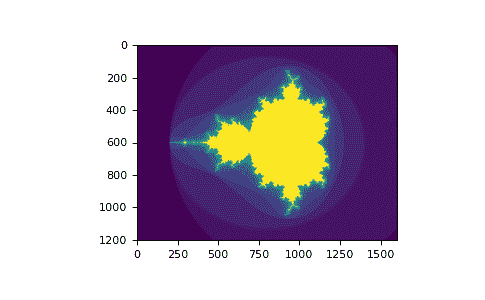
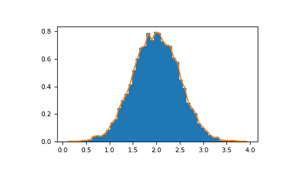

# NumPy 快速开始

> 原文：[`numpy.org/doc/1.26/user/quickstart.html`](https://numpy.org/doc/1.26/user/quickstart.html)

## 先决条件

你需要了解一点 Python。需要恢复记忆的话，参见[Python 教程](https://docs.python.org/tutorial/)。

要运行这些示例，除了 NumPy 外，你还需要安装`matplotlib`。

**学习者概况**

这是 NumPy 中数组的快速概述。它演示了如何表示和操作 n 维（\(n>=2\))数组。特别是，如果你不知道如何在 n 维数组上应用常见的函数（而不使用 for 循环），或者想理解关于 n 维数组的轴和形状属性，这篇文章可能会有所帮助。

**学习目标**

阅读完之后，你应该能够：

+   了解在 NumPy 中一维、二维和 n 维数组之间的区别；

+   了解如何在 n 维数组上应用一些线性代数操作，而不使用 for 循环；

+   了解 n 维数组的轴和形状属性。

## 基础知识

NumPy 的主要对象是同质的多维数组。它是一张元素表（通常是数字），全部是相同类型的，通过非负整数的元组索引。在 NumPy 中，维度被称为*轴*。

例如，三维空间中一个点的坐标的数组`[1, 2, 1]`有一个轴。该轴有 3 个元素，因此我们说它的长度是 3。在下面的例子中，数组有 2 个轴。第一个轴的长度为 2，第二个轴的长度为 3。

```py
[[1., 0., 0.],
 [0., 1., 2.]] 
```

NumPy 的数组类称为`ndarray`。它也被别名`array`所知。注意，`numpy.array`并不等同于标准 Python 库的`array.array`类，后者只处理一维数组并提供较少的功能。`ndarray`对象的更重要的属性有：

ndarray.ndim

数组的轴（维度）数量。

ndarray.shape

数组的维度。这是一个整数元组，指示每个维度上数组的大小。对于一个有*n*行和*m*列的矩阵，`shape`将是`(n,m)`。因此`shape`元组的长度即为轴的数量，即`ndim`。

ndarray.size

数组中元素的总个数。这等于`shape`元素的乘积。

ndarray.dtype

描述数组中元素类型的对象。可以使用标准的 Python 类型创建或指定 dtype。另外，NumPy 提供了自己的类型。`numpy.int32`、`numpy.int16`和`numpy.float64`是一些例子。

ndarray.itemsize

数组中每个元素的字节大小。例如，一个`float64`类型的元素数组的`itemsize`是 8（=64/8），而一个`complex32`类型的元素数组的`itemsize`是 4（=32/8）。它等同于`ndarray.dtype.itemsize`。

ndarray.data

包含数组实际元素的缓冲区。通常，我们不需要使用这个属性，因为我们将使用索引设施来访问数组中的元素。

### 例子

```py
>>> import numpy as np
>>> a = np.arange(15).reshape(3, 5)
>>> a
array([[ 0,  1,  2,  3,  4],
 [ 5,  6,  7,  8,  9],
 [10, 11, 12, 13, 14]])
>>> a.shape
(3, 5)
>>> a.ndim
2
>>> a.dtype.name
'int64'
>>> a.itemsize
8
>>> a.size
15
>>> type(a)
<class 'numpy.ndarray'>
>>> b = np.array([6, 7, 8])
>>> b
array([6, 7, 8])
>>> type(b)
<class 'numpy.ndarray'> 
```

### 数组创建

有几种创建数组的方式。

例如，您可以使用`array`函数从常规 Python 列表或元组创建数组。结果数组的类型是从序列中的元素的类型推断出来的。

```py
>>> import numpy as np
>>> a = np.array([2, 3, 4])
>>> a
array([2, 3, 4])
>>> a.dtype
dtype('int64')
>>> b = np.array([1.2, 3.5, 5.1])
>>> b.dtype
dtype('float64') 
```

经常出错的一个错误是调用`array`时提供多个参数，而不是提供单个序列作为参数。

```py
>>> a = np.array(1, 2, 3, 4)    # WRONG
Traceback (most recent call last):
  ...
TypeError: array() takes from 1 to 2 positional arguments but 4 were given
>>> a = np.array([1, 2, 3, 4])  # RIGHT 
```

`array`将序列的序列转换为二维数组，序列的序列的序列转换为三维数组，依此类推。

```py
>>> b = np.array([(1.5, 2, 3), (4, 5, 6)])
>>> b
array([[1.5, 2\. , 3\. ],
 [4\. , 5\. , 6\. ]]) 
```

数组的类型也可以在创建时明确指定：

```py
>>> c = np.array([[1, 2], [3, 4]], dtype=complex)
>>> c
array([[1.+0.j, 2.+0.j],
 [3.+0.j, 4.+0.j]]) 
```

通常，数组的元素最初是未知的，但其大小已知。因此，NumPy 提供了几个函数来创建带有初始占位内容的数组。这些函数最小化了增长数组的必要性，这是一项昂贵的操作。

函数`zeros`创建一个全是零的数组，函数`ones`创建一个全是一的数组，函数`empty`创建一个初始内容是随机的依赖于内存状态的数组。默认情况下，创建的数组的 dtype 是`float64`，但可以通过关键字参数`dtype`指定。

```py
>>> np.zeros((3, 4))
array([[0., 0., 0., 0.],
 [0., 0., 0., 0.],
 [0., 0., 0., 0.]])
>>> np.ones((2, 3, 4), dtype=np.int16)
array([[[1, 1, 1, 1],
 [1, 1, 1, 1],
 [1, 1, 1, 1]],

 [[1, 1, 1, 1],
 [1, 1, 1, 1],
 [1, 1, 1, 1]]], dtype=int16)
>>> np.empty((2, 3)) 
array([[3.73603959e-262, 6.02658058e-154, 6.55490914e-260],  # may vary
 [5.30498948e-313, 3.14673309e-307, 1.00000000e+000]]) 
```

要创建数字序列，NumPy 提供了`arange`函数，它类似于 Python 内置的`range`，但返回一个数组。

```py
>>> np.arange(10, 30, 5)
array([10, 15, 20, 25])
>>> np.arange(0, 2, 0.3)  # it accepts float arguments
array([0\. , 0.3, 0.6, 0.9, 1.2, 1.5, 1.8]) 
```

当`arange`与浮点参数一起使用时，由于有限的浮点精度，通常无法预测所得元素的数量。因此，通常最好使用函数`linspace`，该函数接受我们想要的元素数量作为参数，而不是步长：

```py
>>> from numpy import pi
>>> np.linspace(0, 2, 9)                   # 9 numbers from 0 to 2
array([0\.  , 0.25, 0.5 , 0.75, 1\.  , 1.25, 1.5 , 1.75, 2\.  ])
>>> x = np.linspace(0, 2 * pi, 100)        # useful to evaluate function at lots of points
>>> f = np.sin(x) 
```

参见

`array`, `zeros`, `zeros_like`, `ones`, `ones_like`, `empty`, `empty_like`, `arange`, `linspace`, *numpy.random.Generator.rand*, *numpy.random.Generator.randn*, `fromfunction`, `fromfile`

### 打印数组

当您打印一个数组时，NumPy 以类似嵌套列表的方式显示它，但布局如下：

+   最后一个轴从左到右打印，

+   倒数第二个从上到下打印，

+   其余部分也是从上到下打印的，每个切片之间用空行分隔。

一维数组被打印为行，二维数组被打印为矩阵，三维数组被打印为矩阵的列表。

```py
>>> a = np.arange(6)                    # 1d array
>>> print(a)
[0 1 2 3 4 5]
>>>
>>> b = np.arange(12).reshape(4, 3)     # 2d array
>>> print(b)
[[ 0  1  2]
 [ 3  4  5]
 [ 6  7  8]
 [ 9 10 11]]
>>>
>>> c = np.arange(24).reshape(2, 3, 4)  # 3d array
>>> print(c)
[[[ 0  1  2  3]
 [ 4  5  6  7]
 [ 8  9 10 11]]

 [[12 13 14 15]
 [16 17 18 19]
 [20 21 22 23]]] 
```

请参见下文以了解`reshape`的更多详细信息。

如果数组太大无法打印，NumPy 将自动跳过数组的中间部分，并只打印角落：

```py
>>> print(np.arange(10000))
[   0    1    2 ... 9997 9998 9999]
>>>
>>> print(np.arange(10000).reshape(100, 100))
[[   0    1    2 ...   97   98   99]
 [ 100  101  102 ...  197  198  199]
 [ 200  201  202 ...  297  298  299]
 ...
 [9700 9701 9702 ... 9797 9798 9799]
 [9800 9801 9802 ... 9897 9898 9899]
 [9900 9901 9902 ... 9997 9998 9999]] 
```

要禁用这种行为，并强制 NumPy 打印整个数组，你可以使用`set_printoptions`来更改打印选项。

```py
>>> np.set_printoptions(threshold=sys.maxsize)  # sys module should be imported 
```

### 基本操作

数组上的算术运算符是*逐元素*应用的。创建一个新数组，并用结果填充。

```py
>>> a = np.array([20, 30, 40, 50])
>>> b = np.arange(4)
>>> b
array([0, 1, 2, 3])
>>> c = a - b
>>> c
array([20, 29, 38, 47])
>>> b**2
array([0, 1, 4, 9])
>>> 10 * np.sin(a)
array([ 9.12945251, -9.88031624,  7.4511316 , -2.62374854])
>>> a < 35
array([ True,  True, False, False]) 
```

与许多矩阵语言不同，在 NumPy 数组中，乘法运算符`*`是逐元素操作的。矩阵乘积可以使用`@`运算符（在 Python >=3.5 中）或`dot`函数或方法来执行：

```py
>>> A = np.array([[1, 1],
...               [0, 1]])
>>> B = np.array([[2, 0],
...               [3, 4]])
>>> A * B     # elementwise product
array([[2, 0],
 [0, 4]])
>>> A @ B     # matrix product
array([[5, 4],
 [3, 4]])
>>> A.dot(B)  # another matrix product
array([[5, 4],
 [3, 4]]) 
```

一些操作，比如`+=`和`*=`，是就地修改现有数组而不是创建新数组。

```py
>>> rg = np.random.default_rng(1)  # create instance of default random number generator
>>> a = np.ones((2, 3), dtype=int)
>>> b = rg.random((2, 3))
>>> a *= 3
>>> a
array([[3, 3, 3],
 [3, 3, 3]])
>>> b += a
>>> b
array([[3.51182162, 3.9504637 , 3.14415961],
 [3.94864945, 3.31183145, 3.42332645]])
>>> a += b  # b is not automatically converted to integer type
Traceback (most recent call last):
  ...
numpy.core._exceptions._UFuncOutputCastingError: Cannot cast ufunc 'add' output from dtype('float64') to dtype('int64') with casting rule 'same_kind' 
```

当对不同类型的数组进行操作时，结果数组的类型对应于更一般或更精确的类型（这种行为称为向上转型）。

```py
>>> a = np.ones(3, dtype=np.int32)
>>> b = np.linspace(0, pi, 3)
>>> b.dtype.name
'float64'
>>> c = a + b
>>> c
array([1\.        , 2.57079633, 4.14159265])
>>> c.dtype.name
'float64'
>>> d = np.exp(c * 1j)
>>> d
array([ 0.54030231+0.84147098j, -0.84147098+0.54030231j,
 -0.54030231-0.84147098j])
>>> d.dtype.name
'complex128' 
```

许多一元操作，如计算数组中所有元素的和，都作为`ndarray`类的方法实现。

```py
>>> a = rg.random((2, 3))
>>> a
array([[0.82770259, 0.40919914, 0.54959369],
 [0.02755911, 0.75351311, 0.53814331]])
>>> a.sum()
3.1057109529998157
>>> a.min()
0.027559113243068367
>>> a.max()
0.8277025938204418 
```

默认情况下，这些操作将应用于数组，就像它是数字的列表一样，而不考虑其形状。然而，通过指定`axis`参数，你可以沿着指定的轴对数组应用操作：

```py
>>> b = np.arange(12).reshape(3, 4)
>>> b
array([[ 0,  1,  2,  3],
 [ 4,  5,  6,  7],
 [ 8,  9, 10, 11]])
>>>
>>> b.sum(axis=0)     # sum of each column
array([12, 15, 18, 21])
>>>
>>> b.min(axis=1)     # min of each row
array([0, 4, 8])
>>>
>>> b.cumsum(axis=1)  # cumulative sum along each row
array([[ 0,  1,  3,  6],
 [ 4,  9, 15, 22],
 [ 8, 17, 27, 38]]) 
```

### 通用函数

NumPy 提供了熟悉的数学函数，如 sin，cos 和 exp。在 NumPy 中，这些被称为“通用函数”（`ufunc`）。在 NumPy 中，这些函数对数组进行逐元素操作，产生一个数组作为输出。

```py
>>> B = np.arange(3)
>>> B
array([0, 1, 2])
>>> np.exp(B)
array([1\.        , 2.71828183, 7.3890561 ])
>>> np.sqrt(B)
array([0\.        , 1\.        , 1.41421356])
>>> C = np.array([2., -1., 4.])
>>> np.add(B, C)
array([2., 0., 6.]) 
```

请参见下文

`all`，`any`，`apply_along_axis`，`argmax`，`argmin`，`argsort`，`average`，`bincount`，`ceil`，`clip`，`conj`，`corrcoef`，`cov`，`cross`，`cumprod`，`cumsum`，`diff`，`dot`，`floor`，`inner`，`invert`，`lexsort`，`max`，`maximum`，`mean`，`median`，`min`，`minimum`，`nonzero`，`outer`，`prod`，[`re`](https://docs.python.org/3/library/re.html#module-re "(in Python v3.11)")，`round`，`sort`，`std`，`sum`，`trace`，`transpose`，`var`，`vdot`，`vectorize`，`where`

### 索引、切片和迭代

**一维**数组可以像[列表](https://docs.python.org/tutorial/introduction.html#lists)和其他 Python 序列一样进行索引、切片和迭代。

```py
>>> a = np.arange(10)**3
>>> a
array([  0,   1,   8,  27,  64, 125, 216, 343, 512, 729])
>>> a[2]
8
>>> a[2:5]
array([ 8, 27, 64])
>>> # equivalent to a[0:6:2] = 1000;
>>> # from start to position 6, exclusive, set every 2nd element to 1000
>>> a[:6:2] = 1000
>>> a
array([1000,    1, 1000,   27, 1000,  125,  216,  343,  512,  729])
>>> a[::-1]  # reversed a
array([ 729,  512,  343,  216,  125, 1000,   27, 1000,    1, 1000])
>>> for i in a:
...     print(i**(1 / 3.))
...
9.999999999999998  # may vary
1.0
9.999999999999998
3.0
9.999999999999998
4.999999999999999
5.999999999999999
6.999999999999999
7.999999999999999
8.999999999999998 
```

**多维**数组可以有每个轴的一个索引。这些索引以逗号分隔的元组给出：

```py
>>> def f(x, y):
...     return 10 * x + y
...
>>> b = np.fromfunction(f, (5, 4), dtype=int)
>>> b
array([[ 0,  1,  2,  3],
 [10, 11, 12, 13],
 [20, 21, 22, 23],
 [30, 31, 32, 33],
 [40, 41, 42, 43]])
>>> b[2, 3]
23
>>> b[0:5, 1]  # each row in the second column of b
array([ 1, 11, 21, 31, 41])
>>> b[:, 1]    # equivalent to the previous example
array([ 1, 11, 21, 31, 41])
>>> b[1:3, :]  # each column in the second and third row of b
array([[10, 11, 12, 13],
 [20, 21, 22, 23]]) 
```

如果提供的索引少于轴的数量，则缺失的索引被视为完整的切片`:`：

```py
>>> b[-1]   # the last row. Equivalent to b[-1, :]
array([40, 41, 42, 43]) 
```

方括号中的表达式`b[i]`被视为一个`i`，后面跟着需要表示剩余轴的冒号实例。NumPy 还允许您使用点表示法`b[i, ...]`来编写它。

**点**（`...`）表示需要生成完整索引元组的多少个冒号。例如，如果`x`是一个具有 5 个轴的数组，则

+   `x[1, 2, ...]` 相当于 `x[1, 2, :, :, :]`，

+   `x[..., 3]` 相当于 `x[:, :, :, :, 3]` 和

+   `x[4, ..., 5, :]` 相当于 `x[4, :, :, 5, :]`。

```py
>>> c = np.array([[[  0,  1,  2],  # a 3D array (two stacked 2D arrays)
...                [ 10, 12, 13]],
...               [[100, 101, 102],
...                [110, 112, 113]]])
>>> c.shape
(2, 2, 3)
>>> c[1, ...]  # same as c[1, :, :] or c[1]
array([[100, 101, 102],
 [110, 112, 113]])
>>> c[..., 2]  # same as c[:, :, 2]
array([[  2,  13],
 [102, 113]]) 
```

对多维数组进行迭代是针对第一个轴进行的：

```py
>>> for row in b:
...     print(row)
...
[0 1 2 3]
[10 11 12 13]
[20 21 22 23]
[30 31 32 33]
[40 41 42 43] 
```

但是，如果想对数组中的每个元素执行操作，可以使用`flat`属性，该属性是对数组的所有元素的[迭代器](https://docs.python.org/tutorial/classes.html#iterators)：

```py
>>> for element in b.flat:
...     print(element)
...
0
1
2
3
10
11
12
13
20
21
22
23
30
31
32
33
40
41
42
43 
```

参见

ndarrays 的索引、索引例程（参考）、`newaxis`、`ndenumerate`、`indices`  ## 形状操作

### 改变数组的形状

数组的形状由沿每个轴的元素数量确定：

```py
>>> a = np.floor(10 * rg.random((3, 4)))
>>> a
array([[3., 7., 3., 4.],
 [1., 4., 2., 2.],
 [7., 2., 4., 9.]])
>>> a.shape
(3, 4) 
```

数组的形状可以用各种命令进行更改。请注意，以下三个命令都会返回一个修改后的数组，但不会更改原始数组：

```py
>>> a.ravel()  # returns the array, flattened
array([3., 7., 3., 4., 1., 4., 2., 2., 7., 2., 4., 9.])
>>> a.reshape(6, 2)  # returns the array with a modified shape
array([[3., 7.],
 [3., 4.],
 [1., 4.],
 [2., 2.],
 [7., 2.],
 [4., 9.]])
>>> a.T  # returns the array, transposed
array([[3., 1., 7.],
 [7., 4., 2.],
 [3., 2., 4.],
 [4., 2., 9.]])
>>> a.T.shape
(4, 3)
>>> a.shape
(3, 4) 
```

`ravel`结果数组中的元素顺序通常是“C 风格”，即，最右边的索引“变化最快”，因此`a[0, 0]`之后的元素是`a[0, 1]`。如果数组被重塑为其他形状，那么数组再次被视为“C 风格”。NumPy 通常创建以这种顺序存储的数组，因此`ravel`通常不需要复制其参数，但如果数组是通过对另一个数组取片或使用不寻常的选项创建的，则可能需要复制。函数`ravel`和`reshape`还可以使用可选参数指示使用 FORTRAN 风格的数组，其中最左边的索引变化最快。

`reshape`函数返回其具有修改形状的参数，而`ndarray.resize`方法修改数组本身：

```py
>>> a
array([[3., 7., 3., 4.],
 [1., 4., 2., 2.],
 [7., 2., 4., 9.]])
>>> a.resize((2, 6))
>>> a
array([[3., 7., 3., 4., 1., 4.],
 [2., 2., 7., 2., 4., 9.]]) 
```

如果在重塑操作中给定维度为`-1`，则其他维度将自动计算：

```py
>>> a.reshape(3, -1)
array([[3., 7., 3., 4.],
 [1., 4., 2., 2.],
 [7., 2., 4., 9.]]) 
```

另请参阅

`ndarray.shape`, `reshape`, `resize`, `ravel`

### 将不同数组堆叠在一起

可以沿不同轴堆叠几个数组：

```py
>>> a = np.floor(10 * rg.random((2, 2)))
>>> a
array([[9., 7.],
 [5., 2.]])
>>> b = np.floor(10 * rg.random((2, 2)))
>>> b
array([[1., 9.],
 [5., 1.]])
>>> np.vstack((a, b))
array([[9., 7.],
 [5., 2.],
 [1., 9.],
 [5., 1.]])
>>> np.hstack((a, b))
array([[9., 7., 1., 9.],
 [5., 2., 5., 1.]]) 
```

函数 `column_stack` 将 1D 数组作为列堆叠到 2D 数组中。它仅对于 2D 数组等效于 `hstack`:

```py
>>> from numpy import newaxis
>>> np.column_stack((a, b))  # with 2D arrays
array([[9., 7., 1., 9.],
 [5., 2., 5., 1.]])
>>> a = np.array([4., 2.])
>>> b = np.array([3., 8.])
>>> np.column_stack((a, b))  # returns a 2D array
array([[4., 3.],
 [2., 8.]])
>>> np.hstack((a, b))        # the result is different
array([4., 2., 3., 8.])
>>> a[:, newaxis]  # view `a` as a 2D column vector
array([[4.],
 [2.]])
>>> np.column_stack((a[:, newaxis], b[:, newaxis]))
array([[4., 3.],
 [2., 8.]])
>>> np.hstack((a[:, newaxis], b[:, newaxis]))  # the result is the same
array([[4., 3.],
 [2., 8.]]) 
```

另一方面，函数 `row_stack` 对于任何输入数组都相当于 `vstack`。事实上，`row_stack` 是 `vstack` 的别名：

```py
>>> np.column_stack is np.hstack
False
>>> np.row_stack is np.vstack
True 
```

一般来说，对于超过两个维度的数组，`hstack` 沿第二个轴堆叠，`vstack` 沿第一个轴堆叠，而 `concatenate` 允许一个可选参数，用于指定连接应该发生的轴的编号。

**注意**

在复杂情况下，`r_` 和 `c_` 对于通过在一个轴上堆叠数字创建数组非常有用。它们允许使用范围文字 `:`。

```py
>>> np.r_[1:4, 0, 4]
array([1, 2, 3, 0, 4]) 
```

当用数组作为参数时，`r_` 和 `c_` 在默认行为上类似于 `vstack` 和 `hstack`，但允许一个可选参数，用于指定沿哪个轴进行连接。

另请参阅

`hstack`, `vstack`, `column_stack`, `concatenate`, `c_`, `r_`

### 将一个数组拆分为几个较小的数组

使用`hsplit`，您可以沿着数组的水平轴分割数组，可以通过指定要返回的等形数组的数量，也可以通过指定在哪些列之后进行分割：

```py
>>> a = np.floor(10 * rg.random((2, 12)))
>>> a
array([[6., 7., 6., 9., 0., 5., 4., 0., 6., 8., 5., 2.],
 [8., 5., 5., 7., 1., 8., 6., 7., 1., 8., 1., 0.]])
>>> # Split `a` into 3
>>> np.hsplit(a, 3)
[array([[6., 7., 6., 9.],
 [8., 5., 5., 7.]]), array([[0., 5., 4., 0.],
 [1., 8., 6., 7.]]), array([[6., 8., 5., 2.],
 [1., 8., 1., 0.]])]
>>> # Split `a` after the third and the fourth column
>>> np.hsplit(a, (3, 4))
[array([[6., 7., 6.],
 [8., 5., 5.]]), array([[9.],
 [7.]]), array([[0., 5., 4., 0., 6., 8., 5., 2.],
 [1., 8., 6., 7., 1., 8., 1., 0.]])] 
```

`vsplit` 沿垂直轴拆分，而 `array_split` 允许指定沿哪个轴进行拆分。## 复制和视图

在操作和操作数组时，有时会将它们的数据复制到新数组中，有时则不会。这常常会让初学者感到困惑。有三种情况：

### 没有任何复制

简单的赋值不会复制对象或其数据。

```py
>>> a = np.array([[ 0,  1,  2,  3],
...               [ 4,  5,  6,  7],
...               [ 8,  9, 10, 11]])
>>> b = a            # no new object is created
>>> b is a           # a and b are two names for the same ndarray object
True 
```

Python 以引用的方式传递可变对象，因此函数调用不会复制。

```py
>>> def f(x):
...     print(id(x))
...
>>> id(a)  # id is a unique identifier of an object 
148293216  # may vary
>>> f(a)   
148293216  # may vary 
```

### 查看或浅拷贝

不同的数组对象可以共享相同的数据。`view` 方法创建一个查看相同数据的新数组对象。

```py
>>> c = a.view()
>>> c is a
False
>>> c.base is a            # c is a view of the data owned by a
True
>>> c.flags.owndata
False
>>>
>>> c = c.reshape((2, 6))  # a's shape doesn't change
>>> a.shape
(3, 4)
>>> c[0, 4] = 1234         # a's data changes
>>> a
array([[   0,    1,    2,    3],
 [1234,    5,    6,    7],
 [   8,    9,   10,   11]]) 
```

对数组进行切片会返回它的视图：

```py
>>> s = a[:, 1:3]
>>> s[:] = 10  # s[:] is a view of s. Note the difference between s = 10 and s[:] = 10
>>> a
array([[   0,   10,   10,    3],
 [1234,   10,   10,    7],
 [   8,   10,   10,   11]]) 
```

### 深复制

`copy` 方法将数组及其数据完全复制一份。

```py
>>> d = a.copy()  # a new array object with new data is created
>>> d is a
False
>>> d.base is a  # d doesn't share anything with a
False
>>> d[0, 0] = 9999
>>> a
array([[   0,   10,   10,    3],
 [1234,   10,   10,    7],
 [   8,   10,   10,   11]]) 
```

有时在切片之后如果不再需要原始数组，则应调用 `copy`。例如，假设 `a` 是一个巨大的中间结果，而最终结果 `b` 只包含 `a` 的一小部分，则在使用切片构造 `b` 时应进行深复制：

```py
>>> a = np.arange(int(1e8))
>>> b = a[:100].copy()
>>> del a  # the memory of ``a`` can be released. 
```

如果使用`b = a[:100]`，则`a`由`b`引用，并且即使执行`del a`，`a`也会在内存中持续存在。

### 函数和方法概述

这是一些有用的 NumPy 函数和方法名称的列表，按类别排序。请参阅 例程 获取完整列表。

数组创建

`arange`, `array`, `copy`, `empty`, `empty_like`, `eye`, `fromfile`, `fromfunction`, `identity`, `linspace`, `logspace`, `mgrid`, `ogrid`, `ones`, `ones_like`, `r_`, `zeros`, `zeros_like`

转换

`ndarray.astype`, `atleast_1d`, `atleast_2d`, `atleast_3d`, `mat`

操作

`array_split`, `column_stack`, `concatenate`, `diagonal`, `dsplit`, `dstack`, `hsplit`, `hstack`, `ndarray.item`, `newaxis`, `ravel`, `repeat`, `reshape`, `resize`, `squeeze`, `swapaxes`, `take`, `transpose`, `vsplit`, `vstack`

问题

`all`, `any`, `nonzero`, `where`

排序

`argmax`, `argmin`, `argsort`, `max`, `min`, `ptp`, `searchsorted`, `sort`

操作

`choose`, `compress`, `cumprod`, `cumsum`, `inner`, `ndarray.fill`, `imag`, `prod`, `put`, `putmask`, `real`, `sum`

基本统计

`cov`, `mean`, `std`, `var`

基本线性代数

`cross`, `dot`, `outer`, `linalg.svd`, `vdot`

## 更不基础的

### 广播规则

广播允许通用函数以有意义的方式处理形状不完全相同的输入。

广播的第一规则是，如果所有输入数组的维度数不相同，那么“1”将被重复地前置到较小数组的形状上，直到所有数组具有相同的维度数。

广播的第二规则确保了沿着特定维度大小为 1 的数组的行为，就好像它们在该维度上的最大形状的数组的大小一样。假定“广播”数组沿着那个维度的数组元素的值是相同的。

应用广播规则后，所有数组的大小必须匹配。更多细节可以在 Broadcasting 中找到。

## 高级索引和索引技巧

NumPy 提供比普通 Python 序列更多的索引工具。除了之前我们所见到的按整数和切片进行索引之外，数组还可以通过整数数组和布尔数组进行索引。

### 使用索引数组进行索引

```py
>>> a = np.arange(12)**2  # the first 12 square numbers
>>> i = np.array([1, 1, 3, 8, 5])  # an array of indices
>>> a[i]  # the elements of `a` at the positions `i`
array([ 1,  1,  9, 64, 25])
>>>
>>> j = np.array([[3, 4], [9, 7]])  # a bidimensional array of indices
>>> a[j]  # the same shape as `j`
array([[ 9, 16],
 [81, 49]]) 
```

当索引数组`a`是多维的时，单个索引数组会引用`a`的第一个维度。以下示例通过使用调色板，将标签图像转换为彩色图像展示了这种行为。

```py
>>> palette = np.array([[0, 0, 0],         # black
...                     [255, 0, 0],       # red
...                     [0, 255, 0],       # green
...                     [0, 0, 255],       # blue
...                     [255, 255, 255]])  # white
>>> image = np.array([[0, 1, 2, 0],  # each value corresponds to a color in the palette
...                   [0, 3, 4, 0]])
>>> palette[image]  # the (2, 4, 3) color image
array([[[  0,   0,   0],
 [255,   0,   0],
 [  0, 255,   0],
 [  0,   0,   0]],

 [[  0,   0,   0],
 [  0,   0, 255],
 [255, 255, 255],
 [  0,   0,   0]]]) 
```

我们还可以为多个维度提供索引。每个维度的索引数组必须具有相同的形状。

```py
>>> a = np.arange(12).reshape(3, 4)
>>> a
array([[ 0,  1,  2,  3],
 [ 4,  5,  6,  7],
 [ 8,  9, 10, 11]])
>>> i = np.array([[0, 1],  # indices for the first dim of `a`
...               [1, 2]])
>>> j = np.array([[2, 1],  # indices for the second dim
...               [3, 3]])
>>>
>>> a[i, j]  # i and j must have equal shape
array([[ 2,  5],
 [ 7, 11]])
>>>
>>> a[i, 2]
array([[ 2,  6],
 [ 6, 10]])
>>>
>>> a[:, j]
array([[[ 2,  1],
 [ 3,  3]],

 [[ 6,  5],
 [ 7,  7]],

 [[10,  9],
 [11, 11]]]) 
```

在 Python 中，`arr[i, j]`与`arr[(i, j)]`完全相同 - 因此我们可以将`i`和`j`放入一个`tuple`，然后使用该索引。

```py
>>> l = (i, j)
>>> # equivalent to a[i, j]
>>> a[l]
array([[ 2,  5],
 [ 7, 11]]) 
```

然而，我们不能将`i`和`j`放入一个数组中来做到这一点，因为这个数组会被解释为索引`a`的第一个维度。

```py
>>> s = np.array([i, j])
>>> # not what we want
>>> a[s]
Traceback (most recent call last):
  File "<stdin>", line 1, in <module>
IndexError: index 3 is out of bounds for axis 0 with size 3
>>> # same as `a[i, j]`
>>> a[tuple(s)]
array([[ 2,  5],
 [ 7, 11]]) 
```

使用数组进行索引的另一个常见用途是搜索时序系列的最大值：

```py
>>> time = np.linspace(20, 145, 5)  # time scale
>>> data = np.sin(np.arange(20)).reshape(5, 4)  # 4 time-dependent series
>>> time
array([ 20\.  ,  51.25,  82.5 , 113.75, 145\.  ])
>>> data
array([[ 0\.        ,  0.84147098,  0.90929743,  0.14112001],
 [-0.7568025 , -0.95892427, -0.2794155 ,  0.6569866 ],
 [ 0.98935825,  0.41211849, -0.54402111, -0.99999021],
 [-0.53657292,  0.42016704,  0.99060736,  0.65028784],
 [-0.28790332, -0.96139749, -0.75098725,  0.14987721]])
>>> # index of the maxima for each series
>>> ind = data.argmax(axis=0)
>>> ind
array([2, 0, 3, 1])
>>> # times corresponding to the maxima
>>> time_max = time[ind]
>>>
>>> data_max = data[ind, range(data.shape[1])]  # => data[ind[0], 0], data[ind[1], 1]...
>>> time_max
array([ 82.5 ,  20\.  , 113.75,  51.25])
>>> data_max
array([0.98935825, 0.84147098, 0.99060736, 0.6569866 ])
>>> np.all(data_max == data.max(axis=0))
True 
```

你还可以使用数组作为目标进行编制索引：

```py
>>> a = np.arange(5)
>>> a
array([0, 1, 2, 3, 4])
>>> a[[1, 3, 4]] = 0
>>> a
array([0, 0, 2, 0, 0]) 
```

然而，当索引列表包含重复项时，赋值会多次进行，留下最后一个值：

```py
>>> a = np.arange(5)
>>> a[[0, 0, 2]] = [1, 2, 3]
>>> a
array([2, 1, 3, 3, 4]) 
```

虽然这是足够合理的，但要注意如果你想使用 Python 的`+=`构造，因为它可能不会如你所期望地运行：

```py
>>> a = np.arange(5)
>>> a[[0, 0, 2]] += 1
>>> a
array([1, 1, 3, 3, 4]) 
```

尽管索引列表中 0 出现了两次，但第 0 个元素只增加了一次。这是因为 Python 要求`a += 1`等价于`a = a + 1`。

### 使用布尔数组进行索引

当我们使用（整数）索引数组对数组进行索引时，我们提供要选择的索引列表。使用布尔索引时，方法不同；我们明确选择数组中的哪些项和哪些项不要。

对于布尔索引，最自然的想法之一是使用与原始数组*相同形状*的布尔数组：

```py
>>> a = np.arange(12).reshape(3, 4)
>>> b = a > 4
>>> b  # `b` is a boolean with `a`'s shape
array([[False, False, False, False],
 [False,  True,  True,  True],
 [ True,  True,  True,  True]])
>>> a[b]  # 1d array with the selected elements
array([ 5,  6,  7,  8,  9, 10, 11]) 
```

这个特性在赋值中非常有用：

```py
>>> a[b] = 0  # All elements of `a` higher than 4 become 0
>>> a
array([[0, 1, 2, 3],
 [4, 0, 0, 0],
 [0, 0, 0, 0]]) 
```

你可以查看下面的例子，看如何使用布尔索引生成[Mandelbrot 集合](https://en.wikipedia.org/wiki/Mandelbrot_set)的图像：

```py
>>> import numpy as np
>>> import matplotlib.pyplot as plt
>>> def mandelbrot(h, w, maxit=20, r=2):
...  """Returns an image of the Mandelbrot fractal of size (h,w)."""
...     x = np.linspace(-2.5, 1.5, 4*h+1)
...     y = np.linspace(-1.5, 1.5, 3*w+1)
...     A, B = np.meshgrid(x, y)
...     C = A + B*1j
...     z = np.zeros_like(C)
...     divtime = maxit + np.zeros(z.shape, dtype=int)
...
...     for i in range(maxit):
...         z = z**2 + C
...         diverge = abs(z) > r                    # who is diverging
...         div_now = diverge & (divtime == maxit)  # who is diverging now
...         divtime[div_now] = i                    # note when
...         z[diverge] = r                          # avoid diverging too much
...
...     return divtime
>>> plt.clf()
>>> plt.imshow(mandelbrot(400, 400)) 
```



使用布尔值进行索引的第二种方式更类似于整数索引；对数组的每个维度，我们提供一个选择我们想要的切片的 1D 布尔数组：

```py
>>> a = np.arange(12).reshape(3, 4)
>>> b1 = np.array([False, True, True])         # first dim selection
>>> b2 = np.array([True, False, True, False])  # second dim selection
>>>
>>> a[b1, :]                                   # selecting rows
array([[ 4,  5,  6,  7],
 [ 8,  9, 10, 11]])
>>>
>>> a[b1]                                      # same thing
array([[ 4,  5,  6,  7],
 [ 8,  9, 10, 11]])
>>>
>>> a[:, b2]                                   # selecting columns
array([[ 0,  2],
 [ 4,  6],
 [ 8, 10]])
>>>
>>> a[b1, b2]                                  # a weird thing to do
array([ 4, 10]) 
```

注意 1D 布尔数组的长度必须与您要切片的维度（或轴）的长度相一致。在前面的例子中，`b1`的长度为 3（`a`中的 *行* 数），而`b2`（长度为 4）适合于索引`a`的第 2 轴（列）。

### `ix_()` 函数

`ix_`函数可用于组合不同的向量，以便为每个 n-uplet（*n 元组*）的结果。例如，如果想要计算从向量 a、b 和 c 中取出的所有三元组的 a+b*c：

```py
>>> a = np.array([2, 3, 4, 5])
>>> b = np.array([8, 5, 4])
>>> c = np.array([5, 4, 6, 8, 3])
>>> ax, bx, cx = np.ix_(a, b, c)
>>> ax
array([[[2]],

 [[3]],

 [[4]],

 [[5]]])
>>> bx
array([[[8],
 [5],
 [4]]])
>>> cx
array([[[5, 4, 6, 8, 3]]])
>>> ax.shape, bx.shape, cx.shape
((4, 1, 1), (1, 3, 1), (1, 1, 5))
>>> result = ax + bx * cx
>>> result
array([[[42, 34, 50, 66, 26],
 [27, 22, 32, 42, 17],
 [22, 18, 26, 34, 14]],

 [[43, 35, 51, 67, 27],
 [28, 23, 33, 43, 18],
 [23, 19, 27, 35, 15]],

 [[44, 36, 52, 68, 28],
 [29, 24, 34, 44, 19],
 [24, 20, 28, 36, 16]],

 [[45, 37, 53, 69, 29],
 [30, 25, 35, 45, 20],
 [25, 21, 29, 37, 17]]])
>>> result[3, 2, 4]
17
>>> a[3] + b[2] * c[4]
17 
```

你也可以如下实现 reduce：

```py
>>> def ufunc_reduce(ufct, *vectors):
...    vs = np.ix_(*vectors)
...    r = ufct.identity
...    for v in vs:
...        r = ufct(r, v)
...    return r 
```

然后使用它：

```py
>>> ufunc_reduce(np.add, a, b, c)
array([[[15, 14, 16, 18, 13],
 [12, 11, 13, 15, 10],
 [11, 10, 12, 14,  9]],

 [[16, 15, 17, 19, 14],
 [13, 12, 14, 16, 11],
 [12, 11, 13, 15, 10]],

 [[17, 16, 18, 20, 15],
 [14, 13, 15, 17, 12],
 [13, 12, 14, 16, 11]],

 [[18, 17, 19, 21, 16],
 [15, 14, 16, 18, 13],
 [14, 13, 15, 17, 12]]]) 
```

与普通的 ufunc.reduce 相比，这个 reduce 版本的优势在于它利用广播规则来避免创建一个大小等于输出乘以向量数量的参数数组。

### 使用字符串进行索引

参见结构化数组。

## 技巧和提示

这里我们列出一些简短且有用的提示。

### “自动”重塑

要改变数组的维度，你可以省略其中一个尺寸，这样它将自动推导出来：

```py
>>> a = np.arange(30)
>>> b = a.reshape((2, -1, 3))  # -1 means "whatever is needed"
>>> b.shape
(2, 5, 3)
>>> b
array([[[ 0,  1,  2],
 [ 3,  4,  5],
 [ 6,  7,  8],
 [ 9, 10, 11],
 [12, 13, 14]],

 [[15, 16, 17],
 [18, 19, 20],
 [21, 22, 23],
 [24, 25, 26],
 [27, 28, 29]]]) 
```

### 向量堆叠

我们如何从一系列等大小的行向量构造一个二维数组？在 MATLAB 中，这相当容易：如果 `x` 和 `y` 是长度相同的两个向量，你只需要 `m=[x;y]`。在 NumPy 中，这可以通过函数 `column_stack`、`dstack`、`hstack` 和 `vstack` 来实现，具体取决于堆叠的维度。例如：

```py
>>> x = np.arange(0, 10, 2)
>>> y = np.arange(5)
>>> m = np.vstack([x, y])
>>> m
array([[0, 2, 4, 6, 8],
 [0, 1, 2, 3, 4]])
>>> xy = np.hstack([x, y])
>>> xy
array([0, 2, 4, 6, 8, 0, 1, 2, 3, 4]) 
```

那些超过两个维度的函数背后的逻辑可能会有些奇怪。

也请参见

NumPy 适用于 MATLAB 用户

### 直方图

应用于数组的 NumPy `histogram` 函数返回一对向量：数组的直方图和一个箱边的向量。注意：`matplotlib` 也有一个构建直方图的函数（称为 `hist`，类似于 Matlab），它与 NumPy 中的函数不同。主要区别在于 `pylab.hist` 会自动绘制直方图，而 `numpy.histogram` 只会生成数据。

```py
>>> import numpy as np
>>> rg = np.random.default_rng(1)
>>> import matplotlib.pyplot as plt
>>> # Build a vector of 10000 normal deviates with variance 0.5² and mean 2
>>> mu, sigma = 2, 0.5
>>> v = rg.normal(mu, sigma, 10000)
>>> # Plot a normalized histogram with 50 bins
>>> plt.hist(v, bins=50, density=True)       # matplotlib version (plot)
(array...)
>>> # Compute the histogram with numpy and then plot it
>>> (n, bins) = np.histogram(v, bins=50, density=True)  # NumPy version (no plot)
>>> plt.plot(.5 * (bins[1:] + bins[:-1]), n) 
```



使用 Matplotlib >=3.4，你也可以使用 `plt.stairs(n, bins)`。

## 进一步阅读

+   [Python 教程](https://docs.python.org/tutorial/)

+   NumPy 参考手册

+   [SciPy 教程](https://docs.scipy.org/doc/scipy/tutorial/index.html)

+   [SciPy 讲义](https://scipy-lectures.org)

+   一个[matlab、R、IDL、NumPy/SciPy 字典](http://mathesaurus.sf.net/)

+   [SVD 教程](https://numpy.org/numpy-tutorials/content/tutorial-svd.html "(在 NumPy 教程中)")

## 先决条件

你需要了解一些 Python。需要复习的话，请参见[Python 教程](https://docs.python.org/tutorial/)。

要运行示例，除了 NumPy 外，你还需要安装 `matplotlib`。

**学习者档案**

这是 NumPy 中数组的快速概述。它演示了如何表示和操作 n 维（\(n>=2\))）数组。特别是，如果你不知道如何将常见函数应用于 n 维数组（不使用 for 循环），或者如果你想了解 n 维数组的轴和形状属性，这篇文章可能会有所帮助。

**学习目标**

阅读后，你应该能够：

+   了解 NumPy 中一维、二维和 n 维数组之间的区别；

+   了解如何将一些线性代数操作应用于 n 维数组，而不使用 for 循环；

+   了解 n 维数组的轴和形状属性。

## 基础知识

NumPy 的主要对象是同构的多维数组。它是一个元素表（通常是数字），所有元素的类型相同，由非负整数的元组索引。在 NumPy 中，维度称为 *轴*。

例如，三维空间中一点的坐标数组 `[1, 2, 1]` 具有一个轴。该轴中有 3 个元素，因此我们说它的长度为 3。在下面的示例中，数组有 2 个轴。第一个轴长度为 2，第二个轴长度为 3。

```py
[[1., 0., 0.],
 [0., 1., 2.]] 
```

NumPy 的数组类称为 `ndarray`。它也以别名 `array` 而闻名。注意 `numpy.array` 不同于标准 Python 库中的类 `array.array`，后者只处理一维数组并提供较少的功能。`ndarray` 对象的更重要的属性有：

ndarray.ndim

数组的轴数（维数）。

ndarray.shape

数组的维度。这是一个整数元组，指示每个维度中数组的大小。对于具有 *n* 行和 *m* 列的矩阵，`shape` 将是 `(n,m)`。因此，`shape` 元组的长度是轴数 `ndim`。

ndarray.size

数组的元素总数。这等于 `shape` 元素的乘积。

ndarray.dtype

描述数组中元素类型的对象。可以使用标准的 Python 类型创建或指定 dtype。此外，NumPy 还提供了自己的类型。numpy.int32、numpy.int16 和 numpy.float64 是一些示例。

ndarray.itemsize

数组中每个元素的字节大小。例如，类型为 `float64` 的元素数组的 `itemsize` 为 8（=64/8），而类型为 `complex32` 的元素数组的 `itemsize` 为 4（=32/8）。它相当于 `ndarray.dtype.itemsize`。

ndarray.data

包含数组实际元素的缓冲区。通常，我们不需要使用此属性，因为我们将使用索引功能访问数组中的元素。

### 一个例子

```py
>>> import numpy as np
>>> a = np.arange(15).reshape(3, 5)
>>> a
array([[ 0,  1,  2,  3,  4],
 [ 5,  6,  7,  8,  9],
 [10, 11, 12, 13, 14]])
>>> a.shape
(3, 5)
>>> a.ndim
2
>>> a.dtype.name
'int64'
>>> a.itemsize
8
>>> a.size
15
>>> type(a)
<class 'numpy.ndarray'>
>>> b = np.array([6, 7, 8])
>>> b
array([6, 7, 8])
>>> type(b)
<class 'numpy.ndarray'> 
```

### 数组创建

有几种创建数组的方法。

例如，可以使用 `array` 函数从常规的 Python 列表或元组创建数组。结果数组的类型是从序列中元素的类型推断出来的。

```py
>>> import numpy as np
>>> a = np.array([2, 3, 4])
>>> a
array([2, 3, 4])
>>> a.dtype
dtype('int64')
>>> b = np.array([1.2, 3.5, 5.1])
>>> b.dtype
dtype('float64') 
```

经常出现的错误是调用 `array` 时提供多个参数，而不是提供一个序列作为参数。

```py
>>> a = np.array(1, 2, 3, 4)    # WRONG
Traceback (most recent call last):
  ...
TypeError: array() takes from 1 to 2 positional arguments but 4 were given
>>> a = np.array([1, 2, 3, 4])  # RIGHT 
```

`array` 将序列序列转换为二维数组，序列序列序列转换为三维数组，依此类推。

```py
>>> b = np.array([(1.5, 2, 3), (4, 5, 6)])
>>> b
array([[1.5, 2\. , 3\. ],
 [4\. , 5\. , 6\. ]]) 
```

数组的类型也可以在创建时明确指定：

```py
>>> c = np.array([[1, 2], [3, 4]], dtype=complex)
>>> c
array([[1.+0.j, 2.+0.j],
 [3.+0.j, 4.+0.j]]) 
```

通常，数组的元素最初是未知的，但其大小已知。因此，NumPy 提供了几个函数来创建带有初始占位符内容的数组。这些函数最小化了增长数组的必要性，这是一项昂贵的操作。

函数 `zeros` 创建一个全为零的数组，函数 `ones` 创建一个全为一的数组，函数 `empty` 创建一个初始内容是随机的数组，取决于内存状态。默认情况下，创建的数组的 dtype 是 `float64`，但可以通过关键字参数 `dtype` 指定。

```py
>>> np.zeros((3, 4))
array([[0., 0., 0., 0.],
 [0., 0., 0., 0.],
 [0., 0., 0., 0.]])
>>> np.ones((2, 3, 4), dtype=np.int16)
array([[[1, 1, 1, 1],
 [1, 1, 1, 1],
 [1, 1, 1, 1]],

 [[1, 1, 1, 1],
 [1, 1, 1, 1],
 [1, 1, 1, 1]]], dtype=int16)
>>> np.empty((2, 3)) 
array([[3.73603959e-262, 6.02658058e-154, 6.55490914e-260],  # may vary
 [5.30498948e-313, 3.14673309e-307, 1.00000000e+000]]) 
```

要创建数字序列，NumPy 提供了`arange`函数，它类似于 Python 内置的`range`，但返回一个数组。

```py
>>> np.arange(10, 30, 5)
array([10, 15, 20, 25])
>>> np.arange(0, 2, 0.3)  # it accepts float arguments
array([0\. , 0.3, 0.6, 0.9, 1.2, 1.5, 1.8]) 
```

当`arange`与浮点参数一起使用时，通常无法预测获得的元素数量，这是由于有限的浮点精度。因此，通常最好使用函数`linspace`，它接收我们想要的元素数量作为参数，而不是步长：

```py
>>> from numpy import pi
>>> np.linspace(0, 2, 9)                   # 9 numbers from 0 to 2
array([0\.  , 0.25, 0.5 , 0.75, 1\.  , 1.25, 1.5 , 1.75, 2\.  ])
>>> x = np.linspace(0, 2 * pi, 100)        # useful to evaluate function at lots of points
>>> f = np.sin(x) 
```

另请参阅

`array`, `zeros`, `zeros_like`, `ones`, `ones_like`, `empty`, `empty_like`, `arange`, `linspace`, *numpy.random.Generator.rand*, *numpy.random.Generator.randn*, `fromfunction`, `fromfile`

### 打印数组

当您打印一个数组时，NumPy 会以嵌套列表的方式显示，但布局如下：

+   最后一轴从左到右打印，

+   倒数第二个从上到下打印，

+   其余部分也会从上到下打印，每个切片之间由一个空行分隔。

一维数组然后按行打印，二维数组按矩阵打印，三维数组按矩阵列表打印。

```py
>>> a = np.arange(6)                    # 1d array
>>> print(a)
[0 1 2 3 4 5]
>>>
>>> b = np.arange(12).reshape(4, 3)     # 2d array
>>> print(b)
[[ 0  1  2]
 [ 3  4  5]
 [ 6  7  8]
 [ 9 10 11]]
>>>
>>> c = np.arange(24).reshape(2, 3, 4)  # 3d array
>>> print(c)
[[[ 0  1  2  3]
 [ 4  5  6  7]
 [ 8  9 10 11]]

 [[12 13 14 15]
 [16 17 18 19]
 [20 21 22 23]]] 
```

请看下文以获取有关`reshape`的更多详细信息。

如果数组太大无法打印，NumPy 会自动跳过数组的中心部分，只打印角落部分：

```py
>>> print(np.arange(10000))
[   0    1    2 ... 9997 9998 9999]
>>>
>>> print(np.arange(10000).reshape(100, 100))
[[   0    1    2 ...   97   98   99]
 [ 100  101  102 ...  197  198  199]
 [ 200  201  202 ...  297  298  299]
 ...
 [9700 9701 9702 ... 9797 9798 9799]
 [9800 9801 9802 ... 9897 9898 9899]
 [9900 9901 9902 ... 9997 9998 9999]] 
```

要禁用此行为并强制 NumPy 打印整个数组，您可以使用`set_printoptions`更改打印选项。

```py
>>> np.set_printoptions(threshold=sys.maxsize)  # sys module should be imported 
```

### 基本运算

数组上的算术运算符以*逐元素*方式应用。将创建一个新数组并填充结果。

```py
>>> a = np.array([20, 30, 40, 50])
>>> b = np.arange(4)
>>> b
array([0, 1, 2, 3])
>>> c = a - b
>>> c
array([20, 29, 38, 47])
>>> b**2
array([0, 1, 4, 9])
>>> 10 * np.sin(a)
array([ 9.12945251, -9.88031624,  7.4511316 , -2.62374854])
>>> a < 35
array([ True,  True, False, False]) 
```

与许多矩阵语言不同，在 NumPy 数组中，乘积运算符`*`以元素方式操作。可以使用`@`运算符（在 python >=3.5 中）或`dot`函数或方法执行矩阵乘积：

```py
>>> A = np.array([[1, 1],
...               [0, 1]])
>>> B = np.array([[2, 0],
...               [3, 4]])
>>> A * B     # elementwise product
array([[2, 0],
 [0, 4]])
>>> A @ B     # matrix product
array([[5, 4],
 [3, 4]])
>>> A.dot(B)  # another matrix product
array([[5, 4],
 [3, 4]]) 
```

一些操作，例如`+=`和`*=`，会就地修改现有数组，而不是创建新数组。

```py
>>> rg = np.random.default_rng(1)  # create instance of default random number generator
>>> a = np.ones((2, 3), dtype=int)
>>> b = rg.random((2, 3))
>>> a *= 3
>>> a
array([[3, 3, 3],
 [3, 3, 3]])
>>> b += a
>>> b
array([[3.51182162, 3.9504637 , 3.14415961],
 [3.94864945, 3.31183145, 3.42332645]])
>>> a += b  # b is not automatically converted to integer type
Traceback (most recent call last):
  ...
numpy.core._exceptions._UFuncOutputCastingError: Cannot cast ufunc 'add' output from dtype('float64') to dtype('int64') with casting rule 'same_kind' 
```

在操作不同类型的数组时，结果数组的类型对应于更一般或更精确的类型（这种行为称为向上转型）。

```py
>>> a = np.ones(3, dtype=np.int32)
>>> b = np.linspace(0, pi, 3)
>>> b.dtype.name
'float64'
>>> c = a + b
>>> c
array([1\.        , 2.57079633, 4.14159265])
>>> c.dtype.name
'float64'
>>> d = np.exp(c * 1j)
>>> d
array([ 0.54030231+0.84147098j, -0.84147098+0.54030231j,
 -0.54030231-0.84147098j])
>>> d.dtype.name
'complex128' 
```

许多一元操作，如计算数组中所有元素的总和，都实现为`ndarray`类的方法。

```py
>>> a = rg.random((2, 3))
>>> a
array([[0.82770259, 0.40919914, 0.54959369],
 [0.02755911, 0.75351311, 0.53814331]])
>>> a.sum()
3.1057109529998157
>>> a.min()
0.027559113243068367
>>> a.max()
0.8277025938204418 
```

默认情况下，这些操作将应用于数组，就好像它是一个数字列表，而不考虑其形状。然而，通过指定`axis`参数，你可以沿着数组的指定轴应用操作：

```py
>>> b = np.arange(12).reshape(3, 4)
>>> b
array([[ 0,  1,  2,  3],
 [ 4,  5,  6,  7],
 [ 8,  9, 10, 11]])
>>>
>>> b.sum(axis=0)     # sum of each column
array([12, 15, 18, 21])
>>>
>>> b.min(axis=1)     # min of each row
array([0, 4, 8])
>>>
>>> b.cumsum(axis=1)  # cumulative sum along each row
array([[ 0,  1,  3,  6],
 [ 4,  9, 15, 22],
 [ 8, 17, 27, 38]]) 
```

### 通用函数

NumPy 提供了熟悉的数学函数，如 sin、cos 和 exp。在 NumPy 中，这些被称为“通用函数”（`ufunc`）。在 NumPy 中，这些函数对数组进行逐元素操作，产生一个数组作为输出。

```py
>>> B = np.arange(3)
>>> B
array([0, 1, 2])
>>> np.exp(B)
array([1\.        , 2.71828183, 7.3890561 ])
>>> np.sqrt(B)
array([0\.        , 1\.        , 1.41421356])
>>> C = np.array([2., -1., 4.])
>>> np.add(B, C)
array([2., 0., 6.]) 
```

另见

`all`, `any`, `apply_along_axis`, `argmax`, `argmin`, `argsort`, `average`, `bincount`, `ceil`, `clip`, `conj`, `corrcoef`, `cov`, `cross`, `cumprod`, `cumsum`, `diff`, `dot`, `floor`, `inner`, `invert`, `lexsort`, `max`, `maximum`, `mean`, `median`, `min`, `minimum`, `nonzero`, `outer`, `prod`, [`re`](https://docs.python.org/3/library/re.html#module-re "(in Python v3.11)"), `round`, `sort`, `std`, `sum`, `trace`, `transpose`, `var`, `vdot`, `vectorize`, `where`

### 索引、切片和迭代

**一维**数组可以像[列表](https://docs.python.org/tutorial/introduction.html#lists)和其他 Python 序列一样进行索引、切片和迭代。

```py
>>> a = np.arange(10)**3
>>> a
array([  0,   1,   8,  27,  64, 125, 216, 343, 512, 729])
>>> a[2]
8
>>> a[2:5]
array([ 8, 27, 64])
>>> # equivalent to a[0:6:2] = 1000;
>>> # from start to position 6, exclusive, set every 2nd element to 1000
>>> a[:6:2] = 1000
>>> a
array([1000,    1, 1000,   27, 1000,  125,  216,  343,  512,  729])
>>> a[::-1]  # reversed a
array([ 729,  512,  343,  216,  125, 1000,   27, 1000,    1, 1000])
>>> for i in a:
...     print(i**(1 / 3.))
...
9.999999999999998  # may vary
1.0
9.999999999999998
3.0
9.999999999999998
4.999999999999999
5.999999999999999
6.999999999999999
7.999999999999999
8.999999999999998 
```

**多维**数组每个轴可以有一个索引。这些索引以逗号分隔的元组形式给出：

```py
>>> def f(x, y):
...     return 10 * x + y
...
>>> b = np.fromfunction(f, (5, 4), dtype=int)
>>> b
array([[ 0,  1,  2,  3],
 [10, 11, 12, 13],
 [20, 21, 22, 23],
 [30, 31, 32, 33],
 [40, 41, 42, 43]])
>>> b[2, 3]
23
>>> b[0:5, 1]  # each row in the second column of b
array([ 1, 11, 21, 31, 41])
>>> b[:, 1]    # equivalent to the previous example
array([ 1, 11, 21, 31, 41])
>>> b[1:3, :]  # each column in the second and third row of b
array([[10, 11, 12, 13],
 [20, 21, 22, 23]]) 
```

当提供的索引少于轴的数量时，缺少的索引被视为完整的切片`:`

```py
>>> b[-1]   # the last row. Equivalent to b[-1, :]
array([40, 41, 42, 43]) 
```

在`b[i]`方括号中的表达式被视为`i`，后面跟着需要表示剩余轴的`：`的实例数。NumPy 还允许您使用点`...`来编写这个表达式，即`b[i, ...]`。

**点** (`...`) 表示需要产生一个完整索引元组所需的冒号数量。例如，如果`x`是一个具有 5 个轴的数组，则

+   `x[1, 2, ...]`等同于`x[1, 2, :, :, :]`,

+   `x[..., 3]`转换为`x[:, :, :, :, 3]`，以及

+   `x[4, ..., 5, :]`转换为`x[4, :, :, 5, :]`。

```py
>>> c = np.array([[[  0,  1,  2],  # a 3D array (two stacked 2D arrays)
...                [ 10, 12, 13]],
...               [[100, 101, 102],
...                [110, 112, 113]]])
>>> c.shape
(2, 2, 3)
>>> c[1, ...]  # same as c[1, :, :] or c[1]
array([[100, 101, 102],
 [110, 112, 113]])
>>> c[..., 2]  # same as c[:, :, 2]
array([[  2,  13],
 [102, 113]]) 
```

对多维数组的**迭代**是针对第一个轴完成的：

```py
>>> for row in b:
...     print(row)
...
[0 1 2 3]
[10 11 12 13]
[20 21 22 23]
[30 31 32 33]
[40 41 42 43] 
```

然而，如果想对数组中的每个元素执行操作，可以使用`flat`属性，它是数组所有元素的[迭代器](https://docs.python.org/tutorial/classes.html#iterators)：

```py
>>> for element in b.flat:
...     print(element)
...
0
1
2
3
10
11
12
13
20
21
22
23
30
31
32
33
40
41
42
43 
```

另请参见

ndarrays 的索引, 索引例程 (参考), `newaxis`, `ndenumerate`, `indices`

### 一个例子

```py
>>> import numpy as np
>>> a = np.arange(15).reshape(3, 5)
>>> a
array([[ 0,  1,  2,  3,  4],
 [ 5,  6,  7,  8,  9],
 [10, 11, 12, 13, 14]])
>>> a.shape
(3, 5)
>>> a.ndim
2
>>> a.dtype.name
'int64'
>>> a.itemsize
8
>>> a.size
15
>>> type(a)
<class 'numpy.ndarray'>
>>> b = np.array([6, 7, 8])
>>> b
array([6, 7, 8])
>>> type(b)
<class 'numpy.ndarray'> 
```

### 数组创建

有几种创建数组的方法。

例如，您可以使用`array`函数从常规 Python 列表或元组创建数组。结果数组的类型是从序列中元素的类型推断出来的。

```py
>>> import numpy as np
>>> a = np.array([2, 3, 4])
>>> a
array([2, 3, 4])
>>> a.dtype
dtype('int64')
>>> b = np.array([1.2, 3.5, 5.1])
>>> b.dtype
dtype('float64') 
```

一个常见错误是使用多个参数调用`array`，而不是提供一个序列作为参数。

```py
>>> a = np.array(1, 2, 3, 4)    # WRONG
Traceback (most recent call last):
  ...
TypeError: array() takes from 1 to 2 positional arguments but 4 were given
>>> a = np.array([1, 2, 3, 4])  # RIGHT 
```

`array`将序列转换为二维数组，序列的序列转换为三维数组，依此类推。

```py
>>> b = np.array([(1.5, 2, 3), (4, 5, 6)])
>>> b
array([[1.5, 2\. , 3\. ],
 [4\. , 5\. , 6\. ]]) 
```

数组的类型也可以在创建时显式指定：

```py
>>> c = np.array([[1, 2], [3, 4]], dtype=complex)
>>> c
array([[1.+0.j, 2.+0.j],
 [3.+0.j, 4.+0.j]]) 
```

通常，数组的元素最初是未知的，但其大小是已知的。因此，NumPy 提供了几个函数来创建具有初始占位内容的数组。这减少了增长数组的必要性，这是一个昂贵的操作。

函数`zeros`创建一个全零数组，函数`ones`创建一个全一数组，函数`empty`创建一个其初始内容是随机的并且取决于内存状态的数组。默认情况下，创建的数组的 dtype 是`float64`，但可以通过关键字参数`dtype`进行指定。

```py
>>> np.zeros((3, 4))
array([[0., 0., 0., 0.],
 [0., 0., 0., 0.],
 [0., 0., 0., 0.]])
>>> np.ones((2, 3, 4), dtype=np.int16)
array([[[1, 1, 1, 1],
 [1, 1, 1, 1],
 [1, 1, 1, 1]],

 [[1, 1, 1, 1],
 [1, 1, 1, 1],
 [1, 1, 1, 1]]], dtype=int16)
>>> np.empty((2, 3)) 
array([[3.73603959e-262, 6.02658058e-154, 6.55490914e-260],  # may vary
 [5.30498948e-313, 3.14673309e-307, 1.00000000e+000]]) 
```

为了创建数字序列，NumPy 提供了类似于 Python 内置的`range`的`arange`函数，但它返回一个数组。

```py
>>> np.arange(10, 30, 5)
array([10, 15, 20, 25])
>>> np.arange(0, 2, 0.3)  # it accepts float arguments
array([0\. , 0.3, 0.6, 0.9, 1.2, 1.5, 1.8]) 
```

当`arange`与浮点数参数一起使用时，通常无法预测获得的元素数量，这是由于有限浮点精度。因此，通常最好使用接收我们想要的元素数量作为参数而不是步长的函数`linspace`：

```py
>>> from numpy import pi
>>> np.linspace(0, 2, 9)                   # 9 numbers from 0 to 2
array([0\.  , 0.25, 0.5 , 0.75, 1\.  , 1.25, 1.5 , 1.75, 2\.  ])
>>> x = np.linspace(0, 2 * pi, 100)        # useful to evaluate function at lots of points
>>> f = np.sin(x) 
```

另请参阅

`array`, `zeros`, `zeros_like`, `ones`, `ones_like`, `empty`, `empty_like`, `arange`, `linspace`, *numpy.random.Generator.rand*, *numpy.random.Generator.randn*, `fromfunction`, `fromfile`

### 打印数组

当打印数组时，NumPy 以类似嵌套列表的方式显示它，但布局如下：

+   最后一个轴从左到右打印，

+   倒数第二个从上到下打印，

+   剩余部分也从上到下打印，每个切片与下一个切片之间由一个空行分隔。

一维数组被打印为行，二维数组被打印为矩阵，三维数组被打印为矩阵的列表。

```py
>>> a = np.arange(6)                    # 1d array
>>> print(a)
[0 1 2 3 4 5]
>>>
>>> b = np.arange(12).reshape(4, 3)     # 2d array
>>> print(b)
[[ 0  1  2]
 [ 3  4  5]
 [ 6  7  8]
 [ 9 10 11]]
>>>
>>> c = np.arange(24).reshape(2, 3, 4)  # 3d array
>>> print(c)
[[[ 0  1  2  3]
 [ 4  5  6  7]
 [ 8  9 10 11]]

 [[12 13 14 15]
 [16 17 18 19]
 [20 21 22 23]]] 
```

请参见下面以获取有关`reshape`的更多详细信息。

如果数组太大而无法打印，NumPy 会自动跳过数组的中间部分，仅打印角落：

```py
>>> print(np.arange(10000))
[   0    1    2 ... 9997 9998 9999]
>>>
>>> print(np.arange(10000).reshape(100, 100))
[[   0    1    2 ...   97   98   99]
 [ 100  101  102 ...  197  198  199]
 [ 200  201  202 ...  297  298  299]
 ...
 [9700 9701 9702 ... 9797 9798 9799]
 [9800 9801 9802 ... 9897 9898 9899]
 [9900 9901 9902 ... 9997 9998 9999]] 
```

要禁用此行为并强制 NumPy 打印整个数组，可以使用`set_printoptions`更改打印选项。

```py
>>> np.set_printoptions(threshold=sys.maxsize)  # sys module should be imported 
```

### 基本操作

数组上的算术运算*逐元素*应用。创建一个新数组并用结果填充。

```py
>>> a = np.array([20, 30, 40, 50])
>>> b = np.arange(4)
>>> b
array([0, 1, 2, 3])
>>> c = a - b
>>> c
array([20, 29, 38, 47])
>>> b**2
array([0, 1, 4, 9])
>>> 10 * np.sin(a)
array([ 9.12945251, -9.88031624,  7.4511316 , -2.62374854])
>>> a < 35
array([ True,  True, False, False]) 
```

与许多矩阵语言不同，在 NumPy 数组中，乘积运算符`*`是按元素操作的。可以使用`@`运算符（在 python >=3.5 中）或`dot`函数或方法执行矩阵乘积：

```py
>>> A = np.array([[1, 1],
...               [0, 1]])
>>> B = np.array([[2, 0],
...               [3, 4]])
>>> A * B     # elementwise product
array([[2, 0],
 [0, 4]])
>>> A @ B     # matrix product
array([[5, 4],
 [3, 4]])
>>> A.dot(B)  # another matrix product
array([[5, 4],
 [3, 4]]) 
```

一些操作，比如`+=`和`*=`，是就地修改现有数组而不是创建新数组。

```py
>>> rg = np.random.default_rng(1)  # create instance of default random number generator
>>> a = np.ones((2, 3), dtype=int)
>>> b = rg.random((2, 3))
>>> a *= 3
>>> a
array([[3, 3, 3],
 [3, 3, 3]])
>>> b += a
>>> b
array([[3.51182162, 3.9504637 , 3.14415961],
 [3.94864945, 3.31183145, 3.42332645]])
>>> a += b  # b is not automatically converted to integer type
Traceback (most recent call last):
  ...
numpy.core._exceptions._UFuncOutputCastingError: Cannot cast ufunc 'add' output from dtype('float64') to dtype('int64') with casting rule 'same_kind' 
```

在操作不同类型的数组时，结果数组的类型对应于更一般或更精确的类型（这种行为称为向上转型）。

```py
>>> a = np.ones(3, dtype=np.int32)
>>> b = np.linspace(0, pi, 3)
>>> b.dtype.name
'float64'
>>> c = a + b
>>> c
array([1\.        , 2.57079633, 4.14159265])
>>> c.dtype.name
'float64'
>>> d = np.exp(c * 1j)
>>> d
array([ 0.54030231+0.84147098j, -0.84147098+0.54030231j,
 -0.54030231-0.84147098j])
>>> d.dtype.name
'complex128' 
```

许多一元操作，比如计算数组中所有元素的和，都作为`ndarray`类的方法实现。

```py
>>> a = rg.random((2, 3))
>>> a
array([[0.82770259, 0.40919914, 0.54959369],
 [0.02755911, 0.75351311, 0.53814331]])
>>> a.sum()
3.1057109529998157
>>> a.min()
0.027559113243068367
>>> a.max()
0.8277025938204418 
```

默认情况下，这些操作会将数组视为数字列表进行，而不考虑其形状。但是，通过指定`axis`参数，您可以沿着数组的指定轴应用操作：

```py
>>> b = np.arange(12).reshape(3, 4)
>>> b
array([[ 0,  1,  2,  3],
 [ 4,  5,  6,  7],
 [ 8,  9, 10, 11]])
>>>
>>> b.sum(axis=0)     # sum of each column
array([12, 15, 18, 21])
>>>
>>> b.min(axis=1)     # min of each row
array([0, 4, 8])
>>>
>>> b.cumsum(axis=1)  # cumulative sum along each row
array([[ 0,  1,  3,  6],
 [ 4,  9, 15, 22],
 [ 8, 17, 27, 38]]) 
```

### 通用函数

NumPy 提供了一些熟悉的数学函数，如 sin、cos 和 exp。在 NumPy 中，这些被称为“通用函数”（`ufunc`）。在 NumPy 中，这些函数对数组进行逐元素操作，并产生一个数组作为输出。

```py
>>> B = np.arange(3)
>>> B
array([0, 1, 2])
>>> np.exp(B)
array([1\.        , 2.71828183, 7.3890561 ])
>>> np.sqrt(B)
array([0\.        , 1\.        , 1.41421356])
>>> C = np.array([2., -1., 4.])
>>> np.add(B, C)
array([2., 0., 6.]) 
```

另见

`all`, `any`, `apply_along_axis`, `argmax`, `argmin`, `argsort`, `average`, `bincount`, `ceil`, `clip`, `conj`, `corrcoef`, `cov`, `cross`, `cumprod`, `cumsum`, `diff`, `dot`, `floor`, `inner`, `invert`, `lexsort`, `max`, `maximum`, `mean`, `median`, `min`, `minimum`, `nonzero`, `outer`, `prod`, [`re`](https://docs.python.org/3/library/re.html#module-re "(在 Python v3.11 中)"), `round`, `sort`, `std`, `sum`, `trace`, `transpose`, `var`, `vdot`, `vectorize`, `where`

### 索引、切片和迭代

**一维**数组可以像[列表](https://docs.python.org/tutorial/introduction.html#lists)和其他 Python 序列一样进行索引、切片和迭代。

```py
>>> a = np.arange(10)**3
>>> a
array([  0,   1,   8,  27,  64, 125, 216, 343, 512, 729])
>>> a[2]
8
>>> a[2:5]
array([ 8, 27, 64])
>>> # equivalent to a[0:6:2] = 1000;
>>> # from start to position 6, exclusive, set every 2nd element to 1000
>>> a[:6:2] = 1000
>>> a
array([1000,    1, 1000,   27, 1000,  125,  216,  343,  512,  729])
>>> a[::-1]  # reversed a
array([ 729,  512,  343,  216,  125, 1000,   27, 1000,    1, 1000])
>>> for i in a:
...     print(i**(1 / 3.))
...
9.999999999999998  # may vary
1.0
9.999999999999998
3.0
9.999999999999998
4.999999999999999
5.999999999999999
6.999999999999999
7.999999999999999
8.999999999999998 
```

**多维**数组可以有每个轴的一个索引。这些索引用逗号分隔的元组给出：

```py
>>> def f(x, y):
...     return 10 * x + y
...
>>> b = np.fromfunction(f, (5, 4), dtype=int)
>>> b
array([[ 0,  1,  2,  3],
 [10, 11, 12, 13],
 [20, 21, 22, 23],
 [30, 31, 32, 33],
 [40, 41, 42, 43]])
>>> b[2, 3]
23
>>> b[0:5, 1]  # each row in the second column of b
array([ 1, 11, 21, 31, 41])
>>> b[:, 1]    # equivalent to the previous example
array([ 1, 11, 21, 31, 41])
>>> b[1:3, :]  # each column in the second and third row of b
array([[10, 11, 12, 13],
 [20, 21, 22, 23]]) 
```

当提供的索引少于轴的数量时，缺少的索引被视为完整切片`：`

```py
>>> b[-1]   # the last row. Equivalent to b[-1, :]
array([40, 41, 42, 43]) 
```

表达式`b[i]`中的括号内被视为`i`后面跟着尽可能多的`:`来表示剩下的轴。NumPy 还允许您使用点号表示为`b[i, ...]`。

**省略号**（`...`）表示为产生一个完整索引元组所需的冒号。例如，如果`x`是一个具有 5 个轴的数组，则

+   `x[1, 2, ...]`等同于`x[1, 2, :, :, :]`，

+   `x[..., 3]`到`x[:, :, :, :, 3]`和

+   `x[4, ..., 5, :]`到`x[4, :, :, 5, :]`。

```py
>>> c = np.array([[[  0,  1,  2],  # a 3D array (two stacked 2D arrays)
...                [ 10, 12, 13]],
...               [[100, 101, 102],
...                [110, 112, 113]]])
>>> c.shape
(2, 2, 3)
>>> c[1, ...]  # same as c[1, :, :] or c[1]
array([[100, 101, 102],
 [110, 112, 113]])
>>> c[..., 2]  # same as c[:, :, 2]
array([[  2,  13],
 [102, 113]]) 
```

对多维数组的**迭代**是针对第一个轴进行的：

```py
>>> for row in b:
...     print(row)
...
[0 1 2 3]
[10 11 12 13]
[20 21 22 23]
[30 31 32 33]
[40 41 42 43] 
```

但是，如果想要对数组中的每个元素执行操作，可以使用`flat`属性，它是一个对数组的所有元素进行[迭代](https://docs.python.org/tutorial/classes.html#iterators)的迭代器：

```py
>>> for element in b.flat:
...     print(element)
...
0
1
2
3
10
11
12
13
20
21
22
23
30
31
32
33
40
41
42
43 
```

另见

ndarrays 上的索引，索引例程（参考文档），`newaxis`，`ndenumerate`，`indices`

## 形状操作

### 改变数组的形状

数组的形状由每个轴上的元素数量确定：

```py
>>> a = np.floor(10 * rg.random((3, 4)))
>>> a
array([[3., 7., 3., 4.],
 [1., 4., 2., 2.],
 [7., 2., 4., 9.]])
>>> a.shape
(3, 4) 
```

数组的形状可以使用各种命令来改变。请注意，以下三个命令都会返回一个修改后的数组，但不会改变原始数组：

```py
>>> a.ravel()  # returns the array, flattened
array([3., 7., 3., 4., 1., 4., 2., 2., 7., 2., 4., 9.])
>>> a.reshape(6, 2)  # returns the array with a modified shape
array([[3., 7.],
 [3., 4.],
 [1., 4.],
 [2., 2.],
 [7., 2.],
 [4., 9.]])
>>> a.T  # returns the array, transposed
array([[3., 1., 7.],
 [7., 4., 2.],
 [3., 2., 4.],
 [4., 2., 9.]])
>>> a.T.shape
(4, 3)
>>> a.shape
(3, 4) 
```

从`ravel`操作中生成的数组的元素顺序通常是“C-style”，即右边的索引“变化最快”，所以下标为`a[0, 0]`之后的元素是`a[0, 1]`。如果数组被重新整形为其他形状，这个数组仍然被视为“C-style”。NumPy 通常创建存储在这个顺序中的数组，所以`ravel`通常不需要复制它的参数，但如果数组是通过对另一个数组切片或使用不寻常的选项创建的，则可能需要复制它。函数`ravel`和`reshape`还可以使用可选参数指示使用 FORTRAN-style 数组，其中最左边的索引变化得最快。

`reshape`函数用修改后的形状返回其参数，而`ndarray.resize`方法修改数组本身：

```py
>>> a
array([[3., 7., 3., 4.],
 [1., 4., 2., 2.],
 [7., 2., 4., 9.]])
>>> a.resize((2, 6))
>>> a
array([[3., 7., 3., 4., 1., 4.],
 [2., 2., 7., 2., 4., 9.]]) 
```

如果在重整形操作中给出的维度为`-1`，则其他维度会自动计算：

```py
>>> a.reshape(3, -1)
array([[3., 7., 3., 4.],
 [1., 4., 2., 2.],
 [7., 2., 4., 9.]]) 
```

另请参阅

`ndarray.shape`, `reshape`, `resize`, `ravel`

### 将不同数组堆叠在一起

可以沿不同轴将多个数组堆叠在一起：

```py
>>> a = np.floor(10 * rg.random((2, 2)))
>>> a
array([[9., 7.],
 [5., 2.]])
>>> b = np.floor(10 * rg.random((2, 2)))
>>> b
array([[1., 9.],
 [5., 1.]])
>>> np.vstack((a, b))
array([[9., 7.],
 [5., 2.],
 [1., 9.],
 [5., 1.]])
>>> np.hstack((a, b))
array([[9., 7., 1., 9.],
 [5., 2., 5., 1.]]) 
```

函数`column_stack` 将 1D 数组堆叠为列到 2D 数组中。它与 `hstack` 仅适用于 2D 数组：

```py
>>> from numpy import newaxis
>>> np.column_stack((a, b))  # with 2D arrays
array([[9., 7., 1., 9.],
 [5., 2., 5., 1.]])
>>> a = np.array([4., 2.])
>>> b = np.array([3., 8.])
>>> np.column_stack((a, b))  # returns a 2D array
array([[4., 3.],
 [2., 8.]])
>>> np.hstack((a, b))        # the result is different
array([4., 2., 3., 8.])
>>> a[:, newaxis]  # view `a` as a 2D column vector
array([[4.],
 [2.]])
>>> np.column_stack((a[:, newaxis], b[:, newaxis]))
array([[4., 3.],
 [2., 8.]])
>>> np.hstack((a[:, newaxis], b[:, newaxis]))  # the result is the same
array([[4., 3.],
 [2., 8.]]) 
```

另一方面，函数`row_stack`对于任何输入数组都等同于`vstack`。事实上，`row_stack`是`vstack`的别名：

```py
>>> np.column_stack is np.hstack
False
>>> np.row_stack is np.vstack
True 
```

一般而言，对于维数大于两的数组，`hstack` 沿第二轴堆叠，`vstack` 沿第一轴堆叠，而 `concatenate` 允许使用一个可选参数，指定应该发生连接的轴的编号。

**注意**

在复杂情况下，`r_` 和 `c_` 对于通过沿一个轴堆叠数字创建数组很有用。它们允许使用范围文本 `:`。

```py
>>> np.r_[1:4, 0, 4]
array([1, 2, 3, 0, 4]) 
```

当与数组一起使用时，`r_` 和 `c_` 在默认行为上类似于 `vstack` 和 `hstack`，但允许使用可选参数指定沿其进行连接的轴的编号。

另请参阅

`hstack`, `vstack`, `column_stack`, `concatenate`, `c_`, `r_`

### 将一个数组分割成几个较小的数组

使用 `hsplit`，可以沿水平轴分割数组，可以指定要返回的等形状数组的数量，也可以在哪些列之后进行分割：

```py
>>> a = np.floor(10 * rg.random((2, 12)))
>>> a
array([[6., 7., 6., 9., 0., 5., 4., 0., 6., 8., 5., 2.],
 [8., 5., 5., 7., 1., 8., 6., 7., 1., 8., 1., 0.]])
>>> # Split `a` into 3
>>> np.hsplit(a, 3)
[array([[6., 7., 6., 9.],
 [8., 5., 5., 7.]]), array([[0., 5., 4., 0.],
 [1., 8., 6., 7.]]), array([[6., 8., 5., 2.],
 [1., 8., 1., 0.]])]
>>> # Split `a` after the third and the fourth column
>>> np.hsplit(a, (3, 4))
[array([[6., 7., 6.],
 [8., 5., 5.]]), array([[9.],
 [7.]]), array([[0., 5., 4., 0., 6., 8., 5., 2.],
 [1., 8., 6., 7., 1., 8., 1., 0.]])] 
```

`vsplit` 沿垂直轴拆分，而 `array_split` 允许指定沿哪个轴拆分。

### 改变数组的形状

数组的形状由每个轴上的元素数量决定：

```py
>>> a = np.floor(10 * rg.random((3, 4)))
>>> a
array([[3., 7., 3., 4.],
 [1., 4., 2., 2.],
 [7., 2., 4., 9.]])
>>> a.shape
(3, 4) 
```

使用各种命令可以更改数组的形状。请注意，以下三个命令都返回修改后的数组，但不会更改原始数组：

```py
>>> a.ravel()  # returns the array, flattened
array([3., 7., 3., 4., 1., 4., 2., 2., 7., 2., 4., 9.])
>>> a.reshape(6, 2)  # returns the array with a modified shape
array([[3., 7.],
 [3., 4.],
 [1., 4.],
 [2., 2.],
 [7., 2.],
 [4., 9.]])
>>> a.T  # returns the array, transposed
array([[3., 1., 7.],
 [7., 4., 2.],
 [3., 2., 4.],
 [4., 2., 9.]])
>>> a.T.shape
(4, 3)
>>> a.shape
(3, 4) 
```

从 `ravel` 产生的数组中元素的顺序通常是“C-style”，即右边的索引“变化最快”，所以 `a[0, 0]` 后面的元素是 `a[0, 1]`。如果将数组重新塑形为其他形状，那么数组将再次被视为“C-style”。NumPy 通常创建以此顺序存储的数组，因此 `ravel` 通常不需要复制其参数，但是如果数组由另一个数组的切片组成或通过使用不寻常的选项创建，则可能需要进行复制。函数 `ravel` 和 `reshape` 还可以通过可选参数指示使用 FORTRAN-style 数组，其中左侧索引变化最快。

`reshape` 函数返回带有修改形状的参数，而 `ndarray.resize` 方法修改数组本身：

```py
>>> a
array([[3., 7., 3., 4.],
 [1., 4., 2., 2.],
 [7., 2., 4., 9.]])
>>> a.resize((2, 6))
>>> a
array([[3., 7., 3., 4., 1., 4.],
 [2., 2., 7., 2., 4., 9.]]) 
```

如果在重塑操作中一个维度给定为 `-1`，则其他维度将自动计算：

```py
>>> a.reshape(3, -1)
array([[3., 7., 3., 4.],
 [1., 4., 2., 2.],
 [7., 2., 4., 9.]]) 
```

另请参阅

`ndarray.shape`, `reshape`, `resize`, `ravel`

### 组合不同的数组

可以沿不同轴堆叠几个数组：

```py
>>> a = np.floor(10 * rg.random((2, 2)))
>>> a
array([[9., 7.],
 [5., 2.]])
>>> b = np.floor(10 * rg.random((2, 2)))
>>> b
array([[1., 9.],
 [5., 1.]])
>>> np.vstack((a, b))
array([[9., 7.],
 [5., 2.],
 [1., 9.],
 [5., 1.]])
>>> np.hstack((a, b))
array([[9., 7., 1., 9.],
 [5., 2., 5., 1.]]) 
```

函数 `column_stack` 将 1D 数组依次堆叠为 2D 数组的列。它与 `hstack` 对于 2D 数组是等效的：

```py
>>> from numpy import newaxis
>>> np.column_stack((a, b))  # with 2D arrays
array([[9., 7., 1., 9.],
 [5., 2., 5., 1.]])
>>> a = np.array([4., 2.])
>>> b = np.array([3., 8.])
>>> np.column_stack((a, b))  # returns a 2D array
array([[4., 3.],
 [2., 8.]])
>>> np.hstack((a, b))        # the result is different
array([4., 2., 3., 8.])
>>> a[:, newaxis]  # view `a` as a 2D column vector
array([[4.],
 [2.]])
>>> np.column_stack((a[:, newaxis], b[:, newaxis]))
array([[4., 3.],
 [2., 8.]])
>>> np.hstack((a[:, newaxis], b[:, newaxis]))  # the result is the same
array([[4., 3.],
 [2., 8.]]) 
```

另一方面，`row_stack`函数对任意输入数组等效于`vstack`。事实上，`row_stack`是`vstack`的别名：

```py
>>> np.column_stack is np.hstack
False
>>> np.row_stack is np.vstack
True 
```

一般来说，对于超过两个维度的数组，`hstack`沿第二轴堆叠，`vstack`沿第一轴堆叠，而`concatenate`允许可选参数指定沿哪个轴进行连接。

**注意**

在复杂情况下，`r_`和`c_`用于通过沿一个轴堆叠数字来创建数组。它们允许使用区间字面值`: `。

```py
>>> np.r_[1:4, 0, 4]
array([1, 2, 3, 0, 4]) 
```

当作为数组参数使用时，`r_`和`c_`与默认的行为下的`vstack`和`hstack`相似，但允许可选参数指定沿哪个轴连接。

另请参阅

`hstack`，`vstack`，`column_stack`，`concatenate`，`c_`，`r_`

### 将一个数组分割为几个较小的数组

使用`hsplit`，您可以沿水平轴拆分数组，要么指定返回的等尺寸数组的数量，要么指定分割应该发生的列：

```py
>>> a = np.floor(10 * rg.random((2, 12)))
>>> a
array([[6., 7., 6., 9., 0., 5., 4., 0., 6., 8., 5., 2.],
 [8., 5., 5., 7., 1., 8., 6., 7., 1., 8., 1., 0.]])
>>> # Split `a` into 3
>>> np.hsplit(a, 3)
[array([[6., 7., 6., 9.],
 [8., 5., 5., 7.]]), array([[0., 5., 4., 0.],
 [1., 8., 6., 7.]]), array([[6., 8., 5., 2.],
 [1., 8., 1., 0.]])]
>>> # Split `a` after the third and the fourth column
>>> np.hsplit(a, (3, 4))
[array([[6., 7., 6.],
 [8., 5., 5.]]), array([[9.],
 [7.]]), array([[0., 5., 4., 0., 6., 8., 5., 2.],
 [1., 8., 6., 7., 1., 8., 1., 0.]])] 
```

`vsplit`沿垂直轴分割，而`array_split`允许指定沿哪个轴进行分割。

## 复制和视图

在操作和操作数组时，它们的数据有时会复制到新数组中，有时不会。这通常是初学者困惑的原因。有三种情况：

### 没有任何复制

简单赋值不会复制对象或其数据。

```py
>>> a = np.array([[ 0,  1,  2,  3],
...               [ 4,  5,  6,  7],
...               [ 8,  9, 10, 11]])
>>> b = a            # no new object is created
>>> b is a           # a and b are two names for the same ndarray object
True 
```

Python 将可变对象作为引用传递，因此函数调用不会复制。

```py
>>> def f(x):
...     print(id(x))
...
>>> id(a)  # id is a unique identifier of an object 
148293216  # may vary
>>> f(a)   
148293216  # may vary 
```

### 视图或浅复制

不同的数组对象可以共享相同的数据。`view`方法创建一个新的数组对象，它查看相同的数据。

```py
>>> c = a.view()
>>> c is a
False
>>> c.base is a            # c is a view of the data owned by a
True
>>> c.flags.owndata
False
>>>
>>> c = c.reshape((2, 6))  # a's shape doesn't change
>>> a.shape
(3, 4)
>>> c[0, 4] = 1234         # a's data changes
>>> a
array([[   0,    1,    2,    3],
 [1234,    5,    6,    7],
 [   8,    9,   10,   11]]) 
```

对数组进行切片会返回一个视图：

```py
>>> s = a[:, 1:3]
>>> s[:] = 10  # s[:] is a view of s. Note the difference between s = 10 and s[:] = 10
>>> a
array([[   0,   10,   10,    3],
 [1234,   10,   10,    7],
 [   8,   10,   10,   11]]) 
```

### 深复制

`copy`方法会完全复制数组及其数据。

```py
>>> d = a.copy()  # a new array object with new data is created
>>> d is a
False
>>> d.base is a  # d doesn't share anything with a
False
>>> d[0, 0] = 9999
>>> a
array([[   0,   10,   10,    3],
 [1234,   10,   10,    7],
 [   8,   10,   10,   11]]) 
```

有时在切片之后，原始数组不再需要时，应该调用`copy`。例如，假设`a`是一个很大的中间结果，而最终结果`b`只包含`a`的一小部分，那么在用切片构造`b`时应该进行深复制：

```py
>>> a = np.arange(int(1e8))
>>> b = a[:100].copy()
>>> del a  # the memory of ``a`` can be released. 
```

如果使用`b = a[:100]`，`a`被`b`引用，并且即使执行`del a`，`a`也会在内存中保留。

### 函数和方法概述

以下是一些有用的 NumPy 函数和方法名称，按类别排序。请参见 Routines 获取完整列表。

数组创建

`arange`，`array`，`copy`，`empty`，`empty_like`，`eye`，`fromfile`，`fromfunction`，`identity`，`linspace`，`logspace`，`mgrid`，`ogrid`，`ones`，`ones_like`，`r_`，`zeros`，`zeros_like`

转换

`ndarray.astype`，`atleast_1d`，`atleast_2d`，`atleast_3d`，`mat`

操作

`array_split`, `column_stack`, `concatenate`, `diagonal`, `dsplit`, `dstack`, `hsplit`, `hstack`, `ndarray.item`, `newaxis`, `ravel`, `repeat`, `reshape`, `resize`, `squeeze`, `swapaxes`, `take`, `transpose`, `vsplit`, `vstack`

问题

`all`, `any`, `nonzero`, `where`

排序

`argmax`, `argmin`, `argsort`, `max`, `min`, `ptp`, `searchsorted`, `sort`

操作

`choose`，`compress`，`cumprod`，`cumsum`，`inner`，`ndarray.fill`，`imag`，`prod`，`put`，`putmask`，`real`，`sum`

基本统计学

`cov`，`mean`，`std`，`var`

基本线性代数

`cross`，`dot`，`outer`，`linalg.svd`，`vdot`

### 完全不复制

简单赋值不会复制对象或其数据。

```py
>>> a = np.array([[ 0,  1,  2,  3],
...               [ 4,  5,  6,  7],
...               [ 8,  9, 10, 11]])
>>> b = a            # no new object is created
>>> b is a           # a and b are two names for the same ndarray object
True 
```

Python 将可变对象传递为引用，所以函数调用不会复制。

```py
>>> def f(x):
...     print(id(x))
...
>>> id(a)  # id is a unique identifier of an object 
148293216  # may vary
>>> f(a)   
148293216  # may vary 
```

### 查看或浅复制

不同的数组对象可以共享相同的数据。`view`方法创建一个查看相同数据的新数组对象。

```py
>>> c = a.view()
>>> c is a
False
>>> c.base is a            # c is a view of the data owned by a
True
>>> c.flags.owndata
False
>>>
>>> c = c.reshape((2, 6))  # a's shape doesn't change
>>> a.shape
(3, 4)
>>> c[0, 4] = 1234         # a's data changes
>>> a
array([[   0,    1,    2,    3],
 [1234,    5,    6,    7],
 [   8,    9,   10,   11]]) 
```

对数组进行切片会返回一个视图：

```py
>>> s = a[:, 1:3]
>>> s[:] = 10  # s[:] is a view of s. Note the difference between s = 10 and s[:] = 10
>>> a
array([[   0,   10,   10,    3],
 [1234,   10,   10,    7],
 [   8,   10,   10,   11]]) 
```

### 深度复制

`copy`方法完全复制数组及其数据。

```py
>>> d = a.copy()  # a new array object with new data is created
>>> d is a
False
>>> d.base is a  # d doesn't share anything with a
False
>>> d[0, 0] = 9999
>>> a
array([[   0,   10,   10,    3],
 [1234,   10,   10,    7],
 [   8,   10,   10,   11]]) 
```

如果原始数组不再需要，有时应在切片后调用`copy`。例如，假设`a`是一个巨大的中间结果，最终结果`b`只包含`a`的一小部分，那么在使用切片构建`b`时应进行深拷贝：

```py
>>> a = np.arange(int(1e8))
>>> b = a[:100].copy()
>>> del a  # the memory of ``a`` can be released. 
```

如果使用`b = a[:100]`，`a`被`b`引用并且即使执行`del a`，它也将在内存中持久存在。

### 函数和方法概览

这是一些有用的 NumPy 函数和方法名称按类别排序的列表。完整的列表请参见 Routines。

创建数组

`arange`, `array`, `copy`, `empty`, `empty_like`, `eye`, `fromfile`, `fromfunction`, `identity`, `linspace`, `logspace`, `mgrid`, `ogrid`, `ones`, `ones_like`, `r_`, `zeros`, `zeros_like`

转换

`ndarray.astype`, `atleast_1d`, `atleast_2d`, `atleast_3d`, `mat`

操作

`array_split`, `column_stack`, `concatenate`, `diagonal`, `dsplit`, `dstack`, `hsplit`, `hstack`, `ndarray.item`, `newaxis`, `ravel`, `repeat`, `reshape`, `resize`, `squeeze`, `swapaxes`, `take`, `transpose`, `vsplit`, `vstack`

问题

`all`, `any`, `nonzero`, `where`

排序

`argmax`, `argmin`, `argsort`, `max`, `min`, `ptp`, `searchsorted`, `sort`

操作

`choose`, `compress`, `cumprod`, `cumsum`, `inner`, `ndarray.fill`, `imag`, `prod`, `put`, `putmask`, `real`, `sum`

基本统计

`cov`, `mean`, `std`, `var`

基本线性代数

`cross`, `dot`, `outer`, `linalg.svd`, `vdot`

## 较不基本

### 广播规则

广播使得通用函数可以对不完全相同形状的输入进行有意义的处理。

广播的第一个规则是，如果所有的输入数组的维度数不相同，则“1”将被重复添加到较小数组的形状之前，直到所有数组具有相同的维度数。

第二个广播规则确保在特定维度上大小为 1 的数组，表现得就像它们在该维度上的最大形状的数组一样。假设“广播”数组在该维度上的数组元素值是相同的。

应用广播规则后，所有数组的大小必须匹配。更多细节请参见广播。  ### 广播规则

广播使得通用函数可以对不完全相同形状的输入进行有意义的处理。

广播的第一个规则是，如果所有的输入数组的维度数不相同，则“1”将被重复添加到较小数组的形状之前，直到所有数组具有相同的维度数。

广播的第二规则确保在特定维度上大小为 1 的数组会像在该维度上具有最大形状的数组一样起作用。假定在广播数组中，数组元素的值沿该维度是相同的。

应用广播规则后，所有数组的大小必须匹配。更多细节可以在 广播 中找到。

## 高级索引和索引技巧

NumPy 提供的索引功能比常规 Python 序列更多。除了之前看到的通过整数和切片进行索引外，数组还可以通过整数数组和布尔数组进行索引。

### 使用索引数组进行索引

```py
>>> a = np.arange(12)**2  # the first 12 square numbers
>>> i = np.array([1, 1, 3, 8, 5])  # an array of indices
>>> a[i]  # the elements of `a` at the positions `i`
array([ 1,  1,  9, 64, 25])
>>>
>>> j = np.array([[3, 4], [9, 7]])  # a bidimensional array of indices
>>> a[j]  # the same shape as `j`
array([[ 9, 16],
 [81, 49]]) 
```

当索引数组 `a` 是多维的时，单个索引数组指的是 `a` 的第一个维度。以下示例通过使用调色板将标签图像转换为彩色图像来展示这种行为。

```py
>>> palette = np.array([[0, 0, 0],         # black
...                     [255, 0, 0],       # red
...                     [0, 255, 0],       # green
...                     [0, 0, 255],       # blue
...                     [255, 255, 255]])  # white
>>> image = np.array([[0, 1, 2, 0],  # each value corresponds to a color in the palette
...                   [0, 3, 4, 0]])
>>> palette[image]  # the (2, 4, 3) color image
array([[[  0,   0,   0],
 [255,   0,   0],
 [  0, 255,   0],
 [  0,   0,   0]],

 [[  0,   0,   0],
 [  0,   0, 255],
 [255, 255, 255],
 [  0,   0,   0]]]) 
```

我们还可以为多个维度提供索引。每个维度的索引数组必须具有相同的形状。

```py
>>> a = np.arange(12).reshape(3, 4)
>>> a
array([[ 0,  1,  2,  3],
 [ 4,  5,  6,  7],
 [ 8,  9, 10, 11]])
>>> i = np.array([[0, 1],  # indices for the first dim of `a`
...               [1, 2]])
>>> j = np.array([[2, 1],  # indices for the second dim
...               [3, 3]])
>>>
>>> a[i, j]  # i and j must have equal shape
array([[ 2,  5],
 [ 7, 11]])
>>>
>>> a[i, 2]
array([[ 2,  6],
 [ 6, 10]])
>>>
>>> a[:, j]
array([[[ 2,  1],
 [ 3,  3]],

 [[ 6,  5],
 [ 7,  7]],

 [[10,  9],
 [11, 11]]]) 
```

在 Python 中，`arr[i, j]` 和 `arr[(i, j)]` 完全相同—所以我们可以将 `i` 和 `j` 放入一个 `tuple` 中，然后使用那个进行索引。

```py
>>> l = (i, j)
>>> # equivalent to a[i, j]
>>> a[l]
array([[ 2,  5],
 [ 7, 11]]) 
```

但是，我们不能将 `i` 和 `j` 放入数组中，因为这个数组会被解释为对 `a` 的第一个维度进行索引。

```py
>>> s = np.array([i, j])
>>> # not what we want
>>> a[s]
Traceback (most recent call last):
  File "<stdin>", line 1, in <module>
IndexError: index 3 is out of bounds for axis 0 with size 3
>>> # same as `a[i, j]`
>>> a[tuple(s)]
array([[ 2,  5],
 [ 7, 11]]) 
```

使用数组进行索引的另一个常见用途是搜索时序系列的最大值：

```py
>>> time = np.linspace(20, 145, 5)  # time scale
>>> data = np.sin(np.arange(20)).reshape(5, 4)  # 4 time-dependent series
>>> time
array([ 20\.  ,  51.25,  82.5 , 113.75, 145\.  ])
>>> data
array([[ 0\.        ,  0.84147098,  0.90929743,  0.14112001],
 [-0.7568025 , -0.95892427, -0.2794155 ,  0.6569866 ],
 [ 0.98935825,  0.41211849, -0.54402111, -0.99999021],
 [-0.53657292,  0.42016704,  0.99060736,  0.65028784],
 [-0.28790332, -0.96139749, -0.75098725,  0.14987721]])
>>> # index of the maxima for each series
>>> ind = data.argmax(axis=0)
>>> ind
array([2, 0, 3, 1])
>>> # times corresponding to the maxima
>>> time_max = time[ind]
>>>
>>> data_max = data[ind, range(data.shape[1])]  # => data[ind[0], 0], data[ind[1], 1]...
>>> time_max
array([ 82.5 ,  20\.  , 113.75,  51.25])
>>> data_max
array([0.98935825, 0.84147098, 0.99060736, 0.6569866 ])
>>> np.all(data_max == data.max(axis=0))
True 
```

您还可以使用数组索引作为目标进行赋值：

```py
>>> a = np.arange(5)
>>> a
array([0, 1, 2, 3, 4])
>>> a[[1, 3, 4]] = 0
>>> a
array([0, 0, 2, 0, 0]) 
```

然而，当索引列表包含重复时，赋值会多次进行，留下最后一个值：

```py
>>> a = np.arange(5)
>>> a[[0, 0, 2]] = [1, 2, 3]
>>> a
array([2, 1, 3, 3, 4]) 
```

这是合理的，但是如果你想使用 Python 的 `+=` 构造，请注意，它可能不会产生你期望的结果：

```py
>>> a = np.arange(5)
>>> a[[0, 0, 2]] += 1
>>> a
array([1, 1, 3, 3, 4]) 
```

即使列表中 0 出现两次，第 0 个元素也只增加了一次。这是因为 Python 要求 `a += 1` 等价于 `a = a + 1`。

### 使用布尔数组进行索引

当我们用（整数）索引数组索引数组时，我们提供了要选择的索引列表。布尔索引的方法不同；我们明确选择要选择哪些数组项和哪些不选择。

布尔索引最自然的用法之一是使用与原始数组*相同形状*的布尔数组：

```py
>>> a = np.arange(12).reshape(3, 4)
>>> b = a > 4
>>> b  # `b` is a boolean with `a`'s shape
array([[False, False, False, False],
 [False,  True,  True,  True],
 [ True,  True,  True,  True]])
>>> a[b]  # 1d array with the selected elements
array([ 5,  6,  7,  8,  9, 10, 11]) 
```

这个属性在赋值中非常有用：

```py
>>> a[b] = 0  # All elements of `a` higher than 4 become 0
>>> a
array([[0, 1, 2, 3],
 [4, 0, 0, 0],
 [0, 0, 0, 0]]) 
```

你可以查看以下示例，了解如何使用布尔索引来生成 [Mandelbrot 集合](https://en.wikipedia.org/wiki/Mandelbrot_set) 的图像：

```py
>>> import numpy as np
>>> import matplotlib.pyplot as plt
>>> def mandelbrot(h, w, maxit=20, r=2):
...  """Returns an image of the Mandelbrot fractal of size (h,w)."""
...     x = np.linspace(-2.5, 1.5, 4*h+1)
...     y = np.linspace(-1.5, 1.5, 3*w+1)
...     A, B = np.meshgrid(x, y)
...     C = A + B*1j
...     z = np.zeros_like(C)
...     divtime = maxit + np.zeros(z.shape, dtype=int)
...
...     for i in range(maxit):
...         z = z**2 + C
...         diverge = abs(z) > r                    # who is diverging
...         div_now = diverge & (divtime == maxit)  # who is diverging now
...         divtime[div_now] = i                    # note when
...         z[diverge] = r                          # avoid diverging too much
...
...     return divtime
>>> plt.clf()
>>> plt.imshow(mandelbrot(400, 400)) 
```


使用布尔的第二种索引方式更类似于整数索引；对于数组的每个维度，我们给出一个 1D 布尔数组，选择我们想要的切片：

```py
>>> a = np.arange(12).reshape(3, 4)
>>> b1 = np.array([False, True, True])         # first dim selection
>>> b2 = np.array([True, False, True, False])  # second dim selection
>>>
>>> a[b1, :]                                   # selecting rows
array([[ 4,  5,  6,  7],
 [ 8,  9, 10, 11]])
>>>
>>> a[b1]                                      # same thing
array([[ 4,  5,  6,  7],
 [ 8,  9, 10, 11]])
>>>
>>> a[:, b2]                                   # selecting columns
array([[ 0,  2],
 [ 4,  6],
 [ 8, 10]])
>>>
>>> a[b1, b2]                                  # a weird thing to do
array([ 4, 10]) 
```

注意，1D 布尔数组的长度必须与你想要切片的维度（或轴）的长度相一致。在前面的例子中，`b1` 的长度为 3（`a` 中 *行* 的数量），而`b2`（长度为 4）适合索引`a`的第二个轴（列）。

### ix_() 函数

`ix_` 函数可以用于组合不同的向量，以便获得每个 n-uplet 的结果。例如，如果你想要计算从向量 a、b 和 c 中取出的所有三元组的 a+b*c：

```py
>>> a = np.array([2, 3, 4, 5])
>>> b = np.array([8, 5, 4])
>>> c = np.array([5, 4, 6, 8, 3])
>>> ax, bx, cx = np.ix_(a, b, c)
>>> ax
array([[[2]],

 [[3]],

 [[4]],

 [[5]]])
>>> bx
array([[[8],
 [5],
 [4]]])
>>> cx
array([[[5, 4, 6, 8, 3]]])
>>> ax.shape, bx.shape, cx.shape
((4, 1, 1), (1, 3, 1), (1, 1, 5))
>>> result = ax + bx * cx
>>> result
array([[[42, 34, 50, 66, 26],
 [27, 22, 32, 42, 17],
 [22, 18, 26, 34, 14]],

 [[43, 35, 51, 67, 27],
 [28, 23, 33, 43, 18],
 [23, 19, 27, 35, 15]],

 [[44, 36, 52, 68, 28],
 [29, 24, 34, 44, 19],
 [24, 20, 28, 36, 16]],

 [[45, 37, 53, 69, 29],
 [30, 25, 35, 45, 20],
 [25, 21, 29, 37, 17]]])
>>> result[3, 2, 4]
17
>>> a[3] + b[2] * c[4]
17 
```

你也可以这样实现 reduce：

```py
>>> def ufunc_reduce(ufct, *vectors):
...    vs = np.ix_(*vectors)
...    r = ufct.identity
...    for v in vs:
...        r = ufct(r, v)
...    return r 
```

然后将其用作：

```py
>>> ufunc_reduce(np.add, a, b, c)
array([[[15, 14, 16, 18, 13],
 [12, 11, 13, 15, 10],
 [11, 10, 12, 14,  9]],

 [[16, 15, 17, 19, 14],
 [13, 12, 14, 16, 11],
 [12, 11, 13, 15, 10]],

 [[17, 16, 18, 20, 15],
 [14, 13, 15, 17, 12],
 [13, 12, 14, 16, 11]],

 [[18, 17, 19, 21, 16],
 [15, 14, 16, 18, 13],
 [14, 13, 15, 17, 12]]]) 
```

与普通的 ufunc.reduce 版本相比，这个版本的 reduce 的优势在于它利用了 广播规则 来避免创建大小为输出大小乘以向量数的参数数组。

### 使用字符串进行索引

参见 结构化数组。

### 使用索引数组进行索引

```py
>>> a = np.arange(12)**2  # the first 12 square numbers
>>> i = np.array([1, 1, 3, 8, 5])  # an array of indices
>>> a[i]  # the elements of `a` at the positions `i`
array([ 1,  1,  9, 64, 25])
>>>
>>> j = np.array([[3, 4], [9, 7]])  # a bidimensional array of indices
>>> a[j]  # the same shape as `j`
array([[ 9, 16],
 [81, 49]]) 
```

当被索引的数组 `a` 是多维的时，单个索引数组指的是 `a` 的第一个维度。下面的例子通过使用调色板将标签图像转换为彩色图像来展示这种行为。

```py
>>> palette = np.array([[0, 0, 0],         # black
...                     [255, 0, 0],       # red
...                     [0, 255, 0],       # green
...                     [0, 0, 255],       # blue
...                     [255, 255, 255]])  # white
>>> image = np.array([[0, 1, 2, 0],  # each value corresponds to a color in the palette
...                   [0, 3, 4, 0]])
>>> palette[image]  # the (2, 4, 3) color image
array([[[  0,   0,   0],
 [255,   0,   0],
 [  0, 255,   0],
 [  0,   0,   0]],

 [[  0,   0,   0],
 [  0,   0, 255],
 [255, 255, 255],
 [  0,   0,   0]]]) 
```

我们还可以为多个维度提供索引。每个维度的索引数组必须具有相同的形状。

```py
>>> a = np.arange(12).reshape(3, 4)
>>> a
array([[ 0,  1,  2,  3],
 [ 4,  5,  6,  7],
 [ 8,  9, 10, 11]])
>>> i = np.array([[0, 1],  # indices for the first dim of `a`
...               [1, 2]])
>>> j = np.array([[2, 1],  # indices for the second dim
...               [3, 3]])
>>>
>>> a[i, j]  # i and j must have equal shape
array([[ 2,  5],
 [ 7, 11]])
>>>
>>> a[i, 2]
array([[ 2,  6],
 [ 6, 10]])
>>>
>>> a[:, j]
array([[[ 2,  1],
 [ 3,  3]],

 [[ 6,  5],
 [ 7,  7]],

 [[10,  9],
 [11, 11]]]) 
```

在 Python 中，`arr[i, j]`与`arr[(i, j)]`完全相同—所以我们可以将`i`和`j`放入一个`tuple`中，然后用它进行索引。

```py
>>> l = (i, j)
>>> # equivalent to a[i, j]
>>> a[l]
array([[ 2,  5],
 [ 7, 11]]) 
```

然而，我们不能将`i`和`j`放入一个数组中，因为这个数组将被解释为索引`a`的第一个维度。

```py
>>> s = np.array([i, j])
>>> # not what we want
>>> a[s]
Traceback (most recent call last):
  File "<stdin>", line 1, in <module>
IndexError: index 3 is out of bounds for axis 0 with size 3
>>> # same as `a[i, j]`
>>> a[tuple(s)]
array([[ 2,  5],
 [ 7, 11]]) 
```

数组索引的另一个常见用途是搜索时间依赖系列的最大值：

```py
>>> time = np.linspace(20, 145, 5)  # time scale
>>> data = np.sin(np.arange(20)).reshape(5, 4)  # 4 time-dependent series
>>> time
array([ 20\.  ,  51.25,  82.5 , 113.75, 145\.  ])
>>> data
array([[ 0\.        ,  0.84147098,  0.90929743,  0.14112001],
 [-0.7568025 , -0.95892427, -0.2794155 ,  0.6569866 ],
 [ 0.98935825,  0.41211849, -0.54402111, -0.99999021],
 [-0.53657292,  0.42016704,  0.99060736,  0.65028784],
 [-0.28790332, -0.96139749, -0.75098725,  0.14987721]])
>>> # index of the maxima for each series
>>> ind = data.argmax(axis=0)
>>> ind
array([2, 0, 3, 1])
>>> # times corresponding to the maxima
>>> time_max = time[ind]
>>>
>>> data_max = data[ind, range(data.shape[1])]  # => data[ind[0], 0], data[ind[1], 1]...
>>> time_max
array([ 82.5 ,  20\.  , 113.75,  51.25])
>>> data_max
array([0.98935825, 0.84147098, 0.99060736, 0.6569866 ])
>>> np.all(data_max == data.max(axis=0))
True 
```

你也可以使用数组索引作为赋值的目标：

```py
>>> a = np.arange(5)
>>> a
array([0, 1, 2, 3, 4])
>>> a[[1, 3, 4]] = 0
>>> a
array([0, 0, 2, 0, 0]) 
```

然而，当索引列表包含重复时，赋值会进行多次，留下最后一个值：

```py
>>> a = np.arange(5)
>>> a[[0, 0, 2]] = [1, 2, 3]
>>> a
array([2, 1, 3, 3, 4]) 
```

这是足够合理的，但是如果你想要使用 Python 的 `+=` 结构，请注意，因为它可能不会产生你期望的结果：

```py
>>> a = np.arange(5)
>>> a[[0, 0, 2]] += 1
>>> a
array([1, 1, 3, 3, 4]) 
```

尽管在索引列表中 0 出现了两次，但第 0 个元素只增加了一次。这是因为 Python 要求 `a += 1` 等价于 `a = a + 1`。

### 使用布尔数组进行索引

当我们用 (整数) 索引数组索引数组时，我们提供了要选择的索引列表。对于布尔索引，方法是不同的；我们明确地选择我们想要的数组项和我们不想要的数组项。

布尔索引最自然的想法是使用与原始数组*形状相同*的布尔数组：

```py
>>> a = np.arange(12).reshape(3, 4)
>>> b = a > 4
>>> b  # `b` is a boolean with `a`'s shape
array([[False, False, False, False],
 [False,  True,  True,  True],
 [ True,  True,  True,  True]])
>>> a[b]  # 1d array with the selected elements
array([ 5,  6,  7,  8,  9, 10, 11]) 
```

这个属性在赋值时非常有用：

```py
>>> a[b] = 0  # All elements of `a` higher than 4 become 0
>>> a
array([[0, 1, 2, 3],
 [4, 0, 0, 0],
 [0, 0, 0, 0]]) 
```

你可以看下面的例子，看看如何使用布尔索引生成 [曼德布洛特集](https://en.wikipedia.org/wiki/Mandelbrot_set) 的图像：

```py
>>> import numpy as np
>>> import matplotlib.pyplot as plt
>>> def mandelbrot(h, w, maxit=20, r=2):
...  """Returns an image of the Mandelbrot fractal of size (h,w)."""
...     x = np.linspace(-2.5, 1.5, 4*h+1)
...     y = np.linspace(-1.5, 1.5, 3*w+1)
...     A, B = np.meshgrid(x, y)
...     C = A + B*1j
...     z = np.zeros_like(C)
...     divtime = maxit + np.zeros(z.shape, dtype=int)
...
...     for i in range(maxit):
...         z = z**2 + C
...         diverge = abs(z) > r                    # who is diverging
...         div_now = diverge & (divtime == maxit)  # who is diverging now
...         divtime[div_now] = i                    # note when
...         z[diverge] = r                          # avoid diverging too much
...
...     return divtime
>>> plt.clf()
>>> plt.imshow(mandelbrot(400, 400)) 
```


使用布尔值进行索引的第二种方式更类似于整数索引；对于数组的每个维度，我们提供一个选择我们想要的切片的 1D 布尔数组：

```py
>>> a = np.arange(12).reshape(3, 4)
>>> b1 = np.array([False, True, True])         # first dim selection
>>> b2 = np.array([True, False, True, False])  # second dim selection
>>>
>>> a[b1, :]                                   # selecting rows
array([[ 4,  5,  6,  7],
 [ 8,  9, 10, 11]])
>>>
>>> a[b1]                                      # same thing
array([[ 4,  5,  6,  7],
 [ 8,  9, 10, 11]])
>>>
>>> a[:, b2]                                   # selecting columns
array([[ 0,  2],
 [ 4,  6],
 [ 8, 10]])
>>>
>>> a[b1, b2]                                  # a weird thing to do
array([ 4, 10]) 
```

请注意，1D 布尔数组的长度必须与您要切片的维度（或轴）的长度相符。在前面的示例中，`b1` 的长度为 3（`a` 中的*行*数），而长度为 4 的 `b2` 适合索引 `a` 的第二轴（列）。

### `ix_()` 函数

`ix_` 函数可用于组合不同向量，以便为每个 n 元组获取结果。例如，如果您想要计算所有来自向量 a、b 和 c 的三元组的 a+b*c：

```py
>>> a = np.array([2, 3, 4, 5])
>>> b = np.array([8, 5, 4])
>>> c = np.array([5, 4, 6, 8, 3])
>>> ax, bx, cx = np.ix_(a, b, c)
>>> ax
array([[[2]],

 [[3]],

 [[4]],

 [[5]]])
>>> bx
array([[[8],
 [5],
 [4]]])
>>> cx
array([[[5, 4, 6, 8, 3]]])
>>> ax.shape, bx.shape, cx.shape
((4, 1, 1), (1, 3, 1), (1, 1, 5))
>>> result = ax + bx * cx
>>> result
array([[[42, 34, 50, 66, 26],
 [27, 22, 32, 42, 17],
 [22, 18, 26, 34, 14]],

 [[43, 35, 51, 67, 27],
 [28, 23, 33, 43, 18],
 [23, 19, 27, 35, 15]],

 [[44, 36, 52, 68, 28],
 [29, 24, 34, 44, 19],
 [24, 20, 28, 36, 16]],

 [[45, 37, 53, 69, 29],
 [30, 25, 35, 45, 20],
 [25, 21, 29, 37, 17]]])
>>> result[3, 2, 4]
17
>>> a[3] + b[2] * c[4]
17 
```

您还可以这样实现 reduce：

```py
>>> def ufunc_reduce(ufct, *vectors):
...    vs = np.ix_(*vectors)
...    r = ufct.identity
...    for v in vs:
...        r = ufct(r, v)
...    return r 
```

然后可如下使用它：

```py
>>> ufunc_reduce(np.add, a, b, c)
array([[[15, 14, 16, 18, 13],
 [12, 11, 13, 15, 10],
 [11, 10, 12, 14,  9]],

 [[16, 15, 17, 19, 14],
 [13, 12, 14, 16, 11],
 [12, 11, 13, 15, 10]],

 [[17, 16, 18, 20, 15],
 [14, 13, 15, 17, 12],
 [13, 12, 14, 16, 11]],

 [[18, 17, 19, 21, 16],
 [15, 14, 16, 18, 13],
 [14, 13, 15, 17, 12]]]) 
```

与普通 ufunc.reduce 的这个版本相比的优势是，它利用了广播规则 以避免创建大小为输出大小乘以向量数量的参数数组。

### 使用字符串进行索引

参见结构化数组。

## 技巧和提示

这里我们提供一些简短而实用的技巧清单。

### “自动”重新整形

要更改数组的尺寸，您可以省略其中一个尺寸，该尺寸将自动推导出来：

```py
>>> a = np.arange(30)
>>> b = a.reshape((2, -1, 3))  # -1 means "whatever is needed"
>>> b.shape
(2, 5, 3)
>>> b
array([[[ 0,  1,  2],
 [ 3,  4,  5],
 [ 6,  7,  8],
 [ 9, 10, 11],
 [12, 13, 14]],

 [[15, 16, 17],
 [18, 19, 20],
 [21, 22, 23],
 [24, 25, 26],
 [27, 28, 29]]]) 
```

### 向量叠加

如何从等尺寸行向量列表构建二维数组？在 MATLAB 中，这很容易：如果 `x` 和 `y` 是两个相同长度的向量，则只需进行 `m=[x;y]`。在 NumPy 中，这可以通过函数 `column_stack`、`dstack`、`hstack` 和 `vstack` 来实现，具体取决于要执行叠加的维度。例如：

```py
>>> x = np.arange(0, 10, 2)
>>> y = np.arange(5)
>>> m = np.vstack([x, y])
>>> m
array([[0, 2, 4, 6, 8],
 [0, 1, 2, 3, 4]])
>>> xy = np.hstack([x, y])
>>> xy
array([0, 2, 4, 6, 8, 0, 1, 2, 3, 4]) 
```

那些超过两维的函数背后的逻辑可能会有些奇怪。

请参阅

面向 MATLAB 用户的 NumPy

### 直方图

应用于数组的 NumPy `histogram` 函数返回一个向量对：数组的直方图和一个箱边向量。注意：`matplotlib` 也有一个构建直方图的函数（称为 `hist`，类似于 Matlab 中的），与 NumPy 中的函数不同。主要区别在于，`pylab.hist` 会自动绘制直方图，而 `numpy.histogram` 只生成数据。

```py
>>> import numpy as np
>>> rg = np.random.default_rng(1)
>>> import matplotlib.pyplot as plt
>>> # Build a vector of 10000 normal deviates with variance 0.5² and mean 2
>>> mu, sigma = 2, 0.5
>>> v = rg.normal(mu, sigma, 10000)
>>> # Plot a normalized histogram with 50 bins
>>> plt.hist(v, bins=50, density=True)       # matplotlib version (plot)
(array...)
>>> # Compute the histogram with numpy and then plot it
>>> (n, bins) = np.histogram(v, bins=50, density=True)  # NumPy version (no plot)
>>> plt.plot(.5 * (bins[1:] + bins[:-1]), n) 
```


对于 Matplotlib >=3.4，您也可以使用 `plt.stairs(n, bins)`。

### “自动”重新整形

要更改数组的尺寸，您可以省略其中一个尺寸，该尺寸将自动推导出来：

```py
>>> a = np.arange(30)
>>> b = a.reshape((2, -1, 3))  # -1 means "whatever is needed"
>>> b.shape
(2, 5, 3)
>>> b
array([[[ 0,  1,  2],
 [ 3,  4,  5],
 [ 6,  7,  8],
 [ 9, 10, 11],
 [12, 13, 14]],

 [[15, 16, 17],
 [18, 19, 20],
 [21, 22, 23],
 [24, 25, 26],
 [27, 28, 29]]]) 
```

### 向量叠加

如何从等尺寸行向量列表构建二维数组？在 MATLAB 中，这很容易：如果 `x` 和 `y` 是两个相同长度的向量，则只需进行 `m=[x;y]`。在 NumPy 中，这可以通过函数 `column_stack`、`dstack`、`hstack` 和 `vstack` 来实现，具体取决于要执行叠加的维度。例如：

```py
>>> x = np.arange(0, 10, 2)
>>> y = np.arange(5)
>>> m = np.vstack([x, y])
>>> m
array([[0, 2, 4, 6, 8],
 [0, 1, 2, 3, 4]])
>>> xy = np.hstack([x, y])
>>> xy
array([0, 2, 4, 6, 8, 0, 1, 2, 3, 4]) 
```

针对超过两维的函数背后的逻辑可能会有些奇怪。

请参阅

面向 MATLAB 用户的 NumPy

### 直方图

应用于数组的 NumPy `histogram` 函数返回一对向量：数组的直方图和一个边界向量。注意：`matplotlib` 也有一个构建直方图的函数（称为 `hist`，就像 Matlab 中的一样），它与 NumPy 中的不同。主要区别在于 `pylab.hist` 会自动绘制直方图，而 `numpy.histogram` 只会生成数据。

```py
>>> import numpy as np
>>> rg = np.random.default_rng(1)
>>> import matplotlib.pyplot as plt
>>> # Build a vector of 10000 normal deviates with variance 0.5² and mean 2
>>> mu, sigma = 2, 0.5
>>> v = rg.normal(mu, sigma, 10000)
>>> # Plot a normalized histogram with 50 bins
>>> plt.hist(v, bins=50, density=True)       # matplotlib version (plot)
(array...)
>>> # Compute the histogram with numpy and then plot it
>>> (n, bins) = np.histogram(v, bins=50, density=True)  # NumPy version (no plot)
>>> plt.plot(.5 * (bins[1:] + bins[:-1]), n) 
```


在 Matplotlib >=3.4 中，你也可以使用 `plt.stairs(n, bins)`。

## 进一步阅读

+   [Python 教程](https://docs.python.org/tutorial/)

+   NumPy 参考

+   [SciPy 教程](https://docs.scipy.org/doc/scipy/tutorial/index.html)

+   [SciPy 讲义](https://scipy-lectures.org)

+   [matlab, R, IDL, NumPy/SciPy 字典](http://mathesaurus.sf.net/)

+   [SVD 教程](https://numpy.org/numpy-tutorials/content/tutorial-svd.html)（在 NumPy 教程中）
