# NumPy: 绝对初学者的基础知识

> 原文：[`numpy.org/doc/1.26/user/absolute_beginners.html`](https://numpy.org/doc/1.26/user/absolute_beginners.html)

欢迎来到 NumPy 的绝对初学者指南！如果你有评论或建议，请不要犹豫[联系我们](https://numpy.org/community/)！

## 欢迎来到 NumPy！

NumPy（**Numerical Python**）是一个开源的 Python 库，几乎在每个科学和工程领域中都被使用。它是 Python 中处理数值数据的通用标准，在科学 Python 和 PyData 生态系统的核心地位不可撼动。NumPy 的用户包括从初学者程序员到经验丰富的从事最前沿的科学和工业研究与开发的研究人员。NumPy API 在 Pandas、SciPy、Matplotlib、scikit-learn、scikit-image 和大多数其他数据科学和科学 Python 软件包中得到广泛应用。

NumPy 库包含多维数组和矩阵数据结构（你会在后面的章节中找到更多关于这个的信息）。它提供**ndarray**，一个同构的 n 维数组对象，并提供了一些有效操作的方法。NumPy 可以用来对数组执行各种数学运算。它为 Python 提供了强大的数据结构，保证了对数组和矩阵的高效计算，并提供了一个庞大的高级数学函数库，可用于这些数组和矩阵的操作。

了解更多关于 NumPy 的信息！

## 安装 NumPy

为了安装 NumPy，我们强烈建议使用科学 Python 发行版。如果你正在寻找在你的操作系统上安装 NumPy 的完整说明，请参阅[安装 NumPy](https://numpy.org/install/)。

如果你已经安装了 Python，可以使用以下命令安装 NumPy：

```py
conda install numpy 
```

或者

```py
pip install numpy 
```

如果你还没有安装 Python，你可能想考虑使用[Anaconda](https://www.anaconda.com/)。这是最简单的入门方式。获取这个发行版的好处是你不需要太担心单独安装 NumPy 或者你将用于数据分析的其他主要软件包，比如 pandas, Scikit-Learn 等等。

## 如何导入 NumPy

要访问 NumPy 及其函数，请在你的 Python 代码中这样导入：

```py
import numpy as np 
```

我们将导入名称缩短为`np`，以提高使用 NumPy 的代码的可读性。这是一个被广泛采用的惯例，可以使你的代码对每个人在上面工作时更容易阅读。我们建议始终使用`import numpy as np`导入。

## 阅读示例代码

如果你还不习惯阅读包含大量代码的教程，你可能不知道如何解释如下的代码块：

```py
>>> a = np.arange(6)
>>> a2 = a[np.newaxis, :]
>>> a2.shape
(1, 6) 
```

如果您不熟悉这种风格，那么这很容易理解。如果您看到`>>>`，那么这是 **输入**，或者您要输入的代码。没有 `>>>` 的一切都是 **输出**，或者您代码运行的结果。这是在命令行上运行`python`时看到的风格，但如果您使用 IPython，可能会看到不同的风格。请注意，它不是代码的一部分，如果键入或粘贴到 Python shell 中会导致错误。可以安全地键入或粘贴到 IPython shell; `>>>` 会被忽略。

## Python 列表和 NumPy 数组之间有什么区别？

NumPy 为您提供了大量快速有效的方式来创建数组并在其中操作数值数据。虽然 Python 列表可以在单个列表内包含不同的数据类型，但 NumPy 数组中的所有元素应该是同类元素。如果数组不同类的话，那么这些数组上执行的数学运算将非常低效。

**为什么要使用 NumPy？**

NumPy 数组比 Python 列表更快、更紧凑。数组占用更少的内存，使用起来更加方便。NumPy 使用更少的内存存储数据，并提供了一种指定数据类型的机制。这允许进一步优化代码。

## 什么是数组？

数组是 NumPy 库的核心数据结构。数组是一组值的网格，它包含关于原始数据、如何定位元素以及如何解释元素的信息。它有一组可以用各种方式进行索引的元素。这些元素都是相同类型的，称为数组的 `dtype`。

数组可以通过非负整数的元组、布尔值、另一个数组或整数进行索引。数组的`rank`是维度的数量。数组的`shape`是包含沿每个维度的数组大小的整数元组。

我们初始化 NumPy 数组的一种方法是使用 Python 列表，对于二维或更高维数据，使用嵌套列表。

例如：

```py
>>> a = np.array([1, 2, 3, 4, 5, 6]) 
```

或者：

```py
>>> a = np.array([[1, 2, 3, 4], [5, 6, 7, 8], [9, 10, 11, 12]]) 
```

我们可以使用方括号访问数组中的元素。访问元素时，请记住 NumPy 中的索引从 0 开始。这意味着如果您要访问数组中的第一个元素，您将访问元素“0”。

```py
>>> print(a[0])
[1 2 3 4] 
```

## 关于数组的更多信息

*本节涵盖* `1D 数组`，`2D 数组`，`ndarray`，`向量`，`矩阵`

* * *

你可能偶尔会听到将数组称为`ndarray`，这是“N 维数组”的缩写。一个 N 维数组就是一个具有任意数量维度的数组。您还可能听到**1-D**，或一维数组，**2-D**，或二维数组，等等。NumPy 的 `ndarray` 类用于表示矩阵和向量。**向量**是一个具有单一维度的数组（行向量和列向量之间没有区别），而**矩阵**指的是具有两个维度的数组。对于**3-D**或更高维度的数组，术语**张量**也经常使用。

**数组的属性是什么？**

数组通常是相同类型和大小的项目的固定大小容器。数组的维度和项目的数量由其形状定义。数组的形状是一组非负整数的元组，指定了每个维度的大小。

在 NumPy 中，维度被称为**轴**。这意味着如果你有一个看起来像这样的 2D 数组：

```py
[[0., 0., 0.],
 [1., 1., 1.]] 
```

您的数组有 2 个轴。第一个轴的长度为 2，第二个轴的长度为 3。

就像在其他 Python 容器对象中一样，可以通过对数组进行索引或切片来访问和修改数组的内容。与典型的容器对象不同，不同的数组可以共享相同的数据，因此对一个数组的更改可能会在另一个数组中可见。

数组的**属性**反映了数组本身的内在信息。如果需要获取甚至设置数组的属性而不创建新数组，通常可以通过其属性访问数组。

在这里阅读更多关于数组属性的信息 并了解这里的数组对象。

## 如何创建一个基本数组

*本节涵盖* `np.array()`、`np.zeros()`、`np.ones()`、`np.empty()`、`np.arange()`、`np.linspace()`、`dtype`

* * *

要创建一个 NumPy 数组，可以使用函数`np.array()`。

要创建一个简单的数组，您只需向其传递一个列表。如果愿意，还可以指定列表中的数据类型。您可以在这里找到有关数据类型的更多信息。

```py
>>> import numpy as np
>>> a = np.array([1, 2, 3]) 
```

您可以通过这种方式将数组可视化：


*请注意，这些可视化旨在简化概念并为您提供对 NumPy 概念和机制的基本理解。数组和数组操作比这里呈现的要复杂得多！*

除了从一系列元素创建数组之外，您还可以轻松地创建一个填充有`0`的数组：

```py
>>> np.zeros(2)
array([0., 0.]) 
```

或者一个由`1`填充的数组：

```py
>>> np.ones(2)
array([1., 1.]) 
```

或者甚至一个空数组！函数`empty`创建一个数组，其初始内容是随机的，并取决于内存的状态。使用`empty`而不是`zeros`（或类似物）的原因是速度—只需确保稍后填充每个元素！

```py
>>> # Create an empty array with 2 elements
>>> np.empty(2) 
array([3.14, 42\.  ])  # may vary 
```

您可以创建一个具有元素范围的数组：

```py
>>> np.arange(4)
array([0, 1, 2, 3]) 
```

甚至可以创建一个包含一系列均匀间隔的区间的数组。为此，您需要指定**第一个数字**、**最后一个数字**和**步长**。

```py
>>> np.arange(2, 9, 2)
array([2, 4, 6, 8]) 
```

您也可以使用`np.linspace()`在指定的间隔中创建一系列线性间隔的值的数组：

```py
>>> np.linspace(0, 10, num=5)
array([ 0\. ,  2.5,  5\. ,  7.5, 10\. ]) 
```

**指定您的数据类型**

虽然默认数据类型是浮点数（`np.float64`），您可以明确指定想要的数据类型，使用`dtype`关键字。

```py
>>> x = np.ones(2, dtype=np.int64)
>>> x
array([1, 1]) 
```

在这里了解更多关于创建数组的信息

## 添加、删除和排序元素

*这个部分涵盖* `np.sort()`，`np.concatenate()`

* * *

使用`np.sort()`简单地对元素进行排序。在调用函数时，您可以指定轴、种类和顺序。

如果你从这个数组开始：

```py
>>> arr = np.array([2, 1, 5, 3, 7, 4, 6, 8]) 
```

您可以快速将数字按升序排序：

```py
>>> np.sort(arr)
array([1, 2, 3, 4, 5, 6, 7, 8]) 
```

除了返回数组的排序副本的`sort`之外，您还可以使用：

+   `argsort`，是沿着指定轴的间接排序，

+   `lexsort`，是多个键的间接稳定排序，

+   `searchsorted`，用于在排序的数组中查找元素，以及

+   `partition` 是一个部分排序。

要了解更多关于数组排序的内容，请参阅：`sort`。

如果你从这些数组开始：

```py
>>> a = np.array([1, 2, 3, 4])
>>> b = np.array([5, 6, 7, 8]) 
```

你可以使用`np.concatenate()`将它们连接起来。

```py
>>> np.concatenate((a, b))
array([1, 2, 3, 4, 5, 6, 7, 8]) 
```

或者，如果你从这些数组开始：

```py
>>> x = np.array([[1, 2], [3, 4]])
>>> y = np.array([[5, 6]]) 
```

你可以用以下方法将它们连接起来：

```py
>>> np.concatenate((x, y), axis=0)
array([[1, 2],
 [3, 4],
 [5, 6]]) 
```

要从数组中删除元素，可以简单地使用索引选择要保留的元素。

要了解更多关于连接的信息，请参阅：`concatenate`。

## 如何知道数组的形状和大小？

*这个部分涵盖* `ndarray.ndim`，`ndarray.size`，`ndarray.shape`

* * *

`ndarray.ndim`会告诉您数组的轴数，或者维度数。

`ndarray.size`会告诉您数组中元素的总数。这是数组形状各元素的*乘积*。

`ndarray.shape`将显示一个整数元组，表示数组沿每个维度存储的元素数。例如，如果您有一个有 2 行 3 列的二维数组，则数组形状是`(2, 3)`。

举例来说，如果您创建了这个数组：

```py
>>> array_example = np.array([[[0, 1, 2, 3],
...                            [4, 5, 6, 7]],
...
...                           [[0, 1, 2, 3],
...                            [4, 5, 6, 7]],
...
...                           [[0 ,1 ,2, 3],
...                            [4, 5, 6, 7]]]) 
```

要找到数组的维度数，请运行：

```py
>>> array_example.ndim
3 
```

要找到数组中元素的总数，请运行：

```py
>>> array_example.size
24 
```

要找到数组的形状，请运行：

```py
>>> array_example.shape
(3, 2, 4) 
```

## 你能调整数组的形状吗？

*这一部分涵盖* `arr.reshape()`

* * *

**可以！**

使用 `arr.reshape()` 将为数组赋予一个新的形状，而不改变数据。只需记住，当使用 reshape 方法时，你想要生成的数组需要与原始数组具有相同数量的元素。如果你从一个具有 12 个元素的数组开始，你需要确保你的新数组也有总共 12 个元素。

如果你从这个数组开始：

```py
>>> a = np.arange(6)
>>> print(a)
[0 1 2 3 4 5] 
```

你可以使用 `reshape()` 来重新塑造你的数组。举个例子，你可以将这个数组重塑成一个具有三行两列的数组：

```py
>>> b = a.reshape(3, 2)
>>> print(b)
[[0 1]
 [2 3]
 [4 5]] 
```

通过 `np.reshape`，你可以指定一些可选的参数：

```py
>>> np.reshape(a, newshape=(1, 6), order='C')
array([[0, 1, 2, 3, 4, 5]]) 
```

`a` 是待重塑的数组。

`newshape` 是你想要的新形状。你可以指定一个整数或一个整数元组。如果你指定一个整数，结果将是一个具有该长度的数组。新形状应该与原始形状兼容。

`order:` `C` 表示使用类 C 索引顺序读取/写入元素，`F` 表示使用类 Fortran 索引顺序读取/写入元素，`A` 表示如果 a 在内存中是 Fortran 连续的，则使用类 Fortran 索引顺序读取/写入元素，否则使用类 C 顺序。（这是一个可选参数，不需要指定。）

如果你想了解关于 C 和 Fortran 顺序的更多信息，你可以在这里读更多关于 NumPy 数组内部组织的信息。基本上，C 和 Fortran 顺序与索引如何对应到数组在内存中的存储顺序有关。在 Fortran 中，移动二维数组元素时，第一个索引是变化最快的索引。当第一个索引改变时，矩阵按列存储在内存中一列一列地变化。这就是为什么 Fortran 被认为是一种**基于列的语言**。而在 C 中，**最后**一个索引最快变化。矩阵按行存储，使之成为**基于行的语言**。你使用 C 或 Fortran 取决于是否更重要地保持索引约定或者不重新排序数据。

在这里了解更多有关形状操作的信息。

## 如何将一个一维数组转换为二维数组（如何给数组添加一个新的轴）

*这一节介绍了* `np.newaxis`，`np.expand_dims`

* * *

你可以使用 `np.newaxis` 和 `np.expand_dims` 来增加现有数组的维度。

使用 `np.newaxis` 会在使用一次后将数组的维度增加一维。这意味着**1D** 数组将成为**2D** 数组，**2D** 数组将成为**3D** 数组，依此类推。

举个例子，如果你从这个数组开始：

```py
>>> a = np.array([1, 2, 3, 4, 5, 6])
>>> a.shape
(6,) 
```

你可以使用 `np.newaxis` 来添加一个新的轴：

```py
>>> a2 = a[np.newaxis, :]
>>> a2.shape
(1, 6) 
```

你可以使用 `np.newaxis` 明确地将一维数组转换为行向量或列向量。例如，你可以通过在第一维度插入一个轴将一维数组转换为行向量：

```py
>>> row_vector = a[np.newaxis, :]
>>> row_vector.shape
(1, 6) 
```

或者，对于列向量，你可以在第二维度插入一个轴：

```py
>>> col_vector = a[:, np.newaxis]
>>> col_vector.shape
(6, 1) 
```

你也可以使用`np.expand_dims`在指定位置插入一个新轴。

例如，如果你从这个数组开始：

```py
>>> a = np.array([1, 2, 3, 4, 5, 6])
>>> a.shape
(6,) 
```

你可以使用`np.expand_dims`在索引位置 1 处添加一个轴：

```py
>>> b = np.expand_dims(a, axis=1)
>>> b.shape
(6, 1) 
```

你可以在索引位置 0 处添加一个轴：

```py
>>> c = np.expand_dims(a, axis=0)
>>> c.shape
(1, 6) 
```

在这里找到关于 newaxis 的更多信息和关于`expand_dims`的`expand_dims`。

## 索引和切片

你可以使用与 Python 列表切片相同的方式对 NumPy 数组进行索引和切片。

```py
>>> data = np.array([1, 2, 3])

>>> data[1]
2
>>> data[0:2]
array([1, 2])
>>> data[1:]
array([2, 3])
>>> data[-2:]
array([2, 3]) 
```

你可以这样可视化它：

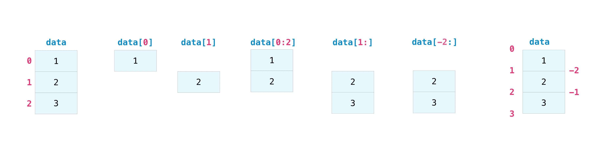

你可能想取数组的一部分或特定的数组元素，用于进一步分析或其他操作。为此，您需要对数组进行子集、切片和/或索引。

如果你想要选择符合特定条件的数组中的值，使用 NumPy 是很直接的。

例如，如果你从这个数组开始：

```py
>>> a = np.array([[1 , 2, 3, 4], [5, 6, 7, 8], [9, 10, 11, 12]]) 
```

你可以轻松地打印数组中所有小于 5 的值。

```py
>>> print(a[a < 5])
[1 2 3 4] 
```

你还可以选择等于或大于 5 的数字，并用该条件对数组进行索引。

```py
>>> five_up = (a >= 5)
>>> print(a[five_up])
[ 5  6  7  8  9 10 11 12] 
```

你可以选择可被 2 整除的元素：

```py
>>> divisible_by_2 = a[a%2==0]
>>> print(divisible_by_2)
[ 2  4  6  8 10 12] 
```

或者你可以使用`&`和`|`运算符选择满足两个条件的元素：

```py
>>> c = a[(a > 2) & (a < 11)]
>>> print(c)
[ 3  4  5  6  7  8  9 10] 
```

你还可以使用逻辑运算符**&**和**|**来返回布尔值，指定数组中的值是否满足某个条件。这对于包含名称或其他分类值的数组非常有用。

```py
>>> five_up = (a > 5) | (a == 5)
>>> print(five_up)
[[False False False False]
 [ True  True  True  True]
 [ True  True  True True]] 
```

你还可以使用`np.nonzero()`从数组中选择元素或索引。

从这个数组开始：

```py
>>> a = np.array([[1, 2, 3, 4], [5, 6, 7, 8], [9, 10, 11, 12]]) 
```

你可以使用`np.nonzero()`打印小于 5 的元素的索引：

```py
>>> b = np.nonzero(a < 5)
>>> print(b)
(array([0, 0, 0, 0]), array([0, 1, 2, 3])) 
```

在这个例子中，返回了一个数组的元组：每个维度一个数组。第一个数组表示这些值所在的行索引，第二个数组表示这些值所在的列索引。

如果你想要生成一个元素存在的坐标列表，你可以将数组进行组合，遍历坐标列表，并打印它们。例如：

```py
>>> list_of_coordinates= list(zip(b[0], b[1]))

>>> for coord in list_of_coordinates:
...     print(coord)
(0, 0)
(0, 1)
(0, 2)
(0, 3) 
```

你也可以使用`np.nonzero()`打印数组中小于 5 的元素：

```py
>>> print(a[b])
[1 2 3 4] 
```

如果你要查找的元素在数组中不存在，则返回的索引数组将为空。例如：

```py
>>> not_there = np.nonzero(a == 42)
>>> print(not_there)
(array([], dtype=int64), array([], dtype=int64)) 
```

在这里了解更多关于索引和切片的信息和这里。

在这里阅读有关使用 nonzero 函数的更多信息：`nonzero`。

## 如何从现有数据创建数组

*这部分涵盖*`切片和索引`、`np.vstack()`、`np.hstack()`、`np.hsplit()`、`.view()`、`copy()`

* * *

你可以轻松地从现有数组的一部分创建一个新数组。

假设你有这个数组：

```py
>>> a = np.array([1,  2,  3,  4,  5,  6,  7,  8,  9, 10]) 
```

你可以随时通过指定想要切片的位置来从数组的一个部分创建新数组。

```py
>>> arr1 = a[3:8]
>>> arr1
array([4, 5, 6, 7, 8]) 
```

在这里，你从索引位置 3 到索引位置 8 取出了数组的一个部分。

你还可以垂直和水平堆叠两个已经存在的数组。假设你有两个数组，`a1`和`a2`：

```py
>>> a1 = np.array([[1, 1],
...                [2, 2]])

>>> a2 = np.array([[3, 3],
...                [4, 4]]) 
```

你可以使用`vstack`将它们垂直堆叠：

```py
>>> np.vstack((a1, a2))
array([[1, 1],
 [2, 2],
 [3, 3],
 [4, 4]]) 
```

或者使用`hstack`将它们水平堆叠：

```py
>>> np.hstack((a1, a2))
array([[1, 1, 3, 3],
 [2, 2, 4, 4]]) 
```

你可以使用`hsplit`将数组分割成几个更小的数组。你可以指定要返回的形状相同的数组的数量，也可以指定分割应发生的列的位置。

假设你有这个数组：

```py
>>> x = np.arange(1, 25).reshape(2, 12)
>>> x
array([[ 1,  2,  3,  4,  5,  6,  7,  8,  9, 10, 11, 12],
 [13, 14, 15, 16, 17, 18, 19, 20, 21, 22, 23, 24]]) 
```

如果你想将这个数组等分成三个形状相同的数组，你需要运行：

```py
>>> np.hsplit(x, 3)
 [array([[ 1,  2,  3,  4],
 [13, 14, 15, 16]]), array([[ 5,  6,  7,  8],
 [17, 18, 19, 20]]), array([[ 9, 10, 11, 12],
 [21, 22, 23, 24]])] 
```

如果你想在第三和第四列后分割你的数组，你需要运行：

```py
>>> np.hsplit(x, (3, 4))
 [array([[ 1,  2,  3],
 [13, 14, 15]]), array([[ 4],
 [16]]), array([[ 5,  6,  7,  8,  9, 10, 11, 12],
 [17, 18, 19, 20, 21, 22, 23, 24]])] 
```

在这里了解更多有关堆叠和分割数组。

你可以使用`view`方法创建一个查看原始数组相同数据的新数组对象（*浅复制*）。

视图是 NumPy 中的重要概念！ 在可能的情况下，NumPy 函数以及诸如索引和切片之类的操作都会返回视图。这样可以节省内存并提高速度（数据不需要复制）。然而，了解这一点很重要 - 在视图中修改数据也会修改原始数组！

假设你创建了这个数组：

```py
>>> a = np.array([[1, 2, 3, 4], [5, 6, 7, 8], [9, 10, 11, 12]]) 
```

现在我们通过切片`a`创建一个数组`b1`，并修改`b1`的第一个元素。这将同时修改`a`中对应的元素！

```py
>>> b1 = a[0, :]
>>> b1
array([1, 2, 3, 4])
>>> b1[0] = 99
>>> b1
array([99,  2,  3,  4])
>>> a
array([[99,  2,  3,  4],
 [ 5,  6,  7,  8],
 [ 9, 10, 11, 12]]) 
```

使用`copy`方法将创建数组的完整副本和数据（*深复制*）。你可以运行以下命令来使用它在数组上：

```py
>>> b2 = a.copy() 
```

在这里了解有关复制和视图的更多内容。

## 基本数组操作

*本节涵盖了加法、减法、乘法、除法等内容*

* * *

创建数组后，你可以开始使用它们。例如，你创建了两个名为“data”和“ones”的数组


你可以用加号将数组相加。

```py
>>> data = np.array([1, 2])
>>> ones = np.ones(2, dtype=int)
>>> data + ones
array([2, 3]) 
```


当然，你当然还可以进行更多操作！

```py
>>> data - ones
array([0, 1])
>>> data * data
array([1, 4])
>>> data / data
array([1., 1.]) 
```

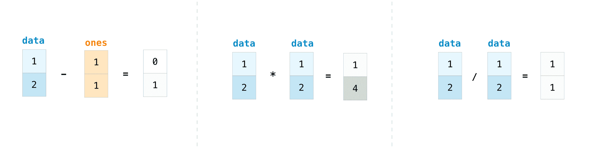

在 NumPy 中，基本操作非常简单。如果你想要找到数组中元素的总和，你可以使用`sum()`。这适用于 1D 数组、2D 数组以及更高维度的数组。

```py
>>> a = np.array([1, 2, 3, 4])

>>> a.sum()
10 
```

要对 2D 数组的行或列进行加法，你需要指定轴。

如果你从这个数组开始：

```py
>>> b = np.array([[1, 1], [2, 2]]) 
```

你可以通过以下方式对行轴求和：

```py
>>> b.sum(axis=0)
array([3, 3]) 
```

你可以通过以下方式对列轴求和：

```py
>>> b.sum(axis=1)
array([2, 4]) 
```

在这里了解更多有关基本操作的内容。

## 广播

有时你可能想要在数组和单个数字之间进行操作（也称为*向量和标量之间的操作*）或者在两个不同大小的数组之间进行操作。例如，你的数组（我们称之为“数据”）可能包含了以英里为单位的距离信息，但你想要将信息转换为公里。你可以通过以下操作来实现：

```py
>>> data = np.array([1.0, 2.0])
>>> data * 1.6
array([1.6, 3.2]) 
```

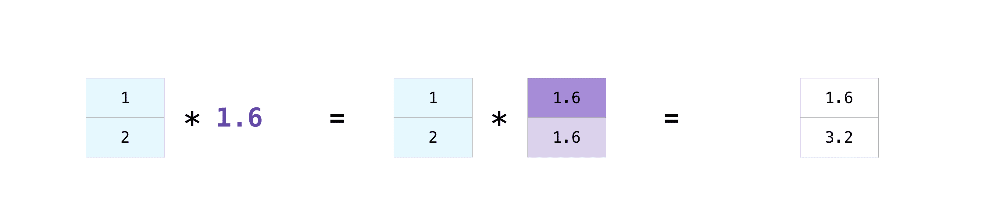

NumPy 理解乘法应该发生在每个单元格上。这个概念被称为**广播**。广播是一种机制，允许 NumPy 对不同形状的数组执行操作。你的数组的维度必须兼容，例如，当两个数组的维度相等时，或者其中一个维度是 1 时。如果维度不兼容，你将得到一个`ValueError`。

在这里了解更多关于广播的信息。

## 更有用的数组操作

*本节涵盖最大值、最小值、和、平均值、乘积、标准差等内容*

* * *

NumPy 还执行聚合函数。除了`min`、`max`和`sum`之外，你还可以轻松地运行`mean`得到平均值，`prod`得到乘积的结果，`std`得到标准差等。

```py
>>> data.max()
2.0
>>> data.min()
1.0
>>> data.sum()
3.0 
```

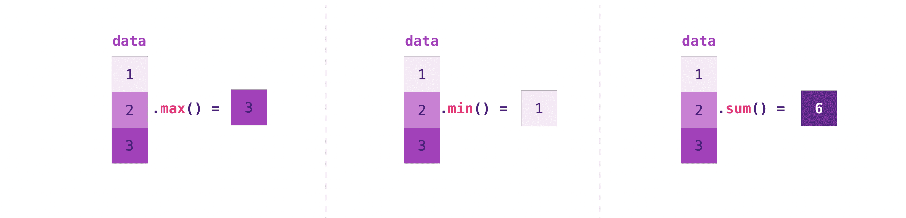

让我们从这个名为“a”的数组开始

```py
>>> a = np.array([[0.45053314, 0.17296777, 0.34376245, 0.5510652],
...               [0.54627315, 0.05093587, 0.40067661, 0.55645993],
...               [0.12697628, 0.82485143, 0.26590556, 0.56917101]]) 
```

想要沿着行或列进行聚合通常很常见。默认情况下，每个 NumPy 聚合函数将返回整个数组的聚合结果。要找到数组中元素的和或最小值，运行：

```py
>>> a.sum()
4.8595784 
```

或者：

```py
>>> a.min()
0.05093587 
```

你可以指定要计算聚合函数的轴。例如，你可以通过指定`axis=0`来找到每列中的最小值。

```py
>>> a.min(axis=0)
array([0.12697628, 0.05093587, 0.26590556, 0.5510652 ]) 
```

上述四个值对应于数组中列的数量。对于一个有四列的数组，你将得到四个值作为你的结果。

阅读更多关于 数组方法的内容。

## 创建矩阵

你可以传递 Python 的列表列表来创建一个 2-D 数组（或“矩阵”）以在 NumPy 中表示它们。

```py
>>> data = np.array([[1, 2], [3, 4], [5, 6]])
>>> data
array([[1, 2],
 [3, 4],
 [5, 6]]) 
```


当你操作矩阵时，索引和切片操作非常有用：

```py
>>> data[0, 1]
2
>>> data[1:3]
array([[3, 4],
 [5, 6]])
>>> data[0:2, 0]
array([1, 3]) 
```

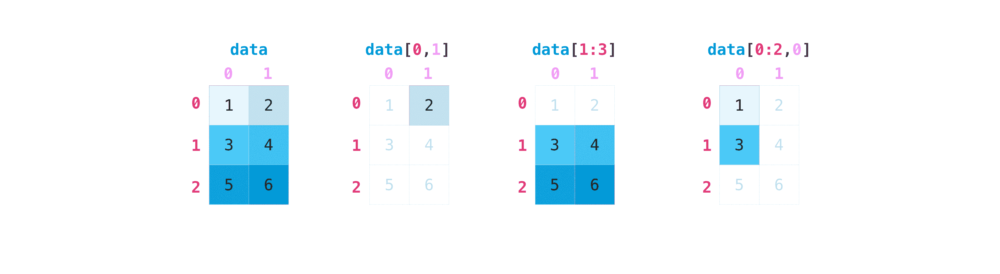

你可以像聚合向量那样聚合矩阵：

```py
>>> data.max()
6
>>> data.min()
1
>>> data.sum()
21 
```

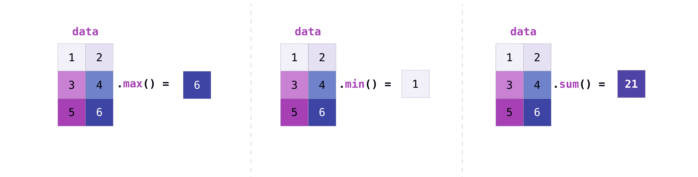

你可以聚合矩阵中的所有值，你还可以使用`axis`参数沿行或列进行聚合。为了说明这一点，让我们看一个稍微修改过的数据集：

```py
>>> data = np.array([[1, 2], [5, 3], [4, 6]])
>>> data
array([[1, 2],
 [5, 3],
 [4, 6]])
>>> data.max(axis=0)
array([5, 6])
>>> data.max(axis=1)
array([2, 5, 6]) 
```

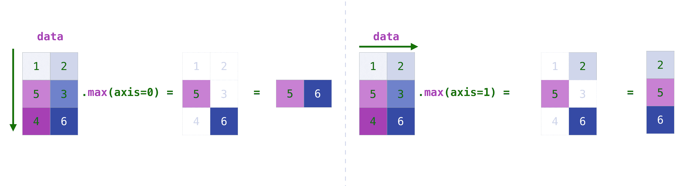

一旦你创建了你的矩阵，如果你有两个大小相同的矩阵，你可以使用算术运算符对它们进行加法和乘法运算。

```py
>>> data = np.array([[1, 2], [3, 4]])
>>> ones = np.array([[1, 1], [1, 1]])
>>> data + ones
array([[2, 3],
 [4, 5]]) 
```


你可以对不同大小的矩阵进行这些算术运算，但前提是一个矩阵只有一列或一行。在这种情况下，NumPy 将使用其操作的广播规则。

```py
>>> data = np.array([[1, 2], [3, 4], [5, 6]])
>>> ones_row = np.array([[1, 1]])
>>> data + ones_row
array([[2, 3],
 [4, 5],
 [6, 7]]) 
```

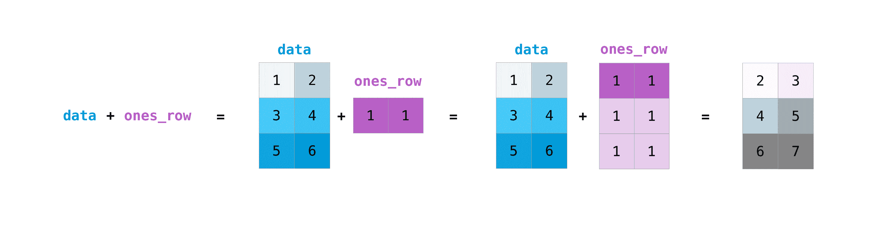

请注意，当 NumPy 打印 N 维数组时，最后一个轴最快地循环，而第一个轴最慢。例如：

```py
>>> np.ones((4, 3, 2))
array([[[1., 1.],
 [1., 1.],
 [1., 1.]],

 [[1., 1.],
 [1., 1.],
 [1., 1.]],

 [[1., 1.],
 [1., 1.],
 [1., 1.]],

 [[1., 1.],
 [1., 1.],
 [1., 1.]]]) 
```

常常有这样的情况，我们希望 NumPy 初始化数组的值。NumPy 提供了`ones()`、`zeros()`和`random.Generator`类来生成随机数，你只需传递你想要生成的元素数量即可：

```py
>>> np.ones(3)
array([1., 1., 1.])
>>> np.zeros(3)
array([0., 0., 0.])
>>> rng = np.random.default_rng()  # the simplest way to generate random numbers
>>> rng.random(3) 
array([0.63696169, 0.26978671, 0.04097352]) 
```

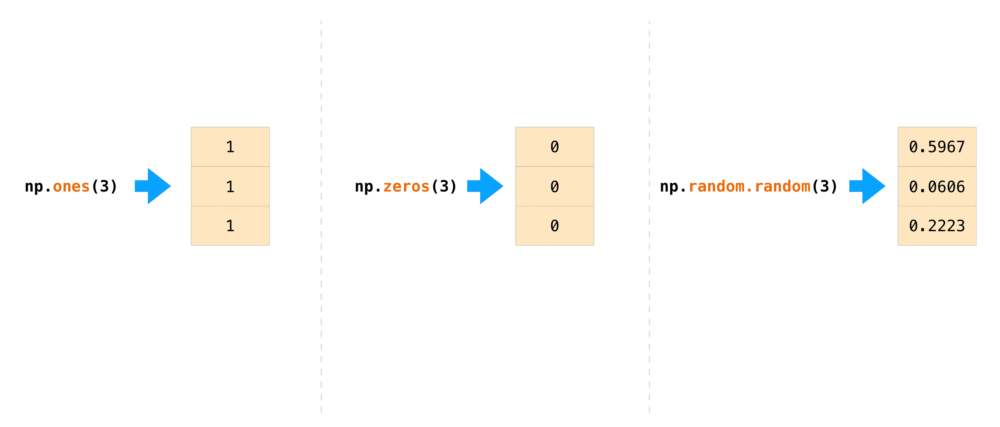

你还可以使用`ones()`、`zeros()`和`random()`来创建 2D 数组，只要给它们一个描述矩阵维度的元组。

```py
>>> np.ones((3, 2))
array([[1., 1.],
 [1., 1.],
 [1., 1.]])
>>> np.zeros((3, 2))
array([[0., 0.],
 [0., 0.],
 [0., 0.]])
>>> rng.random((3, 2)) 
array([[0.01652764, 0.81327024],
 [0.91275558, 0.60663578],
 [0.72949656, 0.54362499]])  # may vary 
```

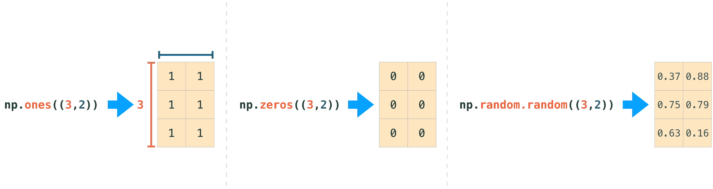

阅读更多关于创建数组，填充为`0`、`1`、其他值或未初始化的信息，参见数组创建例程。

## 产生随机数

随机数生成的使用是许多数值和机器学习算法配置和评估的重要部分。不管你需要在人工神经网络中随机初始化权重，将数据拆分为随机集，还是随机洗牌你的数据集，能够生成随机数（实际上是可重复的伪随机数）是必不可少的。

使用`Generator.integers`，你可以从低值（请记住这在 NumPy 中是包含在内的）生成随机整数到高值（不包括）。你可以设置`endpoint=True`使得高值包括在内。

你可以生成一个 2 x 4 的随机整数数组，范围在 0 到 4 之间：

```py
>>> rng.integers(5, size=(2, 4)) 
array([[2, 1, 1, 0],
 [0, 0, 0, 4]])  # may vary 
```

在此处阅读更多关于随机数生成的信息。

## 如何获取唯一项和计数

*本节包括* `np.unique()`

* * *

你可以通过`np.unique`轻松找到数组中的唯一元素。

例如，如果你从这个数组开始：

```py
>>> a = np.array([11, 11, 12, 13, 14, 15, 16, 17, 12, 13, 11, 14, 18, 19, 20]) 
```

你可以使用`np.unique`来打印数组中的唯一值：

```py
>>> unique_values = np.unique(a)
>>> print(unique_values)
[11 12 13 14 15 16 17 18 19 20] 
```

要在 NumPy 数组中获取唯一值的索引（数组中唯一值的第一个索引位置数组），只需在`np.unique()`中传递`return_index`参数以及你的数组即可。

```py
>>> unique_values, indices_list = np.unique(a, return_index=True)
>>> print(indices_list)
[ 0  2  3  4  5  6  7 12 13 14] 
```

你可以在`np.unique()`中传递`return_counts`参数以及你的数组来获得 NumPy 数组中唯一值的频率计数。

```py
>>> unique_values, occurrence_count = np.unique(a, return_counts=True)
>>> print(occurrence_count)
[3 2 2 2 1 1 1 1 1 1] 
```

这也适用于 2D 数组！如果你从这个数组开始：

```py
>>> a_2d = np.array([[1, 2, 3, 4], [5, 6, 7, 8], [9, 10, 11, 12], [1, 2, 3, 4]]) 
```

你可以找到唯一值，`np.unique()`可以帮你实现。

```py
>>> unique_values = np.unique(a_2d)
>>> print(unique_values)
[ 1  2  3  4  5  6  7  8  9 10 11 12] 
```

如果没有传递 axis 参数，你的 2D 数组将被展平。

如果想要获取唯一行或列，请确保传递`axis`参数。要找到唯一行，请指定`axis=0`，对于列，请指定`axis=1`。

```py
>>> unique_rows = np.unique(a_2d, axis=0)
>>> print(unique_rows)
[[ 1  2  3  4]
 [ 5  6  7  8]
 [ 9 10 11 12]] 
```

要获取唯一行、索引位置和出现次数，可以使用：

```py
>>> unique_rows, indices, occurrence_count = np.unique(
...      a_2d, axis=0, return_counts=True, return_index=True)
>>> print(unique_rows)
[[ 1  2  3  4]
 [ 5  6  7  8]
 [ 9 10 11 12]]
>>> print(indices)
[0 1 2]
>>> print(occurrence_count)
[2 1 1] 
```

想要了解如何在数组中查找唯一元素，请参见`unique`。

## 转置和重塑矩阵

*这一部分涵盖* `arr.reshape()`, `arr.transpose()`, `arr.T`

* * *

需要转置矩阵是很常见的。NumPy 数组具有允许您转置矩阵的属性`T`。


当需要转置矩阵维度时，可能会发生这种情况。例如，当您有一个模型期望不同于数据集的特定输入形状时。在这种情况下，`reshape`方法可以派上用场。您只需传入想要矩阵的新维度。

```py
>>> data.reshape(2, 3)
array([[1, 2, 3],
 [4, 5, 6]])
>>> data.reshape(3, 2)
array([[1, 2],
 [3, 4],
 [5, 6]]) 
```

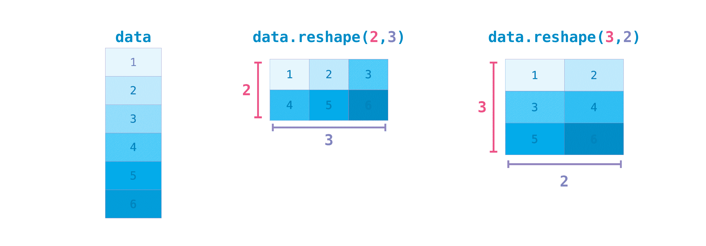

您也可以使用`.transpose()`根据您指定的值反转或更改数组的轴。

如果从这个数组开始：

```py
>>> arr = np.arange(6).reshape((2, 3))
>>> arr
array([[0, 1, 2],
 [3, 4, 5]]) 
```

您可以使用`arr.transpose()`来转置数组。

```py
>>> arr.transpose()
array([[0, 3],
 [1, 4],
 [2, 5]]) 
```

您还可以使用`arr.T`：

```py
>>> arr.T
array([[0, 3],
 [1, 4],
 [2, 5]]) 
```

想要了解关于转置和重塑数组的更多信息，请参见`transpose`和`reshape`。

## 如何反转数组

*这一部分涵盖* `np.flip()`

* * *

NumPy 的`np.flip()`函数允许您沿轴翻转或反转数组的内容。使用`np.flip()`时，请指定要反转的数组以及轴。如果不指定轴，NumPy 将沿着输入数组的所有轴反转内容。

**反转 1D 数组**

如果从这样一个 1D 数组开始：

```py
>>> arr = np.array([1, 2, 3, 4, 5, 6, 7, 8]) 
```

您可以使用以下方法反转：

```py
>>> reversed_arr = np.flip(arr) 
```

如果想要打印您反转的数组，可以运行：

```py
>>> print('Reversed Array: ', reversed_arr)
Reversed Array:  [8 7 6 5 4 3 2 1] 
```

**反转 2D 数组**

2D 数组的操作方式基本相同。

如果从这个数组开始：

```py
>>> arr_2d = np.array([[1, 2, 3, 4], [5, 6, 7, 8], [9, 10, 11, 12]]) 
```

可以使用以下方法反转所有行和所有列中的内容：

```py
>>> reversed_arr = np.flip(arr_2d)
>>> print(reversed_arr)
[[12 11 10  9]
 [ 8  7  6  5]
 [ 4  3  2  1]] 
```

您可以轻松地仅反转*行*：

```py
>>> reversed_arr_rows = np.flip(arr_2d, axis=0)
>>> print(reversed_arr_rows)
[[ 9 10 11 12]
 [ 5  6  7  8]
 [ 1  2  3  4]] 
```

或仅反转*列*：

```py
>>> reversed_arr_columns = np.flip(arr_2d, axis=1)
>>> print(reversed_arr_columns)
[[ 4  3  2  1]
 [ 8  7  6  5]
 [12 11 10  9]] 
```

您还可以反转仅一个列或一行的内容。例如，您可以反转第 1 个索引位置的行中的内容（第二行）：

```py
>>> arr_2d[1] = np.flip(arr_2d[1])
>>> print(arr_2d)
[[ 1  2  3  4]
 [ 8  7  6  5]
 [ 9 10 11 12]] 
```

也可以反转第 1 个索引位置的列（第二列）：

```py
>>> arr_2d[:,1] = np.flip(arr_2d[:,1])
>>> print(arr_2d)
[[ 1 10  3  4]
 [ 8  7  6  5]
 [ 9  2 11 12]] 
```

了解更多关于反转数组的内容，请查看`flip`。

## 重塑和扁平化多维数组

*这一部分涵盖* `.flatten()`, `ravel()`

* * *

有两种常用的展平数组的方法：`.flatten()`和`.ravel()`。两者之间的主要区别是使用`ravel()`创建的新数组实际上是对父数组的引用（即“视图”）。这意味着对新数组的任何更改也会影响父数组。由于`ravel`不创建副本，它在内存上是高效的。

如果你有这个数组：

```py
>>> x = np.array([[1 , 2, 3, 4], [5, 6, 7, 8], [9, 10, 11, 12]]) 
```

你可以使用`flatten`将数组展平为一个一维数组。

```py
>>> x.flatten()
array([ 1,  2,  3,  4,  5,  6,  7,  8,  9, 10, 11, 12]) 
```

当你使用`flatten`时，对新数组的更改不会影响父数组。

例如：

```py
>>> a1 = x.flatten()
>>> a1[0] = 99
>>> print(x)  # Original array
[[ 1  2  3  4]
 [ 5  6  7  8]
 [ 9 10 11 12]]
>>> print(a1)  # New array
[99  2  3  4  5  6  7  8  9 10 11 12] 
```

但是当你使用`ravel`时，你对新数组所做的更改将影响父数组。

例如：

```py
>>> a2 = x.ravel()
>>> a2[0] = 98
>>> print(x)  # Original array
[[98  2  3  4]
 [ 5  6  7  8]
 [ 9 10 11 12]]
>>> print(a2)  # New array
[98  2  3  4  5  6  7  8  9 10 11 12] 
```

在`ndarray.flatten`和`ravel`中了解更多关于`flatten`和`ravel`的信息。

## 如何访问文档字符串以获取更多信息

*本节介绍* `help()`、`?`、`??`

* * *

在数据科学生态系统方面，Python 和 NumPy 是为用户设计的。其中一个最好的例子就是内置访问文档的功能。每个对象都包含对一个字符串的引用，这个字符串被称为**文档字符串**。在大多数情况下，这个文档字符串包含对象和如何使用它的快速简明摘要。Python 有一个内置的`help()`函数，可以帮助您访问这些信息。这意味着几乎任何时候您需要更多信息，都可以使用`help()`快速找到您需要的信息。

例如：

```py
>>> help(max)
Help on built-in function max in module builtins:

max(...)
 max(iterable, *[, default=obj, key=func]) -> value
 max(arg1, arg2, *args, *[, key=func]) -> value

 With a single iterable argument, return its biggest item. The
 default keyword-only argument specifies an object to return if
 the provided iterable is empty.
 With two or more arguments, return the largest argument. 
```

因为额外信息的获取非常有用，IPython 使用`?`字符作为访问此文档以及其他相关信息的简短方式。IPython 是用于多种语言的交互式计算的命令行。[你可以在这里找到有关 IPython 的更多信息](https://ipython.org/)。

例如：

```py
In [0]: max?
max(iterable, *[, default=obj, key=func]) -> value
max(arg1, arg2, *args, *[, key=func]) -> value

With a single iterable argument, return its biggest item. The
default keyword-only argument specifies an object to return if
the provided iterable is empty.
With two or more arguments, return the largest argument.
Type:      builtin_function_or_method 
```

甚至可以对对象方法和对象本身使用这种表示法。

假设你创建了这个数组：

```py
>>> a = np.array([1, 2, 3, 4, 5, 6]) 
```

然后你可以获得很多有用的信息（首先是关于`a`本身的详细信息，然后是`a`所属的`ndarray`的文档字符串）：

```py
In [1]: a?
Type:            ndarray
String form:     [1 2 3 4 5 6]
Length:          6
File:            ~/anaconda3/lib/python3.9/site-packages/numpy/__init__.py
Docstring:       <no docstring>
Class docstring:
ndarray(shape, dtype=float, buffer=None, offset=0,
 strides=None, order=None)

An array object represents a multidimensional, homogeneous array
of fixed-size items.  An associated data-type object describes the
format of each element in the array (its byte-order, how many bytes it
occupies in memory, whether it is an integer, a floating point number,
or something else, etc.)

Arrays should be constructed using `array`, `zeros` or `empty` (refer
to the See Also section below).  The parameters given here refer to
a low-level method (`ndarray(...)`) for instantiating an array.

For more information, refer to the `numpy` module and examine the
methods and attributes of an array.

Parameters
----------
(for the __new__ method; see Notes below)

shape : tuple of ints
        Shape of created array.
... 
```

对于**你**创建的函数和其他对象也适用这个方法。只需记住使用字符串字面值（用 `""" """` 或 `''' '''` 将你的文档括起来）为你的函数添加文档字符串即可。

例如，如果你创建了这个函数：

```py
>>> def double(a):
...  '''Return a * 2'''
...   return a * 2 
```

你可以获取有关函数的信息：

```py
In [2]: double?
Signature: double(a)
Docstring: Return a * 2
File:      ~/Desktop/<ipython-input-23-b5adf20be596>
Type:      function 
```

通过阅读你感兴趣的对象的源代码，可以获得更深入的信息。使用两个问号（`??`）可以访问源代码。

例如：

```py
In [3]: double??
Signature: double(a)
Source:
def double(a):
 '''Return a * 2'''
 return a * 2
File:      ~/Desktop/<ipython-input-23-b5adf20be596>
Type:      function 
```

如果问题中的对象是在 Python 以外的语言中编译的，使用`??`将返回与`?`相同的信息。例如，您会发现许多内置对象和类型都是如此：

```py
In [4]: len?
Signature: len(obj, /)
Docstring: Return the number of items in a container.
Type:      builtin_function_or_method 
```

和：

```py
In [5]: len??
Signature: len(obj, /)
Docstring: Return the number of items in a container.
Type:      builtin_function_or_method 
```

有相同的输出，因为它们是在 Python 以外的编程语言中编译的。

## 处理数学公式

实现在数组上运行数学公式的简易性是让 NumPy 在科学 Python 社区中得到广泛应用的原因之一。

例如，这是均方误差公式（监督学习模型中常用于回归问题的中心公式）:

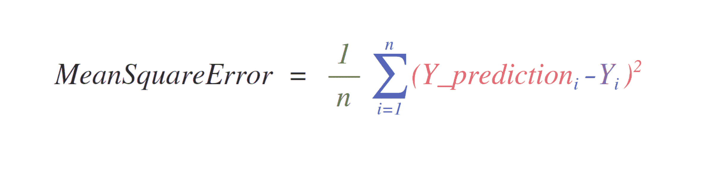

在 NumPy 中实现此公式简单而直接:

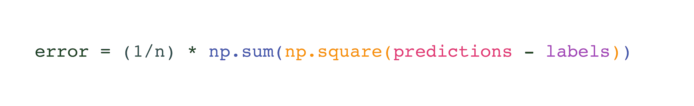

这样做得很好的原因是 `predictions` 和 `labels` 可能包含一个或一千个值，它们只需要具有相同的大小。

您可以以这种方式可视化它:

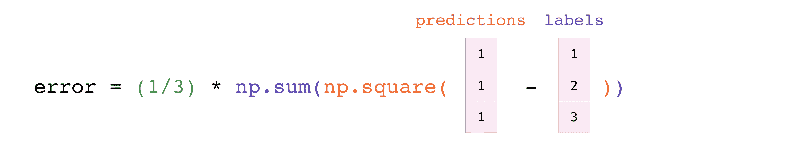

在此示例中，预测和标签向量都包含三个值，这意味着 `n` 的值为三。在我们进行减法操作后，向量中的值被平方。然后 NumPy 对值求和，您的结果就是该预测的错误值和模型质量的得分。

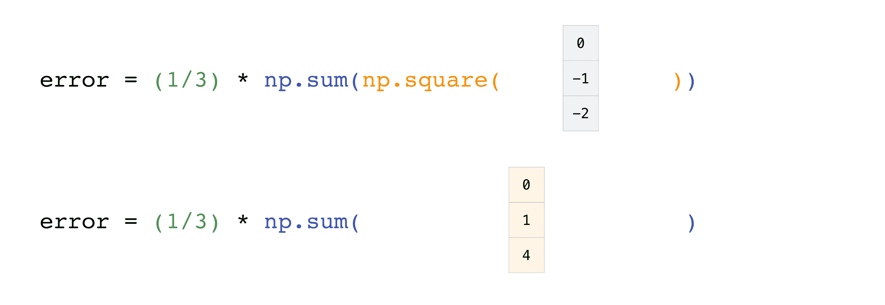 

## 如何保存和加载 NumPy 对象

*本节涵盖* `np.save`, `np.savez`, `np.savetxt`, `np.load`, `np.loadtxt`

* * *

在某个时候，您可能想要将数组保存到磁盘并加载它们，而无需重新运行代码。幸运的是，有几种方法可以使用 NumPy 保存和加载对象。ndarray 对象可以使用`loadtxt`和`savetxt`函数保存到磁盘文件中，这些函数处理普通文本文件，使用处理 NumPy 二进制文件的`load`和`save`函数，具有 **.npy** 文件扩展名，并使用处理具有 **.npz** 文件扩展名的 NumPy 文件的`savez`函数。

**.npy** 和 **.npz** 文件存储数据、形状、数据类型以及其他信息，以便在需重建数组的情况下以一种允许正确检索数组的方式。即使文件位于具有不同架构的另一台机器上，也能正确检索数组。

如果要存储单个 ndarray 对象，请使用`np.save`将其存储为 .npy 文件。如果要在单个文件中存储多个 ndarray 对象，请使用`np.savez`将其保存为 .npz 文件。您还可以使用`savez_compressed`将多个数组保存到单个文件中以压缩的 npz 格式。

使用`np.save()`轻松保存和加载数组。只需确保指定要保存的数组和文件名。例如，如果您创建此数组:

```py
>>> a = np.array([1, 2, 3, 4, 5, 6]) 
```

你可以使用以下方式保存为“filename.npy”:

```py
>>> np.save('filename', a) 
```

您可以使用`np.load()`重建您的数组。

```py
>>> b = np.load('filename.npy') 
```

如果你想检查你的数组，可以运行:

```py
>>> print(b)
[1 2 3 4 5 6] 
```

您可以使用`np.savetxt`将 NumPy 数组保存为普通文本文件，如 **.csv** 或 **.txt** 文件。

例如，如果您创建此数组:

```py
>>> csv_arr = np.array([1, 2, 3, 4, 5, 6, 7, 8]) 
```

你可以像这样将其保存为名为“new_file.csv”的.csv 文件：

```py
>>> np.savetxt('new_file.csv', csv_arr) 
```

可以使用`loadtxt()`快速和方便地加载保存的文本文件：

```py
>>> np.loadtxt('new_file.csv')
array([1., 2., 3., 4., 5., 6., 7., 8.]) 
```

`savetxt()`和`loadtxt()`函数还接受其他可选参数，如头部（header）、尾部（footer）和分隔符（delimiter）。虽然文本文件更容易共享，但.npy 和.npz 文件更小更快。如果需要更复杂的文本文件处理（例如，如果需要处理包含缺失值的行），则需要使用`genfromtxt`函数。

使用`savetxt`，你可以指定头部（headers）、尾部（footers）、注释等。

了解更多关于输入和输出例程的信息。

## 导入和导出 CSV 文件

读取包含现有信息的 CSV 非常简单。最好和最简单的方法是使用[Pandas](https://pandas.pydata.org)。

```py
>>> import pandas as pd

>>> # If all of your columns are the same type:
>>> x = pd.read_csv('music.csv', header=0).values
>>> print(x)
[['Billie Holiday' 'Jazz' 1300000 27000000]
 ['Jimmie Hendrix' 'Rock' 2700000 70000000]
 ['Miles Davis' 'Jazz' 1500000 48000000]
 ['SIA' 'Pop' 2000000 74000000]]

>>> # You can also simply select the columns you need:
>>> x = pd.read_csv('music.csv', usecols=['Artist', 'Plays']).values
>>> print(x)
[['Billie Holiday' 27000000]
 ['Jimmie Hendrix' 70000000]
 ['Miles Davis' 48000000]
 ['SIA' 74000000]] 
```


使用 Pandas 导出数组也很简单。如果对 NumPy 不熟悉，可以从数组的值中创建一个 Pandas 数据框，然后使用 Pandas 将数据框写入 CSV 文件。

如果创建了该数组“a”

```py
>>> a = np.array([[-2.58289208,  0.43014843, -1.24082018, 1.59572603],
...               [ 0.99027828, 1.17150989,  0.94125714, -0.14692469],
...               [ 0.76989341,  0.81299683, -0.95068423, 0.11769564],
...               [ 0.20484034,  0.34784527,  1.96979195, 0.51992837]]) 
```

你可以创建一个 Pandas 数据框

```py
>>> df = pd.DataFrame(a)
>>> print(df)
 0         1         2         3
0 -2.582892  0.430148 -1.240820  1.595726
1  0.990278  1.171510  0.941257 -0.146925
2  0.769893  0.812997 -0.950684  0.117696
3  0.204840  0.347845  1.969792  0.519928 
```

你可以轻松地保存你的 DataFrame：

```py
>>> df.to_csv('pd.csv') 
```

并使用以下方式读取 CSV 文件：

```py
>>> data = pd.read_csv('pd.csv') 
```


你还可以使用 NumPy 的`savetxt`方法保存你的数组。

```py
>>> np.savetxt('np.csv', a, fmt='%.2f', delimiter=',', header='1,  2,  3,  4') 
```

如果在命令行中使用，可以使用类似以下的命令随时读取已保存的 CSV 文件：

```py
$ cat np.csv
#  1,  2,  3,  4
-2.58,0.43,-1.24,1.60
0.99,1.17,0.94,-0.15
0.77,0.81,-0.95,0.12
0.20,0.35,1.97,0.52 
```

或者你可以随时用文本编辑器打开文件！

如果你对 Pandas 感兴趣，请查看[官方 Pandas 文档](https://pandas.pydata.org/index.html)。了解如何使用[官方 Pandas 安装信息](https://pandas.pydata.org/pandas-docs/stable/install.html)安装 Pandas。

## 使用 Matplotlib 绘制数组

如果需要为你的值生成一个图表，使用[Matplotlib](https://matplotlib.org/)非常简单。

例如，你可能有一个像这样的数组：

```py
>>> a = np.array([2, 1, 5, 7, 4, 6, 8, 14, 10, 9, 18, 20, 22]) 
```

如果已经安装了 Matplotlib，可以使用以下方式导入它：

```py
>>> import matplotlib.pyplot as plt

# If you're using Jupyter Notebook, you may also want to run the following
# line of code to display your code in the notebook:

%matplotlib inline 
```

要绘制你的值，只需要运行： 

```py
>>> plt.plot(a)

# If you are running from a command line, you may need to do this:
# >>> plt.show() 
```

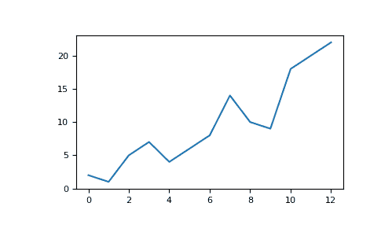

例如，可以通过以下方式绘制 1D 数组：

```py
>>> x = np.linspace(0, 5, 20)
>>> y = np.linspace(0, 10, 20)
>>> plt.plot(x, y, 'purple') # line
>>> plt.plot(x, y, 'o')      # dots 
```

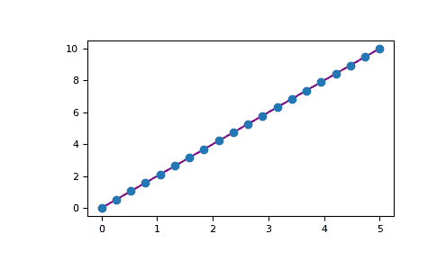

使用 Matplotlib，你有许多可视化选项。

```py
>>> fig = plt.figure()
>>> ax = fig.add_subplot(projection='3d')
>>> X = np.arange(-5, 5, 0.15)
>>> Y = np.arange(-5, 5, 0.15)
>>> X, Y = np.meshgrid(X, Y)
>>> R = np.sqrt(X**2 + Y**2)
>>> Z = np.sin(R)

>>> ax.plot_surface(X, Y, Z, rstride=1, cstride=1, cmap='viridis') 
```

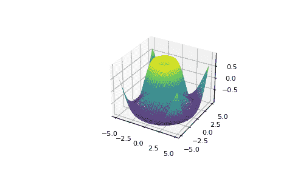

要阅读更多关于 Matplotlib 及其功能的信息，请查看[官方文档](https://matplotlib.org/)。有关安装 Matplotlib 的指示，请参阅官方的[安装部分](https://matplotlib.org/users/installing.html)。

* * *

*图片来源：Jay Alammar http://jalammar.github.io/*

## 欢迎来到 NumPy！

NumPy（**Numerical Python**）是一个开源的 Python 库，几乎在科学和工程的每个领域中都有使用。它是 Python 中处理数值数据的通用标准，是科学 Python 和 PyData 生态系统的核心。NumPy 的用户包括从初学者到进行尖端科学和工业研究与开发的经验丰富的研究人员。NumPy API 在 Pandas、SciPy、Matplotlib、scikit-learn、scikit-image 和大多数其他数据科学和科学 Python 包中广泛使用。

NumPy 库包含多维数组和矩阵数据结构（你将在后面的部分中找到更多信息）。它提供了**ndarray**，一个同构的 n 维数组对象，并提供了方法来高效地对其进行操作。NumPy 可以用于对数组执行各种各样的数学操作。它向 Python 添加了强大的数据结构，保证了对数组和矩阵的高效计算，并提供了大量的高级数学函数库，可以操作这些数组和矩阵。

在这里了解更多关于 NumPy 的信息！

## 安装 NumPy

要安装 NumPy，我们强烈建议使用科学 Python 发行版。如果你正在寻找有关在你的操作系统上安装 NumPy 的完整说明，请参阅[安装 NumPy](https://numpy.org/install/)。

如果你已经安装了 Python，你可以使用以下命令安装 NumPy：

```py
conda install numpy 
```

或者

```py
pip install numpy 
```

如果你还没有安装 Python，你可能想考虑使用[Anaconda](https://www.anaconda.com/)。这是最简单的入门方式。使用这个发行版的好处是你不需要过多地担心单独安装 NumPy 或者你将用于数据分析的任何主要包，如 pandas、Scikit-Learn 等。

## 如何导入 NumPy

要访问 NumPy 及其函数，请在你的 Python 代码中像这样导入它：

```py
import numpy as np 
```

我们将导入的名称缩短为`np`，以提高使用 NumPy 的代码的可读性。这是一种被广泛采用的惯例，使得你的代码对所有工作在其中的人更易读。我们建议始终使用`import numpy as np`导入。

## 阅读示例代码

如果你还不熟悉阅读包含大量代码的教程，你可能不知道如何解释像这样的代码块：

```py
>>> a = np.arange(6)
>>> a2 = a[np.newaxis, :]
>>> a2.shape
(1, 6) 
```

如果你不熟悉这种风格，那么很容易理解。如果你看到`>>>`，你正在看**输入**，或者你将要输入的代码。任何不以`>>>`开头的都是**输出**，或者是你代码运行的结果。这是在命令行上运行`python`时看到的样式，但如果你使用 IPython，你可能会看到不同的样式。请注意，它不是代码的一部分，如果输入或粘贴到 Python shell 中会导致错误。它可以安全地输入或粘贴到 IPython shell 中；`>>>`会被忽略。

## Python 列表和 NumPy 数组之间有什么区别？

NumPy 为您提供了大量快速高效的方式来创建数组并在其中操纵数字数据。 虽然 Python 列表可以包含单个列表中的不同数据类型，但 NumPy 数组中的所有元素应该是同质的。 如果数组不是同质的，那么对数组执行的数学运算将非常低效。

**为什么使用 NumPy？**

NumPy 数组比 Python 列表更快，更紧凑。 数组占用的内存更少且使用方便。 NumPy 使用的内存比存储数据需要的内存少得多，并提供了指定数据类型的机制。 这进一步优化了代码。

## 什么是数组？

数组是 NumPy 库的核心数据结构。 数组是一组值的网格，它包含有关原始数据的信息，如何定位元素以及如何解释元素。 它有一组可以以各种方式进行索引的元素。 这些元素都是相同类型的，称为数组的`dtype`。

数组可以通过非负整数元组、布尔值、另一个数组或整数进行索引。 数组的`rank`是维数。 数组的`shape`是一组整数，给出沿每个维度的数组大小。

我们可以从 Python 列表中初始化 NumPy 数组的一种方式是使用嵌套列表进行二维或多维数据。

例如：

```py
>>> a = np.array([1, 2, 3, 4, 5, 6]) 
```

或者：

```py
>>> a = np.array([[1, 2, 3, 4], [5, 6, 7, 8], [9, 10, 11, 12]]) 
```

我们可以使用方括号访问数组中的元素。 当访问元素时，要记住 NumPy 中的索引从 0 开始。 这意味着如果您要访问数组中的第一个元素，您将访问元素“0”。

```py
>>> print(a[0])
[1 2 3 4] 
```

## 有关数组的更多信息

*本部分涵盖* `1D array`, `2D array`, `ndarray`, `vector`, `matrix`

* * *

你可能偶尔会听到一个数组被称为`ndarray`，这是“N-dimensional array”的简称。 N 维数组只是具有任意数量维度的数组。 您还可能听说**1-D**或一维数组，**2-D**或二维数组等。 NumPy `ndarray`类用于表示矩阵和向量。 **向量**是具有单个维度的数组（行向量和列向量之间没有区别），而**矩阵**指的是具有两个维度的数组。 对于**3-D**或更高维数组，术语**张量**也常常使用。

**数组的属性是什么？**

数组通常是相同类型和大小的项目的固定大小容器。 数组中的维数和项目数由其形状定义。数组的形状是一组非负整数元组，用于指定每个维度的大小。

在 NumPy 中，维度被称为**轴**。 这意味着如果你有一个看起来像这样的二维数组：

```py
[[0., 0., 0.],
 [1., 1., 1.]] 
```

你的数组有 2 个轴。 第一个轴的长度为 2，第二个轴的长度为 3。

就像其他 Python 容器对象一样，数组的内容可以通过对数组进行索引或切片来访问和修改。与典型的容器对象不同，不同的数组可以共享相同的数据，因此在一个数组上进行的更改可能会在另一个数组中可见。

数组的**属性**反映了数组本身的内在信息。如果你需要获取或设置数组的属性而不创建新数组，通常可以通过其属性访问数组。

在这里阅读有关数组属性的更多信息，并了解数组对象。

## 如何创建基本数组

*这一部分涵盖了*`np.array()`，`np.zeros()`，`np.ones()`，`np.empty()`，`np.arange()`，`np.linspace()`，`dtype`

* * *

要创建一个 NumPy 数组，您可以使用函数`np.array()`。

要创建一个简单的数组，您只需要将列表传递给它。如果您选择的话，还可以指定列表中的数据类型。您可以在这里找到有关数据类型的更多信息。

```py
>>> import numpy as np
>>> a = np.array([1, 2, 3]) 
```

您可以以此方式可视化您的数组：


*请注意，这些可视化是为了简化思想并让您对 NumPy 概念和机制有基本了解。数组和数组操作比这里描述的要复杂得多！*

除了从一系列元素创建数组之外，您还可以轻松创建一个填满`0`的数组：

```py
>>> np.zeros(2)
array([0., 0.]) 
```

或者一个填满`1`的数组：

```py
>>> np.ones(2)
array([1., 1.]) 
```

或者甚至是一个空数组！函数`empty`创建一个初始内容是随机的数组，取决于内存状态。使用`empty`而不是`zeros`（或类似的东西）的原因是速度快 - 只需确保之后填充每个元素！

```py
>>> # Create an empty array with 2 elements
>>> np.empty(2) 
array([3.14, 42\.  ])  # may vary 
```

您可以创建一个包含一系列元素的数组：

```py
>>> np.arange(4)
array([0, 1, 2, 3]) 
```

甚至包含一系列间隔均匀的范围的数组。为此，您将指定**第一个数字**，**最后一个数字**和**步长**。

```py
>>> np.arange(2, 9, 2)
array([2, 4, 6, 8]) 
```

您还可以使用`np.linspace()`在指定间隔中创建线性间隔的值数组：

```py
>>> np.linspace(0, 10, num=5)
array([ 0\. ,  2.5,  5\. ,  7.5, 10\. ]) 
```

**指定数据类型**

尽管默认数据类型是浮点数（`np.float64`），但您可以使用`dtype`关键字明确指定您想要的数据类型。

```py
>>> x = np.ones(2, dtype=np.int64)
>>> x
array([1, 1]) 
```

在这里了解更多有关创建数组的信息

## 添加、删除和排序元素

*这一部分涵盖了*`np.sort()`，`np.concatenate()`

* * *

使用`np.sort()`对元素进行排序很简单。在调用该函数时，您可以指定轴、种类和顺序。

如果您从这个数组开始：

```py
>>> arr = np.array([2, 1, 5, 3, 7, 4, 6, 8]) 
```

您可以快速将数字按升序排序为：

```py
>>> np.sort(arr)
array([1, 2, 3, 4, 5, 6, 7, 8]) 
```

除了返回一个排序后的数组副本的 sort 之外，您还可以使用：

+   `argsort`，它是沿指定轴的间接排序，

+   `lexsort`，这是多个键的间接稳定排序，

+   `searchsorted`，将在排序数组中查找元素，并

+   `partition`，这是一种部分排序。

要阅读有关对数组排序的更多信息，请参阅：`sort`.

如果你从这些数组开始：

```py
>>> a = np.array([1, 2, 3, 4])
>>> b = np.array([5, 6, 7, 8]) 
```

您可以使用`np.concatenate()`进行连接。

```py
>>> np.concatenate((a, b))
array([1, 2, 3, 4, 5, 6, 7, 8]) 
```

或者，如果你从这些数组开始：

```py
>>> x = np.array([[1, 2], [3, 4]])
>>> y = np.array([[5, 6]]) 
```

您可以使用以下内容进行连接：

```py
>>> np.concatenate((x, y), axis=0)
array([[1, 2],
 [3, 4],
 [5, 6]]) 
```

为了从数组中移除元素，可以简单地使用索引来选择要保留的元素。

要阅读有关连接的更多信息，请参阅：`concatenate`.

## 你如何知道数组的形状和大小？

*本节介绍* `ndarray.ndim`，`ndarray.size`，`ndarray.shape`

* * *

`ndarray.ndim`将告诉您数组的轴数或维度。

`ndarray.size`将告诉您数组的元素总数。这是数组形状元素的*乘积*。

`ndarray.shape`将显示一个元组，其中的整数指示数组沿每个维度存储的元素数。例如，如果你有一个 2 行 3 列的二维数组，你的数组的形状是`(2, 3)`。

例如，如果你创建了这个数组：

```py
>>> array_example = np.array([[[0, 1, 2, 3],
...                            [4, 5, 6, 7]],
...
...                           [[0, 1, 2, 3],
...                            [4, 5, 6, 7]],
...
...                           [[0 ,1 ,2, 3],
...                            [4, 5, 6, 7]]]) 
```

要找到数组的维数，运行：

```py
>>> array_example.ndim
3 
```

要找到数组中的总元素数，请运行：

```py
>>> array_example.size
24 
```

并找到数组的形状，运行：

```py
>>> array_example.shape
(3, 2, 4) 
```

## 你能重塑一个数组吗？

*本节介绍* `arr.reshape()`

* * *

**是的！**

使用`arr.reshape()`将为数组提供新的形状，而不更改数据。只需记住，当您使用 reshape 方法时，您想要产生的数组的元素数需要与原始数组相同。如果您从一个具有 12 个元素的数组开始，您需要确保您的新数组也总共具有 12 个元素。

如果您从这个数组开始：

```py
>>> a = np.arange(6)
>>> print(a)
[0 1 2 3 4 5] 
```

您可以使用`reshape()`来重塑您的数组。例如，您可以将此数组重塑为具有三行两列的数组：

```py
>>> b = a.reshape(3, 2)
>>> print(b)
[[0 1]
 [2 3]
 [4 5]] 
```

使用`np.reshape`，您可以指定一些可选参数：

```py
>>> np.reshape(a, newshape=(1, 6), order='C')
array([[0, 1, 2, 3, 4, 5]]) 
```

`a`是要重塑的数组。

`newshape`是你想要的新形状。您可以指定一个整数或一个整数元组。如果您指定一个整数，结果将是一个具有该长度的数组。形状应与原始形状兼容。

`order：` `C`表示使用类似 C 的索引顺序读取/写入元素，`F`表示使用类似 Fortran 的索引顺序读取/写入元素，`A`表示如果 a 在内存中是 Fortran 连续的，使用类似 Fortran 的索引顺序读取/写入元素，否则使用类似 C 的顺序。(这是一个可选参数，无需指定。)

如果你想了解有关 C 和 Fortran 排序的更多信息，你可以在这里读取有关 NumPy 数组内存中的内部组织的更多信息。基本上，C 和 Fortran 排序与索引与数组在内存中存储的顺序相对应有关。在 Fortran 中，当在内存中移动二维数组的元素时，**第一个**索引是最快变化的索引。随着第一个索引的变化移动到下一行，矩阵按列存储。这就是为什么 Fortran 被认为是一种**列主语言**。另一方面，在 C 中，**最后**的索引变化最快。矩阵按行存储，使其成为一种**行主语言**。你在 C 或 Fortran 中所做的取决于是更重要保留索引约定还是不重新排序数据。

在这里了解更多有关形状操作的信息。

## 如何将一个 1 维数组转换为 2 维数组（如何向数组添加一个新轴）

*本节介绍* `np.newaxis`，`np.expand_dims`

* * *

你可以使用 `np.newaxis` 和 `np.expand_dims` 来增加现有数组的维度。

当使用一次 `np.newaxis` 时，它会将数组的维度增加一个维度。这意味着一个**1D**数组将变成一个**2D**数组，一个**2D**数组将变成一个**3D**数组，依此类推。

例如，如果你从这个数组开始：

```py
>>> a = np.array([1, 2, 3, 4, 5, 6])
>>> a.shape
(6,) 
```

你可以使用 `np.newaxis` 来增加一个新的轴：

```py
>>> a2 = a[np.newaxis, :]
>>> a2.shape
(1, 6) 
```

你可以使用 `np.newaxis` 将 1 维数组显式地转换为行向量或列向量。例如，你可以通过在第一维度上插入一个轴将 1 维数组转换为行向量：

```py
>>> row_vector = a[np.newaxis, :]
>>> row_vector.shape
(1, 6) 
```

或者，对于列向量，你可以在第二个维度上插入一个轴：

```py
>>> col_vector = a[:, np.newaxis]
>>> col_vector.shape
(6, 1) 
```

你还可以使用 `np.expand_dims` 在指定位置插入一个新的轴，以扩展数组。

例如，如果你从这个数组开始：

```py
>>> a = np.array([1, 2, 3, 4, 5, 6])
>>> a.shape
(6,) 
```

你可以使用 `np.expand_dims` 在索引位置 1 处添加一个轴：

```py
>>> b = np.expand_dims(a, axis=1)
>>> b.shape
(6, 1) 
```

你可以在索引位置 0 处添加一个轴：

```py
>>> c = np.expand_dims(a, axis=0)
>>> c.shape
(1, 6) 
```

在这里了解更多有关 newaxis 的信息，以及 `expand_dims`。

## 索引和切片

你可以像切片 Python 列表一样索引和切片 NumPy 数组。

```py
>>> data = np.array([1, 2, 3])

>>> data[1]
2
>>> data[0:2]
array([1, 2])
>>> data[1:]
array([2, 3])
>>> data[-2:]
array([2, 3]) 
```

可以这样可视化它：


你可能想从数组中选择一部分或特定的数组元素，用于进一步分析或进行其他操作。为了做到这一点，你需要子集、切片和/或索引你的数组。

如果你想要选择满足特定条件的数组值，使用 NumPy 是非常简单的。

例如，如果你从这个数组开始：

```py
>>> a = np.array([[1 , 2, 3, 4], [5, 6, 7, 8], [9, 10, 11, 12]]) 
```

你可以轻松打印出数组中所有小于 5 的值。

```py
>>> print(a[a < 5])
[1 2 3 4] 
```

你也可以选择大于或等于 5 的数字，并使用该条件来索引数组。

```py
>>> five_up = (a >= 5)
>>> print(a[five_up])
[ 5  6  7  8  9 10 11 12] 
```

您可以选择可被 2 整除的元素：

```py
>>> divisible_by_2 = a[a%2==0]
>>> print(divisible_by_2)
[ 2  4  6  8 10 12] 
```

或者你可以使用`&`和`|`操作符选取满足两个条件的元素：

```py
>>> c = a[(a > 2) & (a < 11)]
>>> print(c)
[ 3  4  5  6  7  8  9 10] 
```

您还可以使用逻辑运算符**&**和**|**返回指定数组中的值是否满足某个条件的布尔值。这对包含名称或其他分类值的数组很有用。

```py
>>> five_up = (a > 5) | (a == 5)
>>> print(five_up)
[[False False False False]
 [ True  True  True  True]
 [ True  True  True True]] 
```

您还可以使用`np.nonzero()`从数组中选择元素或索引。

从这个数组开始：

```py
>>> a = np.array([[1, 2, 3, 4], [5, 6, 7, 8], [9, 10, 11, 12]]) 
```

您可以使用`np.nonzero()`打印出，例如，小于 5 的元素的索引：

```py
>>> b = np.nonzero(a < 5)
>>> print(b)
(array([0, 0, 0, 0]), array([0, 1, 2, 3])) 
```

在这个例子中，返回了一个数组的元组：每个维度一个。第一个数组表示找到这些值的行索引，第二个数组表示找到值的列索引。

如果您想生成元素存在的坐标列表，可以对数组进行压缩，遍历坐标列表并打印它们。例如：

```py
>>> list_of_coordinates= list(zip(b[0], b[1]))

>>> for coord in list_of_coordinates:
...     print(coord)
(0, 0)
(0, 1)
(0, 2)
(0, 3) 
```

你也可以使用`np.nonzero()`打印出数组中小于 5 的元素：

```py
>>> print(a[b])
[1 2 3 4] 
```

如果你要查找的元素在数组中不存在，那么返回的索引数组将是空的。例如：

```py
>>> not_there = np.nonzero(a == 42)
>>> print(not_there)
(array([], dtype=int64), array([], dtype=int64)) 
```

在这里了解有关索引和切片的更多信息和这里。

在此处阅读关于使用零函数的更多信息：`nonzero`。

## 如何从现有数据创建数组

*本节涵盖* `切片和索引`，`np.vstack()`，`np.hstack()`，`np.hsplit()`，`.view()`，`copy()`

* * *

您可以轻松地从现有数组的部分创建新数组。

假设你有这样一个数组：

```py
>>> a = np.array([1,  2,  3,  4,  5,  6,  7,  8,  9, 10]) 
```

您可以随时使用切片指定要从数组中切片的位置创建数组的新数组。

```py
>>> arr1 = a[3:8]
>>> arr1
array([4, 5, 6, 7, 8]) 
```

在这里，你从索引位置 3 到索引位置 8 获取了你数组的一个部分。

你也可以垂直和水平地堆叠两个现有数组。假设你有两个数组，`a1`和`a2`：

```py
>>> a1 = np.array([[1, 1],
...                [2, 2]])

>>> a2 = np.array([[3, 3],
...                [4, 4]]) 
```

你可以使用`vstack`将它们垂直堆叠：

```py
>>> np.vstack((a1, a2))
array([[1, 1],
 [2, 2],
 [3, 3],
 [4, 4]]) 
```

或者使用`hstack`水平堆叠它们：

```py
>>> np.hstack((a1, a2))
array([[1, 1, 3, 3],
 [2, 2, 4, 4]]) 
```

你可以使用`hsplit`将数组分割成几个较小的数组。你可以指定要返回的形状相等的数组的数量，或者应该在哪个列之后进行分割。

假设你有这样一个数组：

```py
>>> x = np.arange(1, 25).reshape(2, 12)
>>> x
array([[ 1,  2,  3,  4,  5,  6,  7,  8,  9, 10, 11, 12],
 [13, 14, 15, 16, 17, 18, 19, 20, 21, 22, 23, 24]]) 
```

如果你想将此数组分割成三个形状相等的数组，你需要执行：

```py
>>> np.hsplit(x, 3)
 [array([[ 1,  2,  3,  4],
 [13, 14, 15, 16]]), array([[ 5,  6,  7,  8],
 [17, 18, 19, 20]]), array([[ 9, 10, 11, 12],
 [21, 22, 23, 24]])] 
```

如果您想在第三和第四列之后分割数组，您需要执行：

```py
>>> np.hsplit(x, (3, 4))
 [array([[ 1,  2,  3],
 [13, 14, 15]]), array([[ 4],
 [16]]), array([[ 5,  6,  7,  8,  9, 10, 11, 12],
 [17, 18, 19, 20, 21, 22, 23, 24]])] 
```

在这里了解有关堆叠和分割数组的更多信息。

您可以使用`view`方法创建一个查看原始数组相同数据的新数组对象（*浅复制*）。

视图是一个重要的 NumPy 概念！NumPy 函数以及索引和切片等操作将尽可能返回视图。这样可以节省内存并提高速度（不需要进行数据复制）。但是要注意这一点——修改视图中的数据也会修改原始数组！

假设您创建了这个数组：

```py
>>> a = np.array([[1, 2, 3, 4], [5, 6, 7, 8], [9, 10, 11, 12]]) 
```

现在我们通过对`a`进行切片并修改`b1`的第一个元素来创建数组`b1`。这将同时修改`a`中对应的元素！

```py
>>> b1 = a[0, :]
>>> b1
array([1, 2, 3, 4])
>>> b1[0] = 99
>>> b1
array([99,  2,  3,  4])
>>> a
array([[99,  2,  3,  4],
 [ 5,  6,  7,  8],
 [ 9, 10, 11, 12]]) 
```

使用`copy`方法将创建数组及其数据的完整副本（*深度复制*）。要在您的数组上使用此方法，您可以运行：

```py
>>> b2 = a.copy() 
```

在此处了解更多关于副本和视图的信息。

## 基本数组操作

*本节涵盖了加法、减法、乘法、除法等内容*

* * *

创建数组后，您可以开始使用它们。例如，假设您已创建了两个数组，一个称为“data”，另一个称为“ones”。


您可以使用加号将数组相加。

```py
>>> data = np.array([1, 2])
>>> ones = np.ones(2, dtype=int)
>>> data + ones
array([2, 3]) 
```


当然，您不仅可以进行加法运算！

```py
>>> data - ones
array([0, 1])
>>> data * data
array([1, 4])
>>> data / data
array([1., 1.]) 
```


NumPy 的基本操作非常简单。如果要找到数组中元素的总和，您可以使用`sum()`。这适用于 1D 数组、2D 数组和更高维度的数组。

```py
>>> a = np.array([1, 2, 3, 4])

>>> a.sum()
10 
```

要在二维数组中添加行或列，您需要指定轴。

如果您从这个数组开始：

```py
>>> b = np.array([[1, 1], [2, 2]]) 
```

您可以对行轴求和：

```py
>>> b.sum(axis=0)
array([3, 3]) 
```

您可以对列轴求和：

```py
>>> b.sum(axis=1)
array([2, 4]) 
```

在此处了解更多关于基本操作的信息。

## 广播

有时，您可能希望在数组和单个数字之间执行操作（也称为*向量和标量之间的操作*），或者在两个不同大小的数组之间执行操作。例如，您的数组（我们将其称为“data”）可能包含有关以英里为单位的距离的信息，但您希望将信息转换为公里。您可以执行此操作：

```py
>>> data = np.array([1.0, 2.0])
>>> data * 1.6
array([1.6, 3.2]) 
```


NumPy 理解乘法应该在每个单元格中发生。这个概念称为**广播**。广播是一种机制，允许 NumPy 在不同形状的数组上执行操作。您的数组的维度必须兼容，例如，当两个数组的维度相等或其中一个为 1 时。如果维度不兼容，您将收到一个`ValueError`。

在此处了解更多关于广播的信息。

## 更多有用的数组操作

*本节涵盖了最大值、最小值、求和、平均值、乘积、标准差等内容*

* * *

NumPy 还执行聚合函数。 除了`min`，`max`和`sum`之外，你还可以轻松运行`mean`来获得平均值，`prod`来获得将元素相乘的结果，`std`来获得标准偏差等。

```py
>>> data.max()
2.0
>>> data.min()
1.0
>>> data.sum()
3.0 
```


让我们从这个称为“a”的数组开始

```py
>>> a = np.array([[0.45053314, 0.17296777, 0.34376245, 0.5510652],
...               [0.54627315, 0.05093587, 0.40067661, 0.55645993],
...               [0.12697628, 0.82485143, 0.26590556, 0.56917101]]) 
```

很常见的是想要沿着行或列进行聚合。 默认情况下，每个 NumPy 聚合函数都将返回整个数组的聚合值。 要找到数组中元素的和或最小值，请运行：

```py
>>> a.sum()
4.8595784 
```

或：

```py
>>> a.min()
0.05093587 
```

你可以指定要计算聚合函数的轴。 例如，你可以通过指定`axis=0`来找到每列的最小值。

```py
>>> a.min(axis=0)
array([0.12697628, 0.05093587, 0.26590556, 0.5510652 ]) 
```

上述四个值对应于数组中的列数。 对于一个四列数组，你将获得四个值作为结果。

阅读更多关于数组方法的信息。

## 创建矩阵

你可以传递 Python 的列表列表来创建一个代表它们的 2-D 数组（或“矩阵”）在 NumPy 中表示。

```py
>>> data = np.array([[1, 2], [3, 4], [5, 6]])
>>> data
array([[1, 2],
 [3, 4],
 [5, 6]]) 
```


当你操纵矩阵时，索引和切片操作非常有用：

```py
>>> data[0, 1]
2
>>> data[1:3]
array([[3, 4],
 [5, 6]])
>>> data[0:2, 0]
array([1, 3]) 
```


你可以像对向量进行聚合一样对矩阵进行聚合：

```py
>>> data.max()
6
>>> data.min()
1
>>> data.sum()
21 
```


你可以聚合矩阵中的所有值，并可以使用`axis`参数跨列或行对它们进行聚合。 为了说明这一点，让我们看一个稍作修改的数据集：

```py
>>> data = np.array([[1, 2], [5, 3], [4, 6]])
>>> data
array([[1, 2],
 [5, 3],
 [4, 6]])
>>> data.max(axis=0)
array([5, 6])
>>> data.max(axis=1)
array([2, 5, 6]) 
```


创建了矩阵后，如果有两个大小相同的矩阵，你可以使用算术运算符对它们进行加法和乘法。

```py
>>> data = np.array([[1, 2], [3, 4]])
>>> ones = np.array([[1, 1], [1, 1]])
>>> data + ones
array([[2, 3],
 [4, 5]]) 
```


你可以对不同大小的矩阵进行这些算术运算，但前提是其中一个矩阵只有一列或一行。 在这种情况下，NumPy 将使用其广播规则进行操作。

```py
>>> data = np.array([[1, 2], [3, 4], [5, 6]])
>>> ones_row = np.array([[1, 1]])
>>> data + ones_row
array([[2, 3],
 [4, 5],
 [6, 7]]) 
```


请注意，当 NumPy 打印 N 维数组时，最后一个轴速度最快，而第一个轴速度最慢。 例如：

```py
>>> np.ones((4, 3, 2))
array([[[1., 1.],
 [1., 1.],
 [1., 1.]],

 [[1., 1.],
 [1., 1.],
 [1., 1.]],

 [[1., 1.],
 [1., 1.],
 [1., 1.]],

 [[1., 1.],
 [1., 1.],
 [1., 1.]]]) 
```

常常有这样的情况，我们希望 NumPy 初始化数组的值。 NumPy 提供了`ones()`和`zeros()`之类的函数，以及用于随机数生成的`random.Generator`类来实现。 你需要做的就是传入你想要生成的元素数量：

```py
>>> np.ones(3)
array([1., 1., 1.])
>>> np.zeros(3)
array([0., 0., 0.])
>>> rng = np.random.default_rng()  # the simplest way to generate random numbers
>>> rng.random(3) 
array([0.63696169, 0.26978671, 0.04097352]) 
```


也可以使用`ones()`，`zeros()`和`random()`来创建 2D 数组，如果给它们一个描述矩阵维度的元组：

```py
>>> np.ones((3, 2))
array([[1., 1.],
 [1., 1.],
 [1., 1.]])
>>> np.zeros((3, 2))
array([[0., 0.],
 [0., 0.],
 [0., 0.]])
>>> rng.random((3, 2)) 
array([[0.01652764, 0.81327024],
 [0.91275558, 0.60663578],
 [0.72949656, 0.54362499]])  # may vary 
```


阅读更多关于创建数组，填充`0`、`1`、其他值或未初始化的数组的内容，在 array creation routines 中。

## 生成随机数

随机数生成的使用是许多数值和机器学习算法的配置和评估的重要组成部分。无论是需要随机初始化人工神经网络中的权重，将数据分为随机集，还是随机洗牌数据集，能够生成随机数（实际上是可重复的伪随机数）是必不可少的。

使用`Generator.integers`，你可以生成从低值（请记住这是 NumPy 中包含的值）到高值（不包含在内）的随机整数。你可以设置`endpoint=True`使高值包含在内。

你可以生成一个 2 x 4 的随机整数数组，范围在 0 到 4 之间：

```py
>>> rng.integers(5, size=(2, 4)) 
array([[2, 1, 1, 0],
 [0, 0, 0, 4]])  # may vary 
```

在这里阅读更多关于生成随机数的内容。

## 如何获取唯一项和计数

*本节介绍* `np.unique()`

* * *

你可以使用`np.unique`轻松找到数组中的唯一元素。

例如，如果你从这个数组开始：

```py
>>> a = np.array([11, 11, 12, 13, 14, 15, 16, 17, 12, 13, 11, 14, 18, 19, 20]) 
```

你可以使用`np.unique`来打印出数组中的唯一值：

```py
>>> unique_values = np.unique(a)
>>> print(unique_values)
[11 12 13 14 15 16 17 18 19 20] 
```

要获取 NumPy 数组中唯一值的索引（数组中唯一值的第一个索引位置的数组），只需在`np.unique()`中传递`return_index`参数和你的数组。

```py
>>> unique_values, indices_list = np.unique(a, return_index=True)
>>> print(indices_list)
[ 0  2  3  4  5  6  7 12 13 14] 
```

你可以在`np.unique()`中传递`return_counts`参数和数组一起，以获取 NumPy 数组中唯一值的频次计数。

```py
>>> unique_values, occurrence_count = np.unique(a, return_counts=True)
>>> print(occurrence_count)
[3 2 2 2 1 1 1 1 1 1] 
```

这也适用于二维数组！如果你从这个数组开始：

```py
>>> a_2d = np.array([[1, 2, 3, 4], [5, 6, 7, 8], [9, 10, 11, 12], [1, 2, 3, 4]]) 
```

你可以用以下方法找到唯一的值：

```py
>>> unique_values = np.unique(a_2d)
>>> print(unique_values)
[ 1  2  3  4  5  6  7  8  9 10 11 12] 
```

如果没有传递`axis`参数，你的二维数组将被展开。

如果你想获取唯一的行或列，请确保传递`axis`参数。要找到唯一的行，请指定`axis=0`，要找到唯一的列，请指定`axis=1`。

```py
>>> unique_rows = np.unique(a_2d, axis=0)
>>> print(unique_rows)
[[ 1  2  3  4]
 [ 5  6  7  8]
 [ 9 10 11 12]] 
```

要获取唯一的行、索引位置和出现次数，你可以使用：

```py
>>> unique_rows, indices, occurrence_count = np.unique(
...      a_2d, axis=0, return_counts=True, return_index=True)
>>> print(unique_rows)
[[ 1  2  3  4]
 [ 5  6  7  8]
 [ 9 10 11 12]]
>>> print(indices)
[0 1 2]
>>> print(occurrence_count)
[2 1 1] 
```

要了解有关在数组中找到唯一元素的更多信息，请参阅`unique`。

## 转置和重塑矩阵

*本节介绍* `arr.reshape()`，`arr.transpose()`，`arr.T`

* * *

对于转置矩阵，经常需要转置矩阵。NumPy 数组具有允许你转置矩阵的属性`T`。


在某些情况下，你可能也需要调换矩阵的维度。例如，当你的模型所期望的输入形状与你的数据集不同时，就需要这样做。这时`reshape`方法就很有用。你只需要传入你想要给该矩阵的新维度即可。

```py
>>> data.reshape(2, 3)
array([[1, 2, 3],
 [4, 5, 6]])
>>> data.reshape(3, 2)
array([[1, 2],
 [3, 4],
 [5, 6]]) 
```


你也可以使用`.transpose()`根据你指定的值来反转或更改数组的轴。

如果你从这个数组开始：

```py
>>> arr = np.arange(6).reshape((2, 3))
>>> arr
array([[0, 1, 2],
 [3, 4, 5]]) 
```

你可以用`arr.transpose()`转置你的数组。

```py
>>> arr.transpose()
array([[0, 3],
 [1, 4],
 [2, 5]]) 
```

你也可以使用`arr.T`：

```py
>>> arr.T
array([[0, 3],
 [1, 4],
 [2, 5]]) 
```

要了解更多关于转置和重新塑形数组的信息，请参阅`transpose` 和 `reshape`。

## 如何反转一个数组

*本节涵盖* `np.flip()`

* * *

NumPy 的`np.flip()`函数允许您沿着轴翻转或反转数组的内容。当使用`np.flip()`时，请指定您想要翻转的数组和轴。如果您不指定轴，NumPy 将沿着输入数组的所有轴反转内容。

**反转一维数组**

如果你从这样一个一维数组开始：

```py
>>> arr = np.array([1, 2, 3, 4, 5, 6, 7, 8]) 
```

你可以用以下方式反转它：

```py
>>> reversed_arr = np.flip(arr) 
```

如果你想打印你反转的数组，你可以运行：

```py
>>> print('Reversed Array: ', reversed_arr)
Reversed Array:  [8 7 6 5 4 3 2 1] 
```

**反转二维数组**

一个二维数组的工作方式基本相同。

如果你从这个数组开始：

```py
>>> arr_2d = np.array([[1, 2, 3, 4], [5, 6, 7, 8], [9, 10, 11, 12]]) 
```

你可以用以下方式反转所有行和所有列的内容：

```py
>>> reversed_arr = np.flip(arr_2d)
>>> print(reversed_arr)
[[12 11 10  9]
 [ 8  7  6  5]
 [ 4  3  2  1]] 
```

你可以只轻松地反转*行*：

```py
>>> reversed_arr_rows = np.flip(arr_2d, axis=0)
>>> print(reversed_arr_rows)
[[ 9 10 11 12]
 [ 5  6  7  8]
 [ 1  2  3  4]] 
```

或者只反转*列*：

```py
>>> reversed_arr_columns = np.flip(arr_2d, axis=1)
>>> print(reversed_arr_columns)
[[ 4  3  2  1]
 [ 8  7  6  5]
 [12 11 10  9]] 
```

你也可以只反转一个列或行的内容。例如，你可以反转索引位置为 1（第二行）的行的内容：

```py
>>> arr_2d[1] = np.flip(arr_2d[1])
>>> print(arr_2d)
[[ 1  2  3  4]
 [ 8  7  6  5]
 [ 9 10 11 12]] 
```

你也可以反转索引位置为 1（第二列）的列：

```py
>>> arr_2d[:,1] = np.flip(arr_2d[:,1])
>>> print(arr_2d)
[[ 1 10  3  4]
 [ 8  7  6  5]
 [ 9  2 11 12]] 
```

阅读有关反转数组的更多信息在`flip`。

## 重新塑造和展平多维数组

*本节涵盖* `.flatten()`，`ravel()`

* * *

有两种常用的方法来展平一个数组：`.flatten()` 和 `.ravel()`。两者之间的主要区别在于使用`ravel()`创建的新数组实际上是对父数组的引用（即“视图”）。这意味着对新数组的任何更改都会影响父数组。由于`ravel`不创建副本，因此它的内存效率高。

如果你从这个数组开始：

```py
>>> x = np.array([[1 , 2, 3, 4], [5, 6, 7, 8], [9, 10, 11, 12]]) 
```

你可以使用`flatten`将你的数组展平成一个一维数组。

```py
>>> x.flatten()
array([ 1,  2,  3,  4,  5,  6,  7,  8,  9, 10, 11, 12]) 
```

当你使用`flatten`时，对新数组的更改不会影响父数组。

例如：

```py
>>> a1 = x.flatten()
>>> a1[0] = 99
>>> print(x)  # Original array
[[ 1  2  3  4]
 [ 5  6  7  8]
 [ 9 10 11 12]]
>>> print(a1)  # New array
[99  2  3  4  5  6  7  8  9 10 11 12] 
```

但是当你使用`ravel`时，你对新数组所做的更改将影响父数组。

例如：

```py
>>> a2 = x.ravel()
>>> a2[0] = 98
>>> print(x)  # Original array
[[98  2  3  4]
 [ 5  6  7  8]
 [ 9 10 11 12]]
>>> print(a2)  # New array
[98  2  3  4  5  6  7  8  9 10 11 12] 
```

在`ndarray.flatten`中了解更多关于`flatten`的信息，在`ravel`中了解更多关于`ravel`的信息。

## 如何访问更多信息的文档字符串

*本节涵盖* `help()`，`?`，`??`

* * *

当涉及到数据科学生态系统时，Python 和 NumPy 是为用户而构建的。这中的一个最好的例子就是内置的文档访问。每个对象都包含对字符串的引用，这被称为**文档字符串**。在大多数情况下，这个文档字符串包含了关于对象以及如何使用它的快速而简洁的摘要。Python 有一个内置的 `help()` 函数，可以帮助您访问这些信息。这意味着几乎任何时候，您需要更多的信息，都可以使用 `help()` 快速找到您需要的信息。

例如：

```py
>>> help(max)
Help on built-in function max in module builtins:

max(...)
 max(iterable, *[, default=obj, key=func]) -> value
 max(arg1, arg2, *args, *[, key=func]) -> value

 With a single iterable argument, return its biggest item. The
 default keyword-only argument specifies an object to return if
 the provided iterable is empty.
 With two or more arguments, return the largest argument. 
```

因为访问附加信息非常有用，IPython 使用 `?` 字符作为访问此文档以及其他相关信息的速记。IPython 是一个多语言交互计算的命令行壳。[您可以在此处找到有关 IPython 的更多信息](https://ipython.org/)。

例如：

```py
In [0]: max?
max(iterable, *[, default=obj, key=func]) -> value
max(arg1, arg2, *args, *[, key=func]) -> value

With a single iterable argument, return its biggest item. The
default keyword-only argument specifies an object to return if
the provided iterable is empty.
With two or more arguments, return the largest argument.
Type:      builtin_function_or_method 
```

甚至可以使用这种表示法来表示对象方法和对象本身。

假设你创建了这个数组：

```py
>>> a = np.array([1, 2, 3, 4, 5, 6]) 
```

然后您可以获得许多有用的信息（首先关于 `a` 本身的细节，然后是 `a` 是其实例的 `ndarray` 的文档字符串）：

```py
In [1]: a?
Type:            ndarray
String form:     [1 2 3 4 5 6]
Length:          6
File:            ~/anaconda3/lib/python3.9/site-packages/numpy/__init__.py
Docstring:       <no docstring>
Class docstring:
ndarray(shape, dtype=float, buffer=None, offset=0,
 strides=None, order=None)

An array object represents a multidimensional, homogeneous array
of fixed-size items.  An associated data-type object describes the
format of each element in the array (its byte-order, how many bytes it
occupies in memory, whether it is an integer, a floating point number,
or something else, etc.)

Arrays should be constructed using `array`, `zeros` or `empty` (refer
to the See Also section below).  The parameters given here refer to
a low-level method (`ndarray(...)`) for instantiating an array.

For more information, refer to the `numpy` module and examine the
methods and attributes of an array.

Parameters
----------
(for the __new__ method; see Notes below)

shape : tuple of ints
        Shape of created array.
... 
```

这对于您创建的函数和其他对象也是有效的。只需记住使用字符串文字 (`""" """` 或 `''' '''` 将您的函数文档包含在您的函数中)。

例如，如果您创建了这个函数：

```py
>>> def double(a):
...  '''Return a * 2'''
...   return a * 2 
```

您可以获取有关该函数的信息：

```py
In [2]: double?
Signature: double(a)
Docstring: Return a * 2
File:      ~/Desktop/<ipython-input-23-b5adf20be596>
Type:      function 
```

通过阅读您感兴趣的对象的源代码，您可以获得另一个级别的信息。使用双问号 (`??`) 允许您访问源代码。

例如：

```py
In [3]: double??
Signature: double(a)
Source:
def double(a):
 '''Return a * 2'''
 return a * 2
File:      ~/Desktop/<ipython-input-23-b5adf20be596>
Type:      function 
```

如果所讨论的对象是用 Python 以外的语言编译的，使用 `??` 将返回与 `?` 相同的信息。您会发现在许多内置对象和类型中都是如此，例如：

```py
In [4]: len?
Signature: len(obj, /)
Docstring: Return the number of items in a container.
Type:      builtin_function_or_method 
```

和：

```py
In [5]: len??
Signature: len(obj, /)
Docstring: Return the number of items in a container.
Type:      builtin_function_or_method 
```

有相同的输出，因为它们是用 Python 以外的编程语言编译的。

## 使用数学公式

实现可以在数组上工作的数学公式的简便性是使 NumPy 在科学 Python 社区中被广泛使用的因素之一。

例如，这是均方误差公式（在处理回归的监督式机器学习模型中使用的一个核心公式）：


在 NumPy 中实现这个公式简单而直接：


这样做的原因是 `predictions` 和 `labels` 可以包含一个或一千个值。它们只需要是相同的大小。

您可以这样可视化它：


在此示例中，预测和标签向量都包含三个值，这意味着`n`的值为三。我们进行减法后，向量中的值被平方。然后 NumPy 对这些值求和，你的结果就是该预测的误差值和模型质量的得分。

 

## 如何保存和加载 NumPy 对象

*这一部分涵盖了* `np.save`，`np.savez`，`np.savetxt`，`np.load`，`np.loadtxt`

* * *

在某些时候，你会想要将你的数组保存到磁盘并在不重新运行代码的情况下加载它们。幸运的是，有几种方法可以使用 NumPy 保存和加载对象。ndarray 对象可以通过处理普通文本文件的`loadtxt`和`savetxt`函数、处理带有 **.npy** 文件扩展名的 NumPy 二进制文件的`load` 和 `save` 函数以及处理带有**.npz**文件扩展名的 NumPy 文件的`savez`函数来保存到磁盘文件中并从磁盘文件中加载。

**.npy**和**.npz**文件存储了重建 ndarray 所需的数据、形状、dtype 和其他信息的方式，使得即使文件在不同架构的另一台机器上，数组也可以被正确检索。

如果你想要存储一个单一的 ndarray 对象，可以使用`np.save`将其保存为.npy 文件。如果你想要在单个文件中存储多个 ndarray 对象，可以使用`np.savez`将其保存为.npz 文件。你还可以使用`savez_compressed`将多个数组以压缩的 npz 格式保存到单个文件中。

使用`np.save()`可以轻松保存和加载数组。只需确保指定你想要保存的数组和文件名即可。例如，如果你创建了这个数组：

```py
>>> a = np.array([1, 2, 3, 4, 5, 6]) 
```

你可以使用以下命令将其保存为“filename.npy”：

```py
>>> np.save('filename', a) 
```

你可以使用`np.load()`重构你的数组。

```py
>>> b = np.load('filename.npy') 
```

如果你想要检查你的数组，可以运行：

```py
>>> print(b)
[1 2 3 4 5 6] 
```

你可以使用`np.savetxt`将 NumPy 数组保存为普通文本文件，比如**.csv**或**.txt**文件。

例如，如果你创建了这个数组：

```py
>>> csv_arr = np.array([1, 2, 3, 4, 5, 6, 7, 8]) 
```

你可以轻松将其保存为名为“new_file.csv”的.csv 文件：

```py
>>> np.savetxt('new_file.csv', csv_arr) 
```

你可以使用`loadtxt()`快速且轻松地加载你保存的文本文件：

```py
>>> np.loadtxt('new_file.csv')
array([1., 2., 3., 4., 5., 6., 7., 8.]) 
```

`savetxt()`和`loadtxt()`函数接受额外的可选参数，如头部、尾部和分隔符。虽然文本文件更容易共享，但.npy 和.npz 文件更小且读取速度更快。如果你需要更复杂的文本文件处理（例如，如果需要处理包含缺失值的行），你会想要使用`genfromtxt`函数。

使用`savetxt`，你可以指定头部、尾部、注释等额外的可选参数。

在这里了解更多关于输入和输出例程。

## 导入和导出 CSV

很容易读取包含现有信息的 CSV 文件。这样做的最佳、最简单的方式是使用[Pandas](https://pandas.pydata.org)。

```py
>>> import pandas as pd

>>> # If all of your columns are the same type:
>>> x = pd.read_csv('music.csv', header=0).values
>>> print(x)
[['Billie Holiday' 'Jazz' 1300000 27000000]
 ['Jimmie Hendrix' 'Rock' 2700000 70000000]
 ['Miles Davis' 'Jazz' 1500000 48000000]
 ['SIA' 'Pop' 2000000 74000000]]

>>> # You can also simply select the columns you need:
>>> x = pd.read_csv('music.csv', usecols=['Artist', 'Plays']).values
>>> print(x)
[['Billie Holiday' 27000000]
 ['Jimmie Hendrix' 70000000]
 ['Miles Davis' 48000000]
 ['SIA' 74000000]] 
```


使用 Pandas 导出数组同样简单。如果您是 NumPy 的新手，您可能希望从数组的值中创建一个 Pandas 数据帧，然后用 Pandas 将数据帧写入 CSV 文件。

如果你创建了这个数组“a”

```py
>>> a = np.array([[-2.58289208,  0.43014843, -1.24082018, 1.59572603],
...               [ 0.99027828, 1.17150989,  0.94125714, -0.14692469],
...               [ 0.76989341,  0.81299683, -0.95068423, 0.11769564],
...               [ 0.20484034,  0.34784527,  1.96979195, 0.51992837]]) 
```

您可以创建一个 Pandas 数据帧

```py
>>> df = pd.DataFrame(a)
>>> print(df)
 0         1         2         3
0 -2.582892  0.430148 -1.240820  1.595726
1  0.990278  1.171510  0.941257 -0.146925
2  0.769893  0.812997 -0.950684  0.117696
3  0.204840  0.347845  1.969792  0.519928 
```

您可以轻松保存您的数据帧：

```py
>>> df.to_csv('pd.csv') 
```

并使用以下命令读取您的 CSV 文件：

```py
>>> data = pd.read_csv('pd.csv') 
```


您还可以使用 NumPy 的`savetxt`方法保存数组。

```py
>>> np.savetxt('np.csv', a, fmt='%.2f', delimiter=',', header='1,  2,  3,  4') 
```

如果您使用命令行，随时可以通过像这样的命令读取已保存的 CSV 文件：

```py
$ cat np.csv
#  1,  2,  3,  4
-2.58,0.43,-1.24,1.60
0.99,1.17,0.94,-0.15
0.77,0.81,-0.95,0.12
0.20,0.35,1.97,0.52 
```

或者您随时可以使用文本编辑器打开文件！

如果您有兴趣了解更多关于 Pandas 的信息，请查看[官方 Pandas 文档](https://pandas.pydata.org/index.html)。通过[官方 Pandas 安装信息](https://pandas.pydata.org/pandas-docs/stable/install.html)了解如何安装 Pandas。

## 用 Matplotlib 绘制数组

如果您需要为您的值生成一张图表，使用[Matplotlib](https://matplotlib.org)非常简单。

例如，您可能有这样一个数组：

```py
>>> a = np.array([2, 1, 5, 7, 4, 6, 8, 14, 10, 9, 18, 20, 22]) 
```

如果您已经安装了 Matplotlib，可以用以下方法导入：

```py
>>> import matplotlib.pyplot as plt

# If you're using Jupyter Notebook, you may also want to run the following
# line of code to display your code in the notebook:

%matplotlib inline 
```

要绘制您的值，您只需运行：

```py
>>> plt.plot(a)

# If you are running from a command line, you may need to do this:
# >>> plt.show() 
```


例如，您可以这样绘制一个一维数组：

```py
>>> x = np.linspace(0, 5, 20)
>>> y = np.linspace(0, 10, 20)
>>> plt.plot(x, y, 'purple') # line
>>> plt.plot(x, y, 'o')      # dots 
```


通过 Matplotlib，您可以获得大量的可视化选项。

```py
>>> fig = plt.figure()
>>> ax = fig.add_subplot(projection='3d')
>>> X = np.arange(-5, 5, 0.15)
>>> Y = np.arange(-5, 5, 0.15)
>>> X, Y = np.meshgrid(X, Y)
>>> R = np.sqrt(X**2 + Y**2)
>>> Z = np.sin(R)

>>> ax.plot_surface(X, Y, Z, rstride=1, cstride=1, cmap='viridis') 
```


要了解更多关于 Matplotlib 及其功能的信息，请查看[官方文档](https://matplotlib.org/)。有关安装 Matplotlib 的指导，请参阅官方的[安装部分](https://matplotlib.org/users/installing.html)。

* * *

*图片来源：Jay Alammar http://jalammar.github.io/*
