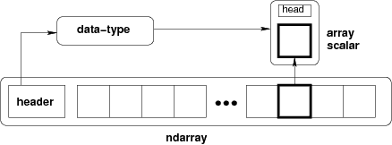

# 数组对象

> 原文：[`numpy.org/doc/1.26/reference/arrays.html`](https://numpy.org/doc/1.26/reference/arrays.html)

NumPy 提供了一个 N 维数组类型，即 ndarray，它描述了相同类型的“项”的集合。这些项可以使用 N 个整数之类的值进行索引。

所有 ndarrays 都是同构的：每个项目占用相同大小的内存块，并且所有块的解释方式完全相同。如何解释数组中的每个项目由一个单独的数据类型对象指定，其中每个数组都关联有一个数据类型对象。除了基本类型（整数、浮点数等），数据类型对象还可以表示数据结构。

通过索引等方式从数组中提取的项目由一个 Python 对象表示，其类型是 NumPy 中内置的数组标量类型之一。数组标量可以轻松操作更复杂的数据排列。

**图**：概念图展示了描述数组中数据的三个基本对象之间的关系：1）ndarray 本身，2）描述数组中单个固定大小元素布局的数据类型对象，3）当访问数组的单个元素时返回的数组标量 Python 对象。

+   N 维数组(`ndarray`)

    +   构造数组

    +   数组索引

    +   ndarray 的内部内存布局

    +   数组属性

    +   数组方法

    +   算术、矩阵乘法和比较操作

    +   特殊方法

+   标量

    +   内置标量类型

    +   属性

    +   索引

    +   方法

    +   定义新类型

+   数据类型对象(`dtype`)

    +   指定和构造数据类型

    +   `dtype`

+   索引例程

    +   生成索引数组

    +   类似索引的操作

    +   向数组中插入数据

    +   数组遍历

+   数组遍历

    +   单数组迭代

    +   广播数组迭代

    +   将内循环置于 Cython 中

+   标准数组子类

    +   特殊属性和方法

    +   矩阵对象

    +   内存映射文件数组

    +   字符数组 (`numpy.char`)

    +   记录数组 (`numpy.rec`)

    +   掩码数组 (`numpy.ma`)

    +   标准容器类

    +   数组迭代器

+   掩码数组

    +   `numpy.ma` 模块

    +   使用 numpy.ma

    +   示例

    +   `numpy.ma` 模块的常量

    +   `MaskedArray` 类

    +   `MaskedArray` 方法

    +   掩码数组操作

+   数组接口协议

    +   Python 端

    +   C 结构访问

    +   类型描述示例

    +   与数组接口（版本 2）的差异

+   日期时间和时间增量

    +   Datetime64 约定和假设

    +   基本日期时间

    +   日期时间和时间增量算术

    +   日期时间单位

    +   工作日功能

    +   Datetime64 的缺点
