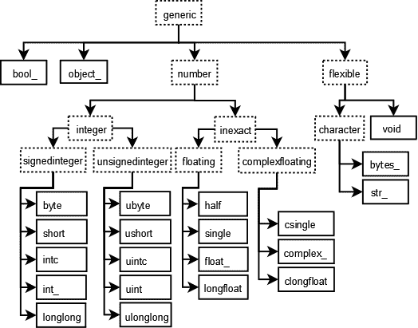

# 标量

> 原文：[`numpy.org/doc/1.26/reference/arrays.scalars.html`](https://numpy.org/doc/1.26/reference/arrays.scalars.html)

Python 仅定义了特定数据类的一种类型（只有一种整数类型，一种浮点类型等）。这在不需要考虑数据在计算机中的所有表示方式的应用程序中可能很方便。然而，对于科学计算，通常需要更多的控制。

在 NumPy 中，有 24 种新的基本 Python 类型来描述不同类型的标量。这些类型描述符主要基于 CPython 编写的 C 语言中可用的类型，还有几种与 Python 类型兼容的附加类型。

数组标量具有与`ndarrays`相同的属性和方法。[[1]](#id2) 这使得可以将数组的项部分地与数组相同地对待，从而平滑混合标量和数组操作时产生的粗糙边缘。

数组标量存在于数据类型的层次结构中（见下图）。可以使用层次结构检测它们：例如，`isinstance(val, np.generic)`将返回[`True`](https://docs.python.org/3/library/constants.html#True "(在 Python v3.11 中)")，如果*val*是一个数组标量对象。另外，可以使用数据类型层次结构的其他成员来确定存在哪种数组标量。因此，例如，如果*val*是复数类型，则`isinstance(val, np.complexfloating)`将返回[`True`](https://docs.python.org/3/library/constants.html#True "(在 Python v3.11 中)")，而如果*val*是灵活项大小数组类型之一（`str_`，`bytes_`，`void`），则`isinstance(val, np.flexible)`将返回 true。



**图：** 表示数组数据类型的类型对象层次结构。未显示的是指向平台上保存指针的整数类型`intp`和`uintp`。所有数字类型都可以使用位宽名称获取。

## 内置标量类型

内置标量类型如下所示。与字符代码相关联的 C 样式名称显示在其描述中。然而，不建议使用字符代码。

一些标量类型本质上等同于基本的 Python 类型，因此也继承自它们以及通用的数组标量类型：

| 数组标量类型 | 相关的 Python 类型 | 继承？ |
| --- | --- | --- |
| `int_` | [`int`](https://docs.python.org/3/library/functions.html#int "(在 Python v3.11 中)") | 仅 Python 2 |
| `float_` | [`float`](https://docs.python.org/3/library/functions.html#float "(在 Python v3.11 中)") | 是 |
| `complex_` | [`complex`](https://docs.python.org/3/library/functions.html#complex "(在 Python v3.11)") | 是 |
| `bytes_` | [`bytes`](https://docs.python.org/3/library/stdtypes.html#bytes "(在 Python v3.11)") | 是 |
| `str_` | [`str`](https://docs.python.org/3/library/stdtypes.html#str "(在 Python v3.11)") | 是 |
| `bool_` | [`bool`](https://docs.python.org/3/library/functions.html#bool "(在 Python v3.11)") | 否 |
| `datetime64` | [`datetime.datetime`](https://docs.python.org/3/library/datetime.html#datetime.datetime "(在 Python v3.11)") | 否 |
| `timedelta64` | [`datetime.timedelta`](https://docs.python.org/3/library/datetime.html#datetime.timedelta "(在 Python v3.11)") | 否 |

`bool_` 数据类型与 Python [`bool`](https://docs.python.org/3/library/functions.html#bool "(在 Python v3.11)") 非常相似，但不继承自它，因为 Python 的 [`bool`](https://docs.python.org/3/library/functions.html#bool "(在 Python v3.11)") 不允许被继承，并且在 C 级别上，实际布尔数据的大小与 Python 布尔标量不同。

警告

`int_` 类型**不**继承自[`int`](https://docs.python.org/3/library/functions.html#int "(在 Python v3.11)") 在 Python 3 下，因为类型[`int`](https://docs.python.org/3/library/functions.html#int "(在 Python v3.11)") 不再是固定宽度整数类型。

提示

NumPy 中的默认数据类型是`float_`。

```py
class numpy.generic
```

numpy 标量类型的基类。

大多数（全部？）numpy 标量类型派生的类。为了一致性，尽管许多随后的属性要么是“只读”，要么完全无关紧要，但暴露与`ndarray`相同的 API。这是强烈建议用户应该从中派生自定义标量类型的类。

```py
class numpy.number
```

所有数值标量类型的抽象基类。

### 整数类型

```py
class numpy.integer
```

所有整数标量类型的抽象基类。

注意

numpy 整数类型反映了 C 整数的行为，因此可能会受到溢出错误的影响。

#### 有符号整数类型

```py
class numpy.signedinteger
```

所有有符号整数标量类型的抽象基类。

```py
class numpy.byte
```

有符号整数类型，与 C `char` 兼容。

字符编码：

`'b'`

在此平台上的别名（Linux x86_64）：

`numpy.int8`: 8 位有符号整数（`-128` 到 `127`）。

```py
class numpy.short
```

有符号整数类型，与 C `short` 兼容。

字符编码：

`'h'`

在此平台上的别名（Linux x86_64）：

`numpy.int16`: 16 位有符号整数（`-32_768` 到 `32_767`）。

```py
class numpy.intc
```

有符号整数类型，与 C `int` 兼容。

字符编码：

`'i'`

在此平台上的别名（Linux x86_64）：

`numpy.int32`：32 位有符号整数（`-2_147_483_648` 到 `2_147_483_647`）。

```py
class numpy.int_
```

有符号整数类型，与 Python *int* 和 C 中的`long`兼容。

字符编码：

`'l'`

在此平台上的别名（Linux x86_64）：

`numpy.int64`：64 位有符号整数（`-9_223_372_036_854_775_808` 到 `9_223_372_036_854_775_807`）。

在此平台上的别名（Linux x86_64）：

`numpy.intp`：足够大以容纳指针的有符号整数，与 C 中的`intptr_t`兼容。

```py
class numpy.longlong
```

有符号整数类型，与 C 中的`long long`兼容。

字符编码：

`'q'`

#### 无符号整数类型

```py
class numpy.unsignedinteger
```

所有无符号整数标量类型的抽象基类。

```py
class numpy.ubyte
```

无符号整数类型，与 C 中的`unsigned char`兼容。

字符编码：

`'B'`

在此平台上的别名（Linux x86_64）：

`numpy.uint8`：8 位无符号整数（`0` 到 `255`）。

```py
class numpy.ushort
```

无符号整数类型，与 C 中的`unsigned short`兼容。

字符编码：

`'H'`

在此平台上的别名（Linux x86_64）：

`numpy.uint16`：16 位无���号整数（`0` 到 `65_535`）。

```py
class numpy.uintc
```

无符号整数类型，与 C 中的`unsigned int`兼容。

字符编码：

`'I'`

在此平台上的别名（Linux x86_64）：

`numpy.uint32`：32 位无符号整数（`0` 到 `4_294_967_295`）。

```py
class numpy.uint
```

无符号整数类型，与 C 中的`unsigned long`兼容。

字符编码：

`'L'`

在此平台上的别名（Linux x86_64）：

`numpy.uint64`：64 位无符号整数（`0` 到 `18_446_744_073_709_551_615`）。

在此平台上的别名（Linux x86_64）：

`numpy.uintp`：足够大以容纳指针的无符号整数，与 C 中的`uintptr_t`兼容。

```py
class numpy.ulonglong
```

有符号整数类型，与 C 中的`unsigned long long`兼容。

字符编码：

`'Q'`

### 非精确类型

```py
class numpy.inexact
```

所有数值标量类型的抽象基类，其值的表示（可能）不精确，例如浮点数。

注意

使用最少的十进制数字打印不精确标量，以区分其值与同一数据类型的其他值，通过谨慎的四舍五入。参见`format_float_positional`和`format_float_scientific`的`unique`参数。

这意味着具有相同二进制值但数据类型精度不同的变量可能显示不同：

```py
>>> f16 = np.float16("0.1")
>>> f32 = np.float32(f16)
>>> f64 = np.float64(f32)
>>> f16 == f32 == f64
True
>>> f16, f32, f64
(0.1, 0.099975586, 0.0999755859375) 
```

注意，这些浮点数中没有一个能够精确表示 \(\frac{1}{10}\) 的值；`f16`打印为`0.1`，因为它尽可能接近该值，而其他类型则不会，因为它们具有更高的精度，因此具有更接近的值。

相反，不同精度的浮点标量可能近似相同的十进制值，但尽管打印相同，它们可能不相等：

```py
>>> f16 = np.float16("0.1")
>>> f32 = np.float32("0.1")
>>> f64 = np.float64("0.1")
>>> f16 == f32 == f64
False
>>> f16, f32, f64
(0.1, 0.1, 0.1) 
```

#### 浮点数类型

```py
class numpy.floating
```

所有浮点数标量类型的抽象基类。

```py
class numpy.half
```

半精度浮点数类型。

字符编码：

`'e'`

在此平台（Linux x86_64）上的别名：

`numpy.float16`: 16 位精度浮点数类型：符号位，5 位指数，10 位尾数。

```py
class numpy.single
```

单精度浮点数类型，与 C 中的`float`兼容。

字符编码：

`'f'`

在此平台（Linux x86_64）上的别名：

`numpy.float32`: 32 位精度浮点数类型：符号位，8 位指数，23 位尾数。

```py
class numpy.double(x=0, /)
```

双精度浮点数类型，与 Python 的*float*和 C 中的`double`兼容。

字符编码：

`'d'`

别名：

`numpy.float_`

在此平台（Linux x86_64）上的别名：

`numpy.float64`: 64 位精度浮点数类型：符号位，11 位指数，52 位尾数。

```py
class numpy.longdouble
```

扩展精度浮点数类型，与 C 中的`long double`兼容，但不一定与 IEEE 754 四倍精度兼容。

字符编码：

`'g'`

别名：

`numpy.longfloat`

在此平台（Linux x86_64）上的别名：

`numpy.float128`: 128 位扩展精度浮点数类型。

#### 复数浮点类型

```py
class numpy.complexfloating
```

所有由浮点数组成的复数标量类型的抽象基类。

```py
class numpy.csingle
```

由两个单精度浮点数组成的复数类型。

字符编码：

`'F'`

别名：

`numpy.singlecomplex`

在此平台（Linux x86_64）上的别名：

`numpy.complex64`: 由两个 32 位精度浮点数组成的复数类型。

```py
class numpy.cdouble(real=0, imag=0)
```

由两个双精度浮点数组成的复数类型，与 Python 的*complex*兼容。

字符编码：

`'D'`

别名：

`numpy.cfloat`

别名：

`numpy.complex_`

在此平台（Linux x86_64）上的别名：

`numpy.complex128`: 由两个 64 位精度浮点数组成的复数类型。

```py
class numpy.clongdouble
```

由两个扩展精度浮点数组成的复数类型。

字符编码：

`'G'`

别名：

`numpy.clongfloat`

别名：

`numpy.longcomplex`

在此平台（Linux x86_64）上的别名：

`numpy.complex256`: 由两个 128 位扩展精度浮点数组成的复数类型。

### 其他类型

```py
class numpy.bool_
```

布尔类型（True 或 False），以字节形式存储。

警告

`bool_`类型不是`int_`类型的子类（`bool_`甚至不是一个数字类型）。这与 Python 默认实现中将[`bool`](https://docs.python.org/3/library/functions.html#bool "(在 Python v3.11 中)")作为[`int`](https://docs.python.org/3/library/functions.html#int "(在 Python v3.11 中)")的子类的方式不同。

字符编码：

`'?'`

```py
class numpy.datetime64
```

如果从 64 位整数创建，它表示从`1970-01-01T00:00:00`的偏移量。如果从字符串创建，字符串可以是 ISO 8601 日期或日期时间格式。

```py
>>> np.datetime64(10, 'Y')
numpy.datetime64('1980')
>>> np.datetime64('1980', 'Y')
numpy.datetime64('1980')
>>> np.datetime64(10, 'D')
numpy.datetime64('1970-01-11') 
```

更多信息请参见日期时间和时间增量。

字符编码：

`'M'`

```py
class numpy.timedelta64
```

以 64 位整数存储的时间增量。

更多信息请参见日期时间和时间增量。

字符编码：

`'m'`

```py
class numpy.object_
```

任何 Python 对象。

字符编码：

`'O'`

注意

实际存储在对象数组中（*即*，具有 dtype `object_`的数组）的数据是对 Python 对象的引用，而不是对象本身。因此，对象数组的行为更像是通常的 Python [`lists`](https://docs.python.org/3/library/stdtypes.html#list "(在 Python v3.11 中)")，即它们的内容不必是相同的 Python 类型。

对象类型也很特殊，因为包含`object_`项的数组在访问项时不会返回`object_`对象，而是返回数组项实际引用的对象。

以下数据类型是**灵活的**：它们没有预定义的大小，它们描述的数据在不同数组中的长度可以不同。（在字符代码中，`#`是一个整数，表示数据类型包含多少个元素。）

```py
class numpy.flexible
```

所有没有预定义长度的标量类型的抽象基类。这些类型的实际大小取决于特定的*np.dtype*实例化。

```py
class numpy.character
```

所有字符字符串标量类型的抽象基类。

```py
class numpy.bytes_
```

一个字节字符串。

在数组中使用时，此类型会去除尾随的空字节。

字符编码：

`'S'`

别名：

`numpy.string_`

```py
class numpy.str_
```

Unicode 字符串。

此类型会去除尾随的空代码点。

```py
>>> s = np.str_("abc\x00")
>>> s
'abc' 
```

与内置*str*不同，此类型支持[缓冲区协议](https://docs.python.org/3/c-api/buffer.html#bufferobjects "(在 Python v3.11 中)")，将其内容公开为 UCS4：

```py
>>> m = memoryview(np.str_("abc"))
>>> m.format
'3w'
>>> m.tobytes()
b'a\x00\x00\x00b\x00\x00\x00c\x00\x00\x00' 
```

字符编码：

`'U'`

别名：

`numpy.unicode_`

```py
class numpy.void(length_or_data, /, dtype=None)
```

创建一个新的结构化或未结构化空白标量。

参数：

**length_or_data**int，类似数组，类似字节，对象

多重含义之一（请参阅注释）。未结构化空白的长度或字节数据。或者，当提供`dtype`时，要存储在新标量中的数据。这可以是类似数组的东西，如果是这种情况，可能会返回一个数组。

**dtype**dtype，可选

> 如果提供了新标量的 dtype。此 dtype 必须是“void” dtype（即结构化或非结构化 void，请参阅结构化数据类型）。

..versionadded:: 1.24

注释

出于历史原因和因为 void 标量可以表示任意字节数据和结构化数据类型，void 构造函数有三种调用约定：

1.  `np.void(5)` 创建一个填充有五个`\0`字节的`dtype="V5"`标量。这里的 5 可以是 Python 或 NumPy 整数。

1.  `np.void(b"bytes-like")` 从字节字符串创建一个 void 标量。dtype 的 itemsize 将匹配字节字符串的长度，这里是`"V10"`。

1.  当传递 `dtype=` 时，调用与数组创建大致相同。但是，返回的是一个 void 标量而不是数组。

请查看展示所有三种不同约定的示例。

示例

```py
>>> np.void(5)
void(b'\x00\x00\x00\x00\x00')
>>> np.void(b'abcd')
void(b'\x61\x62\x63\x64')
>>> np.void((5, 3.2, "eggs"), dtype="i,d,S5")
(5, 3.2, b'eggs')  # looks like a tuple, but is `np.void`
>>> np.void(3, dtype=[('x', np.int8), ('y', np.int8)])
(3, 3)  # looks like a tuple, but is `np.void` 
```

字符代码：

`'V'`

警告

请参阅字符串类型注释。

数值兼容性：如果您在您的 Numeric 代码中使用了旧的类型代码字符（这从未被推荐过），您将需要将其中一些更改为新字符。特别是，需要更改的是 `c -> S1`、`b -> B`、`1 -> b`、`s -> h`、`w -> H`和`u -> I`。这些更改使类型字符约定更加一致，与其他 Python 模块（如[`struct`](https://docs.python.org/3/library/struct.html#module-struct "(在 Python v3.11 中)")模块）一致。

### 大小别名

除了它们（大部分）源自 C 的名称外，整数、浮点数和复数数据类型也可以使用位宽约定来使用，以确保始终可以确保正确大小的数组。还提供了两个别名（`numpy.intp`和`numpy.uintp`），指向足够大以容纳 C 指针的整数类型。

```py
numpy.int8
```

```py
numpy.int16
```

```py
numpy.int32
```

```py
numpy.int64
```

有指定位数的有符号整数类型的别名（`numpy.byte`、`numpy.short`、`numpy.intc`、`numpy.int_`和`numpy.longlong`之一）。

兼容于 C99 `int8_t`、`int16_t`、`int32_t`和`int64_t`。

```py
numpy.uint8
```

```py
numpy.uint16
```

```py
numpy.uint32
```

```py
numpy.uint64
```

无符号整数类型的别名（`numpy.ubyte`、`numpy.ushort`、`numpy.uintc`、`numpy.uint`和`numpy.ulonglong`之一）。

兼容于 C99 `uint8_t`、`uint16_t`、`uint32_t`和`uint64_t`。

```py
numpy.intp
```

有相同大小作为指针的有符号整数类型的别名（`numpy.byte`、`numpy.short`、`numpy.intc`、`numpy.int_`和*np.longlong*)。

兼容于 C `intptr_t`。

字符代码：

`'p'`

```py
numpy.uintp
```

无符号整数类型的别名（其中之一是`numpy.ubyte`，`numpy.ushort`，`numpy.uintc`，`numpy.uint`和*np.ulonglong*），与指针大小相同。

与 C `uintptr_t` 兼容。

字符代码：

`'P'`

```py
numpy.float16
```

`half`的别名

```py
numpy.float32
```

`single`的别名

```py
numpy.float64
```

`double`的别名

```py
numpy.float96
```

```py
numpy.float128
```

别名为`numpy.longdouble`，根据其位数命名。这些别名的存在取决于平台。

```py
numpy.complex64
```

`csingle`的别名

```py
numpy.complex128
```

`cdouble`的别名

```py
numpy.complex192
```

```py
numpy.complex256
```

别名为`numpy.clongdouble`，根据其位数命名。这些别名的存在取决于平台。

### 其他别名

前两个是类似于内置类型名称的便利方式，与`bool_`，`int_`，`str_`，`bytes_`和`object_`相同风格：

```py
numpy.float_
```

`double`的别名

```py
numpy.complex_
```

`cdouble`的别名

一些使用扩展精度浮点数和复数的备用命名约定：

```py
numpy.longfloat
```

`longdouble`的别名

```py
numpy.singlecomplex
```

`csingle`的别名

```py
numpy.cfloat
```

`cdouble`的别名

```py
numpy.longcomplex
```

`clongdouble`的别名

```py
numpy.clongfloat
```

`clongdouble`的别名

以下别名源自 Python 2，建议不要在新代码中使用它们。

```py
numpy.string_
```

`bytes_`的别名

```py
numpy.unicode_
```

`str_`的别名

## 属性

数组标量对象具有`NPY_SCALAR_PRIORITY`（-1,000,000.0）的`array priority`。它们还没有（但是）具有`ctypes`属性。否则，它们与数组共享相同的属性：

| `generic.flags` | 标志的整数值。 |
| --- | --- |
| `generic.shape` | 数组维度的元组。 |
| `generic.strides` | 每个维度中的字节步长元组。 |
| `generic.ndim` | 数组维度的数量。 |
| `generic.data` | 数据起始指针。 |
| `generic.size` | gentype 中元素的数量。 |
| `generic.itemsize` | 一个元素的长度（以字节为单位）。 |
| `generic.base` | 与相应数组属性相同的标量属性。 |
| `generic.dtype` | 获取数组数据描述符。 |
| `generic.real` | 标量的实部。 |
| `generic.imag` | 标量的虚部。 |
| `generic.flat` | 标量的 1-D 视图。 |
| `generic.T` | 与相应数组属性相同的标量属性。 |
| `generic.__array_interface__` | 数组协议：Python 端 |
| `generic.__array_struct__` | 数组协议：结构 |
| `generic.__array_priority__` | 数组优先级。 |
| `generic.__array_wrap__` | sc.__array_wrap__(obj) 从数组返回标量 |

## 索引

另请参阅

索引例程, 数据类型对象（dtype）

数组标量可以像零维数组一样进行索引：如果 *x* 是一个数组标量，

+   `x[()]` 返回数组标量的副本

+   `x[...]` 返回一个零维 `ndarray`

+   `x['field-name']` 返回字段 *field-name* 中的数组标量。 (*x* 可以有字段，例如，当它对应于结构化数据类型时。)

## 方法

数组标量具有与数组完全相同的方法。 这些方法的默认行为是将标量内部转换为等效的零维数组，并调用相应的数组方法。 此外，对数组标量的数学运算被定义为设置相同的硬件标志并用于解释结果，就像对 ufunc 一样，因此对数组标量的数学运算也继承了用于 ufuncs 的错误状态。

以上规则的例外情况如下：

| `generic.__array__` | sc.__array__(dtype) 从具有指定 dtype 的标量返回 0 维数组 |
| --- | --- |
| `generic.__array_wrap__` | sc.__array_wrap__(obj) 从数组返回标量 |
| `generic.squeeze` | 与相应数组属性相同的标量方法。 |
| `generic.byteswap` | 与相应数组属性相同的标量方法。 |
| `generic.__reduce__` | pickle 的辅助方法。 |
| `generic.__setstate__` |  |
| `generic.setflags` | 与相应数组属性相同的标量方法。 |

类型定义实用方法：

| `number.__class_getitem__`(item, /) | 返回围绕`number`类型的参数化包装器。 |
| --- | --- |

## 定义新类型

有效定义新数组标量类型的两种方法（除了从内置标量类型组合结构化类型 dtypes）：一种方法是简单地子类化`ndarray`并重写感兴趣的方法。这在一定程度上可以工作，但在内部，某些行为是由数组的数据类型固定的。要完全自定义数组的数据类型，您需要定义一个新的数据类型，并在 NumPy 中注册它。这样的新类型只能在 C 中定义，使用 NumPy C-API。

## 内置标量类型

下面显示了内置标量类型。类似 C 的名称与字符代码相关联，这些字符代码显示在其描述中。然而，不建议使用字符代码。

一些标量类型本质上等同于基本的 Python 类型，因此也从它们那里继承，以及从通用数组标量类型继承：

| 数组标量类型 | 相关的 Python 类型 | 继承？ |
| --- | --- | --- |
| `int_` | [`int`](https://docs.python.org/3/library/functions.html#int "(在 Python v3.11 中)") | 仅适用于 Python 2 |
| `float_` | [`float`](https://docs.python.org/3/library/functions.html#float "(在 Python v3.11 中)") | 是 |
| `complex_` | [`complex`](https://docs.python.org/3/library/functions.html#complex "(在 Python v3.11 中)") | 是 |
| `bytes_` | [`bytes`](https://docs.python.org/3/library/stdtypes.html#bytes "(在 Python v3.11 中)") | 是 |
| `str_` | [`str`](https://docs.python.org/3/library/stdtypes.html#str "(在 Python v3.11 中)") | 是 |
| `bool_` | [`bool`](https://docs.python.org/3/library/functions.html#bool "(在 Python v3.11 中)") | 否 |
| `datetime64` | [`datetime.datetime`](https://docs.python.org/3/library/datetime.html#datetime.datetime "(在 Python v3.11 中)") | 否 |
| `timedelta64` | [`datetime.timedelta`](https://docs.python.org/3/library/datetime.html#datetime.timedelta "(在 Python v3.11 中)") | 否 |

`bool_`数据类型与 Python [`bool`](https://docs.python.org/3/library/functions.html#bool "(在 Python v3.11 中)")非常相似，但不继承自它，因为 Python 的[`bool`](https://docs.python.org/3/library/functions.html#bool "(在 Python v3.11 中)")不允许被继承，而且在 C 级别上，实际布尔数据的大小与 Python 布尔标量不同。

警告

`int_`类型**不**继承自 Python 3 下的[`int`](https://docs.python.org/3/library/functions.html#int "(在 Python v3.11 中)")内置类型，因为类型[`int`](https://docs.python.org/3/library/functions.html#int "(在 Python v3.11 中)")不再是固定宽度整数类型。

提示

NumPy 中的默认数据类型是`float_`。

```py
class numpy.generic
```

numpy 标量类型的基类。

大多数（全部？）numpy 标量类型派生自的类。为了保持一致性，尽管许多后续属性要么是“只读”，要么完全无关紧要，但它暴露与`ndarray`相同的 API。强烈建议用户从这个类派生自定义标量类型。

```py
class numpy.number
```

所有数值标量类型的抽象基类。

### 整数类型

```py
class numpy.integer
```

所有整数标量类型的抽象基类。

注意

numpy 整数类型反映了 C 整数的行为，因此可能会受到溢出错误的影响。

#### 有符号整数类型

```py
class numpy.signedinteger
```

所有有符号整数标量类型的抽象基类。

```py
class numpy.byte
```

有符号整数类型，与 C `char`兼容。

字符编码：

`'b'`

在此平台上的别名（Linux x86_64）：

`numpy.int8`：8 位有符号整数（`-128`到`127`）。

```py
class numpy.short
```

有符号整数类型，与 C `short`兼容。

字符编码：

`'h'`

在此平台上的别名（Linux x86_64）：

`numpy.int16`：16 位有符号整数（`-32_768`到`32_767`）。

```py
class numpy.intc
```

有符号整数类型，与 C `int`兼容。

字符编码：

`'i'`

在此平台上的别名（Linux x86_64）：

`numpy.int32`：32 位有符号整数（`-2_147_483_648`到`2_147_483_647`）。

```py
class numpy.int_
```

有符号整数类型，与 Python *int*和 C `long`兼容。

字符编码:

`'l'`

该平台上的别名（Linux x86_64）:

`numpy.int64`: 64 位有符号整数（`-9_223_372_036_854_775_808` 到 `9_223_372_036_854_775_807`）。

该平台上的别名（Linux x86_64）:

`numpy.intp`: 足够大以适应指针的有符号整数，与 C `intptr_t` 兼容。

```py
class numpy.longlong
```

有符号整数类型，与 C `long long` 兼容。

字符编码:

`'q'`

#### 无符号整数类型

```py
class numpy.unsignedinteger
```

所有无符号整数标量类型的抽象基类。

```py
class numpy.ubyte
```

无符号整数类型，与 C `unsigned char` 兼容。

字符编码:

`'B'`

该平台上的别名（Linux x86_64）:

`numpy.uint8`: 8 位无符号整数（`0` 到 `255`）。

```py
class numpy.ushort
```

无符号整数类型，与 C `unsigned short` 兼容。

字符编码:

`'H'`

该平台上的别名（Linux x86_64）:

`numpy.uint16`: 16 位无符号整数（`0` 到 `65_535`）。

```py
class numpy.uintc
```

无符号整数类型，与 C `unsigned int` 兼容。

字符编码:

`'I'`

该平台上的别名（Linux x86_64）:

`numpy.uint32`: 32 位无符号整数（`0` 到 `4_294_967_295`）。

```py
class numpy.uint
```

无符号整数类型，与 C `unsigned long` 兼容。

字符编码:

`'L'`

该平台上的别名（Linux x86_64）:

`numpy.uint64`: 64 位无符号整数（`0` 到 `18_446_744_073_709_551_615`）。

该平台上的别名（Linux x86_64）:

`numpy.uintp`: 足够大以适应指针的无符号整数，与 C `uintptr_t` 兼容。

```py
class numpy.ulonglong
```

有符号整数类型，与 C `unsigned long long` 兼容。

字符编码:

`'Q'`

### 不精确类型

```py
class numpy.inexact
```

所有数值标量类型的抽象基类，其值在其范围内具有（可能）不精确的表示，例如浮点数。

注意

不精确的标量使用最少的十进制数字打印，以区分其值与同一数据类型的其他值，通过谨慎的四舍五入。参见 `format_float_positional` 和 `format_float_scientific` 的 `unique` 参数。

这意味着具有相同二进制值但数据类型精度不同的变量可能显示不同：

```py
>>> f16 = np.float16("0.1")
>>> f32 = np.float32(f16)
>>> f64 = np.float64(f32)
>>> f16 == f32 == f64
True
>>> f16, f32, f64
(0.1, 0.099975586, 0.0999755859375) 
```

请注意，这些浮点数中没有一个保存精确值 \(\frac{1}{10}\)；`f16` 打印为 `0.1`，因为它尽可能接近该值，而其他类型不会，因为它们具有更高的精度，因此具有更接近的值。

相反，不同精度的浮点标量可能显示为不同的十进制值，尽管打印相同：

```py
>>> f16 = np.float16("0.1")
>>> f32 = np.float32("0.1")
>>> f64 = np.float64("0.1")
>>> f16 == f32 == f64
False
>>> f16, f32, f64
(0.1, 0.1, 0.1) 
```

#### 浮点类型

```py
class numpy.floating
```

所有浮点标量类型的抽象基类。

```py
class numpy.half
```

半精度浮点数类��。

字符编码:

`'e'`

该平台上的别名（Linux x86_64）:

`numpy.float16`：16 位精度浮点数类型：符号位，5 位指数，10 位尾数。

```py
class numpy.single
```

单精度浮点数类型，与 C `float` 兼容。

字符编码：

`'f'`

在这个平台上的别名（Linux x86_64）：

`numpy.float32`：32 位精度浮点数类型：符号位，8 位指数，23 位尾数。

```py
class numpy.double(x=0, /)
```

双精度浮点数类型，与 Python *float* 和 C `double` 兼容。

字符编码：

`'d'`

别名：

`numpy.float_`

在这个平台上的别名（Linux x86_64）：

`numpy.float64`：64 位精度浮点数类型：符号位，11 位指数，52 位尾数。

```py
class numpy.longdouble
```

扩展精度浮点数类型，与 C `long double` 兼容，但不一定与 IEEE 754 四倍精度兼容。

字符编码：

`'g'`

别名：

`numpy.longfloat`

在这个平台上的别名（Linux x86_64）：

`numpy.float128`：128 位扩展精度浮点数类型。

#### 复数浮点类型

```py
class numpy.complexfloating
```

所有由浮点数组成的复数标量类型的抽象基类。

```py
class numpy.csingle
```

由两个单精度浮点数组成的复数类型。

字符编码：

`'F'`

别名：

`numpy.singlecomplex`

在这个平台上的别名（Linux x86_64）：

`numpy.complex64`：由两个 32 位精度浮点数组成的复数类型。

```py
class numpy.cdouble(real=0, imag=0)
```

由两个双精度浮点数组成的复数类型，与 Python *complex* 兼容。

字符编码：

`'D'`

别名：

`numpy.cfloat`

别名：

`numpy.complex_`

在这个平台上的别名（Linux x86_64）：

`numpy.complex128`：由两个 64 位精度浮点数组成的复数类型。

```py
class numpy.clongdouble
```

由两个扩展精度浮点数组成的复数类型。

字符编码：

`'G'`

别名：

`numpy.clongfloat`

别名：

`numpy.longcomplex`

在这个平台上的别名（Linux x86_64）：

`numpy.complex256`：由两个 128 位扩展精度浮点数组成的复数类型。

### 其他类型

```py
class numpy.bool_
```

布尔类型（True 或 False），存储为一个字节。

警告

`bool_` 类型不是 `int_` 类型的子类（`bool_` 甚至不是一个数字类型）。这与 Python 默认实现的 [`bool`](https://docs.python.org/3/library/functions.html#bool "(在 Python v3.11)") 作为 [`int`](https://docs.python.org/3/library/functions.html#int "(在 Python v3.11)") 的子类不同。

字符编码：

`'?'`

```py
class numpy.datetime64
```

如果从 64 位整数创建，则表示从`1970-01-01T00:00:00`的偏移量。如果从字符串创建，则字符串可以是 ISO 8601 日期或日期时间格式。

```py
>>> np.datetime64(10, 'Y')
numpy.datetime64('1980')
>>> np.datetime64('1980', 'Y')
numpy.datetime64('1980')
>>> np.datetime64(10, 'D')
numpy.datetime64('1970-01-11') 
```

更多信息请参见日期时间和时间间隔。

字符编码：

`'M'`

```py
class numpy.timedelta64
```

以 64 位整数存储的时间间隔。

更多信息请参见日期时间和时间间隔。

字符编码：

`'m'`

```py
class numpy.object_
```

任何 Python 对象。

字符编码：

`'O'`

注意

实际存储在对象数组中的数据（即具有 dtype `object_` 的数组）是对 Python 对象的引用，而不是对象本身。因此，对象数组的行为更像通常的 Python [`lists`](https://docs.python.org/3/library/stdtypes.html#list "(在 Python v3.11 中)")，即它们的内容不必是相同的 Python 类型。

对象类型也很特殊，因为包含`object_`项的数组在访问项时不会返回一个`object_`对象，而是返回数组项所指的实际对象。

以下数据类型是**灵活的**：它们没有预定义的大小，它们描述的数据在不同数组中可以是不同长度的。（在字符编码中，`#`是一个整数，表示数据类型包含多少个元素。）

```py
class numpy.flexible
```

所有没有预定义长度的标量类型的抽象基类。这些类型的实际大小取决于特定的*np.dtype*实例化。

```py
class numpy.character
```

所有字符字符串标量类型的抽象基类。

```py
class numpy.bytes_
```

一个字节字符串。

在数组中使用时，此类型会去除尾随的空字节。

字符编码：

`'S'`

别名：

`numpy.string_`

```py
class numpy.str_
```

一个 Unicode 字符串。

此类型会去除尾随的空代码点。

```py
>>> s = np.str_("abc\x00")
>>> s
'abc' 
```

与内置的*str*不同，这支持[缓冲区协议](https://docs.python.org/3/c-api/buffer.html#bufferobjects "(在 Python v3.11 中)")，将其内容公开为 UCS4：

```py
>>> m = memoryview(np.str_("abc"))
>>> m.format
'3w'
>>> m.tobytes()
b'a\x00\x00\x00b\x00\x00\x00c\x00\x00\x00' 
```

字符编码：

`'U'`

别名：

`numpy.unicode_`

```py
class numpy.void(length_or_data, /, dtype=None)
```

创建一个新的结构化或无结构化空标量。

参数：

**length_or_data**int，类似数组，类似字节，对象

具有多重含义之一（请参阅注释）。无结构空白的长度或字节数据。或者，当提供`dtype`时要存储在新标量中的数据。这可以是类似数组的东西，如果是这种情况，可能会返回一个数组。

**dtype**dtype，可选

> 如果提供了新标量的 dtype。此 dtype 必须是“void”dtype（即结构化或无结构化空，另请参见结构化数据类型）。

..versionadded:: 1.24

注释

由于历史原因和因为空标量可以表示任意字节数据和结构化的 dtype，空构造函数有三种调用约定：

1.  `np.void(5)` 创建一个填充有五个`\0`字节的`dtype="V5"`标量。5 可以是 Python 或 NumPy 整数。

1.  `np.void(b"bytes-like")` 从字节字符串创建一个空标量。dtype 的 itemsize 将匹配字节字符串的长度，这里是 `"V10"`。

1.  当传递 `dtype=` 时，调用与数组创建大致相同。但是，返回的是一个空标量而不是数组。

请查看示例，展示了所有三种不同的约定。

示例

```py
>>> np.void(5)
void(b'\x00\x00\x00\x00\x00')
>>> np.void(b'abcd')
void(b'\x61\x62\x63\x64')
>>> np.void((5, 3.2, "eggs"), dtype="i,d,S5")
(5, 3.2, b'eggs')  # looks like a tuple, but is `np.void`
>>> np.void(3, dtype=[('x', np.int8), ('y', np.int8)])
(3, 3)  # looks like a tuple, but is `np.void` 
```

字符代码：

`'V'`

警告

请参阅字符串类型注释。

数值兼容性：如果您在 Numeric 代码中使用了旧的类型代码字符（这从未被推荐过），您将需要将其中一些更改为新字符。特别是，需要更改的是 `c -> S1`，`b -> B`，`1 -> b`，`s -> h`，`w -> H` 和 `u -> I`。这些更改使类型字符约定更加一致，与其他 Python 模块（如 [`struct`](https://docs.python.org/3/library/struct.html#module-struct "(在 Python v3.11 中)") 模块）一致。

### 大小别名

除了它们（大多数）源自 C 的名称之外，整数、浮点和复数数据类型还可以使用位宽约定来使用，以确保始终可以确保正确大小的数组。还提供了两个别名（`numpy.intp` 和 `numpy.uintp`），指向足够大以容纳 C 指针的整数类型。

```py
numpy.int8
```

```py
numpy.int16
```

```py
numpy.int32
```

```py
numpy.int64
```

具有指定位数的有符号整数类型的别名（`numpy.byte`、`numpy.short`、`numpy.intc`、`numpy.int_` 和 `numpy.longlong`)。

与 C99 中的 `int8_t`、`int16_t`、`int32_t` 和 `int64_t` 兼容。

```py
numpy.uint8
```

```py
numpy.uint16
```

```py
numpy.uint32
```

```py
numpy.uint64
```

具有指定位数的无符号整数类型的别名（`numpy.ubyte`、`numpy.ushort`、`numpy.uintc`、`numpy.uint` 和 `numpy.ulonglong`)。

与 C99 中的 `uint8_t`、`uint16_t`、`uint32_t` 和 `uint64_t` 兼容。

```py
numpy.intp
```

作为指针大小相同的有符号整数类型的别名（`numpy.byte`、`numpy.short`、`numpy.intc`、`numpy.int_` 和 *np.longlong*）。

与 C `intptr_t` 兼容。

字符代码：

`'p'`

```py
numpy.uintp
```

作为指针大小相同的无符号整数类型的别名（`numpy.ubyte`、`numpy.ushort`、`numpy.uintc`、`numpy.uint` 和 *np.ulonglong*）。

与 C `uintptr_t` 兼容。

字符代码：

`'P'`

```py
numpy.float16
```

`half` 的别名

```py
numpy.float32
```

`single` 的别名

```py
numpy.float64
```

`double` 的别名

```py
numpy.float96
```

```py
numpy.float128
```

别名为`numpy.longdouble`，根据其位数命名。这些别名的存在取决于平台。

```py
numpy.complex64
```

别名为`csingle`

```py
numpy.complex128
```

别名为`cdouble`

```py
numpy.complex192
```

```py
numpy.complex256
```

别名为`numpy.clongdouble`，根据其位数命名。这些别名的存在取决于平台。

### 其他别名

前两个是方便起见，类似于内置类型的名称，与`bool_`、`int_`、`str_`、`bytes_`和`object_`的风格相同：

```py
numpy.float_
```

别名为`double`

```py
numpy.complex_
```

别名为`cdouble`

一些使用扩展精度浮点数和复数的替代命名约定：

```py
numpy.longfloat
```

别名为`longdouble`

```py
numpy.singlecomplex
```

别名为`csingle`

```py
numpy.cfloat
```

别名为`cdouble`

```py
numpy.longcomplex
```

别名为`clongdouble`

```py
numpy.clongfloat
```

别名为`clongdouble`

以下别名源自 Python 2，建议不要在新代码中使用。

```py
numpy.string_
```

别名为`bytes_`

```py
numpy.unicode_
```

别名为`str_`

### 整数类型

```py
class numpy.integer
```

所有整数标量类型的抽象基类。

注意

numpy 整数类型反映了 C 整数的行为，因此可能会受到溢出错误的影响。

#### 有符号整数类型

```py
class numpy.signedinteger
```

所有有符号整数标量类型的抽象基类。

```py
class numpy.byte
```

有符号整数类型，与 C `char`兼容。

字符编码：

`'b'`

在这个平台上的别名（Linux x86_64）：

`numpy.int8`：8 位有符号整数（`-128`到`127`）。

```py
class numpy.short
```

有符号整数类型，与 C `short`兼容。

字符编码：

`'h'`

在这个平台上的别名（Linux x86_64）：

`numpy.int16`：16 位有符号整数（`-32_768`到`32_767`）。

```py
class numpy.intc
```

有符号整数类型，与 C `int`兼容。

字符编码：

`'i'`

在这个平台上的别名（Linux x86_64）：

`numpy.int32`：32 位有符号整数（`-2_147_483_648`到`2_147_483_647`）。

```py
class numpy.int_
```

有符号整数类型，与 Python *int*和 C `long`兼容。

字符编码：

`'l'`

在这个平台上的别名（Linux x86_64）：

`numpy.int64`：64 位有符号整数（`-9_223_372_036_854_775_808`到`9_223_372_036_854_775_807`）。

在这个平台上的别名（Linux x86_64）：

`numpy.intp`：足够大以适应指针的有符号整数，与 C `intptr_t`兼容。

```py
class numpy.longlong
```

有符号整数类型，与 C `long long`兼容。

字符编码：

`'q'`

#### 无符号整数类型

```py
class numpy.unsignedinteger
```

所有无符号整数标量类型的抽象基类。

```py
class numpy.ubyte
```

无符号整数类型，与 C `unsigned char`兼容。

字符编码：

`'B'`

在这个平台上的别名（Linux x86_64）：

`numpy.uint8`: 8 位无符号整数（`0` 到 `255`）。

```py
class numpy.ushort
```

无符号整数类型，与 C `unsigned short` 兼容。

字符编码：

`'H'`

在这个平台上的别名（Linux x86_64）：

`numpy.uint16`: 16 位无符号整数（`0` 到 `65_535`）。

```py
class numpy.uintc
```

无符号整数类型，与 C `unsigned int` 兼容。

字符编码：

`'I'`

在这个平台上的别名（Linux x86_64）：

`numpy.uint32`: 32 位无符号整数（`0` 到 `4_294_967_295`）。

```py
class numpy.uint
```

无符号整数类型，与 C `unsigned long` 兼容。

字符编码：

`'L'`

在这个平台上的别名（Linux x86_64）：

`numpy.uint64`: 64 位无符号整数（`0` 到 `18_446_744_073_709_551_615`）。

在这个平台上的别名（Linux x86_64）：

`numpy.uintp`: 足够大以容纳指针的无符号整数，与 C `uintptr_t` 兼容。

```py
class numpy.ulonglong
```

有符号整数类型，与 C `unsigned long long` 兼容。

字符编码：

`'Q'`

#### 有符号整数类型

```py
class numpy.signedinteger
```

所有有符号整数标量类型的抽象基类。

```py
class numpy.byte
```

有符号整数类型，与 C `char` 兼容。

字符编码：

`'b'`

在这个平台上的别名（Linux x86_64）：

`numpy.int8`: 8 位有符号整数（`-128` 到 `127`）。

```py
class numpy.short
```

有符号整数类型，与 C `short` 兼容。

字符编码：

`'h'`

在这个平台上的别名（Linux x86_64）：

`numpy.int16`: 16 位有符号整数（`-32_768` 到 `32_767`）。

```py
class numpy.intc
```

有符号整数类型，与 C `int` 兼容。

字符编码：

`'i'`

在这个平台上的别名（Linux x86_64）：

`numpy.int32`: 32 位有符号整数（`-2_147_483_648` 到 `2_147_483_647`）。

```py
class numpy.int_
```

有符号整数类型，与 Python *int* 和 C `long` 兼容。

字符编码：

`'l'`

在这个平台上的别名（Linux x86_64）：

`numpy.int64`: 64 位有符号整数（`-9_223_372_036_854_775_808` 到 `9_223_372_036_854_775_807`）。

在这个平台上的别名（Linux x86_64）：

`numpy.intp`: 足够大以容纳指针的有符号整数，与 C `intptr_t` 兼容。

```py
class numpy.longlong
```

有符号整数类型，与 C `long long` 兼容。

字符编码：

`'q'`

#### 无符号整数类型

```py
class numpy.unsignedinteger
```

所有无符号整数标量类型的抽象基类。

```py
class numpy.ubyte
```

无符号整数类型，与 C `unsigned char` 兼容。

字符编码：

`'B'`

在这个平台上的别名（Linux x86_64）：

`numpy.uint8`: 8 位无符号整数（`0` 到 `255`）。

```py
class numpy.ushort
```

无符号整数类型，与 C `unsigned short` 兼容。

字符编码：

`'H'`

在这个平台上的别名（Linux x86_64）：

`numpy.uint16`: 16 位无符号整数（`0` 到 `65_535`）。

```py
class numpy.uintc
```

无符号整数类型，与 C `unsigned int` 兼容。

字符编码：

`'I'`

在这个平台上的别名（Linux x86_64）：

`numpy.uint32`: 32 位无符号整数（`0` 到 `4_294_967_295`）。

```py
class numpy.uint
```

无符号整数类型，与 C `unsigned long` 兼容。

字符编码：

`'L'`

在此平台上的别名（Linux x86_64）：

`numpy.uint64`：64 位无符号整数（`0`到`18_446_744_073_709_551_615`）。

在此平台上的别名（Linux x86_64）：

`numpy.uintp`：足够大以适应指针的无符号整数，与 C `uintptr_t`兼容。

```py
class numpy.ulonglong
```

有符号整数类型，与 C `unsigned long long`兼容。

字符编码：

`'Q'`

### 不精确类型

```py
class numpy.inexact
```

所有数值标量类型的抽象基类，其值的表示（可能）不精确，如浮点数。

注意

使用最少的十进制数字打印不精确标量，以区分其值与同一数据类型的其他值，通过谨慎的四舍五入。参见`format_float_positional`和`format_float_scientific`的`unique`参数。

这意味着具有相同二进制值但数据类型不同精度的变量可能显示不同：

```py
>>> f16 = np.float16("0.1")
>>> f32 = np.float32(f16)
>>> f64 = np.float64(f32)
>>> f16 == f32 == f64
True
>>> f16, f32, f64
(0.1, 0.099975586, 0.0999755859375) 
```

请注意，这些浮点数中没有一个保存精确值\(\frac{1}{10}\)；`f16`打印为`0.1`，因为它尽可能接近该值，而其他类型不会，因为它们具有更高的精度，因此具有更接近的值。

相反，近似相同十进制值的不同精度的浮点标量可能比较不相等，尽管打印相同：

```py
>>> f16 = np.float16("0.1")
>>> f32 = np.float32("0.1")
>>> f64 = np.float64("0.1")
>>> f16 == f32 == f64
False
>>> f16, f32, f64
(0.1, 0.1, 0.1) 
```

#### 浮点类型

```py
class numpy.floating
```

所有浮点标量类型的抽象基类。

```py
class numpy.half
```

半精度浮点数类型。

字符编码：

`'e'`

在此平台上的别名（Linux x86_64）：

`numpy.float16`：16 位精度浮点数类型：符号位，5 位指数，10 位尾数。

```py
class numpy.single
```

单精度浮点数类型，与 C `float`兼容。

字符编码：

`'f'`

在此平台上的别名（Linux x86_64）：

`numpy.float32`：32 位精度浮点数类型：符号位，8 位指数，23 位尾数。

```py
class numpy.double(x=0, /)
```

双精度浮点数类型，与 Python *float*和 C `double`兼容。

字符编码：

`'d'`

别名：

`numpy.float_`

在此平台上的别名（Linux x86_64）：

`numpy.float64`：64 位精度浮点数类型：符号位，11 位指数，52 位尾数。

```py
class numpy.longdouble
```

扩展精度浮点数类型，与 C `long double`兼容，但不一定与 IEEE 754 四倍精度兼容。

字符编码：

`'g'`

别名：

`numpy.longfloat`

在此平台上的别名（Linux x86_64）：

`numpy.float128`：128 位扩展精度浮点数类型。

#### 复数浮点类型

```py
class numpy.complexfloating
```

由浮点数组成的所有复数标量类型的抽象基类。

```py
class numpy.csingle
```

由两个单精度浮点数组成的复数类型。

字符编码：

`'F'`

别名：

`numpy.singlecomplex`

在此平台上的别名（Linux x86_64）：

`numpy.complex64`：由两个 32 位精度浮点数组成的复数类型。

```py
class numpy.cdouble(real=0, imag=0)
```

由两个双精度浮点数组成的复数类型，与 Python *complex*兼容。

字符编码：

`'D'`

别名：

`numpy.cfloat`

别名：

`numpy.complex_`

在此平台上的别名（Linux x86_64）：

`numpy.complex128`：由两个 64 位精度浮点数组成的复数类型。

```py
class numpy.clongdouble
```

由两个扩展精度浮点数组成的复数类型。

字符编码：

`'G'`

别名：

`numpy.clongfloat`

别名：

`numpy.longcomplex`

在此平台上的别名（Linux x86_64）：

`numpy.complex256`：由两个 128 位扩展精度浮点数组成的复数类型。

#### 浮点数类型

```py
class numpy.floating
```

所有浮点数标量类型的抽象基类。

```py
class numpy.half
```

半精度浮点数类型。

字符编码：

`'e'`

在此平台上的别名（Linux x86_64）：

`numpy.float16`：16 位精度浮点数类型：符号位，5 位指数，10 位尾数。

```py
class numpy.single
```

单精度浮点数类型，与 C 中的`float`兼容。

字符编码：

`'f'`

在此平台上的别名（Linux x86_64）：

`numpy.float32`: 32 位精度浮点数类型：符号位，8 位指数，23 位尾数。

```py
class numpy.double(x=0, /)
```

双精度浮点数类型，与 Python *float*和 C 中的`double`兼容。

字符编码：

`'d'`

别名：

`numpy.float_`

在此平台上的别名（Linux x86_64）：

`numpy.float64`：64 位精度浮点数类型：符号位，11 位指数，52 位尾数。

```py
class numpy.longdouble
```

扩展精度浮点数类型，与 C 中的`long double`兼容，但不一定与 IEEE 754 四倍精度兼容。

字符编码：

`'g'`

别名：

`numpy.longfloat`

在此平台上的别名（Linux x86_64）：

`numpy.float128`：128 位扩展精度浮点数类型。

#### 复数浮点数类型

```py
class numpy.complexfloating
```

所有由浮点数组成的复数标量类型的抽象基类。

```py
class numpy.csingle
```

由两个单精度浮点数组成的复数类型。

字符编码：

`'F'`

别名：

`numpy.singlecomplex`

在此平台上的别名（Linux x86_64）：

`numpy.complex64`：由两个 32 位精度浮点数组成的复数类型。

```py
class numpy.cdouble(real=0, imag=0)
```

由两个双精度浮点数组成的复数类型，与 Python 的*complex*兼容。

字符编码：

`'D'`

别名：

`numpy.cfloat`

别名：

`numpy.complex_`

在这个平台上的别名（Linux x86_64）：

`numpy.complex128`：由 2 个 64 位精度浮点数组成的复数类型。

```py
class numpy.clongdouble
```

由两个扩展精度浮点数组成的复数类型。

字符编码：

`'G'`

别名：

`numpy.clongfloat`

别名：

`numpy.longcomplex`

在这个平台上的别名（Linux x86_64）：

`numpy.complex256`：由 2 个 128 位扩展精度浮点数组成的复数类型。

### 其他类型

```py
class numpy.bool_
```

存储为字节的布尔类型（True 或 False）。

警告

`bool_`类型不是`int_`类型的子类（`bool_`甚至不是一个数字类型）。这与 Python 默认实现的[`bool`](https://docs.python.org/3/library/functions.html#bool "(在 Python v3.11)")作为[`int`](https://docs.python.org/3/library/functions.html#int "(在 Python v3.11)")的子类不同。

字符编码：

`'?'`

```py
class numpy.datetime64
```

如果从 64 位整数创建，它表示从`1970-01-01T00:00:00`的偏移量。如果从字符串创建，字符串可以是 ISO 8601 日期或日期时间格式。

```py
>>> np.datetime64(10, 'Y')
numpy.datetime64('1980')
>>> np.datetime64('1980', 'Y')
numpy.datetime64('1980')
>>> np.datetime64(10, 'D')
numpy.datetime64('1970-01-11') 
```

更多信息请参见日期时间和时间增量。

字符编码：

`'M'`

```py
class numpy.timedelta64
```

以 64 位整数存储的时间增量。

更多信息请参见日期时间和时间增量。

字符编码：

`'m'`

```py
class numpy.object_
```

任何 Python 对象。

字符编码：

`'O'`

注意

实际存储在对象数组中的数据（即，具有 dtype `object_`的数组）是对 Python 对象的引用，而不是对象本身。因此，对象数组的行为更像通常的 Python [`lists`](https://docs.python.org/3/library/stdtypes.html#list "(在 Python v3.11)")，即它们的内容不一定是相同的 Python 类型。

对象类型也很特殊，因为包含`object_`项的数组在访问项时不会返回一个`object_`对象，而是返回数组项引用的实际对象。

以下数据类型是**灵活的**：它们没有预定义的大小，它们描述的数据可以在不同数组中具有不同的长度。（在字符编码中，`#`是一个整数，表示数据类型包含多少个元素。）

```py
class numpy.flexible
```

所有没有预定义长度的标量类型的抽象基类。这些类型的实际大小取决于特定的*np.dtype*实例化。

```py
class numpy.character
```

所有字符字符串标量类型的抽象基类。

```py
class numpy.bytes_
```

一个字节字符串。

在数组中使用时，此类型会剥离尾随的空字节。

字符代码：

`'S'`

别名：

`numpy.string_`

```py
class numpy.str_
```

一个 Unicode 字符串。

此类型会剥离尾随的空代码点。

```py
>>> s = np.str_("abc\x00")
>>> s
'abc' 
```

与内置*str*不同，它支持[缓冲区协议](https://docs.python.org/3/c-api/buffer.html#bufferobjects "(在 Python v3.11)")，将其内容公开为 UCS4：

```py
>>> m = memoryview(np.str_("abc"))
>>> m.format
'3w'
>>> m.tobytes()
b'a\x00\x00\x00b\x00\x00\x00c\x00\x00\x00' 
```

字符代码：

`'U'`

别名：

`numpy.unicode_`

```py
class numpy.void(length_or_data, /, dtype=None)
```

创建一个新的结构化或非结构化的空标量。

参数：

**length_or_data**int，类似数组，类似字节，对象

具有多重含义之一（请参阅注释）。非结构化空的长度或字节数据。或者，当提供`dtype`时，要存储在新标量中的数据。这可以是类似数组的，如果是这种情况，则可能返回一个数组。

**dtype**dtype，可选

> 如果提供了新标量的 dtype。此 dtype 必须是“void”dtype（即结构化或非结构化的 void，请参阅结构化数据类型）。

..versionadded:: 1.24

注意

出于历史原因，以及因为空标量可以表示任意字节数据和结构化数据类型，空构造函数有三种调用约定：

1.  `np.void(5)` 创建一个填充有五个`\0`字节的`dtype="V5"`标量。5 可以是 Python 或 NumPy 整数。

1.  `np.void(b"bytes-like")` 从字节字符串创建一个空标量。dtype itemsize 将匹配字节字符串长度，在这里是`"V10"`。

1.  当传递`dtype=`时，调用与数组创建大致相同。但是，返回的是一个空标量而不是数组。

请参阅显示所有三种不同约定的示例。

示例

```py
>>> np.void(5)
void(b'\x00\x00\x00\x00\x00')
>>> np.void(b'abcd')
void(b'\x61\x62\x63\x64')
>>> np.void((5, 3.2, "eggs"), dtype="i,d,S5")
(5, 3.2, b'eggs')  # looks like a tuple, but is `np.void`
>>> np.void(3, dtype=[('x', np.int8), ('y', np.int8)])
(3, 3)  # looks like a tuple, but is `np.void` 
```

字符代码：

`'V'`

警告

请参阅关于字符串类型的说明。

数值兼容性：如果您在 Numeric 代码中使用了旧的类型代码字符（这从未被推荐过），则需要将其中一些更改为新字符。特别是，需要更改的是 `c -> S1`，`b -> B`，`1 -> b`，`s -> h`，`w -> H` 和 `u -> I`。这些更改使类型字符约定更加一致，与其他 Python 模块（如[`struct`](https://docs.python.org/3/library/struct.html#module-struct "(在 Python v3.11)")模块）一致。

### 大小别名

除了它们（主要）是 C 派生的名称之外，整数、浮点数和复数数据类型也可以使用位宽约定，以便始终可以确保正确大小的数组。还提供了两个别名（`numpy.intp` 和 `numpy.uintp`），指向足够大以容纳 C 指针的整数类型。

```py
numpy.int8
```

```py
numpy.int16
```

```py
numpy.int32
```

```py
numpy.int64
```

有指定位数的带符号整数类型的别名（其中之一是`numpy.byte`，`numpy.short`，`numpy.intc`，`numpy.int_`和`numpy.longlong`）。

与 C99 的`int8_t`，`int16_t`，`int32_t`和`int64_t`兼容。

```py
numpy.uint8
```

```py
numpy.uint16
```

```py
numpy.uint32
```

```py
numpy.uint64
```

有指定位数的无符号整数类型的别名（其中之一是`numpy.ubyte`，`numpy.ushort`，`numpy.uintc`，`numpy.uint`和`numpy.ulonglong`）。

与 C99 的`uint8_t`，`uint16_t`，`uint32_t`和`uint64_t`兼容。

```py
numpy.intp
```

与指针大小相同的带符号整数类型的别名（其中之一是`numpy.byte`，`numpy.short`，`numpy.intc`，`numpy.int_`和*np.longlong*)。

与 C `intptr_t`兼容。

字符编码：

`'p'`

```py
numpy.uintp
```

与指针大小相同的无符号整数类型的别名（其中之一是`numpy.ubyte`，`numpy.ushort`，`numpy.uintc`，`numpy.uint`和*np.ulonglong*)。

与 C `uintptr_t`兼容。

字符编码：

`'P'`

```py
numpy.float16
```

`half`的别名

```py
numpy.float32
```

`single`的别名

```py
numpy.float64
```

`double`的别名

```py
numpy.float96
```

```py
numpy.float128
```

`numpy.longdouble`的别名，根据其位数命名。这些别名的存在取决于平台。

```py
numpy.complex64
```

`csingle`的别名

```py
numpy.complex128
```

`cdouble`的别名

```py
numpy.complex192
```

```py
numpy.complex256
```

`numpy.clongdouble`的别名，根据其位数命名。这些别名的存在取决于平台。

### 其他别名

前两个别名类似于内置类型的名称，与`bool_`，`int_`，`str_`，`bytes_`和`object_`的风格相似：

```py
numpy.float_
```

`double`的别名

```py
numpy.complex_
```

`cdouble`的别名

一些使用扩展精度浮点数和复数的替代命名约定：

```py
numpy.longfloat
```

`longdouble`的别名

```py
numpy.singlecomplex
```

`csingle`的别名

```py
numpy.cfloat
```

`cdouble`的别名

```py
numpy.longcomplex
```

`clongdouble`的别名

```py
numpy.clongfloat
```

`clongdouble`的别名

以下别名源自 Python 2，建议不要在新代码中使用。

```py
numpy.string_
```

`bytes_`的别名

```py
numpy.unicode_
```

`str_`的别名

## 属性

数组标量对象具有`array priority`为`NPY_SCALAR_PRIORITY` (-1,000,000.0)。它们还没有（但）具有`ctypes`属性。否则，它们与数组共享相同的属性：

| `generic.flags` | 标志的整数值。 |
| --- | --- |
| `generic.shape` | 数组维度的元组。 |
| `generic.strides` | 每个维度中的字节步长元组。 |
| `generic.ndim` | 数组维度的数量。 |
| `generic.data` | 数据起始指针。 |
| `generic.size` | gentype 中元素的数量。 |
| `generic.itemsize` | 一个元素的长度（以字节为单位）。 |
| `generic.base` | 与相应数组属性相同的标量属性。 |
| `generic.dtype` | 获取数组数据描述符。 |
| `generic.real` | 标量的实部。 |
| `generic.imag` | 标量的虚部。 |
| `generic.flat` | 标量的一维视图。 |
| `generic.T` | 与相应数组属性相同的标量属性。 |
| `generic.__array_interface__` | 数组协议：Python 端 |
| `generic.__array_struct__` | 数组协议：结构 |
| `generic.__array_priority__` | 数组优先级。 |
| `generic.__array_wrap__` | sc.__array_wrap__(obj) 从数组返回标量 |

## 索引

另请参阅

索引例程，数据类型对象（dtype）

数组标量可以像 0 维数组一样进行索引：如果*x*是一个数组标量，

+   `x[()]` 返回数组标量的副本

+   `x[...]` 返回一个 0 维`ndarray`

+   `x['field-name']` 返回字段*field-name*中的数组标量。(*x* 可能具有字段，例如，当它对应于结构化数据类型时。)

## 方法

数组标量具有与数组完全相同的方法。这些方法的默认行为是内部将标量转换为等效的 0 维数组，并调用相应的数组方法。此外，对数组标量的数学运算被定义为设置和用于解释结果的硬件标志与 ufunc 相同，因此 ufunc 上使用的错误状态也会传递到数组标量上的数学运算中。

以下是上述规则的例外情况：

| `generic.__array__` | sc.__array__(dtype) 从指定 dtype 的标量返回 0 维数组 |
| --- | --- |
| `generic.__array_wrap__` | sc.__array_wrap__(obj) 从数组返回标量 |
| `generic.squeeze` | 与相应数组属性相同的标量方法。 |
| `generic.byteswap` | 与相应数组属性相同的标量方法。 |
| `generic.__reduce__` | pickle 的辅助函数。 |
| `generic.__setstate__` |  |
| `generic.setflags` | 与相应数组属性相同的标量方法。 |

用于类型的实用方法：

| `number.__class_getitem__`(item, /) | 返回围绕`number`类型的参数化包装器。 |
| --- | --- |

## 定义新类型

有两种有效的方法来定义一个新的数组标量类型（除了从内置标量类型组合结构化类型 dtypes）：一种方法是简单地子类化`ndarray`并重写感兴趣的方法。这在一定程度上可以工作，但在内部，某些行为是由数组的数据类型固定的。要完全自定义数组的数据类型，您需要定义一个新的数据类型，并将其注册到 NumPy 中。这样的新类型只能在 C 中定义，使用 NumPy C-API。
