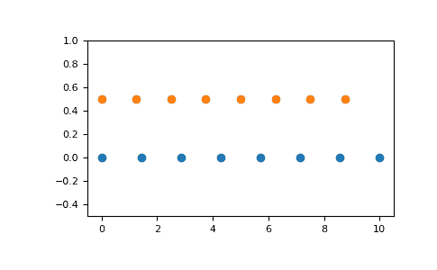

# numpy.linspace

> 原文：[`numpy.org/doc/1.26/reference/generated/numpy.linspace.html`](https://numpy.org/doc/1.26/reference/generated/numpy.linspace.html)

```py
numpy.linspace(start, stop, num=50, endpoint=True, retstep=False, dtype=None, axis=0)
```

在指定区间内返回均匀间隔的数字。

返回在区间[*start*, *stop*]上计算的*num*个等间距样本。

区间的结束点可以选择排除。

在版本 1.16.0 中更改：现在支持非标量的*start*和*stop*。

在版本 1.20.0 中更改：当指定整数`dtype`时，值向`-inf`舍入而不是`0`。仍可以通过`np.linspace(start, stop, num).astype(int)`获取旧的行为。

参数：

**start**array_like

序列的起始值。

**stop**array_like

序列的结束值，除非将*endpoint*设置为 False。在这种情况下，序列由`num + 1`个均匀间距的样本组成，因此*stop*被排除在外。注意，当*endpoint*为 False 时，步长会发生变化。

**num**int，可选

要生成的样本数。默认为 50。必须是非负数。

**endpoint**bool，可选

如果为 True，则*stop*是最后一个样本。否则，不包含它。默认为 True。

**retstep**bool，可选

如果为 True，则返回(*samples*, *step*)，其中*step*是样本之间的间距。

**dtype**dtype，可选

输出数组的类型。如果未给出`dtype`，则从*start*和*stop*推断数据类型。推断的 dtype 不会是整数；即使参数生成整数数组也会选择浮点数。

在版本 1.9.0 中新增。

**axis**int，可选

结果中存储样本的轴。仅当 start 或 stop 为数组时才相关。默认为 0，样本将沿着插入的新轴排列。使用-1 可以在最后插入一个轴。

新版本中新增。

返回：

**samples**ndarray

在闭区间`[start, stop]`或半开区间`start, stop)`（取决于*endpoint*是 True 还是 False）中有*num*个等间距样本。

**step**float，可选

仅在*retstep*为 True 时返回

采样之间的间距大小。

另请参阅

[`arange`

类似于`linspace`，但使用步长（而不是样本数）。

`geomspace`

类似于`linspace`，但其数字在对数刻度上均匀间隔（几何级数）。

`logspace`

类似于`geomspace`，但端点指定为对数。

如何创建具有等间距值的数组

示例

```py
>>> np.linspace(2.0, 3.0, num=5)
array([2\.  , 2.25, 2.5 , 2.75, 3\.  ])
>>> np.linspace(2.0, 3.0, num=5, endpoint=False)
array([2\. ,  2.2,  2.4,  2.6,  2.8])
>>> np.linspace(2.0, 3.0, num=5, retstep=True)
(array([2\.  ,  2.25,  2.5 ,  2.75,  3\.  ]), 0.25) 
```

图形示例：

```py
>>> import matplotlib.pyplot as plt
>>> N = 8
>>> y = np.zeros(N)
>>> x1 = np.linspace(0, 10, N, endpoint=True)
>>> x2 = np.linspace(0, 10, N, endpoint=False)
>>> plt.plot(x1, y, 'o')
[<matplotlib.lines.Line2D object at 0x...>]
>>> plt.plot(x2, y + 0.5, 'o')
[<matplotlib.lines.Line2D object at 0x...>]
>>> plt.ylim([-0.5, 1])
(-0.5, 1)
>>> plt.show() 
```


