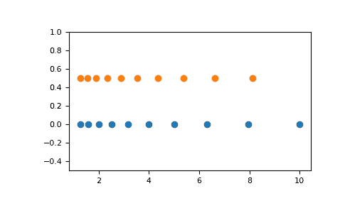

# numpy.logspace

> 原文：[`numpy.org/doc/1.26/reference/generated/numpy.logspace.html`](https://numpy.org/doc/1.26/reference/generated/numpy.logspace.html)

```py
numpy.logspace(start, stop, num=50, endpoint=True, base=10.0, dtype=None, axis=0)
```

返回在对数尺度上平均分布的数字。

在线性空间中，序列从 `base ** start`（*base* 的 *start* 次幂）开始，并以 `base ** stop` 结束（见下面的 *endpoint*）。

在版本 1.16.0 中更改：现在支持非标量 *start* 和 *stop*。

在版本 1.25.0 中更改：现在支持非标量 *base*。

参数：

**start** 数组

`base ** start` 是序列的起始值。

**stop** 数组

`base ** stop` 是序列的最终值，除非 *endpoint* 为 False。在这种情况下，在对数空间中间隔有 `num + 1` 个值，其中除了最后一个（长度为 *num* 的序列）外，其他都会返回。

**num** 整数，可选

要生成的样本数。默认为 50。

**endpoint** 布尔值，可选

如果为 true，则 *stop* 是最后一个样本。否则，它不包括在内。默认为 True。

**base** 数组，可选

对数空间的底数。`ln(samples) / ln(base)` 中元素之间的步长（或 `log_base(samples)`）是均匀的。默认为 10.0。

**dtype** 数据类型

输出数组的类型。如果没有给出 `dtype`，则从 *start* 和 *stop* 推断数据类型。推断的类型永远不会是整数；如果参数产生整数数组，则选择*float*类型。

**axis** 整数，可选

在结果中存储样本的轴。仅在 start、stop 或 base 是类似数组的情况下相关。默认为 0，样本将沿着在开头插入的一个新轴。使用 -1 可以得到一个末尾的轴。

在版本 1.16.0 中新增。

返回：

**samples** 数组

*num* 个样本，在对数尺度上等间距分布。

另请参阅

`arange`

类似于 linspace，指定步长而不是样本数。请注意，当与浮点数端点一起使用时，端点可能包括也可能不包括。

`linspace`

类似于 logspace，但在线性空间中均匀分布的样本，而不是对数空间。

`geomspace`

类似于 logspace，但直接指定端点。

如何创建具有等间距值的数组

注：

如果 base 是标量，则 logspace 等同于以下代码

```py
>>> y = np.linspace(start, stop, num=num, endpoint=endpoint)
... 
>>> power(base, y).astype(dtype)
... 
```

示例

```py
>>> np.logspace(2.0, 3.0, num=4)
array([ 100\.        ,  215.443469  ,  464.15888336, 1000\.        ])
>>> np.logspace(2.0, 3.0, num=4, endpoint=False)
array([100\.        ,  177.827941  ,  316.22776602,  562.34132519])
>>> np.logspace(2.0, 3.0, num=4, base=2.0)
array([4\.        ,  5.0396842 ,  6.34960421,  8\.        ])
>>> np.logspace(2.0, 3.0, num=4, base=[2.0, 3.0], axis=-1)
array([[ 4\.        ,  5.0396842 ,  6.34960421,  8\.        ],
 [ 9\.        , 12.98024613, 18.72075441, 27\.        ]]) 
```

图解：

```py
>>> import matplotlib.pyplot as plt
>>> N = 10
>>> x1 = np.logspace(0.1, 1, N, endpoint=True)
>>> x2 = np.logspace(0.1, 1, N, endpoint=False)
>>> y = np.zeros(N)
>>> plt.plot(x1, y, 'o')
[<matplotlib.lines.Line2D object at 0x...>]
>>> plt.plot(x2, y + 0.5, 'o')
[<matplotlib.lines.Line2D object at 0x...>]
>>> plt.ylim([-0.5, 1])
(-0.5, 1)
>>> plt.show() 
```


