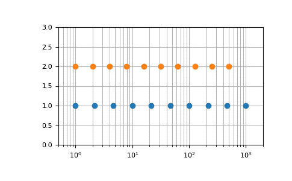

# numpy.geomspace

> 原文：[`numpy.org/doc/1.26/reference/generated/numpy.geomspace.html`](https://numpy.org/doc/1.26/reference/generated/numpy.geomspace.html)

```py
numpy.geomspace(start, stop, num=50, endpoint=True, dtype=None, axis=0)
```

在对数刻度上均匀分布的数字。

这类似于`logspace`，但端点直接指定。每个输出样本是前一个的常数倍。

在 1.16.0 版本更改：现在支持非标量*start*和*stop*。

参数：

**start**array_like

序列的起始值。

**stop**array_like

序列的最终值，除非*endpoint*为 False。在这种情况下，在对数空间内间隔`num + 1`个值，除了最后一个（长度为*num*的序列）都返回。

**num**整数，可选

要生成的样本数。默认为 50。

**endpoint**布尔值，可选

如果为 true，则*stop*是最后一个样本。否则，它不包括在内。默认为 True。

**dtype**dtype

输出数组的类型。如果`dtype`未给出，则数据类型将从*start*和*stop*推断出来。推断的 dtype 永远不会是整数；*float*会被选择，即使参数会产生整数数组。

**axis**整数，可选

结果中存储样本的轴。仅当 start 或 stop 为类似数组时相关。默认值（0），样本将沿着插入在开头的新轴。使用-1 以在末尾获得一个轴。

1.16.0 版本中的新功能。

返回：

**samples**ndarray

*num*个样本，在对数刻度上均匀间隔。

另请参见

`logspace`

类似于 geomspace，但端点使用对数和基数指定。

`linspace`

类似于 geomspace，但是使用算术而不是几何级数。

`arange`

类似于 linspace，步长指定而不是样本数。

如何创建具有定期间隔数值的数组

注意

如果输入或 dtype 为复数，则输出将在复平面上遵循对数螺旋。（通过两点有无限多个螺旋线通过；输出将遵循最短的路径。）

示例

```py
>>> np.geomspace(1, 1000, num=4)
array([    1.,    10.,   100.,  1000.])
>>> np.geomspace(1, 1000, num=3, endpoint=False)
array([   1.,   10.,  100.])
>>> np.geomspace(1, 1000, num=4, endpoint=False)
array([   1\.        ,    5.62341325,   31.6227766 ,  177.827941  ])
>>> np.geomspace(1, 256, num=9)
array([   1.,    2.,    4.,    8.,   16.,   32.,   64.,  128.,  256.]) 
```

请注意，以上可能不会产生精确的整数：

```py
>>> np.geomspace(1, 256, num=9, dtype=int)
array([  1,   2,   4,   7,  16,  32,  63, 127, 256])
>>> np.around(np.geomspace(1, 256, num=9)).astype(int)
array([  1,   2,   4,   8,  16,  32,  64, 128, 256]) 
```

允许负数、递减和复数输入：

```py
>>> np.geomspace(1000, 1, num=4)
array([1000.,  100.,   10.,    1.])
>>> np.geomspace(-1000, -1, num=4)
array([-1000.,  -100.,   -10.,    -1.])
>>> np.geomspace(1j, 1000j, num=4)  # Straight line
array([0\.   +1.j, 0\.  +10.j, 0\. +100.j, 0.+1000.j])
>>> np.geomspace(-1+0j, 1+0j, num=5)  # Circle
array([-1.00000000e+00+1.22464680e-16j, -7.07106781e-01+7.07106781e-01j,
 6.12323400e-17+1.00000000e+00j,  7.07106781e-01+7.07106781e-01j,
 1.00000000e+00+0.00000000e+00j]) 
```

*endpoint*参数的图示：

```py
>>> import matplotlib.pyplot as plt
>>> N = 10
>>> y = np.zeros(N)
>>> plt.semilogx(np.geomspace(1, 1000, N, endpoint=True), y + 1, 'o')
[<matplotlib.lines.Line2D object at 0x...>]
>>> plt.semilogx(np.geomspace(1, 1000, N, endpoint=False), y + 2, 'o')
[<matplotlib.lines.Line2D object at 0x...>]
>>> plt.axis([0.5, 2000, 0, 3])
[0.5, 2000, 0, 3]
>>> plt.grid(True, color='0.7', linestyle='-', which='both', axis='both')
>>> plt.show() 
```


