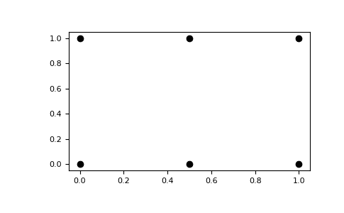
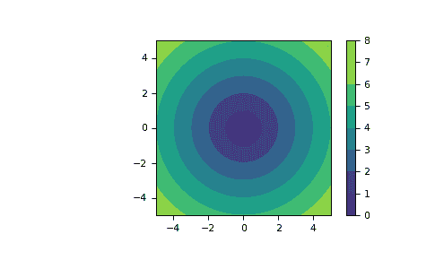

# `numpy.meshgrid`

> 原文：[`numpy.org/doc/1.26/reference/generated/numpy.meshgrid.html`](https://numpy.org/doc/1.26/reference/generated/numpy.meshgrid.html)

```py
numpy.meshgrid(*xi, copy=True, sparse=False, indexing='xy')
```

从坐标向量返回坐标矩阵列表。

为 N-D 格点数组创建一维坐标数组，以便在 N-D 格点上对 N-D 标量/向量场进行矢量化评估，给定一维坐标数组 x1, x2,…, xn。

在 1.9 版中更改：允许 1-D 和 0-D 情况。

参数：

**x1, x2,…, xn**array_like

表示网格坐标的 1-D 数组。

**indexing**{‘xy’，‘ij’}，可选

输出的笛卡尔（‘xy’，默认）或矩阵（‘ij’）索引。更多细节请参阅注释。

新版本 1.7.0 中的新功能。

**sparse**bool，可选

如果为 True，则使得用于第 *i* 维的返回坐标数组的形状从`（N1, ..., Ni, ... Nn）`减少为`（1，...，1，Ni，1，...，1）`。这些稀疏坐标网格用于与广播。当在表达式中使用所有坐��时，广播仍然导致完全维数的结果数组。

默认值为 False。

新版本 1.7.0 中的新功能。

**copy**bool，可选

如果为 False，则会视图返回到原始数组，以便节省内存。默认为 True。请注意，`sparse=False, copy=False` 可能会返回非连续数组。此外，广播数组的一个以上元素可能指向单个内存位置。如果您需要向数组写入内容，请先制作副本。

新版本 1.7.0 中的新功能。

返回值：

**X1, X2，…，XN**ndarray 列表

对于向量 *x1*、*x2*，...、*xn*，其长度为 `Ni=len(xi)`，如果 indexing=’ij’，则返回形状为 `(N1, N2, N3,..., Nn)` 的数组；如果 indexing=’xy’，则返回形状为 `(N2, N1, N3,..., Nn)` 的数组，其中 *xi* 的元素重复以填充矩阵中的第一维度，*x1* 的第二维度，依此类推。

另请参阅

`mgrid`

使用索引表示的多维“网格”。

`ogrid`

使用索引表示的多维“网格”。

`how-to-index`

注释

此函数通过索引关键字参数支持两种索引约定。使用字符串 ‘ij’ 返回带有矩阵索引的 meshgrid，而 ‘xy’ 返回带有笛卡尔索引的 meshgrid。在输入长度为 M 和 N 的 2-D 情况下，对于‘xy’索引，输出的形状为（N，M），对于‘ij’索引，输出的形状为（M，N）。在输入长度为 M、N 和 P 的 3-D 情况下，对于‘xy’索引，输出形状为（N，M，P），对于‘ij’索引，输出形状为（M，N，P）。下面的代码片段说明了区别：

```py
xv, yv = np.meshgrid(x, y, indexing='ij')
for i in range(nx):
    for j in range(ny):
        # treat xv[i,j], yv[i,j]

xv, yv = np.meshgrid(x, y, indexing='xy')
for i in range(nx):
    for j in range(ny):
        # treat xv[j,i], yv[j,i] 
```

在 1-D 和 0-D 情况下，索引和 sparse 关键字无效。

示例

```py
>>> nx, ny = (3, 2)
>>> x = np.linspace(0, 1, nx)
>>> y = np.linspace(0, 1, ny)
>>> xv, yv = np.meshgrid(x, y)
>>> xv
array([[0\. , 0.5, 1\. ],
 [0\. , 0.5, 1\. ]])
>>> yv
array([[0.,  0.,  0.],
 [1.,  1.,  1.]]) 
```

`meshgrid` 的结果是坐标网格：

```py
>>> import matplotlib.pyplot as plt
>>> plt.plot(xv, yv, marker='o', color='k', linestyle='none')
>>> plt.show() 
```



您可以创建稀疏输出数组以节省内存和计算时间。

```py
>>> xv, yv = np.meshgrid(x, y, sparse=True)
>>> xv
array([[0\. ,  0.5,  1\. ]])
>>> yv
array([[0.],
 [1.]]) 
```

`meshgrid`非常有用，可以在网格上评估函数。如果函数依赖于所有坐标，则可以使用密集和稀疏输出。

```py
>>> x = np.linspace(-5, 5, 101)
>>> y = np.linspace(-5, 5, 101)
>>> # full coordinate arrays
>>> xx, yy = np.meshgrid(x, y)
>>> zz = np.sqrt(xx**2 + yy**2)
>>> xx.shape, yy.shape, zz.shape
((101, 101), (101, 101), (101, 101))
>>> # sparse coordinate arrays
>>> xs, ys = np.meshgrid(x, y, sparse=True)
>>> zs = np.sqrt(xs**2 + ys**2)
>>> xs.shape, ys.shape, zs.shape
((1, 101), (101, 1), (101, 101))
>>> np.array_equal(zz, zs)
True 
```

```py
>>> h = plt.contourf(x, y, zs)
>>> plt.axis('scaled')
>>> plt.colorbar()
>>> plt.show() 
```


