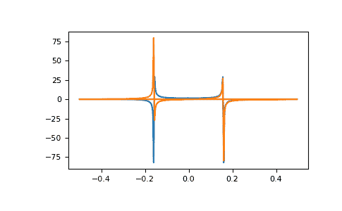

# `numpy.fft.fft`

> 原文：[`numpy.org/doc/1.26/reference/generated/numpy.fft.fft.html`](https://numpy.org/doc/1.26/reference/generated/numpy.fft.fft.html)

```py
fft.fft(a, n=None, axis=-1, norm=None)
```

计算一维离散傅里叶变换。

此函数使用高效的快速傅里叶变换（FFT）算法计算一维*n*点离散傅里叶变换（DFT）[CT]。

参数：

**a**类似数组

输入数组，可以是复数。

**n**整数，可选

输出的变换轴的长度。如果*n*小于输入的长度，则输入会被裁剪。如果*n*大于输入的长度，则输入会用零填充。如果*n*没有给出，那么沿着*axis*指定的轴的长度会被使用。

**axis**整数，可选

用来计算 FFT 的轴。如果没有给出，则使用最后一个轴。

**norm**{“backward”, “ortho”, “forward”}，可选

在 1.10.0 版本中添加。

标准化模式（参见 `numpy.fft`）。默认为“backward”。指示前向/后向变换对中的哪个方向进行缩放以及使用什么标准化因子。

1.20.0 版本中新增了“backward”，“forward”值。

返回：

**out**复数的 ndarray

截断或零填充的输入，沿着*axis*指示的轴进行变换，或者如果没有指定*axis*，则沿着最后一个轴进行变换。

引发：

索引错误

如果*axis*不是*a*的有效轴。

也参见

`numpy.fft`

DFT 的定义和使用的约定。

`ifft`

`fft`的逆变换。

`fft2`

双维 FFT。

`fftn`

*n*维 FFT。

`rfftn`

实数输入的*n*维 FFT。

`fftfreq`

给定 FFT 参数的频率块。

注意

FFT（快速傅里叶变换）是一种离散傅里叶变换（DFT）可以通过使用计算术语中的对称性来高效计算的方法。当*n*是 2 的幂时，对称性最高，因此对于这些尺寸，变换是最有效的。

DFT 的定义，以及这个实现中使用的约定，请参见`numpy.fft`模块的文档。

参考

[CT]

Cooley, James W., and John W. Tukey, 1965, “An algorithm for the machine calculation of complex Fourier series,” *Math. Comput.* 19: 297-301.

例子

```py
>>> np.fft.fft(np.exp(2j * np.pi * np.arange(8) / 8))
array([-2.33486982e-16+1.14423775e-17j,  8.00000000e+00-1.25557246e-15j,
 2.33486982e-16+2.33486982e-16j,  0.00000000e+00+1.22464680e-16j,
 -1.14423775e-17+2.33486982e-16j,  0.00000000e+00+5.20784380e-16j,
 1.14423775e-17+1.14423775e-17j,  0.00000000e+00+1.22464680e-16j]) 
```

在这个例子中，实数输入是 Hermitian 的 FFT，即在实部对称，在虚部反对称，正如`numpy.fft`文档中所描述的：

```py
>>> import matplotlib.pyplot as plt
>>> t = np.arange(256)
>>> sp = np.fft.fft(np.sin(t))
>>> freq = np.fft.fftfreq(t.shape[-1])
>>> plt.plot(freq, sp.real, freq, sp.imag)
[<matplotlib.lines.Line2D object at 0x...>, <matplotlib.lines.Line2D object at 0x...>]
>>> plt.show() 
```


