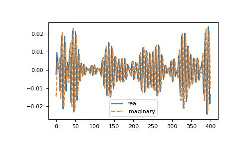

# `numpy.fft.ifft`

> [`numpy.org/doc/1.26/reference/generated/numpy.fft.ifft.html`](https://numpy.org/doc/1.26/reference/generated/numpy.fft.ifft.html)   

```py
fft.ifft(a, n=None, axis=-1, norm=None)
```

计算一维逆离散傅里叶变换。

此功能计算[`fft`](https://numpy.org/doc/1.26/reference/generated/numpy.fft.ifft.html)计算的一维*n*点离散傅里叶变换的逆变换。换句话说，`ifft(fft(a)) == a`在数值精度范围内成立。有关算法和定义的一般描述，请参见[`numpy.fft`](https://numpy.org/doc/1.26/reference/generated/numpy.fft.ifft.html)。

输入应按照与[`fft`](https://numpy.org/doc/1.26/reference/generated/numpy.fft.ifft.html)返回的顺序相同，即，

+   `a[0]`应包含零频率项，

+   `a[1:n//2]`应包含正频率项，

+   `a[n//2 + 1:]`应包含负频率项，按照从最负频率开始的增序排列。

对于偶数个输入点，`A[n//2]`代表正和负奈奎斯特频率处值的和，因为两者被混叠在一起。详细信息请参见[`numpy.fft`](https://numpy.org/doc/1.26/reference/generated/numpy.fft.ifft.html)。

参数：

**a**类似数组

输入数组，可以是复数。

**n**int，可选

输出的变换轴的长度。如果*n*小于输入的长度，则裁剪输入。如果*n*更大，则用零填充输入。如果未给出*n*，则使用由*axis*指定的轴上的输入长度。有关填充问题，请参见注释。

**axis**int，可选

计算逆离散傅里叶变换的轴。如果未给出，则使用最后一个轴。

**norm**{“backward”, “ortho”, “forward”}，可选

版本 1.10.0 中的新内容。

规范模式（参见[`numpy.fft`](https://numpy.org/doc/1.26/reference/generated/numpy.fft.ifft.html)）。默认为“backward”。指示在前向/后向转换对中哪个方向被缩放以及使用什么归一化因子。

版本 1.20.0 中的新内容：添加了“backward”、“forward”值。

返回：

**out**复数 ndarray

在由*axis*指示的轴上截取或填充为零的输入，或最后一个轴（如果未指定*axis*）。

引发：

索引错误

如果*axis*不是*a*的有效轴。

另请参见

[`numpy.fft`](https://numpy.org/doc/1.26/reference/generated/numpy.fft.ifft.html)   

介绍，含有定义和一般解释。

[`fft`](https://numpy.org/doc/1.26/reference/generated/numpy.fft.ifft.html)   

一维（正向）FFT，其中[`ifft`](https://numpy.org/doc/1.26/reference/generated/numpy.fft.ifft.html)是其逆向操作

[`ifft2`](https://numpy.org/doc/1.26/reference/generated/numpy.fft.ifft.html)   

二维逆 FFT。

[`ifftn`](https://numpy.org/doc/1.26/reference/generated/numpy.fft.ifft.html)   

n 维逆 FFT。

注意

如果输入参数*n*大于输入的大小，则在结尾附加零来填充输入。即使这是一种常见的方法，但可能会导致令人惊讶的结果。如果需要不同的填充方式，在调用`ifft`之前必须执行。

示例

```py
>>> np.fft.ifft([0, 4, 0, 0])
array([ 1.+0.j,  0.+1.j, -1.+0.j,  0.-1.j]) # may vary 
```

创建并绘制具有随机相位的带限信号:

```py
>>> import matplotlib.pyplot as plt
>>> t = np.arange(400)
>>> n = np.zeros((400,), dtype=complex)
>>> n[40:60] = np.exp(1j*np.random.uniform(0, 2*np.pi, (20,)))
>>> s = np.fft.ifft(n)
>>> plt.plot(t, s.real, label='real')
[<matplotlib.lines.Line2D object at ...>]
>>> plt.plot(t, s.imag, '--', label='imaginary')
[<matplotlib.lines.Line2D object at ...>]
>>> plt.legend()
<matplotlib.legend.Legend object at ...>
>>> plt.show() 
```


