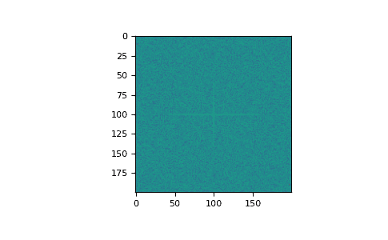

# `numpy.fft.fftn`

> 原文：[`numpy.org/doc/1.26/reference/generated/numpy.fft.fftn.html`](https://numpy.org/doc/1.26/reference/generated/numpy.fft.fftn.html)

```py
fft.fftn(a, s=None, axes=None, norm=None)
```

计算 N 维离散傅里叶变换。

该函数通过快速傅里叶变换（FFT）在*M*维数组的任意数量的轴上计算*N*维离散傅里叶变换。

参数：

**a**array_like

输入数组，可以是复数。

**s**整数序列，可选

输出的形状（每个转换轴的长度）（`s[0]`指轴 0，`s[1]`指轴 1，依此类推）。这对应于`fft(x, n)`中的`n`。对于任何轴，如果给定的形状小于输入的形状，则输入会被裁剪。如果它更大，则输入会用零填充。如果没有给出*s*，则将使用由*axes*指定的轴上的输入的形状。

**axes**整数序列，可选

要计算 FFT 的轴。如果没有给出，将使用最后`len(s)`个轴，或者如果也没有指定*s*，则使用所有轴。在*axes*中重复的索引意味着该轴上的变换被执行多次。

**norm**{“backward”, “ortho”, “forward”}，可选

新增功能版本 1.10.0。

标准化模式（参见`numpy.fft`）。默认为“backward”。指示前向/后向变换对中的哪个方向是缩放的，以及使用什么归一化因子。

新增功能版本 1.20.0：添加了“backward”，“forward”值。

返回：

**out**复数 ndarray

截取或零填充的输入，沿着*axes*指示的轴进行变换，或通过* s *和* a *的组合，如上面的参数部分所述。

异常：

ValueError

如果*s*和*axes*的长度不同。

IndexError

如果*axes*的元素大于*a*的轴数。

另请参见

`numpy.fft`

离散傅里叶变换的整体视图，包括使用的定义和约定。

`ifftn`

`fftn`的反转，*n*维 FFT 的逆。

`fft`

一维 FFT，包括使用的定义和约定。

`rfftn`

实数输入的*n*维 FFT。

`fft2`

二维 FFT。

`fftshift`

将零频率项移至数组中心

笔记

输出与`fft`类似，它包含所有轴的低阶角落的零频率项，所有轴的前半部分的正频率项，所有轴中的奈奎斯特频率项中间，所有轴的后半部分的负频率项，按递减的负频率顺序排列。

查看`numpy.fft`了解详细信息、定义和惯例的使用。

例子

```py
>>> a = np.mgrid[:3, :3, :3][0]
>>> np.fft.fftn(a, axes=(1, 2))
array([[[ 0.+0.j,   0.+0.j,   0.+0.j], # may vary
 [ 0.+0.j,   0.+0.j,   0.+0.j],
 [ 0.+0.j,   0.+0.j,   0.+0.j]],
 [[ 9.+0.j,   0.+0.j,   0.+0.j],
 [ 0.+0.j,   0.+0.j,   0.+0.j],
 [ 0.+0.j,   0.+0.j,   0.+0.j]],
 [[18.+0.j,   0.+0.j,   0.+0.j],
 [ 0.+0.j,   0.+0.j,   0.+0.j],
 [ 0.+0.j,   0.+0.j,   0.+0.j]]])
>>> np.fft.fftn(a, (2, 2), axes=(0, 1))
array([[[ 2.+0.j,  2.+0.j,  2.+0.j], # may vary
 [ 0.+0.j,  0.+0.j,  0.+0.j]],
 [[-2.+0.j, -2.+0.j, -2.+0.j],
 [ 0.+0.j,  0.+0.j,  0.+0.j]]]) 
```

```py
>>> import matplotlib.pyplot as plt
>>> [X, Y] = np.meshgrid(2 * np.pi * np.arange(200) / 12,
...                      2 * np.pi * np.arange(200) / 34)
>>> S = np.sin(X) + np.cos(Y) + np.random.uniform(0, 1, X.shape)
>>> FS = np.fft.fftn(S)
>>> plt.imshow(np.log(np.abs(np.fft.fftshift(FS))**2))
<matplotlib.image.AxesImage object at 0x...>
>>> plt.show() 
```


