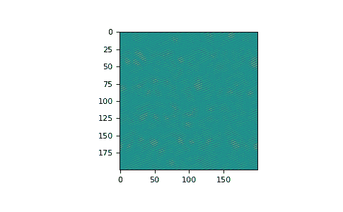

# `numpy.fft.ifftn`

> 原文：[`numpy.org/doc/1.26/reference/generated/numpy.fft.ifftn.html`](https://numpy.org/doc/1.26/reference/generated/numpy.fft.ifftn.html)

```py
fft.ifftn(a, s=None, axes=None, norm=None)
```

计算 N 维逆离散傅立叶变换。

此函数通过快速傅立叶变换（FFT）计算 M 维数组中的任意数量的轴上 N 维离散傅立叶变换的逆变换。换句话说，`ifftn(fftn(a)) == a`在数值精度范围内。有关使用的定义和约定的描述，请参阅`numpy.fft`。

输入，类似于`ifft`，应按照`fftn`的返回方式排序，即在低阶角中的所有轴中都应有零频率项，所有轴的前一半中应有正频率项，所有轴的中间应有奈奎斯特频率项，并按照逐渐减小的负频率的顺序，所有轴的后一半中应有负频率项。

参数：

**a**array_like

输入数组，可以是复数。

**s**int 的序列，可选

输出的形状（每个变换轴的长度）（`s[0]`指示轴 0，`s[1]`指示轴 1，以此类推）。这对应于`ifft(x, n)`的`n`。沿任何轴，如果给定的形状小于输入的形状，则截断输入。如果它大于，则用零填充输入。如果没有给出*s*，则沿着*axes*指定的轴使用输入的形状。参见有关`ifft`零填充问题的注释。

**axes**int 的序列，可选

计算 IFFT 的轴。如果未给出，则使用最后`len(s)`个轴，如果未指定*s*，则使用所有轴。在*axes*中重复的索引意味着在该轴上执行多次逆变换。

**norm**{“backward”, “ortho”, “forward”}，可选

版本 1.10.0 中的新功能。

标准化模式（参见`numpy.fft`）。默认为“backward”。指示前/后变换对中的哪个方向被缩放以及使用什么归一化因子。

1.20.0 版本中的新功能：添加了“backward”、“forward”值。

返回：

**out**复数 ndarray

由*axes*指示的轴或由*s*或*a*的组合变换，或者被截断或零填充的输入，如上面的参数部分所述。

引发：

ValueError

如果*s*和*axes*长度不同。

IndexError

如果*axes*的元素大于*a*的轴数。

另见

`numpy.fft`

使用的定义和约定的离散傅立叶变换的总体视图。

`fftn`

此处的*forward* *n*-dimensional FFT 是`ifftn`的反向。

`ifft`

一维逆 FFT。

`ifft2`

二维逆 FFT。

`ifftshift`

解除`fftshift`，将零频率项移到数组的开头。

注意事项

有关使用的定义和惯例，请参见`numpy.fft`。

零填充，类似于`ifft`，通过在指定维度上附加零来执行。尽管这是常见的方法，但可能会导致令人惊讶的结果。如果需要另一种形式的零填充，则必须在调用`ifftn`之前执行。

示例

```py
>>> a = np.eye(4)
>>> np.fft.ifftn(np.fft.fftn(a, axes=(0,)), axes=(1,))
array([[1.+0.j,  0.+0.j,  0.+0.j,  0.+0.j], # may vary
 [0.+0.j,  1.+0.j,  0.+0.j,  0.+0.j],
 [0.+0.j,  0.+0.j,  1.+0.j,  0.+0.j],
 [0.+0.j,  0.+0.j,  0.+0.j,  1.+0.j]]) 
```

创建并绘制具有带限频率内容的图像：

```py
>>> import matplotlib.pyplot as plt
>>> n = np.zeros((200,200), dtype=complex)
>>> n[60:80, 20:40] = np.exp(1j*np.random.uniform(0, 2*np.pi, (20, 20)))
>>> im = np.fft.ifftn(n).real
>>> plt.imshow(im)
<matplotlib.image.AxesImage object at 0x...>
>>> plt.show() 
```


