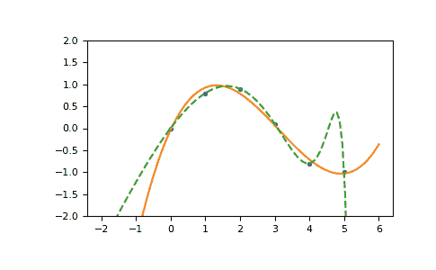

# `numpy.ma.polyfit`

> 原文：[`numpy.org/doc/1.26/reference/generated/numpy.ma.polyfit.html`](https://numpy.org/doc/1.26/reference/generated/numpy.ma.polyfit.html)

```py
ma.polyfit(x, y, deg, rcond=None, full=False, w=None, cov=False)
```

最小二乘多项式拟合。

注意

这构成了旧多项式 API 的一部分。自版本 1.4 以后，优先使用在`numpy.polynomial`中定义的新多项式 API。可以在过渡指南中找到差异的摘要。

拟合多项式`p(x) = p[0] * x**deg + ... + p[deg]`到点*(x, y)*。返回最小化次数为*deg*的误差的系数*p*的向量，*deg*，*deg-1*，... *0*。

推荐使用`Polynomial.fit`类方法进行新代码编写，因为在数值上更加稳定。有关该方法的更多信息，请参阅该方法的文档。

参数：

**x**array_like，形状（M，）

M 个样本点的 x 坐标`(x[i], y[i])`。

**y**array_like，形状（M，）或（M，K）

数据点的 y 坐标。可以通过传入包含每列一个数据集的 2D 数组，一次拟合具有相同 x 坐标的多个数据集的样本点。

**deg**int

拟合多项式的次数

**rcond**float，可选

拟合的相对条件数。相对于最大奇异值，小于此值的奇异值将被忽略。默认值为 len(x)*eps，其中 eps 是 float 类型的相对精度，大约为 2e-16，在大多数情况下。

**full**bool，可选

决定返回值性质的开关。当为 False（默认值）时，仅返回系数，当为 True 时，还返回奇异值分解的诊断信息。

**w**array_like，形状（M，），可选

weights 如果不是 None，则权重`w[i]`应用于`y[i] - y_hat[i]`在`x[i]`处的非平方残差。理想情况下，权重应该被选择，以使得产品`w[i]*y[i]`的误差具有相同的方差。使用逆方差加权时，使用`w[i] = 1/sigma(y[i])`。默认值为 None。

**cov**bool 或 str，可选

如果给定并且不是*False*，不仅返回估计值，还返回其协方差矩阵。默认情况下，协方差由 chi2/dof（其中 dof = M - (deg + 1)，即假定权重在相对意义上除了一切都按照缩放，以使得缩减的 chi2 为统一）缩放。如果`cov='unscaled'`省略了这种规模变换，这对于权重是 w = 1/sigma 的情况是相关的，其中 sigma 已知是可靠的不确定度估计。

返回：

**p**ndarray，形状（deg+1，）或（deg+1，K）

多项式系数，最高幂优先。如果*y*是 2-D，则第*k*个数据集的系数在`p[:,k]`中。

残差，秩，奇异值，rcond

仅当`full == True`时才返回这些值

+   **residuals** – 最小二乘拟合的残差平方和

+   **rank** – 缩放范德蒙德矩阵的有效秩

    系数矩阵

+   **singular_values** – 缩放范德蒙德矩阵的奇异值

    系数矩阵

+   **rcond** – *rcond* 的值。

更多详细信息，请参阅 `numpy.linalg.lstsq`。

**V** 数组，形状为 (M,M) 或 (M,M,K)

仅当 `full == False` 且 `cov == True` 时才会出现。多项式系数估计的协方差矩阵。该矩阵的对角线是每个系数的方差估计。如果 y 是一个 2-D 数组，则第 *k* 个数据集的协方差矩阵在 `V[:,:,k]` 中。

警告：

RankWarning

在最小二乘拟合的系数矩阵的秩不足时引发警告。仅当 `full == False` 时才会引发警告。

可以通过以下方式关闭警告

```py
>>> import warnings
>>> warnings.simplefilter('ignore', np.RankWarning) 
```

另请参阅

`polyval`

计算多项式值。

`linalg.lstsq`

计算最小二乘拟合。

[`scipy.interpolate.UnivariateSpline`](https://docs.scipy.org/doc/scipy/reference/generated/scipy.interpolate.UnivariateSpline.html#scipy.interpolate.UnivariateSpline "(in SciPy v1.11.2)")

计算样条拟合。

注意事项

x 中的任何掩码值都会传播到 y 中，反之亦然。

该解决方案使得平方误差最小化

\[E = \sum_{j=0}^k |p(x_j) - y_j|²\]

在方程中：

```py
x[0]**n * p[0] + ... + x[0] * p[n-1] + p[n] = y[0]
x[1]**n * p[0] + ... + x[1] * p[n-1] + p[n] = y[1]
...
x[k]**n * p[0] + ... + x[k] * p[n-1] + p[n] = y[k] 
```

系数矩阵 *p* 的伴随矩阵是一个范德蒙德矩阵。

当最小二乘拟合的条件很差时，`polyfit` 会发出 `RankWarning`。这意味着由于数值误差，最佳拟合不确定。通过降低多项式的次数或将 *x* 替换为 *x* - *x.mean()，可以改善结果。也可以将 *rcond* 参数设置为比默认值小的值，但所得的拟合可能是虚假的：包含小奇异值的贡献可能会给结果添加数值噪声。

需要注意的是，当多项式的次数较大或样本点的间隔较差时，拟合多项式系数的条件会出现问题。在这些情况下，应始终检查拟合的质量。当多项式拟合不理想时，样条插值可能是一个很好的选择。

参考文献

[1]

维基百科，“曲线拟合”，[`zh.wikipedia.org/wiki/曲线拟合`](https://zh.wikipedia.org/wiki/曲线拟合)

[2]

维基百科，“多项式插值”，[`zh.wikipedia.org/wiki/多项式插值`](https://zh.wikipedia.org/wiki/多项式插值)

示例

```py
>>> import warnings
>>> x = np.array([0.0, 1.0, 2.0, 3.0,  4.0,  5.0])
>>> y = np.array([0.0, 0.8, 0.9, 0.1, -0.8, -1.0])
>>> z = np.polyfit(x, y, 3)
>>> z
array([ 0.08703704, -0.81349206,  1.69312169, -0.03968254]) # may vary 
```

对于处理多项式，使用 `poly1d` 对象很方便：

```py
>>> p = np.poly1d(z)
>>> p(0.5)
0.6143849206349179 # may vary
>>> p(3.5)
-0.34732142857143039 # may vary
>>> p(10)
22.579365079365115 # may vary 
```

高阶多项式可能会出现大幅振荡：

```py
>>> with warnings.catch_warnings():
...     warnings.simplefilter('ignore', np.RankWarning)
...     p30 = np.poly1d(np.polyfit(x, y, 30))
...
>>> p30(4)
-0.80000000000000204 # may vary
>>> p30(5)
-0.99999999999999445 # may vary
>>> p30(4.5)
-0.10547061179440398 # may vary 
```

图示：

```py
>>> import matplotlib.pyplot as plt
>>> xp = np.linspace(-2, 6, 100)
>>> _ = plt.plot(x, y, '.', xp, p(xp), '-', xp, p30(xp), '--')
>>> plt.ylim(-2,2)
(-2, 2)
>>> plt.show() 
```


