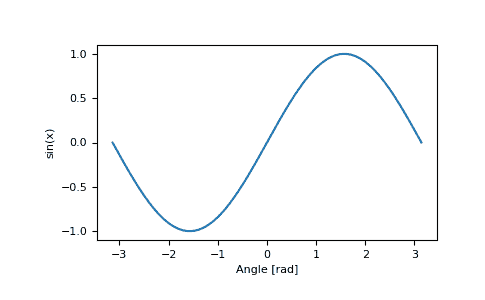

# numpy.sin

> 原文：[`numpy.org/doc/1.26/reference/generated/numpy.sin.html`](https://numpy.org/doc/1.26/reference/generated/numpy.sin.html)

```py
numpy.sin(x, /, out=None, *, where=True, casting='same_kind', order='K', dtype=None, subok=True[, signature, extobj]) = <ufunc 'sin'>
```

三角正弦，逐个元素。

参数：

**x**array_like

弧度，以弧度为单位（\(2 \pi\) rad 等于 360 度）。

**out**ndarray、None 或 ndarray 和 None 的元组，可选

存储结果的位置。如果提供了，它必须具有输入广播到的形状。如果未提供或为 None，则返回一个新分配的数组。长度等于输出数量的元组（可能仅作为关键字参数）。

**where**array_like, 可选

此条件在输入上广播。在条件为 True 的位置，*out* 数组将设置为 ufunc 结果。在其他位置，*out* 数组将保留其原始值。请注意，如果通过默认值 `out=None` 创建了未初始化的 *out* 数组，则其中条件为 False 的位置将保持未初始化。

****kwargs**

对于其他仅关键字参数，请参阅 ufunc 文档。

返回：

**y**array_like

*x*中每个元素的正弦。如果 *x* 是标量，则这是一个标量。

另请参阅

`arcsin`, `sinh`, `cos`

笔记

正弦是三角学（三角形的数学研究）的基本函数之一。考虑一个以原点为中心、半径为 1 的圆。一条射线从 \(+x\) 轴进入，以原点处的角度出发（逆时针从该轴测量），并离开原点。射线与单位圆相交的 \(y\) 坐标是该角度的正弦。它在 \(x=3\pi / 2\) 处为 -1，而在 \(\pi / 2\) 处为 +1。该函数在角度是 \(\pi\) 的倍数的位置为零。介于 \(\pi\) 和 \(2\pi\) 之间的角的正弦为负。正弦和相关函数的众多特性包括在任何标准三角学文本中。

例子

打印一个角度的正弦：

```py
>>> np.sin(np.pi/2.)
1.0 
```

打印以度为单位给出的角度数组的正弦：

```py
>>> np.sin(np.array((0., 30., 45., 60., 90.)) * np.pi / 180. )
array([ 0\.        ,  0.5       ,  0.70710678,  0.8660254 ,  1\.        ]) 
```

绘制正弦函数：

```py
>>> import matplotlib.pylab as plt
>>> x = np.linspace(-np.pi, np.pi, 201)
>>> plt.plot(x, np.sin(x))
>>> plt.xlabel('Angle [rad]')
>>> plt.ylabel('sin(x)')
>>> plt.axis('tight')
>>> plt.show() 
```


