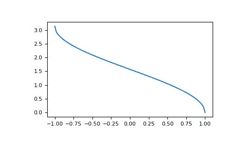

# numpy.arccos

> 原文：[`numpy.org/doc/1.26/reference/generated/numpy.arccos.html`](https://numpy.org/doc/1.26/reference/generated/numpy.arccos.html)

```py
numpy.arccos(x, /, out=None, *, where=True, casting='same_kind', order='K', dtype=None, subok=True[, signature, extobj]) = <ufunc 'arccos'>
```

逐元素的反余弦三角函数。

`cos`的反函数，如果 `y = cos(x)`，则 `x = arccos(y)`。

参数:

**x**array_like

*x*轴上的单位圆上的坐标。对于实数参数，定义域是[-1, 1]。

**out**ndarray, None, 或元组 ndarray 和 None, 可选

结果存储的位置。如果提供，必须具有与输入广播到的形状。如果未提供或为 None，则返回一个新分配的数组。一个元组（仅作为关键字参数）的长度必须等于输出的数量。

**其中**array_like, 可选

此条件广播到输入。在条件为真的位置，*out* 数组将设置为 ufunc 结果。在其他地方，*out* 数组将保留其原始值。请注意，如果通过默认的 `out=None` 创建了未初始化的 *out* 数组，则其中条件为假的位置将保持未初始化。

****kwargs**

对于其他仅关键字参数，请参阅 ufunc 文档。

返回:

**角度**ndarray

与给定 *x* 坐标在弧度 [0, pi] 处相交单位圆的射线的角度。如果 *x* 是标量，则这是一个标量。

另请参阅

`cos`, `arctan`, `arcsin`, `emath.arccos`

备注

`arccos` 是一个多值函数：对于每个 *x*，有无数多个数 *z* 使得 `cos(z) = x`。约定是返回实部位于 *[0, pi]* 的角度 *z*。

对于实值输入数据类型，`arccos` 总是返回实数输出。对于每个不能表示为实数或无穷大的值，它产生 `nan` 并设置 *invalid* 浮点错误标志。

对于复值输入，`arccos` 是一个具有分支割线 `[-inf, -1]` 和 *[1, inf]* 的复解析函数，对于前者从上方连续，对于后者从下方连续。

反余弦`cos` 也被称为 *acos* 或 cos^-1。

参考

M. Abramowitz and I.A. Stegun, “Handbook of Mathematical Functions”, 1964 年第 10 次印刷, 页码 79. [`personal.math.ubc.ca/~cbm/aands/page_79.htm`](https://personal.math.ubc.ca/~cbm/aands/page_79.htm)

示例

我们期望 arccos(1) 为 0，并且 arccos(-1) 为 pi：

```py
>>> np.arccos([1, -1])
array([ 0\.        ,  3.14159265]) 
```

绘制 arccos:

```py
>>> import matplotlib.pyplot as plt
>>> x = np.linspace(-1, 1, num=100)
>>> plt.plot(x, np.arccos(x))
>>> plt.axis('tight')
>>> plt.show() 
```


