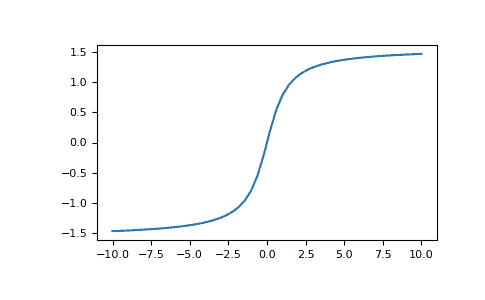

# `numpy.arctan`

> 原文：[`numpy.org/doc/1.26/reference/generated/numpy.arctan.html`](https://numpy.org/doc/1.26/reference/generated/numpy.arctan.html)

```py
numpy.arctan(x, /, out=None, *, where=True, casting='same_kind', order='K', dtype=None, subok=True[, signature, extobj]) = <ufunc 'arctan'>
```

反三角正切，逐个元素计算。

反正切函数的逆运算，如果`y = tan(x)`，那么`x = arctan(y)`。

参数：

**x**array_like

**out**ndarray、None 或 ndarray 和 None 的元组，可选

存储结果的位置。如果提供，必须具有输入广播到的形状。如果未提供或 None，则返回一个新分配的数组。元组（仅限关键字参数）的长度必须等于输出的数量。 

**where**array_like，可选

此条件在输入上广播。在条件为真的位置，*out*数组将设置为 ufunc 结果。在其他地方，*out*数组将保留其原始值。请注意，如果通过默认`out=None`创建了未初始化的*out*数组，则其中条件为 False 的位置将保持未初始化状态。

****kwargs**

对于其他关键字-only 参数，请参阅 ufunc docs。

返回：

**out**ndarray 或标量

输出与*x*相同的形状。其实部在`[-pi/2, pi/2]`（`arctan(+/-inf)`返回`+/-pi/2`）。如果*x*是标量，这是一个标量。

另请参见

`arctan2`

由（*x*，*y*）和正*x*轴形成的角度的“四象限”反正切。

`angle`

复数值的参数。

注意

`arctan`是一个多值函数：对于每个*x*，都存在无数多个*z*，使得 tan(*z*) = *x*。约定是返回其实部位于[-pi/2, pi/2]的角度*z*。

对于实值输入数据类型，`arctan`总是返回实值输出。对于每个值，如果不能表达为实数或无穷大，它产生`nan`并设置*invalid*浮点错误标志。

对于复值输入，`arctan`是一个通解复解析函数，它有[`1j, infj`]和[`-1j, -infj`]作为分支切线，对前者是左连续的，对后者是右连续的。

反正切也被称为*atan*或*tan^{-1}*。

参考

Abramowitz, M. and Stegun, I. A.，*Handbook of Mathematical Functions*，第 10 版，纽约：多弗尔出版社，1964 年，第 79 页。[`personal.math.ubc.ca/~cbm/aands/page_79.htm`](https://personal.math.ubc.ca/~cbm/aands/page_79.htm)

示例

我们期望 0 的反正切是 0，1 的反正切是 pi/4：

```py
>>> np.arctan([0, 1])
array([ 0\.        ,  0.78539816]) 
```

```py
>>> np.pi/4
0.78539816339744828 
```

绘制反正切：

```py
>>> import matplotlib.pyplot as plt
>>> x = np.linspace(-10, 10)
>>> plt.plot(x, np.arctan(x))
>>> plt.axis('tight')
>>> plt.show() 
```


