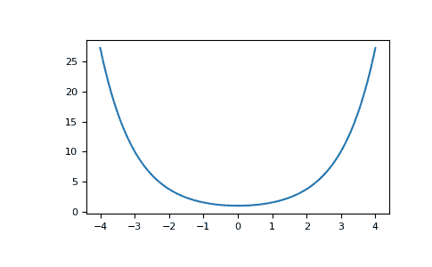

# numpy.cosh

> 原文：[`numpy.org/doc/1.26/reference/generated/numpy.cosh.html`](https://numpy.org/doc/1.26/reference/generated/numpy.cosh.html)

```py
numpy.cosh(x, /, out=None, *, where=True, casting='same_kind', order='K', dtype=None, subok=True[, signature, extobj]) = <ufunc 'cosh'>
```

双曲余弦，对每个元素进行运算。

等同于`1/2 * (np.exp(x) + np.exp(-x))`和`np.cos(1j*x)`。

参数：

**x**类似数组

输入数组。

**out**ndarray，None，或 ndarray 和 None 的元组，可选

存储结果的位置。如果提供，必须具有输入广播到的形状。如果未提供或为 None，则返回一个新分配的数组。一个元组（仅作为关键字参数）的长度必须等于输出的数量。

**where**类似数组，可选

此条件广播到输入。在条件为 True 的位置，*out*数组将设置为 ufunc 结果。否则，*out*数组将保留其原始值。请注意，如果通过默认的`out=None`创建了一个未初始化的*out*数组，在其中条件为 False 的位置将保持未初始化。

****kwargs**

对于其他仅限关键字参数，请参阅 ufunc 文档。

返回：

**out**ndarray 或标量

与*x*具有相同形状的输出数组。如果*x*是标量，则这是一个标量。

示例

```py
>>> np.cosh(0)
1.0 
```

双曲余弦描述了悬垂电缆的形状：

```py
>>> import matplotlib.pyplot as plt
>>> x = np.linspace(-4, 4, 1000)
>>> plt.plot(x, np.cosh(x))
>>> plt.show() 
```


