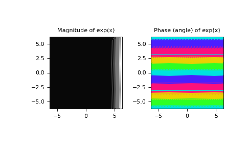

# `numpy.exp`

> 原文：[`numpy.org/doc/1.26/reference/generated/numpy.exp.html`](https://numpy.org/doc/1.26/reference/generated/numpy.exp.html)

```py
numpy.exp(x, /, out=None, *, where=True, casting='same_kind', order='K', dtype=None, subok=True[, signature, extobj]) = <ufunc 'exp'>
```

计算输入数组中所有元素的指数函数。

参数：

**x**array_like

输入值。

**out**ndarray，None 或 ndarray 和 None 的元组，可选

结果存储的位置。如果提供，则必须具有与输入广播到的形状相同的形状。如果未提供或为 None，则返回一个新分配的数组。元组（仅作为关键字参数）的长度必须等于输出的数量。

**where**array_like，可选

此条件将在输入上进行广播。在条件为真的位置，*out*数组将设置为 ufunc 的结果。在其他地方，*out*数组将保持其原始值。注意，如果通过默认值`out=None`创建了一个未初始化的*out*数组，则其中条件为假的位置将保持未初始化状态。

****kwargs**

对于其他关键字参数，请参阅 ufunc 文档。

返回值：

**out**ndarray 或标量

输出数组，为*x*的逐元素指数函数。如果*x*是标量，则输出为标量。

另请参阅

`expm1`

计算数组中所有元素的`exp(x) - 1`。

`exp2`

计算数组中所有元素的`2**x`。

注意事项

无理数`e`也被称为欧拉数。它的近似值为 2.718281，并且是自然对数的底数`ln`（这意味着，如果\(x = \ln y = \log_e y\)，那么\(e^x = y\)。对于实数输入，`exp(x)`始终为正数。

对于复数参数`x = a + ib`，我们可以写作\(e^x = e^a e^{ib}\)。第一项\(e^a\)已知（它是上面描述的实部参数）。第二项\(e^{ib}\)是\(\cos b + i \sin b\)，是一个幅值为 1 且具有周期相位的函数。

参考文献

[1]

Wikipedia，“Exponential function”，[`en.wikipedia.org/wiki/Exponential_function`](https://en.wikipedia.org/wiki/Exponential_function)

[2]

M. Abramovitz 和 I. A. Stegun，“Handbook of Mathematical Functions with Formulas, Graphs, and Mathematical Tables”，Dover，1964 年，第 69 页，[`personal.math.ubc.ca/~cbm/aands/page_69.htm`](https://personal.math.ubc.ca/~cbm/aands/page_69.htm)

示例

在复平面中绘制`exp(x)`的幅值和相位：

```py
>>> import matplotlib.pyplot as plt 
```

```py
>>> x = np.linspace(-2*np.pi, 2*np.pi, 100)
>>> xx = x + 1j * x[:, np.newaxis] # a + ib over complex plane
>>> out = np.exp(xx) 
```

```py
>>> plt.subplot(121)
>>> plt.imshow(np.abs(out),
...            extent=[-2*np.pi, 2*np.pi, -2*np.pi, 2*np.pi], cmap='gray')
>>> plt.title('Magnitude of exp(x)') 
```

```py
>>> plt.subplot(122)
>>> plt.imshow(np.angle(out),
...            extent=[-2*np.pi, 2*np.pi, -2*np.pi, 2*np.pi], cmap='hsv')
>>> plt.title('Phase (angle) of exp(x)')
>>> plt.show() 
```


