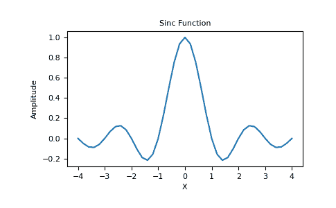

# `numpy.sinc`

> 原文：[`numpy.org/doc/1.26/reference/generated/numpy.sinc.html`](https://numpy.org/doc/1.26/reference/generated/numpy.sinc.html)

```py
numpy.sinc(x)
```

返回归一化的 sinc 函数。

对于任何参数\(x\ne 0\)，sinc 函数等于\(\sin(\pi x)/(\pi x)\)。`sinc(0)`取极限值 1，使得`sinc`不仅在任何地方连续，而且无限可微。

注意

注意在定义中使用的`pi`的归一化因子。这是信号处理中最常用的定义。使用`sinc(x / np.pi)`来获得在数学中更常见的未归一化 sinc 函数\(\sin(x)/x\)。

参数：

**x**数组

数组（可能是多维的）的值，用于计算`sinc(x)`。

返回：

**out**数组

`sinc(x)`，其形状与输入相同。

注意

sinc 的名称缩写为“sine cardinal”或“sinus cardinalis”。

sinc 函数在各种信号处理应用中使用，包括抗混叠、Lanczos 重采样滤波器的构建以及插值。

对于离散时间信号的带限插值，理想的插值核心是与 sinc 函数成比例的。

参考

[1]

Weisstein, Eric W. “Sinc Function.” From MathWorld–A Wolfram Web Resource. [`mathworld.wolfram.com/SincFunction.html`](http://mathworld.wolfram.com/SincFunction.html)

[2]

维基百科，“Sinc function”，[`en.wikipedia.org/wiki/Sinc_function`](https://en.wikipedia.org/wiki/Sinc_function)

示例

```py
>>> import matplotlib.pyplot as plt
>>> x = np.linspace(-4, 4, 41)
>>> np.sinc(x)
 array([-3.89804309e-17,  -4.92362781e-02,  -8.40918587e-02, # may vary
 -8.90384387e-02,  -5.84680802e-02,   3.89804309e-17,
 6.68206631e-02,   1.16434881e-01,   1.26137788e-01,
 8.50444803e-02,  -3.89804309e-17,  -1.03943254e-01,
 -1.89206682e-01,  -2.16236208e-01,  -1.55914881e-01,
 3.89804309e-17,   2.33872321e-01,   5.04551152e-01,
 7.56826729e-01,   9.35489284e-01,   1.00000000e+00,
 9.35489284e-01,   7.56826729e-01,   5.04551152e-01,
 2.33872321e-01,   3.89804309e-17,  -1.55914881e-01,
 -2.16236208e-01,  -1.89206682e-01,  -1.03943254e-01,
 -3.89804309e-17,   8.50444803e-02,   1.26137788e-01,
 1.16434881e-01,   6.68206631e-02,   3.89804309e-17,
 -5.84680802e-02,  -8.90384387e-02,  -8.40918587e-02,
 -4.92362781e-02,  -3.89804309e-17]) 
```

```py
>>> plt.plot(x, np.sinc(x))
[<matplotlib.lines.Line2D object at 0x...>]
>>> plt.title("Sinc Function")
Text(0.5, 1.0, 'Sinc Function')
>>> plt.ylabel("Amplitude")
Text(0, 0.5, 'Amplitude')
>>> plt.xlabel("X")
Text(0.5, 0, 'X')
>>> plt.show() 
```


