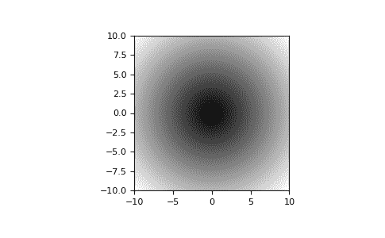

# `numpy.absolute`

> 原文：[`numpy.org/doc/1.26/reference/generated/numpy.absolute.html`](https://numpy.org/doc/1.26/reference/generated/numpy.absolute.html)

```py
numpy.absolute(x, /, out=None, *, where=True, casting='same_kind', order='K', dtype=None, subok=True[, signature, extobj]) = <ufunc 'absolute'>
```

逐元素计算绝对值。

`np.abs`是这个函数的快捷方式。

参数：

**x**array_like

输入数组。

**out**ndarray、None 或 ndarray 和 None 的元组，可选

存储结果的位置。如果提供，它必须具有输入广播到的形状。如果未提供或为 None，则返回一个新分配的数组。元组（仅作为关键字参数）的长度必须等于输出数量。

**where**array_like, optional

此条件会广播到输入中。在条件为 True 的位置，*out*数组将设置为 ufunc 的结果。在其他位置，*out*数组将保留其原始值。请注意，如果通过默认值`out=None`创建未初始化的*out*数组，则其中条件为 False 的位置将保持未初始化状态。

****kwargs**

对于其他关键字参数，请参阅 ufunc 文档。

返回值：

**absolute**ndarray

包含*x*中每个元素的绝对值的 ndarray。对于复数输入`a + ib`，绝对值是\(\sqrt{ a² + b² }\)。如果*x*是标量，则为标量。

示例

```py
>>> x = np.array([-1.2, 1.2])
>>> np.absolute(x)
array([ 1.2,  1.2])
>>> np.absolute(1.2 + 1j)
1.5620499351813308 
```

绘制函数在`[-10, 10]`上的图像：

```py
>>> import matplotlib.pyplot as plt 
```

```py
>>> x = np.linspace(start=-10, stop=10, num=101)
>>> plt.plot(x, np.absolute(x))
>>> plt.show() 
```


在复平面上绘制函数图像：

```py
>>> xx = x + 1j * x[:, np.newaxis]
>>> plt.imshow(np.abs(xx), extent=[-10, 10, -10, 10], cmap='gray')
>>> plt.show() 
```



函数[`abs`](https://docs.python.org/3/library/functions.html#abs "(in Python v3.11)") 可以用作`np.absolute`在 ndarrays 上的简写。

```py
>>> x = np.array([-1.2, 1.2])
>>> abs(x)
array([1.2, 1.2]) 
```
