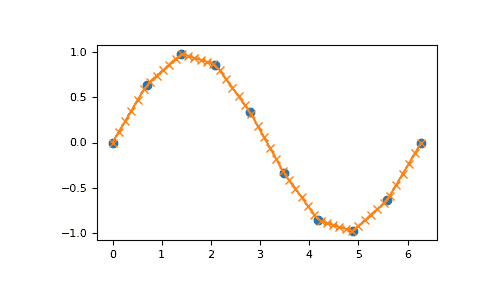

# `numpy.interp`

> 原文：[`numpy.org/doc/1.26/reference/generated/numpy.interp.html`](https://numpy.org/doc/1.26/reference/generated/numpy.interp.html)

```py
numpy.interp(x, xp, fp, left=None, right=None, period=None)
```

单调递增样本点的一维线性插值。

返回对具有给定离散数据点（*xp*、*fp*）的函数的一维分段线性插值，计算结果为*x*处的值。

参数：

**x** 类型为数组

要评估插值值的 x 坐标。

**xp** 1-D 浮点数序列

数据点的 x 坐标，如果未指定 *period* 参数，则必须递增。 否则，在归一化周期边界后，将对 *xp* 进行内部排序，并执行 `xp = xp % period`。

**fp** 1-D 浮点数或复数序列

数据点的 y 坐标，与*xp*的长度相同。

**left** 可选的浮点数或与 *fp* 对应的复数

*x < xp[0]* 时返回的值，默认为 *fp[0]*。

**right** 可选的浮点数或与 *fp* 对应的复数

*x > xp[-1]* 时返回的值，默认为 *fp[-1]*。

**period** 为 None 或浮点数，可选

x 坐标的周期。此参数允许正确插值角度坐标。 如果指定了 *period* 参数，则忽略参数 *left* 和 *right*。

新版本 1.10.0 中新增。

返回：

**y** 类型为浮点数或与 *fp* 对应的复数或数组

插值值，与 *x* 的形状相同。

引发：

值错误

如果 *xp* 和 *fp* 的长度不同 如果 *xp* 或 *fp* 不是 1-D 序列 如果 *period == 0*

警告

预计 x 坐标序列递增，但没有明确强制执行。 但是，如果序列 *xp* 非递增，则插值结果毫无意义。

请注意，由于 NaN 不可排序，因此 *xp* 也不能包含 NaN。

对于 *xp* 严格递增的简单检查是：

```py
np.all(np.diff(xp) > 0) 
```

另请参阅

[`scipy.interpolate`](https://docs.scipy.org/doc/scipy/reference/interpolate.html#module-scipy.interpolate "(在 SciPy v1.11.2 中)")

示例

```py
>>> xp = [1, 2, 3]
>>> fp = [3, 2, 0]
>>> np.interp(2.5, xp, fp)
1.0
>>> np.interp([0, 1, 1.5, 2.72, 3.14], xp, fp)
array([3\.  , 3\.  , 2.5 , 0.56, 0\.  ])
>>> UNDEF = -99.0
>>> np.interp(3.14, xp, fp, right=UNDEF)
-99.0 
```

绘制正弦函数的插值曲线：

```py
>>> x = np.linspace(0, 2*np.pi, 10)
>>> y = np.sin(x)
>>> xvals = np.linspace(0, 2*np.pi, 50)
>>> yinterp = np.interp(xvals, x, y)
>>> import matplotlib.pyplot as plt
>>> plt.plot(x, y, 'o')
[<matplotlib.lines.Line2D object at 0x...>]
>>> plt.plot(xvals, yinterp, '-x')
[<matplotlib.lines.Line2D object at 0x...>]
>>> plt.show() 
```



具有周期性 x 坐标的插值：

```py
>>> x = [-180, -170, -185, 185, -10, -5, 0, 365]
>>> xp = [190, -190, 350, -350]
>>> fp = [5, 10, 3, 4]
>>> np.interp(x, xp, fp, period=360)
array([7.5 , 5\.  , 8.75, 6.25, 3\.  , 3.25, 3.5 , 3.75]) 
```

复数插值：

```py
>>> x = [1.5, 4.0]
>>> xp = [2,3,5]
>>> fp = [1.0j, 0, 2+3j]
>>> np.interp(x, xp, fp)
array([0.+1.j , 1.+1.5j]) 
```
