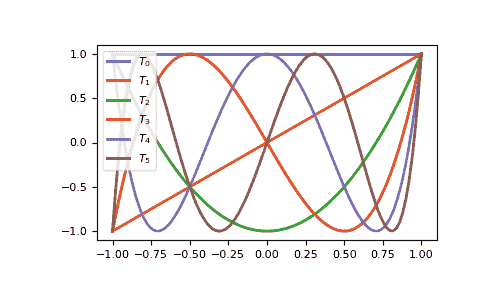

# 使用便利类

> 原文：[`numpy.org/doc/1.26/reference/routines.polynomials.classes.html`](https://numpy.org/doc/1.26/reference/routines.polynomials.classes.html)

多项式包提供的便利类包括：

> | 名称 | 提供 |
> | --- | --- |
> | 多项式 | 幂级数 |
> | 切比雪夫 | 切比雪夫级数 |
> | 勒让德 | 勒让德级数 |
> | 拉盖尔 | 拉盖尔级数 |
> | 厄米特 | 厄米特级数 |
> | 厄米特 E | 厄米特 E 级数 |

在这种情况下，系列是相应的多项式基函数的有限求和，乘以系数。例如，幂级数看起来像

\[p(x) = 1 + 2x + 3x²\]

并具有系数\([1, 2, 3]\)。具有相同系数的切比雪夫级数看起来像

\[p(x) = 1 T_0(x) + 2 T_1(x) + 3 T_2(x)\]

更一般地

\[p(x) = \sum_{i=0}^n c_i T_i(x)\]

在这种情况下，\(T_n\)表示度为\(n\)的切比雪夫函数，但也可以轻松地成为任何其他类的基函数。所有类的约定是系数\(c[i]\)与度为 i 的基函数相对应。

所有类都是不可变的，并且具有相同的方法，特别是它们实现了 Python 的数字运算符 +、-、*、//、%、divmod、**、==和!=。最后两个可能因为浮点精度误差而有些问题。我们现在通过 NumPy 版本 1.7.0 快速演示各种操作。

## 基础

首先，我们需要一个多项式类和一个多项式实例来玩耍。这些类可以直接从多项式包或相关类型的模块中导入。这里我们从包中导入并使用传统的 Polynomial 类，因为它很熟悉：

```py
>>> from numpy.polynomial import Polynomial as P
>>> p = P([1,2,3])
>>> p
Polynomial([1., 2., 3.], domain=[-1,  1], window=[-1,  1], symbol='x') 
```

请注意，打印输出的长版本有三个部分。第一个是系数，第二个是域，第三个是窗口：

```py
>>> p.coef
array([1., 2., 3.])
>>> p.domain
array([-1,  1])
>>> p.window
array([-1,  1]) 
```

打印多项式会输出一个更熟悉格式的多项式表达式：

```py
>>> print(p)
1.0 + 2.0·x + 3.0·x² 
```

请注意，多项式的字符串表示默认使用 Unicode 字符（在 Windows 上除外）来表示幂和下标。还提供了基于 ASCII 的表示形式（在 Windows 上为默认）。可以使用`set_default_printstyle`函数在包级别切换多项式字符串格式：

```py
>>> np.polynomial.set_default_printstyle('ascii')
>>> print(p)
1.0 + 2.0 x + 3.0 x**2 
```

或使用字符串格式对单个多项式实例进行控制：

```py
>>> print(f"{p:unicode}")
1.0 + 2.0·x + 3.0·x² 
```

当我们进行拟合时，会涉及到域和窗口，目前我们忽略它们，并进行基本的代数和算术操作。

加法和减法：

```py
>>> p + p
Polynomial([2., 4., 6.], domain=[-1.,  1.], window=[-1.,  1.], symbol='x')
>>> p - p
Polynomial([0.], domain=[-1.,  1.], window=[-1.,  1.], symbol='x') 
```

乘法：

```py
>>> p * p
Polynomial([ 1.,   4.,  10.,  12.,   9.], domain=[-1.,  1.], window=[-1.,  1.], symbol='x') 
```

幂：

```py
>>> p**2
Polynomial([ 1.,   4., 10., 12.,  9.], domain=[-1.,  1.], window=[-1.,  1.], symbol='x') 
```

除法：

地板除法，‘//’, 是多项式类的除法运算符，在这方面多项式被视为整数。对于 Python 版本 < 3.x，‘/’ 运算符映射为 ‘//’，正如对 Python 的会发生的那样，对于较新版本，‘/’ 只能用于标量的除法。某个时候将被弃用：

```py
>>> p // P([-1, 1])
Polynomial([5.,  3.], domain=[-1.,  1.], window=[-1.,  1.], symbol='x') 
```

余数：

```py
>>> p % P([-1, 1])
Polynomial([6.], domain=[-1.,  1.], window=[-1.,  1.], symbol='x') 
```

Divmod（取商和余数）：

```py
>>> quo, rem = divmod(p, P([-1, 1]))
>>> quo
Polynomial([5.,  3.], domain=[-1.,  1.], window=[-1.,  1.], symbol='x')
>>> rem
Polynomial([6.], domain=[-1.,  1.], window=[-1.,  1.], symbol='x') 
```

评估：

```py
>>> x = np.arange(5)
>>> p(x)
array([  1.,   6.,  17.,  34.,  57.])
>>> x = np.arange(6).reshape(3,2)
>>> p(x)
array([[ 1.,   6.],
 [17.,  34.],
 [57.,  86.]]) 
```

替换：

用多项式替代 x，并展开结果。在这里，我们用 p 替代自身，展开后得到一个次数为 4 的新多项式。如果把多项式看作函数，这就是函数的复合：

```py
>>> p(p)
Polynomial([ 6., 16., 36., 36., 27.], domain=[-1.,  1.], window=[-1.,  1.], symbol='x') 
```

根：

```py
>>> p.roots()
array([-0.33333333-0.47140452j, -0.33333333+0.47140452j]) 
```

并不总是方便明确使用多项式实例，因此元组、列表、数组和标量会在算术运算中被自动转换：

```py
>>> p + [1, 2, 3]
Polynomial([2., 4., 6.], domain=[-1.,  1.], window=[-1.,  1.], symbol='x')
>>> [1, 2, 3] * p
Polynomial([ 1.,  4., 10., 12.,  9.], domain=[-1.,  1.], window=[-1.,  1.], symbol='x')
>>> p / 2
Polynomial([0.5, 1\. , 1.5], domain=[-1.,  1.], window=[-1.,  1.], symbol='x') 
```

在域、窗口或类不同的多项式之间不能在算术中混合使用：

```py
>>> from numpy.polynomial import Chebyshev as T
>>> p + P([1], domain=[0,1])
Traceback (most recent call last):
  File "<stdin>", line 1, in <module>
  File "<string>", line 213, in __add__
TypeError: Domains differ
>>> p + P([1], window=[0,1])
Traceback (most recent call last):
  File "<stdin>", line 1, in <module>
  File "<string>", line 215, in __add__
TypeError: Windows differ
>>> p + T([1])
Traceback (most recent call last):
  File "<stdin>", line 1, in <module>
  File "<string>", line 211, in __add__
TypeError: Polynomial types differ 
```

但可以使用不同类型进行替换。实际上，这就是多项式类之间进行类型、域和窗口转换的方式： 

```py
>>> p(T([0, 1]))
Chebyshev([2.5, 2\. , 1.5], domain=[-1.,  1.], window=[-1.,  1.], symbol='x') 
```

这将把多项式 *p* 转换为切比雪夫形式。这是因为 \(T_1(x) = x\)，将 \(x\) 替换为 \(x\) 不会改变原多项式。然而，所有的乘法和除法都将使用切比雪夫级数进行，因此结果的类型会有所变化。

所有多项式实例都应为不可变对象，因此增强操作（`+=`, `-=` 等）和任何会违反多项式实例不变性的功能都被有意地未实现。

## 微积分

多项式实例可以进行积分和微分。

```py
>>> from numpy.polynomial import Polynomial as P
>>> p = P([2, 6])
>>> p.integ()
Polynomial([0., 2., 3.], domain=[-1.,  1.], window=[-1.,  1.], symbol='x')
>>> p.integ(2)
Polynomial([0., 0., 1., 1.], domain=[-1.,  1.], window=[-1.,  1.], symbol='x') 
```

第一个例子对 *p* 进行一次积分，第二个例子对其进行两次积分。默认情况下，积分的下限和积分常数都为 0，但两者都可以指定：

```py
>>> p.integ(lbnd=-1)
Polynomial([-1.,  2.,  3.], domain=[-1.,  1.], window=[-1.,  1.], symbol='x')
>>> p.integ(lbnd=-1, k=1)
Polynomial([0., 2., 3.], domain=[-1.,  1.], window=[-1.,  1.], symbol='x') 
```

在第一种情况下，积分的下限设为 -1，并且积分常数为 0。在第二种情况下，积分常数也设为 1。微分更简单，因为唯一的选项就是对多项式微分的次数：

```py
>>> p = P([1, 2, 3])
>>> p.deriv(1)
Polynomial([2., 6.], domain=[-1.,  1.], window=[-1.,  1.], symbol='x')
>>> p.deriv(2)
Polynomial([6.], domain=[-1.,  1.], window=[-1.,  1.], symbol='x') 
```

## 其他多项式构造函数

指定系数来构造多项式只是获取多项式实例的一种方式，它们也可以通过指定它们的根、从其他多项式类型进行转换以及通过最小二乘拟合来创建。拟合在自己的部分中讨论，其他方法如下所示：

```py
>>> from numpy.polynomial import Polynomial as P
>>> from numpy.polynomial import Chebyshev as T
>>> p = P.fromroots([1, 2, 3])
>>> p
Polynomial([-6., 11., -6.,  1.], domain=[-1.,  1.], window=[-1.,  1.], symbol='x')
>>> p.convert(kind=T)
Chebyshev([-9\.  , 11.75, -3\.  ,  0.25], domain=[-1.,  1.], window=[-1.,  1.], symbol='x') 
```

convert 方法也可以转换域和窗口：

```py
>>> p.convert(kind=T, domain=[0, 1])
Chebyshev([-2.4375 ,  2.96875, -0.5625 ,  0.03125], domain=[0.,  1.], window=[-1.,  1.], symbol='x')
>>> p.convert(kind=P, domain=[0, 1])
Polynomial([-1.875,  2.875, -1.125,  0.125], domain=[0.,  1.], window=[-1.,  1.], symbol='x') 
```

在 numpy 版本 >= 1.7.0 中，*basis* 和 *cast* 类方法也可用。cast 方法类似于 convert 方法，而 basis 方法返回给定次数的基函数多项式：

```py
>>> P.basis(3)
Polynomial([0., 0., 0., 1.], domain=[-1.,  1.], window=[-1.,  1.], symbol='x')
>>> T.cast(p)
Chebyshev([-9\.  , 11.75, -3\. ,  0.25], domain=[-1.,  1.], window=[-1.,  1.], symbol='x') 
```

类型之间的转换可能很有用，但不建议常规使用。从一个次数为 50 的切比雪夫级数转换为相同次数的多项式级数可能导致数字精度损失，使数值评估的结果基本随机。

## 拟合

拟合是为了便利起见，*域*和*窗口*属性是其一部分。为了说明问题，下面绘制了 5 次 Chebyshev 多项式的值。

```py
>>> import matplotlib.pyplot as plt
>>> from numpy.polynomial import Chebyshev as T
>>> x = np.linspace(-1, 1, 100)
>>> for i in range(6):
...     ax = plt.plot(x, T.basis(i)(x), lw=2, label=f"$T_{i}$")
...
>>> plt.legend(loc="upper left")
>>> plt.show() 
```



在-1 <= *x* <= 1 的范围内，它们是漂亮的，等波纹函数，位于+/- 1 之间。在-2 <= *x* <= 2 的范围内，相同的图形看起来截然不同：

```py
>>> import matplotlib.pyplot as plt
>>> from numpy.polynomial import Chebyshev as T
>>> x = np.linspace(-2, 2, 100)
>>> for i in range(6):
...     ax = plt.plot(x, T.basis(i)(x), lw=2, label=f"$T_{i}$")
...
>>> plt.legend(loc="lower right")
>>> plt.show() 
```


可以看到，“好的”部分已经变得微不足道。在使用 Chebyshev 多项式进行拟合时，我们希望使用*x*介于-1 和 1 之间的区间，这就是*窗口*的作用。然而，要拟合的数据很少能够在该区间内，因此我们使用*域*来指定数据点所在的区间。拟合完成后，通过线性变换将域映射到窗口，并使用映射后的数据点进行通常的最小二乘拟合。拟合的窗口和域是返回系列的一部分，在计算值、导数等时会自动使用它们。如果在调用中没有指定它们，拟合例程将使用默认窗口和包含所有数据点的最小域。下面是对噪声正弦曲线拟合的示例。

```py
>>> import numpy as np
>>> import matplotlib.pyplot as plt
>>> from numpy.polynomial import Chebyshev as T
>>> np.random.seed(11)
>>> x = np.linspace(0, 2*np.pi, 20)
>>> y = np.sin(x) + np.random.normal(scale=.1, size=x.shape)
>>> p = T.fit(x, y, 5)
>>> plt.plot(x, y, 'o')
>>> xx, yy = p.linspace()
>>> plt.plot(xx, yy, lw=2)
>>> p.domain
array([0\.        ,  6.28318531])
>>> p.window
array([-1.,  1.])
>>> plt.show() 
```


## 基础知识

首先，我们需要一个多项式类和一个多项式实例来玩耍。这些类可以直接从多项式包或相关类型的模块中导入。在这里，我们从包中导入并使用传统的多项式类，因为它更为熟悉：

```py
>>> from numpy.polynomial import Polynomial as P
>>> p = P([1,2,3])
>>> p
Polynomial([1., 2., 3.], domain=[-1,  1], window=[-1,  1], symbol='x') 
```

请注意，打印长版本输出有三部分。第一部分是系数，第二部分是域，第三部分是窗口：

```py
>>> p.coef
array([1., 2., 3.])
>>> p.domain
array([-1,  1])
>>> p.window
array([-1,  1]) 
```

打印多项式会以更熟悉的格式显示多项式表达式：

```py
>>> print(p)
1.0 + 2.0·x + 3.0·x² 
```

请注意，默认情况下多项式的字符串表示使用 Unicode 字符（在 Windows 上除外）来表示幂和下标。也可以使用基于 ASCII 的表示（在 Windows 上为默认）。可以使用`set_default_printstyle`函数在包级别切换多项式字符串格式：

```py
>>> np.polynomial.set_default_printstyle('ascii')
>>> print(p)
1.0 + 2.0 x + 3.0 x**2 
```

或控制单个多项式实例的字符串格式：

```py
>>> print(f"{p:unicode}")
1.0 + 2.0·x + 3.0·x² 
```

我们将在拟合时处理域和窗口，目前我们忽略它们并进行基本的代数和算术运算。

加法和减法：

```py
>>> p + p
Polynomial([2., 4., 6.], domain=[-1.,  1.], window=[-1.,  1.], symbol='x')
>>> p - p
Polynomial([0.], domain=[-1.,  1.], window=[-1.,  1.], symbol='x') 
```

乘法：

```py
>>> p * p
Polynomial([ 1.,   4.,  10.,  12.,   9.], domain=[-1.,  1.], window=[-1.,  1.], symbol='x') 
```

幂：

```py
>>> p**2
Polynomial([ 1.,   4., 10., 12.,  9.], domain=[-1.,  1.], window=[-1.,  1.], symbol='x') 
```

除法：

"地板除法"，‘//’，是多项式类的除法运算符，多项式在这个方面被处理得像整数一样。对于 Python 版本 < 3.x，‘/’运算符映射到‘//’，就像 Python 一样；对于以后的版本，‘/’只对标量进行除法运算有效。在某个时候它将被弃用：

```py
>>> p // P([-1, 1])
Polynomial([5.,  3.], domain=[-1.,  1.], window=[-1.,  1.], symbol='x') 
```

余数:

```py
>>> p % P([-1, 1])
Polynomial([6.], domain=[-1.,  1.], window=[-1.,  1.], symbol='x') 
```

除取余:

```py
>>> quo, rem = divmod(p, P([-1, 1]))
>>> quo
Polynomial([5.,  3.], domain=[-1.,  1.], window=[-1.,  1.], symbol='x')
>>> rem
Polynomial([6.], domain=[-1.,  1.], window=[-1.,  1.], symbol='x') 
```

评估:

```py
>>> x = np.arange(5)
>>> p(x)
array([  1.,   6.,  17.,  34.,  57.])
>>> x = np.arange(6).reshape(3,2)
>>> p(x)
array([[ 1.,   6.],
 [17.,  34.],
 [57.,  86.]]) 
```

替换:

用一个多项式替换 x 并展开结果。在这里，我们将 p 代入自身，展开后得到一个新的 4 次多项式。如果把多项式看作函数，这就是函数的组合：

```py
>>> p(p)
Polynomial([ 6., 16., 36., 36., 27.], domain=[-1.,  1.], window=[-1.,  1.], symbol='x') 
```

根:

```py
>>> p.roots()
array([-0.33333333-0.47140452j, -0.33333333+0.47140452j]) 
```

并不总是方便明确使用多项式实例，所以元组、列表、数组和标量在算术运算中自动进行类型转换：

```py
>>> p + [1, 2, 3]
Polynomial([2., 4., 6.], domain=[-1.,  1.], window=[-1.,  1.], symbol='x')
>>> [1, 2, 3] * p
Polynomial([ 1.,  4., 10., 12.,  9.], domain=[-1.,  1.], window=[-1.,  1.], symbol='x')
>>> p / 2
Polynomial([0.5, 1\. , 1.5], domain=[-1.,  1.], window=[-1.,  1.], symbol='x') 
```

在域、窗口或类别上有所不同的多项式不能混合在算术中使用:

```py
>>> from numpy.polynomial import Chebyshev as T
>>> p + P([1], domain=[0,1])
Traceback (most recent call last):
  File "<stdin>", line 1, in <module>
  File "<string>", line 213, in __add__
TypeError: Domains differ
>>> p + P([1], window=[0,1])
Traceback (most recent call last):
  File "<stdin>", line 1, in <module>
  File "<string>", line 215, in __add__
TypeError: Windows differ
>>> p + T([1])
Traceback (most recent call last):
  File "<stdin>", line 1, in <module>
  File "<string>", line 211, in __add__
TypeError: Polynomial types differ 
```

但是可以使用不同类型来进行替换。实际上，这就是如何在类型、域和窗口转换之间进行多项式类的相互转换的：

```py
>>> p(T([0, 1]))
Chebyshev([2.5, 2\. , 1.5], domain=[-1.,  1.], window=[-1.,  1.], symbol='x') 
```

这给出了切比雪夫形式的多项式*p*。这是因为\(T_1(x) = x\)，并且用\(x\)代替\(x\)不会改变原多项式。然而，所有乘法和除法都将使用切比雪夫级数进行计算，所以结果的类型也是如此。

所有多项式实例都是不可变的，因此,augmented 操作(`+=`, `-=`,等)和任何其他会违反多项式实例的不可变性的功能都是有意未实现的。

## 微积分

多项式实例可以进行积分和微分。

```py
>>> from numpy.polynomial import Polynomial as P
>>> p = P([2, 6])
>>> p.integ()
Polynomial([0., 2., 3.], domain=[-1.,  1.], window=[-1.,  1.], symbol='x')
>>> p.integ(2)
Polynomial([0., 0., 1., 1.], domain=[-1.,  1.], window=[-1.,  1.], symbol='x') 
```

第一个示例对*p*进行了一次积分，第二个示例对其进行了两次积分。默认情况下，积分的下限和积分常数都是 0，但都可以指定。

```py
>>> p.integ(lbnd=-1)
Polynomial([-1.,  2.,  3.], domain=[-1.,  1.], window=[-1.,  1.], symbol='x')
>>> p.integ(lbnd=-1, k=1)
Polynomial([0., 2., 3.], domain=[-1.,  1.], window=[-1.,  1.], symbol='x') 
```

在第一种情况下，积分的下限设置为-1，积分常数为 0。在第二种情况下，积分常数也设置为 1。微分更简单，因为唯一的选择是多项式被微分的次数：

```py
>>> p = P([1, 2, 3])
>>> p.deriv(1)
Polynomial([2., 6.], domain=[-1.,  1.], window=[-1.,  1.], symbol='x')
>>> p.deriv(2)
Polynomial([6.], domain=[-1.,  1.], window=[-1.,  1.], symbol='x') 
```

## 其他多项式构造函数

通过指定系数构造多项式只是获得多项式实例的一种方式，它们还可以通过指定它们的根、通过从其他多项式类型转换获得，以及通过最小二乘拟合来创建。拟合在它自己的部分中进行讨论，其他方法如下所示:

```py
>>> from numpy.polynomial import Polynomial as P
>>> from numpy.polynomial import Chebyshev as T
>>> p = P.fromroots([1, 2, 3])
>>> p
Polynomial([-6., 11., -6.,  1.], domain=[-1.,  1.], window=[-1.,  1.], symbol='x')
>>> p.convert(kind=T)
Chebyshev([-9\.  , 11.75, -3\.  ,  0.25], domain=[-1.,  1.], window=[-1.,  1.], symbol='x') 
```

convert 方法还可以转换域和窗口：

```py
>>> p.convert(kind=T, domain=[0, 1])
Chebyshev([-2.4375 ,  2.96875, -0.5625 ,  0.03125], domain=[0.,  1.], window=[-1.,  1.], symbol='x')
>>> p.convert(kind=P, domain=[0, 1])
Polynomial([-1.875,  2.875, -1.125,  0.125], domain=[0.,  1.], window=[-1.,  1.], symbol='x') 
```

在 numpy 版本 >= 1.7.0 中，*basis*和*cast*类方法也是可用的。cast 方法类似于 convert 方法，而 basis 方法返回给定次数的基础多项式：

```py
>>> P.basis(3)
Polynomial([0., 0., 0., 1.], domain=[-1.,  1.], window=[-1.,  1.], symbol='x')
>>> T.cast(p)
Chebyshev([-9\.  , 11.75, -3\. ,  0.25], domain=[-1.,  1.], window=[-1.,  1.], symbol='x') 
```

类型之间的转换可能会有用，但*不*建议经常使用。在从 50 次切比雪夫级数转换成相同次数的多项式级数时，数值精度的丢失会使数值计算的结果基本上是随机的。

## 拟合

拟合是方便类的*domain*和*window*属性的原因。 为了说明问题，下面绘制了最高为 5 次的切比雪夫多项式的值。

```py
>>> import matplotlib.pyplot as plt
>>> from numpy.polynomial import Chebyshev as T
>>> x = np.linspace(-1, 1, 100)
>>> for i in range(6):
...     ax = plt.plot(x, T.basis(i)(x), lw=2, label=f"$T_{i}$")
...
>>> plt.legend(loc="upper left")
>>> plt.show() 
```


在范围-1 <= *x* <= 1 内，它们是漂亮的函数，在+/- 1 之间。 相同的区间在-2 <= *x* <= 2 看起来大不相同：

```py
>>> import matplotlib.pyplot as plt
>>> from numpy.polynomial import Chebyshev as T
>>> x = np.linspace(-2, 2, 100)
>>> for i in range(6):
...     ax = plt.plot(x, T.basis(i)(x), lw=2, label=f"$T_{i}$")
...
>>> plt.legend(loc="lower right")
>>> plt.show() 
```


如图所示，“好”的部分已经缩小到无关紧要的程度。 在使用切比雪夫多项式进行拟合时，我们想使用*x*在-1 和 1 之间的区域，这正是*window*指定的。 但是，要拟合的数据可能不会所有数据点都在该区间内，因此我们使用*domain*来指定数据点所在的区间。进行拟合时，首先通过线性变换将*domain*映射到*window*，然后使用映射后的数据点进行普通最小二乘拟合。 拟合的窗口和域是返回系列的一部分，在计算值、导数等时会自动使用。 如果在调用中未指定它们，拟合例程将使用默认窗口和包含所有数据点的最小域。 下面这幅图是对噪声正弦曲线的拟合示例。

```py
>>> import numpy as np
>>> import matplotlib.pyplot as plt
>>> from numpy.polynomial import Chebyshev as T
>>> np.random.seed(11)
>>> x = np.linspace(0, 2*np.pi, 20)
>>> y = np.sin(x) + np.random.normal(scale=.1, size=x.shape)
>>> p = T.fit(x, y, 5)
>>> plt.plot(x, y, 'o')
>>> xx, yy = p.linspace()
>>> plt.plot(xx, yy, lw=2)
>>> p.domain
array([0\.        ,  6.28318531])
>>> p.window
array([-1.,  1.])
>>> plt.show() 
```


