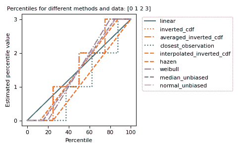

# numpy.percentile

> 原文：[`numpy.org/doc/1.26/reference/generated/numpy.percentile.html`](https://numpy.org/doc/1.26/reference/generated/numpy.percentile.html)

```py
numpy.percentile(a, q, axis=None, out=None, overwrite_input=False, method='linear', keepdims=False, *, interpolation=None)
```

沿指定轴计算数据的第 q 个百分位数。

返回数组元素的第 q 个百分位数。

参数：

**a** 实数的 array_like。

输入数组或可转换为数组的对象。

**q** 浮点数的 array_like。

计算要计算的百分位数的百分比或百分比序列。值必须介于 0 和 100 之间（包括边界）。

**axis** {int, int 的元组, None}，可选。

计算百分位数的轴或轴。默认是在数组的扁平版本上计算百分位数。

1.9.0 版中的更改：支持轴的元组

**out** ndarray，可选。

替代输出数组，必须具有与预期输出相同的形状和缓冲区长度，但如有必要，则输出的类型将被强制转换。

**overwrite_input** bool，可选。

如果为 True，则允许中间计算修改输入数组 *a*，以节省内存。在这种情况下，此函数完成后输入 *a* 的内容是未定义的。

**method**str，可选。

此参数指定用于估计百分位数的方法。有许多不同的方法，其中一些是 NumPy 特有的。有关说明，请参阅注释。按照其在 H&F 论文 [[1]](#r08bde0ebf37b-1)中总结的 R 类型排序的选项为：

1.  ‘inverted_cdf’

1.  ‘averaged_inverted_cdf’

1.  ‘closest_observation’

1.  ‘interpolated_inverted_cdf’

1.  ‘hazen’

1.  ‘weibull’

1.  ‘linear’（默认）

1.  ‘median_unbiased’

1.  ‘normal_unbiased’

前三种方法是不连续的。NumPy 还定义了默认 ‘linear’（7.）选项的以下不连续变体：

+   ‘lower’

+   ‘higher’

+   ‘midpoint’

+   ‘nearest’

1.22.0 版中的更改：此参数以前称为“interpolation”，并且只提供了“linear”默认值和其余的四个选项。 

**keepdims**bool，可选。

如果设置为 True，则缩减的轴将作为大小为 1 的维度保留在结果中。使用此选项，结果将正确地广播到原始数组 *a*。

新版 1.9.0 中新增。

**interpolation** str，可选。

方法关键字参数的不推荐名称。

从 1.22.0 版开始不推荐使用。

返回：

**percentile** 标量或 ndarray。

如果 *q* 是单个百分位数并且 *axis=None*，则结果是标量。如果给出多个百分位数，结果的第一个轴对应于百分位数。其他轴是在 *a* 缩减后剩下的轴。如果输入包含小于 `float64` 的整数或浮点数，则输出数据类型为 `float64`。否则，输出的数据类型与输入的相同。如果指定了 *out*，则返回该数组。

另请参阅

`mean`

`median`

等效于 `percentile(..., 50)`

`nanpercentile`

`分位数`

与分位数相同，只是范围为 [0, 1] 的 q。

注

给定长度为 `n` 的向量 `V`，`V` 的第 q 个百分位数是在排序后的 `V` 的最小值和最大值之间，从最小值到最大值的`q/100` 处的值。如果标准化排名与位置 `q` 不完全匹配，则两个最近邻居的值和距离以及 *method* 参数将确定百分位数。如果 `q=50`，这个函数与中位数相同，如果 `q=0`，则与最小值相同，如果 `q=100`，则与最大值相同。

可选的 *method* 参数指定了当所需的百分位数位于两个索引 `i` 和 `j = i + 1` 之间时要使用的方法。在这种情况下，我们首先确定一个位于 `i` 和 `j` 之间的虚拟索引 `i + g`，其中 `i` 是 floor，`g` 是索引的小数部分。最终结果是基于 `g` 的 `a[i]` 和 `a[j]` 的插值。在计算 `g` 期间，`i` 和 `j` 被修正使用校正常数 `alpha` 和 `beta`，其选择取决于使用的 `method`。最后，注意由于 Python 使用基于 0 的索引，代码在内部从索引中再减去 1。

下列公式确定排序样本中百分位的虚拟索引 `i + g` 的位置：

\[i + g = (q / 100) * ( n - alpha - beta + 1 ) + alpha\]

不同的方法运作如下

inverted_cdf:

H&F 的第 1 种方法 [[1]](#r08bde0ebf37b-1)。这种方法给出不连续的结果：

+   如果 g > 0 ; 则取 j

+   如果 g = 0 ; 则取 i

averaged_inverted_cdf:

H&F 的第 2 种方法 [[1]](#r08bde0ebf37b-1)。这种方法给出不连续的结果：

+   如果 g > 0 ; 则取 j

+   如果 g = 0 ; 则在边界之间取平均

closest_observation:

H&F 的第 3 种方法 [[1]](#r08bde0ebf37b-1)。这种方法给出不连续的结果：

+   如果 g > 0 ; 则取 j

+   如果 g = 0 且索引为奇数 ; 则取 j

+   如果 g = 0 且索引为偶数 ; 则取 i

interpolated_inverted_cdf:

H&F 的第 4 种方法 [[1]](#r08bde0ebf37b-1)。这种方法使用以下方法给出连续的结果：

+   alpha = 0

+   beta = 1

hazen:

H&F 的第 5 种方法 [[1]](#r08bde0ebf37b-1)。这种方法使用以下方法给出连续的结果：

+   alpha = 1/2

+   beta = 1/2

weibull:

H&F 的第 6 种方法 [[1]](#r08bde0ebf37b-1)。这种方法使用以下方法给出连续的结果：

+   alpha = 0

+   beta = 0

linear:

H&F 的第 7 种方法 [[1]](#r08bde0ebf37b-1)。这种方法使用以下方法给出连续的结果：

+   alpha = 1

+   beta = 1

median_unbiased:

H&F 的第 8 种方法 [[1]](#r08bde0ebf37b-1)。这种方法可能是最好的方法，如果样本分布函数是未知的（参见参考）。这种方法使用以下方法给出连续的结果：

+   alpha = 1/3

+   beta = 1/3

normal_unbiased:

H&F 的第 9 种方法 [[1]](#r08bde0ebf37b-1)。这种方法可能是最好的方法，如果样本分布函数已知是正态的。这种方法使用以下方法给出连续的结果：

+   alpha = 3/8

+   beta = 3/8

lower:

NumPy 方法保留用于向后兼容。以`i`作为插值点。

更高：

NumPy 方法保留用于向后兼容。以`j`作为插值点。

最近的：

NumPy 方法保留用于向后兼容。取最近的`i`或`j`。

中点：

NumPy 方法保留用于向后兼容。使用`(i + j) / 2`。

参考文献

[1] (1,2,3,4,5,6,7,8,9,10)

R. J. Hyndman 和 Y. Fan，“统计软件包中的样本分位数”，《美国统计学家》，1996 年，50(4)，361-365 页

例子

```py
>>> a = np.array([[10, 7, 4], [3, 2, 1]])
>>> a
array([[10,  7,  4],
 [ 3,  2,  1]])
>>> np.percentile(a, 50)
3.5
>>> np.percentile(a, 50, axis=0)
array([6.5, 4.5, 2.5])
>>> np.percentile(a, 50, axis=1)
array([7.,  2.])
>>> np.percentile(a, 50, axis=1, keepdims=True)
array([[7.],
 [2.]]) 
```

```py
>>> m = np.percentile(a, 50, axis=0)
>>> out = np.zeros_like(m)
>>> np.percentile(a, 50, axis=0, out=out)
array([6.5, 4.5, 2.5])
>>> m
array([6.5, 4.5, 2.5]) 
```

```py
>>> b = a.copy()
>>> np.percentile(b, 50, axis=1, overwrite_input=True)
array([7.,  2.])
>>> assert not np.all(a == b) 
```

这些不同的方法可以以图形方式进行可视化:

```py
import matplotlib.pyplot as plt

a = np.arange(4)
p = np.linspace(0, 100, 6001)
ax = plt.gca()
lines = [
    ('linear', '-', 'C0'),
    ('inverted_cdf', ':', 'C1'),
    # Almost the same as `inverted_cdf`:
    ('averaged_inverted_cdf', '-.', 'C1'),
    ('closest_observation', ':', 'C2'),
    ('interpolated_inverted_cdf', '--', 'C1'),
    ('hazen', '--', 'C3'),
    ('weibull', '-.', 'C4'),
    ('median_unbiased', '--', 'C5'),
    ('normal_unbiased', '-.', 'C6'),
    ]
for method, style, color in lines:
    ax.plot(
        p, np.percentile(a, p, method=method),
        label=method, linestyle=style, color=color)
ax.set(
    title='Percentiles for different methods and data: ' + str(a),
    xlabel='Percentile',
    ylabel='Estimated percentile value',
    yticks=a)
ax.legend(bbox_to_anchor=(1.03, 1))
plt.tight_layout()
plt.show() 
```


