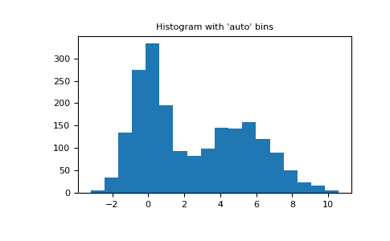

# `numpy.histogram`

> 原文：[`numpy.org/doc/1.26/reference/generated/numpy.histogram.html`](https://numpy.org/doc/1.26/reference/generated/numpy.histogram.html)

```py
numpy.histogram(a, bins=10, range=None, density=None, weights=None)
```

计算数据集的直方图。

参数:

**a**类似数组

输入数据。直方图是在扁平化数组上计算的。

**bins**整数或标量序列或字符串，可选

如果*bins*为整数，则定义给定范围内等宽箱的数量（默认为 10）。如果*bins*为序列，则定义一个单调递增的箱边数组，包括最右边的边缘，允许不均匀的箱宽。

新版本 1.11.0 中引入。

如果*bins*为字符串，则定义用于计算最佳箱宽的方法，定义为`histogram_bin_edges`。

**range**（浮点数，浮点数），可选

箱子的下限和上限。如果未提供，则范围简单地为`(a.min(), a.max())`。超出范围的值将被忽略。范围的第一个元素必须小于或等于第二个元素。*range*也会影响自动箱计算。虽然根据*range*内的实际数据计算出最优的箱宽，但箱数将填满整个范围，包括不包含数据的部分。

**weights**类似数组，可选

与*a*形状相同的权重数组。仅对*a*中的每个值对应的权重对箱计数做贡献（而不是 1）。如果*density*为 True，则权重将被归一化，以使范围上的密度积分保持为 1。

**density**布尔型，可选

如果为`False`，结果将包含每个箱中的样本数。如果为`True`，结果是箱中概率*密度*函数的值，在此范围上归一化为 1。请注意，直方图值的总和除非选择单位宽度的箱子，否则将不等于 1；这不是概率*质量*函数。

返回：

**hist**数组

直方图的值。请参阅*密度*和*权重*以了解可能的语义。

**bin_edges**浮点数数组

返回箱边`（hist 的长度+1）`。

另请参阅

`histogramdd`, `bincount`, `searchsorted`, `digitize`, `histogram_bin_edges`

注释

所有除了最后（右手边最大）箱子都是半开放的。换句话说，如果*bins*为：

```py
[1, 2, 3, 4] 
```

那么第一个箱子是`[1, 2)`（包括 1，但不包括 2），第二个是`[2, 3)`。然而，最后一个箱子是`[3, 4]`，它*包括*4。

示例

```py
>>> np.histogram([1, 2, 1], bins=[0, 1, 2, 3])
(array([0, 2, 1]), array([0, 1, 2, 3]))
>>> np.histogram(np.arange(4), bins=np.arange(5), density=True)
(array([0.25, 0.25, 0.25, 0.25]), array([0, 1, 2, 3, 4]))
>>> np.histogram([[1, 2, 1], [1, 0, 1]], bins=[0,1,2,3])
(array([1, 4, 1]), array([0, 1, 2, 3])) 
```

```py
>>> a = np.arange(5)
>>> hist, bin_edges = np.histogram(a, density=True)
>>> hist
array([0.5, 0\. , 0.5, 0\. , 0\. , 0.5, 0\. , 0.5, 0\. , 0.5])
>>> hist.sum()
2.4999999999999996
>>> np.sum(hist * np.diff(bin_edges))
1.0 
```

新版本 1.11.0 中引入。

使用 2 个顶峰随机数据和 2000 个点的自动箱选择方法示例：

```py
>>> import matplotlib.pyplot as plt
>>> rng = np.random.RandomState(10)  # deterministic random data
>>> a = np.hstack((rng.normal(size=1000),
...                rng.normal(loc=5, scale=2, size=1000)))
>>> _ = plt.hist(a, bins='auto')  # arguments are passed to np.histogram
>>> plt.title("Histogram with 'auto' bins")
Text(0.5, 1.0, "Histogram with 'auto' bins")
>>> plt.show() 
```


