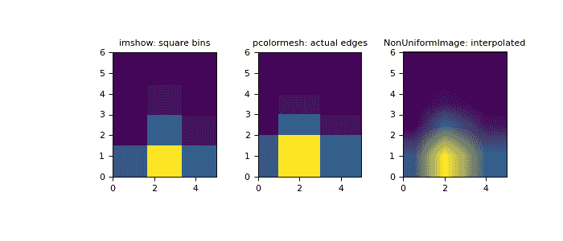
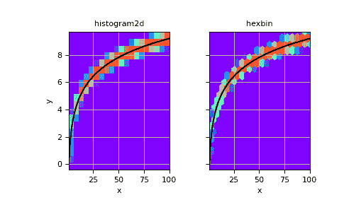

# numpy.histogram2d

> [`numpy.org/doc/1.26/reference/generated/numpy.histogram2d.html`](https://numpy.org/doc/1.26/reference/generated/numpy.histogram2d.html)

```py
numpy.histogram2d(x, y, bins=10, range=None, density=None, weights=None)
```

计算两个数据样本的二维直方图。

参数：

**x** array_like，形状(N,)

包含要进行直方图制作的点的 x 坐标的数组。

**y** array_like，形状(N,)

包含要进行直方图制作的点的 y 坐标的数组。

**bins** int 或 array_like 或[int, int]或[array, array]，可选

bin 规范：

> +   如果为 int，则两个维度的 bin 数量(nx=ny=bins)。
> +   
> +   如果是 array_like，则两个维度的 bin 边缘(x_edges=y_edges=bins)。
> +   
> +   如果[int, int]，每个维度的 bin 数量(nx, ny = bins)。
> +   
> +   如果为[array, array]，则两个维度中的 bin 边缘(x_edges, y_edges = bins)。
> +   
> +   一个组合[int, array]或[array, int]，其中 int 是 bin 的数量，array 是 bin 的边缘。

**range** array_like，形状(2,2)，可选

沿每个维度的 bin 的最左边和最右边的边缘(如果在*bins*参数中没有明确指定)：`[[xmin, xmax], [ymin, ymax]]`。此范围之外的所有值将被视为异常值，不计入直方图。

**density** bool，可选

如果为 False，返回每个 bin 中的样本数量。如果为 True，返回 bin 处的概率*density*函数，`bin_count / sample_count / bin_area`。

**weights** array_like，形状(N,)，可选

一个加权值数组`w_i`，对每个样本`(x_i, y_i)`进行加权。如果*density*为 True，则将对权重进行归一化为 1。如果*density*为 False，则返回的直方图的值等于落入每个 bin 的样本的权重之和。

返回：

**H** ndarray，形状(nx, ny)

与样本*x*和*y*的二维直方图。*x*中的值沿第一个维度进行直方图处理，而*y*中的值沿第二个维度进行直方图处理。

**xedges** ndarray，形状(nx+1,)

第一个维度的 bin 边缘。

**yedges** ndarray，形状(ny+1,)

第二个维度的 bin 边缘。

参见

`histogram`

1D 直方图

`histogramdd`

多维直方图

注意

当*density*为 True 时，返回的直方图是样本密度，定义为对`bin_value * bin_area`的乘积的所有 bin 的总和为 1。

请注意，直方图不遵循笛卡尔坐标系的惯例，其中*x*值在横轴上，*y*值在纵轴上。相反，*x*沿数组的第一个维度(垂直)进行直方图处理，*y*沿数组的第二个维度(水平)进行直方图处理。这确保与`histogramdd`的兼容性。

示例

```py
>>> from matplotlib.image import NonUniformImage
>>> import matplotlib.pyplot as plt 
```

使用可变 bin 宽度构建 2-D 直方图。首先定义 bin 的边缘：

```py
>>> xedges = [0, 1, 3, 5]
>>> yedges = [0, 2, 3, 4, 6] 
```

接下来我们创建一个具有随机 bin 内容的直方图 H：

```py
>>> x = np.random.normal(2, 1, 100)
>>> y = np.random.normal(1, 1, 100)
>>> H, xedges, yedges = np.histogram2d(x, y, bins=(xedges, yedges))
>>> # Histogram does not follow Cartesian convention (see Notes),
>>> # therefore transpose H for visualization purposes.
>>> H = H.T 
```

`imshow`（https://matplotlib.org/stable/api/_as-gen/matplotlib.pyplot.imshow.html#matplotlib.pyplot.imshow）只能显示方形箱子：

```py
>>> fig = plt.figure(figsize=(7, 3))
>>> ax = fig.add_subplot(131, title='imshow: square bins')
>>> plt.imshow(H, interpolation='nearest', origin='lower',
...         extent=[xedges[0], xedges[-1], yedges[0], yedges[-1]])
<matplotlib.image.AxesImage object at 0x...> 
```

`pcolormesh`（https://matplotlib.org/stable/api/_as-gen/matplotlib.pyplot.pcolormesh.html#matplotlib.pyplot.pcolormesh）可以显示实际的边缘：

```py
>>> ax = fig.add_subplot(132, title='pcolormesh: actual edges',
...         aspect='equal')
>>> X, Y = np.meshgrid(xedges, yedges)
>>> ax.pcolormesh(X, Y, H)
<matplotlib.collections.QuadMesh object at 0x...> 
```

`NonUniformImage`（https://matplotlib.org/stable/api/image_api.html#matplotlib.image.NonUniformImage）可用于显示实际的箱边和插值：

```py
>>> ax = fig.add_subplot(133, title='NonUniformImage: interpolated',
...         aspect='equal', xlim=xedges[[0, -1]], ylim=yedges[[0, -1]])
>>> im = NonUniformImage(ax, interpolation='bilinear')
>>> xcenters = (xedges[:-1] + xedges[1:]) / 2
>>> ycenters = (yedges[:-1] + yedges[1:]) / 2
>>> im.set_data(xcenters, ycenters, H)
>>> ax.add_image(im)
>>> plt.show() 
```



也可以构建一个二维直方图而不指定箱边：

```py
>>> # Generate non-symmetric test data
>>> n = 10000
>>> x = np.linspace(1, 100, n)
>>> y = 2*np.log(x) + np.random.rand(n) - 0.5
>>> # Compute 2d histogram. Note the order of x/y and xedges/yedges
>>> H, yedges, xedges = np.histogram2d(y, x, bins=20) 
```

现在我们可以使用`pcolormesh`（https://matplotlib.org/stable/api/_as-gen/matplotlib.pyplot.pcolormesh.html#matplotlib.pyplot.pcolormesh）绘制直方图，并使用`hexbin`（https://matplotlib.org/stable/api/_as-gen/matplotlib.pyplot.hexbin.html#matplotlib.pyplot.hexbin）进行比较。

```py
>>> # Plot histogram using pcolormesh
>>> fig, (ax1, ax2) = plt.subplots(ncols=2, sharey=True)
>>> ax1.pcolormesh(xedges, yedges, H, cmap='rainbow')
>>> ax1.plot(x, 2*np.log(x), 'k-')
>>> ax1.set_xlim(x.min(), x.max())
>>> ax1.set_ylim(y.min(), y.max())
>>> ax1.set_xlabel('x')
>>> ax1.set_ylabel('y')
>>> ax1.set_title('histogram2d')
>>> ax1.grid() 
```

```py
>>> # Create hexbin plot for comparison
>>> ax2.hexbin(x, y, gridsize=20, cmap='rainbow')
>>> ax2.plot(x, 2*np.log(x), 'k-')
>>> ax2.set_title('hexbin')
>>> ax2.set_xlim(x.min(), x.max())
>>> ax2.set_xlabel('x')
>>> ax2.grid() 
```

```py
>>> plt.show() 
```


