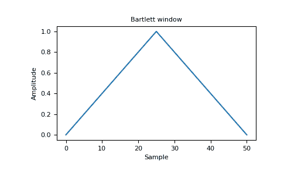
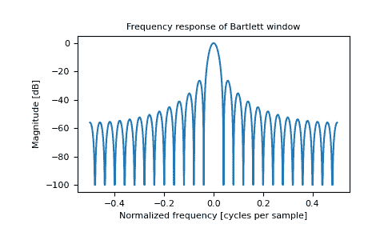

# numpy.bartlett

> 原文：[`numpy.org/doc/1.26/reference/generated/numpy.bartlett.html`](https://numpy.org/doc/1.26/reference/generated/numpy.bartlett.html)

```py
numpy.bartlett(M)
```

返回巴特勒窗口。

巴特勒窗口与三角窗口非常相似，只是端点为零。它经常在信号处理中用于锐化信号，而在频率域中不会产生太多的纹波。

参数：

**M**整数

输出窗口中的点数。如果小于或等于零，则返回空数组。

返回：

**out**数组

三角形窗口，最大值归一化为一（仅当样本数为奇数时才出现），第一个和最后一个样本等于零。

另请参阅

`blackman`, `hamming`, `hanning`, `kaiser`

注意

巴特勒窗口定义为

\[w(n) = \frac{2}{M-1} \left( \frac{M-1}{2} - \left|n - \frac{M-1}{2}\right| \right)\]

大多数关于巴特勒窗口的参考来源于信号处理文献，其中它被用作许多窗函数之一，用于平滑值。请注意，与此窗口的卷积会产生线性插值。它也被称为斜顶函数（即“去除足”，即平滑采样信号起止点的不连续性）或抑制函数。巴特勒窗口的傅立叶变换是两个 sinc 函数的乘积。请注意 Kanasewich [[2]](#r3a7a5a2c0d2a-2)中的出色讨论。

参考文献

[1]

M.S. Bartlett，《周期图分析和连续谱》，Biometrika 37，1-16，1950 年。

[2]

E.R. Kanasewich，《地球物理学时间序列分析》，亚伯达大学出版社，1975 年，第 109-110 页。

[3]

A.V. Oppenheim and R.W. Schafer，《离散时间信号处理》，Prentice-Hall，1999 年，第 468-471 页。

[4]

维基百科，《窗函数》，[`en.wikipedia.org/wiki/Window_function`](https://en.wikipedia.org/wiki/Window_function)

[5]

W.H. Press, B.P. Flannery, S.A. Teukolsky, and W.T. Vetterling，《数值配方》，剑桥大学出版社，1986 年，第 429 页。

示例

```py
>>> import matplotlib.pyplot as plt
>>> np.bartlett(12)
array([ 0\.        ,  0.18181818,  0.36363636,  0.54545455,  0.72727273, # may vary
 0.90909091,  0.90909091,  0.72727273,  0.54545455,  0.36363636,
 0.18181818,  0\.        ]) 
```

绘制窗口及其频率响应（需要 SciPy 和 matplotlib）：

```py
>>> from numpy.fft import fft, fftshift
>>> window = np.bartlett(51)
>>> plt.plot(window)
[<matplotlib.lines.Line2D object at 0x...>]
>>> plt.title("Bartlett window")
Text(0.5, 1.0, 'Bartlett window')
>>> plt.ylabel("Amplitude")
Text(0, 0.5, 'Amplitude')
>>> plt.xlabel("Sample")
Text(0.5, 0, 'Sample')
>>> plt.show() 
```



```py
>>> plt.figure()
<Figure size 640x480 with 0 Axes>
>>> A = fft(window, 2048) / 25.5
>>> mag = np.abs(fftshift(A))
>>> freq = np.linspace(-0.5, 0.5, len(A))
>>> with np.errstate(divide='ignore', invalid='ignore'):
...     response = 20 * np.log10(mag)
...
>>> response = np.clip(response, -100, 100)
>>> plt.plot(freq, response)
[<matplotlib.lines.Line2D object at 0x...>]
>>> plt.title("Frequency response of Bartlett window")
Text(0.5, 1.0, 'Frequency response of Bartlett window')
>>> plt.ylabel("Magnitude [dB]")
Text(0, 0.5, 'Magnitude [dB]')
>>> plt.xlabel("Normalized frequency [cycles per sample]")
Text(0.5, 0, 'Normalized frequency [cycles per sample]')
>>> _ = plt.axis('tight')
>>> plt.show() 
```


