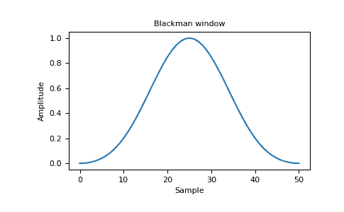
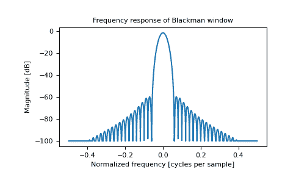

# `numpy.blackman`

> 原文：[`numpy.org/doc/1.26/reference/generated/numpy.blackman.html`](https://numpy.org/doc/1.26/reference/generated/numpy.blackman.html)

```py
numpy.blackman(M)
```

返回 Blackman 窗口。

Blackman 窗口是通过使用余弦的前三项的总和形成的锥形窗口。它被设计为具有尽可能小的泄漏。它接近于最佳，只比 Kaiser 窗口略差一点。

参数:

**M**int

输出窗口的点数。如果为零或小于零，则返回一个空数组。

返回:

**out**ndarray

此窗口的最大值被标准化为 1（仅当样本数为奇数时才出现值为 1）。

另见

`bartlett`, `hamming`, `hanning`, `kaiser`

笔记

Blackman 窗口定义为

\[w(n) = 0.42 - 0.5 \cos(2\pi n/M) + 0.08 \cos(4\pi n/M)\]

大多数关于 Blackman 窗口的引用来自信号处理文献中，用作许多用于平滑值的窗口函数之一。它也被称为消足（即“去除脚”，即平滑采样信号开头和结尾的不连续性）函数或锥形函数。它被认为是一种“近乎最佳”的锥形函数，按某些标准几乎和 Kaiser 窗口一样好。

参考文献

Blackman, R.B. 和 Tukey, J.W., (1958) The measurement of power spectra, Dover Publications, New York.

Oppenheim, A.V., 和 R.W. Schafer. Discrete-Time Signal Processing. Upper Saddle River, NJ: Prentice-Hall, 1999, pp. 468-471.

示例

```py
>>> import matplotlib.pyplot as plt
>>> np.blackman(12)
array([-1.38777878e-17,   3.26064346e-02,   1.59903635e-01, # may vary
 4.14397981e-01,   7.36045180e-01,   9.67046769e-01,
 9.67046769e-01,   7.36045180e-01,   4.14397981e-01,
 1.59903635e-01,   3.26064346e-02,  -1.38777878e-17]) 
```

绘制窗口和频率响应：

```py
>>> from numpy.fft import fft, fftshift
>>> window = np.blackman(51)
>>> plt.plot(window)
[<matplotlib.lines.Line2D object at 0x...>]
>>> plt.title("Blackman window")
Text(0.5, 1.0, 'Blackman window')
>>> plt.ylabel("Amplitude")
Text(0, 0.5, 'Amplitude')
>>> plt.xlabel("Sample")
Text(0.5, 0, 'Sample')
>>> plt.show() 
```



```py
>>> plt.figure()
<Figure size 640x480 with 0 Axes>
>>> A = fft(window, 2048) / 25.5
>>> mag = np.abs(fftshift(A))
>>> freq = np.linspace(-0.5, 0.5, len(A))
>>> with np.errstate(divide='ignore', invalid='ignore'):
...     response = 20 * np.log10(mag)
...
>>> response = np.clip(response, -100, 100)
>>> plt.plot(freq, response)
[<matplotlib.lines.Line2D object at 0x...>]
>>> plt.title("Frequency response of Blackman window")
Text(0.5, 1.0, 'Frequency response of Blackman window')
>>> plt.ylabel("Magnitude [dB]")
Text(0, 0.5, 'Magnitude [dB]')
>>> plt.xlabel("Normalized frequency [cycles per sample]")
Text(0.5, 0, 'Normalized frequency [cycles per sample]')
>>> _ = plt.axis('tight')
>>> plt.show() 
```


