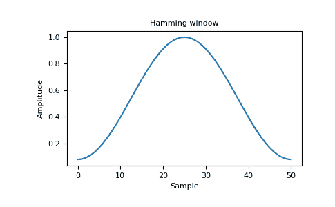
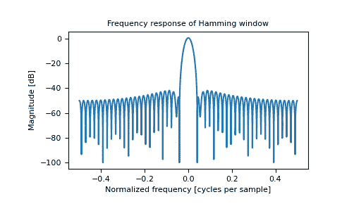

# `numpy.hamming`

> 原文：[`numpy.org/doc/1.26/reference/generated/numpy.hamming.html`](https://numpy.org/doc/1.26/reference/generated/numpy.hamming.html)

```py
numpy.hamming(M)
```

返回 Hamming 窗口。

Hamming 窗口是通过使用加权余弦形成的锥形。

参数：

**M**int

输出窗口中的点数。如果为零或小于零，则返回一个空数组。

返回：

**out**数组

窗口，其最大值归一化为一（仅当样本数量为奇数时才出现值为一）。

另请参阅

`bartlett`, `blackman`, `hanning`, `kaiser`

注意事项

Hamming 窗口定义为

\[w(n) = 0.54 - 0.46\cos\left(\frac{2\pi{n}}{M-1}\right) \qquad 0 \leq n \leq M-1\]

Hamming 窗口是以 R. W. Hamming 的名字命名的，他是 J. W. Tukey 的合作者，并在 Blackman 和 Tukey 的著作中有描述。建议用于平滑时域中截断自相关函数。对 Hamming 窗口的大多数引用来自信号处理文献，其中它被用作众多窗函数之一，用于平滑数值。它也被称为 apodization（意思是“去除脚部”，即平滑采样信号开头和结尾的不连续性）或锥形函数。

参考文献

[1]

Blackman, R.B. 和 Tukey, J.W., (1958)《功率谱的测量》，多佛出版社，纽约。

[2]

E.R. Kanasewich，“地球物理中的时间序列分析”，阿尔伯塔大学出版社，1975 年，第 109-110 页。

[3]

维基百科，“窗函数”，[`zh.wikipedia.org/wiki/窗函数`](https://zh.wikipedia.org/wiki/窗函数)

[4]

W.H. Press, B.P. Flannery, S.A. Teukolsky 和 W.T. Vetterling，“数值计算方法”，剑桥大学出版社，1986 年，第 425 页。

示例

```py
>>> np.hamming(12)
array([ 0.08      ,  0.15302337,  0.34890909,  0.60546483,  0.84123594, # may vary
 0.98136677,  0.98136677,  0.84123594,  0.60546483,  0.34890909,
 0.15302337,  0.08      ]) 
```

绘制窗口和频率响应：

```py
>>> import matplotlib.pyplot as plt
>>> from numpy.fft import fft, fftshift
>>> window = np.hamming(51)
>>> plt.plot(window)
[<matplotlib.lines.Line2D object at 0x...>]
>>> plt.title("Hamming window")
Text(0.5, 1.0, 'Hamming window')
>>> plt.ylabel("Amplitude")
Text(0, 0.5, 'Amplitude')
>>> plt.xlabel("Sample")
Text(0.5, 0, 'Sample')
>>> plt.show() 
```



```py
>>> plt.figure()
<Figure size 640x480 with 0 Axes>
>>> A = fft(window, 2048) / 25.5
>>> mag = np.abs(fftshift(A))
>>> freq = np.linspace(-0.5, 0.5, len(A))
>>> response = 20 * np.log10(mag)
>>> response = np.clip(response, -100, 100)
>>> plt.plot(freq, response)
[<matplotlib.lines.Line2D object at 0x...>]
>>> plt.title("Frequency response of Hamming window")
Text(0.5, 1.0, 'Frequency response of Hamming window')
>>> plt.ylabel("Magnitude [dB]")
Text(0, 0.5, 'Magnitude [dB]')
>>> plt.xlabel("Normalized frequency [cycles per sample]")
Text(0.5, 0, 'Normalized frequency [cycles per sample]')
>>> plt.axis('tight')
...
>>> plt.show() 
```


