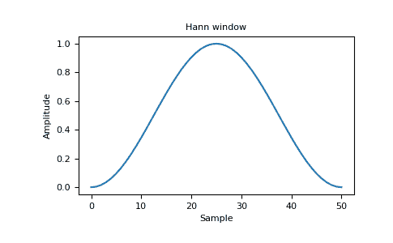
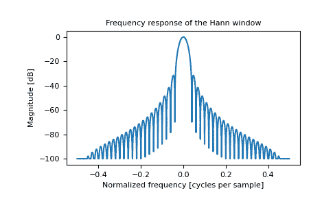

# `numpy.hanning`

> 原文：[`numpy.org/doc/1.26/reference/generated/numpy.hanning.html`](https://numpy.org/doc/1.26/reference/generated/numpy.hanning.html)

```py
numpy.hanning(M)
```

返回汉宁窗口。

汉宁窗口是通过使用加权余弦形成的锥形。

参数：

**M**整型

输出窗口中的点数。如果为零或更少，则返回一个空数组。

返回值：

**out**数组，形状(M,)

窗口，最大值归一化为一（仅当 *M* 为奇数时出现值一）。

也请参阅

`bartlett`，`blackman`，`hamming`，`kaiser`

注释

汉宁窗口的定义为

\[w(n) = 0.5 - 0.5\cos\left(\frac{2\pi{n}}{M-1}\right) \qquad 0 \leq n \leq M-1\]

汉宁窗是以奥地利气象学家尤利乌斯·汉尼（Julius von Hann）的名字命名的。它也被称为余弦钟。一些作者更喜欢将其称为汉宁窗口，以避免与非常相似的哈明窗口混淆。

汉宁窗口的大多数参考文献来自信号处理文献，它被用作许多平滑数值的窗口函数之一。它也被称为加权削波（即“去除基座”，即使采样信号的开始和结束处的不连续性平滑）或锥形函数。

参考文献

[1]

Blackman，R.B.和 Tukey，J.W.，（1958）功率谱的测量，多佛出版社，纽约。

[2]

E.R. Kanasewich，“地球物理学中的时间序列分析”，阿尔伯塔大学出版社，1975 年，第 106-108 页。

[3]

维基百科，“窗口函数”，[`en.wikipedia.org/wiki/Window_function`](https://en.wikipedia.org/wiki/Window_function)

[4]

W.H. Press, B.P. Flannery, S.A. Teukolsky, and W.T. Vetterling，“数值算法”，剑桥大学出版社，1986 年，第 425 页。

示例

```py
>>> np.hanning(12)
array([0\.        , 0.07937323, 0.29229249, 0.57115742, 0.82743037,
 0.97974649, 0.97974649, 0.82743037, 0.57115742, 0.29229249,
 0.07937323, 0\.        ]) 
```

绘制窗口及其频率响应：

```py
>>> import matplotlib.pyplot as plt
>>> from numpy.fft import fft, fftshift
>>> window = np.hanning(51)
>>> plt.plot(window)
[<matplotlib.lines.Line2D object at 0x...>]
>>> plt.title("Hann window")
Text(0.5, 1.0, 'Hann window')
>>> plt.ylabel("Amplitude")
Text(0, 0.5, 'Amplitude')
>>> plt.xlabel("Sample")
Text(0.5, 0, 'Sample')
>>> plt.show() 
```



```py
>>> plt.figure()
<Figure size 640x480 with 0 Axes>
>>> A = fft(window, 2048) / 25.5
>>> mag = np.abs(fftshift(A))
>>> freq = np.linspace(-0.5, 0.5, len(A))
>>> with np.errstate(divide='ignore', invalid='ignore'):
...     response = 20 * np.log10(mag)
...
>>> response = np.clip(response, -100, 100)
>>> plt.plot(freq, response)
[<matplotlib.lines.Line2D object at 0x...>]
>>> plt.title("Frequency response of the Hann window")
Text(0.5, 1.0, 'Frequency response of the Hann window')
>>> plt.ylabel("Magnitude [dB]")
Text(0, 0.5, 'Magnitude [dB]')
>>> plt.xlabel("Normalized frequency [cycles per sample]")
Text(0.5, 0, 'Normalized frequency [cycles per sample]')
>>> plt.axis('tight')
...
>>> plt.show() 
```


