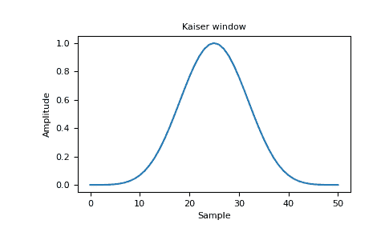
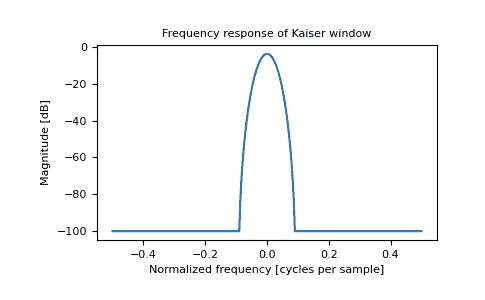

# numpy.kaiser

> 原文：[`numpy.org/doc/1.26/reference/generated/numpy.kaiser.html`](https://numpy.org/doc/1.26/reference/generated/numpy.kaiser.html)

```py
numpy.kaiser(M, beta)
```

返回 Kaiser 窗口。

Kaiser 窗口是通过使用贝塞尔函数形成的锥形。

参数：

**M**int

输出窗口中的点数。如果为零或更少，则返回一个空数组。

**beta**float

窗口的形状参数。

返回：

**out**array

窗口，最大值归一化为一（仅当样本数为奇数时才出现值为一）。

参见

`bartlett`, `blackman`, `hamming`, `hanning`

注释

Kaiser 窗口定义为

\[w(n) = I_0\left( \beta \sqrt{1-\frac{4n²}{(M-1)²}} \right)/I_0(\beta)\]

具有

\[\quad -\frac{M-1}{2} \leq n \leq \frac{M-1}{2},\]

其中 \(I_0\) 是修改后的零阶贝塞尔函数。

Kaiser 窗口以 Jim Kaiser 命名，他发现了基于贝塞尔函数的 DPSS 窗口的简单近似。Kaiser 窗口是对数字椭球序列（Digital Prolate Spheroidal Sequence，或 Slepian 窗口）的一个非常好的近似，该序列最大化了窗口主瓣中的能量相对于总能量。

Kaiser 可通过改变 beta 参数来近似许多其他窗口。

| beta | 窗口形状 |
| --- | --- |
| 0 | 矩形 |
| 5 | 类似于 Hamming |
| 6 | 类似于 Hanning |
| 8.6 | 类似于 Blackman |

beta 值为 14 可能是一个很好的起点。请注意，随着 beta 值变大，窗口变窄，因此样本数量需要足够大以对越来越窄的尖峰进行采样，否则会返回 NaN。

大多数关于 Kaiser 窗口的参考资料来自信号处理文献，它被用作许多窗口函数之一，用于平滑值。它也被称为消足（即“去除脚部”，即平滑采样信号开头和结尾的不连续性）或锥形函数。

参考文献

[1]

J. F. Kaiser，“数字滤波器” - “数字计算机系统分析”第七章，编辑：F.F. Kuo 和 J.F. Kaiser，第 218-285 页。约翰·威利和儿子，纽约，（1966）。

[2]

E.R. Kanasewich，“地球物理中的时间序列分析”，阿尔伯塔大学出版社，1975 年，第 177-178 页。

[3]

维基百科，“窗口函数”，[`en.wikipedia.org/wiki/Window_function`](https://en.wikipedia.org/wiki/Window_function)

示例

```py
>>> import matplotlib.pyplot as plt
>>> np.kaiser(12, 14)
 array([7.72686684e-06, 3.46009194e-03, 4.65200189e-02, # may vary
 2.29737120e-01, 5.99885316e-01, 9.45674898e-01,
 9.45674898e-01, 5.99885316e-01, 2.29737120e-01,
 4.65200189e-02, 3.46009194e-03, 7.72686684e-06]) 
```

绘制窗口和频率响应：

```py
>>> from numpy.fft import fft, fftshift
>>> window = np.kaiser(51, 14)
>>> plt.plot(window)
[<matplotlib.lines.Line2D object at 0x...>]
>>> plt.title("Kaiser window")
Text(0.5, 1.0, 'Kaiser window')
>>> plt.ylabel("Amplitude")
Text(0, 0.5, 'Amplitude')
>>> plt.xlabel("Sample")
Text(0.5, 0, 'Sample')
>>> plt.show() 
```



```py
>>> plt.figure()
<Figure size 640x480 with 0 Axes>
>>> A = fft(window, 2048) / 25.5
>>> mag = np.abs(fftshift(A))
>>> freq = np.linspace(-0.5, 0.5, len(A))
>>> response = 20 * np.log10(mag)
>>> response = np.clip(response, -100, 100)
>>> plt.plot(freq, response)
[<matplotlib.lines.Line2D object at 0x...>]
>>> plt.title("Frequency response of Kaiser window")
Text(0.5, 1.0, 'Frequency response of Kaiser window')
>>> plt.ylabel("Magnitude [dB]")
Text(0, 0.5, 'Magnitude [dB]')
>>> plt.xlabel("Normalized frequency [cycles per sample]")
Text(0.5, 0, 'Normalized frequency [cycles per sample]')
>>> plt.axis('tight')
(-0.5, 0.5, -100.0, ...) # may vary
>>> plt.show() 
```


