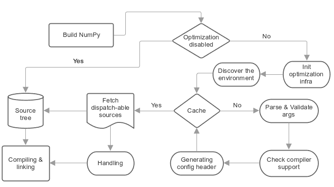

# CPU 调度器是如何工作的？

> 原文：[`numpy.org/doc/1.26/reference/simd/how-it-works.html`](https://numpy.org/doc/1.26/reference/simd/how-it-works.html)

NumPy 调度器基于多源编译，这意味着采用一定的源代码，并使用不同的编译器标志以及不同的**C**定义来多次进行编译，这些定义影响代码路径。这使得每个编译后的对象可以根据所需的优化启用某些指令集，并最终链接返回的对象在一起。



这种机制应该支持所有编译器，并且不需要任何特定于编译器的扩展，但与此同时，它会对正常编译增加一些步骤，下面将对此进行解释。

## 1- 配置

在开始构建源文件之前，用户通过上述两个命令行参数配置所需的优化：

+   `--cpu-baseline`：所需优化的最小集合。

+   `--cpu-dispatch`：附加优化的调度集合。

## 2- 发现环境

在这一部分，我们检查编译器和平台架构，并缓存一些中间结果以加快重新构建的速度。

## 3- 验证所请求的优化

通过针对编译器进行测试，以及查看编译器根据请求的优化所支持的内容。

## 4- 生成主配置头文件

生成的头文件 `_cpu_dispatch.h` 包含了在前一步验证过的所需优化的指令集的所有定义和头文件。

它还包含了额外的 C 定义，用于定义 NumPy 的 Python 模块属性 `__cpu_baseline__` 和 `__cpu_dispatch__`。

**这个头文件中有什么内容？**

此示例头文件是在 X86 机器上由 gcc 动态生成的。编译器支持`--cpu-baseline="sse sse2 sse3"`和`--cpu-dispatch="ssse3 sse41"`，结果如下。

```py
// The header should be located at numpy/numpy/core/src/common/_cpu_dispatch.h
/**NOTE
 ** C definitions prefixed with "NPY_HAVE_" represent
 ** the required optimizations.
 **
 ** C definitions prefixed with 'NPY__CPU_TARGET_' are protected and
 ** shouldn't be used by any NumPy C sources.
 */
/******* baseline features *******/
/** SSE **/
#define NPY_HAVE_SSE 1
#include  <xmmintrin.h>
/** SSE2 **/
#define NPY_HAVE_SSE2 1
#include  <emmintrin.h>
/** SSE3 **/
#define NPY_HAVE_SSE3 1
#include  <pmmintrin.h>

/******* dispatch-able features *******/
#ifdef NPY__CPU_TARGET_SSSE3
  /** SSSE3 **/
  #define NPY_HAVE_SSSE3 1
  #include  <tmmintrin.h>
#endif
#ifdef NPY__CPU_TARGET_SSE41
  /** SSE41 **/
  #define NPY_HAVE_SSE41 1
  #include  <smmintrin.h>
#endif 
```

**基线特性**是通过`--cpu-baseline`配置的所需优化的最小集合。它们没有预处理保护，并且始终开启，这意味着它们可以在任何源代码中使用。

这是否意味着 NumPy 的基础设施将基线特性的编译器标志传递给所有源代码？

当然可以。但是可分发的源代码会被不同对待。

如果用户在构建过程中指定了特定的**基线特性**，但在运行时机器甚至不支持这些特性，会怎么样？编译后的代码是否会通过这些定义之一被调用，或者也许编译器本身基于提供的命令行编译器标志自动生成/矢量化某些代码片段？

在加载 NumPy 模块时，有一个验证步骤来检测这种行为。它会引发 Python 运行时错误以通知用户。这是为了防止 CPU 达到非法指令错误，导致段错误。

**可调度特性** 是我们通过 `--cpu-dispatch` 配置的一组附加优化。它们不会默认激活，并且始终由其他以 `NPY__CPU_TARGET_` 为前缀的 C 定义保护。C 定义 `NPY__CPU_TARGET_` 仅在 **可调度源** 内启用。

## 5- 可调度源和配置语句

可调度源是特殊的 **C** 文件，可以使用不同的编译器标志和不同的 **C** 定义进行多次编译。这些会影响代码路径，以便根据每个编译对象顶部必须声明的“**配置语句**”来启用某些指令集。同时，如果通过命令参数 `--disable-optimization` 禁用了优化，则可调度源将被视为普通的 **C** 源。

**什么是配置语句？**

配置语句是一种组合在一起以确定可调度源所需优化的关键字。

示例：

```py
/*@targets avx2 avx512f vsx2 vsx3 asimd asimdhp */
// C code 
```

这些关键词主要代表了通过 `--cpu-dispatch` 配置的附加优化，但也可以代表其他选项，例如：

+   目标组：用于管理可调度源文件外部所需优化的预配置配置语句。

+   策略：一组选项，用于更改默认行为或强制编译器执行某些操作。

+   “baseline”：一个唯一的关键字，表示通过 `--cpu-baseline` 配置的最小优化。

**Numpy 的基础设施处理可调度源有四个步骤**：

+   **(A) 认知**：就像源模板和 F2PY 一样，可调度的源文件需要一个特殊的扩展名 `*.dispatch.c` 来标记 C 可调度的源文件，而对于 C++ 则是 `*.dispatch.cpp` 或 `*.dispatch.cxx` **注意**：目前不支持 C++。

+   **(B) 解析和验证**：在此步骤中，先前通过上一步筛选的可调度源逐个解析和验证其配置语句，以确定所需的优化。

+   **(C) 封装**：这是 NumPy 基础设施采取的方法，已被证明足够灵活，可以使用不同的 **C** 定义和标志多次编译单个源，从而影响代码路径。该过程通过为与附加优化相关的每个所需优化创建临时 **C** 源来实现，其中包含 **C** 定义的声明，并通过 **C** 指令 **#include** 包含相关源。要了解更多细节，请查看以下 AVX512F 代码：

    ```py
    /*
     * this definition is used by NumPy utilities as suffixes for the
     * exported symbols
     */
    #define NPY__CPU_TARGET_CURRENT AVX512F
    /*
     * The following definitions enable
     * definitions of the dispatch-able features that are defined within the main
     * configuration header. These are definitions for the implied features.
     */
    #define NPY__CPU_TARGET_SSE
    #define NPY__CPU_TARGET_SSE2
    #define NPY__CPU_TARGET_SSE3
    #define NPY__CPU_TARGET_SSSE3
    #define NPY__CPU_TARGET_SSE41
    #define NPY__CPU_TARGET_POPCNT
    #define NPY__CPU_TARGET_SSE42
    #define NPY__CPU_TARGET_AVX
    #define NPY__CPU_TARGET_F16C
    #define NPY__CPU_TARGET_FMA3
    #define NPY__CPU_TARGET_AVX2
    #define NPY__CPU_TARGET_AVX512F
    // our dispatch-able source
    #include  "/the/absuolate/path/of/hello.dispatch.c" 
    ```

+   **（D）可调度配置头文件**：基础设施为每个可调度源代码生成一个配置头文件，该头文件主要包含两个抽象的**C**宏，用于通过任何**C**源代码从生成的对象中调度特定的符号。它还用于前向声明。

    生成头文件以可调度源的名称命名，排除扩展名并替换为`.h`，例如假设我们有一个名为`hello.dispatch.c`的可调度源代码，其内容如下：

    ```py
    // hello.dispatch.c
    /*@targets baseline sse42 avx512f */
    #include  <stdio.h>
    #include  "numpy/utils.h" // NPY_CAT, NPY_TOSTR

    #ifndef NPY__CPU_TARGET_CURRENT
      // wrapping the dispatch-able source only happens to the additional optimizations
      // but if the keyword 'baseline' provided within the configuration statements,
      // the infrastructure will add extra compiling for the dispatch-able source by
      // passing it as-is to the compiler without any changes.
      #define CURRENT_TARGET(X) X
      #define NPY__CPU_TARGET_CURRENT baseline // for printing only
    #else
      // since we reach to this point, that's mean we're dealing with
      // the additional optimizations, so it could be SSE42 or AVX512F
      #define CURRENT_TARGET(X) NPY_CAT(NPY_CAT(X, _), NPY__CPU_TARGET_CURRENT)
    #endif
    // Macro 'CURRENT_TARGET' adding the current target as suffux to the exported symbols,
    // to avoid linking duplications, NumPy already has a macro called
    // 'NPY_CPU_DISPATCH_CURFX' similar to it, located at
    // numpy/numpy/core/src/common/npy_cpu_dispatch.h
    // NOTE: we tend to not adding suffixes to the baseline exported symbols
    void  CURRENT_TARGET(simd_whoami)(const  char  *extra_info)
    {
      printf("I'm "  NPY_TOSTR(NPY__CPU_TARGET_CURRENT)  ", %s\n",  extra_info);
    } 
    ```

    现在假设您将**hello.dispatch.c**附加到源代码树上，那么基础设施应该生成一个名为**hello.dispatch.h**的临时配置头文件，任何源代码都可以访问它，它应该包含以下代码：

    ```py
    #ifndef NPY__CPU_DISPATCH_EXPAND_
      // To expand the macro calls in this header
      #define NPY__CPU_DISPATCH_EXPAND_(X) X
    #endif
    // Undefining the following macros, due to the possibility of including config headers
    // multiple times within the same source and since each config header represents
    // different required optimizations according to the specified configuration
    // statements in the dispatch-able source that derived from it.
    #undef NPY__CPU_DISPATCH_BASELINE_CALL
    #undef NPY__CPU_DISPATCH_CALL
    // nothing strange here, just a normal preprocessor callback
    // enabled only if 'baseline' specified within the configuration statements
    #define NPY__CPU_DISPATCH_BASELINE_CALL(CB, ...) \
     NPY__CPU_DISPATCH_EXPAND_(CB(__VA_ARGS__))
    // 'NPY__CPU_DISPATCH_CALL' is an abstract macro is used for dispatching
    // the required optimizations that specified within the configuration statements.
    //
    // @param CHK, Expected a macro that can be used to detect CPU features
    // in runtime, which takes a CPU feature name without string quotes and
    // returns the testing result in a shape of boolean value.
    // NumPy already has macro called "NPY_CPU_HAVE", which fits this requirement.
    //
    // @param CB, a callback macro that expected to be called multiple times depending
    // on the required optimizations, the callback should receive the following arguments:
    //  1- The pending calls of @param CHK filled up with the required CPU features,
    //     that need to be tested first in runtime before executing call belong to
    //     the compiled object.
    //  2- The required optimization name, same as in 'NPY__CPU_TARGET_CURRENT'
    //  3- Extra arguments in the macro itself
    //
    // By default the callback calls are sorted depending on the highest interest
    // unless the policy "$keep_sort" was in place within the configuration statements
    // see "Dive into the CPU dispatcher" for more clarification.
    #define NPY__CPU_DISPATCH_CALL(CHK, CB, ...) \
     NPY__CPU_DISPATCH_EXPAND_(CB((CHK(AVX512F)), AVX512F, __VA_ARGS__)) \
     NPY__CPU_DISPATCH_EXPAND_(CB((CHK(SSE)&&CHK(SSE2)&&CHK(SSE3)&&CHK(SSSE3)&&CHK(SSE41)), SSE41, __VA_ARGS__)) 
    ```

    根据上述内容使用配置头文件的示例：

    ```py
    // NOTE: The following macros are only defined for demonstration purposes only.
    // NumPy already has a collections of macros located at
    // numpy/numpy/core/src/common/npy_cpu_dispatch.h, that covers all dispatching
    // and declarations scenarios.

    #include  "numpy/npy_cpu_features.h" // NPY_CPU_HAVE
    #include  "numpy/utils.h" // NPY_CAT, NPY_EXPAND

    // An example for setting a macro that calls all the exported symbols at once
    // after checking if they're supported by the running machine.
    #define DISPATCH_CALL_ALL(FN, ARGS) \
     NPY__CPU_DISPATCH_CALL(NPY_CPU_HAVE, DISPATCH_CALL_ALL_CB, FN, ARGS) \
     NPY__CPU_DISPATCH_BASELINE_CALL(DISPATCH_CALL_BASELINE_ALL_CB, FN, ARGS)
    // The preprocessor callbacks.
    // The same suffixes as we define it in the dispatch-able source.
    #define DISPATCH_CALL_ALL_CB(CHECK, TARGET_NAME, FN, ARGS) \
     if (CHECK) { NPY_CAT(NPY_CAT(FN, _), TARGET_NAME) ARGS; }
    #define DISPATCH_CALL_BASELINE_ALL_CB(FN, ARGS) \
     FN NPY_EXPAND(ARGS);

    // An example for setting a macro that calls the exported symbols of highest
    // interest optimization, after checking if they're supported by the running machine.
    #define DISPATCH_CALL_HIGH(FN, ARGS) \
     if (0) {} \
     NPY__CPU_DISPATCH_CALL(NPY_CPU_HAVE, DISPATCH_CALL_HIGH_CB, FN, ARGS) \
     NPY__CPU_DISPATCH_BASELINE_CALL(DISPATCH_CALL_BASELINE_HIGH_CB, FN, ARGS)
    // The preprocessor callbacks
    // The same suffixes as we define it in the dispatch-able source.
    #define DISPATCH_CALL_HIGH_CB(CHECK, TARGET_NAME, FN, ARGS) \
     else if (CHECK) { NPY_CAT(NPY_CAT(FN, _), TARGET_NAME) ARGS; }
    #define DISPATCH_CALL_BASELINE_HIGH_CB(FN, ARGS) \
     else { FN NPY_EXPAND(ARGS); }

    // NumPy has a macro called 'NPY_CPU_DISPATCH_DECLARE' can be used
    // for forward declarations any kind of prototypes based on
    // 'NPY__CPU_DISPATCH_CALL' and 'NPY__CPU_DISPATCH_BASELINE_CALL'.
    // However in this example, we just handle it manually.
    void  simd_whoami(const  char  *extra_info);
    void  simd_whoami_AVX512F(const  char  *extra_info);
    void  simd_whoami_SSE41(const  char  *extra_info);

    void  trigger_me(void)
    {
      // bring the auto-generated config header
      // which contains config macros 'NPY__CPU_DISPATCH_CALL' and
      // 'NPY__CPU_DISPATCH_BASELINE_CALL'.
      // it is highly recommended to include the config header before executing
      // the dispatching macros in case if there's another header in the scope.
      #include  "hello.dispatch.h"
      DISPATCH_CALL_ALL(simd_whoami,  ("all"))
      DISPATCH_CALL_HIGH(simd_whoami,  ("the highest interest"))
      // An example of including multiple config headers in the same source
      // #include "hello2.dispatch.h"
      // DISPATCH_CALL_HIGH(another_function, ("the highest interest"))
    } 
    ```

## 1- 配置

在开始构建源文件之前，通过上述两个命令参数配置所需的优化：

+   `--cpu-baseline`: 最小集合的必需优化。

+   `--cpu-dispatch`: 分派的一组额外优化。

## 2- 发现环境

在此部分，我们检查编译器和平台架构，并缓存一些中间结果以加快重建速度。

## 3- 验证所请求的优化

通过对它们进行编译器测试，并根据所请求的优化查看编译器可以支持的内容。

## 4- 生成主配置头文件

生成的头文件`_cpu_dispatch.h`包含在上一步中验证的所需优化的所有定义和指令集的标头。

它还包含用于定义 NumPy 的 Python 级模块属性`__cpu_baseline__`和`__cpu_dispatch__`的额外 C 定义。

**此标题中包含什么？**

该示例标题在一个 X86 机器上由 gcc 动态生成。编译器支持`--cpu-baseline="sse sse2 sse3"`和`--cpu-dispatch="ssse3 sse41"`，结果如下。

```py
// The header should be located at numpy/numpy/core/src/common/_cpu_dispatch.h
/**NOTE
 ** C definitions prefixed with "NPY_HAVE_" represent
 ** the required optimizations.
 **
 ** C definitions prefixed with 'NPY__CPU_TARGET_' are protected and
 ** shouldn't be used by any NumPy C sources.
 */
/******* baseline features *******/
/** SSE **/
#define NPY_HAVE_SSE 1
#include  <xmmintrin.h>
/** SSE2 **/
#define NPY_HAVE_SSE2 1
#include  <emmintrin.h>
/** SSE3 **/
#define NPY_HAVE_SSE3 1
#include  <pmmintrin.h>

/******* dispatch-able features *******/
#ifdef NPY__CPU_TARGET_SSSE3
  /** SSSE3 **/
  #define NPY_HAVE_SSSE3 1
  #include  <tmmintrin.h>
#endif
#ifdef NPY__CPU_TARGET_SSE41
  /** SSE41 **/
  #define NPY_HAVE_SSE41 1
  #include  <smmintrin.h>
#endif 
```

**基线特性**是通过`--cpu-baseline`配置的最小集合的所需优化。它们没有预处理器保护，并且始终启用，这意味着它们可以在任何源代码中使用。

这是否意味着 NumPy 的基础设施将编译器的基线特性标志传递给所有源代码？

当然，是的。但是可调度源代码会被另外处理。

如果用户在构建过程中指定了某些**基线特性**，但在运行时机器甚至不支持这些特性怎么办？编译后的代码是否会通过这些定义之一调用，或者编译器是否会根据提供的命令行编译器标志自动生成/矢量化某段代码？

在加载 NumPy 模块期间，会发现这种行为的验证步骤。它会引发 Python 运行时错误通知用户。这是为了防止 CPU 达到非法指令错误而导致段错误。

**分发功能**是我们通过`--cpu-dispatch`配置的分发的一组额外优化。它们不会默认激活，并始终由以`NPY__CPU_TARGET_`为前缀的其他 C 定义保护。C 定义`NPY__CPU_TARGET_`仅在**分发源内**启用。

## 5- 分发源和配置语句

分发源是特殊的**C**文件，可以使用不同的编译器标志和不同的**C**定义多次编译。这些影响代码路径，根据“**配置语句**”启用每个编译对象的某些指令集，这些语句必须在**C**注释`(/**/)`中声明，并在每个分发源顶部以特殊标记**@targets**开头。同时，如果通过命令参数`--disable-optimization`禁用优化，则将分发源视为正常的**C**源。

**什么是配置语句？**

配置语句是一种关键字的组合，用于确定分发源所需的优化。

例子：

```py
/*@targets avx2 avx512f vsx2 vsx3 asimd asimdhp */
// C code 
```

这些关键字主要代表通过`--cpu-dispatch`配置的额外优化，但也可以代表其他选项，如：

+   目标组：用于管理分发源外部所需优化的预配置配置语句。

+   策略：用于改变默认行为或强制编译器执行某些操作的选项集合。

+   “baseline”：一个独特的关键字，代表通过`--cpu-baseline`配置的最小优化

**NumPy 的基础结构处理分发源需要经过四个步骤**：

+   **(A) 识别**：就像源模板和 F2PY 一样，分发源文件需要一个特殊的扩展名`*.dispatch.c`来标记 C 分发源文件，对于 C++为`*.dispatch.cpp`或`*.dispatch.cxx` **注意**：C++目前不受支持。

+   **(B) 解析和验证**：在这个步骤中，通过上一步筛选的分发源将按顺序分别由配置语句解析和验证，以确定所需的优化。

+   **(C) 封装**：这是 NumPy 基础设施采用的方法，已经证明足够灵活，可以编译多次相同的源文件，但使用不同的 **C** 定义和影响代码路径的标志。该过程通过为与额外优化相关的每个必需的优化创建临时 **C** 源文件来实现，其中包含 **C** 定义的声明，并通过 **C** 指令 **#include** 包含相关源文件。为了更好地说明，请看下面的 AVX512F 代码：

    ```py
    /*
     * this definition is used by NumPy utilities as suffixes for the
     * exported symbols
     */
    #define NPY__CPU_TARGET_CURRENT AVX512F
    /*
     * The following definitions enable
     * definitions of the dispatch-able features that are defined within the main
     * configuration header. These are definitions for the implied features.
     */
    #define NPY__CPU_TARGET_SSE
    #define NPY__CPU_TARGET_SSE2
    #define NPY__CPU_TARGET_SSE3
    #define NPY__CPU_TARGET_SSSE3
    #define NPY__CPU_TARGET_SSE41
    #define NPY__CPU_TARGET_POPCNT
    #define NPY__CPU_TARGET_SSE42
    #define NPY__CPU_TARGET_AVX
    #define NPY__CPU_TARGET_F16C
    #define NPY__CPU_TARGET_FMA3
    #define NPY__CPU_TARGET_AVX2
    #define NPY__CPU_TARGET_AVX512F
    // our dispatch-able source
    #include  "/the/absuolate/path/of/hello.dispatch.c" 
    ```

+   **(D) 可调度配置头文件**：基础设施为每个可调度源生成一个配置头文件，该头文件主要包含两个抽象的 **C** 宏，用于标识生成的对象，以便可以在运行时通过任何 **C** 源代码调度从生成的对象中的某些符号。它也用于前向声明。

    生成的头文件采用可调度源的名称，排除扩展名，并替换为`.h`，例如假设我们有一个名为 `hello.dispatch.c` 的可调度源，并包含以下内容：

    ```py
    // hello.dispatch.c
    /*@targets baseline sse42 avx512f */
    #include  <stdio.h>
    #include  "numpy/utils.h" // NPY_CAT, NPY_TOSTR

    #ifndef NPY__CPU_TARGET_CURRENT
      // wrapping the dispatch-able source only happens to the additional optimizations
      // but if the keyword 'baseline' provided within the configuration statements,
      // the infrastructure will add extra compiling for the dispatch-able source by
      // passing it as-is to the compiler without any changes.
      #define CURRENT_TARGET(X) X
      #define NPY__CPU_TARGET_CURRENT baseline // for printing only
    #else
      // since we reach to this point, that's mean we're dealing with
      // the additional optimizations, so it could be SSE42 or AVX512F
      #define CURRENT_TARGET(X) NPY_CAT(NPY_CAT(X, _), NPY__CPU_TARGET_CURRENT)
    #endif
    // Macro 'CURRENT_TARGET' adding the current target as suffux to the exported symbols,
    // to avoid linking duplications, NumPy already has a macro called
    // 'NPY_CPU_DISPATCH_CURFX' similar to it, located at
    // numpy/numpy/core/src/common/npy_cpu_dispatch.h
    // NOTE: we tend to not adding suffixes to the baseline exported symbols
    void  CURRENT_TARGET(simd_whoami)(const  char  *extra_info)
    {
      printf("I'm "  NPY_TOSTR(NPY__CPU_TARGET_CURRENT)  ", %s\n",  extra_info);
    } 
    ```

    假设你已经将 **hello.dispatch.c** 附加到源树中，那么基础设施应该生成一个临时的配置头文件，名为 **hello.dispatch.h**，可以被源树中的任何源文件访问，并且应包含以下代码：

    ```py
    #ifndef NPY__CPU_DISPATCH_EXPAND_
      // To expand the macro calls in this header
      #define NPY__CPU_DISPATCH_EXPAND_(X) X
    #endif
    // Undefining the following macros, due to the possibility of including config headers
    // multiple times within the same source and since each config header represents
    // different required optimizations according to the specified configuration
    // statements in the dispatch-able source that derived from it.
    #undef NPY__CPU_DISPATCH_BASELINE_CALL
    #undef NPY__CPU_DISPATCH_CALL
    // nothing strange here, just a normal preprocessor callback
    // enabled only if 'baseline' specified within the configuration statements
    #define NPY__CPU_DISPATCH_BASELINE_CALL(CB, ...) \
     NPY__CPU_DISPATCH_EXPAND_(CB(__VA_ARGS__))
    // 'NPY__CPU_DISPATCH_CALL' is an abstract macro is used for dispatching
    // the required optimizations that specified within the configuration statements.
    //
    // @param CHK, Expected a macro that can be used to detect CPU features
    // in runtime, which takes a CPU feature name without string quotes and
    // returns the testing result in a shape of boolean value.
    // NumPy already has macro called "NPY_CPU_HAVE", which fits this requirement.
    //
    // @param CB, a callback macro that expected to be called multiple times depending
    // on the required optimizations, the callback should receive the following arguments:
    //  1- The pending calls of @param CHK filled up with the required CPU features,
    //     that need to be tested first in runtime before executing call belong to
    //     the compiled object.
    //  2- The required optimization name, same as in 'NPY__CPU_TARGET_CURRENT'
    //  3- Extra arguments in the macro itself
    //
    // By default the callback calls are sorted depending on the highest interest
    // unless the policy "$keep_sort" was in place within the configuration statements
    // see "Dive into the CPU dispatcher" for more clarification.
    #define NPY__CPU_DISPATCH_CALL(CHK, CB, ...) \
     NPY__CPU_DISPATCH_EXPAND_(CB((CHK(AVX512F)), AVX512F, __VA_ARGS__)) \
     NPY__CPU_DISPATCH_EXPAND_(CB((CHK(SSE)&&CHK(SSE2)&&CHK(SSE3)&&CHK(SSSE3)&&CHK(SSE41)), SSE41, __VA_ARGS__)) 
    ```

    根据上述示例使用配置头文件的示例：

    ```py
    // NOTE: The following macros are only defined for demonstration purposes only.
    // NumPy already has a collections of macros located at
    // numpy/numpy/core/src/common/npy_cpu_dispatch.h, that covers all dispatching
    // and declarations scenarios.

    #include  "numpy/npy_cpu_features.h" // NPY_CPU_HAVE
    #include  "numpy/utils.h" // NPY_CAT, NPY_EXPAND

    // An example for setting a macro that calls all the exported symbols at once
    // after checking if they're supported by the running machine.
    #define DISPATCH_CALL_ALL(FN, ARGS) \
     NPY__CPU_DISPATCH_CALL(NPY_CPU_HAVE, DISPATCH_CALL_ALL_CB, FN, ARGS) \
     NPY__CPU_DISPATCH_BASELINE_CALL(DISPATCH_CALL_BASELINE_ALL_CB, FN, ARGS)
    // The preprocessor callbacks.
    // The same suffixes as we define it in the dispatch-able source.
    #define DISPATCH_CALL_ALL_CB(CHECK, TARGET_NAME, FN, ARGS) \
     if (CHECK) { NPY_CAT(NPY_CAT(FN, _), TARGET_NAME) ARGS; }
    #define DISPATCH_CALL_BASELINE_ALL_CB(FN, ARGS) \
     FN NPY_EXPAND(ARGS);

    // An example for setting a macro that calls the exported symbols of highest
    // interest optimization, after checking if they're supported by the running machine.
    #define DISPATCH_CALL_HIGH(FN, ARGS) \
     if (0) {} \
     NPY__CPU_DISPATCH_CALL(NPY_CPU_HAVE, DISPATCH_CALL_HIGH_CB, FN, ARGS) \
     NPY__CPU_DISPATCH_BASELINE_CALL(DISPATCH_CALL_BASELINE_HIGH_CB, FN, ARGS)
    // The preprocessor callbacks
    // The same suffixes as we define it in the dispatch-able source.
    #define DISPATCH_CALL_HIGH_CB(CHECK, TARGET_NAME, FN, ARGS) \
     else if (CHECK) { NPY_CAT(NPY_CAT(FN, _), TARGET_NAME) ARGS; }
    #define DISPATCH_CALL_BASELINE_HIGH_CB(FN, ARGS) \
     else { FN NPY_EXPAND(ARGS); }

    // NumPy has a macro called 'NPY_CPU_DISPATCH_DECLARE' can be used
    // for forward declarations any kind of prototypes based on
    // 'NPY__CPU_DISPATCH_CALL' and 'NPY__CPU_DISPATCH_BASELINE_CALL'.
    // However in this example, we just handle it manually.
    void  simd_whoami(const  char  *extra_info);
    void  simd_whoami_AVX512F(const  char  *extra_info);
    void  simd_whoami_SSE41(const  char  *extra_info);

    void  trigger_me(void)
    {
      // bring the auto-generated config header
      // which contains config macros 'NPY__CPU_DISPATCH_CALL' and
      // 'NPY__CPU_DISPATCH_BASELINE_CALL'.
      // it is highly recommended to include the config header before executing
      // the dispatching macros in case if there's another header in the scope.
      #include  "hello.dispatch.h"
      DISPATCH_CALL_ALL(simd_whoami,  ("all"))
      DISPATCH_CALL_HIGH(simd_whoami,  ("the highest interest"))
      // An example of including multiple config headers in the same source
      // #include "hello2.dispatch.h"
      // DISPATCH_CALL_HIGH(another_function, ("the highest interest"))
    } 
    ```
