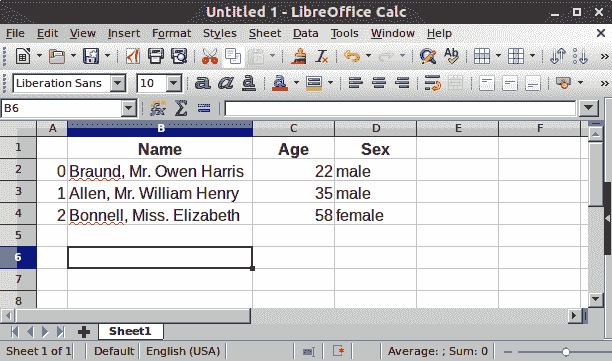

# pandas 处理什么类型的数据？

> 原文：[`pandas.pydata.org/docs/getting_started/intro_tutorials/01_table_oriented.html`](https://pandas.pydata.org/docs/getting_started/intro_tutorials/01_table_oriented.html)

*   我想开始使用 pandas

    ```py
    In [1]: import pandas as pd 
    ```

    要加载 pandas 包并开始使用它，请导入该包。 社区约定的 pandas 别名是`pd`，因此假定将 pandas 加载为`pd`是所有 pandas 文档的标准做法。

## pandas 数据表表示


+   我想存储泰坦尼克号的乘客数据。 对于许多乘客，我知道姓名（字符），年龄（整数）和性别（男/女）数据。

    ```py
    In [2]: df = pd.DataFrame(
     ...:    {
     ...:        "Name": [
     ...:            "Braund, Mr. Owen Harris",
     ...:            "Allen, Mr. William Henry",
     ...:            "Bonnell, Miss. Elizabeth",
     ...:        ],
     ...:        "Age": [22, 35, 58],
     ...:        "Sex": ["male", "male", "female"],
     ...:    }
     ...: )
     ...: 

    In [3]: df
    Out[3]: 
     Name  Age     Sex
    0   Braund, Mr. Owen Harris   22    male
    1  Allen, Mr. William Henry   35    male
    2  Bonnell, Miss. Elizabeth   58  female 
    ```

    要手动将数据存储在表中，请创建一个`DataFrame`。 使用 Python 字典列表时，字典键将用作列标题，每个列表中的值将用作`DataFrame`的列。

一个`DataFrame`是一个可以在列中存储不同类型数据（包括字符、整数、浮点值、分类数据等）的二维数据结构。 它类似于电子表格、SQL 表或 R 中的`data.frame`。

+   表格有 3 列，每列都有一个列标签。 列标签分别是`Name`、`Age`和`Sex`。

+   列`Name`由文本数据组成，每个值都是一个字符串，列`Age`是数字，列`Sex`是文本数据。

在电子表格软件中，我们的数据的表格表示看起来会非常相似：



## `DataFrame`中的每一列都是一个`Series`


+   我只对在`Age`列中的数据感兴趣

    ```py
    In [4]: df["Age"]
    Out[4]: 
    0    22
    1    35
    2    58
    Name: Age, dtype: int64 
    ```

    当选择 pandas `DataFrame`的单个列时，结果是一个 pandas `Series`。 要选择列，请在方括号`[]`之间使用列标签。

注意

如果您熟悉 Python [dictionaries](https://docs.python.org/3/tutorial/datastructures.html#tut-dictionaries "(in Python v3.12)")，选择单个列与基于键选择字典值非常相似。

你也可以从头开始创建一个`Series`：

```py
In [5]: ages = pd.Series([22, 35, 58], name="Age")

In [6]: ages
Out[6]: 
0    22
1    35
2    58
Name: Age, dtype: int64 
```

pandas 的`Series`没有列标签，因为它只是`DataFrame`的单列。 Series 确实有行标签。

## 对 DataFrame 或 Series 执行某些操作

+   我想知道乘客的最大年龄

    我们可以通过选择`Age`列并应用`max()`在`DataFrame`上执行此操作：

    ```py
    In [7]: df["Age"].max()
    Out[7]: 58 
    ```

    或者到`Series`：

    ```py
    In [8]: ages.max()
    Out[8]: 58 
    ```

正如 `max()` 方法所示，您可以使用 `DataFrame` 或 `Series` *执行* 操作。pandas 提供了许多功能，每个功能都是您可以应用于 `DataFrame` 或 `Series` 的 *方法*。由于方法是函数，不要忘记使用括号 `()`。

+   我对我的数据表的数值数据进行一些基本统计感兴趣

    ```py
    In [9]: df.describe()
    Out[9]: 
     Age
    count   3.000000
    mean   38.333333
    std    18.230012
    min    22.000000
    25%    28.500000
    50%    35.000000
    75%    46.500000
    max    58.000000 
    ```

    `describe()` 方法提供了对 `DataFrame` 中数值数据的快速概述。由于 `Name` 和 `Sex` 列是文本数据，默认情况下不会被 `describe()` 方法考虑在内。

许多 pandas 操作会返回一个 `DataFrame` 或一个 `Series`。`describe()` 方法就是一个返回 pandas `Series` 或 pandas `DataFrame` 的 pandas 操作的示例。

转至用户指南

在用户指南的关于 使用 describe 进行汇总的部分中查看更多选项

注意

这只是一个起点。与电子表格软件类似，pandas 将数据表示为具有列和行的表格。除了表示外，还有您在电子表格软件中进行的数据操作和计算，pandas 也支持。继续阅读下一篇教程，开始使用！

#### 记住

+   导入包，即 `import pandas as pd`

+   数据表以 pandas 的 `DataFrame` 形式存储

+   `DataFrame` 中的每一列都是一个 `Series`

+   您可以通过将方法应用于 `DataFrame` 或 `Series` 来执行操作

转至用户指南

关于 `DataFrame` 和 `Series` 的更详细解释在数据结构简介中提供。

## pandas 数据表表示


+   我想存储 Titanic 的乘客数据。对于许多乘客，我知道他们的姓名（字符）、年龄（整数）和性别（男性/女性）数据。

    ```py
    In [2]: df = pd.DataFrame(
     ...:    {
     ...:        "Name": [
     ...:            "Braund, Mr. Owen Harris",
     ...:            "Allen, Mr. William Henry",
     ...:            "Bonnell, Miss. Elizabeth",
     ...:        ],
     ...:        "Age": [22, 35, 58],
     ...:        "Sex": ["male", "male", "female"],
     ...:    }
     ...: )
     ...: 

    In [3]: df
    Out[3]: 
     Name  Age     Sex
    0   Braund, Mr. Owen Harris   22    male
    1  Allen, Mr. William Henry   35    male
    2  Bonnell, Miss. Elizabeth   58  female 
    ```

    要手动存储数据到表格中，创建一个 `DataFrame`。当使用 Python 字典的列表时，字典的键将被用作列标题，每个列表中的值将作为 `DataFrame` 的列。

`DataFrame` 是一种二维数据结构，可以在列中存储不同类型的数据（包括字符、整数、浮点值、分类数据等）。它类似于电子表格、SQL 表或 R 中的 `data.frame`。

+   表格有 3 列，每列都有一个列标签。列标签分别是 `Name`、`Age` 和 `Sex`。

+   列 `Name` 包含文本数据，每个值为字符串，列 `Age` 是数字，列 `Sex` 是文本数据。

在电子表格软件中，我们的数据的表格表示看起来会非常相似：


## 每个`DataFrame`中的列都是一个`Series`


+   我只对`Age`列中的数据感兴趣

    ```py
    In [4]: df["Age"]
    Out[4]: 
    0    22
    1    35
    2    58
    Name: Age, dtype: int64 
    ```

    当选择 pandas `DataFrame`的单个列时，结果是一个 pandas `Series`。要选择列，请在方括号`[]`之间使用列标签。

注意

如果你熟悉 Python [dictionaries](https://docs.python.org/3/tutorial/datastructures.html#tut-dictionaries "(in Python v3.12)")，选择单个列与基于键选择字典值非常相似。

你也可以从头开始创建一个`Series`：

```py
In [5]: ages = pd.Series([22, 35, 58], name="Age")

In [6]: ages
Out[6]: 
0    22
1    35
2    58
Name: Age, dtype: int64 
```

一个 pandas `Series`没有列标签，因为它只是一个`DataFrame`的单列。一个 Series 有行标签。

## 对`DataFrame`或`Series`执行一些操作

+   我想知道乘客的最大年龄

    我们可以通过选择`Age`列并应用`max()`来对`DataFrame`进行操作：

    ```py
    In [7]: df["Age"].max()
    Out[7]: 58 
    ```

    或对`Series`进行操作：

    ```py
    In [8]: ages.max()
    Out[8]: 58 
    ```

正如`max()`方法所示，你可以对`DataFrame`或`Series`*执行*操作。pandas 提供了许多功能，每个功能都是可以应用于`DataFrame`或`Series`的*方法*。由于方法是函数，请不要忘记使用括号`()`。

+   我对我的数据表的数值数据感兴趣的一些基本统计信息

    ```py
    In [9]: df.describe()
    Out[9]: 
     Age
    count   3.000000
    mean   38.333333
    std    18.230012
    min    22.000000
    25%    28.500000
    50%    35.000000
    75%    46.500000
    max    58.000000 
    ```

    `describe()`方法提供了`DataFrame`中数值数据的快速概述。由于`Name`和`Sex`列是文本数据，默认情况下不会被`describe()`方法考虑在内。

许多 pandas 操作会返回一个`DataFrame`或一个`Series`。`describe()`方法就是一个返回 pandas `Series`或 pandas `DataFrame`的 pandas 操作的示例。

转到用户指南

在用户��南的关于使用 describe 进行聚合部分查看更多关于`describe`的选项

注意

这只是一个起点。与电子表格软件类似，pandas 将数据表示为具有列和行的表格。除了表示，pandas 还支持电子表格软件中的数据操作和计算。继续阅读下一个教程以开始！

#### 记住

+   导入包，即`import pandas as pd`

+   数据表以 pandas `DataFrame`的形式存储

+   每个`DataFrame`中的列都是一个`Series`

+   你可以通过将方法应用于 `DataFrame` 或 `Series` 来完成任务。

前往用户指南

关于 `DataFrame` 和 `Series` 的更详细解释可在数据结构介绍中找到。
