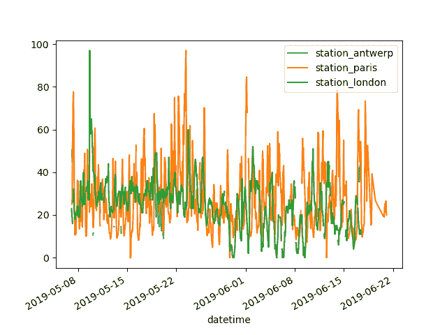
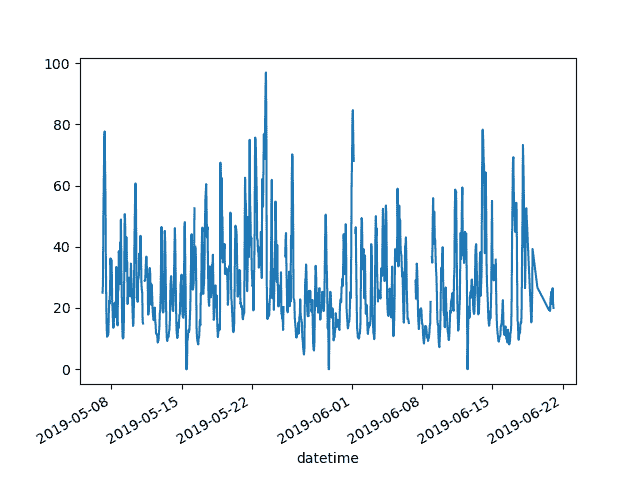
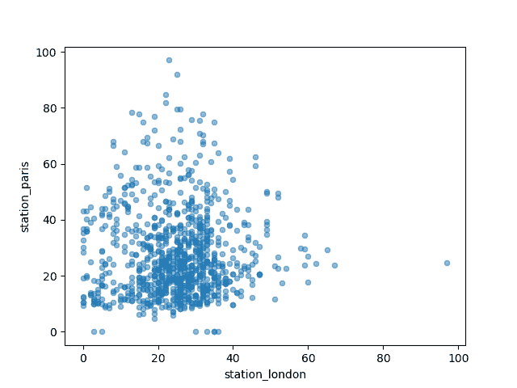
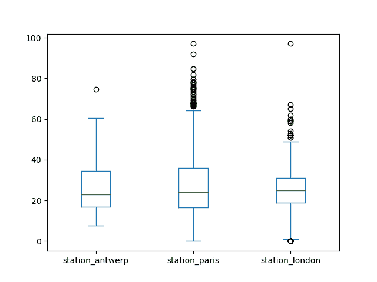
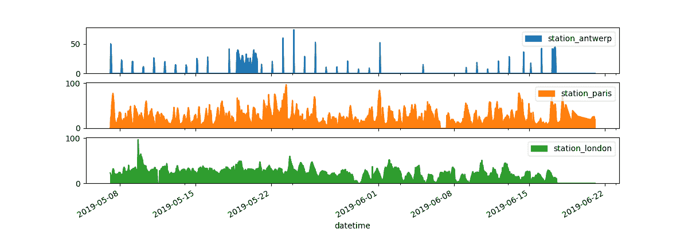
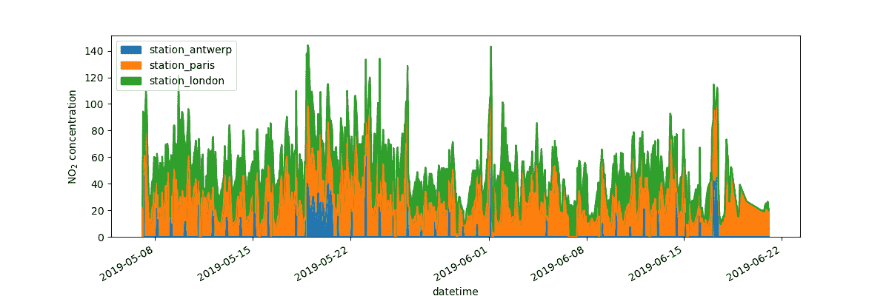

# 如何在 pandas 中创建图表？

> 原文：[`pandas.pydata.org/docs/getting_started/intro_tutorials/04_plotting.html`](https://pandas.pydata.org/docs/getting_started/intro_tutorials/04_plotting.html)


```py
In [1]: import pandas as pd

In [2]: import matplotlib.pyplot as plt 
```

本教程使用的数据：

+   空气质量数据

    本教程使用关于\(NO_2\)的空气质量数据，由[OpenAQ](https://openaq.org)提供，并使用[py-openaq](http://dhhagan.github.io/py-openaq/index.html)包。`air_quality_no2.csv`数据集提供了分别来自巴黎、安特卫普和伦敦的测量站*FR04014*、*BETR801*和*London Westminster*的\(NO_2\)值。

    [原始数据](https://github.com/pandas-dev/pandas/tree/main/doc/data/air_quality_no2.csv)

    ```py
    In [3]: air_quality = pd.read_csv("data/air_quality_no2.csv", index_col=0, parse_dates=True)

    In [4]: air_quality.head()
    Out[4]: 
     station_antwerp  station_paris  station_london
    datetime 
    2019-05-07 02:00:00              NaN            NaN            23.0
    2019-05-07 03:00:00             50.5           25.0            19.0
    2019-05-07 04:00:00             45.0           27.7            19.0
    2019-05-07 05:00:00              NaN           50.4            16.0
    2019-05-07 06:00:00              NaN           61.9             NaN 
    ```

    注意

    使用`read_csv`函数的`index_col`和`parse_dates`参数，将第一（0）列定义为生成的`DataFrame`的索引，并将列中的日期转换为`Timestamp`对象。

+   我想快速地对数据进行可视化检查。

    ```py
    In [5]: air_quality.plot()
    Out[5]: <Axes: xlabel='datetime'>

    In [6]: plt.show() 
    ```

    

    使用`DataFrame`，pandas 默认为具有数值数据的每列创建一条线图。

+   我只想绘制数据表中来自巴黎的列。

    ```py
    In [7]: air_quality["station_paris"].plot()
    Out[7]: <Axes: xlabel='datetime'>

    In [8]: plt.show() 
    ```

    

    要绘制特定列，请结合子集数据教程中的选择方法和`plot()`方法。因此，`plot()`方法适用于`Series`和`DataFrame`。

+   我想要直观比较伦敦和巴黎测得的\(NO_2\)值。

    ```py
    In [9]: air_quality.plot.scatter(x="station_london", y="station_paris", alpha=0.5)
    Out[9]: <Axes: xlabel='station_london', ylabel='station_paris'>

    In [10]: plt.show() 
    ```

    

在使用`plot`函数时，除了默认的`line`图之外，还有许多可用于绘制数据的替代方法。让我们使用一些标准 Python 来了解可用绘图方法：

```py
In [11]: [
 ....:    method_name
 ....:    for method_name in dir(air_quality.plot)
 ....:    if not method_name.startswith("_")
 ....: ]
 ....: 
Out[11]: 
['area',
 'bar',
 'barh',
 'box',
 'density',
 'hexbin',
 'hist',
 'kde',
 'line',
 'pie',
 'scatter'] 
```

注意

在许多开发环境以及 IPython 和 Jupyter Notebook 中，使用 TAB 键可以获得可用方法的概览，例如 `air_quality.plot.` + TAB。

其中一个选项是`DataFrame.plot.box()`，它指的是[箱线图](https://en.wikipedia.org/wiki/Box_plot)。`box`方法适用于空气质量示例数据：

```py
In [12]: air_quality.plot.box()
Out[12]: <Axes: >

In [13]: plt.show() 
```

用户指南

除了默认的折线图之外，有关支持的绘图样式的介绍，请参阅用户指南中关于支持的绘图样式的部分。

+   我想将每列分别放在单独的子图中。

    ```py
    In [14]: axs = air_quality.plot.area(figsize=(12, 4), subplots=True)

    In [15]: plt.show() 
    ```

    

    通过`plot`函数的`subplots`参数支持为每个数据列创建单独的子图。值得回顾每个 pandas 绘图函数中提供的内置选项。

到用户指南

更多格式选项在用户指南的绘图格式化部分有详细说明。

+   我想进一步自定义、扩展或保存生成的图。

    ```py
    In [16]: fig, axs = plt.subplots(figsize=(12, 4))

    In [17]: air_quality.plot.area(ax=axs)
    Out[17]: <Axes: xlabel='datetime'>

    In [18]: axs.set_ylabel("NO$_2$ concentration")
    Out[18]: Text(0, 0.5, 'NO$_2$ concentration')

    In [19]: fig.savefig("no2_concentrations.png")

    In [20]: plt.show() 
    ```

    

pandas 创建的每个绘图对象都是一个[Matplotlib](https://matplotlib.org/)对象。由于 Matplotlib 提供了大量自定义绘图的选项，使 pandas 和 Matplotlib 之间的链接明确，可以将 Matplotlib 的所有功能应用于绘图。这种策略在前面的示例中应用：

```py
fig, axs = plt.subplots(figsize=(12, 4))        # Create an empty Matplotlib Figure and Axes
air_quality.plot.area(ax=axs)                   # Use pandas to put the area plot on the prepared Figure/Axes
axs.set_ylabel("NO$_2$ concentration")          # Do any Matplotlib customization you like
fig.savefig("no2_concentrations.png")           # Save the Figure/Axes using the existing Matplotlib method.
plt.show()                                      # Display the plot 
```

#### 记住

+   `.plot.*`方法适用于 Series 和 DataFrames。

+   默认情况下，每列都被绘制为不同的元素（线条、箱线图等）。

+   由 pandas 创建的任何绘图都是一个 Matplotlib 对象。

到用户指南

在可视化页面中提供了 pandas 绘图的完整概述。
