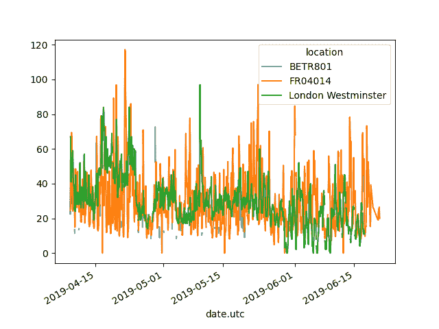

# 如何重新排列表格布局

> 原文：[`pandas.pydata.org/docs/getting_started/intro_tutorials/07_reshape_table_layout.html`](https://pandas.pydata.org/docs/getting_started/intro_tutorials/07_reshape_table_layout.html)

## 排序表格行

+   我想根据乘客的年龄对泰坦尼克号数据进行排序。

    ```py
    In [6]: titanic.sort_values(by="Age").head()
    Out[6]: 
     PassengerId  Survived  Pclass  ...     Fare Cabin  Embarked
    803          804         1       3  ...   8.5167   NaN         C
    755          756         1       2  ...  14.5000   NaN         S
    644          645         1       3  ...  19.2583   NaN         C
    469          470         1       3  ...  19.2583   NaN         C
    78            79         1       2  ...  29.0000   NaN         S

    [5 rows x 12 columns] 
    ```

+   我想根据舱位等级和年龄按降序对泰坦尼克号数据进行排序。

    ```py
    In [7]: titanic.sort_values(by=['Pclass', 'Age'], ascending=False).head()
    Out[7]: 
     PassengerId  Survived  Pclass  ...    Fare Cabin  Embarked
    851          852         0       3  ...  7.7750   NaN         S
    116          117         0       3  ...  7.7500   NaN         Q
    280          281         0       3  ...  7.7500   NaN         Q
    483          484         1       3  ...  9.5875   NaN         S
    326          327         0       3  ...  6.2375   NaN         S

    [5 rows x 12 columns] 
    ```

    使用`DataFrame.sort_values()`，表格中的行根据定义的列进行排序。索引将遵循行顺序。

用户指南

有关表格排序的更多详细信息，请参阅用户指南中关于数据排序的部分。

## 从长表格格式到宽表格格式

让我们使用空气质量数据集的一个小子集。我们关注\(NO_2\)数据，并仅使用每个位置的前两个测量值（即每个组���头部）。数据子集将被称为`no2_subset`。

```py
# filter for no2 data only
In [8]: no2 = air_quality[air_quality["parameter"] == "no2"] 
```

```py
# use 2 measurements (head) for each location (groupby)
In [9]: no2_subset = no2.sort_index().groupby(["location"]).head(2)

In [10]: no2_subset
Out[10]: 
 city country  ... value   unit
date.utc                                      ... 
2019-04-09 01:00:00+00:00  Antwerpen      BE  ...  22.5  µg/m³
2019-04-09 01:00:00+00:00      Paris      FR  ...  24.4  µg/m³
2019-04-09 02:00:00+00:00     London      GB  ...  67.0  µg/m³
2019-04-09 02:00:00+00:00  Antwerpen      BE  ...  53.5  µg/m³
2019-04-09 02:00:00+00:00      Paris      FR  ...  27.4  µg/m³
2019-04-09 03:00:00+00:00     London      GB  ...  67.0  µg/m³

[6 rows x 6 columns] 
```


+   我想要三个站点的值分别作为相邻的列。

    ```py
    In [11]: no2_subset.pivot(columns="location", values="value")
    Out[11]: 
    location                   BETR801  FR04014  London Westminster
    date.utc 
    2019-04-09 01:00:00+00:00     22.5     24.4                 NaN
    2019-04-09 02:00:00+00:00     53.5     27.4                67.0
    2019-04-09 03:00:00+00:00      NaN      NaN                67.0 
    ```

    `pivot()`函数纯粹是对数据的重新排列：每个索引/列组合需要一个单一值。

由于 pandas 支持多列绘图（参见绘图教程），因此从*长*表格格式转换为*宽*表格格式可以同时绘制不同时间序列的图表：

```py
In [12]: no2.head()
Out[12]: 
 city country location parameter  value   unit
date.utc 
2019-06-21 00:00:00+00:00  Paris      FR  FR04014       no2   20.0  µg/m³
2019-06-20 23:00:00+00:00  Paris      FR  FR04014       no2   21.8  µg/m³
2019-06-20 22:00:00+00:00  Paris      FR  FR04014       no2   26.5  µg/m³
2019-06-20 21:00:00+00:00  Paris      FR  FR04014       no2   24.9  µg/m³
2019-06-20 20:00:00+00:00  Paris      FR  FR04014       no2   21.4  µg/m³ 
```

```py
In [13]: no2.pivot(columns="location", values="value").plot()
Out[13]: <Axes: xlabel='date.utc'> 
```



注意

当未定义`index`参数时，将使用现有索引（行标签）。

用户指南

有关`pivot()`的更多信息，请参阅用户指南中关于数据透视表对象的部分。

## 透视表


+   我想要表格形式中每个站点的\(NO_2\)和\(PM_{2.5}\)的平均浓度。

    ```py
    In [14]: air_quality.pivot_table(
     ....:    values="value", index="location", columns="parameter", aggfunc="mean"
     ....: )
     ....: 
    Out[14]: 
    parameter                 no2       pm25
    location 
    BETR801             26.950920  23.169492
    FR04014             29.374284        NaN
    London Westminster  29.740050  13.443568 
    ```

    在`pivot()`的情况下，数据只是重新排列。当需要聚合多个值（在这种特定情况下，不同时间步长上的值）时，可以使用`pivot_table()`，提供一个聚合函数（例如均值）来组合这些值。

透视表是电子表格软件中一个众所周知的概念。当对每个变量的行/列边距（小计）感兴趣时，请将`margins`参数设置为`True`：

```py
In [15]: air_quality.pivot_table(
 ....:    values="value",
 ....:    index="location",
 ....:    columns="parameter",
 ....:    aggfunc="mean",
 ....:    margins=True,
 ....: )
 ....: 
Out[15]: 
parameter                 no2       pm25        All
location 
BETR801             26.950920  23.169492  24.982353
FR04014             29.374284        NaN  29.374284
London Westminster  29.740050  13.443568  21.491708
All                 29.430316  14.386849  24.222743 
```

用户指南

有关`pivot_table()`的更多信息，请参阅用户指南中关于数据透视表的部分。

注意

如果你在想，`pivot_table()`确实直接与`groupby()`相关联。可以通过在`parameter`和`location`上进行分组来得到相同的结果：

```py
air_quality.groupby(["parameter", "location"])[["value"]].mean() 
```

转至用户指南

## 从宽格式到长格式

从前一节创建的宽格式表重新开始，我们使用`reset_index()`为`DataFrame`添加新索引。

```py
In [16]: no2_pivoted = no2.pivot(columns="location", values="value").reset_index()

In [17]: no2_pivoted.head()
Out[17]: 
location                  date.utc  BETR801  FR04014  London Westminster
0        2019-04-09 01:00:00+00:00     22.5     24.4                 NaN
1        2019-04-09 02:00:00+00:00     53.5     27.4                67.0
2        2019-04-09 03:00:00+00:00     54.5     34.2                67.0
3        2019-04-09 04:00:00+00:00     34.5     48.5                41.0
4        2019-04-09 05:00:00+00:00     46.5     59.5                41.0 
```


+   我想将所有空气质量\(NO_2\)测量值收集到单独的一列中（长格式）。

    ```py
    In [18]: no_2 = no2_pivoted.melt(id_vars="date.utc")

    In [19]: no_2.head()
    Out[19]: 
     date.utc location  value
    0 2019-04-09 01:00:00+00:00  BETR801   22.5
    1 2019-04-09 02:00:00+00:00  BETR801   53.5
    2 2019-04-09 03:00:00+00:00  BETR801   54.5
    3 2019-04-09 04:00:00+00:00  BETR801   34.5
    4 2019-04-09 05:00:00+00:00  BETR801   46.5 
    ```

    在`DataFrame`上调用`pandas.melt()`方法将数据表从宽格式转换为长格式。列标题变为新创建列中的变量名。

解决方案是如何应用`pandas.melt()`的简短版本。该方法将所有未在`id_vars`中提及的列*融合*成两列：一列是列标题名称，另一列是值本身。后一列默认名称为`value`。

传递给`pandas.melt()`的参数可以更详细地定义：

```py
In [20]: no_2 = no2_pivoted.melt(
 ....:    id_vars="date.utc",
 ....:    value_vars=["BETR801", "FR04014", "London Westminster"],
 ....:    value_name="NO_2",
 ....:    var_name="id_location",
 ....: )
 ....: 

In [21]: no_2.head()
Out[21]: 
 date.utc id_location  NO_2
0 2019-04-09 01:00:00+00:00     BETR801  22.5
1 2019-04-09 02:00:00+00:00     BETR801  53.5
2 2019-04-09 03:00:00+00:00     BETR801  54.5
3 2019-04-09 04:00:00+00:00     BETR801  34.5
4 2019-04-09 05:00:00+00:00     BETR801  46.5 
```

附加参数具有以下效果：

+   `value_vars`定义要*融合*在一起的列

+   `value_name`为值列提供自定义列名，而不是默认列名`value`

+   `var_name`为收集列标题名称的列提供自定义列名。否则，它将采用索引名称或默认值`variable`

因此，参数`value_name`和`var_name`只是两个生成列的用户定义名称。要融合的列由`id_vars`和`value_vars`定义。

转至用户指南

使用`pandas.melt()`将数据从宽格式转换为长格式在用户指南中有详细说明，参见融合重塑部分。

#### 记住

+   支持按一个或多个列排序的`sort_values`。

+   `pivot`函数纯粹是数据重构，`pivot_table`支持聚合。

+   `pivot`的反向操作（从长格式到宽格式）是`melt`（从宽格式到长格式）。

转至用户指南

用户指南中关于重塑和数据透视的页面提供了完整的概述。

## 排序表行

+   我想根据乘客的年龄对泰坦尼克号数据进行排序。

    ```py
    In [6]: titanic.sort_values(by="Age").head()
    Out[6]: 
     PassengerId  Survived  Pclass  ...     Fare Cabin  Embarked
    803          804         1       3  ...   8.5167   NaN         C
    755          756         1       2  ...  14.5000   NaN         S
    644          645         1       3  ...  19.2583   NaN         C
    469          470         1       3  ...  19.2583   NaN         C
    78            79         1       2  ...  29.0000   NaN         S

    [5 rows x 12 columns] 
    ```

+   我想根据船舱等级和年龄按降序对泰坦尼克号数据进行排序。

    ```py
    In [7]: titanic.sort_values(by=['Pclass', 'Age'], ascending=False).head()
    Out[7]: 
     PassengerId  Survived  Pclass  ...    Fare Cabin  Embarked
    851          852         0       3  ...  7.7750   NaN         S
    116          117         0       3  ...  7.7500   NaN         Q
    280          281         0       3  ...  7.7500   NaN         Q
    483          484         1       3  ...  9.5875   NaN         S
    326          327         0       3  ...  6.2375   NaN         S

    [5 rows x 12 columns] 
    ```

    使用`DataFrame.sort_values()`，表中的行将根据定义的列进行排序。索引将遵循行顺序。

转到用户指南

有关表格排序的更多详细信息，请参阅用户指南中关于数据排序的部分。

## 从长表格格式到宽表格格式

让我们使用空气质量数据集的一个小子集。我们关注\(NO_2\)数据，并且只使用每个位置的前两次测量（即每个组的头部）。数据子集将被称为`no2_subset`。

```py
# filter for no2 data only
In [8]: no2 = air_quality[air_quality["parameter"] == "no2"] 
```

```py
# use 2 measurements (head) for each location (groupby)
In [9]: no2_subset = no2.sort_index().groupby(["location"]).head(2)

In [10]: no2_subset
Out[10]: 
 city country  ... value   unit
date.utc                                      ... 
2019-04-09 01:00:00+00:00  Antwerpen      BE  ...  22.5  µg/m³
2019-04-09 01:00:00+00:00      Paris      FR  ...  24.4  µg/m³
2019-04-09 02:00:00+00:00     London      GB  ...  67.0  µg/m³
2019-04-09 02:00:00+00:00  Antwerpen      BE  ...  53.5  µg/m³
2019-04-09 02:00:00+00:00      Paris      FR  ...  27.4  µg/m³
2019-04-09 03:00:00+00:00     London      GB  ...  67.0  µg/m³

[6 rows x 6 columns] 
```


+   我想要三个站点的值作为相邻的单独列��

    ```py
    In [11]: no2_subset.pivot(columns="location", values="value")
    Out[11]: 
    location                   BETR801  FR04014  London Westminster
    date.utc 
    2019-04-09 01:00:00+00:00     22.5     24.4                 NaN
    2019-04-09 02:00:00+00:00     53.5     27.4                67.0
    2019-04-09 03:00:00+00:00      NaN      NaN                67.0 
    ```

    `pivot()`函数纯粹是对数据的重塑：每个索引/列组合需要一个单一值。

由于 pandas 支持多列的绘图（请参阅绘图教程），因此从*长*表格格式转换为*宽*表格格式使得可以同时绘制不同时间序列：

```py
In [12]: no2.head()
Out[12]: 
 city country location parameter  value   unit
date.utc 
2019-06-21 00:00:00+00:00  Paris      FR  FR04014       no2   20.0  µg/m³
2019-06-20 23:00:00+00:00  Paris      FR  FR04014       no2   21.8  µg/m³
2019-06-20 22:00:00+00:00  Paris      FR  FR04014       no2   26.5  µg/m³
2019-06-20 21:00:00+00:00  Paris      FR  FR04014       no2   24.9  µg/m³
2019-06-20 20:00:00+00:00  Paris      FR  FR04014       no2   21.4  µg/m³ 
```

```py
In [13]: no2.pivot(columns="location", values="value").plot()
Out[13]: <Axes: xlabel='date.utc'> 
```


注意

当未定义`index`参数时，将使用现有的索引（行标签）。

转到用户指南

有关`pivot()`的更多信息，请参阅用户指南中关于数据透视表 DataFrame 对象的部分。

## 数据透视表


+   我想要每个站点中\(NO_2\)和\(PM_{2.5}\)的平均浓度以表格形式呈现。

    ```py
    In [14]: air_quality.pivot_table(
     ....:    values="value", index="location", columns="parameter", aggfunc="mean"
     ....: )
     ....: 
    Out[14]: 
    parameter                 no2       pm25
    location 
    BETR801             26.950920  23.169492
    FR04014             29.374284        NaN
    London Westminster  29.740050  13.443568 
    ```

    在`pivot()`的情况下，数据仅被重新排列。当需要聚合多个值（在这种特定情况下，不同时间步的值）时，可以使用`pivot_table()`，提供一个聚合函数（例如平均值）来组合这些值。

数据透视表是电子表格软件中一个众所周知的概念。当对每个变量的行/列边距（小计）感兴趣时，请将`margins`参数设置为`True`：

```py
In [15]: air_quality.pivot_table(
 ....:    values="value",
 ....:    index="location",
 ....:    columns="parameter",
 ....:    aggfunc="mean",
 ....:    margins=True,
 ....: )
 ....: 
Out[15]: 
parameter                 no2       pm25        All
location 
BETR801             26.950920  23.169492  24.982353
FR04014             29.374284        NaN  29.374284
London Westminster  29.740050  13.443568  21.491708
All                 29.430316  14.386849  24.222743 
```

转到用户指南

欲了解有关`pivot_table()`的更多信息，请参阅用户指南中关于数据透视表的部分。

注意

如果你在想，`pivot_table()`确实直接链接到`groupby()`。相同的结果可以通过在`parameter`和`location`上进行分组来得到：

```py
air_quality.groupby(["parameter", "location"])[["value"]].mean() 
```

转到用户指南

## 宽到长格式

从前一节创建的宽格式表重新开始，我们使用`reset_index()`为`DataFrame`添加新索引。

```py
In [16]: no2_pivoted = no2.pivot(columns="location", values="value").reset_index()

In [17]: no2_pivoted.head()
Out[17]: 
location                  date.utc  BETR801  FR04014  London Westminster
0        2019-04-09 01:00:00+00:00     22.5     24.4                 NaN
1        2019-04-09 02:00:00+00:00     53.5     27.4                67.0
2        2019-04-09 03:00:00+00:00     54.5     34.2                67.0
3        2019-04-09 04:00:00+00:00     34.5     48.5                41.0
4        2019-04-09 05:00:00+00:00     46.5     59.5                41.0 
```


+   我想将所有空气质量（$NO_2$）测量值收集到单独的一列中（长格式）。

    ```py
    In [18]: no_2 = no2_pivoted.melt(id_vars="date.utc")

    In [19]: no_2.head()
    Out[19]: 
     date.utc location  value
    0 2019-04-09 01:00:00+00:00  BETR801   22.5
    1 2019-04-09 02:00:00+00:00  BETR801   53.5
    2 2019-04-09 03:00:00+00:00  BETR801   54.5
    3 2019-04-09 04:00:00+00:00  BETR801   34.5
    4 2019-04-09 05:00:00+00:00  BETR801   46.5 
    ```

    `pandas.melt()`方法在`DataFrame`上将数据表从宽格式转换为长格式。列标题变为新创建列中的变量名称。

解决方案是如何应用`pandas.melt()`的简短版本。该方法将未在`id_vars`中提及的所有列*融合*到两列中：一列是列标题名称，另一列是值本身。后一列默认命名为`value`。

传递给`pandas.melt()`的参数可以更详细地定义：

```py
In [20]: no_2 = no2_pivoted.melt(
 ....:    id_vars="date.utc",
 ....:    value_vars=["BETR801", "FR04014", "London Westminster"],
 ....:    value_name="NO_2",
 ....:    var_name="id_location",
 ....: )
 ....: 

In [21]: no_2.head()
Out[21]: 
 date.utc id_location  NO_2
0 2019-04-09 01:00:00+00:00     BETR801  22.5
1 2019-04-09 02:00:00+00:00     BETR801  53.5
2 2019-04-09 03:00:00+00:00     BETR801  54.5
3 2019-04-09 04:00:00+00:00     BETR801  34.5
4 2019-04-09 05:00:00+00:00     BETR801  46.5 
```

附加参数具有以下效果：

+   `value_vars`定义要*融合*在一起的列

+   `value_name`为值列提供自定义列名，而不是默认列名`value`

+   `var_name`为收集列标题名称的列提供自定义列名。否则，它将采用索引名称或默认的`variable`

因此，参数`value_name`和`var_name`只是生成的用户定义列 ocolumns 的名称。要融合的列由`id_vars`和`value_vars`定义。

转到用户指南

使用`pandas.melt()`从宽格式转换为长格式在用户指南中有详细说明，参见通过 melt 进行重塑部分。

#### 记住

+   通过`sort_values`支持按一个或多个列进行排序。

+   `pivot`函数纯粹是数据重构，`pivot_table`支持聚合。

+   `pivot`的反向（从长到宽格式）是`melt`（从宽到长格式）。

转到用户指南

完整概述可在关于重塑和旋转的用户指南页面上找到。
