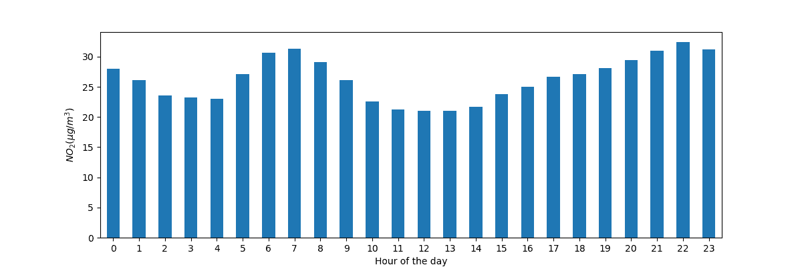
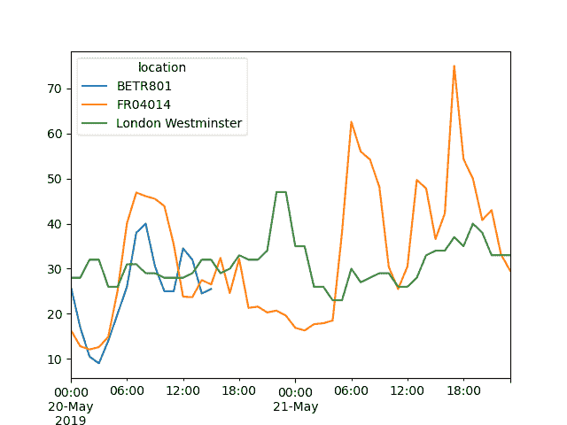
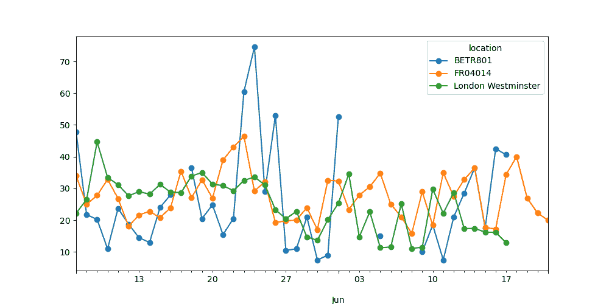

# 如何轻松处理时间序列数据

> 原文：[`pandas.pydata.org/docs/getting_started/intro_tutorials/09_timeseries.html`](https://pandas.pydata.org/docs/getting_started/intro_tutorials/09_timeseries.html)

## 使用 pandas 日期时间属性

+   我想将列`datetime`中的日期作为日期对象而不是纯文本来处理

    ```py
    In [7]: air_quality["datetime"] = pd.to_datetime(air_quality["datetime"])

    In [8]: air_quality["datetime"]
    Out[8]: 
    0      2019-06-21 00:00:00+00:00
    1      2019-06-20 23:00:00+00:00
    2      2019-06-20 22:00:00+00:00
    3      2019-06-20 21:00:00+00:00
    4      2019-06-20 20:00:00+00:00
     ... 
    2063   2019-05-07 06:00:00+00:00
    2064   2019-05-07 04:00:00+00:00
    2065   2019-05-07 03:00:00+00:00
    2066   2019-05-07 02:00:00+00:00
    2067   2019-05-07 01:00:00+00:00
    Name: datetime, Length: 2068, dtype: datetime64[ns, UTC] 
    ```

    最初，`datetime`中的值是字符字符串，不提供任何日期时间操作（例如提取年份、星期几等）。通过应用`to_datetime`函数，pandas 解释这些字符串并将其转换为日期时间（即`datetime64[ns, UTC]`）对象。在 pandas 中，我们将这些日期时间对象称为类似于标准库中的`datetime.datetime`的`pandas.Timestamp`。

注意

由于许多数据集中的一列包含日期时间信息，pandas 输入函数如`pandas.read_csv()`和`pandas.read_json()`在读取数据时可以使用`parse_dates`参数和要读取为 Timestamp 的列的列表进行日期转换：

```py
pd.read_csv("../data/air_quality_no2_long.csv", parse_dates=["datetime"]) 
```

这些`pandas.Timestamp`对象有什么用？让我们通过一些示例案例来说明其附加值。

> 我们正在处理的时间序列数据集的开始和结束日期是什么？

```py
In [9]: air_quality["datetime"].min(), air_quality["datetime"].max()
Out[9]: 
(Timestamp('2019-05-07 01:00:00+0000', tz='UTC'),
 Timestamp('2019-06-21 00:00:00+0000', tz='UTC')) 
```

使用`pandas.Timestamp`处理日期时间使我们能够计算日期信息并使其可比较。因此，我们可以用这个来获取时间序列的长度：

```py
In [10]: air_quality["datetime"].max() - air_quality["datetime"].min()
Out[10]: Timedelta('44 days 23:00:00') 
```

结果是一个类似于标准 Python 库中的`datetime.timedelta`的`pandas.Timedelta`对象，定义了一个时间持续。

转到用户指南

pandas 支持的各种时间概念在用户指南的时间相关概念部分中有解释。

+   我想向`DataFrame`添加一个只包含测量月份的新列

    ```py
    In [11]: air_quality["month"] = air_quality["datetime"].dt.month

    In [12]: air_quality.head()
    Out[12]: 
     city country                  datetime  ... value   unit  month
    0  Paris      FR 2019-06-21 00:00:00+00:00  ...  20.0  µg/m³      6
    1  Paris      FR 2019-06-20 23:00:00+00:00  ...  21.8  µg/m³      6
    2  Paris      FR 2019-06-20 22:00:00+00:00  ...  26.5  µg/m³      6
    3  Paris      FR 2019-06-20 21:00:00+00:00  ...  24.9  µg/m³      6
    4  Paris      FR 2019-06-20 20:00:00+00:00  ...  21.4  µg/m³      6

    [5 rows x 8 columns] 
    ```

    通过使用日期的`Timestamp`对象，pandas 提供了许多与时间相关的属性。例如`month`，还有`year`，`quarter`���。所有这些属性都可以通过`dt`访问器访问。

转到用户指南

现有日期属性的概述在时间和日期组件概述表中给出。关于`dt`访问器返回类似日期时间的属性的更多细节在 dt 访问器的专用部分中有解释。

+   每天每个测量位置的平均\(NO_2\)浓度是多少？

    ```py
    In [13]: air_quality.groupby(
     ....:    [air_quality["datetime"].dt.weekday, "location"])["value"].mean()
     ....: 
    Out[13]: 
    datetime  location 
    0         BETR801               27.875000
     FR04014               24.856250
     London Westminster    23.969697
    1         BETR801               22.214286
     FR04014               30.999359
     ... 
    5         FR04014               25.266154
     London Westminster    24.977612
    6         BETR801               21.896552
     FR04014               23.274306
     London Westminster    24.859155
    Name: value, Length: 21, dtype: float64 
    ```

    还记得来自统计计算教程的`groupby`提供的分割-应用-合并模式吗？在这里，我们想要计算给定统计量（例如均值\(NO_2\)）**每个工作日**和**每个测量位置**的数据。为了按工作日分组，我们使用 pandas `Timestamp` 的 datetime 属性`weekday`（星期一=0，星期日=6），该属性也可以通过`dt`访问器访问。可以对位置和工作日进行分组，以便在每个组合上分割均值的计算。

    危险

    由于在这些示例中我们使用的是非常短的时间序列，因此分析结果并不代表长期结果！

+   绘制所有站点时间序列中一天内的典型\(NO_2\)模式。换句话说，每小时的平均值是多少？

    ```py
    In [14]: fig, axs = plt.subplots(figsize=(12, 4))

    In [15]: air_quality.groupby(air_quality["datetime"].dt.hour)["value"].mean().plot(
     ....:    kind='bar', rot=0, ax=axs
     ....: )
     ....: 
    Out[15]: <Axes: xlabel='datetime'>

    In [16]: plt.xlabel("Hour of the day");  # custom x label using Matplotlib

    In [17]: plt.ylabel("$NO_2 (µg/m³)$"); 
    ```

    

    与前一个案例类似，我们想要计算给定统计量（例如均值\(NO_2\)）**每小时**的数据，并且我们可以再次使用分割-应用-合并的方法。对于这种情况，我们使用 pandas `Timestamp` 的 datetime 属性`hour`，该属性也可以通过`dt`访问器访问。

## 日期时间作为索引

在重塑教程中，介绍了`pivot()`用于将数据表重塑，使每个测量位置成为单独的列：

```py
In [18]: no_2 = air_quality.pivot(index="datetime", columns="location", values="value")

In [19]: no_2.head()
Out[19]: 
location                   BETR801  FR04014  London Westminster
datetime 
2019-05-07 01:00:00+00:00     50.5     25.0                23.0
2019-05-07 02:00:00+00:00     45.0     27.7                19.0
2019-05-07 03:00:00+00:00      NaN     50.4                19.0
2019-05-07 04:00:00+00:00      NaN     61.9                16.0
2019-05-07 05:00:00+00:00      NaN     72.4                 NaN 
```

注意

通过数据透视，日期时间信息成为表格的索引。通常，通过`set_index`函数可以将列设置为索引。

使用日期时间索引（即`DatetimeIndex`）提供了强大的功能。例如，我们不需要`dt`访问器来获取时间序列属性，而是直接在索引上可用这些属性：

```py
In [20]: no_2.index.year, no_2.index.weekday
Out[20]: 
(Index([2019, 2019, 2019, 2019, 2019, 2019, 2019, 2019, 2019, 2019,
 ...
 2019, 2019, 2019, 2019, 2019, 2019, 2019, 2019, 2019, 2019],
 dtype='int32', name='datetime', length=1033),
 Index([1, 1, 1, 1, 1, 1, 1, 1, 1, 1,
 ...
 3, 3, 3, 3, 3, 3, 3, 3, 3, 4],
 dtype='int32', name='datetime', length=1033)) 
```

其他一些优点包括方便的时间段子集或图表上的调整时间刻度。让我们在我们的数据上应用这个。

+   创建一个图表，显示从 5 月 20 日到 5 月 21 日结束的不同站点的\(NO_2\)值

    ```py
    In [21]: no_2["2019-05-20":"2019-05-21"].plot(); 
    ```

    

    通过提供一个**解析为日期时间的字符串**，可以在`DatetimeIndex`上选择特定的数据子集。

用户指南

有关`DatetimeIndex`和使用字符串进行切片的更多信息，请参阅时间序列索引部分。

## 将时间序列重新采样为另一个频率

+   将当前每小时时间序列值聚合到每个站点的月最大值。

    ```py
    In [22]: monthly_max = no_2.resample("ME").max()

    In [23]: monthly_max
    Out[23]: 
    location                   BETR801  FR04014  London Westminster
    datetime 
    2019-05-31 00:00:00+00:00     74.5     97.0                97.0
    2019-06-30 00:00:00+00:00     52.5     84.7                52.0 
    ```

    在具有日期时间索引的时间序列数据上，一种非常强大的方法是能够将时间序列`重采样()`到另一个频率（例如，将每秒数据转换为每 5 分钟数据）。

`resample()`方法类似于分组操作：

+   它提供基于时间的分组，通过使用定义目标频率的字符串（例如`M`、`5H`，...）

+   它需要聚合函数，如`mean`、`max`等

到用户指南

有关用于定义时间序列频率的别名的概述可在偏移别名概述表中找到。

在定义时，时间序列的频率由`freq`属性提供：

```py
In [24]: monthly_max.index.freq
Out[24]: <MonthEnd> 
```

+   绘制每个站点每日平均\(NO_2\)值的图表。

    ```py
    In [25]: no_2.resample("D").mean().plot(style="-o", figsize=(10, 5)); 
    ```

    

到用户指南

有关时间序列`重采样`强大功能的更多细节，请参阅用户指南中关于重采样的部分。

#### 记住

+   有效的日期字符串可以使用`to_datetime`函数或作为读取函数的一部分转换为日期时间对象。

+   pandas 中的日期时间对象支持计算、逻辑操作和使用`dt`访问器的便捷日期相关属性。

+   `DatetimeIndex`包含这些与日期相关的属性，并支持便捷的切片。

+   `重采样`是一种强大的方法，可以改变时间序列的频率。

到用户指南

有关时间序列的完整概述可在时间序列和日期功能页面上找到。

## 使用 pandas 日期时间属性

+   我想要将列`datetime`中的日期作为日期时间对象而不是纯文本进行处理

    ```py
    In [7]: air_quality["datetime"] = pd.to_datetime(air_quality["datetime"])

    In [8]: air_quality["datetime"]
    Out[8]: 
    0      2019-06-21 00:00:00+00:00
    1      2019-06-20 23:00:00+00:00
    2      2019-06-20 22:00:00+00:00
    3      2019-06-20 21:00:00+00:00
    4      2019-06-20 20:00:00+00:00
     ... 
    2063   2019-05-07 06:00:00+00:00
    2064   2019-05-07 04:00:00+00:00
    2065   2019-05-07 03:00:00+00:00
    2066   2019-05-07 02:00:00+00:00
    2067   2019-05-07 01:00:00+00:00
    Name: datetime, Length: 2068, dtype: datetime64[ns, UTC] 
    ```

    最初，`datetime`中的值是字符字符串，不提供任何日期时间操作（例如提取年份、星期几等）。通过应用`to_datetime`函数，pandas 解释这些字符串并将其转换为日期时间（即`datetime64[ns, UTC]`）对象。在 pandas 中，我们将这些日期时间对象称为类似于标准库中的`datetime.datetime`的`pandas.Timestamp`。

注意

由于许多数据集中的一列包含日期时间信息，因此 pandas 输入函数如`pandas.read_csv()`和`pandas.read_json()`在读取数据时可以使用`parse_dates`参数进行日期转换，参数是要读取为时间戳的列的列表：

```py
pd.read_csv("../data/air_quality_no2_long.csv", parse_dates=["datetime"]) 
```

这些`pandas.Timestamp`对象有什么用？让我们通过一些示例案例来说明其附加值。

> 我们正在处理的时间序列数据集的开始和结束日期是什么？

```py
In [9]: air_quality["datetime"].min(), air_quality["datetime"].max()
Out[9]: 
(Timestamp('2019-05-07 01:00:00+0000', tz='UTC'),
 Timestamp('2019-06-21 00:00:00+0000', tz='UTC')) 
```

使用`pandas.Timestamp`来处理日期时间使我们能够计算日期信息并使其可比较。因此，我们可以用它来获取时间序列的长度：

```py
In [10]: air_quality["datetime"].max() - air_quality["datetime"].min()
Out[10]: Timedelta('44 days 23:00:00') 
```

结果是一个`pandas.Timedelta`对象，类似于标准 Python 库中的`datetime.timedelta`，定义了时间持续。

用户指南

pandas 支持的各种时间概念在时间相关概念的用户指南部分有详细解释。

+   我想要向`DataFrame`添加一个只包含测量月份的新列

    ```py
    In [11]: air_quality["month"] = air_quality["datetime"].dt.month

    In [12]: air_quality.head()
    Out[12]: 
     city country                  datetime  ... value   unit  month
    0  Paris      FR 2019-06-21 00:00:00+00:00  ...  20.0  µg/m³      6
    1  Paris      FR 2019-06-20 23:00:00+00:00  ...  21.8  µg/m³      6
    2  Paris      FR 2019-06-20 22:00:00+00:00  ...  26.5  µg/m³      6
    3  Paris      FR 2019-06-20 21:00:00+00:00  ...  24.9  µg/m³      6
    4  Paris      FR 2019-06-20 20:00:00+00:00  ...  21.4  µg/m³      6

    [5 rows x 8 columns] 
    ```

    通过使用`Timestamp`对象作为日期，pandas 提供了许多与时间相关的属性。例如`month`，还有`year`，`quarter`等等。所有这些属性都可以通过`dt`访问器访问。

用户指南

时间和日期组件概览表中提供了现有日期属性的概述。关于`dt`访问器返回类似日期时间属性的更多细节在 dt 访问器的专门部分有解释。

+   每周每天每个测量位置的平均\(NO_2\)浓度是多少？

    ```py
    In [13]: air_quality.groupby(
     ....:    [air_quality["datetime"].dt.weekday, "location"])["value"].mean()
     ....: 
    Out[13]: 
    datetime  location 
    0         BETR801               27.875000
     FR04014               24.856250
     London Westminster    23.969697
    1         BETR801               22.214286
     FR04014               30.999359
     ... 
    5         FR04014               25.266154
     London Westminster    24.977612
    6         BETR801               21.896552
     FR04014               23.274306
     London Westminster    24.859155
    Name: value, Length: 21, dtype: float64 
    ```

    还记得`groupby`提供的分割-应用-合并模式吗？在统计计算教程中，我们想要计算每个工作日和每个测量位置的给定统计量（例如平均\(NO_2\)）。为了按工作日分组，我们使用 pandas `Timestamp`的日期时间属性`weekday`（星期一=0，星期日=6），这也可以通过`dt`访问器访问。可以对位置和工作日进行分组，以便在这些组合中分别计算平均值。

    危险

    在这些示例中，我们处理的时间序列非常短，分析结果并不提供长期代表性的结果！

+   绘制我们所有站点时间序列中一天内典型的\(NO_2\)模式。换句话说，每个小时的平均值是多少？

    ```py
    In [14]: fig, axs = plt.subplots(figsize=(12, 4))

    In [15]: air_quality.groupby(air_quality["datetime"].dt.hour)["value"].mean().plot(
     ....:    kind='bar', rot=0, ax=axs
     ....: )
     ....: 
    Out[15]: <Axes: xlabel='datetime'>

    In [16]: plt.xlabel("Hour of the day");  # custom x label using Matplotlib

    In [17]: plt.ylabel("$NO_2 (µg/m³)$"); 
    ```

    

    类似于前面的情况，我们想要计算每个小时的给定统计量（例如平均\(NO_2\)），我们可以再次使用分割-应用-合并方法。对于这种情况，我们使用 pandas `Timestamp`的日期时间属性`hour`，这也可以通过`dt`访问器访问。

## 日期时间作为索引

在重塑教程中，介绍了使用`pivot()`来将数据表重塑，使每个测量位置成为单独的列：

```py
In [18]: no_2 = air_quality.pivot(index="datetime", columns="location", values="value")

In [19]: no_2.head()
Out[19]: 
location                   BETR801  FR04014  London Westminster
datetime 
2019-05-07 01:00:00+00:00     50.5     25.0                23.0
2019-05-07 02:00:00+00:00     45.0     27.7                19.0
2019-05-07 03:00:00+00:00      NaN     50.4                19.0
2019-05-07 04:00:00+00:00      NaN     61.9                16.0
2019-05-07 05:00:00+00:00      NaN     72.4                 NaN 
```

注意

通过数据透视，日期时间信息成为表的索引。通常，通过`set_index`函数可以将列设置为索引。

使用日期时间索引（即`DatetimeIndex`）提供了强大的功���。例如，我们不需要`dt`访问器来获取时间序列属性，而是直接在索引上可用这些属性：

```py
In [20]: no_2.index.year, no_2.index.weekday
Out[20]: 
(Index([2019, 2019, 2019, 2019, 2019, 2019, 2019, 2019, 2019, 2019,
 ...
 2019, 2019, 2019, 2019, 2019, 2019, 2019, 2019, 2019, 2019],
 dtype='int32', name='datetime', length=1033),
 Index([1, 1, 1, 1, 1, 1, 1, 1, 1, 1,
 ...
 3, 3, 3, 3, 3, 3, 3, 3, 3, 4],
 dtype='int32', name='datetime', length=1033)) 
```

其他一些优点是方便地对时间段进行子集划分或在图表上调整时间刻度。让我们在我们的数据上应用这个方法。

+   创建从 5 月 20 日到 5 月 21 日结束的不同站点\(NO_2\)值的图表。

    ```py
    In [21]: no_2["2019-05-20":"2019-05-21"].plot(); 
    ```

    

    通过提供**解析为日期时间的字符串**，可以在`DatetimeIndex`上选择特定的数据子集。

到用户指南

更多关于`DatetimeIndex`和使用字符串进行切片的信息，请参阅时间序列索引部分。

## 将时间序列重新采样到另一个频率

+   将当前每小时时间序列值聚合到各站点的每月最大值。

    ```py
    In [22]: monthly_max = no_2.resample("ME").max()

    In [23]: monthly_max
    Out[23]: 
    location                   BETR801  FR04014  London Westminster
    datetime 
    2019-05-31 00:00:00+00:00     74.5     97.0                97.0
    2019-06-30 00:00:00+00:00     52.5     84.7                52.0 
    ```

    在具有日期时间索引的时间序列数据上非常强大的方法是能够将时间序列`resample()`到另一个频率（例如，将每秒数据转换为每 5 分钟的数据）。

`resample()`方法类似于分组操作：

+   它提供了基于时间的分组，通过使用定义目标频率的字符串（例如`M`、`5H`等）

+   它需要一个聚合函数，如`mean`、`max`等。

到用户指南

在偏移别名概述表中提供了用于定义时间序列频率的别名的概述。

当定义时，时间序列的频率由`freq`属性提供：

```py
In [24]: monthly_max.index.freq
Out[24]: <MonthEnd> 
```

+   绘制每个站点的每日平均\(NO_2\)值的图表。

    ```py
    In [25]: no_2.resample("D").mean().plot(style="-o", figsize=(10, 5)); 
    ```

    

到用户指南

更多关于时间序列`重新采样`强大功能的详细信息，请参阅用户指南中的重新采样部分。

#### 记住

+   有效的日期字符串可以使用`to_datetime`函数或作为读取函数的一部分转换为日期时间对象。

+   pandas 中的日期时间对象支持使用`dt`访问器进行计算、逻辑操作和方便的与日期相关的属性。

+   `DatetimeIndex` 包含这些与日期相关的属性，并支持方便的切片。

+   `Resample` 是改变时间序列频率的强大方法。

用户指南

有关时间序列的完整概述可在时间序列和日期功能页面上找到。
