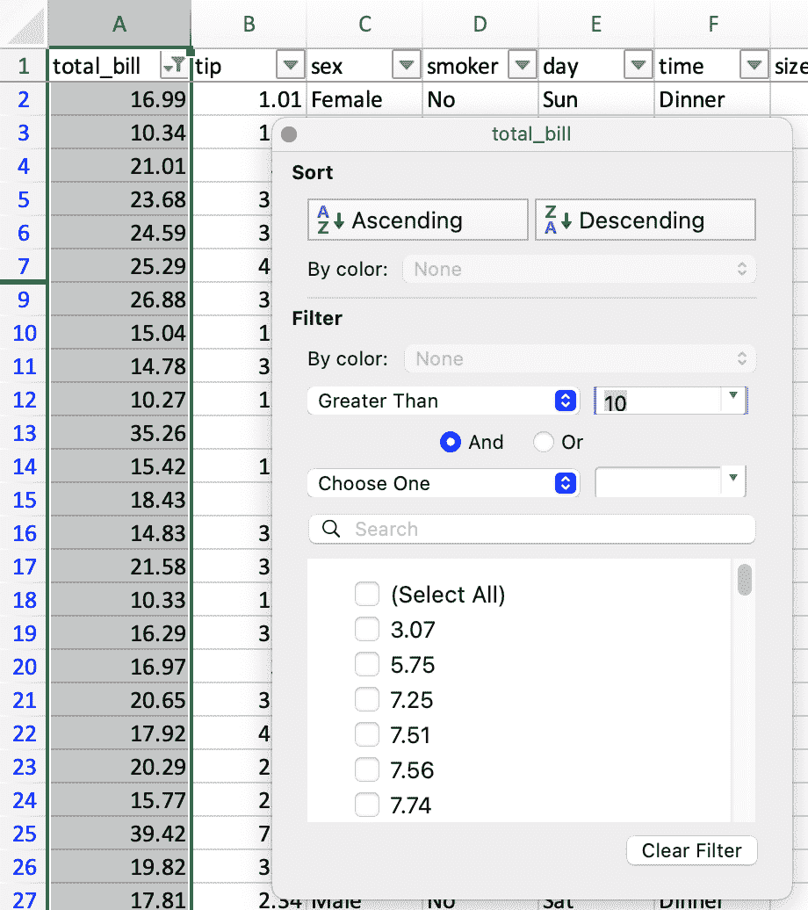
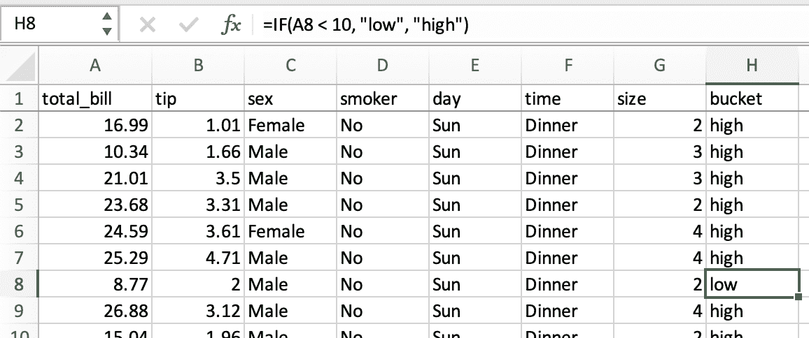
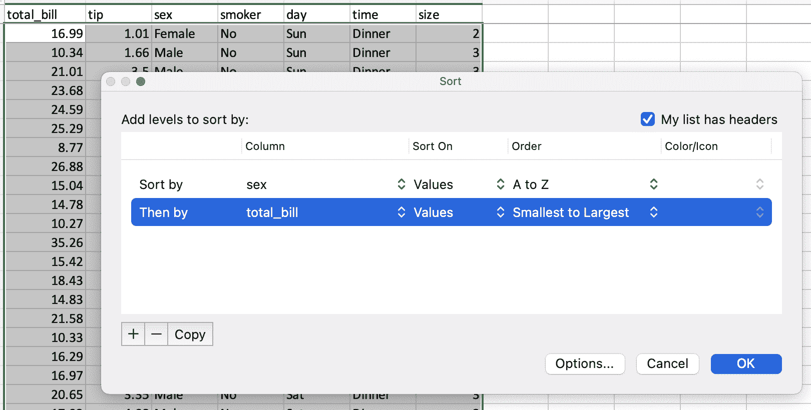
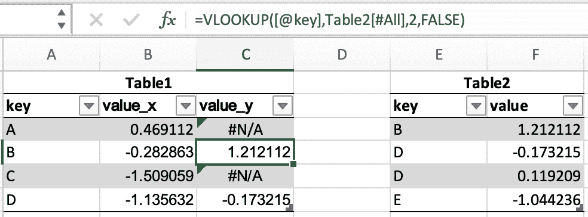
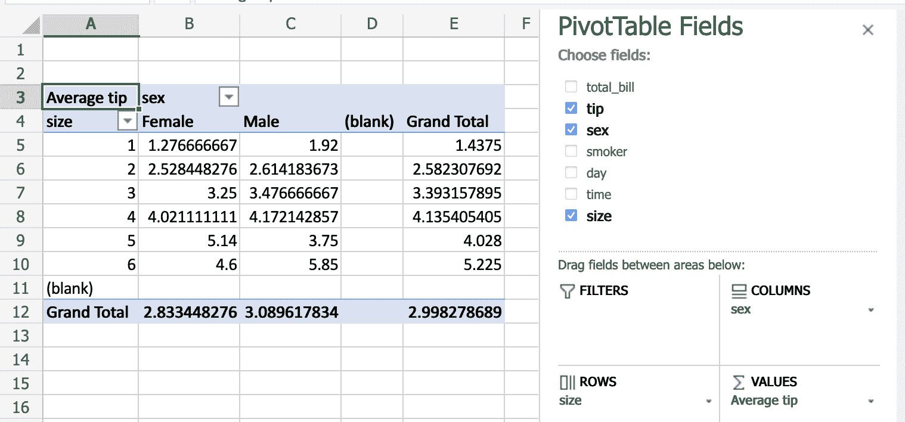

# 与电子表格的比较

> 原文：[`pandas.pydata.org/docs/getting_started/comparison/comparison_with_spreadsheets.html`](https://pandas.pydata.org/docs/getting_started/comparison/comparison_with_spreadsheets.html)

由于许多潜在的 pandas 用户对电子表格程序（如 [Excel](https://support.microsoft.com/en-us/excel)）有一定的了解，因此本页面旨在提供使用 pandas 执行各种电子表格操作的示例。本页面将使用 Excel 的术语和链接到文档，但在 [Google Sheets](https://support.google.com/a/users/answer/9282959)、[LibreOffice Calc](https://help.libreoffice.org/latest/en-US/text/scalc/main0000.html?DbPAR=CALC)、[Apple Numbers](https://www.apple.com/numbers/compatibility/) 和其他兼容 Excel 的电子表格软件中，情况将是相同/类似的。

如果您是 pandas 的新手，您可能首先想阅读 10 分钟入门 pandas 来熟悉该库。

惯例上，我们导入 pandas 和 NumPy 如下：

```py
In [1]: import pandas as pd

In [2]: import numpy as np 
```

## 数据结构

### 通用术语翻译

| pandas | Excel |
| --- | --- |
| `DataFrame` | 工作表 |
| `Series` | 列 |
| `Index` | 行标题 |
| 行 | 行 |
| `NaN` | 空单元格 |

### `DataFrame`

在 pandas 中，`DataFrame`类似于 Excel 工作表。虽然 Excel 工作簿可以包含多个工作表，但 pandas 的`DataFrame`是独立存在的。

### `Series`

`Series` 是表示`DataFrame`的一列的数据结构。与处理电子表格的列类似，操作`Series`。

### `Index`

每个`DataFrame`和`Series`都有一个`Index`，这些是数据的*行*上的标签。在 pandas 中，如果没有指定索引，默认使用 `RangeIndex`（第一行 = 0，第二行 = 1，依此类推），类似于电子表格中的行标题/编号。

在 pandas 中，索引可以设置为一个（或多个）唯一值，就像在工作表中使用作为行标识符的列一样。与大多数电子表格不同，这些`Index`值实际上可以用于引用行。（请注意，[在 Excel 中可以使用结构引用执行此操作](https://support.microsoft.com/en-us/office/using-structured-references-with-excel-tables-f5ed2452-2337-4f71-bed3-c8ae6d2b276e)。）例如，在电子表格中，您可以将第一行引用为`A1:Z1`，而在 pandas 中，您可以使用`populations.loc['Chicago']`。

索引值也是持久的，因此���果重新排列`DataFrame`中的行，特定行的标签不会改变。

查看 索引文档 以了解如何有效使用`Index`。

### 复制 vs. 原地操作

大多数 pandas 操作返回`Series`/`DataFrame`的副本。要使更改“生效”，您需要将其分配给一个新变量：

> ```py
> sorted_df = df.sort_values("col1") 
> ```

或覆盖原始数据：

> ```py
> df = df.sort_values("col1") 
> ```

注意

您将看到一些方法可用的 `inplace=True` 或 `copy=False` 关键字参数：

```py
df.replace(5, inplace=True) 
```

目前正在就大多数方法（例如 `dropna`）废弃和移除 `inplace` 和 `copy` 进行积极讨论，除了一小部分方法（包括 `replace`）之外。在写时复制的情况下，这两个关键字将不再必要。提案可以在[这里](https://github.com/pandas-dev/pandas/pull/51466)找到。

## 数据输入/输出

### 从值构建 DataFrame

在电子表格中，[值可以直接输入到单元格中](https://support.microsoft.com/en-us/office/enter-data-manually-in-worksheet-cells-c798181d-d75a-41b1-92ad-6c0800f80038)。

一个 pandas `DataFrame` 可以以许多不同的方式构建，但对于少量值，通常将其指定为 Python 字典是方便的，其中键是列名，值是数据。

```py
In [3]: df = pd.DataFrame({"x": [1, 3, 5], "y": [2, 4, 6]})

In [4]: df
Out[4]: 
 x  y
0  1  2
1  3  4
2  5  6 
```

### 读取外部数据

[Excel](https://support.microsoft.com/en-us/office/import-data-from-data-sources-power-query-be4330b3-5356-486c-a168-b68e9e616f5a) 和 pandas 都可以从各种来源以各种格式导入数据。

#### CSV

让我们加载并显示来自 pandas 测试的[tips](https://github.com/pandas-dev/pandas/blob/main/pandas/tests/io/data/csv/tips.csv)数据集，这是一个 CSV 文件。在 Excel 中，您会下载然后[打开 CSV](https://support.microsoft.com/en-us/office/import-or-export-text-txt-or-csv-files-5250ac4c-663c-47ce-937b-339e391393ba)。在 pandas 中，您将 URL 或本地路径传递给 `read_csv()`：

```py
In [5]: url = (
 ...:    "https://raw.githubusercontent.com/pandas-dev"
 ...:    "/pandas/main/pandas/tests/io/data/csv/tips.csv"
 ...: )
 ...: 

In [6]: tips = pd.read_csv(url)

In [7]: tips
Out[7]: 
 total_bill   tip     sex smoker   day    time  size
0         16.99  1.01  Female     No   Sun  Dinner     2
1         10.34  1.66    Male     No   Sun  Dinner     3
2         21.01  3.50    Male     No   Sun  Dinner     3
3         23.68  3.31    Male     No   Sun  Dinner     2
4         24.59  3.61  Female     No   Sun  Dinner     4
..          ...   ...     ...    ...   ...     ...   ...
239       29.03  5.92    Male     No   Sat  Dinner     3
240       27.18  2.00  Female    Yes   Sat  Dinner     2
241       22.67  2.00    Male    Yes   Sat  Dinner     2
242       17.82  1.75    Male     No   Sat  Dinner     2
243       18.78  3.00  Female     No  Thur  Dinner     2

[244 rows x 7 columns] 
```

像[Excel 的文本导入向导](https://support.microsoft.com/en-us/office/text-import-wizard-c5b02af6-fda1-4440-899f-f78bafe41857)一样，`read_csv` 可以接受多个参数来指定数据应如何解析。例如，如果数据实际上是制表符分隔的，并且没有列名，那么 pandas 命令将是：

```py
tips = pd.read_csv("tips.csv", sep="\t", header=None)

# alternatively, read_table is an alias to read_csv with tab delimiter
tips = pd.read_table("tips.csv", header=None) 
```

#### Excel 文件

Excel 通过双击打开[各种 Excel 文件格式](https://support.microsoft.com/en-us/office/file-formats-that-are-supported-in-excel-0943ff2c-6014-4e8d-aaea-b83d51d46247)，或使用[打开菜单](https://support.microsoft.com/en-us/office/open-files-from-the-file-menu-97f087d8-3136-4485-8e86-c5b12a8c4176)。在 pandas 中，您可以使用特殊方法来读取和写入 Excel 文件。

让我们首先根据上面示例中的 `tips` 数据框创建一个新的 Excel 文件：

```py
tips.to_excel("./tips.xlsx") 
```

如果您希望随后访问 `tips.xlsx` 文件中的数据，可以使用以下方式将其读入您的模块中

```py
tips_df = pd.read_excel("./tips.xlsx", index_col=0) 
```

你刚刚使用 pandas 读取了一个 Excel 文件！

### 限制输出

电子表格程序一次只会显示一个屏幕的数据，然后允许你滚动，因此实际上不需要限制输出。在 pandas 中，你需要更多地考虑如何控制你的`DataFrame`的显示方式。

默认情况下，pandas 会截断大型`DataFrame`的输出以显示第一行和最后一行。这可以通过更改 pandas 选项，或使用`DataFrame.head()`或`DataFrame.tail()`来覆盖。

```py
In [8]: tips.head(5)
Out[8]: 
 total_bill   tip     sex smoker  day    time  size
0       16.99  1.01  Female     No  Sun  Dinner     2
1       10.34  1.66    Male     No  Sun  Dinner     3
2       21.01  3.50    Male     No  Sun  Dinner     3
3       23.68  3.31    Male     No  Sun  Dinner     2
4       24.59  3.61  Female     No  Sun  Dinner     4 
```

### 导出数据

默认情况下，桌面电子表格软件会保存到其相应的文件格式（`.xlsx`，`.ods`等）。但是，你可以[保存到其他文件格式](https://support.microsoft.com/en-us/office/save-a-workbook-in-another-file-format-6a16c862-4a36-48f9-a300-c2ca0065286e)。

pandas 可以创建 Excel 文件，CSV，或其他多种格式。

## 数据操作

### 列上的操作

在电子表格中，[公式](https://support.microsoft.com/en-us/office/overview-of-formulas-in-excel-ecfdc708-9162-49e8-b993-c311f47ca173)通常在单独的单元格中创建，然后通过[拖动](https://support.microsoft.com/en-us/office/copy-a-formula-by-dragging-the-fill-handle-in-excel-for-mac-dd928259-622b-473f-9a33-83aa1a63e218)到其他单元格中以计算其他列的值。在 pandas 中，你可以直接对整列进行操作。

pandas 通过在`DataFrame`中指定单独的`Series`提供矢量化操作。新列可以以相同的方式分配。`DataFrame.drop()`方法从`DataFrame`中删除列。

```py
In [9]: tips["total_bill"] = tips["total_bill"] - 2

In [10]: tips["new_bill"] = tips["total_bill"] / 2

In [11]: tips
Out[11]: 
 total_bill   tip     sex smoker   day    time  size  new_bill
0         14.99  1.01  Female     No   Sun  Dinner     2     7.495
1          8.34  1.66    Male     No   Sun  Dinner     3     4.170
2         19.01  3.50    Male     No   Sun  Dinner     3     9.505
3         21.68  3.31    Male     No   Sun  Dinner     2    10.840
4         22.59  3.61  Female     No   Sun  Dinner     4    11.295
..          ...   ...     ...    ...   ...     ...   ...       ...
239       27.03  5.92    Male     No   Sat  Dinner     3    13.515
240       25.18  2.00  Female    Yes   Sat  Dinner     2    12.590
241       20.67  2.00    Male    Yes   Sat  Dinner     2    10.335
242       15.82  1.75    Male     No   Sat  Dinner     2     7.910
243       16.78  3.00  Female     No  Thur  Dinner     2     8.390

[244 rows x 8 columns]

In [12]: tips = tips.drop("new_bill", axis=1) 
```

请注意，我们不需要逐个单元格地告诉它执行减法 — pandas 会为我们处理。查看如何从现有列创建新列。

### 过滤

[在 Excel 中，过滤是通过图形菜单完成的。](https://support.microsoft.com/en-us/office/filter-data-in-a-range-or-table-01832226-31b5-4568-8806-38c37dcc180e)



数据框可以通过多种方式进行过滤；其中最直观的是使用布尔索引。

```py
In [13]: tips[tips["total_bill"] > 10]
Out[13]: 
 total_bill   tip     sex smoker   day    time  size
0         14.99  1.01  Female     No   Sun  Dinner     2
2         19.01  3.50    Male     No   Sun  Dinner     3
3         21.68  3.31    Male     No   Sun  Dinner     2
4         22.59  3.61  Female     No   Sun  Dinner     4
5         23.29  4.71    Male     No   Sun  Dinner     4
..          ...   ...     ...    ...   ...     ...   ...
239       27.03  5.92    Male     No   Sat  Dinner     3
240       25.18  2.00  Female    Yes   Sat  Dinner     2
241       20.67  2.00    Male    Yes   Sat  Dinner     2
242       15.82  1.75    Male     No   Sat  Dinner     2
243       16.78  3.00  Female     No  Thur  Dinner     2

[204 rows x 7 columns] 
```

上述语句只是将`True`/`False`对象的`Series`传递给数据框，返回所有具有`True`的��。

```py
In [14]: is_dinner = tips["time"] == "Dinner"

In [15]: is_dinner
Out[15]: 
0      True
1      True
2      True
3      True
4      True
 ... 
239    True
240    True
241    True
242    True
243    True
Name: time, Length: 244, dtype: bool

In [16]: is_dinner.value_counts()
Out[16]: 
time
True     176
False     68
Name: count, dtype: int64

In [17]: tips[is_dinner]
Out[17]: 
 total_bill   tip     sex smoker   day    time  size
0         14.99  1.01  Female     No   Sun  Dinner     2
1          8.34  1.66    Male     No   Sun  Dinner     3
2         19.01  3.50    Male     No   Sun  Dinner     3
3         21.68  3.31    Male     No   Sun  Dinner     2
4         22.59  3.61  Female     No   Sun  Dinner     4
..          ...   ...     ...    ...   ...     ...   ...
239       27.03  5.92    Male     No   Sat  Dinner     3
240       25.18  2.00  Female    Yes   Sat  Dinner     2
241       20.67  2.00    Male    Yes   Sat  Dinner     2
242       15.82  1.75    Male     No   Sat  Dinner     2
243       16.78  3.00  Female     No  Thur  Dinner     2

[176 rows x 7 columns] 
```

### If/then 逻辑

假设我们想要根据`total_bill`是小于还是大于$10 来创建一个`bucket`列，值为`low`和`high`。

在电子表格中，可以使用[条件公式](https://support.microsoft.com/en-us/office/create-conditional-formulas-ca916c57-abd8-4b44-997c-c309b7307831)进行逻辑比较。我们会使用公式`=IF(A2 < 10, "low", "high")`，拖动到新的`bucket`列中的所有单元格。



在 pandas 中，可以使用`numpy`中的`where`方法来完成相同的操作。

```py
In [18]: tips["bucket"] = np.where(tips["total_bill"] < 10, "low", "high")

In [19]: tips
Out[19]: 
 total_bill   tip     sex smoker   day    time  size bucket
0         14.99  1.01  Female     No   Sun  Dinner     2   high
1          8.34  1.66    Male     No   Sun  Dinner     3    low
2         19.01  3.50    Male     No   Sun  Dinner     3   high
3         21.68  3.31    Male     No   Sun  Dinner     2   high
4         22.59  3.61  Female     No   Sun  Dinner     4   high
..          ...   ...     ...    ...   ...     ...   ...    ...
239       27.03  5.92    Male     No   Sat  Dinner     3   high
240       25.18  2.00  Female    Yes   Sat  Dinner     2   high
241       20.67  2.00    Male    Yes   Sat  Dinner     2   high
242       15.82  1.75    Male     No   Sat  Dinner     2   high
243       16.78  3.00  Female     No  Thur  Dinner     2   high

[244 rows x 8 columns] 
```

### 日期功能

*本节将涉及“日期”，但时间戳处理方式类似。*

我们可以将日期功能分为两部分：解析和输出。在电子表格中，日期值通常会自动解析，尽管如果需要，可以使用[DATEVALUE](https://support.microsoft.com/en-us/office/datevalue-function-df8b07d4-7761-4a93-bc33-b7471bbff252)函数。在 pandas 中，您需要显式将纯文本转换为日期时间对象，可以在从 CSV 读取时或在 DataFrame 中的某个时刻进行转换。

解析后，电子表格会以默认格式显示日期，尽管[格式可以更改](https://support.microsoft.com/en-us/office/format-a-date-the-way-you-want-8e10019e-d5d8-47a1-ba95-db95123d273e)。在 pandas 中，您通常希望在进行计算时将日期保留为`datetime`对象。在电子表格中，输出日期的*部分*（如年份）是通过[日期函数](https://support.microsoft.com/en-us/office/date-and-time-functions-reference-fd1b5961-c1ae-4677-be58-074152f97b81)完成的，在 pandas 中则通过 datetime 属性完成。

在电子表格中，如果在列`A`和`B`中给出`date1`和`date2`，你可能会有这些公式：

| 列 | 公式 |
| --- | --- |
| `date1_year` | `=YEAR(A2)` |
| `date2_month` | `=MONTH(B2)` |
| `date1_next` | `=DATE(YEAR(A2),MONTH(A2)+1,1)` |
| `months_between` | `=DATEDIF(A2,B2,"M")` |

下面显示了等效的 pandas 操作。

```py
In [20]: tips["date1"] = pd.Timestamp("2013-01-15")

In [21]: tips["date2"] = pd.Timestamp("2015-02-15")

In [22]: tips["date1_year"] = tips["date1"].dt.year

In [23]: tips["date2_month"] = tips["date2"].dt.month

In [24]: tips["date1_next"] = tips["date1"] + pd.offsets.MonthBegin()

In [25]: tips["months_between"] = tips["date2"].dt.to_period("M") - tips[
 ....:    "date1"
 ....: ].dt.to_period("M")
 ....: 

In [26]: tips[
 ....:    ["date1", "date2", "date1_year", "date2_month", "date1_next", "months_between"]
 ....: ]
 ....: 
Out[26]: 
 date1      date2  date1_year  date2_month date1_next    months_between
0   2013-01-15 2015-02-15        2013            2 2013-02-01  <25 * MonthEnds>
1   2013-01-15 2015-02-15        2013            2 2013-02-01  <25 * MonthEnds>
2   2013-01-15 2015-02-15        2013            2 2013-02-01  <25 * MonthEnds>
3   2013-01-15 2015-02-15        2013            2 2013-02-01  <25 * MonthEnds>
4   2013-01-15 2015-02-15        2013            2 2013-02-01  <25 * MonthEnds>
..         ...        ...         ...          ...        ...               ...
239 2013-01-15 2015-02-15        2013            2 2013-02-01  <25 * MonthEnds>
240 2013-01-15 2015-02-15        2013            2 2013-02-01  <25 * MonthEnds>
241 2013-01-15 2015-02-15        2013            2 2013-02-01  <25 * MonthEnds>
242 2013-01-15 2015-02-15        2013            2 2013-02-01  <25 * MonthEnds>
243 2013-01-15 2015-02-15        2013            2 2013-02-01  <25 * MonthEnds>

[244 rows x 6 columns] 
```

查看时间序列/日期功能以获取更多详细信息。

### 列的选择

在电子表格中，您可以通过以下方式选择要选择的列：

+   [隐藏列](https://support.microsoft.com/en-us/office/hide-or-show-rows-or-columns-659c2cad-802e-44ee-a614-dde8443579f8)

+   [删除列](https://support.microsoft.com/en-us/office/insert-or-delete-rows-and-columns-6f40e6e4-85af-45e0-b39d-65dd504a3246)

+   [引用范围](https://support.microsoft.com/en-us/office/create-or-change-a-cell-reference-c7b8b95d-c594-4488-947e-c835903cebaa)从一个工作表到另一个工作表

由于电子表格列通常在[标题行中命名](https://support.microsoft.com/en-us/office/turn-excel-table-headers-on-or-off-c91d1742-312c-4480-820f-cf4b534c8b3b)，所以重命名列只是简单地更改该第一个单元格中的文本。

pandas 中使用相同的操作如下所示。

#### 保留某些列

```py
In [27]: tips[["sex", "total_bill", "tip"]]
Out[27]: 
 sex  total_bill   tip
0    Female       14.99  1.01
1      Male        8.34  1.66
2      Male       19.01  3.50
3      Male       21.68  3.31
4    Female       22.59  3.61
..      ...         ...   ...
239    Male       27.03  5.92
240  Female       25.18  2.00
241    Male       20.67  2.00
242    Male       15.82  1.75
243  Female       16.78  3.00

[244 rows x 3 columns] 
```

#### 删除列

```py
In [28]: tips.drop("sex", axis=1)
Out[28]: 
 total_bill   tip smoker   day    time  size
0         14.99  1.01     No   Sun  Dinner     2
1          8.34  1.66     No   Sun  Dinner     3
2         19.01  3.50     No   Sun  Dinner     3
3         21.68  3.31     No   Sun  Dinner     2
4         22.59  3.61     No   Sun  Dinner     4
..          ...   ...    ...   ...     ...   ...
239       27.03  5.92     No   Sat  Dinner     3
240       25.18  2.00    Yes   Sat  Dinner     2
241       20.67  2.00    Yes   Sat  Dinner     2
242       15.82  1.75     No   Sat  Dinner     2
243       16.78  3.00     No  Thur  Dinner     2

[244 rows x 6 columns] 
```

#### 重命名列

```py
In [29]: tips.rename(columns={"total_bill": "total_bill_2"})
Out[29]: 
 total_bill_2   tip     sex smoker   day    time  size
0           14.99  1.01  Female     No   Sun  Dinner     2
1            8.34  1.66    Male     No   Sun  Dinner     3
2           19.01  3.50    Male     No   Sun  Dinner     3
3           21.68  3.31    Male     No   Sun  Dinner     2
4           22.59  3.61  Female     No   Sun  Dinner     4
..            ...   ...     ...    ...   ...     ...   ...
239         27.03  5.92    Male     No   Sat  Dinner     3
240         25.18  2.00  Female    Yes   Sat  Dinner     2
241         20.67  2.00    Male    Yes   Sat  Dinner     2
242         15.82  1.75    Male     No   Sat  Dinner     2
243         16.78  3.00  Female     No  Thur  Dinner     2

[244 rows x 7 columns] 
```

### 按值排序

在电子表格中进行排序是通过[排序对话框](https://support.microsoft.com/en-us/office/sort-data-in-a-range-or-table-62d0b95d-2a90-4610-a6ae-2e545c4a4654)完成的。



pandas 有一个`DataFrame.sort_values()`方法，它接受要按列排序的列列表。

```py
In [30]: tips = tips.sort_values(["sex", "total_bill"])

In [31]: tips
Out[31]: 
 total_bill    tip     sex smoker   day    time  size
67         1.07   1.00  Female    Yes   Sat  Dinner     1
92         3.75   1.00  Female    Yes   Fri  Dinner     2
111        5.25   1.00  Female     No   Sat  Dinner     1
145        6.35   1.50  Female     No  Thur   Lunch     2
135        6.51   1.25  Female     No  Thur   Lunch     2
..          ...    ...     ...    ...   ...     ...   ...
182       43.35   3.50    Male    Yes   Sun  Dinner     3
156       46.17   5.00    Male     No   Sun  Dinner     6
59        46.27   6.73    Male     No   Sat  Dinner     4
212       46.33   9.00    Male     No   Sat  Dinner     4
170       48.81  10.00    Male    Yes   Sat  Dinner     3

[244 rows x 7 columns] 
```

## 字符串处理

### 查找字符串的长度

在电子表格中，可以使用[LEN](https://support.microsoft.com/en-us/office/len-lenb-functions-29236f94-cedc-429d-affd-b5e33d2c67cb)函数找到文本中的字符数。这可以与[TRIM](https://support.microsoft.com/en-us/office/trim-function-410388fa-c5df-49c6-b16c-9e5630b479f9)函数一起使用以删除额外的空格。

```py
=LEN(TRIM(A2)) 
```

您可以使用`Series.str.len()`找到字符字符串的长度。在 Python 3 中，所有字符串都是 Unicode 字符串。`len`包括尾随空格。使用`len`和`rstrip`排除尾随空格。

```py
In [32]: tips["time"].str.len()
Out[32]: 
67     6
92     6
111    6
145    5
135    5
 ..
182    6
156    6
59     6
212    6
170    6
Name: time, Length: 244, dtype: int64

In [33]: tips["time"].str.rstrip().str.len()
Out[33]: 
67     6
92     6
111    6
145    5
135    5
 ..
182    6
156    6
59     6
212    6
170    6
Name: time, Length: 244, dtype: int64 
```

请注意，这仍将包括字符串中的多个空格，因此不是 100%等效。

### 查找子串的位置

[FIND](https://support.microsoft.com/en-us/office/find-findb-functions-c7912941-af2a-4bdf-a553-d0d89b0a0628)电子表格函数返回子字符串的位置，第一个字符为`1`。


您可以使用`Series.str.find()`方法在字符串列中查找字符的位置。`find`搜索子字符串的第一个位置。如果找到子字符串，则该方法返回其位置。如果未找到，则返回`-1`。请记住，Python 索引是从零开始的。

```py
In [34]: tips["sex"].str.find("ale")
Out[34]: 
67     3
92     3
111    3
145    3
135    3
 ..
182    1
156    1
59     1
212    1
170    1
Name: sex, Length: 244, dtype: int64 
```

### 根据位置提取子串

电子表格中有一个[MID](https://support.microsoft.com/en-us/office/mid-midb-functions-d5f9e25c-d7d6-472e-b568-4ecb12433028)公式，用于从给定位置提取子串。要获取第一个字符：

```py
=MID(A2,1,1) 
```

使用 pandas，您可以使用`[]`符号根据位置提取字符串中的子串。请记住，Python 索引是从零开始的。

```py
In [35]: tips["sex"].str[0:1]
Out[35]: 
67     F
92     F
111    F
145    F
135    F
 ..
182    M
156    M
59     M
212    M
170    M
Name: sex, Length: 244, dtype: object 
```

### 提取第 n 个单词

在 Excel 中，您可能会使用[文本分列向导](https://support.microsoft.com/en-us/office/split-text-into-different-columns-with-the-convert-text-to-columns-wizard-30b14928-5550-41f5-97ca-7a3e9c363ed7)来拆分文本并检索特定列。（注意[也可以通过公式来实现](https://exceljet.net/formula/extract-nth-word-from-text-string)。）

在 pandas 中提取单词的最简单方法是通过空格拆分字符串，然后按索引引用单词。注意，如果需要的话，还有更强大的方法。

```py
In [36]: firstlast = pd.DataFrame({"String": ["John Smith", "Jane Cook"]})

In [37]: firstlast["First_Name"] = firstlast["String"].str.split(" ", expand=True)[0]

In [38]: firstlast["Last_Name"] = firstlast["String"].str.rsplit(" ", expand=True)[1]

In [39]: firstlast
Out[39]: 
 String First_Name Last_Name
0  John Smith       John     Smith
1   Jane Cook       Jane      Cook 
```

### 更改大小写

电子表格提供[UPPER、LOWER 和 PROPER 函数](https://support.microsoft.com/en-us/office/change-the-case-of-text-01481046-0fa7-4f3b-a693-496795a7a44d)，分别用于将文本转换为大写、小写和首字母大写。

等效的 pandas 方法分别是`Series.str.upper()`、`Series.str.lower()` 和`Series.str.title()`。

```py
In [40]: firstlast = pd.DataFrame({"string": ["John Smith", "Jane Cook"]})

In [41]: firstlast["upper"] = firstlast["string"].str.upper()

In [42]: firstlast["lower"] = firstlast["string"].str.lower()

In [43]: firstlast["title"] = firstlast["string"].str.title()

In [44]: firstlast
Out[44]: 
 string       upper       lower       title
0  John Smith  JOHN SMITH  john smith  John Smith
1   Jane Cook   JANE COOK   jane cook   Jane Cook 
```

## 合并

下面的表将用于合并示例：

```py
In [45]: df1 = pd.DataFrame({"key": ["A", "B", "C", "D"], "value": np.random.randn(4)})

In [46]: df1
Out[46]: 
 key     value
0   A  0.469112
1   B -0.282863
2   C -1.509059
3   D -1.135632

In [47]: df2 = pd.DataFrame({"key": ["B", "D", "D", "E"], "value": np.random.randn(4)})

In [48]: df2
Out[48]: 
 key     value
0   B  1.212112
1   D -0.173215
2   D  0.119209
3   E -1.044236 
```

在 Excel 中，[可以通过 VLOOKUP 合并表格](https://support.microsoft.com/en-us/office/how-can-i-merge-two-or-more-tables-c80a9fce-c1ab-4425-bb96-497dd906d656)。



pandas 数据帧有一个`merge()`方法，提供类似的功能。数据不需要提前排序，并且不同的连接类型通过`how`关键字实现。

```py
In [49]: inner_join = df1.merge(df2, on=["key"], how="inner")

In [50]: inner_join
Out[50]: 
 key   value_x   value_y
0   B -0.282863  1.212112
1   D -1.135632 -0.173215
2   D -1.135632  0.119209

In [51]: left_join = df1.merge(df2, on=["key"], how="left")

In [52]: left_join
Out[52]: 
 key   value_x   value_y
0   A  0.469112       NaN
1   B -0.282863  1.212112
2   C -1.509059       NaN
3   D -1.135632 -0.173215
4   D -1.135632  0.119209

In [53]: right_join = df1.merge(df2, on=["key"], how="right")

In [54]: right_join
Out[54]: 
 key   value_x   value_y
0   B -0.282863  1.212112
1   D -1.135632 -0.173215
2   D -1.135632  0.119209
3   E       NaN -1.044236

In [55]: outer_join = df1.merge(df2, on=["key"], how="outer")

In [56]: outer_join
Out[56]: 
 key   value_x   value_y
0   A  0.469112       NaN
1   B -0.282863  1.212112
2   C -1.509059       NaN
3   D -1.135632 -0.173215
4   D -1.135632  0.119209
5   E       NaN -1.044236 
```

`merge`相对于`VLOOKUP`有一些优势：

+   查找值不需要是查找表的第一列

+   如果匹配了多行，则每个匹配都会有一行，而不仅仅是第一个

+   它将包括查找表中的所有列，而不仅仅是单个指定的列

+   它支持更复杂的连接操作

## 其他考虑事项

### 填充手柄

在一定的一系列单元格中创建一个遵循特定模式的数字序列。在电子表格中，这可以通过输入第一个数字后按住 Shift+拖动，或者输入前两个或三个值然后拖动来完成。

这可以通过创建一个系列并将其分配给所需的单元格来实现。

```py
In [57]: df = pd.DataFrame({"AAA": [1] * 8, "BBB": list(range(0, 8))})

In [58]: df
Out[58]: 
 AAA  BBB
0    1    0
1    1    1
2    1    2
3    1    3
4    1    4
5    1    5
6    1    6
7    1    7

In [59]: series = list(range(1, 5))

In [60]: series
Out[60]: [1, 2, 3, 4]

In [61]: df.loc[2:5, "AAA"] = series

In [62]: df
Out[62]: 
 AAA  BBB
0    1    0
1    1    1
2    1    2
3    2    3
4    3    4
5    4    5
6    1    6
7    1    7 
```

### 删除重复项

Excel 内置功能可用于[删除重复值](https://support.microsoft.com/en-us/office/find-and-remove-duplicates-00e35bea-b46a-4d5d-b28e-66a552dc138d)。在 pandas 中通过 `drop_duplicates()` 支持此功能。

```py
In [63]: df = pd.DataFrame(
 ....:    {
 ....:        "class": ["A", "A", "A", "B", "C", "D"],
 ....:        "student_count": [42, 35, 42, 50, 47, 45],
 ....:        "all_pass": ["Yes", "Yes", "Yes", "No", "No", "Yes"],
 ....:    }
 ....: )
 ....: 

In [64]: df.drop_duplicates()
Out[64]: 
 class  student_count all_pass
0     A             42      Yes
1     A             35      Yes
3     B             50       No
4     C             47       No
5     D             45      Yes

In [65]: df.drop_duplicates(["class", "student_count"])
Out[65]: 
 class  student_count all_pass
0     A             42      Yes
1     A             35      Yes
3     B             50       No
4     C             47       No
5     D             45      Yes 
```

### 透视表

[电子表格的数据透视表](https://support.microsoft.com/en-us/office/create-a-pivottable-to-analyze-worksheet-data-a9a84538-bfe9-40a9-a8e9-f99134456576)可以通过 数据重塑和数据透视表 在 pandas 中复制。再次使用 `tips` 数据集，让我们找到按照客人数量和服务员性别的平均小费。

在 Excel 中，我们使用以下配置进行数据透视表：



pandas 中的等价物：

```py
In [66]: pd.pivot_table(
 ....:    tips, values="tip", index=["size"], columns=["sex"], aggfunc=np.average
 ....: )
 ....: 
Out[66]: 
sex     Female      Male
size 
1     1.276667  1.920000
2     2.528448  2.614184
3     3.250000  3.476667
4     4.021111  4.172143
5     5.140000  3.750000
6     4.600000  5.850000 
```

### 添加一行

假设我们使用的是 `RangeIndex`（编号为 `0`、`1` 等），我们可以使用 `concat()` 将一行添加到 `DataFrame` 的底部。

```py
In [67]: df
Out[67]: 
 class  student_count all_pass
0     A             42      Yes
1     A             35      Yes
2     A             42      Yes
3     B             50       No
4     C             47       No
5     D             45      Yes

In [68]: new_row = pd.DataFrame([["E", 51, True]],
 ....:                       columns=["class", "student_count", "all_pass"])
 ....: 

In [69]: pd.concat([df, new_row])
Out[69]: 
 class  student_count all_pass
0     A             42      Yes
1     A             35      Yes
2     A             42      Yes
3     B             50       No
4     C             47       No
5     D             45      Yes
0     E             51     True 
```

### 查找和替换

[Excel 的查找对话框](https://support.microsoft.com/en-us/office/find-or-replace-text-and-numbers-on-a-worksheet-0e304ca5-ecef-4808-b90f-fdb42f892e90)将逐个匹配的单元格显示出来。在 pandas 中，此操作通常针对整个列或 `DataFrame` 一次性进行，通过 条件表达式。

```py
In [70]: tips
Out[70]: 
 total_bill    tip     sex smoker   day    time  size
67         1.07   1.00  Female    Yes   Sat  Dinner     1
92         3.75   1.00  Female    Yes   Fri  Dinner     2
111        5.25   1.00  Female     No   Sat  Dinner     1
145        6.35   1.50  Female     No  Thur   Lunch     2
135        6.51   1.25  Female     No  Thur   Lunch     2
..          ...    ...     ...    ...   ...     ...   ...
182       43.35   3.50    Male    Yes   Sun  Dinner     3
156       46.17   5.00    Male     No   Sun  Dinner     6
59        46.27   6.73    Male     No   Sat  Dinner     4
212       46.33   9.00    Male     No   Sat  Dinner     4
170       48.81  10.00    Male    Yes   Sat  Dinner     3

[244 rows x 7 columns]

In [71]: tips == "Sun"
Out[71]: 
 total_bill    tip    sex  smoker    day   time   size
67        False  False  False   False  False  False  False
92        False  False  False   False  False  False  False
111       False  False  False   False  False  False  False
145       False  False  False   False  False  False  False
135       False  False  False   False  False  False  False
..          ...    ...    ...     ...    ...    ...    ...
182       False  False  False   False   True  False  False
156       False  False  False   False   True  False  False
59        False  False  False   False  False  False  False
212       False  False  False   False  False  False  False
170       False  False  False   False  False  False  False

[244 rows x 7 columns]

In [72]: tips["day"].str.contains("S")
Out[72]: 
67      True
92     False
111     True
145    False
135    False
 ... 
182     True
156     True
59      True
212     True
170     True
Name: day, Length: 244, dtype: bool 
```

pandas 的 `replace()` 类似于 Excel 的 `全部替换`。

```py
In [73]: tips.replace("Thu", "Thursday")
Out[73]: 
 total_bill    tip     sex smoker   day    time  size
67         1.07   1.00  Female    Yes   Sat  Dinner     1
92         3.75   1.00  Female    Yes   Fri  Dinner     2
111        5.25   1.00  Female     No   Sat  Dinner     1
145        6.35   1.50  Female     No  Thur   Lunch     2
135        6.51   1.25  Female     No  Thur   Lunch     2
..          ...    ...     ...    ...   ...     ...   ...
182       43.35   3.50    Male    Yes   Sun  Dinner     3
156       46.17   5.00    Male     No   Sun  Dinner     6
59        46.27   6.73    Male     No   Sat  Dinner     4
212       46.33   9.00    Male     No   Sat  Dinner     4
170       48.81  10.00    Male    Yes   Sat  Dinner     3

[244 rows x 7 columns] 
```

## 数据结构

### 一般术语翻译

| pandas | Excel |
| --- | --- |
| `DataFrame` | 工作表 |
| `Series` | 列 |
| `Index` | 行标题 |
| 行 | 行 |
| `NaN` | 空单元格 |

### `DataFrame`

在 pandas 中，`DataFrame` 类似于 Excel 的工作表。虽然 Excel 工作簿可以包含多个工作表，但 pandas 的 `DataFrame` 是独立存在的。

### `Series`

`Series` 是代表 `DataFrame` 的一列的数据结构。与处理电子表格的列类似，处理 `Series`。

### `Index`

每个 `DataFrame` 和 `Series` 都有一个 `Index`，这些是数据的 *行* 上的标签。在 pandas 中，如果没有指定索引，则默认使用 `RangeIndex`（第一行 = 0，第二行 = 1，依此类推），类似于电子表格中的行标题/行号。

在 pandas 中，索引可以设置为一个（或多个）唯一值，这类似于在工作表中使用作为行标识符的列。与大多数电子表格不同，这些`Index`值实际上可以用于引用行。 （请注意，[Excel 中可以使用结构化引用](https://support.microsoft.com/en-us/office/using-structured-references-with-excel-tables-f5ed2452-2337-4f71-bed3-c8ae6d2b276e)执行此操作。）例如，在电子表格中，您可以引用第一行为`A1:Z1`，而在 pandas 中，您可以使用`populations.loc['Chicago']`。

索引值也是持久的，因此如果重新排序`DataFrame`的行，则特定行的标签不会更改。

查看 索引文档以获取更多关于如何有效使用`Index`的信息。

### 副本 vs. 原地操作

大多数 pandas 操作都返回`Series`/`DataFrame`的副本。要使更改“生效”，您需要将其分配给一个新变量：

> ```py
> sorted_df = df.sort_values("col1") 
> ```

或覆盖原始的：

> ```py
> df = df.sort_values("col1") 
> ```

注意

对于某些方法，您会看到一个可用的`inplace=True`或`copy=False`关键字参数：

```py
df.replace(5, inplace=True) 
```

关于大多数方法（例如`dropna`）的逐步弃用和移除`inplace`和`copy`存在活跃讨论，除了极少数方法（包括`replace`）。在写时复制的情况下，这两个关键字将不再需要。提案可以在[这里](https://github.com/pandas-dev/pandas/pull/51466)找到。

### 一般术语翻译

| pandas | Excel |
| --- | --- |
| `DataFrame` | 工作表 |
| `Series` | 列 |
| `Index` | 行标题 |
| 行 | 行 |
| `NaN` | 空单元格 |

### `DataFrame`

在 pandas 中，`DataFrame` 类似于 Excel 中的工作表。虽然 Excel 工作簿可以包含多个工作表，但 pandas 的`DataFrame`存在独立于此。

### `Series`

`Series` 是表示`DataFrame`的一列的数据结构。与引用电子表格列类似，与`Series`一起工作。

### `Index`

每个`DataFrame`和`Series`都有一个`Index`，这些是数据的*行*上的标签。在 pandas 中，如果未指定索引，则默认使用`RangeIndex`（第一行= 0，第二行= 1，依此类推），类似于电子表格中的行标题/数字。

在 pandas 中，索引可以设置为一个（或多个）唯一值，这类似于在工作表中使用作为行标识符的列。与大多数电子表格不同，这些`Index`值实际上可以用于引用行。 （请注意，[Excel 中可以使用结构化引用](https://support.microsoft.com/en-us/office/using-structured-references-with-excel-tables-f5ed2452-2337-4f71-bed3-c8ae6d2b276e)执行此操作。）例如，在电子表格中，您可以引用第一行为`A1:Z1`，而在 pandas 中，您可以使用`populations.loc['Chicago']`。

索引值也是持久的，因此如果重新排列`DataFrame`中的行，则特定行的标签不会更改。

查看索引文档以了解如何有效地使用`Index`。

### 复制与原地操作

大多数 pandas 操作返回`Series`/`DataFrame`的副本。要使更改“生效”，您需要将其分配给一个新变量：

> ```py
> sorted_df = df.sort_values("col1") 
> ```

或覆盖原始数据：

> ```py
> df = df.sort_values("col1") 
> ```

注意

您将看到一些方法可用的`inplace=True`或`copy=False`关键字参数：

```py
df.replace(5, inplace=True) 
```

关于在大多数方法（例如`dropna`）中弃用和删除`inplace`和`copy`的讨论正在进行中，除了一小部分方法（包括`replace`）。在 Copy-on-Write 的上下文中，这两个关键字将不再是必需的。提案可以在[这里](https://github.com/pandas-dev/pandas/pull/51466)找到。

## 数据输入/输出

### 从值构建 DataFrame

在电子表格中，[可以直接在单元格中输入值](https://support.microsoft.com/en-us/office/enter-data-manually-in-worksheet-cells-c798181d-d75a-41b1-92ad-6c0800f80038)。

pandas 的`DataFrame`可以以许多不同的方式构建，但对于少量值来说，通常将其指定为 Python 字典是方便的，其中键是列名，值是数据。

```py
In [3]: df = pd.DataFrame({"x": [1, 3, 5], "y": [2, 4, 6]})

In [4]: df
Out[4]: 
 x  y
0  1  2
1  3  4
2  5  6 
```

### 读取外部数据

Excel 和 pandas 都可以从各种来源以各种格式导入数据。

#### CSV

让我们加载并显示来自 pandas 测试的[tips](https://github.com/pandas-dev/pandas/blob/main/pandas/tests/io/data/csv/tips.csv)数据集，这是一个 CSV 文件。在 Excel 中，您将下载然后[打开 CSV 文件](https://support.microsoft.com/en-us/office/import-or-export-text-txt-or-csv-files-5250ac4c-663c-47ce-937b-339e391393ba)。在 pandas 中，您将 URL 或 CSV 文件的本地路径传递给`read_csv()`：

```py
In [5]: url = (
 ...:    "https://raw.githubusercontent.com/pandas-dev"
 ...:    "/pandas/main/pandas/tests/io/data/csv/tips.csv"
 ...: )
 ...: 

In [6]: tips = pd.read_csv(url)

In [7]: tips
Out[7]: 
 total_bill   tip     sex smoker   day    time  size
0         16.99  1.01  Female     No   Sun  Dinner     2
1         10.34  1.66    Male     No   Sun  Dinner     3
2         21.01  3.50    Male     No   Sun  Dinner     3
3         23.68  3.31    Male     No   Sun  Dinner     2
4         24.59  3.61  Female     No   Sun  Dinner     4
..          ...   ...     ...    ...   ...     ...   ...
239       29.03  5.92    Male     No   Sat  Dinner     3
240       27.18  2.00  Female    Yes   Sat  Dinner     2
241       22.67  2.00    Male    Yes   Sat  Dinner     2
242       17.82  1.75    Male     No   Sat  Dinner     2
243       18.78  3.00  Female     No  Thur  Dinner     2

[244 rows x 7 columns] 
```

像[Excel 的文本导入向导](https://support.microsoft.com/en-us/office/text-import-wizard-c5b02af6-fda1-4440-899f-f78bafe41857)一样，`read_csv`可以接受多个参数来指定数据应该如何解析。例如，如果数据是制表符分隔的，并且没有列名，那么 pandas 命令将是：

```py
tips = pd.read_csv("tips.csv", sep="\t", header=None)

# alternatively, read_table is an alias to read_csv with tab delimiter
tips = pd.read_table("tips.csv", header=None) 
```

#### Excel 文件

Excel 通过双击或使用[打开菜单](https://support.microsoft.com/en-us/office/open-files-from-the-file-menu-97f087d8-3136-4485-8e86-c5b12a8c4176)打开各种 Excel 文件格式。在 pandas 中，您可以使用特殊方法来读取和写入 Excel 文件。

让我们首先根据上面示例中的`tips`数据框创建一个新的 Excel 文件：

```py
tips.to_excel("./tips.xlsx") 
```

如果您希望随后访问`tips.xlsx`文件中的数据，可以使用以下方式将其读入模块中

```py
tips_df = pd.read_excel("./tips.xlsx", index_col=0) 
```

您刚刚使用 pandas 读取了一个 Excel 文件！

### 限制输出

电子表格程序一次只会显示一个屏幕的数据，然后允许您滚动，因此实际上没有必要限制输出。在 pandas 中，您需要更多地考虑如何控制您的`DataFrame`的显示方式。

默认情况下，pandas 会截断大型`DataFrame`的输出以显示第一行和最后一行。这可以通过更改 pandas 选项，或使用`DataFrame.head()`或`DataFrame.tail()`来覆盖。

```py
In [8]: tips.head(5)
Out[8]: 
 total_bill   tip     sex smoker  day    time  size
0       16.99  1.01  Female     No  Sun  Dinner     2
1       10.34  1.66    Male     No  Sun  Dinner     3
2       21.01  3.50    Male     No  Sun  Dinner     3
3       23.68  3.31    Male     No  Sun  Dinner     2
4       24.59  3.61  Female     No  Sun  Dinner     4 
```

### 导出数据

默认情况下，桌面电子表格软件将保存为其相应的文件格式（`.xlsx`，`.ods`等）。但是，您可以[保存为其他文件格式](https://support.microsoft.com/en-us/office/save-a-workbook-in-another-file-format-6a16c862-4a36-48f9-a300-c2ca0065286e)。

pandas 可以创建 Excel 文件，CSV，或者其他多种格式。

### 从值构建 DataFrame

在电子表格中，[可以直接在单元格中输入值](https://support.microsoft.com/en-us/office/enter-data-manually-in-worksheet-cells-c798181d-d75a-41b1-92ad-6c0800f80038)。

可以以许多不同的方式构建 pandas `DataFrame`，但对于少量值，通常将其指定为 Python 字典是方便的，其中键是列名，值是数据。

```py
In [3]: df = pd.DataFrame({"x": [1, 3, 5], "y": [2, 4, 6]})

In [4]: df
Out[4]: 
 x  y
0  1  2
1  3  4
2  5  6 
```

### 读取外部数据

[Excel](https://support.microsoft.com/en-us/office/import-data-from-data-sources-power-query-be4330b3-5356-486c-a168-b68e9e616f5a)和 pandas 都可以从各种来源以各种格式导入数据。

#### CSV

让我们加载并显示来自 pandas 测试的[tips](https://github.com/pandas-dev/pandas/blob/main/pandas/tests/io/data/csv/tips.csv)数据集，这是一个 CSV 文件。在 Excel 中，您将下载然后[打开 CSV 文件](https://support.microsoft.com/en-us/office/import-or-export-text-txt-or-csv-files-5250ac4c-663c-47ce-937b-339e391393ba)。在 pandas 中，您将 CSV 文件的 URL 或本地路径传递给`read_csv()`：

```py
In [5]: url = (
 ...:    "https://raw.githubusercontent.com/pandas-dev"
 ...:    "/pandas/main/pandas/tests/io/data/csv/tips.csv"
 ...: )
 ...: 

In [6]: tips = pd.read_csv(url)

In [7]: tips
Out[7]: 
 total_bill   tip     sex smoker   day    time  size
0         16.99  1.01  Female     No   Sun  Dinner     2
1         10.34  1.66    Male     No   Sun  Dinner     3
2         21.01  3.50    Male     No   Sun  Dinner     3
3         23.68  3.31    Male     No   Sun  Dinner     2
4         24.59  3.61  Female     No   Sun  Dinner     4
..          ...   ...     ...    ...   ...     ...   ...
239       29.03  5.92    Male     No   Sat  Dinner     3
240       27.18  2.00  Female    Yes   Sat  Dinner     2
241       22.67  2.00    Male    Yes   Sat  Dinner     2
242       17.82  1.75    Male     No   Sat  Dinner     2
243       18.78  3.00  Female     No  Thur  Dinner     2

[244 rows x 7 columns] 
```

像 [Excel 的文本导入向导](https://support.microsoft.com/en-us/office/text-import-wizard-c5b02af6-fda1-4440-899f-f78bafe41857) 一样，`read_csv` 可以使用多个参数来指定数据应如何解析。例如，如果数据是以制表符分隔的，并且没有列名，那么 pandas 命令将是：

```py
tips = pd.read_csv("tips.csv", sep="\t", header=None)

# alternatively, read_table is an alias to read_csv with tab delimiter
tips = pd.read_table("tips.csv", header=None) 
```

#### Excel 文件

通过双击或使用[打开菜单](https://support.microsoft.com/en-us/office/open-files-from-the-file-menu-97f087d8-3136-4485-8e86-c5b12a8c4176)打开[各种 Excel 文件格式](https://support.microsoft.com/en-us/office/file-formats-that-are-supported-in-excel-0943ff2c-6014-4e8d-aaea-b83d51d46247)。在 pandas 中，您使用特殊的方法来读取和写入 Excel 文件。

首先，基于上面示例中的 `tips` 数据框，让我们创建一个新的 Excel 文件：

```py
tips.to_excel("./tips.xlsx") 
```

如果您希望随后访问 `tips.xlsx` 文件中的数据，可以使用以下命令将其读入您的模块中：

```py
tips_df = pd.read_excel("./tips.xlsx", index_col=0) 
```

您刚刚使用 pandas 读取了一个 Excel 文件！

#### CSV

让我们加载并显示来自 pandas 测试的 [tips](https://github.com/pandas-dev/pandas/blob/main/pandas/tests/io/data/csv/tips.csv) 数据集，这是一个 CSV 文件。在 Excel 中，您将下载然后[打开 CSV](https://support.microsoft.com/en-us/office/import-or-export-text-txt-or-csv-files-5250ac4c-663c-47ce-937b-339e391393ba)。在 pandas 中，您将 CSV 文件的 URL 或本地路径传递给 `read_csv()`：

```py
In [5]: url = (
 ...:    "https://raw.githubusercontent.com/pandas-dev"
 ...:    "/pandas/main/pandas/tests/io/data/csv/tips.csv"
 ...: )
 ...: 

In [6]: tips = pd.read_csv(url)

In [7]: tips
Out[7]: 
 total_bill   tip     sex smoker   day    time  size
0         16.99  1.01  Female     No   Sun  Dinner     2
1         10.34  1.66    Male     No   Sun  Dinner     3
2         21.01  3.50    Male     No   Sun  Dinner     3
3         23.68  3.31    Male     No   Sun  Dinner     2
4         24.59  3.61  Female     No   Sun  Dinner     4
..          ...   ...     ...    ...   ...     ...   ...
239       29.03  5.92    Male     No   Sat  Dinner     3
240       27.18  2.00  Female    Yes   Sat  Dinner     2
241       22.67  2.00    Male    Yes   Sat  Dinner     2
242       17.82  1.75    Male     No   Sat  Dinner     2
243       18.78  3.00  Female     No  Thur  Dinner     2

[244 rows x 7 columns] 
```

像 [Excel 的文本导入向导](https://support.microsoft.com/en-us/office/text-import-wizard-c5b02af6-fda1-4440-899f-f78bafe41857) 一样，`read_csv` 可以使用多个参数来指定数据应如何解析。例如，如果数据是以制表符分隔的，并且没有列名，那么 pandas 命令将是：

```py
tips = pd.read_csv("tips.csv", sep="\t", header=None)

# alternatively, read_table is an alias to read_csv with tab delimiter
tips = pd.read_table("tips.csv", header=None) 
```

#### Excel 文件

通过双击或使用[打开菜单](https://support.microsoft.com/en-us/office/open-files-from-the-file-menu-97f087d8-3136-4485-8e86-c5b12a8c4176)打开[各种 Excel 文件格式](https://support.microsoft.com/en-us/office/file-formats-that-are-supported-in-excel-0943ff2c-6014-4e8d-aaea-b83d51d46247)。在 pandas 中，您使用特殊的方法来读取和写入 Excel 文件。

首先，基于上面示例中的 `tips` 数据框，让我们创建一个新的 Excel 文件：

```py
tips.to_excel("./tips.xlsx") 
```

如果您希望随后访问 `tips.xlsx` 文件中的数据，可以使用以下命令将其读入您的模块中：

```py
tips_df = pd.read_excel("./tips.xlsx", index_col=0) 
```

您刚刚使用 pandas 读取了一个 Excel 文件！

### 限制输出

电子表格程序一次只会显示一个屏幕的数据，然后允许您滚动，因此实际上不需要限制输出。在 pandas 中，您需要更多地思考如何控制您的 `DataFrame` 的显示。

默认情况下，pandas 会截断大型 `DataFrame` 的输出，以显示第一行和最后一行。可以通过更改 pandas 选项，或使用 `DataFrame.head()` 或 `DataFrame.tail()` 来覆盖此行为。

```py
In [8]: tips.head(5)
Out[8]: 
 total_bill   tip     sex smoker  day    time  size
0       16.99  1.01  Female     No  Sun  Dinner     2
1       10.34  1.66    Male     No  Sun  Dinner     3
2       21.01  3.50    Male     No  Sun  Dinner     3
3       23.68  3.31    Male     No  Sun  Dinner     2
4       24.59  3.61  Female     No  Sun  Dinner     4 
```

### 数据导出

默认情况下，桌面电子表格软件将保存为其相应的文件格式（`.xlsx`，`.ods` 等）。但是，您可以[保存到其他文件格式](https://support.microsoft.com/en-us/office/save-a-workbook-in-another-file-format-6a16c862-4a36-48f9-a300-c2ca0065286e)。

pandas 可以创建 Excel 文件，CSV，或许多其他格式。

## 数据操作

### 列上的操作

在电子表格中，公式通常在单个单元格中创建，然后[拖动](https://support.microsoft.com/en-us/office/copy-a-formula-by-dragging-the-fill-handle-in-excel-for-mac-dd928259-622b-473f-9a33-83aa1a63e218)到其他单元格以计算其他列的值。在 pandas 中，您可以直接对整个列进行操作。

通过在 `DataFrame` 中指定单独的 `Series` 来提供向量化操作。新列可以以相同的方式分配。`DataFrame.drop()` 方法从 `DataFrame` 中删除列。

```py
In [9]: tips["total_bill"] = tips["total_bill"] - 2

In [10]: tips["new_bill"] = tips["total_bill"] / 2

In [11]: tips
Out[11]: 
 total_bill   tip     sex smoker   day    time  size  new_bill
0         14.99  1.01  Female     No   Sun  Dinner     2     7.495
1          8.34  1.66    Male     No   Sun  Dinner     3     4.170
2         19.01  3.50    Male     No   Sun  Dinner     3     9.505
3         21.68  3.31    Male     No   Sun  Dinner     2    10.840
4         22.59  3.61  Female     No   Sun  Dinner     4    11.295
..          ...   ...     ...    ...   ...     ...   ...       ...
239       27.03  5.92    Male     No   Sat  Dinner     3    13.515
240       25.18  2.00  Female    Yes   Sat  Dinner     2    12.590
241       20.67  2.00    Male    Yes   Sat  Dinner     2    10.335
242       15.82  1.75    Male     No   Sat  Dinner     2     7.910
243       16.78  3.00  Female     No  Thur  Dinner     2     8.390

[244 rows x 8 columns]

In [12]: tips = tips.drop("new_bill", axis=1) 
```

请注意，我们不需要逐个单元格地告诉它执行减法 - pandas 为我们处理了这个过程。请参阅如何根据现有列创建新列。

### 过滤

在 Excel 中，过滤是通过一个图形菜单完成的。


DataFrame 可以以多种方式进行过滤；其中最直观的是使用布尔索引。

```py
In [13]: tips[tips["total_bill"] > 10]
Out[13]: 
 total_bill   tip     sex smoker   day    time  size
0         14.99  1.01  Female     No   Sun  Dinner     2
2         19.01  3.50    Male     No   Sun  Dinner     3
3         21.68  3.31    Male     No   Sun  Dinner     2
4         22.59  3.61  Female     No   Sun  Dinner     4
5         23.29  4.71    Male     No   Sun  Dinner     4
..          ...   ...     ...    ...   ...     ...   ...
239       27.03  5.92    Male     No   Sat  Dinner     3
240       25.18  2.00  Female    Yes   Sat  Dinner     2
241       20.67  2.00    Male    Yes   Sat  Dinner     2
242       15.82  1.75    Male     No   Sat  Dinner     2
243       16.78  3.00  Female     No  Thur  Dinner     2

[204 rows x 7 columns] 
```

上述语句只是将一系列 `True`/`False` 对象传递给 DataFrame，返回所有具有 `True` 的行。

```py
In [14]: is_dinner = tips["time"] == "Dinner"

In [15]: is_dinner
Out[15]: 
0      True
1      True
2      True
3      True
4      True
 ... 
239    True
240    True
241    True
242    True
243    True
Name: time, Length: 244, dtype: bool

In [16]: is_dinner.value_counts()
Out[16]: 
time
True     176
False     68
Name: count, dtype: int64

In [17]: tips[is_dinner]
Out[17]: 
 total_bill   tip     sex smoker   day    time  size
0         14.99  1.01  Female     No   Sun  Dinner     2
1          8.34  1.66    Male     No   Sun  Dinner     3
2         19.01  3.50    Male     No   Sun  Dinner     3
3         21.68  3.31    Male     No   Sun  Dinner     2
4         22.59  3.61  Female     No   Sun  Dinner     4
..          ...   ...     ...    ...   ...     ...   ...
239       27.03  5.92    Male     No   Sat  Dinner     3
240       25.18  2.00  Female    Yes   Sat  Dinner     2
241       20.67  2.00    Male    Yes   Sat  Dinner     2
242       15.82  1.75    Male     No   Sat  Dinner     2
243       16.78  3.00  Female     No  Thur  Dinner     2

[176 rows x 7 columns] 
```

### If/then 逻辑

假设我们想要根据 `total_bill` 是小于还是大于 10 美元来创建一个 `bucket` 列，其值分别为 `low` 和 `high`。

在电子表格中，可以使用[条件公式](https://support.microsoft.com/en-us/office/create-conditional-formulas-ca916c57-abd8-4b44-997c-c309b7307831)进行逻辑比较。我们将一个 `=IF(A2 < 10, "low", "high")` 的公式拖动到一个新的 `bucket` 列的所有单元格中。


在 pandas 中，可以使用`numpy`中的`where`方法来完成相同的操作。

```py
In [18]: tips["bucket"] = np.where(tips["total_bill"] < 10, "low", "high")

In [19]: tips
Out[19]: 
 total_bill   tip     sex smoker   day    time  size bucket
0         14.99  1.01  Female     No   Sun  Dinner     2   high
1          8.34  1.66    Male     No   Sun  Dinner     3    low
2         19.01  3.50    Male     No   Sun  Dinner     3   high
3         21.68  3.31    Male     No   Sun  Dinner     2   high
4         22.59  3.61  Female     No   Sun  Dinner     4   high
..          ...   ...     ...    ...   ...     ...   ...    ...
239       27.03  5.92    Male     No   Sat  Dinner     3   high
240       25.18  2.00  Female    Yes   Sat  Dinner     2   high
241       20.67  2.00    Male    Yes   Sat  Dinner     2   high
242       15.82  1.75    Male     No   Sat  Dinner     2   high
243       16.78  3.00  Female     No  Thur  Dinner     2   high

[244 rows x 8 columns] 
```

### 日期功能

*本节将提到“日期”，但时间戳处理方式类似。*

我们可以将日期功能分为两部分：解析和输出。在电子表格中，日期值通常会自动解析，尽管如果需要，可以使用[DATEVALUE](https://support.microsoft.com/en-us/office/datevalue-function-df8b07d4-7761-4a93-bc33-b7471bbff252)函数。在 pandas 中，您需要显式地将纯文本转换为 datetime 对象，可以在从 CSV 读取时或在 DataFrame 中进行转换。

解析后，电子表格以默认格式显示日期，尽管[格式可以更改](https://support.microsoft.com/en-us/office/format-a-date-the-way-you-want-8e10019e-d5d8-47a1-ba95-db95123d273e)。在 pandas 中，您通常希望在进行计算时将日期保留为`datetime`对象。在电子表格中，通过[日期函数](https://support.microsoft.com/en-us/office/date-and-time-functions-reference-fd1b5961-c1ae-4677-be58-074152f97b81)和在 pandas 中通过 datetime 属性来输出日期的*部分*（如年份）。

在电子表格的列`A`和`B`中给定`date1`和`date2`，您可能会有以下公式：

| 列名 | 公式 |
| --- | --- |
| `date1_year` | `=YEAR(A2)` |
| `date2_month` | `=MONTH(B2)` |
| `date1_next` | `=DATE(YEAR(A2),MONTH(A2)+1,1)` |
| `months_between` | `=DATEDIF(A2,B2,"M")` |

下面显示了等效的 pandas 操作。

```py
In [20]: tips["date1"] = pd.Timestamp("2013-01-15")

In [21]: tips["date2"] = pd.Timestamp("2015-02-15")

In [22]: tips["date1_year"] = tips["date1"].dt.year

In [23]: tips["date2_month"] = tips["date2"].dt.month

In [24]: tips["date1_next"] = tips["date1"] + pd.offsets.MonthBegin()

In [25]: tips["months_between"] = tips["date2"].dt.to_period("M") - tips[
 ....:    "date1"
 ....: ].dt.to_period("M")
 ....: 

In [26]: tips[
 ....:    ["date1", "date2", "date1_year", "date2_month", "date1_next", "months_between"]
 ....: ]
 ....: 
Out[26]: 
 date1      date2  date1_year  date2_month date1_next    months_between
0   2013-01-15 2015-02-15        2013            2 2013-02-01  <25 * MonthEnds>
1   2013-01-15 2015-02-15        2013            2 2013-02-01  <25 * MonthEnds>
2   2013-01-15 2015-02-15        2013            2 2013-02-01  <25 * MonthEnds>
3   2013-01-15 2015-02-15        2013            2 2013-02-01  <25 * MonthEnds>
4   2013-01-15 2015-02-15        2013            2 2013-02-01  <25 * MonthEnds>
..         ...        ...         ...          ...        ...               ...
239 2013-01-15 2015-02-15        2013            2 2013-02-01  <25 * MonthEnds>
240 2013-01-15 2015-02-15        2013            2 2013-02-01  <25 * MonthEnds>
241 2013-01-15 2015-02-15        2013            2 2013-02-01  <25 * MonthEnds>
242 2013-01-15 2015-02-15        2013            2 2013-02-01  <25 * MonthEnds>
243 2013-01-15 2015-02-15        2013            2 2013-02-01  <25 * MonthEnds>

[244 rows x 6 columns] 
```

更多详细信息，请参阅时间序列/日期功能。

### 选择列

在电子表格中，您可以通过以下方式选择所需的列：

+   [隐藏列](https://support.microsoft.com/en-us/office/hide-or-show-rows-or-columns-659c2cad-802e-44ee-a614-dde8443579f8)

+   [删除列](https://support.microsoft.com/en-us/office/insert-or-delete-rows-and-columns-6f40e6e4-85af-45e0-b39d-65dd504a3246)

+   从一个工作表引用到另一个工作表的[范围](https://support.microsoft.com/en-us/office/create-or-change-a-cell-reference-c7b8b95d-c594-4488-947e-c835903cebaa)

由于电子表格列通常是在[标题行中命名的](https://support.microsoft.com/en-us/office/turn-excel-table-headers-on-or-off-c91d1742-312c-4480-820f-cf4b534c8b3b)，重命名列只需简单地更改该第一个单元格中的文本。

下面展示了 pandas 中相同的操作。

#### 保留特定列

```py
In [27]: tips[["sex", "total_bill", "tip"]]
Out[27]: 
 sex  total_bill   tip
0    Female       14.99  1.01
1      Male        8.34  1.66
2      Male       19.01  3.50
3      Male       21.68  3.31
4    Female       22.59  3.61
..      ...         ...   ...
239    Male       27.03  5.92
240  Female       25.18  2.00
241    Male       20.67  2.00
242    Male       15.82  1.75
243  Female       16.78  3.00

[244 rows x 3 columns] 
```

#### 删除一列

```py
In [28]: tips.drop("sex", axis=1)
Out[28]: 
 total_bill   tip smoker   day    time  size
0         14.99  1.01     No   Sun  Dinner     2
1          8.34  1.66     No   Sun  Dinner     3
2         19.01  3.50     No   Sun  Dinner     3
3         21.68  3.31     No   Sun  Dinner     2
4         22.59  3.61     No   Sun  Dinner     4
..          ...   ...    ...   ...     ...   ...
239       27.03  5.92     No   Sat  Dinner     3
240       25.18  2.00    Yes   Sat  Dinner     2
241       20.67  2.00    Yes   Sat  Dinner     2
242       15.82  1.75     No   Sat  Dinner     2
243       16.78  3.00     No  Thur  Dinner     2

[244 rows x 6 columns] 
```

#### 重命名列

```py
In [29]: tips.rename(columns={"total_bill": "total_bill_2"})
Out[29]: 
 total_bill_2   tip     sex smoker   day    time  size
0           14.99  1.01  Female     No   Sun  Dinner     2
1            8.34  1.66    Male     No   Sun  Dinner     3
2           19.01  3.50    Male     No   Sun  Dinner     3
3           21.68  3.31    Male     No   Sun  Dinner     2
4           22.59  3.61  Female     No   Sun  Dinner     4
..            ...   ...     ...    ...   ...     ...   ...
239         27.03  5.92    Male     No   Sat  Dinner     3
240         25.18  2.00  Female    Yes   Sat  Dinner     2
241         20.67  2.00    Male    Yes   Sat  Dinner     2
242         15.82  1.75    Male     No   Sat  Dinner     2
243         16.78  3.00  Female     No  Thur  Dinner     2

[244 rows x 7 columns] 
```

### 按值排序

电子表格中的排序通过[排序对话框](https://support.microsoft.com/en-us/office/sort-data-in-a-range-or-table-62d0b95d-2a90-4610-a6ae-2e545c4a4654)完成。


pandas 有一个`DataFrame.sort_values()`方法，接受一个要排序的列列表。

```py
In [30]: tips = tips.sort_values(["sex", "total_bill"])

In [31]: tips
Out[31]: 
 total_bill    tip     sex smoker   day    time  size
67         1.07   1.00  Female    Yes   Sat  Dinner     1
92         3.75   1.00  Female    Yes   Fri  Dinner     2
111        5.25   1.00  Female     No   Sat  Dinner     1
145        6.35   1.50  Female     No  Thur   Lunch     2
135        6.51   1.25  Female     No  Thur   Lunch     2
..          ...    ...     ...    ...   ...     ...   ...
182       43.35   3.50    Male    Yes   Sun  Dinner     3
156       46.17   5.00    Male     No   Sun  Dinner     6
59        46.27   6.73    Male     No   Sat  Dinner     4
212       46.33   9.00    Male     No   Sat  Dinner     4
170       48.81  10.00    Male    Yes   Sat  Dinner     3

[244 rows x 7 columns] 
```

### 列操作

在电子表格中，[公式](https://support.microsoft.com/en-us/office/overview-of-formulas-in-excel-ecfdc708-9162-49e8-b993-c311f47ca173)通常在单独的单元格中创建，然后[拖动](https://support.microsoft.com/en-us/office/copy-a-formula-by-dragging-the-fill-handle-in-excel-for-mac-dd928259-622b-473f-9a33-83aa1a63e218)到其他单元格中以计算其他列的值。在 pandas 中，您可以直接对整列进行操作。

pandas 通过在`DataFrame`中指定单独的`Series`提供矢量化操作。新列可以以相同的方式分配。`DataFrame.drop()`方法从`DataFrame`中删除列。

```py
In [9]: tips["total_bill"] = tips["total_bill"] - 2

In [10]: tips["new_bill"] = tips["total_bill"] / 2

In [11]: tips
Out[11]: 
 total_bill   tip     sex smoker   day    time  size  new_bill
0         14.99  1.01  Female     No   Sun  Dinner     2     7.495
1          8.34  1.66    Male     No   Sun  Dinner     3     4.170
2         19.01  3.50    Male     No   Sun  Dinner     3     9.505
3         21.68  3.31    Male     No   Sun  Dinner     2    10.840
4         22.59  3.61  Female     No   Sun  Dinner     4    11.295
..          ...   ...     ...    ...   ...     ...   ...       ...
239       27.03  5.92    Male     No   Sat  Dinner     3    13.515
240       25.18  2.00  Female    Yes   Sat  Dinner     2    12.590
241       20.67  2.00    Male    Yes   Sat  Dinner     2    10.335
242       15.82  1.75    Male     No   Sat  Dinner     2     7.910
243       16.78  3.00  Female     No  Thur  Dinner     2     8.390

[244 rows x 8 columns]

In [12]: tips = tips.drop("new_bill", axis=1) 
```

请注意，我们不需要逐个单元格地告诉它执行减法 - pandas 会为我们处理。参见如何从现有列派生新列。

### 过滤

[在 Excel 中，过滤是通过图形菜单完成的。](https://support.microsoft.com/en-us/office/filter-data-in-a-range-or-table-01832226-31b5-4568-8806-38c37dcc180e)


DataFrames 可以以多种方式进行过滤；其中最直观的是使用布尔索引。

```py
In [13]: tips[tips["total_bill"] > 10]
Out[13]: 
 total_bill   tip     sex smoker   day    time  size
0         14.99  1.01  Female     No   Sun  Dinner     2
2         19.01  3.50    Male     No   Sun  Dinner     3
3         21.68  3.31    Male     No   Sun  Dinner     2
4         22.59  3.61  Female     No   Sun  Dinner     4
5         23.29  4.71    Male     No   Sun  Dinner     4
..          ...   ...     ...    ...   ...     ...   ...
239       27.03  5.92    Male     No   Sat  Dinner     3
240       25.18  2.00  Female    Yes   Sat  Dinner     2
241       20.67  2.00    Male    Yes   Sat  Dinner     2
242       15.82  1.75    Male     No   Sat  Dinner     2
243       16.78  3.00  Female     No  Thur  Dinner     2

[204 rows x 7 columns] 
```

上述语句只是简单地将`True`/`False`对象的`Series`传递给 DataFrame，返回所有具有`True`的行。

```py
In [14]: is_dinner = tips["time"] == "Dinner"

In [15]: is_dinner
Out[15]: 
0      True
1      True
2      True
3      True
4      True
 ... 
239    True
240    True
241    True
242    True
243    True
Name: time, Length: 244, dtype: bool

In [16]: is_dinner.value_counts()
Out[16]: 
time
True     176
False     68
Name: count, dtype: int64

In [17]: tips[is_dinner]
Out[17]: 
 total_bill   tip     sex smoker   day    time  size
0         14.99  1.01  Female     No   Sun  Dinner     2
1          8.34  1.66    Male     No   Sun  Dinner     3
2         19.01  3.50    Male     No   Sun  Dinner     3
3         21.68  3.31    Male     No   Sun  Dinner     2
4         22.59  3.61  Female     No   Sun  Dinner     4
..          ...   ...     ...    ...   ...     ...   ...
239       27.03  5.92    Male     No   Sat  Dinner     3
240       25.18  2.00  Female    Yes   Sat  Dinner     2
241       20.67  2.00    Male    Yes   Sat  Dinner     2
242       15.82  1.75    Male     No   Sat  Dinner     2
243       16.78  3.00  Female     No  Thur  Dinner     2

[176 rows x 7 columns] 
```

### If/then 逻辑

假设我们想要根据`total_bill`是低于还是高于$10 来创建一个`bucket`列，值为`low`和`high`。

在电子表格中，可以使用[条件公式](https://support.microsoft.com/en-us/office/create-conditional-formulas-ca916c57-abd8-4b44-997c-c309b7307831)进行逻辑比较。我们会使用一个公式`=IF(A2 < 10, "low", "high")`，拖动到新的`bucket`列中的所有单元格。


在 pandas 中，可以使用`numpy`的`where`方法来完成相同的操作。

```py
In [18]: tips["bucket"] = np.where(tips["total_bill"] < 10, "low", "high")

In [19]: tips
Out[19]: 
 total_bill   tip     sex smoker   day    time  size bucket
0         14.99  1.01  Female     No   Sun  Dinner     2   high
1          8.34  1.66    Male     No   Sun  Dinner     3    low
2         19.01  3.50    Male     No   Sun  Dinner     3   high
3         21.68  3.31    Male     No   Sun  Dinner     2   high
4         22.59  3.61  Female     No   Sun  Dinner     4   high
..          ...   ...     ...    ...   ...     ...   ...    ...
239       27.03  5.92    Male     No   Sat  Dinner     3   high
240       25.18  2.00  Female    Yes   Sat  Dinner     2   high
241       20.67  2.00    Male    Yes   Sat  Dinner     2   high
242       15.82  1.75    Male     No   Sat  Dinner     2   high
243       16.78  3.00  Female     No  Thur  Dinner     2   high

[244 rows x 8 columns] 
```

### 日期功能

*本节将涉及“日期”，但时间戳处理方式类似。*

我们可以将日期功能分为两部分：解析和输出。在电子表格中，日期值通常会自动解析，尽管如果需要的话可以使用 [DATEVALUE](https://support.microsoft.com/en-us/office/datevalue-function-df8b07d4-7761-4a93-bc33-b7471bbff252) 函数。在 pandas 中，您需要显式地将纯文本转换为日期时间对象，可以在 读取 CSV 时 或者 在 DataFrame 中 进行转换。

一旦解析，电子表格会以默认格式显示日期，尽管 [格式可以更改](https://support.microsoft.com/en-us/office/format-a-date-the-way-you-want-8e10019e-d5d8-47a1-ba95-db95123d273e)。在 pandas 中，通常在进行计算时希望将日期保留为 `datetime` 对象。在电子表格中，输出日期的 *部分*（如年份）是通过 [日期函数](https://support.microsoft.com/en-us/office/date-and-time-functions-reference-fd1b5961-c1ae-4677-be58-074152f97b81) 实现的，在 pandas 中则通过 datetime 属性 实现。

在电子表格的列 `A` 和 `B` 中给定 `date1` 和 `date2`，您可能会有以下公式：

| 列名 | 公式 |
| --- | --- |
| `date1_year` | `=YEAR(A2)` |
| `date2_month` | `=MONTH(B2)` |
| `date1_next` | `=DATE(YEAR(A2),MONTH(A2)+1,1)` |
| `months_between` | `=DATEDIF(A2,B2,"M")` |

等效的 pandas 操作如下所示。

```py
In [20]: tips["date1"] = pd.Timestamp("2013-01-15")

In [21]: tips["date2"] = pd.Timestamp("2015-02-15")

In [22]: tips["date1_year"] = tips["date1"].dt.year

In [23]: tips["date2_month"] = tips["date2"].dt.month

In [24]: tips["date1_next"] = tips["date1"] + pd.offsets.MonthBegin()

In [25]: tips["months_between"] = tips["date2"].dt.to_period("M") - tips[
 ....:    "date1"
 ....: ].dt.to_period("M")
 ....: 

In [26]: tips[
 ....:    ["date1", "date2", "date1_year", "date2_month", "date1_next", "months_between"]
 ....: ]
 ....: 
Out[26]: 
 date1      date2  date1_year  date2_month date1_next    months_between
0   2013-01-15 2015-02-15        2013            2 2013-02-01  <25 * MonthEnds>
1   2013-01-15 2015-02-15        2013            2 2013-02-01  <25 * MonthEnds>
2   2013-01-15 2015-02-15        2013            2 2013-02-01  <25 * MonthEnds>
3   2013-01-15 2015-02-15        2013            2 2013-02-01  <25 * MonthEnds>
4   2013-01-15 2015-02-15        2013            2 2013-02-01  <25 * MonthEnds>
..         ...        ...         ...          ...        ...               ...
239 2013-01-15 2015-02-15        2013            2 2013-02-01  <25 * MonthEnds>
240 2013-01-15 2015-02-15        2013            2 2013-02-01  <25 * MonthEnds>
241 2013-01-15 2015-02-15        2013            2 2013-02-01  <25 * MonthEnds>
242 2013-01-15 2015-02-15        2013            2 2013-02-01  <25 * MonthEnds>
243 2013-01-15 2015-02-15        2013            2 2013-02-01  <25 * MonthEnds>

[244 rows x 6 columns] 
```

更多详细信息，请��阅 时间序列/日期功能。

### 选择列

在电子表格中，您可以通过以下方式选择所需的列：

+   [隐藏列](https://support.microsoft.com/en-us/office/hide-or-show-rows-or-columns-659c2cad-802e-44ee-a614-dde8443579f8)

+   [删除列](https://support.microsoft.com/en-us/office/insert-or-delete-rows-and-columns-6f40e6e4-85af-45e0-b39d-65dd504a3246)

+   [引用另一个工作表中的范围](https://support.microsoft.com/en-us/office/create-or-change-a-cell-reference-c7b8b95d-c594-4488-947e-c835903cebaa)

由于电子表格列通常是在标题行中 [命名的](https://support.microsoft.com/en-us/office/turn-excel-table-headers-on-or-off-c91d1742-312c-4480-820f-cf4b534c8b3b)，重命名列只需更改该首单元格中的文本。

pandas 中的相同操作如下所示。

#### 保留特定列

```py
In [27]: tips[["sex", "total_bill", "tip"]]
Out[27]: 
 sex  total_bill   tip
0    Female       14.99  1.01
1      Male        8.34  1.66
2      Male       19.01  3.50
3      Male       21.68  3.31
4    Female       22.59  3.61
..      ...         ...   ...
239    Male       27.03  5.92
240  Female       25.18  2.00
241    Male       20.67  2.00
242    Male       15.82  1.75
243  Female       16.78  3.00

[244 rows x 3 columns] 
```

#### 删除一列

```py
In [28]: tips.drop("sex", axis=1)
Out[28]: 
 total_bill   tip smoker   day    time  size
0         14.99  1.01     No   Sun  Dinner     2
1          8.34  1.66     No   Sun  Dinner     3
2         19.01  3.50     No   Sun  Dinner     3
3         21.68  3.31     No   Sun  Dinner     2
4         22.59  3.61     No   Sun  Dinner     4
..          ...   ...    ...   ...     ...   ...
239       27.03  5.92     No   Sat  Dinner     3
240       25.18  2.00    Yes   Sat  Dinner     2
241       20.67  2.00    Yes   Sat  Dinner     2
242       15.82  1.75     No   Sat  Dinner     2
243       16.78  3.00     No  Thur  Dinner     2

[244 rows x 6 columns] 
```

#### 重命名列

```py
In [29]: tips.rename(columns={"total_bill": "total_bill_2"})
Out[29]: 
 total_bill_2   tip     sex smoker   day    time  size
0           14.99  1.01  Female     No   Sun  Dinner     2
1            8.34  1.66    Male     No   Sun  Dinner     3
2           19.01  3.50    Male     No   Sun  Dinner     3
3           21.68  3.31    Male     No   Sun  Dinner     2
4           22.59  3.61  Female     No   Sun  Dinner     4
..            ...   ...     ...    ...   ...     ...   ...
239         27.03  5.92    Male     No   Sat  Dinner     3
240         25.18  2.00  Female    Yes   Sat  Dinner     2
241         20.67  2.00    Male    Yes   Sat  Dinner     2
242         15.82  1.75    Male     No   Sat  Dinner     2
243         16.78  3.00  Female     No  Thur  Dinner     2

[244 rows x 7 columns] 
```

#### 保留特定列

```py
In [27]: tips[["sex", "total_bill", "tip"]]
Out[27]: 
 sex  total_bill   tip
0    Female       14.99  1.01
1      Male        8.34  1.66
2      Male       19.01  3.50
3      Male       21.68  3.31
4    Female       22.59  3.61
..      ...         ...   ...
239    Male       27.03  5.92
240  Female       25.18  2.00
241    Male       20.67  2.00
242    Male       15.82  1.75
243  Female       16.78  3.00

[244 rows x 3 columns] 
```

#### 删除一列

```py
In [28]: tips.drop("sex", axis=1)
Out[28]: 
 total_bill   tip smoker   day    time  size
0         14.99  1.01     No   Sun  Dinner     2
1          8.34  1.66     No   Sun  Dinner     3
2         19.01  3.50     No   Sun  Dinner     3
3         21.68  3.31     No   Sun  Dinner     2
4         22.59  3.61     No   Sun  Dinner     4
..          ...   ...    ...   ...     ...   ...
239       27.03  5.92     No   Sat  Dinner     3
240       25.18  2.00    Yes   Sat  Dinner     2
241       20.67  2.00    Yes   Sat  Dinner     2
242       15.82  1.75     No   Sat  Dinner     2
243       16.78  3.00     No  Thur  Dinner     2

[244 rows x 6 columns] 
```

#### 重命名列

```py
In [29]: tips.rename(columns={"total_bill": "total_bill_2"})
Out[29]: 
 total_bill_2   tip     sex smoker   day    time  size
0           14.99  1.01  Female     No   Sun  Dinner     2
1            8.34  1.66    Male     No   Sun  Dinner     3
2           19.01  3.50    Male     No   Sun  Dinner     3
3           21.68  3.31    Male     No   Sun  Dinner     2
4           22.59  3.61  Female     No   Sun  Dinner     4
..            ...   ...     ...    ...   ...     ...   ...
239         27.03  5.92    Male     No   Sat  Dinner     3
240         25.18  2.00  Female    Yes   Sat  Dinner     2
241         20.67  2.00    Male    Yes   Sat  Dinner     2
242         15.82  1.75    Male     No   Sat  Dinner     2
243         16.78  3.00  Female     No  Thur  Dinner     2

[244 rows x 7 columns] 
```

### 按数值排序

在电子表格中，通过 [排序对话框](https://support.microsoft.com/en-us/office/sort-data-in-a-range-or-table-62d0b95d-2a90-4610-a6ae-2e545c4a4654) 实现排序。


pandas 有一个`DataFrame.sort_values()`方法，它接受要排序的列的列表。

```py
In [30]: tips = tips.sort_values(["sex", "total_bill"])

In [31]: tips
Out[31]: 
 total_bill    tip     sex smoker   day    time  size
67         1.07   1.00  Female    Yes   Sat  Dinner     1
92         3.75   1.00  Female    Yes   Fri  Dinner     2
111        5.25   1.00  Female     No   Sat  Dinner     1
145        6.35   1.50  Female     No  Thur   Lunch     2
135        6.51   1.25  Female     No  Thur   Lunch     2
..          ...    ...     ...    ...   ...     ...   ...
182       43.35   3.50    Male    Yes   Sun  Dinner     3
156       46.17   5.00    Male     No   Sun  Dinner     6
59        46.27   6.73    Male     No   Sat  Dinner     4
212       46.33   9.00    Male     No   Sat  Dinner     4
170       48.81  10.00    Male    Yes   Sat  Dinner     3

[244 rows x 7 columns] 
```

## 字符串处理

### 查找字符串的长度

在电子表格中，可以使用[LEN](https://support.microsoft.com/en-us/office/len-lenb-functions-29236f94-cedc-429d-affd-b5e33d2c67cb)函数找到文本中的字符数。这可以与[TRIM](https://support.microsoft.com/en-us/office/trim-function-410388fa-c5df-49c6-b16c-9e5630b479f9)函数一起使用，以去除额外的空格。

```py
=LEN(TRIM(A2)) 
```

您可以使用`Series.str.len()`来查找字符字符串的长度。在 Python 3 中，所有字符串都是 Unicode 字符串。`len`包括尾随空格。使用`len`和`rstrip`来排除尾随空格。

```py
In [32]: tips["time"].str.len()
Out[32]: 
67     6
92     6
111    6
145    5
135    5
 ..
182    6
156    6
59     6
212    6
170    6
Name: time, Length: 244, dtype: int64

In [33]: tips["time"].str.rstrip().str.len()
Out[33]: 
67     6
92     6
111    6
145    5
135    5
 ..
182    6
156    6
59     6
212    6
170    6
Name: time, Length: 244, dtype: int64 
```

请注意，这仍然会包括字符串中的多个空格，因此并非完全等效。

### 查找子字符串的位置

[FIND](https://support.microsoft.com/en-us/office/find-findb-functions-c7912941-af2a-4bdf-a553-d0d89b0a0628)电子表格函数返回子字符串的位置，第一个字符为`1`。


您可以使用`Series.str.find()`方法在字符串列中查找字符的位置。`find`搜索子字符串的第一个位置。如果找到子字符串，则该方法返回其位置。如果未找到，则返回`-1`。请记住，Python 索引是从零开始的。

```py
In [34]: tips["sex"].str.find("ale")
Out[34]: 
67     3
92     3
111    3
145    3
135    3
 ..
182    1
156    1
59     1
212    1
170    1
Name: sex, Length: 244, dtype: int64 
```

### 按位置提取子字符串

电子表格有一个[MID](https://support.microsoft.com/en-us/office/mid-midb-functions-d5f9e25c-d7d6-472e-b568-4ecb12433028)公式，用于从给定位置提取子字符串。要获取第一个字符：

```py
=MID(A2,1,1) 
```

使用 pandas，您可以使用`[]`符号从字符串中提取位置位置的子字符串。请记住，Python 索引是从零开始的。

```py
In [35]: tips["sex"].str[0:1]
Out[35]: 
67     F
92     F
111    F
145    F
135    F
 ..
182    M
156    M
59     M
212    M
170    M
Name: sex, Length: 244, dtype: object 
```

### 提取第 n 个单词

在 Excel 中，您可以使用[文本分列向导](https://support.microsoft.com/en-us/office/split-text-into-different-columns-with-the-convert-text-to-columns-wizard-30b14928-5550-41f5-97ca-7a3e9c363ed7)来拆分文本并检索特定列。（注意，[也可以通过公式进行操作](https://exceljet.net/formula/extract-nth-word-from-text-string)。）

在 pandas 中提取单词的最简单方法是通过空格拆分字符串，然后按索引引用单词。请注意，如果需要，还有更强大的方法。

```py
In [36]: firstlast = pd.DataFrame({"String": ["John Smith", "Jane Cook"]})

In [37]: firstlast["First_Name"] = firstlast["String"].str.split(" ", expand=True)[0]

In [38]: firstlast["Last_Name"] = firstlast["String"].str.rsplit(" ", expand=True)[1]

In [39]: firstlast
Out[39]: 
 String First_Name Last_Name
0  John Smith       John     Smith
1   Jane Cook       Jane      Cook 
```

### 更改大小写

电子表格提供了将文本转换为大写、小写和标题大小写的[UPPER、LOWER 和 PROPER 函数](https://support.microsoft.com/en-us/office/change-the-case-of-text-01481046-0fa7-4f3b-a693-496795a7a44d)。

等效的 pandas 方法是`Series.str.upper()`，`Series.str.lower()`和`Series.str.title()`。

```py
In [40]: firstlast = pd.DataFrame({"string": ["John Smith", "Jane Cook"]})

In [41]: firstlast["upper"] = firstlast["string"].str.upper()

In [42]: firstlast["lower"] = firstlast["string"].str.lower()

In [43]: firstlast["title"] = firstlast["string"].str.title()

In [44]: firstlast
Out[44]: 
 string       upper       lower       title
0  John Smith  JOHN SMITH  john smith  John Smith
1   Jane Cook   JANE COOK   jane cook   Jane Cook 
```

### 查找字符串长度

在电子表格中，可以使用[LEN](https://support.microsoft.com/en-us/office/len-lenb-functions-29236f94-cedc-429d-affd-b5e33d2c67cb)函数找到文本中的字符数。这可以与[TRIM](https://support.microsoft.com/en-us/office/trim-function-410388fa-c5df-49c6-b16c-9e5630b479f9)函数一起使用，以去除额外的空格。

```py
=LEN(TRIM(A2)) 
```

您可以使用`Series.str.len()`找到字符串的长度。在 Python 3 中，所有字符串都是 Unicode 字符串。`len`包括尾随空格。使用`len`和`rstrip`来排除尾随空格。

```py
In [32]: tips["time"].str.len()
Out[32]: 
67     6
92     6
111    6
145    5
135    5
 ..
182    6
156    6
59     6
212    6
170    6
Name: time, Length: 244, dtype: int64

In [33]: tips["time"].str.rstrip().str.len()
Out[33]: 
67     6
92     6
111    6
145    5
135    5
 ..
182    6
156    6
59     6
212    6
170    6
Name: time, Length: 244, dtype: int64 
```

请注意，这仍然会包括字符串中的多个空格，因此不是 100%等效。

### 查找子字符串的位置

电子表格函数[FIND](https://support.microsoft.com/en-us/office/find-findb-functions-c7912941-af2a-4bdf-a553-d0d89b0a0628)返回子字符串的位置，第一个字符为`1`。


您可以使用`Series.str.find()`方法找到字符串列中字符的位置。`find`搜索子字符串的第一个位置。如果找到子字符串，则该方法返回其位置。如果未找到，则返回`-1`。请记住，Python 索引是从零开始的。

```py
In [34]: tips["sex"].str.find("ale")
Out[34]: 
67     3
92     3
111    3
145    3
135    3
 ..
182    1
156    1
59     1
212    1
170    1
Name: sex, Length: 244, dtype: int64 
```

### 按位置提取子字符串

电子表格有一个[MID](https://support.microsoft.com/en-us/office/mid-midb-functions-d5f9e25c-d7d6-472e-b568-4ecb12433028)公式用于从给定位置提取子字符串。要获取第一个字符：

```py
=MID(A2,1,1) 
```

使用 pandas，您可以使用`[]`符号按位置位置提取字符串的子字符串。请记住，Python 索引是从零开始的。

```py
In [35]: tips["sex"].str[0:1]
Out[35]: 
67     F
92     F
111    F
145    F
135    F
 ..
182    M
156    M
59     M
212    M
170    M
Name: sex, Length: 244, dtype: object 
```

### 提取第`n`个单词

在 Excel 中，您可以使用[文本分列向导](https://support.microsoft.com/en-us/office/split-text-into-different-columns-with-the-convert-text-to-columns-wizard-30b14928-5550-41f5-97ca-7a3e9c363ed7)来拆分文本并检索特定列。（注意，[也可以通过公式实现](https://exceljet.net/formula/extract-nth-word-from-text-string)。）

在 pandas 中提取单词的最简单方法是通过空格拆分字符串，然后按索引引用单词。请注意，如果需要，还有更强大的方法。

```py
In [36]: firstlast = pd.DataFrame({"String": ["John Smith", "Jane Cook"]})

In [37]: firstlast["First_Name"] = firstlast["String"].str.split(" ", expand=True)[0]

In [38]: firstlast["Last_Name"] = firstlast["String"].str.rsplit(" ", expand=True)[1]

In [39]: firstlast
Out[39]: 
 String First_Name Last_Name
0  John Smith       John     Smith
1   Jane Cook       Jane      Cook 
```

### 更改大小写

电子表格提供了将文本转换为大写、小写和标题大小写的[UPPER, LOWER 和 PROPER 函数](https://support.microsoft.com/en-us/office/change-the-case-of-text-01481046-0fa7-4f3b-a693-496795a7a44d)。

等效的 pandas 方法是 `Series.str.upper()`、`Series.str.lower()` 和 `Series.str.title()`。

```py
In [40]: firstlast = pd.DataFrame({"string": ["John Smith", "Jane Cook"]})

In [41]: firstlast["upper"] = firstlast["string"].str.upper()

In [42]: firstlast["lower"] = firstlast["string"].str.lower()

In [43]: firstlast["title"] = firstlast["string"].str.title()

In [44]: firstlast
Out[44]: 
 string       upper       lower       title
0  John Smith  JOHN SMITH  john smith  John Smith
1   Jane Cook   JANE COOK   jane cook   Jane Cook 
```

## 合并

下面的表将用于合并示例：

```py
In [45]: df1 = pd.DataFrame({"key": ["A", "B", "C", "D"], "value": np.random.randn(4)})

In [46]: df1
Out[46]: 
 key     value
0   A  0.469112
1   B -0.282863
2   C -1.509059
3   D -1.135632

In [47]: df2 = pd.DataFrame({"key": ["B", "D", "D", "E"], "value": np.random.randn(4)})

In [48]: df2
Out[48]: 
 key     value
0   B  1.212112
1   D -0.173215
2   D  0.119209
3   E -1.044236 
```

在 Excel 中，可以通过[VLOOKUP 进行表格合并](https://support.microsoft.com/en-us/office/how-can-i-merge-two-or-more-tables-c80a9fce-c1ab-4425-bb96-497dd906d656)。


pandas 的 DataFrame 具有 `merge()` 方法，提供类似的功能。数据不需要提前排序，不同的连接类型通过 `how` 关键字实现。

```py
In [49]: inner_join = df1.merge(df2, on=["key"], how="inner")

In [50]: inner_join
Out[50]: 
 key   value_x   value_y
0   B -0.282863  1.212112
1   D -1.135632 -0.173215
2   D -1.135632  0.119209

In [51]: left_join = df1.merge(df2, on=["key"], how="left")

In [52]: left_join
Out[52]: 
 key   value_x   value_y
0   A  0.469112       NaN
1   B -0.282863  1.212112
2   C -1.509059       NaN
3   D -1.135632 -0.173215
4   D -1.135632  0.119209

In [53]: right_join = df1.merge(df2, on=["key"], how="right")

In [54]: right_join
Out[54]: 
 key   value_x   value_y
0   B -0.282863  1.212112
1   D -1.135632 -0.173215
2   D -1.135632  0.119209
3   E       NaN -1.044236

In [55]: outer_join = df1.merge(df2, on=["key"], how="outer")

In [56]: outer_join
Out[56]: 
 key   value_x   value_y
0   A  0.469112       NaN
1   B -0.282863  1.212112
2   C -1.509059       NaN
3   D -1.135632 -0.173215
4   D -1.135632  0.119209
5   E       NaN -1.044236 
```

`merge` 相对于 `VLOOKUP` 有许多优势：

+   查找值不需要是查找表的第一列

+   如果匹配多行，则每个匹配将有一行，而不仅仅是第一个匹配

+   它将包括查找表中的所有列，而不仅仅是单个指定的列

+   它支持更复杂的连接操作

## 其他考虑事项

### 填充手柄

在一组特定的单元格中按照一定模式创建一系列数字。在电子表格中，这可以通过输入第一个数字后按住 Shift+拖动或输入前两个或三个值然后拖动来完成。

这可以通过创建一个系列并将其分配给所需的单元格来实现。

```py
In [57]: df = pd.DataFrame({"AAA": [1] * 8, "BBB": list(range(0, 8))})

In [58]: df
Out[58]: 
 AAA  BBB
0    1    0
1    1    1
2    1    2
3    1    3
4    1    4
5    1    5
6    1    6
7    1    7

In [59]: series = list(range(1, 5))

In [60]: series
Out[60]: [1, 2, 3, 4]

In [61]: df.loc[2:5, "AAA"] = series

In [62]: df
Out[62]: 
 AAA  BBB
0    1    0
1    1    1
2    1    2
3    2    3
4    3    4
5    4    5
6    1    6
7    1    7 
```

### 删除重复项

Excel 具有用于[删除重复值](https://support.microsoft.com/en-us/office/find-and-remove-duplicates-00e35bea-b46a-4d5d-b28e-66a552dc138d)的内置功能。在 pandas 中通过 `drop_duplicates()` 支持此功能。

```py
In [63]: df = pd.DataFrame(
 ....:    {
 ....:        "class": ["A", "A", "A", "B", "C", "D"],
 ....:        "student_count": [42, 35, 42, 50, 47, 45],
 ....:        "all_pass": ["Yes", "Yes", "Yes", "No", "No", "Yes"],
 ....:    }
 ....: )
 ....: 

In [64]: df.drop_duplicates()
Out[64]: 
 class  student_count all_pass
0     A             42      Yes
1     A             35      Yes
3     B             50       No
4     C             47       No
5     D             45      Yes

In [65]: df.drop_duplicates(["class", "student_count"])
Out[65]: 
 class  student_count all_pass
0     A             42      Yes
1     A             35      Yes
3     B             50       No
4     C             47       No
5     D             45      Yes 
```

### 透视表

通过重塑和透视表，可以在 pandas 中复制电子表格中的[数据透视表](https://support.microsoft.com/en-us/office/create-a-pivottable-to-analyze-worksheet-data-a9a84538-bfe9-40a9-a8e9-f99134456576)。再次使用 `tips` 数据集，让我们按照聚会规模和服务员性别找到小费的平均值。

在 Excel 中，我们使用以下配置进行数据透视表：


在 pandas 中的等效操作：

```py
In [66]: pd.pivot_table(
 ....:    tips, values="tip", index=["size"], columns=["sex"], aggfunc=np.average
 ....: )
 ....: 
Out[66]: 
sex     Female      Male
size 
1     1.276667  1.920000
2     2.528448  2.614184
3     3.250000  3.476667
4     4.021111  4.172143
5     5.140000  3.750000
6     4.600000  5.850000 
```

### 添加一行

假设我们使用`RangeIndex`（编号为`0`，`1`等），我们可以使用`concat()`将一行添加到`DataFrame`的底部。

```py
In [67]: df
Out[67]: 
 class  student_count all_pass
0     A             42      Yes
1     A             35      Yes
2     A             42      Yes
3     B             50       No
4     C             47       No
5     D             45      Yes

In [68]: new_row = pd.DataFrame([["E", 51, True]],
 ....:                       columns=["class", "student_count", "all_pass"])
 ....: 

In [69]: pd.concat([df, new_row])
Out[69]: 
 class  student_count all_pass
0     A             42      Yes
1     A             35      Yes
2     A             42      Yes
3     B             50       No
4     C             47       No
5     D             45      Yes
0     E             51     True 
```

### 查找和替换

[Excel 的查找对话框](https://support.microsoft.com/en-us/office/find-or-replace-text-and-numbers-on-a-worksheet-0e304ca5-ecef-4808-b90f-fdb42f892e90)会逐个显示匹配的单元格。在 pandas 中，这个操作通常是针对整列或整个`DataFrame`通过条件表达式一次完成的。

```py
In [70]: tips
Out[70]: 
 total_bill    tip     sex smoker   day    time  size
67         1.07   1.00  Female    Yes   Sat  Dinner     1
92         3.75   1.00  Female    Yes   Fri  Dinner     2
111        5.25   1.00  Female     No   Sat  Dinner     1
145        6.35   1.50  Female     No  Thur   Lunch     2
135        6.51   1.25  Female     No  Thur   Lunch     2
..          ...    ...     ...    ...   ...     ...   ...
182       43.35   3.50    Male    Yes   Sun  Dinner     3
156       46.17   5.00    Male     No   Sun  Dinner     6
59        46.27   6.73    Male     No   Sat  Dinner     4
212       46.33   9.00    Male     No   Sat  Dinner     4
170       48.81  10.00    Male    Yes   Sat  Dinner     3

[244 rows x 7 columns]

In [71]: tips == "Sun"
Out[71]: 
 total_bill    tip    sex  smoker    day   time   size
67        False  False  False   False  False  False  False
92        False  False  False   False  False  False  False
111       False  False  False   False  False  False  False
145       False  False  False   False  False  False  False
135       False  False  False   False  False  False  False
..          ...    ...    ...     ...    ...    ...    ...
182       False  False  False   False   True  False  False
156       False  False  False   False   True  False  False
59        False  False  False   False  False  False  False
212       False  False  False   False  False  False  False
170       False  False  False   False  False  False  False

[244 rows x 7 columns]

In [72]: tips["day"].str.contains("S")
Out[72]: 
67      True
92     False
111     True
145    False
135    False
 ... 
182     True
156     True
59      True
212     True
170     True
Name: day, Length: 244, dtype: bool 
```

pandas 的`replace()`与 Excel 的`Replace All`类似。

```py
In [73]: tips.replace("Thu", "Thursday")
Out[73]: 
 total_bill    tip     sex smoker   day    time  size
67         1.07   1.00  Female    Yes   Sat  Dinner     1
92         3.75   1.00  Female    Yes   Fri  Dinner     2
111        5.25   1.00  Female     No   Sat  Dinner     1
145        6.35   1.50  Female     No  Thur   Lunch     2
135        6.51   1.25  Female     No  Thur   Lunch     2
..          ...    ...     ...    ...   ...     ...   ...
182       43.35   3.50    Male    Yes   Sun  Dinner     3
156       46.17   5.00    Male     No   Sun  Dinner     6
59        46.27   6.73    Male     No   Sat  Dinner     4
212       46.33   9.00    Male     No   Sat  Dinner     4
170       48.81  10.00    Male    Yes   Sat  Dinner     3

[244 rows x 7 columns] 
```

### 填充手柄

在一组特定的单元格中按照一定模式创建一系列数字。在电子表格中，可以在输入第一个数字后按住 Shift 并拖动，或者输入前两个或三个值然后拖动来完成。

这可以通过创建一个系列并将其分配给所需的单元格来实现。

```py
In [57]: df = pd.DataFrame({"AAA": [1] * 8, "BBB": list(range(0, 8))})

In [58]: df
Out[58]: 
 AAA  BBB
0    1    0
1    1    1
2    1    2
3    1    3
4    1    4
5    1    5
6    1    6
7    1    7

In [59]: series = list(range(1, 5))

In [60]: series
Out[60]: [1, 2, 3, 4]

In [61]: df.loc[2:5, "AAA"] = series

In [62]: df
Out[62]: 
 AAA  BBB
0    1    0
1    1    1
2    1    2
3    2    3
4    3    4
5    4    5
6    1    6
7    1    7 
```

### 删除重复项

Excel 具有内置功能，可用于[删除重复值](https://support.microsoft.com/en-us/office/find-and-remove-duplicates-00e35bea-b46a-4d5d-b28e-66a552dc138d)。在 pandas 中，通过`drop_duplicates()`来实现。

```py
In [63]: df = pd.DataFrame(
 ....:    {
 ....:        "class": ["A", "A", "A", "B", "C", "D"],
 ....:        "student_count": [42, 35, 42, 50, 47, 45],
 ....:        "all_pass": ["Yes", "Yes", "Yes", "No", "No", "Yes"],
 ....:    }
 ....: )
 ....: 

In [64]: df.drop_duplicates()
Out[64]: 
 class  student_count all_pass
0     A             42      Yes
1     A             35      Yes
3     B             50       No
4     C             47       No
5     D             45      Yes

In [65]: df.drop_duplicates(["class", "student_count"])
Out[65]: 
 class  student_count all_pass
0     A             42      Yes
1     A             35      Yes
3     B             50       No
4     C             47       No
5     D             45      Yes 
```

### 数据透视表

电子表格中的[数据透视表](https://support.microsoft.com/en-us/office/create-a-pivottable-to-analyze-worksheet-data-a9a84538-bfe9-40a9-a8e9-f99134456576)可以通过 pandas 中的数据重塑和数据透视表来复制。再次使用`tips`数据集，让我们按照就餐人数和服务员性别找到小费的平均值。

在 Excel 中，我们使用以下配置来创建数据透视表：


在 pandas 中的等效操作：

```py
In [66]: pd.pivot_table(
 ....:    tips, values="tip", index=["size"], columns=["sex"], aggfunc=np.average
 ....: )
 ....: 
Out[66]: 
sex     Female      Male
size 
1     1.276667  1.920000
2     2.528448  2.614184
3     3.250000  3.476667
4     4.021111  4.172143
5     5.140000  3.750000
6     4.600000  5.850000 
```

### 添加一行

假设我们使用`RangeIndex`（编号为`0`，`1`等），我们可以使用`concat()`将一行添加到`DataFrame`的底部。

```py
In [67]: df
Out[67]: 
 class  student_count all_pass
0     A             42      Yes
1     A             35      Yes
2     A             42      Yes
3     B             50       No
4     C             47       No
5     D             45      Yes

In [68]: new_row = pd.DataFrame([["E", 51, True]],
 ....:                       columns=["class", "student_count", "all_pass"])
 ....: 

In [69]: pd.concat([df, new_row])
Out[69]: 
 class  student_count all_pass
0     A             42      Yes
1     A             35      Yes
2     A             42      Yes
3     B             50       No
4     C             47       No
5     D             45      Yes
0     E             51     True 
```

### 查找和替换

[Excel 的查找对话框](https://support.microsoft.com/en-us/office/find-or-replace-text-and-numbers-on-a-worksheet-0e304ca5-ecef-4808-b90f-fdb42f892e90)会逐个显示匹配的单元格。在 pandas 中，这个操作通常是针对整列或`DataFrame`一次性通过条件表达式完成的。

```py
In [70]: tips
Out[70]: 
 total_bill    tip     sex smoker   day    time  size
67         1.07   1.00  Female    Yes   Sat  Dinner     1
92         3.75   1.00  Female    Yes   Fri  Dinner     2
111        5.25   1.00  Female     No   Sat  Dinner     1
145        6.35   1.50  Female     No  Thur   Lunch     2
135        6.51   1.25  Female     No  Thur   Lunch     2
..          ...    ...     ...    ...   ...     ...   ...
182       43.35   3.50    Male    Yes   Sun  Dinner     3
156       46.17   5.00    Male     No   Sun  Dinner     6
59        46.27   6.73    Male     No   Sat  Dinner     4
212       46.33   9.00    Male     No   Sat  Dinner     4
170       48.81  10.00    Male    Yes   Sat  Dinner     3

[244 rows x 7 columns]

In [71]: tips == "Sun"
Out[71]: 
 total_bill    tip    sex  smoker    day   time   size
67        False  False  False   False  False  False  False
92        False  False  False   False  False  False  False
111       False  False  False   False  False  False  False
145       False  False  False   False  False  False  False
135       False  False  False   False  False  False  False
..          ...    ...    ...     ...    ...    ...    ...
182       False  False  False   False   True  False  False
156       False  False  False   False   True  False  False
59        False  False  False   False  False  False  False
212       False  False  False   False  False  False  False
170       False  False  False   False  False  False  False

[244 rows x 7 columns]

In [72]: tips["day"].str.contains("S")
Out[72]: 
67      True
92     False
111     True
145    False
135    False
 ... 
182     True
156     True
59      True
212     True
170     True
Name: day, Length: 244, dtype: bool 
```

pandas 的`replace()`与 Excel 的`Replace All`相当。

```py
In [73]: tips.replace("Thu", "Thursday")
Out[73]: 
 total_bill    tip     sex smoker   day    time  size
67         1.07   1.00  Female    Yes   Sat  Dinner     1
92         3.75   1.00  Female    Yes   Fri  Dinner     2
111        5.25   1.00  Female     No   Sat  Dinner     1
145        6.35   1.50  Female     No  Thur   Lunch     2
135        6.51   1.25  Female     No  Thur   Lunch     2
..          ...    ...     ...    ...   ...     ...   ...
182       43.35   3.50    Male    Yes   Sun  Dinner     3
156       46.17   5.00    Male     No   Sun  Dinner     6
59        46.27   6.73    Male     No   Sat  Dinner     4
212       46.33   9.00    Male     No   Sat  Dinner     4
170       48.81  10.00    Male    Yes   Sat  Dinner     3

[244 rows x 7 columns] 
```
