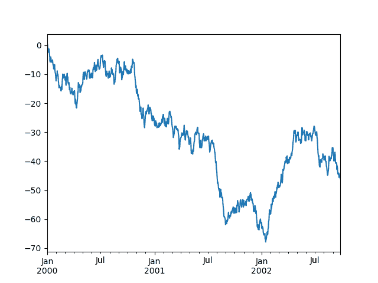
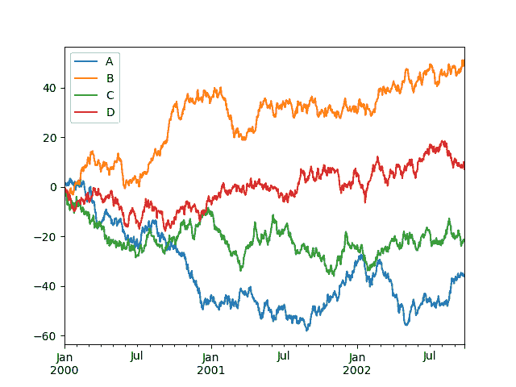

# pandas 十分钟入门

> 原文：[`pandas.pydata.org/docs/user_guide/10min.html`](https://pandas.pydata.org/docs/user_guide/10min.html)

这是针对新用户的 pandas 的简短介绍。您可以在食谱中查看更复杂的示例。

通常，我们按照以下方式导入：

```py
In [1]: import numpy as np

In [2]: import pandas as pd 
```

## pandas 中的基本数据结构

Pandas 提供了两种处理数据的类：

1.  `Series`：一个一维带标签的数组，保存任何类型的数据

    例如整数、字符串、Python 对象等。

1.  `DataFrame`：一种二维数据结构，类似于二维数组或带有行和列的表。

## 对象创建

参见数据结构介绍部分。

通过传递值列表来创建一个`Series`，让 pandas 创建一个默认的`RangeIndex`。

```py
In [3]: s = pd.Series([1, 3, 5, np.nan, 6, 8])

In [4]: s
Out[4]: 
0    1.0
1    3.0
2    5.0
3    NaN
4    6.0
5    8.0
dtype: float64 
```

通过传递具有日期时间索引和标记列的 NumPy 数组使用`date_range()`和标记列来创建一个`DataFrame`：

```py
In [5]: dates = pd.date_range("20130101", periods=6)

In [6]: dates
Out[6]: 
DatetimeIndex(['2013-01-01', '2013-01-02', '2013-01-03', '2013-01-04',
 '2013-01-05', '2013-01-06'],
 dtype='datetime64[ns]', freq='D')

In [7]: df = pd.DataFrame(np.random.randn(6, 4), index=dates, columns=list("ABCD"))

In [8]: df
Out[8]: 
 A         B         C         D
2013-01-01  0.469112 -0.282863 -1.509059 -1.135632
2013-01-02  1.212112 -0.173215  0.119209 -1.044236
2013-01-03 -0.861849 -2.104569 -0.494929  1.071804
2013-01-04  0.721555 -0.706771 -1.039575  0.271860
2013-01-05 -0.424972  0.567020  0.276232 -1.087401
2013-01-06 -0.673690  0.113648 -1.478427  0.524988 
```

通过传递一个对象字典来创建一个`DataFrame`，其中键是列标签，值是列值。

```py
In [9]: df2 = pd.DataFrame(
 ...:    {
 ...:        "A": 1.0,
 ...:        "B": pd.Timestamp("20130102"),
 ...:        "C": pd.Series(1, index=list(range(4)), dtype="float32"),
 ...:        "D": np.array([3] * 4, dtype="int32"),
 ...:        "E": pd.Categorical(["test", "train", "test", "train"]),
 ...:        "F": "foo",
 ...:    }
 ...: )
 ...: 

In [10]: df2
Out[10]: 
 A          B    C  D      E    F
0  1.0 2013-01-02  1.0  3   test  foo
1  1.0 2013-01-02  1.0  3  train  foo
2  1.0 2013-01-02  1.0  3   test  foo
3  1.0 2013-01-02  1.0  3  train  foo 
```

结果`DataFrame`的列具有不同的 dtypes：

```py
In [11]: df2.dtypes
Out[11]: 
A          float64
B    datetime64[s]
C          float32
D            int32
E         category
F           object
dtype: object 
```

如果您正在使用 IPython，则会自动启用列名（以及公共属性）的选项完成。这是将完成的属性的子集：

```py
In [12]: df2.<TAB>  # noqa: E225, E999
df2.A                  df2.bool
df2.abs                df2.boxplot
df2.add                df2.C
df2.add_prefix         df2.clip
df2.add_suffix         df2.columns
df2.align              df2.copy
df2.all                df2.count
df2.any                df2.combine
df2.append             df2.D
df2.apply              df2.describe
df2.applymap           df2.diff
df2.B                  df2.duplicated 
```

如您所见，列`A`、`B`、`C`和`D`都已自动完成。`E`和`F`也是如此；其余的属性由于篇幅被截断。

## 查看数据

参见基本功能部分。

使用`DataFrame.head()`和`DataFrame.tail()`分别查看框架的顶部和底部行：

```py
In [13]: df.head()
Out[13]: 
 A         B         C         D
2013-01-01  0.469112 -0.282863 -1.509059 -1.135632
2013-01-02  1.212112 -0.173215  0.119209 -1.044236
2013-01-03 -0.861849 -2.104569 -0.494929  1.071804
2013-01-04  0.721555 -0.706771 -1.039575  0.271860
2013-01-05 -0.424972  0.567020  0.276232 -1.087401

In [14]: df.tail(3)
Out[14]: 
 A         B         C         D
2013-01-04  0.721555 -0.706771 -1.039575  0.271860
2013-01-05 -0.424972  0.567020  0.276232 -1.087401
2013-01-06 -0.673690  0.113648 -1.478427  0.524988 
```

显示`DataFrame.index`或`DataFrame.columns`：

```py
In [15]: df.index
Out[15]: 
DatetimeIndex(['2013-01-01', '2013-01-02', '2013-01-03', '2013-01-04',
 '2013-01-05', '2013-01-06'],
 dtype='datetime64[ns]', freq='D')

In [16]: df.columns
Out[16]: Index(['A', 'B', 'C', 'D'], dtype='object') 
```

使用`DataFrame.to_numpy()`返回底层数据的 NumPy 表示形式，不包括索引或列标签：

```py
In [17]: df.to_numpy()
Out[17]: 
array([[ 0.4691, -0.2829, -1.5091, -1.1356],
 [ 1.2121, -0.1732,  0.1192, -1.0442],
 [-0.8618, -2.1046, -0.4949,  1.0718],
 [ 0.7216, -0.7068, -1.0396,  0.2719],
 [-0.425 ,  0.567 ,  0.2762, -1.0874],
 [-0.6737,  0.1136, -1.4784,  0.525 ]]) 
```

注意

**NumPy 数组整个数组有一个 dtype，而 pandas DataFrames 每列有一个 dtype**。当您调用 `DataFrame.to_numpy()`，pandas 将找到可以容纳 DataFrame 中 *所有* dtypes 的 NumPy dtype。如果通用数据类型是 `object`，`DataFrame.to_numpy()` 将需要复制数据。

```py
In [18]: df2.dtypes
Out[18]: 
A          float64
B    datetime64[s]
C          float32
D            int32
E         category
F           object
dtype: object

In [19]: df2.to_numpy()
Out[19]: 
array([[1.0, Timestamp('2013-01-02 00:00:00'), 1.0, 3, 'test', 'foo'],
 [1.0, Timestamp('2013-01-02 00:00:00'), 1.0, 3, 'train', 'foo'],
 [1.0, Timestamp('2013-01-02 00:00:00'), 1.0, 3, 'test', 'foo'],
 [1.0, Timestamp('2013-01-02 00:00:00'), 1.0, 3, 'train', 'foo']],
 dtype=object) 
```

`describe()` 显示数据的快速统计摘要：

```py
In [20]: df.describe()
Out[20]: 
 A         B         C         D
count  6.000000  6.000000  6.000000  6.000000
mean   0.073711 -0.431125 -0.687758 -0.233103
std    0.843157  0.922818  0.779887  0.973118
min   -0.861849 -2.104569 -1.509059 -1.135632
25%   -0.611510 -0.600794 -1.368714 -1.076610
50%    0.022070 -0.228039 -0.767252 -0.386188
75%    0.658444  0.041933 -0.034326  0.461706
max    1.212112  0.567020  0.276232  1.071804 
```

转置您的数据：

```py
In [21]: df.T
Out[21]: 
 2013-01-01  2013-01-02  2013-01-03  2013-01-04  2013-01-05  2013-01-06
A    0.469112    1.212112   -0.861849    0.721555   -0.424972   -0.673690
B   -0.282863   -0.173215   -2.104569   -0.706771    0.567020    0.113648
C   -1.509059    0.119209   -0.494929   -1.039575    0.276232   -1.478427
D   -1.135632   -1.044236    1.071804    0.271860   -1.087401    0.524988 
```

`DataFrame.sort_index()` 按轴排序：

```py
In [22]: df.sort_index(axis=1, ascending=False)
Out[22]: 
 D         C         B         A
2013-01-01 -1.135632 -1.509059 -0.282863  0.469112
2013-01-02 -1.044236  0.119209 -0.173215  1.212112
2013-01-03  1.071804 -0.494929 -2.104569 -0.861849
2013-01-04  0.271860 -1.039575 -0.706771  0.721555
2013-01-05 -1.087401  0.276232  0.567020 -0.424972
2013-01-06  0.524988 -1.478427  0.113648 -0.673690 
```

`DataFrame.sort_values()` 按值排序：

```py
In [23]: df.sort_values(by="B")
Out[23]: 
 A         B         C         D
2013-01-03 -0.861849 -2.104569 -0.494929  1.071804
2013-01-04  0.721555 -0.706771 -1.039575  0.271860
2013-01-01  0.469112 -0.282863 -1.509059 -1.135632
2013-01-02  1.212112 -0.173215  0.119209 -1.044236
2013-01-06 -0.673690  0.113648 -1.478427  0.524988
2013-01-05 -0.424972  0.567020  0.276232 -1.087401 
```

## 选择

注意

当选择和设置标准 Python / NumPy 表达式对于交互式工作来说直观且方便，但对于生产代码，我们推荐优化的 pandas 数据访问方法，`DataFrame.at()`，`DataFrame.iat()`，`DataFrame.loc()` 和 `DataFrame.iloc()`。

查看索引文档 索引和选择数据 和 MultiIndex / 高级索引。

### Getitem (`[]`)

对于 `DataFrame`，传递单个标签选择一个列并产生等同于 `df.A` 的 `Series`：

```py
In [24]: df["A"]
Out[24]: 
2013-01-01    0.469112
2013-01-02    1.212112
2013-01-03   -0.861849
2013-01-04    0.721555
2013-01-05   -0.424972
2013-01-06   -0.673690
Freq: D, Name: A, dtype: float64 
```

对于 `DataFrame`，传递一个切片 `:` 选择匹配的行：

```py
In [25]: df[0:3]
Out[25]: 
 A         B         C         D
2013-01-01  0.469112 -0.282863 -1.509059 -1.135632
2013-01-02  1.212112 -0.173215  0.119209 -1.044236
2013-01-03 -0.861849 -2.104569 -0.494929  1.071804

In [26]: df["20130102":"20130104"]
Out[26]: 
 A         B         C         D
2013-01-02  1.212112 -0.173215  0.119209 -1.044236
2013-01-03 -0.861849 -2.104569 -0.494929  1.071804
2013-01-04  0.721555 -0.706771 -1.039575  0.271860 
```

### 按标签选择

在 按标签选择 中查看更多使用 `DataFrame.loc()` 或 `DataFrame.at()`。

选择匹配标签的行：

```py
In [27]: df.loc[dates[0]]
Out[27]: 
A    0.469112
B   -0.282863
C   -1.509059
D   -1.135632
Name: 2013-01-01 00:00:00, dtype: float64 
```

选择所有行（`:`）与选择列标签：

```py
In [28]: df.loc[:, ["A", "B"]]
Out[28]: 
 A         B
2013-01-01  0.469112 -0.282863
2013-01-02  1.212112 -0.173215
2013-01-03 -0.861849 -2.104569
2013-01-04  0.721555 -0.706771
2013-01-05 -0.424972  0.567020
2013-01-06 -0.673690  0.113648 
```

对于标签切片，两个端点都是 *包含* 的：

```py
In [29]: df.loc["20130102":"20130104", ["A", "B"]]
Out[29]: 
 A         B
2013-01-02  1.212112 -0.173215
2013-01-03 -0.861849 -2.104569
2013-01-04  0.721555 -0.706771 
```

选择单行和列标签返回一个标量：

```py
In [30]: df.loc[dates[0], "A"]
Out[30]: 0.4691122999071863 
```

为了快速访问标量（等同于先前的方法）：

```py
In [31]: df.at[dates[0], "A"]
Out[31]: 0.4691122999071863 
```

### 按位置选择

在按位置选择中使用`DataFrame.iloc()`或`DataFrame.iat()`查看更多。

通过传递的整数位置选择：

```py
In [32]: df.iloc[3]
Out[32]: 
A    0.721555
B   -0.706771
C   -1.039575
D    0.271860
Name: 2013-01-04 00:00:00, dtype: float64 
```

整数切片类似于 NumPy/Python：

```py
In [33]: df.iloc[3:5, 0:2]
Out[33]: 
 A         B
2013-01-04  0.721555 -0.706771
2013-01-05 -0.424972  0.567020 
```

整数位置位置的列表：

```py
In [34]: df.iloc[[1, 2, 4], [0, 2]]
Out[34]: 
 A         C
2013-01-02  1.212112  0.119209
2013-01-03 -0.861849 -0.494929
2013-01-05 -0.424972  0.276232 
```

明确切片行：

```py
In [35]: df.iloc[1:3, :]
Out[35]: 
 A         B         C         D
2013-01-02  1.212112 -0.173215  0.119209 -1.044236
2013-01-03 -0.861849 -2.104569 -0.494929  1.071804 
```

明确切片列：

```py
In [36]: df.iloc[:, 1:3]
Out[36]: 
 B         C
2013-01-01 -0.282863 -1.509059
2013-01-02 -0.173215  0.119209
2013-01-03 -2.104569 -0.494929
2013-01-04 -0.706771 -1.039575
2013-01-05  0.567020  0.276232
2013-01-06  0.113648 -1.478427 
```

明确获取一个值：

```py
In [37]: df.iloc[1, 1]
Out[37]: -0.17321464905330858 
```

快速访问标量（等同于先前的方法）：

```py
In [38]: df.iat[1, 1]
Out[38]: -0.17321464905330858 
```

### 布尔索引

选择`df.A`大于`0`的行。

```py
In [39]: df[df["A"] > 0]
Out[39]: 
 A         B         C         D
2013-01-01  0.469112 -0.282863 -1.509059 -1.135632
2013-01-02  1.212112 -0.173215  0.119209 -1.044236
2013-01-04  0.721555 -0.706771 -1.039575  0.271860 
```

从满足布尔条件的`DataFrame`中选择值：

```py
In [40]: df[df > 0]
Out[40]: 
 A         B         C         D
2013-01-01  0.469112       NaN       NaN       NaN
2013-01-02  1.212112       NaN  0.119209       NaN
2013-01-03       NaN       NaN       NaN  1.071804
2013-01-04  0.721555       NaN       NaN  0.271860
2013-01-05       NaN  0.567020  0.276232       NaN
2013-01-06       NaN  0.113648       NaN  0.524988 
```

使用`isin()`方法进行过滤：

```py
In [41]: df2 = df.copy()

In [42]: df2["E"] = ["one", "one", "two", "three", "four", "three"]

In [43]: df2
Out[43]: 
 A         B         C         D      E
2013-01-01  0.469112 -0.282863 -1.509059 -1.135632    one
2013-01-02  1.212112 -0.173215  0.119209 -1.044236    one
2013-01-03 -0.861849 -2.104569 -0.494929  1.071804    two
2013-01-04  0.721555 -0.706771 -1.039575  0.271860  three
2013-01-05 -0.424972  0.567020  0.276232 -1.087401   four
2013-01-06 -0.673690  0.113648 -1.478427  0.524988  three

In [44]: df2[df2["E"].isin(["two", "four"])]
Out[44]: 
 A         B         C         D     E
2013-01-03 -0.861849 -2.104569 -0.494929  1.071804   two
2013-01-05 -0.424972  0.567020  0.276232 -1.087401  four 
```

### 设置

设置新列会自动通过索引对齐数据：

```py
In [45]: s1 = pd.Series([1, 2, 3, 4, 5, 6], index=pd.date_range("20130102", periods=6))

In [46]: s1
Out[46]: 
2013-01-02    1
2013-01-03    2
2013-01-04    3
2013-01-05    4
2013-01-06    5
2013-01-07    6
Freq: D, dtype: int64

In [47]: df["F"] = s1 
```

按标签设置值：

```py
In [48]: df.at[dates[0], "A"] = 0 
```

按位置设置值：

```py
In [49]: df.iat[0, 1] = 0 
```

通过分配 NumPy 数组进行设置：

```py
In [50]: df.loc[:, "D"] = np.array([5] * len(df)) 
```

先前设置操作的结果：

```py
In [51]: df
Out[51]: 
 A         B         C    D    F
2013-01-01  0.000000  0.000000 -1.509059  5.0  NaN
2013-01-02  1.212112 -0.173215  0.119209  5.0  1.0
2013-01-03 -0.861849 -2.104569 -0.494929  5.0  2.0
2013-01-04  0.721555 -0.706771 -1.039575  5.0  3.0
2013-01-05 -0.424972  0.567020  0.276232  5.0  4.0
2013-01-06 -0.673690  0.113648 -1.478427  5.0  5.0 
```

使用设置的`where`操作：

```py
In [52]: df2 = df.copy()

In [53]: df2[df2 > 0] = -df2

In [54]: df2
Out[54]: 
 A         B         C    D    F
2013-01-01  0.000000  0.000000 -1.509059 -5.0  NaN
2013-01-02 -1.212112 -0.173215 -0.119209 -5.0 -1.0
2013-01-03 -0.861849 -2.104569 -0.494929 -5.0 -2.0
2013-01-04 -0.721555 -0.706771 -1.039575 -5.0 -3.0
2013-01-05 -0.424972 -0.567020 -0.276232 -5.0 -4.0
2013-01-06 -0.673690 -0.113648 -1.478427 -5.0 -5.0 
```

## 缺失数据

对于 NumPy 数据类型，`np.nan`表示缺失数据。默认情况下不包括在计算中。请参阅缺失数据部分。

重新索引允许您在指定轴上更改/添加/删除索引。这将返回数据的副本：

```py
In [55]: df1 = df.reindex(index=dates[0:4], columns=list(df.columns) + ["E"])

In [56]: df1.loc[dates[0] : dates[1], "E"] = 1

In [57]: df1
Out[57]: 
 A         B         C    D    F    E
2013-01-01  0.000000  0.000000 -1.509059  5.0  NaN  1.0
2013-01-02  1.212112 -0.173215  0.119209  5.0  1.0  1.0
2013-01-03 -0.861849 -2.104569 -0.494929  5.0  2.0  NaN
2013-01-04  0.721555 -0.706771 -1.039575  5.0  3.0  NaN 
```

`DataFrame.dropna()`删除任何具有缺失数据的行：

```py
In [58]: df1.dropna(how="any")
Out[58]: 
 A         B         C    D    F    E
2013-01-02  1.212112 -0.173215  0.119209  5.0  1.0  1.0 
```

`DataFrame.fillna()`填充缺失数据：

```py
In [59]: df1.fillna(value=5)
Out[59]: 
 A         B         C    D    F    E
2013-01-01  0.000000  0.000000 -1.509059  5.0  5.0  1.0
2013-01-02  1.212112 -0.173215  0.119209  5.0  1.0  1.0
2013-01-03 -0.861849 -2.104569 -0.494929  5.0  2.0  5.0
2013-01-04  0.721555 -0.706771 -1.039575  5.0  3.0  5.0 
```

`isna()`获取值为`nan`的布尔掩码：

```py
In [60]: pd.isna(df1)
Out[60]: 
 A      B      C      D      F      E
2013-01-01  False  False  False  False   True  False
2013-01-02  False  False  False  False  False  False
2013-01-03  False  False  False  False  False   True
2013-01-04  False  False  False  False  False   True 
```

## 操作

在二进制运算基础部分查看更多。

### 统计

一般操作*排除*缺失数据。

计算每列的平均值：

```py
In [61]: df.mean()
Out[61]: 
A   -0.004474
B   -0.383981
C   -0.687758
D    5.000000
F    3.000000
dtype: float64 
```

计算每行的平均值：

```py
In [62]: df.mean(axis=1)
Out[62]: 
2013-01-01    0.872735
2013-01-02    1.431621
2013-01-03    0.707731
2013-01-04    1.395042
2013-01-05    1.883656
2013-01-06    1.592306
Freq: D, dtype: float64 
```

与具有不同索引或列的另一个`Series`或`DataFrame`进行操作将使结果与索引或列标签的并集对齐。此外，pandas 会沿指定维度自动广播，并将未对齐的标签填充为`np.nan`。

```py
In [63]: s = pd.Series([1, 3, 5, np.nan, 6, 8], index=dates).shift(2)

In [64]: s
Out[64]: 
2013-01-01    NaN
2013-01-02    NaN
2013-01-03    1.0
2013-01-04    3.0
2013-01-05    5.0
2013-01-06    NaN
Freq: D, dtype: float64

In [65]: df.sub(s, axis="index")
Out[65]: 
 A         B         C    D    F
2013-01-01       NaN       NaN       NaN  NaN  NaN
2013-01-02       NaN       NaN       NaN  NaN  NaN
2013-01-03 -1.861849 -3.104569 -1.494929  4.0  1.0
2013-01-04 -2.278445 -3.706771 -4.039575  2.0  0.0
2013-01-05 -5.424972 -4.432980 -4.723768  0.0 -1.0
2013-01-06       NaN       NaN       NaN  NaN  NaN 
```

### 用户定义的函数

`DataFrame.agg()`和`DataFrame.transform()`应用一个用户定义的函数，分别减少或广播其结果。

```py
In [66]: df.agg(lambda x: np.mean(x) * 5.6)
Out[66]: 
A    -0.025054
B    -2.150294
C    -3.851445
D    28.000000
F    16.800000
dtype: float64

In [67]: df.transform(lambda x: x * 101.2)
Out[67]: 
 A           B           C      D      F
2013-01-01    0.000000    0.000000 -152.716721  506.0    NaN
2013-01-02  122.665737  -17.529322   12.063922  506.0  101.2
2013-01-03  -87.219115 -212.982405  -50.086843  506.0  202.4
2013-01-04   73.021382  -71.525239 -105.204988  506.0  303.6
2013-01-05  -43.007200   57.382459   27.954680  506.0  404.8
2013-01-06  -68.177398   11.501219 -149.616767  506.0  506.0 
```

### 值计数

在直方图和离散化中查看更多。

```py
In [68]: s = pd.Series(np.random.randint(0, 7, size=10))

In [69]: s
Out[69]: 
0    4
1    2
2    1
3    2
4    6
5    4
6    4
7    6
8    4
9    4
dtype: int64

In [70]: s.value_counts()
Out[70]: 
4    5
2    2
6    2
1    1
Name: count, dtype: int64 
```

### 字符串方法

`Series`配备了一组字符串处理方法，位于`str`属性中，使得可以轻松地对数组的每个元素进行操作，如下面的代码片段所示。更多信息请参阅矢量化字符串方法。

```py
In [71]: s = pd.Series(["A", "B", "C", "Aaba", "Baca", np.nan, "CABA", "dog", "cat"])

In [72]: s.str.lower()
Out[72]: 
0       a
1       b
2       c
3    aaba
4    baca
5     NaN
6    caba
7     dog
8     cat
dtype: object 
```

## 合并

### 连接

pandas 提供了各种便捷的功能，可以轻松地将`Series`和`DataFrame`对象结合在一起，对索引进行各种类型的集合逻辑操作，并在联接/合并类型操作中提供关系代数功能。

查看合并部分。

使用`concat()`将 pandas 对象沿行连接在一起：

```py
In [73]: df = pd.DataFrame(np.random.randn(10, 4))

In [74]: df
Out[74]: 
 0         1         2         3
0 -0.548702  1.467327 -1.015962 -0.483075
1  1.637550 -1.217659 -0.291519 -1.745505
2 -0.263952  0.991460 -0.919069  0.266046
3 -0.709661  1.669052  1.037882 -1.705775
4 -0.919854 -0.042379  1.247642 -0.009920
5  0.290213  0.495767  0.362949  1.548106
6 -1.131345 -0.089329  0.337863 -0.945867
7 -0.932132  1.956030  0.017587 -0.016692
8 -0.575247  0.254161 -1.143704  0.215897
9  1.193555 -0.077118 -0.408530 -0.862495

# break it into pieces
In [75]: pieces = [df[:3], df[3:7], df[7:]]

In [76]: pd.concat(pieces)
Out[76]: 
 0         1         2         3
0 -0.548702  1.467327 -1.015962 -0.483075
1  1.637550 -1.217659 -0.291519 -1.745505
2 -0.263952  0.991460 -0.919069  0.266046
3 -0.709661  1.669052  1.037882 -1.705775
4 -0.919854 -0.042379  1.247642 -0.009920
5  0.290213  0.495767  0.362949  1.548106
6 -1.131345 -0.089329  0.337863 -0.945867
7 -0.932132  1.956030  0.017587 -0.016692
8 -0.575247  0.254161 -1.143704  0.215897
9  1.193555 -0.077118 -0.408530 -0.862495 
```

注意

向`DataFrame`添加列相对较快。但是，添加行需要复制，可能会很昂贵。我们建议将预先构建的记录列表传递给`DataFrame`构造函数，而不是通过迭代附加记录来构建`DataFrame`。

### 连接

`merge()`可以在特定列上启用 SQL 风格的连接类型。请参阅数据库风格连接部分。

```py
In [77]: left = pd.DataFrame({"key": ["foo", "foo"], "lval": [1, 2]})

In [78]: right = pd.DataFrame({"key": ["foo", "foo"], "rval": [4, 5]})

In [79]: left
Out[79]: 
 key  lval
0  foo     1
1  foo     2

In [80]: right
Out[80]: 
 key  rval
0  foo     4
1  foo     5

In [81]: pd.merge(left, right, on="key")
Out[81]: 
 key  lval  rval
0  foo     1     4
1  foo     1     5
2  foo     2     4
3  foo     2     5 
```

在唯一键上进行`merge()`：

```py
In [82]: left = pd.DataFrame({"key": ["foo", "bar"], "lval": [1, 2]})

In [83]: right = pd.DataFrame({"key": ["foo", "bar"], "rval": [4, 5]})

In [84]: left
Out[84]: 
 key  lval
0  foo     1
1  bar     2

In [85]: right
Out[85]: 
 key  rval
0  foo     4
1  bar     5

In [86]: pd.merge(left, right, on="key")
Out[86]: 
 key  lval  rval
0  foo     1     4
1  bar     2     5 
```

## 分组

通过“分组”我们指的是涉及以下一个或多个步骤的过程：

+   根据某些标准将数据分组

+   对每个组独立应用函数

+   将结果组合成数据结构

查看分组部分。

```py
In [87]: df = pd.DataFrame(
 ....:    {
 ....:        "A": ["foo", "bar", "foo", "bar", "foo", "bar", "foo", "foo"],
 ....:        "B": ["one", "one", "two", "three", "two", "two", "one", "three"],
 ....:        "C": np.random.randn(8),
 ....:        "D": np.random.randn(8),
 ....:    }
 ....: )
 ....: 

In [88]: df
Out[88]: 
 A      B         C         D
0  foo    one  1.346061 -1.577585
1  bar    one  1.511763  0.396823
2  foo    two  1.627081 -0.105381
3  bar  three -0.990582 -0.532532
4  foo    two -0.441652  1.453749
5  bar    two  1.211526  1.208843
6  foo    one  0.268520 -0.080952
7  foo  three  0.024580 -0.264610 
```

按列标签分组，选择列标签，然后对结果组应用`DataFrameGroupBy.sum()`函数：

```py
In [89]: df.groupby("A")[["C", "D"]].sum()
Out[89]: 
 C         D
A 
bar  1.732707  1.073134
foo  2.824590 -0.574779 
```

按多个列标签形式进行分组形成`MultiIndex`。

```py
In [90]: df.groupby(["A", "B"]).sum()
Out[90]: 
 C         D
A   B 
bar one    1.511763  0.396823
 three -0.990582 -0.532532
 two    1.211526  1.208843
foo one    1.614581 -1.658537
 three  0.024580 -0.264610
 two    1.185429  1.348368 
```

## 重塑

请参阅分层索引和重塑部分。

### 堆叠

```py
In [91]: arrays = [
 ....:   ["bar", "bar", "baz", "baz", "foo", "foo", "qux", "qux"],
 ....:   ["one", "two", "one", "two", "one", "two", "one", "two"],
 ....: ]
 ....: 

In [92]: index = pd.MultiIndex.from_arrays(arrays, names=["first", "second"])

In [93]: df = pd.DataFrame(np.random.randn(8, 2), index=index, columns=["A", "B"])

In [94]: df2 = df[:4]

In [95]: df2
Out[95]: 
 A         B
first second 
bar   one    -0.727965 -0.589346
 two     0.339969 -0.693205
baz   one    -0.339355  0.593616
 two     0.884345  1.591431 
```

`stack()`方法在 DataFrame 的列中“压缩”了一个级别：

```py
In [96]: stacked = df2.stack(future_stack=True)

In [97]: stacked
Out[97]: 
first  second 
bar    one     A   -0.727965
 B   -0.589346
 two     A    0.339969
 B   -0.693205
baz    one     A   -0.339355
 B    0.593616
 two     A    0.884345
 B    1.591431
dtype: float64 
```

对于具有`MultiIndex`作为`index`的“堆叠”DataFrame 或 Series，`stack()`的逆操作是`unstack()`，默认情况下取消堆叠**最后一级**：

```py
In [98]: stacked.unstack()
Out[98]: 
 A         B
first second 
bar   one    -0.727965 -0.589346
 two     0.339969 -0.693205
baz   one    -0.339355  0.593616
 two     0.884345  1.591431

In [99]: stacked.unstack(1)
Out[99]: 
second        one       two
first 
bar   A -0.727965  0.339969
 B -0.589346 -0.693205
baz   A -0.339355  0.884345
 B  0.593616  1.591431

In [100]: stacked.unstack(0)
Out[100]: 
first          bar       baz
second 
one    A -0.727965 -0.339355
 B -0.589346  0.593616
two    A  0.339969  0.884345
 B -0.693205  1.591431 
```

### 透视表

查看透视表部分。

```py
In [101]: df = pd.DataFrame(
 .....:    {
 .....:        "A": ["one", "one", "two", "three"] * 3,
 .....:        "B": ["A", "B", "C"] * 4,
 .....:        "C": ["foo", "foo", "foo", "bar", "bar", "bar"] * 2,
 .....:        "D": np.random.randn(12),
 .....:        "E": np.random.randn(12),
 .....:    }
 .....: )
 .....: 

In [102]: df
Out[102]: 
 A  B    C         D         E
0     one  A  foo -1.202872  0.047609
1     one  B  foo -1.814470 -0.136473
2     two  C  foo  1.018601 -0.561757
3   three  A  bar -0.595447 -1.623033
4     one  B  bar  1.395433  0.029399
5     one  C  bar -0.392670 -0.542108
6     two  A  foo  0.007207  0.282696
7   three  B  foo  1.928123 -0.087302
8     one  C  foo -0.055224 -1.575170
9     one  A  bar  2.395985  1.771208
10    two  B  bar  1.552825  0.816482
11  three  C  bar  0.166599  1.100230 
```

`pivot_table()` 透视一个指定`values`、`index`和`columns`的`DataFrame`

```py
In [103]: pd.pivot_table(df, values="D", index=["A", "B"], columns=["C"])
Out[103]: 
C             bar       foo
A     B 
one   A  2.395985 -1.202872
 B  1.395433 -1.814470
 C -0.392670 -0.055224
three A -0.595447       NaN
 B       NaN  1.928123
 C  0.166599       NaN
two   A       NaN  0.007207
 B  1.552825       NaN
 C       NaN  1.018601 
```

## 时间序列

pandas 具有简单、强大和高效的功能，用于在频率转换期间执行重新采样操作（例如，将秒数据转换为 5 分钟数据）。这在金融应用中非常常见，但不限于此。请参阅时间序列部分。

```py
In [104]: rng = pd.date_range("1/1/2012", periods=100, freq="s")

In [105]: ts = pd.Series(np.random.randint(0, 500, len(rng)), index=rng)

In [106]: ts.resample("5Min").sum()
Out[106]: 
2012-01-01    24182
Freq: 5min, dtype: int64 
```

`Series.tz_localize()` 将一个时间序列本地化到一个时区：

```py
In [107]: rng = pd.date_range("3/6/2012 00:00", periods=5, freq="D")

In [108]: ts = pd.Series(np.random.randn(len(rng)), rng)

In [109]: ts
Out[109]: 
2012-03-06    1.857704
2012-03-07   -1.193545
2012-03-08    0.677510
2012-03-09   -0.153931
2012-03-10    0.520091
Freq: D, dtype: float64

In [110]: ts_utc = ts.tz_localize("UTC")

In [111]: ts_utc
Out[111]: 
2012-03-06 00:00:00+00:00    1.857704
2012-03-07 00:00:00+00:00   -1.193545
2012-03-08 00:00:00+00:00    0.677510
2012-03-09 00:00:00+00:00   -0.153931
2012-03-10 00:00:00+00:00    0.520091
Freq: D, dtype: float64 
```

`Series.tz_convert()` 将一个时区感知的时间序列转换到另一个时区：

```py
In [112]: ts_utc.tz_convert("US/Eastern")
Out[112]: 
2012-03-05 19:00:00-05:00    1.857704
2012-03-06 19:00:00-05:00   -1.193545
2012-03-07 19:00:00-05:00    0.677510
2012-03-08 19:00:00-05:00   -0.153931
2012-03-09 19:00:00-05:00    0.520091
Freq: D, dtype: float64 
```

向时间序列添加非固定持续时间（`BusinessDay`）：

```py
In [113]: rng
Out[113]: 
DatetimeIndex(['2012-03-06', '2012-03-07', '2012-03-08', '2012-03-09',
 '2012-03-10'],
 dtype='datetime64[ns]', freq='D')

In [114]: rng + pd.offsets.BusinessDay(5)
Out[114]: 
DatetimeIndex(['2012-03-13', '2012-03-14', '2012-03-15', '2012-03-16',
 '2012-03-16'],
 dtype='datetime64[ns]', freq=None) 
```

## 分类数据

pandas 可以在`DataFrame`中包含分类数���。有关完整文档，请参阅分类介绍和 API 文档。

```py
In [115]: df = pd.DataFrame(
 .....:    {"id": [1, 2, 3, 4, 5, 6], "raw_grade": ["a", "b", "b", "a", "a", "e"]}
 .....: )
 .....: 
```

将原始成绩转换为分类数据类型：

```py
In [116]: df["grade"] = df["raw_grade"].astype("category")

In [117]: df["grade"]
Out[117]: 
0    a
1    b
2    b
3    a
4    a
5    e
Name: grade, dtype: category
Categories (3, object): ['a', 'b', 'e'] 
```

将类别重命名为更有意义的名称：

```py
In [118]: new_categories = ["very good", "good", "very bad"]

In [119]: df["grade"] = df["grade"].cat.rename_categories(new_categories) 
```

重新排序类别并同时添加缺失的类别（`Series.cat()`下的方法默认返回一个新的`Series`）：

```py
In [120]: df["grade"] = df["grade"].cat.set_categories(
 .....:    ["very bad", "bad", "medium", "good", "very good"]
 .....: )
 .....: 

In [121]: df["grade"]
Out[121]: 
0    very good
1         good
2         good
3    very good
4    very good
5     very bad
Name: grade, dtype: category
Categories (5, object): ['very bad', 'bad', 'medium', 'good', 'very good'] 
```

排序按照类别中的顺序，而不是词法顺序：

```py
In [122]: df.sort_values(by="grade")
Out[122]: 
 id raw_grade      grade
5   6         e   very bad
1   2         b       good
2   3         b       good
0   1         a  very good
3   4         a  very good
4   5         a  very good 
```

通过具有`observed=False`的分类列进行分组也会显示空类别：

```py
In [123]: df.groupby("grade", observed=False).size()
Out[123]: 
grade
very bad     1
bad          0
medium       0
good         2
very good    3
dtype: int64 
```

## 绘图

查看绘图文档。

我们使用标准约定来引用 matplotlib API：

```py
In [124]: import matplotlib.pyplot as plt

In [125]: plt.close("all") 
```

使用 `plt.close` 方法来[关闭](https://matplotlib.org/stable/api/_as-gen/matplotlib.pyplot.close.html)一个图形窗口：

```py
In [126]: ts = pd.Series(np.random.randn(1000), index=pd.date_range("1/1/2000", periods=1000))

In [127]: ts = ts.cumsum()

In [128]: ts.plot(); 
```



注意

在 Jupyter 中使用`plot()`绘制图表。否则使用[matplotlib.pyplot.show](https://matplotlib.org/stable/api/_as_gen/matplotlib.pyplot.show.html)显示图表，或者使用[matplotlib.pyplot.savefig](https://matplotlib.org/stable/api/_as_gen/matplotlib.pyplot.savefig.html)将图表写入文件。

`plot()`绘制所有列：

```py
In [129]: df = pd.DataFrame(
 .....:    np.random.randn(1000, 4), index=ts.index, columns=["A", "B", "C", "D"]
 .....: )
 .....: 

In [130]: df = df.cumsum()

In [131]: plt.figure();

In [132]: df.plot();

In [133]: plt.legend(loc='best'); 
```



## 导入和导出数据

查看 IO 工具部分。

### CSV

写入 csv 文件：使用`DataFrame.to_csv()`

```py
In [134]: df = pd.DataFrame(np.random.randint(0, 5, (10, 5)))

In [135]: df.to_csv("foo.csv") 
```

从 csv 文件中读取：使用`read_csv()`

```py
In [136]: pd.read_csv("foo.csv")
Out[136]: 
 Unnamed: 0  0  1  2  3  4
0           0  4  3  1  1  2
1           1  1  0  2  3  2
2           2  1  4  2  1  2
3           3  0  4  0  2  2
4           4  4  2  2  3  4
5           5  4  0  4  3  1
6           6  2  1  2  0  3
7           7  4  0  4  4  4
8           8  4  4  1  0  1
9           9  0  4  3  0  3 
```

### Parquet

写入 Parquet 文件：

```py
In [137]: df.to_parquet("foo.parquet") 
```

使用`read_parquet()`从 Parquet 文件存储中读取：

```py
In [138]: pd.read_parquet("foo.parquet")
Out[138]: 
 0  1  2  3  4
0  4  3  1  1  2
1  1  0  2  3  2
2  1  4  2  1  2
3  0  4  0  2  2
4  4  2  2  3  4
5  4  0  4  3  1
6  2  1  2  0  3
7  4  0  4  4  4
8  4  4  1  0  1
9  0  4  3  0  3 
```

### Excel

读取和写入 Excel。

使用`DataFrame.to_excel()`将数据写入 excel 文件：

```py
In [139]: df.to_excel("foo.xlsx", sheet_name="Sheet1") 
```

使用`read_excel()`���excel 文件中读取：

```py
In [140]: pd.read_excel("foo.xlsx", "Sheet1", index_col=None, na_values=["NA"])
Out[140]: 
 Unnamed: 0  0  1  2  3  4
0           0  4  3  1  1  2
1           1  1  0  2  3  2
2           2  1  4  2  1  2
3           3  0  4  0  2  2
4           4  4  2  2  3  4
5           5  4  0  4  3  1
6           6  2  1  2  0  3
7           7  4  0  4  4  4
8           8  4  4  1  0  1
9           9  0  4  3  0  3 
```

## 注意事项

如果您尝试在`Series`或`DataFrame`上执行布尔操作，可能会看到异常，如：

```py
In [141]: if pd.Series([False, True, False]):
 .....:     print("I was true")
 .....: 
---------------------------------------------------------------------------
ValueError  Traceback (most recent call last)
<ipython-input-141-b27eb9c1dfc0> in ?()
----> 1 if pd.Series([False, True, False]):
  2      print("I was true")

~/work/pandas/pandas/pandas/core/generic.py in ?(self)
  1575     @final
  1576     def __nonzero__(self) -> NoReturn:
-> 1577         raise ValueError(
  1578             f"The truth value of a {type(self).__name__} is ambiguous. "
  1579             "Use a.empty, a.bool(), a.item(), a.any() or a.all()."
  1580         )

ValueError: The truth value of a Series is ambiguous. Use a.empty, a.bool(), a.item(), a.any() or a.all(). 
```

查看比较和注意事项以获取解释和处理方法。

## Pandas 中的基本数据结构

Pandas 提供了两种处理数据的类：

1.  `Series`：一个持有任何类型数据的一维标记数组

    例如整数、字符串、Python 对象等。

1.  `DataFrame`：一个二维数据结构，类似于二维数组或具有行和列的表格。

## 对象创建

查看数据结构简介部分。

通过传递值列表创建`Series`，让 pandas 创建默认的`RangeIndex`。

```py
In [3]: s = pd.Series([1, 3, 5, np.nan, 6, 8])

In [4]: s
Out[4]: 
0    1.0
1    3.0
2    5.0
3    NaN
4    6.0
5    8.0
dtype: float64 
```

通过使用`date_range()`和标记列，通过传递具有日期时间索引的 NumPy 数组创建`DataFrame`：

```py
In [5]: dates = pd.date_range("20130101", periods=6)

In [6]: dates
Out[6]: 
DatetimeIndex(['2013-01-01', '2013-01-02', '2013-01-03', '2013-01-04',
 '2013-01-05', '2013-01-06'],
 dtype='datetime64[ns]', freq='D')

In [7]: df = pd.DataFrame(np.random.randn(6, 4), index=dates, columns=list("ABCD"))

In [8]: df
Out[8]: 
 A         B         C         D
2013-01-01  0.469112 -0.282863 -1.509059 -1.135632
2013-01-02  1.212112 -0.173215  0.119209 -1.044236
2013-01-03 -0.861849 -2.104569 -0.494929  1.071804
2013-01-04  0.721555 -0.706771 -1.039575  0.271860
2013-01-05 -0.424972  0.567020  0.276232 -1.087401
2013-01-06 -0.673690  0.113648 -1.478427  0.524988 
```

通过传递一个字典对象创建一个`DataFrame`，其中键是列标签，值是列值。

```py
In [9]: df2 = pd.DataFrame(
 ...:    {
 ...:        "A": 1.0,
 ...:        "B": pd.Timestamp("20130102"),
 ...:        "C": pd.Series(1, index=list(range(4)), dtype="float32"),
 ...:        "D": np.array([3] * 4, dtype="int32"),
 ...:        "E": pd.Categorical(["test", "train", "test", "train"]),
 ...:        "F": "foo",
 ...:    }
 ...: )
 ...: 

In [10]: df2
Out[10]: 
 A          B    C  D      E    F
0  1.0 2013-01-02  1.0  3   test  foo
1  1.0 2013-01-02  1.0  3  train  foo
2  1.0 2013-01-02  1.0  3   test  foo
3  1.0 2013-01-02  1.0  3  train  foo 
```

结果`DataFrame`的列具有不同的 dtypes：

```py
In [11]: df2.dtypes
Out[11]: 
A          float64
B    datetime64[s]
C          float32
D            int32
E         category
F           object
dtype: object 
```

如果你正在使用 IPython，列名（以及公共属性）的制表符自动完成功能已经启用。以下是将被自动完成的属性的子集：

```py
In [12]: df2.<TAB>  # noqa: E225, E999
df2.A                  df2.bool
df2.abs                df2.boxplot
df2.add                df2.C
df2.add_prefix         df2.clip
df2.add_suffix         df2.columns
df2.align              df2.copy
df2.all                df2.count
df2.any                df2.combine
df2.append             df2.D
df2.apply              df2.describe
df2.applymap           df2.diff
df2.B                  df2.duplicated 
```

正如你所看到的，列`A`、`B`、`C`和`D`已经自动完成。`E`和`F`也在其中；其余属性由于简洁起见已被截断。

## 查看数据

查看基本功能部分。

使用`DataFrame.head()`和`DataFrame.tail()`分别查看框架的顶部和底部行：

```py
In [13]: df.head()
Out[13]: 
 A         B         C         D
2013-01-01  0.469112 -0.282863 -1.509059 -1.135632
2013-01-02  1.212112 -0.173215  0.119209 -1.044236
2013-01-03 -0.861849 -2.104569 -0.494929  1.071804
2013-01-04  0.721555 -0.706771 -1.039575  0.271860
2013-01-05 -0.424972  0.567020  0.276232 -1.087401

In [14]: df.tail(3)
Out[14]: 
 A         B         C         D
2013-01-04  0.721555 -0.706771 -1.039575  0.271860
2013-01-05 -0.424972  0.567020  0.276232 -1.087401
2013-01-06 -0.673690  0.113648 -1.478427  0.524988 
```

显示`DataFrame.index`或`DataFrame.columns`：

```py
In [15]: df.index
Out[15]: 
DatetimeIndex(['2013-01-01', '2013-01-02', '2013-01-03', '2013-01-04',
 '2013-01-05', '2013-01-06'],
 dtype='datetime64[ns]', freq='D')

In [16]: df.columns
Out[16]: Index(['A', 'B', 'C', 'D'], dtype='object') 
```

使用`DataFrame.to_numpy()`返回底层数据的 NumPy 表示，不包括索引或列标签：

```py
In [17]: df.to_numpy()
Out[17]: 
array([[ 0.4691, -0.2829, -1.5091, -1.1356],
 [ 1.2121, -0.1732,  0.1192, -1.0442],
 [-0.8618, -2.1046, -0.4949,  1.0718],
 [ 0.7216, -0.7068, -1.0396,  0.2719],
 [-0.425 ,  0.567 ,  0.2762, -1.0874],
 [-0.6737,  0.1136, -1.4784,  0.525 ]]) 
```

注意

**NumPy 数组整个数组只有一个 dtype，而 pandas DataFrames 每列有一个 dtype**。当你调用`DataFrame.to_numpy()`时，pandas 会找到可以容纳 DataFrame 中*所有*dtypes 的 NumPy dtype。如果通用数据类型是`object`，`DataFrame.to_numpy()`将需要复制数据。

```py
In [18]: df2.dtypes
Out[18]: 
A          float64
B    datetime64[s]
C          float32
D            int32
E         category
F           object
dtype: object

In [19]: df2.to_numpy()
Out[19]: 
array([[1.0, Timestamp('2013-01-02 00:00:00'), 1.0, 3, 'test', 'foo'],
 [1.0, Timestamp('2013-01-02 00:00:00'), 1.0, 3, 'train', 'foo'],
 [1.0, Timestamp('2013-01-02 00:00:00'), 1.0, 3, 'test', 'foo'],
 [1.0, Timestamp('2013-01-02 00:00:00'), 1.0, 3, 'train', 'foo']],
 dtype=object) 
```

`describe()`显示数据的快速统计摘要：

```py
In [20]: df.describe()
Out[20]: 
 A         B         C         D
count  6.000000  6.000000  6.000000  6.000000
mean   0.073711 -0.431125 -0.687758 -0.233103
std    0.843157  0.922818  0.779887  0.973118
min   -0.861849 -2.104569 -1.509059 -1.135632
25%   -0.611510 -0.600794 -1.368714 -1.076610
50%    0.022070 -0.228039 -0.767252 -0.386188
75%    0.658444  0.041933 -0.034326  0.461706
max    1.212112  0.567020  0.276232  1.071804 
```

转置你的数据：

```py
In [21]: df.T
Out[21]: 
 2013-01-01  2013-01-02  2013-01-03  2013-01-04  2013-01-05  2013-01-06
A    0.469112    1.212112   -0.861849    0.721555   -0.424972   -0.673690
B   -0.282863   -0.173215   -2.104569   -0.706771    0.567020    0.113648
C   -1.509059    0.119209   -0.494929   -1.039575    0.276232   -1.478427
D   -1.135632   -1.044236    1.071804    0.271860   -1.087401    0.524988 
```

`DataFrame.sort_index()`按轴排序：

```py
In [22]: df.sort_index(axis=1, ascending=False)
Out[22]: 
 D         C         B         A
2013-01-01 -1.135632 -1.509059 -0.282863  0.469112
2013-01-02 -1.044236  0.119209 -0.173215  1.212112
2013-01-03  1.071804 -0.494929 -2.104569 -0.861849
2013-01-04  0.271860 -1.039575 -0.706771  0.721555
2013-01-05 -1.087401  0.276232  0.567020 -0.424972
2013-01-06  0.524988 -1.478427  0.113648 -0.673690 
```

`DataFrame.sort_values()`按值排序：

```py
In [23]: df.sort_values(by="B")
Out[23]: 
 A         B         C         D
2013-01-03 -0.861849 -2.104569 -0.494929  1.071804
2013-01-04  0.721555 -0.706771 -1.039575  0.271860
2013-01-01  0.469112 -0.282863 -1.509059 -1.135632
2013-01-02  1.212112 -0.173215  0.119209 -1.044236
2013-01-06 -0.673690  0.113648 -1.478427  0.524988
2013-01-05 -0.424972  0.567020  0.276232 -1.087401 
```

## 选择

注意

虽然用于选择和设置的标准 Python/NumPy 表达式直观且对交互式工作很方便，但对于生产代码，我们建议使用优化的 pandas 数据访问方法，`DataFrame.at()`，`DataFrame.iat()`，`DataFrame.loc()`和`DataFrame.iloc()`。

查看索引文档索引和选择数据和 MultiIndex /高级索引。

### 获取项（`[]`）

对于`DataFrame`，传递单个标签选择列并产生等同于`df.A`的`Series`：

```py
In [24]: df["A"]
Out[24]: 
2013-01-01    0.469112
2013-01-02    1.212112
2013-01-03   -0.861849
2013-01-04    0.721555
2013-01-05   -0.424972
2013-01-06   -0.673690
Freq: D, Name: A, dtype: float64 
```

对于`DataFrame`，传递切片`:`选择匹配的行：

```py
In [25]: df[0:3]
Out[25]: 
 A         B         C         D
2013-01-01  0.469112 -0.282863 -1.509059 -1.135632
2013-01-02  1.212112 -0.173215  0.119209 -1.044236
2013-01-03 -0.861849 -2.104569 -0.494929  1.071804

In [26]: df["20130102":"20130104"]
Out[26]: 
 A         B         C         D
2013-01-02  1.212112 -0.173215  0.119209 -1.044236
2013-01-03 -0.861849 -2.104569 -0.494929  1.071804
2013-01-04  0.721555 -0.706771 -1.039575  0.271860 
```

### 按标签选择

查看更多关于按标签选择的信息，使用`DataFrame.loc()`或`DataFrame.at()`。

选择匹配标签的行：

```py
In [27]: df.loc[dates[0]]
Out[27]: 
A    0.469112
B   -0.282863
C   -1.509059
D   -1.135632
Name: 2013-01-01 00:00:00, dtype: float64 
```

选择所有行（`:`）与选择列标签：

```py
In [28]: df.loc[:, ["A", "B"]]
Out[28]: 
 A         B
2013-01-01  0.469112 -0.282863
2013-01-02  1.212112 -0.173215
2013-01-03 -0.861849 -2.104569
2013-01-04  0.721555 -0.706771
2013-01-05 -0.424972  0.567020
2013-01-06 -0.673690  0.113648 
```

对于标签切片，两个端点都是*包含*的：

```py
In [29]: df.loc["20130102":"20130104", ["A", "B"]]
Out[29]: 
 A         B
2013-01-02  1.212112 -0.173215
2013-01-03 -0.861849 -2.104569
2013-01-04  0.721555 -0.706771 
```

选择单个行和列标签返回一个标量：

```py
In [30]: df.loc[dates[0], "A"]
Out[30]: 0.4691122999071863 
```

获取快速访问标量（等同于先前的方法）：

```py
In [31]: df.at[dates[0], "A"]
Out[31]: 0.4691122999071863 
```

### 按位置选择

查看更多关于按位置选择的信息，使用`DataFrame.iloc()`或`DataFrame.iat()`。

通过传递整数的位置选择：

```py
In [32]: df.iloc[3]
Out[32]: 
A    0.721555
B   -0.706771
C   -1.039575
D    0.271860
Name: 2013-01-04 00:00:00, dtype: float64 
```

整数切片类似于 NumPy/Python：

```py
In [33]: df.iloc[3:5, 0:2]
Out[33]: 
 A         B
2013-01-04  0.721555 -0.706771
2013-01-05 -0.424972  0.567020 
```

整数位置位置列表：

```py
In [34]: df.iloc[[1, 2, 4], [0, 2]]
Out[34]: 
 A         C
2013-01-02  1.212112  0.119209
2013-01-03 -0.861849 -0.494929
2013-01-05 -0.424972  0.276232 
```

明确切片行：

```py
In [35]: df.iloc[1:3, :]
Out[35]: 
 A         B         C         D
2013-01-02  1.212112 -0.173215  0.119209 -1.044236
2013-01-03 -0.861849 -2.104569 -0.494929  1.071804 
```

明确切片列：

```py
In [36]: df.iloc[:, 1:3]
Out[36]: 
 B         C
2013-01-01 -0.282863 -1.509059
2013-01-02 -0.173215  0.119209
2013-01-03 -2.104569 -0.494929
2013-01-04 -0.706771 -1.039575
2013-01-05  0.567020  0.276232
2013-01-06  0.113648 -1.478427 
```

明确获取值：

```py
In [37]: df.iloc[1, 1]
Out[37]: -0.17321464905330858 
```

获取快速访问标量（等同于先前的方法）：

```py
In [38]: df.iat[1, 1]
Out[38]: -0.17321464905330858 
```

### 布尔索引

选择`df.A`大于`0`的行。

```py
In [39]: df[df["A"] > 0]
Out[39]: 
 A         B         C         D
2013-01-01  0.469112 -0.282863 -1.509059 -1.135632
2013-01-02  1.212112 -0.173215  0.119209 -1.044236
2013-01-04  0.721555 -0.706771 -1.039575  0.271860 
```

从满足布尔条件的`DataFrame`中选择值：

```py
In [40]: df[df > 0]
Out[40]: 
 A         B         C         D
2013-01-01  0.469112       NaN       NaN       NaN
2013-01-02  1.212112       NaN  0.119209       NaN
2013-01-03       NaN       NaN       NaN  1.071804
2013-01-04  0.721555       NaN       NaN  0.271860
2013-01-05       NaN  0.567020  0.276232       NaN
2013-01-06       NaN  0.113648       NaN  0.524988 
```

使用`isin()`方法进行过滤：

```py
In [41]: df2 = df.copy()

In [42]: df2["E"] = ["one", "one", "two", "three", "four", "three"]

In [43]: df2
Out[43]: 
 A         B         C         D      E
2013-01-01  0.469112 -0.282863 -1.509059 -1.135632    one
2013-01-02  1.212112 -0.173215  0.119209 -1.044236    one
2013-01-03 -0.861849 -2.104569 -0.494929  1.071804    two
2013-01-04  0.721555 -0.706771 -1.039575  0.271860  three
2013-01-05 -0.424972  0.567020  0.276232 -1.087401   four
2013-01-06 -0.673690  0.113648 -1.478427  0.524988  three

In [44]: df2[df2["E"].isin(["two", "four"])]
Out[44]: 
 A         B         C         D     E
2013-01-03 -0.861849 -2.104569 -0.494929  1.071804   two
2013-01-05 -0.424972  0.567020  0.276232 -1.087401  four 
```

### 设置

设置新列会自动根据索引对齐数据：

```py
In [45]: s1 = pd.Series([1, 2, 3, 4, 5, 6], index=pd.date_range("20130102", periods=6))

In [46]: s1
Out[46]: 
2013-01-02    1
2013-01-03    2
2013-01-04    3
2013-01-05    4
2013-01-06    5
2013-01-07    6
Freq: D, dtype: int64

In [47]: df["F"] = s1 
```

按标签设置值：

```py
In [48]: df.at[dates[0], "A"] = 0 
```

按位置设置值：

```py
In [49]: df.iat[0, 1] = 0 
```

通过分配 NumPy 数组进行设置：

```py
In [50]: df.loc[:, "D"] = np.array([5] * len(df)) 
```

先前设置操作的结果：

```py
In [51]: df
Out[51]: 
 A         B         C    D    F
2013-01-01  0.000000  0.000000 -1.509059  5.0  NaN
2013-01-02  1.212112 -0.173215  0.119209  5.0  1.0
2013-01-03 -0.861849 -2.104569 -0.494929  5.0  2.0
2013-01-04  0.721555 -0.706771 -1.039575  5.0  3.0
2013-01-05 -0.424972  0.567020  0.276232  5.0  4.0
2013-01-06 -0.673690  0.113648 -1.478427  5.0  5.0 
```

具有设置的`where`操作：

```py
In [52]: df2 = df.copy()

In [53]: df2[df2 > 0] = -df2

In [54]: df2
Out[54]: 
 A         B         C    D    F
2013-01-01  0.000000  0.000000 -1.509059 -5.0  NaN
2013-01-02 -1.212112 -0.173215 -0.119209 -5.0 -1.0
2013-01-03 -0.861849 -2.104569 -0.494929 -5.0 -2.0
2013-01-04 -0.721555 -0.706771 -1.039575 -5.0 -3.0
2013-01-05 -0.424972 -0.567020 -0.276232 -5.0 -4.0
2013-01-06 -0.673690 -0.113648 -1.478427 -5.0 -5.0 
```

### 获取项（`[]`）

对于`DataFrame`，传递单个标签选择列并产生等同于`df.A`的`Series`：

```py
In [24]: df["A"]
Out[24]: 
2013-01-01    0.469112
2013-01-02    1.212112
2013-01-03   -0.861849
2013-01-04    0.721555
2013-01-05   -0.424972
2013-01-06   -0.673690
Freq: D, Name: A, dtype: float64 
```

对于`DataFrame`，通过传递切片`:`选择匹配的行：

```py
In [25]: df[0:3]
Out[25]: 
 A         B         C         D
2013-01-01  0.469112 -0.282863 -1.509059 -1.135632
2013-01-02  1.212112 -0.173215  0.119209 -1.044236
2013-01-03 -0.861849 -2.104569 -0.494929  1.071804

In [26]: df["20130102":"20130104"]
Out[26]: 
 A         B         C         D
2013-01-02  1.212112 -0.173215  0.119209 -1.044236
2013-01-03 -0.861849 -2.104569 -0.494929  1.071804
2013-01-04  0.721555 -0.706771 -1.039575  0.271860 
```

### 按标签选择

请参阅按标签选择 使用`DataFrame.loc()` 或 `DataFrame.at()`。

选择匹配标签的行：

```py
In [27]: df.loc[dates[0]]
Out[27]: 
A    0.469112
B   -0.282863
C   -1.509059
D   -1.135632
Name: 2013-01-01 00:00:00, dtype: float64 
```

选择所有行（`:`）与选择列标签：

```py
In [28]: df.loc[:, ["A", "B"]]
Out[28]: 
 A         B
2013-01-01  0.469112 -0.282863
2013-01-02  1.212112 -0.173215
2013-01-03 -0.861849 -2.104569
2013-01-04  0.721555 -0.706771
2013-01-05 -0.424972  0.567020
2013-01-06 -0.673690  0.113648 
```

对于标签切片，两个端点都*包括*：

```py
In [29]: df.loc["20130102":"20130104", ["A", "B"]]
Out[29]: 
 A         B
2013-01-02  1.212112 -0.173215
2013-01-03 -0.861849 -2.104569
2013-01-04  0.721555 -0.706771 
```

选择单个行和列标签返回一个标量：

```py
In [30]: df.loc[dates[0], "A"]
Out[30]: 0.4691122999071863 
```

为了快速访问标量（等效于先前的方法）：

```py
In [31]: df.at[dates[0], "A"]
Out[31]: 0.4691122999071863 
```

### 按位置选择

请参阅按位置选择 使用`DataFrame.iloc()` 或 `DataFrame.iat()`。

通过传递整数的位置选择：

```py
In [32]: df.iloc[3]
Out[32]: 
A    0.721555
B   -0.706771
C   -1.039575
D    0.271860
Name: 2013-01-04 00:00:00, dtype: float64 
```

整数切片类似于 NumPy/Python：

```py
In [33]: df.iloc[3:5, 0:2]
Out[33]: 
 A         B
2013-01-04  0.721555 -0.706771
2013-01-05 -0.424972  0.567020 
```

整数位置位置列表：

```py
In [34]: df.iloc[[1, 2, 4], [0, 2]]
Out[34]: 
 A         C
2013-01-02  1.212112  0.119209
2013-01-03 -0.861849 -0.494929
2013-01-05 -0.424972  0.276232 
```

明确切片行：

```py
In [35]: df.iloc[1:3, :]
Out[35]: 
 A         B         C         D
2013-01-02  1.212112 -0.173215  0.119209 -1.044236
2013-01-03 -0.861849 -2.104569 -0.494929  1.071804 
```

明确切片列：

```py
In [36]: df.iloc[:, 1:3]
Out[36]: 
 B         C
2013-01-01 -0.282863 -1.509059
2013-01-02 -0.173215  0.119209
2013-01-03 -2.104569 -0.494929
2013-01-04 -0.706771 -1.039575
2013-01-05  0.567020  0.276232
2013-01-06  0.113648 -1.478427 
```

明确获取一个值：

```py
In [37]: df.iloc[1, 1]
Out[37]: -0.17321464905330858 
```

为了快速访问标量（等效于先前的方法）：

```py
In [38]: df.iat[1, 1]
Out[38]: -0.17321464905330858 
```

### 布尔索引

选择`df.A`大于`0`的行。

```py
In [39]: df[df["A"] > 0]
Out[39]: 
 A         B         C         D
2013-01-01  0.469112 -0.282863 -1.509059 -1.135632
2013-01-02  1.212112 -0.173215  0.119209 -1.044236
2013-01-04  0.721555 -0.706771 -1.039575  0.271860 
```

从`DataFrame` 中选择满足布尔条件的值：

```py
In [40]: df[df > 0]
Out[40]: 
 A         B         C         D
2013-01-01  0.469112       NaN       NaN       NaN
2013-01-02  1.212112       NaN  0.119209       NaN
2013-01-03       NaN       NaN       NaN  1.071804
2013-01-04  0.721555       NaN       NaN  0.271860
2013-01-05       NaN  0.567020  0.276232       NaN
2013-01-06       NaN  0.113648       NaN  0.524988 
```

使用`isin()` 方法进行过滤：

```py
In [41]: df2 = df.copy()

In [42]: df2["E"] = ["one", "one", "two", "three", "four", "three"]

In [43]: df2
Out[43]: 
 A         B         C         D      E
2013-01-01  0.469112 -0.282863 -1.509059 -1.135632    one
2013-01-02  1.212112 -0.173215  0.119209 -1.044236    one
2013-01-03 -0.861849 -2.104569 -0.494929  1.071804    two
2013-01-04  0.721555 -0.706771 -1.039575  0.271860  three
2013-01-05 -0.424972  0.567020  0.276232 -1.087401   four
2013-01-06 -0.673690  0.113648 -1.478427  0.524988  three

In [44]: df2[df2["E"].isin(["two", "four"])]
Out[44]: 
 A         B         C         D     E
2013-01-03 -0.861849 -2.104569 -0.494929  1.071804   two
2013-01-05 -0.424972  0.567020  0.276232 -1.087401  four 
```

### 设置

设置新列会自动根据索引对齐数据：

```py
In [45]: s1 = pd.Series([1, 2, 3, 4, 5, 6], index=pd.date_range("20130102", periods=6))

In [46]: s1
Out[46]: 
2013-01-02    1
2013-01-03    2
2013-01-04    3
2013-01-05    4
2013-01-06    5
2013-01-07    6
Freq: D, dtype: int64

In [47]: df["F"] = s1 
```

按标签设置值：

```py
In [48]: df.at[dates[0], "A"] = 0 
```

按位置设置值：

```py
In [49]: df.iat[0, 1] = 0 
```

通过分配 NumPy 数组进行设置：

```py
In [50]: df.loc[:, "D"] = np.array([5] * len(df)) 
```

先前设置操作的结果：

```py
In [51]: df
Out[51]: 
 A         B         C    D    F
2013-01-01  0.000000  0.000000 -1.509059  5.0  NaN
2013-01-02  1.212112 -0.173215  0.119209  5.0  1.0
2013-01-03 -0.861849 -2.104569 -0.494929  5.0  2.0
2013-01-04  0.721555 -0.706771 -1.039575  5.0  3.0
2013-01-05 -0.424972  0.567020  0.276232  5.0  4.0
2013-01-06 -0.673690  0.113648 -1.478427  5.0  5.0 
```

使用设置的`where`操作：

```py
In [52]: df2 = df.copy()

In [53]: df2[df2 > 0] = -df2

In [54]: df2
Out[54]: 
 A         B         C    D    F
2013-01-01  0.000000  0.000000 -1.509059 -5.0  NaN
2013-01-02 -1.212112 -0.173215 -0.119209 -5.0 -1.0
2013-01-03 -0.861849 -2.104569 -0.494929 -5.0 -2.0
2013-01-04 -0.721555 -0.706771 -1.039575 -5.0 -3.0
2013-01-05 -0.424972 -0.567020 -0.276232 -5.0 -4.0
2013-01-06 -0.673690 -0.113648 -1.478427 -5.0 -5.0 
```

## 缺失数据

对于 NumPy 数据类型，`np.nan`表示缺失数据。默认情况下不包括在计算中。请参阅缺失数据部分。

重新索引允许您更改/添加/删除指定轴上的索引。这将返回数据的副本：

```py
In [55]: df1 = df.reindex(index=dates[0:4], columns=list(df.columns) + ["E"])

In [56]: df1.loc[dates[0] : dates[1], "E"] = 1

In [57]: df1
Out[57]: 
 A         B         C    D    F    E
2013-01-01  0.000000  0.000000 -1.509059  5.0  NaN  1.0
2013-01-02  1.212112 -0.173215  0.119209  5.0  1.0  1.0
2013-01-03 -0.861849 -2.104569 -0.494929  5.0  2.0  NaN
2013-01-04  0.721555 -0.706771 -1.039575  5.0  3.0  NaN 
```

`DataFrame.dropna()` 删除任何具有缺失数据的行：

```py
In [58]: df1.dropna(how="any")
Out[58]: 
 A         B         C    D    F    E
2013-01-02  1.212112 -0.173215  0.119209  5.0  1.0  1.0 
```

`DataFrame.fillna()` 用于填充缺失数据：

```py
In [59]: df1.fillna(value=5)
Out[59]: 
 A         B         C    D    F    E
2013-01-01  0.000000  0.000000 -1.509059  5.0  5.0  1.0
2013-01-02  1.212112 -0.173215  0.119209  5.0  1.0  1.0
2013-01-03 -0.861849 -2.104569 -0.494929  5.0  2.0  5.0
2013-01-04  0.721555 -0.706771 -1.039575  5.0  3.0  5.0 
```

`isna()` 获取布尔掩码，其中值为`nan`：

```py
In [60]: pd.isna(df1)
Out[60]: 
 A      B      C      D      F      E
2013-01-01  False  False  False  False   True  False
2013-01-02  False  False  False  False  False  False
2013-01-03  False  False  False  False  False   True
2013-01-04  False  False  False  False  False   True 
```

## 操作

请参阅二进制运算基础部分。

### 统计

通常的操作*排除*缺失数据。

计算每列的平均值：

```py
In [61]: df.mean()
Out[61]: 
A   -0.004474
B   -0.383981
C   -0.687758
D    5.000000
F    3.000000
dtype: float64 
```

计算每行的平均值：

```py
In [62]: df.mean(axis=1)
Out[62]: 
2013-01-01    0.872735
2013-01-02    1.431621
2013-01-03    0.707731
2013-01-04    1.395042
2013-01-05    1.883656
2013-01-06    1.592306
Freq: D, dtype: float64 
```

与具有不同索引或列的另一个`Series`或`DataFrame`进行操作将使结果与索引或列标签的并集对齐。此外，pandas 会沿指定维度自动广播，并用`np.nan`填充未对齐的标签。

```py
In [63]: s = pd.Series([1, 3, 5, np.nan, 6, 8], index=dates).shift(2)

In [64]: s
Out[64]: 
2013-01-01    NaN
2013-01-02    NaN
2013-01-03    1.0
2013-01-04    3.0
2013-01-05    5.0
2013-01-06    NaN
Freq: D, dtype: float64

In [65]: df.sub(s, axis="index")
Out[65]: 
 A         B         C    D    F
2013-01-01       NaN       NaN       NaN  NaN  NaN
2013-01-02       NaN       NaN       NaN  NaN  NaN
2013-01-03 -1.861849 -3.104569 -1.494929  4.0  1.0
2013-01-04 -2.278445 -3.706771 -4.039575  2.0  0.0
2013-01-05 -5.424972 -4.432980 -4.723768  0.0 -1.0
2013-01-06       NaN       NaN       NaN  NaN  NaN 
```

### 用户定义的函数

`DataFrame.agg()`和`DataFrame.transform()`应用用户定义的函数，分别减少或广播其结果。

```py
In [66]: df.agg(lambda x: np.mean(x) * 5.6)
Out[66]: 
A    -0.025054
B    -2.150294
C    -3.851445
D    28.000000
F    16.800000
dtype: float64

In [67]: df.transform(lambda x: x * 101.2)
Out[67]: 
 A           B           C      D      F
2013-01-01    0.000000    0.000000 -152.716721  506.0    NaN
2013-01-02  122.665737  -17.529322   12.063922  506.0  101.2
2013-01-03  -87.219115 -212.982405  -50.086843  506.0  202.4
2013-01-04   73.021382  -71.525239 -105.204988  506.0  303.6
2013-01-05  -43.007200   57.382459   27.954680  506.0  404.8
2013-01-06  -68.177398   11.501219 -149.616767  506.0  506.0 
```

### 值计数

查看更多内容，请参阅直方图和离散化。

```py
In [68]: s = pd.Series(np.random.randint(0, 7, size=10))

In [69]: s
Out[69]: 
0    4
1    2
2    1
3    2
4    6
5    4
6    4
7    6
8    4
9    4
dtype: int64

In [70]: s.value_counts()
Out[70]: 
4    5
2    2
6    2
1    1
Name: count, dtype: int64 
```

### 字符串方法

`Series`配备了一组字符串处理方法，位于`str`属性中，使得在数组的每个元素上操作变得容易，如下面的代码片段所示。查看更多内容，请参阅矢量化字符串方法。

```py
In [71]: s = pd.Series(["A", "B", "C", "Aaba", "Baca", np.nan, "CABA", "dog", "cat"])

In [72]: s.str.lower()
Out[72]: 
0       a
1       b
2       c
3    aaba
4    baca
5     NaN
6    caba
7     dog
8     cat
dtype: object 
```

### 统计

通常情况下，操作*排除*缺失数据。

计算每列的平均值：

```py
In [61]: df.mean()
Out[61]: 
A   -0.004474
B   -0.383981
C   -0.687758
D    5.000000
F    3.000000
dtype: float64 
```

计算每行的平均值：

```py
In [62]: df.mean(axis=1)
Out[62]: 
2013-01-01    0.872735
2013-01-02    1.431621
2013-01-03    0.707731
2013-01-04    1.395042
2013-01-05    1.883656
2013-01-06    1.592306
Freq: D, dtype: float64 
```

与具有不同索引或列的另一个`Series`或`DataFrame`进行操作将使结果与索引或列标签的并集对齐。此外，pandas 会沿指定维度自动广播，并用`np.nan`填充未对齐的标签。

```py
In [63]: s = pd.Series([1, 3, 5, np.nan, 6, 8], index=dates).shift(2)

In [64]: s
Out[64]: 
2013-01-01    NaN
2013-01-02    NaN
2013-01-03    1.0
2013-01-04    3.0
2013-01-05    5.0
2013-01-06    NaN
Freq: D, dtype: float64

In [65]: df.sub(s, axis="index")
Out[65]: 
 A         B         C    D    F
2013-01-01       NaN       NaN       NaN  NaN  NaN
2013-01-02       NaN       NaN       NaN  NaN  NaN
2013-01-03 -1.861849 -3.104569 -1.494929  4.0  1.0
2013-01-04 -2.278445 -3.706771 -4.039575  2.0  0.0
2013-01-05 -5.424972 -4.432980 -4.723768  0.0 -1.0
2013-01-06       NaN       NaN       NaN  NaN  NaN 
```

### 用户定义的函数

`DataFrame.agg()`和`DataFrame.transform()`应用用户定义的函数，分别减少或广播其结果。

```py
In [66]: df.agg(lambda x: np.mean(x) * 5.6)
Out[66]: 
A    -0.025054
B    -2.150294
C    -3.851445
D    28.000000
F    16.800000
dtype: float64

In [67]: df.transform(lambda x: x * 101.2)
Out[67]: 
 A           B           C      D      F
2013-01-01    0.000000    0.000000 -152.716721  506.0    NaN
2013-01-02  122.665737  -17.529322   12.063922  506.0  101.2
2013-01-03  -87.219115 -212.982405  -50.086843  506.0  202.4
2013-01-04   73.021382  -71.525239 -105.204988  506.0  303.6
2013-01-05  -43.007200   57.382459   27.954680  506.0  404.8
2013-01-06  -68.177398   11.501219 -149.616767  506.0  506.0 
```

### 值计数

查看更多内容，请参阅直方图和离散化。

```py
In [68]: s = pd.Series(np.random.randint(0, 7, size=10))

In [69]: s
Out[69]: 
0    4
1    2
2    1
3    2
4    6
5    4
6    4
7    6
8    4
9    4
dtype: int64

In [70]: s.value_counts()
Out[70]: 
4    5
2    2
6    2
1    1
Name: count, dtype: int64 
```

### 字符串方法

`Series`配备了一组字符串处理方法，位于`str`属性中，使得在数组的每个元素上操作变得容易，如下面的代码片段所示。查看更多内容，请参阅矢量化字符串方法。

```py
In [71]: s = pd.Series(["A", "B", "C", "Aaba", "Baca", np.nan, "CABA", "dog", "cat"])

In [72]: s.str.lower()
Out[72]: 
0       a
1       b
2       c
3    aaba
4    baca
5     NaN
6    caba
7     dog
8     cat
dtype: object 
```

## 合并

### 连接

pandas 提供了各种便捷的功能，用于轻松组合不同种类的`Series`和`DataFrame`对象，针对索引的各种集合逻辑以及关系代数功能在连接/合并类型操作的情况下。

请参见合并部分。

使用`concat()`将 pandas 对象沿行连接在一起：

```py
In [73]: df = pd.DataFrame(np.random.randn(10, 4))

In [74]: df
Out[74]: 
 0         1         2         3
0 -0.548702  1.467327 -1.015962 -0.483075
1  1.637550 -1.217659 -0.291519 -1.745505
2 -0.263952  0.991460 -0.919069  0.266046
3 -0.709661  1.669052  1.037882 -1.705775
4 -0.919854 -0.042379  1.247642 -0.009920
5  0.290213  0.495767  0.362949  1.548106
6 -1.131345 -0.089329  0.337863 -0.945867
7 -0.932132  1.956030  0.017587 -0.016692
8 -0.575247  0.254161 -1.143704  0.215897
9  1.193555 -0.077118 -0.408530 -0.862495

# break it into pieces
In [75]: pieces = [df[:3], df[3:7], df[7:]]

In [76]: pd.concat(pieces)
Out[76]: 
 0         1         2         3
0 -0.548702  1.467327 -1.015962 -0.483075
1  1.637550 -1.217659 -0.291519 -1.745505
2 -0.263952  0.991460 -0.919069  0.266046
3 -0.709661  1.669052  1.037882 -1.705775
4 -0.919854 -0.042379  1.247642 -0.009920
5  0.290213  0.495767  0.362949  1.548106
6 -1.131345 -0.089329  0.337863 -0.945867
7 -0.932132  1.956030  0.017587 -0.016692
8 -0.575247  0.254161 -1.143704  0.215897
9  1.193555 -0.077118 -0.408530 -0.862495 
```

注意

向`DataFrame`添加列相对较快。但是，添加行需要复制，可能会很昂贵。我们建议将预先构建的记录列表传递给`DataFrame`构造函数，而不是通过迭代附加记录来构建`DataFrame`。

### 合并

`merge()`允许在特定列上进行 SQL 风格的连接类型。请参见数据库风格的连接部分。

```py
In [77]: left = pd.DataFrame({"key": ["foo", "foo"], "lval": [1, 2]})

In [78]: right = pd.DataFrame({"key": ["foo", "foo"], "rval": [4, 5]})

In [79]: left
Out[79]: 
 key  lval
0  foo     1
1  foo     2

In [80]: right
Out[80]: 
 key  rval
0  foo     4
1  foo     5

In [81]: pd.merge(left, right, on="key")
Out[81]: 
 key  lval  rval
0  foo     1     4
1  foo     1     5
2  foo     2     4
3  foo     2     5 
```

在唯一键上使用`merge()`：

```py
In [82]: left = pd.DataFrame({"key": ["foo", "bar"], "lval": [1, 2]})

In [83]: right = pd.DataFrame({"key": ["foo", "bar"], "rval": [4, 5]})

In [84]: left
Out[84]: 
 key  lval
0  foo     1
1  bar     2

In [85]: right
Out[85]: 
 key  rval
0  foo     4
1  bar     5

In [86]: pd.merge(left, right, on="key")
Out[86]: 
 key  lval  rval
0  foo     1     4
1  bar     2     5 
```

### 连接

pandas 提供了各种便利设施，可以轻松地将`Series`和`DataFrame`对象组合在一起，对索引进行各种集合逻辑操作，并在联接/合并类型操作中提供关系代数功能。

请参见合并部分。

使用`concat()`将 pandas 对象沿行连接在一起：

```py
In [73]: df = pd.DataFrame(np.random.randn(10, 4))

In [74]: df
Out[74]: 
 0         1         2         3
0 -0.548702  1.467327 -1.015962 -0.483075
1  1.637550 -1.217659 -0.291519 -1.745505
2 -0.263952  0.991460 -0.919069  0.266046
3 -0.709661  1.669052  1.037882 -1.705775
4 -0.919854 -0.042379  1.247642 -0.009920
5  0.290213  0.495767  0.362949  1.548106
6 -1.131345 -0.089329  0.337863 -0.945867
7 -0.932132  1.956030  0.017587 -0.016692
8 -0.575247  0.254161 -1.143704  0.215897
9  1.193555 -0.077118 -0.408530 -0.862495

# break it into pieces
In [75]: pieces = [df[:3], df[3:7], df[7:]]

In [76]: pd.concat(pieces)
Out[76]: 
 0         1         2         3
0 -0.548702  1.467327 -1.015962 -0.483075
1  1.637550 -1.217659 -0.291519 -1.745505
2 -0.263952  0.991460 -0.919069  0.266046
3 -0.709661  1.669052  1.037882 -1.705775
4 -0.919854 -0.042379  1.247642 -0.009920
5  0.290213  0.495767  0.362949  1.548106
6 -1.131345 -0.089329  0.337863 -0.945867
7 -0.932132  1.956030  0.017587 -0.016692
8 -0.575247  0.254161 -1.143704  0.215897
9  1.193555 -0.077118 -0.408530 -0.862495 
```

注意

向`DataFrame`添加列相对较快。但是，添加行需要复制，可能会很昂贵。我们建议将预先构建的记录列表传递给`DataFrame`构造函数，而不是通过迭代附加记录来构建`DataFrame`。

### 合并

`merge()`允许在特定列上进行 SQL 风格的连接类型。请参见数据库风格的连接部分。

```py
In [77]: left = pd.DataFrame({"key": ["foo", "foo"], "lval": [1, 2]})

In [78]: right = pd.DataFrame({"key": ["foo", "foo"], "rval": [4, 5]})

In [79]: left
Out[79]: 
 key  lval
0  foo     1
1  foo     2

In [80]: right
Out[80]: 
 key  rval
0  foo     4
1  foo     5

In [81]: pd.merge(left, right, on="key")
Out[81]: 
 key  lval  rval
0  foo     1     4
1  foo     1     5
2  foo     2     4
3  foo     2     5 
```

在唯一键上使用`merge()`：

```py
In [82]: left = pd.DataFrame({"key": ["foo", "bar"], "lval": [1, 2]})

In [83]: right = pd.DataFrame({"key": ["foo", "bar"], "rval": [4, 5]})

In [84]: left
Out[84]: 
 key  lval
0  foo     1
1  bar     2

In [85]: right
Out[85]: 
 key  rval
0  foo     4
1  bar     5

In [86]: pd.merge(left, right, on="key")
Out[86]: 
 key  lval  rval
0  foo     1     4
1  bar     2     5 
```

## 分组

通过“分组”我们指的是涉及以下一个或多个步骤的过程：

+   **根据某些标准将数据分组**

+   **对每个组独立应用**函数

+   **将结果组合**成数据结构

请参见分组部分。

```py
In [87]: df = pd.DataFrame(
 ....:    {
 ....:        "A": ["foo", "bar", "foo", "bar", "foo", "bar", "foo", "foo"],
 ....:        "B": ["one", "one", "two", "three", "two", "two", "one", "three"],
 ....:        "C": np.random.randn(8),
 ....:        "D": np.random.randn(8),
 ....:    }
 ....: )
 ....: 

In [88]: df
Out[88]: 
 A      B         C         D
0  foo    one  1.346061 -1.577585
1  bar    one  1.511763  0.396823
2  foo    two  1.627081 -0.105381
3  bar  three -0.990582 -0.532532
4  foo    two -0.441652  1.453749
5  bar    two  1.211526  1.208843
6  foo    one  0.268520 -0.080952
7  foo  three  0.024580 -0.264610 
```

按列标签分组，选择列标签，然后对结果组应用`DataFrameGroupBy.sum()`函数：

```py
In [89]: df.groupby("A")[["C", "D"]].sum()
Out[89]: 
 C         D
A 
bar  1.732707  1.073134
foo  2.824590 -0.574779 
```

按多列标签分组形成 `MultiIndex`。

```py
In [90]: df.groupby(["A", "B"]).sum()
Out[90]: 
 C         D
A   B 
bar one    1.511763  0.396823
 three -0.990582 -0.532532
 two    1.211526  1.208843
foo one    1.614581 -1.658537
 three  0.024580 -0.264610
 two    1.185429  1.348368 
```

## 重塑

参见 层次化索引 和 重塑 部分。

### 堆叠

```py
In [91]: arrays = [
 ....:   ["bar", "bar", "baz", "baz", "foo", "foo", "qux", "qux"],
 ....:   ["one", "two", "one", "two", "one", "two", "one", "two"],
 ....: ]
 ....: 

In [92]: index = pd.MultiIndex.from_arrays(arrays, names=["first", "second"])

In [93]: df = pd.DataFrame(np.random.randn(8, 2), index=index, columns=["A", "B"])

In [94]: df2 = df[:4]

In [95]: df2
Out[95]: 
 A         B
first second 
bar   one    -0.727965 -0.589346
 two     0.339969 -0.693205
baz   one    -0.339355  0.593616
 two     0.884345  1.591431 
```

`stack()` 方法在 DataFrame 的列中“压缩”一个级别：

```py
In [96]: stacked = df2.stack(future_stack=True)

In [97]: stacked
Out[97]: 
first  second 
bar    one     A   -0.727965
 B   -0.589346
 two     A    0.339969
 B   -0.693205
baz    one     A   -0.339355
 B    0.593616
 two     A    0.884345
 B    1.591431
dtype: float64 
```

对于“堆叠”的 DataFrame 或 Series（将 `MultiIndex` 作为 `index`），`stack()` 的逆操作是 `unstack()`，默认情况下会展开**最后一个级别**：

```py
In [98]: stacked.unstack()
Out[98]: 
 A         B
first second 
bar   one    -0.727965 -0.589346
 two     0.339969 -0.693205
baz   one    -0.339355  0.593616
 two     0.884345  1.591431

In [99]: stacked.unstack(1)
Out[99]: 
second        one       two
first 
bar   A -0.727965  0.339969
 B -0.589346 -0.693205
baz   A -0.339355  0.884345
 B  0.593616  1.591431

In [100]: stacked.unstack(0)
Out[100]: 
first          bar       baz
second 
one    A -0.727965 -0.339355
 B -0.589346  0.593616
two    A  0.339969  0.884345
 B -0.693205  1.591431 
```

### 透视表

参见 透视表 部分。

```py
In [101]: df = pd.DataFrame(
 .....:    {
 .....:        "A": ["one", "one", "two", "three"] * 3,
 .....:        "B": ["A", "B", "C"] * 4,
 .....:        "C": ["foo", "foo", "foo", "bar", "bar", "bar"] * 2,
 .....:        "D": np.random.randn(12),
 .....:        "E": np.random.randn(12),
 .....:    }
 .....: )
 .....: 

In [102]: df
Out[102]: 
 A  B    C         D         E
0     one  A  foo -1.202872  0.047609
1     one  B  foo -1.814470 -0.136473
2     two  C  foo  1.018601 -0.561757
3   three  A  bar -0.595447 -1.623033
4     one  B  bar  1.395433  0.029399
5     one  C  bar -0.392670 -0.542108
6     two  A  foo  0.007207  0.282696
7   three  B  foo  1.928123 -0.087302
8     one  C  foo -0.055224 -1.575170
9     one  A  bar  2.395985  1.771208
10    two  B  bar  1.552825  0.816482
11  three  C  bar  0.166599  1.100230 
```

`pivot_table()` 通过指定 `values`、`index` 和 `columns` 来对 `DataFrame` 进行数据透视。

```py
In [103]: pd.pivot_table(df, values="D", index=["A", "B"], columns=["C"])
Out[103]: 
C             bar       foo
A     B 
one   A  2.395985 -1.202872
 B  1.395433 -1.814470
 C -0.392670 -0.055224
three A -0.595447       NaN
 B       NaN  1.928123
 C  0.166599       NaN
two   A       NaN  0.007207
 B  1.552825       NaN
 C       NaN  1.018601 
```

### 堆叠

```py
In [91]: arrays = [
 ....:   ["bar", "bar", "baz", "baz", "foo", "foo", "qux", "qux"],
 ....:   ["one", "two", "one", "two", "one", "two", "one", "two"],
 ....: ]
 ....: 

In [92]: index = pd.MultiIndex.from_arrays(arrays, names=["first", "second"])

In [93]: df = pd.DataFrame(np.random.randn(8, 2), index=index, columns=["A", "B"])

In [94]: df2 = df[:4]

In [95]: df2
Out[95]: 
 A         B
first second 
bar   one    -0.727965 -0.589346
 two     0.339969 -0.693205
baz   one    -0.339355  0.593616
 two     0.884345  1.591431 
```

`stack()` 方法在 DataFrame 的列中“压缩”一个级别：

```py
In [96]: stacked = df2.stack(future_stack=True)

In [97]: stacked
Out[97]: 
first  second 
bar    one     A   -0.727965
 B   -0.589346
 two     A    0.339969
 B   -0.693205
baz    one     A   -0.339355
 B    0.593616
 two     A    0.884345
 B    1.591431
dtype: float64 
```

对于“堆叠”的 DataFrame 或 Series（将 `MultiIndex` 作为 `index`），`stack()` 的逆操作是 `unstack()`，默认情况下会展开**最后一个级别**：

```py
In [98]: stacked.unstack()
Out[98]: 
 A         B
first second 
bar   one    -0.727965 -0.589346
 two     0.339969 -0.693205
baz   one    -0.339355  0.593616
 two     0.884345  1.591431

In [99]: stacked.unstack(1)
Out[99]: 
second        one       two
first 
bar   A -0.727965  0.339969
 B -0.589346 -0.693205
baz   A -0.339355  0.884345
 B  0.593616  1.591431

In [100]: stacked.unstack(0)
Out[100]: 
first          bar       baz
second 
one    A -0.727965 -0.339355
 B -0.589346  0.593616
two    A  0.339969  0.884345
 B -0.693205  1.591431 
```

### 透视表

参见 透视表 部分。

```py
In [101]: df = pd.DataFrame(
 .....:    {
 .....:        "A": ["one", "one", "two", "three"] * 3,
 .....:        "B": ["A", "B", "C"] * 4,
 .....:        "C": ["foo", "foo", "foo", "bar", "bar", "bar"] * 2,
 .....:        "D": np.random.randn(12),
 .....:        "E": np.random.randn(12),
 .....:    }
 .....: )
 .....: 

In [102]: df
Out[102]: 
 A  B    C         D         E
0     one  A  foo -1.202872  0.047609
1     one  B  foo -1.814470 -0.136473
2     two  C  foo  1.018601 -0.561757
3   three  A  bar -0.595447 -1.623033
4     one  B  bar  1.395433  0.029399
5     one  C  bar -0.392670 -0.542108
6     two  A  foo  0.007207  0.282696
7   three  B  foo  1.928123 -0.087302
8     one  C  foo -0.055224 -1.575170
9     one  A  bar  2.395985  1.771208
10    two  B  bar  1.552825  0.816482
11  three  C  bar  0.166599  1.100230 
```

`pivot_table()` 通过指定 `values`、`index` 和 `columns` 来对 `DataFrame` 进行数据透视。

```py
In [103]: pd.pivot_table(df, values="D", index=["A", "B"], columns=["C"])
Out[103]: 
C             bar       foo
A     B 
one   A  2.395985 -1.202872
 B  1.395433 -1.814470
 C -0.392670 -0.055224
three A -0.595447       NaN
 B       NaN  1.928123
 C  0.166599       NaN
two   A       NaN  0.007207
 B  1.552825       NaN
 C       NaN  1.018601 
```

## 时间序列

pandas 在执行频���转换期间执行重新采样操作的功能简单、强大且高效（例如，将秒级数据转换为 5 分钟数据）。这在金融应用中非常常见，但不限于此。请参见 时间序列部分。

```py
In [104]: rng = pd.date_range("1/1/2012", periods=100, freq="s")

In [105]: ts = pd.Series(np.random.randint(0, 500, len(rng)), index=rng)

In [106]: ts.resample("5Min").sum()
Out[106]: 
2012-01-01    24182
Freq: 5min, dtype: int64 
```

`Series.tz_localize()` 将时间序列本地化到一个时区：

```py
In [107]: rng = pd.date_range("3/6/2012 00:00", periods=5, freq="D")

In [108]: ts = pd.Series(np.random.randn(len(rng)), rng)

In [109]: ts
Out[109]: 
2012-03-06    1.857704
2012-03-07   -1.193545
2012-03-08    0.677510
2012-03-09   -0.153931
2012-03-10    0.520091
Freq: D, dtype: float64

In [110]: ts_utc = ts.tz_localize("UTC")

In [111]: ts_utc
Out[111]: 
2012-03-06 00:00:00+00:00    1.857704
2012-03-07 00:00:00+00:00   -1.193545
2012-03-08 00:00:00+00:00    0.677510
2012-03-09 00:00:00+00:00   -0.153931
2012-03-10 00:00:00+00:00    0.520091
Freq: D, dtype: float64 
```

`Series.tz_convert()` 将一个带有时区信息的时间序列转换到另一个时区：

```py
In [112]: ts_utc.tz_convert("US/Eastern")
Out[112]: 
2012-03-05 19:00:00-05:00    1.857704
2012-03-06 19:00:00-05:00   -1.193545
2012-03-07 19:00:00-05:00    0.677510
2012-03-08 19:00:00-05:00   -0.153931
2012-03-09 19:00:00-05:00    0.520091
Freq: D, dtype: float64 
```

向时间序列添加非固定持续时间(`BusinessDay`)：

```py
In [113]: rng
Out[113]: 
DatetimeIndex(['2012-03-06', '2012-03-07', '2012-03-08', '2012-03-09',
 '2012-03-10'],
 dtype='datetime64[ns]', freq='D')

In [114]: rng + pd.offsets.BusinessDay(5)
Out[114]: 
DatetimeIndex(['2012-03-13', '2012-03-14', '2012-03-15', '2012-03-16',
 '2012-03-16'],
 dtype='datetime64[ns]', freq=None) 
```

## 分类数据

pandas 可以在`DataFrame`中包含分类数据。有关完整文档，请参阅分类介绍和 API 文档。

```py
In [115]: df = pd.DataFrame(
 .....:    {"id": [1, 2, 3, 4, 5, 6], "raw_grade": ["a", "b", "b", "a", "a", "e"]}
 .....: )
 .....: 
```

将原始成绩转换为分类数���类型：

```py
In [116]: df["grade"] = df["raw_grade"].astype("category")

In [117]: df["grade"]
Out[117]: 
0    a
1    b
2    b
3    a
4    a
5    e
Name: grade, dtype: category
Categories (3, object): ['a', 'b', 'e'] 
```

将类别重命名为更有意义的名称：

```py
In [118]: new_categories = ["very good", "good", "very bad"]

In [119]: df["grade"] = df["grade"].cat.rename_categories(new_categories) 
```

重新排序类别并同时添加缺失的类别（`Series.cat()`下的方法默认返回一个新的`Series`）：

```py
In [120]: df["grade"] = df["grade"].cat.set_categories(
 .....:    ["very bad", "bad", "medium", "good", "very good"]
 .....: )
 .....: 

In [121]: df["grade"]
Out[121]: 
0    very good
1         good
2         good
3    very good
4    very good
5     very bad
Name: grade, dtype: category
Categories (5, object): ['very bad', 'bad', 'medium', 'good', 'very good'] 
```

排序是按类别中的顺序，而不是按字典顺序：

```py
In [122]: df.sort_values(by="grade")
Out[122]: 
 id raw_grade      grade
5   6         e   very bad
1   2         b       good
2   3         b       good
0   1         a  very good
3   4         a  very good
4   5         a  very good 
```

使用`observed=False`按分类列分组也会显示空类别：

```py
In [123]: df.groupby("grade", observed=False).size()
Out[123]: 
grade
very bad     1
bad          0
medium       0
good         2
very good    3
dtype: int64 
```

## 绘图

查看绘图文档。

我们使用标准约定来引用 matplotlib API：

```py
In [124]: import matplotlib.pyplot as plt

In [125]: plt.close("all") 
```

使用`plt.close`方法来[关闭](https://matplotlib.org/stable/api/_as-gen/matplotlib.pyplot.close.html)一个图形窗口：

```py
In [126]: ts = pd.Series(np.random.randn(1000), index=pd.date_range("1/1/2000", periods=1000))

In [127]: ts = ts.cumsum()

In [128]: ts.plot(); 
```


注意

在使用 Jupyter 时，图形将会使用`plot()`显示。否则使用[matplotlib.pyplot.show](https://matplotlib.org/stable/api/_as-gen/matplotlib.pyplot.show.html)来显示，或者使用[matplotlib.pyplot.savefig](https://matplotlib.org/stable/api/_as-gen/matplotlib.pyplot.savefig.html)将其写入文件。

`plot()`绘制所有列：

```py
In [129]: df = pd.DataFrame(
 .....:    np.random.randn(1000, 4), index=ts.index, columns=["A", "B", "C", "D"]
 .....: )
 .....: 

In [130]: df = df.cumsum()

In [131]: plt.figure();

In [132]: df.plot();

In [133]: plt.legend(loc='best'); 
```


## 导入和导出数据

查看 IO 工具部分。

### CSV

写入到 csv 文件：使用`DataFrame.to_csv()`

```py
In [134]: df = pd.DataFrame(np.random.randint(0, 5, (10, 5)))

In [135]: df.to_csv("foo.csv") 
```

从 csv 文件中读取：使用`read_csv()`

```py
In [136]: pd.read_csv("foo.csv")
Out[136]: 
 Unnamed: 0  0  1  2  3  4
0           0  4  3  1  1  2
1           1  1  0  2  3  2
2           2  1  4  2  1  2
3           3  0  4  0  2  2
4           4  4  2  2  3  4
5           5  4  0  4  3  1
6           6  2  1  2  0  3
7           7  4  0  4  4  4
8           8  4  4  1  0  1
9           9  0  4  3  0  3 
```

### Parquet

写入 Parquet 文件：

```py
In [137]: df.to_parquet("foo.parquet") 
```

从 Parquet 文件存储中使用`read_parquet()`读取：

```py
In [138]: pd.read_parquet("foo.parquet")
Out[138]: 
 0  1  2  3  4
0  4  3  1  1  2
1  1  0  2  3  2
2  1  4  2  1  2
3  0  4  0  2  2
4  4  2  2  3  4
5  4  0  4  3  1
6  2  1  2  0  3
7  4  0  4  4  4
8  4  4  1  0  1
9  0  4  3  0  3 
```

### Excel

读取和写入到 Excel。

使用`DataFrame.to_excel()`写入到 Excel 文件：

```py
In [139]: df.to_excel("foo.xlsx", sheet_name="Sheet1") 
```

使用`read_excel()`从 Excel 文件中读取：

```py
In [140]: pd.read_excel("foo.xlsx", "Sheet1", index_col=None, na_values=["NA"])
Out[140]: 
 Unnamed: 0  0  1  2  3  4
0           0  4  3  1  1  2
1           1  1  0  2  3  2
2           2  1  4  2  1  2
3           3  0  4  0  2  2
4           4  4  2  2  3  4
5           5  4  0  4  3  1
6           6  2  1  2  0  3
7           7  4  0  4  4  4
8           8  4  4  1  0  1
9           9  0  4  3  0  3 
```

### CSV

使用`DataFrame.to_csv()`将数据写入 csv 文件：

```py
In [134]: df = pd.DataFrame(np.random.randint(0, 5, (10, 5)))

In [135]: df.to_csv("foo.csv") 
```

从 csv 文件中读取数据：使用`read_csv()`

```py
In [136]: pd.read_csv("foo.csv")
Out[136]: 
 Unnamed: 0  0  1  2  3  4
0           0  4  3  1  1  2
1           1  1  0  2  3  2
2           2  1  4  2  1  2
3           3  0  4  0  2  2
4           4  4  2  2  3  4
5           5  4  0  4  3  1
6           6  2  1  2  0  3
7           7  4  0  4  4  4
8           8  4  4  1  0  1
9           9  0  4  3  0  3 
```

### Parquet

写入 Parquet 文件：

```py
In [137]: df.to_parquet("foo.parquet") 
```

使用`read_parquet()`从 Parquet 文件中读取数据：

```py
In [138]: pd.read_parquet("foo.parquet")
Out[138]: 
 0  1  2  3  4
0  4  3  1  1  2
1  1  0  2  3  2
2  1  4  2  1  2
3  0  4  0  2  2
4  4  2  2  3  4
5  4  0  4  3  1
6  2  1  2  0  3
7  4  0  4  4  4
8  4  4  1  0  1
9  0  4  3  0  3 
```

### Excel

读取和写入 Excel 文件。

使用`DataFrame.to_excel()`将数据写入 Excel 文件：

```py
In [139]: df.to_excel("foo.xlsx", sheet_name="Sheet1") 
```

使用`read_excel()`从 Excel 文件中读取数据：

```py
In [140]: pd.read_excel("foo.xlsx", "Sheet1", index_col=None, na_values=["NA"])
Out[140]: 
 Unnamed: 0  0  1  2  3  4
0           0  4  3  1  1  2
1           1  1  0  2  3  2
2           2  1  4  2  1  2
3           3  0  4  0  2  2
4           4  4  2  2  3  4
5           5  4  0  4  3  1
6           6  2  1  2  0  3
7           7  4  0  4  4  4
8           8  4  4  1  0  1
9           9  0  4  3  0  3 
```

## 注意事项

如果你尝试在`Series`或`DataFrame`上执行布尔运算，可能会看到异常信息：

```py
In [141]: if pd.Series([False, True, False]):
 .....:     print("I was true")
 .....: 
---------------------------------------------------------------------------
ValueError  Traceback (most recent call last)
<ipython-input-141-b27eb9c1dfc0> in ?()
----> 1 if pd.Series([False, True, False]):
  2      print("I was true")

~/work/pandas/pandas/pandas/core/generic.py in ?(self)
  1575     @final
  1576     def __nonzero__(self) -> NoReturn:
-> 1577         raise ValueError(
  1578             f"The truth value of a {type(self).__name__} is ambiguous. "
  1579             "Use a.empty, a.bool(), a.item(), a.any() or a.all()."
  1580         )

ValueError: The truth value of a Series is ambiguous. Use a.empty, a.bool(), a.item(), a.any() or a.all(). 
```

查看比较和注意事项以获取解释和应对方法。
