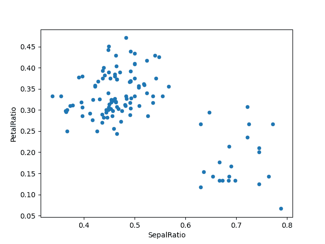

# 数据结构简介

> 原文：[`pandas.pydata.org/docs/user_guide/dsintro.html`](https://pandas.pydata.org/docs/user_guide/dsintro.html)

我们将从一个快速、非全面的概述开始，介绍 pandas 中的基本数据结构，以帮助您入门。关于数据类型、索引、轴标签和对齐的基本行为适用于所有对象。要开始，请导入 NumPy 并将 pandas 加载到您的命名空间中：

```py
In [1]: import numpy as np

In [2]: import pandas as pd 
```

从根本上说，**数据对齐是固有的**。除非您明确这样做，否则标签和数据之间的链接不会被打破。

我们将简要介绍数据结构，然后考虑所有广泛功能和方法的各个类别在单独的部分中。

## Series

`Series`是一个能够容纳任何数据类型（整数、字符串、浮点数、Python 对象等）的一维带标签数组。轴标签总称为**索引**。创建`Series`的基本方法是调用：

```py
s = pd.Series(data, index=index) 
```

在这里，`data`可以是许多不同的东西：

+   一个 Python 字典

+   一个 ndarray

+   标量值（比如 5）

传递的**索引**是一个轴标签列表。因此，这根据**data 是**的情况分为几种情况：

**来自 ndarray**

如果`data`是一个 ndarray，则**索引**必须与**data**的长度相同。如果没有传递索引，将创建一个具有值`[0, ..., len(data) - 1]`的索引。

```py
In [3]: s = pd.Series(np.random.randn(5), index=["a", "b", "c", "d", "e"])

In [4]: s
Out[4]: 
a    0.469112
b   -0.282863
c   -1.509059
d   -1.135632
e    1.212112
dtype: float64

In [5]: s.index
Out[5]: Index(['a', 'b', 'c', 'd', 'e'], dtype='object')

In [6]: pd.Series(np.random.randn(5))
Out[6]: 
0   -0.173215
1    0.119209
2   -1.044236
3   -0.861849
4   -2.104569
dtype: float64 
```

注意

pandas 支持非唯一索引值。如果尝试执行不支持重复索引值的操作，将在那时引发异常。

**来自字典**

`Series`可以从字典实例化：

```py
In [7]: d = {"b": 1, "a": 0, "c": 2}

In [8]: pd.Series(d)
Out[8]: 
b    1
a    0
c    2
dtype: int64 
```

如果传递了索引，则将从数据中与索引中的标签对应的值提取出来。

```py
In [9]: d = {"a": 0.0, "b": 1.0, "c": 2.0}

In [10]: pd.Series(d)
Out[10]: 
a    0.0
b    1.0
c    2.0
dtype: float64

In [11]: pd.Series(d, index=["b", "c", "d", "a"])
Out[11]: 
b    1.0
c    2.0
d    NaN
a    0.0
dtype: float64 
```

注意

NaN（不是一个数字）是 pandas 中使用的标准缺失数据标记。

**来自标量值**

如果`data`是一个标量值，则必须提供一个索引。该值将被重复以匹配**索引**的长度。

```py
In [12]: pd.Series(5.0, index=["a", "b", "c", "d", "e"])
Out[12]: 
a    5.0
b    5.0
c    5.0
d    5.0
e    5.0
dtype: float64 
```

### Series 类似于 ndarray

`Series`的行为与`ndarray`非常相似，并且是大多数 NumPy 函数的有效参数。但是，诸如切片之类的操作也会切片索引。

```py
In [13]: s.iloc[0]
Out[13]: 0.4691122999071863

In [14]: s.iloc[:3]
Out[14]: 
a    0.469112
b   -0.282863
c   -1.509059
dtype: float64

In [15]: s[s > s.median()]
Out[15]: 
a    0.469112
e    1.212112
dtype: float64

In [16]: s.iloc[[4, 3, 1]]
Out[16]: 
e    1.212112
d   -1.135632
b   -0.282863
dtype: float64

In [17]: np.exp(s)
Out[17]: 
a    1.598575
b    0.753623
c    0.221118
d    0.321219
e    3.360575
dtype: float64 
```

注意

我们将在索引部分中讨论类似于`s.iloc[[4, 3, 1]]`的基于数组的索引。

像 NumPy 数组一样，pandas 的`Series`具有单一的`dtype`。

```py
In [18]: s.dtype
Out[18]: dtype('float64') 
```

这通常是一个 NumPy dtype。然而，pandas 和第三方库在一些地方扩展了 NumPy 的类型系统，此时 dtype 将是一个`ExtensionDtype`。pandas 内的一些示例是分类数据和可空整数数据类型。更多信息请参见 dtypes。

如果你需要实际支持`Series`的数组，请使用`Series.array`。

```py
In [19]: s.array
Out[19]: 
<NumpyExtensionArray>
[ 0.4691122999071863, -0.2828633443286633, -1.5090585031735124,
 -1.1356323710171934,  1.2121120250208506]
Length: 5, dtype: float64 
```

访问数组在你需要执行一些操作而不需要索引（例如禁用自动对齐）时非常有用。

`Series.array`将始终是一个`ExtensionArray`。简而言之，ExtensionArray 是一个围绕一个或多个*具体*数组的薄包装器，比如一个[`numpy.ndarray`](https://numpy.org/doc/stable/reference/generated/numpy.ndarray.html#numpy.ndarray "(在 NumPy v1.26 中)"). pandas 知道如何获取一个`ExtensionArray`并将其存储在一个`Series`或`DataFrame`的列中。更多信息请参见 dtypes。

虽然`Series`类似于 ndarray，如果你需要一个*实际*的 ndarray，那么请使用`Series.to_numpy()`。

```py
In [20]: s.to_numpy()
Out[20]: array([ 0.4691, -0.2829, -1.5091, -1.1356,  1.2121]) 
```

即使`Series`由`ExtensionArray`支持，`Series.to_numpy()`将返回一个 NumPy ndarray。

### Series 类似于字典

一个`Series`也类似于一个固定大小的字典，你可以通过索引标签获取和设置值：

```py
In [21]: s["a"]
Out[21]: 0.4691122999071863

In [22]: s["e"] = 12.0

In [23]: s
Out[23]: 
a     0.469112
b    -0.282863
c    -1.509059
d    -1.135632
e    12.000000
dtype: float64

In [24]: "e" in s
Out[24]: True

In [25]: "f" in s
Out[25]: False 
```

如果一个标签不包含在索引中，将会引发异常：

```py
In [26]: s["f"]
---------------------------------------------------------------------------
KeyError  Traceback (most recent call last)
File ~/work/pandas/pandas/pandas/core/indexes/base.py:3805, in Index.get_loc(self, key)
  3804 try:
-> 3805     return self._engine.get_loc(casted_key)
  3806 except KeyError as err:

File index.pyx:167, in pandas._libs.index.IndexEngine.get_loc()

File index.pyx:196, in pandas._libs.index.IndexEngine.get_loc()

File pandas/_libs/hashtable_class_helper.pxi:7081, in pandas._libs.hashtable.PyObjectHashTable.get_item()

File pandas/_libs/hashtable_class_helper.pxi:7089, in pandas._libs.hashtable.PyObjectHashTable.get_item()

KeyError: 'f'

The above exception was the direct cause of the following exception:

KeyError  Traceback (most recent call last)
Cell In[26], line 1
----> 1 s["f"]

File ~/work/pandas/pandas/pandas/core/series.py:1121, in Series.__getitem__(self, key)
  1118     return self._values[key]
  1120 elif key_is_scalar:
-> 1121     return self._get_value(key)
  1123 # Convert generator to list before going through hashable part
  1124 # (We will iterate through the generator there to check for slices)
  1125 if is_iterator(key):

File ~/work/pandas/pandas/pandas/core/series.py:1237, in Series._get_value(self, label, takeable)
  1234     return self._values[label]
  1236 # Similar to Index.get_value, but we do not fall back to positional
-> 1237 loc = self.index.get_loc(label)
  1239 if is_integer(loc):
  1240     return self._values[loc]

File ~/work/pandas/pandas/pandas/core/indexes/base.py:3812, in Index.get_loc(self, key)
  3807     if isinstance(casted_key, slice) or (
  3808         isinstance(casted_key, abc.Iterable)
  3809         and any(isinstance(x, slice) for x in casted_key)
  3810     ):
  3811         raise InvalidIndexError(key)
-> 3812     raise KeyError(key) from err
  3813 except TypeError:
  3814     # If we have a listlike key, _check_indexing_error will raise
  3815     #  InvalidIndexError. Otherwise we fall through and re-raise
  3816     #  the TypeError.
  3817     self._check_indexing_error(key)

KeyError: 'f' 
```

使用`Series.get()`方法，缺失的标签将返回 None 或指定的默认值：

```py
In [27]: s.get("f")

In [28]: s.get("f", np.nan)
Out[28]: nan 
```

这些标签也可以通过属性访问。

### 矢量化操作和与 Series 的标签对齐

在使用原始 NumPy 数组时，通常不需要逐个值循环。在 pandas 中使用 `Series` 时也是如此。`Series` 也可以传递给大多数期望 ndarray 的 NumPy 方法。

```py
In [29]: s + s
Out[29]: 
a     0.938225
b    -0.565727
c    -3.018117
d    -2.271265
e    24.000000
dtype: float64

In [30]: s * 2
Out[30]: 
a     0.938225
b    -0.565727
c    -3.018117
d    -2.271265
e    24.000000
dtype: float64

In [31]: np.exp(s)
Out[31]: 
a         1.598575
b         0.753623
c         0.221118
d         0.321219
e    162754.791419
dtype: float64 
```

`Series` 与 ndarray 之间的一个关键区别是，`Series` 之间的操作会根据标签自动对齐数据。因此，您可以编写计算而无需考虑所涉及的 `Series` 是否具有相同的标签。

```py
In [32]: s.iloc[1:] + s.iloc[:-1]
Out[32]: 
a         NaN
b   -0.565727
c   -3.018117
d   -2.271265
e         NaN
dtype: float64 
```

未对齐的 `Series` 之间的操作结果将具有涉及的索引的**并集**。如果一个标签在其中一个 `Series` 中找不到，结果将被标记为缺失的 `NaN`。能够编写代码而无需进行任何显式数据对齐，为交互式数据分析和研究提供了巨大的自由和灵活性。pandas 数据结构的集成数据对齐功能使 pandas 在处理带标签数据的相关工具中脱颖而出。

注意

一般来说，我们选择使不同索引对象之间的操作的默认结果产生索引的**并集**，以避免信息丢失。即使数据缺失，具有索引标签通常也是计算的重要信息。当然，您可以通过 **dropna** 函数选择删除缺失数据的标签。

### 名称属性

`Series` 还具有一个 `name` 属性：

```py
In [33]: s = pd.Series(np.random.randn(5), name="something")

In [34]: s
Out[34]: 
0   -0.494929
1    1.071804
2    0.721555
3   -0.706771
4   -1.039575
Name: something, dtype: float64

In [35]: s.name
Out[35]: 'something' 
```

`Series` `name` 在许多情况下可以自动分配，特别是当从 `DataFrame` 中选择单个列时，`name` 将被分配为列标签。

您可以使用 `pandas.Series.rename()` 方法重命名一个 `Series`。

```py
In [36]: s2 = s.rename("different")

In [37]: s2.name
Out[37]: 'different' 
```

请注意，`s` 和 `s2` 指代不同的对象。  ## DataFrame

`DataFrame` 是一个具有不同类型列的二维标记数据结构。你可以将它看作是一个电子表格或 SQL 表，或者是一组 Series 对象的字典。它通常是最常用的 pandas 对象。与 Series 一样，DataFrame 接受许多不同类型的输入：

+   1D ndarrays、列表、字典或 `Series` 的字典

+   2-D numpy.ndarray

+   [结构化或记录](https://numpy.org/doc/stable/user/basics.rec.html) ndarray

+   一个 `Series`

+   另一个 `DataFrame`

除了数据，你还可以选择传递 **index**（行标签）和 **columns**（列标签）参数。如果传递了索引和/或列，你将保证结果 DataFrame 的索引和/或列。因此，一个 Series 字典加上一个特定索引将丢弃所有与传递索引不匹配的数据。

如果没有传递轴标签，它们将根据常识规则从输入数据中构建。

### 从 Series 或字典的字典

结果的 **索引** 将是各个 Series 的索引的 **并集**。如果有任何嵌套字典，这些将首先转换为 Series。如果没有传递列，列将是字典键的有序列表。

```py
In [38]: d = {
 ....:    "one": pd.Series([1.0, 2.0, 3.0], index=["a", "b", "c"]),
 ....:    "two": pd.Series([1.0, 2.0, 3.0, 4.0], index=["a", "b", "c", "d"]),
 ....: }
 ....: 

In [39]: df = pd.DataFrame(d)

In [40]: df
Out[40]: 
 one  two
a  1.0  1.0
b  2.0  2.0
c  3.0  3.0
d  NaN  4.0

In [41]: pd.DataFrame(d, index=["d", "b", "a"])
Out[41]: 
 one  two
d  NaN  4.0
b  2.0  2.0
a  1.0  1.0

In [42]: pd.DataFrame(d, index=["d", "b", "a"], columns=["two", "three"])
Out[42]: 
 two three
d  4.0   NaN
b  2.0   NaN
a  1.0   NaN 
```

行和列标签可以分别通过访问 **index** 和 **columns** 属性来访问：

注意

当传递一组特定列以及数据字典时，传递的列将覆盖字典中的键。

```py
In [43]: df.index
Out[43]: Index(['a', 'b', 'c', 'd'], dtype='object')

In [44]: df.columns
Out[44]: Index(['one', 'two'], dtype='object') 
```

### 从 ndarrays / 列表的字典

所有的 ndarrays 必须具有相同的长度。如果传递了索引，它也必须与数组的长度相同。如果没有传递索引，结果将是 `range(n)`，其中 `n` 是数组的长度。

```py
In [45]: d = {"one": [1.0, 2.0, 3.0, 4.0], "two": [4.0, 3.0, 2.0, 1.0]}

In [46]: pd.DataFrame(d)
Out[46]: 
 one  two
0  1.0  4.0
1  2.0  3.0
2  3.0  2.0
3  4.0  1.0

In [47]: pd.DataFrame(d, index=["a", "b", "c", "d"])
Out[47]: 
 one  two
a  1.0  4.0
b  2.0  3.0
c  3.0  2.0
d  4.0  1.0 
```

### 从结构化或记录数组

这种情况与数组字典处理方式相同。

```py
In [48]: data = np.zeros((2,), dtype=[("A", "i4"), ("B", "f4"), ("C", "a10")])

In [49]: data[:] = [(1, 2.0, "Hello"), (2, 3.0, "World")]

In [50]: pd.DataFrame(data)
Out[50]: 
 A    B         C
0  1  2.0  b'Hello'
1  2  3.0  b'World'

In [51]: pd.DataFrame(data, index=["first", "second"])
Out[51]: 
 A    B         C
first   1  2.0  b'Hello'
second  2  3.0  b'World'

In [52]: pd.DataFrame(data, columns=["C", "A", "B"])
Out[52]: 
 C  A    B
0  b'Hello'  1  2.0
1  b'World'  2  3.0 
```

注意

DataFrame 不打算完全像一个二维 NumPy ndarray 一样工作。

### 来自一个字典列表

```py
In [53]: data2 = [{"a": 1, "b": 2}, {"a": 5, "b": 10, "c": 20}]

In [54]: pd.DataFrame(data2)
Out[54]: 
 a   b     c
0  1   2   NaN
1  5  10  20.0

In [55]: pd.DataFrame(data2, index=["first", "second"])
Out[55]: 
 a   b     c
first   1   2   NaN
second  5  10  20.0

In [56]: pd.DataFrame(data2, columns=["a", "b"])
Out[56]: 
 a   b
0  1   2
1  5  10 
```  ### 来自一个元组字典

你可以通过传递一个元组字典自动创建一个 MultiIndexed frame。

```py
In [57]: pd.DataFrame(
 ....:    {
 ....:        ("a", "b"): {("A", "B"): 1, ("A", "C"): 2},
 ....:        ("a", "a"): {("A", "C"): 3, ("A", "B"): 4},
 ....:        ("a", "c"): {("A", "B"): 5, ("A", "C"): 6},
 ....:        ("b", "a"): {("A", "C"): 7, ("A", "B"): 8},
 ....:        ("b", "b"): {("A", "D"): 9, ("A", "B"): 10},
 ....:    }
 ....: )
 ....: 
Out[57]: 
 a              b 
 b    a    c    a     b
A B  1.0  4.0  5.0  8.0  10.0
 C  2.0  3.0  6.0  7.0   NaN
 D  NaN  NaN  NaN  NaN   9.0 
```  ### 来自一个系列

结果将是一个具有与输入 Series 相同索引的 DataFrame，并且具有一个列，其名称是 Series 的原始名称（仅在没有提供其他列名时）。

```py
In [58]: ser = pd.Series(range(3), index=list("abc"), name="ser")

In [59]: pd.DataFrame(ser)
Out[59]: 
 ser
a    0
b    1
c    2 
```  ### 来自一个命名元组列表

列表中第一个 `namedtuple` 的字段名确定 `DataFrame` 的列。 其余的命名元组（或元组）只是被解包，它们的值被提供给 `DataFrame` 的行。 如果任何一个元组比第一个 `namedtuple` 短，则相应行中的后续列将被标记为缺失值。 如果有任何一个比第一个 `namedtuple` 长，则会引发 `ValueError`。

```py
In [60]: from collections import namedtuple

In [61]: Point = namedtuple("Point", "x y")

In [62]: pd.DataFrame([Point(0, 0), Point(0, 3), (2, 3)])
Out[62]: 
 x  y
0  0  0
1  0  3
2  2  3

In [63]: Point3D = namedtuple("Point3D", "x y z")

In [64]: pd.DataFrame([Point3D(0, 0, 0), Point3D(0, 3, 5), Point(2, 3)])
Out[64]: 
 x  y    z
0  0  0  0.0
1  0  3  5.0
2  2  3  NaN 
```  ### 从数据类列表

[PEP557](https://www.python.org/dev/peps/pep-0557) 中介绍的数据类可以传递给 DataFrame 构造函数。 将数据类列表传递给它等同于传递字典列表。

请注意，列表中的所有值都应该是数据类，列表中混合类型的值会导致 `TypeError`。

```py
In [65]: from dataclasses import make_dataclass

In [66]: Point = make_dataclass("Point", [("x", int), ("y", int)])

In [67]: pd.DataFrame([Point(0, 0), Point(0, 3), Point(2, 3)])
Out[67]: 
 x  y
0  0  0
1  0  3
2  2  3 
```

**缺失数据**

要构造一个带有缺失数据的 DataFrame，我们使用 `np.nan` 来表示缺失值。 或者，您可以将 `numpy.MaskedArray` 作为数据参数传递给 DataFrame 构造函数，其掩码条目将被视为缺失值。 更多信息请参见缺失数据。

### 替代构造函数

**DataFrame.from_dict**

`DataFrame.from_dict()` 接受一个字典的字典或者一个数组序列的字典，并返回一个 DataFrame。 它的操作方式与 `DataFrame` 构造函数类似，除了默认情况下为 `'columns'` 的 `orient` 参数外，还可以设置为 `'index'`，以使用字典键作为行标签。

```py
In [68]: pd.DataFrame.from_dict(dict([("A", [1, 2, 3]), ("B", [4, 5, 6])]))
Out[68]: 
 A  B
0  1  4
1  2  5
2  3  6 
```

如果传递 `orient='index'`，则键将成为行标签。 在这种情况下，您还可以传递所需的列名：

```py
In [69]: pd.DataFrame.from_dict(
 ....:    dict([("A", [1, 2, 3]), ("B", [4, 5, 6])]),
 ....:    orient="index",
 ....:    columns=["one", "two", "three"],
 ....: )
 ....: 
Out[69]: 
 one  two  three
A    1    2      3
B    4    5      6 
```

**DataFrame.from_records**

`DataFrame.from_records()` 接受一个元组列表或具有结构化 dtype 的 ndarray。 它的工作方式类似于普通的 `DataFrame` 构造函数，只是生成的 DataFrame 索引可以是结构化 dtype 的特定字段。

```py
In [70]: data
Out[70]: 
array([(1, 2., b'Hello'), (2, 3., b'World')],
 dtype=[('A', '<i4'), ('B', '<f4'), ('C', 'S10')])

In [71]: pd.DataFrame.from_records(data, index="C")
Out[71]: 
 A    B
C 
b'Hello'  1  2.0
b'World'  2  3.0 
```

### 列选择、添加、删除

你可以把`DataFrame`语义上看作是一个具有相同索引的 `Series` 对象的字典。 获取、设置和删除列的操作与类似的字典操作具有相同的语法：

```py
In [72]: df["one"]
Out[72]: 
a    1.0
b    2.0
c    3.0
d    NaN
Name: one, dtype: float64

In [73]: df["three"] = df["one"] * df["two"]

In [74]: df["flag"] = df["one"] > 2

In [75]: df
Out[75]: 
 one  two  three   flag
a  1.0  1.0    1.0  False
b  2.0  2.0    4.0  False
c  3.0  3.0    9.0   True
d  NaN  4.0    NaN  False 
```

列可以像字典一样被删除或弹出：

```py
In [76]: del df["two"]

In [77]: three = df.pop("three")

In [78]: df
Out[78]: 
 one   flag
a  1.0  False
b  2.0  False
c  3.0   True
d  NaN  False 
```

当插入标量值时，它会自然地传播以填充列：

```py
In [79]: df["foo"] = "bar"

In [80]: df
Out[80]: 
 one   flag  foo
a  1.0  False  bar
b  2.0  False  bar
c  3.0   True  bar
d  NaN  False  bar 
```

当插入一个与`DataFrame`具有不同索引的`Series`时，它将被调整为 DataFrame 的索引：

```py
In [81]: df["one_trunc"] = df["one"][:2]

In [82]: df
Out[82]: 
 one   flag  foo  one_trunc
a  1.0  False  bar        1.0
b  2.0  False  bar        2.0
c  3.0   True  bar        NaN
d  NaN  False  bar        NaN 
```

您可以插入原始 ndarrays，但它们的长度必须与 DataFrame 的索引长度匹配。

默认情况下，列会被插入到末尾。`DataFrame.insert()` 在列的特定位置插入：

```py
In [83]: df.insert(1, "bar", df["one"])

In [84]: df
Out[84]: 
 one  bar   flag  foo  one_trunc
a  1.0  1.0  False  bar        1.0
b  2.0  2.0  False  bar        2.0
c  3.0  3.0   True  bar        NaN
d  NaN  NaN  False  bar        NaN 
```  ### 在方法链中分配新列

灵感源于[dplyr 的](https://dplyr.tidyverse.org/reference/mutate.html) `mutate` 动词，DataFrame 具有一个`assign()` 方法，允许您轻松创建可能源自现有列的新列。

```py
In [85]: iris = pd.read_csv("data/iris.data")

In [86]: iris.head()
Out[86]: 
 SepalLength  SepalWidth  PetalLength  PetalWidth         Name
0          5.1         3.5          1.4         0.2  Iris-setosa
1          4.9         3.0          1.4         0.2  Iris-setosa
2          4.7         3.2          1.3         0.2  Iris-setosa
3          4.6         3.1          1.5         0.2  Iris-setosa
4          5.0         3.6          1.4         0.2  Iris-setosa

In [87]: iris.assign(sepal_ratio=iris["SepalWidth"] / iris["SepalLength"]).head()
Out[87]: 
 SepalLength  SepalWidth  PetalLength  PetalWidth         Name  sepal_ratio
0          5.1         3.5          1.4         0.2  Iris-setosa     0.686275
1          4.9         3.0          1.4         0.2  Iris-setosa     0.612245
2          4.7         3.2          1.3         0.2  Iris-setosa     0.680851
3          4.6         3.1          1.5         0.2  Iris-setosa     0.673913
4          5.0         3.6          1.4         0.2  Iris-setosa     0.720000 
```

在上面的示例中，我们插入了一个预先计算的值。我们还可以传递一个要在分配给的 DataFrame 上评估的一个参数的函数。

```py
In [88]: iris.assign(sepal_ratio=lambda x: (x["SepalWidth"] / x["SepalLength"])).head()
Out[88]: 
 SepalLength  SepalWidth  PetalLength  PetalWidth         Name  sepal_ratio
0          5.1         3.5          1.4         0.2  Iris-setosa     0.686275
1          4.9         3.0          1.4         0.2  Iris-setosa     0.612245
2          4.7         3.2          1.3         0.2  Iris-setosa     0.680851
3          4.6         3.1          1.5         0.2  Iris-setosa     0.673913
4          5.0         3.6          1.4         0.2  Iris-setosa     0.720000 
```

`assign()` **总是**返回数据的副本，保持原始 DataFrame 不变。

传递可调用对象，而不是要插入的实际值，在没有对 DataFrame 的引用时非常有用。在操作链中使用`assign()`时，这是常见的。例如，我们可以将 DataFrame 限制为仅包含萼片长度大于 5 的观测值，计算比率，并绘制：

```py
In [89]: (
 ....:    iris.query("SepalLength > 5")
 ....:    .assign(
 ....:        SepalRatio=lambda x: x.SepalWidth / x.SepalLength,
 ....:        PetalRatio=lambda x: x.PetalWidth / x.PetalLength,
 ....:    )
 ....:    .plot(kind="scatter", x="SepalRatio", y="PetalRatio")
 ....: )
 ....: 
Out[89]: <Axes: xlabel='SepalRatio', ylabel='PetalRatio'> 
```



由于传递了一个函数，因此该函数在分配给的 DataFrame 上计算。重要的是，这是已经被过滤为那些萼片长度大于 5 的行的 DataFrame。首先进行过滤，然后进行比率计算。这是一个示例，我们没有对*过滤*的 DataFrame 可用的引用。

`assign()` 的函数签名只是 `**kwargs`。键是新字段的列名，值可以是要插入的值（例如，`Series`或 NumPy 数组），或者是要在`DataFrame`上调用的一个参数的函数。返回原始`DataFrame`的*副本*，并插入新值。

`**kwargs`的顺序是保留的。这允许*依赖*赋值，其中`**kwargs`中后面的表达式可以引用同一`assign()`中先前创建的列。

```py
In [90]: dfa = pd.DataFrame({"A": [1, 2, 3], "B": [4, 5, 6]})

In [91]: dfa.assign(C=lambda x: x["A"] + x["B"], D=lambda x: x["A"] + x["C"])
Out[91]: 
 A  B  C   D
0  1  4  5   6
1  2  5  7   9
2  3  6  9  12 
```

在第二个表达式中，`x['C']`将指向新创建的列，等于`dfa['A'] + dfa['B']`。

### 索引/选择

索引的基础知识如下：

| 操作 | 语法 | 结果 |
| --- | --- | --- |
| 选择列 | `df[col]` | Series |
| 通过标签选择行 | `df.loc[label]` | Series |
| 通过整数位置选择行 | `df.iloc[loc]` | Series |
| 切片行 | `df[5:10]` | DataFrame |
| 通过布尔向量选择行 | `df[bool_vec]` | DataFrame |

例如，行选择返回一个其索引为`DataFrame`的列的`Series`：

```py
In [92]: df.loc["b"]
Out[92]: 
one            2.0
bar            2.0
flag         False
foo            bar
one_trunc      2.0
Name: b, dtype: object

In [93]: df.iloc[2]
Out[93]: 
one           3.0
bar           3.0
flag         True
foo           bar
one_trunc     NaN
Name: c, dtype: object 
```

对于更详尽的基于标签的索引和切片处理，请参阅索引部分。我们将在重新索引部分中讨论重新索引/符合新标签集的基础知识。

### 数据对齐和算术

`DataFrame`对象之间的数据对齐会自动在**列和索引（行标签）**上对齐。同样，结果对象将具有列和行标签的并集。

```py
In [94]: df = pd.DataFrame(np.random.randn(10, 4), columns=["A", "B", "C", "D"])

In [95]: df2 = pd.DataFrame(np.random.randn(7, 3), columns=["A", "B", "C"])

In [96]: df + df2
Out[96]: 
 A         B         C   D
0  0.045691 -0.014138  1.380871 NaN
1 -0.955398 -1.501007  0.037181 NaN
2 -0.662690  1.534833 -0.859691 NaN
3 -2.452949  1.237274 -0.133712 NaN
4  1.414490  1.951676 -2.320422 NaN
5 -0.494922 -1.649727 -1.084601 NaN
6 -1.047551 -0.748572 -0.805479 NaN
7       NaN       NaN       NaN NaN
8       NaN       NaN       NaN NaN
9       NaN       NaN       NaN NaN 
```

在`DataFrame`和`Series`之间进行操作时，默认行为是将`Series`的**索引**与`DataFrame`的**列**对齐，从而以行方式进行[广播](https://numpy.org/doc/stable/user/basics.broadcasting.html)。例如：

```py
In [97]: df - df.iloc[0]
Out[97]: 
 A         B         C         D
0  0.000000  0.000000  0.000000  0.000000
1 -1.359261 -0.248717 -0.453372 -1.754659
2  0.253128  0.829678  0.010026 -1.991234
3 -1.311128  0.054325 -1.724913 -1.620544
4  0.573025  1.500742 -0.676070  1.367331
5 -1.741248  0.781993 -1.241620 -2.053136
6 -1.240774 -0.869551 -0.153282  0.000430
7 -0.743894  0.411013 -0.929563 -0.282386
8 -1.194921  1.320690  0.238224 -1.482644
9  2.293786  1.856228  0.773289 -1.446531 
```

要对匹配和广播行为进行显式控制，请参阅灵活的二进制操作部分。

与标量进行算术运算是逐元素进行的：

```py
In [98]: df * 5 + 2
Out[98]: 
 A         B         C          D
0   3.359299 -0.124862  4.835102   3.381160
1  -3.437003 -1.368449  2.568242  -5.392133
2   4.624938  4.023526  4.885230  -6.575010
3  -3.196342  0.146766 -3.789461  -4.721559
4   6.224426  7.378849  1.454750  10.217815
5  -5.346940  3.785103 -1.373001  -6.884519
6  -2.844569 -4.472618  4.068691   3.383309
7  -0.360173  1.930201  0.187285   1.969232
8  -2.615303  6.478587  6.026220  -4.032059
9  14.828230  9.156280  8.701544  -3.851494

In [99]: 1 / df
Out[99]: 
 A          B         C           D
0  3.678365  -2.353094  1.763605    3.620145
1 -0.919624  -1.484363  8.799067   -0.676395
2  1.904807   2.470934  1.732964   -0.583090
3 -0.962215  -2.697986 -0.863638   -0.743875
4  1.183593   0.929567 -9.170108    0.608434
5 -0.680555   2.800959 -1.482360   -0.562777
6 -1.032084  -0.772485  2.416988    3.614523
7 -2.118489 -71.634509 -2.758294 -162.507295
8 -1.083352   1.116424  1.241860   -0.828904
9  0.389765   0.698687  0.746097   -0.854483

In [100]: df ** 4
Out[100]: 
 A             B         C             D
0   0.005462  3.261689e-02  0.103370  5.822320e-03
1   1.398165  2.059869e-01  0.000167  4.777482e+00
2   0.075962  2.682596e-02  0.110877  8.650845e+00
3   1.166571  1.887302e-02  1.797515  3.265879e+00
4   0.509555  1.339298e+00  0.000141  7.297019e+00
5   4.661717  1.624699e-02  0.207103  9.969092e+00
6   0.881334  2.808277e+00  0.029302  5.858632e-03
7   0.049647  3.797614e-08  0.017276  1.433866e-09
8   0.725974  6.437005e-01  0.420446  2.118275e+00
9  43.329821  4.196326e+00  3.227153  1.875802e+00 
```

布尔运算也是逐元素进行的：

```py
In [101]: df1 = pd.DataFrame({"a": [1, 0, 1], "b": [0, 1, 1]}, dtype=bool)

In [102]: df2 = pd.DataFrame({"a": [0, 1, 1], "b": [1, 1, 0]}, dtype=bool)

In [103]: df1 & df2
Out[103]: 
 a      b
0  False  False
1  False   True
2   True  False

In [104]: df1 | df2
Out[104]: 
 a     b
0  True  True
1  True  True
2  True  True

In [105]: df1 ^ df2
Out[105]: 
 a      b
0   True   True
1   True  False
2  False   True

In [106]: -df1
Out[106]: 
 a      b
0  False   True
1   True  False
2  False  False 
```

### 转置

要进行转置，访问`T`属性或`DataFrame.transpose()`，类似于一个 ndarray：

```py
# only show the first 5 rows
In [107]: df[:5].T
Out[107]: 
 0         1         2         3         4
A  0.271860 -1.087401  0.524988 -1.039268  0.844885
B -0.424972 -0.673690  0.404705 -0.370647  1.075770
C  0.567020  0.113648  0.577046 -1.157892 -0.109050
D  0.276232 -1.478427 -1.715002 -1.344312  1.643563 
```

### DataFrame 与 NumPy 函数的互操作性

大多数 NumPy 函数可以直接在`Series`和`DataFrame`上调用。

```py
In [108]: np.exp(df)
Out[108]: 
 A         B         C         D
0   1.312403  0.653788  1.763006  1.318154
1   0.337092  0.509824  1.120358  0.227996
2   1.690438  1.498861  1.780770  0.179963
3   0.353713  0.690288  0.314148  0.260719
4   2.327710  2.932249  0.896686  5.173571
5   0.230066  1.429065  0.509360  0.169161
6   0.379495  0.274028  1.512461  1.318720
7   0.623732  0.986137  0.695904  0.993865
8   0.397301  2.449092  2.237242  0.299269
9  13.009059  4.183951  3.820223  0.310274

In [109]: np.asarray(df)
Out[109]: 
array([[ 0.2719, -0.425 ,  0.567 ,  0.2762],
 [-1.0874, -0.6737,  0.1136, -1.4784],
 [ 0.525 ,  0.4047,  0.577 , -1.715 ],
 [-1.0393, -0.3706, -1.1579, -1.3443],
 [ 0.8449,  1.0758, -0.109 ,  1.6436],
 [-1.4694,  0.357 , -0.6746, -1.7769],
 [-0.9689, -1.2945,  0.4137,  0.2767],
 [-0.472 , -0.014 , -0.3625, -0.0062],
 [-0.9231,  0.8957,  0.8052, -1.2064],
 [ 2.5656,  1.4313,  1.3403, -1.1703]]) 
```

`DataFrame`并不打算作为 ndarray 的直接替代品，因为它的索引语义和数据模型在某些地方与 n 维数组有很大不同。

`Series`实现了`__array_ufunc__`，这使其能够与 NumPy 的[通用函数](https://numpy.org/doc/stable/reference/ufuncs.html)一起使用。

ufunc 被应用于`Series`中的底层数组。

```py
In [110]: ser = pd.Series([1, 2, 3, 4])

In [111]: np.exp(ser)
Out[111]: 
0     2.718282
1     7.389056
2    20.085537
3    54.598150
dtype: float64 
```

当多个`Series`传递给 ufunc 时，在执行操作之前它们会被对齐。

与库的其他部分一样，pandas 将自动对齐带有多个输入的 ufunc 的标记输入。例如，在两个具有不同顺序标签的`Series`上使用`numpy.remainder()`将在操作之前对齐。

```py
In [112]: ser1 = pd.Series([1, 2, 3], index=["a", "b", "c"])

In [113]: ser2 = pd.Series([1, 3, 5], index=["b", "a", "c"])

In [114]: ser1
Out[114]: 
a    1
b    2
c    3
dtype: int64

In [115]: ser2
Out[115]: 
b    1
a    3
c    5
dtype: int64

In [116]: np.remainder(ser1, ser2)
Out[116]: 
a    1
b    0
c    3
dtype: int64 
```

通常情况下，两个索引的并集被取出，并且非重叠的值被填充为缺失值。

```py
In [117]: ser3 = pd.Series([2, 4, 6], index=["b", "c", "d"])

In [118]: ser3
Out[118]: 
b    2
c    4
d    6
dtype: int64

In [119]: np.remainder(ser1, ser3)
Out[119]: 
a    NaN
b    0.0
c    3.0
d    NaN
dtype: float64 
```

当将二进制 ufunc 应用于`Series`和`Index`时，`Series`的实现优先，并返回一个`Series`。

```py
In [120]: ser = pd.Series([1, 2, 3])

In [121]: idx = pd.Index([4, 5, 6])

In [122]: np.maximum(ser, idx)
Out[122]: 
0    4
1    5
2    6
dtype: int64 
```

NumPy ufuncs 可以安全地应用于由非 ndarray 数组支持的`Series`，例如`arrays.SparseArray`（参见稀疏计算）。如果可能，ufunc 将在不将底层数据转换为 ndarray 的情况下应用。

### 控制台显示

一个非常大的`DataFrame`将被截断以在控制台中显示。您也可以使用`info()`来获取摘要信息。（**baseball**数据集来自**plyr** R 包）：

```py
In [123]: baseball = pd.read_csv("data/baseball.csv")

In [124]: print(baseball)
 id     player  year  stint team  lg  ...    so  ibb  hbp   sh   sf  gidp
0   88641  womacto01  2006      2  CHN  NL  ...   4.0  0.0  0.0  3.0  0.0   0.0
1   88643  schilcu01  2006      1  BOS  AL  ...   1.0  0.0  0.0  0.0  0.0   0.0
..    ...        ...   ...    ...  ...  ..  ...   ...  ...  ...  ...  ...   ...
98  89533   aloumo01  2007      1  NYN  NL  ...  30.0  5.0  2.0  0.0  3.0  13.0
99  89534  alomasa02  2007      1  NYN  NL  ...   3.0  0.0  0.0  0.0  0.0   0.0

[100 rows x 23 columns]

In [125]: baseball.info()
<class 'pandas.core.frame.DataFrame'>
RangeIndex: 100 entries, 0 to 99
Data columns (total 23 columns):
 #   Column  Non-Null Count  Dtype 
---  ------  --------------  ----- 
 0   id      100 non-null    int64 
 1   player  100 non-null    object 
 2   year    100 non-null    int64 
 3   stint   100 non-null    int64 
 4   team    100 non-null    object 
 5   lg      100 non-null    object 
 6   g       100 non-null    int64 
 7   ab      100 non-null    int64 
 8   r       100 non-null    int64 
 9   h       100 non-null    int64 
 10  X2b     100 non-null    int64 
 11  X3b     100 non-null    int64 
 12  hr      100 non-null    int64 
 13  rbi     100 non-null    float64
 14  sb      100 non-null    float64
 15  cs      100 non-null    float64
 16  bb      100 non-null    int64 
 17  so      100 non-null    float64
 18  ibb     100 non-null    float64
 19  hbp     100 non-null    float64
 20  sh      100 non-null    float64
 21  sf      100 non-null    float64
 22  gidp    100 non-null    float64
dtypes: float64(9), int64(11), object(3)
memory usage: 18.1+ KB 
```

然而，使用`DataFrame.to_string()`将以表格形式返回`DataFrame`的字符串表示，尽管它不总是适合控制台宽度：

```py
In [126]: print(baseball.iloc[-20:, :12].to_string())
 id     player  year  stint team  lg    g   ab   r    h  X2b  X3b
80  89474  finlest01  2007      1  COL  NL   43   94   9   17    3    0
81  89480  embreal01  2007      1  OAK  AL    4    0   0    0    0    0
82  89481  edmonji01  2007      1  SLN  NL  117  365  39   92   15    2
83  89482  easleda01  2007      1  NYN  NL   76  193  24   54    6    0
84  89489  delgaca01  2007      1  NYN  NL  139  538  71  139   30    0
85  89493  cormirh01  2007      1  CIN  NL    6    0   0    0    0    0
86  89494  coninje01  2007      2  NYN  NL   21   41   2    8    2    0
87  89495  coninje01  2007      1  CIN  NL   80  215  23   57   11    1
88  89497  clemero02  2007      1  NYA  AL    2    2   0    1    0    0
89  89498  claytro01  2007      2  BOS  AL    8    6   1    0    0    0
90  89499  claytro01  2007      1  TOR  AL   69  189  23   48   14    0
91  89501  cirilje01  2007      2  ARI  NL   28   40   6    8    4    0
92  89502  cirilje01  2007      1  MIN  AL   50  153  18   40    9    2
93  89521  bondsba01  2007      1  SFN  NL  126  340  75   94   14    0
94  89523  biggicr01  2007      1  HOU  NL  141  517  68  130   31    3
95  89525  benitar01  2007      2  FLO  NL   34    0   0    0    0    0
96  89526  benitar01  2007      1  SFN  NL   19    0   0    0    0    0
97  89530  ausmubr01  2007      1  HOU  NL  117  349  38   82   16    3
98  89533   aloumo01  2007      1  NYN  NL   87  328  51  112   19    1
99  89534  alomasa02  2007      1  NYN  NL    8   22   1    3    1    0 
```

默认情况下，宽 DataFrame 将跨多行打印：

```py
In [127]: pd.DataFrame(np.random.randn(3, 12))
Out[127]: 
 0         1         2   ...        9         10        11
0 -1.226825  0.769804 -1.281247  ... -1.110336 -0.619976  0.149748
1 -0.732339  0.687738  0.176444  ...  1.462696 -1.743161 -0.826591
2 -0.345352  1.314232  0.690579  ...  0.896171 -0.487602 -0.082240

[3 rows x 12 columns] 
```

通过设置`display.width`选项，您可以更改单行打印的数量：

```py
In [128]: pd.set_option("display.width", 40)  # default is 80

In [129]: pd.DataFrame(np.random.randn(3, 12))
Out[129]: 
 0         1         2   ...        9         10        11
0 -2.182937  0.380396  0.084844  ... -0.023688  2.410179  1.450520
1  0.206053 -0.251905 -2.213588  ... -0.025747 -0.988387  0.094055
2  1.262731  1.289997  0.082423  ... -0.281461  0.030711  0.109121

[3 rows x 12 columns] 
```

您可以通过设置`display.max_colwidth`来调整各列的最大宽度

```py
In [130]: datafile = {
 .....:    "filename": ["filename_01", "filename_02"],
 .....:    "path": [
 .....:        "media/user_name/storage/folder_01/filename_01",
 .....:        "media/user_name/storage/folder_02/filename_02",
 .....:    ],
 .....: }
 .....: 

In [131]: pd.set_option("display.max_colwidth", 30)

In [132]: pd.DataFrame(datafile)
Out[132]: 
 filename                           path
0  filename_01  media/user_name/storage/fo...
1  filename_02  media/user_name/storage/fo...

In [133]: pd.set_option("display.max_colwidth", 100)

In [134]: pd.DataFrame(datafile)
Out[134]: 
 filename                                           path
0  filename_01  media/user_name/storage/folder_01/filename_01
1  filename_02  media/user_name/storage/folder_02/filename_02 
```

您还可以通过`expand_frame_repr`选项禁用此功能。这将在一个块中打印表格。

### DataFrame 列属性访问和 IPython 完成

如果`DataFrame`列标签是一个有效的 Python 变量名，则可以像属性一样访问该列：

```py
In [135]: df = pd.DataFrame({"foo1": np.random.randn(5), "foo2": np.random.randn(5)})

In [136]: df
Out[136]: 
 foo1      foo2
0  1.126203  0.781836
1 -0.977349 -1.071357
2  1.474071  0.441153
3 -0.064034  2.353925
4 -1.282782  0.583787

In [137]: df.foo1
Out[137]: 
0    1.126203
1   -0.977349
2    1.474071
3   -0.064034
4   -1.282782
Name: foo1, dtype: float64 
```

列也与[IPython](https://ipython.org)完成机制连接，因此可以进行制表完成：

```py
In [5]: df.foo<TAB>  # noqa: E225, E999
df.foo1  df.foo2 
```  ## Series

`Series`是一个能够容纳任何数据类型（整数、字符串、浮点数、Python 对象等）的一维标记数组。轴标签总称为**index**。创建`Series`的基本方法是调用：

```py
s = pd.Series(data, index=index) 
```

这里，`data`可以是许多不同的东西：

+   一个 Python 字典

+   一个 ndarray

+   一个标量值（如 5）

传递的**index**是一个轴标签列表。因此，这根据**data**的内容分为几种情况：

**从 ndarray**

如果`data`是一个 ndarray，**index**必须与**data**的长度相同。如果没有传递索引，将创建一个具有值`[0, ..., len(data) - 1]`的索引。

```py
In [3]: s = pd.Series(np.random.randn(5), index=["a", "b", "c", "d", "e"])

In [4]: s
Out[4]: 
a    0.469112
b   -0.282863
c   -1.509059
d   -1.135632
e    1.212112
dtype: float64

In [5]: s.index
Out[5]: Index(['a', 'b', 'c', 'd', 'e'], dtype='object')

In [6]: pd.Series(np.random.randn(5))
Out[6]: 
0   -0.173215
1    0.119209
2   -1.044236
3   -0.861849
4   -2.104569
dtype: float64 
```

注意

pandas 支持非唯一索引值。如果尝试执行不支持重复索引值的操作，那么将在那时引发异常。

**从字典**

`Series`可以从字典实例化：

```py
In [7]: d = {"b": 1, "a": 0, "c": 2}

In [8]: pd.Series(d)
Out[8]: 
b    1
a    0
c    2
dtype: int64 
```

如果传递了索引，则将从数据中与索引标签对应的值提取出来。

```py
In [9]: d = {"a": 0.0, "b": 1.0, "c": 2.0}

In [10]: pd.Series(d)
Out[10]: 
a    0.0
b    1.0
c    2.0
dtype: float64

In [11]: pd.Series(d, index=["b", "c", "d", "a"])
Out[11]: 
b    1.0
c    2.0
d    NaN
a    0.0
dtype: float64 
```

注意

NaN（不是一个数字）是 pandas 中使用的标准缺失数据标记。

**从标量值**

如果`data`是一个标量值，则必须提供一个索引。该值将重复以匹配**index**的长度。

```py
In [12]: pd.Series(5.0, index=["a", "b", "c", "d", "e"])
Out[12]: 
a    5.0
b    5.0
c    5.0
d    5.0
e    5.0
dtype: float64 
```

### Series 类似于 ndarray

`Series`的行为与`ndarray`非常相似，并且是大多数 NumPy 函数的有效参数。然而，像切片这样的操作也会切片索引。

```py
In [13]: s.iloc[0]
Out[13]: 0.4691122999071863

In [14]: s.iloc[:3]
Out[14]: 
a    0.469112
b   -0.282863
c   -1.509059
dtype: float64

In [15]: s[s > s.median()]
Out[15]: 
a    0.469112
e    1.212112
dtype: float64

In [16]: s.iloc[[4, 3, 1]]
Out[16]: 
e    1.212112
d   -1.135632
b   -0.282863
dtype: float64

In [17]: np.exp(s)
Out[17]: 
a    1.598575
b    0.753623
c    0.221118
d    0.321219
e    3.360575
dtype: float64 
```

注意

我们将在索引部分中讨论类似`s.iloc[[4, 3, 1]]`的基于数组的索引。

与 NumPy 数组类似，pandas 的`Series`具有单一的`dtype`。

```py
In [18]: s.dtype
Out[18]: dtype('float64') 
```

这通常是一个 NumPy dtype。然而，pandas 和第三方库在一些地方扩展了 NumPy 的类型系统，此时 dtype 将是一个`ExtensionDtype`。pandas 中的一些示例包括 Categorical data 和 Nullable integer data type。更多信息请参见 dtypes。

如果需要一个`Series`的实际数组支持，请使用`Series.array`。

```py
In [19]: s.array
Out[19]: 
<NumpyExtensionArray>
[ 0.4691122999071863, -0.2828633443286633, -1.5090585031735124,
 -1.1356323710171934,  1.2121120250208506]
Length: 5, dtype: float64 
```

访问数组在需要执行一些操作而不需要索引时（例如禁用自动对齐）时非常有用。

`Series.array`始终是一个`ExtensionArray`。简而言之，ExtensionArray 是对一个或多个*具体*数组（如[`numpy.ndarray`](https://numpy.org/doc/stable/reference/generated/numpy.ndarray.html#numpy.ndarray "(在 NumPy v1.26)"))的薄包装。pandas 知道如何将一个`ExtensionArray`存储在`Series`或`DataFrame`的列中。更多信息请参见 dtypes。

虽然`Series`类似于 ndarray，但如果需要一个*实际*的 ndarray，则使用`Series.to_numpy()`。

```py
In [20]: s.to_numpy()
Out[20]: array([ 0.4691, -0.2829, -1.5091, -1.1356,  1.2121]) 
```

即使`Series`由一个`ExtensionArray`��持，`Series.to_numpy()`也会返回一个 NumPy ndarray。

### Series 类似于字典

一个`Series`也类似于一个固定大小的字典，可以通过索引标签获取和设置值：

```py
In [21]: s["a"]
Out[21]: 0.4691122999071863

In [22]: s["e"] = 12.0

In [23]: s
Out[23]: 
a     0.469112
b    -0.282863
c    -1.509059
d    -1.135632
e    12.000000
dtype: float64

In [24]: "e" in s
Out[24]: True

In [25]: "f" in s
Out[25]: False 
```

如果标签不包含在索引中，则会引发异常：

```py
In [26]: s["f"]
---------------------------------------------------------------------------
KeyError  Traceback (most recent call last)
File ~/work/pandas/pandas/pandas/core/indexes/base.py:3805, in Index.get_loc(self, key)
  3804 try:
-> 3805     return self._engine.get_loc(casted_key)
  3806 except KeyError as err:

File index.pyx:167, in pandas._libs.index.IndexEngine.get_loc()

File index.pyx:196, in pandas._libs.index.IndexEngine.get_loc()

File pandas/_libs/hashtable_class_helper.pxi:7081, in pandas._libs.hashtable.PyObjectHashTable.get_item()

File pandas/_libs/hashtable_class_helper.pxi:7089, in pandas._libs.hashtable.PyObjectHashTable.get_item()

KeyError: 'f'

The above exception was the direct cause of the following exception:

KeyError  Traceback (most recent call last)
Cell In[26], line 1
----> 1 s["f"]

File ~/work/pandas/pandas/pandas/core/series.py:1121, in Series.__getitem__(self, key)
  1118     return self._values[key]
  1120 elif key_is_scalar:
-> 1121     return self._get_value(key)
  1123 # Convert generator to list before going through hashable part
  1124 # (We will iterate through the generator there to check for slices)
  1125 if is_iterator(key):

File ~/work/pandas/pandas/pandas/core/series.py:1237, in Series._get_value(self, label, takeable)
  1234     return self._values[label]
  1236 # Similar to Index.get_value, but we do not fall back to positional
-> 1237 loc = self.index.get_loc(label)
  1239 if is_integer(loc):
  1240     return self._values[loc]

File ~/work/pandas/pandas/pandas/core/indexes/base.py:3812, in Index.get_loc(self, key)
  3807     if isinstance(casted_key, slice) or (
  3808         isinstance(casted_key, abc.Iterable)
  3809         and any(isinstance(x, slice) for x in casted_key)
  3810     ):
  3811         raise InvalidIndexError(key)
-> 3812     raise KeyError(key) from err
  3813 except TypeError:
  3814     # If we have a listlike key, _check_indexing_error will raise
  3815     #  InvalidIndexError. Otherwise we fall through and re-raise
  3816     #  the TypeError.
  3817     self._check_indexing_error(key)

KeyError: 'f' 
```

使用`Series.get()`方法，如果缺少标签，则返回 None 或指定的默认值：

```py
In [27]: s.get("f")

In [28]: s.get("f", np.nan)
Out[28]: nan 
```

这些标签也可以通过属性访问。

### 与 Series 进行矢量化操作和标签对齐

在使用原始 NumPy 数组时，通常不需要逐个值循环。在 pandas 中使用`Series`时也是如此。`Series`也可以传递给大多数期望 ndarray 的 NumPy 方法。

```py
In [29]: s + s
Out[29]: 
a     0.938225
b    -0.565727
c    -3.018117
d    -2.271265
e    24.000000
dtype: float64

In [30]: s * 2
Out[30]: 
a     0.938225
b    -0.565727
c    -3.018117
d    -2.271265
e    24.000000
dtype: float64

In [31]: np.exp(s)
Out[31]: 
a         1.598575
b         0.753623
c         0.221118
d         0.321219
e    162754.791419
dtype: float64 
```

`Series`和 ndarray 之间的一个关键区别是，`Series`之间的操作会根据标签自动对齐数据。因此，您可以编写计算而不必考虑所涉及的`Series`是否具有相同的标签。

```py
In [32]: s.iloc[1:] + s.iloc[:-1]
Out[32]: 
a         NaN
b   -0.565727
c   -3.018117
d   -2.271265
e         NaN
dtype: float64 
```

未对齐的`Series`之间的操作结果将具有涉及的索引的**并集**。如果一个标签在一个`Series`或另一个中找不到，则结果将被标记为缺失的`NaN`。能够编写不进行任何显式数据对齐的代码为交互式数据分析和研究提供了巨大的自由和灵活性。pandas 数据结构的集成数据对齐功能使 pandas 在处理带标签数据的相关工具中脱颖而出。

注意

一般来说，我们选择使不同索引对象之间的操作的默认结果产生索引的**并集**，以避免信息丢失。即使数据缺失，具有索引标签通常也是计算的重要信息。当然，您可以通过**dropna**函数选择删除缺失数据的标签。

### 名称属性

`Series`还有一个`name`属性：

```py
In [33]: s = pd.Series(np.random.randn(5), name="something")

In [34]: s
Out[34]: 
0   -0.494929
1    1.071804
2    0.721555
3   -0.706771
4   -1.039575
Name: something, dtype: float64

In [35]: s.name
Out[35]: 'something' 
```

在许多情况下，`Series`的`name`可以自动分配，特别是当从`DataFrame`中选择单列时，`name`将被分配为列标签。

您可以使用`pandas.Series.rename()`方法重命名一个`Series`。

```py
In [36]: s2 = s.rename("different")

In [37]: s2.name
Out[37]: 'different' 
```

请注意，`s`和`s2`指向不同的对象。

### Series 类似于 ndarray

`Series`的行为与`ndarray`非常相似，并且是大多数 NumPy 函数的有效参数。但是，诸如切片之类的操作也会切片索引。

```py
In [13]: s.iloc[0]
Out[13]: 0.4691122999071863

In [14]: s.iloc[:3]
Out[14]: 
a    0.469112
b   -0.282863
c   -1.509059
dtype: float64

In [15]: s[s > s.median()]
Out[15]: 
a    0.469112
e    1.212112
dtype: float64

In [16]: s.iloc[[4, 3, 1]]
Out[16]: 
e    1.212112
d   -1.135632
b   -0.282863
dtype: float64

In [17]: np.exp(s)
Out[17]: 
a    1.598575
b    0.753623
c    0.221118
d    0.321219
e    3.360575
dtype: float64 
```

注意

我们将在索引部分中讨论类似于`s.iloc[[4, 3, 1]]`的基于数组的索引。

像 NumPy 数组一样，pandas 的`Series`具有单一的`dtype`。

```py
In [18]: s.dtype
Out[18]: dtype('float64') 
```

这通常是一个 NumPy 的 dtype。然而，pandas 和第三方库在一些地方扩展了 NumPy 的类型系统，在这种情况下，dtype 将是一个 `ExtensionDtype`。pandas 中的一些示例包括 分类数据 和 可空整数数据类型。详情请参阅 dtypes。

如果你需要一个 `Series` 的实际数组支持，请使用 `Series.array`。

```py
In [19]: s.array
Out[19]: 
<NumpyExtensionArray>
[ 0.4691122999071863, -0.2828633443286633, -1.5090585031735124,
 -1.1356323710171934,  1.2121120250208506]
Length: 5, dtype: float64 
```

当你需要执行一些操作而不使用索引时（例如禁用 自动对齐），访问数组可能很有用。

`Series.array` 总是一个 `ExtensionArray`。简而言之，ExtensionArray 是对一个或多个 *具体* 数组的轻量级包装，比如 [`numpy.ndarray`](https://numpy.org/doc/stable/reference/generated/numpy.ndarray.html#numpy.ndarray "(在 NumPy v1.26 中)")。pandas 知道如何获取一个 `ExtensionArray` 并将其存储在一个 `Series` 或 `DataFrame` 的列中。详情请参阅 dtypes。

虽然 `Series` 类似于 ndarray，但如果你需要一个 *实际* 的 ndarray，请使用 `Series.to_numpy()`。

```py
In [20]: s.to_numpy()
Out[20]: array([ 0.4691, -0.2829, -1.5091, -1.1356,  1.2121]) 
```

即使 `Series` 是由 `ExtensionArray` 支持的，`Series.to_numpy()` 也会返回一个 NumPy ndarray。

### Series 类似于字典

一个 `Series` 也像一个固定大小的字典，你可以通过索引标签来获取和设置值：

```py
In [21]: s["a"]
Out[21]: 0.4691122999071863

In [22]: s["e"] = 12.0

In [23]: s
Out[23]: 
a     0.469112
b    -0.282863
c    -1.509059
d    -1.135632
e    12.000000
dtype: float64

In [24]: "e" in s
Out[24]: True

In [25]: "f" in s
Out[25]: False 
```

如果标签不包含在索引中，则会引发异常：

```py
In [26]: s["f"]
---------------------------------------------------------------------------
KeyError  Traceback (most recent call last)
File ~/work/pandas/pandas/pandas/core/indexes/base.py:3805, in Index.get_loc(self, key)
  3804 try:
-> 3805     return self._engine.get_loc(casted_key)
  3806 except KeyError as err:

File index.pyx:167, in pandas._libs.index.IndexEngine.get_loc()

File index.pyx:196, in pandas._libs.index.IndexEngine.get_loc()

File pandas/_libs/hashtable_class_helper.pxi:7081, in pandas._libs.hashtable.PyObjectHashTable.get_item()

File pandas/_libs/hashtable_class_helper.pxi:7089, in pandas._libs.hashtable.PyObjectHashTable.get_item()

KeyError: 'f'

The above exception was the direct cause of the following exception:

KeyError  Traceback (most recent call last)
Cell In[26], line 1
----> 1 s["f"]

File ~/work/pandas/pandas/pandas/core/series.py:1121, in Series.__getitem__(self, key)
  1118     return self._values[key]
  1120 elif key_is_scalar:
-> 1121     return self._get_value(key)
  1123 # Convert generator to list before going through hashable part
  1124 # (We will iterate through the generator there to check for slices)
  1125 if is_iterator(key):

File ~/work/pandas/pandas/pandas/core/series.py:1237, in Series._get_value(self, label, takeable)
  1234     return self._values[label]
  1236 # Similar to Index.get_value, but we do not fall back to positional
-> 1237 loc = self.index.get_loc(label)
  1239 if is_integer(loc):
  1240     return self._values[loc]

File ~/work/pandas/pandas/pandas/core/indexes/base.py:3812, in Index.get_loc(self, key)
  3807     if isinstance(casted_key, slice) or (
  3808         isinstance(casted_key, abc.Iterable)
  3809         and any(isinstance(x, slice) for x in casted_key)
  3810     ):
  3811         raise InvalidIndexError(key)
-> 3812     raise KeyError(key) from err
  3813 except TypeError:
  3814     # If we have a listlike key, _check_indexing_error will raise
  3815     #  InvalidIndexError. Otherwise we fall through and re-raise
  3816     #  the TypeError.
  3817     self._check_indexing_error(key)

KeyError: 'f' 
```

使用 `Series.get()` 方法，如果缺少标签，则返回 None 或指定的默认值：

```py
In [27]: s.get("f")

In [28]: s.get("f", np.nan)
Out[28]: nan 
```

这些标签也可以通过 属性 来访问。

### 矢量化操作和 Series 的标签对齐

当使用原始的 NumPy 数组时，通常不需要逐值循环。在 pandas 中使用`Series`时也是如此。`Series`也可以传递给大多数期望 ndarray 的 NumPy 方法。

```py
In [29]: s + s
Out[29]: 
a     0.938225
b    -0.565727
c    -3.018117
d    -2.271265
e    24.000000
dtype: float64

In [30]: s * 2
Out[30]: 
a     0.938225
b    -0.565727
c    -3.018117
d    -2.271265
e    24.000000
dtype: float64

In [31]: np.exp(s)
Out[31]: 
a         1.598575
b         0.753623
c         0.221118
d         0.321219
e    162754.791419
dtype: float64 
```

`Series`和 ndarray 之间的一个关键区别是，`Series`之间的操作会根据标签自动对齐数据。因此，你可以在不考虑涉及的`Series`是否具有相同标签的情况下编写计算。

```py
In [32]: s.iloc[1:] + s.iloc[:-1]
Out[32]: 
a         NaN
b   -0.565727
c   -3.018117
d   -2.271265
e         NaN
dtype: float64 
```

不对齐的`Series`之间的操作结果将具有涉及的索引的**并集**。如果一个标签在一个`Series`中找不到或另一个中找不到，则结果将标记为缺失的`NaN`。能够编写不执行任何显式数据对齐的代码为交互式数据分析和研究提供了巨大的自由和灵活性。pandas 数据结构的集成数据对齐功能使其在处理带有标签数据的相关工具中脱颖而出。

注意

一般来说，我们选择让不同索引对象之间的操作的默认结果产生索引的**并集**，以避免信息丢失。即使数据缺失，拥有索引标签通常也是计算的重要信息。当然，你可以选择通过**dropna**函数丢弃带有缺失数据的标签。

### 名称属性

`Series`还有一个`name`属性：

```py
In [33]: s = pd.Series(np.random.randn(5), name="something")

In [34]: s
Out[34]: 
0   -0.494929
1    1.071804
2    0.721555
3   -0.706771
4   -1.039575
Name: something, dtype: float64

In [35]: s.name
Out[35]: 'something' 
```

在许多情况下，`DataFrame`的`name`可以被自动赋值，特别是当从`DataFrame`中选择单列时，`name`将被分配为列标签。

你可以使用`pandas.Series.rename()`方法重命名一个`Series`。

```py
In [36]: s2 = s.rename("different")

In [37]: s2.name
Out[37]: 'different' 
```

请注意，`s`和`s2`指向不同的对象。

## DataFrame

`DataFrame`是一个带有可能不同类型列的二维标签数据结构。你可以将它视为电子表格或 SQL 表，或者是一系列 Series 对象的字典。它通常是最常用的 pandas 对象。与 Series 一样，DataFrame 接受许多不同类型的输入：

+   1D ndarrays、列表、字典或`Series`的字典

+   2-D numpy.ndarray

+   [结构化或记录](https://numpy.org/doc/stable/user/basics.rec.html) ndarray

+   `Series`

+   另一个`DataFrame`

除了数据之外，您还可以选择传递**index**（行标签）和**columns**（列标签）参数。如果传递了索引和/或列，则保证了结果 DataFrame 的索引和/或列。因此，字典的 Series 加上特定索引将丢弃所有与传递索引不匹配的数据。

如果未传递轴标签，它们将根据常识规则从输入数据构建。

### 来自 Series 字典或字典

结果的**索引**将是各个 Series 的**并集**。如果有任何嵌套的字典，它们将首先被转换为 Series。如果未传递任何列，则列将是字典键的有序列表。

```py
In [38]: d = {
 ....:    "one": pd.Series([1.0, 2.0, 3.0], index=["a", "b", "c"]),
 ....:    "two": pd.Series([1.0, 2.0, 3.0, 4.0], index=["a", "b", "c", "d"]),
 ....: }
 ....: 

In [39]: df = pd.DataFrame(d)

In [40]: df
Out[40]: 
 one  two
a  1.0  1.0
b  2.0  2.0
c  3.0  3.0
d  NaN  4.0

In [41]: pd.DataFrame(d, index=["d", "b", "a"])
Out[41]: 
 one  two
d  NaN  4.0
b  2.0  2.0
a  1.0  1.0

In [42]: pd.DataFrame(d, index=["d", "b", "a"], columns=["two", "three"])
Out[42]: 
 two three
d  4.0   NaN
b  2.0   NaN
a  1.0   NaN 
```

行和列标签分别可以通过访问**index**和**columns**属性来访问：

注意

当与数据字典一起传递了特定列集时，传递的列将覆盖字典中的键。

```py
In [43]: df.index
Out[43]: Index(['a', 'b', 'c', 'd'], dtype='object')

In [44]: df.columns
Out[44]: Index(['one', 'two'], dtype='object') 
```

### 来自字典的 ndarrays / 列表

所有 ndarrays 必须具有相同的长度。如果传递了索引，则它必须与数组的长度相同。如果未传递索引，则结果将是 `range(n)`，其中 `n` 是数组长度。

```py
In [45]: d = {"one": [1.0, 2.0, 3.0, 4.0], "two": [4.0, 3.0, 2.0, 1.0]}

In [46]: pd.DataFrame(d)
Out[46]: 
 one  two
0  1.0  4.0
1  2.0  3.0
2  3.0  2.0
3  4.0  1.0

In [47]: pd.DataFrame(d, index=["a", "b", "c", "d"])
Out[47]: 
 one  two
a  1.0  4.0
b  2.0  3.0
c  3.0  2.0
d  4.0  1.0 
```

### 来自结构化或记录数组

这种情况与字典数组的处理方式相同。

```py
In [48]: data = np.zeros((2,), dtype=[("A", "i4"), ("B", "f4"), ("C", "a10")])

In [49]: data[:] = [(1, 2.0, "Hello"), (2, 3.0, "World")]

In [50]: pd.DataFrame(data)
Out[50]: 
 A    B         C
0  1  2.0  b'Hello'
1  2  3.0  b'World'

In [51]: pd.DataFrame(data, index=["first", "second"])
Out[51]: 
 A    B         C
first   1  2.0  b'Hello'
second  2  3.0  b'World'

In [52]: pd.DataFrame(data, columns=["C", "A", "B"])
Out[52]: 
 C  A    B
0  b'Hello'  1  2.0
1  b'World'  2  3.0 
```

注意

DataFrame 不打算像 2 维 NumPy ndarray 一样工作。

### 来自字典列表

```py
In [53]: data2 = [{"a": 1, "b": 2}, {"a": 5, "b": 10, "c": 20}]

In [54]: pd.DataFrame(data2)
Out[54]: 
 a   b     c
0  1   2   NaN
1  5  10  20.0

In [55]: pd.DataFrame(data2, index=["first", "second"])
Out[55]: 
 a   b     c
first   1   2   NaN
second  5  10  20.0

In [56]: pd.DataFrame(data2, columns=["a", "b"])
Out[56]: 
 a   b
0  1   2
1  5  10 
```  ### 来自元组字典

通过传递元组字典，您可以自动创建一个多级索引的框架。

```py
In [57]: pd.DataFrame(
 ....:    {
 ....:        ("a", "b"): {("A", "B"): 1, ("A", "C"): 2},
 ....:        ("a", "a"): {("A", "C"): 3, ("A", "B"): 4},
 ....:        ("a", "c"): {("A", "B"): 5, ("A", "C"): 6},
 ....:        ("b", "a"): {("A", "C"): 7, ("A", "B"): 8},
 ....:        ("b", "b"): {("A", "D"): 9, ("A", "B"): 10},
 ....:    }
 ....: )
 ....: 
Out[57]: 
 a              b 
 b    a    c    a     b
A B  1.0  4.0  5.0  8.0  10.0
 C  2.0  3.0  6.0  7.0   NaN
 D  NaN  NaN  NaN  NaN   9.0 
```  ### 来自 Series

结果将是一个具有与输入 Series 相同索引的 DataFrame，并且有一个列，其名称为 Series 的原始名称（仅当没有提供其他列名时）。

```py
In [58]: ser = pd.Series(range(3), index=list("abc"), name="ser")

In [59]: pd.DataFrame(ser)
Out[59]: 
 ser
a    0
b    1
c    2 
```  ### 来自命名元组列表

列表中第一个`namedtuple`的字段名确定`DataFrame`的列。剩余的命名元组（或元组）只需展开，它们的值就会被输入到`DataFrame`的行中。如果任何一个元组比第一个`namedtuple`短，那么相应行中的后续列将被标记为缺失值。如果有任何一个元组比第一个`namedtuple`长，就会引发`ValueError`。

```py
In [60]: from collections import namedtuple

In [61]: Point = namedtuple("Point", "x y")

In [62]: pd.DataFrame([Point(0, 0), Point(0, 3), (2, 3)])
Out[62]: 
 x  y
0  0  0
1  0  3
2  2  3

In [63]: Point3D = namedtuple("Point3D", "x y z")

In [64]: pd.DataFrame([Point3D(0, 0, 0), Point3D(0, 3, 5), Point(2, 3)])
Out[64]: 
 x  y    z
0  0  0  0.0
1  0  3  5.0
2  2  3  NaN 
```  ### 来自数据类列表

正如[PEP557](https://www.python.org/dev/peps/pep-0557)中介绍的数据类，可以传递给 DataFrame 构造函数。传递数据类列表相当于传递字典列表。

请注意，列表中的所有值都应该是数据类，混合类型会导致`TypeError`。

```py
In [65]: from dataclasses import make_dataclass

In [66]: Point = make_dataclass("Point", [("x", int), ("y", int)])

In [67]: pd.DataFrame([Point(0, 0), Point(0, 3), Point(2, 3)])
Out[67]: 
 x  y
0  0  0
1  0  3
2  2  3 
```

**缺失数据**

要构建具有缺失数据的 DataFrame，我们使用`np.nan`表示缺失值。或者，您可以将`numpy.MaskedArray`作为数据参数传递给 DataFrame 构造函数，其掩码条目将被视为缺失值。更多信息请参见缺失数据。

### 替代构造函数

**DataFrame.from_dict**

`DataFrame.from_dict()` 接受一个字典的字典或者一个数组样式序列的字典，并返回一个 DataFrame。它的操作类似于`DataFrame` 构造函数，除了`orient`参数默认为`'columns'`，但可以设置为`'index'`以使用字典键作为行标签。

```py
In [68]: pd.DataFrame.from_dict(dict([("A", [1, 2, 3]), ("B", [4, 5, 6])]))
Out[68]: 
 A  B
0  1  4
1  2  5
2  3  6 
```

如果传递`orient='index'`，键将成为行标签。在这种情况下，您还可以传递所需的列名：

```py
In [69]: pd.DataFrame.from_dict(
 ....:    dict([("A", [1, 2, 3]), ("B", [4, 5, 6])]),
 ....:    orient="index",
 ....:    columns=["one", "two", "three"],
 ....: )
 ....: 
Out[69]: 
 one  two  three
A    1    2      3
B    4    5      6 
```

**DataFrame.from_records**

`DataFrame.from_records()` 接受一个元组列表或者具有结构化 dtype 的 ndarray。它的工作方式类似于普通的`DataFrame` 构造函数，不同之处在于生成的 DataFrame 索引可能是结构化 dtype 的特定字段。

```py
In [70]: data
Out[70]: 
array([(1, 2., b'Hello'), (2, 3., b'World')],
 dtype=[('A', '<i4'), ('B', '<f4'), ('C', 'S10')])

In [71]: pd.DataFrame.from_records(data, index="C")
Out[71]: 
 A    B
C 
b'Hello'  1  2.0
b'World'  2  3.0 
```

### 列选择、添加、删除

你可以将一个`DataFrame`在语义上视为具有相同索引的`Series`对象的字典。获取、设置和删除列的操作与类似的字典操作具有相同的语法：

```py
In [72]: df["one"]
Out[72]: 
a    1.0
b    2.0
c    3.0
d    NaN
Name: one, dtype: float64

In [73]: df["three"] = df["one"] * df["two"]

In [74]: df["flag"] = df["one"] > 2

In [75]: df
Out[75]: 
 one  two  three   flag
a  1.0  1.0    1.0  False
b  2.0  2.0    4.0  False
c  3.0  3.0    9.0   True
d  NaN  4.0    NaN  False 
```

列可以像字典一样被删除或弹出：

```py
In [76]: del df["two"]

In [77]: three = df.pop("three")

In [78]: df
Out[78]: 
 one   flag
a  1.0  False
b  2.0  False
c  3.0   True
d  NaN  False 
```

当插入标量值时，它将自然传播以填充列：

```py
In [79]: df["foo"] = "bar"

In [80]: df
Out[80]: 
 one   flag  foo
a  1.0  False  bar
b  2.0  False  bar
c  3.0   True  bar
d  NaN  False  bar 
```

当插入一个与`DataFrame`索引不同的`Series`时，它将被调整为 DataFrame 的索引：

```py
In [81]: df["one_trunc"] = df["one"][:2]

In [82]: df
Out[82]: 
 one   flag  foo  one_trunc
a  1.0  False  bar        1.0
b  2.0  False  bar        2.0
c  3.0   True  bar        NaN
d  NaN  False  bar        NaN 
```

你可以插入原始的 ndarrays，但它们的长度必须与 DataFrame 的索引长度匹配。

默认情况下，列会被插入到末尾。`DataFrame.insert()` 在列的特定位置插入：

```py
In [83]: df.insert(1, "bar", df["one"])

In [84]: df
Out[84]: 
 one  bar   flag  foo  one_trunc
a  1.0  1.0  False  bar        1.0
b  2.0  2.0  False  bar        2.0
c  3.0  3.0   True  bar        NaN
d  NaN  NaN  False  bar        NaN 
```  ### 在方法链中分配新列

受 [dplyr](https://dplyr.tidyverse.org/reference/mutate.html) 的 `mutate` 动词的启发，DataFrame 具有一个 `assign()` 方法，允许您轻松创建新列，这些新列可能来源于现有列。

```py
In [85]: iris = pd.read_csv("data/iris.data")

In [86]: iris.head()
Out[86]: 
 SepalLength  SepalWidth  PetalLength  PetalWidth         Name
0          5.1         3.5          1.4         0.2  Iris-setosa
1          4.9         3.0          1.4         0.2  Iris-setosa
2          4.7         3.2          1.3         0.2  Iris-setosa
3          4.6         3.1          1.5         0.2  Iris-setosa
4          5.0         3.6          1.4         0.2  Iris-setosa

In [87]: iris.assign(sepal_ratio=iris["SepalWidth"] / iris["SepalLength"]).head()
Out[87]: 
 SepalLength  SepalWidth  PetalLength  PetalWidth         Name  sepal_ratio
0          5.1         3.5          1.4         0.2  Iris-setosa     0.686275
1          4.9         3.0          1.4         0.2  Iris-setosa     0.612245
2          4.7         3.2          1.3         0.2  Iris-setosa     0.680851
3          4.6         3.1          1.5         0.2  Iris-setosa     0.673913
4          5.0         3.6          1.4         0.2  Iris-setosa     0.720000 
```

在上面的示例中，我们插入了一个预先计算的值。我们还可以传递一个参数为 DataFrame 的函数，以在被赋值的 DataFrame 上进行评估。

```py
In [88]: iris.assign(sepal_ratio=lambda x: (x["SepalWidth"] / x["SepalLength"])).head()
Out[88]: 
 SepalLength  SepalWidth  PetalLength  PetalWidth         Name  sepal_ratio
0          5.1         3.5          1.4         0.2  Iris-setosa     0.686275
1          4.9         3.0          1.4         0.2  Iris-setosa     0.612245
2          4.7         3.2          1.3         0.2  Iris-setosa     0.680851
3          4.6         3.1          1.5         0.2  Iris-setosa     0.673913
4          5.0         3.6          1.4         0.2  Iris-setosa     0.720000 
```

`assign()` **总是** 返回数据的副本，不会改变原始 DataFrame。

当你手头没有 DataFrame 的引用时，将可调用对象传递给 `assign()`（在一系列操作中使用时很常见）比传递要插入的实际值更有用。例如，我们可以将 DataFrame 限制为仅包含萼片长度大于 5 的观测值，计算比率并绘制：

```py
In [89]: (
 ....:    iris.query("SepalLength > 5")
 ....:    .assign(
 ....:        SepalRatio=lambda x: x.SepalWidth / x.SepalLength,
 ....:        PetalRatio=lambda x: x.PetalWidth / x.PetalLength,
 ....:    )
 ....:    .plot(kind="scatter", x="SepalRatio", y="PetalRatio")
 ....: )
 ....: 
Out[89]: <Axes: xlabel='SepalRatio', ylabel='PetalRatio'> 
```


由于传递了一个函数，因此该函数在被赋值的 DataFrame 上被计算。重要的是，这是已经被过滤为萼片长度大于 5 的那些行的 DataFrame。首先进行过滤，然后进行比率计算。这是一个示例，在该示例中我们没有引用 *被过滤* 的 DataFrame。

`assign()` 的函数签名简单地是 `**kwargs`。键是新字段的列名，值可以是要插入的值（例如，`Series` 或 NumPy 数组），也可以是要在 `DataFrame` 上调用的一个参数的函数。返回原始 `DataFrame` 的 *副本*，并插入新值。

`**kwargs` 的顺序被保留。这允许进行 *依赖* 赋值，其中 `**kwargs` 中稍后的表达式可以引用同一 `assign()` 中稍早创建的列。

```py
In [90]: dfa = pd.DataFrame({"A": [1, 2, 3], "B": [4, 5, 6]})

In [91]: dfa.assign(C=lambda x: x["A"] + x["B"], D=lambda x: x["A"] + x["C"])
Out[91]: 
 A  B  C   D
0  1  4  5   6
1  2  5  7   9
2  3  6  9  12 
```

在第二个表达式中，`x['C']` 将引用新创建的列，该列等于 `dfa['A'] + dfa['B']`。

### 索引/选择

索引的基础如下：

| 操作 | 语法 | 结果 |
| --- | --- | --- |
| 选择列 | `df[col]` | Series |
| 通过标签选择行 | `df.loc[label]` | Series |
| 通过整数位置选择行 | `df.iloc[loc]` | Series |
| 切片行 | `df[5:10]` | DataFrame |
| 通过布尔向量选择行 | `df[bool_vec]` | DataFrame |

例如，行选择返回一个索引为`DataFrame`列的`Series`：

```py
In [92]: df.loc["b"]
Out[92]: 
one            2.0
bar            2.0
flag         False
foo            bar
one_trunc      2.0
Name: b, dtype: object

In [93]: df.iloc[2]
Out[93]: 
one           3.0
bar           3.0
flag         True
foo           bar
one_trunc     NaN
Name: c, dtype: object 
```

要详细了解基于标签的索引和切片的复杂处理，请参阅索引部分。我们将在重新索引部分中讨论重新索引 / 符合新标签集的基础知识。

### 数据对齐和算术

`DataFrame` 对象之间的数据对齐会自动在**列和索引（行标签）**上对齐。同样，结果对象将具有列和行标签的并集。

```py
In [94]: df = pd.DataFrame(np.random.randn(10, 4), columns=["A", "B", "C", "D"])

In [95]: df2 = pd.DataFrame(np.random.randn(7, 3), columns=["A", "B", "C"])

In [96]: df + df2
Out[96]: 
 A         B         C   D
0  0.045691 -0.014138  1.380871 NaN
1 -0.955398 -1.501007  0.037181 NaN
2 -0.662690  1.534833 -0.859691 NaN
3 -2.452949  1.237274 -0.133712 NaN
4  1.414490  1.951676 -2.320422 NaN
5 -0.494922 -1.649727 -1.084601 NaN
6 -1.047551 -0.748572 -0.805479 NaN
7       NaN       NaN       NaN NaN
8       NaN       NaN       NaN NaN
9       NaN       NaN       NaN NaN 
```

在`DataFrame`和`Series`之间进行操作时，默认行为是将`Series`的**索引**与`DataFrame`的**列**进行对齐，因此以行方式进行[广播](https://numpy.org/doc/stable/user/basics.broadcasting.html)。例如：

```py
In [97]: df - df.iloc[0]
Out[97]: 
 A         B         C         D
0  0.000000  0.000000  0.000000  0.000000
1 -1.359261 -0.248717 -0.453372 -1.754659
2  0.253128  0.829678  0.010026 -1.991234
3 -1.311128  0.054325 -1.724913 -1.620544
4  0.573025  1.500742 -0.676070  1.367331
5 -1.741248  0.781993 -1.241620 -2.053136
6 -1.240774 -0.869551 -0.153282  0.000430
7 -0.743894  0.411013 -0.929563 -0.282386
8 -1.194921  1.320690  0.238224 -1.482644
9  2.293786  1.856228  0.773289 -1.446531 
```

要显式控制匹配和广播行为，请参阅灵活的二进制操作部分。

与标量进行算术运算是逐元素进行的：

```py
In [98]: df * 5 + 2
Out[98]: 
 A         B         C          D
0   3.359299 -0.124862  4.835102   3.381160
1  -3.437003 -1.368449  2.568242  -5.392133
2   4.624938  4.023526  4.885230  -6.575010
3  -3.196342  0.146766 -3.789461  -4.721559
4   6.224426  7.378849  1.454750  10.217815
5  -5.346940  3.785103 -1.373001  -6.884519
6  -2.844569 -4.472618  4.068691   3.383309
7  -0.360173  1.930201  0.187285   1.969232
8  -2.615303  6.478587  6.026220  -4.032059
9  14.828230  9.156280  8.701544  -3.851494

In [99]: 1 / df
Out[99]: 
 A          B         C           D
0  3.678365  -2.353094  1.763605    3.620145
1 -0.919624  -1.484363  8.799067   -0.676395
2  1.904807   2.470934  1.732964   -0.583090
3 -0.962215  -2.697986 -0.863638   -0.743875
4  1.183593   0.929567 -9.170108    0.608434
5 -0.680555   2.800959 -1.482360   -0.562777
6 -1.032084  -0.772485  2.416988    3.614523
7 -2.118489 -71.634509 -2.758294 -162.507295
8 -1.083352   1.116424  1.241860   -0.828904
9  0.389765   0.698687  0.746097   -0.854483

In [100]: df ** 4
Out[100]: 
 A             B         C             D
0   0.005462  3.261689e-02  0.103370  5.822320e-03
1   1.398165  2.059869e-01  0.000167  4.777482e+00
2   0.075962  2.682596e-02  0.110877  8.650845e+00
3   1.166571  1.887302e-02  1.797515  3.265879e+00
4   0.509555  1.339298e+00  0.000141  7.297019e+00
5   4.661717  1.624699e-02  0.207103  9.969092e+00
6   0.881334  2.808277e+00  0.029302  5.858632e-03
7   0.049647  3.797614e-08  0.017276  1.433866e-09
8   0.725974  6.437005e-01  0.420446  2.118275e+00
9  43.329821  4.196326e+00  3.227153  1.875802e+00 
```

布尔运算也是逐元素进行的：

```py
In [101]: df1 = pd.DataFrame({"a": [1, 0, 1], "b": [0, 1, 1]}, dtype=bool)

In [102]: df2 = pd.DataFrame({"a": [0, 1, 1], "b": [1, 1, 0]}, dtype=bool)

In [103]: df1 & df2
Out[103]: 
 a      b
0  False  False
1  False   True
2   True  False

In [104]: df1 | df2
Out[104]: 
 a     b
0  True  True
1  True  True
2  True  True

In [105]: df1 ^ df2
Out[105]: 
 a      b
0   True   True
1   True  False
2  False   True

In [106]: -df1
Out[106]: 
 a      b
0  False   True
1   True  False
2  False  False 
```

### 转置

要进行转置，请访问`T`属性或`DataFrame.transpose()`，类似于 ndarray：

```py
# only show the first 5 rows
In [107]: df[:5].T
Out[107]: 
 0         1         2         3         4
A  0.271860 -1.087401  0.524988 -1.039268  0.844885
B -0.424972 -0.673690  0.404705 -0.370647  1.075770
C  0.567020  0.113648  0.577046 -1.157892 -0.109050
D  0.276232 -1.478427 -1.715002 -1.344312  1.643563 
```

### DataFrame 与 NumPy 函数的互操作性

大多数 NumPy 函数可以直接在`Series`和`DataFrame`上调用。

```py
In [108]: np.exp(df)
Out[108]: 
 A         B         C         D
0   1.312403  0.653788  1.763006  1.318154
1   0.337092  0.509824  1.120358  0.227996
2   1.690438  1.498861  1.780770  0.179963
3   0.353713  0.690288  0.314148  0.260719
4   2.327710  2.932249  0.896686  5.173571
5   0.230066  1.429065  0.509360  0.169161
6   0.379495  0.274028  1.512461  1.318720
7   0.623732  0.986137  0.695904  0.993865
8   0.397301  2.449092  2.237242  0.299269
9  13.009059  4.183951  3.820223  0.310274

In [109]: np.asarray(df)
Out[109]: 
array([[ 0.2719, -0.425 ,  0.567 ,  0.2762],
 [-1.0874, -0.6737,  0.1136, -1.4784],
 [ 0.525 ,  0.4047,  0.577 , -1.715 ],
 [-1.0393, -0.3706, -1.1579, -1.3443],
 [ 0.8449,  1.0758, -0.109 ,  1.6436],
 [-1.4694,  0.357 , -0.6746, -1.7769],
 [-0.9689, -1.2945,  0.4137,  0.2767],
 [-0.472 , -0.014 , -0.3625, -0.0062],
 [-0.9231,  0.8957,  0.8052, -1.2064],
 [ 2.5656,  1.4313,  1.3403, -1.1703]]) 
```

`DataFrame` 并不打算成为 ndarray 的直接替代品，因为它的索引语义和数据模型在某些地方与 n 维数组有很大的不同。

`Series` 实现了 `__array_ufunc__`，这使其能够与 NumPy 的[通用函数](https://numpy.org/doc/stable/reference/ufuncs.html)一起使用。

ufunc 应用于`Series`中的底层数组。

```py
In [110]: ser = pd.Series([1, 2, 3, 4])

In [111]: np.exp(ser)
Out[111]: 
0     2.718282
1     7.389056
2    20.085537
3    54.598150
dtype: float64 
```

当多个`Series`传递给 ufunc 时，它们在执行操作之前会进行对齐。

与库的其他部分一样，pandas 将自动对齐具有多个输入的 ufunc 的标记输入。例如，在两个具有不同顺序标签的`Series`上使用`numpy.remainder()`将在操作之前对齐。

```py
In [112]: ser1 = pd.Series([1, 2, 3], index=["a", "b", "c"])

In [113]: ser2 = pd.Series([1, 3, 5], index=["b", "a", "c"])

In [114]: ser1
Out[114]: 
a    1
b    2
c    3
dtype: int64

In [115]: ser2
Out[115]: 
b    1
a    3
c    5
dtype: int64

In [116]: np.remainder(ser1, ser2)
Out[116]: 
a    1
b    0
c    3
dtype: int64 
```

通常情况下，将取两个索引的并集，并用缺失值填充不重叠的值。

```py
In [117]: ser3 = pd.Series([2, 4, 6], index=["b", "c", "d"])

In [118]: ser3
Out[118]: 
b    2
c    4
d    6
dtype: int64

In [119]: np.remainder(ser1, ser3)
Out[119]: 
a    NaN
b    0.0
c    3.0
d    NaN
dtype: float64 
```

当对`Series`和`Index`应用二进制 ufunc 时，`Series`实现优先，并返回一个`Series`。

```py
In [120]: ser = pd.Series([1, 2, 3])

In [121]: idx = pd.Index([4, 5, 6])

In [122]: np.maximum(ser, idx)
Out[122]: 
0    4
1    5
2    6
dtype: int64 
```

NumPy ufuncs 可以安全地应用于由非 ndarray 数组支持的`Series`，例如`arrays.SparseArray`（参见稀疏计算）。如果可能，ufunc 将在不将基础数据转换为 ndarray 的情况下应用。

### 控制台显示

一个非常大的`DataFrame`将被截断以在控制台中显示。您还可以使用`info()`获取摘要信息。（**baseball**数据集来自**plyr** R 包）：

```py
In [123]: baseball = pd.read_csv("data/baseball.csv")

In [124]: print(baseball)
 id     player  year  stint team  lg  ...    so  ibb  hbp   sh   sf  gidp
0   88641  womacto01  2006      2  CHN  NL  ...   4.0  0.0  0.0  3.0  0.0   0.0
1   88643  schilcu01  2006      1  BOS  AL  ...   1.0  0.0  0.0  0.0  0.0   0.0
..    ...        ...   ...    ...  ...  ..  ...   ...  ...  ...  ...  ...   ...
98  89533   aloumo01  2007      1  NYN  NL  ...  30.0  5.0  2.0  0.0  3.0  13.0
99  89534  alomasa02  2007      1  NYN  NL  ...   3.0  0.0  0.0  0.0  0.0   0.0

[100 rows x 23 columns]

In [125]: baseball.info()
<class 'pandas.core.frame.DataFrame'>
RangeIndex: 100 entries, 0 to 99
Data columns (total 23 columns):
 #   Column  Non-Null Count  Dtype 
---  ------  --------------  ----- 
 0   id      100 non-null    int64 
 1   player  100 non-null    object 
 2   year    100 non-null    int64 
 3   stint   100 non-null    int64 
 4   team    100 non-null    object 
 5   lg      100 non-null    object 
 6   g       100 non-null    int64 
 7   ab      100 non-null    int64 
 8   r       100 non-null    int64 
 9   h       100 non-null    int64 
 10  X2b     100 non-null    int64 
 11  X3b     100 non-null    int64 
 12  hr      100 non-null    int64 
 13  rbi     100 non-null    float64
 14  sb      100 non-null    float64
 15  cs      100 non-null    float64
 16  bb      100 non-null    int64 
 17  so      100 non-null    float64
 18  ibb     100 non-null    float64
 19  hbp     100 non-null    float64
 20  sh      100 non-null    float64
 21  sf      100 non-null    float64
 22  gidp    100 non-null    float64
dtypes: float64(9), int64(11), object(3)
memory usage: 18.1+ KB 
```

然而，使用`DataFrame.to_string()`将以表格形式返回`DataFrame`的字符串表示，尽管它不总是适合控制台宽度：

```py
In [126]: print(baseball.iloc[-20:, :12].to_string())
 id     player  year  stint team  lg    g   ab   r    h  X2b  X3b
80  89474  finlest01  2007      1  COL  NL   43   94   9   17    3    0
81  89480  embreal01  2007      1  OAK  AL    4    0   0    0    0    0
82  89481  edmonji01  2007      1  SLN  NL  117  365  39   92   15    2
83  89482  easleda01  2007      1  NYN  NL   76  193  24   54    6    0
84  89489  delgaca01  2007      1  NYN  NL  139  538  71  139   30    0
85  89493  cormirh01  2007      1  CIN  NL    6    0   0    0    0    0
86  89494  coninje01  2007      2  NYN  NL   21   41   2    8    2    0
87  89495  coninje01  2007      1  CIN  NL   80  215  23   57   11    1
88  89497  clemero02  2007      1  NYA  AL    2    2   0    1    0    0
89  89498  claytro01  2007      2  BOS  AL    8    6   1    0    0    0
90  89499  claytro01  2007      1  TOR  AL   69  189  23   48   14    0
91  89501  cirilje01  2007      2  ARI  NL   28   40   6    8    4    0
92  89502  cirilje01  2007      1  MIN  AL   50  153  18   40    9    2
93  89521  bondsba01  2007      1  SFN  NL  126  340  75   94   14    0
94  89523  biggicr01  2007      1  HOU  NL  141  517  68  130   31    3
95  89525  benitar01  2007      2  FLO  NL   34    0   0    0    0    0
96  89526  benitar01  2007      1  SFN  NL   19    0   0    0    0    0
97  89530  ausmubr01  2007      1  HOU  NL  117  349  38   82   16    3
98  89533   aloumo01  2007      1  NYN  NL   87  328  51  112   19    1
99  89534  alomasa02  2007      1  NYN  NL    8   22   1    3    1    0 
```

默认情况下，宽 DataFrame 将跨多行打印：

```py
In [127]: pd.DataFrame(np.random.randn(3, 12))
Out[127]: 
 0         1         2   ...        9         10        11
0 -1.226825  0.769804 -1.281247  ... -1.110336 -0.619976  0.149748
1 -0.732339  0.687738  0.176444  ...  1.462696 -1.743161 -0.826591
2 -0.345352  1.314232  0.690579  ...  0.896171 -0.487602 -0.082240

[3 rows x 12 columns] 
```

通过设置`display.width`选项，您可以更改单行打印的数量：

```py
In [128]: pd.set_option("display.width", 40)  # default is 80

In [129]: pd.DataFrame(np.random.randn(3, 12))
Out[129]: 
 0         1         2   ...        9         10        11
0 -2.182937  0.380396  0.084844  ... -0.023688  2.410179  1.450520
1  0.206053 -0.251905 -2.213588  ... -0.025747 -0.988387  0.094055
2  1.262731  1.289997  0.082423  ... -0.281461  0.030711  0.109121

[3 rows x 12 columns] 
```

通过设置`display.max_colwidth`，您可以调整各列的最大宽度

```py
In [130]: datafile = {
 .....:    "filename": ["filename_01", "filename_02"],
 .....:    "path": [
 .....:        "media/user_name/storage/folder_01/filename_01",
 .....:        "media/user_name/storage/folder_02/filename_02",
 .....:    ],
 .....: }
 .....: 

In [131]: pd.set_option("display.max_colwidth", 30)

In [132]: pd.DataFrame(datafile)
Out[132]: 
 filename                           path
0  filename_01  media/user_name/storage/fo...
1  filename_02  media/user_name/storage/fo...

In [133]: pd.set_option("display.max_colwidth", 100)

In [134]: pd.DataFrame(datafile)
Out[134]: 
 filename                                           path
0  filename_01  media/user_name/storage/folder_01/filename_01
1  filename_02  media/user_name/storage/folder_02/filename_02 
```

您还可以通过`expand_frame_repr`选项禁用此功能。这将以一个块打印表格。

### DataFrame 列属性访问和 IPython 完成

如果`DataFrame`列标签是有效的 Python 变量名，则可以像属性一样访问该列：

```py
In [135]: df = pd.DataFrame({"foo1": np.random.randn(5), "foo2": np.random.randn(5)})

In [136]: df
Out[136]: 
 foo1      foo2
0  1.126203  0.781836
1 -0.977349 -1.071357
2  1.474071  0.441153
3 -0.064034  2.353925
4 -1.282782  0.583787

In [137]: df.foo1
Out[137]: 
0    1.126203
1   -0.977349
2    1.474071
3   -0.064034
4   -1.282782
Name: foo1, dtype: float64 
```

列也与[IPython](https://ipython.org)完成机制连接，因此可以进行制表符补全：

```py
In [5]: df.foo<TAB>  # noqa: E225, E999
df.foo1  df.foo2 
```

### 来自 Series 或 dicts 的字典

结果的**索引**将是各个 Series 的索引的**并集**。如果有任何嵌套的字典，这些将首先转换为 Series。如果未传递任何列，则列将是字典键的有序列表。

```py
In [38]: d = {
 ....:    "one": pd.Series([1.0, 2.0, 3.0], index=["a", "b", "c"]),
 ....:    "two": pd.Series([1.0, 2.0, 3.0, 4.0], index=["a", "b", "c", "d"]),
 ....: }
 ....: 

In [39]: df = pd.DataFrame(d)

In [40]: df
Out[40]: 
 one  two
a  1.0  1.0
b  2.0  2.0
c  3.0  3.0
d  NaN  4.0

In [41]: pd.DataFrame(d, index=["d", "b", "a"])
Out[41]: 
 one  two
d  NaN  4.0
b  2.0  2.0
a  1.0  1.0

In [42]: pd.DataFrame(d, index=["d", "b", "a"], columns=["two", "three"])
Out[42]: 
 two three
d  4.0   NaN
b  2.0   NaN
a  1.0   NaN 
```

分别通过访问**index**和**columns**属性可以访问行和列标签：

注意

当特定的列集与数据字典一起传递时，传递的列会覆盖字典中的键。

```py
In [43]: df.index
Out[43]: Index(['a', 'b', 'c', 'd'], dtype='object')

In [44]: df.columns
Out[44]: Index(['one', 'two'], dtype='object') 
```

### 从 ndarray / 列表的字典

所有的 ndarray 必须具有相同的长度。如果传递了一个索引，它必须与数组的长度相同。如果没有传递索引，结果将是`range(n)`，其中`n`是数组的长度。

```py
In [45]: d = {"one": [1.0, 2.0, 3.0, 4.0], "two": [4.0, 3.0, 2.0, 1.0]}

In [46]: pd.DataFrame(d)
Out[46]: 
 one  two
0  1.0  4.0
1  2.0  3.0
2  3.0  2.0
3  4.0  1.0

In [47]: pd.DataFrame(d, index=["a", "b", "c", "d"])
Out[47]: 
 one  two
a  1.0  4.0
b  2.0  3.0
c  3.0  2.0
d  4.0  1.0 
```

### 从结构化或记录数组

这种情况与数组字典的处理方式相同。

```py
In [48]: data = np.zeros((2,), dtype=[("A", "i4"), ("B", "f4"), ("C", "a10")])

In [49]: data[:] = [(1, 2.0, "Hello"), (2, 3.0, "World")]

In [50]: pd.DataFrame(data)
Out[50]: 
 A    B         C
0  1  2.0  b'Hello'
1  2  3.0  b'World'

In [51]: pd.DataFrame(data, index=["first", "second"])
Out[51]: 
 A    B         C
first   1  2.0  b'Hello'
second  2  3.0  b'World'

In [52]: pd.DataFrame(data, columns=["C", "A", "B"])
Out[52]: 
 C  A    B
0  b'Hello'  1  2.0
1  b'World'  2  3.0 
```

注意

DataFrame 的预期工作方式不是完全像 2 维 NumPy ndarray 一样。

### 从字典的列表

```py
In [53]: data2 = [{"a": 1, "b": 2}, {"a": 5, "b": 10, "c": 20}]

In [54]: pd.DataFrame(data2)
Out[54]: 
 a   b     c
0  1   2   NaN
1  5  10  20.0

In [55]: pd.DataFrame(data2, index=["first", "second"])
Out[55]: 
 a   b     c
first   1   2   NaN
second  5  10  20.0

In [56]: pd.DataFrame(data2, columns=["a", "b"])
Out[56]: 
 a   b
0  1   2
1  5  10 
```

### 从元组的字典

你可以通过传递一个元组字典来自动创建一个 MultiIndexed frame。

```py
In [57]: pd.DataFrame(
 ....:    {
 ....:        ("a", "b"): {("A", "B"): 1, ("A", "C"): 2},
 ....:        ("a", "a"): {("A", "C"): 3, ("A", "B"): 4},
 ....:        ("a", "c"): {("A", "B"): 5, ("A", "C"): 6},
 ....:        ("b", "a"): {("A", "C"): 7, ("A", "B"): 8},
 ....:        ("b", "b"): {("A", "D"): 9, ("A", "B"): 10},
 ....:    }
 ....: )
 ....: 
Out[57]: 
 a              b 
 b    a    c    a     b
A B  1.0  4.0  5.0  8.0  10.0
 C  2.0  3.0  6.0  7.0   NaN
 D  NaN  NaN  NaN  NaN   9.0 
```

### 从 Series

结果将是一个具有与输入 Series 相同索引的 DataFrame，并且只有一个列，其名称是 Series 的原始名称（仅当未提供其他列名时）。

```py
In [58]: ser = pd.Series(range(3), index=list("abc"), name="ser")

In [59]: pd.DataFrame(ser)
Out[59]: 
 ser
a    0
b    1
c    2 
```

### 从命名元组的列表

列表中第一个`namedtuple`的字段名确定`DataFrame`的列。剩余的命名元组（或元组）只是简单地解包，它们的值被输入到`DataFrame`的行中。如果任何一个元组比第一个`namedtuple`短，那么相应行中后面的列将被标记为缺失值。如果任何一个比第一个`namedtuple`长，将引发`ValueError`。

```py
In [60]: from collections import namedtuple

In [61]: Point = namedtuple("Point", "x y")

In [62]: pd.DataFrame([Point(0, 0), Point(0, 3), (2, 3)])
Out[62]: 
 x  y
0  0  0
1  0  3
2  2  3

In [63]: Point3D = namedtuple("Point3D", "x y z")

In [64]: pd.DataFrame([Point3D(0, 0, 0), Point3D(0, 3, 5), Point(2, 3)])
Out[64]: 
 x  y    z
0  0  0  0.0
1  0  3  5.0
2  2  3  NaN 
```

### 从数据类的列表

在 [PEP557](https://www.python.org/dev/peps/pep-0557) 中介绍的数据类可以传递给 DataFrame 构造函数。传递一个数据类列表等同于传递一个字典列表。

请注意，列表中的所有值都应该是数据类，混合类型的列表会导致`TypeError`。

```py
In [65]: from dataclasses import make_dataclass

In [66]: Point = make_dataclass("Point", [("x", int), ("y", int)])

In [67]: pd.DataFrame([Point(0, 0), Point(0, 3), Point(2, 3)])
Out[67]: 
 x  y
0  0  0
1  0  3
2  2  3 
```

**缺失数据**

为构造带有缺失数据的 DataFrame，我们使用`np.nan`表示缺失值。或者，您可以将`numpy.MaskedArray`作为数据参数传递给 DataFrame 构造函数，其掩码条目将被视为缺失值。有关更多信息，请参阅缺失数据。

### 替代构造函数

**DataFrame.from_dict**

`DataFrame.from_dict()`接受一个字典的字典或一个数组样式序列的字典，并返回一个 DataFrame。它的操作类似于`DataFrame`构造函数，除了默认情况下是`'columns'`的`orient`参数，但可以设置为`'index'`以将字典键用作行标签。

```py
In [68]: pd.DataFrame.from_dict(dict([("A", [1, 2, 3]), ("B", [4, 5, 6])]))
Out[68]: 
 A  B
0  1  4
1  2  5
2  3  6 
```

如果传递`orient='index'`，则键将是行标签。在这种情况下，你也可以传递所需的列名：

```py
In [69]: pd.DataFrame.from_dict(
 ....:    dict([("A", [1, 2, 3]), ("B", [4, 5, 6])]),
 ....:    orient="index",
 ....:    columns=["one", "two", "three"],
 ....: )
 ....: 
Out[69]: 
 one  two  three
A    1    2      3
B    4    5      6 
```

**DataFrame.from_records**

`DataFrame.from_records()` 接受一个元组列表或具有结构化 dtype 的 ndarray。它的工作方式类似于普通的 `DataFrame` 构造函数，只是结果 DataFrame 的索引可能是结构化 dtype 的特定字段。

```py
In [70]: data
Out[70]: 
array([(1, 2., b'Hello'), (2, 3., b'World')],
 dtype=[('A', '<i4'), ('B', '<f4'), ('C', 'S10')])

In [71]: pd.DataFrame.from_records(data, index="C")
Out[71]: 
 A    B
C 
b'Hello'  1  2.0
b'World'  2  3.0 
```

### 列选择、添加、删除

你可以将 `DataFrame` 在语义上视为具有相同索引的 `Series` 对象的字典。获取、设置和删除列的操作与相应的字典操作具有相同的语法：

```py
In [72]: df["one"]
Out[72]: 
a    1.0
b    2.0
c    3.0
d    NaN
Name: one, dtype: float64

In [73]: df["three"] = df["one"] * df["two"]

In [74]: df["flag"] = df["one"] > 2

In [75]: df
Out[75]: 
 one  two  three   flag
a  1.0  1.0    1.0  False
b  2.0  2.0    4.0  False
c  3.0  3.0    9.0   True
d  NaN  4.0    NaN  False 
```

列可以像操作字典一样被删除或弹出：

```py
In [76]: del df["two"]

In [77]: three = df.pop("three")

In [78]: df
Out[78]: 
 one   flag
a  1.0  False
b  2.0  False
c  3.0   True
d  NaN  False 
```

当插入一个标量值时，它自然会被传播以填充列：

```py
In [79]: df["foo"] = "bar"

In [80]: df
Out[80]: 
 one   flag  foo
a  1.0  False  bar
b  2.0  False  bar
c  3.0   True  bar
d  NaN  False  bar 
```

当插入一个不具有与 `DataFrame` 相同索引的 `Series` 时，它将被调整为 DataFrame 的索引：

```py
In [81]: df["one_trunc"] = df["one"][:2]

In [82]: df
Out[82]: 
 one   flag  foo  one_trunc
a  1.0  False  bar        1.0
b  2.0  False  bar        2.0
c  3.0   True  bar        NaN
d  NaN  False  bar        NaN 
```

你可以插入原始的 ndarray，但它们的长度必须与 DataFrame 的索引长度相匹配。

默认情况下，列会被插入到末尾。`DataFrame.insert()` 在列中的特定位置插入：

```py
In [83]: df.insert(1, "bar", df["one"])

In [84]: df
Out[84]: 
 one  bar   flag  foo  one_trunc
a  1.0  1.0  False  bar        1.0
b  2.0  2.0  False  bar        2.0
c  3.0  3.0   True  bar        NaN
d  NaN  NaN  False  bar        NaN 
```

### 在方法链中分配新列

受 [dplyr](https://dplyr.tidyverse.org/reference/mutate.html) `mutate` 动词的启发，DataFrame 具有一个`assign()` 方法，允许您轻松创建可能派生自现有列的新列。

```py
In [85]: iris = pd.read_csv("data/iris.data")

In [86]: iris.head()
Out[86]: 
 SepalLength  SepalWidth  PetalLength  PetalWidth         Name
0          5.1         3.5          1.4         0.2  Iris-setosa
1          4.9         3.0          1.4         0.2  Iris-setosa
2          4.7         3.2          1.3         0.2  Iris-setosa
3          4.6         3.1          1.5         0.2  Iris-setosa
4          5.0         3.6          1.4         0.2  Iris-setosa

In [87]: iris.assign(sepal_ratio=iris["SepalWidth"] / iris["SepalLength"]).head()
Out[87]: 
 SepalLength  SepalWidth  PetalLength  PetalWidth         Name  sepal_ratio
0          5.1         3.5          1.4         0.2  Iris-setosa     0.686275
1          4.9         3.0          1.4         0.2  Iris-setosa     0.612245
2          4.7         3.2          1.3         0.2  Iris-setosa     0.680851
3          4.6         3.1          1.5         0.2  Iris-setosa     0.673913
4          5.0         3.6          1.4         0.2  Iris-setosa     0.720000 
```

在上面的例子中，我们插入了一个预先计算的值。我们也可以传递一个带有一个参数的函数，该函数将在被分配给的 DataFrame 上评估。

```py
In [88]: iris.assign(sepal_ratio=lambda x: (x["SepalWidth"] / x["SepalLength"])).head()
Out[88]: 
 SepalLength  SepalWidth  PetalLength  PetalWidth         Name  sepal_ratio
0          5.1         3.5          1.4         0.2  Iris-setosa     0.686275
1          4.9         3.0          1.4         0.2  Iris-setosa     0.612245
2          4.7         3.2          1.3         0.2  Iris-setosa     0.680851
3          4.6         3.1          1.5         0.2  Iris-setosa     0.673913
4          5.0         3.6          1.4         0.2  Iris-setosa     0.720000 
```

`assign()` **总是** 返回数据的副本，不会改变原始的 DataFrame。

传递一个可调用对象，而不是要插入的实际值，当你手头没有 DataFrame 的引用时会很有用。在一系列操作中使用`assign()`时，这是很常见的情况。例如，我们可以将 DataFrame 限制为仅包含萼片长度大于 5 的观测值，计算比率，并绘制：

```py
In [89]: (
 ....:    iris.query("SepalLength > 5")
 ....:    .assign(
 ....:        SepalRatio=lambda x: x.SepalWidth / x.SepalLength,
 ....:        PetalRatio=lambda x: x.PetalWidth / x.PetalLength,
 ....:    )
 ....:    .plot(kind="scatter", x="SepalRatio", y="PetalRatio")
 ....: )
 ....: 
Out[89]: <Axes: xlabel='SepalRatio', ylabel='PetalRatio'> 
```


由于传入了一个函数，该函数是在被分配的 DataFrame 上计算的。重要的是，这是被过滤为那些萼片长度大于 5 的行的 DataFrame。过滤首先发生，然后是比率计算。这是一个例子，我们没有 *过滤* DataFrame 的引用可用。

`assign()` 的函数签名只是 `**kwargs`。键是新字段的列名，值可以是要插入的值（例如，`Series` 或 NumPy 数组），或者是要在`DataFrame` 上调用的一个参数的函数。返回原始`DataFrame`的 *副本*，并插入新值。

`**kwargs` 的顺序被保留。这允许进行*依赖*分配，其中在 `**kwargs` 中较晚的表达式可以引用同一`assign()` 中较早创建的列。

```py
In [90]: dfa = pd.DataFrame({"A": [1, 2, 3], "B": [4, 5, 6]})

In [91]: dfa.assign(C=lambda x: x["A"] + x["B"], D=lambda x: x["A"] + x["C"])
Out[91]: 
 A  B  C   D
0  1  4  5   6
1  2  5  7   9
2  3  6  9  12 
```

在第二个表达式中，`x['C']`将引用新创建的列，其等于`dfa['A'] + dfa['B']`。

### 索引/选择

索引的基础如下所示：

| 操作 | 语法 | 结果 |
| --- | --- | --- |
| 选择列 | `df[col]` | Series |
| 根据标签选择行 | `df.loc[label]` | Series |
| 根据整数位置选择行 | `df.iloc[loc]` | Series |
| 切片行 | `df[5:10]` | DataFrame |
| 根据布尔向量选择行 | `df[bool_vec]` | DataFrame |

行选择，例如，返回一个其索引为`DataFrame`列的`Series`：

```py
In [92]: df.loc["b"]
Out[92]: 
one            2.0
bar            2.0
flag         False
foo            bar
one_trunc      2.0
Name: b, dtype: object

In [93]: df.iloc[2]
Out[93]: 
one           3.0
bar           3.0
flag         True
foo           bar
one_trunc     NaN
Name: c, dtype: object 
```

要对复杂的基于标签的索引和切片进行更全面的处理，请参阅索引部分。我们将在重新索引部分讨论重新索引/符合新标签集的基础知识。

### 数据对齐和算术

`DataFrame` 对象之间的数据对齐会自动在**列和索引（行标签）上进行对齐**。同样，结果对象将具有列和行标签的并集。

```py
In [94]: df = pd.DataFrame(np.random.randn(10, 4), columns=["A", "B", "C", "D"])

In [95]: df2 = pd.DataFrame(np.random.randn(7, 3), columns=["A", "B", "C"])

In [96]: df + df2
Out[96]: 
 A         B         C   D
0  0.045691 -0.014138  1.380871 NaN
1 -0.955398 -1.501007  0.037181 NaN
2 -0.662690  1.534833 -0.859691 NaN
3 -2.452949  1.237274 -0.133712 NaN
4  1.414490  1.951676 -2.320422 NaN
5 -0.494922 -1.649727 -1.084601 NaN
6 -1.047551 -0.748572 -0.805479 NaN
7       NaN       NaN       NaN NaN
8       NaN       NaN       NaN NaN
9       NaN       NaN       NaN NaN 
```

当在 `DataFrame` 和 `Series` 之间进行操作时，默认行为是将 `Series` 的 **索引** 与 `DataFrame` 的 **列** 对齐，从而进行按行广播。例如：

```py
In [97]: df - df.iloc[0]
Out[97]: 
 A         B         C         D
0  0.000000  0.000000  0.000000  0.000000
1 -1.359261 -0.248717 -0.453372 -1.754659
2  0.253128  0.829678  0.010026 -1.991234
3 -1.311128  0.054325 -1.724913 -1.620544
4  0.573025  1.500742 -0.676070  1.367331
5 -1.741248  0.781993 -1.241620 -2.053136
6 -1.240774 -0.869551 -0.153282  0.000430
7 -0.743894  0.411013 -0.929563 -0.282386
8 -1.194921  1.320690  0.238224 -1.482644
9  2.293786  1.856228  0.773289 -1.446531 
```

要对匹配和广播行为进行显式控制，请参阅 灵活的二元操作 部分。

与标量的算术运算按元素进行：

```py
In [98]: df * 5 + 2
Out[98]: 
 A         B         C          D
0   3.359299 -0.124862  4.835102   3.381160
1  -3.437003 -1.368449  2.568242  -5.392133
2   4.624938  4.023526  4.885230  -6.575010
3  -3.196342  0.146766 -3.789461  -4.721559
4   6.224426  7.378849  1.454750  10.217815
5  -5.346940  3.785103 -1.373001  -6.884519
6  -2.844569 -4.472618  4.068691   3.383309
7  -0.360173  1.930201  0.187285   1.969232
8  -2.615303  6.478587  6.026220  -4.032059
9  14.828230  9.156280  8.701544  -3.851494

In [99]: 1 / df
Out[99]: 
 A          B         C           D
0  3.678365  -2.353094  1.763605    3.620145
1 -0.919624  -1.484363  8.799067   -0.676395
2  1.904807   2.470934  1.732964   -0.583090
3 -0.962215  -2.697986 -0.863638   -0.743875
4  1.183593   0.929567 -9.170108    0.608434
5 -0.680555   2.800959 -1.482360   -0.562777
6 -1.032084  -0.772485  2.416988    3.614523
7 -2.118489 -71.634509 -2.758294 -162.507295
8 -1.083352   1.116424  1.241860   -0.828904
9  0.389765   0.698687  0.746097   -0.854483

In [100]: df ** 4
Out[100]: 
 A             B         C             D
0   0.005462  3.261689e-02  0.103370  5.822320e-03
1   1.398165  2.059869e-01  0.000167  4.777482e+00
2   0.075962  2.682596e-02  0.110877  8.650845e+00
3   1.166571  1.887302e-02  1.797515  3.265879e+00
4   0.509555  1.339298e+00  0.000141  7.297019e+00
5   4.661717  1.624699e-02  0.207103  9.969092e+00
6   0.881334  2.808277e+00  0.029302  5.858632e-03
7   0.049647  3.797614e-08  0.017276  1.433866e-09
8   0.725974  6.437005e-01  0.420446  2.118275e+00
9  43.329821  4.196326e+00  3.227153  1.875802e+00 
```

布尔运算也是按元素进行的：

```py
In [101]: df1 = pd.DataFrame({"a": [1, 0, 1], "b": [0, 1, 1]}, dtype=bool)

In [102]: df2 = pd.DataFrame({"a": [0, 1, 1], "b": [1, 1, 0]}, dtype=bool)

In [103]: df1 & df2
Out[103]: 
 a      b
0  False  False
1  False   True
2   True  False

In [104]: df1 | df2
Out[104]: 
 a     b
0  True  True
1  True  True
2  True  True

In [105]: df1 ^ df2
Out[105]: 
 a      b
0   True   True
1   True  False
2  False   True

In [106]: -df1
Out[106]: 
 a      b
0  False   True
1   True  False
2  False  False 
```

### 转置

要进行转置，访问 `T` 属性或 `DataFrame.transpose()`，类似于 ndarray：

```py
# only show the first 5 rows
In [107]: df[:5].T
Out[107]: 
 0         1         2         3         4
A  0.271860 -1.087401  0.524988 -1.039268  0.844885
B -0.424972 -0.673690  0.404705 -0.370647  1.075770
C  0.567020  0.113648  0.577046 -1.157892 -0.109050
D  0.276232 -1.478427 -1.715002 -1.344312  1.643563 
```

### DataFrame 与 NumPy 函数的互操作性

大多数 NumPy 函数可以直接在 `Series` 和 `DataFrame` 上调用。

```py
In [108]: np.exp(df)
Out[108]: 
 A         B         C         D
0   1.312403  0.653788  1.763006  1.318154
1   0.337092  0.509824  1.120358  0.227996
2   1.690438  1.498861  1.780770  0.179963
3   0.353713  0.690288  0.314148  0.260719
4   2.327710  2.932249  0.896686  5.173571
5   0.230066  1.429065  0.509360  0.169161
6   0.379495  0.274028  1.512461  1.318720
7   0.623732  0.986137  0.695904  0.993865
8   0.397301  2.449092  2.237242  0.299269
9  13.009059  4.183951  3.820223  0.310274

In [109]: np.asarray(df)
Out[109]: 
array([[ 0.2719, -0.425 ,  0.567 ,  0.2762],
 [-1.0874, -0.6737,  0.1136, -1.4784],
 [ 0.525 ,  0.4047,  0.577 , -1.715 ],
 [-1.0393, -0.3706, -1.1579, -1.3443],
 [ 0.8449,  1.0758, -0.109 ,  1.6436],
 [-1.4694,  0.357 , -0.6746, -1.7769],
 [-0.9689, -1.2945,  0.4137,  0.2767],
 [-0.472 , -0.014 , -0.3625, -0.0062],
 [-0.9231,  0.8957,  0.8052, -1.2064],
 [ 2.5656,  1.4313,  1.3403, -1.1703]]) 
```

`DataFrame` 不打算作为 ndarray 的直接替代品，因为其索引语义和数据模型在某些地方与 n 维数组有很大不同。

`Series` 实现了 `__array_ufunc__`，这使其能够与 NumPy 的 [通用函数](https://numpy.org/doc/stable/reference/ufuncs.html) 一起使用。

在 `Series` 中，ufunc 应用于底层数组。

```py
In [110]: ser = pd.Series([1, 2, 3, 4])

In [111]: np.exp(ser)
Out[111]: 
0     2.718282
1     7.389056
2    20.085537
3    54.598150
dtype: float64 
```

当多个 `Series` 传递给一个 ufunc 时，它们在执行操作之前被对齐。

与库的其他部分一样，pandas 在多输入的 ufunc 中会自动对齐带标签的输入。例如，在两个具有不同顺序标签的 `Series` 上使用 `numpy.remainder()` 将在操作之前对齐。

```py
In [112]: ser1 = pd.Series([1, 2, 3], index=["a", "b", "c"])

In [113]: ser2 = pd.Series([1, 3, 5], index=["b", "a", "c"])

In [114]: ser1
Out[114]: 
a    1
b    2
c    3
dtype: int64

In [115]: ser2
Out[115]: 
b    1
a    3
c    5
dtype: int64

In [116]: np.remainder(ser1, ser2)
Out[116]: 
a    1
b    0
c    3
dtype: int64 
```

通常，两个索引的并集被取出，非重叠值填充为缺失值。

```py
In [117]: ser3 = pd.Series([2, 4, 6], index=["b", "c", "d"])

In [118]: ser3
Out[118]: 
b    2
c    4
d    6
dtype: int64

In [119]: np.remainder(ser1, ser3)
Out[119]: 
a    NaN
b    0.0
c    3.0
d    NaN
dtype: float64 
```

当对一个 `Series` 和一个 `Index` 应用二元 ufunc 时，`Series` 实现优先，并返回一个 `Series`。

```py
In [120]: ser = pd.Series([1, 2, 3])

In [121]: idx = pd.Index([4, 5, 6])

In [122]: np.maximum(ser, idx)
Out[122]: 
0    4
1    5
2    6
dtype: int64 
```

NumPy ufuncs 可以安全应用于由非 ndarray 数组支持的`Series`，例如`arrays.SparseArray`（参见稀疏计算）。如果可能，ufunc 将在不将基础数据转换为 ndarray 的情况下应用。

### 控制台显示

一个非常大的`DataFrame`将被截断以在控制台中显示。您还可以使用`info()`获取摘要信息。（**baseball**数据集来自**plyr** R 包）：

```py
In [123]: baseball = pd.read_csv("data/baseball.csv")

In [124]: print(baseball)
 id     player  year  stint team  lg  ...    so  ibb  hbp   sh   sf  gidp
0   88641  womacto01  2006      2  CHN  NL  ...   4.0  0.0  0.0  3.0  0.0   0.0
1   88643  schilcu01  2006      1  BOS  AL  ...   1.0  0.0  0.0  0.0  0.0   0.0
..    ...        ...   ...    ...  ...  ..  ...   ...  ...  ...  ...  ...   ...
98  89533   aloumo01  2007      1  NYN  NL  ...  30.0  5.0  2.0  0.0  3.0  13.0
99  89534  alomasa02  2007      1  NYN  NL  ...   3.0  0.0  0.0  0.0  0.0   0.0

[100 rows x 23 columns]

In [125]: baseball.info()
<class 'pandas.core.frame.DataFrame'>
RangeIndex: 100 entries, 0 to 99
Data columns (total 23 columns):
 #   Column  Non-Null Count  Dtype 
---  ------  --------------  ----- 
 0   id      100 non-null    int64 
 1   player  100 non-null    object 
 2   year    100 non-null    int64 
 3   stint   100 non-null    int64 
 4   team    100 non-null    object 
 5   lg      100 non-null    object 
 6   g       100 non-null    int64 
 7   ab      100 non-null    int64 
 8   r       100 non-null    int64 
 9   h       100 non-null    int64 
 10  X2b     100 non-null    int64 
 11  X3b     100 non-null    int64 
 12  hr      100 non-null    int64 
 13  rbi     100 non-null    float64
 14  sb      100 non-null    float64
 15  cs      100 non-null    float64
 16  bb      100 non-null    int64 
 17  so      100 non-null    float64
 18  ibb     100 non-null    float64
 19  hbp     100 non-null    float64
 20  sh      100 non-null    float64
 21  sf      100 non-null    float64
 22  gidp    100 non-null    float64
dtypes: float64(9), int64(11), object(3)
memory usage: 18.1+ KB 
```

然而，使用`DataFrame.to_string()`将以表格形式返回`DataFrame`的字符串表示，尽管它不总是适合控制台宽度：

```py
In [126]: print(baseball.iloc[-20:, :12].to_string())
 id     player  year  stint team  lg    g   ab   r    h  X2b  X3b
80  89474  finlest01  2007      1  COL  NL   43   94   9   17    3    0
81  89480  embreal01  2007      1  OAK  AL    4    0   0    0    0    0
82  89481  edmonji01  2007      1  SLN  NL  117  365  39   92   15    2
83  89482  easleda01  2007      1  NYN  NL   76  193  24   54    6    0
84  89489  delgaca01  2007      1  NYN  NL  139  538  71  139   30    0
85  89493  cormirh01  2007      1  CIN  NL    6    0   0    0    0    0
86  89494  coninje01  2007      2  NYN  NL   21   41   2    8    2    0
87  89495  coninje01  2007      1  CIN  NL   80  215  23   57   11    1
88  89497  clemero02  2007      1  NYA  AL    2    2   0    1    0    0
89  89498  claytro01  2007      2  BOS  AL    8    6   1    0    0    0
90  89499  claytro01  2007      1  TOR  AL   69  189  23   48   14    0
91  89501  cirilje01  2007      2  ARI  NL   28   40   6    8    4    0
92  89502  cirilje01  2007      1  MIN  AL   50  153  18   40    9    2
93  89521  bondsba01  2007      1  SFN  NL  126  340  75   94   14    0
94  89523  biggicr01  2007      1  HOU  NL  141  517  68  130   31    3
95  89525  benitar01  2007      2  FLO  NL   34    0   0    0    0    0
96  89526  benitar01  2007      1  SFN  NL   19    0   0    0    0    0
97  89530  ausmubr01  2007      1  HOU  NL  117  349  38   82   16    3
98  89533   aloumo01  2007      1  NYN  NL   87  328  51  112   19    1
99  89534  alomasa02  2007      1  NYN  NL    8   22   1    3    1    0 
```

默认情况下，宽数据框将跨多行打印：

```py
In [127]: pd.DataFrame(np.random.randn(3, 12))
Out[127]: 
 0         1         2   ...        9         10        11
0 -1.226825  0.769804 -1.281247  ... -1.110336 -0.619976  0.149748
1 -0.732339  0.687738  0.176444  ...  1.462696 -1.743161 -0.826591
2 -0.345352  1.314232  0.690579  ...  0.896171 -0.487602 -0.082240

[3 rows x 12 columns] 
```

通过设置`display.width`选项，可以更改单行打印的数量：

```py
In [128]: pd.set_option("display.width", 40)  # default is 80

In [129]: pd.DataFrame(np.random.randn(3, 12))
Out[129]: 
 0         1         2   ...        9         10        11
0 -2.182937  0.380396  0.084844  ... -0.023688  2.410179  1.450520
1  0.206053 -0.251905 -2.213588  ... -0.025747 -0.988387  0.094055
2  1.262731  1.289997  0.082423  ... -0.281461  0.030711  0.109121

[3 rows x 12 columns] 
```

通过设置`display.max_colwidth`可以调整各列的最大宽度

```py
In [130]: datafile = {
 .....:    "filename": ["filename_01", "filename_02"],
 .....:    "path": [
 .....:        "media/user_name/storage/folder_01/filename_01",
 .....:        "media/user_name/storage/folder_02/filename_02",
 .....:    ],
 .....: }
 .....: 

In [131]: pd.set_option("display.max_colwidth", 30)

In [132]: pd.DataFrame(datafile)
Out[132]: 
 filename                           path
0  filename_01  media/user_name/storage/fo...
1  filename_02  media/user_name/storage/fo...

In [133]: pd.set_option("display.max_colwidth", 100)

In [134]: pd.DataFrame(datafile)
Out[134]: 
 filename                                           path
0  filename_01  media/user_name/storage/folder_01/filename_01
1  filename_02  media/user_name/storage/folder_02/filename_02 
```

您还可以通过`expand_frame_repr`选项禁用此功能。这将以一个块打印表格。

### DataFrame 列属性访问和 IPython 补全

如果`DataFrame`列标签是有效的 Python 变量名，则可以像属性一样访问该列：

```py
In [135]: df = pd.DataFrame({"foo1": np.random.randn(5), "foo2": np.random.randn(5)})

In [136]: df
Out[136]: 
 foo1      foo2
0  1.126203  0.781836
1 -0.977349 -1.071357
2  1.474071  0.441153
3 -0.064034  2.353925
4 -1.282782  0.583787

In [137]: df.foo1
Out[137]: 
0    1.126203
1   -0.977349
2    1.474071
3   -0.064034
4   -1.282782
Name: foo1, dtype: float64 
```

列也与[IPython](https://ipython.org)的补全机制相连，因此可以进行制表完成：

```py
In [5]: df.foo<TAB>  # noqa: E225, E999
df.foo1  df.foo2 
```
