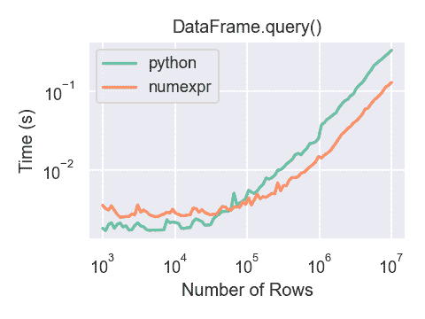

# 索引和选择数据

> 原文：[`pandas.pydata.org/docs/user_guide/indexing.html`](https://pandas.pydata.org/docs/user_guide/indexing.html)

pandas 对象中的轴标签信息具有多种用途：

+   使用已知指标标识数据（即提供 *元数据*），对于分析、可视化和交互式控制台显示非常重要。

+   启用自动和明确的数据对齐。

+   允许直观地获取和设置数据集的子集。

在本节中，我们将重点放在最后一点上：即如何切片、切块和通常获取和设置 pandas 对象的子集。���要关注将放在 Series 和 DataFrame 上，因为它们在这个领域接受了更多的开发关注。

注意

Python 和 NumPy 索引运算符 `[]` 和属性运算符 `.` 提供了对 pandas 数据结构的快速简便访问，适用于各种用例。这使得交互式工作变得直观，因为如果你已经知道如何处理 Python 字典和 NumPy 数组，那么学习成本很低。然而，由于要访问的数据类型事先未知，直接使用标准运算符存在一些优化限制。对于生产代码，我们建议您利用本章节中提供的优化的 pandas 数据访问方法。

警告

对于设置操作，返回的是副本还是引用，可能取决于上下文。有时这被称为 `chained assignment`，应该避免。请参阅返回视图与副本。

在 MultiIndex / 高级索引中查看 `MultiIndex` 和更高级的索引文档。

在食谱中查看一些高级策略。

## 不同的索引选择

为了支持更明确的基于位置的索引，对象选择已经增加了一些用户请求的内容。pandas 现在支持三种类型的多轴索引。

+   `.loc` 主要基于标签，但也可以与布尔数组一起使用。当未找到项目时，`.loc` 会引发 `KeyError`。允许的输入包括：

    > +   单个标签，例如 `5` 或 `'a'`（请注意，`5` 被解释为索引的 *标签*。这种用法**不是**索引上的整数位置。）。
    > +   
    > +   一个标签列表或数组 `['a', 'b', 'c']`。
    > +   
    > +   一个带有标签 `'a':'f'` 的切片对象（请注意，与通常的 Python 切片相反，**开始和停止都包括在内**，当存在于索引中时！请参阅使用标签切片和端点是包含的。）
    > +   
    > +   布尔数组（任何 `NA` 值将被视为 `False`）。
    > +   
    > +   一个带有一个参数（调用的 Series 或 DataFrame）的 `callable` 函数，并返回用于索引的有效输出（上述之一）。
    > +   
    > +   一个包含上述输入之一的行（和列）索引的元组。

    在按标签选择中查看更多信息。

+   `.iloc`主要基于整数位置（从轴的`0`到`length-1`），但也可以与布尔数组一起使用。如果请求的索引器超出范围，`.iloc`将引发`IndexError`，除了*切片*索引器允许超出范围索引（这符合 Python/NumPy 的*切片*语义）。允许的输入为：

    > +   一个整数，例如`5`。
    > +   
    > +   整数列表或数组`[4, 3, 0]`。
    > +   
    > +   一个包含整数`1:7`的切片对象。
    > +   
    > +   布尔数组（任何`NA`值将被视为`False`）。
    > +   
    > +   一个带有一个参数（调用的 Series 或 DataFrame）的`callable`函数，并返回用于索引的有效输出（上述之一）。
    > +   
    > +   一个包含行（和列）索引的元组，其元素是上述输入之一。

    查看更多内容请参考按位置选择，高级索引和高级分层。

+   `.loc`、`.iloc`，以及`[]`索引可以接受`callable`作为索引器。查看更多内容请参考按 callable 选择。

    注意

    将元组键解构为行（和列）索引发生在调用可调用函数之前，因此您不能从可调用函数返回元组以同时索引���和列。

从具有多轴选择的对象获取值使用以下表示法（以`.loc`为例，但以下内容也适用于`.iloc`）。任何轴访问器都可以是空切片`:`。规范中省略的轴被假定为`:`，例如`p.loc['a']`等同于`p.loc['a', :]`。

| 对象类型 | 索引器 |
| --- | --- |
| Series | `s.loc[indexer]` |

| DataFrame | `df.loc[row_indexer,column_indexer]` |  ## 基础知识

如在上一节介绍数据结构时提到的，使用`[]`进行索引（在 Python 中实现类行为的熟悉者称之为`__getitem__`）的主要功能是选择出低维度切片。下表显示了使用`[]`对 pandas 对象进行索引时的返回类型值：

| 对象类型 | 选择 | 返回值类型 |
| --- | --- | --- |
| Series | `series[label]` | 标量值 |
| DataFrame | `frame[colname]` | 与 colname 对应的`Series` |

这里我们构建一个简单的时间序列数据集，用于说明索引功能：

```py
In [1]: dates = pd.date_range('1/1/2000', periods=8)

In [2]: df = pd.DataFrame(np.random.randn(8, 4),
 ...:                  index=dates, columns=['A', 'B', 'C', 'D'])
 ...: 

In [3]: df
Out[3]: 
 A         B         C         D
2000-01-01  0.469112 -0.282863 -1.509059 -1.135632
2000-01-02  1.212112 -0.173215  0.119209 -1.044236
2000-01-03 -0.861849 -2.104569 -0.494929  1.071804
2000-01-04  0.721555 -0.706771 -1.039575  0.271860
2000-01-05 -0.424972  0.567020  0.276232 -1.087401
2000-01-06 -0.673690  0.113648 -1.478427  0.524988
2000-01-07  0.404705  0.577046 -1.715002 -1.039268
2000-01-08 -0.370647 -1.157892 -1.344312  0.844885 
```

注意

除非特别说明，否则索引功能都不是特定于时间序列的。

因此，根据上述，我们可以使用`[]`进行最基本的索引：

```py
In [4]: s = df['A']

In [5]: s[dates[5]]
Out[5]: -0.6736897080883706 
```

您可以传递一个列列表给`[]`以按顺序选择列。如果 DataFrame 中不包含某列，将引发异常。也可以以这种方式设置多个列：

```py
In [6]: df
Out[6]: 
 A         B         C         D
2000-01-01  0.469112 -0.282863 -1.509059 -1.135632
2000-01-02  1.212112 -0.173215  0.119209 -1.044236
2000-01-03 -0.861849 -2.104569 -0.494929  1.071804
2000-01-04  0.721555 -0.706771 -1.039575  0.271860
2000-01-05 -0.424972  0.567020  0.276232 -1.087401
2000-01-06 -0.673690  0.113648 -1.478427  0.524988
2000-01-07  0.404705  0.577046 -1.715002 -1.039268
2000-01-08 -0.370647 -1.157892 -1.344312  0.844885

In [7]: df[['B', 'A']] = df[['A', 'B']]

In [8]: df
Out[8]: 
 A         B         C         D
2000-01-01 -0.282863  0.469112 -1.509059 -1.135632
2000-01-02 -0.173215  1.212112  0.119209 -1.044236
2000-01-03 -2.104569 -0.861849 -0.494929  1.071804
2000-01-04 -0.706771  0.721555 -1.039575  0.271860
2000-01-05  0.567020 -0.424972  0.276232 -1.087401
2000-01-06  0.113648 -0.673690 -1.478427  0.524988
2000-01-07  0.577046  0.404705 -1.715002 -1.039268
2000-01-08 -1.157892 -0.370647 -1.344312  0.844885 
```

您可能会发现这对于对一部分列应用变换（就地）很有用。

警告

当使用`.loc`设置`Series`和`DataFrame`时，pandas 会对齐所有轴。

这不会修改`df`，因为列对齐是在赋值之前进行的。

```py
In [9]: df[['A', 'B']]
Out[9]: 
 A         B
2000-01-01 -0.282863  0.469112
2000-01-02 -0.173215  1.212112
2000-01-03 -2.104569 -0.861849
2000-01-04 -0.706771  0.721555
2000-01-05  0.567020 -0.424972
2000-01-06  0.113648 -0.673690
2000-01-07  0.577046  0.404705
2000-01-08 -1.157892 -0.370647

In [10]: df.loc[:, ['B', 'A']] = df[['A', 'B']]

In [11]: df[['A', 'B']]
Out[11]: 
 A         B
2000-01-01 -0.282863  0.469112
2000-01-02 -0.173215  1.212112
2000-01-03 -2.104569 -0.861849
2000-01-04 -0.706771  0.721555
2000-01-05  0.567020 -0.424972
2000-01-06  0.113648 -0.673690
2000-01-07  0.577046  0.404705
2000-01-08 -1.157892 -0.370647 
```

交换列值的正确方式是使用原始值：

```py
In [12]: df.loc[:, ['B', 'A']] = df[['A', 'B']].to_numpy()

In [13]: df[['A', 'B']]
Out[13]: 
 A         B
2000-01-01  0.469112 -0.282863
2000-01-02  1.212112 -0.173215
2000-01-03 -0.861849 -2.104569
2000-01-04  0.721555 -0.706771
2000-01-05 -0.424972  0.567020
2000-01-06 -0.673690  0.113648
2000-01-07  0.404705  0.577046
2000-01-08 -0.370647 -1.157892 
```

然而，当使用`.iloc`设置`Series`和`DataFrame`时，pandas 不会对轴进行对齐，因为`.iloc`是按位置操作的。

这将修改`df`，因为在值分配之前未执行列对齐。

```py
In [14]: df[['A', 'B']]
Out[14]: 
 A         B
2000-01-01  0.469112 -0.282863
2000-01-02  1.212112 -0.173215
2000-01-03 -0.861849 -2.104569
2000-01-04  0.721555 -0.706771
2000-01-05 -0.424972  0.567020
2000-01-06 -0.673690  0.113648
2000-01-07  0.404705  0.577046
2000-01-08 -0.370647 -1.157892

In [15]: df.iloc[:, [1, 0]] = df[['A', 'B']]

In [16]: df[['A','B']]
Out[16]: 
 A         B
2000-01-01 -0.282863  0.469112
2000-01-02 -0.173215  1.212112
2000-01-03 -2.104569 -0.861849
2000-01-04 -0.706771  0.721555
2000-01-05  0.567020 -0.424972
2000-01-06  0.113648 -0.673690
2000-01-07  0.577046  0.404705
2000-01-08 -1.157892 -0.370647 
```

## 属性访问

您可以直接访问`Series`上的索引或`DataFrame`上的列作为属性：

```py
In [17]: sa = pd.Series([1, 2, 3], index=list('abc'))

In [18]: dfa = df.copy() 
```

```py
In [19]: sa.b
Out[19]: 2

In [20]: dfa.A
Out[20]: 
2000-01-01   -0.282863
2000-01-02   -0.173215
2000-01-03   -2.104569
2000-01-04   -0.706771
2000-01-05    0.567020
2000-01-06    0.113648
2000-01-07    0.577046
2000-01-08   -1.157892
Freq: D, Name: A, dtype: float64 
```

```py
In [21]: sa.a = 5

In [22]: sa
Out[22]: 
a    5
b    2
c    3
dtype: int64

In [23]: dfa.A = list(range(len(dfa.index)))  # ok if A already exists

In [24]: dfa
Out[24]: 
 A         B         C         D
2000-01-01  0  0.469112 -1.509059 -1.135632
2000-01-02  1  1.212112  0.119209 -1.044236
2000-01-03  2 -0.861849 -0.494929  1.071804
2000-01-04  3  0.721555 -1.039575  0.271860
2000-01-05  4 -0.424972  0.276232 -1.087401
2000-01-06  5 -0.673690 -1.478427  0.524988
2000-01-07  6  0.404705 -1.715002 -1.039268
2000-01-08  7 -0.370647 -1.344312  0.844885

In [25]: dfa['A'] = list(range(len(dfa.index)))  # use this form to create a new column

In [26]: dfa
Out[26]: 
 A         B         C         D
2000-01-01  0  0.469112 -1.509059 -1.135632
2000-01-02  1  1.212112  0.119209 -1.044236
2000-01-03  2 -0.861849 -0.494929  1.071804
2000-01-04  3  0.721555 -1.039575  0.271860
2000-01-05  4 -0.424972  0.276232 -1.087401
2000-01-06  5 -0.673690 -1.478427  0.524988
2000-01-07  6  0.404705 -1.715002 -1.039268
2000-01-08  7 -0.370647 -1.344312  0.844885 
```

警告

+   只有当索引元素是有效的 Python 标识符时，才能使用此访问，例如`s.1`是不允许的。请参阅[此处以获取有效标识符的解释](https://docs.python.org/3/reference/lexical_analysis.html#identifiers)。

+   如果属性与现有方法名称冲突，则该属性将不可用，例如`s.min`是不允许的，但`s['min']`是可能的。

+   类似地，如果属性与以下列表中的任何一个冲突，则该属性将不可用：`index`，`major_axis`，`minor_axis`，`items`。

+   在任何这些情况下，标准索引仍然有效，例如`s['1']`，`s['min']`和`s['index']`将访问相应的元素或列。

如果您在 IPython 环境中使用，还可以使用制表符补全来查看这些可访问的属性。

您还可以将`dict`分配给`DataFrame`的一行：

```py
In [27]: x = pd.DataFrame({'x': [1, 2, 3], 'y': [3, 4, 5]})

In [28]: x.iloc[1] = {'x': 9, 'y': 99}

In [29]: x
Out[29]: 
 x   y
0  1   3
1  9  99
2  3   5 
```

您可以使用属性访问来修改 Series 的现有元素或 DataFrame 的列，但要小心；如果尝试使用属性访问创建新列，则会创建一个新属性而不是新列，并且会引发`UserWarning`：

```py
In [30]: df_new = pd.DataFrame({'one': [1., 2., 3.]})

In [31]: df_new.two = [4, 5, 6]

In [32]: df_new
Out[32]: 
 one
0  1.0
1  2.0
2  3.0 
```

## 切片范围

沿着任意轴切片范围的最稳健和一致的方法在按位置选择部分详细描述了`.iloc`方法。现在，我们解释使用`[]`运算符进行切片的语义。

对于 Series，语法与 ndarray 完全相同，返回值的切片和相应的标签：

```py
In [33]: s[:5]
Out[33]: 
2000-01-01    0.469112
2000-01-02    1.212112
2000-01-03   -0.861849
2000-01-04    0.721555
2000-01-05   -0.424972
Freq: D, Name: A, dtype: float64

In [34]: s[::2]
Out[34]: 
2000-01-01    0.469112
2000-01-03   -0.861849
2000-01-05   -0.424972
2000-01-07    0.404705
Freq: 2D, Name: A, dtype: float64

In [35]: s[::-1]
Out[35]: 
2000-01-08   -0.370647
2000-01-07    0.404705
2000-01-06   -0.673690
2000-01-05   -0.424972
2000-01-04    0.721555
2000-01-03   -0.861849
2000-01-02    1.212112
2000-01-01    0.469112
Freq: -1D, Name: A, dtype: float64 
```

请注意，设置也有效：

```py
In [36]: s2 = s.copy()

In [37]: s2[:5] = 0

In [38]: s2
Out[38]: 
2000-01-01    0.000000
2000-01-02    0.000000
2000-01-03    0.000000
2000-01-04    0.000000
2000-01-05    0.000000
2000-01-06   -0.673690
2000-01-07    0.404705
2000-01-08   -0.370647
Freq: D, Name: A, dtype: float64 
```

对于 DataFrame，在`[]`内部切片**切片行**。这在很大程度上是为了方便，因为这是一个常见的操作。

```py
In [39]: df[:3]
Out[39]: 
 A         B         C         D
2000-01-01 -0.282863  0.469112 -1.509059 -1.135632
2000-01-02 -0.173215  1.212112  0.119209 -1.044236
2000-01-03 -2.104569 -0.861849 -0.494929  1.071804

In [40]: df[::-1]
Out[40]: 
 A         B         C         D
2000-01-08 -1.157892 -0.370647 -1.344312  0.844885
2000-01-07  0.577046  0.404705 -1.715002 -1.039268
2000-01-06  0.113648 -0.673690 -1.478427  0.524988
2000-01-05  0.567020 -0.424972  0.276232 -1.087401
2000-01-04 -0.706771  0.721555 -1.039575  0.271860
2000-01-03 -2.104569 -0.861849 -0.494929  1.071804
2000-01-02 -0.173215  1.212112  0.119209 -1.044236
2000-01-01 -0.282863  0.469112 -1.509059 -1.135632 
```

## 按标签选择

警告

在设置操作中，返回的是副本还是引用，可能取决于上下文。有时这被称为`链式赋值`，应该避免。请参阅返回视图与副本。

警告

> 当您提供与索引类型不兼容（或可转换）的切片器时，`.loc`是严格的。例如，在`DatetimeIndex`中使用整数。这将引发`TypeError`。
> 
> ```py
> In [41]: dfl = pd.DataFrame(np.random.randn(5, 4),
>  ....:                   columns=list('ABCD'),
>  ....:                   index=pd.date_range('20130101', periods=5))
>  ....: 
> 
> In [42]: dfl
> Out[42]: 
>  A         B         C         D
> 2013-01-01  1.075770 -0.109050  1.643563 -1.469388
> 2013-01-02  0.357021 -0.674600 -1.776904 -0.968914
> 2013-01-03 -1.294524  0.413738  0.276662 -0.472035
> 2013-01-04 -0.013960 -0.362543 -0.006154 -0.923061
> 2013-01-05  0.895717  0.805244 -1.206412  2.565646
> 
> In [43]: dfl.loc[2:3]
> ---------------------------------------------------------------------------
> TypeError  Traceback (most recent call last)
> Cell In[43], line 1
> ----> 1 dfl.loc[2:3]
> 
> File ~/work/pandas/pandas/pandas/core/indexing.py:1191, in _LocationIndexer.__getitem__(self, key)
>   1189 maybe_callable = com.apply_if_callable(key, self.obj)
>   1190 maybe_callable = self._check_deprecated_callable_usage(key, maybe_callable)
> -> 1191 return self._getitem_axis(maybe_callable, axis=axis)
> 
> File ~/work/pandas/pandas/pandas/core/indexing.py:1411, in _LocIndexer._getitem_axis(self, key, axis)
>   1409 if isinstance(key, slice):
>   1410     self._validate_key(key, axis)
> -> 1411     return self._get_slice_axis(key, axis=axis)
>   1412 elif com.is_bool_indexer(key):
>   1413     return self._getbool_axis(key, axis=axis)
> 
> File ~/work/pandas/pandas/pandas/core/indexing.py:1443, in _LocIndexer._get_slice_axis(self, slice_obj, axis)
>   1440     return obj.copy(deep=False)
>   1442 labels = obj._get_axis(axis)
> -> 1443 indexer = labels.slice_indexer(slice_obj.start, slice_obj.stop, slice_obj.step)
>   1445 if isinstance(indexer, slice):
>   1446     return self.obj._slice(indexer, axis=axis)
> 
> File ~/work/pandas/pandas/pandas/core/indexes/datetimes.py:682, in DatetimeIndex.slice_indexer(self, start, end, step)
>   674 # GH#33146 if start and end are combinations of str and None and Index is not
>   675 # monotonic, we can not use Index.slice_indexer because it does not honor the
>   676 # actual elements, is only searching for start and end
>   677 if (
>   678     check_str_or_none(start)
>   679     or check_str_or_none(end)
>   680     or self.is_monotonic_increasing
>   681 ):
> --> 682     return Index.slice_indexer(self, start, end, step)
>   684 mask = np.array(True)
>   685 in_index = True
> 
> File ~/work/pandas/pandas/pandas/core/indexes/base.py:6662, in Index.slice_indexer(self, start, end, step)
>   6618 def slice_indexer(
>   6619     self,
>   6620     start: Hashable | None = None,
>   6621     end: Hashable | None = None,
>   6622     step: int | None = None,
>   6623 ) -> slice:
>   6624  """
>   6625 Compute the slice indexer for input labels and step.
>   6626  
>  (...)
>   6660 slice(1, 3, None)
>   6661 """
> -> 6662     start_slice, end_slice = self.slice_locs(start, end, step=step)
>   6664     # return a slice
>   6665     if not is_scalar(start_slice):
> 
> File ~/work/pandas/pandas/pandas/core/indexes/base.py:6879, in Index.slice_locs(self, start, end, step)
>   6877 start_slice = None
>   6878 if start is not None:
> -> 6879     start_slice = self.get_slice_bound(start, "left")
>   6880 if start_slice is None:
>   6881     start_slice = 0
> 
> File ~/work/pandas/pandas/pandas/core/indexes/base.py:6794, in Index.get_slice_bound(self, label, side)
>   6790 original_label = label
>   6792 # For datetime indices label may be a string that has to be converted
>   6793 # to datetime boundary according to its resolution.
> -> 6794 label = self._maybe_cast_slice_bound(label, side)
>   6796 # we need to look up the label
>   6797 try:
> 
> File ~/work/pandas/pandas/pandas/core/indexes/datetimes.py:642, in DatetimeIndex._maybe_cast_slice_bound(self, label, side)
>   637 if isinstance(label, dt.date) and not isinstance(label, dt.datetime):
>   638     # Pandas supports slicing with dates, treated as datetimes at midnight.
>   639     # https://github.com/pandas-dev/pandas/issues/31501
>   640     label = Timestamp(label).to_pydatetime()
> --> 642 label = super()._maybe_cast_slice_bound(label, side)
>   643 self._data._assert_tzawareness_compat(label)
>   644 return Timestamp(label)
> 
> File ~/work/pandas/pandas/pandas/core/indexes/datetimelike.py:378, in DatetimeIndexOpsMixin._maybe_cast_slice_bound(self, label, side)
>   376     return lower if side == "left" else upper
>   377 elif not isinstance(label, self._data._recognized_scalars):
> --> 378     self._raise_invalid_indexer("slice", label)
>   380 return label
> 
> File ~/work/pandas/pandas/pandas/core/indexes/base.py:4301, in Index._raise_invalid_indexer(self, form, key, reraise)
>   4299 if reraise is not lib.no_default:
>   4300     raise TypeError(msg) from reraise
> -> 4301 raise TypeError(msg)
> 
> TypeError: cannot do slice indexing on DatetimeIndex with these indexers [2] of type int 
> ```

字符串切片中的*可以*转换为索引类型，并导致自然切片。

```py
In [44]: dfl.loc['20130102':'20130104']
Out[44]: 
 A         B         C         D
2013-01-02  0.357021 -0.674600 -1.776904 -0.968914
2013-01-03 -1.294524  0.413738  0.276662 -0.472035
2013-01-04 -0.013960 -0.362543 -0.006154 -0.923061 
```

pandas 提供了一套方法，以实现**纯标签索引**。这是一个严格的包含协议。每个要求的标签必须在索引中，否则将引发`KeyError`。在切片时，如果存在于索引中，则起始边界**和**停止边界都*包括*。整数是有效的标签，但它们指的是标签**而不是位置**。

`.loc`属性是主要的访问方法。以下是有效的输入：

+   一个单个标签，例如`5`或`'a'`（请注意，`5`被解释为索引的*标签*。这种用法**不是**索引上的整数位置。）。

+   一个标签列表或数组`['a', 'b', 'c']`。

+   一个带有标签`'a':'f'`的切片对象（请注意，与通常的 Python 切片相反，**当索引中存在时**，起始和停止都包括在内！请参见使用标签切片）。

+   一个布尔数组。

+   一个`callable`，请参见通过 callable 选择。

```py
In [45]: s1 = pd.Series(np.random.randn(6), index=list('abcdef'))

In [46]: s1
Out[46]: 
a    1.431256
b    1.340309
c   -1.170299
d   -0.226169
e    0.410835
f    0.813850
dtype: float64

In [47]: s1.loc['c':]
Out[47]: 
c   -1.170299
d   -0.226169
e    0.410835
f    0.813850
dtype: float64

In [48]: s1.loc['b']
Out[48]: 1.3403088497993827 
```

请注意，设置也可以：

```py
In [49]: s1.loc['c':] = 0

In [50]: s1
Out[50]: 
a    1.431256
b    1.340309
c    0.000000
d    0.000000
e    0.000000
f    0.000000
dtype: float64 
```

使用 DataFrame：

```py
In [51]: df1 = pd.DataFrame(np.random.randn(6, 4),
 ....:                   index=list('abcdef'),
 ....:                   columns=list('ABCD'))
 ....: 

In [52]: df1
Out[52]: 
 A         B         C         D
a  0.132003 -0.827317 -0.076467 -1.187678
b  1.130127 -1.436737 -1.413681  1.607920
c  1.024180  0.569605  0.875906 -2.211372
d  0.974466 -2.006747 -0.410001 -0.078638
e  0.545952 -1.219217 -1.226825  0.769804
f -1.281247 -0.727707 -0.121306 -0.097883

In [53]: df1.loc[['a', 'b', 'd'], :]
Out[53]: 
 A         B         C         D
a  0.132003 -0.827317 -0.076467 -1.187678
b  1.130127 -1.436737 -1.413681  1.607920
d  0.974466 -2.006747 -0.410001 -0.078638 
```

通过标签切片访问：

```py
In [54]: df1.loc['d':, 'A':'C']
Out[54]: 
 A         B         C
d  0.974466 -2.006747 -0.410001
e  0.545952 -1.219217 -1.226825
f -1.281247 -0.727707 -0.121306 
```

通过标签获取交叉部分（等同于`df.xs('a')`）：

```py
In [55]: df1.loc['a']
Out[55]: 
A    0.132003
B   -0.827317
C   -0.076467
D   -1.187678
Name: a, dtype: float64 
```

通过布尔数组获取值：

```py
In [56]: df1.loc['a'] > 0
Out[56]: 
A     True
B    False
C    False
D    False
Name: a, dtype: bool

In [57]: df1.loc[:, df1.loc['a'] > 0]
Out[57]: 
 A
a  0.132003
b  1.130127
c  1.024180
d  0.974466
e  0.545952
f -1.281247 
```

布尔数组中的 NA 值传播为`False`：

```py
In [58]: mask = pd.array([True, False, True, False, pd.NA, False], dtype="boolean")

In [59]: mask
Out[59]: 
<BooleanArray>
[True, False, True, False, <NA>, False]
Length: 6, dtype: boolean

In [60]: df1[mask]
Out[60]: 
 A         B         C         D
a  0.132003 -0.827317 -0.076467 -1.187678
c  1.024180  0.569605  0.875906 -2.211372 
```

明确获取一个值：

```py
# this is also equivalent to ``df1.at['a','A']``
In [61]: df1.loc['a', 'A']
Out[61]: 0.13200317033032932 
```

### 使用标签切片

使用切片与`.loc`一起使��时，如果起始和停止标签都存在于索引中，则返回两者之间（包括它们）的元素：

```py
In [62]: s = pd.Series(list('abcde'), index=[0, 3, 2, 5, 4])

In [63]: s.loc[3:5]
Out[63]: 
3    b
2    c
5    d
dtype: object 
```

如果两者中至少有一个缺失，但索引已排序，并且可以与起始和停止标签进行比较，则切片仍将按预期工作，通过选择介于两者之间的标签：

```py
In [64]: s.sort_index()
Out[64]: 
0    a
2    c
3    b
4    e
5    d
dtype: object

In [65]: s.sort_index().loc[1:6]
Out[65]: 
2    c
3    b
4    e
5    d
dtype: object 
```

但是，如果两者中至少有一个缺失*且*索引未排序，则会引发错误（因为否则会在计算上昂贵，以及对于混合类型索引可能会产生歧义）。例如，在上面的示例中，`s.loc[1:6]`会引发`KeyError`。

有关此行为背后的原理，请参见端点是包容的。

```py
In [66]: s = pd.Series(list('abcdef'), index=[0, 3, 2, 5, 4, 2])

In [67]: s.loc[3:5]
Out[67]: 
3    b
2    c
5    d
dtype: object 
```

此外，如果索引具有重复标签*且*起始或停止标签重复，则会引发错误。例如，在上面的示例中，`s.loc[2:5]`会引发`KeyError`。

有关重复标签的更多信息，请参见重复标签。## 通过位置选择

警告

对于设置操作返回的是副本还是引用，可能取决于上下文。有时这被称为`chained assignment`，应该避免。请参见返回视图与副本。

pandas 提供了一套方法，以便获得**纯整数索引**。语义紧随 Python 和 NumPy 的切片。这些是`0-based`索引。在切片时，起始边界是*包含*的，而上限是*排除*的。尝试使用非整数，即使是**有效**标签也会引发`IndexError`。

`.iloc`属性是主要访问方法。以下是有效的输入：

+   一个整数，例如`5`。

+   一个整数列表或数组`[4, 3, 0]`。

+   一个带有整数`1:7`的切片对象。

+   一个布尔数组。

+   一个`callable`，请参见通过 callable 选择。

+   一个包含上述类型之一的行（和列）索引的元组。

```py
In [68]: s1 = pd.Series(np.random.randn(5), index=list(range(0, 10, 2)))

In [69]: s1
Out[69]: 
0    0.695775
2    0.341734
4    0.959726
6   -1.110336
8   -0.619976
dtype: float64

In [70]: s1.iloc[:3]
Out[70]: 
0    0.695775
2    0.341734
4    0.959726
dtype: float64

In [71]: s1.iloc[3]
Out[71]: -1.110336102891167 
```

请注意，设置也可以：

```py
In [72]: s1.iloc[:3] = 0

In [73]: s1
Out[73]: 
0    0.000000
2    0.000000
4    0.000000
6   -1.110336
8   -0.619976
dtype: float64 
```

使用 DataFrame：

```py
In [74]: df1 = pd.DataFrame(np.random.randn(6, 4),
 ....:                   index=list(range(0, 12, 2)),
 ....:                   columns=list(range(0, 8, 2)))
 ....: 

In [75]: df1
Out[75]: 
 0         2         4         6
0   0.149748 -0.732339  0.687738  0.176444
2   0.403310 -0.154951  0.301624 -2.179861
4  -1.369849 -0.954208  1.462696 -1.743161
6  -0.826591 -0.345352  1.314232  0.690579
8   0.995761  2.396780  0.014871  3.357427
10 -0.317441 -1.236269  0.896171 -0.487602 
```

通过整数切片选择：

```py
In [76]: df1.iloc[:3]
Out[76]: 
 0         2         4         6
0  0.149748 -0.732339  0.687738  0.176444
2  0.403310 -0.154951  0.301624 -2.179861
4 -1.369849 -0.954208  1.462696 -1.743161

In [77]: df1.iloc[1:5, 2:4]
Out[77]: 
 4         6
2  0.301624 -2.179861
4  1.462696 -1.743161
6  1.314232  0.690579
8  0.014871  3.357427 
```

通过整数列表选择：

```py
In [78]: df1.iloc[[1, 3, 5], [1, 3]]
Out[78]: 
 2         6
2  -0.154951 -2.179861
6  -0.345352  0.690579
10 -1.236269 -0.487602 
```

```py
In [79]: df1.iloc[1:3, :]
Out[79]: 
 0         2         4         6
2  0.403310 -0.154951  0.301624 -2.179861
4 -1.369849 -0.954208  1.462696 -1.743161 
```

```py
In [80]: df1.iloc[:, 1:3]
Out[80]: 
 2         4
0  -0.732339  0.687738
2  -0.154951  0.301624
4  -0.954208  1.462696
6  -0.345352  1.314232
8   2.396780  0.014871
10 -1.236269  0.896171 
```

```py
# this is also equivalent to ``df1.iat[1,1]``
In [81]: df1.iloc[1, 1]
Out[81]: -0.1549507744249032 
```

通过整数位置获取交叉部分（等同于`df.xs(1)`）：

```py
In [82]: df1.iloc[1]
Out[82]: 
0    0.403310
2   -0.154951
4    0.301624
6   -2.179861
Name: 2, dtype: float64 
```

超出范围的切片索引会像在 Python/NumPy 中一样得到很好的处理。

```py
# these are allowed in Python/NumPy.
In [83]: x = list('abcdef')

In [84]: x
Out[84]: ['a', 'b', 'c', 'd', 'e', 'f']

In [85]: x[4:10]
Out[85]: ['e', 'f']

In [86]: x[8:10]
Out[86]: []

In [87]: s = pd.Series(x)

In [88]: s
Out[88]: 
0    a
1    b
2    c
3    d
4    e
5    f
dtype: object

In [89]: s.iloc[4:10]
Out[89]: 
4    e
5    f
dtype: object

In [90]: s.iloc[8:10]
Out[90]: Series([], dtype: object) 
```

注意，使用超出边界的切片可能导致一个空轴（例如返回一个空的 DataFrame）。

```py
In [91]: dfl = pd.DataFrame(np.random.randn(5, 2), columns=list('AB'))

In [92]: dfl
Out[92]: 
 A         B
0 -0.082240 -2.182937
1  0.380396  0.084844
2  0.432390  1.519970
3 -0.493662  0.600178
4  0.274230  0.132885

In [93]: dfl.iloc[:, 2:3]
Out[93]: 
Empty DataFrame
Columns: []
Index: [0, 1, 2, 3, 4]

In [94]: dfl.iloc[:, 1:3]
Out[94]: 
 B
0 -2.182937
1  0.084844
2  1.519970
3  0.600178
4  0.132885

In [95]: dfl.iloc[4:6]
Out[95]: 
 A         B
4  0.27423  0.132885 
```

一个超出边界的单个索引器将引发`IndexError`。任何元素超出边界的索引器列表将引发`IndexError`。

```py
In [96]: dfl.iloc[[4, 5, 6]]
---------------------------------------------------------------------------
IndexError  Traceback (most recent call last)
File ~/work/pandas/pandas/pandas/core/indexing.py:1714, in _iLocIndexer._get_list_axis(self, key, axis)
  1713 try:
-> 1714     return self.obj._take_with_is_copy(key, axis=axis)
  1715 except IndexError as err:
  1716     # re-raise with different error message, e.g. test_getitem_ndarray_3d

File ~/work/pandas/pandas/pandas/core/generic.py:4153, in NDFrame._take_with_is_copy(self, indices, axis)
  4144  """
  4145 Internal version of the `take` method that sets the `_is_copy`
  4146 attribute to keep track of the parent dataframe (using in indexing
 (...)
  4151 See the docstring of `take` for full explanation of the parameters.
  4152 """
-> 4153 result = self.take(indices=indices, axis=axis)
  4154 # Maybe set copy if we didn't actually change the index.

File ~/work/pandas/pandas/pandas/core/generic.py:4133, in NDFrame.take(self, indices, axis, **kwargs)
  4129     indices = np.arange(
  4130         indices.start, indices.stop, indices.step, dtype=np.intp
  4131     )
-> 4133 new_data = self._mgr.take(
  4134     indices,
  4135     axis=self._get_block_manager_axis(axis),
  4136     verify=True,
  4137 )
  4138 return self._constructor_from_mgr(new_data, axes=new_data.axes).__finalize__(
  4139     self, method="take"
  4140 )

File ~/work/pandas/pandas/pandas/core/internals/managers.py:891, in BaseBlockManager.take(self, indexer, axis, verify)
  890 n = self.shape[axis]
--> 891 indexer = maybe_convert_indices(indexer, n, verify=verify)
  893 new_labels = self.axes[axis].take(indexer)

File ~/work/pandas/pandas/pandas/core/indexers/utils.py:282, in maybe_convert_indices(indices, n, verify)
  281     if mask.any():
--> 282         raise IndexError("indices are out-of-bounds")
  283 return indices

IndexError: indices are out-of-bounds

The above exception was the direct cause of the following exception:

IndexError  Traceback (most recent call last)
Cell In[96], line 1
----> 1 dfl.iloc[[4, 5, 6]]

File ~/work/pandas/pandas/pandas/core/indexing.py:1191, in _LocationIndexer.__getitem__(self, key)
  1189 maybe_callable = com.apply_if_callable(key, self.obj)
  1190 maybe_callable = self._check_deprecated_callable_usage(key, maybe_callable)
-> 1191 return self._getitem_axis(maybe_callable, axis=axis)

File ~/work/pandas/pandas/pandas/core/indexing.py:1743, in _iLocIndexer._getitem_axis(self, key, axis)
  1741 # a list of integers
  1742 elif is_list_like_indexer(key):
-> 1743     return self._get_list_axis(key, axis=axis)
  1745 # a single integer
  1746 else:
  1747     key = item_from_zerodim(key)

File ~/work/pandas/pandas/pandas/core/indexing.py:1717, in _iLocIndexer._get_list_axis(self, key, axis)
  1714     return self.obj._take_with_is_copy(key, axis=axis)
  1715 except IndexError as err:
  1716     # re-raise with different error message, e.g. test_getitem_ndarray_3d
-> 1717     raise IndexError("positional indexers are out-of-bounds") from err

IndexError: positional indexers are out-of-bounds 
```

```py
In [97]: dfl.iloc[:, 4]
---------------------------------------------------------------------------
IndexError  Traceback (most recent call last)
Cell In[97], line 1
----> 1 dfl.iloc[:, 4]

File ~/work/pandas/pandas/pandas/core/indexing.py:1184, in _LocationIndexer.__getitem__(self, key)
  1182     if self._is_scalar_access(key):
  1183         return self.obj._get_value(*key, takeable=self._takeable)
-> 1184     return self._getitem_tuple(key)
  1185 else:
  1186     # we by definition only have the 0th axis
  1187     axis = self.axis or 0

File ~/work/pandas/pandas/pandas/core/indexing.py:1690, in _iLocIndexer._getitem_tuple(self, tup)
  1689 def _getitem_tuple(self, tup: tuple):
-> 1690     tup = self._validate_tuple_indexer(tup)
  1691     with suppress(IndexingError):
  1692         return self._getitem_lowerdim(tup)

File ~/work/pandas/pandas/pandas/core/indexing.py:966, in _LocationIndexer._validate_tuple_indexer(self, key)
  964 for i, k in enumerate(key):
  965     try:
--> 966         self._validate_key(k, i)
  967     except ValueError as err:
  968         raise ValueError(
  969             "Location based indexing can only have "
  970             f"[{self._valid_types}] types"
  971         ) from err

File ~/work/pandas/pandas/pandas/core/indexing.py:1592, in _iLocIndexer._validate_key(self, key, axis)
  1590     return
  1591 elif is_integer(key):
-> 1592     self._validate_integer(key, axis)
  1593 elif isinstance(key, tuple):
  1594     # a tuple should already have been caught by this point
  1595     # so don't treat a tuple as a valid indexer
  1596     raise IndexingError("Too many indexers")

File ~/work/pandas/pandas/pandas/core/indexing.py:1685, in _iLocIndexer._validate_integer(self, key, axis)
  1683 len_axis = len(self.obj._get_axis(axis))
  1684 if key >= len_axis or key < -len_axis:
-> 1685     raise IndexError("single positional indexer is out-of-bounds")

IndexError: single positional indexer is out-of-bounds 
```  ## 通过可调用进行选择

`.loc`、`.iloc`，还有`[]`索引可以接受`callable`作为索引器。`callable`必须是一个带有一个参数（调用的 Series 或 DataFrame）的函数，返回用于索引的有效输出。

注意

对于`.iloc`索引，不支持从可调用函数返回元组，因为在应用可调用函数之前会发生行和列索引的元组解构。

```py
In [98]: df1 = pd.DataFrame(np.random.randn(6, 4),
 ....:                   index=list('abcdef'),
 ....:                   columns=list('ABCD'))
 ....: 

In [99]: df1
Out[99]: 
 A         B         C         D
a -0.023688  2.410179  1.450520  0.206053
b -0.251905 -2.213588  1.063327  1.266143
c  0.299368 -0.863838  0.408204 -1.048089
d -0.025747 -0.988387  0.094055  1.262731
e  1.289997  0.082423 -0.055758  0.536580
f -0.489682  0.369374 -0.034571 -2.484478

In [100]: df1.loc[lambda df: df['A'] > 0, :]
Out[100]: 
 A         B         C         D
c  0.299368 -0.863838  0.408204 -1.048089
e  1.289997  0.082423 -0.055758  0.536580

In [101]: df1.loc[:, lambda df: ['A', 'B']]
Out[101]: 
 A         B
a -0.023688  2.410179
b -0.251905 -2.213588
c  0.299368 -0.863838
d -0.025747 -0.988387
e  1.289997  0.082423
f -0.489682  0.369374

In [102]: df1.iloc[:, lambda df: [0, 1]]
Out[102]: 
 A         B
a -0.023688  2.410179
b -0.251905 -2.213588
c  0.299368 -0.863838
d -0.025747 -0.988387
e  1.289997  0.082423
f -0.489682  0.369374

In [103]: df1[lambda df: df.columns[0]]
Out[103]: 
a   -0.023688
b   -0.251905
c    0.299368
d   -0.025747
e    1.289997
f   -0.489682
Name: A, dtype: float64 
```

你可以在`Series`中使用可调用的索引。

```py
In [104]: df1['A'].loc[lambda s: s > 0]
Out[104]: 
c    0.299368
e    1.289997
Name: A, dtype: float64 
```

使用这些方法/索引器，你可以在不使用临时变量的情况下链接数据选择操作。

```py
In [105]: bb = pd.read_csv('data/baseball.csv', index_col='id')

In [106]: (bb.groupby(['year', 'team']).sum(numeric_only=True)
 .....:   .loc[lambda df: df['r'] > 100])
 .....: 
Out[106]: 
 stint    g    ab    r    h  X2b  ...     so   ibb   hbp    sh    sf  gidp
year team                                   ... 
2007 CIN       6  379   745  101  203   35  ...  127.0  14.0   1.0   1.0  15.0  18.0
 DET       5  301  1062  162  283   54  ...  176.0   3.0  10.0   4.0   8.0  28.0
 HOU       4  311   926  109  218   47  ...  212.0   3.0   9.0  16.0   6.0  17.0
 LAN      11  413  1021  153  293   61  ...  141.0   8.0   9.0   3.0   8.0  29.0
 NYN      13  622  1854  240  509  101  ...  310.0  24.0  23.0  18.0  15.0  48.0
 SFN       5  482  1305  198  337   67  ...  188.0  51.0   8.0  16.0   6.0  41.0
 TEX       2  198   729  115  200   40  ...  140.0   4.0   5.0   2.0   8.0  16.0
 TOR       4  459  1408  187  378   96  ...  265.0  16.0  12.0   4.0  16.0  38.0

[8 rows x 18 columns] 
```  ## 结合位置和基于标签的索引

如果你希望从‘A’列的索引中获取第 0 和第 2 个元素，可以这样做：

```py
In [107]: dfd = pd.DataFrame({'A': [1, 2, 3],
 .....:                    'B': [4, 5, 6]},
 .....:                   index=list('abc'))
 .....: 

In [108]: dfd
Out[108]: 
 A  B
a  1  4
b  2  5
c  3  6

In [109]: dfd.loc[dfd.index[[0, 2]], 'A']
Out[109]: 
a    1
c    3
Name: A, dtype: int64 
```

这也可以使用`.iloc`来表示，通过在索引器上明确获取位置，并使用*位置*索引来选择内容。

```py
In [110]: dfd.iloc[[0, 2], dfd.columns.get_loc('A')]
Out[110]: 
a    1
c    3
Name: A, dtype: int64 
```

要获取*多个*索引器，可以使用`.get_indexer`：

```py
In [111]: dfd.iloc[[0, 2], dfd.columns.get_indexer(['A', 'B'])]
Out[111]: 
 A  B
a  1  4
c  3  6 
```

### 重新索引

实现选择可能未找到元素的惯用方法是通过`.reindex()`。另请参阅关于重新索引的部分。

```py
In [112]: s = pd.Series([1, 2, 3])

In [113]: s.reindex([1, 2, 3])
Out[113]: 
1    2.0
2    3.0
3    NaN
dtype: float64 
```

或者，如果你只想选择*有效*的键，下面是惯用且高效的方法；它保证保留所选内容的 dtype。

```py
In [114]: labels = [1, 2, 3]

In [115]: s.loc[s.index.intersection(labels)]
Out[115]: 
1    2
2    3
dtype: int64 
```

有重复索引将为`.reindex()`引发错误：

```py
In [116]: s = pd.Series(np.arange(4), index=['a', 'a', 'b', 'c'])

In [117]: labels = ['c', 'd']

In [118]: s.reindex(labels)
---------------------------------------------------------------------------
ValueError  Traceback (most recent call last)
Cell In[118], line 1
----> 1 s.reindex(labels)

File ~/work/pandas/pandas/pandas/core/series.py:5153, in Series.reindex(self, index, axis, method, copy, level, fill_value, limit, tolerance)
  5136 @doc(
  5137     NDFrame.reindex,  # type: ignore[has-type]
  5138     klass=_shared_doc_kwargs["klass"],
   (...)
  5151     tolerance=None,
  5152 ) -> Series:
-> 5153     return super().reindex(
  5154         index=index,
  5155         method=method,
  5156         copy=copy,
  5157         level=level,
  5158         fill_value=fill_value,
  5159         limit=limit,
  5160         tolerance=tolerance,
  5161     )

File ~/work/pandas/pandas/pandas/core/generic.py:5610, in NDFrame.reindex(self, labels, index, columns, axis, method, copy, level, fill_value, limit, tolerance)
  5607     return self._reindex_multi(axes, copy, fill_value)
  5609 # perform the reindex on the axes
-> 5610 return self._reindex_axes(
  5611     axes, level, limit, tolerance, method, fill_value, copy
  5612 ).__finalize__(self, method="reindex")

File ~/work/pandas/pandas/pandas/core/generic.py:5633, in NDFrame._reindex_axes(self, axes, level, limit, tolerance, method, fill_value, copy)
  5630     continue
  5632 ax = self._get_axis(a)
-> 5633 new_index, indexer = ax.reindex(
  5634     labels, level=level, limit=limit, tolerance=tolerance, method=method
  5635 )
  5637 axis = self._get_axis_number(a)
  5638 obj = obj._reindex_with_indexers(
  5639     {axis: [new_index, indexer]},
  5640     fill_value=fill_value,
  5641     copy=copy,
  5642     allow_dups=False,
  5643 )

File ~/work/pandas/pandas/pandas/core/indexes/base.py:4429, in Index.reindex(self, target, method, level, limit, tolerance)
  4426     raise ValueError("cannot handle a non-unique multi-index!")
  4427 elif not self.is_unique:
  4428     # GH#42568
-> 4429     raise ValueError("cannot reindex on an axis with duplicate labels")
  4430 else:
  4431     indexer, _ = self.get_indexer_non_unique(target)

ValueError: cannot reindex on an axis with duplicate labels 
```

通常，你可以将所需的标签与当前轴相交，然后重新索引。

```py
In [119]: s.loc[s.index.intersection(labels)].reindex(labels)
Out[119]: 
c    3.0
d    NaN
dtype: float64 
```

但是，如果你的结果索引重复，这仍然会引发错误。

```py
In [120]: labels = ['a', 'd']

In [121]: s.loc[s.index.intersection(labels)].reindex(labels)
---------------------------------------------------------------------------
ValueError  Traceback (most recent call last)
Cell In[121], line 1
----> 1 s.loc[s.index.intersection(labels)].reindex(labels)

File ~/work/pandas/pandas/pandas/core/series.py:5153, in Series.reindex(self, index, axis, method, copy, level, fill_value, limit, tolerance)
  5136 @doc(
  5137     NDFrame.reindex,  # type: ignore[has-type]
  5138     klass=_shared_doc_kwargs["klass"],
   (...)
  5151     tolerance=None,
  5152 ) -> Series:
-> 5153     return super().reindex(
  5154         index=index,
  5155         method=method,
  5156         copy=copy,
  5157         level=level,
  5158         fill_value=fill_value,
  5159         limit=limit,
  5160         tolerance=tolerance,
  5161     )

File ~/work/pandas/pandas/pandas/core/generic.py:5610, in NDFrame.reindex(self, labels, index, columns, axis, method, copy, level, fill_value, limit, tolerance)
  5607     return self._reindex_multi(axes, copy, fill_value)
  5609 # perform the reindex on the axes
-> 5610 return self._reindex_axes(
  5611     axes, level, limit, tolerance, method, fill_value, copy
  5612 ).__finalize__(self, method="reindex")

File ~/work/pandas/pandas/pandas/core/generic.py:5633, in NDFrame._reindex_axes(self, axes, level, limit, tolerance, method, fill_value, copy)
  5630     continue
  5632 ax = self._get_axis(a)
-> 5633 new_index, indexer = ax.reindex(
  5634     labels, level=level, limit=limit, tolerance=tolerance, method=method
  5635 )
  5637 axis = self._get_axis_number(a)
  5638 obj = obj._reindex_with_indexers(
  5639     {axis: [new_index, indexer]},
  5640     fill_value=fill_value,
  5641     copy=copy,
  5642     allow_dups=False,
  5643 )

File ~/work/pandas/pandas/pandas/core/indexes/base.py:4429, in Index.reindex(self, target, method, level, limit, tolerance)
  4426     raise ValueError("cannot handle a non-unique multi-index!")
  4427 elif not self.is_unique:
  4428     # GH#42568
-> 4429     raise ValueError("cannot reindex on an axis with duplicate labels")
  4430 else:
  4431     indexer, _ = self.get_indexer_non_unique(target)

ValueError: cannot reindex on an axis with duplicate labels 
```  ## 选择随机样本

从 Series 或 DataFrame 中随机选择行或列的方法是使用`sample()`方法。该方法默认会抽样行，并接受要返回的特定行/列数，或行的比例。

```py
In [122]: s = pd.Series([0, 1, 2, 3, 4, 5])

# When no arguments are passed, returns 1 row.
In [123]: s.sample()
Out[123]: 
4    4
dtype: int64

# One may specify either a number of rows:
In [124]: s.sample(n=3)
Out[124]: 
0    0
4    4
1    1
dtype: int64

# Or a fraction of the rows:
In [125]: s.sample(frac=0.5)
Out[125]: 
5    5
3    3
1    1
dtype: int64 
```

默认情况下，`sample`将最多返回每行一次，但也可以使用`replace`选项进行替换抽样：

```py
In [126]: s = pd.Series([0, 1, 2, 3, 4, 5])

# Without replacement (default):
In [127]: s.sample(n=6, replace=False)
Out[127]: 
0    0
1    1
5    5
3    3
2    2
4    4
dtype: int64

# With replacement:
In [128]: s.sample(n=6, replace=True)
Out[128]: 
0    0
4    4
3    3
2    2
4    4
4    4
dtype: int64 
```

默认情况下，每行被选择的概率相等，但如果你希望行具有不同的概率，可以将`sample`函数的抽样权重作为`weights`传递。这些权重可以是列表、NumPy 数组或 Series，但它们必须与你要抽样的对象的长度相同。缺失值将被视为权重为零，不允许 inf 值。如果权重不总和为 1，它们将通过将所有权重除以权重总和来重新规范化。例如：

```py
In [129]: s = pd.Series([0, 1, 2, 3, 4, 5])

In [130]: example_weights = [0, 0, 0.2, 0.2, 0.2, 0.4]

In [131]: s.sample(n=3, weights=example_weights)
Out[131]: 
5    5
4    4
3    3
dtype: int64

# Weights will be re-normalized automatically
In [132]: example_weights2 = [0.5, 0, 0, 0, 0, 0]

In [133]: s.sample(n=1, weights=example_weights2)
Out[133]: 
0    0
dtype: int64 
```

当应用于 DataFrame 时，你可以通过简单地将列的名称作为字符串传递来使用 DataFrame 的列作为抽样权重（前提是你正在抽样行而不是列）。

```py
In [134]: df2 = pd.DataFrame({'col1': [9, 8, 7, 6],
 .....:                    'weight_column': [0.5, 0.4, 0.1, 0]})
 .....: 

In [135]: df2.sample(n=3, weights='weight_column')
Out[135]: 
 col1  weight_column
1     8            0.4
0     9            0.5
2     7            0.1 
```

`sample`还允许用户使用`axis`参数而不是行来对列进行抽样。

```py
In [136]: df3 = pd.DataFrame({'col1': [1, 2, 3], 'col2': [2, 3, 4]})

In [137]: df3.sample(n=1, axis=1)
Out[137]: 
 col1
0     1
1     2
2     3 
```

最后，您还可以使用`random_state`参数为`sample`的随机数生成器设置种子，该参数将接受整数（作为种子）或 NumPy RandomState 对象。

```py
In [138]: df4 = pd.DataFrame({'col1': [1, 2, 3], 'col2': [2, 3, 4]})

# With a given seed, the sample will always draw the same rows.
In [139]: df4.sample(n=2, random_state=2)
Out[139]: 
 col1  col2
2     3     4
1     2     3

In [140]: df4.sample(n=2, random_state=2)
Out[140]: 
 col1  col2
2     3     4
1     2     3 
```

## 设置扩大

在为该轴设置不存在的键时，`.loc/[]`操作可以执行扩大。

在`Series`情况下，这实际上是一个追加操作。

```py
In [141]: se = pd.Series([1, 2, 3])

In [142]: se
Out[142]: 
0    1
1    2
2    3
dtype: int64

In [143]: se[5] = 5.

In [144]: se
Out[144]: 
0    1.0
1    2.0
2    3.0
5    5.0
dtype: float64 
```

通过`.loc`，可以在任一轴上扩大`DataFrame`。

```py
In [145]: dfi = pd.DataFrame(np.arange(6).reshape(3, 2),
 .....:                   columns=['A', 'B'])
 .....: 

In [146]: dfi
Out[146]: 
 A  B
0  0  1
1  2  3
2  4  5

In [147]: dfi.loc[:, 'C'] = dfi.loc[:, 'A']

In [148]: dfi
Out[148]: 
 A  B  C
0  0  1  0
1  2  3  2
2  4  5  4 
```

这类似于在`DataFrame`上进行`append`操作。

```py
In [149]: dfi.loc[3] = 5

In [150]: dfi
Out[150]: 
 A  B  C
0  0  1  0
1  2  3  2
2  4  5  4
3  5  5  5 
```

## 快速标量值获取和设置

由于使用`[]`进行索引必须处理许多情况（单标签访问、切片、布尔索引等），因此为了弄清楚您要求的内容，需要一些额外的开销。如果您只想访问标量值，最快的方法是使用在所有数据结构上实现的`at`和`iat`方法。

与`loc`类似，`at`提供基于**标签**的标量查找，而`iat`类似于`iloc`提供基于**整数**的查找

```py
In [151]: s.iat[5]
Out[151]: 5

In [152]: df.at[dates[5], 'A']
Out[152]: 0.1136484096888855

In [153]: df.iat[3, 0]
Out[153]: -0.7067711336300845 
```

您也可以使用这些相同的索引器进行设置。

```py
In [154]: df.at[dates[5], 'E'] = 7

In [155]: df.iat[3, 0] = 7 
```

如果索引器缺失，`at`可能会就地扩大对象。

```py
In [156]: df.at[dates[-1] + pd.Timedelta('1 day'), 0] = 7

In [157]: df
Out[157]: 
 A         B         C         D    E    0
2000-01-01 -0.282863  0.469112 -1.509059 -1.135632  NaN  NaN
2000-01-02 -0.173215  1.212112  0.119209 -1.044236  NaN  NaN
2000-01-03 -2.104569 -0.861849 -0.494929  1.071804  NaN  NaN
2000-01-04  7.000000  0.721555 -1.039575  0.271860  NaN  NaN
2000-01-05  0.567020 -0.424972  0.276232 -1.087401  NaN  NaN
2000-01-06  0.113648 -0.673690 -1.478427  0.524988  7.0  NaN
2000-01-07  0.577046  0.404705 -1.715002 -1.039268  NaN  NaN
2000-01-08 -1.157892 -0.370647 -1.344312  0.844885  NaN  NaN
2000-01-09       NaN       NaN       NaN       NaN  NaN  7.0 
```

## 布尔索引

另一个常见操作是使用布尔向量过滤数据。运算符有：`|`表示`或`，`&`表示`与`，`~`表示`非`。这些**必须**使用括号分组，因为默认情况下，Python 会将表达式如`df['A'] > 2 & df['B'] < 3`评估为`df['A'] > (2 & df['B']) < 3`，而期望的评估顺序是`(df['A'] > 2) & (df['B'] < 3)`。

使用布尔向量索引 Series 的方式与 NumPy ndarray 完全相同：

```py
In [158]: s = pd.Series(range(-3, 4))

In [159]: s
Out[159]: 
0   -3
1   -2
2   -1
3    0
4    1
5    2
6    3
dtype: int64

In [160]: s[s > 0]
Out[160]: 
4    1
5    2
6    3
dtype: int64

In [161]: s[(s < -1) | (s > 0.5)]
Out[161]: 
0   -3
1   -2
4    1
5    2
6    3
dtype: int64

In [162]: s[~(s < 0)]
Out[162]: 
3    0
4    1
5    2
6    3
dtype: int64 
```

您可以使用与 DataFrame 索引长度相同的布尔向量（例如，从 DataFrame 的列之一派生的内容）选择 DataFrame 的行：

```py
In [163]: df[df['A'] > 0]
Out[163]: 
 A         B         C         D    E   0
2000-01-04  7.000000  0.721555 -1.039575  0.271860  NaN NaN
2000-01-05  0.567020 -0.424972  0.276232 -1.087401  NaN NaN
2000-01-06  0.113648 -0.673690 -1.478427  0.524988  7.0 NaN
2000-01-07  0.577046  0.404705 -1.715002 -1.039268  NaN NaN 
```

列表推导和 Series 的`map`方法也可用于生成更复杂的条件：

```py
In [164]: df2 = pd.DataFrame({'a': ['one', 'one', 'two', 'three', 'two', 'one', 'six'],
 .....:                    'b': ['x', 'y', 'y', 'x', 'y', 'x', 'x'],
 .....:                    'c': np.random.randn(7)})
 .....: 

# only want 'two' or 'three'
In [165]: criterion = df2['a'].map(lambda x: x.startswith('t'))

In [166]: df2[criterion]
Out[166]: 
 a  b         c
2    two  y  0.041290
3  three  x  0.361719
4    two  y -0.238075

# equivalent but slower
In [167]: df2[[x.startswith('t') for x in df2['a']]]
Out[167]: 
 a  b         c
2    two  y  0.041290
3  three  x  0.361719
4    two  y -0.238075

# Multiple criteria
In [168]: df2[criterion & (df2['b'] == 'x')]
Out[168]: 
 a  b         c
3  three  x  0.361719 
```

使用选择方法按标签选择、按位置选择和高级索引，您可以使用布尔向量结合其他索引表达式沿多个轴选择。

```py
In [169]: df2.loc[criterion & (df2['b'] == 'x'), 'b':'c']
Out[169]: 
 b         c
3  x  0.361719 
```

警告

`iloc`支持两种布尔索引。如果索引器是布尔`Series`，则会引发错误。例如，在以下示例中，`df.iloc[s.values, 1]`是可以的。布尔索引器是一个数组。但`df.iloc[s, 1]`会引发`ValueError`。

```py
In [170]: df = pd.DataFrame([[1, 2], [3, 4], [5, 6]],
 .....:                  index=list('abc'),
 .....:                  columns=['A', 'B'])
 .....: 

In [171]: s = (df['A'] > 2)

In [172]: s
Out[172]: 
a    False
b     True
c     True
Name: A, dtype: bool

In [173]: df.loc[s, 'B']
Out[173]: 
b    4
c    6
Name: B, dtype: int64

In [174]: df.iloc[s.values, 1]
Out[174]: 
b    4
c    6
Name: B, dtype: int64 
```

## 使用 isin 进行索引

考虑`Series`的`isin()`方法，它返回一个布尔向量，其中`Series`元素存在于传递的列表中的位置为真。这使您可以选择具有您想要的值的一个或多个列的行：

```py
In [175]: s = pd.Series(np.arange(5), index=np.arange(5)[::-1], dtype='int64')

In [176]: s
Out[176]: 
4    0
3    1
2    2
1    3
0    4
dtype: int64

In [177]: s.isin([2, 4, 6])
Out[177]: 
4    False
3    False
2     True
1    False
0     True
dtype: bool

In [178]: s[s.isin([2, 4, 6])]
Out[178]: 
2    2
0    4
dtype: int64 
```

`Index`对象也可使用相同方法，并且在您不知道所寻标签中哪些实际存在时非常有用：

```py
In [179]: s[s.index.isin([2, 4, 6])]
Out[179]: 
4    0
2    2
dtype: int64

# compare it to the following
In [180]: s.reindex([2, 4, 6])
Out[180]: 
2    2.0
4    0.0
6    NaN
dtype: float64 
```

除此之外，`MultiIndex` 允许选择一个单独的级别用于成员检查：

```py
In [181]: s_mi = pd.Series(np.arange(6),
 .....:                 index=pd.MultiIndex.from_product([[0, 1], ['a', 'b', 'c']]))
 .....: 

In [182]: s_mi
Out[182]: 
0  a    0
 b    1
 c    2
1  a    3
 b    4
 c    5
dtype: int64

In [183]: s_mi.iloc[s_mi.index.isin([(1, 'a'), (2, 'b'), (0, 'c')])]
Out[183]: 
0  c    2
1  a    3
dtype: int64

In [184]: s_mi.iloc[s_mi.index.isin(['a', 'c', 'e'], level=1)]
Out[184]: 
0  a    0
 c    2
1  a    3
 c    5
dtype: int64 
```

DataFrame 还有一个 `isin()` 方法。在调用 `isin` 时，将一组值作为数组或字典传递。如果值是一个数组，`isin` 返回一个与原始 DataFrame 形状相同的布尔值 DataFrame，其中元素在值序列中的位置为 True。

```py
In [185]: df = pd.DataFrame({'vals': [1, 2, 3, 4], 'ids': ['a', 'b', 'f', 'n'],
 .....:                   'ids2': ['a', 'n', 'c', 'n']})
 .....: 

In [186]: values = ['a', 'b', 1, 3]

In [187]: df.isin(values)
Out[187]: 
 vals    ids   ids2
0   True   True   True
1  False   True  False
2   True  False  False
3  False  False  False 
```

通常你会想要将某些值与某些列匹配。只需将值设为一个 `dict`，其中键是列，值是你想要检查的项目列表。

```py
In [188]: values = {'ids': ['a', 'b'], 'vals': [1, 3]}

In [189]: df.isin(values)
Out[189]: 
 vals    ids   ids2
0   True   True  False
1  False   True  False
2   True  False  False
3  False  False  False 
```

要返回值不在原始 DataFrame 中的布尔值 DataFrame，请使用 `~` 运算符：

```py
In [190]: values = {'ids': ['a', 'b'], 'vals': [1, 3]}

In [191]: ~df.isin(values)
Out[191]: 
 vals    ids  ids2
0  False  False  True
1   True  False  True
2  False   True  True
3   True   True  True 
```

将 DataFrame 的 `isin` 与 `any()` 和 `all()` 方法结合使用，快速选择满足给定条件的数据子集。要选择每列都满足自己条件的行：

```py
In [192]: values = {'ids': ['a', 'b'], 'ids2': ['a', 'c'], 'vals': [1, 3]}

In [193]: row_mask = df.isin(values).all(1)

In [194]: df[row_mask]
Out[194]: 
 vals ids ids2
0     1   a    a 
```  ## `where()` 方法和掩码

使用布尔向量从 Series 中选择值通常会返回数据的子集。为了确保选择输出具有与原始数据相同的形状，可以在 `Series` 和 `DataFrame` 中使用 `where` 方法。

仅返回选定的行：

```py
In [195]: s[s > 0]
Out[195]: 
3    1
2    2
1    3
0    4
dtype: int64 
```

要返回与原始形状相同的 Series：

```py
In [196]: s.where(s > 0)
Out[196]: 
4    NaN
3    1.0
2    2.0
1    3.0
0    4.0
dtype: float64 
```

现在使用布尔条件从 DataFrame 中选择值也会保留输入数据形状。`where` 在幕后作为实现使用。下面的代码等同于 `df.where(df < 0)`。

```py
In [197]: dates = pd.date_range('1/1/2000', periods=8)

In [198]: df = pd.DataFrame(np.random.randn(8, 4),
 .....:                  index=dates, columns=['A', 'B', 'C', 'D'])
 .....: 

In [199]: df[df < 0]
Out[199]: 
 A         B         C         D
2000-01-01 -2.104139 -1.309525       NaN       NaN
2000-01-02 -0.352480       NaN -1.192319       NaN
2000-01-03 -0.864883       NaN -0.227870       NaN
2000-01-04       NaN -1.222082       NaN -1.233203
2000-01-05       NaN -0.605656 -1.169184       NaN
2000-01-06       NaN -0.948458       NaN -0.684718
2000-01-07 -2.670153 -0.114722       NaN -0.048048
2000-01-08       NaN       NaN -0.048788 -0.808838 
```

此外，`where` 接受一个可选的 `other` 参数，用于在返回的副本中替换条件为 False 的值。

```py
In [200]: df.where(df < 0, -df)
Out[200]: 
 A         B         C         D
2000-01-01 -2.104139 -1.309525 -0.485855 -0.245166
2000-01-02 -0.352480 -0.390389 -1.192319 -1.655824
2000-01-03 -0.864883 -0.299674 -0.227870 -0.281059
2000-01-04 -0.846958 -1.222082 -0.600705 -1.233203
2000-01-05 -0.669692 -0.605656 -1.169184 -0.342416
2000-01-06 -0.868584 -0.948458 -2.297780 -0.684718
2000-01-07 -2.670153 -0.114722 -0.168904 -0.048048
2000-01-08 -0.801196 -1.392071 -0.048788 -0.808838 
```

你可能希望根据一些布尔条件设置值。这可以直观地这样做：

```py
In [201]: s2 = s.copy()

In [202]: s2[s2 < 0] = 0

In [203]: s2
Out[203]: 
4    0
3    1
2    2
1    3
0    4
dtype: int64

In [204]: df2 = df.copy()

In [205]: df2[df2 < 0] = 0

In [206]: df2
Out[206]: 
 A         B         C         D
2000-01-01  0.000000  0.000000  0.485855  0.245166
2000-01-02  0.000000  0.390389  0.000000  1.655824
2000-01-03  0.000000  0.299674  0.000000  0.281059
2000-01-04  0.846958  0.000000  0.600705  0.000000
2000-01-05  0.669692  0.000000  0.000000  0.342416
2000-01-06  0.868584  0.000000  2.297780  0.000000
2000-01-07  0.000000  0.000000  0.168904  0.000000
2000-01-08  0.801196  1.392071  0.000000  0.000000 
```

`where` 返回数据的修改副本。

注意

`DataFrame.where()` 的签名与 [`numpy.where()`](https://numpy.org/doc/stable/reference/generated/numpy.where.html#numpy.where "(在 NumPy v1.26 中)") 不同。大致上 `df1.where(m, df2)` 等同于 `np.where(m, df1, df2)`。

```py
In [207]: df.where(df < 0, -df) == np.where(df < 0, df, -df)
Out[207]: 
 A     B     C     D
2000-01-01  True  True  True  True
2000-01-02  True  True  True  True
2000-01-03  True  True  True  True
2000-01-04  True  True  True  True
2000-01-05  True  True  True  True
2000-01-06  True  True  True  True
2000-01-07  True  True  True  True
2000-01-08  True  True  True  True 
```

**对齐**

此外，`where` 对齐输入的布尔条件（ndarray 或 DataFrame），使得可以进行部分选择设置。这类似于通过 `.loc` 进行部分设置（但是在内容而不是轴标签上）。

```py
In [208]: df2 = df.copy()

In [209]: df2[df2[1:4] > 0] = 3

In [210]: df2
Out[210]: 
 A         B         C         D
2000-01-01 -2.104139 -1.309525  0.485855  0.245166
2000-01-02 -0.352480  3.000000 -1.192319  3.000000
2000-01-03 -0.864883  3.000000 -0.227870  3.000000
2000-01-04  3.000000 -1.222082  3.000000 -1.233203
2000-01-05  0.669692 -0.605656 -1.169184  0.342416
2000-01-06  0.868584 -0.948458  2.297780 -0.684718
2000-01-07 -2.670153 -0.114722  0.168904 -0.048048
2000-01-08  0.801196  1.392071 -0.048788 -0.808838 
```

`where` 还可以接受 `axis` 和 `level` 参数，以在执行 `where` 时对齐输入。

```py
In [211]: df2 = df.copy()

In [212]: df2.where(df2 > 0, df2['A'], axis='index')
Out[212]: 
 A         B         C         D
2000-01-01 -2.104139 -2.104139  0.485855  0.245166
2000-01-02 -0.352480  0.390389 -0.352480  1.655824
2000-01-03 -0.864883  0.299674 -0.864883  0.281059
2000-01-04  0.846958  0.846958  0.600705  0.846958
2000-01-05  0.669692  0.669692  0.669692  0.342416
2000-01-06  0.868584  0.868584  2.297780  0.868584
2000-01-07 -2.670153 -2.670153  0.168904 -2.670153
2000-01-08  0.801196  1.392071  0.801196  0.801196 
```

这等同于（但比以下更快）。

```py
In [213]: df2 = df.copy()

In [214]: df.apply(lambda x, y: x.where(x > 0, y), y=df['A'])
Out[214]: 
 A         B         C         D
2000-01-01 -2.104139 -2.104139  0.485855  0.245166
2000-01-02 -0.352480  0.390389 -0.352480  1.655824
2000-01-03 -0.864883  0.299674 -0.864883  0.281059
2000-01-04  0.846958  0.846958  0.600705  0.846958
2000-01-05  0.669692  0.669692  0.669692  0.342416
2000-01-06  0.868584  0.868584  2.297780  0.868584
2000-01-07 -2.670153 -2.670153  0.168904 -2.670153
2000-01-08  0.801196  1.392071  0.801196  0.801196 
```

`where` 可以接受一个可调用的条件和 `other` 参数。该函数必须带有一个参数（调用的 Series 或 DataFrame），并返回有效的输出作为条件和 `other` 参数。

```py
In [215]: df3 = pd.DataFrame({'A': [1, 2, 3],
 .....:                    'B': [4, 5, 6],
 .....:                    'C': [7, 8, 9]})
 .....: 

In [216]: df3.where(lambda x: x > 4, lambda x: x + 10)
Out[216]: 
 A   B  C
0  11  14  7
1  12   5  8
2  13   6  9 
```

### 掩码

`mask()` 是 `where` 的反布尔操作。

```py
In [217]: s.mask(s >= 0)
Out[217]: 
4   NaN
3   NaN
2   NaN
1   NaN
0   NaN
dtype: float64

In [218]: df.mask(df >= 0)
Out[218]: 
 A         B         C         D
2000-01-01 -2.104139 -1.309525       NaN       NaN
2000-01-02 -0.352480       NaN -1.192319       NaN
2000-01-03 -0.864883       NaN -0.227870       NaN
2000-01-04       NaN -1.222082       NaN -1.233203
2000-01-05       NaN -0.605656 -1.169184       NaN
2000-01-06       NaN -0.948458       NaN -0.684718
2000-01-07 -2.670153 -0.114722       NaN -0.048048
2000-01-08       NaN       NaN -0.048788 -0.808838 
```  ## 使用`numpy()` 条件性扩展设置

一个替代`where()`的方法是使用[`numpy.where()`](https://numpy.org/doc/stable/reference/generated/numpy.where.html#numpy.where "(在 NumPy v1.26 中)")。结合设置一个新列，您可以使用它来根据条件扩展 DataFrame。

假设您在以下 DataFrame 中有两个选择。当第二列为‘Z’时，您希望将新列颜色设置为‘green’。您可以执行以下操作：

```py
In [219]: df = pd.DataFrame({'col1': list('ABBC'), 'col2': list('ZZXY')})

In [220]: df['color'] = np.where(df['col2'] == 'Z', 'green', 'red')

In [221]: df
Out[221]: 
 col1 col2  color
0    A    Z  green
1    B    Z  green
2    B    X    red
3    C    Y    red 
```

如果您有多个条件，您可以使用[`numpy.select()`](https://numpy.org/doc/stable/reference/generated/numpy.select.html#numpy.select "(在 NumPy v1.26 中)") 来实现。假设对应于三个条件有三种颜色选择，第四种颜色作为备用，您可以执行以下操作。

```py
In [222]: conditions = [
 .....:    (df['col2'] == 'Z') & (df['col1'] == 'A'),
 .....:    (df['col2'] == 'Z') & (df['col1'] == 'B'),
 .....:    (df['col1'] == 'B')
 .....: ]
 .....: 

In [223]: choices = ['yellow', 'blue', 'purple']

In [224]: df['color'] = np.select(conditions, choices, default='black')

In [225]: df
Out[225]: 
 col1 col2   color
0    A    Z  yellow
1    B    Z    blue
2    B    X  purple
3    C    Y   black 
```  ## `query()` 方法

`DataFrame` 对象具有允许使用表达式进行选择的`query()` 方法。

您可以获取列`b`的值在列`a`和`c`的值之间的帧的值。例如：

```py
In [226]: n = 10

In [227]: df = pd.DataFrame(np.random.rand(n, 3), columns=list('abc'))

In [228]: df
Out[228]: 
 a         b         c
0  0.438921  0.118680  0.863670
1  0.138138  0.577363  0.686602
2  0.595307  0.564592  0.520630
3  0.913052  0.926075  0.616184
4  0.078718  0.854477  0.898725
5  0.076404  0.523211  0.591538
6  0.792342  0.216974  0.564056
7  0.397890  0.454131  0.915716
8  0.074315  0.437913  0.019794
9  0.559209  0.502065  0.026437

# pure python
In [229]: df[(df['a'] < df['b']) & (df['b'] < df['c'])]
Out[229]: 
 a         b         c
1  0.138138  0.577363  0.686602
4  0.078718  0.854477  0.898725
5  0.076404  0.523211  0.591538
7  0.397890  0.454131  0.915716

# query
In [230]: df.query('(a < b) & (b < c)')
Out[230]: 
 a         b         c
1  0.138138  0.577363  0.686602
4  0.078718  0.854477  0.898725
5  0.076404  0.523211  0.591538
7  0.397890  0.454131  0.915716 
```

做同样的事情，但如果没有名为`a`的列，则回退到命名索引。

```py
In [231]: df = pd.DataFrame(np.random.randint(n / 2, size=(n, 2)), columns=list('bc'))

In [232]: df.index.name = 'a'

In [233]: df
Out[233]: 
 b  c
a 
0  0  4
1  0  1
2  3  4
3  4  3
4  1  4
5  0  3
6  0  1
7  3  4
8  2  3
9  1  1

In [234]: df.query('a < b and b < c')
Out[234]: 
 b  c
a 
2  3  4 
```

如果您不想或不能命名您的索引，您可以在查询表达式中使用名称`index`：

```py
In [235]: df = pd.DataFrame(np.random.randint(n, size=(n, 2)), columns=list('bc'))

In [236]: df
Out[236]: 
 b  c
0  3  1
1  3  0
2  5  6
3  5  2
4  7  4
5  0  1
6  2  5
7  0  1
8  6  0
9  7  9

In [237]: df.query('index < b < c')
Out[237]: 
 b  c
2  5  6 
```

注意

如果您的索引名称与列名重叠，则列名优先。例如，

```py
In [238]: df = pd.DataFrame({'a': np.random.randint(5, size=5)})

In [239]: df.index.name = 'a'

In [240]: df.query('a > 2')  # uses the column 'a', not the index
Out[240]: 
 a
a 
1  3
3  3 
```

您仍然可以通过使用特殊标识符‘index’在查询表达式中使用索引：

```py
In [241]: df.query('index > 2')
Out[241]: 
 a
a 
3  3
4  2 
```

如果由于某种原因您有一个名为`index`的列，那么您也可以将索引称为`ilevel_0`，但在这一点上，您应该考虑将列重命名为不那么模糊的名称。

### `MultiIndex` `query()` 语法

您还可以像使用列一样使用具有`MultiIndex`的`DataFrame`的级别：

```py
In [242]: n = 10

In [243]: colors = np.random.choice(['red', 'green'], size=n)

In [244]: foods = np.random.choice(['eggs', 'ham'], size=n)

In [245]: colors
Out[245]: 
array(['red', 'red', 'red', 'green', 'green', 'green', 'green', 'green',
 'green', 'green'], dtype='<U5')

In [246]: foods
Out[246]: 
array(['ham', 'ham', 'eggs', 'eggs', 'eggs', 'ham', 'ham', 'eggs', 'eggs',
 'eggs'], dtype='<U4')

In [247]: index = pd.MultiIndex.from_arrays([colors, foods], names=['color', 'food'])

In [248]: df = pd.DataFrame(np.random.randn(n, 2), index=index)

In [249]: df
Out[249]: 
 0         1
color food 
red   ham   0.194889 -0.381994
 ham   0.318587  2.089075
 eggs -0.728293 -0.090255
green eggs -0.748199  1.318931
 eggs -2.029766  0.792652
 ham   0.461007 -0.542749
 ham  -0.305384 -0.479195
 eggs  0.095031 -0.270099
 eggs -0.707140 -0.773882
 eggs  0.229453  0.304418

In [250]: df.query('color == "red"')
Out[250]: 
 0         1
color food 
red   ham   0.194889 -0.381994
 ham   0.318587  2.089075
 eggs -0.728293 -0.090255 
```

如果`MultiIndex`的级别未命名，您可以使用特殊名称引用它们：

```py
In [251]: df.index.names = [None, None]

In [252]: df
Out[252]: 
 0         1
red   ham   0.194889 -0.381994
 ham   0.318587  2.089075
 eggs -0.728293 -0.090255
green eggs -0.748199  1.318931
 eggs -2.029766  0.792652
 ham   0.461007 -0.542749
 ham  -0.305384 -0.479195
 eggs  0.095031 -0.270099
 eggs -0.707140 -0.773882
 eggs  0.229453  0.304418

In [253]: df.query('ilevel_0 == "red"')
Out[253]: 
 0         1
red ham   0.194889 -0.381994
 ham   0.318587  2.089075
 eggs -0.728293 -0.090255 
```

约定是`ilevel_0`，表示“索引级别 0”对于`index`的第 0 级。

### `query()` 使用案例

使用`query()`的一个用例是当你有一组`DataFrame`对象，它们具有一些共同的列名（或索引级别/名称）。您可以将相同的查询传递给两个框架，*而不需要*指定您要查询的框架。

```py
In [254]: df = pd.DataFrame(np.random.rand(n, 3), columns=list('abc'))

In [255]: df
Out[255]: 
 a         b         c
0  0.224283  0.736107  0.139168
1  0.302827  0.657803  0.713897
2  0.611185  0.136624  0.984960
3  0.195246  0.123436  0.627712
4  0.618673  0.371660  0.047902
5  0.480088  0.062993  0.185760
6  0.568018  0.483467  0.445289
7  0.309040  0.274580  0.587101
8  0.258993  0.477769  0.370255
9  0.550459  0.840870  0.304611

In [256]: df2 = pd.DataFrame(np.random.rand(n + 2, 3), columns=df.columns)

In [257]: df2
Out[257]: 
 a         b         c
0   0.357579  0.229800  0.596001
1   0.309059  0.957923  0.965663
2   0.123102  0.336914  0.318616
3   0.526506  0.323321  0.860813
4   0.518736  0.486514  0.384724
5   0.190804  0.505723  0.614533
6   0.891939  0.623977  0.676639
7   0.480559  0.378528  0.460858
8   0.420223  0.136404  0.141295
9   0.732206  0.419540  0.604675
10  0.604466  0.848974  0.896165
11  0.589168  0.920046  0.732716

In [258]: expr = '0.0 <= a <= c <= 0.5'

In [259]: map(lambda frame: frame.query(expr), [df, df2])
Out[259]: <map at 0x7ff2e57db2e0> 
```

### `query()` Python 与 pandas 语法比较

完整的类似 numpy 的语法：

```py
In [260]: df = pd.DataFrame(np.random.randint(n, size=(n, 3)), columns=list('abc'))

In [261]: df
Out[261]: 
 a  b  c
0  7  8  9
1  1  0  7
2  2  7  2
3  6  2  2
4  2  6  3
5  3  8  2
6  1  7  2
7  5  1  5
8  9  8  0
9  1  5  0

In [262]: df.query('(a < b) & (b < c)')
Out[262]: 
 a  b  c
0  7  8  9

In [263]: df[(df['a'] < df['b']) & (df['b'] < df['c'])]
Out[263]: 
 a  b  c
0  7  8  9 
```

通过去除括号（比较运算符比`&`和`|`绑定更紧）稍微更好：

```py
In [264]: df.query('a < b & b < c')
Out[264]: 
 a  b  c
0  7  8  9 
```

使用英语而不是符号：

```py
In [265]: df.query('a < b and b < c')
Out[265]: 
 a  b  c
0  7  8  9 
```

与您可能在纸上写的方式非常接近：

```py
In [266]: df.query('a < b < c')
Out[266]: 
 a  b  c
0  7  8  9 
```

### `in`和`not in`运算符

`query()`还支持 Python 的`in`和`not in`比较运算符的特殊用法，提供了一种简洁的语法来调用`Series`或`DataFrame`的`isin`方法。

```py
# get all rows where columns "a" and "b" have overlapping values
In [267]: df = pd.DataFrame({'a': list('aabbccddeeff'), 'b': list('aaaabbbbcccc'),
 .....:                   'c': np.random.randint(5, size=12),
 .....:                   'd': np.random.randint(9, size=12)})
 .....: 

In [268]: df
Out[268]: 
 a  b  c  d
0   a  a  2  6
1   a  a  4  7
2   b  a  1  6
3   b  a  2  1
4   c  b  3  6
5   c  b  0  2
6   d  b  3  3
7   d  b  2  1
8   e  c  4  3
9   e  c  2  0
10  f  c  0  6
11  f  c  1  2

In [269]: df.query('a in b')
Out[269]: 
 a  b  c  d
0  a  a  2  6
1  a  a  4  7
2  b  a  1  6
3  b  a  2  1
4  c  b  3  6
5  c  b  0  2

# How you'd do it in pure Python
In [270]: df[df['a'].isin(df['b'])]
Out[270]: 
 a  b  c  d
0  a  a  2  6
1  a  a  4  7
2  b  a  1  6
3  b  a  2  1
4  c  b  3  6
5  c  b  0  2

In [271]: df.query('a not in b')
Out[271]: 
 a  b  c  d
6   d  b  3  3
7   d  b  2  1
8   e  c  4  3
9   e  c  2  0
10  f  c  0  6
11  f  c  1  2

# pure Python
In [272]: df[~df['a'].isin(df['b'])]
Out[272]: 
 a  b  c  d
6   d  b  3  3
7   d  b  2  1
8   e  c  4  3
9   e  c  2  0
10  f  c  0  6
11  f  c  1  2 
```

您可以将其与其他表达式结合使用，以获得非常简洁的查询：

```py
# rows where cols a and b have overlapping values
# and col c's values are less than col d's
In [273]: df.query('a in b and c < d')
Out[273]: 
 a  b  c  d
0  a  a  2  6
1  a  a  4  7
2  b  a  1  6
4  c  b  3  6
5  c  b  0  2

# pure Python
In [274]: df[df['b'].isin(df['a']) & (df['c'] < df['d'])]
Out[274]: 
 a  b  c  d
0   a  a  2  6
1   a  a  4  7
2   b  a  1  6
4   c  b  3  6
5   c  b  0  2
10  f  c  0  6
11  f  c  1  2 
```

注意

请注意，`in`和`not in`在 Python 中进行评估，因为`numexpr`没有此操作的等效操作。但是，**只有**`in`/`not in` **表达式本身**在普通 Python 中评估。例如，在表达式中

```py
df.query('a in b + c + d') 
```

`(b + c + d)`由`numexpr`计算，*然后*在普通 Python 中评估`in`操作。一般来说，任何可以使用`numexpr`计算的操作都将被计算。

### 与`list`对象一起使用`==`运算符的特殊用法

使用`==`/`!=`将值列表与列进行比较与使用`in`/`not in`类似。

```py
In [275]: df.query('b == ["a", "b", "c"]')
Out[275]: 
 a  b  c  d
0   a  a  2  6
1   a  a  4  7
2   b  a  1  6
3   b  a  2  1
4   c  b  3  6
5   c  b  0  2
6   d  b  3  3
7   d  b  2  1
8   e  c  4  3
9   e  c  2  0
10  f  c  0  6
11  f  c  1  2

# pure Python
In [276]: df[df['b'].isin(["a", "b", "c"])]
Out[276]: 
 a  b  c  d
0   a  a  2  6
1   a  a  4  7
2   b  a  1  6
3   b  a  2  1
4   c  b  3  6
5   c  b  0  2
6   d  b  3  3
7   d  b  2  1
8   e  c  4  3
9   e  c  2  0
10  f  c  0  6
11  f  c  1  2

In [277]: df.query('c == [1, 2]')
Out[277]: 
 a  b  c  d
0   a  a  2  6
2   b  a  1  6
3   b  a  2  1
7   d  b  2  1
9   e  c  2  0
11  f  c  1  2

In [278]: df.query('c != [1, 2]')
Out[278]: 
 a  b  c  d
1   a  a  4  7
4   c  b  3  6
5   c  b  0  2
6   d  b  3  3
8   e  c  4  3
10  f  c  0  6

# using in/not in
In [279]: df.query('[1, 2] in c')
Out[279]: 
 a  b  c  d
0   a  a  2  6
2   b  a  1  6
3   b  a  2  1
7   d  b  2  1
9   e  c  2  0
11  f  c  1  2

In [280]: df.query('[1, 2] not in c')
Out[280]: 
 a  b  c  d
1   a  a  4  7
4   c  b  3  6
5   c  b  0  2
6   d  b  3  3
8   e  c  4  3
10  f  c  0  6

# pure Python
In [281]: df[df['c'].isin([1, 2])]
Out[281]: 
 a  b  c  d
0   a  a  2  6
2   b  a  1  6
3   b  a  2  1
7   d  b  2  1
9   e  c  2  0
11  f  c  1  2 
```

### 布尔运算符

您可以使用`not`单词或`~`运算符否定布尔表达式。

```py
In [282]: df = pd.DataFrame(np.random.rand(n, 3), columns=list('abc'))

In [283]: df['bools'] = np.random.rand(len(df)) > 0.5

In [284]: df.query('~bools')
Out[284]: 
 a         b         c  bools
2  0.697753  0.212799  0.329209  False
7  0.275396  0.691034  0.826619  False
8  0.190649  0.558748  0.262467  False

In [285]: df.query('not bools')
Out[285]: 
 a         b         c  bools
2  0.697753  0.212799  0.329209  False
7  0.275396  0.691034  0.826619  False
8  0.190649  0.558748  0.262467  False

In [286]: df.query('not bools') == df[~df['bools']]
Out[286]: 
 a     b     c  bools
2  True  True  True   True
7  True  True  True   True
8  True  True  True   True 
```

当然，表达式也可以任意复杂：

```py
# short query syntax
In [287]: shorter = df.query('a < b < c and (not bools) or bools > 2')

# equivalent in pure Python
In [288]: longer = df[(df['a'] < df['b'])
 .....:            & (df['b'] < df['c'])
 .....:            & (~df['bools'])
 .....:            | (df['bools'] > 2)]
 .....: 

In [289]: shorter
Out[289]: 
 a         b         c  bools
7  0.275396  0.691034  0.826619  False

In [290]: longer
Out[290]: 
 a         b         c  bools
7  0.275396  0.691034  0.826619  False

In [291]: shorter == longer
Out[291]: 
 a     b     c  bools
7  True  True  True   True 
```

### `query()`的性能

使用`numexpr`的`DataFrame.query()`比 Python 对于大型框架稍微快一些。



只有当您的框架具有大约 100,000 行以上时，使用`numexpr`引擎与`DataFrame.query()`才会看到性能优势。

此图是使用包含使用`numpy.random.randn()`生成的浮点值的 3 列的`DataFrame`创建的。

```py
In [292]: df = pd.DataFrame(np.random.randn(8, 4),
 .....:                  index=dates, columns=['A', 'B', 'C', 'D'])
 .....: 

In [293]: df2 = df.copy() 
```

## 重复数据

如果您想要识别和删除 DataFrame 中的重复行，有两种方法可以帮助：`duplicated`和`drop_duplicates`。每个方法都以要用于识别重复行的列作为参数。

+   `duplicated`返回一个布尔向量，其长度为行数，指示行是否重复。

+   `drop_duplicates`删除重复行。

默认情况下，重复集的第一个观察行被视为唯一，但每种方法都有一个`keep`参数来指定要保留的目标。

+   `keep='first'`（默认）：标记/删除除第一次出现之外的重复项。

+   `keep='last'`：标记/删除除最后一次出现之外的重复项。

+   `keep=False`：标记/删除所有重复项。

```py
In [294]: df2 = pd.DataFrame({'a': ['one', 'one', 'two', 'two', 'two', 'three', 'four'],
 .....:                    'b': ['x', 'y', 'x', 'y', 'x', 'x', 'x'],
 .....:                    'c': np.random.randn(7)})
 .....: 

In [295]: df2
Out[295]: 
 a  b         c
0    one  x -1.067137
1    one  y  0.309500
2    two  x -0.211056
3    two  y -1.842023
4    two  x -0.390820
5  three  x -1.964475
6   four  x  1.298329

In [296]: df2.duplicated('a')
Out[296]: 
0    False
1     True
2    False
3     True
4     True
5    False
6    False
dtype: bool

In [297]: df2.duplicated('a', keep='last')
Out[297]: 
0     True
1    False
2     True
3     True
4    False
5    False
6    False
dtype: bool

In [298]: df2.duplicated('a', keep=False)
Out[298]: 
0     True
1     True
2     True
3     True
4     True
5    False
6    False
dtype: bool

In [299]: df2.drop_duplicates('a')
Out[299]: 
 a  b         c
0    one  x -1.067137
2    two  x -0.211056
5  three  x -1.964475
6   four  x  1.298329

In [300]: df2.drop_duplicates('a', keep='last')
Out[300]: 
 a  b         c
1    one  y  0.309500
4    two  x -0.390820
5  three  x -1.964475
6   four  x  1.298329

In [301]: df2.drop_duplicates('a', keep=False)
Out[301]: 
 a  b         c
5  three  x -1.964475
6   four  x  1.298329 
```

此外，你可以传递一个列的列表来识别重复项。

```py
In [302]: df2.duplicated(['a', 'b'])
Out[302]: 
0    False
1    False
2    False
3    False
4     True
5    False
6    False
dtype: bool

In [303]: df2.drop_duplicates(['a', 'b'])
Out[303]: 
 a  b         c
0    one  x -1.067137
1    one  y  0.309500
2    two  x -0.211056
3    two  y -1.842023
5  three  x -1.964475
6   four  x  1.298329 
```

要通过索引值删除重复项，请使用`Index.duplicated`然后执行切片。`keep`参数也有相同的选项。

```py
In [304]: df3 = pd.DataFrame({'a': np.arange(6),
 .....:                    'b': np.random.randn(6)},
 .....:                   index=['a', 'a', 'b', 'c', 'b', 'a'])
 .....: 

In [305]: df3
Out[305]: 
 a         b
a  0  1.440455
a  1  2.456086
b  2  1.038402
c  3 -0.894409
b  4  0.683536
a  5  3.082764

In [306]: df3.index.duplicated()
Out[306]: array([False,  True, False, False,  True,  True])

In [307]: df3[~df3.index.duplicated()]
Out[307]: 
 a         b
a  0  1.440455
b  2  1.038402
c  3 -0.894409

In [308]: df3[~df3.index.duplicated(keep='last')]
Out[308]: 
 a         b
c  3 -0.894409
b  4  0.683536
a  5  3.082764

In [309]: df3[~df3.index.duplicated(keep=False)]
Out[309]: 
 a         b
c  3 -0.894409 
```

## 类似字典的 `get()` 方法

每个 Series 或 DataFrame 都有一个`get`方法，可以返回一个默认值。

```py
In [310]: s = pd.Series([1, 2, 3], index=['a', 'b', 'c'])

In [311]: s.get('a')  # equivalent to s['a']
Out[311]: 1

In [312]: s.get('x', default=-1)
Out[312]: -1 
```  ## 通过索引/列标签查找值

有时你想提取一组值，给定一系列行标签和列标签，这可以通过`pandas.factorize`和 NumPy 索引实现。例如：

```py
In [313]: df = pd.DataFrame({'col': ["A", "A", "B", "B"],
 .....:                   'A': [80, 23, np.nan, 22],
 .....:                   'B': [80, 55, 76, 67]})
 .....: 

In [314]: df
Out[314]: 
 col     A   B
0   A  80.0  80
1   A  23.0  55
2   B   NaN  76
3   B  22.0  67

In [315]: idx, cols = pd.factorize(df['col'])

In [316]: df.reindex(cols, axis=1).to_numpy()[np.arange(len(df)), idx]
Out[316]: array([80., 23., 76., 67.]) 
```

以前可以使用专用的`DataFrame.lookup`方法来实现这一点，该方法在 1.2.0 版本中已弃用，并在 2.0.0 版本中移除。  ## 索引对象

`Index` 类及其子类可以被视为实现了*有序多重集*。允许重复。

`Index` 还提供了查找、数据对齐和重新索引所需的基础设施。直接创建一个`Index`的最简单方法是将一个`list`或其他序列传递给`Index`：

```py
In [317]: index = pd.Index(['e', 'd', 'a', 'b'])

In [318]: index
Out[318]: Index(['e', 'd', 'a', 'b'], dtype='object')

In [319]: 'd' in index
Out[319]: True 
```

或使用数字：

```py
In [320]: index = pd.Index([1, 5, 12])

In [321]: index
Out[321]: Index([1, 5, 12], dtype='int64')

In [322]: 5 in index
Out[322]: True 
```

如果没有给出 dtype，`Index`会尝试从数据中推断 dtype。也可以在实例化`Index`时给出显式 dtype：

```py
In [323]: index = pd.Index(['e', 'd', 'a', 'b'], dtype="string")

In [324]: index
Out[324]: Index(['e', 'd', 'a', 'b'], dtype='string')

In [325]: index = pd.Index([1, 5, 12], dtype="int8")

In [326]: index
Out[326]: Index([1, 5, 12], dtype='int8')

In [327]: index = pd.Index([1, 5, 12], dtype="float32")

In [328]: index
Out[328]: Index([1.0, 5.0, 12.0], dtype='float32') 
```

你也可以传递一个`name`来存储在索引中：

```py
In [329]: index = pd.Index(['e', 'd', 'a', 'b'], name='something')

In [330]: index.name
Out[330]: 'something' 
```

如果设置了名称，将显示在控制台显示中：

```py
In [331]: index = pd.Index(list(range(5)), name='rows')

In [332]: columns = pd.Index(['A', 'B', 'C'], name='cols')

In [333]: df = pd.DataFrame(np.random.randn(5, 3), index=index, columns=columns)

In [334]: df
Out[334]: 
cols         A         B         C
rows 
0     1.295989 -1.051694  1.340429
1    -2.366110  0.428241  0.387275
2     0.433306  0.929548  0.278094
3     2.154730 -0.315628  0.264223
4     1.126818  1.132290 -0.353310

In [335]: df['A']
Out[335]: 
rows
0    1.295989
1   -2.366110
2    0.433306
3    2.154730
4    1.126818
Name: A, dtype: float64 
```

### 设置元数据

索引“大部分是不可变的”，但是可以设置和更改它们的`name`属性。你可以使用`rename`、`set_names`直接设置这些属性，默认返回一个副本。

有关多重索引的用法，请参见高级索引。

```py
In [336]: ind = pd.Index([1, 2, 3])

In [337]: ind.rename("apple")
Out[337]: Index([1, 2, 3], dtype='int64', name='apple')

In [338]: ind
Out[338]: Index([1, 2, 3], dtype='int64')

In [339]: ind = ind.set_names(["apple"])

In [340]: ind.name = "bob"

In [341]: ind
Out[341]: Index([1, 2, 3], dtype='int64', name='bob') 
```

`set_names`、`set_levels`和`set_codes`还接受一个可选的`level`参数

```py
In [342]: index = pd.MultiIndex.from_product([range(3), ['one', 'two']], names=['first', 'second'])

In [343]: index
Out[343]: 
MultiIndex([(0, 'one'),
 (0, 'two'),
 (1, 'one'),
 (1, 'two'),
 (2, 'one'),
 (2, 'two')],
 names=['first', 'second'])

In [344]: index.levels[1]
Out[344]: Index(['one', 'two'], dtype='object', name='second')

In [345]: index.set_levels(["a", "b"], level=1)
Out[345]: 
MultiIndex([(0, 'a'),
 (0, 'b'),
 (1, 'a'),
 (1, 'b'),
 (2, 'a'),
 (2, 'b')],
 names=['first', 'second']) 
```  ### 索引对象上的集合操作

两个主要操作是`union`和`intersection`。差异通过`.difference()`方法提供。

```py
In [346]: a = pd.Index(['c', 'b', 'a'])

In [347]: b = pd.Index(['c', 'e', 'd'])

In [348]: a.difference(b)
Out[348]: Index(['a', 'b'], dtype='object') 
```

还提供了`symmetric_difference`操作，返回出现在`idx1`或`idx2`中的元素，但不在两者中都出现的元素。这等同于通过`idx1.difference(idx2).union(idx2.difference(idx1))`创建的索引，重复项被删除。

```py
In [349]: idx1 = pd.Index([1, 2, 3, 4])

In [350]: idx2 = pd.Index([2, 3, 4, 5])

In [351]: idx1.symmetric_difference(idx2)
Out[351]: Index([1, 5], dtype='int64') 
```

注意

从集合操作得到的索引将按升序排序。

在不同 dtype 的索引之间执行`Index.union()`时，索引必须转换为公共 dtype。通常，尽管不总是如此，这是对象 dtype。唯一的例外是在整数和浮点数据之间执行联合时。在这种情况下，整数值将转换为浮点数

```py
In [352]: idx1 = pd.Index([0, 1, 2])

In [353]: idx2 = pd.Index([0.5, 1.5])

In [354]: idx1.union(idx2)
Out[354]: Index([0.0, 0.5, 1.0, 1.5, 2.0], dtype='float64') 
```  ### 缺失值

重要

即使`Index`可以包含缺失值（`NaN`），如果不希望出现任何意外结果，应该避免使用它。例如，一些操作隐含地排除缺失值。

`Index.fillna`使用指定的标量值填充缺失值。

```py
In [355]: idx1 = pd.Index([1, np.nan, 3, 4])

In [356]: idx1
Out[356]: Index([1.0, nan, 3.0, 4.0], dtype='float64')

In [357]: idx1.fillna(2)
Out[357]: Index([1.0, 2.0, 3.0, 4.0], dtype='float64')

In [358]: idx2 = pd.DatetimeIndex([pd.Timestamp('2011-01-01'),
 .....:                         pd.NaT,
 .....:                         pd.Timestamp('2011-01-03')])
 .....: 

In [359]: idx2
Out[359]: DatetimeIndex(['2011-01-01', 'NaT', '2011-01-03'], dtype='datetime64[ns]', freq=None)

In [360]: idx2.fillna(pd.Timestamp('2011-01-02'))
Out[360]: DatetimeIndex(['2011-01-01', '2011-01-02', '2011-01-03'], dtype='datetime64[ns]', freq=None) 
```

## 设置/重置索引

有时您会将数据集加载或创建到 DataFrame 中，并希望在已经这样做之后添加索引。有几种不同的方法。

### 设置索引

DataFrame 有一个`set_index()`方法，它接受一个列名（对于常规`Index`）或一个列名列表（对于`MultiIndex`）。要创建一个新的重新索引的 DataFrame：

```py
In [361]: data = pd.DataFrame({'a': ['bar', 'bar', 'foo', 'foo'],
 .....:                     'b': ['one', 'two', 'one', 'two'],
 .....:                     'c': ['z', 'y', 'x', 'w'],
 .....:                     'd': [1., 2., 3, 4]})
 .....: 

In [362]: data
Out[362]: 
 a    b  c    d
0  bar  one  z  1.0
1  bar  two  y  2.0
2  foo  one  x  3.0
3  foo  two  w  4.0

In [363]: indexed1 = data.set_index('c')

In [364]: indexed1
Out[364]: 
 a    b    d
c 
z  bar  one  1.0
y  bar  two  2.0
x  foo  one  3.0
w  foo  two  4.0

In [365]: indexed2 = data.set_index(['a', 'b'])

In [366]: indexed2
Out[366]: 
 c    d
a   b 
bar one  z  1.0
 two  y  2.0
foo one  x  3.0
 two  w  4.0 
```

`append`关键字选项允许您保留现有索引并将给定列附加到 MultiIndex：

```py
In [367]: frame = data.set_index('c', drop=False)

In [368]: frame = frame.set_index(['a', 'b'], append=True)

In [369]: frame
Out[369]: 
 c    d
c a   b 
z bar one  z  1.0
y bar two  y  2.0
x foo one  x  3.0
w foo two  w  4.0 
```

`set_index`中的其他选项允许您不删除索引列。

```py
In [370]: data.set_index('c', drop=False)
Out[370]: 
 a    b  c    d
c 
z  bar  one  z  1.0
y  bar  two  y  2.0
x  foo  one  x  3.0
w  foo  two  w  4.0 
```

### 重置索引

作为一种便利，DataFrame 上有一个名为`reset_index()`的新函数，它将索引值转移到 DataFrame 的列中，并设置一个简单的整数索引。这是`set_index()`的逆操作。

```py
In [371]: data
Out[371]: 
 a    b  c    d
0  bar  one  z  1.0
1  bar  two  y  2.0
2  foo  one  x  3.0
3  foo  two  w  4.0

In [372]: data.reset_index()
Out[372]: 
 index    a    b  c    d
0      0  bar  one  z  1.0
1      1  bar  two  y  2.0
2      2  foo  one  x  3.0
3      3  foo  two  w  4.0 
```

输出更类似于 SQL 表或记录数组。从索引派生的列的名称存储在`names`属性中。

您可以使用`level`关键字仅删除索引的一部分：

```py
In [373]: frame
Out[373]: 
 c    d
c a   b 
z bar one  z  1.0
y bar two  y  2.0
x foo one  x  3.0
w foo two  w  4.0

In [374]: frame.reset_index(level=1)
Out[374]: 
 a  c    d
c b 
z one  bar  z  1.0
y two  bar  y  2.0
x one  foo  x  3.0
w two  foo  w  4.0 
```

`reset_index`接受一个可选参数`drop`，如果为 true，则简单丢弃索引，而不是将索引值放入 DataFrame 的列中。

### 添加临时索引

您可以为`index`属性分配自定义索引：

```py
In [375]: df_idx = pd.DataFrame(range(4))

In [376]: df_idx.index = pd.Index([10, 20, 30, 40], name="a")

In [377]: df_idx
Out[377]: 
 0
a 
10  0
20  1
30  2
40  3 
```

## 返回视图与副本

警告

Copy-on-Write 将成为 pandas 3.0 的新默认设置。这意味着链式索引永远不会起作用。因此，`SettingWithCopyWarning`将不再必要。有关更多上下文，请参见此部分。我们建议打开 Copy-on-Write 以利用改进

`` pd.options.mode.copy_on_write = True ``

即使在 pandas 3.0 可用之前。

在设置 pandas 对象的值时，必须小心避免所谓的`chained indexing`。这里是一个例子。

```py
In [378]: dfmi = pd.DataFrame([list('abcd'),
 .....:                     list('efgh'),
 .....:                     list('ijkl'),
 .....:                     list('mnop')],
 .....:                    columns=pd.MultiIndex.from_product([['one', 'two'],
 .....:                                                        ['first', 'second']]))
 .....: 

In [379]: dfmi
Out[379]: 
 one          two 
 first second first second
0     a      b     c      d
1     e      f     g      h
2     i      j     k      l
3     m      n     o      p 
```

比较这两种访问方法：

```py
In [380]: dfmi['one']['second']
Out[380]: 
0    b
1    f
2    j
3    n
Name: second, dtype: object 
```

```py
In [381]: dfmi.loc[:, ('one', 'second')]
Out[381]: 
0    b
1    f
2    j
3    n
Name: (one, second), dtype: object 
```

这两者产生相同的结果，那么应该使用哪一个呢？理解这些操作的顺序以及为什么方法 2（`.loc`）远比方法 1（链式`[]`）更可取是很有指导意义的。

`dfmi['one']`选择列的第一级，并返回一个单索引的 DataFrame。然后另一个 Python 操作`dfmi_with_one['second']`选择由`'second'`索引的系列。这由变量`dfmi_with_one`表示，因为 pandas 将这些操作视为独立事件。例如。独立调用 `__getitem__`，因此必须将它们视为线性操作，它们一个接一个地发生。

将其与`df.loc[:,('one','second')]`进行对比，后者传递了一个嵌套元组`(slice(None),('one','second'))`给单个`__getitem__`调用。这使得 pandas 能够将其视为单个实体处理。此外，这种操作顺序*可能*更快，并且如果需要，允许同时索引*两个*轴。

### 使用链式索引时为什么赋值失败？

警告

写时复制 将成为 pandas 3.0 的新默认值。这意味着链式索引永远不会起作用。因此，`SettingWithCopyWarning`将不再必要。有关更多上下文，请参见此部分。我们建议打开写时复制以利用改进

`` pd.options.mode.copy_on_write = True ``

即使在 pandas 3.0 可用之前。

前面部分的问题只是一个性能问题。关于`SettingWithCopy`警告是什么？当你做一些可能花费几毫秒额外时间的事情时，我们通常不会发出警告！

但事实证明，将链式索引的乘积分配给结果本质上是不可预测的。要理解这一点，请思考 Python 解释器如何执行这段代码：

```py
dfmi.loc[:, ('one', 'second')] = value
# becomes
dfmi.loc.__setitem__((slice(None), ('one', 'second')), value) 
```

但这段代码处理方式不同：

```py
dfmi['one']['second'] = value
# becomes
dfmi.__getitem__('one').__setitem__('second', value) 
```

看到里面的`__getitem__`了吗？除了简单情况外，很难预测它是否会返回视图或副本（它取决于数组的内存布局，关于这一点，pandas 不做任何保证），因此`__setitem__`是否会修改`dfmi`或立即被丢弃的临时对象。**这**就是`SettingWithCopy`警告您的内容！

注意

您可能想知道我们是否应该关注第一个示例中的`loc`属性。但是保证`dfmi.loc`是`dfmi`本身，并具有修改后的索引行为，因此`dfmi.loc.__getitem__` / `dfmi.loc.__setitem__`直接在`dfmi`上操作。当然，`dfmi.loc.__getitem__(idx)`可能是`dfmi`的视图或副本。

有时会在没有明显的链式索引的情况下出现`SettingWithCopy`警告。**这些**就是`SettingWithCopy`旨在捕捉的错误！pandas 可能正试图警告您已经做了这件事：

```py
def do_something(df):
    foo = df[['bar', 'baz']]  # Is foo a view? A copy? Nobody knows!
    # ... many lines here ...
    # We don't know whether this will modify df or not!
    foo['quux'] = value
    return foo 
```

哎呀！

### 评估顺序很重要

警告

写时复制 将成为 pandas 3.0 的新默认值。这意味着链式索引将永远不会起作用。因此，`SettingWithCopyWarning` 将不再需要。有关更多上下文，请参阅此部分。我们建议开启写时复制以利用改进。

`` pd.options.mode.copy_on_write = True ``

在 pandas 3.0 发布之前就已经可用。

当你使用链式索引时，索引操作的顺序和类型部分地确定结果是原始对象的切片，还是切片的副本。

pandas 有 `SettingWithCopyWarning`，因为在切片的副本上赋值通常不是有意的，而是由于链式索引返回了一个副本而预期的是一个切片引起的错误。

如果你希望 pandas 对链式索引表达式的赋值更加信任或不信任，你可以将选项 `mode.chained_assignment` 设置为以下值之一：

+   `'warn'`，默认值，表示会打印出 `SettingWithCopyWarning`。

+   `'raise'` 表示 pandas 将引发一个 `SettingWithCopyError` 让你处理。

+   `None` 将完全抑制警告。

```py
In [382]: dfb = pd.DataFrame({'a': ['one', 'one', 'two',
 .....:                          'three', 'two', 'one', 'six'],
 .....:                    'c': np.arange(7)})
 .....: 

# This will show the SettingWithCopyWarning
# but the frame values will be set
In [383]: dfb['c'][dfb['a'].str.startswith('o')] = 42 
```

然而，这是在副本上操作的，不会起作用。

```py
In [384]: with pd.option_context('mode.chained_assignment','warn'):
 .....:    dfb[dfb['a'].str.startswith('o')]['c'] = 42
 .....: 
```

链式赋值也可能出现在设置混合类型数据帧时。

注意

这些设置规则适用于所有 `.loc/.iloc`。

以下是使用 `.loc` 获取多个项（使用 `mask`）和使用固定索引获取单个项的推荐访问方法：

```py
In [385]: dfc = pd.DataFrame({'a': ['one', 'one', 'two',
 .....:                          'three', 'two', 'one', 'six'],
 .....:                    'c': np.arange(7)})
 .....: 

In [386]: dfd = dfc.copy()

# Setting multiple items using a mask
In [387]: mask = dfd['a'].str.startswith('o')

In [388]: dfd.loc[mask, 'c'] = 42

In [389]: dfd
Out[389]: 
 a   c
0    one  42
1    one  42
2    two   2
3  three   3
4    two   4
5    one  42
6    six   6

# Setting a single item
In [390]: dfd = dfc.copy()

In [391]: dfd.loc[2, 'a'] = 11

In [392]: dfd
Out[392]: 
 a  c
0    one  0
1    one  1
2     11  2
3  three  3
4    two  4
5    one  5
6    six  6 
```

以下内容 *有时* 可以工作，但不能保证，因此应该避免使用：

```py
In [393]: dfd = dfc.copy()

In [394]: dfd['a'][2] = 111

In [395]: dfd
Out[395]: 
 a  c
0    one  0
1    one  1
2    111  2
3  three  3
4    two  4
5    one  5
6    six  6 
```

最后，下面的示例将完全**不会**起作用，因此应该避免使用：

```py
In [396]: with pd.option_context('mode.chained_assignment','raise'):
 .....:    dfd.loc[0]['a'] = 1111
 .....: 
---------------------------------------------------------------------------
SettingWithCopyError  Traceback (most recent call last)
<ipython-input-396-32ce785aaa5b> in ?()
  1 with pd.option_context('mode.chained_assignment','raise'):
----> 2     dfd.loc[0]['a'] = 1111

~/work/pandas/pandas/pandas/core/series.py in ?(self, key, value)
  1284                 )
  1285 
  1286         check_dict_or_set_indexers(key)
  1287         key = com.apply_if_callable(key, self)
-> 1288         cacher_needs_updating = self._check_is_chained_assignment_possible()
  1289 
  1290         if key is Ellipsis:
  1291             key = slice(None)

~/work/pandas/pandas/pandas/core/series.py in ?(self)
  1489             ref = self._get_cacher()
  1490             if ref is not None and ref._is_mixed_type:
  1491                 self._check_setitem_copy(t="referent", force=True)
  1492             return True
-> 1493         return super()._check_is_chained_assignment_possible()

~/work/pandas/pandas/pandas/core/generic.py in ?(self)
  4395         single-dtype meaning that the cacher should be updated following
  4396         setting.
  4397         """
  4398 if self._is_copy:
-> 4399 self._check_setitem_copy(t="referent")
  4400 return False

~/work/pandas/pandas/pandas/core/generic.py in ?(self, t, force)
  4469 "indexing.html#returning-a-view-versus-a-copy"
  4470 )
  4471  
  4472 if value == "raise":
-> 4473 raise SettingWithCopyError(t)
  4474 if value == "warn":
  4475 warnings.warn(t, SettingWithCopyWarning, stacklevel=find_stack_level())

SettingWithCopyError: 
A value is trying to be set on a copy of a slice from a DataFrame

See the caveats in the documentation: https://pandas.pydata.org/pandas-docs/stable/user_guide/indexing.html#returning-a-view-versus-a-copy 
```

警告

链式赋值警告/异常旨在通知用户可能无效的赋值。可能会出现虚警；意外报告链式赋值的情况。## 索引的不同选择

为了支持更明确的基于位置的索引，对象选择已经增加了一些用户请求的添加。pandas 现在支持三种类型的多轴索引。

+   `.loc` 主要基于标签，但也可以与布尔数组一起使用。当找不到项目时，`.loc` 将引发 `KeyError`。允许的输入是：

    > +   单个标签，例如 `5` 或 `'a'`（请注意 `5` 被解释为索引的 *标签*。这种用法 **不是** 沿索引的整数位置。）。
    > +   
    > +   标签列表或数组 `['a', 'b', 'c']`。
    > +   
    > +   使用标签 `'a':'f'` 的切片对象（请注意，与通常的 Python 切片相反，**在索引中同时包括**起始和停止点！请参阅 使用标签进行切片 和 端点是包含的。）
    > +   
    > +   布尔数组（任何 `NA` 值都将被视为 `False`）。
    > +   
    > +   带有一个参数（调用系列或数据帧）并返回索引的有效输出（上述之一）的 `callable` 函数。
    > +   
    > +   一个包含整数的元组，其元素是上述输入之一。

    更多信息请参见通过标签进行选择。

+   `.iloc`主要基于整数位置（从轴的`0`到`length-1`），但也可以与布尔数组一起使用。如果请求的索引器超出范围，`.iloc`将引发`IndexError`，除了*切片*索引器允许超出范围的索引（这符合 Python/NumPy 的*切片*语义）。允许的输入为：

    > +   一个整数，例如`5`。
    > +   
    > +   一个整数列表或数组`[4, 3, 0]`。
    > +   
    > +   一个包含整数`1:7`的切片对象。
    > +   
    > +   一个布尔数组（任何`NA`值都将被视为`False`）。
    > +   
    > +   一个具有一个参数（调用的 Series 或 DataFrame）的`callable`函数，并返回用于索引的有效输出（上述之一）。
    > +   
    > +   一个元组，包含行（和列）索引，其元素是上述输入之一。

    更多信息请参见通过位置进行选择、高级索引以及高级分层。

+   `.loc`、`.iloc`，以及`[]`索引都可以接受`callable`作为索引器。更多信息请参见通过可调用对象进行选择。

    注意

    在应用可调用对象之前，将元组键解构为行（和列）索引，因此无法从可调用对象中返回元组以索引行和列。

从具有多轴选择的对象中获取值使用以下表示法（以`.loc`为例，但`.iloc`也适用）。规范中的任何轴访问器都可以是空切片`:`。省略规范中的轴被假定为`:`，例如`p.loc['a']`等同于`p.loc['a', :]`。

| 对象类型 | 索引器 |
| --- | --- |
| Series | `s.loc[indexer]` |
| DataFrame | `df.loc[row_indexer,column_indexer]` |

## 基础知识

如在上一节介绍数据结构时提到的，使用`[]`（即`__getitem__`，对于熟悉在 Python 中实现类行为的人）进行索引的主要功能是选择较低维度的切片。以下表格显示了使用`[]`索引 pandas 对象时的返回类型值：

| 对象类型 | 选择 | 返回值类型 |
| --- | --- | --- |
| Series | `series[label]` | 标量值 |
| DataFrame | `frame[colname]` | 对应于 colname 的 Series |

在这里，我们构建了一个简单的时间序列数据集，用于说明索引功能：

```py
In [1]: dates = pd.date_range('1/1/2000', periods=8)

In [2]: df = pd.DataFrame(np.random.randn(8, 4),
 ...:                  index=dates, columns=['A', 'B', 'C', 'D'])
 ...: 

In [3]: df
Out[3]: 
 A         B         C         D
2000-01-01  0.469112 -0.282863 -1.509059 -1.135632
2000-01-02  1.212112 -0.173215  0.119209 -1.044236
2000-01-03 -0.861849 -2.104569 -0.494929  1.071804
2000-01-04  0.721555 -0.706771 -1.039575  0.271860
2000-01-05 -0.424972  0.567020  0.276232 -1.087401
2000-01-06 -0.673690  0.113648 -1.478427  0.524988
2000-01-07  0.404705  0.577046 -1.715002 -1.039268
2000-01-08 -0.370647 -1.157892 -1.344312  0.844885 
```

注意

除非特别说明，否则索引功能都不是特定于时间序列的。

因此，根据上述，我们使用`[]`进行最基本的索引：

```py
In [4]: s = df['A']

In [5]: s[dates[5]]
Out[5]: -0.6736897080883706 
```

您可以将列的列表传递给`[]`以按照该顺序选择列。如果 DataFrame 中不包含某列，将引发异常。也可以以这种方式设置多个列：

```py
In [6]: df
Out[6]: 
 A         B         C         D
2000-01-01  0.469112 -0.282863 -1.509059 -1.135632
2000-01-02  1.212112 -0.173215  0.119209 -1.044236
2000-01-03 -0.861849 -2.104569 -0.494929  1.071804
2000-01-04  0.721555 -0.706771 -1.039575  0.271860
2000-01-05 -0.424972  0.567020  0.276232 -1.087401
2000-01-06 -0.673690  0.113648 -1.478427  0.524988
2000-01-07  0.404705  0.577046 -1.715002 -1.039268
2000-01-08 -0.370647 -1.157892 -1.344312  0.844885

In [7]: df[['B', 'A']] = df[['A', 'B']]

In [8]: df
Out[8]: 
 A         B         C         D
2000-01-01 -0.282863  0.469112 -1.509059 -1.135632
2000-01-02 -0.173215  1.212112  0.119209 -1.044236
2000-01-03 -2.104569 -0.861849 -0.494929  1.071804
2000-01-04 -0.706771  0.721555 -1.039575  0.271860
2000-01-05  0.567020 -0.424972  0.276232 -1.087401
2000-01-06  0.113648 -0.673690 -1.478427  0.524988
2000-01-07  0.577046  0.404705 -1.715002 -1.039268
2000-01-08 -1.157892 -0.370647 -1.344312  0.844885 
```

您可能会发现这对于对列的子集应用转换（就地）很有用。

警告

pandas 在从`.loc`设置`Series`和`DataFrame`时会对齐所有轴。

这不会修改`df`，因为在赋值之前列对齐。

```py
In [9]: df[['A', 'B']]
Out[9]: 
 A         B
2000-01-01 -0.282863  0.469112
2000-01-02 -0.173215  1.212112
2000-01-03 -2.104569 -0.861849
2000-01-04 -0.706771  0.721555
2000-01-05  0.567020 -0.424972
2000-01-06  0.113648 -0.673690
2000-01-07  0.577046  0.404705
2000-01-08 -1.157892 -0.370647

In [10]: df.loc[:, ['B', 'A']] = df[['A', 'B']]

In [11]: df[['A', 'B']]
Out[11]: 
 A         B
2000-01-01 -0.282863  0.469112
2000-01-02 -0.173215  1.212112
2000-01-03 -2.104569 -0.861849
2000-01-04 -0.706771  0.721555
2000-01-05  0.567020 -0.424972
2000-01-06  0.113648 -0.673690
2000-01-07  0.577046  0.404705
2000-01-08 -1.157892 -0.370647 
```

交换列值的正确方法是使用原始值：

```py
In [12]: df.loc[:, ['B', 'A']] = df[['A', 'B']].to_numpy()

In [13]: df[['A', 'B']]
Out[13]: 
 A         B
2000-01-01  0.469112 -0.282863
2000-01-02  1.212112 -0.173215
2000-01-03 -0.861849 -2.104569
2000-01-04  0.721555 -0.706771
2000-01-05 -0.424972  0.567020
2000-01-06 -0.673690  0.113648
2000-01-07  0.404705  0.577046
2000-01-08 -0.370647 -1.157892 
```

然而，当使用`.iloc`从`Series`和`DataFrame`设置时，pandas 不会对齐轴，因为`.iloc`是按位置操作的。

这将修改`df`，因为在赋值之前列对齐。

```py
In [14]: df[['A', 'B']]
Out[14]: 
 A         B
2000-01-01  0.469112 -0.282863
2000-01-02  1.212112 -0.173215
2000-01-03 -0.861849 -2.104569
2000-01-04  0.721555 -0.706771
2000-01-05 -0.424972  0.567020
2000-01-06 -0.673690  0.113648
2000-01-07  0.404705  0.577046
2000-01-08 -0.370647 -1.157892

In [15]: df.iloc[:, [1, 0]] = df[['A', 'B']]

In [16]: df[['A','B']]
Out[16]: 
 A         B
2000-01-01 -0.282863  0.469112
2000-01-02 -0.173215  1.212112
2000-01-03 -2.104569 -0.861849
2000-01-04 -0.706771  0.721555
2000-01-05  0.567020 -0.424972
2000-01-06  0.113648 -0.673690
2000-01-07  0.577046  0.404705
2000-01-08 -1.157892 -0.370647 
```

## 属性访问

您可以直接将`Series`上的索引或`DataFrame`上的列作为属性访问：

```py
In [17]: sa = pd.Series([1, 2, 3], index=list('abc'))

In [18]: dfa = df.copy() 
```

```py
In [19]: sa.b
Out[19]: 2

In [20]: dfa.A
Out[20]: 
2000-01-01   -0.282863
2000-01-02   -0.173215
2000-01-03   -2.104569
2000-01-04   -0.706771
2000-01-05    0.567020
2000-01-06    0.113648
2000-01-07    0.577046
2000-01-08   -1.157892
Freq: D, Name: A, dtype: float64 
```

```py
In [21]: sa.a = 5

In [22]: sa
Out[22]: 
a    5
b    2
c    3
dtype: int64

In [23]: dfa.A = list(range(len(dfa.index)))  # ok if A already exists

In [24]: dfa
Out[24]: 
 A         B         C         D
2000-01-01  0  0.469112 -1.509059 -1.135632
2000-01-02  1  1.212112  0.119209 -1.044236
2000-01-03  2 -0.861849 -0.494929  1.071804
2000-01-04  3  0.721555 -1.039575  0.271860
2000-01-05  4 -0.424972  0.276232 -1.087401
2000-01-06  5 -0.673690 -1.478427  0.524988
2000-01-07  6  0.404705 -1.715002 -1.039268
2000-01-08  7 -0.370647 -1.344312  0.844885

In [25]: dfa['A'] = list(range(len(dfa.index)))  # use this form to create a new column

In [26]: dfa
Out[26]: 
 A         B         C         D
2000-01-01  0  0.469112 -1.509059 -1.135632
2000-01-02  1  1.212112  0.119209 -1.044236
2000-01-03  2 -0.861849 -0.494929  1.071804
2000-01-04  3  0.721555 -1.039575  0.271860
2000-01-05  4 -0.424972  0.276232 -1.087401
2000-01-06  5 -0.673690 -1.478427  0.524988
2000-01-07  6  0.404705 -1.715002 -1.039268
2000-01-08  7 -0.370647 -1.344312  0.844885 
```

警告

+   只有当索引元素是有效的 Python 标识符时，才能使用此访问，例如，`s.1`是不允许的。请参阅[此处以了解有效标识符的解释](https://docs.python.org/3/reference/lexical_analysis.html#identifiers)。

+   如果属性与现有方法名冲突，则该属性将不可用，例如，`s.min`是不允许的，但`s['min']`是可能的。

+   同样，如果属性与以下列表中的任何内容冲突，则该属性将不可用：`index`、`major_axis`、`minor_axis`、`items`。

+   在任何这些情况下，标准索引仍将起作用，例如，`s['1']`、`s['min']`和`s['index']`将访问相应的元素或列。

如果您正在使用 IPython 环境，还可以使用制表符补全来查看这些可访问的属性。

您还可以将`dict`分配给`DataFrame`的一行：

```py
In [27]: x = pd.DataFrame({'x': [1, 2, 3], 'y': [3, 4, 5]})

In [28]: x.iloc[1] = {'x': 9, 'y': 99}

In [29]: x
Out[29]: 
 x   y
0  1   3
1  9  99
2  3   5 
```

您可以使用属性访问来修改 Series 或 DataFrame 的现有元素，但要小心；如果尝试使用属性访问来创建新列，则会创建新属性而不是新列，并将引发`UserWarning`：

```py
In [30]: df_new = pd.DataFrame({'one': [1., 2., 3.]})

In [31]: df_new.two = [4, 5, 6]

In [32]: df_new
Out[32]: 
 one
0  1.0
1  2.0
2  3.0 
```

## 切片范围

沿着任意轴切片范围的最稳健和一致的方法在按位置选择部分详细描述了`.iloc`方法。现在，我们解释使用`[]`运算符的切片语义。

对于 Series，语法与 ndarray 完全相同，返回值的切片和相应的标签：

```py
In [33]: s[:5]
Out[33]: 
2000-01-01    0.469112
2000-01-02    1.212112
2000-01-03   -0.861849
2000-01-04    0.721555
2000-01-05   -0.424972
Freq: D, Name: A, dtype: float64

In [34]: s[::2]
Out[34]: 
2000-01-01    0.469112
2000-01-03   -0.861849
2000-01-05   -0.424972
2000-01-07    0.404705
Freq: 2D, Name: A, dtype: float64

In [35]: s[::-1]
Out[35]: 
2000-01-08   -0.370647
2000-01-07    0.404705
2000-01-06   -0.673690
2000-01-05   -0.424972
2000-01-04    0.721555
2000-01-03   -0.861849
2000-01-02    1.212112
2000-01-01    0.469112
Freq: -1D, Name: A, dtype: float64 
```

请注意，设置也有效：

```py
In [36]: s2 = s.copy()

In [37]: s2[:5] = 0

In [38]: s2
Out[38]: 
2000-01-01    0.000000
2000-01-02    0.000000
2000-01-03    0.000000
2000-01-04    0.000000
2000-01-05    0.000000
2000-01-06   -0.673690
2000-01-07    0.404705
2000-01-08   -0.370647
Freq: D, Name: A, dtype: float64 
```

对于 DataFrame，在`[]`内部切片**切片行**。这主要是为了方便，因为这是一个常见操作。

```py
In [39]: df[:3]
Out[39]: 
 A         B         C         D
2000-01-01 -0.282863  0.469112 -1.509059 -1.135632
2000-01-02 -0.173215  1.212112  0.119209 -1.044236
2000-01-03 -2.104569 -0.861849 -0.494929  1.071804

In [40]: df[::-1]
Out[40]: 
 A         B         C         D
2000-01-08 -1.157892 -0.370647 -1.344312  0.844885
2000-01-07  0.577046  0.404705 -1.715002 -1.039268
2000-01-06  0.113648 -0.673690 -1.478427  0.524988
2000-01-05  0.567020 -0.424972  0.276232 -1.087401
2000-01-04 -0.706771  0.721555 -1.039575  0.271860
2000-01-03 -2.104569 -0.861849 -0.494929  1.071804
2000-01-02 -0.173215  1.212112  0.119209 -1.044236
2000-01-01 -0.282863  0.469112 -1.509059 -1.135632 
```

## 按标签选择

警告

在设置操作中返回副本还是引用可能取决于上下文。有时这被称为`chained assignment`，应该避免。请参阅返回视图与副本。

警告

> 当您提供与索引类型不兼容（或可转换）的切片器时，`.loc`是严格的。例如，在`DatetimeIndex`中使用整数。这将引发`TypeError`。
> 
> ```py
> In [41]: dfl = pd.DataFrame(np.random.randn(5, 4),
>  ....:                   columns=list('ABCD'),
>  ....:                   index=pd.date_range('20130101', periods=5))
>  ....: 
> 
> In [42]: dfl
> Out[42]: 
>  A         B         C         D
> 2013-01-01  1.075770 -0.109050  1.643563 -1.469388
> 2013-01-02  0.357021 -0.674600 -1.776904 -0.968914
> 2013-01-03 -1.294524  0.413738  0.276662 -0.472035
> 2013-01-04 -0.013960 -0.362543 -0.006154 -0.923061
> 2013-01-05  0.895717  0.805244 -1.206412  2.565646
> 
> In [43]: dfl.loc[2:3]
> ---------------------------------------------------------------------------
> TypeError  Traceback (most recent call last)
> Cell In[43], line 1
> ----> 1 dfl.loc[2:3]
> 
> File ~/work/pandas/pandas/pandas/core/indexing.py:1191, in _LocationIndexer.__getitem__(self, key)
>   1189 maybe_callable = com.apply_if_callable(key, self.obj)
>   1190 maybe_callable = self._check_deprecated_callable_usage(key, maybe_callable)
> -> 1191 return self._getitem_axis(maybe_callable, axis=axis)
> 
> File ~/work/pandas/pandas/pandas/core/indexing.py:1411, in _LocIndexer._getitem_axis(self, key, axis)
>   1409 if isinstance(key, slice):
>   1410     self._validate_key(key, axis)
> -> 1411     return self._get_slice_axis(key, axis=axis)
>   1412 elif com.is_bool_indexer(key):
>   1413     return self._getbool_axis(key, axis=axis)
> 
> File ~/work/pandas/pandas/pandas/core/indexing.py:1443, in _LocIndexer._get_slice_axis(self, slice_obj, axis)
>   1440     return obj.copy(deep=False)
>   1442 labels = obj._get_axis(axis)
> -> 1443 indexer = labels.slice_indexer(slice_obj.start, slice_obj.stop, slice_obj.step)
>   1445 if isinstance(indexer, slice):
>   1446     return self.obj._slice(indexer, axis=axis)
> 
> File ~/work/pandas/pandas/pandas/core/indexes/datetimes.py:682, in DatetimeIndex.slice_indexer(self, start, end, step)
>   674 # GH#33146 if start and end are combinations of str and None and Index is not
>   675 # monotonic, we can not use Index.slice_indexer because it does not honor the
>   676 # actual elements, is only searching for start and end
>   677 if (
>   678     check_str_or_none(start)
>   679     or check_str_or_none(end)
>   680     or self.is_monotonic_increasing
>   681 ):
> --> 682     return Index.slice_indexer(self, start, end, step)
>   684 mask = np.array(True)
>   685 in_index = True
> 
> File ~/work/pandas/pandas/pandas/core/indexes/base.py:6662, in Index.slice_indexer(self, start, end, step)
>   6618 def slice_indexer(
>   6619     self,
>   6620     start: Hashable | None = None,
>   6621     end: Hashable | None = None,
>   6622     step: int | None = None,
>   6623 ) -> slice:
>   6624  """
>   6625 Compute the slice indexer for input labels and step.
>   6626  
>  (...)
>   6660 slice(1, 3, None)
>   6661 """
> -> 6662     start_slice, end_slice = self.slice_locs(start, end, step=step)
>   6664     # return a slice
>   6665     if not is_scalar(start_slice):
> 
> File ~/work/pandas/pandas/pandas/core/indexes/base.py:6879, in Index.slice_locs(self, start, end, step)
>   6877 start_slice = None
>   6878 if start is not None:
> -> 6879     start_slice = self.get_slice_bound(start, "left")
>   6880 if start_slice is None:
>   6881     start_slice = 0
> 
> File ~/work/pandas/pandas/pandas/core/indexes/base.py:6794, in Index.get_slice_bound(self, label, side)
>   6790 original_label = label
>   6792 # For datetime indices label may be a string that has to be converted
>   6793 # to datetime boundary according to its resolution.
> -> 6794 label = self._maybe_cast_slice_bound(label, side)
>   6796 # we need to look up the label
>   6797 try:
> 
> File ~/work/pandas/pandas/pandas/core/indexes/datetimes.py:642, in DatetimeIndex._maybe_cast_slice_bound(self, label, side)
>   637 if isinstance(label, dt.date) and not isinstance(label, dt.datetime):
>   638     # Pandas supports slicing with dates, treated as datetimes at midnight.
>   639     # https://github.com/pandas-dev/pandas/issues/31501
>   640     label = Timestamp(label).to_pydatetime()
> --> 642 label = super()._maybe_cast_slice_bound(label, side)
>   643 self._data._assert_tzawareness_compat(label)
>   644 return Timestamp(label)
> 
> File ~/work/pandas/pandas/pandas/core/indexes/datetimelike.py:378, in DatetimeIndexOpsMixin._maybe_cast_slice_bound(self, label, side)
>   376     return lower if side == "left" else upper
>   377 elif not isinstance(label, self._data._recognized_scalars):
> --> 378     self._raise_invalid_indexer("slice", label)
>   380 return label
> 
> File ~/work/pandas/pandas/pandas/core/indexes/base.py:4301, in Index._raise_invalid_indexer(self, form, key, reraise)
>   4299 if reraise is not lib.no_default:
>   4300     raise TypeError(msg) from reraise
> -> 4301 raise TypeError(msg)
> 
> TypeError: cannot do slice indexing on DatetimeIndex with these indexers [2] of type int 
> ```

切片中的字符串*可以*转换为索引类型，并导致自然切片。

```py
In [44]: dfl.loc['20130102':'20130104']
Out[44]: 
 A         B         C         D
2013-01-02  0.357021 -0.674600 -1.776904 -0.968914
2013-01-03 -1.294524  0.413738  0.276662 -0.472035
2013-01-04 -0.013960 -0.362543 -0.006154 -0.923061 
```

pandas 提供了一套方法，以实现**纯粹基于标签的索引**。这是一种严格的包含协议。每个请求的标签必须在索引中，否则将引发`KeyError`。在切片时，如果存在于索引中，则起始边界**和**停止边界都将*包括*。整数是有效标签，但它们指的是标签**而不是位置**。

`.loc`属性是主要访问方法。以下是有效输入：

+   单个标签，例如`5`或`'a'`（请注意，`5`被解释为索引的*标签*。此用法**不**是索引上的整数位置）。

+   标签列表或数组`['a', 'b', 'c']`。

+   具有标签`'a':'f'`的切片对象（请注意，与通常的 Python 切片相反，**当**存在于索引中时，起始和停止都包括在内！请参见使用标签切片）。

+   一个布尔数组。

+   `callable`，参见通过可调用进行选择。

```py
In [45]: s1 = pd.Series(np.random.randn(6), index=list('abcdef'))

In [46]: s1
Out[46]: 
a    1.431256
b    1.340309
c   -1.170299
d   -0.226169
e    0.410835
f    0.813850
dtype: float64

In [47]: s1.loc['c':]
Out[47]: 
c   -1.170299
d   -0.226169
e    0.410835
f    0.813850
dtype: float64

In [48]: s1.loc['b']
Out[48]: 1.3403088497993827 
```

请注意，设置也有效：

```py
In [49]: s1.loc['c':] = 0

In [50]: s1
Out[50]: 
a    1.431256
b    1.340309
c    0.000000
d    0.000000
e    0.000000
f    0.000000
dtype: float64 
```

使用 DataFrame：

```py
In [51]: df1 = pd.DataFrame(np.random.randn(6, 4),
 ....:                   index=list('abcdef'),
 ....:                   columns=list('ABCD'))
 ....: 

In [52]: df1
Out[52]: 
 A         B         C         D
a  0.132003 -0.827317 -0.076467 -1.187678
b  1.130127 -1.436737 -1.413681  1.607920
c  1.024180  0.569605  0.875906 -2.211372
d  0.974466 -2.006747 -0.410001 -0.078638
e  0.545952 -1.219217 -1.226825  0.769804
f -1.281247 -0.727707 -0.121306 -0.097883

In [53]: df1.loc[['a', 'b', 'd'], :]
Out[53]: 
 A         B         C         D
a  0.132003 -0.827317 -0.076467 -1.187678
b  1.130127 -1.436737 -1.413681  1.607920
d  0.974466 -2.006747 -0.410001 -0.078638 
```

通过标签切片访问：

```py
In [54]: df1.loc['d':, 'A':'C']
Out[54]: 
 A         B         C
d  0.974466 -2.006747 -0.410001
e  0.545952 -1.219217 -1.226825
f -1.281247 -0.727707 -0.121306 
```

通过标签获取交叉部分（相当于`df.xs('a')`）：

```py
In [55]: df1.loc['a']
Out[55]: 
A    0.132003
B   -0.827317
C   -0.076467
D   -1.187678
Name: a, dtype: float64 
```

通过布尔数组获取值：

```py
In [56]: df1.loc['a'] > 0
Out[56]: 
A     True
B    False
C    False
D    False
Name: a, dtype: bool

In [57]: df1.loc[:, df1.loc['a'] > 0]
Out[57]: 
 A
a  0.132003
b  1.130127
c  1.024180
d  0.974466
e  0.545952
f -1.281247 
```

布尔数组中的 NA 值会传播为`False`：

```py
In [58]: mask = pd.array([True, False, True, False, pd.NA, False], dtype="boolean")

In [59]: mask
Out[59]: 
<BooleanArray>
[True, False, True, False, <NA>, False]
Length: 6, dtype: boolean

In [60]: df1[mask]
Out[60]: 
 A         B         C         D
a  0.132003 -0.827317 -0.076467 -1.187678
c  1.024180  0.569605  0.875906 -2.211372 
```

明确获取一个值：

```py
# this is also equivalent to ``df1.at['a','A']``
In [61]: df1.loc['a', 'A']
Out[61]: 0.13200317033032932 
```

### 使用标签切片

使用切片时，如果索引中同时存在起始和停止标签，则返回介于两者之间（包括它们）的元素：

```py
In [62]: s = pd.Series(list('abcde'), index=[0, 3, 2, 5, 4])

In [63]: s.loc[3:5]
Out[63]: 
3    b
2    c
5    d
dtype: object 
```

如果两者中至少有一个缺失，但索引已排序，并且可以与起始和停止标签进行比较，则切片仍将按预期工作，通过选择介于两者之间的标签：

```py
In [64]: s.sort_index()
Out[64]: 
0    a
2    c
3    b
4    e
5    d
dtype: object

In [65]: s.sort_index().loc[1:6]
Out[65]: 
2    c
3    b
4    e
5    d
dtype: object 
```

但是，如果两者中至少有一个缺失*且*索引未排序，则会引发错误（因为否则会在计算上昂贵，以及对于混合类型索引可能会产生歧义）。例如，在上面的示例中，`s.loc[1:6]`将引发`KeyError`。

有关此行为背后的原理，请参见端点是包容的。

```py
In [66]: s = pd.Series(list('abcdef'), index=[0, 3, 2, 5, 4, 2])

In [67]: s.loc[3:5]
Out[67]: 
3    b
2    c
5    d
dtype: object 
```

此外，如果索引具有重复标签*且*起始或停止标签重复，则会引发错误。例如，在上面的示例中，`s.loc[2:5]`将引发`KeyError`。

有关重复标签的更多信息，请参见重复标签。### 使用标签切片

使用切片时，如果索引中同时存在起始和停止标签，则返回介于两者之间（包括它们）的元素：

```py
In [62]: s = pd.Series(list('abcde'), index=[0, 3, 2, 5, 4])

In [63]: s.loc[3:5]
Out[63]: 
3    b
2    c
5    d
dtype: object 
```

如果两者中至少有一个缺失，但索引已排序，并且可以与起始和停止标签进行比较，则切片仍将按预期工作，通过选择介于两者之间的标签：

```py
In [64]: s.sort_index()
Out[64]: 
0    a
2    c
3    b
4    e
5    d
dtype: object

In [65]: s.sort_index().loc[1:6]
Out[65]: 
2    c
3    b
4    e
5    d
dtype: object 
```

但是，如果两者中至少有一个缺失*且*索引未排序，则会引发错误（因为否则会在计算上昂贵，以及对于混合类型索引可能会产生歧义）。例如，在上面的示例中，`s.loc[1:6]`会引发`KeyError`。

有关此行为背后的原理，请参见端点是包含的。

```py
In [66]: s = pd.Series(list('abcdef'), index=[0, 3, 2, 5, 4, 2])

In [67]: s.loc[3:5]
Out[67]: 
3    b
2    c
5    d
dtype: object 
```

此外，如果索引具有重复标签*且*开始或停止标签重复，则会引发错误。例如，在上面的示例中，`s.loc[2:5]`会引发`KeyError`。

有关重复标签的更多信息，请参见重复标签。

## 按位置选择

警告

对于设置操作，返回副本还是引用可能取决于上下文。有时被称为`链式赋值`，应该避免。请参见返回视图与副本。

pandas 提供了一套方法，以便获得**纯整数索引**。语义紧随 Python 和 NumPy 的切片。这些是`基于 0 的`索引。在切片时，起始边界是*包含*的，而上限是*不包含*的。尝试使用非整数，即使是**有效**标签也会引发`IndexError`。

`.iloc`属性是主要访问方法。以下是有效的输入：

+   一个整数例如`5`。

+   一个整数数组或列表`[4, 3, 0]`。

+   一个带有整数`1:7`的切片对象。

+   一个布尔数组。

+   一个`callable`，请参见通过可调用进行选择。

+   一个行（和列）索引的元组，其元素是上述类型之一。

```py
In [68]: s1 = pd.Series(np.random.randn(5), index=list(range(0, 10, 2)))

In [69]: s1
Out[69]: 
0    0.695775
2    0.341734
4    0.959726
6   -1.110336
8   -0.619976
dtype: float64

In [70]: s1.iloc[:3]
Out[70]: 
0    0.695775
2    0.341734
4    0.959726
dtype: float64

In [71]: s1.iloc[3]
Out[71]: -1.110336102891167 
```

请注意，设置也可以：

```py
In [72]: s1.iloc[:3] = 0

In [73]: s1
Out[73]: 
0    0.000000
2    0.000000
4    0.000000
6   -1.110336
8   -0.619976
dtype: float64 
```

与 DataFrame 一起：

```py
In [74]: df1 = pd.DataFrame(np.random.randn(6, 4),
 ....:                   index=list(range(0, 12, 2)),
 ....:                   columns=list(range(0, 8, 2)))
 ....: 

In [75]: df1
Out[75]: 
 0         2         4         6
0   0.149748 -0.732339  0.687738  0.176444
2   0.403310 -0.154951  0.301624 -2.179861
4  -1.369849 -0.954208  1.462696 -1.743161
6  -0.826591 -0.345352  1.314232  0.690579
8   0.995761  2.396780  0.014871  3.357427
10 -0.317441 -1.236269  0.896171 -0.487602 
```

通过整数切片选择：

```py
In [76]: df1.iloc[:3]
Out[76]: 
 0         2         4         6
0  0.149748 -0.732339  0.687738  0.176444
2  0.403310 -0.154951  0.301624 -2.179861
4 -1.369849 -0.954208  1.462696 -1.743161

In [77]: df1.iloc[1:5, 2:4]
Out[77]: 
 4         6
2  0.301624 -2.179861
4  1.462696 -1.743161
6  1.314232  0.690579
8  0.014871  3.357427 
```

通过整数列表选择：

```py
In [78]: df1.iloc[[1, 3, 5], [1, 3]]
Out[78]: 
 2         6
2  -0.154951 -2.179861
6  -0.345352  0.690579
10 -1.236269 -0.487602 
```

```py
In [79]: df1.iloc[1:3, :]
Out[79]: 
 0         2         4         6
2  0.403310 -0.154951  0.301624 -2.179861
4 -1.369849 -0.954208  1.462696 -1.743161 
```

```py
In [80]: df1.iloc[:, 1:3]
Out[80]: 
 2         4
0  -0.732339  0.687738
2  -0.154951  0.301624
4  -0.954208  1.462696
6  -0.345352  1.314232
8   2.396780  0.014871
10 -1.236269  0.896171 
```

```py
# this is also equivalent to ``df1.iat[1,1]``
In [81]: df1.iloc[1, 1]
Out[81]: -0.1549507744249032 
```

要使用整数位置获取交叉部分（等同于`df.xs(1)`）：

```py
In [82]: df1.iloc[1]
Out[82]: 
0    0.403310
2   -0.154951
4    0.301624
6   -2.179861
Name: 2, dtype: float64 
```

超出范围的切片索引会像在 Python/NumPy 中一样得到很好的处理。

```py
# these are allowed in Python/NumPy.
In [83]: x = list('abcdef')

In [84]: x
Out[84]: ['a', 'b', 'c', 'd', 'e', 'f']

In [85]: x[4:10]
Out[85]: ['e', 'f']

In [86]: x[8:10]
Out[86]: []

In [87]: s = pd.Series(x)

In [88]: s
Out[88]: 
0    a
1    b
2    c
3    d
4    e
5    f
dtype: object

In [89]: s.iloc[4:10]
Out[89]: 
4    e
5    f
dtype: object

In [90]: s.iloc[8:10]
Out[90]: Series([], dtype: object) 
```

请注意，使用超出范围的切片可能导致一个空轴（例如返回一个空的 DataFrame）。

```py
In [91]: dfl = pd.DataFrame(np.random.randn(5, 2), columns=list('AB'))

In [92]: dfl
Out[92]: 
 A         B
0 -0.082240 -2.182937
1  0.380396  0.084844
2  0.432390  1.519970
3 -0.493662  0.600178
4  0.274230  0.132885

In [93]: dfl.iloc[:, 2:3]
Out[93]: 
Empty DataFrame
Columns: []
Index: [0, 1, 2, 3, 4]

In [94]: dfl.iloc[:, 1:3]
Out[94]: 
 B
0 -2.182937
1  0.084844
2  1.519970
3  0.600178
4  0.132885

In [95]: dfl.iloc[4:6]
Out[95]: 
 A         B
4  0.27423  0.132885 
```

一个超出范围的单个索引器将引发`IndexError`。任何元素超出范围的索引器列表将引发`IndexError`。

```py
In [96]: dfl.iloc[[4, 5, 6]]
---------------------------------------------------------------------------
IndexError  Traceback (most recent call last)
File ~/work/pandas/pandas/pandas/core/indexing.py:1714, in _iLocIndexer._get_list_axis(self, key, axis)
  1713 try:
-> 1714     return self.obj._take_with_is_copy(key, axis=axis)
  1715 except IndexError as err:
  1716     # re-raise with different error message, e.g. test_getitem_ndarray_3d

File ~/work/pandas/pandas/pandas/core/generic.py:4153, in NDFrame._take_with_is_copy(self, indices, axis)
  4144  """
  4145 Internal version of the `take` method that sets the `_is_copy`
  4146 attribute to keep track of the parent dataframe (using in indexing
 (...)
  4151 See the docstring of `take` for full explanation of the parameters.
  4152 """
-> 4153 result = self.take(indices=indices, axis=axis)
  4154 # Maybe set copy if we didn't actually change the index.

File ~/work/pandas/pandas/pandas/core/generic.py:4133, in NDFrame.take(self, indices, axis, **kwargs)
  4129     indices = np.arange(
  4130         indices.start, indices.stop, indices.step, dtype=np.intp
  4131     )
-> 4133 new_data = self._mgr.take(
  4134     indices,
  4135     axis=self._get_block_manager_axis(axis),
  4136     verify=True,
  4137 )
  4138 return self._constructor_from_mgr(new_data, axes=new_data.axes).__finalize__(
  4139     self, method="take"
  4140 )

File ~/work/pandas/pandas/pandas/core/internals/managers.py:891, in BaseBlockManager.take(self, indexer, axis, verify)
  890 n = self.shape[axis]
--> 891 indexer = maybe_convert_indices(indexer, n, verify=verify)
  893 new_labels = self.axes[axis].take(indexer)

File ~/work/pandas/pandas/pandas/core/indexers/utils.py:282, in maybe_convert_indices(indices, n, verify)
  281     if mask.any():
--> 282         raise IndexError("indices are out-of-bounds")
  283 return indices

IndexError: indices are out-of-bounds

The above exception was the direct cause of the following exception:

IndexError  Traceback (most recent call last)
Cell In[96], line 1
----> 1 dfl.iloc[[4, 5, 6]]

File ~/work/pandas/pandas/pandas/core/indexing.py:1191, in _LocationIndexer.__getitem__(self, key)
  1189 maybe_callable = com.apply_if_callable(key, self.obj)
  1190 maybe_callable = self._check_deprecated_callable_usage(key, maybe_callable)
-> 1191 return self._getitem_axis(maybe_callable, axis=axis)

File ~/work/pandas/pandas/pandas/core/indexing.py:1743, in _iLocIndexer._getitem_axis(self, key, axis)
  1741 # a list of integers
  1742 elif is_list_like_indexer(key):
-> 1743     return self._get_list_axis(key, axis=axis)
  1745 # a single integer
  1746 else:
  1747     key = item_from_zerodim(key)

File ~/work/pandas/pandas/pandas/core/indexing.py:1717, in _iLocIndexer._get_list_axis(self, key, axis)
  1714     return self.obj._take_with_is_copy(key, axis=axis)
  1715 except IndexError as err:
  1716     # re-raise with different error message, e.g. test_getitem_ndarray_3d
-> 1717     raise IndexError("positional indexers are out-of-bounds") from err

IndexError: positional indexers are out-of-bounds 
```

```py
In [97]: dfl.iloc[:, 4]
---------------------------------------------------------------------------
IndexError  Traceback (most recent call last)
Cell In[97], line 1
----> 1 dfl.iloc[:, 4]

File ~/work/pandas/pandas/pandas/core/indexing.py:1184, in _LocationIndexer.__getitem__(self, key)
  1182     if self._is_scalar_access(key):
  1183         return self.obj._get_value(*key, takeable=self._takeable)
-> 1184     return self._getitem_tuple(key)
  1185 else:
  1186     # we by definition only have the 0th axis
  1187     axis = self.axis or 0

File ~/work/pandas/pandas/pandas/core/indexing.py:1690, in _iLocIndexer._getitem_tuple(self, tup)
  1689 def _getitem_tuple(self, tup: tuple):
-> 1690     tup = self._validate_tuple_indexer(tup)
  1691     with suppress(IndexingError):
  1692         return self._getitem_lowerdim(tup)

File ~/work/pandas/pandas/pandas/core/indexing.py:966, in _LocationIndexer._validate_tuple_indexer(self, key)
  964 for i, k in enumerate(key):
  965     try:
--> 966         self._validate_key(k, i)
  967     except ValueError as err:
  968         raise ValueError(
  969             "Location based indexing can only have "
  970             f"[{self._valid_types}] types"
  971         ) from err

File ~/work/pandas/pandas/pandas/core/indexing.py:1592, in _iLocIndexer._validate_key(self, key, axis)
  1590     return
  1591 elif is_integer(key):
-> 1592     self._validate_integer(key, axis)
  1593 elif isinstance(key, tuple):
  1594     # a tuple should already have been caught by this point
  1595     # so don't treat a tuple as a valid indexer
  1596     raise IndexingError("Too many indexers")

File ~/work/pandas/pandas/pandas/core/indexing.py:1685, in _iLocIndexer._validate_integer(self, key, axis)
  1683 len_axis = len(self.obj._get_axis(axis))
  1684 if key >= len_axis or key < -len_axis:
-> 1685     raise IndexError("single positional indexer is out-of-bounds")

IndexError: single positional indexer is out-of-bounds 
```

## 通过可调用进行选择

`.loc`、`.iloc`，以及`[]`索引可以接受一个`callable`作为索引器。这个`callable`必须是一个带有一个参数（调用的 Series 或 DataFrame）的函数，返回用于索引的有效输出。

注意

对于`.iloc`索引，不支持从可调用返回元组，因为在应用可调用之前会发生行和列索引的元组解构。

```py
In [98]: df1 = pd.DataFrame(np.random.randn(6, 4),
 ....:                   index=list('abcdef'),
 ....:                   columns=list('ABCD'))
 ....: 

In [99]: df1
Out[99]: 
 A         B         C         D
a -0.023688  2.410179  1.450520  0.206053
b -0.251905 -2.213588  1.063327  1.266143
c  0.299368 -0.863838  0.408204 -1.048089
d -0.025747 -0.988387  0.094055  1.262731
e  1.289997  0.082423 -0.055758  0.536580
f -0.489682  0.369374 -0.034571 -2.484478

In [100]: df1.loc[lambda df: df['A'] > 0, :]
Out[100]: 
 A         B         C         D
c  0.299368 -0.863838  0.408204 -1.048089
e  1.289997  0.082423 -0.055758  0.536580

In [101]: df1.loc[:, lambda df: ['A', 'B']]
Out[101]: 
 A         B
a -0.023688  2.410179
b -0.251905 -2.213588
c  0.299368 -0.863838
d -0.025747 -0.988387
e  1.289997  0.082423
f -0.489682  0.369374

In [102]: df1.iloc[:, lambda df: [0, 1]]
Out[102]: 
 A         B
a -0.023688  2.410179
b -0.251905 -2.213588
c  0.299368 -0.863838
d -0.025747 -0.988387
e  1.289997  0.082423
f -0.489682  0.369374

In [103]: df1[lambda df: df.columns[0]]
Out[103]: 
a   -0.023688
b   -0.251905
c    0.299368
d   -0.025747
e    1.289997
f   -0.489682
Name: A, dtype: float64 
```

您可以在`Series`中使用可调用的索引。

```py
In [104]: df1['A'].loc[lambda s: s > 0]
Out[104]: 
c    0.299368
e    1.289997
Name: A, dtype: float64 
```

使用这些方法/索引器，您可以在不使用临时变量的情况下链接数据选择操作。

```py
In [105]: bb = pd.read_csv('data/baseball.csv', index_col='id')

In [106]: (bb.groupby(['year', 'team']).sum(numeric_only=True)
 .....:   .loc[lambda df: df['r'] > 100])
 .....: 
Out[106]: 
 stint    g    ab    r    h  X2b  ...     so   ibb   hbp    sh    sf  gidp
year team                                   ... 
2007 CIN       6  379   745  101  203   35  ...  127.0  14.0   1.0   1.0  15.0  18.0
 DET       5  301  1062  162  283   54  ...  176.0   3.0  10.0   4.0   8.0  28.0
 HOU       4  311   926  109  218   47  ...  212.0   3.0   9.0  16.0   6.0  17.0
 LAN      11  413  1021  153  293   61  ...  141.0   8.0   9.0   3.0   8.0  29.0
 NYN      13  622  1854  240  509  101  ...  310.0  24.0  23.0  18.0  15.0  48.0
 SFN       5  482  1305  198  337   67  ...  188.0  51.0   8.0  16.0   6.0  41.0
 TEX       2  198   729  115  200   40  ...  140.0   4.0   5.0   2.0   8.0  16.0
 TOR       4  459  1408  187  378   96  ...  265.0  16.0  12.0   4.0  16.0  38.0

[8 rows x 18 columns] 
```

## 结合位置和基于标签的索引

如果您希望从‘A’列的索引中获取第 0 和第 2 个元素，可以这样做：

```py
In [107]: dfd = pd.DataFrame({'A': [1, 2, 3],
 .....:                    'B': [4, 5, 6]},
 .....:                   index=list('abc'))
 .....: 

In [108]: dfd
Out[108]: 
 A  B
a  1  4
b  2  5
c  3  6

In [109]: dfd.loc[dfd.index[[0, 2]], 'A']
Out[109]: 
a    1
c    3
Name: A, dtype: int64 
```

这也可以使用`.iloc`来表示，通过明确在索引器上获取位置，并使用*位置*索引来选择内容。

```py
In [110]: dfd.iloc[[0, 2], dfd.columns.get_loc('A')]
Out[110]: 
a    1
c    3
Name: A, dtype: int64 
```

对于获取 *多个* 索引器，可以使用 `.get_indexer`：

```py
In [111]: dfd.iloc[[0, 2], dfd.columns.get_indexer(['A', 'B'])]
Out[111]: 
 A  B
a  1  4
c  3  6 
```

### 重新索引

实现选择可能不存在的元素的惯用方法是通过 `.reindex()`。另请参阅 重新索引 部分。

```py
In [112]: s = pd.Series([1, 2, 3])

In [113]: s.reindex([1, 2, 3])
Out[113]: 
1    2.0
2    3.0
3    NaN
dtype: float64 
```

或者，如果你只想选择 *有效* 的键，下面是惯用的且高效的方法；它保证保持选择的 dtype。

```py
In [114]: labels = [1, 2, 3]

In [115]: s.loc[s.index.intersection(labels)]
Out[115]: 
1    2
2    3
dtype: int64 
```

当存在重复索引时，对 `.reindex()` 的调用将引发错误：

```py
In [116]: s = pd.Series(np.arange(4), index=['a', 'a', 'b', 'c'])

In [117]: labels = ['c', 'd']

In [118]: s.reindex(labels)
---------------------------------------------------------------------------
ValueError  Traceback (most recent call last)
Cell In[118], line 1
----> 1 s.reindex(labels)

File ~/work/pandas/pandas/pandas/core/series.py:5153, in Series.reindex(self, index, axis, method, copy, level, fill_value, limit, tolerance)
  5136 @doc(
  5137     NDFrame.reindex,  # type: ignore[has-type]
  5138     klass=_shared_doc_kwargs["klass"],
   (...)
  5151     tolerance=None,
  5152 ) -> Series:
-> 5153     return super().reindex(
  5154         index=index,
  5155         method=method,
  5156         copy=copy,
  5157         level=level,
  5158         fill_value=fill_value,
  5159         limit=limit,
  5160         tolerance=tolerance,
  5161     )

File ~/work/pandas/pandas/pandas/core/generic.py:5610, in NDFrame.reindex(self, labels, index, columns, axis, method, copy, level, fill_value, limit, tolerance)
  5607     return self._reindex_multi(axes, copy, fill_value)
  5609 # perform the reindex on the axes
-> 5610 return self._reindex_axes(
  5611     axes, level, limit, tolerance, method, fill_value, copy
  5612 ).__finalize__(self, method="reindex")

File ~/work/pandas/pandas/pandas/core/generic.py:5633, in NDFrame._reindex_axes(self, axes, level, limit, tolerance, method, fill_value, copy)
  5630     continue
  5632 ax = self._get_axis(a)
-> 5633 new_index, indexer = ax.reindex(
  5634     labels, level=level, limit=limit, tolerance=tolerance, method=method
  5635 )
  5637 axis = self._get_axis_number(a)
  5638 obj = obj._reindex_with_indexers(
  5639     {axis: [new_index, indexer]},
  5640     fill_value=fill_value,
  5641     copy=copy,
  5642     allow_dups=False,
  5643 )

File ~/work/pandas/pandas/pandas/core/indexes/base.py:4429, in Index.reindex(self, target, method, level, limit, tolerance)
  4426     raise ValueError("cannot handle a non-unique multi-index!")
  4427 elif not self.is_unique:
  4428     # GH#42568
-> 4429     raise ValueError("cannot reindex on an axis with duplicate labels")
  4430 else:
  4431     indexer, _ = self.get_indexer_non_unique(target)

ValueError: cannot reindex on an axis with duplicate labels 
```

通常情况下，你可以将所需的标签与当前轴相交，然后重新索引。

```py
In [119]: s.loc[s.index.intersection(labels)].reindex(labels)
Out[119]: 
c    3.0
d    NaN
dtype: float64 
```

然而，如果你的结果索引重复，这仍然会引发错误。

```py
In [120]: labels = ['a', 'd']

In [121]: s.loc[s.index.intersection(labels)].reindex(labels)
---------------------------------------------------------------------------
ValueError  Traceback (most recent call last)
Cell In[121], line 1
----> 1 s.loc[s.index.intersection(labels)].reindex(labels)

File ~/work/pandas/pandas/pandas/core/series.py:5153, in Series.reindex(self, index, axis, method, copy, level, fill_value, limit, tolerance)
  5136 @doc(
  5137     NDFrame.reindex,  # type: ignore[has-type]
  5138     klass=_shared_doc_kwargs["klass"],
   (...)
  5151     tolerance=None,
  5152 ) -> Series:
-> 5153     return super().reindex(
  5154         index=index,
  5155         method=method,
  5156         copy=copy,
  5157         level=level,
  5158         fill_value=fill_value,
  5159         limit=limit,
  5160         tolerance=tolerance,
  5161     )

File ~/work/pandas/pandas/pandas/core/generic.py:5610, in NDFrame.reindex(self, labels, index, columns, axis, method, copy, level, fill_value, limit, tolerance)
  5607     return self._reindex_multi(axes, copy, fill_value)
  5609 # perform the reindex on the axes
-> 5610 return self._reindex_axes(
  5611     axes, level, limit, tolerance, method, fill_value, copy
  5612 ).__finalize__(self, method="reindex")

File ~/work/pandas/pandas/pandas/core/generic.py:5633, in NDFrame._reindex_axes(self, axes, level, limit, tolerance, method, fill_value, copy)
  5630     continue
  5632 ax = self._get_axis(a)
-> 5633 new_index, indexer = ax.reindex(
  5634     labels, level=level, limit=limit, tolerance=tolerance, method=method
  5635 )
  5637 axis = self._get_axis_number(a)
  5638 obj = obj._reindex_with_indexers(
  5639     {axis: [new_index, indexer]},
  5640     fill_value=fill_value,
  5641     copy=copy,
  5642     allow_dups=False,
  5643 )

File ~/work/pandas/pandas/pandas/core/indexes/base.py:4429, in Index.reindex(self, target, method, level, limit, tolerance)
  4426     raise ValueError("cannot handle a non-unique multi-index!")
  4427 elif not self.is_unique:
  4428     # GH#42568
-> 4429     raise ValueError("cannot reindex on an axis with duplicate labels")
  4430 else:
  4431     indexer, _ = self.get_indexer_non_unique(target)

ValueError: cannot reindex on an axis with duplicate labels 
```

### 重新索引

实现选择可能不存在的元素的惯用方法是通过 `.reindex()`。另请参阅 重新索引 部分。

```py
In [112]: s = pd.Series([1, 2, 3])

In [113]: s.reindex([1, 2, 3])
Out[113]: 
1    2.0
2    3.0
3    NaN
dtype: float64 
```

或者，如果你只想选择 *有效* 的键，下面是惯用的且高效的方法；它保证保持选择的 dtype。

```py
In [114]: labels = [1, 2, 3]

In [115]: s.loc[s.index.intersection(labels)]
Out[115]: 
1    2
2    3
dtype: int64 
```

当存在重复索引时，对 `.reindex()` 的调用将引发错误：

```py
In [116]: s = pd.Series(np.arange(4), index=['a', 'a', 'b', 'c'])

In [117]: labels = ['c', 'd']

In [118]: s.reindex(labels)
---------------------------------------------------------------------------
ValueError  Traceback (most recent call last)
Cell In[118], line 1
----> 1 s.reindex(labels)

File ~/work/pandas/pandas/pandas/core/series.py:5153, in Series.reindex(self, index, axis, method, copy, level, fill_value, limit, tolerance)
  5136 @doc(
  5137     NDFrame.reindex,  # type: ignore[has-type]
  5138     klass=_shared_doc_kwargs["klass"],
   (...)
  5151     tolerance=None,
  5152 ) -> Series:
-> 5153     return super().reindex(
  5154         index=index,
  5155         method=method,
  5156         copy=copy,
  5157         level=level,
  5158         fill_value=fill_value,
  5159         limit=limit,
  5160         tolerance=tolerance,
  5161     )

File ~/work/pandas/pandas/pandas/core/generic.py:5610, in NDFrame.reindex(self, labels, index, columns, axis, method, copy, level, fill_value, limit, tolerance)
  5607     return self._reindex_multi(axes, copy, fill_value)
  5609 # perform the reindex on the axes
-> 5610 return self._reindex_axes(
  5611     axes, level, limit, tolerance, method, fill_value, copy
  5612 ).__finalize__(self, method="reindex")

File ~/work/pandas/pandas/pandas/core/generic.py:5633, in NDFrame._reindex_axes(self, axes, level, limit, tolerance, method, fill_value, copy)
  5630     continue
  5632 ax = self._get_axis(a)
-> 5633 new_index, indexer = ax.reindex(
  5634     labels, level=level, limit=limit, tolerance=tolerance, method=method
  5635 )
  5637 axis = self._get_axis_number(a)
  5638 obj = obj._reindex_with_indexers(
  5639     {axis: [new_index, indexer]},
  5640     fill_value=fill_value,
  5641     copy=copy,
  5642     allow_dups=False,
  5643 )

File ~/work/pandas/pandas/pandas/core/indexes/base.py:4429, in Index.reindex(self, target, method, level, limit, tolerance)
  4426     raise ValueError("cannot handle a non-unique multi-index!")
  4427 elif not self.is_unique:
  4428     # GH#42568
-> 4429     raise ValueError("cannot reindex on an axis with duplicate labels")
  4430 else:
  4431     indexer, _ = self.get_indexer_non_unique(target)

ValueError: cannot reindex on an axis with duplicate labels 
```

通常情况下，你可以将所需的标签与当前轴相交，然后重新索引。

```py
In [119]: s.loc[s.index.intersection(labels)].reindex(labels)
Out[119]: 
c    3.0
d    NaN
dtype: float64 
```

然而，如果你的结果索引重复，这仍然会引发错误。

```py
In [120]: labels = ['a', 'd']

In [121]: s.loc[s.index.intersection(labels)].reindex(labels)
---------------------------------------------------------------------------
ValueError  Traceback (most recent call last)
Cell In[121], line 1
----> 1 s.loc[s.index.intersection(labels)].reindex(labels)

File ~/work/pandas/pandas/pandas/core/series.py:5153, in Series.reindex(self, index, axis, method, copy, level, fill_value, limit, tolerance)
  5136 @doc(
  5137     NDFrame.reindex,  # type: ignore[has-type]
  5138     klass=_shared_doc_kwargs["klass"],
   (...)
  5151     tolerance=None,
  5152 ) -> Series:
-> 5153     return super().reindex(
  5154         index=index,
  5155         method=method,
  5156         copy=copy,
  5157         level=level,
  5158         fill_value=fill_value,
  5159         limit=limit,
  5160         tolerance=tolerance,
  5161     )

File ~/work/pandas/pandas/pandas/core/generic.py:5610, in NDFrame.reindex(self, labels, index, columns, axis, method, copy, level, fill_value, limit, tolerance)
  5607     return self._reindex_multi(axes, copy, fill_value)
  5609 # perform the reindex on the axes
-> 5610 return self._reindex_axes(
  5611     axes, level, limit, tolerance, method, fill_value, copy
  5612 ).__finalize__(self, method="reindex")

File ~/work/pandas/pandas/pandas/core/generic.py:5633, in NDFrame._reindex_axes(self, axes, level, limit, tolerance, method, fill_value, copy)
  5630     continue
  5632 ax = self._get_axis(a)
-> 5633 new_index, indexer = ax.reindex(
  5634     labels, level=level, limit=limit, tolerance=tolerance, method=method
  5635 )
  5637 axis = self._get_axis_number(a)
  5638 obj = obj._reindex_with_indexers(
  5639     {axis: [new_index, indexer]},
  5640     fill_value=fill_value,
  5641     copy=copy,
  5642     allow_dups=False,
  5643 )

File ~/work/pandas/pandas/pandas/core/indexes/base.py:4429, in Index.reindex(self, target, method, level, limit, tolerance)
  4426     raise ValueError("cannot handle a non-unique multi-index!")
  4427 elif not self.is_unique:
  4428     # GH#42568
-> 4429     raise ValueError("cannot reindex on an axis with duplicate labels")
  4430 else:
  4431     indexer, _ = self.get_indexer_non_unique(target)

ValueError: cannot reindex on an axis with duplicate labels 
```

## 选择随机样本

使用 `sample()` 方法从 Series 或 DataFrame 中随机选择行或列。该方法默认会抽样行，并接受要返回的特定行/列数或行/列的比例。

```py
In [122]: s = pd.Series([0, 1, 2, 3, 4, 5])

# When no arguments are passed, returns 1 row.
In [123]: s.sample()
Out[123]: 
4    4
dtype: int64

# One may specify either a number of rows:
In [124]: s.sample(n=3)
Out[124]: 
0    0
4    4
1    1
dtype: int64

# Or a fraction of the rows:
In [125]: s.sample(frac=0.5)
Out[125]: 
5    5
3    3
1    1
dtype: int64 
```

默认情况下，`sample` 将至多一次返回每行，但也可以使用 `replace` 选项进行替换抽样：

```py
In [126]: s = pd.Series([0, 1, 2, 3, 4, 5])

# Without replacement (default):
In [127]: s.sample(n=6, replace=False)
Out[127]: 
0    0
1    1
5    5
3    3
2    2
4    4
dtype: int64

# With replacement:
In [128]: s.sample(n=6, replace=True)
Out[128]: 
0    0
4    4
3    3
2    2
4    4
4    4
dtype: int64 
```

默认情况下，每行被选中的概率相等，但如果你希望行具有不同的概率，可以将 `sample` 函数的抽样权重作为 `weights` 参数传递。这些权重可以是列表、NumPy 数组或 Series，但它们的长度必须与你正在抽样的对象相同。缺失值将被视为权重为零，不允许存在无穷大值。如果权重的总和不为 1，则通过将所有权重除以权重总和来重新归一化权重。例如：

```py
In [129]: s = pd.Series([0, 1, 2, 3, 4, 5])

In [130]: example_weights = [0, 0, 0.2, 0.2, 0.2, 0.4]

In [131]: s.sample(n=3, weights=example_weights)
Out[131]: 
5    5
4    4
3    3
dtype: int64

# Weights will be re-normalized automatically
In [132]: example_weights2 = [0.5, 0, 0, 0, 0, 0]

In [133]: s.sample(n=1, weights=example_weights2)
Out[133]: 
0    0
dtype: int64 
```

当应用于 DataFrame 时，你可以通过简单地将 DataFrame 的列名作为字符串传递来使用 DataFrame 的列作为抽样权重（前提是你正在抽样行而不是列）。

```py
In [134]: df2 = pd.DataFrame({'col1': [9, 8, 7, 6],
 .....:                    'weight_column': [0.5, 0.4, 0.1, 0]})
 .....: 

In [135]: df2.sample(n=3, weights='weight_column')
Out[135]: 
 col1  weight_column
1     8            0.4
0     9            0.5
2     7            0.1 
```

`sample` 还允许用户使用 `axis` 参数对列而不是行进行抽样。

```py
In [136]: df3 = pd.DataFrame({'col1': [1, 2, 3], 'col2': [2, 3, 4]})

In [137]: df3.sample(n=1, axis=1)
Out[137]: 
 col1
0     1
1     2
2     3 
```

最后，可以使用 `random_state` 参数为 `sample` 的随机数生成器设置种子，该参数将接受整数（作为种子）或 NumPy RandomState 对象。

```py
In [138]: df4 = pd.DataFrame({'col1': [1, 2, 3], 'col2': [2, 3, 4]})

# With a given seed, the sample will always draw the same rows.
In [139]: df4.sample(n=2, random_state=2)
Out[139]: 
 col1  col2
2     3     4
1     2     3

In [140]: df4.sample(n=2, random_state=2)
Out[140]: 
 col1  col2
2     3     4
1     2     3 
```

## 设置时进行扩展

`.loc/[]` 操作在为该轴设置不存在的键时可以进行扩展。

在 `Series` 情况下，这实际上是一个追加操作。

```py
In [141]: se = pd.Series([1, 2, 3])

In [142]: se
Out[142]: 
0    1
1    2
2    3
dtype: int64

In [143]: se[5] = 5.

In [144]: se
Out[144]: 
0    1.0
1    2.0
2    3.0
5    5.0
dtype: float64 
```

通过 `.loc`，可以在任一轴上扩展 DataFrame。

```py
In [145]: dfi = pd.DataFrame(np.arange(6).reshape(3, 2),
 .....:                   columns=['A', 'B'])
 .....: 

In [146]: dfi
Out[146]: 
 A  B
0  0  1
1  2  3
2  4  5

In [147]: dfi.loc[:, 'C'] = dfi.loc[:, 'A']

In [148]: dfi
Out[148]: 
 A  B  C
0  0  1  0
1  2  3  2
2  4  5  4 
```

这就像是对 `DataFrame` 进行了一次 `append` 操作。

```py
In [149]: dfi.loc[3] = 5

In [150]: dfi
Out[150]: 
 A  B  C
0  0  1  0
1  2  3  2
2  4  5  4
3  5  5  5 
```

## 快速标量值的获取和设置

由于使用 `[]` 进行索引必须处理很多情况（单标签访问、切片、布尔索引等），因此为了弄清楚您要请求的内容，它需要一点额外的开销。如果您只想访问一个标量值，最快的方法是使用所有数据结构上都实现的 `at` 和 `iat` 方法。

与 `loc` 类似，`at` 提供基于**标签**的标量查找，而 `iat` 则类似于 `iloc` 提供**整数**基础的查找。

```py
In [151]: s.iat[5]
Out[151]: 5

In [152]: df.at[dates[5], 'A']
Out[152]: 0.1136484096888855

In [153]: df.iat[3, 0]
Out[153]: -0.7067711336300845 
```

您也可以使用相同的索引器进行设置。

```py
In [154]: df.at[dates[5], 'E'] = 7

In [155]: df.iat[3, 0] = 7 
```

如果索引器缺失，`at` 可能会像上面那样就地放大对象。

```py
In [156]: df.at[dates[-1] + pd.Timedelta('1 day'), 0] = 7

In [157]: df
Out[157]: 
 A         B         C         D    E    0
2000-01-01 -0.282863  0.469112 -1.509059 -1.135632  NaN  NaN
2000-01-02 -0.173215  1.212112  0.119209 -1.044236  NaN  NaN
2000-01-03 -2.104569 -0.861849 -0.494929  1.071804  NaN  NaN
2000-01-04  7.000000  0.721555 -1.039575  0.271860  NaN  NaN
2000-01-05  0.567020 -0.424972  0.276232 -1.087401  NaN  NaN
2000-01-06  0.113648 -0.673690 -1.478427  0.524988  7.0  NaN
2000-01-07  0.577046  0.404705 -1.715002 -1.039268  NaN  NaN
2000-01-08 -1.157892 -0.370647 -1.344312  0.844885  NaN  NaN
2000-01-09       NaN       NaN       NaN       NaN  NaN  7.0 
```

## 布尔索引

另一个常见的操作是使用布尔向量来过滤数据。操作符有：`|` 代表 `或`，`&` 代表 `与`，`~` 代表 `非`。这些**必须**使用括号进行分组，因为默认情况下 Python 将会评估如下表达式 `df['A'] > 2 & df['B'] < 3` 为 `df['A'] > (2 & df['B']) < 3`，而所需的评估顺序应为 `(df['A'] > 2) & (df['B'] < 3)`。

使用布尔向量来索引 Series 的工作方式与 NumPy ndarray 中完全相同：

```py
In [158]: s = pd.Series(range(-3, 4))

In [159]: s
Out[159]: 
0   -3
1   -2
2   -1
3    0
4    1
5    2
6    3
dtype: int64

In [160]: s[s > 0]
Out[160]: 
4    1
5    2
6    3
dtype: int64

In [161]: s[(s < -1) | (s > 0.5)]
Out[161]: 
0   -3
1   -2
4    1
5    2
6    3
dtype: int64

In [162]: s[~(s < 0)]
Out[162]: 
3    0
4    1
5    2
6    3
dtype: int64 
```

您可以使用与 DataFrame 索引相同长度的布尔向量从 DataFrame 中选择行（例如，从 DataFrame 的列之一派生的内容）：

```py
In [163]: df[df['A'] > 0]
Out[163]: 
 A         B         C         D    E   0
2000-01-04  7.000000  0.721555 -1.039575  0.271860  NaN NaN
2000-01-05  0.567020 -0.424972  0.276232 -1.087401  NaN NaN
2000-01-06  0.113648 -0.673690 -1.478427  0.524988  7.0 NaN
2000-01-07  0.577046  0.404705 -1.715002 -1.039268  NaN NaN 
```

列表推导和 Series 的 `map` 方法也可以用于生成更复杂的条件：

```py
In [164]: df2 = pd.DataFrame({'a': ['one', 'one', 'two', 'three', 'two', 'one', 'six'],
 .....:                    'b': ['x', 'y', 'y', 'x', 'y', 'x', 'x'],
 .....:                    'c': np.random.randn(7)})
 .....: 

# only want 'two' or 'three'
In [165]: criterion = df2['a'].map(lambda x: x.startswith('t'))

In [166]: df2[criterion]
Out[166]: 
 a  b         c
2    two  y  0.041290
3  three  x  0.361719
4    two  y -0.238075

# equivalent but slower
In [167]: df2[[x.startswith('t') for x in df2['a']]]
Out[167]: 
 a  b         c
2    two  y  0.041290
3  three  x  0.361719
4    two  y -0.238075

# Multiple criteria
In [168]: df2[criterion & (df2['b'] == 'x')]
Out[168]: 
 a  b         c
3  three  x  0.361719 
```

使用选择方法 按标签选择、按位置选择 和 高级索引，您可以使用布尔向量与其他索引表达式组合沿多个轴选择。

```py
In [169]: df2.loc[criterion & (df2['b'] == 'x'), 'b':'c']
Out[169]: 
 b         c
3  x  0.361719 
```

警告

`iloc` 支持两种布尔索引。如果索引器是布尔 `Series`，则会引发错误。例如，在以下示例中，`df.iloc[s.values, 1]` 是可以的。布尔索引器是一个数组。但是 `df.iloc[s, 1]` 会引发 `ValueError`。

```py
In [170]: df = pd.DataFrame([[1, 2], [3, 4], [5, 6]],
 .....:                  index=list('abc'),
 .....:                  columns=['A', 'B'])
 .....: 

In [171]: s = (df['A'] > 2)

In [172]: s
Out[172]: 
a    False
b     True
c     True
Name: A, dtype: bool

In [173]: df.loc[s, 'B']
Out[173]: 
b    4
c    6
Name: B, dtype: int64

In [174]: df.iloc[s.values, 1]
Out[174]: 
b    4
c    6
Name: B, dtype: int64 
```

## 使用 isin 进行索引

考虑 `Series` 的 `isin()` 方法，它返回一个布尔向量，其中 `Series` 元素存在于传递的列表中的位置为真。这使您可以选择具有您想要的值的行：

```py
In [175]: s = pd.Series(np.arange(5), index=np.arange(5)[::-1], dtype='int64')

In [176]: s
Out[176]: 
4    0
3    1
2    2
1    3
0    4
dtype: int64

In [177]: s.isin([2, 4, 6])
Out[177]: 
4    False
3    False
2     True
1    False
0     True
dtype: bool

In [178]: s[s.isin([2, 4, 6])]
Out[178]: 
2    2
0    4
dtype: int64 
```

对于 `Index` 对象也有相同的方法，并且在您不知道所寻找的标签中实际存在哪些情况下很有用：

```py
In [179]: s[s.index.isin([2, 4, 6])]
Out[179]: 
4    0
2    2
dtype: int64

# compare it to the following
In [180]: s.reindex([2, 4, 6])
Out[180]: 
2    2.0
4    0.0
6    NaN
dtype: float64 
```

除此之外，`MultiIndex` 允许选择一个单独的级别用于成员检查：

```py
In [181]: s_mi = pd.Series(np.arange(6),
 .....:                 index=pd.MultiIndex.from_product([[0, 1], ['a', 'b', 'c']]))
 .....: 

In [182]: s_mi
Out[182]: 
0  a    0
 b    1
 c    2
1  a    3
 b    4
 c    5
dtype: int64

In [183]: s_mi.iloc[s_mi.index.isin([(1, 'a'), (2, 'b'), (0, 'c')])]
Out[183]: 
0  c    2
1  a    3
dtype: int64

In [184]: s_mi.iloc[s_mi.index.isin(['a', 'c', 'e'], level=1)]
Out[184]: 
0  a    0
 c    2
1  a    3
 c    5
dtype: int64 
```

DataFrame 还具有 `isin()` 方法。调用 `isin` 时，将一组值作为数组或字典传递。如果值是一个数组，则 `isin` 返回一个布尔值的 DataFrame，其形状与原始 DataFrame 相同，其中 True 表示元素在值序列中。

```py
In [185]: df = pd.DataFrame({'vals': [1, 2, 3, 4], 'ids': ['a', 'b', 'f', 'n'],
 .....:                   'ids2': ['a', 'n', 'c', 'n']})
 .....: 

In [186]: values = ['a', 'b', 1, 3]

In [187]: df.isin(values)
Out[187]: 
 vals    ids   ids2
0   True   True   True
1  False   True  False
2   True  False  False
3  False  False  False 
```

通常您会想要将某些值与某些列匹配。只需将值作为 `dict`，其中键是列，值是您要检查的项目列表。

```py
In [188]: values = {'ids': ['a', 'b'], 'vals': [1, 3]}

In [189]: df.isin(values)
Out[189]: 
 vals    ids   ids2
0   True   True  False
1  False   True  False
2   True  False  False
3  False  False  False 
```

要返回布尔值 DataFrame，其中值*不*在原始 DataFrame 中，请使用 `~` 运算符：

```py
In [190]: values = {'ids': ['a', 'b'], 'vals': [1, 3]}

In [191]: ~df.isin(values)
Out[191]: 
 vals    ids  ids2
0  False  False  True
1   True  False  True
2  False   True  True
3   True   True  True 
```

将 DataFrame 的 `isin` 与 `any()` 和 `all()` 方法结合起来，快速选择满足给定条件的数据子集。要选择每列满足自身条件的行：

```py
In [192]: values = {'ids': ['a', 'b'], 'ids2': ['a', 'c'], 'vals': [1, 3]}

In [193]: row_mask = df.isin(values).all(1)

In [194]: df[row_mask]
Out[194]: 
 vals ids ids2
0     1   a    a 
```

## `where()` 方法和掩码

从 Series 中选择布尔向量通常会返回数据的子集。为了保证选择输出具有与原始数据相同的形状，您可以在 `Series` 和 `DataFrame` 中使用 `where` 方法。

仅返回选定的行：

```py
In [195]: s[s > 0]
Out[195]: 
3    1
2    2
1    3
0    4
dtype: int64 
```

要返回与原始数据相同形状的 Series：

```py
In [196]: s.where(s > 0)
Out[196]: 
4    NaN
3    1.0
2    2.0
1    3.0
0    4.0
dtype: float64 
```

从 DataFrame 中选择值时，现在也会保留输入数据形状。`where` 在内部用作实现。下面的代码等效于 `df.where(df < 0)`。

```py
In [197]: dates = pd.date_range('1/1/2000', periods=8)

In [198]: df = pd.DataFrame(np.random.randn(8, 4),
 .....:                  index=dates, columns=['A', 'B', 'C', 'D'])
 .....: 

In [199]: df[df < 0]
Out[199]: 
 A         B         C         D
2000-01-01 -2.104139 -1.309525       NaN       NaN
2000-01-02 -0.352480       NaN -1.192319       NaN
2000-01-03 -0.864883       NaN -0.227870       NaN
2000-01-04       NaN -1.222082       NaN -1.233203
2000-01-05       NaN -0.605656 -1.169184       NaN
2000-01-06       NaN -0.948458       NaN -0.684718
2000-01-07 -2.670153 -0.114722       NaN -0.048048
2000-01-08       NaN       NaN -0.048788 -0.808838 
```

此外，`where` 还可以接受一个可选的 `other` 参数，用于在返回的副本中替换条件为 False 的值。

```py
In [200]: df.where(df < 0, -df)
Out[200]: 
 A         B         C         D
2000-01-01 -2.104139 -1.309525 -0.485855 -0.245166
2000-01-02 -0.352480 -0.390389 -1.192319 -1.655824
2000-01-03 -0.864883 -0.299674 -0.227870 -0.281059
2000-01-04 -0.846958 -1.222082 -0.600705 -1.233203
2000-01-05 -0.669692 -0.605656 -1.169184 -0.342416
2000-01-06 -0.868584 -0.948458 -2.297780 -0.684718
2000-01-07 -2.670153 -0.114722 -0.168904 -0.048048
2000-01-08 -0.801196 -1.392071 -0.048788 -0.808838 
```

您可能希望基于某些布尔条件设置值。可以像这样直观地完成：

```py
In [201]: s2 = s.copy()

In [202]: s2[s2 < 0] = 0

In [203]: s2
Out[203]: 
4    0
3    1
2    2
1    3
0    4
dtype: int64

In [204]: df2 = df.copy()

In [205]: df2[df2 < 0] = 0

In [206]: df2
Out[206]: 
 A         B         C         D
2000-01-01  0.000000  0.000000  0.485855  0.245166
2000-01-02  0.000000  0.390389  0.000000  1.655824
2000-01-03  0.000000  0.299674  0.000000  0.281059
2000-01-04  0.846958  0.000000  0.600705  0.000000
2000-01-05  0.669692  0.000000  0.000000  0.342416
2000-01-06  0.868584  0.000000  2.297780  0.000000
2000-01-07  0.000000  0.000000  0.168904  0.000000
2000-01-08  0.801196  1.392071  0.000000  0.000000 
```

`where` 返回数据的修改副本。

注意

`DataFrame.where()` 的签名与 [`numpy.where()`](https://numpy.org/doc/stable/reference/generated/numpy.where.html#numpy.where "(在 NumPy v1.26 中)") 不同。大致上 `df1.where(m, df2)` 等同于 `np.where(m, df1, df2)`。

```py
In [207]: df.where(df < 0, -df) == np.where(df < 0, df, -df)
Out[207]: 
 A     B     C     D
2000-01-01  True  True  True  True
2000-01-02  True  True  True  True
2000-01-03  True  True  True  True
2000-01-04  True  True  True  True
2000-01-05  True  True  True  True
2000-01-06  True  True  True  True
2000-01-07  True  True  True  True
2000-01-08  True  True  True  True 
```

**对齐**

此外，`where` 对齐输入的布尔条件（ndarray 或 DataFrame），使得可以通过设置进行部分选择。这类似于通过 `.loc` 进行部分设置（但是针对的是内容而不是轴标签）。

```py
In [208]: df2 = df.copy()

In [209]: df2[df2[1:4] > 0] = 3

In [210]: df2
Out[210]: 
 A         B         C         D
2000-01-01 -2.104139 -1.309525  0.485855  0.245166
2000-01-02 -0.352480  3.000000 -1.192319  3.000000
2000-01-03 -0.864883  3.000000 -0.227870  3.000000
2000-01-04  3.000000 -1.222082  3.000000 -1.233203
2000-01-05  0.669692 -0.605656 -1.169184  0.342416
2000-01-06  0.868584 -0.948458  2.297780 -0.684718
2000-01-07 -2.670153 -0.114722  0.168904 -0.048048
2000-01-08  0.801196  1.392071 -0.048788 -0.808838 
```

`where` 还可以接受 `axis` 和 `level` 参数，在执行 `where` 时对输入进行对齐。

```py
In [211]: df2 = df.copy()

In [212]: df2.where(df2 > 0, df2['A'], axis='index')
Out[212]: 
 A         B         C         D
2000-01-01 -2.104139 -2.104139  0.485855  0.245166
2000-01-02 -0.352480  0.390389 -0.352480  1.655824
2000-01-03 -0.864883  0.299674 -0.864883  0.281059
2000-01-04  0.846958  0.846958  0.600705  0.846958
2000-01-05  0.669692  0.669692  0.669692  0.342416
2000-01-06  0.868584  0.868584  2.297780  0.868584
2000-01-07 -2.670153 -2.670153  0.168904 -2.670153
2000-01-08  0.801196  1.392071  0.801196  0.801196 
```

这等效于（但比以下方法更快）。

```py
In [213]: df2 = df.copy()

In [214]: df.apply(lambda x, y: x.where(x > 0, y), y=df['A'])
Out[214]: 
 A         B         C         D
2000-01-01 -2.104139 -2.104139  0.485855  0.245166
2000-01-02 -0.352480  0.390389 -0.352480  1.655824
2000-01-03 -0.864883  0.299674 -0.864883  0.281059
2000-01-04  0.846958  0.846958  0.600705  0.846958
2000-01-05  0.669692  0.669692  0.669692  0.342416
2000-01-06  0.868584  0.868584  2.297780  0.868584
2000-01-07 -2.670153 -2.670153  0.168904 -2.670153
2000-01-08  0.801196  1.392071  0.801196  0.801196 
```

`where` 可以接受一个可调用对象作为条件和 `other` 参数。该函数必须带有一个参数（调用的 Series 或 DataFrame），并返回作为条件和 `other` 参数的有效输出。

```py
In [215]: df3 = pd.DataFrame({'A': [1, 2, 3],
 .....:                    'B': [4, 5, 6],
 .....:                    'C': [7, 8, 9]})
 .....: 

In [216]: df3.where(lambda x: x > 4, lambda x: x + 10)
Out[216]: 
 A   B  C
0  11  14  7
1  12   5  8
2  13   6  9 
```

### 掩码

`mask()` 是 `where` 的反布尔运算。

```py
In [217]: s.mask(s >= 0)
Out[217]: 
4   NaN
3   NaN
2   NaN
1   NaN
0   NaN
dtype: float64

In [218]: df.mask(df >= 0)
Out[218]: 
 A         B         C         D
2000-01-01 -2.104139 -1.309525       NaN       NaN
2000-01-02 -0.352480       NaN -1.192319       NaN
2000-01-03 -0.864883       NaN -0.227870       NaN
2000-01-04       NaN -1.222082       NaN -1.233203
2000-01-05       NaN -0.605656 -1.169184       NaN
2000-01-06       NaN -0.948458       NaN -0.684718
2000-01-07 -2.670153 -0.114722       NaN -0.048048
2000-01-08       NaN       NaN -0.048788 -0.808838 
```

### 掩码

`mask()` 是 `where` 的反布尔运算。

```py
In [217]: s.mask(s >= 0)
Out[217]: 
4   NaN
3   NaN
2   NaN
1   NaN
0   NaN
dtype: float64

In [218]: df.mask(df >= 0)
Out[218]: 
 A         B         C         D
2000-01-01 -2.104139 -1.309525       NaN       NaN
2000-01-02 -0.352480       NaN -1.192319       NaN
2000-01-03 -0.864883       NaN -0.227870       NaN
2000-01-04       NaN -1.222082       NaN -1.233203
2000-01-05       NaN -0.605656 -1.169184       NaN
2000-01-06       NaN -0.948458       NaN -0.684718
2000-01-07 -2.670153 -0.114722       NaN -0.048048
2000-01-08       NaN       NaN -0.048788 -0.808838 
```

## 使用 `numpy()` 条件性地进行扩展设置

一个替代 `where()` 的方法是使用 [`numpy.where()`](https://numpy.org/doc/stable/reference/generated/numpy.where.html#numpy.where "(在 NumPy v1.26 中)")。结合设置新列，您可以使用它在条件确定的情况下扩展 DataFrame 的值。

假设你在以下 DataFrame 中有两个选择可供选择。当第二列为‘Z’时，你想将新列颜色设置为‘green’。你可以这样做：

```py
In [219]: df = pd.DataFrame({'col1': list('ABBC'), 'col2': list('ZZXY')})

In [220]: df['color'] = np.where(df['col2'] == 'Z', 'green', 'red')

In [221]: df
Out[221]: 
 col1 col2  color
0    A    Z  green
1    B    Z  green
2    B    X    red
3    C    Y    red 
```

如果有多个条件，你可以使用[`numpy.select()`](https://numpy.org/doc/stable/reference/generated/numpy.select.html#numpy.select "(在 NumPy v1.26)")来实现。假设对应三个条件有三种颜色选择，第四种颜色作为备用，你可以这样做。

```py
In [222]: conditions = [
 .....:    (df['col2'] == 'Z') & (df['col1'] == 'A'),
 .....:    (df['col2'] == 'Z') & (df['col1'] == 'B'),
 .....:    (df['col1'] == 'B')
 .....: ]
 .....: 

In [223]: choices = ['yellow', 'blue', 'purple']

In [224]: df['color'] = np.select(conditions, choices, default='black')

In [225]: df
Out[225]: 
 col1 col2   color
0    A    Z  yellow
1    B    Z    blue
2    B    X  purple
3    C    Y   black 
```

## `query()` 方法

`DataFrame` 对象具有一个允许使用表达式进行选择的 `query()` 方法。

你可以获取列`b`的值在列`a`和`c`的值之间的帧的值。例如：

```py
In [226]: n = 10

In [227]: df = pd.DataFrame(np.random.rand(n, 3), columns=list('abc'))

In [228]: df
Out[228]: 
 a         b         c
0  0.438921  0.118680  0.863670
1  0.138138  0.577363  0.686602
2  0.595307  0.564592  0.520630
3  0.913052  0.926075  0.616184
4  0.078718  0.854477  0.898725
5  0.076404  0.523211  0.591538
6  0.792342  0.216974  0.564056
7  0.397890  0.454131  0.915716
8  0.074315  0.437913  0.019794
9  0.559209  0.502065  0.026437

# pure python
In [229]: df[(df['a'] < df['b']) & (df['b'] < df['c'])]
Out[229]: 
 a         b         c
1  0.138138  0.577363  0.686602
4  0.078718  0.854477  0.898725
5  0.076404  0.523211  0.591538
7  0.397890  0.454131  0.915716

# query
In [230]: df.query('(a < b) & (b < c)')
Out[230]: 
 a         b         c
1  0.138138  0.577363  0.686602
4  0.078718  0.854477  0.898725
5  0.076404  0.523211  0.591538
7  0.397890  0.454131  0.915716 
```

做同样的事情，但如果没有名为 `a` 的列，则回退到命名索引。

```py
In [231]: df = pd.DataFrame(np.random.randint(n / 2, size=(n, 2)), columns=list('bc'))

In [232]: df.index.name = 'a'

In [233]: df
Out[233]: 
 b  c
a 
0  0  4
1  0  1
2  3  4
3  4  3
4  1  4
5  0  3
6  0  1
7  3  4
8  2  3
9  1  1

In [234]: df.query('a < b and b < c')
Out[234]: 
 b  c
a 
2  3  4 
```

如果你不想或不能命名你的索引，你可以在查询表达式中使用名称`index`：

```py
In [235]: df = pd.DataFrame(np.random.randint(n, size=(n, 2)), columns=list('bc'))

In [236]: df
Out[236]: 
 b  c
0  3  1
1  3  0
2  5  6
3  5  2
4  7  4
5  0  1
6  2  5
7  0  1
8  6  0
9  7  9

In [237]: df.query('index < b < c')
Out[237]: 
 b  c
2  5  6 
```

注意

如果你的索引名称与列名重叠，列名将优先考虑。例如，

```py
In [238]: df = pd.DataFrame({'a': np.random.randint(5, size=5)})

In [239]: df.index.name = 'a'

In [240]: df.query('a > 2')  # uses the column 'a', not the index
Out[240]: 
 a
a 
1  3
3  3 
```

你仍然可以通过使用特殊标识符‘index’在查询表达式中使用索引：

```py
In [241]: df.query('index > 2')
Out[241]: 
 a
a 
3  3
4  2 
```

如果因某种原因你有一个名为`index`的列，那么你也可以将索引称为`ilevel_0`，但此时你应考虑将列重命名为更少歧义的名称。

### `MultiIndex` `query()` 语法

你也可以像操作列一样使用带有 `MultiIndex` 的 `DataFrame` 的级别：

```py
In [242]: n = 10

In [243]: colors = np.random.choice(['red', 'green'], size=n)

In [244]: foods = np.random.choice(['eggs', 'ham'], size=n)

In [245]: colors
Out[245]: 
array(['red', 'red', 'red', 'green', 'green', 'green', 'green', 'green',
 'green', 'green'], dtype='<U5')

In [246]: foods
Out[246]: 
array(['ham', 'ham', 'eggs', 'eggs', 'eggs', 'ham', 'ham', 'eggs', 'eggs',
 'eggs'], dtype='<U4')

In [247]: index = pd.MultiIndex.from_arrays([colors, foods], names=['color', 'food'])

In [248]: df = pd.DataFrame(np.random.randn(n, 2), index=index)

In [249]: df
Out[249]: 
 0         1
color food 
red   ham   0.194889 -0.381994
 ham   0.318587  2.089075
 eggs -0.728293 -0.090255
green eggs -0.748199  1.318931
 eggs -2.029766  0.792652
 ham   0.461007 -0.542749
 ham  -0.305384 -0.479195
 eggs  0.095031 -0.270099
 eggs -0.707140 -0.773882
 eggs  0.229453  0.304418

In [250]: df.query('color == "red"')
Out[250]: 
 0         1
color food 
red   ham   0.194889 -0.381994
 ham   0.318587  2.089075
 eggs -0.728293 -0.090255 
```

如果 `MultiIndex` 的级别没有命名，你可以使用特殊名称来引用它们：

```py
In [251]: df.index.names = [None, None]

In [252]: df
Out[252]: 
 0         1
red   ham   0.194889 -0.381994
 ham   0.318587  2.089075
 eggs -0.728293 -0.090255
green eggs -0.748199  1.318931
 eggs -2.029766  0.792652
 ham   0.461007 -0.542749
 ham  -0.305384 -0.479195
 eggs  0.095031 -0.270099
 eggs -0.707140 -0.773882
 eggs  0.229453  0.304418

In [253]: df.query('ilevel_0 == "red"')
Out[253]: 
 0         1
red ham   0.194889 -0.381994
 ham   0.318587  2.089075
 eggs -0.728293 -0.090255 
```

约定是 `ilevel_0`，表示“索引级别 0”对应索引的第 0 级。

### `query()` 用例

`query()` 的一个用例是当你有一组具有共同列名（或索引级别/名称）子集的 `DataFrame` 对象时。你可以将相同的查询传递给两个框架，*而不必*指定你要查询的框架

```py
In [254]: df = pd.DataFrame(np.random.rand(n, 3), columns=list('abc'))

In [255]: df
Out[255]: 
 a         b         c
0  0.224283  0.736107  0.139168
1  0.302827  0.657803  0.713897
2  0.611185  0.136624  0.984960
3  0.195246  0.123436  0.627712
4  0.618673  0.371660  0.047902
5  0.480088  0.062993  0.185760
6  0.568018  0.483467  0.445289
7  0.309040  0.274580  0.587101
8  0.258993  0.477769  0.370255
9  0.550459  0.840870  0.304611

In [256]: df2 = pd.DataFrame(np.random.rand(n + 2, 3), columns=df.columns)

In [257]: df2
Out[257]: 
 a         b         c
0   0.357579  0.229800  0.596001
1   0.309059  0.957923  0.965663
2   0.123102  0.336914  0.318616
3   0.526506  0.323321  0.860813
4   0.518736  0.486514  0.384724
5   0.190804  0.505723  0.614533
6   0.891939  0.623977  0.676639
7   0.480559  0.378528  0.460858
8   0.420223  0.136404  0.141295
9   0.732206  0.419540  0.604675
10  0.604466  0.848974  0.896165
11  0.589168  0.920046  0.732716

In [258]: expr = '0.0 <= a <= c <= 0.5'

In [259]: map(lambda frame: frame.query(expr), [df, df2])
Out[259]: <map at 0x7ff2e57db2e0> 
```

### `query()` Python 与 pandas 语法比较

完整的类似 numpy 的语法：

```py
In [260]: df = pd.DataFrame(np.random.randint(n, size=(n, 3)), columns=list('abc'))

In [261]: df
Out[261]: 
 a  b  c
0  7  8  9
1  1  0  7
2  2  7  2
3  6  2  2
4  2  6  3
5  3  8  2
6  1  7  2
7  5  1  5
8  9  8  0
9  1  5  0

In [262]: df.query('(a < b) & (b < c)')
Out[262]: 
 a  b  c
0  7  8  9

In [263]: df[(df['a'] < df['b']) & (df['b'] < df['c'])]
Out[263]: 
 a  b  c
0  7  8  9 
```

稍微优化一下，去掉括号（比较运算符比 `&` 和 `|` 的优先级更高）：

```py
In [264]: df.query('a < b & b < c')
Out[264]: 
 a  b  c
0  7  8  9 
```

使用英语而不是符号：

```py
In [265]: df.query('a < b and b < c')
Out[265]: 
 a  b  c
0  7  8  9 
```

与您可能在纸上写的方式非常接近：

```py
In [266]: df.query('a < b < c')
Out[266]: 
 a  b  c
0  7  8  9 
```

### `in`和`not in`运算符

`query()`还支持 Python 的`in`和`not in`比较运算符的特殊用法，提供了一种简洁的语法来调用`Series`或`DataFrame`的`isin`方法。

```py
# get all rows where columns "a" and "b" have overlapping values
In [267]: df = pd.DataFrame({'a': list('aabbccddeeff'), 'b': list('aaaabbbbcccc'),
 .....:                   'c': np.random.randint(5, size=12),
 .....:                   'd': np.random.randint(9, size=12)})
 .....: 

In [268]: df
Out[268]: 
 a  b  c  d
0   a  a  2  6
1   a  a  4  7
2   b  a  1  6
3   b  a  2  1
4   c  b  3  6
5   c  b  0  2
6   d  b  3  3
7   d  b  2  1
8   e  c  4  3
9   e  c  2  0
10  f  c  0  6
11  f  c  1  2

In [269]: df.query('a in b')
Out[269]: 
 a  b  c  d
0  a  a  2  6
1  a  a  4  7
2  b  a  1  6
3  b  a  2  1
4  c  b  3  6
5  c  b  0  2

# How you'd do it in pure Python
In [270]: df[df['a'].isin(df['b'])]
Out[270]: 
 a  b  c  d
0  a  a  2  6
1  a  a  4  7
2  b  a  1  6
3  b  a  2  1
4  c  b  3  6
5  c  b  0  2

In [271]: df.query('a not in b')
Out[271]: 
 a  b  c  d
6   d  b  3  3
7   d  b  2  1
8   e  c  4  3
9   e  c  2  0
10  f  c  0  6
11  f  c  1  2

# pure Python
In [272]: df[~df['a'].isin(df['b'])]
Out[272]: 
 a  b  c  d
6   d  b  3  3
7   d  b  2  1
8   e  c  4  3
9   e  c  2  0
10  f  c  0  6
11  f  c  1  2 
```

您可以将此与其他表达式结合使用，以获得非常简洁的查询：

```py
# rows where cols a and b have overlapping values
# and col c's values are less than col d's
In [273]: df.query('a in b and c < d')
Out[273]: 
 a  b  c  d
0  a  a  2  6
1  a  a  4  7
2  b  a  1  6
4  c  b  3  6
5  c  b  0  2

# pure Python
In [274]: df[df['b'].isin(df['a']) & (df['c'] < df['d'])]
Out[274]: 
 a  b  c  d
0   a  a  2  6
1   a  a  4  7
2   b  a  1  6
4   c  b  3  6
5   c  b  0  2
10  f  c  0  6
11  f  c  1  2 
```

注意

请注意，`in`和`not in`在 Python 中进行评估，因为`numexpr`没有这个操作的等效操作。但是，**只有**`in`/`not in` **表达式本身**在普通 Python 中进行评估。例如，在表达式中

```py
df.query('a in b + c + d') 
```

`(b + c + d)`由`numexpr`计算，*然后*在普通 Python 中评估`in`操作。一般来说，任何可以使用`numexpr`计算的操作都会被计算。

### `==`运算符与`list`对象的特殊用法

使用`==`/`!=`将值列表与列进行比较与使用`in`/`not in`类似。

```py
In [275]: df.query('b == ["a", "b", "c"]')
Out[275]: 
 a  b  c  d
0   a  a  2  6
1   a  a  4  7
2   b  a  1  6
3   b  a  2  1
4   c  b  3  6
5   c  b  0  2
6   d  b  3  3
7   d  b  2  1
8   e  c  4  3
9   e  c  2  0
10  f  c  0  6
11  f  c  1  2

# pure Python
In [276]: df[df['b'].isin(["a", "b", "c"])]
Out[276]: 
 a  b  c  d
0   a  a  2  6
1   a  a  4  7
2   b  a  1  6
3   b  a  2  1
4   c  b  3  6
5   c  b  0  2
6   d  b  3  3
7   d  b  2  1
8   e  c  4  3
9   e  c  2  0
10  f  c  0  6
11  f  c  1  2

In [277]: df.query('c == [1, 2]')
Out[277]: 
 a  b  c  d
0   a  a  2  6
2   b  a  1  6
3   b  a  2  1
7   d  b  2  1
9   e  c  2  0
11  f  c  1  2

In [278]: df.query('c != [1, 2]')
Out[278]: 
 a  b  c  d
1   a  a  4  7
4   c  b  3  6
5   c  b  0  2
6   d  b  3  3
8   e  c  4  3
10  f  c  0  6

# using in/not in
In [279]: df.query('[1, 2] in c')
Out[279]: 
 a  b  c  d
0   a  a  2  6
2   b  a  1  6
3   b  a  2  1
7   d  b  2  1
9   e  c  2  0
11  f  c  1  2

In [280]: df.query('[1, 2] not in c')
Out[280]: 
 a  b  c  d
1   a  a  4  7
4   c  b  3  6
5   c  b  0  2
6   d  b  3  3
8   e  c  4  3
10  f  c  0  6

# pure Python
In [281]: df[df['c'].isin([1, 2])]
Out[281]: 
 a  b  c  d
0   a  a  2  6
2   b  a  1  6
3   b  a  2  1
7   d  b  2  1
9   e  c  2  0
11  f  c  1  2 
```

### 布尔运算符

你可以用`not`或`~`运算符来否定布尔表达式。

```py
In [282]: df = pd.DataFrame(np.random.rand(n, 3), columns=list('abc'))

In [283]: df['bools'] = np.random.rand(len(df)) > 0.5

In [284]: df.query('~bools')
Out[284]: 
 a         b         c  bools
2  0.697753  0.212799  0.329209  False
7  0.275396  0.691034  0.826619  False
8  0.190649  0.558748  0.262467  False

In [285]: df.query('not bools')
Out[285]: 
 a         b         c  bools
2  0.697753  0.212799  0.329209  False
7  0.275396  0.691034  0.826619  False
8  0.190649  0.558748  0.262467  False

In [286]: df.query('not bools') == df[~df['bools']]
Out[286]: 
 a     b     c  bools
2  True  True  True   True
7  True  True  True   True
8  True  True  True   True 
```

当然，表达式也可以任意复杂：

```py
# short query syntax
In [287]: shorter = df.query('a < b < c and (not bools) or bools > 2')

# equivalent in pure Python
In [288]: longer = df[(df['a'] < df['b'])
 .....:            & (df['b'] < df['c'])
 .....:            & (~df['bools'])
 .....:            | (df['bools'] > 2)]
 .....: 

In [289]: shorter
Out[289]: 
 a         b         c  bools
7  0.275396  0.691034  0.826619  False

In [290]: longer
Out[290]: 
 a         b         c  bools
7  0.275396  0.691034  0.826619  False

In [291]: shorter == longer
Out[291]: 
 a     b     c  bools
7  True  True  True   True 
```

### `query()`的性能

对于大框架，使用`numexpr`的`DataFrame.query()`比 Python 略快。


只有当您的框架超过大约 100,000 行时，才能看到使用`numexpr`引擎与`DataFrame.query()`的性能优势。

这个图是使用包含 3 列的`DataFrame`创建的，每列都包含使用`numpy.random.randn()`生成的浮点值。

```py
In [292]: df = pd.DataFrame(np.random.randn(8, 4),
 .....:                  index=dates, columns=['A', 'B', 'C', 'D'])
 .....: 

In [293]: df2 = df.copy() 
```

### `MultiIndex` `query()` 语法

您还可以像在框架中的列一样使用`DataFrame`的`MultiIndex`的级别：

```py
In [242]: n = 10

In [243]: colors = np.random.choice(['red', 'green'], size=n)

In [244]: foods = np.random.choice(['eggs', 'ham'], size=n)

In [245]: colors
Out[245]: 
array(['red', 'red', 'red', 'green', 'green', 'green', 'green', 'green',
 'green', 'green'], dtype='<U5')

In [246]: foods
Out[246]: 
array(['ham', 'ham', 'eggs', 'eggs', 'eggs', 'ham', 'ham', 'eggs', 'eggs',
 'eggs'], dtype='<U4')

In [247]: index = pd.MultiIndex.from_arrays([colors, foods], names=['color', 'food'])

In [248]: df = pd.DataFrame(np.random.randn(n, 2), index=index)

In [249]: df
Out[249]: 
 0         1
color food 
red   ham   0.194889 -0.381994
 ham   0.318587  2.089075
 eggs -0.728293 -0.090255
green eggs -0.748199  1.318931
 eggs -2.029766  0.792652
 ham   0.461007 -0.542749
 ham  -0.305384 -0.479195
 eggs  0.095031 -0.270099
 eggs -0.707140 -0.773882
 eggs  0.229453  0.304418

In [250]: df.query('color == "red"')
Out[250]: 
 0         1
color food 
red   ham   0.194889 -0.381994
 ham   0.318587  2.089075
 eggs -0.728293 -0.090255 
```

如果`MultiIndex`的级别没有名称，您可以使用特殊名称引用它们：

```py
In [251]: df.index.names = [None, None]

In [252]: df
Out[252]: 
 0         1
red   ham   0.194889 -0.381994
 ham   0.318587  2.089075
 eggs -0.728293 -0.090255
green eggs -0.748199  1.318931
 eggs -2.029766  0.792652
 ham   0.461007 -0.542749
 ham  -0.305384 -0.479195
 eggs  0.095031 -0.270099
 eggs -0.707140 -0.773882
 eggs  0.229453  0.304418

In [253]: df.query('ilevel_0 == "red"')
Out[253]: 
 0         1
red ham   0.194889 -0.381994
 ham   0.318587  2.089075
 eggs -0.728293 -0.090255 
```

约定是`ilevel_0`，表示“索引级别 0”对应`index`的第 0 级。

### `query()`用例

`query()`的一个用例是当你有一组具有共同列名（或索引级别/名称）子集的`DataFrame`对象时。你可以将相同的查询传递给两个框架，*而不需要*指定你要查询的框架。

```py
In [254]: df = pd.DataFrame(np.random.rand(n, 3), columns=list('abc'))

In [255]: df
Out[255]: 
 a         b         c
0  0.224283  0.736107  0.139168
1  0.302827  0.657803  0.713897
2  0.611185  0.136624  0.984960
3  0.195246  0.123436  0.627712
4  0.618673  0.371660  0.047902
5  0.480088  0.062993  0.185760
6  0.568018  0.483467  0.445289
7  0.309040  0.274580  0.587101
8  0.258993  0.477769  0.370255
9  0.550459  0.840870  0.304611

In [256]: df2 = pd.DataFrame(np.random.rand(n + 2, 3), columns=df.columns)

In [257]: df2
Out[257]: 
 a         b         c
0   0.357579  0.229800  0.596001
1   0.309059  0.957923  0.965663
2   0.123102  0.336914  0.318616
3   0.526506  0.323321  0.860813
4   0.518736  0.486514  0.384724
5   0.190804  0.505723  0.614533
6   0.891939  0.623977  0.676639
7   0.480559  0.378528  0.460858
8   0.420223  0.136404  0.141295
9   0.732206  0.419540  0.604675
10  0.604466  0.848974  0.896165
11  0.589168  0.920046  0.732716

In [258]: expr = '0.0 <= a <= c <= 0.5'

In [259]: map(lambda frame: frame.query(expr), [df, df2])
Out[259]: <map at 0x7ff2e57db2e0> 
```

### `query()` Python 与 pandas 语法比较

完全类似于 numpy 的语法：

```py
In [260]: df = pd.DataFrame(np.random.randint(n, size=(n, 3)), columns=list('abc'))

In [261]: df
Out[261]: 
 a  b  c
0  7  8  9
1  1  0  7
2  2  7  2
3  6  2  2
4  2  6  3
5  3  8  2
6  1  7  2
7  5  1  5
8  9  8  0
9  1  5  0

In [262]: df.query('(a < b) & (b < c)')
Out[262]: 
 a  b  c
0  7  8  9

In [263]: df[(df['a'] < df['b']) & (df['b'] < df['c'])]
Out[263]: 
 a  b  c
0  7  8  9 
```

通过删除括号（比较运算符比`&`和`|`更紧密）稍微更好一点：

```py
In [264]: df.query('a < b & b < c')
Out[264]: 
 a  b  c
0  7  8  9 
```

使用英文而不是符号：

```py
In [265]: df.query('a < b and b < c')
Out[265]: 
 a  b  c
0  7  8  9 
```

与您可能在纸上书写的方式非常接近：

```py
In [266]: df.query('a < b < c')
Out[266]: 
 a  b  c
0  7  8  9 
```

### `in`和`not in`运算符

`query()`还支持对 Python 的`in`和`not in`比较运算符的特殊用法，提供了对`Series`或`DataFrame`的`isin`方法的简洁语法。

```py
# get all rows where columns "a" and "b" have overlapping values
In [267]: df = pd.DataFrame({'a': list('aabbccddeeff'), 'b': list('aaaabbbbcccc'),
 .....:                   'c': np.random.randint(5, size=12),
 .....:                   'd': np.random.randint(9, size=12)})
 .....: 

In [268]: df
Out[268]: 
 a  b  c  d
0   a  a  2  6
1   a  a  4  7
2   b  a  1  6
3   b  a  2  1
4   c  b  3  6
5   c  b  0  2
6   d  b  3  3
7   d  b  2  1
8   e  c  4  3
9   e  c  2  0
10  f  c  0  6
11  f  c  1  2

In [269]: df.query('a in b')
Out[269]: 
 a  b  c  d
0  a  a  2  6
1  a  a  4  7
2  b  a  1  6
3  b  a  2  1
4  c  b  3  6
5  c  b  0  2

# How you'd do it in pure Python
In [270]: df[df['a'].isin(df['b'])]
Out[270]: 
 a  b  c  d
0  a  a  2  6
1  a  a  4  7
2  b  a  1  6
3  b  a  2  1
4  c  b  3  6
5  c  b  0  2

In [271]: df.query('a not in b')
Out[271]: 
 a  b  c  d
6   d  b  3  3
7   d  b  2  1
8   e  c  4  3
9   e  c  2  0
10  f  c  0  6
11  f  c  1  2

# pure Python
In [272]: df[~df['a'].isin(df['b'])]
Out[272]: 
 a  b  c  d
6   d  b  3  3
7   d  b  2  1
8   e  c  4  3
9   e  c  2  0
10  f  c  0  6
11  f  c  1  2 
```

您可以将其与其他表达式组合以得到非常简洁的查询：

```py
# rows where cols a and b have overlapping values
# and col c's values are less than col d's
In [273]: df.query('a in b and c < d')
Out[273]: 
 a  b  c  d
0  a  a  2  6
1  a  a  4  7
2  b  a  1  6
4  c  b  3  6
5  c  b  0  2

# pure Python
In [274]: df[df['b'].isin(df['a']) & (df['c'] < df['d'])]
Out[274]: 
 a  b  c  d
0   a  a  2  6
1   a  a  4  7
2   b  a  1  6
4   c  b  3  6
5   c  b  0  2
10  f  c  0  6
11  f  c  1  2 
```

注意

请注意，由于`numexpr`没有此操作的等效操作，因此`in`和`not in`在 Python 中进行评估。但是，仅在原始的`in`/`not in`**表达式本身**在普通 Python 中进行评估。例如，在表达式中

```py
df.query('a in b + c + d') 
```

`(b + c + d)`由`numexpr`评估，*然后*使用普通 Python 评估`in`操作。一般来说，任何可以使用`numexpr`评估的操作都将被评估。

### 与`list`对象一起使用`==`运算符的特殊用法

使用`==`/`!=`将值列表与列进行比较与使用`in`/`not in`类似。

```py
In [275]: df.query('b == ["a", "b", "c"]')
Out[275]: 
 a  b  c  d
0   a  a  2  6
1   a  a  4  7
2   b  a  1  6
3   b  a  2  1
4   c  b  3  6
5   c  b  0  2
6   d  b  3  3
7   d  b  2  1
8   e  c  4  3
9   e  c  2  0
10  f  c  0  6
11  f  c  1  2

# pure Python
In [276]: df[df['b'].isin(["a", "b", "c"])]
Out[276]: 
 a  b  c  d
0   a  a  2  6
1   a  a  4  7
2   b  a  1  6
3   b  a  2  1
4   c  b  3  6
5   c  b  0  2
6   d  b  3  3
7   d  b  2  1
8   e  c  4  3
9   e  c  2  0
10  f  c  0  6
11  f  c  1  2

In [277]: df.query('c == [1, 2]')
Out[277]: 
 a  b  c  d
0   a  a  2  6
2   b  a  1  6
3   b  a  2  1
7   d  b  2  1
9   e  c  2  0
11  f  c  1  2

In [278]: df.query('c != [1, 2]')
Out[278]: 
 a  b  c  d
1   a  a  4  7
4   c  b  3  6
5   c  b  0  2
6   d  b  3  3
8   e  c  4  3
10  f  c  0  6

# using in/not in
In [279]: df.query('[1, 2] in c')
Out[279]: 
 a  b  c  d
0   a  a  2  6
2   b  a  1  6
3   b  a  2  1
7   d  b  2  1
9   e  c  2  0
11  f  c  1  2

In [280]: df.query('[1, 2] not in c')
Out[280]: 
 a  b  c  d
1   a  a  4  7
4   c  b  3  6
5   c  b  0  2
6   d  b  3  3
8   e  c  4  3
10  f  c  0  6

# pure Python
In [281]: df[df['c'].isin([1, 2])]
Out[281]: 
 a  b  c  d
0   a  a  2  6
2   b  a  1  6
3   b  a  2  1
7   d  b  2  1
9   e  c  2  0
11  f  c  1  2 
```

### 布尔运算符

您可以使用单词`not`或`~`运算符否定布尔表达式。

```py
In [282]: df = pd.DataFrame(np.random.rand(n, 3), columns=list('abc'))

In [283]: df['bools'] = np.random.rand(len(df)) > 0.5

In [284]: df.query('~bools')
Out[284]: 
 a         b         c  bools
2  0.697753  0.212799  0.329209  False
7  0.275396  0.691034  0.826619  False
8  0.190649  0.558748  0.262467  False

In [285]: df.query('not bools')
Out[285]: 
 a         b         c  bools
2  0.697753  0.212799  0.329209  False
7  0.275396  0.691034  0.826619  False
8  0.190649  0.558748  0.262467  False

In [286]: df.query('not bools') == df[~df['bools']]
Out[286]: 
 a     b     c  bools
2  True  True  True   True
7  True  True  True   True
8  True  True  True   True 
```

当然，表达式也可以任意复杂：

```py
# short query syntax
In [287]: shorter = df.query('a < b < c and (not bools) or bools > 2')

# equivalent in pure Python
In [288]: longer = df[(df['a'] < df['b'])
 .....:            & (df['b'] < df['c'])
 .....:            & (~df['bools'])
 .....:            | (df['bools'] > 2)]
 .....: 

In [289]: shorter
Out[289]: 
 a         b         c  bools
7  0.275396  0.691034  0.826619  False

In [290]: longer
Out[290]: 
 a         b         c  bools
7  0.275396  0.691034  0.826619  False

In [291]: shorter == longer
Out[291]: 
 a     b     c  bools
7  True  True  True   True 
```

### `query()`的性能

使用`numexpr`的`DataFrame.query()`对于大型数据框而言略快于 Python。


只有当您的数据框中的行数超过约`100,000`行时，使用`numexpr`引擎的`DataFrame.query()`才会显示性能优势。

此图是使用每个包含使用`numpy.random.randn()`生成的浮点值的 3 列 DataFrame 创建的。

```py
In [292]: df = pd.DataFrame(np.random.randn(8, 4),
 .....:                  index=dates, columns=['A', 'B', 'C', 'D'])
 .....: 

In [293]: df2 = df.copy() 
```

## 重复数据

如果您想要在 DataFrame 中标识并删除重复行，有两种方法可以帮助：`duplicated`和`drop_duplicates`。每个方法都以用于标识重复行的列作为参数。

+   `duplicated`返回一个布尔向量，其长度为行数，指示行是否重复。

+   `drop_duplicates`会删除重复的行。

默认情况下，重复集的第一个观察到的行被视为唯一，但是每种方法都有一个`keep`参数来指定要保留的目标。

+   `keep='first'`（默认）：标记/丢弃重复项，除了第一次出现的情况。

+   `keep='last'`：标记/丢弃重复项，除了最后一次出现的情况。

+   `keep=False`：标记/删除所有重复项。

```py
In [294]: df2 = pd.DataFrame({'a': ['one', 'one', 'two', 'two', 'two', 'three', 'four'],
 .....:                    'b': ['x', 'y', 'x', 'y', 'x', 'x', 'x'],
 .....:                    'c': np.random.randn(7)})
 .....: 

In [295]: df2
Out[295]: 
 a  b         c
0    one  x -1.067137
1    one  y  0.309500
2    two  x -0.211056
3    two  y -1.842023
4    two  x -0.390820
5  three  x -1.964475
6   four  x  1.298329

In [296]: df2.duplicated('a')
Out[296]: 
0    False
1     True
2    False
3     True
4     True
5    False
6    False
dtype: bool

In [297]: df2.duplicated('a', keep='last')
Out[297]: 
0     True
1    False
2     True
3     True
4    False
5    False
6    False
dtype: bool

In [298]: df2.duplicated('a', keep=False)
Out[298]: 
0     True
1     True
2     True
3     True
4     True
5    False
6    False
dtype: bool

In [299]: df2.drop_duplicates('a')
Out[299]: 
 a  b         c
0    one  x -1.067137
2    two  x -0.211056
5  three  x -1.964475
6   four  x  1.298329

In [300]: df2.drop_duplicates('a', keep='last')
Out[300]: 
 a  b         c
1    one  y  0.309500
4    two  x -0.390820
5  three  x -1.964475
6   four  x  1.298329

In [301]: df2.drop_duplicates('a', keep=False)
Out[301]: 
 a  b         c
5  three  x -1.964475
6   four  x  1.298329 
```

此外，您可以传递列的列表来标识重复项。

```py
In [302]: df2.duplicated(['a', 'b'])
Out[302]: 
0    False
1    False
2    False
3    False
4     True
5    False
6    False
dtype: bool

In [303]: df2.drop_duplicates(['a', 'b'])
Out[303]: 
 a  b         c
0    one  x -1.067137
1    one  y  0.309500
2    two  x -0.211056
3    two  y -1.842023
5  three  x -1.964475
6   four  x  1.298329 
```

要通过索引值删除重复项，请使用`Index.duplicated`然后执行切片。`keep`参数可用于相同的选项集。

```py
In [304]: df3 = pd.DataFrame({'a': np.arange(6),
 .....:                    'b': np.random.randn(6)},
 .....:                   index=['a', 'a', 'b', 'c', 'b', 'a'])
 .....: 

In [305]: df3
Out[305]: 
 a         b
a  0  1.440455
a  1  2.456086
b  2  1.038402
c  3 -0.894409
b  4  0.683536
a  5  3.082764

In [306]: df3.index.duplicated()
Out[306]: array([False,  True, False, False,  True,  True])

In [307]: df3[~df3.index.duplicated()]
Out[307]: 
 a         b
a  0  1.440455
b  2  1.038402
c  3 -0.894409

In [308]: df3[~df3.index.duplicated(keep='last')]
Out[308]: 
 a         b
c  3 -0.894409
b  4  0.683536
a  5  3.082764

In [309]: df3[~df3.index.duplicated(keep=False)]
Out[309]: 
 a         b
c  3 -0.894409 
```

## 类似字典的`get()`方法

Series 或 DataFrame 的每个都有一个`get`方法，它可以返回默认值。

```py
In [310]: s = pd.Series([1, 2, 3], index=['a', 'b', 'c'])

In [311]: s.get('a')  # equivalent to s['a']
Out[311]: 1

In [312]: s.get('x', default=-1)
Out[312]: -1 
```

## 通过索引/列标签查找值

有时你想要根据一系列行标签和列标签提取一组值，这可以通过 `pandas.factorize` 和 NumPy 索引来实现。例如：

```py
In [313]: df = pd.DataFrame({'col': ["A", "A", "B", "B"],
 .....:                   'A': [80, 23, np.nan, 22],
 .....:                   'B': [80, 55, 76, 67]})
 .....: 

In [314]: df
Out[314]: 
 col     A   B
0   A  80.0  80
1   A  23.0  55
2   B   NaN  76
3   B  22.0  67

In [315]: idx, cols = pd.factorize(df['col'])

In [316]: df.reindex(cols, axis=1).to_numpy()[np.arange(len(df)), idx]
Out[316]: array([80., 23., 76., 67.]) 
```

以前，可以使用专用的 `DataFrame.lookup` 方法来实现这一点，该方法在版本 1.2.0 中已弃用，并在版本 2.0.0 中删除。

## 索引对象

pandas 的 `Index` 类及其子类可视为实现了一个*有序多重集*。允许存在重复值。

`Index` 还提供了进行查找、数据对齐和重新索引所必需的基础设施。直接创建一个 `Index` 的最简单方法是将一个 `list` 或其他序列传递给 `Index`：

```py
In [317]: index = pd.Index(['e', 'd', 'a', 'b'])

In [318]: index
Out[318]: Index(['e', 'd', 'a', 'b'], dtype='object')

In [319]: 'd' in index
Out[319]: True 
```

或者使用数字：

```py
In [320]: index = pd.Index([1, 5, 12])

In [321]: index
Out[321]: Index([1, 5, 12], dtype='int64')

In [322]: 5 in index
Out[322]: True 
```

如果没有指定数据类型，`Index` 将尝试从数据中推断数据类型。在实例化 `Index` 时，也可以给出显式数据类型：

```py
In [323]: index = pd.Index(['e', 'd', 'a', 'b'], dtype="string")

In [324]: index
Out[324]: Index(['e', 'd', 'a', 'b'], dtype='string')

In [325]: index = pd.Index([1, 5, 12], dtype="int8")

In [326]: index
Out[326]: Index([1, 5, 12], dtype='int8')

In [327]: index = pd.Index([1, 5, 12], dtype="float32")

In [328]: index
Out[328]: Index([1.0, 5.0, 12.0], dtype='float32') 
```

你还可以传递一个 `name` 以存储在索引中：

```py
In [329]: index = pd.Index(['e', 'd', 'a', 'b'], name='something')

In [330]: index.name
Out[330]: 'something' 
```

如果设置了名称，将在控制台显示：

```py
In [331]: index = pd.Index(list(range(5)), name='rows')

In [332]: columns = pd.Index(['A', 'B', 'C'], name='cols')

In [333]: df = pd.DataFrame(np.random.randn(5, 3), index=index, columns=columns)

In [334]: df
Out[334]: 
cols         A         B         C
rows 
0     1.295989 -1.051694  1.340429
1    -2.366110  0.428241  0.387275
2     0.433306  0.929548  0.278094
3     2.154730 -0.315628  0.264223
4     1.126818  1.132290 -0.353310

In [335]: df['A']
Out[335]: 
rows
0    1.295989
1   -2.366110
2    0.433306
3    2.154730
4    1.126818
Name: A, dtype: float64 
```

### 设置元数据

索引“基本上是不可变的”，但可以设置和更改它们的 `name` 属性。你可以直接使用 `rename`、`set_names` 来设置这些属性，默认情况下它们返回一个副本。

请参阅 高级索引 了解使用多级索引的用法。

```py
In [336]: ind = pd.Index([1, 2, 3])

In [337]: ind.rename("apple")
Out[337]: Index([1, 2, 3], dtype='int64', name='apple')

In [338]: ind
Out[338]: Index([1, 2, 3], dtype='int64')

In [339]: ind = ind.set_names(["apple"])

In [340]: ind.name = "bob"

In [341]: ind
Out[341]: Index([1, 2, 3], dtype='int64', name='bob') 
```

`set_names`、`set_levels` 和 `set_codes` 还可以接受一个可选的 `level` 参数。

```py
In [342]: index = pd.MultiIndex.from_product([range(3), ['one', 'two']], names=['first', 'second'])

In [343]: index
Out[343]: 
MultiIndex([(0, 'one'),
 (0, 'two'),
 (1, 'one'),
 (1, 'two'),
 (2, 'one'),
 (2, 'two')],
 names=['first', 'second'])

In [344]: index.levels[1]
Out[344]: Index(['one', 'two'], dtype='object', name='second')

In [345]: index.set_levels(["a", "b"], level=1)
Out[345]: 
MultiIndex([(0, 'a'),
 (0, 'b'),
 (1, 'a'),
 (1, 'b'),
 (2, 'a'),
 (2, 'b')],
 names=['first', 'second']) 
```  ### 索引对象的集合操作

两个主要操作是 `union` 和 `intersection`。差异通过 `.difference()` 方法提供。

```py
In [346]: a = pd.Index(['c', 'b', 'a'])

In [347]: b = pd.Index(['c', 'e', 'd'])

In [348]: a.difference(b)
Out[348]: Index(['a', 'b'], dtype='object') 
```

还提供了 `symmetric_difference` 操作，它返回出现在 `idx1` 或 `idx2` 中的元素，但不在两者中都出现的元素。这相当于由 `idx1.difference(idx2).union(idx2.difference(idx1))` 创建的索引，重复值将被删除。

```py
In [349]: idx1 = pd.Index([1, 2, 3, 4])

In [350]: idx2 = pd.Index([2, 3, 4, 5])

In [351]: idx1.symmetric_difference(idx2)
Out[351]: Index([1, 5], dtype='int64') 
```

注意

从集合操作的结果索引将按升序排序。

当执行 `Index.union()` 时，对于具有不同数据类型的索引，索引必须转换为一个公共数据类型。通常情况下，虽然不是绝对的，这个数据类型是对象数据类型。唯一的例外是在整数和浮点数数据之间执行联合操作时。在这种情况下，整数值将被转换为浮点数。

```py
In [352]: idx1 = pd.Index([0, 1, 2])

In [353]: idx2 = pd.Index([0.5, 1.5])

In [354]: idx1.union(idx2)
Out[354]: Index([0.0, 0.5, 1.0, 1.5, 2.0], dtype='float64') 
```  ### 缺失值

重要

即使 `Index` 可以容纳缺失值（`NaN`），如果你不希望出现任何意外结果，最好避免使用它。例如，一些操作隐式排除缺失值。

`Index.fillna` 用指定的标量值填充缺失值。

```py
In [355]: idx1 = pd.Index([1, np.nan, 3, 4])

In [356]: idx1
Out[356]: Index([1.0, nan, 3.0, 4.0], dtype='float64')

In [357]: idx1.fillna(2)
Out[357]: Index([1.0, 2.0, 3.0, 4.0], dtype='float64')

In [358]: idx2 = pd.DatetimeIndex([pd.Timestamp('2011-01-01'),
 .....:                         pd.NaT,
 .....:                         pd.Timestamp('2011-01-03')])
 .....: 

In [359]: idx2
Out[359]: DatetimeIndex(['2011-01-01', 'NaT', '2011-01-03'], dtype='datetime64[ns]', freq=None)

In [360]: idx2.fillna(pd.Timestamp('2011-01-02'))
Out[360]: DatetimeIndex(['2011-01-01', '2011-01-02', '2011-01-03'], dtype='datetime64[ns]', freq=None) 
```  ### 设置元数据

索引“基本上是不可变的”，但可以设置和更改它们的`name`属性。您可以使用`rename`，`set_names`直接设置这些属性，默认返回一个副本。

请参阅高级索引以了解多重索引的用法。

```py
In [336]: ind = pd.Index([1, 2, 3])

In [337]: ind.rename("apple")
Out[337]: Index([1, 2, 3], dtype='int64', name='apple')

In [338]: ind
Out[338]: Index([1, 2, 3], dtype='int64')

In [339]: ind = ind.set_names(["apple"])

In [340]: ind.name = "bob"

In [341]: ind
Out[341]: Index([1, 2, 3], dtype='int64', name='bob') 
```

`set_names`，`set_levels`和`set_codes`还接受一个可选的`level`参数

```py
In [342]: index = pd.MultiIndex.from_product([range(3), ['one', 'two']], names=['first', 'second'])

In [343]: index
Out[343]: 
MultiIndex([(0, 'one'),
 (0, 'two'),
 (1, 'one'),
 (1, 'two'),
 (2, 'one'),
 (2, 'two')],
 names=['first', 'second'])

In [344]: index.levels[1]
Out[344]: Index(['one', 'two'], dtype='object', name='second')

In [345]: index.set_levels(["a", "b"], level=1)
Out[345]: 
MultiIndex([(0, 'a'),
 (0, 'b'),
 (1, 'a'),
 (1, 'b'),
 (2, 'a'),
 (2, 'b')],
 names=['first', 'second']) 
```

### 索引对象上的集合操作

两个主要操作是`union`和`intersection`。差异通过`.difference()`方法提供。

```py
In [346]: a = pd.Index(['c', 'b', 'a'])

In [347]: b = pd.Index(['c', 'e', 'd'])

In [348]: a.difference(b)
Out[348]: Index(['a', 'b'], dtype='object') 
```

还提供了`symmetric_difference`操作，它返回出现在`idx1`或`idx2`中的元素，但不在两者中都出现的元素。这等效于由`idx1.difference(idx2).union(idx2.difference(idx1))`创建的索引，重复项已删除。

```py
In [349]: idx1 = pd.Index([1, 2, 3, 4])

In [350]: idx2 = pd.Index([2, 3, 4, 5])

In [351]: idx1.symmetric_difference(idx2)
Out[351]: Index([1, 5], dtype='int64') 
```

注意

从集合操作中得到的结果索引将按升序排序。

在具有不同数据类型的索引之间执行`Index.union()`时，索引必须转换为公共数据类型。通常情况下，尽管不总是如此，这是对象数据类型。唯一的例外是在整数和浮点数据之间执行联合时。在这种情况下，整数值将转换为浮点数

```py
In [352]: idx1 = pd.Index([0, 1, 2])

In [353]: idx2 = pd.Index([0.5, 1.5])

In [354]: idx1.union(idx2)
Out[354]: Index([0.0, 0.5, 1.0, 1.5, 2.0], dtype='float64') 
```

### 缺失值

重要

即使`Index`可以容纳缺失值（`NaN`），如果您不希望出现任何意外结果，应该避免使用它。例如，一些操作会隐式排除缺失值。

`Index.fillna`使用指定的标量值填充缺失值。

```py
In [355]: idx1 = pd.Index([1, np.nan, 3, 4])

In [356]: idx1
Out[356]: Index([1.0, nan, 3.0, 4.0], dtype='float64')

In [357]: idx1.fillna(2)
Out[357]: Index([1.0, 2.0, 3.0, 4.0], dtype='float64')

In [358]: idx2 = pd.DatetimeIndex([pd.Timestamp('2011-01-01'),
 .....:                         pd.NaT,
 .....:                         pd.Timestamp('2011-01-03')])
 .....: 

In [359]: idx2
Out[359]: DatetimeIndex(['2011-01-01', 'NaT', '2011-01-03'], dtype='datetime64[ns]', freq=None)

In [360]: idx2.fillna(pd.Timestamp('2011-01-02'))
Out[360]: DatetimeIndex(['2011-01-01', '2011-01-02', '2011-01-03'], dtype='datetime64[ns]', freq=None) 
```

## 设置/重置索引

有时您会将数据集加载或创建到 DataFrame 中，并希望在已经这样做之后添加索引。有几种不同的方法。

### 设置索引

DataFrame 具有`set_index()`方法，该方法接受列名（用于常规`Index`）或列名列表（用于`MultiIndex`）。要创建一个新的重新索引的 DataFrame：

```py
In [361]: data = pd.DataFrame({'a': ['bar', 'bar', 'foo', 'foo'],
 .....:                     'b': ['one', 'two', 'one', 'two'],
 .....:                     'c': ['z', 'y', 'x', 'w'],
 .....:                     'd': [1., 2., 3, 4]})
 .....: 

In [362]: data
Out[362]: 
 a    b  c    d
0  bar  one  z  1.0
1  bar  two  y  2.0
2  foo  one  x  3.0
3  foo  two  w  4.0

In [363]: indexed1 = data.set_index('c')

In [364]: indexed1
Out[364]: 
 a    b    d
c 
z  bar  one  1.0
y  bar  two  2.0
x  foo  one  3.0
w  foo  two  4.0

In [365]: indexed2 = data.set_index(['a', 'b'])

In [366]: indexed2
Out[366]: 
 c    d
a   b 
bar one  z  1.0
 two  y  2.0
foo one  x  3.0
 two  w  4.0 
```

`append`关键字选项允许您保留现有索引并将给定列附加到 MultiIndex 中：

```py
In [367]: frame = data.set_index('c', drop=False)

In [368]: frame = frame.set_index(['a', 'b'], append=True)

In [369]: frame
Out[369]: 
 c    d
c a   b 
z bar one  z  1.0
y bar two  y  2.0
x foo one  x  3.0
w foo two  w  4.0 
```

`set_index`中的其他选项允许您不删除索引列。

```py
In [370]: data.set_index('c', drop=False)
Out[370]: 
 a    b  c    d
c 
z  bar  one  z  1.0
y  bar  two  y  2.0
x  foo  one  x  3.0
w  foo  two  w  4.0 
```

### 重置索引

作为便利，DataFrame 上有一个名为`reset_index()`的新函数，它将索引值转移到 DataFrame 的列中并设置一个简单的整数索引。这是`set_index()`的逆操作。

```py
In [371]: data
Out[371]: 
 a    b  c    d
0  bar  one  z  1.0
1  bar  two  y  2.0
2  foo  one  x  3.0
3  foo  two  w  4.0

In [372]: data.reset_index()
Out[372]: 
 index    a    b  c    d
0      0  bar  one  z  1.0
1      1  bar  two  y  2.0
2      2  foo  one  x  3.0
3      3  foo  two  w  4.0 
```

输出更类似于 SQL 表或记录数组。从索引���生的列的名称存储在`names`属性中。

您可以使用`level`关键字仅删除索引的一部分：

```py
In [373]: frame
Out[373]: 
 c    d
c a   b 
z bar one  z  1.0
y bar two  y  2.0
x foo one  x  3.0
w foo two  w  4.0

In [374]: frame.reset_index(level=1)
Out[374]: 
 a  c    d
c b 
z one  bar  z  1.0
y two  bar  y  2.0
x one  foo  x  3.0
w two  foo  w  4.0 
```

`reset_index`接受一个可选参数`drop`，如果为 true，则简单丢弃索引，而不是将索引值放入 DataFrame 的列中。

### 添加一个临时索引

你可以为`index`属性分配一个自定义索引：

```py
In [375]: df_idx = pd.DataFrame(range(4))

In [376]: df_idx.index = pd.Index([10, 20, 30, 40], name="a")

In [377]: df_idx
Out[377]: 
 0
a 
10  0
20  1
30  2
40  3 
```

### 设置索引

DataFrame 有一个`set_index()`方法，它接受一个列名（用于常规`Index`）或一个列名列表（用于`MultiIndex`）。要创建一个新的、重新索引的 DataFrame：

```py
In [361]: data = pd.DataFrame({'a': ['bar', 'bar', 'foo', 'foo'],
 .....:                     'b': ['one', 'two', 'one', 'two'],
 .....:                     'c': ['z', 'y', 'x', 'w'],
 .....:                     'd': [1., 2., 3, 4]})
 .....: 

In [362]: data
Out[362]: 
 a    b  c    d
0  bar  one  z  1.0
1  bar  two  y  2.0
2  foo  one  x  3.0
3  foo  two  w  4.0

In [363]: indexed1 = data.set_index('c')

In [364]: indexed1
Out[364]: 
 a    b    d
c 
z  bar  one  1.0
y  bar  two  2.0
x  foo  one  3.0
w  foo  two  4.0

In [365]: indexed2 = data.set_index(['a', 'b'])

In [366]: indexed2
Out[366]: 
 c    d
a   b 
bar one  z  1.0
 two  y  2.0
foo one  x  3.0
 two  w  4.0 
```

`append`关键字选项允许你保留现有索引并将给定列附加到多重索引中：

```py
In [367]: frame = data.set_index('c', drop=False)

In [368]: frame = frame.set_index(['a', 'b'], append=True)

In [369]: frame
Out[369]: 
 c    d
c a   b 
z bar one  z  1.0
y bar two  y  2.0
x foo one  x  3.0
w foo two  w  4.0 
```

`set_index`中的其他选项允许你不丢弃索引列。

```py
In [370]: data.set_index('c', drop=False)
Out[370]: 
 a    b  c    d
c 
z  bar  one  z  1.0
y  bar  two  y  2.0
x  foo  one  x  3.0
w  foo  two  w  4.0 
```

### 重置索引

为方便起见，DataFrame 上有一个名为`reset_index()`的新函数，它将索引值转移到 DataFrame 的列中，并设置一个简单的整数索引。这是`set_index()`的逆操作。

```py
In [371]: data
Out[371]: 
 a    b  c    d
0  bar  one  z  1.0
1  bar  two  y  2.0
2  foo  one  x  3.0
3  foo  two  w  4.0

In [372]: data.reset_index()
Out[372]: 
 index    a    b  c    d
0      0  bar  one  z  1.0
1      1  bar  two  y  2.0
2      2  foo  one  x  3.0
3      3  foo  two  w  4.0 
```

输出更类似于 SQL 表或记录数组。从索引派生的列的名称存储在`names`属性中。

你可以使用`level`关键字仅删除索引的一部分：

```py
In [373]: frame
Out[373]: 
 c    d
c a   b 
z bar one  z  1.0
y bar two  y  2.0
x foo one  x  3.0
w foo two  w  4.0

In [374]: frame.reset_index(level=1)
Out[374]: 
 a  c    d
c b 
z one  bar  z  1.0
y two  bar  y  2.0
x one  foo  x  3.0
w two  foo  w  4.0 
```

`reset_index`接受一个可选参数`drop`，如果为 true，则简单丢弃索引，而不是将索引值放入 DataFrame 的列中。

### 添加一个临时索引

你可以为`index`属性分配一个自定义索引：

```py
In [375]: df_idx = pd.DataFrame(range(4))

In [376]: df_idx.index = pd.Index([10, 20, 30, 40], name="a")

In [377]: df_idx
Out[377]: 
 0
a 
10  0
20  1
30  2
40  3 
```

## 返回视图还是副本

警告

Copy-on-Write 将成为 pandas 3.0 的新默认设置。这意味着链式索引永远不会起作用。因此，`SettingWithCopyWarning`将不再必要。查看此部分以获取更多背景信息。我们建议打开 Copy-on-Write 以利用改进

`` pd.options.mode.copy_on_write = True ``

即使在 pandas 3.0 可用之前。

在设置 pandas 对象的值时，必须小心避免所谓的`chained indexing`。这里有一个例子。

```py
In [378]: dfmi = pd.DataFrame([list('abcd'),
 .....:                     list('efgh'),
 .....:                     list('ijkl'),
 .....:                     list('mnop')],
 .....:                    columns=pd.MultiIndex.from_product([['one', 'two'],
 .....:                                                        ['first', 'second']]))
 .....: 

In [379]: dfmi
Out[379]: 
 one          two 
 first second first second
0     a      b     c      d
1     e      f     g      h
2     i      j     k      l
3     m      n     o      p 
```

比较这两种访问方法：

```py
In [380]: dfmi['one']['second']
Out[380]: 
0    b
1    f
2    j
3    n
Name: second, dtype: object 
```

```py
In [381]: dfmi.loc[:, ('one', 'second')]
Out[381]: 
0    b
1    f
2    j
3    n
Name: (one, second), dtype: object 
```

这两者产生相同的结果，那么应该使用哪一个？了解这些操作的顺序以及为什么方法 2（`.loc`）比方法 1（chained `[]`）更受欢迎是很有启发性的。

`dfmi['one']`选择列的第一级，并返回一个单索引的 DataFrame。然后另一个 Python 操作`dfmi_with_one['second']`选择由`'second'`索引的系列。这由变量`dfmi_with_one`表示，因为 pandas 将这些操作视为独立事件。例如，独立调用`__getitem__`，因此必须将它们视为线性操作，它们一个接一个地发生。

与 `df.loc[:,('one','second')]` 相比，它传递了一个嵌套元组 `(slice(None),('one','second'))` 到一个对 `__getitem__` 的单次调用。这使得 pandas 能够将其视为一个单一实体处理。此外，这种操作顺序 *可能* 明显更快，并且允许在需要时索引 *两个* 轴。

### 使用链式索引时为什么赋值会失败？

警告

写时复制 将成为 pandas 3.0 的新默认设置。这意味着链式索引永远不会起作用。因此，`SettingWithCopyWarning` 将不再必要。查看此部分以获取更多上下文。我们建议打开写时复制以利用改进

`` pd.options.mode.copy_on_write = True ``

即使在 pandas 3.0 可用之前。

前一节中的问题只是一个性能问题。`SettingWithCopy` 警告是怎么回事？当你做一些可能多花几毫秒的事情时，我们通常不会发出警告！

但事实证明，对链式索引的乘积进行赋值具有固有的不可预测结果。要了解这一点，请考虑 Python 解释器如何执行此代码：

```py
dfmi.loc[:, ('one', 'second')] = value
# becomes
dfmi.loc.__setitem__((slice(None), ('one', 'second')), value) 
```

但是这段代码处理方式不同：

```py
dfmi['one']['second'] = value
# becomes
dfmi.__getitem__('one').__setitem__('second', value) 
```

看到那里的 `__getitem__` 了吗？除了简单情况外，很难预测它是否会返回视图或副本（这取决于数组的内存布局，pandas 对此不做任何保证），因此 `__setitem__` 是否会修改 `dfmi` 或立即丢弃的临时对象。**这**就是 `SettingWithCopy` 警告您的原因！

注意

也许你会想知道我们是否应该担心第一个示例中的 `loc` 属性。但是 `dfmi.loc` 保证是 `dfmi` 本身，具有修改后的索引行为，因此 `dfmi.loc.__getitem__` / `dfmi.loc.__setitem__` 直接在 `dfmi` 上操作。当然，`dfmi.loc.__getitem__(idx)` 可能是 `dfmi` 的视图或副本。

有时会在没有明显的链式索引的情况下出现 `SettingWithCopy` 警告。**这些**是 `SettingWithCopy` 设计用来捕捉的错误！pandas 可能试图警告您已经这样做了：

```py
def do_something(df):
    foo = df[['bar', 'baz']]  # Is foo a view? A copy? Nobody knows!
    # ... many lines here ...
    # We don't know whether this will modify df or not!
    foo['quux'] = value
    return foo 
```

哎呀！

### 评估顺序很重要

警告

写时复制 将成为 pandas 3.0 的新默认设置。这意味着链式索引永远不会起作用。因此，`SettingWithCopyWarning` 将不再必要。查看此部分以获取更多上下文。我们建议打开写时复制以利用改进

`` pd.options.mode.copy_on_write = True ``

即使在 pandas 3.0 可用之前。

当您使用链式索引时，索引操作的顺序和类型部分确定结果是原始对象的切片，还是切片的副本。

pandas 具有`SettingWithCopyWarning`，因为将分片的副本分配给链式索引通常不是有意的，而是由链式索引返回副本而不是预期的分片而导致的错误。

如果您希望 pandas 对链式索引表达式的分配更加信任或不信任，可以将选项`mode.chained_assignment`设置为以下值之一：

+   `'warn'`，默认值，意味着会打印一个`SettingWithCopyWarning`。

+   `'raise'`意味着 pandas 将引发`SettingWithCopyError`，您必须处理。

+   `None`将完全禁止警告。

```py
In [382]: dfb = pd.DataFrame({'a': ['one', 'one', 'two',
 .....:                          'three', 'two', 'one', 'six'],
 .....:                    'c': np.arange(7)})
 .....: 

# This will show the SettingWithCopyWarning
# but the frame values will be set
In [383]: dfb['c'][dfb['a'].str.startswith('o')] = 42 
```

然而，这在副本上运行，将不起作用。

```py
In [384]: with pd.option_context('mode.chained_assignment','warn'):
 .....:    dfb[dfb['a'].str.startswith('o')]['c'] = 42
 .....: 
```

链式赋值也可能在设置混合 dtype 帧时出现。

注意

这些设置规则适用于所有`.loc/.iloc`。

以下是使用`.loc`进行多个项目（使用`mask`）和使用固定索引进行单个项目的推荐访问方法：

```py
In [385]: dfc = pd.DataFrame({'a': ['one', 'one', 'two',
 .....:                          'three', 'two', 'one', 'six'],
 .....:                    'c': np.arange(7)})
 .....: 

In [386]: dfd = dfc.copy()

# Setting multiple items using a mask
In [387]: mask = dfd['a'].str.startswith('o')

In [388]: dfd.loc[mask, 'c'] = 42

In [389]: dfd
Out[389]: 
 a   c
0    one  42
1    one  42
2    two   2
3  three   3
4    two   4
5    one  42
6    six   6

# Setting a single item
In [390]: dfd = dfc.copy()

In [391]: dfd.loc[2, 'a'] = 11

In [392]: dfd
Out[392]: 
 a  c
0    one  0
1    one  1
2     11  2
3  three  3
4    two  4
5    one  5
6    six  6 
```

以下内容*可能*有时可以工作，但不能保证，因此应该避免：

```py
In [393]: dfd = dfc.copy()

In [394]: dfd['a'][2] = 111

In [395]: dfd
Out[395]: 
 a  c
0    one  0
1    one  1
2    111  2
3  three  3
4    two  4
5    one  5
6    six  6 
```

最后，后续示例将**完全**无法工作，因此应该避免：

```py
In [396]: with pd.option_context('mode.chained_assignment','raise'):
 .....:    dfd.loc[0]['a'] = 1111
 .....: 
---------------------------------------------------------------------------
SettingWithCopyError  Traceback (most recent call last)
<ipython-input-396-32ce785aaa5b> in ?()
  1 with pd.option_context('mode.chained_assignment','raise'):
----> 2     dfd.loc[0]['a'] = 1111

~/work/pandas/pandas/pandas/core/series.py in ?(self, key, value)
  1284                 )
  1285 
  1286         check_dict_or_set_indexers(key)
  1287         key = com.apply_if_callable(key, self)
-> 1288         cacher_needs_updating = self._check_is_chained_assignment_possible()
  1289 
  1290         if key is Ellipsis:
  1291             key = slice(None)

~/work/pandas/pandas/pandas/core/series.py in ?(self)
  1489             ref = self._get_cacher()
  1490             if ref is not None and ref._is_mixed_type:
  1491                 self._check_setitem_copy(t="referent", force=True)
  1492             return True
-> 1493         return super()._check_is_chained_assignment_possible()

~/work/pandas/pandas/pandas/core/generic.py in ?(self)
  4395         single-dtype meaning that the cacher should be updated following
  4396         setting.
  4397         """
  4398 if self._is_copy:
-> 4399 self._check_setitem_copy(t="referent")
  4400 return False

~/work/pandas/pandas/pandas/core/generic.py in ?(self, t, force)
  4469 "indexing.html#returning-a-view-versus-a-copy"
  4470 )
  4471  
  4472 if value == "raise":
-> 4473 raise SettingWithCopyError(t)
  4474 if value == "warn":
  4475 warnings.warn(t, SettingWithCopyWarning, stacklevel=find_stack_level())

SettingWithCopyError: 
A value is trying to be set on a copy of a slice from a DataFrame

See the caveats in the documentation: https://pandas.pydata.org/pandas-docs/stable/user_guide/indexing.html#returning-a-view-versus-a-copy 
```

警告

链式赋值警告/异常旨在通知用户可能无效的赋值。可能存在误报的情况；链式赋值意外报告的情况。

### 当使用链式索引时为什么分配失败？

警告

写时复制将成为 pandas 3.0 的新默认设置。这意味着链式索引永远不会起作用。因此，`SettingWithCopyWarning`将不再需要。有关更多上下文，请参阅本节。我们建议打开写时复制以利用改进

`` pd.options.mode.copy_on_write = True ``

甚至在 pandas 3.0 可用之前。

前一节中的问题只是一个性能问题。那么`SettingWithCopy`警告是什么情况？当您执行可能需要额外几毫秒的操作时，我们通常**不会**发出警告！

但事实证明，将链式索引的产品赋值给它具有不可预测的结果。要看到这一点，想象一下 Python 解释器如何执行此代码：

```py
dfmi.loc[:, ('one', 'second')] = value
# becomes
dfmi.loc.__setitem__((slice(None), ('one', 'second')), value) 
```

但是此代码处理方式不同：

```py
dfmi['one']['second'] = value
# becomes
dfmi.__getitem__('one').__setitem__('second', value) 
```

看到那里的`__getitem__`了吗？在简单情况之外，很难预测它是否会返回视图或副本（这取决于数组的内存布局，pandas 对此不提供任何保证），因此无论`__setitem__`是否会修改`dfmi`还是立即被丢弃的临时对象。这就是`SettingWithCopy`警告您的内容！

注意

您可能想知道我们是否应该担心第一个示例中的`loc`属性。但是保证`dfmi.loc`将是具有修改索引行为的`dfmi`本身，因此`dfmi.loc.__getitem__` / `dfmi.loc.__setitem__`直接在`dfmi`上操作。当然，`dfmi.loc.__getitem__(idx)`可能是`dfmi`的视图或副本。

有时会在没有明显的链式索引的情况下出现`SettingWithCopy`警告。这些是`SettingWithCopy`旨在捕获的错误！pandas 可能试图警告您已经这样做了：

```py
def do_something(df):
    foo = df[['bar', 'baz']]  # Is foo a view? A copy? Nobody knows!
    # ... many lines here ...
    # We don't know whether this will modify df or not!
    foo['quux'] = value
    return foo 
```

哎呀！

### 评估顺序很重要

警告

写时复制将成为 pandas 3.0 的新默认设置。这意味着链式索引永远不会起作用。因此，`SettingWithCopyWarning`将不再必要。请参见本节了解更多上下文。我们建议打开 Copy-on-Write 以利用改进

`` pd.options.mode.copy_on_write = True ``

即使在 pandas 3.0 可用之前。

当您使用链式索引时，索引操作的顺序和类型部分确定结果是原始对象的切片，还是切片的副本。

pandas 有`SettingWithCopyWarning`，因为给切片的副本赋值通常不是有意的，而是由链式索引返回副本而预期切片引起的错误。

如果您希望 pandas 在对链式索引表达式进行赋值时更加信任或不信任，可以将选项 `mode.chained_assignment` 设置为以下值之一：

+   `'warn'`，默认值，意味着将打印`SettingWithCopyWarning`。

+   `'raise'` 表示 pandas 将引发`SettingWithCopyError`，您必须处理。

+   `None` 将完全抑制警告。

```py
In [382]: dfb = pd.DataFrame({'a': ['one', 'one', 'two',
 .....:                          'three', 'two', 'one', 'six'],
 .....:                    'c': np.arange(7)})
 .....: 

# This will show the SettingWithCopyWarning
# but the frame values will be set
In [383]: dfb['c'][dfb['a'].str.startswith('o')] = 42 
```

然而，这是在副本上操作的，不会起作用。

```py
In [384]: with pd.option_context('mode.chained_assignment','warn'):
 .....:    dfb[dfb['a'].str.startswith('o')]['c'] = 42
 .....: 
```

链式赋值也可能在设置混合 dtype 框架时出现。

注意

这些设置规则适用于所有`.loc/.iloc`。

以下是使用`.loc`进行多个项目的推荐访问方法（使用`mask`）以及使用固定索引访问单个项目：

```py
In [385]: dfc = pd.DataFrame({'a': ['one', 'one', 'two',
 .....:                          'three', 'two', 'one', 'six'],
 .....:                    'c': np.arange(7)})
 .....: 

In [386]: dfd = dfc.copy()

# Setting multiple items using a mask
In [387]: mask = dfd['a'].str.startswith('o')

In [388]: dfd.loc[mask, 'c'] = 42

In [389]: dfd
Out[389]: 
 a   c
0    one  42
1    one  42
2    two   2
3  three   3
4    two   4
5    one  42
6    six   6

# Setting a single item
In [390]: dfd = dfc.copy()

In [391]: dfd.loc[2, 'a'] = 11

In [392]: dfd
Out[392]: 
 a  c
0    one  0
1    one  1
2     11  2
3  three  3
4    two  4
5    one  5
6    six  6 
```

以下*有时*可以工作，但不能保证，因此应避免使用：

```py
In [393]: dfd = dfc.copy()

In [394]: dfd['a'][2] = 111

In [395]: dfd
Out[395]: 
 a  c
0    one  0
1    one  1
2    111  2
3  three  3
4    two  4
5    one  5
6    six  6 
```

最后，以下后续示例将**完全不起作用**，因此应避免使用：

```py
In [396]: with pd.option_context('mode.chained_assignment','raise'):
 .....:    dfd.loc[0]['a'] = 1111
 .....: 
---------------------------------------------------------------------------
SettingWithCopyError  Traceback (most recent call last)
<ipython-input-396-32ce785aaa5b> in ?()
  1 with pd.option_context('mode.chained_assignment','raise'):
----> 2     dfd.loc[0]['a'] = 1111

~/work/pandas/pandas/pandas/core/series.py in ?(self, key, value)
  1284                 )
  1285 
  1286         check_dict_or_set_indexers(key)
  1287         key = com.apply_if_callable(key, self)
-> 1288         cacher_needs_updating = self._check_is_chained_assignment_possible()
  1289 
  1290         if key is Ellipsis:
  1291             key = slice(None)

~/work/pandas/pandas/pandas/core/series.py in ?(self)
  1489             ref = self._get_cacher()
  1490             if ref is not None and ref._is_mixed_type:
  1491                 self._check_setitem_copy(t="referent", force=True)
  1492             return True
-> 1493         return super()._check_is_chained_assignment_possible()

~/work/pandas/pandas/pandas/core/generic.py in ?(self)
  4395         single-dtype meaning that the cacher should be updated following
  4396         setting.
  4397         """
  4398 if self._is_copy:
-> 4399 self._check_setitem_copy(t="referent")
  4400 return False

~/work/pandas/pandas/pandas/core/generic.py in ?(self, t, force)
  4469 "indexing.html#returning-a-view-versus-a-copy"
  4470 )
  4471  
  4472 if value == "raise":
-> 4473 raise SettingWithCopyError(t)
  4474 if value == "warn":
  4475 warnings.warn(t, SettingWithCopyWarning, stacklevel=find_stack_level())

SettingWithCopyError: 
A value is trying to be set on a copy of a slice from a DataFrame

See the caveats in the documentation: https://pandas.pydata.org/pandas-docs/stable/user_guide/indexing.html#returning-a-view-versus-a-copy 
```

警告

链式赋值警告/异常旨在通知用户可能无效的赋值。可能会出现误报；链式赋值被错误地报告的情况。
