# 合并，连接，串联和比较

> 原文：[`pandas.pydata.org/docs/user_guide/merging.html`](https://pandas.pydata.org/docs/user_guide/merging.html)

pandas 提供了各种方法来合并和比较`Series`或`DataFrame`。

+   `concat()`: 将多个`Series`或`DataFrame`对象沿着共享的索引或列合并

+   `DataFrame.join()`: 沿着列合并多个`DataFrame`对象

+   `DataFrame.combine_first()`: 在相同位置使用非缺失值更新缺失值

+   `merge()`: 用类似 SQL 的方式合并两个`Series`或`DataFrame`对象

+   `merge_ordered()`: 沿着有序轴合并两个`Series`或`DataFrame`对象

+   `merge_asof()`: 通过近似匹配键而不是精确匹配键来合并两个`Series`或`DataFrame`对象

+   `Series.compare()`和`DataFrame.compare()`: 显示两个`Series`或`DataFrame`对象之间的值差异

## `concat()`

`concat()`函数沿着一个轴连接任意数量的`Series`或`DataFrame`对象，同时在其他轴上执行可选的集合逻辑（并集或交集）索引。与`numpy.concatenate`类似，`concat()`接受一个同类型对象的列表或字典，并将它们连接起来。

```py
In [1]: df1 = pd.DataFrame(
 ...:    {
 ...:        "A": ["A0", "A1", "A2", "A3"],
 ...:        "B": ["B0", "B1", "B2", "B3"],
 ...:        "C": ["C0", "C1", "C2", "C3"],
 ...:        "D": ["D0", "D1", "D2", "D3"],
 ...:    },
 ...:    index=[0, 1, 2, 3],
 ...: )
 ...: 

In [2]: df2 = pd.DataFrame(
 ...:    {
 ...:        "A": ["A4", "A5", "A6", "A7"],
 ...:        "B": ["B4", "B5", "B6", "B7"],
 ...:        "C": ["C4", "C5", "C6", "C7"],
 ...:        "D": ["D4", "D5", "D6", "D7"],
 ...:    },
 ...:    index=[4, 5, 6, 7],
 ...: )
 ...: 

In [3]: df3 = pd.DataFrame(
 ...:    {
 ...:        "A": ["A8", "A9", "A10", "A11"],
 ...:        "B": ["B8", "B9", "B10", "B11"],
 ...:        "C": ["C8", "C9", "C10", "C11"],
 ...:        "D": ["D8", "D9", "D10", "D11"],
 ...:    },
 ...:    index=[8, 9, 10, 11],
 ...: )
 ...: 

In [4]: frames = [df1, df2, df3]

In [5]: result = pd.concat(frames)

In [6]: result
Out[6]: 
 A    B    C    D
0    A0   B0   C0   D0
1    A1   B1   C1   D1
2    A2   B2   C2   D2
3    A3   B3   C3   D3
4    A4   B4   C4   D4
5    A5   B5   C5   D5
6    A6   B6   C6   D6
7    A7   B7   C7   D7
8    A8   B8   C8   D8
9    A9   B9   C9   D9
10  A10  B10  C10  D10
11  A11  B11  C11  D11 
```

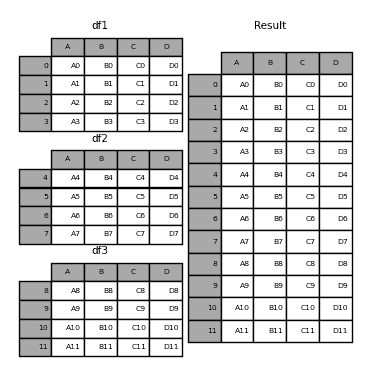

注意

`concat()`会对数据进行完全复制，并且反复使用`concat()`可能会创建不必要的副本。在使用`concat()`之前，先将所有`DataFrame`或`Series`对象收集到一个列表中。

```py
frames = [process_your_file(f) for f in files]
result = pd.concat(frames) 
```

注意

当连接具有命名轴的`DataFrame`时，pandas 会尽可能保留这些索引/列名称。在所有输入共享一个公共名称的情况下，该名称将分配给结果。当输入名称不完全一致时，结果将没有名称。对于`MultiIndex`也是如此，但逻辑是逐级别分别应用的。

### 结果轴的连接逻辑

`join`关键字指定如何处理第一个`DataFrame`中不存在的轴值。

`join='outer'`取所有轴值的并集

```py
In [7]: df4 = pd.DataFrame(
 ...:    {
 ...:        "B": ["B2", "B3", "B6", "B7"],
 ...:        "D": ["D2", "D3", "D6", "D7"],
 ...:        "F": ["F2", "F3", "F6", "F7"],
 ...:    },
 ...:    index=[2, 3, 6, 7],
 ...: )
 ...: 

In [8]: result = pd.concat([df1, df4], axis=1)

In [9]: result
Out[9]: 
 A    B    C    D    B    D    F
0   A0   B0   C0   D0  NaN  NaN  NaN
1   A1   B1   C1   D1  NaN  NaN  NaN
2   A2   B2   C2   D2   B2   D2   F2
3   A3   B3   C3   D3   B3   D3   F3
6  NaN  NaN  NaN  NaN   B6   D6   F6
7  NaN  NaN  NaN  NaN   B7   D7   F7 
```

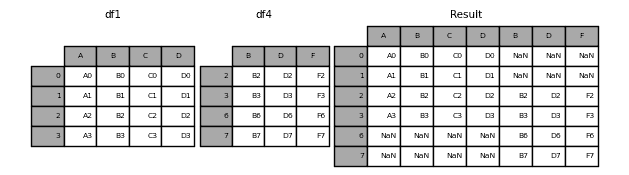

`join='inner'`取轴值的交集

```py
In [10]: result = pd.concat([df1, df4], axis=1, join="inner")

In [11]: result
Out[11]: 
 A   B   C   D   B   D   F
2  A2  B2  C2  D2  B2  D2  F2
3  A3  B3  C3  D3  B3  D3  F3 
```

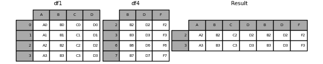

为了使用原始`DataFrame`的*确切索引*执行有效的“左”连接，结果可以重新索引。

```py
In [12]: result = pd.concat([df1, df4], axis=1).reindex(df1.index)

In [13]: result
Out[13]: 
 A   B   C   D    B    D    F
0  A0  B0  C0  D0  NaN  NaN  NaN
1  A1  B1  C1  D1  NaN  NaN  NaN
2  A2  B2  C2  D2   B2   D2   F2
3  A3  B3  C3  D3   B3   D3   F3 
```

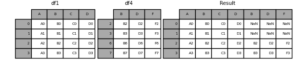 ### 在连接轴上忽略索引

对于没有有意义索引的`DataFrame`对象，`ignore_index`会忽略重叠的索引。

```py
In [14]: result = pd.concat([df1, df4], ignore_index=True, sort=False)

In [15]: result
Out[15]: 
 A   B    C   D    F
0   A0  B0   C0  D0  NaN
1   A1  B1   C1  D1  NaN
2   A2  B2   C2  D2  NaN
3   A3  B3   C3  D3  NaN
4  NaN  B2  NaN  D2   F2
5  NaN  B3  NaN  D3   F3
6  NaN  B6  NaN  D6   F6
7  NaN  B7  NaN  D7   F7 
```

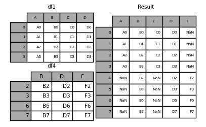 ### 将`Series`和`DataFrame`连接在一起

您可以连接一组`Series`和`DataFrame`对象。`Series`将转换为具��列名的`DataFrame`，列名为`Series`的名称。

```py
In [16]: s1 = pd.Series(["X0", "X1", "X2", "X3"], name="X")

In [17]: result = pd.concat([df1, s1], axis=1)

In [18]: result
Out[18]: 
 A   B   C   D   X
0  A0  B0  C0  D0  X0
1  A1  B1  C1  D1  X1
2  A2  B2  C2  D2  X2
3  A3  B3  C3  D3  X3 
```


未命名的`Series`将按顺序编号。

```py
In [19]: s2 = pd.Series(["_0", "_1", "_2", "_3"])

In [20]: result = pd.concat([df1, s2, s2, s2], axis=1)

In [21]: result
Out[21]: 
 A   B   C   D   0   1   2
0  A0  B0  C0  D0  _0  _0  _0
1  A1  B1  C1  D1  _1  _1  _1
2  A2  B2  C2  D2  _2  _2  _2
3  A3  B3  C3  D3  _3  _3  _3 
```

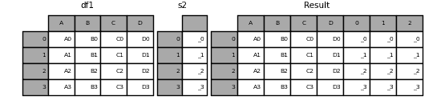

`ignore_index=True` 将删除所有名称引用。

```py
In [22]: result = pd.concat([df1, s1], axis=1, ignore_index=True)

In [23]: result
Out[23]: 
 0   1   2   3   4
0  A0  B0  C0  D0  X0
1  A1  B1  C1  D1  X1
2  A2  B2  C2  D2  X2
3  A3  B3  C3  D3  X3 
```

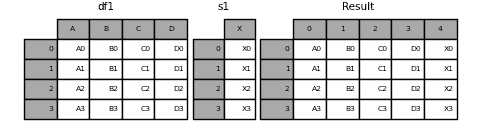

### 结果的`keys`

`keys` 参数将向结果索引或列添加另一个轴级别（创建一个`MultiIndex`），将特定键与每个原始`DataFrame`关联。

```py
In [24]: result = pd.concat(frames, keys=["x", "y", "z"])

In [25]: result
Out[25]: 
 A    B    C    D
x 0    A0   B0   C0   D0
 1    A1   B1   C1   D1
 2    A2   B2   C2   D2
 3    A3   B3   C3   D3
y 4    A4   B4   C4   D4
 5    A5   B5   C5   D5
 6    A6   B6   C6   D6
 7    A7   B7   C7   D7
z 8    A8   B8   C8   D8
 9    A9   B9   C9   D9
 10  A10  B10  C10  D10
 11  A11  B11  C11  D11

In [26]: result.loc["y"]
Out[26]: 
 A   B   C   D
4  A4  B4  C4  D4
5  A5  B5  C5  D5
6  A6  B6  C6  D6
7  A7  B7  C7  D7 
```


`keys` 参数可以在基于现有`Series`创建新`DataFrame`时覆盖列名。

```py
In [27]: s3 = pd.Series([0, 1, 2, 3], name="foo")

In [28]: s4 = pd.Series([0, 1, 2, 3])

In [29]: s5 = pd.Series([0, 1, 4, 5])

In [30]: pd.concat([s3, s4, s5], axis=1)
Out[30]: 
 foo  0  1
0    0  0  0
1    1  1  1
2    2  2  4
3    3  3  5

In [31]: pd.concat([s3, s4, s5], axis=1, keys=["red", "blue", "yellow"])
Out[31]: 
 red  blue  yellow
0    0     0       0
1    1     1       1
2    2     2       4
3    3     3       5 
```

您还可以将字典传递给`concat()`，在这种情况下，除非指定了其他`keys`参数，否则将使用字典键作为`keys`参数：

```py
In [32]: pieces = {"x": df1, "y": df2, "z": df3}

In [33]: result = pd.concat(pieces)

In [34]: result
Out[34]: 
 A    B    C    D
x 0    A0   B0   C0   D0
 1    A1   B1   C1   D1
 2    A2   B2   C2   D2
 3    A3   B3   C3   D3
y 4    A4   B4   C4   D4
 5    A5   B5   C5   D5
 6    A6   B6   C6   D6
 7    A7   B7   C7   D7
z 8    A8   B8   C8   D8
 9    A9   B9   C9   D9
 10  A10  B10  C10  D10
 11  A11  B11  C11  D11 
```

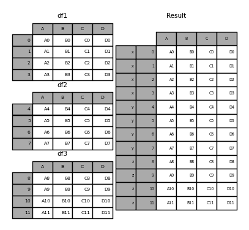

```py
In [35]: result = pd.concat(pieces, keys=["z", "y"])

In [36]: result
Out[36]: 
 A    B    C    D
z 8    A8   B8   C8   D8
 9    A9   B9   C9   D9
 10  A10  B10  C10  D10
 11  A11  B11  C11  D11
y 4    A4   B4   C4   D4
 5    A5   B5   C5   D5
 6    A6   B6   C6   D6
 7    A7   B7   C7   D7 
```

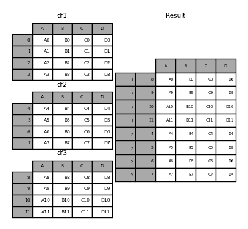

创建的`MultiIndex`具有从传递的键和`DataFrame`片段的索引构建的级别：

```py
In [37]: result.index.levels
Out[37]: FrozenList([['z', 'y'], [4, 5, 6, 7, 8, 9, 10, 11]]) 
```

`levels` 参数允许指定与`keys`相关联的结果级别

```py
In [38]: result = pd.concat(
 ....:    pieces, keys=["x", "y", "z"], levels=[["z", "y", "x", "w"]], names=["group_key"]
 ....: )
 ....: 

In [39]: result
Out[39]: 
 A    B    C    D
group_key 
x         0    A0   B0   C0   D0
 1    A1   B1   C1   D1
 2    A2   B2   C2   D2
 3    A3   B3   C3   D3
y         4    A4   B4   C4   D4
 5    A5   B5   C5   D5
 6    A6   B6   C6   D6
 7    A7   B7   C7   D7
z         8    A8   B8   C8   D8
 9    A9   B9   C9   D9
 10  A10  B10  C10  D10
 11  A11  B11  C11  D11 
```


```py
In [40]: result.index.levels
Out[40]: FrozenList([['z', 'y', 'x', 'w'], [0, 1, 2, 3, 4, 5, 6, 7, 8, 9, 10, 11]]) 
```

### 将行附加到`DataFrame`

如果您有一个要附加为单行到 `DataFrame` 的 `Series`，您可以将该行转换为 `DataFrame` 并使用 `concat()`

```py
In [41]: s2 = pd.Series(["X0", "X1", "X2", "X3"], index=["A", "B", "C", "D"])

In [42]: result = pd.concat([df1, s2.to_frame().T], ignore_index=True)

In [43]: result
Out[43]: 
 A   B   C   D
0  A0  B0  C0  D0
1  A1  B1  C1  D1
2  A2  B2  C2  D2
3  A3  B3  C3  D3
4  X0  X1  X2  X3 
```

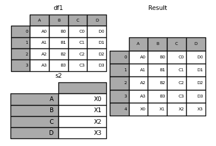 ## `merge()`

`merge()` 执行类似于关系数据库（如 SQL）的连接操作。熟悉 SQL 但是对 pandas 新手的用户可以参考与 SQL 的比较。

### 连接类型

`merge()` 实现了常见的 SQL 风格的连接操作。

+   **一对一**：在它们的索引上连接两个 `DataFrame` 对象，这些索引必须包含唯一值。

+   **一对多**：将唯一索引与不同 `DataFrame` 中的一个或多个列进行连接。

+   **多对多**：在列上连接列。

注意

当在列上连接列时，可能是多对多的连接，传递的 `DataFrame` 对象上的任何索引**将被丢弃**。

对于**多对多**的连接，如果一个键组合在两个表中出现多次，`DataFrame` 将具有相关数据的**笛卡尔积**。

```py
In [44]: left = pd.DataFrame(
 ....:    {
 ....:        "key": ["K0", "K1", "K2", "K3"],
 ....:        "A": ["A0", "A1", "A2", "A3"],
 ....:        "B": ["B0", "B1", "B2", "B3"],
 ....:    }
 ....: )
 ....: 

In [45]: right = pd.DataFrame(
 ....:    {
 ....:        "key": ["K0", "K1", "K2", "K3"],
 ....:        "C": ["C0", "C1", "C2", "C3"],
 ....:        "D": ["D0", "D1", "D2", "D3"],
 ....:    }
 ....: )
 ....: 

In [46]: result = pd.merge(left, right, on="key")

In [47]: result
Out[47]: 
 key   A   B   C   D
0  K0  A0  B0  C0  D0
1  K1  A1  B1  C1  D1
2  K2  A2  B2  C2  D2
3  K3  A3  B3  C3  D3 
```

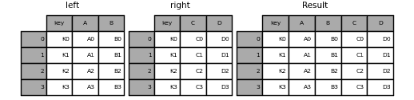

对于 `merge()` 的 `how` 参数指定了哪些键包含在结果表中。如果一个键组合**不存在**于左表或右表中，连接表中的值将为 `NA`。以下是 `how` 选项及其 SQL 等效名称的摘要：

| 合并方法 | SQL 连接名称 | 描述 |
| --- | --- | --- |
| `left` | `LEFT OUTER JOIN` | 仅使用左框架中的键 |
| `right` | `RIGHT OUTER JOIN` | 仅使用右框架中的键 |
| `outer` | `FULL OUTER JOIN` | 使用两个框架的键的并集 |
| `inner` | `INNER JOIN` | 使用两个框架中键的交集 |
| `cross` | `CROSS JOIN` | 创建两个框架行的笛卡尔积 |

```py
In [48]: left = pd.DataFrame(
 ....:   {
 ....:      "key1": ["K0", "K0", "K1", "K2"],
 ....:      "key2": ["K0", "K1", "K0", "K1"],
 ....:      "A": ["A0", "A1", "A2", "A3"],
 ....:      "B": ["B0", "B1", "B2", "B3"],
 ....:   }
 ....: )
 ....: 

In [49]: right = pd.DataFrame(
 ....:   {
 ....:      "key1": ["K0", "K1", "K1", "K2"],
 ....:      "key2": ["K0", "K0", "K0", "K0"],
 ....:      "C": ["C0", "C1", "C2", "C3"],
 ....:      "D": ["D0", "D1", "D2", "D3"],
 ....:   }
 ....: )
 ....: 

In [50]: result = pd.merge(left, right, how="left", on=["key1", "key2"])

In [51]: result
Out[51]: 
 key1 key2   A   B    C    D
0   K0   K0  A0  B0   C0   D0
1   K0   K1  A1  B1  NaN  NaN
2   K1   K0  A2  B2   C1   D1
3   K1   K0  A2  B2   C2   D2
4   K2   K1  A3  B3  NaN  NaN 
```

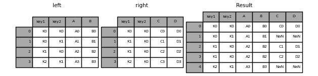

```py
In [52]: result = pd.merge(left, right, how="right", on=["key1", "key2"])

In [53]: result
Out[53]: 
 key1 key2    A    B   C   D
0   K0   K0   A0   B0  C0  D0
1   K1   K0   A2   B2  C1  D1
2   K1   K0   A2   B2  C2  D2
3   K2   K0  NaN  NaN  C3  D3 
```

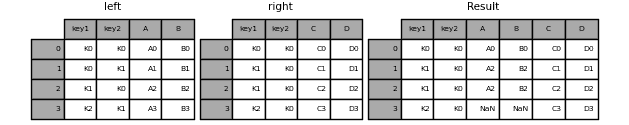

```py
In [54]: result = pd.merge(left, right, how="outer", on=["key1", "key2"])

In [55]: result
Out[55]: 
 key1 key2    A    B    C    D
0   K0   K0   A0   B0   C0   D0
1   K0   K1   A1   B1  NaN  NaN
2   K1   K0   A2   B2   C1   D1
3   K1   K0   A2   B2   C2   D2
4   K2   K0  NaN  NaN   C3   D3
5   K2   K1   A3   B3  NaN  NaN 
```

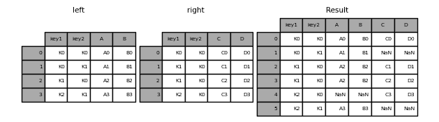

```py
In [56]: result = pd.merge(left, right, how="inner", on=["key1", "key2"])

In [57]: result
Out[57]: 
 key1 key2   A   B   C   D
0   K0   K0  A0  B0  C0  D0
1   K1   K0  A2  B2  C1  D1
2   K1   K0  A2  B2  C2  D2 
```

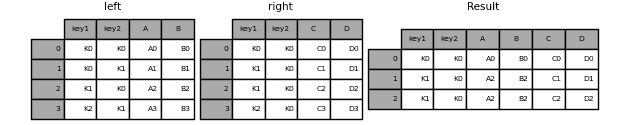

```py
In [58]: result = pd.merge(left, right, how="cross")

In [59]: result
Out[59]: 
 key1_x key2_x   A   B key1_y key2_y   C   D
0      K0     K0  A0  B0     K0     K0  C0  D0
1      K0     K0  A0  B0     K1     K0  C1  D1
2      K0     K0  A0  B0     K1     K0  C2  D2
3      K0     K0  A0  B0     K2     K0  C3  D3
4      K0     K1  A1  B1     K0     K0  C0  D0
..    ...    ...  ..  ..    ...    ...  ..  ..
11     K1     K0  A2  B2     K2     K0  C3  D3
12     K2     K1  A3  B3     K0     K0  C0  D0
13     K2     K1  A3  B3     K1     K0  C1  D1
14     K2     K1  A3  B3     K1     K0  C2  D2
15     K2     K1  A3  B3     K2     K0  C3  D3

[16 rows x 8 columns] 
```

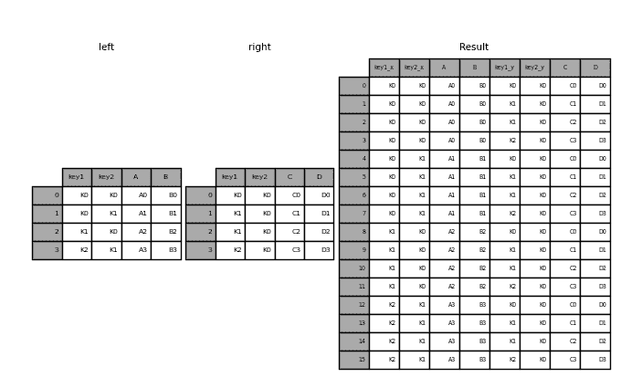

如果`MultiIndex`的名称与`DataFrame`中的列名对应，则可以使用`Series`和具有`MultiIndex`的`DataFrame`。在合并之前，使用`Series.reset_index()`将`Series`转换为`DataFrame`

```py
In [60]: df = pd.DataFrame({"Let": ["A", "B", "C"], "Num": [1, 2, 3]})

In [61]: df
Out[61]: 
 Let  Num
0   A    1
1   B    2
2   C    3

In [62]: ser = pd.Series(
 ....:    ["a", "b", "c", "d", "e", "f"],
 ....:    index=pd.MultiIndex.from_arrays(
 ....:        [["A", "B", "C"] * 2, [1, 2, 3, 4, 5, 6]], names=["Let", "Num"]
 ....:    ),
 ....: )
 ....: 

In [63]: ser
Out[63]: 
Let  Num
A    1      a
B    2      b
C    3      c
A    4      d
B    5      e
C    6      f
dtype: object

In [64]: pd.merge(df, ser.reset_index(), on=["Let", "Num"])
Out[64]: 
 Let  Num  0
0   A    1  a
1   B    2  b
2   C    3  c 
```

在具有重复连接键的`DataFrame`中执行外连接

```py
In [65]: left = pd.DataFrame({"A": [1, 2], "B": [2, 2]})

In [66]: right = pd.DataFrame({"A": [4, 5, 6], "B": [2, 2, 2]})

In [67]: result = pd.merge(left, right, on="B", how="outer")

In [68]: result
Out[68]: 
 A_x  B  A_y
0    1  2    4
1    1  2    5
2    1  2    6
3    2  2    4
4    2  2    5
5    2  2    6 
```

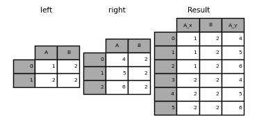

警告

在重复键上进行合并会显著增加结果的维度，并可能导致内存溢出。

### 合并键的唯一性

`validate`参数检查合并键的唯一性。在执行合并操作之前检查键的唯一性可以防止内存溢出和意外键重复。

```py
In [69]: left = pd.DataFrame({"A": [1, 2], "B": [1, 2]})

In [70]: right = pd.DataFrame({"A": [4, 5, 6], "B": [2, 2, 2]})

In [71]: result = pd.merge(left, right, on="B", how="outer", validate="one_to_one")
---------------------------------------------------------------------------
MergeError  Traceback (most recent call last)
Cell In[71], line 1
----> 1 result = pd.merge(left, right, on="B", how="outer", validate="one_to_one")

File ~/work/pandas/pandas/pandas/core/reshape/merge.py:170, in merge(left, right, how, on, left_on, right_on, left_index, right_index, sort, suffixes, copy, indicator, validate)
  155     return _cross_merge(
  156         left_df,
  157         right_df,
   (...)
  167         copy=copy,
  168     )
  169 else:
--> 170     op = _MergeOperation(
  171         left_df,
  172         right_df,
  173         how=how,
  174         on=on,
  175         left_on=left_on,
  176         right_on=right_on,
  177         left_index=left_index,
  178         right_index=right_index,
  179         sort=sort,
  180         suffixes=suffixes,
  181         indicator=indicator,
  182         validate=validate,
  183     )
  184     return op.get_result(copy=copy)

File ~/work/pandas/pandas/pandas/core/reshape/merge.py:813, in _MergeOperation.__init__(self, left, right, how, on, left_on, right_on, left_index, right_index, sort, suffixes, indicator, validate)
  809 # If argument passed to validate,
  810 # check if columns specified as unique
  811 # are in fact unique.
  812 if validate is not None:
--> 813     self._validate_validate_kwd(validate)

File ~/work/pandas/pandas/pandas/core/reshape/merge.py:1657, in _MergeOperation._validate_validate_kwd(self, validate)
  1653         raise MergeError(
  1654             "Merge keys are not unique in left dataset; not a one-to-one merge"
  1655         )
  1656     if not right_unique:
-> 1657         raise MergeError(
  1658             "Merge keys are not unique in right dataset; not a one-to-one merge"
  1659         )
  1661 elif validate in ["one_to_many", "1:m"]:
  1662     if not left_unique:

MergeError: Merge keys are not unique in right dataset; not a one-to-one merge 
```

如果用户意识到右侧`DataFrame`中存在重复项，但希望确保左侧`DataFrame`中没有重复项，则可以使用`validate='one_to_many'`参数，这样不会引发异常。

```py
In [72]: pd.merge(left, right, on="B", how="outer", validate="one_to_many")
Out[72]: 
 A_x  B  A_y
0    1  1  NaN
1    2  2  4.0
2    2  2  5.0
3    2  2  6.0 
```  ### 合并结果指示器

`merge()`接受参数`indicator`。如果为`True`，则将向输出对象添加一个名为`_merge`的分类列，其取值为：

> | 观察来源 | `_merge`值 |
> | --- | --- |
> | 仅在`'left'`数据框中的合并键 | `left_only` |
> | 仅在`'right'`数据框中的合并键 | `right_only` |
> | 两个数据框中的合并键 | `both` |

```py
In [73]: df1 = pd.DataFrame({"col1": [0, 1], "col_left": ["a", "b"]})

In [74]: df2 = pd.DataFrame({"col1": [1, 2, 2], "col_right": [2, 2, 2]})

In [75]: pd.merge(df1, df2, on="col1", how="outer", indicator=True)
Out[75]: 
 col1 col_left  col_right      _merge
0     0        a        NaN   left_only
1     1        b        2.0        both
2     2      NaN        2.0  right_only
3     2      NaN        2.0  right_only 
```

字符串参数`indicator`将使用该值作为指示器列的名称。

```py
In [76]: pd.merge(df1, df2, on="col1", how="outer", indicator="indicator_column")
Out[76]: 
 col1 col_left  col_right indicator_column
0     0        a        NaN        left_only
1     1        b        2.0             both
2     2      NaN        2.0       right_only
3     2      NaN        2.0       right_only 
```

### 重叠值列

合并`suffixes`参数接受一个字符串列表的元组，用于附加到输入`DataFrame`中重叠列名以消除结果列的歧义：

```py
In [77]: left = pd.DataFrame({"k": ["K0", "K1", "K2"], "v": [1, 2, 3]})

In [78]: right = pd.DataFrame({"k": ["K0", "K0", "K3"], "v": [4, 5, 6]})

In [79]: result = pd.merge(left, right, on="k")

In [80]: result
Out[80]: 
 k  v_x  v_y
0  K0    1    4
1  K0    1    5 
```

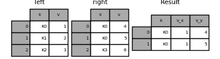

```py
In [81]: result = pd.merge(left, right, on="k", suffixes=("_l", "_r"))

In [82]: result
Out[82]: 
 k  v_l  v_r
0  K0    1    4
1  K0    1    5 
```


## `DataFrame.join()`

`DataFrame.join()`将多个可能具有不同索引的列的`DataFrame`合并为单个结果`DataFrame`。

```py
In [83]: left = pd.DataFrame(
 ....:    {"A": ["A0", "A1", "A2"], "B": ["B0", "B1", "B2"]}, index=["K0", "K1", "K2"]
 ....: )
 ....: 

In [84]: right = pd.DataFrame(
 ....:    {"C": ["C0", "C2", "C3"], "D": ["D0", "D2", "D3"]}, index=["K0", "K2", "K3"]
 ....: )
 ....: 

In [85]: result = left.join(right)

In [86]: result
Out[86]: 
 A   B    C    D
K0  A0  B0   C0   D0
K1  A1  B1  NaN  NaN
K2  A2  B2   C2   D2 
```

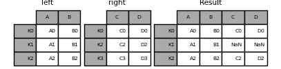

```py
In [87]: result = left.join(right, how="outer")

In [88]: result
Out[88]: 
 A    B    C    D
K0   A0   B0   C0   D0
K1   A1   B1  NaN  NaN
K2   A2   B2   C2   D2
K3  NaN  NaN   C3   D3 
```

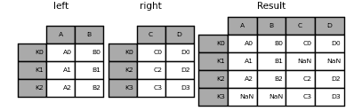

```py
In [89]: result = left.join(right, how="inner")

In [90]: result
Out[90]: 
 A   B   C   D
K0  A0  B0  C0  D0
K2  A2  B2  C2  D2 
```

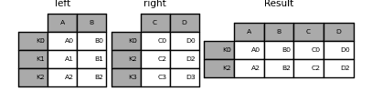

`DataFrame.join()`接受一个可选的`on`参数，可以是要对齐的列或多个列名。

```py
In [91]: left = pd.DataFrame(
 ....:    {
 ....:        "A": ["A0", "A1", "A2", "A3"],
 ....:        "B": ["B0", "B1", "B2", "B3"],
 ....:        "key": ["K0", "K1", "K0", "K1"],
 ....:    }
 ....: )
 ....: 

In [92]: right = pd.DataFrame({"C": ["C0", "C1"], "D": ["D0", "D1"]}, index=["K0", "K1"])

In [93]: result = left.join(right, on="key")

In [94]: result
Out[94]: 
 A   B key   C   D
0  A0  B0  K0  C0  D0
1  A1  B1  K1  C1  D1
2  A2  B2  K0  C0  D0
3  A3  B3  K1  C1  D1 
```

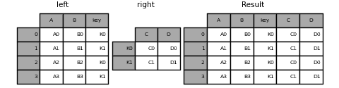

```py
In [95]: result = pd.merge(
 ....:    left, right, left_on="key", right_index=True, how="left", sort=False
 ....: )
 ....: 

In [96]: result
Out[96]: 
 A   B key   C   D
0  A0  B0  K0  C0  D0
1  A1  B1  K1  C1  D1
2  A2  B2  K0  C0  D0
3  A3  B3  K1  C1  D1 
```


要在多个键上连接，传递的`DataFrame`必须具有`MultiIndex`:

```py
In [97]: left = pd.DataFrame(
 ....:    {
 ....:        "A": ["A0", "A1", "A2", "A3"],
 ....:        "B": ["B0", "B1", "B2", "B3"],
 ....:        "key1": ["K0", "K0", "K1", "K2"],
 ....:        "key2": ["K0", "K1", "K0", "K1"],
 ....:    }
 ....: )
 ....: 

In [98]: index = pd.MultiIndex.from_tuples(
 ....:    [("K0", "K0"), ("K1", "K0"), ("K2", "K0"), ("K2", "K1")]
 ....: )
 ....: 

In [99]: right = pd.DataFrame(
 ....:    {"C": ["C0", "C1", "C2", "C3"], "D": ["D0", "D1", "D2", "D3"]}, index=index
 ....: )
 ....: 

In [100]: result = left.join(right, on=["key1", "key2"])

In [101]: result
Out[101]: 
 A   B key1 key2    C    D
0  A0  B0   K0   K0   C0   D0
1  A1  B1   K0   K1  NaN  NaN
2  A2  B2   K1   K0   C1   D1
3  A3  B3   K2   K1   C3   D3 
```

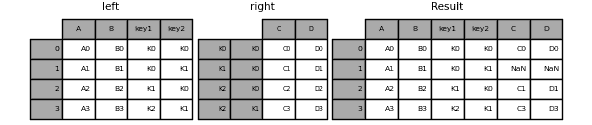

`DataFrame.join`的默认行为是执行左连接，仅使用调用`DataFrame`中找到的键。其他连接类型可以通过`how`指定。

```py
In [102]: result = left.join(right, on=["key1", "key2"], how="inner")

In [103]: result
Out[103]: 
 A   B key1 key2   C   D
0  A0  B0   K0   K0  C0  D0
2  A2  B2   K1   K0  C1  D1
3  A3  B3   K2   K1  C3  D3 
```

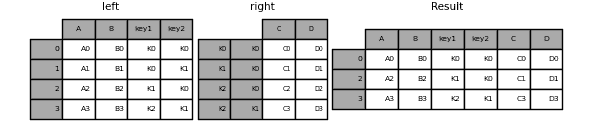 ### 将单个索引连接到多重索引

你可以将一个具有`Index`的`DataFrame`与具有`MultiIndex`的`DataFrame`在一个级别上连接。`Index`的`name`将与`MultiIndex`的级别名称匹配。

```py
In [104]: left = pd.DataFrame(
 .....:    {"A": ["A0", "A1", "A2"], "B": ["B0", "B1", "B2"]},
 .....:    index=pd.Index(["K0", "K1", "K2"], name="key"),
 .....: )
 .....: 

In [105]: index = pd.MultiIndex.from_tuples(
 .....:    [("K0", "Y0"), ("K1", "Y1"), ("K2", "Y2"), ("K2", "Y3")],
 .....:    names=["key", "Y"],
 .....: )
 .....: 

In [106]: right = pd.DataFrame(
 .....:    {"C": ["C0", "C1", "C2", "C3"], "D": ["D0", "D1", "D2", "D3"]},
 .....:    index=index,
 .....: )
 .....: 

In [107]: result = left.join(right, how="inner")

In [108]: result
Out[108]: 
 A   B   C   D
key Y 
K0  Y0  A0  B0  C0  D0
K1  Y1  A1  B1  C1  D1
K2  Y2  A2  B2  C2  D2
 Y3  A2  B2  C3  D3 
```

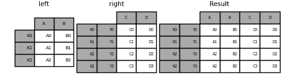 ### 与两个`MultiIndex`连接

输入参数的`MultiIndex`必须完全用于连接，并且是左参数中索引的子集。

```py
In [109]: leftindex = pd.MultiIndex.from_product(
 .....:    [list("abc"), list("xy"), [1, 2]], names=["abc", "xy", "num"]
 .....: )
 .....: 

In [110]: left = pd.DataFrame({"v1": range(12)}, index=leftindex)

In [111]: left
Out[111]: 
 v1
abc xy num 
a   x  1     0
 2     1
 y  1     2
 2     3
b   x  1     4
 2     5
 y  1     6
 2     7
c   x  1     8
 2     9
 y  1    10
 2    11

In [112]: rightindex = pd.MultiIndex.from_product(
 .....:    [list("abc"), list("xy")], names=["abc", "xy"]
 .....: )
 .....: 

In [113]: right = pd.DataFrame({"v2": [100 * i for i in range(1, 7)]}, index=rightindex)

In [114]: right
Out[114]: 
 v2
abc xy 
a   x   100
 y   200
b   x   300
 y   400
c   x   500
 y   600

In [115]: left.join(right, on=["abc", "xy"], how="inner")
Out[115]: 
 v1   v2
abc xy num 
a   x  1     0  100
 2     1  100
 y  1     2  200
 2     3  200
b   x  1     4  300
 2     5  300
 y  1     6  400
 2     7  400
c   x  1     8  500
 2     9  500
 y  1    10  600
 2    11  600 
```

```py
In [116]: leftindex = pd.MultiIndex.from_tuples(
 .....:    [("K0", "X0"), ("K0", "X1"), ("K1", "X2")], names=["key", "X"]
 .....: )
 .....: 

In [117]: left = pd.DataFrame(
 .....:    {"A": ["A0", "A1", "A2"], "B": ["B0", "B1", "B2"]}, index=leftindex
 .....: )
 .....: 

In [118]: rightindex = pd.MultiIndex.from_tuples(
 .....:    [("K0", "Y0"), ("K1", "Y1"), ("K2", "Y2"), ("K2", "Y3")], names=["key", "Y"]
 .....: )
 .....: 

In [119]: right = pd.DataFrame(
 .....:    {"C": ["C0", "C1", "C2", "C3"], "D": ["D0", "D1", "D2", "D3"]}, index=rightindex
 .....: )
 .....: 

In [120]: result = pd.merge(
 .....:    left.reset_index(), right.reset_index(), on=["key"], how="inner"
 .....: ).set_index(["key", "X", "Y"])
 .....: 

In [121]: result
Out[121]: 
 A   B   C   D
key X  Y 
K0  X0 Y0  A0  B0  C0  D0
 X1 Y0  A1  B1  C0  D0
K1  X2 Y1  A2  B2  C1  D1 
```

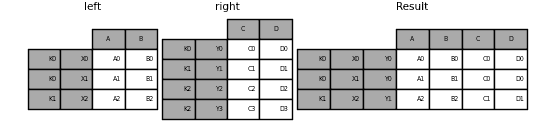 ### 在列和索引级别的组合上合并

作为`on`、`left_on`和`right_on`参数传递的字符串可以引用列名或索引级别名。这使得在不重置索引的情况下，可以在索引级别和列的组合上合并`DataFrame`实例。

```py
In [122]: left_index = pd.Index(["K0", "K0", "K1", "K2"], name="key1")

In [123]: left = pd.DataFrame(
 .....:    {
 .....:        "A": ["A0", "A1", "A2", "A3"],
 .....:        "B": ["B0", "B1", "B2", "B3"],
 .....:        "key2": ["K0", "K1", "K0", "K1"],
 .....:    },
 .....:    index=left_index,
 .....: )
 .....: 

In [124]: right_index = pd.Index(["K0", "K1", "K2", "K2"], name="key1")

In [125]: right = pd.DataFrame(
 .....:    {
 .....:        "C": ["C0", "C1", "C2", "C3"],
 .....:        "D": ["D0", "D1", "D2", "D3"],
 .....:        "key2": ["K0", "K0", "K0", "K1"],
 .....:    },
 .....:    index=right_index,
 .....: )
 .....: 

In [126]: result = left.merge(right, on=["key1", "key2"])

In [127]: result
Out[127]: 
 A   B key2   C   D
key1 
K0    A0  B0   K0  C0  D0
K1    A2  B2   K0  C1  D1
K2    A3  B3   K1  C3  D3 
```

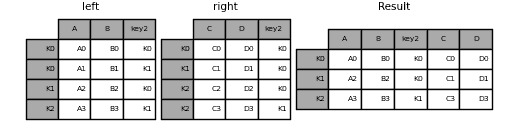

注意

当`DataFrame`在匹配两个参数中的索引级别的字符串上进行连接时，索引级别将保留为结果`DataFrame`中的索引级别。

注意

当只使用`MultiIndex`的一些级别连接`DataFrame`时，多余的级别将从结果连接中删除。要保留这些级别，请在连接之前对这些级别名称使用`DataFrame.reset_index()`将这些级别移动到列中。  ### 连接多个`DataFrame`

也可以将`DataFrame`的列表或元组传递给`join()`，以在它们的索引上将它们连接在一起。

```py
In [128]: right2 = pd.DataFrame({"v": [7, 8, 9]}, index=["K1", "K1", "K2"])

In [129]: result = left.join([right, right2]) 
```

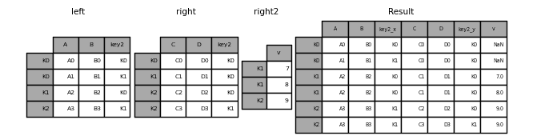 ### `DataFrame.combine_first()`

`DataFrame.combine_first()` 用另一个`DataFrame`中的非缺失值更新一个`DataFrame`中的缺失值，位置对应。

```py
In [130]: df1 = pd.DataFrame(
 .....:    [[np.nan, 3.0, 5.0], [-4.6, np.nan, np.nan], [np.nan, 7.0, np.nan]]
 .....: )
 .....: 

In [131]: df2 = pd.DataFrame([[-42.6, np.nan, -8.2], [-5.0, 1.6, 4]], index=[1, 2])

In [132]: result = df1.combine_first(df2)

In [133]: result
Out[133]: 
 0    1    2
0  NaN  3.0  5.0
1 -4.6  NaN -8.2
2 -5.0  7.0  4.0 
```

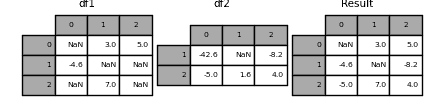 ## `merge_ordered()`

`merge_ordered()` 将有序数据（如数值或时间序列数据）与可选的使用`fill_method`填充缺失数据合并。

```py
In [134]: left = pd.DataFrame(
 .....:    {"k": ["K0", "K1", "K1", "K2"], "lv": [1, 2, 3, 4], "s": ["a", "b", "c", "d"]}
 .....: )
 .....: 

In [135]: right = pd.DataFrame({"k": ["K1", "K2", "K4"], "rv": [1, 2, 3]})

In [136]: pd.merge_ordered(left, right, fill_method="ffill", left_by="s")
Out[136]: 
 k   lv  s   rv
0   K0  1.0  a  NaN
1   K1  1.0  a  1.0
2   K2  1.0  a  2.0
3   K4  1.0  a  3.0
4   K1  2.0  b  1.0
5   K2  2.0  b  2.0
6   K4  2.0  b  3.0
7   K1  3.0  c  1.0
8   K2  3.0  c  2.0
9   K4  3.0  c  3.0
10  K1  NaN  d  1.0
11  K2  4.0  d  2.0
12  K4  4.0  d  3.0 
```  ## `merge_asof()`

`merge_asof()` 类似于有序的左连接，不同之处在于匹配的是最近的键而不是相等的键。对于`left` `DataFrame`中的每一行，选择`right` `DataFrame`中最后一行，其中`on`键小于左侧的键。两个`DataFrame`必须按键排序。

可选地，`merge_asof()`可以通过在`by`键上匹配来执行分组合并，同时在`on`键上找到最近的匹配。

```py
In [137]: trades = pd.DataFrame(
 .....:    {
 .....:        "time": pd.to_datetime(
 .....:            [
 .....:                "20160525 13:30:00.023",
 .....:                "20160525 13:30:00.038",
 .....:                "20160525 13:30:00.048",
 .....:                "20160525 13:30:00.048",
 .....:                "20160525 13:30:00.048",
 .....:            ]
 .....:        ),
 .....:        "ticker": ["MSFT", "MSFT", "GOOG", "GOOG", "AAPL"],
 .....:        "price": [51.95, 51.95, 720.77, 720.92, 98.00],
 .....:        "quantity": [75, 155, 100, 100, 100],
 .....:    },
 .....:    columns=["time", "ticker", "price", "quantity"],
 .....: )
 .....: 

In [138]: quotes = pd.DataFrame(
 .....:    {
 .....:        "time": pd.to_datetime(
 .....:            [
 .....:                "20160525 13:30:00.023",
 .....:                "20160525 13:30:00.023",
 .....:                "20160525 13:30:00.030",
 .....:                "20160525 13:30:00.041",
 .....:                "20160525 13:30:00.048",
 .....:                "20160525 13:30:00.049",
 .....:                "20160525 13:30:00.072",
 .....:                "20160525 13:30:00.075",
 .....:            ]
 .....:        ),
 .....:        "ticker": ["GOOG", "MSFT", "MSFT", "MSFT", "GOOG", "AAPL", "GOOG", "MSFT"],
 .....:        "bid": [720.50, 51.95, 51.97, 51.99, 720.50, 97.99, 720.50, 52.01],
 .....:        "ask": [720.93, 51.96, 51.98, 52.00, 720.93, 98.01, 720.88, 52.03],
 .....:    },
 .....:    columns=["time", "ticker", "bid", "ask"],
 .....: )
 .....: 

In [139]: trades
Out[139]: 
 time ticker   price  quantity
0 2016-05-25 13:30:00.023   MSFT   51.95        75
1 2016-05-25 13:30:00.038   MSFT   51.95       155
2 2016-05-25 13:30:00.048   GOOG  720.77       100
3 2016-05-25 13:30:00.048   GOOG  720.92       100
4 2016-05-25 13:30:00.048   AAPL   98.00       100

In [140]: quotes
Out[140]: 
 time ticker     bid     ask
0 2016-05-25 13:30:00.023   GOOG  720.50  720.93
1 2016-05-25 13:30:00.023   MSFT   51.95   51.96
2 2016-05-25 13:30:00.030   MSFT   51.97   51.98
3 2016-05-25 13:30:00.041   MSFT   51.99   52.00
4 2016-05-25 13:30:00.048   GOOG  720.50  720.93
5 2016-05-25 13:30:00.049   AAPL   97.99   98.01
6 2016-05-25 13:30:00.072   GOOG  720.50  720.88
7 2016-05-25 13:30:00.075   MSFT   52.01   52.03

In [141]: pd.merge_asof(trades, quotes, on="time", by="ticker")
Out[141]: 
 time ticker   price  quantity     bid     ask
0 2016-05-25 13:30:00.023   MSFT   51.95        75   51.95   51.96
1 2016-05-25 13:30:00.038   MSFT   51.95       155   51.97   51.98
2 2016-05-25 13:30:00.048   GOOG  720.77       100  720.50  720.93
3 2016-05-25 13:30:00.048   GOOG  720.92       100  720.50  720.93
4 2016-05-25 13:30:00.048   AAPL   98.00       100     NaN     NaN 
```

`merge_asof()` 在报价时间和交易时间之间的`2ms`内合并。

```py
In [142]: pd.merge_asof(trades, quotes, on="time", by="ticker", tolerance=pd.Timedelta("2ms"))
Out[142]: 
 time ticker   price  quantity     bid     ask
0 2016-05-25 13:30:00.023   MSFT   51.95        75   51.95   51.96
1 2016-05-25 13:30:00.038   MSFT   51.95       155     NaN     NaN
2 2016-05-25 13:30:00.048   GOOG  720.77       100  720.50  720.93
3 2016-05-25 13:30:00.048   GOOG  720.92       100  720.50  720.93
4 2016-05-25 13:30:00.048   AAPL   98.00       100     NaN     NaN 
```

`merge_asof()` 在报价时间和交易时间之间的`10ms`内合并，并排除时间上的精确匹配。请注意，尽管我们排除了精确匹配（报价），但之前的报价**确实**传播到那个时间点。

```py
In [143]: pd.merge_asof(
 .....:    trades,
 .....:    quotes,
 .....:    on="time",
 .....:    by="ticker",
 .....:    tolerance=pd.Timedelta("10ms"),
 .....:    allow_exact_matches=False,
 .....: )
 .....: 
Out[143]: 
 time ticker   price  quantity    bid    ask
0 2016-05-25 13:30:00.023   MSFT   51.95        75    NaN    NaN
1 2016-05-25 13:30:00.038   MSFT   51.95       155  51.97  51.98
2 2016-05-25 13:30:00.048   GOOG  720.77       100    NaN    NaN
3 2016-05-25 13:30:00.048   GOOG  720.92       100    NaN    NaN
4 2016-05-25 13:30:00.048   AAPL   98.00       100    NaN    NaN 
```  ## `compare()`

`Series.compare()` 和 `DataFrame.compare()` 方法允许您比较两个分别是`DataFrame`或`Series`的对象，并总结它们的差异。

```py
In [144]: df = pd.DataFrame(
 .....:    {
 .....:        "col1": ["a", "a", "b", "b", "a"],
 .....:        "col2": [1.0, 2.0, 3.0, np.nan, 5.0],
 .....:        "col3": [1.0, 2.0, 3.0, 4.0, 5.0],
 .....:    },
 .....:    columns=["col1", "col2", "col3"],
 .....: )
 .....: 

In [145]: df
Out[145]: 
 col1  col2  col3
0    a   1.0   1.0
1    a   2.0   2.0
2    b   3.0   3.0
3    b   NaN   4.0
4    a   5.0   5.0

In [146]: df2 = df.copy()

In [147]: df2.loc[0, "col1"] = "c"

In [148]: df2.loc[2, "col3"] = 4.0

In [149]: df2
Out[149]: 
 col1  col2  col3
0    c   1.0   1.0
1    a   2.0   2.0
2    b   3.0   4.0
3    b   NaN   4.0
4    a   5.0   5.0

In [150]: df.compare(df2)
Out[150]: 
 col1       col3 
 self other self other
0    a     c  NaN   NaN
2  NaN   NaN  3.0   4.0 
```

默认情况下，如果两个对应的值相等，它们将显示为`NaN`。此外，如果整行/列中的所有值都相等，则该行/列将从结果中省略。剩余的差异将对齐在列上。

在行上堆叠差异。

```py
In [151]: df.compare(df2, align_axis=0)
Out[151]: 
 col1  col3
0 self     a   NaN
 other    c   NaN
2 self   NaN   3.0
 other  NaN   4.0 
```

保持所有原始行和列，使用`keep_shape=True`。

```py
In [152]: df.compare(df2, keep_shape=True)
Out[152]: 
 col1       col2       col3 
 self other self other self other
0    a     c  NaN   NaN  NaN   NaN
1  NaN   NaN  NaN   NaN  NaN   NaN
2  NaN   NaN  NaN   NaN  3.0   4.0
3  NaN   NaN  NaN   NaN  NaN   NaN
4  NaN   NaN  NaN   NaN  NaN   NaN 
```

保留所有原始值，即使它们相等。

```py
In [153]: df.compare(df2, keep_shape=True, keep_equal=True)
Out[153]: 
 col1       col2       col3 
 self other self other self other
0    a     c  1.0   1.0  1.0   1.0
1    a     a  2.0   2.0  2.0   2.0
2    b     b  3.0   3.0  3.0   4.0
3    b     b  NaN   NaN  4.0   4.0
4    a     a  5.0   5.0  5.0   5.0 
```  ## `concat()`

`concat()`函数沿着一个轴连接任意数量的`Series`或`DataFrame`对象，同时在其他轴上执行可选的集合逻辑（并集或交集）索引。像`numpy.concatenate`一样，`concat()`接受同类型对象的列表或字典，并将它们连接起来。

```py
In [1]: df1 = pd.DataFrame(
 ...:    {
 ...:        "A": ["A0", "A1", "A2", "A3"],
 ...:        "B": ["B0", "B1", "B2", "B3"],
 ...:        "C": ["C0", "C1", "C2", "C3"],
 ...:        "D": ["D0", "D1", "D2", "D3"],
 ...:    },
 ...:    index=[0, 1, 2, 3],
 ...: )
 ...: 

In [2]: df2 = pd.DataFrame(
 ...:    {
 ...:        "A": ["A4", "A5", "A6", "A7"],
 ...:        "B": ["B4", "B5", "B6", "B7"],
 ...:        "C": ["C4", "C5", "C6", "C7"],
 ...:        "D": ["D4", "D5", "D6", "D7"],
 ...:    },
 ...:    index=[4, 5, 6, 7],
 ...: )
 ...: 

In [3]: df3 = pd.DataFrame(
 ...:    {
 ...:        "A": ["A8", "A9", "A10", "A11"],
 ...:        "B": ["B8", "B9", "B10", "B11"],
 ...:        "C": ["C8", "C9", "C10", "C11"],
 ...:        "D": ["D8", "D9", "D10", "D11"],
 ...:    },
 ...:    index=[8, 9, 10, 11],
 ...: )
 ...: 

In [4]: frames = [df1, df2, df3]

In [5]: result = pd.concat(frames)

In [6]: result
Out[6]: 
 A    B    C    D
0    A0   B0   C0   D0
1    A1   B1   C1   D1
2    A2   B2   C2   D2
3    A3   B3   C3   D3
4    A4   B4   C4   D4
5    A5   B5   C5   D5
6    A6   B6   C6   D6
7    A7   B7   C7   D7
8    A8   B8   C8   D8
9    A9   B9   C9   D9
10  A10  B10  C10  D10
11  A11  B11  C11  D11 
```


注意

`concat()`会对数据进行完全复制，并且反复使用`concat()`可能会创建不必要的副本。在使用`concat()`之前，先将所有`DataFrame`或`Series`对象收集到一个列表中。

```py
frames = [process_your_file(f) for f in files]
result = pd.concat(frames) 
```

注意

当连接具有命名轴的`DataFrame`时，pandas 会尽可能保留这些索引/列名称。在所有输入共享一个公共名称的情况下，该名称将分配给结果。当输入名称不完全一致时，结果将不具有名称。对于`MultiIndex`也是如此，但逻辑是逐级别分别应用的。

### 结果轴的连接逻辑

`join`关键字指定如何处理第一个`DataFrame`中不存在的轴值。

`join='outer'`取所有轴值的并集

```py
In [7]: df4 = pd.DataFrame(
 ...:    {
 ...:        "B": ["B2", "B3", "B6", "B7"],
 ...:        "D": ["D2", "D3", "D6", "D7"],
 ...:        "F": ["F2", "F3", "F6", "F7"],
 ...:    },
 ...:    index=[2, 3, 6, 7],
 ...: )
 ...: 

In [8]: result = pd.concat([df1, df4], axis=1)

In [9]: result
Out[9]: 
 A    B    C    D    B    D    F
0   A0   B0   C0   D0  NaN  NaN  NaN
1   A1   B1   C1   D1  NaN  NaN  NaN
2   A2   B2   C2   D2   B2   D2   F2
3   A3   B3   C3   D3   B3   D3   F3
6  NaN  NaN  NaN  NaN   B6   D6   F6
7  NaN  NaN  NaN  NaN   B7   D7   F7 
```


`join='inner'`取轴值的交集

```py
In [10]: result = pd.concat([df1, df4], axis=1, join="inner")

In [11]: result
Out[11]: 
 A   B   C   D   B   D   F
2  A2  B2  C2  D2  B2  D2  F2
3  A3  B3  C3  D3  B3  D3  F3 
```


要使用原始`DataFrame`的*精确索引*执行有效的“左连接”，结果可以重新索引。

```py
In [12]: result = pd.concat([df1, df4], axis=1).reindex(df1.index)

In [13]: result
Out[13]: 
 A   B   C   D    B    D    F
0  A0  B0  C0  D0  NaN  NaN  NaN
1  A1  B1  C1  D1  NaN  NaN  NaN
2  A2  B2  C2  D2   B2   D2   F2
3  A3  B3  C3  D3   B3   D3   F3 
```

 ### 在连接轴上忽略索引

对于没有有意义索引的`DataFrame`对象，`ignore_index`会忽略重叠的索引。

```py
In [14]: result = pd.concat([df1, df4], ignore_index=True, sort=False)

In [15]: result
Out[15]: 
 A   B    C   D    F
0   A0  B0   C0  D0  NaN
1   A1  B1   C1  D1  NaN
2   A2  B2   C2  D2  NaN
3   A3  B3   C3  D3  NaN
4  NaN  B2  NaN  D2   F2
5  NaN  B3  NaN  D3   F3
6  NaN  B6  NaN  D6   F6
7  NaN  B7  NaN  D7   F7 
```

 ### 将`Series`和`DataFrame`连接在一起

你可以连接一组`Series`和`DataFrame`对象。`Series`将被转换为`DataFrame`，列名为`Series`的名称。

```py
In [16]: s1 = pd.Series(["X0", "X1", "X2", "X3"], name="X")

In [17]: result = pd.concat([df1, s1], axis=1)

In [18]: result
Out[18]: 
 A   B   C   D   X
0  A0  B0  C0  D0  X0
1  A1  B1  C1  D1  X1
2  A2  B2  C2  D2  X2
3  A3  B3  C3  D3  X3 
```


未命名的`Series`将按顺序编号。

```py
In [19]: s2 = pd.Series(["_0", "_1", "_2", "_3"])

In [20]: result = pd.concat([df1, s2, s2, s2], axis=1)

In [21]: result
Out[21]: 
 A   B   C   D   0   1   2
0  A0  B0  C0  D0  _0  _0  _0
1  A1  B1  C1  D1  _1  _1  _1
2  A2  B2  C2  D2  _2  _2  _2
3  A3  B3  C3  D3  _3  _3  _3 
```


`ignore_index=True`将删除所有名称引用。

```py
In [22]: result = pd.concat([df1, s1], axis=1, ignore_index=True)

In [23]: result
Out[23]: 
 0   1   2   3   4
0  A0  B0  C0  D0  X0
1  A1  B1  C1  D1  X1
2  A2  B2  C2  D2  X2
3  A3  B3  C3  D3  X3 
```


### 结果的`keys`

`keys`参数会为结果的索引或列添加另一个轴级别（创建一个`MultiIndex`），将特定键与每个原始`DataFrame`关联起来。

```py
In [24]: result = pd.concat(frames, keys=["x", "y", "z"])

In [25]: result
Out[25]: 
 A    B    C    D
x 0    A0   B0   C0   D0
 1    A1   B1   C1   D1
 2    A2   B2   C2   D2
 3    A3   B3   C3   D3
y 4    A4   B4   C4   D4
 5    A5   B5   C5   D5
 6    A6   B6   C6   D6
 7    A7   B7   C7   D7
z 8    A8   B8   C8   D8
 9    A9   B9   C9   D9
 10  A10  B10  C10  D10
 11  A11  B11  C11  D11

In [26]: result.loc["y"]
Out[26]: 
 A   B   C   D
4  A4  B4  C4  D4
5  A5  B5  C5  D5
6  A6  B6  C6  D6
7  A7  B7  C7  D7 
```


`keys`参数可以在基于现有`Series`创建新`DataFrame`时覆盖列名。

```py
In [27]: s3 = pd.Series([0, 1, 2, 3], name="foo")

In [28]: s4 = pd.Series([0, 1, 2, 3])

In [29]: s5 = pd.Series([0, 1, 4, 5])

In [30]: pd.concat([s3, s4, s5], axis=1)
Out[30]: 
 foo  0  1
0    0  0  0
1    1  1  1
2    2  2  4
3    3  3  5

In [31]: pd.concat([s3, s4, s5], axis=1, keys=["red", "blue", "yellow"])
Out[31]: 
 red  blue  yellow
0    0     0       0
1    1     1       1
2    2     2       4
3    3     3       5 
```

你也可以向`concat()`传递一个字典，此时字典键将用于`keys`参数，除非指定了其他`keys`参数：

```py
In [32]: pieces = {"x": df1, "y": df2, "z": df3}

In [33]: result = pd.concat(pieces)

In [34]: result
Out[34]: 
 A    B    C    D
x 0    A0   B0   C0   D0
 1    A1   B1   C1   D1
 2    A2   B2   C2   D2
 3    A3   B3   C3   D3
y 4    A4   B4   C4   D4
 5    A5   B5   C5   D5
 6    A6   B6   C6   D6
 7    A7   B7   C7   D7
z 8    A8   B8   C8   D8
 9    A9   B9   C9   D9
 10  A10  B10  C10  D10
 11  A11  B11  C11  D11 
```


```py
In [35]: result = pd.concat(pieces, keys=["z", "y"])

In [36]: result
Out[36]: 
 A    B    C    D
z 8    A8   B8   C8   D8
 9    A9   B9   C9   D9
 10  A10  B10  C10  D10
 11  A11  B11  C11  D11
y 4    A4   B4   C4   D4
 5    A5   B5   C5   D5
 6    A6   B6   C6   D6
 7    A7   B7   C7   D7 
```


创建的`MultiIndex`具有从传递的键和`DataFrame`片段的索引构建的级别：

```py
In [37]: result.index.levels
Out[37]: FrozenList([['z', 'y'], [4, 5, 6, 7, 8, 9, 10, 11]]) 
```

`levels`参数允许指定与`keys`关联的结果级别

```py
In [38]: result = pd.concat(
 ....:    pieces, keys=["x", "y", "z"], levels=[["z", "y", "x", "w"]], names=["group_key"]
 ....: )
 ....: 

In [39]: result
Out[39]: 
 A    B    C    D
group_key 
x         0    A0   B0   C0   D0
 1    A1   B1   C1   D1
 2    A2   B2   C2   D2
 3    A3   B3   C3   D3
y         4    A4   B4   C4   D4
 5    A5   B5   C5   D5
 6    A6   B6   C6   D6
 7    A7   B7   C7   D7
z         8    A8   B8   C8   D8
 9    A9   B9   C9   D9
 10  A10  B10  C10  D10
 11  A11  B11  C11  D11 
```


```py
In [40]: result.index.levels
Out[40]: FrozenList([['z', 'y', 'x', 'w'], [0, 1, 2, 3, 4, 5, 6, 7, 8, 9, 10, 11]]) 
```

### 将行附加到`DataFrame`

如果您有一个想要附加为单行到`DataFrame`的`Series`，您可以将行转换为`DataFrame`并使用`concat()`

```py
In [41]: s2 = pd.Series(["X0", "X1", "X2", "X3"], index=["A", "B", "C", "D"])

In [42]: result = pd.concat([df1, s2.to_frame().T], ignore_index=True)

In [43]: result
Out[43]: 
 A   B   C   D
0  A0  B0  C0  D0
1  A1  B1  C1  D1
2  A2  B2  C2  D2
3  A3  B3  C3  D3
4  X0  X1  X2  X3 
```


### 结果轴的连接逻辑

`join` 关键字指定如何处理第一个`DataFrame`中不存在的轴值。

`join='outer'`取所有轴值的并集

```py
In [7]: df4 = pd.DataFrame(
 ...:    {
 ...:        "B": ["B2", "B3", "B6", "B7"],
 ...:        "D": ["D2", "D3", "D6", "D7"],
 ...:        "F": ["F2", "F3", "F6", "F7"],
 ...:    },
 ...:    index=[2, 3, 6, 7],
 ...: )
 ...: 

In [8]: result = pd.concat([df1, df4], axis=1)

In [9]: result
Out[9]: 
 A    B    C    D    B    D    F
0   A0   B0   C0   D0  NaN  NaN  NaN
1   A1   B1   C1   D1  NaN  NaN  NaN
2   A2   B2   C2   D2   B2   D2   F2
3   A3   B3   C3   D3   B3   D3   F3
6  NaN  NaN  NaN  NaN   B6   D6   F6
7  NaN  NaN  NaN  NaN   B7   D7   F7 
```


`join='inner'`取轴值的交集

```py
In [10]: result = pd.concat([df1, df4], axis=1, join="inner")

In [11]: result
Out[11]: 
 A   B   C   D   B   D   F
2  A2  B2  C2  D2  B2  D2  F2
3  A3  B3  C3  D3  B3  D3  F3 
```


要使用原始`DataFrame`的*确切索引*执行有效的“左”连接，结果可以重新索引。

```py
In [12]: result = pd.concat([df1, df4], axis=1).reindex(df1.index)

In [13]: result
Out[13]: 
 A   B   C   D    B    D    F
0  A0  B0  C0  D0  NaN  NaN  NaN
1  A1  B1  C1  D1  NaN  NaN  NaN
2  A2  B2  C2  D2   B2   D2   F2
3  A3  B3  C3  D3   B3   D3   F3 
```

 ### 在连接轴上忽略索引

对于没有有意义索引的`DataFrame`对象，`ignore_index`会忽略重叠的索引。

```py
In [14]: result = pd.concat([df1, df4], ignore_index=True, sort=False)

In [15]: result
Out[15]: 
 A   B    C   D    F
0   A0  B0   C0  D0  NaN
1   A1  B1   C1  D1  NaN
2   A2  B2   C2  D2  NaN
3   A3  B3   C3  D3  NaN
4  NaN  B2  NaN  D2   F2
5  NaN  B3  NaN  D3   F3
6  NaN  B6  NaN  D6   F6
7  NaN  B7  NaN  D7   F7 
```

 ### 将`Series`和`DataFrame`连接在一起

您可以连接一组`Series`和`DataFrame`对象。`Series`将转换为具有列名的`DataFrame`，列名为`Series`的名称。

```py
In [16]: s1 = pd.Series(["X0", "X1", "X2", "X3"], name="X")

In [17]: result = pd.concat([df1, s1], axis=1)

In [18]: result
Out[18]: 
 A   B   C   D   X
0  A0  B0  C0  D0  X0
1  A1  B1  C1  D1  X1
2  A2  B2  C2  D2  X2
3  A3  B3  C3  D3  X3 
```


未命名的`Series`将按顺序编号。

```py
In [19]: s2 = pd.Series(["_0", "_1", "_2", "_3"])

In [20]: result = pd.concat([df1, s2, s2, s2], axis=1)

In [21]: result
Out[21]: 
 A   B   C   D   0   1   2
0  A0  B0  C0  D0  _0  _0  _0
1  A1  B1  C1  D1  _1  _1  _1
2  A2  B2  C2  D2  _2  _2  _2
3  A3  B3  C3  D3  _3  _3  _3 
```


`ignore_index=True`将删除所有名称引用。

```py
In [22]: result = pd.concat([df1, s1], axis=1, ignore_index=True)

In [23]: result
Out[23]: 
 0   1   2   3   4
0  A0  B0  C0  D0  X0
1  A1  B1  C1  D1  X1
2  A2  B2  C2  D2  X2
3  A3  B3  C3  D3  X3 
```


### 结果`keys`

`keys`参数将另一个轴级别添加到结果索引或列（创建一个`MultiIndex`），将特定键与每个原始`DataFrame`关联起来。

```py
In [24]: result = pd.concat(frames, keys=["x", "y", "z"])

In [25]: result
Out[25]: 
 A    B    C    D
x 0    A0   B0   C0   D0
 1    A1   B1   C1   D1
 2    A2   B2   C2   D2
 3    A3   B3   C3   D3
y 4    A4   B4   C4   D4
 5    A5   B5   C5   D5
 6    A6   B6   C6   D6
 7    A7   B7   C7   D7
z 8    A8   B8   C8   D8
 9    A9   B9   C9   D9
 10  A10  B10  C10  D10
 11  A11  B11  C11  D11

In [26]: result.loc["y"]
Out[26]: 
 A   B   C   D
4  A4  B4  C4  D4
5  A5  B5  C5  D5
6  A6  B6  C6  D6
7  A7  B7  C7  D7 
```


`keys`参数可以在基于现有`Series`创建新`DataFrame`时覆盖列名。

```py
In [27]: s3 = pd.Series([0, 1, 2, 3], name="foo")

In [28]: s4 = pd.Series([0, 1, 2, 3])

In [29]: s5 = pd.Series([0, 1, 4, 5])

In [30]: pd.concat([s3, s4, s5], axis=1)
Out[30]: 
 foo  0  1
0    0  0  0
1    1  1  1
2    2  2  4
3    3  3  5

In [31]: pd.concat([s3, s4, s5], axis=1, keys=["red", "blue", "yellow"])
Out[31]: 
 red  blue  yellow
0    0     0       0
1    1     1       1
2    2     2       4
3    3     3       5 
```

你也可以将字典传递给`concat()`，在这种情况下，除非指定了其他`keys`参数，否则字典键将用于`keys`参数：

```py
In [32]: pieces = {"x": df1, "y": df2, "z": df3}

In [33]: result = pd.concat(pieces)

In [34]: result
Out[34]: 
 A    B    C    D
x 0    A0   B0   C0   D0
 1    A1   B1   C1   D1
 2    A2   B2   C2   D2
 3    A3   B3   C3   D3
y 4    A4   B4   C4   D4
 5    A5   B5   C5   D5
 6    A6   B6   C6   D6
 7    A7   B7   C7   D7
z 8    A8   B8   C8   D8
 9    A9   B9   C9   D9
 10  A10  B10  C10  D10
 11  A11  B11  C11  D11 
```


```py
In [35]: result = pd.concat(pieces, keys=["z", "y"])

In [36]: result
Out[36]: 
 A    B    C    D
z 8    A8   B8   C8   D8
 9    A9   B9   C9   D9
 10  A10  B10  C10  D10
 11  A11  B11  C11  D11
y 4    A4   B4   C4   D4
 5    A5   B5   C5   D5
 6    A6   B6   C6   D6
 7    A7   B7   C7   D7 
```


创建的`MultiIndex`具有从传递的键和`DataFrame`片段的索引构造的级别：

```py
In [37]: result.index.levels
Out[37]: FrozenList([['z', 'y'], [4, 5, 6, 7, 8, 9, 10, 11]]) 
```

`levels`参数允许指定与`keys`关联的结果级别

```py
In [38]: result = pd.concat(
 ....:    pieces, keys=["x", "y", "z"], levels=[["z", "y", "x", "w"]], names=["group_key"]
 ....: )
 ....: 

In [39]: result
Out[39]: 
 A    B    C    D
group_key 
x         0    A0   B0   C0   D0
 1    A1   B1   C1   D1
 2    A2   B2   C2   D2
 3    A3   B3   C3   D3
y         4    A4   B4   C4   D4
 5    A5   B5   C5   D5
 6    A6   B6   C6   D6
 7    A7   B7   C7   D7
z         8    A8   B8   C8   D8
 9    A9   B9   C9   D9
 10  A10  B10  C10  D10
 11  A11  B11  C11  D11 
```


```py
In [40]: result.index.levels
Out[40]: FrozenList([['z', 'y', 'x', 'w'], [0, 1, 2, 3, 4, 5, 6, 7, 8, 9, 10, 11]]) 
```

### 将行附加到`DataFrame`

如果你有一个要附加为单行到`DataFrame`的`Series`，你可以将该行转换为`DataFrame`并使用`concat()`

```py
In [41]: s2 = pd.Series(["X0", "X1", "X2", "X3"], index=["A", "B", "C", "D"])

In [42]: result = pd.concat([df1, s2.to_frame().T], ignore_index=True)

In [43]: result
Out[43]: 
 A   B   C   D
0  A0  B0  C0  D0
1  A1  B1  C1  D1
2  A2  B2  C2  D2
3  A3  B3  C3  D3
4  X0  X1  X2  X3 
```

 ## `merge()`

`merge()`执行类似于关系数据库（如 SQL）的连接操作。熟悉 SQL 但是对 pandas 新手的用户可以参考与 SQL 的比较。

### 合并类型

`merge()`实现常见的 SQL 风格连接操作。

+   **一对一**：在它们的索引上连接两个`DataFrame`对象，这些索引必须包含唯一值。

+   **多对一**：将唯一索引与不同`DataFrame`中的一个或多个列连接。

+   **多对多**：在列上进行列连接。

注意

当在列上进行列连接时，可能是多对多的连接，传递的`DataFrame`对象上的任何索引**将被丢弃**。

对于**多对多**连接，如果一个键组合在两个表中出现多次，则`DataFrame`将具有相关数据的**笛卡尔积**。

```py
In [44]: left = pd.DataFrame(
 ....:    {
 ....:        "key": ["K0", "K1", "K2", "K3"],
 ....:        "A": ["A0", "A1", "A2", "A3"],
 ....:        "B": ["B0", "B1", "B2", "B3"],
 ....:    }
 ....: )
 ....: 

In [45]: right = pd.DataFrame(
 ....:    {
 ....:        "key": ["K0", "K1", "K2", "K3"],
 ....:        "C": ["C0", "C1", "C2", "C3"],
 ....:        "D": ["D0", "D1", "D2", "D3"],
 ....:    }
 ....: )
 ....: 

In [46]: result = pd.merge(left, right, on="key")

In [47]: result
Out[47]: 
 key   A   B   C   D
0  K0  A0  B0  C0  D0
1  K1  A1  B1  C1  D1
2  K2  A2  B2  C2  D2
3  K3  A3  B3  C3  D3 
```


`merge()`的`how`参数指定了包含在结果表中的键。如果一个键组合**不存在**于左表或右表中，那么连接表中的值将为`NA`。以下是`how`选项及其 SQL 等效名称的摘要：

| 合并方法 | SQL 连接名称 | 描述 |
| --- | --- | --- |
| `left` | `LEFT OUTER JOIN` | 仅使用左侧框架的键 |
| `right` | `RIGHT OUTER JOIN` | 仅使用右侧框架的键 |
| `outer` | `FULL OUTER JOIN` | 使用两个框架的键的并集 |
| `inner` | `INNER JOIN` | 使用两个框架键的交集 |
| `cross` | `CROSS JOIN` | 创建两个框架行的笛卡尔积 |

```py
In [48]: left = pd.DataFrame(
 ....:   {
 ....:      "key1": ["K0", "K0", "K1", "K2"],
 ....:      "key2": ["K0", "K1", "K0", "K1"],
 ....:      "A": ["A0", "A1", "A2", "A3"],
 ....:      "B": ["B0", "B1", "B2", "B3"],
 ....:   }
 ....: )
 ....: 

In [49]: right = pd.DataFrame(
 ....:   {
 ....:      "key1": ["K0", "K1", "K1", "K2"],
 ....:      "key2": ["K0", "K0", "K0", "K0"],
 ....:      "C": ["C0", "C1", "C2", "C3"],
 ....:      "D": ["D0", "D1", "D2", "D3"],
 ....:   }
 ....: )
 ....: 

In [50]: result = pd.merge(left, right, how="left", on=["key1", "key2"])

In [51]: result
Out[51]: 
 key1 key2   A   B    C    D
0   K0   K0  A0  B0   C0   D0
1   K0   K1  A1  B1  NaN  NaN
2   K1   K0  A2  B2   C1   D1
3   K1   K0  A2  B2   C2   D2
4   K2   K1  A3  B3  NaN  NaN 
```


```py
In [52]: result = pd.merge(left, right, how="right", on=["key1", "key2"])

In [53]: result
Out[53]: 
 key1 key2    A    B   C   D
0   K0   K0   A0   B0  C0  D0
1   K1   K0   A2   B2  C1  D1
2   K1   K0   A2   B2  C2  D2
3   K2   K0  NaN  NaN  C3  D3 
```


```py
In [54]: result = pd.merge(left, right, how="outer", on=["key1", "key2"])

In [55]: result
Out[55]: 
 key1 key2    A    B    C    D
0   K0   K0   A0   B0   C0   D0
1   K0   K1   A1   B1  NaN  NaN
2   K1   K0   A2   B2   C1   D1
3   K1   K0   A2   B2   C2   D2
4   K2   K0  NaN  NaN   C3   D3
5   K2   K1   A3   B3  NaN  NaN 
```


```py
In [56]: result = pd.merge(left, right, how="inner", on=["key1", "key2"])

In [57]: result
Out[57]: 
 key1 key2   A   B   C   D
0   K0   K0  A0  B0  C0  D0
1   K1   K0  A2  B2  C1  D1
2   K1   K0  A2  B2  C2  D2 
```


```py
In [58]: result = pd.merge(left, right, how="cross")

In [59]: result
Out[59]: 
 key1_x key2_x   A   B key1_y key2_y   C   D
0      K0     K0  A0  B0     K0     K0  C0  D0
1      K0     K0  A0  B0     K1     K0  C1  D1
2      K0     K0  A0  B0     K1     K0  C2  D2
3      K0     K0  A0  B0     K2     K0  C3  D3
4      K0     K1  A1  B1     K0     K0  C0  D0
..    ...    ...  ..  ..    ...    ...  ..  ..
11     K1     K0  A2  B2     K2     K0  C3  D3
12     K2     K1  A3  B3     K0     K0  C0  D0
13     K2     K1  A3  B3     K1     K0  C1  D1
14     K2     K1  A3  B3     K1     K0  C2  D2
15     K2     K1  A3  B3     K2     K0  C3  D3

[16 rows x 8 columns] 
```


如果`MultiIndex`的名称与`DataFrame`的列对应，则可以使用`Series.reset_index()`将`Series`转换为`DataFrame`，然后再进行合并。

```py
In [60]: df = pd.DataFrame({"Let": ["A", "B", "C"], "Num": [1, 2, 3]})

In [61]: df
Out[61]: 
 Let  Num
0   A    1
1   B    2
2   C    3

In [62]: ser = pd.Series(
 ....:    ["a", "b", "c", "d", "e", "f"],
 ....:    index=pd.MultiIndex.from_arrays(
 ....:        [["A", "B", "C"] * 2, [1, 2, 3, 4, 5, 6]], names=["Let", "Num"]
 ....:    ),
 ....: )
 ....: 

In [63]: ser
Out[63]: 
Let  Num
A    1      a
B    2      b
C    3      c
A    4      d
B    5      e
C    6      f
dtype: object

In [64]: pd.merge(df, ser.reset_index(), on=["Let", "Num"])
Out[64]: 
 Let  Num  0
0   A    1  a
1   B    2  b
2   C    3  c 
```

在`DataFrame`中具有重复连接键执行外连接

```py
In [65]: left = pd.DataFrame({"A": [1, 2], "B": [2, 2]})

In [66]: right = pd.DataFrame({"A": [4, 5, 6], "B": [2, 2, 2]})

In [67]: result = pd.merge(left, right, on="B", how="outer")

In [68]: result
Out[68]: 
 A_x  B  A_y
0    1  2    4
1    1  2    5
2    1  2    6
3    2  2    4
4    2  2    5
5    2  2    6 
```


警告

在重复键上合并会显著增加结果的维度，并可能导致内存溢出。

### 合并键的唯一性

`validate` 参数检查合并键的唯一性。在合并操作之前检查键的唯一性，可以防止内存溢出和意外键重复。

```py
In [69]: left = pd.DataFrame({"A": [1, 2], "B": [1, 2]})

In [70]: right = pd.DataFrame({"A": [4, 5, 6], "B": [2, 2, 2]})

In [71]: result = pd.merge(left, right, on="B", how="outer", validate="one_to_one")
---------------------------------------------------------------------------
MergeError  Traceback (most recent call last)
Cell In[71], line 1
----> 1 result = pd.merge(left, right, on="B", how="outer", validate="one_to_one")

File ~/work/pandas/pandas/pandas/core/reshape/merge.py:170, in merge(left, right, how, on, left_on, right_on, left_index, right_index, sort, suffixes, copy, indicator, validate)
  155     return _cross_merge(
  156         left_df,
  157         right_df,
   (...)
  167         copy=copy,
  168     )
  169 else:
--> 170     op = _MergeOperation(
  171         left_df,
  172         right_df,
  173         how=how,
  174         on=on,
  175         left_on=left_on,
  176         right_on=right_on,
  177         left_index=left_index,
  178         right_index=right_index,
  179         sort=sort,
  180         suffixes=suffixes,
  181         indicator=indicator,
  182         validate=validate,
  183     )
  184     return op.get_result(copy=copy)

File ~/work/pandas/pandas/pandas/core/reshape/merge.py:813, in _MergeOperation.__init__(self, left, right, how, on, left_on, right_on, left_index, right_index, sort, suffixes, indicator, validate)
  809 # If argument passed to validate,
  810 # check if columns specified as unique
  811 # are in fact unique.
  812 if validate is not None:
--> 813     self._validate_validate_kwd(validate)

File ~/work/pandas/pandas/pandas/core/reshape/merge.py:1657, in _MergeOperation._validate_validate_kwd(self, validate)
  1653         raise MergeError(
  1654             "Merge keys are not unique in left dataset; not a one-to-one merge"
  1655         )
  1656     if not right_unique:
-> 1657         raise MergeError(
  1658             "Merge keys are not unique in right dataset; not a one-to-one merge"
  1659         )
  1661 elif validate in ["one_to_many", "1:m"]:
  1662     if not left_unique:

MergeError: Merge keys are not unique in right dataset; not a one-to-one merge 
```

如果用户知道右侧 `DataFrame` 中存在重复项，但希望确保左侧 `DataFrame` 中没有重复项，可以使用 `validate='one_to_many'` 参数，而不会引发异常。

```py
In [72]: pd.merge(left, right, on="B", how="outer", validate="one_to_many")
Out[72]: 
 A_x  B  A_y
0    1  1  NaN
1    2  2  4.0
2    2  2  5.0
3    2  2  6.0 
```  ### 合并结果指示器

`merge()` 接受参数 `indicator`。如果为 `True`，则将添加一个名为 `_merge` 的分类列到输出对象中，其值为：

> | 观察来源 | `_merge` 值 |
> | --- | --- |
> | 仅在 `'left'` 框架中的合并键 | `left_only` |
> | 仅在 `'right'` 框架中的合并键 | `right_only` |
> | 两个框架中的合并键 | `both` |

```py
In [73]: df1 = pd.DataFrame({"col1": [0, 1], "col_left": ["a", "b"]})

In [74]: df2 = pd.DataFrame({"col1": [1, 2, 2], "col_right": [2, 2, 2]})

In [75]: pd.merge(df1, df2, on="col1", how="outer", indicator=True)
Out[75]: 
 col1 col_left  col_right      _merge
0     0        a        NaN   left_only
1     1        b        2.0        both
2     2      NaN        2.0  right_only
3     2      NaN        2.0  right_only 
```

`indicator` 的字符串参数将用作指示器列的名称。

```py
In [76]: pd.merge(df1, df2, on="col1", how="outer", indicator="indicator_column")
Out[76]: 
 col1 col_left  col_right indicator_column
0     0        a        NaN        left_only
1     1        b        2.0             both
2     2      NaN        2.0       right_only
3     2      NaN        2.0       right_only 
```

### 重叠值列

合并 `suffixes` 参数接受一个字符串列表元组，以附加到输入 `DataFrame` 中重叠列名称以消除结果列的歧义：

```py
In [77]: left = pd.DataFrame({"k": ["K0", "K1", "K2"], "v": [1, 2, 3]})

In [78]: right = pd.DataFrame({"k": ["K0", "K0", "K3"], "v": [4, 5, 6]})

In [79]: result = pd.merge(left, right, on="k")

In [80]: result
Out[80]: 
 k  v_x  v_y
0  K0    1    4
1  K0    1    5 
```


```py
In [81]: result = pd.merge(left, right, on="k", suffixes=("_l", "_r"))

In [82]: result
Out[82]: 
 k  v_l  v_r
0  K0    1    4
1  K0    1    5 
```


### 合并类型

`merge()` 实现常见的 SQL 风格连接操作。

+   **一对一**：在它们的索引上连接两个 `DataFrame` 对象，这些对象必须包含唯一值。

+   **多对一**：将唯一索引与不同 `DataFrame` 中的一个或多个列连接。

+   **多对多**：在列上连接列。

注意

在列上连接列时，可能是多对多连接，传递的 `DataFrame` 对象上的任何索引**将被丢弃**。

对于**多对多**连接，如果在两个表中一个键组合出现多次，`DataFrame` 将具有相关数据的**笛卡尔积**。

```py
In [44]: left = pd.DataFrame(
 ....:    {
 ....:        "key": ["K0", "K1", "K2", "K3"],
 ....:        "A": ["A0", "A1", "A2", "A3"],
 ....:        "B": ["B0", "B1", "B2", "B3"],
 ....:    }
 ....: )
 ....: 

In [45]: right = pd.DataFrame(
 ....:    {
 ....:        "key": ["K0", "K1", "K2", "K3"],
 ....:        "C": ["C0", "C1", "C2", "C3"],
 ....:        "D": ["D0", "D1", "D2", "D3"],
 ....:    }
 ....: )
 ....: 

In [46]: result = pd.merge(left, right, on="key")

In [47]: result
Out[47]: 
 key   A   B   C   D
0  K0  A0  B0  C0  D0
1  K1  A1  B1  C1  D1
2  K2  A2  B2  C2  D2
3  K3  A3  B3  C3  D3 
```


`merge()`的`how`参数指定了哪些键包含在结果表中。如果一个键组合**在左表或右表中都不存在**，则连接表中的值将为`NA`。以下是`how`选项及其 SQL 等效名称的摘要：

| 合并方法 | SQL 连接名称 | 描述 |
| --- | --- | --- |
| `left` | `LEFT OUTER JOIN` | 仅使用左侧框架的键 |
| `right` | `RIGHT OUTER JOIN` | 仅使用右侧框架的键 |
| `outer` | `FULL OUTER JOIN` | 使用两个框架的键的并集 |
| `inner` | `INNER JOIN` | 使用两个框架的键的交集 |
| `cross` | `CROSS JOIN` | 创建两个框架行的笛卡尔积 |

```py
In [48]: left = pd.DataFrame(
 ....:   {
 ....:      "key1": ["K0", "K0", "K1", "K2"],
 ....:      "key2": ["K0", "K1", "K0", "K1"],
 ....:      "A": ["A0", "A1", "A2", "A3"],
 ....:      "B": ["B0", "B1", "B2", "B3"],
 ....:   }
 ....: )
 ....: 

In [49]: right = pd.DataFrame(
 ....:   {
 ....:      "key1": ["K0", "K1", "K1", "K2"],
 ....:      "key2": ["K0", "K0", "K0", "K0"],
 ....:      "C": ["C0", "C1", "C2", "C3"],
 ....:      "D": ["D0", "D1", "D2", "D3"],
 ....:   }
 ....: )
 ....: 

In [50]: result = pd.merge(left, right, how="left", on=["key1", "key2"])

In [51]: result
Out[51]: 
 key1 key2   A   B    C    D
0   K0   K0  A0  B0   C0   D0
1   K0   K1  A1  B1  NaN  NaN
2   K1   K0  A2  B2   C1   D1
3   K1   K0  A2  B2   C2   D2
4   K2   K1  A3  B3  NaN  NaN 
```


```py
In [52]: result = pd.merge(left, right, how="right", on=["key1", "key2"])

In [53]: result
Out[53]: 
 key1 key2    A    B   C   D
0   K0   K0   A0   B0  C0  D0
1   K1   K0   A2   B2  C1  D1
2   K1   K0   A2   B2  C2  D2
3   K2   K0  NaN  NaN  C3  D3 
```


```py
In [54]: result = pd.merge(left, right, how="outer", on=["key1", "key2"])

In [55]: result
Out[55]: 
 key1 key2    A    B    C    D
0   K0   K0   A0   B0   C0   D0
1   K0   K1   A1   B1  NaN  NaN
2   K1   K0   A2   B2   C1   D1
3   K1   K0   A2   B2   C2   D2
4   K2   K0  NaN  NaN   C3   D3
5   K2   K1   A3   B3  NaN  NaN 
```


```py
In [56]: result = pd.merge(left, right, how="inner", on=["key1", "key2"])

In [57]: result
Out[57]: 
 key1 key2   A   B   C   D
0   K0   K0  A0  B0  C0  D0
1   K1   K0  A2  B2  C1  D1
2   K1   K0  A2  B2  C2  D2 
```


```py
In [58]: result = pd.merge(left, right, how="cross")

In [59]: result
Out[59]: 
 key1_x key2_x   A   B key1_y key2_y   C   D
0      K0     K0  A0  B0     K0     K0  C0  D0
1      K0     K0  A0  B0     K1     K0  C1  D1
2      K0     K0  A0  B0     K1     K0  C2  D2
3      K0     K0  A0  B0     K2     K0  C3  D3
4      K0     K1  A1  B1     K0     K0  C0  D0
..    ...    ...  ..  ..    ...    ...  ..  ..
11     K1     K0  A2  B2     K2     K0  C3  D3
12     K2     K1  A3  B3     K0     K0  C0  D0
13     K2     K1  A3  B3     K1     K0  C1  D1
14     K2     K1  A3  B3     K1     K0  C2  D2
15     K2     K1  A3  B3     K2     K0  C3  D3

[16 rows x 8 columns] 
```


如果`MultiIndex`的名称与`DataFrame`中的列对应，则可以使用`Series`和`DataFrame`。在合并之前，使用`Series.reset_index()`将`Series`转换为`DataFrame`

```py
In [60]: df = pd.DataFrame({"Let": ["A", "B", "C"], "Num": [1, 2, 3]})

In [61]: df
Out[61]: 
 Let  Num
0   A    1
1   B    2
2   C    3

In [62]: ser = pd.Series(
 ....:    ["a", "b", "c", "d", "e", "f"],
 ....:    index=pd.MultiIndex.from_arrays(
 ....:        [["A", "B", "C"] * 2, [1, 2, 3, 4, 5, 6]], names=["Let", "Num"]
 ....:    ),
 ....: )
 ....: 

In [63]: ser
Out[63]: 
Let  Num
A    1      a
B    2      b
C    3      c
A    4      d
B    5      e
C    6      f
dtype: object

In [64]: pd.merge(df, ser.reset_index(), on=["Let", "Num"])
Out[64]: 
 Let  Num  0
0   A    1  a
1   B    2  b
2   C    3  c 
```

在`DataFrame`中执行具有重复连接键的外部连接

```py
In [65]: left = pd.DataFrame({"A": [1, 2], "B": [2, 2]})

In [66]: right = pd.DataFrame({"A": [4, 5, 6], "B": [2, 2, 2]})

In [67]: result = pd.merge(left, right, on="B", how="outer")

In [68]: result
Out[68]: 
 A_x  B  A_y
0    1  2    4
1    1  2    5
2    1  2    6
3    2  2    4
4    2  2    5
5    2  2    6 
```


警告

在重复键上合并会显著增加结果的维度，并可能导致内存溢出。

### 合并键唯一性

`validate`参数检查合并键的唯一性。在合并操作之前检查键的唯一性，可以防止内存溢出和意外键重复。

```py
In [69]: left = pd.DataFrame({"A": [1, 2], "B": [1, 2]})

In [70]: right = pd.DataFrame({"A": [4, 5, 6], "B": [2, 2, 2]})

In [71]: result = pd.merge(left, right, on="B", how="outer", validate="one_to_one")
---------------------------------------------------------------------------
MergeError  Traceback (most recent call last)
Cell In[71], line 1
----> 1 result = pd.merge(left, right, on="B", how="outer", validate="one_to_one")

File ~/work/pandas/pandas/pandas/core/reshape/merge.py:170, in merge(left, right, how, on, left_on, right_on, left_index, right_index, sort, suffixes, copy, indicator, validate)
  155     return _cross_merge(
  156         left_df,
  157         right_df,
   (...)
  167         copy=copy,
  168     )
  169 else:
--> 170     op = _MergeOperation(
  171         left_df,
  172         right_df,
  173         how=how,
  174         on=on,
  175         left_on=left_on,
  176         right_on=right_on,
  177         left_index=left_index,
  178         right_index=right_index,
  179         sort=sort,
  180         suffixes=suffixes,
  181         indicator=indicator,
  182         validate=validate,
  183     )
  184     return op.get_result(copy=copy)

File ~/work/pandas/pandas/pandas/core/reshape/merge.py:813, in _MergeOperation.__init__(self, left, right, how, on, left_on, right_on, left_index, right_index, sort, suffixes, indicator, validate)
  809 # If argument passed to validate,
  810 # check if columns specified as unique
  811 # are in fact unique.
  812 if validate is not None:
--> 813     self._validate_validate_kwd(validate)

File ~/work/pandas/pandas/pandas/core/reshape/merge.py:1657, in _MergeOperation._validate_validate_kwd(self, validate)
  1653         raise MergeError(
  1654             "Merge keys are not unique in left dataset; not a one-to-one merge"
  1655         )
  1656     if not right_unique:
-> 1657         raise MergeError(
  1658             "Merge keys are not unique in right dataset; not a one-to-one merge"
  1659         )
  1661 elif validate in ["one_to_many", "1:m"]:
  1662     if not left_unique:

MergeError: Merge keys are not unique in right dataset; not a one-to-one merge 
```

如果用户意识到右侧 `DataFrame` 中存在重复项，但希望确保左侧 `DataFrame` 中没有重复项，则可以使用 `validate='one_to_many'` 参数，而不会引发异常。

```py
In [72]: pd.merge(left, right, on="B", how="outer", validate="one_to_many")
Out[72]: 
 A_x  B  A_y
0    1  1  NaN
1    2  2  4.0
2    2  2  5.0
3    2  2  6.0 
```

### 合并结果指示器

`merge()` 接受参数 `indicator`。如果为 `True`，则会向输出对象添加一个名为 `_merge` 的分类列，其取值为：

> | 观察来源 | `_merge` 值 |
> | --- | --- |
> | 仅在 `'left'` 框架中的合并键 | `left_only` |
> | 仅在 `'right'` 框架中的合并键 | `right_only` |
> | 两个框架中的合并键 | `both` |

```py
In [73]: df1 = pd.DataFrame({"col1": [0, 1], "col_left": ["a", "b"]})

In [74]: df2 = pd.DataFrame({"col1": [1, 2, 2], "col_right": [2, 2, 2]})

In [75]: pd.merge(df1, df2, on="col1", how="outer", indicator=True)
Out[75]: 
 col1 col_left  col_right      _merge
0     0        a        NaN   left_only
1     1        b        2.0        both
2     2      NaN        2.0  right_only
3     2      NaN        2.0  right_only 
```

`indicator` 的字符串参数将使用该值作为指示器列的名称。

```py
In [76]: pd.merge(df1, df2, on="col1", how="outer", indicator="indicator_column")
Out[76]: 
 col1 col_left  col_right indicator_column
0     0        a        NaN        left_only
1     1        b        2.0             both
2     2      NaN        2.0       right_only
3     2      NaN        2.0       right_only 
```

### 重叠值列

合并 `suffixes` 参数接受一个字符串列表的元组，以附加到输入 `DataFrame` 中重叠列名称以消除结果列的歧义：

```py
In [77]: left = pd.DataFrame({"k": ["K0", "K1", "K2"], "v": [1, 2, 3]})

In [78]: right = pd.DataFrame({"k": ["K0", "K0", "K3"], "v": [4, 5, 6]})

In [79]: result = pd.merge(left, right, on="k")

In [80]: result
Out[80]: 
 k  v_x  v_y
0  K0    1    4
1  K0    1    5 
```


```py
In [81]: result = pd.merge(left, right, on="k", suffixes=("_l", "_r"))

In [82]: result
Out[82]: 
 k  v_l  v_r
0  K0    1    4
1  K0    1    5 
```


## `DataFrame.join()`

`DataFrame.join()` 将多个、可能具有不同索引的 `DataFrame` 的列合并为单个结果 `DataFrame`。

```py
In [83]: left = pd.DataFrame(
 ....:    {"A": ["A0", "A1", "A2"], "B": ["B0", "B1", "B2"]}, index=["K0", "K1", "K2"]
 ....: )
 ....: 

In [84]: right = pd.DataFrame(
 ....:    {"C": ["C0", "C2", "C3"], "D": ["D0", "D2", "D3"]}, index=["K0", "K2", "K3"]
 ....: )
 ....: 

In [85]: result = left.join(right)

In [86]: result
Out[86]: 
 A   B    C    D
K0  A0  B0   C0   D0
K1  A1  B1  NaN  NaN
K2  A2  B2   C2   D2 
```


```py
In [87]: result = left.join(right, how="outer")

In [88]: result
Out[88]: 
 A    B    C    D
K0   A0   B0   C0   D0
K1   A1   B1  NaN  NaN
K2   A2   B2   C2   D2
K3  NaN  NaN   C3   D3 
```


```py
In [89]: result = left.join(right, how="inner")

In [90]: result
Out[90]: 
 A   B   C   D
K0  A0  B0  C0  D0
K2  A2  B2  C2  D2 
```


`DataFrame.join()` 接受一个可选的 `on` 参数，该参数可以是要对齐的列或多个列名，传递的 `DataFrame` 将对齐。

```py
In [91]: left = pd.DataFrame(
 ....:    {
 ....:        "A": ["A0", "A1", "A2", "A3"],
 ....:        "B": ["B0", "B1", "B2", "B3"],
 ....:        "key": ["K0", "K1", "K0", "K1"],
 ....:    }
 ....: )
 ....: 

In [92]: right = pd.DataFrame({"C": ["C0", "C1"], "D": ["D0", "D1"]}, index=["K0", "K1"])

In [93]: result = left.join(right, on="key")

In [94]: result
Out[94]: 
 A   B key   C   D
0  A0  B0  K0  C0  D0
1  A1  B1  K1  C1  D1
2  A2  B2  K0  C0  D0
3  A3  B3  K1  C1  D1 
```


```py
In [95]: result = pd.merge(
 ....:    left, right, left_on="key", right_index=True, how="left", sort=False
 ....: )
 ....: 

In [96]: result
Out[96]: 
 A   B key   C   D
0  A0  B0  K0  C0  D0
1  A1  B1  K1  C1  D1
2  A2  B2  K0  C0  D0
3  A3  B3  K1  C1  D1 
```


要根据多个键进行连接，传递的 `DataFrame` 必须具有 `MultiIndex`：

```py
In [97]: left = pd.DataFrame(
 ....:    {
 ....:        "A": ["A0", "A1", "A2", "A3"],
 ....:        "B": ["B0", "B1", "B2", "B3"],
 ....:        "key1": ["K0", "K0", "K1", "K2"],
 ....:        "key2": ["K0", "K1", "K0", "K1"],
 ....:    }
 ....: )
 ....: 

In [98]: index = pd.MultiIndex.from_tuples(
 ....:    [("K0", "K0"), ("K1", "K0"), ("K2", "K0"), ("K2", "K1")]
 ....: )
 ....: 

In [99]: right = pd.DataFrame(
 ....:    {"C": ["C0", "C1", "C2", "C3"], "D": ["D0", "D1", "D2", "D3"]}, index=index
 ....: )
 ....: 

In [100]: result = left.join(right, on=["key1", "key2"])

In [101]: result
Out[101]: 
 A   B key1 key2    C    D
0  A0  B0   K0   K0   C0   D0
1  A1  B1   K0   K1  NaN  NaN
2  A2  B2   K1   K0   C1   D1
3  A3  B3   K2   K1   C3   D3 
```


`DataFrame.join`的默认行为是执行左连接，仅使用调用`DataFrame`中找到的键。可以使用`how`指定其他连接类型。

```py
In [102]: result = left.join(right, on=["key1", "key2"], how="inner")

In [103]: result
Out[103]: 
 A   B key1 key2   C   D
0  A0  B0   K0   K0  C0  D0
2  A2  B2   K1   K0  C1  D1
3  A3  B3   K2   K1  C3  D3 
```

 ### 将单个索引连接到多重索引

您可以将具有`MultiIndex`的`Index`与具有级别的`DataFrame`连接。`Index`的`name`将与`MultiIndex`的级别名称匹配。

```py
In [104]: left = pd.DataFrame(
 .....:    {"A": ["A0", "A1", "A2"], "B": ["B0", "B1", "B2"]},
 .....:    index=pd.Index(["K0", "K1", "K2"], name="key"),
 .....: )
 .....: 

In [105]: index = pd.MultiIndex.from_tuples(
 .....:    [("K0", "Y0"), ("K1", "Y1"), ("K2", "Y2"), ("K2", "Y3")],
 .....:    names=["key", "Y"],
 .....: )
 .....: 

In [106]: right = pd.DataFrame(
 .....:    {"C": ["C0", "C1", "C2", "C3"], "D": ["D0", "D1", "D2", "D3"]},
 .....:    index=index,
 .....: )
 .....: 

In [107]: result = left.join(right, how="inner")

In [108]: result
Out[108]: 
 A   B   C   D
key Y 
K0  Y0  A0  B0  C0  D0
K1  Y1  A1  B1  C1  D1
K2  Y2  A2  B2  C2  D2
 Y3  A2  B2  C3  D3 
```

 ### 与两个`MultiIndex`连接

输入参数的`MultiIndex`必须完全在连接中使用，并且是左参数中索引的子集。

```py
In [109]: leftindex = pd.MultiIndex.from_product(
 .....:    [list("abc"), list("xy"), [1, 2]], names=["abc", "xy", "num"]
 .....: )
 .....: 

In [110]: left = pd.DataFrame({"v1": range(12)}, index=leftindex)

In [111]: left
Out[111]: 
 v1
abc xy num 
a   x  1     0
 2     1
 y  1     2
 2     3
b   x  1     4
 2     5
 y  1     6
 2     7
c   x  1     8
 2     9
 y  1    10
 2    11

In [112]: rightindex = pd.MultiIndex.from_product(
 .....:    [list("abc"), list("xy")], names=["abc", "xy"]
 .....: )
 .....: 

In [113]: right = pd.DataFrame({"v2": [100 * i for i in range(1, 7)]}, index=rightindex)

In [114]: right
Out[114]: 
 v2
abc xy 
a   x   100
 y   200
b   x   300
 y   400
c   x   500
 y   600

In [115]: left.join(right, on=["abc", "xy"], how="inner")
Out[115]: 
 v1   v2
abc xy num 
a   x  1     0  100
 2     1  100
 y  1     2  200
 2     3  200
b   x  1     4  300
 2     5  300
 y  1     6  400
 2     7  400
c   x  1     8  500
 2     9  500
 y  1    10  600
 2    11  600 
```

```py
In [116]: leftindex = pd.MultiIndex.from_tuples(
 .....:    [("K0", "X0"), ("K0", "X1"), ("K1", "X2")], names=["key", "X"]
 .....: )
 .....: 

In [117]: left = pd.DataFrame(
 .....:    {"A": ["A0", "A1", "A2"], "B": ["B0", "B1", "B2"]}, index=leftindex
 .....: )
 .....: 

In [118]: rightindex = pd.MultiIndex.from_tuples(
 .....:    [("K0", "Y0"), ("K1", "Y1"), ("K2", "Y2"), ("K2", "Y3")], names=["key", "Y"]
 .....: )
 .....: 

In [119]: right = pd.DataFrame(
 .....:    {"C": ["C0", "C1", "C2", "C3"], "D": ["D0", "D1", "D2", "D3"]}, index=rightindex
 .....: )
 .....: 

In [120]: result = pd.merge(
 .....:    left.reset_index(), right.reset_index(), on=["key"], how="inner"
 .....: ).set_index(["key", "X", "Y"])
 .....: 

In [121]: result
Out[121]: 
 A   B   C   D
key X  Y 
K0  X0 Y0  A0  B0  C0  D0
 X1 Y0  A1  B1  C0  D0
K1  X2 Y1  A2  B2  C1  D1 
```

 ### 在列和索引级别的组合上合并

作为`on`、`left_on`和`right_on`参数传递的字符串可以引用列名或索引级别名称。这使得在不重置索引的情况下，可以在索引级别和列的组合上合并`DataFrame`实例。

```py
In [122]: left_index = pd.Index(["K0", "K0", "K1", "K2"], name="key1")

In [123]: left = pd.DataFrame(
 .....:    {
 .....:        "A": ["A0", "A1", "A2", "A3"],
 .....:        "B": ["B0", "B1", "B2", "B3"],
 .....:        "key2": ["K0", "K1", "K0", "K1"],
 .....:    },
 .....:    index=left_index,
 .....: )
 .....: 

In [124]: right_index = pd.Index(["K0", "K1", "K2", "K2"], name="key1")

In [125]: right = pd.DataFrame(
 .....:    {
 .....:        "C": ["C0", "C1", "C2", "C3"],
 .....:        "D": ["D0", "D1", "D2", "D3"],
 .....:        "key2": ["K0", "K0", "K0", "K1"],
 .....:    },
 .....:    index=right_index,
 .....: )
 .....: 

In [126]: result = left.merge(right, on=["key1", "key2"])

In [127]: result
Out[127]: 
 A   B key2   C   D
key1 
K0    A0  B0   K0  C0  D0
K1    A2  B2   K0  C1  D1
K2    A3  B3   K1  C3  D3 
```


注意

当`DataFrame`在两个参数中匹配索引级别的字符串上进行连接时，索引级别将保留为结果`DataFrame`中的索引级别。

注意

当仅使用`MultiIndex`的一些级别来连接`DataFrame`时，结果连接中将删除额外的级别。要保留这些级别，请在连接之前对这些级别名称使用`DataFrame.reset_index()`将这些级别移动到列中。  ### 连接多个`DataFrame`

一个`：class：`DataFrame``的列表或元组也可以传递给`join()`，以便根据它们的索引将它们连接在一起。

```py
In [128]: right2 = pd.DataFrame({"v": [7, 8, 9]}, index=["K1", "K1", "K2"])

In [129]: result = left.join([right, right2]) 
```

 ### `DataFrame.combine_first()`

`DataFrame.combine_first()`将一个`DataFrame`中的��失值更新为另一个`DataFrame`中相应位置的非缺失值。

```py
In [130]: df1 = pd.DataFrame(
 .....:    [[np.nan, 3.0, 5.0], [-4.6, np.nan, np.nan], [np.nan, 7.0, np.nan]]
 .....: )
 .....: 

In [131]: df2 = pd.DataFrame([[-42.6, np.nan, -8.2], [-5.0, 1.6, 4]], index=[1, 2])

In [132]: result = df1.combine_first(df2)

In [133]: result
Out[133]: 
 0    1    2
0  NaN  3.0  5.0
1 -4.6  NaN -8.2
2 -5.0  7.0  4.0 
```

 ### 将单个索引连接到多重索引

您可以将一个带有`Index`的`DataFrame`与具有`MultiIndex`的`DataFrame`在一个级别上连接。`Index`的`name`将与`MultiIndex`的级别名称匹配。

```py
In [104]: left = pd.DataFrame(
 .....:    {"A": ["A0", "A1", "A2"], "B": ["B0", "B1", "B2"]},
 .....:    index=pd.Index(["K0", "K1", "K2"], name="key"),
 .....: )
 .....: 

In [105]: index = pd.MultiIndex.from_tuples(
 .....:    [("K0", "Y0"), ("K1", "Y1"), ("K2", "Y2"), ("K2", "Y3")],
 .....:    names=["key", "Y"],
 .....: )
 .....: 

In [106]: right = pd.DataFrame(
 .....:    {"C": ["C0", "C1", "C2", "C3"], "D": ["D0", "D1", "D2", "D3"]},
 .....:    index=index,
 .....: )
 .....: 

In [107]: result = left.join(right, how="inner")

In [108]: result
Out[108]: 
 A   B   C   D
key Y 
K0  Y0  A0  B0  C0  D0
K1  Y1  A1  B1  C1  D1
K2  Y2  A2  B2  C2  D2
 Y3  A2  B2  C3  D3 
```

 ### 与两个`MultiIndex`连接

输入参数的`MultiIndex`必须完全在连接中使用，并且是左侧参数中索引的子集。

```py
In [109]: leftindex = pd.MultiIndex.from_product(
 .....:    [list("abc"), list("xy"), [1, 2]], names=["abc", "xy", "num"]
 .....: )
 .....: 

In [110]: left = pd.DataFrame({"v1": range(12)}, index=leftindex)

In [111]: left
Out[111]: 
 v1
abc xy num 
a   x  1     0
 2     1
 y  1     2
 2     3
b   x  1     4
 2     5
 y  1     6
 2     7
c   x  1     8
 2     9
 y  1    10
 2    11

In [112]: rightindex = pd.MultiIndex.from_product(
 .....:    [list("abc"), list("xy")], names=["abc", "xy"]
 .....: )
 .....: 

In [113]: right = pd.DataFrame({"v2": [100 * i for i in range(1, 7)]}, index=rightindex)

In [114]: right
Out[114]: 
 v2
abc xy 
a   x   100
 y   200
b   x   300
 y   400
c   x   500
 y   600

In [115]: left.join(right, on=["abc", "xy"], how="inner")
Out[115]: 
 v1   v2
abc xy num 
a   x  1     0  100
 2     1  100
 y  1     2  200
 2     3  200
b   x  1     4  300
 2     5  300
 y  1     6  400
 2     7  400
c   x  1     8  500
 2     9  500
 y  1    10  600
 2    11  600 
```

```py
In [116]: leftindex = pd.MultiIndex.from_tuples(
 .....:    [("K0", "X0"), ("K0", "X1"), ("K1", "X2")], names=["key", "X"]
 .....: )
 .....: 

In [117]: left = pd.DataFrame(
 .....:    {"A": ["A0", "A1", "A2"], "B": ["B0", "B1", "B2"]}, index=leftindex
 .....: )
 .....: 

In [118]: rightindex = pd.MultiIndex.from_tuples(
 .....:    [("K0", "Y0"), ("K1", "Y1"), ("K2", "Y2"), ("K2", "Y3")], names=["key", "Y"]
 .....: )
 .....: 

In [119]: right = pd.DataFrame(
 .....:    {"C": ["C0", "C1", "C2", "C3"], "D": ["D0", "D1", "D2", "D3"]}, index=rightindex
 .....: )
 .....: 

In [120]: result = pd.merge(
 .....:    left.reset_index(), right.reset_index(), on=["key"], how="inner"
 .....: ).set_index(["key", "X", "Y"])
 .....: 

In [121]: result
Out[121]: 
 A   B   C   D
key X  Y 
K0  X0 Y0  A0  B0  C0  D0
 X1 Y0  A1  B1  C0  D0
K1  X2 Y1  A2  B2  C1  D1 
```

 ### 在列和索引级别的组合上合并

作为`on`、`left_on`和`right_on`参数传递的字符串可以引用列名或索引级别名称。这使得可以在不重置索引的情况下，根据索引级别和列的组合来合并`DataFrame`实例。

```py
In [122]: left_index = pd.Index(["K0", "K0", "K1", "K2"], name="key1")

In [123]: left = pd.DataFrame(
 .....:    {
 .....:        "A": ["A0", "A1", "A2", "A3"],
 .....:        "B": ["B0", "B1", "B2", "B3"],
 .....:        "key2": ["K0", "K1", "K0", "K1"],
 .....:    },
 .....:    index=left_index,
 .....: )
 .....: 

In [124]: right_index = pd.Index(["K0", "K1", "K2", "K2"], name="key1")

In [125]: right = pd.DataFrame(
 .....:    {
 .....:        "C": ["C0", "C1", "C2", "C3"],
 .....:        "D": ["D0", "D1", "D2", "D3"],
 .....:        "key2": ["K0", "K0", "K0", "K1"],
 .....:    },
 .....:    index=right_index,
 .....: )
 .....: 

In [126]: result = left.merge(right, on=["key1", "key2"])

In [127]: result
Out[127]: 
 A   B key2   C   D
key1 
K0    A0  B0   K0  C0  D0
K1    A2  B2   K0  C1  D1
K2    A3  B3   K1  C3  D3 
```


注意

当在两个参数中都匹配索引级别的字符串上连接`DataFrame`时，索引级别将作为结果`DataFrame`中的索引级别保留。

注意

当仅使用`MultiIndex`的部分级别连接`DataFrame`时，结果连接中的额外级别将被丢弃。要保留这些级别，请在连接之前对这些级别名称使用`DataFrame.reset_index()`将这些级别移动到列中。

### 连接多个`DataFrame`

也可以将`DataFrame`的列表或元组传递给`join()`，以便根据它们的索引将它们连接在一起。

```py
In [128]: right2 = pd.DataFrame({"v": [7, 8, 9]}, index=["K1", "K1", "K2"])

In [129]: result = left.join([right, right2]) 
```

 ### `DataFrame.combine_first()`

`DataFrame.combine_first()`将一个`DataFrame`中的缺失值更新为另一个`DataFrame`中相应位置的非缺失值。

```py
In [130]: df1 = pd.DataFrame(
 .....:    [[np.nan, 3.0, 5.0], [-4.6, np.nan, np.nan], [np.nan, 7.0, np.nan]]
 .....: )
 .....: 

In [131]: df2 = pd.DataFrame([[-42.6, np.nan, -8.2], [-5.0, 1.6, 4]], index=[1, 2])

In [132]: result = df1.combine_first(df2)

In [133]: result
Out[133]: 
 0    1    2
0  NaN  3.0  5.0
1 -4.6  NaN -8.2
2 -5.0  7.0  4.0 
```

 ## `merge_ordered()`

`merge_ordered()`将顺序数据（如数字或时间序列数据）与可选的使用`fill_method`填充缺失数据的数据合并。

```py
In [134]: left = pd.DataFrame(
 .....:    {"k": ["K0", "K1", "K1", "K2"], "lv": [1, 2, 3, 4], "s": ["a", "b", "c", "d"]}
 .....: )
 .....: 

In [135]: right = pd.DataFrame({"k": ["K1", "K2", "K4"], "rv": [1, 2, 3]})

In [136]: pd.merge_ordered(left, right, fill_method="ffill", left_by="s")
Out[136]: 
 k   lv  s   rv
0   K0  1.0  a  NaN
1   K1  1.0  a  1.0
2   K2  1.0  a  2.0
3   K4  1.0  a  3.0
4   K1  2.0  b  1.0
5   K2  2.0  b  2.0
6   K4  2.0  b  3.0
7   K1  3.0  c  1.0
8   K2  3.0  c  2.0
9   K4  3.0  c  3.0
10  K1  NaN  d  1.0
11  K2  4.0  d  2.0
12  K4  4.0  d  3.0 
```

## `merge_asof()`

`merge_asof()` 类似于有序的左连接，只是匹配的是最近的键而不是相等的键。对于`left` `DataFrame`中的每一行，选择`right` `DataFrame`中的最后一行，其中 `on` 键小于左侧的键。两个`DataFrame`必须按键排序。

可选地，`merge_asof()` 可以通过在 `on` 键上最接近的匹配的同时匹配 `by` 键来执行分组合并。

```py
In [137]: trades = pd.DataFrame(
 .....:    {
 .....:        "time": pd.to_datetime(
 .....:            [
 .....:                "20160525 13:30:00.023",
 .....:                "20160525 13:30:00.038",
 .....:                "20160525 13:30:00.048",
 .....:                "20160525 13:30:00.048",
 .....:                "20160525 13:30:00.048",
 .....:            ]
 .....:        ),
 .....:        "ticker": ["MSFT", "MSFT", "GOOG", "GOOG", "AAPL"],
 .....:        "price": [51.95, 51.95, 720.77, 720.92, 98.00],
 .....:        "quantity": [75, 155, 100, 100, 100],
 .....:    },
 .....:    columns=["time", "ticker", "price", "quantity"],
 .....: )
 .....: 

In [138]: quotes = pd.DataFrame(
 .....:    {
 .....:        "time": pd.to_datetime(
 .....:            [
 .....:                "20160525 13:30:00.023",
 .....:                "20160525 13:30:00.023",
 .....:                "20160525 13:30:00.030",
 .....:                "20160525 13:30:00.041",
 .....:                "20160525 13:30:00.048",
 .....:                "20160525 13:30:00.049",
 .....:                "20160525 13:30:00.072",
 .....:                "20160525 13:30:00.075",
 .....:            ]
 .....:        ),
 .....:        "ticker": ["GOOG", "MSFT", "MSFT", "MSFT", "GOOG", "AAPL", "GOOG", "MSFT"],
 .....:        "bid": [720.50, 51.95, 51.97, 51.99, 720.50, 97.99, 720.50, 52.01],
 .....:        "ask": [720.93, 51.96, 51.98, 52.00, 720.93, 98.01, 720.88, 52.03],
 .....:    },
 .....:    columns=["time", "ticker", "bid", "ask"],
 .....: )
 .....: 

In [139]: trades
Out[139]: 
 time ticker   price  quantity
0 2016-05-25 13:30:00.023   MSFT   51.95        75
1 2016-05-25 13:30:00.038   MSFT   51.95       155
2 2016-05-25 13:30:00.048   GOOG  720.77       100
3 2016-05-25 13:30:00.048   GOOG  720.92       100
4 2016-05-25 13:30:00.048   AAPL   98.00       100

In [140]: quotes
Out[140]: 
 time ticker     bid     ask
0 2016-05-25 13:30:00.023   GOOG  720.50  720.93
1 2016-05-25 13:30:00.023   MSFT   51.95   51.96
2 2016-05-25 13:30:00.030   MSFT   51.97   51.98
3 2016-05-25 13:30:00.041   MSFT   51.99   52.00
4 2016-05-25 13:30:00.048   GOOG  720.50  720.93
5 2016-05-25 13:30:00.049   AAPL   97.99   98.01
6 2016-05-25 13:30:00.072   GOOG  720.50  720.88
7 2016-05-25 13:30:00.075   MSFT   52.01   52.03

In [141]: pd.merge_asof(trades, quotes, on="time", by="ticker")
Out[141]: 
 time ticker   price  quantity     bid     ask
0 2016-05-25 13:30:00.023   MSFT   51.95        75   51.95   51.96
1 2016-05-25 13:30:00.038   MSFT   51.95       155   51.97   51.98
2 2016-05-25 13:30:00.048   GOOG  720.77       100  720.50  720.93
3 2016-05-25 13:30:00.048   GOOG  720.92       100  720.50  720.93
4 2016-05-25 13:30:00.048   AAPL   98.00       100     NaN     NaN 
```

`merge_asof()` 在报价时间和交易时间之间的`2ms`内。

```py
In [142]: pd.merge_asof(trades, quotes, on="time", by="ticker", tolerance=pd.Timedelta("2ms"))
Out[142]: 
 time ticker   price  quantity     bid     ask
0 2016-05-25 13:30:00.023   MSFT   51.95        75   51.95   51.96
1 2016-05-25 13:30:00.038   MSFT   51.95       155     NaN     NaN
2 2016-05-25 13:30:00.048   GOOG  720.77       100  720.50  720.93
3 2016-05-25 13:30:00.048   GOOG  720.92       100  720.50  720.93
4 2016-05-25 13:30:00.048   AAPL   98.00       100     NaN     NaN 
```

`merge_asof()` 在报价时间和交易时间之间的`10ms`内，并排除时间上的精确匹配。请注意，尽管我们排除了精确匹配（报价），但之前的报价**确实**传播到那个时间点。

```py
In [143]: pd.merge_asof(
 .....:    trades,
 .....:    quotes,
 .....:    on="time",
 .....:    by="ticker",
 .....:    tolerance=pd.Timedelta("10ms"),
 .....:    allow_exact_matches=False,
 .....: )
 .....: 
Out[143]: 
 time ticker   price  quantity    bid    ask
0 2016-05-25 13:30:00.023   MSFT   51.95        75    NaN    NaN
1 2016-05-25 13:30:00.038   MSFT   51.95       155  51.97  51.98
2 2016-05-25 13:30:00.048   GOOG  720.77       100    NaN    NaN
3 2016-05-25 13:30:00.048   GOOG  720.92       100    NaN    NaN
4 2016-05-25 13:30:00.048   AAPL   98.00       100    NaN    NaN 
```

## `compare()`

`Series.compare()` 和 `DataFrame.compare()` 方法允许您比较两个分别是`DataFrame`或`Series`的对象，并总结它们的差异。

```py
In [144]: df = pd.DataFrame(
 .....:    {
 .....:        "col1": ["a", "a", "b", "b", "a"],
 .....:        "col2": [1.0, 2.0, 3.0, np.nan, 5.0],
 .....:        "col3": [1.0, 2.0, 3.0, 4.0, 5.0],
 .....:    },
 .....:    columns=["col1", "col2", "col3"],
 .....: )
 .....: 

In [145]: df
Out[145]: 
 col1  col2  col3
0    a   1.0   1.0
1    a   2.0   2.0
2    b   3.0   3.0
3    b   NaN   4.0
4    a   5.0   5.0

In [146]: df2 = df.copy()

In [147]: df2.loc[0, "col1"] = "c"

In [148]: df2.loc[2, "col3"] = 4.0

In [149]: df2
Out[149]: 
 col1  col2  col3
0    c   1.0   1.0
1    a   2.0   2.0
2    b   3.0   4.0
3    b   NaN   4.0
4    a   5.0   5.0

In [150]: df.compare(df2)
Out[150]: 
 col1       col3 
 self other self other
0    a     c  NaN   NaN
2  NaN   NaN  3.0   4.0 
```

默认情况下，如果两个对应的值相等，它们将显示为 `NaN`。此外，如果整行/列中的所有值都相等，则该行/列将从结果中省略。剩余的差异将对齐在列上。

将差异堆叠在行上。

```py
In [151]: df.compare(df2, align_axis=0)
Out[151]: 
 col1  col3
0 self     a   NaN
 other    c   NaN
2 self   NaN   3.0
 other  NaN   4.0 
```

保留所有原始行和列，使用 `keep_shape=True`

```py
In [152]: df.compare(df2, keep_shape=True)
Out[152]: 
 col1       col2       col3 
 self other self other self other
0    a     c  NaN   NaN  NaN   NaN
1  NaN   NaN  NaN   NaN  NaN   NaN
2  NaN   NaN  NaN   NaN  3.0   4.0
3  NaN   NaN  NaN   NaN  NaN   NaN
4  NaN   NaN  NaN   NaN  NaN   NaN 
```

保留所有原始值，即使它们相等。

```py
In [153]: df.compare(df2, keep_shape=True, keep_equal=True)
Out[153]: 
 col1       col2       col3 
 self other self other self other
0    a     c  1.0   1.0  1.0   1.0
1    a     a  2.0   2.0  2.0   2.0
2    b     b  3.0   3.0  3.0   4.0
3    b     b  NaN   NaN  4.0   4.0
4    a     a  5.0   5.0  5.0   5.0 
```
