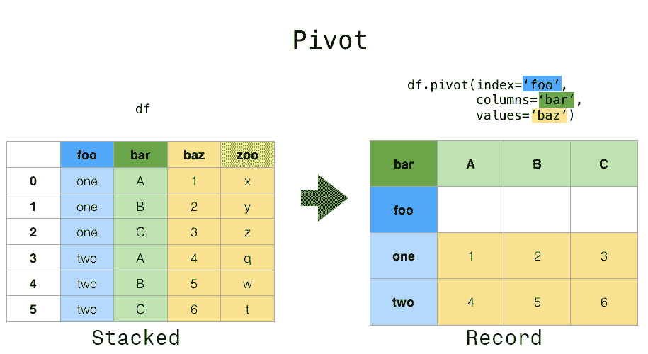
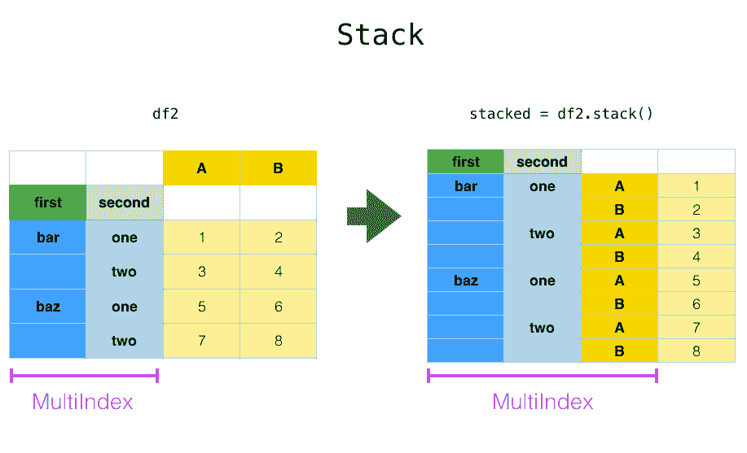
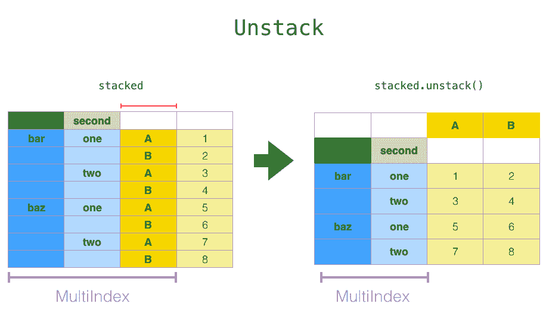
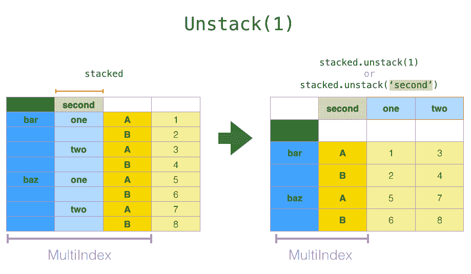
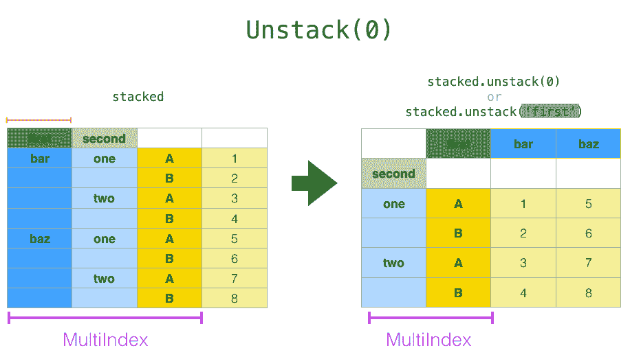
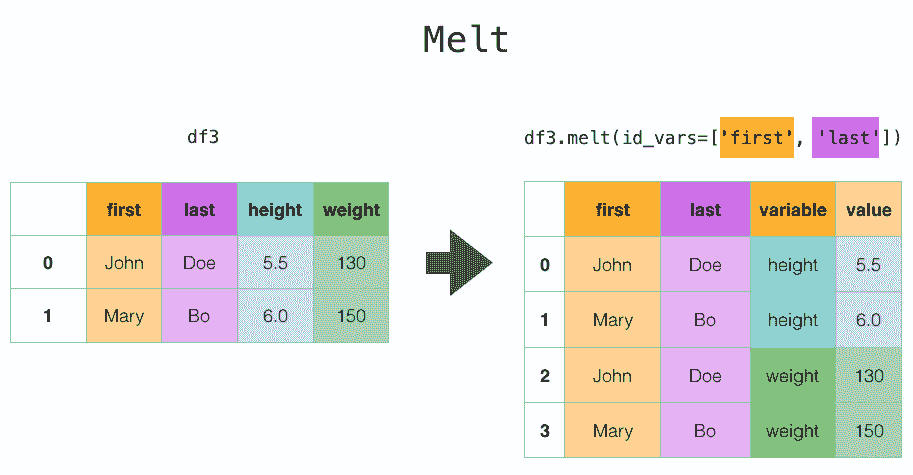

# 重塑和透视表

> 原文：[`pandas.pydata.org/docs/user_guide/reshaping.html`](https://pandas.pydata.org/docs/user_guide/reshaping.html)

pandas 提供了用于操作`Series`和`DataFrame`的方法，以改变数据的表示形式，以便进行进一步的数据处理或数据汇总。

+   `pivot()` 和 `pivot_table()`：在一个或多个离散类别中对唯一值进行分组。

+   `stack()` 和 `unstack()`：分别将列或行级别的数据透视到相反的轴上。

+   `melt()` 和 `wide_to_long()`：将宽格式的`DataFrame`转换为长格式。

+   `get_dummies()` 和 `from_dummies()`：使用指示变量进行转换。

+   `explode()`：将类似列表的值的列转换为单独的行。

+   `crosstab()`：计算多个一维因子数组的交叉制表。

+   `cut()`：将连续变量转换为离散的分类值。

+   `factorize()`：将一维变量编码为整数标签。

## `pivot()` 和 `pivot_table()`



### `pivot()`

数据通常以所谓的“堆叠”或“记录”格式存储。在“记录”或“宽”格式中，通常每个主题都有一行。在“堆叠”或“长”格式中，每个主题（适用时）可能有多行。

```py
In [1]: data = {
 ...:   "value": range(12),
 ...:   "variable": ["A"] * 3 + ["B"] * 3 + ["C"] * 3 + ["D"] * 3,
 ...:   "date": pd.to_datetime(["2020-01-03", "2020-01-04", "2020-01-05"] * 4)
 ...: }
 ...: 

In [2]: df = pd.DataFrame(data) 
```

要对每个唯一变量执行时间序列操作，更好的表示形式是`columns`是唯一变量，`index`是日期标识个别观察。为了将数据重塑为这种形式，我们使用`DataFrame.pivot()`方法（也实现为顶级函数`pivot()`）：

```py
In [3]: pivoted = df.pivot(index="date", columns="variable", values="value")

In [4]: pivoted
Out[4]: 
variable    A  B  C   D
date 
2020-01-03  0  3  6   9
2020-01-04  1  4  7  10
2020-01-05  2  5  8  11 
```

如果省略了`values`参数，并且输入的`DataFrame`具有多个未用作列或索引输入的值列，则生成的“透视”`DataFrame`将具有分层列，其最顶层指示相应的值列：

```py
In [5]: df["value2"] = df["value"] * 2

In [6]: pivoted = df.pivot(index="date", columns="variable")

In [7]: pivoted
Out[7]: 
 value           value2 
variable       A  B  C   D      A   B   C   D
date 
2020-01-03     0  3  6   9      0   6  12  18
2020-01-04     1  4  7  10      2   8  14  20
2020-01-05     2  5  8  11      4  10  16  22 
```

你可以从透视后的`DataFrame`中选择子集：

```py
In [8]: pivoted["value2"]
Out[8]: 
variable    A   B   C   D
date 
2020-01-03  0   6  12  18
2020-01-04  2   8  14  20
2020-01-05  4  10  16  22 
```

请注意，这将返回基础数据的视图，如果数据是同质类型的。

注意

`pivot()`只能处理由`index`和`columns`指定的唯一行。如果您的数据包含重复项，请使用`pivot_table()`。

### `pivot_table()`

虽然`pivot()`提供了各种数据类型的通用透视功能，但 pandas 还提供了用于对数值数据进行聚合的`pivot_table()`或`pivot_table()`。

函数`pivot_table()`可用于创建类似电子表格的透视表。查看食谱以获取一些高级策略。

```py
In [9]: import datetime

In [10]: df = pd.DataFrame(
 ....:    {
 ....:        "A": ["one", "one", "two", "three"] * 6,
 ....:        "B": ["A", "B", "C"] * 8,
 ....:        "C": ["foo", "foo", "foo", "bar", "bar", "bar"] * 4,
 ....:        "D": np.random.randn(24),
 ....:        "E": np.random.randn(24),
 ....:        "F": [datetime.datetime(2013, i, 1) for i in range(1, 13)]
 ....:        + [datetime.datetime(2013, i, 15) for i in range(1, 13)],
 ....:    }
 ....: )
 ....: 

In [11]: df
Out[11]: 
 A  B    C         D         E          F
0     one  A  foo  0.469112  0.404705 2013-01-01
1     one  B  foo -0.282863  0.577046 2013-02-01
2     two  C  foo -1.509059 -1.715002 2013-03-01
3   three  A  bar -1.135632 -1.039268 2013-04-01
4     one  B  bar  1.212112 -0.370647 2013-05-01
..    ... ..  ...       ...       ...        ...
19  three  B  foo -1.087401 -0.472035 2013-08-15
20    one  C  foo -0.673690 -0.013960 2013-09-15
21    one  A  bar  0.113648 -0.362543 2013-10-15
22    two  B  bar -1.478427 -0.006154 2013-11-15
23  three  C  bar  0.524988 -0.923061 2013-12-15

[24 rows x 6 columns]

In [12]: pd.pivot_table(df, values="D", index=["A", "B"], columns=["C"])
Out[12]: 
C             bar       foo
A     B 
one   A -0.995460  0.595334
 B  0.393570 -0.494817
 C  0.196903 -0.767769
three A -0.431886       NaN
 B       NaN -1.065818
 C  0.798396       NaN
two   A       NaN  0.197720
 B -0.986678       NaN
 C       NaN -1.274317

In [13]: pd.pivot_table(
 ....:    df, values=["D", "E"],
 ....:    index=["B"],
 ....:    columns=["A", "C"],
 ....:    aggfunc="sum",
 ....: )
 ....: 
Out[13]: 
 D                      ...         E 
A       one               three  ...     three      two 
C       bar       foo       bar  ...       foo      bar       foo
B                                ... 
A -1.990921  1.190667 -0.863772  ...       NaN      NaN -1.067650
B  0.787140 -0.989634       NaN  ...  0.372851  1.63741       NaN
C  0.393806 -1.535539  1.596791  ...       NaN      NaN -3.491906

[3 rows x 12 columns]

In [14]: pd.pivot_table(
 ....:    df, values="E",
 ....:    index=["B", "C"],
 ....:    columns=["A"],
 ....:    aggfunc=["sum", "mean"],
 ....: )
 ....: 
Out[14]: 
 sum                          mean 
A           one     three       two       one     three       two
B C 
A bar -0.471593 -2.008182       NaN -0.235796 -1.004091       NaN
 foo  0.761726       NaN -1.067650  0.380863       NaN -0.533825
B bar -1.665170       NaN  1.637410 -0.832585       NaN  0.818705
 foo -0.097554  0.372851       NaN -0.048777  0.186425       NaN
C bar -0.744154 -2.392449       NaN -0.372077 -1.196224       NaN
 foo  1.061810       NaN -3.491906  0.530905       NaN -1.745953 
```

结果是一个可能在索引或列上具有`MultiIndex`的`DataFrame`。如果未提供`values`列名，则透视表将在列中包含所有数据的额外层次结构：

```py
In [15]: pd.pivot_table(df[["A", "B", "C", "D", "E"]], index=["A", "B"], columns=["C"])
Out[15]: 
 D                   E 
C             bar       foo       bar       foo
A     B 
one   A -0.995460  0.595334 -0.235796  0.380863
 B  0.393570 -0.494817 -0.832585 -0.048777
 C  0.196903 -0.767769 -0.372077  0.530905
three A -0.431886       NaN -1.004091       NaN
 B       NaN -1.065818       NaN  0.186425
 C  0.798396       NaN -1.196224       NaN
two   A       NaN  0.197720       NaN -0.533825
 B -0.986678       NaN  0.818705       NaN
 C       NaN -1.274317       NaN -1.745953 
```

同样，您可以在`index`和`columns`关键字中使用`Grouper`。有关`Grouper`的详细信息，请参见使用 Grouper 规范进行分组。

```py
In [16]: pd.pivot_table(df, values="D", index=pd.Grouper(freq="ME", key="F"), columns="C")
Out[16]: 
C                bar       foo
F 
2013-01-31       NaN  0.595334
2013-02-28       NaN -0.494817
2013-03-31       NaN -1.274317
2013-04-30 -0.431886       NaN
2013-05-31  0.393570       NaN
2013-06-30  0.196903       NaN
2013-07-31       NaN  0.197720
2013-08-31       NaN -1.065818
2013-09-30       NaN -0.767769
2013-10-31 -0.995460       NaN
2013-11-30 -0.986678       NaN
2013-12-31  0.798396       NaN 
```

#### 添加边距

将`margins=True`传递给`pivot_table()`将在行和列上添加一个带有`All`标签的行和列，其中包含跨行和列���别的部分组聚合：

```py
In [17]: table = df.pivot_table(
 ....:    index=["A", "B"],
 ....:    columns="C",
 ....:    values=["D", "E"],
 ....:    margins=True,
 ....:    aggfunc="std"
 ....: )
 ....: 

In [18]: table
Out[18]: 
 D                             E 
C             bar       foo       All       bar       foo       All
A     B 
one   A  1.568517  0.178504  1.293926  0.179247  0.033718  0.371275
 B  1.157593  0.299748  0.860059  0.653280  0.885047  0.779837
 C  0.523425  0.133049  0.638297  1.111310  0.770555  0.938819
three A  0.995247       NaN  0.995247  0.049748       NaN  0.049748
 B       NaN  0.030522  0.030522       NaN  0.931203  0.931203
 C  0.386657       NaN  0.386657  0.386312       NaN  0.386312
two   A       NaN  0.111032  0.111032       NaN  1.146201  1.146201
 B  0.695438       NaN  0.695438  1.166526       NaN  1.166526
 C       NaN  0.331975  0.331975       NaN  0.043771  0.043771
All      1.014073  0.713941  0.871016  0.881376  0.984017  0.923568 
```

此外，您可以调用`DataFrame.stack()`来显示一个透视的 DataFrame，具有多级索引：

```py
In [19]: table.stack(future_stack=True)
Out[19]: 
 D         E
A   B C 
one A bar  1.568517  0.179247
 foo  0.178504  0.033718
 All  1.293926  0.371275
 B bar  1.157593  0.653280
 foo  0.299748  0.885047
...             ...       ...
two C foo  0.331975  0.043771
 All  0.331975  0.043771
All   bar  1.014073  0.881376
 foo  0.713941  0.984017
 All  0.871016  0.923568

[30 rows x 2 columns] 
```  ## `stack()` 和 `unstack()`



与`pivot()`方法密切相关的是`Series`和`DataFrame`上可用的相关`stack()`和`unstack()`方法。这些方法旨在与`MultiIndex`对象一起使用（请参阅分层索引部分）。

+   `stack()`：将（可能是分层的）列标签的一个级别“枢轴”，返回一个带有新的最内层行标签的`DataFrame`。

+   `unstack()`:（`stack()`的逆操作）将（可能是分层的）行索引的一个级别“枢轴”到列轴，生成一个重新塑造的带有新的最内层列标签的`DataFrame`。



```py
In [20]: tuples = [
 ....:   ["bar", "bar", "baz", "baz", "foo", "foo", "qux", "qux"],
 ....:   ["one", "two", "one", "two", "one", "two", "one", "two"],
 ....: ]
 ....: 

In [21]: index = pd.MultiIndex.from_arrays(tuples, names=["first", "second"])

In [22]: df = pd.DataFrame(np.random.randn(8, 2), index=index, columns=["A", "B"])

In [23]: df2 = df[:4]

In [24]: df2
Out[24]: 
 A         B
first second 
bar   one     0.895717  0.805244
 two    -1.206412  2.565646
baz   one     1.431256  1.340309
 two    -1.170299 -0.226169 
```

`stack()` 函数将 `DataFrame` 中的一个级别“压缩”为以下之一：

+   在列中具有`Index`的情况下的`Series`。

+   在列中具有`MultiIndex`的情况下的`DataFrame`。

如果列具有`MultiIndex`，您可以选择堆叠哪个级别。堆叠的级别将成为列中`MultiIndex`的新最低级别：

```py
In [25]: stacked = df2.stack(future_stack=True)

In [26]: stacked
Out[26]: 
first  second 
bar    one     A    0.895717
 B    0.805244
 two     A   -1.206412
 B    2.565646
baz    one     A    1.431256
 B    1.340309
 two     A   -1.170299
 B   -0.226169
dtype: float64 
```

使用“堆叠”`DataFrame` 或 `Series`（具有 `MultiIndex` 作为 `index`）的逆操作是 `unstack()`，默认情况下取消堆叠**最后一个级别**：

```py
In [27]: stacked.unstack()
Out[27]: 
 A         B
first second 
bar   one     0.895717  0.805244
 two    -1.206412  2.565646
baz   one     1.431256  1.340309
 two    -1.170299 -0.226169

In [28]: stacked.unstack(1)
Out[28]: 
second        one       two
first 
bar   A  0.895717 -1.206412
 B  0.805244  2.565646
baz   A  1.431256 -1.170299
 B  1.340309 -0.226169

In [29]: stacked.unstack(0)
Out[29]: 
first          bar       baz
second 
one    A  0.895717  1.431256
 B  0.805244  1.340309
two    A -1.206412 -1.170299
 B  2.565646 -0.226169 
```



如果索引有名称，则可以使用级别名称而不是指定级别编号：

```py
In [30]: stacked.unstack("second")
Out[30]: 
second        one       two
first 
bar   A  0.895717 -1.206412
 B  0.805244  2.565646
baz   A  1.431256 -1.170299
 B  1.340309 -0.226169 
```



请注意，`stack()` 和 `unstack()` 方法隐式地对涉及的索引级别进行排序。因此，对 `stack()` 和然后 `unstack()` 或反之的调用，将导致原始 `DataFrame` 或 `Series` 的**排序**副本：

```py
In [31]: index = pd.MultiIndex.from_product([[2, 1], ["a", "b"]])

In [32]: df = pd.DataFrame(np.random.randn(4), index=index, columns=["A"])

In [33]: df
Out[33]: 
 A
2 a -1.413681
 b  1.607920
1 a  1.024180
 b  0.569605

In [34]: all(df.unstack().stack(future_stack=True) == df.sort_index())
Out[34]: True 
```

### 多个级别

您还可以通过传递级别列表一次堆叠或取消堆叠多个级别，此时最终结果就像列表中的每个级别都单独处理一样。

```py
In [35]: columns = pd.MultiIndex.from_tuples(
 ....:    [
 ....:        ("A", "cat", "long"),
 ....:        ("B", "cat", "long"),
 ....:        ("A", "dog", "short"),
 ....:        ("B", "dog", "short"),
 ....:    ],
 ....:    names=["exp", "animal", "hair_length"],
 ....: )
 ....: 

In [36]: df = pd.DataFrame(np.random.randn(4, 4), columns=columns)

In [37]: df
Out[37]: 
exp                 A         B         A         B
animal            cat       cat       dog       dog
hair_length      long      long     short     short
0            0.875906 -2.211372  0.974466 -2.006747
1           -0.410001 -0.078638  0.545952 -1.219217
2           -1.226825  0.769804 -1.281247 -0.727707
3           -0.121306 -0.097883  0.695775  0.341734

In [38]: df.stack(level=["animal", "hair_length"], future_stack=True)
Out[38]: 
exp                          A         B
 animal hair_length 
0 cat    long         0.875906 -2.211372
 dog    short        0.974466 -2.006747
1 cat    long        -0.410001 -0.078638
 dog    short        0.545952 -1.219217
2 cat    long        -1.226825  0.769804
 dog    short       -1.281247 -0.727707
3 cat    long        -0.121306 -0.097883
 dog    short        0.695775  0.341734 
```

级别列表可以包含级别名称或级别编号，但不能混合使用两者。

```py
# df.stack(level=['animal', 'hair_length'], future_stack=True)
# from above is equivalent to:
In [39]: df.stack(level=[1, 2], future_stack=True)
Out[39]: 
exp                          A         B
 animal hair_length 
0 cat    long         0.875906 -2.211372
 dog    short        0.974466 -2.006747
1 cat    long        -0.410001 -0.078638
 dog    short        0.545952 -1.219217
2 cat    long        -1.226825  0.769804
 dog    short       -1.281247 -0.727707
3 cat    long        -0.121306 -0.097883
 dog    short        0.695775  0.341734 
```

### 缺失数据

如果子组没有相同的标签集，则取消堆叠可能会导致缺失值。 默认情况下，缺失值将替换为该数据类型的默认填充值。

```py
In [40]: columns = pd.MultiIndex.from_tuples(
 ....:    [
 ....:        ("A", "cat"),
 ....:        ("B", "dog"),
 ....:        ("B", "cat"),
 ....:        ("A", "dog"),
 ....:    ],
 ....:    names=["exp", "animal"],
 ....: )
 ....: 

In [41]: index = pd.MultiIndex.from_product(
 ....:    [("bar", "baz", "foo", "qux"), ("one", "two")], names=["first", "second"]
 ....: )
 ....: 

In [42]: df = pd.DataFrame(np.random.randn(8, 4), index=index, columns=columns)

In [43]: df3 = df.iloc[[0, 1, 4, 7], [1, 2]]

In [44]: df3
Out[44]: 
exp                  B 
animal             dog       cat
first second 
bar   one    -1.110336 -0.619976
 two     0.687738  0.176444
foo   one     1.314232  0.690579
qux   two     0.380396  0.084844

In [45]: df3.unstack()
Out[45]: 
exp            B 
animal       dog                 cat 
second       one       two       one       two
first 
bar    -1.110336  0.687738 -0.619976  0.176444
foo     1.314232       NaN  0.690579       NaN
qux          NaN  0.380396       NaN  0.084844 
```

可以使用`fill_value`参数将缺失值填充为特定值。

```py
In [46]: df3.unstack(fill_value=-1e9)
Out[46]: 
exp                B 
animal           dog                         cat 
second           one           two           one           two
first 
bar    -1.110336e+00  6.877384e-01 -6.199759e-01  1.764443e-01
foo     1.314232e+00 -1.000000e+09  6.905793e-01 -1.000000e+09
qux    -1.000000e+09  3.803956e-01 -1.000000e+09  8.484421e-02 
```  ## `melt()` 和 `wide_to_long()`



顶级`melt()`函数及其对应的`DataFrame.melt()`对于将`DataFrame`整理成一种格式非常有用，其中一个或多个列是*标识符变量*，而所有其他列，被视为*测量变量*，被“解开”到行轴上，仅留下两个非标识符列，“变量”和“值”。 这些列的名称可以通过提供`var_name`和`value_name`参数进行自定义。

```py
In [47]: cheese = pd.DataFrame(
 ....:    {
 ....:        "first": ["John", "Mary"],
 ....:        "last": ["Doe", "Bo"],
 ....:        "height": [5.5, 6.0],
 ....:        "weight": [130, 150],
 ....:    }
 ....: )
 ....: 

In [48]: cheese
Out[48]: 
 first last  height  weight
0  John  Doe     5.5     130
1  Mary   Bo     6.0     150

In [49]: cheese.melt(id_vars=["first", "last"])
Out[49]: 
 first last variable  value
0  John  Doe   height    5.5
1  Mary   Bo   height    6.0
2  John  Doe   weight  130.0
3  Mary   Bo   weight  150.0

In [50]: cheese.melt(id_vars=["first", "last"], var_name="quantity")
Out[50]: 
 first last quantity  value
0  John  Doe   height    5.5
1  Mary   Bo   height    6.0
2  John  Doe   weight  130.0
3  Mary   Bo   weight  150.0 
```

在使用`melt()`转换 DataFrame 时，索引将被忽略。 可以通过将`ignore_index=False`参数设置为`False`（默认为`True`）来保留原始索引值。 `ignore_index=False`会导致索引值重复。

```py
In [51]: index = pd.MultiIndex.from_tuples([("person", "A"), ("person", "B")])

In [52]: cheese = pd.DataFrame(
 ....:    {
 ....:        "first": ["John", "Mary"],
 ....:        "last": ["Doe", "Bo"],
 ....:        "height": [5.5, 6.0],
 ....:        "weight": [130, 150],
 ....:    },
 ....:    index=index,
 ....: )
 ....: 

In [53]: cheese
Out[53]: 
 first last  height  weight
person A  John  Doe     5.5     130
 B  Mary   Bo     6.0     150

In [54]: cheese.melt(id_vars=["first", "last"])
Out[54]: 
 first last variable  value
0  John  Doe   height    5.5
1  Mary   Bo   height    6.0
2  John  Doe   weight  130.0
3  Mary   Bo   weight  150.0

In [55]: cheese.melt(id_vars=["first", "last"], ignore_index=False)
Out[55]: 
 first last variable  value
person A  John  Doe   height    5.5
 B  Mary   Bo   height    6.0
 A  John  Doe   weight  130.0
 B  Mary   Bo   weight  150.0 
```

`wide_to_long()`类似于`melt()`，但具有更多的列匹配自定义功能。

```py
In [56]: dft = pd.DataFrame(
 ....:    {
 ....:        "A1970": {0: "a", 1: "b", 2: "c"},
 ....:        "A1980": {0: "d", 1: "e", 2: "f"},
 ....:        "B1970": {0: 2.5, 1: 1.2, 2: 0.7},
 ....:        "B1980": {0: 3.2, 1: 1.3, 2: 0.1},
 ....:        "X": dict(zip(range(3), np.random.randn(3))),
 ....:    }
 ....: )
 ....: 

In [57]: dft["id"] = dft.index

In [58]: dft
Out[58]: 
 A1970 A1980  B1970  B1980         X  id
0     a     d    2.5    3.2  1.519970   0
1     b     e    1.2    1.3 -0.493662   1
2     c     f    0.7    0.1  0.600178   2

In [59]: pd.wide_to_long(dft, ["A", "B"], i="id", j="year")
Out[59]: 
 X  A    B
id year 
0  1970  1.519970  a  2.5
1  1970 -0.493662  b  1.2
2  1970  0.600178  c  0.7
0  1980  1.519970  d  3.2
1  1980 -0.493662  e  1.3
2  1980  0.600178  f  0.1 
```  ## `get_dummies()` 和 `from_dummies()`

要将`Series`的分类变量转换为“虚拟”或“指示符”，`get_dummies()`会创建一个新的`DataFrame`，其中包含唯一变量的列和表示每行中变量存在的值。

```py
In [60]: df = pd.DataFrame({"key": list("bbacab"), "data1": range(6)})

In [61]: pd.get_dummies(df["key"])
Out[61]: 
 a      b      c
0  False   True  False
1  False   True  False
2   True  False  False
3  False  False   True
4   True  False  False
5  False   True  False

In [62]: df["key"].str.get_dummies()
Out[62]: 
 a  b  c
0  0  1  0
1  0  1  0
2  1  0  0
3  0  0  1
4  1  0  0
5  0  1  0 
```

`prefix`将前缀添加到列名中，这对将结果与原始`DataFrame`合并很有用：

```py
In [63]: dummies = pd.get_dummies(df["key"], prefix="key")

In [64]: dummies
Out[64]: 
 key_a  key_b  key_c
0  False   True  False
1  False   True  False
2   True  False  False
3  False  False   True
4   True  False  False
5  False   True  False

In [65]: df[["data1"]].join(dummies)
Out[65]: 
 data1  key_a  key_b  key_c
0      0  False   True  False
1      1  False   True  False
2      2   True  False  False
3      3  False  False   True
4      4   True  False  False
5      5  False   True  False 
```

这个函数通常与像`cut()`这样的离散化函数一起使用：

```py
In [66]: values = np.random.randn(10)

In [67]: values
Out[67]: 
array([ 0.2742,  0.1329, -0.0237,  2.4102,  1.4505,  0.2061, -0.2519,
 -2.2136,  1.0633,  1.2661])

In [68]: bins = [0, 0.2, 0.4, 0.6, 0.8, 1]

In [69]: pd.get_dummies(pd.cut(values, bins))
Out[69]: 
 (0.0, 0.2]  (0.2, 0.4]  (0.4, 0.6]  (0.6, 0.8]  (0.8, 1.0]
0       False        True       False       False       False
1        True       False       False       False       False
2       False       False       False       False       False
3       False       False       False       False       False
4       False       False       False       False       False
5       False        True       False       False       False
6       False       False       False       False       False
7       False       False       False       False       False
8       False       False       False       False       False
9       False       False       False       False       False 
```

`get_dummies()` 也接受一个`DataFrame`。默认情况下，`object`、`string`或`categorical`类型的列将被编码为虚拟变量，而其他列保持不变。

```py
In [70]: df = pd.DataFrame({"A": ["a", "b", "a"], "B": ["c", "c", "b"], "C": [1, 2, 3]})

In [71]: pd.get_dummies(df)
Out[71]: 
 C    A_a    A_b    B_b    B_c
0  1   True  False  False   True
1  2  False   True  False   True
2  3   True  False   True  False 
```

指定`columns`关键字将对任何类型的列进行编码。

```py
In [72]: pd.get_dummies(df, columns=["A"])
Out[72]: 
 B  C    A_a    A_b
0  c  1   True  False
1  c  2  False   True
2  b  3   True  False 
```

与`Series`版本一样，您可以为`prefix`和`prefix_sep`传递值。默认情况下，列名用作前缀，`_`用作前缀分隔符。您可以以 3 种方式指定`prefix`���`prefix_sep`：

+   string: 对于要编码的每一列，使用相同的值作为`prefix`或`prefix_sep`。

+   list: 必须与要编码的列数相同长度。

+   dict: 将列名映射到前缀。

```py
In [73]: simple = pd.get_dummies(df, prefix="new_prefix")

In [74]: simple
Out[74]: 
 C  new_prefix_a  new_prefix_b  new_prefix_b  new_prefix_c
0  1          True         False         False          True
1  2         False          True         False          True
2  3          True         False          True         False

In [75]: from_list = pd.get_dummies(df, prefix=["from_A", "from_B"])

In [76]: from_list
Out[76]: 
 C  from_A_a  from_A_b  from_B_b  from_B_c
0  1      True     False     False      True
1  2     False      True     False      True
2  3      True     False      True     False

In [77]: from_dict = pd.get_dummies(df, prefix={"B": "from_B", "A": "from_A"})

In [78]: from_dict
Out[78]: 
 C  from_A_a  from_A_b  from_B_b  from_B_c
0  1      True     False     False      True
1  2     False      True     False      True
2  3      True     False      True     False 
```

为了避免在将结果输入统计模型时出现共线性问题，请指定`drop_first=True`。

```py
In [79]: s = pd.Series(list("abcaa"))

In [80]: pd.get_dummies(s)
Out[80]: 
 a      b      c
0   True  False  False
1  False   True  False
2  False  False   True
3   True  False  False
4   True  False  False

In [81]: pd.get_dummies(s, drop_first=True)
Out[81]: 
 b      c
0  False  False
1   True  False
2  False   True
3  False  False
4  False  False 
```

当一列只包含一个级别时，它将在结果中被省略。

```py
In [82]: df = pd.DataFrame({"A": list("aaaaa"), "B": list("ababc")})

In [83]: pd.get_dummies(df)
Out[83]: 
 A_a    B_a    B_b    B_c
0  True   True  False  False
1  True  False   True  False
2  True   True  False  False
3  True  False   True  False
4  True  False  False   True

In [84]: pd.get_dummies(df, drop_first=True)
Out[84]: 
 B_b    B_c
0  False  False
1   True  False
2  False  False
3   True  False
4  False   True 
```

可以使用`dtype`参数将值转换为不同类型。

```py
In [85]: df = pd.DataFrame({"A": list("abc"), "B": [1.1, 2.2, 3.3]})

In [86]: pd.get_dummies(df, dtype=np.float32).dtypes
Out[86]: 
B      float64
A_a    float32
A_b    float32
A_c    float32
dtype: object 
```

新版本 1.5.0 中新增。

`from_dummies()` 将`get_dummies()` 的输出转换回指示值的`Series`。

```py
In [87]: df = pd.DataFrame({"prefix_a": [0, 1, 0], "prefix_b": [1, 0, 1]})

In [88]: df
Out[88]: 
 prefix_a  prefix_b
0         0         1
1         1         0
2         0         1

In [89]: pd.from_dummies(df, sep="_")
Out[89]: 
 prefix
0      b
1      a
2      b 
```

虚拟编码数据只需要包含`k - 1`个类别，此时最后一个类别是默认类别。默认类别可以使用`default_category`进行修改。

```py
In [90]: df = pd.DataFrame({"prefix_a": [0, 1, 0]})

In [91]: df
Out[91]: 
 prefix_a
0         0
1         1
2         0

In [92]: pd.from_dummies(df, sep="_", default_category="b")
Out[92]: 
 prefix
0      b
1      a
2      b 
```  ## `explode()`

对于具有嵌套、类似列表的值的`DataFrame`列，`explode()` 将每个类似列表的值转换为单独的行。生成的`Index` 将与原始行的索引标签对应重复：

```py
In [93]: keys = ["panda1", "panda2", "panda3"]

In [94]: values = [["eats", "shoots"], ["shoots", "leaves"], ["eats", "leaves"]]

In [95]: df = pd.DataFrame({"keys": keys, "values": values})

In [96]: df
Out[96]: 
 keys            values
0  panda1    [eats, shoots]
1  panda2  [shoots, leaves]
2  panda3    [eats, leaves]

In [97]: df["values"].explode()
Out[97]: 
0      eats
0    shoots
1    shoots
1    leaves
2      eats
2    leaves
Name: values, dtype: object 
```

`DataFrame.explode` 也可以将`DataFrame`中的列展开。

```py
In [98]: df.explode("values")
Out[98]: 
 keys  values
0  panda1    eats
0  panda1  shoots
1  panda2  shoots
1  panda2  leaves
2  panda3    eats
2  panda3  leaves 
```

`Series.explode()` 将空列表替换为缺失值指示符并保留标量条目。

```py
In [99]: s = pd.Series([[1, 2, 3], "foo", [], ["a", "b"]])

In [100]: s
Out[100]: 
0    [1, 2, 3]
1          foo
2           []
3       [a, b]
dtype: object

In [101]: s.explode()
Out[101]: 
0      1
0      2
0      3
1    foo
2    NaN
3      a
3      b
dtype: object 
```

逗号分隔的字符串值可以拆分为列表中的单个值，然后展开为新行。

```py
In [102]: df = pd.DataFrame([{"var1": "a,b,c", "var2": 1}, {"var1": "d,e,f", "var2": 2}])

In [103]: df.assign(var1=df.var1.str.split(",")).explode("var1")
Out[103]: 
 var1  var2
0    a     1
0    b     1
0    c     1
1    d     2
1    e     2
1    f     2 
```  ## `crosstab()`

使用`crosstab()`计算两个（或更多）因子的交叉制表。默认情况下，`crosstab()`计算因子的频率表，除非传递了值数组和聚合函数。

传递的任何`Series`都将使用其名称属性，除非为交叉制表指定了行或列名称

```py
In [104]: a = np.array(["foo", "foo", "bar", "bar", "foo", "foo"], dtype=object)

In [105]: b = np.array(["one", "one", "two", "one", "two", "one"], dtype=object)

In [106]: c = np.array(["dull", "dull", "shiny", "dull", "dull", "shiny"], dtype=object)

In [107]: pd.crosstab(a, [b, c], rownames=["a"], colnames=["b", "c"])
Out[107]: 
b    one        two 
c   dull shiny dull shiny
a 
bar    1     0    0     1
foo    2     1    1     0 
```

如果`crosstab()`只接收两个`Series`，它将提供一个频率表。

```py
In [108]: df = pd.DataFrame(
 .....:    {"A": [1, 2, 2, 2, 2], "B": [3, 3, 4, 4, 4], "C": [1, 1, np.nan, 1, 1]}
 .....: )
 .....: 

In [109]: df
Out[109]: 
 A  B    C
0  1  3  1.0
1  2  3  1.0
2  2  4  NaN
3  2  4  1.0
4  2  4  1.0

In [110]: pd.crosstab(df["A"], df["B"])
Out[110]: 
B  3  4
A 
1  1  0
2  1  3 
```

`crosstab()`还可以总结`Categorical`数据。

```py
In [111]: foo = pd.Categorical(["a", "b"], categories=["a", "b", "c"])

In [112]: bar = pd.Categorical(["d", "e"], categories=["d", "e", "f"])

In [113]: pd.crosstab(foo, bar)
Out[113]: 
col_0  d  e
row_0 
a      1  0
b      0  1 
```

对于`Categorical`数据，如果要包含**所有**数据类别，即使实际数据不包含特定类别的任何实例，请使用`dropna=False`。

```py
In [114]: pd.crosstab(foo, bar, dropna=False)
Out[114]: 
col_0  d  e  f
row_0 
a      1  0  0
b      0  1  0
c      0  0  0 
```

### 归一化

频率表也可以通过`normalize`参数进行归一化，以显示百分比而不是计数：

```py
In [115]: pd.crosstab(df["A"], df["B"], normalize=True)
Out[115]: 
B    3    4
A 
1  0.2  0.0
2  0.2  0.6 
```

`normalize`还可以在每行或每列内归一化值：

```py
In [116]: pd.crosstab(df["A"], df["B"], normalize="columns")
Out[116]: 
B    3    4
A 
1  0.5  0.0
2  0.5  1.0 
```

`crosstab()`还可以接受第三个`Series`和一个聚合函数(`aggfunc`)，该函数将应用于第三个`Series`的值，这些值在由前两个`Series`定义的每个组内：

```py
In [117]: pd.crosstab(df["A"], df["B"], values=df["C"], aggfunc="sum")
Out[117]: 
B    3    4
A 
1  1.0  NaN
2  1.0  2.0 
```

### 添加边际

`margins=True`将添加一个带有`All`标签的行和列，该标签在行和列上的类别上具有部分组聚合：

```py
In [118]: pd.crosstab(
 .....:    df["A"], df["B"], values=df["C"], aggfunc="sum", normalize=True, margins=True
 .....: )
 .....: 
Out[118]: 
B       3    4   All
A 
1    0.25  0.0  0.25
2    0.25  0.5  0.75
All  0.50  0.5  1.00 
```  ## `cut()`

`cut()`函数计算输入数组的值的分组，并经常用于将连续变量转换为离散或分类变量：

整数`bins`将形成等宽箱。

```py
In [119]: ages = np.array([10, 15, 13, 12, 23, 25, 28, 59, 60])

In [120]: pd.cut(ages, bins=3)
Out[120]: 
[(9.95, 26.667], (9.95, 26.667], (9.95, 26.667], (9.95, 26.667], (9.95, 26.667], (9.95, 26.667], (26.667, 43.333], (43.333, 60.0], (43.333, 60.0]]
Categories (3, interval[float64, right]): [(9.95, 26.667] < (26.667, 43.333] < (43.333, 60.0]] 
```

一个有序的箱边列表将为每个变量分配一个区间。

```py
In [121]: pd.cut(ages, bins=[0, 18, 35, 70])
Out[121]: 
[(0, 18], (0, 18], (0, 18], (0, 18], (18, 35], (18, 35], (18, 35], (35, 70], (35, 70]]
Categories (3, interval[int64, right]): [(0, 18] < (18, 35] < (35, 70]] 
```

如果`bins`关键字是一个`IntervalIndex`，那么这些将用于对传递的数据进行分箱。

```py
In [122]: pd.cut(ages, bins=pd.IntervalIndex.from_breaks([0, 40, 70]))
Out[122]: 
[(0, 40], (0, 40], (0, 40], (0, 40], (0, 40], (0, 40], (0, 40], (40, 70], (40, 70]]
Categories (2, interval[int64, right]): [(0, 40] < (40, 70]] 
```  ## `factorize()`

`factorize()`将一维值编码为整数标签。缺失值被编码为`-1`。

```py
In [123]: x = pd.Series(["A", "A", np.nan, "B", 3.14, np.inf])

In [124]: x
Out[124]: 
0       A
1       A
2     NaN
3       B
4    3.14
5     inf
dtype: object

In [125]: labels, uniques = pd.factorize(x)

In [126]: labels
Out[126]: array([ 0,  0, -1,  1,  2,  3])

In [127]: uniques
Out[127]: Index(['A', 'B', 3.14, inf], dtype='object') 
```

`Categorical` 将类似地对 1 维值进行编码以进行进一步的分类操作

```py
In [128]: pd.Categorical(x)
Out[128]: 
['A', 'A', NaN, 'B', 3.14, inf]
Categories (4, object): [3.14, inf, 'A', 'B'] 
```

## `pivot()` 和 `pivot_table()`


### `pivot()`

数据通常以所谓的“堆叠”或“记录”格式存储。在“记录”或“宽”格式中，通常每个主题都有一行。在“堆叠”或“长”格式中，每个主题（适用时）可能有多行。

```py
In [1]: data = {
 ...:   "value": range(12),
 ...:   "variable": ["A"] * 3 + ["B"] * 3 + ["C"] * 3 + ["D"] * 3,
 ...:   "date": pd.to_datetime(["2020-01-03", "2020-01-04", "2020-01-05"] * 4)
 ...: }
 ...: 

In [2]: df = pd.DataFrame(data) 
```

要对每个唯一变量执行时间序列操作，更好的表示形式是 `columns` 是唯一变量，日期的 `index` 标识个别观察结果。为了将数据重塑为这种形式，我们使用 `DataFrame.pivot()` 方法（也实现为顶级函数 `pivot()`）：

```py
In [3]: pivoted = df.pivot(index="date", columns="variable", values="value")

In [4]: pivoted
Out[4]: 
variable    A  B  C   D
date 
2020-01-03  0  3  6   9
2020-01-04  1  4  7  10
2020-01-05  2  5  8  11 
```

如果省略 `values` 参数，并且输入的 `DataFrame` 有多列值，这些值不用作 `pivot()` 的列或索引输入，则生成的“透视” `DataFrame` 将具有分层列，其最顶层指示相应的值列：

```py
In [5]: df["value2"] = df["value"] * 2

In [6]: pivoted = df.pivot(index="date", columns="variable")

In [7]: pivoted
Out[7]: 
 value           value2 
variable       A  B  C   D      A   B   C   D
date 
2020-01-03     0  3  6   9      0   6  12  18
2020-01-04     1  4  7  10      2   8  14  20
2020-01-05     2  5  8  11      4  10  16  22 
```

然后您可以从透视的 `DataFrame` 中选择子集：

```py
In [8]: pivoted["value2"]
Out[8]: 
variable    A   B   C   D
date 
2020-01-03  0   6  12  18
2020-01-04  2   8  14  20
2020-01-05  4  10  16  22 
```

请注意，在数据是同质类型的情况下，这将返回对底层数据的视图。

注意

`pivot()` 只能处理由 `index` 和 `columns` 指定的唯一行。如果您的数据包含重复项，请使用 `pivot_table()`。

### `pivot_table()`

虽然 `pivot()` 提供了各种数据类型的通用数据透视，但 pandas 还提供了 `pivot_table()` 或 `pivot_table()` 用于对数值数据进行聚合的数据透视。

函数`pivot_table()` 可以用来创建类似电子表格的透视表。查看示例以获取一些高级策略。

```py
In [9]: import datetime

In [10]: df = pd.DataFrame(
 ....:    {
 ....:        "A": ["one", "one", "two", "three"] * 6,
 ....:        "B": ["A", "B", "C"] * 8,
 ....:        "C": ["foo", "foo", "foo", "bar", "bar", "bar"] * 4,
 ....:        "D": np.random.randn(24),
 ....:        "E": np.random.randn(24),
 ....:        "F": [datetime.datetime(2013, i, 1) for i in range(1, 13)]
 ....:        + [datetime.datetime(2013, i, 15) for i in range(1, 13)],
 ....:    }
 ....: )
 ....: 

In [11]: df
Out[11]: 
 A  B    C         D         E          F
0     one  A  foo  0.469112  0.404705 2013-01-01
1     one  B  foo -0.282863  0.577046 2013-02-01
2     two  C  foo -1.509059 -1.715002 2013-03-01
3   three  A  bar -1.135632 -1.039268 2013-04-01
4     one  B  bar  1.212112 -0.370647 2013-05-01
..    ... ..  ...       ...       ...        ...
19  three  B  foo -1.087401 -0.472035 2013-08-15
20    one  C  foo -0.673690 -0.013960 2013-09-15
21    one  A  bar  0.113648 -0.362543 2013-10-15
22    two  B  bar -1.478427 -0.006154 2013-11-15
23  three  C  bar  0.524988 -0.923061 2013-12-15

[24 rows x 6 columns]

In [12]: pd.pivot_table(df, values="D", index=["A", "B"], columns=["C"])
Out[12]: 
C             bar       foo
A     B 
one   A -0.995460  0.595334
 B  0.393570 -0.494817
 C  0.196903 -0.767769
three A -0.431886       NaN
 B       NaN -1.065818
 C  0.798396       NaN
two   A       NaN  0.197720
 B -0.986678       NaN
 C       NaN -1.274317

In [13]: pd.pivot_table(
 ....:    df, values=["D", "E"],
 ....:    index=["B"],
 ....:    columns=["A", "C"],
 ....:    aggfunc="sum",
 ....: )
 ....: 
Out[13]: 
 D                      ...         E 
A       one               three  ...     three      two 
C       bar       foo       bar  ...       foo      bar       foo
B                                ... 
A -1.990921  1.190667 -0.863772  ...       NaN      NaN -1.067650
B  0.787140 -0.989634       NaN  ...  0.372851  1.63741       NaN
C  0.393806 -1.535539  1.596791  ...       NaN      NaN -3.491906

[3 rows x 12 columns]

In [14]: pd.pivot_table(
 ....:    df, values="E",
 ....:    index=["B", "C"],
 ....:    columns=["A"],
 ....:    aggfunc=["sum", "mean"],
 ....: )
 ....: 
Out[14]: 
 sum                          mean 
A           one     three       two       one     three       two
B C 
A bar -0.471593 -2.008182       NaN -0.235796 -1.004091       NaN
 foo  0.761726       NaN -1.067650  0.380863       NaN -0.533825
B bar -1.665170       NaN  1.637410 -0.832585       NaN  0.818705
 foo -0.097554  0.372851       NaN -0.048777  0.186425       NaN
C bar -0.744154 -2.392449       NaN -0.372077 -1.196224       NaN
 foo  1.061810       NaN -3.491906  0.530905       NaN -1.745953 
```

结果是一个可能具有索引或列上的`MultiIndex`的`DataFrame`。如果未提供`values`列名称，则透视表将在列中包含所有数据的另一层次的层次结构：

```py
In [15]: pd.pivot_table(df[["A", "B", "C", "D", "E"]], index=["A", "B"], columns=["C"])
Out[15]: 
 D                   E 
C             bar       foo       bar       foo
A     B 
one   A -0.995460  0.595334 -0.235796  0.380863
 B  0.393570 -0.494817 -0.832585 -0.048777
 C  0.196903 -0.767769 -0.372077  0.530905
three A -0.431886       NaN -1.004091       NaN
 B       NaN -1.065818       NaN  0.186425
 C  0.798396       NaN -1.196224       NaN
two   A       NaN  0.197720       NaN -0.533825
 B -0.986678       NaN  0.818705       NaN
 C       NaN -1.274317       NaN -1.745953 
```

此外，您可以将`Grouper`用于`index`和`columns`关键字。有关`Grouper`的详细信息，请参阅使用 Grouper 规范进行分组。

```py
In [16]: pd.pivot_table(df, values="D", index=pd.Grouper(freq="ME", key="F"), columns="C")
Out[16]: 
C                bar       foo
F 
2013-01-31       NaN  0.595334
2013-02-28       NaN -0.494817
2013-03-31       NaN -1.274317
2013-04-30 -0.431886       NaN
2013-05-31  0.393570       NaN
2013-06-30  0.196903       NaN
2013-07-31       NaN  0.197720
2013-08-31       NaN -1.065818
2013-09-30       NaN -0.767769
2013-10-31 -0.995460       NaN
2013-11-30 -0.986678       NaN
2013-12-31  0.798396       NaN 
```

#### 添加边距

将`margins=True`传递给`pivot_table()`将在行和列上添加具有部分组聚合的`All`标签的行和列：

```py
In [17]: table = df.pivot_table(
 ....:    index=["A", "B"],
 ....:    columns="C",
 ....:    values=["D", "E"],
 ....:    margins=True,
 ....:    aggfunc="std"
 ....: )
 ....: 

In [18]: table
Out[18]: 
 D                             E 
C             bar       foo       All       bar       foo       All
A     B 
one   A  1.568517  0.178504  1.293926  0.179247  0.033718  0.371275
 B  1.157593  0.299748  0.860059  0.653280  0.885047  0.779837
 C  0.523425  0.133049  0.638297  1.111310  0.770555  0.938819
three A  0.995247       NaN  0.995247  0.049748       NaN  0.049748
 B       NaN  0.030522  0.030522       NaN  0.931203  0.931203
 C  0.386657       NaN  0.386657  0.386312       NaN  0.386312
two   A       NaN  0.111032  0.111032       NaN  1.146201  1.146201
 B  0.695438       NaN  0.695438  1.166526       NaN  1.166526
 C       NaN  0.331975  0.331975       NaN  0.043771  0.043771
All      1.014073  0.713941  0.871016  0.881376  0.984017  0.923568 
```

此外，您可以调用`DataFrame.stack()`将透视的 DataFrame 显示为具有多级索引：

```py
In [19]: table.stack(future_stack=True)
Out[19]: 
 D         E
A   B C 
one A bar  1.568517  0.179247
 foo  0.178504  0.033718
 All  1.293926  0.371275
 B bar  1.157593  0.653280
 foo  0.299748  0.885047
...             ...       ...
two C foo  0.331975  0.043771
 All  0.331975  0.043771
All   bar  1.014073  0.881376
 foo  0.713941  0.984017
 All  0.871016  0.923568

[30 rows x 2 columns] 
```

### `pivot()`

数据通常以所谓的“堆叠”或“记录”格式存储。在“记录”或“宽”格式中，通常每个主题都有一行。在“堆叠”或“长”格式中，每个主题（适用时）通常有多行。

```py
In [1]: data = {
 ...:   "value": range(12),
 ...:   "variable": ["A"] * 3 + ["B"] * 3 + ["C"] * 3 + ["D"] * 3,
 ...:   "date": pd.to_datetime(["2020-01-03", "2020-01-04", "2020-01-05"] * 4)
 ...: }
 ...: 

In [2]: df = pd.DataFrame(data) 
```

要使用每个唯一变量执行时间序列操作，更好的表示形式是`columns`是唯一变量，`index`是日期，标识单个观察。要将数据重塑为这种形式，我们使用`DataFrame.pivot()`方法（也实现为顶级函数`pivot()`）：

```py
In [3]: pivoted = df.pivot(index="date", columns="variable", values="value")

In [4]: pivoted
Out[4]: 
variable    A  B  C   D
date 
2020-01-03  0  3  6   9
2020-01-04  1  4  7  10
2020-01-05  2  5  8  11 
```

如果省略了`values`参数，并且输入的`DataFrame`具有多列值，这些值未用作列或索引输入到`pivot()`，则生成的“透视”`DataFrame`将具有层次化的列，其最顶层指示相应的值列：

```py
In [5]: df["value2"] = df["value"] * 2

In [6]: pivoted = df.pivot(index="date", columns="variable")

In [7]: pivoted
Out[7]: 
 value           value2 
variable       A  B  C   D      A   B   C   D
date 
2020-01-03     0  3  6   9      0   6  12  18
2020-01-04     1  4  7  10      2   8  14  20
2020-01-05     2  5  8  11      4  10  16  22 
```

然后，您可以从透视的`DataFrame`中选择子集：

```py
In [8]: pivoted["value2"]
Out[8]: 
variable    A   B   C   D
date 
2020-01-03  0   6  12  18
2020-01-04  2   8  14  20
2020-01-05  4  10  16  22 
```

请注意，在数据类型均为同质类型的情况下，这将返回基础数据的视图。

注意

`pivot()`只能处理由`index`和`columns`指定的唯一行。如果您的数据包含重复项，请使用`pivot_table()`。

### `pivot_table()`

虽然`pivot()`提供了各种数据类型的通用数据透视功能，但 pandas 还提供了`pivot_table()`或`pivot_table()`用于对数值数据进行聚合的数据透视。

函数`pivot_table()`可用于创建类似电子表格的数据透视表。有关一些高级策略，请参阅食谱。

```py
In [9]: import datetime

In [10]: df = pd.DataFrame(
 ....:    {
 ....:        "A": ["one", "one", "two", "three"] * 6,
 ....:        "B": ["A", "B", "C"] * 8,
 ....:        "C": ["foo", "foo", "foo", "bar", "bar", "bar"] * 4,
 ....:        "D": np.random.randn(24),
 ....:        "E": np.random.randn(24),
 ....:        "F": [datetime.datetime(2013, i, 1) for i in range(1, 13)]
 ....:        + [datetime.datetime(2013, i, 15) for i in range(1, 13)],
 ....:    }
 ....: )
 ....: 

In [11]: df
Out[11]: 
 A  B    C         D         E          F
0     one  A  foo  0.469112  0.404705 2013-01-01
1     one  B  foo -0.282863  0.577046 2013-02-01
2     two  C  foo -1.509059 -1.715002 2013-03-01
3   three  A  bar -1.135632 -1.039268 2013-04-01
4     one  B  bar  1.212112 -0.370647 2013-05-01
..    ... ..  ...       ...       ...        ...
19  three  B  foo -1.087401 -0.472035 2013-08-15
20    one  C  foo -0.673690 -0.013960 2013-09-15
21    one  A  bar  0.113648 -0.362543 2013-10-15
22    two  B  bar -1.478427 -0.006154 2013-11-15
23  three  C  bar  0.524988 -0.923061 2013-12-15

[24 rows x 6 columns]

In [12]: pd.pivot_table(df, values="D", index=["A", "B"], columns=["C"])
Out[12]: 
C             bar       foo
A     B 
one   A -0.995460  0.595334
 B  0.393570 -0.494817
 C  0.196903 -0.767769
three A -0.431886       NaN
 B       NaN -1.065818
 C  0.798396       NaN
two   A       NaN  0.197720
 B -0.986678       NaN
 C       NaN -1.274317

In [13]: pd.pivot_table(
 ....:    df, values=["D", "E"],
 ....:    index=["B"],
 ....:    columns=["A", "C"],
 ....:    aggfunc="sum",
 ....: )
 ....: 
Out[13]: 
 D                      ...         E 
A       one               three  ...     three      two 
C       bar       foo       bar  ...       foo      bar       foo
B                                ... 
A -1.990921  1.190667 -0.863772  ...       NaN      NaN -1.067650
B  0.787140 -0.989634       NaN  ...  0.372851  1.63741       NaN
C  0.393806 -1.535539  1.596791  ...       NaN      NaN -3.491906

[3 rows x 12 columns]

In [14]: pd.pivot_table(
 ....:    df, values="E",
 ....:    index=["B", "C"],
 ....:    columns=["A"],
 ....:    aggfunc=["sum", "mean"],
 ....: )
 ....: 
Out[14]: 
 sum                          mean 
A           one     three       two       one     three       two
B C 
A bar -0.471593 -2.008182       NaN -0.235796 -1.004091       NaN
 foo  0.761726       NaN -1.067650  0.380863       NaN -0.533825
B bar -1.665170       NaN  1.637410 -0.832585       NaN  0.818705
 foo -0.097554  0.372851       NaN -0.048777  0.186425       NaN
C bar -0.744154 -2.392449       NaN -0.372077 -1.196224       NaN
 foo  1.061810       NaN -3.491906  0.530905       NaN -1.745953 
```

结果是一个`DataFrame`，可能在索引或列上具有`MultiIndex`。如果未提供`values`列名，则数据透视表将在列中包含所有数据的额外层次结构：

```py
In [15]: pd.pivot_table(df[["A", "B", "C", "D", "E"]], index=["A", "B"], columns=["C"])
Out[15]: 
 D                   E 
C             bar       foo       bar       foo
A     B 
one   A -0.995460  0.595334 -0.235796  0.380863
 B  0.393570 -0.494817 -0.832585 -0.048777
 C  0.196903 -0.767769 -0.372077  0.530905
three A -0.431886       NaN -1.004091       NaN
 B       NaN -1.065818       NaN  0.186425
 C  0.798396       NaN -1.196224       NaN
two   A       NaN  0.197720       NaN -0.533825
 B -0.986678       NaN  0.818705       NaN
 C       NaN -1.274317       NaN -1.745953 
```

此外，您可以使用`Grouper`作为`index`和`columns`关键字。有关`Grouper`的详细信���，请参阅使用 Grouper 规范进行分组。

```py
In [16]: pd.pivot_table(df, values="D", index=pd.Grouper(freq="ME", key="F"), columns="C")
Out[16]: 
C                bar       foo
F 
2013-01-31       NaN  0.595334
2013-02-28       NaN -0.494817
2013-03-31       NaN -1.274317
2013-04-30 -0.431886       NaN
2013-05-31  0.393570       NaN
2013-06-30  0.196903       NaN
2013-07-31       NaN  0.197720
2013-08-31       NaN -1.065818
2013-09-30       NaN -0.767769
2013-10-31 -0.995460       NaN
2013-11-30 -0.986678       NaN
2013-12-31  0.798396       NaN 
```

#### 添加边距

将`margins=True`传递给`pivot_table()`将在行和列上添加一个带有部分组聚合的`All`标签的行和列：

```py
In [17]: table = df.pivot_table(
 ....:    index=["A", "B"],
 ....:    columns="C",
 ....:    values=["D", "E"],
 ....:    margins=True,
 ....:    aggfunc="std"
 ....: )
 ....: 

In [18]: table
Out[18]: 
 D                             E 
C             bar       foo       All       bar       foo       All
A     B 
one   A  1.568517  0.178504  1.293926  0.179247  0.033718  0.371275
 B  1.157593  0.299748  0.860059  0.653280  0.885047  0.779837
 C  0.523425  0.133049  0.638297  1.111310  0.770555  0.938819
three A  0.995247       NaN  0.995247  0.049748       NaN  0.049748
 B       NaN  0.030522  0.030522       NaN  0.931203  0.931203
 C  0.386657       NaN  0.386657  0.386312       NaN  0.386312
two   A       NaN  0.111032  0.111032       NaN  1.146201  1.146201
 B  0.695438       NaN  0.695438  1.166526       NaN  1.166526
 C       NaN  0.331975  0.331975       NaN  0.043771  0.043771
All      1.014073  0.713941  0.871016  0.881376  0.984017  0.923568 
```

此外，您可以调用`DataFrame.stack()`将一个数据透视的 DataFrame 显示为具有多级索引：

```py
In [19]: table.stack(future_stack=True)
Out[19]: 
 D         E
A   B C 
one A bar  1.568517  0.179247
 foo  0.178504  0.033718
 All  1.293926  0.371275
 B bar  1.157593  0.653280
 foo  0.299748  0.885047
...             ...       ...
two C foo  0.331975  0.043771
 All  0.331975  0.043771
All   bar  1.014073  0.881376
 foo  0.713941  0.984017
 All  0.871016  0.923568

[30 rows x 2 columns] 
```  #### 添加边距

将`margins=True`传递给`pivot_table()`将在行和列上添加一个带有部分组聚合的`All`标签的行和列：

```py
In [17]: table = df.pivot_table(
 ....:    index=["A", "B"],
 ....:    columns="C",
 ....:    values=["D", "E"],
 ....:    margins=True,
 ....:    aggfunc="std"
 ....: )
 ....: 

In [18]: table
Out[18]: 
 D                             E 
C             bar       foo       All       bar       foo       All
A     B 
one   A  1.568517  0.178504  1.293926  0.179247  0.033718  0.371275
 B  1.157593  0.299748  0.860059  0.653280  0.885047  0.779837
 C  0.523425  0.133049  0.638297  1.111310  0.770555  0.938819
three A  0.995247       NaN  0.995247  0.049748       NaN  0.049748
 B       NaN  0.030522  0.030522       NaN  0.931203  0.931203
 C  0.386657       NaN  0.386657  0.386312       NaN  0.386312
two   A       NaN  0.111032  0.111032       NaN  1.146201  1.146201
 B  0.695438       NaN  0.695438  1.166526       NaN  1.166526
 C       NaN  0.331975  0.331975       NaN  0.043771  0.043771
All      1.014073  0.713941  0.871016  0.881376  0.984017  0.923568 
```

此外，您可以调用`DataFrame.stack()`将一个数据透视的 DataFrame 显示为具有多级索引：

```py
In [19]: table.stack(future_stack=True)
Out[19]: 
 D         E
A   B C 
one A bar  1.568517  0.179247
 foo  0.178504  0.033718
 All  1.293926  0.371275
 B bar  1.157593  0.653280
 foo  0.299748  0.885047
...             ...       ...
two C foo  0.331975  0.043771
 All  0.331975  0.043771
All   bar  1.014073  0.881376
 foo  0.713941  0.984017
 All  0.871016  0.923568

[30 rows x 2 columns] 
```

## `stack()` 和 `unstack()`


与`pivot()` 方法密切相关的是在`Series` 和 `DataFrame` 上可用的`stack()` 和 `unstack()` 方法。 这些方法被设计为与 `MultiIndex` 对象一起工作（参见 层次化索引 部分）。

+   `stack()`: “旋转”（pivot）可能是分层的列标签的一级，返回一个带有新的最内层行标签的`DataFrame`。

+   `unstack()`:（与`stack()`的反向操作）将可能是分层的行索引的一级“旋转”到列轴，产生一个带有新的最内层列标签的重塑`DataFrame`。


```py
In [20]: tuples = [
 ....:   ["bar", "bar", "baz", "baz", "foo", "foo", "qux", "qux"],
 ....:   ["one", "two", "one", "two", "one", "two", "one", "two"],
 ....: ]
 ....: 

In [21]: index = pd.MultiIndex.from_arrays(tuples, names=["first", "second"])

In [22]: df = pd.DataFrame(np.random.randn(8, 2), index=index, columns=["A", "B"])

In [23]: df2 = df[:4]

In [24]: df2
Out[24]: 
 A         B
first second 
bar   one     0.895717  0.805244
 two    -1.206412  2.565646
baz   one     1.431256  1.340309
 two    -1.170299 -0.226169 
```

`stack()` 函数将`DataFrame` 中的一级列“压缩”为：

+   在列方向上是`Index`的情况下，一个`Series`。

+   在列方向上是 `MultiIndex` 的情况下，一个`DataFrame`。

如果列有一个`MultiIndex`，您可以选择堆叠哪个级别。堆叠的级别变为列的新最低级别的`MultiIndex`:

```py
In [25]: stacked = df2.stack(future_stack=True)

In [26]: stacked
Out[26]: 
first  second 
bar    one     A    0.895717
 B    0.805244
 two     A   -1.206412
 B    2.565646
baz    one     A    1.431256
 B    1.340309
 two     A   -1.170299
 B   -0.226169
dtype: float64 
```

使用“堆叠”`DataFrame`或`Series`（将`MultiIndex`作为`index`）时，`stack()`的逆操作是`unstack()`，默认情况下会展开**最后一级**：

```py
In [27]: stacked.unstack()
Out[27]: 
 A         B
first second 
bar   one     0.895717  0.805244
 two    -1.206412  2.565646
baz   one     1.431256  1.340309
 two    -1.170299 -0.226169

In [28]: stacked.unstack(1)
Out[28]: 
second        one       two
first 
bar   A  0.895717 -1.206412
 B  0.805244  2.565646
baz   A  1.431256 -1.170299
 B  1.340309 -0.226169

In [29]: stacked.unstack(0)
Out[29]: 
first          bar       baz
second 
one    A  0.895717  1.431256
 B  0.805244  1.340309
two    A -1.206412 -1.170299
 B  2.565646 -0.226169 
```


如果索引有名称，可以使用级别名称而不是指定级别编号：

```py
In [30]: stacked.unstack("second")
Out[30]: 
second        one       two
first 
bar   A  0.895717 -1.206412
 B  0.805244  2.565646
baz   A  1.431256 -1.170299
 B  1.340309 -0.226169 
```


请注意，`stack()` 和 `unstack()` 方法会隐式对涉及的索引级别进行排序。因此，调用 `stack()` 然后 `unstack()`，或反之亦然，将导致原始`DataFrame`或`Series`的**排序**副本：

```py
In [31]: index = pd.MultiIndex.from_product([[2, 1], ["a", "b"]])

In [32]: df = pd.DataFrame(np.random.randn(4), index=index, columns=["A"])

In [33]: df
Out[33]: 
 A
2 a -1.413681
 b  1.607920
1 a  1.024180
 b  0.569605

In [34]: all(df.unstack().stack(future_stack=True) == df.sort_index())
Out[34]: True 
```

### 多级别

也可以一次堆叠或展开多个级别，通过传递级别列表，此时的最终结果就好像列表中的每个级别都被单独处理一样。

```py
In [35]: columns = pd.MultiIndex.from_tuples(
 ....:    [
 ....:        ("A", "cat", "long"),
 ....:        ("B", "cat", "long"),
 ....:        ("A", "dog", "short"),
 ....:        ("B", "dog", "short"),
 ....:    ],
 ....:    names=["exp", "animal", "hair_length"],
 ....: )
 ....: 

In [36]: df = pd.DataFrame(np.random.randn(4, 4), columns=columns)

In [37]: df
Out[37]: 
exp                 A         B         A         B
animal            cat       cat       dog       dog
hair_length      long      long     short     short
0            0.875906 -2.211372  0.974466 -2.006747
1           -0.410001 -0.078638  0.545952 -1.219217
2           -1.226825  0.769804 -1.281247 -0.727707
3           -0.121306 -0.097883  0.695775  0.341734

In [38]: df.stack(level=["animal", "hair_length"], future_stack=True)
Out[38]: 
exp                          A         B
 animal hair_length 
0 cat    long         0.875906 -2.211372
 dog    short        0.974466 -2.006747
1 cat    long        -0.410001 -0.078638
 dog    short        0.545952 -1.219217
2 cat    long        -1.226825  0.769804
 dog    short       -1.281247 -0.727707
3 cat    long        -0.121306 -0.097883
 dog    short        0.695775  0.341734 
```

级别列表可以包含级别名称或级别编号，但不能混合使用。

```py
# df.stack(level=['animal', 'hair_length'], future_stack=True)
# from above is equivalent to:
In [39]: df.stack(level=[1, 2], future_stack=True)
Out[39]: 
exp                          A         B
 animal hair_length 
0 cat    long         0.875906 -2.211372
 dog    short        0.974466 -2.006747
1 cat    long        -0.410001 -0.078638
 dog    short        0.545952 -1.219217
2 cat    long        -1.226825  0.769804
 dog    short       -1.281247 -0.727707
3 cat    long        -0.121306 -0.097883
 dog    short        0.695775  0.341734 
```

### 缺失数据

如果子组没有相同的标签集，展开可能导致缺失值。默认情况下，缺失值将被替换为该数据类型的默认填充值。

```py
In [40]: columns = pd.MultiIndex.from_tuples(
 ....:    [
 ....:        ("A", "cat"),
 ....:        ("B", "dog"),
 ....:        ("B", "cat"),
 ....:        ("A", "dog"),
 ....:    ],
 ....:    names=["exp", "animal"],
 ....: )
 ....: 

In [41]: index = pd.MultiIndex.from_product(
 ....:    [("bar", "baz", "foo", "qux"), ("one", "two")], names=["first", "second"]
 ....: )
 ....: 

In [42]: df = pd.DataFrame(np.random.randn(8, 4), index=index, columns=columns)

In [43]: df3 = df.iloc[[0, 1, 4, 7], [1, 2]]

In [44]: df3
Out[44]: 
exp                  B 
animal             dog       cat
first second 
bar   one    -1.110336 -0.619976
 two     0.687738  0.176444
foo   one     1.314232  0.690579
qux   two     0.380396  0.084844

In [45]: df3.unstack()
Out[45]: 
exp            B 
animal       dog                 cat 
second       one       two       one       two
first 
bar    -1.110336  0.687738 -0.619976  0.176444
foo     1.314232       NaN  0.690579       NaN
qux          NaN  0.380396       NaN  0.084844 
```

可以使用`fill_value`参数将缺失值填充为特定值。

```py
In [46]: df3.unstack(fill_value=-1e9)
Out[46]: 
exp                B 
animal           dog                         cat 
second           one           two           one           two
first 
bar    -1.110336e+00  6.877384e-01 -6.199759e-01  1.764443e-01
foo     1.314232e+00 -1.000000e+09  6.905793e-01 -1.000000e+09
qux    -1.000000e+09  3.803956e-01 -1.000000e+09  8.484421e-02 
```

### 多级别

也可以一次堆叠或展开多个级别，通过传递级别列表，此时的最终结果就好像列表中的每个级别都被单独处理一样。

```py
In [35]: columns = pd.MultiIndex.from_tuples(
 ....:    [
 ....:        ("A", "cat", "long"),
 ....:        ("B", "cat", "long"),
 ....:        ("A", "dog", "short"),
 ....:        ("B", "dog", "short"),
 ....:    ],
 ....:    names=["exp", "animal", "hair_length"],
 ....: )
 ....: 

In [36]: df = pd.DataFrame(np.random.randn(4, 4), columns=columns)

In [37]: df
Out[37]: 
exp                 A         B         A         B
animal            cat       cat       dog       dog
hair_length      long      long     short     short
0            0.875906 -2.211372  0.974466 -2.006747
1           -0.410001 -0.078638  0.545952 -1.219217
2           -1.226825  0.769804 -1.281247 -0.727707
3           -0.121306 -0.097883  0.695775  0.341734

In [38]: df.stack(level=["animal", "hair_length"], future_stack=True)
Out[38]: 
exp                          A         B
 animal hair_length 
0 cat    long         0.875906 -2.211372
 dog    short        0.974466 -2.006747
1 cat    long        -0.410001 -0.078638
 dog    short        0.545952 -1.219217
2 cat    long        -1.226825  0.769804
 dog    short       -1.281247 -0.727707
3 cat    long        -0.121306 -0.097883
 dog    short        0.695775  0.341734 
```

级别列表可以包含级别名称或级别编号，但不能混合使用。

```py
# df.stack(level=['animal', 'hair_length'], future_stack=True)
# from above is equivalent to:
In [39]: df.stack(level=[1, 2], future_stack=True)
Out[39]: 
exp                          A         B
 animal hair_length 
0 cat    long         0.875906 -2.211372
 dog    short        0.974466 -2.006747
1 cat    long        -0.410001 -0.078638
 dog    short        0.545952 -1.219217
2 cat    long        -1.226825  0.769804
 dog    short       -1.281247 -0.727707
3 cat    long        -0.121306 -0.097883
 dog    short        0.695775  0.341734 
```

### 缺失数据

如果子组没有相同的标签集，展开可能导致缺失值。默认情况下，缺失值将被替换为该数据类型的默认填充值。

```py
In [40]: columns = pd.MultiIndex.from_tuples(
 ....:    [
 ....:        ("A", "cat"),
 ....:        ("B", "dog"),
 ....:        ("B", "cat"),
 ....:        ("A", "dog"),
 ....:    ],
 ....:    names=["exp", "animal"],
 ....: )
 ....: 

In [41]: index = pd.MultiIndex.from_product(
 ....:    [("bar", "baz", "foo", "qux"), ("one", "two")], names=["first", "second"]
 ....: )
 ....: 

In [42]: df = pd.DataFrame(np.random.randn(8, 4), index=index, columns=columns)

In [43]: df3 = df.iloc[[0, 1, 4, 7], [1, 2]]

In [44]: df3
Out[44]: 
exp                  B 
animal             dog       cat
first second 
bar   one    -1.110336 -0.619976
 two     0.687738  0.176444
foo   one     1.314232  0.690579
qux   two     0.380396  0.084844

In [45]: df3.unstack()
Out[45]: 
exp            B 
animal       dog                 cat 
second       one       two       one       two
first 
bar    -1.110336  0.687738 -0.619976  0.176444
foo     1.314232       NaN  0.690579       NaN
qux          NaN  0.380396       NaN  0.084844 
```

可以使用`fill_value`参数将缺失值填充为特定值。

```py
In [46]: df3.unstack(fill_value=-1e9)
Out[46]: 
exp                B 
animal           dog                         cat 
second           one           two           one           two
first 
bar    -1.110336e+00  6.877384e-01 -6.199759e-01  1.764443e-01
foo     1.314232e+00 -1.000000e+09  6.905793e-01 -1.000000e+09
qux    -1.000000e+09  3.803956e-01 -1.000000e+09  8.484421e-02 
```

## `melt()` 和 `wide_to_long()`


顶级`melt()`函数及其对应的`DataFrame.melt()`对于将`DataFrame`整理成一个格式很有用，其中一个或多个列是*标识变量*，而所有其他列，被认为是*测量变量*，都被“展开”到行轴上，仅留下两个非标识列，“变量”和“值”。这些列的名称可以通过提供 `var_name` 和 `value_name` 参数进行自定义。

```py
In [47]: cheese = pd.DataFrame(
 ....:    {
 ....:        "first": ["John", "Mary"],
 ....:        "last": ["Doe", "Bo"],
 ....:        "height": [5.5, 6.0],
 ....:        "weight": [130, 150],
 ....:    }
 ....: )
 ....: 

In [48]: cheese
Out[48]: 
 first last  height  weight
0  John  Doe     5.5     130
1  Mary   Bo     6.0     150

In [49]: cheese.melt(id_vars=["first", "last"])
Out[49]: 
 first last variable  value
0  John  Doe   height    5.5
1  Mary   Bo   height    6.0
2  John  Doe   weight  130.0
3  Mary   Bo   weight  150.0

In [50]: cheese.melt(id_vars=["first", "last"], var_name="quantity")
Out[50]: 
 first last quantity  value
0  John  Doe   height    5.5
1  Mary   Bo   height    6.0
2  John  Doe   weight  130.0
3  Mary   Bo   weight  150.0 
```

使用`melt()`转换 DataFrame 时，索引会被忽略。通过将 `ignore_index=False` 参数设置为 `False`（默认为 `True`），可以保留原始索引值。`ignore_index=False` 会导致索引值重复。

```py
In [51]: index = pd.MultiIndex.from_tuples([("person", "A"), ("person", "B")])

In [52]: cheese = pd.DataFrame(
 ....:    {
 ....:        "first": ["John", "Mary"],
 ....:        "last": ["Doe", "Bo"],
 ....:        "height": [5.5, 6.0],
 ....:        "weight": [130, 150],
 ....:    },
 ....:    index=index,
 ....: )
 ....: 

In [53]: cheese
Out[53]: 
 first last  height  weight
person A  John  Doe     5.5     130
 B  Mary   Bo     6.0     150

In [54]: cheese.melt(id_vars=["first", "last"])
Out[54]: 
 first last variable  value
0  John  Doe   height    5.5
1  Mary   Bo   height    6.0
2  John  Doe   weight  130.0
3  Mary   Bo   weight  150.0

In [55]: cheese.melt(id_vars=["first", "last"], ignore_index=False)
Out[55]: 
 first last variable  value
person A  John  Doe   height    5.5
 B  Mary   Bo   height    6.0
 A  John  Doe   weight  130.0
 B  Mary   Bo   weight  150.0 
```

`wide_to_long()` 类似于 `melt()` ，但具有更多的列匹配自定义选项。

```py
In [56]: dft = pd.DataFrame(
 ....:    {
 ....:        "A1970": {0: "a", 1: "b", 2: "c"},
 ....:        "A1980": {0: "d", 1: "e", 2: "f"},
 ....:        "B1970": {0: 2.5, 1: 1.2, 2: 0.7},
 ....:        "B1980": {0: 3.2, 1: 1.3, 2: 0.1},
 ....:        "X": dict(zip(range(3), np.random.randn(3))),
 ....:    }
 ....: )
 ....: 

In [57]: dft["id"] = dft.index

In [58]: dft
Out[58]: 
 A1970 A1980  B1970  B1980         X  id
0     a     d    2.5    3.2  1.519970   0
1     b     e    1.2    1.3 -0.493662   1
2     c     f    0.7    0.1  0.600178   2

In [59]: pd.wide_to_long(dft, ["A", "B"], i="id", j="year")
Out[59]: 
 X  A    B
id year 
0  1970  1.519970  a  2.5
1  1970 -0.493662  b  1.2
2  1970  0.600178  c  0.7
0  1980  1.519970  d  3.2
1  1980 -0.493662  e  1.3
2  1980  0.600178  f  0.1 
```

## `get_dummies()` 和 `from_dummies()`

将`Series`的分类变量转换为“虚拟”或“指示符”时，`get_dummies()`会创建一个新的`DataFrame`，其中包含唯一变量的列，值表示每行中这些变量的存在情况。

```py
In [60]: df = pd.DataFrame({"key": list("bbacab"), "data1": range(6)})

In [61]: pd.get_dummies(df["key"])
Out[61]: 
 a      b      c
0  False   True  False
1  False   True  False
2   True  False  False
3  False  False   True
4   True  False  False
5  False   True  False

In [62]: df["key"].str.get_dummies()
Out[62]: 
 a  b  c
0  0  1  0
1  0  1  0
2  1  0  0
3  0  0  1
4  1  0  0
5  0  1  0 
```

`prefix` 为列名添加一个前缀，这对于将结果与原始`DataFrame`合并很有用：

```py
In [63]: dummies = pd.get_dummies(df["key"], prefix="key")

In [64]: dummies
Out[64]: 
 key_a  key_b  key_c
0  False   True  False
1  False   True  False
2   True  False  False
3  False  False   True
4   True  False  False
5  False   True  False

In [65]: df[["data1"]].join(dummies)
Out[65]: 
 data1  key_a  key_b  key_c
0      0  False   True  False
1      1  False   True  False
2      2   True  False  False
3      3  False  False   True
4      4   True  False  False
5      5  False   True  False 
```

这个函数经常与诸如 `cut()` 这样的离散化函数一起使用：

```py
In [66]: values = np.random.randn(10)

In [67]: values
Out[67]: 
array([ 0.2742,  0.1329, -0.0237,  2.4102,  1.4505,  0.2061, -0.2519,
 -2.2136,  1.0633,  1.2661])

In [68]: bins = [0, 0.2, 0.4, 0.6, 0.8, 1]

In [69]: pd.get_dummies(pd.cut(values, bins))
Out[69]: 
 (0.0, 0.2]  (0.2, 0.4]  (0.4, 0.6]  (0.6, 0.8]  (0.8, 1.0]
0       False        True       False       False       False
1        True       False       False       False       False
2       False       False       False       False       False
3       False       False       False       False       False
4       False       False       False       False       False
5       False        True       False       False       False
6       False       False       False       False       False
7       False       False       False       False       False
8       False       False       False       False       False
9       False       False       False       False       False 
```

`get_dummies()` 也接受一个`DataFrame`。默认情况下，`object`、`string`或`categorical`类型的列会被编码为虚拟变量，其他列不变。

```py
In [70]: df = pd.DataFrame({"A": ["a", "b", "a"], "B": ["c", "c", "b"], "C": [1, 2, 3]})

In [71]: pd.get_dummies(df)
Out[71]: 
 C    A_a    A_b    B_b    B_c
0  1   True  False  False   True
1  2  False   True  False   True
2  3   True  False   True  False 
```

指定 `columns` 关键字会编码任何类型的列。

```py
In [72]: pd.get_dummies(df, columns=["A"])
Out[72]: 
 B  C    A_a    A_b
0  c  1   True  False
1  c  2  False   True
2  b  3   True  False 
```

与`Series`版本一样，可以为 `prefix` 和 `prefix_sep` 传递值。默认情况下，列名用作前缀，`_` 用作前缀分隔符。可以以 3 种方式指定 `prefix` 和 `prefix_sep`：

+   字符串：对于要编码的每列，使用相同的值作为 `prefix` 或 `prefix_sep`。

+   列表：必须与被编码的列数相同。

+   字典：将列名映射到前缀。

```py
In [73]: simple = pd.get_dummies(df, prefix="new_prefix")

In [74]: simple
Out[74]: 
 C  new_prefix_a  new_prefix_b  new_prefix_b  new_prefix_c
0  1          True         False         False          True
1  2         False          True         False          True
2  3          True         False          True         False

In [75]: from_list = pd.get_dummies(df, prefix=["from_A", "from_B"])

In [76]: from_list
Out[76]: 
 C  from_A_a  from_A_b  from_B_b  from_B_c
0  1      True     False     False      True
1  2     False      True     False      True
2  3      True     False      True     False

In [77]: from_dict = pd.get_dummies(df, prefix={"B": "from_B", "A": "from_A"})

In [78]: from_dict
Out[78]: 
 C  from_A_a  from_A_b  from_B_b  from_B_c
0  1      True     False     False      True
1  2     False      True     False      True
2  3      True     False      True     False 
```

在将结果提供给统计模型时，为避免共线性，请指定 `drop_first=True`。

```py
In [79]: s = pd.Series(list("abcaa"))

In [80]: pd.get_dummies(s)
Out[80]: 
 a      b      c
0   True  False  False
1  False   True  False
2  False  False   True
3   True  False  False
4   True  False  False

In [81]: pd.get_dummies(s, drop_first=True)
Out[81]: 
 b      c
0  False  False
1   True  False
2  False   True
3  False  False
4  False  False 
```

当列只包含一个级别时，结果中将省略该列。

```py
In [82]: df = pd.DataFrame({"A": list("aaaaa"), "B": list("ababc")})

In [83]: pd.get_dummies(df)
Out[83]: 
 A_a    B_a    B_b    B_c
0  True   True  False  False
1  True  False   True  False
2  True   True  False  False
3  True  False   True  False
4  True  False  False   True

In [84]: pd.get_dummies(df, drop_first=True)
Out[84]: 
 B_b    B_c
0  False  False
1   True  False
2  False  False
3   True  False
4  False   True 
```

可以使用 `dtype` 参数将值转换为不同类型。

```py
In [85]: df = pd.DataFrame({"A": list("abc"), "B": [1.1, 2.2, 3.3]})

In [86]: pd.get_dummies(df, dtype=np.float32).dtypes
Out[86]: 
B      float64
A_a    float32
A_b    float32
A_c    float32
dtype: object 
```

版本 1.5.0 中的新功能。

`from_dummies()` 将 `get_dummies()` 的输出转换回指示值的分类值 `Series`。

```py
In [87]: df = pd.DataFrame({"prefix_a": [0, 1, 0], "prefix_b": [1, 0, 1]})

In [88]: df
Out[88]: 
 prefix_a  prefix_b
0         0         1
1         1         0
2         0         1

In [89]: pd.from_dummies(df, sep="_")
Out[89]: 
 prefix
0      b
1      a
2      b 
```

虚拟编码数据只需要包含 `k - 1` 个类别，此时最后一个类别是默认类别。默认类别可以使用 `default_category` 修改。

```py
In [90]: df = pd.DataFrame({"prefix_a": [0, 1, 0]})

In [91]: df
Out[91]: 
 prefix_a
0         0
1         1
2         0

In [92]: pd.from_dummies(df, sep="_", default_category="b")
Out[92]: 
 prefix
0      b
1      a
2      b 
```

## `explode()`

对于具有嵌套、类似列表的值的 `DataFrame` 列，`explode()` 将每个类似列表的值转换为单独的行。生成的 `Index` 将根据原始行的索引标签重复：

```py
In [93]: keys = ["panda1", "panda2", "panda3"]

In [94]: values = [["eats", "shoots"], ["shoots", "leaves"], ["eats", "leaves"]]

In [95]: df = pd.DataFrame({"keys": keys, "values": values})

In [96]: df
Out[96]: 
 keys            values
0  panda1    [eats, shoots]
1  panda2  [shoots, leaves]
2  panda3    [eats, leaves]

In [97]: df["values"].explode()
Out[97]: 
0      eats
0    shoots
1    shoots
1    leaves
2      eats
2    leaves
Name: values, dtype: object 
```

`DataFrame.explode` 也可以将 `DataFrame` 中的列扩展。

```py
In [98]: df.explode("values")
Out[98]: 
 keys  values
0  panda1    eats
0  panda1  shoots
1  panda2  shoots
1  panda2  leaves
2  panda3    eats
2  panda3  leaves 
```

`Series.explode()` 将空列表替换为缺失值指示符，并保留标量条目。

```py
In [99]: s = pd.Series([[1, 2, 3], "foo", [], ["a", "b"]])

In [100]: s
Out[100]: 
0    [1, 2, 3]
1          foo
2           []
3       [a, b]
dtype: object

In [101]: s.explode()
Out[101]: 
0      1
0      2
0      3
1    foo
2    NaN
3      a
3      b
dtype: object 
```

逗号分隔的字符串值可以拆分为列表中的单个值，然后扩展到新行。

```py
In [102]: df = pd.DataFrame([{"var1": "a,b,c", "var2": 1}, {"var1": "d,e,f", "var2": 2}])

In [103]: df.assign(var1=df.var1.str.split(",")).explode("var1")
Out[103]: 
 var1  var2
0    a     1
0    b     1
0    c     1
1    d     2
1    e     2
1    f     2 
```

## `crosstab()`

使用 `crosstab()` 计算两个（或更多）因子的交叉制表。默认情况下，`crosstab()` 计算因子的频率表，除非传递了值数组和聚合函数。

任何传递的 `Series` 将使用其名称属性，除非为交叉制表指定了行或列名称

```py
In [104]: a = np.array(["foo", "foo", "bar", "bar", "foo", "foo"], dtype=object)

In [105]: b = np.array(["one", "one", "two", "one", "two", "one"], dtype=object)

In [106]: c = np.array(["dull", "dull", "shiny", "dull", "dull", "shiny"], dtype=object)

In [107]: pd.crosstab(a, [b, c], rownames=["a"], colnames=["b", "c"])
Out[107]: 
b    one        two 
c   dull shiny dull shiny
a 
bar    1     0    0     1
foo    2     1    1     0 
```

如果 `crosstab()` 只接收两个 `Series`，它将提供一个频率表。

```py
In [108]: df = pd.DataFrame(
 .....:    {"A": [1, 2, 2, 2, 2], "B": [3, 3, 4, 4, 4], "C": [1, 1, np.nan, 1, 1]}
 .....: )
 .....: 

In [109]: df
Out[109]: 
 A  B    C
0  1  3  1.0
1  2  3  1.0
2  2  4  NaN
3  2  4  1.0
4  2  4  1.0

In [110]: pd.crosstab(df["A"], df["B"])
Out[110]: 
B  3  4
A 
1  1  0
2  1  3 
```

`crosstab()` 还可以总结为`Categorical`数据。

```py
In [111]: foo = pd.Categorical(["a", "b"], categories=["a", "b", "c"])

In [112]: bar = pd.Categorical(["d", "e"], categories=["d", "e", "f"])

In [113]: pd.crosstab(foo, bar)
Out[113]: 
col_0  d  e
row_0 
a      1  0
b      0  1 
```

对于`Categorical`数据，要包含**所有**数据类别，即使实际数据不包含特定类别的任何实例，使用`dropna=False`。

```py
In [114]: pd.crosstab(foo, bar, dropna=False)
Out[114]: 
col_0  d  e  f
row_0 
a      1  0  0
b      0  1  0
c      0  0  0 
```

### 标准化

频率表也可以通过`normalize`参数显示百分比而不是计数：

```py
In [115]: pd.crosstab(df["A"], df["B"], normalize=True)
Out[115]: 
B    3    4
A 
1  0.2  0.0
2  0.2  0.6 
```

`normalize`还可以在每行或每列内规范化值：

```py
In [116]: pd.crosstab(df["A"], df["B"], normalize="columns")
Out[116]: 
B    3    4
A 
1  0.5  0.0
2  0.5  1.0 
```

`crosstab()` 还可以接受第三个`Series`和一个聚合函数(`aggfunc`)，该函数将应用于第三个`Series`的值，这些值在由前两个`Series`定义的每个组内：

```py
In [117]: pd.crosstab(df["A"], df["B"], values=df["C"], aggfunc="sum")
Out[117]: 
B    3    4
A 
1  1.0  NaN
2  1.0  2.0 
```

### 添加边际

`margins=True` 将添加一个带有`All`标签的行和列，该标签在行和列上的类别中部分组聚合：

```py
In [118]: pd.crosstab(
 .....:    df["A"], df["B"], values=df["C"], aggfunc="sum", normalize=True, margins=True
 .....: )
 .....: 
Out[118]: 
B       3    4   All
A 
1    0.25  0.0  0.25
2    0.25  0.5  0.75
All  0.50  0.5  1.00 
```

### 标准化

频率表也可以通过`normalize`参数显示百分比而不是计数：

```py
In [115]: pd.crosstab(df["A"], df["B"], normalize=True)
Out[115]: 
B    3    4
A 
1  0.2  0.0
2  0.2  0.6 
```

`normalize`还可以在每行或每列内规范化值：

```py
In [116]: pd.crosstab(df["A"], df["B"], normalize="columns")
Out[116]: 
B    3    4
A 
1  0.5  0.0
2  0.5  1.0 
```

`crosstab()` 还可以接受第三个`Series`和一个聚合函数(`aggfunc`)，该函数将应用于第三个`Series`的值，这些值在由前两个`Series`定义的每个组内：

```py
In [117]: pd.crosstab(df["A"], df["B"], values=df["C"], aggfunc="sum")
Out[117]: 
B    3    4
A 
1  1.0  NaN
2  1.0  2.0 
```

### 添加边际

`margins=True` 将添加一个带有`All`标签的行和列，该标签在行和列上的类别中部分组聚合：

```py
In [118]: pd.crosstab(
 .....:    df["A"], df["B"], values=df["C"], aggfunc="sum", normalize=True, margins=True
 .....: )
 .....: 
Out[118]: 
B       3    4   All
A 
1    0.25  0.0  0.25
2    0.25  0.5  0.75
All  0.50  0.5  1.00 
```

## `cut()`

`cut()` 函数计算输入数组的值的分组，并经常用于将连续变量转换为离散或分类变量：

整数`bins`将形成等宽箱。

```py
In [119]: ages = np.array([10, 15, 13, 12, 23, 25, 28, 59, 60])

In [120]: pd.cut(ages, bins=3)
Out[120]: 
[(9.95, 26.667], (9.95, 26.667], (9.95, 26.667], (9.95, 26.667], (9.95, 26.667], (9.95, 26.667], (26.667, 43.333], (43.333, 60.0], (43.333, 60.0]]
Categories (3, interval[float64, right]): [(9.95, 26.667] < (26.667, 43.333] < (43.333, 60.0]] 
```

一个有序的箱边列表将为每个变量分配一个区间。

```py
In [121]: pd.cut(ages, bins=[0, 18, 35, 70])
Out[121]: 
[(0, 18], (0, 18], (0, 18], (0, 18], (18, 35], (18, 35], (18, 35], (35, 70], (35, 70]]
Categories (3, interval[int64, right]): [(0, 18] < (18, 35] < (35, 70]] 
```

如果`bins`关键字是一个`IntervalIndex`，那么这些将用于对传递的数据进行分箱。

```py
In [122]: pd.cut(ages, bins=pd.IntervalIndex.from_breaks([0, 40, 70]))
Out[122]: 
[(0, 40], (0, 40], (0, 40], (0, 40], (0, 40], (0, 40], (0, 40], (40, 70], (40, 70]]
Categories (2, interval[int64, right]): [(0, 40] < (40, 70]] 
```

## `factorize()`

`factorize()` 将一维数值编码为整数标签。缺失值被编码为`-1`。

```py
In [123]: x = pd.Series(["A", "A", np.nan, "B", 3.14, np.inf])

In [124]: x
Out[124]: 
0       A
1       A
2     NaN
3       B
4    3.14
5     inf
dtype: object

In [125]: labels, uniques = pd.factorize(x)

In [126]: labels
Out[126]: array([ 0,  0, -1,  1,  2,  3])

In [127]: uniques
Out[127]: Index(['A', 'B', 3.14, inf], dtype='object') 
```

`Categorical` 会类似地对一维值进行编码，以进行更多的分类操作。

```py
In [128]: pd.Categorical(x)
Out[128]: 
['A', 'A', NaN, 'B', 3.14, inf]
Categories (4, object): [3.14, inf, 'A', 'B'] 
```
