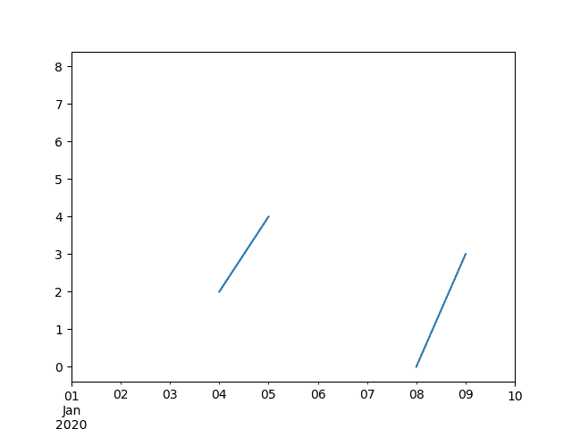
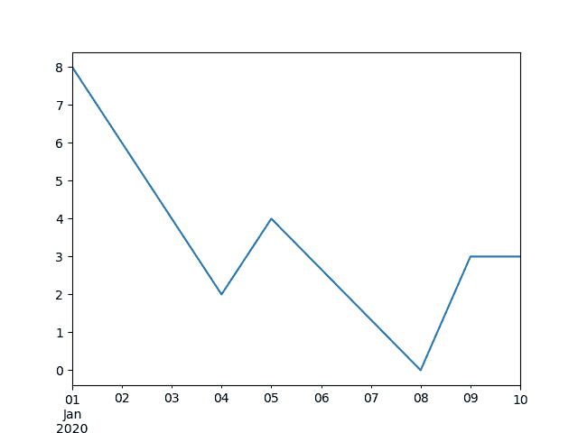
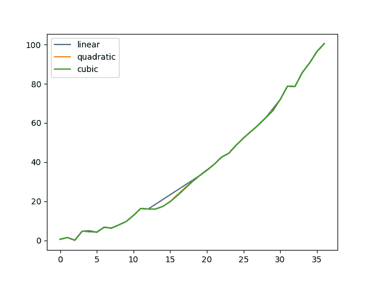

# 处理缺失数据

> 原文：[`pandas.pydata.org/docs/user_guide/missing_data.html`](https://pandas.pydata.org/docs/user_guide/missing_data.html)

## 被视为“缺失”的值

pandas 使用不同的标记值来表示缺失值（也称为 NA），具体取决于数据类型。

`numpy.nan`适用于 NumPy 数据类型。使用 NumPy 数据类型的缺点是原始数据类型将被强制转换为`np.float64`或`object`。

```py
In [1]: pd.Series([1, 2], dtype=np.int64).reindex([0, 1, 2])
Out[1]: 
0    1.0
1    2.0
2    NaN
dtype: float64

In [2]: pd.Series([True, False], dtype=np.bool_).reindex([0, 1, 2])
Out[2]: 
0     True
1    False
2      NaN
dtype: object 
```

`NaT`适用于 NumPy 的`np.datetime64`、`np.timedelta64`和`PeriodDtype`。对于类型应用程序，请使用`api.types.NaTType`。

```py
In [3]: pd.Series([1, 2], dtype=np.dtype("timedelta64[ns]")).reindex([0, 1, 2])
Out[3]: 
0   0 days 00:00:00.000000001
1   0 days 00:00:00.000000002
2                         NaT
dtype: timedelta64[ns]

In [4]: pd.Series([1, 2], dtype=np.dtype("datetime64[ns]")).reindex([0, 1, 2])
Out[4]: 
0   1970-01-01 00:00:00.000000001
1   1970-01-01 00:00:00.000000002
2                             NaT
dtype: datetime64[ns]

In [5]: pd.Series(["2020", "2020"], dtype=pd.PeriodDtype("D")).reindex([0, 1, 2])
Out[5]: 
0    2020-01-01
1    2020-01-01
2           NaT
dtype: period[D] 
```

`NA`适用于`StringDtype`、`Int64Dtype`（和其他位宽）、`Float64Dtype`（和其他位宽）、:class:`BooleanDtype`和`ArrowDtype`。这些类型将保持数据的原始数据类型。对于类型应用程序，请使用`api.types.NAType`。

```py
In [6]: pd.Series([1, 2], dtype="Int64").reindex([0, 1, 2])
Out[6]: 
0       1
1       2
2    <NA>
dtype: Int64

In [7]: pd.Series([True, False], dtype="boolean[pyarrow]").reindex([0, 1, 2])
Out[7]: 
0     True
1    False
2     <NA>
dtype: bool[pyarrow] 
```

要检测这些缺失值，请使用`isna()`或`notna()`方法。

```py
In [8]: ser = pd.Series([pd.Timestamp("2020-01-01"), pd.NaT])

In [9]: ser
Out[9]: 
0   2020-01-01
1          NaT
dtype: datetime64[ns]

In [10]: pd.isna(ser)
Out[10]: 
0    False
1     True
dtype: bool 
```

注意

`isna()`或`notna()`也会将`None`视为缺失值。

```py
In [11]: ser = pd.Series([1, None], dtype=object)

In [12]: ser
Out[12]: 
0       1
1    None
dtype: object

In [13]: pd.isna(ser)
Out[13]: 
0    False
1     True
dtype: bool 
```

警告

`np.nan`、`NaT`和`NA`之间的相等比较不像`None`那样起作用。

```py
In [14]: None == None  # noqa: E711
Out[14]: True

In [15]: np.nan == np.nan
Out[15]: False

In [16]: pd.NaT == pd.NaT
Out[16]: False

In [17]: pd.NA == pd.NA
Out[17]: <NA> 
```

因此，`DataFrame`或`Series`与这些缺失值之一进行相等比较并不提供与`isna()`或`notna()`相同的信息。

```py
In [18]: ser = pd.Series([True, None], dtype="boolean[pyarrow]")

In [19]: ser == pd.NA
Out[19]: 
0    <NA>
1    <NA>
dtype: bool[pyarrow]

In [20]: pd.isna(ser)
Out[20]: 
0    False
1     True
dtype: bool 
```

## `NA`语义

警告

实验性：`NA`的行为仍可能在没有警告的情况下发生变化。

从 pandas 1.0 开始，实验性的`NA`值（单例）可用于表示标量缺失值。`NA`的目标是提供一个可以在各种数据类型之间一致使用的“缺失”指示器（而不是根据数据类型而定的`np.nan`、`None`或`pd.NaT`）。

例如，在具有可空整数 dtype 的 `Series` 中存在缺失值时，它将使用 `NA`：

```py
In [21]: s = pd.Series([1, 2, None], dtype="Int64")

In [22]: s
Out[22]: 
0       1
1       2
2    <NA>
dtype: Int64

In [23]: s[2]
Out[23]: <NA>

In [24]: s[2] is pd.NA
Out[24]: True 
```

目前，pandas 尚未默认使用那些使用 `NA` 的数据类型，如 `DataFrame` 或 `Series`，因此您需要明确指定 dtype。在转换部分中解释了将其转换为这些 dtype 的简单方法。

### 算术和比较操作中的传播

一般来说，在涉及 `NA` 的操作中，缺失值会*传播*。当其中一个操作数未知时，操作的结果也是未知的。

例如，在算术操作中，`NA` 会传播，类似于 `np.nan`：

```py
In [25]: pd.NA + 1
Out[25]: <NA>

In [26]: "a" * pd.NA
Out[26]: <NA> 
```

有一些特殊情况，即使其中一个操作数是`NA`，结果也是已知的。

```py
In [27]: pd.NA ** 0
Out[27]: 1

In [28]: 1 ** pd.NA
Out[28]: 1 
```

在相等性和比较操作中，`NA` 也会传播。这与`np.nan`的行为不同，其中与`np.nan`的比较总是返回`False`。

```py
In [29]: pd.NA == 1
Out[29]: <NA>

In [30]: pd.NA == pd.NA
Out[30]: <NA>

In [31]: pd.NA < 2.5
Out[31]: <NA> 
```

要检查一个值是否等于 `NA`，请使用 `isna()`

```py
In [32]: pd.isna(pd.NA)
Out[32]: True 
```

注意

在这种基本传播规则上的一个例外是*缩减*（例如均值或最小值），pandas 默认跳过缺失值。更多信息请参见计算部分。

### 逻辑操作

对于逻辑操作，`NA` 遵循 [三值逻辑](https://en.wikipedia.org/wiki/Three-valued_logic)（或*Kleene 逻辑*，类似于 R、SQL 和 Julia）。这种逻辑意味着只有在逻辑上需要时才传播缺失值。

例如，对于逻辑“或”操作（`|`），如果操作数之一是`True`，我们已经知道结果将是`True`，无论另一个值是什么（因此无论缺失值是`True`还是`False`）。在这种情况下，`NA` 不会传播：

```py
In [33]: True | False
Out[33]: True

In [34]: True | pd.NA
Out[34]: True

In [35]: pd.NA | True
Out[35]: True 
```

另一方面，如果操作数之一是`False`，结果取决于另一个操作数的值。因此，在这种情况下，`NA` 会传播：

```py
In [36]: False | True
Out[36]: True

In [37]: False | False
Out[37]: False

In [38]: False | pd.NA
Out[38]: <NA> 
```

逻辑“与”操作（`&`）的行为可以使用类似的逻辑推导（现在，如果操作数之一已经是`False`，那么 `NA` 将不会传播）：

```py
In [39]: False & True
Out[39]: False

In [40]: False & False
Out[40]: False

In [41]: False & pd.NA
Out[41]: False 
```

```py
In [42]: True & True
Out[42]: True

In [43]: True & False
Out[43]: False

In [44]: True & pd.NA
Out[44]: <NA> 
```

### 在布尔上下文中的`NA`

由于 NA 的实际值是未知的，将 NA 转换为布尔值是模棱两可的。

```py
In [45]: bool(pd.NA)
---------------------------------------------------------------------------
TypeError  Traceback (most recent call last)
Cell In[45], line 1
----> 1 bool(pd.NA)

File missing.pyx:392, in pandas._libs.missing.NAType.__bool__()

TypeError: boolean value of NA is ambiguous 
```

这也意味着`NA`不能在被评估为布尔值的上下文中使用，例如`if condition: ...`，其中`condition`可能是`NA`。在这种情况下，可以使用`isna()`来检查`NA`或避免`condition`为`NA`，例如在填充缺失值之前。

当在`if`语句中使用`Series`或`DataFrame`对象时，会出现类似情况，请参阅在 pandas 中使用 if/truth 语句。

### NumPy ufuncs

`pandas.NA`实现了 NumPy 的`__array_ufunc__`协议。大多数 ufunc 与`NA`一起工作，并通常返回`NA`：

```py
In [46]: np.log(pd.NA)
Out[46]: <NA>

In [47]: np.add(pd.NA, 1)
Out[47]: <NA> 
```

警��

目前，涉及 ndarray 和`NA`的 ufunc 将返回一个填充有 NA 值的对象 dtype。

```py
In [48]: a = np.array([1, 2, 3])

In [49]: np.greater(a, pd.NA)
Out[49]: array([<NA>, <NA>, <NA>], dtype=object) 
```

这里的返回类型可能会在将来更改为返回不同的数组类型。

更多关于 ufunc 的信息，请参阅 DataFrame 与 NumPy 函数的互操作性。

#### 转换

如果你有一个使用`np.nan`的`DataFrame`或`Series`，可以在`DataFrame`中使用`Series.convert_dtypes()`和`DataFrame.convert_dtypes()`将数据转换为使用`NA`等数据类型的数据，例如`Int64Dtype`或`ArrowDtype`。这在从 IO 方法读取数据集并推断数据类型后特别有帮助。

在这个例子中，虽然所有列的 dtype 都已更改，但我们仅展示前 10 列的结果。

```py
In [50]: import io

In [51]: data = io.StringIO("a,b\n,True\n2,")

In [52]: df = pd.read_csv(data)

In [53]: df.dtypes
Out[53]: 
a    float64
b     object
dtype: object

In [54]: df_conv = df.convert_dtypes()

In [55]: df_conv
Out[55]: 
 a     b
0  <NA>  True
1     2  <NA>

In [56]: df_conv.dtypes
Out[56]: 
a      Int64
b    boolean
dtype: object 
```  ## 插入缺失数据

你可以通过简单地赋值给`Series`或`DataFrame`来插入缺失值。所使用的缺失值标记将根据 dtype 选择。

```py
In [57]: ser = pd.Series([1., 2., 3.])

In [58]: ser.loc[0] = None

In [59]: ser
Out[59]: 
0    NaN
1    2.0
2    3.0
dtype: float64

In [60]: ser = pd.Series([pd.Timestamp("2021"), pd.Timestamp("2021")])

In [61]: ser.iloc[0] = np.nan

In [62]: ser
Out[62]: 
0          NaT
1   2021-01-01
dtype: datetime64[ns]

In [63]: ser = pd.Series([True, False], dtype="boolean[pyarrow]")

In [64]: ser.iloc[0] = None

In [65]: ser
Out[65]: 
0     <NA>
1    False
dtype: bool[pyarrow] 
```

对于`object`类型，pandas 将使用给定的值：

```py
In [66]: s = pd.Series(["a", "b", "c"], dtype=object)

In [67]: s.loc[0] = None

In [68]: s.loc[1] = np.nan

In [69]: s
Out[69]: 
0    None
1     NaN
2       c
dtype: object 
```  ## 使用缺失数据进行计算

缺失值在 pandas 对象之间的算术运算中传播。

```py
In [70]: ser1 = pd.Series([np.nan, np.nan, 2, 3])

In [71]: ser2 = pd.Series([np.nan, 1, np.nan, 4])

In [72]: ser1
Out[72]: 
0    NaN
1    NaN
2    2.0
3    3.0
dtype: float64

In [73]: ser2
Out[73]: 
0    NaN
1    1.0
2    NaN
3    4.0
dtype: float64

In [74]: ser1 + ser2
Out[74]: 
0    NaN
1    NaN
2    NaN
3    7.0
dtype: float64 
```

在数据结构概述中讨论的描述性统计和计算方法（在此处列出 series 和 frame）都考虑了缺失数据。

在对数据求和时，NA 值或空数据将被视为零。

```py
In [75]: pd.Series([np.nan]).sum()
Out[75]: 0.0

In [76]: pd.Series([], dtype="float64").sum()
Out[76]: 0.0 
```

在进行乘法运算时，NA 值或空数据将被视为 1。

```py
In [77]: pd.Series([np.nan]).prod()
Out[77]: 1.0

In [78]: pd.Series([], dtype="float64").prod()
Out[78]: 1.0 
```

累积方法如`cumsum()`和`cumprod()`默认情况下忽略 NA 值，但在结果中保留它们。可以使用`skipna`更改此行为。

+   累积方法如`cumsum()`和`cumprod()`默认情况下忽略 NA 值，但在结果数组中保留它们。要覆盖此行为并包含 NA 值，请使用`skipna=False`。

```py
In [79]: ser = pd.Series([1, np.nan, 3, np.nan])

In [80]: ser
Out[80]: 
0    1.0
1    NaN
2    3.0
3    NaN
dtype: float64

In [81]: ser.cumsum()
Out[81]: 
0    1.0
1    NaN
2    4.0
3    NaN
dtype: float64

In [82]: ser.cumsum(skipna=False)
Out[82]: 
0    1.0
1    NaN
2    NaN
3    NaN
dtype: float64 
```  ## 删除缺失数据

`dropna()`删除具有缺失数据的行或列。

```py
In [83]: df = pd.DataFrame([[np.nan, 1, 2], [1, 2, np.nan], [1, 2, 3]])

In [84]: df
Out[84]: 
 0  1    2
0  NaN  1  2.0
1  1.0  2  NaN
2  1.0  2  3.0

In [85]: df.dropna()
Out[85]: 
 0  1    2
2  1.0  2  3.0

In [86]: df.dropna(axis=1)
Out[86]: 
 1
0  1
1  2
2  2

In [87]: ser = pd.Series([1, pd.NA], dtype="int64[pyarrow]")

In [88]: ser.dropna()
Out[88]: 
0    1
dtype: int64[pyarrow] 
```

## 填充缺失数据

### 按值填充

`fillna()`用非 NA 数据替换 NA 值。

用标量值替换 NA

```py
In [89]: data = {"np": [1.0, np.nan, np.nan, 2], "arrow": pd.array([1.0, pd.NA, pd.NA, 2], dtype="float64[pyarrow]")}

In [90]: df = pd.DataFrame(data)

In [91]: df
Out[91]: 
 np  arrow
0  1.0    1.0
1  NaN   <NA>
2  NaN   <NA>
3  2.0    2.0

In [92]: df.fillna(0)
Out[92]: 
 np  arrow
0  1.0    1.0
1  0.0    0.0
2  0.0    0.0
3  2.0    2.0 
```

向前或向后填补间隙

```py
In [93]: df.ffill()
Out[93]: 
 np  arrow
0  1.0    1.0
1  1.0    1.0
2  1.0    1.0
3  2.0    2.0

In [94]: df.bfill()
Out[94]: 
 np  arrow
0  1.0    1.0
1  2.0    2.0
2  2.0    2.0
3  2.0    2.0 
```

限制填充的 NA 值数量

```py
In [95]: df.ffill(limit=1)
Out[95]: 
 np  arrow
0  1.0    1.0
1  1.0    1.0
2  NaN   <NA>
3  2.0    2.0 
```

NA 值可以用与`Series`或`DataFrame`对齐的索引和列之间的对应值替换。

```py
In [96]: dff = pd.DataFrame(np.arange(30, dtype=np.float64).reshape(10, 3), columns=list("ABC"))

In [97]: dff.iloc[3:5, 0] = np.nan

In [98]: dff.iloc[4:6, 1] = np.nan

In [99]: dff.iloc[5:8, 2] = np.nan

In [100]: dff
Out[100]: 
 A     B     C
0   0.0   1.0   2.0
1   3.0   4.0   5.0
2   6.0   7.0   8.0
3   NaN  10.0  11.0
4   NaN   NaN  14.0
5  15.0   NaN   NaN
6  18.0  19.0   NaN
7  21.0  22.0   NaN
8  24.0  25.0  26.0
9  27.0  28.0  29.0

In [101]: dff.fillna(dff.mean())
Out[101]: 
 A     B          C
0   0.00   1.0   2.000000
1   3.00   4.0   5.000000
2   6.00   7.0   8.000000
3  14.25  10.0  11.000000
4  14.25  14.5  14.000000
5  15.00  14.5  13.571429
6  18.00  19.0  13.571429
7  21.00  22.0  13.571429
8  24.00  25.0  26.000000
9  27.00  28.0  29.000000 
```

注意

`DataFrame.where()`也可用于填充 NA 值。与上述结果相同。

```py
In [102]: dff.where(pd.notna(dff), dff.mean(), axis="columns")
Out[102]: 
 A     B          C
0   0.00   1.0   2.000000
1   3.00   4.0   5.000000
2   6.00   7.0   8.000000
3  14.25  10.0  11.000000
4  14.25  14.5  14.000000
5  15.00  14.5  13.571429
6  18.00  19.0  13.571429
7  21.00  22.0  13.571429
8  24.00  25.0  26.000000
9  27.00  28.0  29.000000 
```  ### 插值

`DataFrame.interpolate()`和`Series.interpolate()`使用各种插值方法填充 NA 值。

```py
In [103]: df = pd.DataFrame(
 .....:    {
 .....:        "A": [1, 2.1, np.nan, 4.7, 5.6, 6.8],
 .....:        "B": [0.25, np.nan, np.nan, 4, 12.2, 14.4],
 .....:    }
 .....: )
 .....: 

In [104]: df
Out[104]: 
 A      B
0  1.0   0.25
1  2.1    NaN
2  NaN    NaN
3  4.7   4.00
4  5.6  12.20
5  6.8  14.40

In [105]: df.interpolate()
Out[105]: 
 A      B
0  1.0   0.25
1  2.1   1.50
2  3.4   2.75
3  4.7   4.00
4  5.6  12.20
5  6.8  14.40

In [106]: idx = pd.date_range("2020-01-01", periods=10, freq="D")

In [107]: data = np.random.default_rng(2).integers(0, 10, 10).astype(np.float64)

In [108]: ts = pd.Series(data, index=idx)

In [109]: ts.iloc[[1, 2, 5, 6, 9]] = np.nan

In [110]: ts
Out[110]: 
2020-01-01    8.0
2020-01-02    NaN
2020-01-03    NaN
2020-01-04    2.0
2020-01-05    4.0
2020-01-06    NaN
2020-01-07    NaN
2020-01-08    0.0
2020-01-09    3.0
2020-01-10    NaN
Freq: D, dtype: float64

In [111]: ts.plot()
Out[111]: <Axes: > 
```



```py
In [112]: ts.interpolate()
Out[112]: 
2020-01-01    8.000000
2020-01-02    6.000000
2020-01-03    4.000000
2020-01-04    2.000000
2020-01-05    4.000000
2020-01-06    2.666667
2020-01-07    1.333333
2020-01-08    0.000000
2020-01-09    3.000000
2020-01-10    3.000000
Freq: D, dtype: float64

In [113]: ts.interpolate().plot()
Out[113]: <Axes: > 
```



相对于`Timestamp`在`DatetimeIndex`上的插值可通过设置`method="time"`来实现。

```py
In [114]: ts2 = ts.iloc[[0, 1, 3, 7, 9]]

In [115]: ts2
Out[115]: 
2020-01-01    8.0
2020-01-02    NaN
2020-01-04    2.0
2020-01-08    0.0
2020-01-10    NaN
dtype: float64

In [116]: ts2.interpolate()
Out[116]: 
2020-01-01    8.0
2020-01-02    5.0
2020-01-04    2.0
2020-01-08    0.0
2020-01-10    0.0
dtype: float64

In [117]: ts2.interpolate(method="time")
Out[117]: 
2020-01-01    8.0
2020-01-02    6.0
2020-01-04    2.0
2020-01-08    0.0
2020-01-10    0.0
dtype: float64 
```

对于浮点索引，请使用`method='values'`：

```py
In [118]: idx = [0.0, 1.0, 10.0]

In [119]: ser = pd.Series([0.0, np.nan, 10.0], idx)

In [120]: ser
Out[120]: 
0.0      0.0
1.0      NaN
10.0    10.0
dtype: float64

In [121]: ser.interpolate()
Out[121]: 
0.0      0.0
1.0      5.0
10.0    10.0
dtype: float64

In [122]: ser.interpolate(method="values")
Out[122]: 
0.0      0.0
1.0      1.0
10.0    10.0
dtype: float64 
```

如果您安装了[scipy](https://scipy.org/)，您可以将一个 1-d 插值例程的名称传递给`method`。如在 scipy 插值[文档](https://docs.scipy.org/doc/scipy/reference/interpolate.html#univariate-interpolation)和参考[指南](https://docs.scipy.org/doc/scipy/tutorial/interpolate.html)中指定。适当的插值方法将取决于数据类型。

提示

如果您处理的是以增长速度增长的时间序列，请使用`method='barycentric'`。

如果您有接近累积分布函数的值，请使用`method='pchip'`。

若要填充缺失值以实现平滑绘图，请使用`method='akima'`。

```py
In [123]: df = pd.DataFrame(
 .....:   {
 .....:      "A": [1, 2.1, np.nan, 4.7, 5.6, 6.8],
 .....:      "B": [0.25, np.nan, np.nan, 4, 12.2, 14.4],
 .....:   }
 .....: )
 .....: 

In [124]: df
Out[124]: 
 A      B
0  1.0   0.25
1  2.1    NaN
2  NaN    NaN
3  4.7   4.00
4  5.6  12.20
5  6.8  14.40

In [125]: df.interpolate(method="barycentric")
Out[125]: 
 A       B
0  1.00   0.250
1  2.10  -7.660
2  3.53  -4.515
3  4.70   4.000
4  5.60  12.200
5  6.80  14.400

In [126]: df.interpolate(method="pchip")
Out[126]: 
 A          B
0  1.00000   0.250000
1  2.10000   0.672808
2  3.43454   1.928950
3  4.70000   4.000000
4  5.60000  12.200000
5  6.80000  14.400000

In [127]: df.interpolate(method="akima")
Out[127]: 
 A          B
0  1.000000   0.250000
1  2.100000  -0.873316
2  3.406667   0.320034
3  4.700000   4.000000
4  5.600000  12.200000
5  6.800000  14.400000 
```

当通过多项式或样条逼近进行插值时，您还必须指定逼近的次数或阶数：

```py
In [128]: df.interpolate(method="spline", order=2)
Out[128]: 
 A          B
0  1.000000   0.250000
1  2.100000  -0.428598
2  3.404545   1.206900
3  4.700000   4.000000
4  5.600000  12.200000
5  6.800000  14.400000

In [129]: df.interpolate(method="polynomial", order=2)
Out[129]: 
 A          B
0  1.000000   0.250000
1  2.100000  -2.703846
2  3.451351  -1.453846
3  4.700000   4.000000
4  5.600000  12.200000
5  6.800000  14.400000 
```

比较几种方法。

```py
In [130]: np.random.seed(2)

In [131]: ser = pd.Series(np.arange(1, 10.1, 0.25) ** 2 + np.random.randn(37))

In [132]: missing = np.array([4, 13, 14, 15, 16, 17, 18, 20, 29])

In [133]: ser.iloc[missing] = np.nan

In [134]: methods = ["linear", "quadratic", "cubic"]

In [135]: df = pd.DataFrame({m: ser.interpolate(method=m) for m in methods})

In [136]: df.plot()
Out[136]: <Axes: > 
```



通过`Series.reindex()`从扩展数据中插值新观测。

```py
In [137]: ser = pd.Series(np.sort(np.random.uniform(size=100)))

# interpolate at new_index
In [138]: new_index = ser.index.union(pd.Index([49.25, 49.5, 49.75, 50.25, 50.5, 50.75]))

In [139]: interp_s = ser.reindex(new_index).interpolate(method="pchip")

In [140]: interp_s.loc[49:51]
Out[140]: 
49.00    0.471410
49.25    0.476841
49.50    0.481780
49.75    0.485998
50.00    0.489266
50.25    0.491814
50.50    0.493995
50.75    0.495763
51.00    0.497074
dtype: float64 
```

#### 插值限制

`interpolate()`接受一个`limit`关键字参数，以限制自上次有效观测以来填充的连续`NaN`值的数量。

```py
In [141]: ser = pd.Series([np.nan, np.nan, 5, np.nan, np.nan, np.nan, 13, np.nan, np.nan])

In [142]: ser
Out[142]: 
0     NaN
1     NaN
2     5.0
3     NaN
4     NaN
5     NaN
6    13.0
7     NaN
8     NaN
dtype: float64

In [143]: ser.interpolate()
Out[143]: 
0     NaN
1     NaN
2     5.0
3     7.0
4     9.0
5    11.0
6    13.0
7    13.0
8    13.0
dtype: float64

In [144]: ser.interpolate(limit=1)
Out[144]: 
0     NaN
1     NaN
2     5.0
3     7.0
4     NaN
5     NaN
6    13.0
7    13.0
8     NaN
dtype: float64 
```

默认情况下，`NaN`值以`forward`方向填充。使用`limit_direction`参数向`backward`或从`both`方向填充。

```py
In [145]: ser.interpolate(limit=1, limit_direction="backward")
Out[145]: 
0     NaN
1     5.0
2     5.0
3     NaN
4     NaN
5    11.0
6    13.0
7     NaN
8     NaN
dtype: float64

In [146]: ser.interpolate(limit=1, limit_direction="both")
Out[146]: 
0     NaN
1     5.0
2     5.0
3     7.0
4     NaN
5    11.0
6    13.0
7    13.0
8     NaN
dtype: float64

In [147]: ser.interpolate(limit_direction="both")
Out[147]: 
0     5.0
1     5.0
2     5.0
3     7.0
4     9.0
5    11.0
6    13.0
7    13.0
8    13.0
dtype: float64 
```

默认情况下，`NaN`值会被填充，无论它们是否被现有有效值包围或在现有有效值之外。`limit_area`参数限制填充到内部或外部值。

```py
# fill one consecutive inside value in both directions
In [148]: ser.interpolate(limit_direction="both", limit_area="inside", limit=1)
Out[148]: 
0     NaN
1     NaN
2     5.0
3     7.0
4     NaN
5    11.0
6    13.0
7     NaN
8     NaN
dtype: float64

# fill all consecutive outside values backward
In [149]: ser.interpolate(limit_direction="backward", limit_area="outside")
Out[149]: 
0     5.0
1     5.0
2     5.0
3     NaN
4     NaN
5     NaN
6    13.0
7     NaN
8     NaN
dtype: float64

# fill all consecutive outside values in both directions
In [150]: ser.interpolate(limit_direction="both", limit_area="outside")
Out[150]: 
0     5.0
1     5.0
2     5.0
3     NaN
4     NaN
5     NaN
6    13.0
7    13.0
8    13.0
dtype: float64 
```  ### 替换值

`Series.replace()`和`DataFrame.replace()`可以类似于`Series.fillna()`和`DataFrame.fillna()`用于替换或插入缺失值。

```py
In [151]: df = pd.DataFrame(np.eye(3))

In [152]: df
Out[152]: 
 0    1    2
0  1.0  0.0  0.0
1  0.0  1.0  0.0
2  0.0  0.0  1.0

In [153]: df_missing = df.replace(0, np.nan)

In [154]: df_missing
Out[154]: 
 0    1    2
0  1.0  NaN  NaN
1  NaN  1.0  NaN
2  NaN  NaN  1.0

In [155]: df_filled = df_missing.replace(np.nan, 2)

In [156]: df_filled
Out[156]: 
 0    1    2
0  1.0  2.0  2.0
1  2.0  1.0  2.0
2  2.0  2.0  1.0 
```

通过传递列表可以替换多个值。

```py
In [157]: df_filled.replace([1, 44], [2, 28])
Out[157]: 
 0    1    2
0  2.0  2.0  2.0
1  2.0  2.0  2.0
2  2.0  2.0  2.0 
```

使用映射字典进行替换。

```py
In [158]: df_filled.replace({1: 44, 2: 28})
Out[158]: 
 0     1     2
0  44.0  28.0  28.0
1  28.0  44.0  28.0
2  28.0  28.0  44.0 
```

#### 正则表达式替换

注意

Python 字符串以 `r` 字符开头，例如 `r'hello world'` 是[“原始”字符串](https://docs.python.org/3/reference/lexical_analysis.html#string-and-bytes-literals)。 它们在反斜杠方面具有与没有此前缀的字符串不同的语义。 原始字符串中的反斜杠将被解释为转义的反斜杠，例如，`r'\' == '\\'`。

用 `NaN` 替换 ‘.’

```py
In [159]: d = {"a": list(range(4)), "b": list("ab.."), "c": ["a", "b", np.nan, "d"]}

In [160]: df = pd.DataFrame(d)

In [161]: df.replace(".", np.nan)
Out[161]: 
 a    b    c
0  0    a    a
1  1    b    b
2  2  NaN  NaN
3  3  NaN    d 
```

用删除周围空格的正则表达式替换 ‘.’ 为 `NaN`。

```py
In [162]: df.replace(r"\s*\.\s*", np.nan, regex=True)
Out[162]: 
 a    b    c
0  0    a    a
1  1    b    b
2  2  NaN  NaN
3  3  NaN    d 
```

替换为一组正则表达式。

```py
In [163]: df.replace([r"\.", r"(a)"], ["dot", r"\1stuff"], regex=True)
Out[163]: 
 a       b       c
0  0  astuff  astuff
1  1       b       b
2  2     dot     NaN
3  3     dot       d 
```

用映射字典中的正则表达式替换。

```py
In [164]: df.replace({"b": r"\s*\.\s*"}, {"b": np.nan}, regex=True)
Out[164]: 
 a    b    c
0  0    a    a
1  1    b    b
2  2  NaN  NaN
3  3  NaN    d 
```

传递使用 `regex` 关键字的正则表达式的嵌套字典。

```py
In [165]: df.replace({"b": {"b": r""}}, regex=True)
Out[165]: 
 a  b    c
0  0  a    a
1  1       b
2  2  .  NaN
3  3  .    d

In [166]: df.replace(regex={"b": {r"\s*\.\s*": np.nan}})
Out[166]: 
 a    b    c
0  0    a    a
1  1    b    b
2  2  NaN  NaN
3  3  NaN    d

In [167]: df.replace({"b": r"\s*(\.)\s*"}, {"b": r"\1ty"}, regex=True)
Out[167]: 
 a    b    c
0  0    a    a
1  1    b    b
2  2  .ty  NaN
3  3  .ty    d 
```

传递一个正则表达式列表，将匹配项替换为标量。

```py
In [168]: df.replace([r"\s*\.\s*", r"a|b"], "placeholder", regex=True)
Out[168]: 
 a            b            c
0  0  placeholder  placeholder
1  1  placeholder  placeholder
2  2  placeholder          NaN
3  3  placeholder            d 
```

所有的正则表达式示例也可以作为 `to_replace` 参数传递给 `regex` 参数。 在这种情况下，`value` 参数必须通过名称显式传递，或者 `regex` 必须是一个嵌套字典。

```py
In [169]: df.replace(regex=[r"\s*\.\s*", r"a|b"], value="placeholder")
Out[169]: 
 a            b            c
0  0  placeholder  placeholder
1  1  placeholder  placeholder
2  2  placeholder          NaN
3  3  placeholder            d 
```

注意

来自 `re.compile` 的正则表达式对象也是有效的输入。

## 被视为“缺失”的值

pandas 使用不同的标记值来表示缺失值（也称为 NA），具体取决于数据类型。

`numpy.nan` 适用于 NumPy 数据类型。 使用 NumPy 数据类型的缺点是原始数据类型将被强制转换为 `np.float64` 或 `object`。

```py
In [1]: pd.Series([1, 2], dtype=np.int64).reindex([0, 1, 2])
Out[1]: 
0    1.0
1    2.0
2    NaN
dtype: float64

In [2]: pd.Series([True, False], dtype=np.bool_).reindex([0, 1, 2])
Out[2]: 
0     True
1    False
2      NaN
dtype: object 
```

`NaT` 适用于 NumPy `np.datetime64`, `np.timedelta64`, 和 `PeriodDtype`。 对于类型应用程序，请使用 `api.types.NaTType`。

```py
In [3]: pd.Series([1, 2], dtype=np.dtype("timedelta64[ns]")).reindex([0, 1, 2])
Out[3]: 
0   0 days 00:00:00.000000001
1   0 days 00:00:00.000000002
2                         NaT
dtype: timedelta64[ns]

In [4]: pd.Series([1, 2], dtype=np.dtype("datetime64[ns]")).reindex([0, 1, 2])
Out[4]: 
0   1970-01-01 00:00:00.000000001
1   1970-01-01 00:00:00.000000002
2                             NaT
dtype: datetime64[ns]

In [5]: pd.Series(["2020", "2020"], dtype=pd.PeriodDtype("D")).reindex([0, 1, 2])
Out[5]: 
0    2020-01-01
1    2020-01-01
2           NaT
dtype: period[D] 
```

`NA` 适用于 `StringDtype`, `Int64Dtype`（和其他位宽度）, `Float64Dtype`（和其他位宽度）, :class:`BooleanDtype` 和 `ArrowDtype`。 这些类型将保持数据的原始数据类型。 对于类型应用程序，请使用 `api.types.NAType`。

```py
In [6]: pd.Series([1, 2], dtype="Int64").reindex([0, 1, 2])
Out[6]: 
0       1
1       2
2    <NA>
dtype: Int64

In [7]: pd.Series([True, False], dtype="boolean[pyarrow]").reindex([0, 1, 2])
Out[7]: 
0     True
1    False
2     <NA>
dtype: bool[pyarrow] 
```

要检测这些缺失值，使用 `isna()` 或 `notna()` 方法。

```py
In [8]: ser = pd.Series([pd.Timestamp("2020-01-01"), pd.NaT])

In [9]: ser
Out[9]: 
0   2020-01-01
1          NaT
dtype: datetime64[ns]

In [10]: pd.isna(ser)
Out[10]: 
0    False
1     True
dtype: bool 
```

注意

`isna()` 或 `notna()` 也会将 `None` 视为缺失值。

```py
In [11]: ser = pd.Series([1, None], dtype=object)

In [12]: ser
Out[12]: 
0       1
1    None
dtype: object

In [13]: pd.isna(ser)
Out[13]: 
0    False
1     True
dtype: bool 
```

警告

`np.nan`, `NaT`, 和 `NA` 之间的相等比较不像 `None`。

```py
In [14]: None == None  # noqa: E711
Out[14]: True

In [15]: np.nan == np.nan
Out[15]: False

In [16]: pd.NaT == pd.NaT
Out[16]: False

In [17]: pd.NA == pd.NA
Out[17]: <NA> 
```

因此，`DataFrame`或`Series`与这些缺失值之间的相等比较不提供与`isna()`或`notna()`相同的信息。

```py
In [18]: ser = pd.Series([True, None], dtype="boolean[pyarrow]")

In [19]: ser == pd.NA
Out[19]: 
0    <NA>
1    <NA>
dtype: bool[pyarrow]

In [20]: pd.isna(ser)
Out[20]: 
0    False
1     True
dtype: bool 
```

## `NA` 语义

警告

实验性：`NA`的行为仍可能在没有警告的情况下更改。

从 pandas 1.0 开始，提供了一个实验性的`NA`值（单例）来表示标量缺失值。`NA`的目标是提供一个可以在各种数据类型中一致使用的“缺失”指示符（而不是根据数据类型使用`np.nan`、`None`或`pd.NaT`）。

例如，在具有可空整数 dtype 的`Series`中存在缺失值时，它将使用`NA`:

```py
In [21]: s = pd.Series([1, 2, None], dtype="Int64")

In [22]: s
Out[22]: 
0       1
1       2
2    <NA>
dtype: Int64

In [23]: s[2]
Out[23]: <NA>

In [24]: s[2] is pd.NA
Out[24]: True 
```

目前，pandas 尚未默认使用`NA`这些数据类型在`DataFrame`或`Series`中，因此您需要明确指定 dtype。在转换部分中解释了将其转换为这些 dtype 的简单方法。

### 算术和比较操作中的传播

一般来说，在涉及`NA`的操作中，缺失值会*传播*。当其中一个操作数未知时，操作的结果也是未知的。

例如，`NA`在算术操作中传播，类似于`np.nan`：

```py
In [25]: pd.NA + 1
Out[25]: <NA>

In [26]: "a" * pd.NA
Out[26]: <NA> 
```

有一些特殊情况，即使其中一个操作数是`NA`，结果也是已知的。

```py
In [27]: pd.NA ** 0
Out[27]: 1

In [28]: 1 ** pd.NA
Out[28]: 1 
```

在相等和比较操作中，`NA`也会传播。这与`np.nan`的行为不同，其中与`np.nan`的比较总是返回`False`。

```py
In [29]: pd.NA == 1
Out[29]: <NA>

In [30]: pd.NA == pd.NA
Out[30]: <NA>

In [31]: pd.NA < 2.5
Out[31]: <NA> 
```

要检查一个值是否等于`NA`，请使用`isna()`

```py
In [32]: pd.isna(pd.NA)
Out[32]: True 
```

注意

在这种基本传播规则上的一个例外是*缩减*（例如平均值或最小值），pandas 默认跳过缺失值。更多信息请参见计算部分。

### 逻辑操作

对于逻辑操作，`NA`遵循[三值逻辑](https://en.wikipedia.org/wiki/Three-valued_logic)的规则（或*Kleene 逻辑*，类似于 R、SQL 和 Julia）。这种逻辑意味着只有在逻辑上需要时才传播缺失值。

例如，对于逻辑“或”操作（`|`），如果其中一个操作数为`True`，我们已经知道结果将是`True`，无论另一个值是什么（所以无论缺失值是`True`还是`False`）。在这种情况下，`NA`不会传播：

```py
In [33]: True | False
Out[33]: True

In [34]: True | pd.NA
Out[34]: True

In [35]: pd.NA | True
Out[35]: True 
```

另一方面，如果其中一个操作数是`False`，结果取决于另一个操作数的值。因此，在这种情况下，`NA`会传播：

```py
In [36]: False | True
Out[36]: True

In [37]: False | False
Out[37]: False

In [38]: False | pd.NA
Out[38]: <NA> 
```

逻辑“与”操作（`&`）的行为可以使用类似的逻辑推导（现在，如果其中一个操作数已经是`False`，那么`NA`将不会传播）：

```py
In [39]: False & True
Out[39]: False

In [40]: False & False
Out[40]: False

In [41]: False & pd.NA
Out[41]: False 
```

```py
In [42]: True & True
Out[42]: True

In [43]: True & False
Out[43]: False

In [44]: True & pd.NA
Out[44]: <NA> 
```

### 在布尔上下文中的`NA`

由于 NA 的实际值是未知的，将 NA 转换为布尔值是模棱两可的。

```py
In [45]: bool(pd.NA)
---------------------------------------------------------------------------
TypeError  Traceback (most recent call last)
Cell In[45], line 1
----> 1 bool(pd.NA)

File missing.pyx:392, in pandas._libs.missing.NAType.__bool__()

TypeError: boolean value of NA is ambiguous 
```

这也意味着`NA`不能在被评估为布尔值的上下文中使用，例如`if condition: ...`，其中`condition`可能是`NA`。在这种情况下，可以使用`isna()`来检查`NA`，或者可以在此之前填充缺失值来避免`condition`为`NA`。

当在`if`语句中使用`Series`或`DataFrame`对象时，会出现类似情况，请参见在 pandas 中使用 if/truth 语句。

### NumPy ufuncs

`pandas.NA`实现了 NumPy 的`__array_ufunc__`协议。大多数 ufuncs 与`NA`一起工作，并通常返回`NA`：

```py
In [46]: np.log(pd.NA)
Out[46]: <NA>

In [47]: np.add(pd.NA, 1)
Out[47]: <NA> 
```

警告

目前，涉及 ndarray 和`NA`的 ufuncs 将返回一个填充有 NA 值的对象 dtype。

```py
In [48]: a = np.array([1, 2, 3])

In [49]: np.greater(a, pd.NA)
Out[49]: array([<NA>, <NA>, <NA>], dtype=object) 
```

此处的返回类型可能会在将来更改为返回不同的数组类型。

更多关于 ufuncs 的信息，请参见 DataFrame 与 NumPy 函数的互操作性。

#### 转换

如果你有一个使用`np.nan`的`DataFrame`或`Series`，可以在`DataFrame`中使用`Series.convert_dtypes()`和`DataFrame.convert_dtypes()`将数据转换为使用`NA`的数据类型，如`Int64Dtype`或`ArrowDtype`。这在从 IO 方法中读取数据集并推断数据类型后特别有帮助。

在这个例子中，虽然所有列的数据类型都被更改，但我们展示了前 10 列的结果。

```py
In [50]: import io

In [51]: data = io.StringIO("a,b\n,True\n2,")

In [52]: df = pd.read_csv(data)

In [53]: df.dtypes
Out[53]: 
a    float64
b     object
dtype: object

In [54]: df_conv = df.convert_dtypes()

In [55]: df_conv
Out[55]: 
 a     b
0  <NA>  True
1     2  <NA>

In [56]: df_conv.dtypes
Out[56]: 
a      Int64
b    boolean
dtype: object 
```

### 算术和比较操作中的传播

一般来说，在涉及`NA`的操作中，缺失值会*传播*。当操作数中有一个未知时，操作的结果也是未知的。

例如，`NA`在算术操作中会传播，类似于`np.nan`：

```py
In [25]: pd.NA + 1
Out[25]: <NA>

In [26]: "a" * pd.NA
Out[26]: <NA> 
```

在一些特殊情况下，即使操作数之一是`NA`，结果也是已知的。

```py
In [27]: pd.NA ** 0
Out[27]: 1

In [28]: 1 ** pd.NA
Out[28]: 1 
```

在相等性和比较操作中，`NA`也会传播。这与`np.nan`的行为不同，其中与`np.nan`的比较总是返回`False`。

```py
In [29]: pd.NA == 1
Out[29]: <NA>

In [30]: pd.NA == pd.NA
Out[30]: <NA>

In [31]: pd.NA < 2.5
Out[31]: <NA> 
```

要检查一个值是否等于`NA`，使用`isna()`

```py
In [32]: pd.isna(pd.NA)
Out[32]: True 
```

注意

在这个基本传播规则上的一个例外是*缩减*（如平均值或最小值），pandas 默认跳过缺失值。更多信息请参见计算部分。

### 逻辑操作

对于逻辑操作，`NA`遵循[三值逻辑](https://en.wikipedia.org/wiki/Three-valued_logic)（或*Kleene 逻辑*，类似于 R、SQL 和 Julia）。这种逻辑意味着只在逻辑上需要时传播缺失值。

例如，在逻辑“或”操作（`|`）中，如果操作数之一是`True`，我们已经知道结果将是`True`，无论另一个值是什么（因此无论缺失值是`True`还是`False`）。在这种情况下，`NA`不会传播：

```py
In [33]: True | False
Out[33]: True

In [34]: True | pd.NA
Out[34]: True

In [35]: pd.NA | True
Out[35]: True 
```

另一方面，如果操作数中的一个是`False`，则结果取决于另一个操作数的值。因此，在这种情况下`NA`会传播：

```py
In [36]: False | True
Out[36]: True

In [37]: False | False
Out[37]: False

In [38]: False | pd.NA
Out[38]: <NA> 
```

逻辑“与”操作（`&`）的行为可以使用类似的逻辑推导出来（现在，如果操作数中的一个已经是`False`，那么`NA`将不会传播）：

```py
In [39]: False & True
Out[39]: False

In [40]: False & False
Out[40]: False

In [41]: False & pd.NA
Out[41]: False 
```

```py
In [42]: True & True
Out[42]: True

In [43]: True & False
Out[43]: False

In [44]: True & pd.NA
Out[44]: <NA> 
```

### 在布尔上下文中的`NA`

由于 NA 的实际值是未知的，将 NA 转换为布尔值是模棱两可的。

```py
In [45]: bool(pd.NA)
---------------------------------------------------------------------------
TypeError  Traceback (most recent call last)
Cell In[45], line 1
----> 1 bool(pd.NA)

File missing.pyx:392, in pandas._libs.missing.NAType.__bool__()

TypeError: boolean value of NA is ambiguous 
```

这也意味着`NA`不能在被评估为布尔值的上下文中使用，例如`if condition: ...`，其中`condition`可能是`NA`。在这种情况下，可以使用`isna()`来检查`NA`或避免`condition`为`NA`，例如在填充缺失值之前。

当在`if`语句中使用`Series`或`DataFrame`对象时，会出现类似的情况，请参见在 pandas 中使用 if/真值语句。

### NumPy 通用函数

`pandas.NA`实现了 NumPy 的`__array_ufunc__`协议。大多数通用函数与`NA`一起工作，并通常返回`NA`：

```py
In [46]: np.log(pd.NA)
Out[46]: <NA>

In [47]: np.add(pd.NA, 1)
Out[47]: <NA> 
```

警告

目前，涉及 ndarray 和`NA`的通用函数将返回一个填充有 NA 值的对象 dtype。

```py
In [48]: a = np.array([1, 2, 3])

In [49]: np.greater(a, pd.NA)
Out[49]: array([<NA>, <NA>, <NA>], dtype=object) 
```

这里的返回类型可能会在将来更改为返回不同的数组类型。

有关通用函数的更多信息，请参见 DataFrame 与 NumPy 函数的互操作性。

#### 转换

如果您有一个使用`np.nan`的`DataFrame`或`Series`，`Series.convert_dtypes()`和`DataFrame.convert_dtypes()`在`DataFrame`中可以将数据转换为使用`NA`的数据类型，例如`Int64Dtype`或`ArrowDtype`。这在从 IO 方法读取数据集并推断数据类型后特别有帮助。

在这个例子中，虽然所有列的数据类型都发生了变化，但我们展示了前 10 列的结果。

```py
In [50]: import io

In [51]: data = io.StringIO("a,b\n,True\n2,")

In [52]: df = pd.read_csv(data)

In [53]: df.dtypes
Out[53]: 
a    float64
b     object
dtype: object

In [54]: df_conv = df.convert_dtypes()

In [55]: df_conv
Out[55]: 
 a     b
0  <NA>  True
1     2  <NA>

In [56]: df_conv.dtypes
Out[56]: 
a      Int64
b    boolean
dtype: object 
```  #### 转换

如果您有一个使用`np.nan`的`DataFrame`或`Series`，则可以在`DataFrame`中使用`Series.convert_dtypes()`和`DataFrame.convert_dtypes()`将数据转换为使用`NA`等数据类型的数据类型，如`Int64Dtype`或`ArrowDtype`。这在从 IO 方法读取数据集并推断数据类型后特别有帮助。

在这个例子中，虽然所有列的数据类型都发生了变化，但我们展示了前 10 列的结果。

```py
In [50]: import io

In [51]: data = io.StringIO("a,b\n,True\n2,")

In [52]: df = pd.read_csv(data)

In [53]: df.dtypes
Out[53]: 
a    float64
b     object
dtype: object

In [54]: df_conv = df.convert_dtypes()

In [55]: df_conv
Out[55]: 
 a     b
0  <NA>  True
1     2  <NA>

In [56]: df_conv.dtypes
Out[56]: 
a      Int64
b    boolean
dtype: object 
```

## 插入缺失数据

您可以通过简单地分配给`Series`或`DataFrame`来插入缺失值。所使用的缺失值标记将根据数据类型选择。

```py
In [57]: ser = pd.Series([1., 2., 3.])

In [58]: ser.loc[0] = None

In [59]: ser
Out[59]: 
0    NaN
1    2.0
2    3.0
dtype: float64

In [60]: ser = pd.Series([pd.Timestamp("2021"), pd.Timestamp("2021")])

In [61]: ser.iloc[0] = np.nan

In [62]: ser
Out[62]: 
0          NaT
1   2021-01-01
dtype: datetime64[ns]

In [63]: ser = pd.Series([True, False], dtype="boolean[pyarrow]")

In [64]: ser.iloc[0] = None

In [65]: ser
Out[65]: 
0     <NA>
1    False
dtype: bool[pyarrow] 
```

对于`object`类型，pandas 将使用给定的值：

```py
In [66]: s = pd.Series(["a", "b", "c"], dtype=object)

In [67]: s.loc[0] = None

In [68]: s.loc[1] = np.nan

In [69]: s
Out[69]: 
0    None
1     NaN
2       c
dtype: object 
```

## 带有缺失数据的计算

缺失值会在 pandas 对象之间的算术运算中传播。

```py
In [70]: ser1 = pd.Series([np.nan, np.nan, 2, 3])

In [71]: ser2 = pd.Series([np.nan, 1, np.nan, 4])

In [72]: ser1
Out[72]: 
0    NaN
1    NaN
2    2.0
3    3.0
dtype: float64

In [73]: ser2
Out[73]: 
0    NaN
1    1.0
2    NaN
3    4.0
dtype: float64

In [74]: ser1 + ser2
Out[74]: 
0    NaN
1    NaN
2    NaN
3    7.0
dtype: float64 
```

在数据结构概述中讨论的描述性统计和计算方法（并在这里和这里列出）都考虑了缺失数据。

在求和数据时，NA 值或空数据将被视为零。

```py
In [75]: pd.Series([np.nan]).sum()
Out[75]: 0.0

In [76]: pd.Series([], dtype="float64").sum()
Out[76]: 0.0 
```

在进行乘积运算时，NA 值或空数据将被视为 1。

```py
In [77]: pd.Series([np.nan]).prod()
Out[77]: 1.0

In [78]: pd.Series([], dtype="float64").prod()
Out[78]: 1.0 
```

累积方法如`cumsum()`和`cumprod()`默认情况下会忽略 NA 值，在结果中保留它们。这种行为可以通过`skipna`进行更改。

+   累积方法如`cumsum()`和`cumprod()`默认情况下会忽略 NA 值，但在结果数组中保留它们。要覆盖此行为并包含 NA 值，请使用`skipna=False`。

```py
In [79]: ser = pd.Series([1, np.nan, 3, np.nan])

In [80]: ser
Out[80]: 
0    1.0
1    NaN
2    3.0
3    NaN
dtype: float64

In [81]: ser.cumsum()
Out[81]: 
0    1.0
1    NaN
2    4.0
3    NaN
dtype: float64

In [82]: ser.cumsum(skipna=False)
Out[82]: 
0    1.0
1    NaN
2    NaN
3    NaN
dtype: float64 
```

## 删除缺失数据

`dropna()`删除带有缺失数据的行或列。

```py
In [83]: df = pd.DataFrame([[np.nan, 1, 2], [1, 2, np.nan], [1, 2, 3]])

In [84]: df
Out[84]: 
 0  1    2
0  NaN  1  2.0
1  1.0  2  NaN
2  1.0  2  3.0

In [85]: df.dropna()
Out[85]: 
 0  1    2
2  1.0  2  3.0

In [86]: df.dropna(axis=1)
Out[86]: 
 1
0  1
1  2
2  2

In [87]: ser = pd.Series([1, pd.NA], dtype="int64[pyarrow]")

In [88]: ser.dropna()
Out[88]: 
0    1
dtype: int64[pyarrow] 
```

## 填充缺失数据

### 按值填充

`fillna()`用非 NA 数据替换 NA 值。

用标量值替换 NA 值

```py
In [89]: data = {"np": [1.0, np.nan, np.nan, 2], "arrow": pd.array([1.0, pd.NA, pd.NA, 2], dtype="float64[pyarrow]")}

In [90]: df = pd.DataFrame(data)

In [91]: df
Out[91]: 
 np  arrow
0  1.0    1.0
1  NaN   <NA>
2  NaN   <NA>
3  2.0    2.0

In [92]: df.fillna(0)
Out[92]: 
 np  arrow
0  1.0    1.0
1  0.0    0.0
2  0.0    0.0
3  2.0    2.0 
```

向前或向后填补间隙

```py
In [93]: df.ffill()
Out[93]: 
 np  arrow
0  1.0    1.0
1  1.0    1.0
2  1.0    1.0
3  2.0    2.0

In [94]: df.bfill()
Out[94]: 
 np  arrow
0  1.0    1.0
1  2.0    2.0
2  2.0    2.0
3  2.0    2.0 
```

限制填充的 NA 值数量

```py
In [95]: df.ffill(limit=1)
Out[95]: 
 np  arrow
0  1.0    1.0
1  1.0    1.0
2  NaN   <NA>
3  2.0    2.0 
```

NA 值可以用原始对象和填充对象之间的索引和列对齐的`Series`或`DataFrame`中的相应值替换。

```py
In [96]: dff = pd.DataFrame(np.arange(30, dtype=np.float64).reshape(10, 3), columns=list("ABC"))

In [97]: dff.iloc[3:5, 0] = np.nan

In [98]: dff.iloc[4:6, 1] = np.nan

In [99]: dff.iloc[5:8, 2] = np.nan

In [100]: dff
Out[100]: 
 A     B     C
0   0.0   1.0   2.0
1   3.0   4.0   5.0
2   6.0   7.0   8.0
3   NaN  10.0  11.0
4   NaN   NaN  14.0
5  15.0   NaN   NaN
6  18.0  19.0   NaN
7  21.0  22.0   NaN
8  24.0  25.0  26.0
9  27.0  28.0  29.0

In [101]: dff.fillna(dff.mean())
Out[101]: 
 A     B          C
0   0.00   1.0   2.000000
1   3.00   4.0   5.000000
2   6.00   7.0   8.000000
3  14.25  10.0  11.000000
4  14.25  14.5  14.000000
5  15.00  14.5  13.571429
6  18.00  19.0  13.571429
7  21.00  22.0  13.571429
8  24.00  25.0  26.000000
9  27.00  28.0  29.000000 
```

注意

`DataFrame.where()`也可用于填充 NA 值。与上述结果相同。

```py
In [102]: dff.where(pd.notna(dff), dff.mean(), axis="columns")
Out[102]: 
 A     B          C
0   0.00   1.0   2.000000
1   3.00   4.0   5.000000
2   6.00   7.0   8.000000
3  14.25  10.0  11.000000
4  14.25  14.5  14.000000
5  15.00  14.5  13.571429
6  18.00  19.0  13.571429
7  21.00  22.0  13.571429
8  24.00  25.0  26.000000
9  27.00  28.0  29.000000 
```  ### 插值

`DataFrame.interpolate()`和`Series.interpolate()`使用各种插值方法填充 NA 值。

```py
In [103]: df = pd.DataFrame(
 .....:    {
 .....:        "A": [1, 2.1, np.nan, 4.7, 5.6, 6.8],
 .....:        "B": [0.25, np.nan, np.nan, 4, 12.2, 14.4],
 .....:    }
 .....: )
 .....: 

In [104]: df
Out[104]: 
 A      B
0  1.0   0.25
1  2.1    NaN
2  NaN    NaN
3  4.7   4.00
4  5.6  12.20
5  6.8  14.40

In [105]: df.interpolate()
Out[105]: 
 A      B
0  1.0   0.25
1  2.1   1.50
2  3.4   2.75
3  4.7   4.00
4  5.6  12.20
5  6.8  14.40

In [106]: idx = pd.date_range("2020-01-01", periods=10, freq="D")

In [107]: data = np.random.default_rng(2).integers(0, 10, 10).astype(np.float64)

In [108]: ts = pd.Series(data, index=idx)

In [109]: ts.iloc[[1, 2, 5, 6, 9]] = np.nan

In [110]: ts
Out[110]: 
2020-01-01    8.0
2020-01-02    NaN
2020-01-03    NaN
2020-01-04    2.0
2020-01-05    4.0
2020-01-06    NaN
2020-01-07    NaN
2020-01-08    0.0
2020-01-09    3.0
2020-01-10    NaN
Freq: D, dtype: float64

In [111]: ts.plot()
Out[111]: <Axes: > 
```


```py
In [112]: ts.interpolate()
Out[112]: 
2020-01-01    8.000000
2020-01-02    6.000000
2020-01-03    4.000000
2020-01-04    2.000000
2020-01-05    4.000000
2020-01-06    2.666667
2020-01-07    1.333333
2020-01-08    0.000000
2020-01-09    3.000000
2020-01-10    3.000000
Freq: D, dtype: float64

In [113]: ts.interpolate().plot()
Out[113]: <Axes: > 
```


相对于`DatetimeIndex`中的`Timestamp`进行插值，可通过设置`method="time"`来实现。

```py
In [114]: ts2 = ts.iloc[[0, 1, 3, 7, 9]]

In [115]: ts2
Out[115]: 
2020-01-01    8.0
2020-01-02    NaN
2020-01-04    2.0
2020-01-08    0.0
2020-01-10    NaN
dtype: float64

In [116]: ts2.interpolate()
Out[116]: 
2020-01-01    8.0
2020-01-02    5.0
2020-01-04    2.0
2020-01-08    0.0
2020-01-10    0.0
dtype: float64

In [117]: ts2.interpolate(method="time")
Out[117]: 
2020-01-01    8.0
2020-01-02    6.0
2020-01-04    2.0
2020-01-08    0.0
2020-01-10    0.0
dtype: float64 
```

对于浮点索引，请使用`method='values'`：

```py
In [118]: idx = [0.0, 1.0, 10.0]

In [119]: ser = pd.Series([0.0, np.nan, 10.0], idx)

In [120]: ser
Out[120]: 
0.0      0.0
1.0      NaN
10.0    10.0
dtype: float64

In [121]: ser.interpolate()
Out[121]: 
0.0      0.0
1.0      5.0
10.0    10.0
dtype: float64

In [122]: ser.interpolate(method="values")
Out[122]: 
0.0      0.0
1.0      1.0
10.0    10.0
dtype: float64 
```

如果您安装了[scipy](https://scipy.org/)，您可以将一个 1-d 插值例程的名称传递给`method`。如在 scipy 插值[文档](https://docs.scipy.org/doc/scipy/reference/interpolate.html#univariate-interpolation)和参考[指南](https://docs.scipy.org/doc/scipy/tutorial/interpolate.html)中指定的。适当的插值方法将取决于数据类型。

提���

如果你处理的时间序列以递增速率增长，请使用`method='barycentric'`。

如果您有近似累积分布函数的值，请使用`method='pchip'`。

为了填补缺失值以实现平滑绘图的目的，请使用`method='akima'`。

```py
In [123]: df = pd.DataFrame(
 .....:   {
 .....:      "A": [1, 2.1, np.nan, 4.7, 5.6, 6.8],
 .....:      "B": [0.25, np.nan, np.nan, 4, 12.2, 14.4],
 .....:   }
 .....: )
 .....: 

In [124]: df
Out[124]: 
 A      B
0  1.0   0.25
1  2.1    NaN
2  NaN    NaN
3  4.7   4.00
4  5.6  12.20
5  6.8  14.40

In [125]: df.interpolate(method="barycentric")
Out[125]: 
 A       B
0  1.00   0.250
1  2.10  -7.660
2  3.53  -4.515
3  4.70   4.000
4  5.60  12.200
5  6.80  14.400

In [126]: df.interpolate(method="pchip")
Out[126]: 
 A          B
0  1.00000   0.250000
1  2.10000   0.672808
2  3.43454   1.928950
3  4.70000   4.000000
4  5.60000  12.200000
5  6.80000  14.400000

In [127]: df.interpolate(method="akima")
Out[127]: 
 A          B
0  1.000000   0.250000
1  2.100000  -0.873316
2  3.406667   0.320034
3  4.700000   4.000000
4  5.600000  12.200000
5  6.800000  14.400000 
```

当通过多项式或样条近似进行插值时，您还必须指定近似的次数或阶数：

```py
In [128]: df.interpolate(method="spline", order=2)
Out[128]: 
 A          B
0  1.000000   0.250000
1  2.100000  -0.428598
2  3.404545   1.206900
3  4.700000   4.000000
4  5.600000  12.200000
5  6.800000  14.400000

In [129]: df.interpolate(method="polynomial", order=2)
Out[129]: 
 A          B
0  1.000000   0.250000
1  2.100000  -2.703846
2  3.451351  -1.453846
3  4.700000   4.000000
4  5.600000  12.200000
5  6.800000  14.400000 
```

比较几种方法。

```py
In [130]: np.random.seed(2)

In [131]: ser = pd.Series(np.arange(1, 10.1, 0.25) ** 2 + np.random.randn(37))

In [132]: missing = np.array([4, 13, 14, 15, 16, 17, 18, 20, 29])

In [133]: ser.iloc[missing] = np.nan

In [134]: methods = ["linear", "quadratic", "cubic"]

In [135]: df = pd.DataFrame({m: ser.interpolate(method=m) for m in methods})

In [136]: df.plot()
Out[136]: <Axes: > 
```


通过`Series.reindex()`从扩展数据中插值新观测。

```py
In [137]: ser = pd.Series(np.sort(np.random.uniform(size=100)))

# interpolate at new_index
In [138]: new_index = ser.index.union(pd.Index([49.25, 49.5, 49.75, 50.25, 50.5, 50.75]))

In [139]: interp_s = ser.reindex(new_index).interpolate(method="pchip")

In [140]: interp_s.loc[49:51]
Out[140]: 
49.00    0.471410
49.25    0.476841
49.50    0.481780
49.75    0.485998
50.00    0.489266
50.25    0.491814
50.50    0.493995
50.75    0.495763
51.00    0.497074
dtype: float64 
```

#### 插值限制

`interpolate()` 接受一个 `limit` 关键字参数，以限制自上次有效观察以来填充的连续 `NaN` 值的数量

```py
In [141]: ser = pd.Series([np.nan, np.nan, 5, np.nan, np.nan, np.nan, 13, np.nan, np.nan])

In [142]: ser
Out[142]: 
0     NaN
1     NaN
2     5.0
3     NaN
4     NaN
5     NaN
6    13.0
7     NaN
8     NaN
dtype: float64

In [143]: ser.interpolate()
Out[143]: 
0     NaN
1     NaN
2     5.0
3     7.0
4     9.0
5    11.0
6    13.0
7    13.0
8    13.0
dtype: float64

In [144]: ser.interpolate(limit=1)
Out[144]: 
0     NaN
1     NaN
2     5.0
3     7.0
4     NaN
5     NaN
6    13.0
7    13.0
8     NaN
dtype: float64 
```

默认情况下，`NaN` 值以 `forward` 方向填充。使用 `limit_direction` 参数以 `backward` 或从 `both` 方向填充。

```py
In [145]: ser.interpolate(limit=1, limit_direction="backward")
Out[145]: 
0     NaN
1     5.0
2     5.0
3     NaN
4     NaN
5    11.0
6    13.0
7     NaN
8     NaN
dtype: float64

In [146]: ser.interpolate(limit=1, limit_direction="both")
Out[146]: 
0     NaN
1     5.0
2     5.0
3     7.0
4     NaN
5    11.0
6    13.0
7    13.0
8     NaN
dtype: float64

In [147]: ser.interpolate(limit_direction="both")
Out[147]: 
0     5.0
1     5.0
2     5.0
3     7.0
4     9.0
5    11.0
6    13.0
7    13.0
8    13.0
dtype: float64 
```

默认情况下，`NaN` 值会被填充，无论它们是否被现有有效值包围或在现有有效值之外。`limit_area` 参数限制填充到值的内部或外部。

```py
# fill one consecutive inside value in both directions
In [148]: ser.interpolate(limit_direction="both", limit_area="inside", limit=1)
Out[148]: 
0     NaN
1     NaN
2     5.0
3     7.0
4     NaN
5    11.0
6    13.0
7     NaN
8     NaN
dtype: float64

# fill all consecutive outside values backward
In [149]: ser.interpolate(limit_direction="backward", limit_area="outside")
Out[149]: 
0     5.0
1     5.0
2     5.0
3     NaN
4     NaN
5     NaN
6    13.0
7     NaN
8     NaN
dtype: float64

# fill all consecutive outside values in both directions
In [150]: ser.interpolate(limit_direction="both", limit_area="outside")
Out[150]: 
0     5.0
1     5.0
2     5.0
3     NaN
4     NaN
5     NaN
6    13.0
7    13.0
8    13.0
dtype: float64 
```  ### 替换值

`Series.replace()` 和 `DataFrame.replace()` 可以类似于 `Series.fillna()` 和 `DataFrame.fillna()` 用于替换或插入缺失值。

```py
In [151]: df = pd.DataFrame(np.eye(3))

In [152]: df
Out[152]: 
 0    1    2
0  1.0  0.0  0.0
1  0.0  1.0  0.0
2  0.0  0.0  1.0

In [153]: df_missing = df.replace(0, np.nan)

In [154]: df_missing
Out[154]: 
 0    1    2
0  1.0  NaN  NaN
1  NaN  1.0  NaN
2  NaN  NaN  1.0

In [155]: df_filled = df_missing.replace(np.nan, 2)

In [156]: df_filled
Out[156]: 
 0    1    2
0  1.0  2.0  2.0
1  2.0  1.0  2.0
2  2.0  2.0  1.0 
```

通过传递列表可以替换多个值。

```py
In [157]: df_filled.replace([1, 44], [2, 28])
Out[157]: 
 0    1    2
0  2.0  2.0  2.0
1  2.0  2.0  2.0
2  2.0  2.0  2.0 
```

使用映射字典进行替换。

```py
In [158]: df_filled.replace({1: 44, 2: 28})
Out[158]: 
 0     1     2
0  44.0  28.0  28.0
1  28.0  44.0  28.0
2  28.0  28.0  44.0 
```

#### 正则表达式替换

注意

使用以 `r` 字符为前缀的 Python 字符串，例如 `r'hello world'` 是[“原始”字符串](https://docs.python.org/3/reference/lexical_analysis.html#string-and-bytes-literals)。它们在反斜杠方面具有不同的语义，与没有此前缀的字符串不同。原始字符串中的反斜杠将被解释为转义的反斜杠，例如，`r'\' == '\\'`。

用 `NaN` 替换‘.’

```py
In [159]: d = {"a": list(range(4)), "b": list("ab.."), "c": ["a", "b", np.nan, "d"]}

In [160]: df = pd.DataFrame(d)

In [161]: df.replace(".", np.nan)
Out[161]: 
 a    b    c
0  0    a    a
1  1    b    b
2  2  NaN  NaN
3  3  NaN    d 
```

用删除周围空格的正则表达式将‘.’ 替换为 `NaN`

```py
In [162]: df.replace(r"\s*\.\s*", np.nan, regex=True)
Out[162]: 
 a    b    c
0  0    a    a
1  1    b    b
2  2  NaN  NaN
3  3  NaN    d 
```

用正则表达式列表替换。

```py
In [163]: df.replace([r"\.", r"(a)"], ["dot", r"\1stuff"], regex=True)
Out[163]: 
 a       b       c
0  0  astuff  astuff
1  1       b       b
2  2     dot     NaN
3  3     dot       d 
```

用映射字典中的正则表达式替换。

```py
In [164]: df.replace({"b": r"\s*\.\s*"}, {"b": np.nan}, regex=True)
Out[164]: 
 a    b    c
0  0    a    a
1  1    b    b
2  2  NaN  NaN
3  3  NaN    d 
```

传递使用 `regex` 关键字的正则表达式嵌套字典。

```py
In [165]: df.replace({"b": {"b": r""}}, regex=True)
Out[165]: 
 a  b    c
0  0  a    a
1  1       b
2  2  .  NaN
3  3  .    d

In [166]: df.replace(regex={"b": {r"\s*\.\s*": np.nan}})
Out[166]: 
 a    b    c
0  0    a    a
1  1    b    b
2  2  NaN  NaN
3  3  NaN    d

In [167]: df.replace({"b": r"\s*(\.)\s*"}, {"b": r"\1ty"}, regex=True)
Out[167]: 
 a    b    c
0  0    a    a
1  1    b    b
2  2  .ty  NaN
3  3  .ty    d 
```

传递一组正则表达式，将匹配项替换为标量。

```py
In [168]: df.replace([r"\s*\.\s*", r"a|b"], "placeholder", regex=True)
Out[168]: 
 a            b            c
0  0  placeholder  placeholder
1  1  placeholder  placeholder
2  2  placeholder          NaN
3  3  placeholder            d 
```

所有正则表达式示例也可以作为 `to_replace` 参数传递给 `regex` 参数。在这种情况下，必须通过名称显式传递 `value` 参数或 `regex` 必须是一个嵌套字典。

```py
In [169]: df.replace(regex=[r"\s*\.\s*", r"a|b"], value="placeholder")
Out[169]: 
 a            b            c
0  0  placeholder  placeholder
1  1  placeholder  placeholder
2  2  placeholder          NaN
3  3  placeholder            d 
```

注意

也可以传递由 `re.compile` 创建的正则表达式对象作为有效输入。### 按值填充

`fillna()` 用非 NA 数据替换 NA 值。

���标量值替换 NA 值

```py
In [89]: data = {"np": [1.0, np.nan, np.nan, 2], "arrow": pd.array([1.0, pd.NA, pd.NA, 2], dtype="float64[pyarrow]")}

In [90]: df = pd.DataFrame(data)

In [91]: df
Out[91]: 
 np  arrow
0  1.0    1.0
1  NaN   <NA>
2  NaN   <NA>
3  2.0    2.0

In [92]: df.fillna(0)
Out[92]: 
 np  arrow
0  1.0    1.0
1  0.0    0.0
2  0.0    0.0
3  2.0    2.0 
```

向前或向后填充间隙

```py
In [93]: df.ffill()
Out[93]: 
 np  arrow
0  1.0    1.0
1  1.0    1.0
2  1.0    1.0
3  2.0    2.0

In [94]: df.bfill()
Out[94]: 
 np  arrow
0  1.0    1.0
1  2.0    2.0
2  2.0    2.0
3  2.0    2.0 
```

限制填充的 NA 值数量

```py
In [95]: df.ffill(limit=1)
Out[95]: 
 np  arrow
0  1.0    1.0
1  1.0    1.0
2  NaN   <NA>
3  2.0    2.0 
```

可以用 `Series` 或 `DataFrame` 中对应值替换 NA 值，其中原始对象和填充对象之间的索引和列对齐。

```py
In [96]: dff = pd.DataFrame(np.arange(30, dtype=np.float64).reshape(10, 3), columns=list("ABC"))

In [97]: dff.iloc[3:5, 0] = np.nan

In [98]: dff.iloc[4:6, 1] = np.nan

In [99]: dff.iloc[5:8, 2] = np.nan

In [100]: dff
Out[100]: 
 A     B     C
0   0.0   1.0   2.0
1   3.0   4.0   5.0
2   6.0   7.0   8.0
3   NaN  10.0  11.0
4   NaN   NaN  14.0
5  15.0   NaN   NaN
6  18.0  19.0   NaN
7  21.0  22.0   NaN
8  24.0  25.0  26.0
9  27.0  28.0  29.0

In [101]: dff.fillna(dff.mean())
Out[101]: 
 A     B          C
0   0.00   1.0   2.000000
1   3.00   4.0   5.000000
2   6.00   7.0   8.000000
3  14.25  10.0  11.000000
4  14.25  14.5  14.000000
5  15.00  14.5  13.571429
6  18.00  19.0  13.571429
7  21.00  22.0  13.571429
8  24.00  25.0  26.000000
9  27.00  28.0  29.000000 
```

注意

`DataFrame.where()` 也可用于填充 NA 值。结果与上述相同。

```py
In [102]: dff.where(pd.notna(dff), dff.mean(), axis="columns")
Out[102]: 
 A     B          C
0   0.00   1.0   2.000000
1   3.00   4.0   5.000000
2   6.00   7.0   8.000000
3  14.25  10.0  11.000000
4  14.25  14.5  14.000000
5  15.00  14.5  13.571429
6  18.00  19.0  13.571429
7  21.00  22.0  13.571429
8  24.00  25.0  26.000000
9  27.00  28.0  29.000000 
```

### 插值

`DataFrame.interpolate()` 和 `Series.interpolate()` 使用各种插值方法填充 NA 值。

```py
In [103]: df = pd.DataFrame(
 .....:    {
 .....:        "A": [1, 2.1, np.nan, 4.7, 5.6, 6.8],
 .....:        "B": [0.25, np.nan, np.nan, 4, 12.2, 14.4],
 .....:    }
 .....: )
 .....: 

In [104]: df
Out[104]: 
 A      B
0  1.0   0.25
1  2.1    NaN
2  NaN    NaN
3  4.7   4.00
4  5.6  12.20
5  6.8  14.40

In [105]: df.interpolate()
Out[105]: 
 A      B
0  1.0   0.25
1  2.1   1.50
2  3.4   2.75
3  4.7   4.00
4  5.6  12.20
5  6.8  14.40

In [106]: idx = pd.date_range("2020-01-01", periods=10, freq="D")

In [107]: data = np.random.default_rng(2).integers(0, 10, 10).astype(np.float64)

In [108]: ts = pd.Series(data, index=idx)

In [109]: ts.iloc[[1, 2, 5, 6, 9]] = np.nan

In [110]: ts
Out[110]: 
2020-01-01    8.0
2020-01-02    NaN
2020-01-03    NaN
2020-01-04    2.0
2020-01-05    4.0
2020-01-06    NaN
2020-01-07    NaN
2020-01-08    0.0
2020-01-09    3.0
2020-01-10    NaN
Freq: D, dtype: float64

In [111]: ts.plot()
Out[111]: <Axes: > 
```


```py
In [112]: ts.interpolate()
Out[112]: 
2020-01-01    8.000000
2020-01-02    6.000000
2020-01-03    4.000000
2020-01-04    2.000000
2020-01-05    4.000000
2020-01-06    2.666667
2020-01-07    1.333333
2020-01-08    0.000000
2020-01-09    3.000000
2020-01-10    3.000000
Freq: D, dtype: float64

In [113]: ts.interpolate().plot()
Out[113]: <Axes: > 
```


相对于`Timestamp`在`DatetimeIndex`中的插值可通过设置 `method="time"` 实现。

```py
In [114]: ts2 = ts.iloc[[0, 1, 3, 7, 9]]

In [115]: ts2
Out[115]: 
2020-01-01    8.0
2020-01-02    NaN
2020-01-04    2.0
2020-01-08    0.0
2020-01-10    NaN
dtype: float64

In [116]: ts2.interpolate()
Out[116]: 
2020-01-01    8.0
2020-01-02    5.0
2020-01-04    2.0
2020-01-08    0.0
2020-01-10    0.0
dtype: float64

In [117]: ts2.interpolate(method="time")
Out[117]: 
2020-01-01    8.0
2020-01-02    6.0
2020-01-04    2.0
2020-01-08    0.0
2020-01-10    0.0
dtype: float64 
```

对于浮点索引，请使用 `method='values'`：

```py
In [118]: idx = [0.0, 1.0, 10.0]

In [119]: ser = pd.Series([0.0, np.nan, 10.0], idx)

In [120]: ser
Out[120]: 
0.0      0.0
1.0      NaN
10.0    10.0
dtype: float64

In [121]: ser.interpolate()
Out[121]: 
0.0      0.0
1.0      5.0
10.0    10.0
dtype: float64

In [122]: ser.interpolate(method="values")
Out[122]: 
0.0      0.0
1.0      1.0
10.0    10.0
dtype: float64 
```

如果您已安装了[scipy](https://scipy.org/)，可以将一个一维插值例程的名称传递给 `method`。如在 scipy 插值 [文档](https://docs.scipy.org/doc/scipy/reference/interpolate.html#univariate-interpolation) 和参考 [指南](https://docs.scipy.org/doc/scipy/tutorial/interpolate.html) 中指定的。适当的插值方法将取决于数据类型。

提示

如果您处理的时间序列呈增长趋势，请使用 `method='barycentric'`。

如果您拥有近似累积分布函数的值，请使用 `method='pchip'`。

若要使用 `method='akima'` 填充缺失值以获得平滑的绘图效果。

```py
In [123]: df = pd.DataFrame(
 .....:   {
 .....:      "A": [1, 2.1, np.nan, 4.7, 5.6, 6.8],
 .....:      "B": [0.25, np.nan, np.nan, 4, 12.2, 14.4],
 .....:   }
 .....: )
 .....: 

In [124]: df
Out[124]: 
 A      B
0  1.0   0.25
1  2.1    NaN
2  NaN    NaN
3  4.7   4.00
4  5.6  12.20
5  6.8  14.40

In [125]: df.interpolate(method="barycentric")
Out[125]: 
 A       B
0  1.00   0.250
1  2.10  -7.660
2  3.53  -4.515
3  4.70   4.000
4  5.60  12.200
5  6.80  14.400

In [126]: df.interpolate(method="pchip")
Out[126]: 
 A          B
0  1.00000   0.250000
1  2.10000   0.672808
2  3.43454   1.928950
3  4.70000   4.000000
4  5.60000  12.200000
5  6.80000  14.400000

In [127]: df.interpolate(method="akima")
Out[127]: 
 A          B
0  1.000000   0.250000
1  2.100000  -0.873316
2  3.406667   0.320034
3  4.700000   4.000000
4  5.600000  12.200000
5  6.800000  14.400000 
```

当通过多项式或样条逼近进行插值时，您还必须指定逼近的次数或阶数：

```py
In [128]: df.interpolate(method="spline", order=2)
Out[128]: 
 A          B
0  1.000000   0.250000
1  2.100000  -0.428598
2  3.404545   1.206900
3  4.700000   4.000000
4  5.600000  12.200000
5  6.800000  14.400000

In [129]: df.interpolate(method="polynomial", order=2)
Out[129]: 
 A          B
0  1.000000   0.250000
1  2.100000  -2.703846
2  3.451351  -1.453846
3  4.700000   4.000000
4  5.600000  12.200000
5  6.800000  14.400000 
```

比较几种方法。

```py
In [130]: np.random.seed(2)

In [131]: ser = pd.Series(np.arange(1, 10.1, 0.25) ** 2 + np.random.randn(37))

In [132]: missing = np.array([4, 13, 14, 15, 16, 17, 18, 20, 29])

In [133]: ser.iloc[missing] = np.nan

In [134]: methods = ["linear", "quadratic", "cubic"]

In [135]: df = pd.DataFrame({m: ser.interpolate(method=m) for m in methods})

In [136]: df.plot()
Out[136]: <Axes: > 
```


通过`Series.reindex()`从扩展数据中插值新观测值。

```py
In [137]: ser = pd.Series(np.sort(np.random.uniform(size=100)))

# interpolate at new_index
In [138]: new_index = ser.index.union(pd.Index([49.25, 49.5, 49.75, 50.25, 50.5, 50.75]))

In [139]: interp_s = ser.reindex(new_index).interpolate(method="pchip")

In [140]: interp_s.loc[49:51]
Out[140]: 
49.00    0.471410
49.25    0.476841
49.50    0.481780
49.75    0.485998
50.00    0.489266
50.25    0.491814
50.50    0.493995
50.75    0.495763
51.00    0.497074
dtype: float64 
```

#### 插值限制

`interpolate()` 接受 `limit` 关键字参数，以限制自上次有效观测以来填充的连续 `NaN` 值的数量。

```py
In [141]: ser = pd.Series([np.nan, np.nan, 5, np.nan, np.nan, np.nan, 13, np.nan, np.nan])

In [142]: ser
Out[142]: 
0     NaN
1     NaN
2     5.0
3     NaN
4     NaN
5     NaN
6    13.0
7     NaN
8     NaN
dtype: float64

In [143]: ser.interpolate()
Out[143]: 
0     NaN
1     NaN
2     5.0
3     7.0
4     9.0
5    11.0
6    13.0
7    13.0
8    13.0
dtype: float64

In [144]: ser.interpolate(limit=1)
Out[144]: 
0     NaN
1     NaN
2     5.0
3     7.0
4     NaN
5     NaN
6    13.0
7    13.0
8     NaN
dtype: float64 
```

默认情况下，`NaN` 值以`forward` 方向填充。使用 `limit_direction` 参数填充`backward` 或从`both` 方向填充。

```py
In [145]: ser.interpolate(limit=1, limit_direction="backward")
Out[145]: 
0     NaN
1     5.0
2     5.0
3     NaN
4     NaN
5    11.0
6    13.0
7     NaN
8     NaN
dtype: float64

In [146]: ser.interpolate(limit=1, limit_direction="both")
Out[146]: 
0     NaN
1     5.0
2     5.0
3     7.0
4     NaN
5    11.0
6    13.0
7    13.0
8     NaN
dtype: float64

In [147]: ser.interpolate(limit_direction="both")
Out[147]: 
0     5.0
1     5.0
2     5.0
3     7.0
4     9.0
5    11.0
6    13.0
7    13.0
8    13.0
dtype: float64 
```

默认情况下，无论 `NaN` 值是被现有有效值包围还是在现有有效值之外，都会被填充。`limit_area` 参数限制填充到内部或外部值。

```py
# fill one consecutive inside value in both directions
In [148]: ser.interpolate(limit_direction="both", limit_area="inside", limit=1)
Out[148]: 
0     NaN
1     NaN
2     5.0
3     7.0
4     NaN
5    11.0
6    13.0
7     NaN
8     NaN
dtype: float64

# fill all consecutive outside values backward
In [149]: ser.interpolate(limit_direction="backward", limit_area="outside")
Out[149]: 
0     5.0
1     5.0
2     5.0
3     NaN
4     NaN
5     NaN
6    13.0
7     NaN
8     NaN
dtype: float64

# fill all consecutive outside values in both directions
In [150]: ser.interpolate(limit_direction="both", limit_area="outside")
Out[150]: 
0     5.0
1     5.0
2     5.0
3     NaN
4     NaN
5     NaN
6    13.0
7    13.0
8    13.0
dtype: float64 
```  #### 插值限制

`interpolate()`接受一个`limit`关键字参数，以限制自上次有效观察以来填充的连续`NaN`值的数量。

```py
In [141]: ser = pd.Series([np.nan, np.nan, 5, np.nan, np.nan, np.nan, 13, np.nan, np.nan])

In [142]: ser
Out[142]: 
0     NaN
1     NaN
2     5.0
3     NaN
4     NaN
5     NaN
6    13.0
7     NaN
8     NaN
dtype: float64

In [143]: ser.interpolate()
Out[143]: 
0     NaN
1     NaN
2     5.0
3     7.0
4     9.0
5    11.0
6    13.0
7    13.0
8    13.0
dtype: float64

In [144]: ser.interpolate(limit=1)
Out[144]: 
0     NaN
1     NaN
2     5.0
3     7.0
4     NaN
5     NaN
6    13.0
7    13.0
8     NaN
dtype: float64 
```

默认情况下，`NaN`值向`forward`方向填充。使用`limit_direction`参数向`backward`或从`both`方向填充。

```py
In [145]: ser.interpolate(limit=1, limit_direction="backward")
Out[145]: 
0     NaN
1     5.0
2     5.0
3     NaN
4     NaN
5    11.0
6    13.0
7     NaN
8     NaN
dtype: float64

In [146]: ser.interpolate(limit=1, limit_direction="both")
Out[146]: 
0     NaN
1     5.0
2     5.0
3     7.0
4     NaN
5    11.0
6    13.0
7    13.0
8     NaN
dtype: float64

In [147]: ser.interpolate(limit_direction="both")
Out[147]: 
0     5.0
1     5.0
2     5.0
3     7.0
4     9.0
5    11.0
6    13.0
7    13.0
8    13.0
dtype: float64 
```

默认情况下，`NaN`值会被填充，无论它们是否被现有有效值包围或在现有有效值之外。`limit_area`参数限制填充到内部或外部值。

```py
# fill one consecutive inside value in both directions
In [148]: ser.interpolate(limit_direction="both", limit_area="inside", limit=1)
Out[148]: 
0     NaN
1     NaN
2     5.0
3     7.0
4     NaN
5    11.0
6    13.0
7     NaN
8     NaN
dtype: float64

# fill all consecutive outside values backward
In [149]: ser.interpolate(limit_direction="backward", limit_area="outside")
Out[149]: 
0     5.0
1     5.0
2     5.0
3     NaN
4     NaN
5     NaN
6    13.0
7     NaN
8     NaN
dtype: float64

# fill all consecutive outside values in both directions
In [150]: ser.interpolate(limit_direction="both", limit_area="outside")
Out[150]: 
0     5.0
1     5.0
2     5.0
3     NaN
4     NaN
5     NaN
6    13.0
7    13.0
8    13.0
dtype: float64 
```

### 替换值

`Series.replace()`和`DataFrame.replace()`可以类似于`Series.fillna()`和`DataFrame.fillna()`用于替换或插入缺失值。

```py
In [151]: df = pd.DataFrame(np.eye(3))

In [152]: df
Out[152]: 
 0    1    2
0  1.0  0.0  0.0
1  0.0  1.0  0.0
2  0.0  0.0  1.0

In [153]: df_missing = df.replace(0, np.nan)

In [154]: df_missing
Out[154]: 
 0    1    2
0  1.0  NaN  NaN
1  NaN  1.0  NaN
2  NaN  NaN  1.0

In [155]: df_filled = df_missing.replace(np.nan, 2)

In [156]: df_filled
Out[156]: 
 0    1    2
0  1.0  2.0  2.0
1  2.0  1.0  2.0
2  2.0  2.0  1.0 
```

通过传递一个列表可以实现替换多个值。

```py
In [157]: df_filled.replace([1, 44], [2, 28])
Out[157]: 
 0    1    2
0  2.0  2.0  2.0
1  2.0  2.0  2.0
2  2.0  2.0  2.0 
```

使用映射字典进行替换。

```py
In [158]: df_filled.replace({1: 44, 2: 28})
Out[158]: 
 0     1     2
0  44.0  28.0  28.0
1  28.0  44.0  28.0
2  28.0  28.0  44.0 
```

#### 正则表达式替换

注意

Python 字符串前缀为`r`字符，例如`r'hello world'`是[“原始”字符串](https://docs.python.org/3/reference/lexical_analysis.html#string-and-bytes-literals)。它们在反斜杠方面与没有此前缀的字符串有不同的语义。原始字符串中的反斜杠将被解释为转义的反斜杠，例如，`r'\' == '\\'`。

用正则表达式将‘.’替换为`NaN`。

```py
In [159]: d = {"a": list(range(4)), "b": list("ab.."), "c": ["a", "b", np.nan, "d"]}

In [160]: df = pd.DataFrame(d)

In [161]: df.replace(".", np.nan)
Out[161]: 
 a    b    c
0  0    a    a
1  1    b    b
2  2  NaN  NaN
3  3  NaN    d 
```

使用正则表达式将‘.’替换为`NaN`，并去除周围的空格。

```py
In [162]: df.replace(r"\s*\.\s*", np.nan, regex=True)
Out[162]: 
 a    b    c
0  0    a    a
1  1    b    b
2  2  NaN  NaN
3  3  NaN    d 
```

用正则表达式列表替换。

```py
In [163]: df.replace([r"\.", r"(a)"], ["dot", r"\1stuff"], regex=True)
Out[163]: 
 a       b       c
0  0  astuff  astuff
1  1       b       b
2  2     dot     NaN
3  3     dot       d 
```

用映射字典中的正则表达式替换。

```py
In [164]: df.replace({"b": r"\s*\.\s*"}, {"b": np.nan}, regex=True)
Out[164]: 
 a    b    c
0  0    a    a
1  1    b    b
2  2  NaN  NaN
3  3  NaN    d 
```

传递使用`regex`关键字的正则表达式的嵌套字典。

```py
In [165]: df.replace({"b": {"b": r""}}, regex=True)
Out[165]: 
 a  b    c
0  0  a    a
1  1       b
2  2  .  NaN
3  3  .    d

In [166]: df.replace(regex={"b": {r"\s*\.\s*": np.nan}})
Out[166]: 
 a    b    c
0  0    a    a
1  1    b    b
2  2  NaN  NaN
3  3  NaN    d

In [167]: df.replace({"b": r"\s*(\.)\s*"}, {"b": r"\1ty"}, regex=True)
Out[167]: 
 a    b    c
0  0    a    a
1  1    b    b
2  2  .ty  NaN
3  3  .ty    d 
```

传递一个正则表达式列表，将匹配项替换为标量。

```py
In [168]: df.replace([r"\s*\.\s*", r"a|b"], "placeholder", regex=True)
Out[168]: 
 a            b            c
0  0  placeholder  placeholder
1  1  placeholder  placeholder
2  2  placeholder          NaN
3  3  placeholder            d 
```

所有的正则表达式示例也可以通过`to_replace`参数作为`regex`参数传递。在这种情况下，必须通过名称显式传递`value`参数或`regex`必须是一个嵌套字典。

```py
In [169]: df.replace(regex=[r"\s*\.\s*", r"a|b"], value="placeholder")
Out[169]: 
 a            b            c
0  0  placeholder  placeholder
1  1  placeholder  placeholder
2  2  placeholder          NaN
3  3  placeholder            d 
```

注意

来自`re.compile`的正则表达式对象也是有效的输入。#### 正则表达式替换

注意

Python 字符串前缀为`r`字符，例如`r'hello world'`是[“原始”字符串](https://docs.python.org/3/reference/lexical_analysis.html#string-and-bytes-literals)。它们在反斜杠方面与没有此前缀的字符串有不同的语义。原始字符串中的反斜杠将被解释为转义的反斜杠，例如，`r'\' == '\\'`。

用正则表达式将‘.’替换为`NaN`。

```py
In [159]: d = {"a": list(range(4)), "b": list("ab.."), "c": ["a", "b", np.nan, "d"]}

In [160]: df = pd.DataFrame(d)

In [161]: df.replace(".", np.nan)
Out[161]: 
 a    b    c
0  0    a    a
1  1    b    b
2  2  NaN  NaN
3  3  NaN    d 
```

使用正则表达式将‘.’替换为`NaN`，并去除周围的空格。

```py
In [162]: df.replace(r"\s*\.\s*", np.nan, regex=True)
Out[162]: 
 a    b    c
0  0    a    a
1  1    b    b
2  2  NaN  NaN
3  3  NaN    d 
```

用正则表达式��表替换。

```py
In [163]: df.replace([r"\.", r"(a)"], ["dot", r"\1stuff"], regex=True)
Out[163]: 
 a       b       c
0  0  astuff  astuff
1  1       b       b
2  2     dot     NaN
3  3     dot       d 
```

用映射字典中的正则表达式替换。

```py
In [164]: df.replace({"b": r"\s*\.\s*"}, {"b": np.nan}, regex=True)
Out[164]: 
 a    b    c
0  0    a    a
1  1    b    b
2  2  NaN  NaN
3  3  NaN    d 
```

传递使用`regex`关键字的正则表达式的嵌套字典。

```py
In [165]: df.replace({"b": {"b": r""}}, regex=True)
Out[165]: 
 a  b    c
0  0  a    a
1  1       b
2  2  .  NaN
3  3  .    d

In [166]: df.replace(regex={"b": {r"\s*\.\s*": np.nan}})
Out[166]: 
 a    b    c
0  0    a    a
1  1    b    b
2  2  NaN  NaN
3  3  NaN    d

In [167]: df.replace({"b": r"\s*(\.)\s*"}, {"b": r"\1ty"}, regex=True)
Out[167]: 
 a    b    c
0  0    a    a
1  1    b    b
2  2  .ty  NaN
3  3  .ty    d 
```

传递一个正则表达式列表，将匹配项替换为一个标量。

```py
In [168]: df.replace([r"\s*\.\s*", r"a|b"], "placeholder", regex=True)
Out[168]: 
 a            b            c
0  0  placeholder  placeholder
1  1  placeholder  placeholder
2  2  placeholder          NaN
3  3  placeholder            d 
```

所有的正则表达式示例也可以作为`to_replace`参数传递给`regex`参数。在这种情况下，`value`参数必须通过名称显式传递，或者`regex`必须是一个嵌套字典。

```py
In [169]: df.replace(regex=[r"\s*\.\s*", r"a|b"], value="placeholder")
Out[169]: 
 a            b            c
0  0  placeholder  placeholder
1  1  placeholder  placeholder
2  2  placeholder          NaN
3  3  placeholder            d 
```

注意

从`re.compile`创建的正则表达式对象也是有效的输入。
