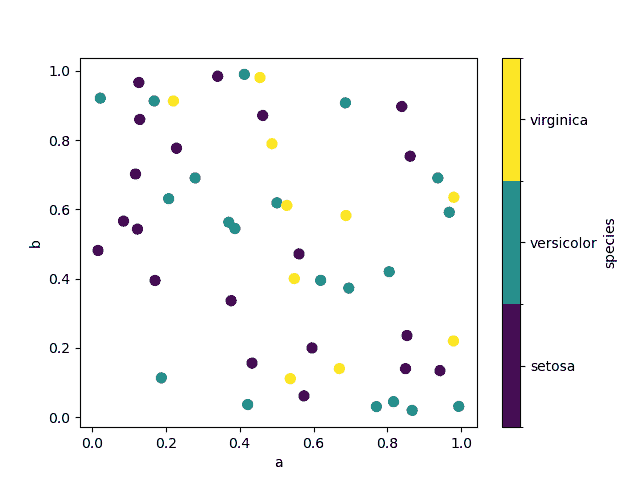
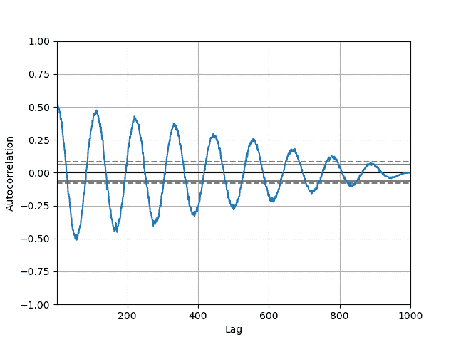
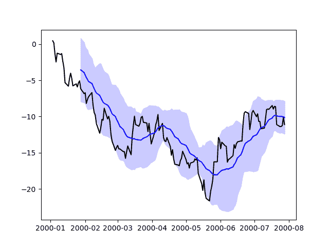

# 图表可视化

> 原文：[`pandas.pydata.org/docs/user_guide/visualization.html`](https://pandas.pydata.org/docs/user_guide/visualization.html)

注意

下面的示例假定您正在使用[Jupyter](https://jupyter.org/)。

本节演示了通过图表进行可视化。 有关表格数据可视化的信息，请参阅表格可视化部分。

我们使用标准约定引用 matplotlib API：

```py
In [1]: import matplotlib.pyplot as plt

In [2]: plt.close("all") 
```

我们在 pandas 中提供了基础知识，以轻松创建看起来不错的图形。 请参阅[生态系统页面](https://pandas.pydata.org/community/ecosystem.html) 以了解超越此处基础文档的可视化库。

注意

所有对 `np.random` 的调用都使用 123456 作为种子。

## 基本绘图：`plot`

我们将演示基础知识，有关一些高级策略，请参阅食谱。

Series 和 DataFrame 上的 `plot` 方法只是 [`plt.plot()`](https://matplotlib.org/stable/api/_as_gen/matplotlib.axes.Axes.plot.html#matplotlib.axes.Axes.plot "(在 Matplotlib v3.8.4 中)") 的简单包装：

```py
In [3]: np.random.seed(123456)

In [4]: ts = pd.Series(np.random.randn(1000), index=pd.date_range("1/1/2000", periods=1000))

In [5]: ts = ts.cumsum()

In [6]: ts.plot(); 
```


如果索引由日期组成，则调用[`gcf().autofmt_xdate()`](https://matplotlib.org/stable/api/figure_api.html#matplotlib.figure.Figure.autofmt_xdate "(在 Matplotlib v3.8.4 中)") 尝试根据上述格式化 x 轴。

在 DataFrame 上，`plot()` 是一个方便的方法，用于绘制所有带有标签的列：

```py
In [7]: df = pd.DataFrame(np.random.randn(1000, 4), index=ts.index, columns=list("ABCD"))

In [8]: df = df.cumsum()

In [9]: plt.figure();

In [10]: df.plot(); 
```


您可以使用 `plot()` 中的 `x` 和 `y` 关键字绘制一列与另一列的图形：

```py
In [11]: df3 = pd.DataFrame(np.random.randn(1000, 2), columns=["B", "C"]).cumsum()

In [12]: df3["A"] = pd.Series(list(range(len(df))))

In [13]: df3.plot(x="A", y="B"); 
```


注意

要了解更多格式和样式选项，请参阅下面的格式化。  ## 其他绘图

绘图方法允许使用除默认线图之外的几种绘图样式。 这些方法可以作为 `plot()` 的 `kind` 关键字参数提供，包括：

+   ‘bar’ 或 ‘barh’ 用于条形图

+   ‘hist’ 用于直方图

+   ‘box’ 用于箱线图

+   ‘kde’ 或 ‘density’ 用于密度图

+   ‘area’ 用于面积图

+   ‘scatter’ 用于散点图

+   ‘hexbin’ 用于六边形箱图

+   ‘pie’ 用于饼图

例如，可以通过以下方式创建条形图：

```py
In [14]: plt.figure();

In [15]: df.iloc[5].plot(kind="bar"); 
```


您还可以使用方法`DataFrame.plot.<kind>`创建其他图表，而不是提供`kind`关键字参数。这样更容易发现绘图方法及其使用的特定参数：

```py
In [16]: df = pd.DataFrame()

In [17]: df.plot.<TAB>  # noqa: E225, E999
df.plot.area     df.plot.barh     df.plot.density  df.plot.hist     df.plot.line     df.plot.scatter
df.plot.bar      df.plot.box      df.plot.hexbin   df.plot.kde      df.plot.pie 
```

除了这些`kind`，��有 DataFrame.hist()和 DataFrame.boxplot()方法，它们使用单独的接口。

最后，在`pandas.plotting`中有几个绘图函数，它们以`Series`或`DataFrame`作为参数。这些包括：

+   散点矩阵

+   安德鲁斯曲线

+   平行坐标

+   滞后图

+   自相关图

+   自举图

+   RadViz

图表也可以用误差条或表格装饰。

### 条形图

对于带标签的非时间序列数据，您可能希望生成条形图：

```py
In [18]: plt.figure();

In [19]: df.iloc[5].plot.bar();

In [20]: plt.axhline(0, color="k"); 
```


调用 DataFrame 的`plot.bar()`方法会生成多条形图：

```py
In [21]: df2 = pd.DataFrame(np.random.rand(10, 4), columns=["a", "b", "c", "d"])

In [22]: df2.plot.bar(); 
```


要生成堆叠条形图，请传递`stacked=True`：

```py
In [23]: df2.plot.bar(stacked=True); 
```


要获得水平条形图，请使用`barh`方法：

```py
In [24]: df2.plot.barh(stacked=True); 
```

 ### 直方图

可以使用`DataFrame.plot.hist()`和`Series.plot.hist()`方法绘制直方图。

```py
In [25]: df4 = pd.DataFrame(
 ....:    {
 ....:        "a": np.random.randn(1000) + 1,
 ....:        "b": np.random.randn(1000),
 ....:        "c": np.random.randn(1000) - 1,
 ....:    },
 ....:    columns=["a", "b", "c"],
 ....: )
 ....: 

In [26]: plt.figure();

In [27]: df4.plot.hist(alpha=0.5); 
```


使用`stacked=True`可以堆叠直方图。可以使用`bins`关键字更改箱子大小。

```py
In [28]: plt.figure();

In [29]: df4.plot.hist(stacked=True, bins=20); 
```


您可以传递 matplotlib 支持的其他关键字`hist`。例如，可以通过`orientation='horizontal'`和`cumulative=True`绘制水平和累积直方图。

```py
In [30]: plt.figure();

In [31]: df4["a"].plot.hist(orientation="horizontal", cumulative=True); 
```


查看[`hist`](https://matplotlib.org/stable/api/_as-gen/matplotlib.axes.Axes.hist.html#matplotlib.axes.Axes.hist "(在 Matplotlib v3.8.4)")方法和[matplotlib hist 文档](https://matplotlib.org/stable/api/_as-gen/matplotlib.pyplot.hist.html)以获取更多信息。

仍然可以使用现有接口`DataFrame.hist`绘制直方图。

```py
In [32]: plt.figure();

In [33]: df["A"].diff().hist(); 
```


`DataFrame.hist()` 在多个子图上绘制列的直方图：

```py
In [34]: plt.figure();

In [35]: df.diff().hist(color="k", alpha=0.5, bins=50); 
```


`by` 关键字可用于绘制分组直方图：

```py
In [36]: data = pd.Series(np.random.randn(1000))

In [37]: data.hist(by=np.random.randint(0, 4, 1000), figsize=(6, 4)); 
```


此外，`by` 关键字也可以在`DataFrame.plot.hist()` 中指定。

自 1.4.0 版更改。

```py
In [38]: data = pd.DataFrame(
 ....:    {
 ....:        "a": np.random.choice(["x", "y", "z"], 1000),
 ....:        "b": np.random.choice(["e", "f", "g"], 1000),
 ....:        "c": np.random.randn(1000),
 ....:        "d": np.random.randn(1000) - 1,
 ....:    },
 ....: )
 ....: 

In [39]: data.plot.hist(by=["a", "b"], figsize=(10, 5)); 
```

 ### 箱线图

调用`Series.plot.box()` 和`DataFrame.plot.box()`，或`DataFrame.boxplot()` 来绘制箱线图以可视化每列中的值的分布。

例如，这是一个表示在 [0,1) 上的均匀随机变量的 10 次观测的五次试验的箱线图。

```py
In [40]: df = pd.DataFrame(np.random.rand(10, 5), columns=["A", "B", "C", "D", "E"])

In [41]: df.plot.box(); 
```


通过传递 `color` 关键字可以给箱线图着色。您可以传递一个 `dict`，其键为 `boxes`、`whiskers`、`medians` 和 `caps`。如果字典中缺少某些键，则对应艺术品将使用默认颜色。此外，箱线图还有 `sym` 关键字来指定离群值的样式。

当您通过 `color` 关键字传递其他类型的参数时，它将直接传递给所有 `boxes`、`whiskers`、`medians` 和 `caps` 的着色。

颜色应用于要绘制的每个箱子。如果您需要更复杂的着色，可以通过传递 return_type 获取每个绘制的艺术品。

```py
In [42]: color = {
 ....:    "boxes": "DarkGreen",
 ....:    "whiskers": "DarkOrange",
 ....:    "medians": "DarkBlue",
 ....:    "caps": "Gray",
 ....: }
 ....: 

In [43]: df.plot.box(color=color, sym="r+"); 
```


此外，您还可以传递 matplotlib `boxplot` 支持的其他关键字。例如，通过 `vert=False` 和 `positions` 关键字可以绘制水平和自定义位置的箱线图。

```py
In [44]: df.plot.box(vert=False, positions=[1, 4, 5, 6, 8]); 
```


请查看[`boxplot`](https://matplotlib.org/stable/api/_as_gen/matplotlib.axes.Axes.boxplot.html#matplotlib.axes.Axes.boxplot "(在 Matplotlib v3.8.4 中)") 方法和[matplotlib 箱线图文档](https://matplotlib.org/stable/api/_as-gen/matplotlib.pyplot.boxplot.html) 以获取更多信息。

仍然可以使用现有接口 `DataFrame.boxplot` 绘制箱线图。

```py
In [45]: df = pd.DataFrame(np.random.rand(10, 5))

In [46]: plt.figure();

In [47]: bp = df.boxplot() 
```


您可以使用 `by` 关键字参数创建分层箱线图以创建分组。例如，

```py
In [48]: df = pd.DataFrame(np.random.rand(10, 2), columns=["Col1", "Col2"])

In [49]: df["X"] = pd.Series(["A", "A", "A", "A", "A", "B", "B", "B", "B", "B"])

In [50]: plt.figure();

In [51]: bp = df.boxplot(by="X") 
```


你也可以传递一部分列来绘制图表，以及按多列进行分组：

```py
In [52]: df = pd.DataFrame(np.random.rand(10, 3), columns=["Col1", "Col2", "Col3"])

In [53]: df["X"] = pd.Series(["A", "A", "A", "A", "A", "B", "B", "B", "B", "B"])

In [54]: df["Y"] = pd.Series(["A", "B", "A", "B", "A", "B", "A", "B", "A", "B"])

In [55]: plt.figure();

In [56]: bp = df.boxplot(column=["Col1", "Col2"], by=["X", "Y"]) 
```


你还可以使用`DataFrame.plot.box()`创建分组，例如：

从版本 1.4.0 开始更改。

```py
In [57]: df = pd.DataFrame(np.random.rand(10, 3), columns=["Col1", "Col2", "Col3"])

In [58]: df["X"] = pd.Series(["A", "A", "A", "A", "A", "B", "B", "B", "B", "B"])

In [59]: plt.figure();

In [60]: bp = df.plot.box(column=["Col1", "Col2"], by="X") 
```


在`boxplot`中，返回类型可以通过`return_type`关键字控制。有效选择为`{"axes", "dict", "both", None}`。由`DataFrame.boxplot`创建的分面，使用`by`关键字，也会影响输出类型：

| `return_type` | 分面 | 输出类型 |
| --- | --- | --- |
| `None` | 否 | 轴 |
| `None` | 是 | 2-D 轴数组 |
| `'axes'` | 否 | 轴 |
| `'axes'` | 是 | 轴系列 |
| `'dict'` | 否 | 艺术家字典 |
| `'dict'` | 是 | 艺术家字典系列 |
| `'both'` | 否 | 命名元组 |
| `'both'` | 是 | 命名元组系列 |

`Groupby.boxplot`始终返回`return_type`的`Series`。

```py
In [61]: np.random.seed(1234)

In [62]: df_box = pd.DataFrame(np.random.randn(50, 2))

In [63]: df_box["g"] = np.random.choice(["A", "B"], size=50)

In [64]: df_box.loc[df_box["g"] == "B", 1] += 3

In [65]: bp = df_box.boxplot(by="g") 
```


上面的子图首先按数值列分割，然后按`g`列的值分割。下面的子图首先按`g`的值分割，然后按数值列分割。

```py
In [66]: bp = df_box.groupby("g").boxplot() 
```

 ### 面积图

你可以使用`Series.plot.area()`和`DataFrame.plot.area()`创建面积图。面积图默认堆叠。要生成堆叠的面积图，每列必须是全部正值或全部负值。

当输入数据包含`NaN`时，它将自动填充为 0。如果要删除或用不同值填充，请在调用`plot`之前使用`dataframe.dropna()`或`dataframe.fillna()`。

```py
In [67]: df = pd.DataFrame(np.random.rand(10, 4), columns=["a", "b", "c", "d"])

In [68]: df.plot.area(); 
```


要生成未堆叠的图，请传递`stacked=False`。除非另有说明，否则 alpha 值设置为 0.5：

```py
In [69]: df.plot.area(stacked=False); 
```

 ### 散点图

散点图可以通过使用`DataFrame.plot.scatter()`方法绘制。散点图需要 x 轴和 y 轴的数值列。这些可以通过`x`和`y`关键字指定。

```py
In [70]: df = pd.DataFrame(np.random.rand(50, 4), columns=["a", "b", "c", "d"])

In [71]: df["species"] = pd.Categorical(
 ....:    ["setosa"] * 20 + ["versicolor"] * 20 + ["virginica"] * 10
 ....: )
 ....: 

In [72]: df.plot.scatter(x="a", y="b"); 
```


要在单个轴上绘制多个列组，请重复`plot`方法并指定目标`ax`。建议指定`color`和`label`关键字以区分每个组。

```py
In [73]: ax = df.plot.scatter(x="a", y="b", color="DarkBlue", label="Group 1")

In [74]: df.plot.scatter(x="c", y="d", color="DarkGreen", label="Group 2", ax=ax); 
```


关键字 `c` 可以作为列的名称，为每个点提供颜色：

```py
In [75]: df.plot.scatter(x="a", y="b", c="c", s=50); 
```


如果传递给 `c` 的是一个分类列，则会生成一个离散的颜色条：

新版本 1.3.0 中添加。

```py
In [76]: df.plot.scatter(x="a", y="b", c="species", cmap="viridis", s=50); 
```



你可以传递 `matplotlib` 支持的其他关键字给 [`scatter`](https://matplotlib.org/stable/api/_as_gen/matplotlib.axes.Axes.scatter.html#matplotlib.axes.Axes.scatter "(在 Matplotlib v3.8.4 中)")。下面的示例展示了使用 `DataFrame` 列作为气泡大小的气泡图。

```py
In [77]: df.plot.scatter(x="a", y="b", s=df["c"] * 200); 
```


查看 [`scatter`](https://matplotlib.org/stable/api/_as-gen/matplotlib.axes.Axes.scatter.html#matplotlib.axes.Axes.scatter "(在 Matplotlib v3.8.4 中)") 方法和 [matplotlib scatter 文档](https://matplotlib.org/stable/api/_as-gen/matplotlib.pyplot.scatter.html) 了解更多。### 六边形 bin 图

你可以使用 `DataFrame.plot.hexbin()` 创建六边形 bin 图。如果你的数据过于密集而无法单独绘制每个点，则六边形 bin 图可以作为散点图的有用替代品。

```py
In [78]: df = pd.DataFrame(np.random.randn(1000, 2), columns=["a", "b"])

In [79]: df["b"] = df["b"] + np.arange(1000)

In [80]: df.plot.hexbin(x="a", y="b", gridsize=25); 
```


一个有用的关键字参数是 `gridsize`；它控制 x 方向上的六边形数量，默认为 100。更大的 `gridsize` 意味着更多、更小的 bins。

默认情况下，计算每个 `(x, y)` 点周围的计数直方图。你可以通过将值传递给 `C` 和 `reduce_C_function` 参数来指定替代聚合。`C` 指定每个 `(x, y)` 点的值，而 `reduce_C_function` 是一个函数，接受一个参数，将一个 bin 中的所有值减少到一个单一的数字（例如 `mean`、`max`、`sum`、`std`）。在这个示例中，位置由列 `a` 和 `b` 给出，而值由列 `z` 给出。使用 NumPy 的 `max` 函数对 bins 进行聚合。

```py
In [81]: df = pd.DataFrame(np.random.randn(1000, 2), columns=["a", "b"])

In [82]: df["b"] = df["b"] + np.arange(1000)

In [83]: df["z"] = np.random.uniform(0, 3, 1000)

In [84]: df.plot.hexbin(x="a", y="b", C="z", reduce_C_function=np.max, gridsize=25); 
```


查看 [`hexbin`](https://matplotlib.org/stable/api/_as-gen/matplotlib.axes.Axes.hexbin.html#matplotlib.axes.Axes.hexbin "(在 Matplotlib v3.8.4 中)") 方法和 [matplotlib hexbin 文档](https://matplotlib.org/stable/api/_as-gen/matplotlib.pyplot.hexbin.html) 了解更多。### 饼图

您可以使用`DataFrame.plot.pie()`或`Series.plot.pie()`创建饼图。如果您的数据包含任何`NaN`，它们将自动填充为 0。如果数据中有任何负值，将引发`ValueError`。

```py
In [85]: series = pd.Series(3 * np.random.rand(4), index=["a", "b", "c", "d"], name="series")

In [86]: series.plot.pie(figsize=(6, 6)); 
```


对于饼图，最好使用正方形图形，即图形纵横比为 1。您可以创建宽度和高度相等的图形，或者在绘图后通过调用`ax.set_aspect('equal')`来强制纵横比相等。

请注意，使用`DataFrame`创建饼图需要通过`y`参数指定目标列或`subplots=True`。当指定`y`时，将绘制所选列的饼图。如果指定了`subplots=True`，将为每列绘制饼图子图。默认情况下，每个饼图中都会绘制图例；指定`legend=False`以隐藏图例。

```py
In [87]: df = pd.DataFrame(
 ....:    3 * np.random.rand(4, 2), index=["a", "b", "c", "d"], columns=["x", "y"]
 ....: )
 ....: 

In [88]: df.plot.pie(subplots=True, figsize=(8, 4)); 
```


您可以使用`labels`和`colors`关键字来指定每个楔形的标签和颜色。

警告

大多数 pandas 绘图使用`label`和`color`参数（请注意这两个参数上没有“s”）。为了与[`matplotlib.pyplot.pie()`](https://matplotlib.org/stable/api/_as_gen/matplotlib.pyplot.pie.html#matplotlib.pyplot.pie "(在 Matplotlib v3.8.4 中)")保持一致，您必须使用`labels`和`colors`。

如果要隐藏楔形标签，请指定`labels=None`。如果指定了`fontsize`，则该值将应用于楔形标签。此外，[`matplotlib.pyplot.pie()`](https://matplotlib.org/stable/api/_as-gen/matplotlib.pyplot.pie.html#matplotlib.pyplot.pie "(在 Matplotlib v3.8.4 中)")支持的其他关键字也可以使用。

```py
In [89]: series.plot.pie(
 ....:    labels=["AA", "BB", "CC", "DD"],
 ....:    colors=["r", "g", "b", "c"],
 ....:    autopct="%.2f",
 ....:    fontsize=20,
 ....:    figsize=(6, 6),
 ....: );
 ....: 
```


如果传递的值总和小于 1.0，则它们将被重新缩放，使其总和为 1。

```py
In [90]: series = pd.Series([0.1] * 4, index=["a", "b", "c", "d"], name="series2")

In [91]: series.plot.pie(figsize=(6, 6)); 
```


查看更多内容，请参阅[matplotlib 饼图文档](https://matplotlib.org/stable/api/_as_gen/matplotlib.pyplot.pie.html)。  ## 使用缺失数据绘图

pandas 在绘制包含缺失数据的`DataFrame`或`Series`时会尝试实用。根据绘图类型，缺失值将被删除、省略或填充。

| 绘图类型 | NaN 处理 |
| --- | --- |
| 折线图 | 在 NaN 处留空 |
| 折线图（堆叠） | 填充 0 |
| 条形图 | 填充 0 |
| 散点图 | 删除 NaN |
| 直方图 | 删除 NaN（列） |
| 箱线图 | 删除 NaN（列） |
| 面积图 | 填充 0 |
| KDE | 删除 NaN（列） |
| 六边形图 | 删除 NaN |
| 饼图 | 填充 0 |

如果默认设置不符合您的要求，或者您想明确指定如何处理缺失值，请考虑在绘图之前使用`fillna()`或`dropna()`。## 绘图工具

这些函数可以从`pandas.plotting`中导入，并将`Series`或`DataFrame`作为参数。

### 散点矩阵图

你可以使用`pandas.plotting`中的`scatter_matrix`方法创建散点图矩阵：

```py
In [92]: from pandas.plotting import scatter_matrix

In [93]: df = pd.DataFrame(np.random.randn(1000, 4), columns=["a", "b", "c", "d"])

In [94]: scatter_matrix(df, alpha=0.2, figsize=(6, 6), diagonal="kde"); 
```

 ### 密度图

你可以使用`Series.plot.kde()`和`DataFrame.plot.kde()`方法创建密度图。

```py
In [95]: ser = pd.Series(np.random.randn(1000))

In [96]: ser.plot.kde(); 
```

 ### 安德鲁斯曲线

安德鲁斯曲线允许我们将多变量数据绘制为大量曲线，这些曲线是使用样本属性作为傅立叶级数的系数创建的，详见[维基百科条目](https://en.wikipedia.org/wiki/Andrews_plot)。通过为每个类别的曲线着不同颜色，可以可视化数据聚类。属于同一类别样本的曲线通常会更接近并形成更大的结构。

**注意**：可在[此处](https://raw.githubusercontent.com/pandas-dev/pandas/main/pandas/tests/io/data/csv/iris.csv)获取“Iris”数据集。

```py
In [97]: from pandas.plotting import andrews_curves

In [98]: data = pd.read_csv("data/iris.data")

In [99]: plt.figure();

In [100]: andrews_curves(data, "Name"); 
```

 ### 平行坐标

平行坐标是一种用于绘制多变量数据的绘图技术，详见[维基百科条目](https://en.wikipedia.org/wiki/Parallel_coordinates)。平行坐标允许我们看到数据中的聚类，并通过视觉估计其他统计数据。使用平行坐标，点被表示为连接的线段。每条垂直线代表一个属性。一组连接的线段代表一个数据点。倾向于聚类的点会更接近。

```py
In [101]: from pandas.plotting import parallel_coordinates

In [102]: data = pd.read_csv("data/iris.data")

In [103]: plt.figure();

In [104]: parallel_coordinates(data, "Name"); 
```

 ### 滞后图

滞后图用于检查数据集或时间序列是否是随机的。随机数据不应在滞后图中显示任何结构。非随机结构意味着底层数据不是随机的。可以传递`lag`参数，当`lag=1`时，图形基本上是`data[:-1]` vs. `data[1:]`。

```py
In [105]: from pandas.plotting import lag_plot

In [106]: plt.figure();

In [107]: spacing = np.linspace(-99 * np.pi, 99 * np.pi, num=1000)

In [108]: data = pd.Series(0.1 * np.random.rand(1000) + 0.9 * np.sin(spacing))

In [109]: lag_plot(data); 
```

 ### 自相关图

自相关图通常用于检查时间序列中的随机性。这是通过计算不同时间滞后处的数据值的自相关来实现的。如果时间序列是随机的，这些自相关应该在任何时间滞后分离处接近零。如果时间序列是非随机的，那么一个或多个自相关将显着非零。图中显示的水平线对应于 95%和 99%的置信区间。虚线是 99%的置信区间。有关自相关图的更多信息，请参阅[Wikipedia 条目](https://en.wikipedia.org/wiki/Correlogram)。

```py
In [110]: from pandas.plotting import autocorrelation_plot

In [111]: plt.figure();

In [112]: spacing = np.linspace(-9 * np.pi, 9 * np.pi, num=1000)

In [113]: data = pd.Series(0.7 * np.random.rand(1000) + 0.3 * np.sin(spacing))

In [114]: autocorrelation_plot(data); 
```

 ### Bootstrap 图

Bootstrap 图用于直观评估统计量（如均值、中位数、中程等）的不确定性。从数据集中选择指定大小的随机子集，计算该子集的统计量，然后重复该过程指定次数。生成的图和直方图构成了 Bootstrap 图。

```py
In [115]: from pandas.plotting import bootstrap_plot

In [116]: data = pd.Series(np.random.rand(1000))

In [117]: bootstrap_plot(data, size=50, samples=500, color="grey"); 
```

 ### RadViz

RadViz 是一种可视化多变量数据的方法。它基于简单的弹簧张力最小化算法。基本上，您在平面上设置一堆点。在我们的情况下，它们在单位圆上等距分布。每个点代表一个单独的属性。然后，您假装数据集中的每个样本都通过弹簧连接到这些点，弹簧的刚度与该属性的数值成比例（它们被归一化为单位间隔）。我们的样本定居到的平面上的点（在我们的样本上作用的力处于平衡状态的地方）是我们的样本将被绘制的点。根据该样本属于哪个类别，它将以不同的颜色着色。有关更多信息，请参阅 R 包[Radviz](https://cran.r-project.org/web/packages/Radviz/index.html)。

**注意**: “鸢尾花”数据集可在[此处](https://raw.githubusercontent.com/pandas-dev/pandas/main/pandas/tests/io/data/csv/iris.csv)获取。

```py
In [118]: from pandas.plotting import radviz

In [119]: data = pd.read_csv("data/iris.data")

In [120]: plt.figure();

In [121]: radviz(data, "Name"); 
```

 ## 绘图格式

### 设置绘图样式

从 1.5 版本开始，matplotlib 提供了一系列预配置的绘图样式。设置样式可用于轻松地给出所需的绘图外观。在创建绘图之前调用`matplotlib.style.use(my_plot_style)`即可设置样式。例如，您可以写`matplotlib.style.use('ggplot')`以获得 ggplot 风格的绘图。

您可以在`matplotlib.style.available`中看到各种可用的样式名称，并且很容易尝试它们。

### 一般绘图样式参数

大多数绘图方法都有一组关键字参数，用于控制返回绘图的布局和格式：

```py
In [122]: plt.figure();

In [123]: ts.plot(style="k--", label="Series"); 
```


对于每种类型的图（例如 `line`、`bar`、`scatter`），将任何附加的参数关键字传递给相应的 matplotlib 函数（[`ax.plot()`](https://matplotlib.org/stable/api/_as_gen/matplotlib.axes.Axes.plot.html#matplotlib.axes.Axes.plot "(in Matplotlib v3.8.4)")、[`ax.bar()`](https://matplotlib.org/stable/api/_as_gen/matplotlib.axes.Axes.bar.html#matplotlib.axes.Axes.bar "(in Matplotlib v3.8.4)")、[`ax.scatter()`](https://matplotlib.org/stable/api/_as_gen/matplotlib.axes.Axes.scatter.html#matplotlib.axes.Axes.scatter "(in Matplotlib v3.8.4)")）。 这些可以用来控制额外的样式，超出了 pandas 提供的范围。

### 控制图例

您可以将 `legend` 参数设置为 `False` 以隐藏默认显示的图例。

```py
In [124]: df = pd.DataFrame(np.random.randn(1000, 4), index=ts.index, columns=list("ABCD"))

In [125]: df = df.cumsum()

In [126]: df.plot(legend=False); 
```


### 控制标签

您可以设置 `xlabel` 和 `ylabel` 参数以为绘图设置自定义标签，用于 x 和 y 轴。 默认情况下，pandas 将采用索引名称作为 xlabel，同时将其留空作为 ylabel。

```py
In [127]: df.plot();

In [128]: df.plot(xlabel="new x", ylabel="new y"); 
```


### 比例

你可以传递`logy`以获得对数刻度 Y 轴。

```py
In [129]: ts = pd.Series(np.random.randn(1000), index=pd.date_range("1/1/2000", periods=1000))

In [130]: ts = np.exp(ts.cumsum())

In [131]: ts.plot(logy=True); 
```


还请参阅 `logx` 和 `loglog` 关键字参数。

### 在次要 y 轴上绘图

要在次要 y 轴上绘制数据，请使用 `secondary_y` 关键字：

```py
In [132]: df["A"].plot();

In [133]: df["B"].plot(secondary_y=True, style="g"); 
```


要在 `DataFrame` 中绘制某些列，请将列名传递给 `secondary_y` 关键字：

```py
In [134]: plt.figure();

In [135]: ax = df.plot(secondary_y=["A", "B"])

In [136]: ax.set_ylabel("CD scale");

In [137]: ax.right_ax.set_ylabel("AB scale"); 
```


请注意，在图例中，自动标记在次要 y 轴上绘制的列为“(right)” 。 要关闭自动标记，请使用 `mark_right=False` 关键字：

```py
In [138]: plt.figure();

In [139]: df.plot(secondary_y=["A", "B"], mark_right=False); 
```

 ### 时间序列图的自定义格式化程序

pandas 为时间序列图提供了自定义格式化程序。 这些更改日期和时间的轴标签的格式。 默认情况下，自定义格式化程序仅应用于由 pandas 使用 `DataFrame.plot()` 或 `Series.plot()` 创建的图。 要使它们应用于所有图，包括由 matplotlib 制作的图，请设置选项 `pd.options.plotting.matplotlib.register_converters = True` 或使用 `pandas.plotting.register_matplotlib_converters()`。

### 抑制刻度分辨率调整

pandas 包括用于常规频率时间序列数据的自动刻度分辨率调整。对于 pandas 无法推断频率信息的有限情况（例如，在外部创建的`twinx`中），您可以选择抑制此行为以进行对齐。

这是默认行为，请注意 x 轴刻度标签的执行方式：

```py
In [140]: plt.figure();

In [141]: df["A"].plot(); 
```


使用`x_compat`参数，您可以抑制此行为：

```py
In [142]: plt.figure();

In [143]: df["A"].plot(x_compat=True); 
```


如果有多个需要抑制的图，可以在`with`语句中使用`pandas.plotting.plot_params`中的`use`方法：

```py
In [144]: plt.figure();

In [145]: with pd.plotting.plot_params.use("x_compat", True):
 .....:    df["A"].plot(color="r")
 .....:    df["B"].plot(color="g")
 .....:    df["C"].plot(color="b")
 .....: 
```


### 自动日期刻度调整

`TimedeltaIndex`现在使用本机 matplotlib 刻度定位器方法，对于刻度标签重叠的图形，调用 matplotlib 的自动日期刻度调整非常有用。

有关更多信息，请参阅`autofmt_xdate`方法和[matplotlib 文档](https://matplotlib.org/2.0.2/users/recipes.html#fixing-common-date-annoyances)。

### 子图

`DataFrame`中的每个`Series`可以使用`subplots`关键字在不同的轴上绘制：

```py
In [146]: df.plot(subplots=True, figsize=(6, 6)); 
```


### 使用布局并针对多个轴

子图的布局可以通过`layout`关键字指定。它可以接受`(行数，列数)`。`layout`关键字也可以在`hist`和`boxplot`中使用。如果输入无效，将引发`ValueError`。

由`layout`指定的行 x 列包含的轴数必须大于所需子图的数量。如果`layout`可以容纳更多轴，那么空白轴将不会被绘制。类似于 NumPy 数组的`reshape`方法，您可以在一个维度上使用`-1`来自动计算所需的行数或列数，给定另一个维度。

```py
In [147]: df.plot(subplots=True, layout=(2, 3), figsize=(6, 6), sharex=False); 
```


上面的示例与使用以下内容相同：

```py
In [148]: df.plot(subplots=True, layout=(2, -1), figsize=(6, 6), sharex=False); 
```

所需的列数（3）是从要绘制的系列数和给定的行数（2）推断出来的。

您可以通过`ax`关键字以类似列表的方式传递预先创建的多个轴。这允许更复杂的布局。传递的轴必须与正在绘制的子图数量相同。

当通过`ax`关键字传递多个轴时，`layout`、`sharex`和`sharey`关键字不会影响输出。您应该明确传递`sharex=False`和`sharey=False`，否则将会看到警告。

```py
In [149]: fig, axes = plt.subplots(4, 4, figsize=(9, 9))

In [150]: plt.subplots_adjust(wspace=0.5, hspace=0.5)

In [151]: target1 = [axes[0][0], axes[1][1], axes[2][2], axes[3][3]]

In [152]: target2 = [axes[3][0], axes[2][1], axes[1][2], axes[0][3]]

In [153]: df.plot(subplots=True, ax=target1, legend=False, sharex=False, sharey=False);

In [154]: (-df).plot(subplots=True, ax=target2, legend=False, sharex=False, sharey=False); 
```


另一个选项是通过在`Series.plot()`中传递一个`ax`参数来在特定轴上绘制：

```py
In [155]: np.random.seed(123456)

In [156]: ts = pd.Series(np.random.randn(1000), index=pd.date_range("1/1/2000", periods=1000))

In [157]: ts = ts.cumsum()

In [158]: df = pd.DataFrame(np.random.randn(1000, 4), index=ts.index, columns=list("ABCD"))

In [159]: df = df.cumsum() 
```

```py
In [160]: fig, axes = plt.subplots(nrows=2, ncols=2)

In [161]: plt.subplots_adjust(wspace=0.2, hspace=0.5)

In [162]: df["A"].plot(ax=axes[0, 0]);

In [163]: axes[0, 0].set_title("A");

In [164]: df["B"].plot(ax=axes[0, 1]);

In [165]: axes[0, 1].set_title("B");

In [166]: df["C"].plot(ax=axes[1, 0]);

In [167]: axes[1, 0].set_title("C");

In [168]: df["D"].plot(ax=axes[1, 1]);

In [169]: axes[1, 1].set_title("D"); 
```

 ### 带有误差条的绘图

在`DataFrame.plot()` 和 `Series.plot()` 中支持使用误差条绘图。

水平和垂直误差条可以分别通过 `xerr` 和 `yerr` 关键字参数传递给 `plot()`。误差值可以使用多种格式指定：

+   作为与绘图的`DataFrame` 的列名匹配的误差的`DataFrame` 或字典，或与 `Series` 的`name` 属性匹配的误差。

+   作为一个字符串，指示绘图的`DataFrame` 中哪些列包含误差值。

+   作为原始值（`list`、`tuple` 或 `np.ndarray`）。必须与绘图的`DataFrame`/`Series` 的长度相同。

下面是从原始数据轻松绘制组均值和标准差的一个示例。

```py
# Generate the data
In [170]: ix3 = pd.MultiIndex.from_arrays(
 .....:    [
 .....:        ["a", "a", "a", "a", "a", "b", "b", "b", "b", "b"],
 .....:        ["foo", "foo", "foo", "bar", "bar", "foo", "foo", "bar", "bar", "bar"],
 .....:    ],
 .....:    names=["letter", "word"],
 .....: )
 .....: 

In [171]: df3 = pd.DataFrame(
 .....:    {
 .....:        "data1": [9, 3, 2, 4, 3, 2, 4, 6, 3, 2],
 .....:        "data2": [9, 6, 5, 7, 5, 4, 5, 6, 5, 1],
 .....:    },
 .....:    index=ix3,
 .....: )
 .....: 

# Group by index labels and take the means and standard deviations
# for each group
In [172]: gp3 = df3.groupby(level=("letter", "word"))

In [173]: means = gp3.mean()

In [174]: errors = gp3.std()

In [175]: means
Out[175]: 
 data1     data2
letter word 
a      bar   3.500000  6.000000
 foo   4.666667  6.666667
b      bar   3.666667  4.000000
 foo   3.000000  4.500000

In [176]: errors
Out[176]: 
 data1     data2
letter word 
a      bar   0.707107  1.414214
 foo   3.785939  2.081666
b      bar   2.081666  2.645751
 foo   1.414214  0.707107

# Plot
In [177]: fig, ax = plt.subplots()

In [178]: means.plot.bar(yerr=errors, ax=ax, capsize=4, rot=0); 
```


在这种情况下，也支持不对称误差条，但必须提供原始误差值。对于长度为`N`的 `Series`，应提供一个 `2xN` 的数组，表示下限和上限（或左右）误差。对于 `MxN` 的`DataFrame`，不对称误差应该是一个 `Mx2xN` 的数组。

下面是使用不对称误差条绘制最小/最大范围的一个示例。

```py
In [179]: mins = gp3.min()

In [180]: maxs = gp3.max()

# errors should be positive, and defined in the order of lower, upper
In [181]: errors = [[means[c] - mins[c], maxs[c] - means[c]] for c in df3.columns]

# Plot
In [182]: fig, ax = plt.subplots()

In [183]: means.plot.bar(yerr=errors, ax=ax, capsize=4, rot=0); 
```

 ### 绘制表格

使用 matplotlib 表格绘图现在支持在`DataFrame.plot()` 和 `Series.plot()` 中使用 `table` 关键字。`table` 关键字可以接受 `bool`、`DataFrame` 或 `Series`。绘制表格的简单方法是指定 `table=True`。数据将被转置以符合 matplotlib 的默认布局。

```py
In [184]: np.random.seed(123456)

In [185]: fig, ax = plt.subplots(1, 1, figsize=(7, 6.5))

In [186]: df = pd.DataFrame(np.random.rand(5, 3), columns=["a", "b", "c"])

In [187]: ax.xaxis.tick_top()  # Display x-axis ticks on top.

In [188]: df.plot(table=True, ax=ax); 
```


此外，您可以传递不同的 `DataFrame` 或 `Series` 给 `table` 关键字。数据将按照 print 方法中显示的方式绘制（不会自动转置）。如果需要，应手动转置，如下面的示例所示。

```py
In [189]: fig, ax = plt.subplots(1, 1, figsize=(7, 6.75))

In [190]: ax.xaxis.tick_top()  # Display x-axis ticks on top.

In [191]: df.plot(table=np.round(df.T, 2), ax=ax); 
```


还存在一个辅助函数 `pandas.plotting.table`，它从 `DataFrame` 或 `Series` 创建一个表，并将其添加到 `matplotlib.Axes` 实例中。此函数可以接受 matplotlib [table](https://matplotlib.org/stable/api/_as_gen/matplotlib.axes.Axes.table.html) 具有的关键字。

```py
In [192]: from pandas.plotting import table

In [193]: fig, ax = plt.subplots(1, 1)

In [194]: table(ax, np.round(df.describe(), 2), loc="upper right", colWidths=[0.2, 0.2, 0.2]);

In [195]: df.plot(ax=ax, ylim=(0, 2), legend=None); 
```


**注意**：您可以使用 `axes.tables` 属性在轴上获取表实例，以进行进一步的装饰。有关更多信息，请参阅 [matplotlib 表格文档](https://matplotlib.org/api/axes_api.html#matplotlib.axes.Axes.table)。  ### 色图

绘制大量列时可能出现的一个潜在问题是，由于默认颜色中的重复，一些系列很难区分。为了解决这个问题，`DataFrame` 绘图支持使用 `colormap` 参数，该参数接受 Matplotlib [colormap](https://matplotlib.org/api/cm_api.html) 或一个字符串，该字符串是注册到 Matplotlib 的 colormap 的名称。默认 matplotlib 色图的可视化参考 [此处](https://matplotlib.org/stable/gallery/color/colormap_reference.html)。

由于 matplotlib 不直接支持基于线的图的色图，所以颜色是根据 `DataFrame` 中的列数确定的均匀间距选择的。没有考虑背景颜色，因此一些色图会产生不易看到的线。

要使用 cubehelix 色图，我们可以传递 `colormap='cubehelix'`。

```py
In [196]: np.random.seed(123456)

In [197]: df = pd.DataFrame(np.random.randn(1000, 10), index=ts.index)

In [198]: df = df.cumsum()

In [199]: plt.figure();

In [200]: df.plot(colormap="cubehelix"); 
```


或者，我们可以传递色图本身：

```py
In [201]: from matplotlib import cm

In [202]: plt.figure();

In [203]: df.plot(colormap=cm.cubehelix); 
```


色图也可以用于其他绘图类型，如条形图：

```py
In [204]: np.random.seed(123456)

In [205]: dd = pd.DataFrame(np.random.randn(10, 10)).map(abs)

In [206]: dd = dd.cumsum()

In [207]: plt.figure();

In [208]: dd.plot.bar(colormap="Greens"); 
```


平行坐标图：

```py
In [209]: plt.figure();

In [210]: parallel_coordinates(data, "Name", colormap="gist_rainbow"); 
```


Andrews 曲线图：

```py
In [211]: plt.figure();

In [212]: andrews_curves(data, "Name", colormap="winter"); 
```


## 直接使用 Matplotlib 绘图

在某些情况下，直接使用 matplotlib 准备图形可能仍然更可取或必要，例如当 pandas 尚不支持某种类型的图形或自定义时。`Series`和`DataFrame`对象的行为类似于数组，因此可以直接将它们传递给 matplotlib 函数，而无需显式转换。

pandas 还自动注册了识别日期索引的格式化程序和定位器，从而将日期和时间支持扩展到几乎所有 matplotlib 中可用的绘图类型。尽管这种格式化不提供通过 pandas 绘图时获得的相同精细度水平，但在绘制大量点时可能更快。

```py
In [213]: np.random.seed(123456)

In [214]: price = pd.Series(
 .....:    np.random.randn(150).cumsum(),
 .....:    index=pd.date_range("2000-1-1", periods=150, freq="B"),
 .....: )
 .....: 

In [215]: ma = price.rolling(20).mean()

In [216]: mstd = price.rolling(20).std()

In [217]: plt.figure();

In [218]: plt.plot(price.index, price, "k");

In [219]: plt.plot(ma.index, ma, "b");

In [220]: plt.fill_between(mstd.index, ma - 2 * mstd, ma + 2 * mstd, color="b", alpha=0.2); 
```



## 绘图后端

pandas 可以通过第三方绘图后端进行扩展。主要思想是让用户选择一个基于 Matplotlib 提供的绘图后端不同的绘图后端。

这可以通过在`plot`函数中将‘backend.module’作为参数`backend`传递来实现。例如：

```py
>>> Series([1, 2, 3]).plot(backend="backend.module") 
```

或者，您也���以全局设置此选项，这样您就不需要在每个`plot`调用中指定关键字。例如：

```py
>>> pd.set_option("plotting.backend", "backend.module")
>>> pd.Series([1, 2, 3]).plot() 
```

或者：

```py
>>> pd.options.plotting.backend = "backend.module"
>>> pd.Series([1, 2, 3]).plot() 
```

这基本上等同于：

```py
>>> import backend.module
>>> backend.module.plot(pd.Series([1, 2, 3])) 
```

然后，后端模块可以使用其他可视化工具（Bokeh、Altair、hvplot 等）生成图形。一些为 pandas 实现后端的库列在[生态系统页面](https://pandas.pydata.org/community/ecosystem.html)上。

开发人员指南可以在[`pandas.pydata.org/docs/dev/development/extending.html#plotting-backends`](https://pandas.pydata.org/docs/dev/development/extending.html#plotting-backends)找到

## 基本绘图：`plot`

我们将演示基础知识，有关一些高级策略，请参见食谱。

Series 和 DataFrame 上的`plot`方法只是对[`plt.plot()`](https://matplotlib.org/stable/api/_as_gen/matplotlib.axes.Axes.plot.html#matplotlib.axes.Axes.plot "(在 Matplotlib v3.8.4 中)")的简单包装：

```py
In [3]: np.random.seed(123456)

In [4]: ts = pd.Series(np.random.randn(1000), index=pd.date_range("1/1/2000", periods=1000))

In [5]: ts = ts.cumsum()

In [6]: ts.plot(); 
```


如果索引由日期组成，则调用[`gcf().autofmt_xdate()`](https://matplotlib.org/stable/api/figure_api.html#matplotlib.figure.Figure.autofmt_xdate "(在 Matplotlib v3.8.4 中)")尝试根据上述格式化 x 轴。

在 DataFrame 上，`plot()`是一个方便的方法，用于绘制所有带有标签的列：

```py
In [7]: df = pd.DataFrame(np.random.randn(1000, 4), index=ts.index, columns=list("ABCD"))

In [8]: df = df.cumsum()

In [9]: plt.figure();

In [10]: df.plot(); 
```


您可以使用`plot()`中的`x`和`y`关键字绘制一列与另一列的图形：

```py
In [11]: df3 = pd.DataFrame(np.random.randn(1000, 2), columns=["B", "C"]).cumsum()

In [12]: df3["A"] = pd.Series(list(range(len(df))))

In [13]: df3.plot(x="A", y="B"); 
```


注意

要了解更多格式和样式选项，请参见下面的格式化。

## 其他图形

绘图方法除了默认的线图之外，还允许使用一些其他样式的绘图。这些方法可以作为 `plot()` 的 `kind` 关键字参数提供，包括：

+   ‘bar’ 或 ‘barh’ 用于条形图

+   ‘hist’ 用于直方图

+   ‘box’ 用于箱线图

+   ‘kde’ 或 ‘density’ 用于密度图

+   ‘area’ 用于面积图

+   ‘scatter’ 用于散点图

+   ‘hexbin’ 用于六边形二进制图

+   ‘pie’ 用于饼图

例如，可以通过以下方式创建条形图：

```py
In [14]: plt.figure();

In [15]: df.iloc[5].plot(kind="bar"); 
```


您还可以使用方法 `DataFrame.plot.<kind>` 来创建这些其他图，而不是提供 `kind` 关键字参数。这样可以更容易地发现绘图方法和它们使用的具体参数：

```py
In [16]: df = pd.DataFrame()

In [17]: df.plot.<TAB>  # noqa: E225, E999
df.plot.area     df.plot.barh     df.plot.density  df.plot.hist     df.plot.line     df.plot.scatter
df.plot.bar      df.plot.box      df.plot.hexbin   df.plot.kde      df.plot.pie 
```

除了这些 `kind`，还有 DataFrame.hist() 和 DataFrame.boxplot() 方法，它们使用单独的界面。

最后，`pandas.plotting` 中有几个 绘图函数，它们将 `Series` 或 `DataFrame` 作为参数。这些包括：

+   散点矩阵

+   安德鲁曲线

+   平行坐标

+   滞后图

+   自相关图

+   自举图

+   RadViz

图表也可以装饰有 误差条 或 表格。

### 条形图

对于带标签的非时间序列数据，您可能希望生成条形图：

```py
In [18]: plt.figure();

In [19]: df.iloc[5].plot.bar();

In [20]: plt.axhline(0, color="k"); 
```


调用 DataFrame 的 `plot.bar()` 方法会生成多条条形图：

```py
In [21]: df2 = pd.DataFrame(np.random.rand(10, 4), columns=["a", "b", "c", "d"])

In [22]: df2.plot.bar(); 
```


要生成堆叠条形图，请传递 `stacked=True`：

```py
In [23]: df2.plot.bar(stacked=True); 
```


要获得水平条形图，请使用 `barh` 方法：

```py
In [24]: df2.plot.barh(stacked=True); 
```

 ### 直方图

直方图可以通过使用`DataFrame.plot.hist()` 和 `Series.plot.hist()` 方法绘制。

```py
In [25]: df4 = pd.DataFrame(
 ....:    {
 ....:        "a": np.random.randn(1000) + 1,
 ....:        "b": np.random.randn(1000),
 ....:        "c": np.random.randn(1000) - 1,
 ....:    },
 ....:    columns=["a", "b", "c"],
 ....: )
 ....: 

In [26]: plt.figure();

In [27]: df4.plot.hist(alpha=0.5); 
```


可以使用`stacked=True`堆叠直方图。可以使用`bins`关键字更改箱子大小。

```py
In [28]: plt.figure();

In [29]: df4.plot.hist(stacked=True, bins=20); 
```


您可以传递 matplotlib 支持的其他关键字。例如，可以通过`orientation='horizontal'`和`cumulative=True`绘制水平和累积直方图。

```py
In [30]: plt.figure();

In [31]: df4["a"].plot.hist(orientation="horizontal", cumulative=True); 
```


查看 [`hist`](https://matplotlib.org/stable/api/_as_gen/matplotlib.axes.Axes.hist.html#matplotlib.axes.Axes.hist "(在 Matplotlib v3.8.4 中)") 方法和 [matplotlib 直方图文档](https://matplotlib.org/stable/api/_as-gen/matplotlib.pyplot.hist.html) 以获取更多信息。

现有的接口`DataFrame.hist`用于绘制直方图仍然可以使用。

```py
In [32]: plt.figure();

In [33]: df["A"].diff().hist(); 
```


`DataFrame.hist()` 在多个子图上绘制列的直方图：

```py
In [34]: plt.figure();

In [35]: df.diff().hist(color="k", alpha=0.5, bins=50); 
```


可以指定`by`关键字以绘制分组直方图：

```py
In [36]: data = pd.Series(np.random.randn(1000))

In [37]: data.hist(by=np.random.randint(0, 4, 1000), figsize=(6, 4)); 
```


另外，在 `DataFrame.plot.hist()` 中也可以指定`by`关键字。

从版本 1.4.0 开始更改。

```py
In [38]: data = pd.DataFrame(
 ....:    {
 ....:        "a": np.random.choice(["x", "y", "z"], 1000),
 ....:        "b": np.random.choice(["e", "f", "g"], 1000),
 ....:        "c": np.random.randn(1000),
 ....:        "d": np.random.randn(1000) - 1,
 ....:    },
 ....: )
 ....: 

In [39]: data.plot.hist(by=["a", "b"], figsize=(10, 5)); 
```

 ### 箱线图

绘制箱线图可以调用`Series.plot.box()` 和 `DataFrame.plot.box()`，或者 `DataFrame.boxplot()` 来可视化每一列中值的分布。

例如，这里是表示五次对 [0,1) 上的均匀随机变量进行的 10 次观察的箱线图。

```py
In [40]: df = pd.DataFrame(np.random.rand(10, 5), columns=["A", "B", "C", "D", "E"])

In [41]: df.plot.box(); 
```


通过传递`color`关键字可以给箱线图上色。您可以传递一个`dict`，其键为`boxes`、`whiskers`、`medians`和`caps`。如果字典中缺少某些键，则对应艺术家使用默认颜色。此外，箱线图具有`sym`关键字，用于指定异常值的样式。

当您通过`color`关键字传递其他类型的参数时，它将直接传递给 matplotlib 所有`boxes`、`whiskers`、`medians`和`caps`的着色。

颜色应用于要绘制的每个箱子。如果您需要更复杂的着色，可以通过传递 return_type 来获取每个绘制的艺术家。

```py
In [42]: color = {
 ....:    "boxes": "DarkGreen",
 ....:    "whiskers": "DarkOrange",
 ....:    "medians": "DarkBlue",
 ....:    "caps": "Gray",
 ....: }
 ....: 

In [43]: df.plot.box(color=color, sym="r+"); 
```


此外，您还可以传递 matplotlib `boxplot`支持的其他关键字。例如，通过`vert=False`和`positions`关键字可以绘制水平和自定义位置的箱线图。

```py
In [44]: df.plot.box(vert=False, positions=[1, 4, 5, 6, 8]); 
```


更多信息请参见[`boxplot`](https://matplotlib.org/stable/api/_as_gen/matplotlib.axes.Axes.boxplot.html#matplotlib.axes.Axes.boxplot "(在 Matplotlib v3.8.4)")方法和[matplotlib 箱线图文档](https://matplotlib.org/stable/api/_as_gen/matplotlib.pyplot.boxplot.html)。

仍然可以使用现有接口`DataFrame.boxplot`来绘制箱线图。

```py
In [45]: df = pd.DataFrame(np.random.rand(10, 5))

In [46]: plt.figure();

In [47]: bp = df.boxplot() 
```


你可以使用`by`关键字参数创建分组来创建分层箱线图。例如，

```py
In [48]: df = pd.DataFrame(np.random.rand(10, 2), columns=["Col1", "Col2"])

In [49]: df["X"] = pd.Series(["A", "A", "A", "A", "A", "B", "B", "B", "B", "B"])

In [50]: plt.figure();

In [51]: bp = df.boxplot(by="X") 
```


您还可以传递要绘制的列的子集，以及按多个列分组：

```py
In [52]: df = pd.DataFrame(np.random.rand(10, 3), columns=["Col1", "Col2", "Col3"])

In [53]: df["X"] = pd.Series(["A", "A", "A", "A", "A", "B", "B", "B", "B", "B"])

In [54]: df["Y"] = pd.Series(["A", "B", "A", "B", "A", "B", "A", "B", "A", "B"])

In [55]: plt.figure();

In [56]: bp = df.boxplot(column=["Col1", "Col2"], by=["X", "Y"]) 
```


你也可以使用`DataFrame.plot.box()`创建分组，例如：

从版本 1.4.0 开始更改。

```py
In [57]: df = pd.DataFrame(np.random.rand(10, 3), columns=["Col1", "Col2", "Col3"])

In [58]: df["X"] = pd.Series(["A", "A", "A", "A", "A", "B", "B", "B", "B", "B"])

In [59]: plt.figure();

In [60]: bp = df.plot.box(column=["Col1", "Col2"], by="X") 
```


在`boxplot`中，返回类型可以通过`return_type`关键字控制。有效选择为`{"axes", "dict", "both", None}`。由带有`by`关键字的`DataFrame.boxplot`创建的分面图也会影响输出类型：

| `return_type` | 分面 | 输出类型 |
| --- | --- | --- |
| `None` | 否 | axes |
| `None` | 是 | 2-D ndarray of axes |
| `'axes'` | 否 | axes |
| `'axes'` | 是 | axes 的 Series |
| `'dict'` | 否 | 艺术家的字典 |
| `'dict'` | 是 | 艺术家字典的 Series |
| `'both'` | 否 | 命名元组 |
| `'both'` | 是 | 命名元组的 Series |

`Groupby.boxplot`总是返回一个`return_type`的`Series`。

```py
In [61]: np.random.seed(1234)

In [62]: df_box = pd.DataFrame(np.random.randn(50, 2))

In [63]: df_box["g"] = np.random.choice(["A", "B"], size=50)

In [64]: df_box.loc[df_box["g"] == "B", 1] += 3

In [65]: bp = df_box.boxplot(by="g") 
```


上面的子图首先按数字列分割，然后按`g`列的值分割。下面的子图首先按`g`的值分割，然后按数字列分割。

```py
In [66]: bp = df_box.groupby("g").boxplot() 
```

 ### 区域图

您可以使用`Series.plot.area()`和`DataFrame.plot.area()`创建区域图。默认情况下，区域图是堆叠的。要产生堆叠的区域图，每列必须是所有正值或所有负值。

当输入数据包含`NaN`时，它将自动填充为 0。如果要删除或用不同值填充，请在调用`plot`之前使用`dataframe.dropna()`或`dataframe.fillna()`。

```py
In [67]: df = pd.DataFrame(np.random.rand(10, 4), columns=["a", "b", "c", "d"])

In [68]: df.plot.area(); 
```


要生成一个未堆叠的图，请传递`stacked=False`。除非另有说明，否则 alpha 值设置为 0.5：

```py
In [69]: df.plot.area(stacked=False); 
```

### 散点图

可以使用`DataFrame.plot.scatter()`方法绘制散点图。散点图需要 x 轴和 y 轴的数值列。这些可以通过`x`和`y`关键字指定。

```py
In [70]: df = pd.DataFrame(np.random.rand(50, 4), columns=["a", "b", "c", "d"])

In [71]: df["species"] = pd.Categorical(
 ....:    ["setosa"] * 20 + ["versicolor"] * 20 + ["virginica"] * 10
 ....: )
 ....: 

In [72]: df.plot.scatter(x="a", y="b"); 
```


要在单个轴上绘制多个列组，请重复`plot`方法并指定目标`ax`。建议指定`color`和`label`关键字以区分每个组。

```py
In [73]: ax = df.plot.scatter(x="a", y="b", color="DarkBlue", label="Group 1")

In [74]: df.plot.scatter(x="c", y="d", color="DarkGreen", label="Group 2", ax=ax); 
```


关键字`c`可以作为列名给出，为每个点提供颜色：

```py
In [75]: df.plot.scatter(x="a", y="b", c="c", s=50); 
```


如果将分类列传递给`c`，则将生成离散的颜色条：

新版本 1.3.0 中。

```py
In [76]: df.plot.scatter(x="a", y="b", c="species", cmap="viridis", s=50); 
```


你可以传递其他由 matplotlib 支持的关键字[`scatter`](https://matplotlib.org/stable/api/_as-gen/matplotlib.axes.Axes.scatter.html#matplotlib.axes.Axes.scatter "(在 Matplotlib v3.8.4 中)")。下面的示例显示了使用`DataFrame`列作为气泡大小的气泡图。

```py
In [77]: df.plot.scatter(x="a", y="b", s=df["c"] * 200); 
```


有关更多信息，请参阅[`scatter`](https://matplotlib.org/stable/api/_as-gen/matplotlib.axes.Axes.scatter.html#matplotlib.axes.Axes.scatter "(在 Matplotlib v3.8.4 中)")方法和[matplotlib scatter 文档](https://matplotlib.org/stable/api/_as-gen/matplotlib.pyplot.scatter.html)。### 六边形箱图

您可以使用`DataFrame.plot.hexbin()`创建六边形箱图。如果您的数据过于密集而无法单独绘制每个点，则六边形箱图可以是散点图的有用替代品。

```py
In [78]: df = pd.DataFrame(np.random.randn(1000, 2), columns=["a", "b"])

In [79]: df["b"] = df["b"] + np.arange(1000)

In [80]: df.plot.hexbin(x="a", y="b", gridsize=25); 
```


一个有用的关键字参数是`gridsize`；它控制 x 方向上的六边形数量，默认为 100。较大的`gridsize`意味着更多、更小的箱子。

默认情况下，计算每个`(x, y)`点周围计数的直方图。你可以通过将值传递给`C`和`reduce_C_function`参数来指定替代聚合。`C`指定每个`(x, y)`点的值，`reduce_C_function`是一个带有一个参数的函数，将一个 bin 中的所有值减少为一个单一数字（例如`mean`、`max`、`sum`、`std`）。在这个例子中，位置由列`a`和`b`给出，而值由列`z`给出。使用 NumPy 的`max`函数对 bin 进行聚合。

```py
In [81]: df = pd.DataFrame(np.random.randn(1000, 2), columns=["a", "b"])

In [82]: df["b"] = df["b"] + np.arange(1000)

In [83]: df["z"] = np.random.uniform(0, 3, 1000)

In [84]: df.plot.hexbin(x="a", y="b", C="z", reduce_C_function=np.max, gridsize=25); 
```


查看[`hexbin`](https://matplotlib.org/stable/api/_as_gen/matplotlib.axes.Axes.hexbin.html#matplotlib.axes.Axes.hexbin "(在 Matplotlib v3.8.4 中)")方法和[matplotlib hexbin 文档](https://matplotlib.org/stable/api/_as-gen/matplotlib.pyplot.hexbin.html)以了解更多信息。### 饼图

使用`DataFrame.plot.pie()`或`Series.plot.pie()`可以创建饼图。如果你的数据中包含任何`NaN`，它们将自动填充为 0。如果数据中有任何负值，将会引发`ValueError`。

```py
In [85]: series = pd.Series(3 * np.random.rand(4), index=["a", "b", "c", "d"], name="series")

In [86]: series.plot.pie(figsize=(6, 6)); 
```


对于饼图，最好使用正方形图形，即图形纵横比为 1。你可以创建宽度和高度相等的图形，或者在绘图后通过调用`ax.set_aspect('equal')`在返回的`axes`对象上强制纵横比相等。

请注意，使用`DataFrame`创建的饼图要求你通过`y`参数或`subplots=True`来指定目标列。当指定了`y`时，将绘制所选列的饼图。如果指定了`subplots=True`，将为每列绘制子图的饼图。默认情况下，每个饼图中都会绘制图例；指定`legend=False`以隐藏它。

```py
In [87]: df = pd.DataFrame(
 ....:    3 * np.random.rand(4, 2), index=["a", "b", "c", "d"], columns=["x", "y"]
 ....: )
 ....: 

In [88]: df.plot.pie(subplots=True, figsize=(8, 4)); 
```


你可以使用`labels`和`colors`关键字指定每个楔形图的标签和颜色。

警告

大多数 pandas 绘图使用`label`和`color`参数（请注意这两个参数的缺少“s”）。为了与[`matplotlib.pyplot.pie()`](https://matplotlib.org/stable/api/_as_gen/matplotlib.pyplot.pie.html#matplotlib.pyplot.pie "(在 Matplotlib v3.8.4 中)")保持一致，你必须使用`labels`和`colors`。

如果想要隐藏楔形图标签，请指定`labels=None`。如果指定了`fontsize`，该值将应用于楔形图标签。此外，还可以使用其他由[`matplotlib.pyplot.pie()`](https://matplotlib.org/stable/api/_as_gen/matplotlib.pyplot.pie.html#matplotlib.pyplot.pie "(在 Matplotlib v3.8.4 中)")支持的关键字。

```py
In [89]: series.plot.pie(
 ....:    labels=["AA", "BB", "CC", "DD"],
 ....:    colors=["r", "g", "b", "c"],
 ....:    autopct="%.2f",
 ....:    fontsize=20,
 ....:    figsize=(6, 6),
 ....: );
 ....: 
```


如果传递的值的总和小于 1.0，则它们将被重新缩放，使它们的总和为 1。

```py
In [90]: series = pd.Series([0.1] * 4, index=["a", "b", "c", "d"], name="series2")

In [91]: series.plot.pie(figsize=(6, 6)); 
```


更多内容请参阅[matplotlib 饼图文档](https://matplotlib.org/stable/api/_as_gen/matplotlib.pyplot.pie.html)。### 条形图

对于带有标签的非时间序列数据，您可能希望生成一个条形图：

```py
In [18]: plt.figure();

In [19]: df.iloc[5].plot.bar();

In [20]: plt.axhline(0, color="k"); 
```


调用 DataFrame 的`plot.bar()`方法会生成多个条形图：

```py
In [21]: df2 = pd.DataFrame(np.random.rand(10, 4), columns=["a", "b", "c", "d"])

In [22]: df2.plot.bar(); 
```


要生成堆叠条形图，请传递`stacked=True`：

```py
In [23]: df2.plot.bar(stacked=True); 
```


要获得水平条形图，请使用`barh`方法：

```py
In [24]: df2.plot.barh(stacked=True); 
```

 ### 直方图

可以使用`DataFrame.plot.hist()`和`Series.plot.hist()`方法绘制直方图。

```py
In [25]: df4 = pd.DataFrame(
 ....:    {
 ....:        "a": np.random.randn(1000) + 1,
 ....:        "b": np.random.randn(1000),
 ....:        "c": np.random.randn(1000) - 1,
 ....:    },
 ....:    columns=["a", "b", "c"],
 ....: )
 ....: 

In [26]: plt.figure();

In [27]: df4.plot.hist(alpha=0.5); 
```


可以使用`stacked=True`堆叠直方图。可以使用`bins`关键字更改 bin 大小。

```py
In [28]: plt.figure();

In [29]: df4.plot.hist(stacked=True, bins=20); 
```


您可以传递 matplotlib `hist`支持的其他关键字。例如，可以通过`orientation='horizontal'`和`cumulative=True`绘制水平和累积直方图。

```py
In [30]: plt.figure();

In [31]: df4["a"].plot.hist(orientation="horizontal", cumulative=True); 
```


更多内容请参阅[`hist`](https://matplotlib.org/stable/api/_as_gen/matplotlib.axes.Axes.hist.html#matplotlib.axes.Axes.hist "(在 Matplotlib v3.8.4 中)")方法和[matplotlib hist 文档](https://matplotlib.org/stable/api/_as_gen/matplotlib.pyplot.hist.html)。

仍然可以使用现有的接口`DataFrame.hist`来绘制直方图。

```py
In [32]: plt.figure();

In [33]: df["A"].diff().hist(); 
```


`DataFrame.hist()`在多个子图上绘制列的直方图：

```py
In [34]: plt.figure();

In [35]: df.diff().hist(color="k", alpha=0.5, bins=50); 
```


可以指定`by`关键字以绘制分组直方图：

```py
In [36]: data = pd.Series(np.random.randn(1000))

In [37]: data.hist(by=np.random.randint(0, 4, 1000), figsize=(6, 4)); 
```


此外，还可以在`DataFrame.plot.hist()`中指定`by`关键字。

从版本 1.4.0 开始更改。

```py
In [38]: data = pd.DataFrame(
 ....:    {
 ....:        "a": np.random.choice(["x", "y", "z"], 1000),
 ....:        "b": np.random.choice(["e", "f", "g"], 1000),
 ....:        "c": np.random.randn(1000),
 ....:        "d": np.random.randn(1000) - 1,
 ....:    },
 ....: )
 ....: 

In [39]: data.plot.hist(by=["a", "b"], figsize=(10, 5)); 
```

 ### 箱线图

可以调用`Series.plot.box()`和`DataFrame.plot.box()`，或者`DataFrame.boxplot()`来绘制箱线图，以可视化每列中的值的分布。

例如，这里是一个代表在[0,1)上的均匀随机变量的 10 次观测的五次试验的箱线图。

```py
In [40]: df = pd.DataFrame(np.random.rand(10, 5), columns=["A", "B", "C", "D", "E"])

In [41]: df.plot.box(); 
```


通过传递`color`关键字可以为箱线图着色。您可以传递一个`dict`，其键为`boxes`、`whiskers`、`medians`和`caps`。如果`dict`中缺少某些键，则对应的艺术家将使用默认颜色。此外，箱线图具有`sym`关键字来指定离群值的样式。

当您通过`color`关键字传递其他类型的参数时，它将直接传递给所有`boxes`、`whiskers`、`medians`和`caps`的着色。

颜色应用于要绘制的每个箱子。如果您想要更复杂的着色，可以通过传递 return_type 来获取每个绘制的图形。

```py
In [42]: color = {
 ....:    "boxes": "DarkGreen",
 ....:    "whiskers": "DarkOrange",
 ....:    "medians": "DarkBlue",
 ....:    "caps": "Gray",
 ....: }
 ....: 

In [43]: df.plot.box(color=color, sym="r+"); 
```


此外，您可以通过传递 matplotlib 支持的其他关键字来传递其他关键字。例如，通过`vert=False`和`positions`关键字可以绘制水平和自定义位置的箱线图。

```py
In [44]: df.plot.box(vert=False, positions=[1, 4, 5, 6, 8]); 
```


查看[`boxplot`](https://matplotlib.org/stable/api/_as-gen/matplotlib.axes.Axes.boxplot.html#matplotlib.axes.Axes.boxplot "(在 Matplotlib v3.8.4 中)")方法和[matplotlib boxplot 文档](https://matplotlib.org/stable/api/_as-gen/matplotlib.pyplot.boxplot.html)以获取更多信息。

仍然可以使用现有接口`DataFrame.boxplot`来绘制箱线图。

```py
In [45]: df = pd.DataFrame(np.random.rand(10, 5))

In [46]: plt.figure();

In [47]: bp = df.boxplot() 
```


您可以使用`by`关键字参数创建分组来创建分层箱线图。例如，

```py
In [48]: df = pd.DataFrame(np.random.rand(10, 2), columns=["Col1", "Col2"])

In [49]: df["X"] = pd.Series(["A", "A", "A", "A", "A", "B", "B", "B", "B", "B"])

In [50]: plt.figure();

In [51]: bp = df.boxplot(by="X") 
```


您还可以传递要绘制的列的子集，以及按多个列分组：

```py
In [52]: df = pd.DataFrame(np.random.rand(10, 3), columns=["Col1", "Col2", "Col3"])

In [53]: df["X"] = pd.Series(["A", "A", "A", "A", "A", "B", "B", "B", "B", "B"])

In [54]: df["Y"] = pd.Series(["A", "B", "A", "B", "A", "B", "A", "B", "A", "B"])

In [55]: plt.figure();

In [56]: bp = df.boxplot(column=["Col1", "Col2"], by=["X", "Y"]) 
```


您还可以使用`DataFrame.plot.box()`创建分组，例如：

在 1.4.0 版本中更改。

```py
In [57]: df = pd.DataFrame(np.random.rand(10, 3), columns=["Col1", "Col2", "Col3"])

In [58]: df["X"] = pd.Series(["A", "A", "A", "A", "A", "B", "B", "B", "B", "B"])

In [59]: plt.figure();

In [60]: bp = df.plot.box(column=["Col1", "Col2"], by="X") 
```


��`boxplot`中，返回类型可以通过`return_type`关键字进行控制。有效选择为`{"axes", "dict", "both", None}`。通过`by`关键字创建的分面，将影响输出类型：

| `return_type` | 分面 | 输出类型 |
| --- | --- | --- |
| `None` | 否 | 坐标轴 |
| `None` | 是 | 2-D 数组的坐标轴 |
| `'axes'` | 否 | 坐标轴 |
| `'axes'` | 是 | 坐标轴系列 |
| `'dict'` | 否 | 艺术家的字典 |
| `'dict'` | 是 | 艺术家的字典系列 |
| `'both'` | 否 | 命名元组 |
| `'both'` | 是 | 命名元组系列 |

`Groupby.boxplot`总是返回一个`return_type`的`Series`。

```py
In [61]: np.random.seed(1234)

In [62]: df_box = pd.DataFrame(np.random.randn(50, 2))

In [63]: df_box["g"] = np.random.choice(["A", "B"], size=50)

In [64]: df_box.loc[df_box["g"] == "B", 1] += 3

In [65]: bp = df_box.boxplot(by="g") 
```


上面的子图首先按数值列分割，然后按`g`列的值分割。下面的子图首先按`g`的值分割，然后按数值列分割。

```py
In [66]: bp = df_box.groupby("g").boxplot() 
```

 ### 区域图

你可以使用`Series.plot.area()`和`DataFrame.plot.area()`创建区域图。默认情况下，区域图是堆叠的。要生成堆叠的区域图，每一列都必须是全部为正值或全部为负值。

当输入数据包含`NaN`时，它将自动填充为 0。如果你想要删除或用不同的值填充，请在调用`plot`之前使用`dataframe.dropna()`或`dataframe.fillna()`。

```py
In [67]: df = pd.DataFrame(np.random.rand(10, 4), columns=["a", "b", "c", "d"])

In [68]: df.plot.area(); 
```


要生成未堆叠的图，请传递`stacked=False`。除非另有说明，否则α值设为 0.5：

```py
In [69]: df.plot.area(stacked=False); 
```

 ### 散点图

散点图可通过使用`DataFrame.plot.scatter()`方法绘制。散点图需要在 x 和 y 轴上具有数值列。这可以通过`x`和`y`关键字指定。

```py
In [70]: df = pd.DataFrame(np.random.rand(50, 4), columns=["a", "b", "c", "d"])

In [71]: df["species"] = pd.Categorical(
 ....:    ["setosa"] * 20 + ["versicolor"] * 20 + ["virginica"] * 10
 ....: )
 ....: 

In [72]: df.plot.scatter(x="a", y="b"); 
```


要在单个坐标轴上绘制多个列组，请重复使用`plot`方法指定目标`ax`。建议指定`color`和`label`关键字以区分每个组。

```py
In [73]: ax = df.plot.scatter(x="a", y="b", color="DarkBlue", label="Group 1")

In [74]: df.plot.scatter(x="c", y="d", color="DarkGreen", label="Group 2", ax=ax); 
```


关键字`c`可以作为一个列名给出，以为每个点提供颜色：

```py
In [75]: df.plot.scatter(x="a", y="b", c="c", s=50); 
```


如果向`c`传递了一个分类列，则会产生一个离散的色彩条：

1.3.0 版本中的新功能。

```py
In [76]: df.plot.scatter(x="a", y="b", c="species", cmap="viridis", s=50); 
```


你可以传递由 matplotlib 支持的其他关键字[`scatter`](https://matplotlib.org/stable/api/_as_gen/matplotlib.axes.Axes.scatter.html#matplotlib.axes.Axes.scatter "(在 Matplotlib v3.8.4 中)")。下面的示例显示了使用`DataFrame`列作为气泡大小的气泡图。

```py
In [77]: df.plot.scatter(x="a", y="b", s=df["c"] * 200); 
```


请参阅[`scatter`](https://matplotlib.org/stable/api/_as-gen/matplotlib.axes.Axes.scatter.html#matplotlib.axes.Axes.scatter "(在 Matplotlib v3.8.4 中)")方法和[matplotlib scatter 文档](https://matplotlib.org/stable/api/_as-gen/matplotlib.pyplot.scatter.html)了解更多信息。

### 六边形箱图

您可以使用 `DataFrame.plot.hexbin()` 创建六边形箱图。如果您的数据过于密集，无法单独绘制每个点，则六边形箱图可以作为散点图的有用替代。

```py
In [78]: df = pd.DataFrame(np.random.randn(1000, 2), columns=["a", "b"])

In [79]: df["b"] = df["b"] + np.arange(1000)

In [80]: df.plot.hexbin(x="a", y="b", gridsize=25); 
```


一个有用的关键字参数是`gridsize`；它控制 x 方向上的六边形数量，默认为 100。更大的`gridsize`意味着更多、更小的箱子。

默认情况下，计算每个 `(x, y)` 点周围的计数直方图。您可以通过将值传递给 `C` 和 `reduce_C_function` 参数来指定替代聚合。`C` 指定每个 `(x, y)` 点的值，`reduce_C_function` 是一个带有一个参数的函数，它将箱中的所有值缩减为一个单一的数字（例如 `mean`、`max`、`sum`、`std`）。在此示例中，位置由列 `a` 和 `b` 给出，而值由列 `z` 给出。箱子使用 NumPy 的 `max` 函数进行聚合。

```py
In [81]: df = pd.DataFrame(np.random.randn(1000, 2), columns=["a", "b"])

In [82]: df["b"] = df["b"] + np.arange(1000)

In [83]: df["z"] = np.random.uniform(0, 3, 1000)

In [84]: df.plot.hexbin(x="a", y="b", C="z", reduce_C_function=np.max, gridsize=25); 
```


请参阅[`hexbin`](https://matplotlib.org/stable/api/_as_gen/matplotlib.axes.Axes.hexbin.html#matplotlib.axes.Axes.hexbin "(在 Matplotlib v3.8.4 中)")方法和[matplotlib hexbin 文档](https://matplotlib.org/stable/api/_as_gen/matplotlib.pyplot.hexbin.html)了解更多信息。

### 饼图

您可以使用 `DataFrame.plot.pie()` 或 `Series.plot.pie()` 创建饼图。如果您的数据包含任何 `NaN`，它们将自动填充为 0。如果数据中有任何负值，将引发 `ValueError`。

```py
In [85]: series = pd.Series(3 * np.random.rand(4), index=["a", "b", "c", "d"], name="series")

In [86]: series.plot.pie(figsize=(6, 6)); 
```


对于饼图，最好使用方形图形，即图形纵横比为 1。您可以创建等宽和等高的图形，或者在绘图后通过调用 `ax.set_aspect('equal')` 设置纵横比相等。

请注意，使用 `DataFrame` 创建的饼图需要通过 `y` 参数或 `subplots=True` 指定目标列。当指定了 `y`，将绘制所选列的饼图。如果指定了 `subplots=True`，将绘制每列的饼图子图。默认情况下，每个饼图中都会绘制图例；指定 `legend=False` 来隐藏它。

```py
In [87]: df = pd.DataFrame(
 ....:    3 * np.random.rand(4, 2), index=["a", "b", "c", "d"], columns=["x", "y"]
 ....: )
 ....: 

In [88]: df.plot.pie(subplots=True, figsize=(8, 4)); 
```


您可以使用 `labels` 和 `colors` 关键字指定每个楔形图的标签和颜色。

警告

大多数 pandas 绘图使用 `label` 和 `color` 参数（请注意这两个参数上没有“s”）。为了与 [`matplotlib.pyplot.pie()`](https://matplotlib.org/stable/api/_as-gen/matplotlib.pyplot.pie.html#matplotlib.pyplot.pie "(在 Matplotlib v3.8.4 中)") 保持一致，您必须使用 `labels` 和 `colors`。

如果要隐藏楔形图标签，请指定 `labels=None`。如果指定了 `fontsize`，该值将应用于楔形图标签。还可以使用 [`matplotlib.pyplot.pie()`](https://matplotlib.org/stable/api/_as-gen/matplotlib.pyplot.pie.html#matplotlib.pyplot.pie "(在 Matplotlib v3.8.4 中)") 支持的其他关键字。

```py
In [89]: series.plot.pie(
 ....:    labels=["AA", "BB", "CC", "DD"],
 ....:    colors=["r", "g", "b", "c"],
 ....:    autopct="%.2f",
 ....:    fontsize=20,
 ....:    figsize=(6, 6),
 ....: );
 ....: 
```


如果传入的值总和小于 1.0，则会重新缩放这些值，使其总和为 1。

```py
In [90]: series = pd.Series([0.1] * 4, index=["a", "b", "c", "d"], name="series2")

In [91]: series.plot.pie(figsize=(6, 6)); 
```


更多内容请参阅 [matplotlib 饼图文档](https://matplotlib.org/stable/api/_as-gen/matplotlib.pyplot.pie.html)。

## 绘制带缺失数据的图表

pandas 在绘制包含缺失数据的 `DataFrame` 或 `Series` 时会尝试保持实用性。根据绘图类型，缺失值会被删除、省略或填充。

| 绘图类型 | NaN 处理 |
| --- | --- |
| 折线图 | 在 NaN 处留空隙 |
| 线条（堆叠） | 填充 0 值 |
| 条形图 | 填充 0 值 |
| 散点图 | 删除 NaN |
| 直方图 | 删除 NaN（列向） |
| 箱线图 | 删除 NaN（列向） |
| 区域 | 填充 0 值 |
| KDE | 删除 NaN（列向） |
| 六边形图 | 删除 NaN |
| 饼图 | 填充 0 值 |

如果这些默认值不符合您的要求，或者如果您想明确指定如何处理缺失值，请考虑在绘图之前使用 `fillna()` 或 `dropna()`。

## 绘图工具

这些函数可以从 `pandas.plotting` 中导入，并以 `Series` 或 `DataFrame` 作为参数。

### 散点矩阵图

您可以使用 `pandas.plotting` 中的 `scatter_matrix` 方法创建散点图矩阵：

```py
In [92]: from pandas.plotting import scatter_matrix

In [93]: df = pd.DataFrame(np.random.randn(1000, 4), columns=["a", "b", "c", "d"])

In [94]: scatter_matrix(df, alpha=0.2, figsize=(6, 6), diagonal="kde"); 
```

 ### 密度图

您可以使用 `Series.plot.kde()` 和 `DataFrame.plot.kde()` 方法创建密度图。

```py
In [95]: ser = pd.Series(np.random.randn(1000))

In [96]: ser.plot.kde(); 
```

 ### 安德鲁斯曲线

Andrews 曲线允许将多变量数据绘制为大量曲线，这些曲线是使用样本属性作为傅立叶级数系数创建的，有关更多信息，请参阅[Wikipedia 条目](https://en.wikipedia.org/wiki/Andrews_plot)。通过为每个类别的曲线着不同颜色，可以可视化数据聚类。同一类别样本的曲线通常会更接近并形成更大的结构。

**注意**: “鸢尾花”数据集可在[此处](https://raw.githubusercontent.com/pandas-dev/pandas/main/pandas/tests/io/data/csv/iris.csv)获取。

```py
In [97]: from pandas.plotting import andrews_curves

In [98]: data = pd.read_csv("data/iris.data")

In [99]: plt.figure();

In [100]: andrews_curves(data, "Name"); 
```

 ### 平行坐标

平行坐标是一种用于绘制多变量数据的绘图技术，有关简介，请参阅[Wikipedia 条目](https://en.wikipedia.org/wiki/Parallel_coordinates)。平行坐标允许查看数据中的聚类并通过视觉估计其他统计量。使用平行坐标，点被表示为连接的线段。每条垂直线代表一个属性。一组连接的线段代表一个数据点。倾向于聚类的点将更接近。

```py
In [101]: from pandas.plotting import parallel_coordinates

In [102]: data = pd.read_csv("data/iris.data")

In [103]: plt.figure();

In [104]: parallel_coordinates(data, "Name"); 
```

 ### 滞后图

滞后图用于检查数据集或时间序列是否随机。随机数据在滞后图中不应展现任何结构。非随机结构意味着底层数据不是随机的。可以传递`lag`参数，当`lag=1`时，图基本上是`data[:-1]` vs. `data[1:]`。

```py
In [105]: from pandas.plotting import lag_plot

In [106]: plt.figure();

In [107]: spacing = np.linspace(-99 * np.pi, 99 * np.pi, num=1000)

In [108]: data = pd.Series(0.1 * np.random.rand(1000) + 0.9 * np.sin(spacing))

In [109]: lag_plot(data); 
```

 ### 自相关图

自相关图通常用于检查时间序列中的随机性。这是通过计算不同时间滞后的数据值的自相关来实现的。如果时间序列是随机的，这些自相关应该在任何时间滞后分离上接近零。如果时间序列是非随机的，那么一个或多个自相关将显着非零。图中显示的水平线对应于 95%和 99%的置信区间。虚线是 99%的置信区间。有关自相关图的更多信息，请参阅[Wikipedia 条目](https://en.wikipedia.org/wiki/Correlogram)。

```py
In [110]: from pandas.plotting import autocorrelation_plot

In [111]: plt.figure();

In [112]: spacing = np.linspace(-9 * np.pi, 9 * np.pi, num=1000)

In [113]: data = pd.Series(0.7 * np.random.rand(1000) + 0.3 * np.sin(spacing))

In [114]: autocorrelation_plot(data); 
```

 ### 自举图

自举图用于直观评估统计量（如均值、中位数、中程等）的不确定性。从数据集中选择指定大小的随机子集，为该子集计算所需的统计量，并重复指定次数。生成的图和直方图构成了自举图。

```py
In [115]: from pandas.plotting import bootstrap_plot

In [116]: data = pd.Series(np.random.rand(1000))

In [117]: bootstrap_plot(data, size=50, samples=500, color="grey"); 
```

 ### RadViz

RadViz 是一种可视化多变量数据的方式。 它基于一种简单的弹簧张力最小化算法。 基本上，您在平面上设置一堆点。 在我们的案例中，它们在一个单位圆上等间距。 每个点表示一个单一属性。 然后，您假装数据集中的每个样本都通过弹簧连接到这些点，其中弹簧的刚度与该属性的数值成比例（它们被归一化为单位间隔）。 平面上我们的样本沉降到的点（作用于我们的样本的力处于平衡状态的地方）是我们的样本将被绘制的点。 根据该样本属于哪个类别，它将以不同的颜色着色。 有关更多信息，请参见 R 包[Radviz](https://cran.r-project.org/web/packages/Radviz/index.html)。

**注意**: “鸢尾花”数据集可在[此处](https://raw.githubusercontent.com/pandas-dev/pandas/main/pandas/tests/io/data/csv/iris.csv)找到。

```py
In [118]: from pandas.plotting import radviz

In [119]: data = pd.read_csv("data/iris.data")

In [120]: plt.figure();

In [121]: radviz(data, "Name"); 
```

 ### 散点矩阵图

您可以使用`pandas.plotting`中的`scatter_matrix`方法创建散点图矩阵：

```py
In [92]: from pandas.plotting import scatter_matrix

In [93]: df = pd.DataFrame(np.random.randn(1000, 4), columns=["a", "b", "c", "d"])

In [94]: scatter_matrix(df, alpha=0.2, figsize=(6, 6), diagonal="kde"); 
```

 ### 密度图

您可以使用`Series.plot.kde()`和`DataFrame.plot.kde()`方法创建密度图。

```py
In [95]: ser = pd.Series(np.random.randn(1000))

In [96]: ser.plot.kde(); 
```

 ### 安德鲁曲线

安德鲁曲线允许将多变量数据绘制为大量曲线，这些曲线是使用样本属性作为傅里叶级数的系数创建的，请参阅[Wikipedia 词条](https://en.wikipedia.org/wiki/Andrews_plot)获取更多信息。 通过为每个类别的曲线着色，可以可视化数据聚类。 属于相同类别样本的曲线通常会更接近并形成较大的结构。

**注意**: “鸢尾花”数据集可在[此处](https://raw.githubusercontent.com/pandas-dev/pandas/main/pandas/tests/io/data/csv/iris.csv)找到。

```py
In [97]: from pandas.plotting import andrews_curves

In [98]: data = pd.read_csv("data/iris.data")

In [99]: plt.figure();

In [100]: andrews_curves(data, "Name"); 
```

 ### 平行坐标

平行坐标是一种绘制多变量数据的绘图技术，请参阅[Wikipedia 词条](https://en.wikipedia.org/wiki/Parallel_coordinates)进行介绍。 平行坐标允许人们看到数据中的聚类并通过视觉估计其他统计数据。 使用平行坐标，点被表示为连接的线段。 每条垂直线代表一个属性。 一组连接的线段代表一个数据点。 倾向于聚类的点将出现在更接近的位置。

```py
In [101]: from pandas.plotting import parallel_coordinates

In [102]: data = pd.read_csv("data/iris.data")

In [103]: plt.figure();

In [104]: parallel_coordinates(data, "Name"); 
```

 ### 滞后图

Lag plots 用于检查数据集或时间序列是否是随机的。随机数据不应在滞后图中展现任何结构。非随机结构意味着底层数据不是随机的。可以传递 `lag` 参数，当 `lag=1` 时，图基本上是 `data[:-1]` 对 `data[1:]`。

```py
In [105]: from pandas.plotting import lag_plot

In [106]: plt.figure();

In [107]: spacing = np.linspace(-99 * np.pi, 99 * np.pi, num=1000)

In [108]: data = pd.Series(0.1 * np.random.rand(1000) + 0.9 * np.sin(spacing))

In [109]: lag_plot(data); 
```

 ### Autocorrelation plot

Autocorrelation plots 经常用于检查时间序列的随机性。这是通过计算不同时间滞后的数据值的自相关来完成的。如果时间序列是随机的，这样的自相关应该在任何时间滞后分隔上都接近零。如果时间序列是非随机的，则一个或多个自相关将显着非零。图中显示的水平线对应于 95% 和 99% 的置信区间。虚线是 99% 置信区间。参见 [Wikipedia 条目](https://en.wikipedia.org/wiki/Correlogram) 获取有关自相关图的更多信息。

```py
In [110]: from pandas.plotting import autocorrelation_plot

In [111]: plt.figure();

In [112]: spacing = np.linspace(-9 * np.pi, 9 * np.pi, num=1000)

In [113]: data = pd.Series(0.7 * np.random.rand(1000) + 0.3 * np.sin(spacing))

In [114]: autocorrelation_plot(data); 
```

 ### Bootstrap plot

Bootstrap plots 用于直观评估统计量（如均值、中位数、中间范围等）的不确定性。从数据集中选择指定大小的随机子集，计算这个子集的统计量，然后重复这个过程指定次数。生成的图和直方图构成了 Bootstrap plot。

```py
In [115]: from pandas.plotting import bootstrap_plot

In [116]: data = pd.Series(np.random.rand(1000))

In [117]: bootstrap_plot(data, size=50, samples=500, color="grey"); 
```

 ### RadViz

RadViz 是一种可视化多变量数据的方式。它基于简单的弹簧张力最小化算法。基本上，你在平面上设置了一堆点。在我们的案例中，它们在单位圆上等距分布。每个点代表一个单一的属性。然后，你假装数据集中的每个样本都通过弹簧与这些点之一相连，弹簧的刚度与该属性的数值成比例（它们被归一化为单位间隔）。平面上我们的样本停留的点（作用于我们的样本的力处于平衡状态的点）就是我们的样本将被绘制的点。取决于该样本属于哪个类，它将以不同的颜色着色。查看 R 包 [Radviz](https://cran.r-project.org/web/packages/Radviz/index.html) 以获取更多信息。

**注意**： “鸢尾花”数据集可在[此处](https://raw.githubusercontent.com/pandas-dev/pandas/main/pandas/tests/io/data/csv/iris.csv)获取。

```py
In [118]: from pandas.plotting import radviz

In [119]: data = pd.read_csv("data/iris.data")

In [120]: plt.figure();

In [121]: radviz(data, "Name"); 
```

 ## Plot formatting

### 设置图样式

从 1.5 版本开始，matplotlib 提供了一系列预配置的绘图样式。设置样式可用于轻松地给出所需的一般外观。设置样式就像在创建绘图之前调用`matplotlib.style.use(my_plot_style)`一样简单。例如，您可以写`matplotlib.style.use('ggplot')`以获得 ggplot 风格的绘图。

你可以在`matplotlib.style.available`中看到各种可用的样式名称，很容易尝试它们。

### 一般绘图样式参数

大多数绘图方法都有一组关键字参数，用于控制返回图的布局和格式：

```py
In [122]: plt.figure();

In [123]: ts.plot(style="k--", label="Series"); 
```


对于每种类型的绘图（例如`line`，`bar`，`scatter`），任何额外的参数关键字都会传递给相应的 matplotlib 函数（[`ax.plot()`](https://matplotlib.org/stable/api/_as-gen/matplotlib.axes.Axes.plot.html#matplotlib.axes.Axes.plot "(在 Matplotlib v3.8.4)"), [`ax.bar()`](https://matplotlib.org/stable/api/_as-gen/matplotlib.axes.Axes.bar.html#matplotlib.axes.Axes.bar "(在 Matplotlib v3.8.4)"), [`ax.scatter()`](https://matplotlib.org/stable/api/_as-gen/matplotlib.axes.Axes.scatter.html#matplotlib.axes.Axes.scatter "(在 Matplotlib v3.8.4)")). 这些可以用于控制额外的样式，超出 pandas 提供的范围。

### 控制图例

您可以将`legend`参数设置为`False`以隐藏默认显示的图例。

```py
In [124]: df = pd.DataFrame(np.random.randn(1000, 4), index=ts.index, columns=list("ABCD"))

In [125]: df = df.cumsum()

In [126]: df.plot(legend=False); 
```


### 控制标签

您可以设置`xlabel`和`ylabel`参数，为 x 和 y 轴提供自定义标签。默认情况下，pandas 将选择索引名称作为 xlabel，同时将其留空作为 ylabel。

```py
In [127]: df.plot();

In [128]: df.plot(xlabel="new x", ylabel="new y"); 
```


### 刻度

您可以传递`logy`以获得对数刻度 Y 轴。

```py
In [129]: ts = pd.Series(np.random.randn(1000), index=pd.date_range("1/1/2000", periods=1000))

In [130]: ts = np.exp(ts.cumsum())

In [131]: ts.plot(logy=True); 
```


另请参阅`logx`和`loglog`关键字参数。

### 在第二个 y 轴上绘图

要在第二个 y 轴上绘制数据，请使用`secondary_y`关键字：

```py
In [132]: df["A"].plot();

In [133]: df["B"].plot(secondary_y=True, style="g"); 
```


要在`DataFrame`中绘制一些列，请将列名提供给`secondary_y`关键字：

```py
In [134]: plt.figure();

In [135]: ax = df.plot(secondary_y=["A", "B"])

In [136]: ax.set_ylabel("CD scale");

In [137]: ax.right_ax.set_ylabel("AB scale"); 
```


请注意，在第二个 y 轴上绘制的列会自动在图例中标记为“(right)”。要关闭自动标记，请使用`mark_right=False`关键字：

```py
In [138]: plt.figure();

In [139]: df.plot(secondary_y=["A", "B"], mark_right=False); 
```

 ### 时间序列绘图的自定义格式化程序

pandas 为时间序列图提供自定义格式化程序。这些更改日期和时间的轴标签格式。默认情况下，自定义格式化程序仅应用于由 pandas 使用`DataFrame.plot()`或`Series.plot()`创建的图。要使它们应用于所有图，包括由 matplotlib 创建的图，请设置选项`pd.options.plotting.matplotlib.register_converters = True`或使用`pandas.plotting.register_matplotlib_converters()`。

### 抑制刻度分辨率调整

pandas 包括对常规频率时间序列数据的自动刻度分辨率调整。对于 pandas 无法推断频率信息的有限情况（例如，在外部创建的`twinx`中），您可以选择抑制此行为以进行对齐。

这是默认行为，请注意 x 轴刻度标签的处理方式：

```py
In [140]: plt.figure();

In [141]: df["A"].plot(); 
```


使用`x_compat`参数，可以抑制这种行为：

```py
In [142]: plt.figure();

In [143]: df["A"].plot(x_compat=True); 
```


如果有多个需要抑制的图，可以在`pandas.plotting.plot_params`中使用`use`方法，并在`with`语句中使用：

```py
In [144]: plt.figure();

In [145]: with pd.plotting.plot_params.use("x_compat", True):
 .....:    df["A"].plot(color="r")
 .....:    df["B"].plot(color="g")
 .....:    df["C"].plot(color="b")
 .....: 
```


### 自动日期刻度调整

`TimedeltaIndex`现在使用本机 matplotlib 刻度定位器方法，对于刻度标签重叠的图形，调用 matplotlib 的自动日期刻度调整非常有用。

查看`autofmt_xdate`方法和[matplotlib 文档](https://matplotlib.org/2.0.2/users/recipes.html#fixing-common-date-annoyances)以获取更多信息。

### 子图

`DataFrame`中的每个`Series`可以使用`subplots`关键字在不同的轴上绘制：

```py
In [146]: df.plot(subplots=True, figsize=(6, 6)); 
```


### 使用布局和定位多个轴

子图的布局可以由`layout`关键字指定。它可以接受`(行数, 列数)`。`layout`关键字也可以在`hist`和`boxplot`中使用。如果输入无效，将引发`ValueError`。

由`layout`指定的行 x 列中可以包含的轴的数量必须大于所需子图的数量。如果`layout`可以包含比所需更多的轴，那么空白轴将不会被绘制。类似于 NumPy 数组的`reshape`方法，您可以在一个维度上使用`-1`来自动计算所需的行数或列数，给定另一个维度。

```py
In [147]: df.plot(subplots=True, layout=(2, 3), figsize=(6, 6), sharex=False); 
```


上面的示例与使用以下内容相同：

```py
In [148]: df.plot(subplots=True, layout=(2, -1), figsize=(6, 6), sharex=False); 
```

所需的列数（3）是从要绘制的系列数和给定的行数（2）推断出来的。

您可以通过`ax`关键字以类似列表的方式传递预先创建的多个轴。这允许更复杂的布局。传递的轴数量必须与正在绘制的子图数量相同。

当通过`ax`关键字传递多个轴时，`layout`、`sharex`和`sharey`关键字不会影响输出。您应该明确传递`sharex=False`和`sharey=False`，否则会看到警告。

```py
In [149]: fig, axes = plt.subplots(4, 4, figsize=(9, 9))

In [150]: plt.subplots_adjust(wspace=0.5, hspace=0.5)

In [151]: target1 = [axes[0][0], axes[1][1], axes[2][2], axes[3][3]]

In [152]: target2 = [axes[3][0], axes[2][1], axes[1][2], axes[0][3]]

In [153]: df.plot(subplots=True, ax=target1, legend=False, sharex=False, sharey=False);

In [154]: (-df).plot(subplots=True, ax=target2, legend=False, sharex=False, sharey=False); 
```


另一个选项是将`ax`参数传递给`Series.plot()`以在特定轴上绘制：

```py
In [155]: np.random.seed(123456)

In [156]: ts = pd.Series(np.random.randn(1000), index=pd.date_range("1/1/2000", periods=1000))

In [157]: ts = ts.cumsum()

In [158]: df = pd.DataFrame(np.random.randn(1000, 4), index=ts.index, columns=list("ABCD"))

In [159]: df = df.cumsum() 
```

```py
In [160]: fig, axes = plt.subplots(nrows=2, ncols=2)

In [161]: plt.subplots_adjust(wspace=0.2, hspace=0.5)

In [162]: df["A"].plot(ax=axes[0, 0]);

In [163]: axes[0, 0].set_title("A");

In [164]: df["B"].plot(ax=axes[0, 1]);

In [165]: axes[0, 1].set_title("B");

In [166]: df["C"].plot(ax=axes[1, 0]);

In [167]: axes[1, 0].set_title("C");

In [168]: df["D"].plot(ax=axes[1, 1]);

In [169]: axes[1, 1].set_title("D"); 
```

 ### 带有误差条的绘图

支持在`DataFrame.plot()`和`Series.plot()`中绘制带有误差条的图。

水平和垂直误差条可以通过`xerr`和`yerr`关键字参数提供给`plot()`。误差值可以使用各种格式指定：

+   作为一个`DataFrame`或与绘图`DataFrame`的`columns`属性匹配或与`Series`的`name`属性匹配的错误`dict`。

+   作为一个`str`，指示绘图`DataFrame`的哪些列包含错误值。

+   作为原始值（`list`、`tuple`或`np.ndarray`）。必须与绘图`DataFrame`/`Series`的长度相同。

这是一个从原始数据轻松绘制组均值和标准差的示例。

```py
# Generate the data
In [170]: ix3 = pd.MultiIndex.from_arrays(
 .....:    [
 .....:        ["a", "a", "a", "a", "a", "b", "b", "b", "b", "b"],
 .....:        ["foo", "foo", "foo", "bar", "bar", "foo", "foo", "bar", "bar", "bar"],
 .....:    ],
 .....:    names=["letter", "word"],
 .....: )
 .....: 

In [171]: df3 = pd.DataFrame(
 .....:    {
 .....:        "data1": [9, 3, 2, 4, 3, 2, 4, 6, 3, 2],
 .....:        "data2": [9, 6, 5, 7, 5, 4, 5, 6, 5, 1],
 .....:    },
 .....:    index=ix3,
 .....: )
 .....: 

# Group by index labels and take the means and standard deviations
# for each group
In [172]: gp3 = df3.groupby(level=("letter", "word"))

In [173]: means = gp3.mean()

In [174]: errors = gp3.std()

In [175]: means
Out[175]: 
 data1     data2
letter word 
a      bar   3.500000  6.000000
 foo   4.666667  6.666667
b      bar   3.666667  4.000000
 foo   3.000000  4.500000

In [176]: errors
Out[176]: 
 data1     data2
letter word 
a      bar   0.707107  1.414214
 foo   3.785939  2.081666
b      bar   2.081666  2.645751
 foo   1.414214  0.707107

# Plot
In [177]: fig, ax = plt.subplots()

In [178]: means.plot.bar(yerr=errors, ax=ax, capsize=4, rot=0); 
```


也支持不对称误差条，但在这种情况下必须提供原始误差值。对于长度为`N`的`Series`，应提供一个`2xN`数组，指示较低和较高（或左侧和右侧）的错误。对于`MxN``DataFrame`，不对称误差应该在一个`Mx2xN`数组中。

这是一个使用不对称误差条绘制最小/最大范围的示例。

```py
In [179]: mins = gp3.min()

In [180]: maxs = gp3.max()

# errors should be positive, and defined in the order of lower, upper
In [181]: errors = [[means[c] - mins[c], maxs[c] - means[c]] for c in df3.columns]

# Plot
In [182]: fig, ax = plt.subplots()

In [183]: means.plot.bar(yerr=errors, ax=ax, capsize=4, rot=0); 
```

### 绘制表格

现在在`DataFrame.plot()`和`Series.plot()`中支持使用`table`关键字绘制 matplotlib 表格。`table`关键字可以接受`bool`、`DataFrame`或`Series`。绘制表格的简单方法是指定`table=True`。数据将被转置以符合 matplotlib 的默认布局。

```py
In [184]: np.random.seed(123456)

In [185]: fig, ax = plt.subplots(1, 1, figsize=(7, 6.5))

In [186]: df = pd.DataFrame(np.random.rand(5, 3), columns=["a", "b", "c"])

In [187]: ax.xaxis.tick_top()  # Display x-axis ticks on top.

In [188]: df.plot(table=True, ax=ax); 
```


此外，您可以将不同的`DataFrame`或`Series`传递给`table`关键字。数据将按照打印方法中显示的方式绘制（不会自动转置）。如果需要，可以像下面的示例中所示手动转置。

```py
In [189]: fig, ax = plt.subplots(1, 1, figsize=(7, 6.75))

In [190]: ax.xaxis.tick_top()  # Display x-axis ticks on top.

In [191]: df.plot(table=np.round(df.T, 2), ax=ax); 
```


还存在一个辅助函数`pandas.plotting.table`，它可以从`DataFrame`或`Series`创建表格，并将其添加到`matplotlib.Axes`实例中。此函数可以接受 matplotlib [table](https://matplotlib.org/stable/api/_as_gen/matplotlib.axes.Axes.table.html)的关键字。

```py
In [192]: from pandas.plotting import table

In [193]: fig, ax = plt.subplots(1, 1)

In [194]: table(ax, np.round(df.describe(), 2), loc="upper right", colWidths=[0.2, 0.2, 0.2]);

In [195]: df.plot(ax=ax, ylim=(0, 2), legend=None); 
```


**注意**：您可以使用`axes.tables`属性在坐标轴上获取表实例以进行进一步装饰。更多信息请参阅[matplotlib 表格文档](https://matplotlib.org/api/axes_api.html#matplotlib.axes.Axes.table)。### 颜色映射

在绘制大量列时可能会遇到一个潜在问题，即由于默认颜色中的重复，有些系列很难区分。为了解决这个问题，`DataFrame`绘图支持使用`colormap`参数，该参数接受 Matplotlib 的[颜色映射](https://matplotlib.org/api/cm_api.html)或 Matplotlib 注册的颜色映射名称的字符串。可以在[这里](https://matplotlib.org/stable/gallery/color/colormap_reference.html)查看默认 matplotlib 颜色映射的可视化。

由于 matplotlib 不直接支持基于线条的绘图的颜色映射，颜色是根据`DataFrame`中的列数确定的均匀间距选择的。不考虑背景颜色，因此某些颜色映射会产生不易看清的线条。

要使用 cubehelix 颜色映射，我们可以传递`colormap='cubehelix'`。

```py
In [196]: np.random.seed(123456)

In [197]: df = pd.DataFrame(np.random.randn(1000, 10), index=ts.index)

In [198]: df = df.cumsum()

In [199]: plt.figure();

In [200]: df.plot(colormap="cubehelix"); 
```


或者，我们可以直接传递颜色映射本身：

```py
In [201]: from matplotlib import cm

In [202]: plt.figure();

In [203]: df.plot(colormap=cm.cubehelix); 
```


颜色映射也可以用于其他绘图类型，比如条形图：

```py
In [204]: np.random.seed(123456)

In [205]: dd = pd.DataFrame(np.random.randn(10, 10)).map(abs)

In [206]: dd = dd.cumsum()

In [207]: plt.figure();

In [208]: dd.plot.bar(colormap="Greens"); 
```


平行坐标图：

```py
In [209]: plt.figure();

In [210]: parallel_coordinates(data, "Name", colormap="gist_rainbow"); 
```


Andrews 曲线图：

```py
In [211]: plt.figure();

In [212]: andrews_curves(data, "Name", colormap="winter"); 
```


### 设置绘图样式

从版本 1.5 开始，matplotlib 提供了一系列预配置的绘图样式。设置样式可以轻松地使绘图具有您想要的一般外观。在创建绘图之前调用`matplotlib.style.use(my_plot_style)`就可以设置样式。例如，您可以写`matplotlib.style.use('ggplot')`来获得 ggplot 风格的绘图。

您可以查看`matplotlib.style.available`中提供的各种样式名称，并且非常容易尝试它们。

### 一般绘图样式参数

大多数绘图方法都有一组关键字参数��用于控制返回绘图的布局和格式：

```py
In [122]: plt.figure();

In [123]: ts.plot(style="k--", label="Series"); 
```


对于每种类型的绘图（例如`line`，`bar`，`scatter`），任何额外的参数关键字都会传递给相应的 matplotlib 函数（[`ax.plot()`](https://matplotlib.org/stable/api/_as-gen/matplotlib.axes.Axes.plot.html#matplotlib.axes.Axes.plot "(在 Matplotlib v3.8.4 中)"), [`ax.bar()`](https://matplotlib.org/stable/api/_as-gen/matplotlib.axes.Axes.bar.html#matplotlib.axes.Axes.bar "(在 Matplotlib v3.8.4 中)"), [`ax.scatter()`](https://matplotlib.org/stable/api/_as-gen/matplotlib.axes.Axes.scatter.html#matplotlib.axes.Axes.scatter "(在 Matplotlib v3.8.4 中)")). 这些参数可以用于控制额外的样式，超出 pandas 提供的范围。

### 控制图例

您可以将`legend`参数设置为`False`以隐藏图例，默认情况下会显示图例。

```py
In [124]: df = pd.DataFrame(np.random.randn(1000, 4), index=ts.index, columns=list("ABCD"))

In [125]: df = df.cumsum()

In [126]: df.plot(legend=False); 
```


### 控制标签

您可以设置`xlabel`和`ylabel`参数，为 x 轴和 y 轴提供自定义标签。默认情况下，pandas 会选择索引名称作为 xlabel，而将其留空作为 ylabel。

```py
In [127]: df.plot();

In [128]: df.plot(xlabel="new x", ylabel="new y"); 
```


### 刻度

您可以传递`logy`以获得对数刻度 Y 轴。

```py
In [129]: ts = pd.Series(np.random.randn(1000), index=pd.date_range("1/1/2000", periods=1000))

In [130]: ts = np.exp(ts.cumsum())

In [131]: ts.plot(logy=True); 
```


还可以查看`logx`和`loglog`关键字参数。

### 在次要 y 轴上绘图

要在次要 y 轴上绘制数据，请使用`secondary_y`关键字：

```py
In [132]: df["A"].plot();

In [133]: df["B"].plot(secondary_y=True, style="g"); 
```


要在`DataFrame`中绘制一些列，请将列名传递给`secondary_y`关键字：

```py
In [134]: plt.figure();

In [135]: ax = df.plot(secondary_y=["A", "B"])

In [136]: ax.set_ylabel("CD scale");

In [137]: ax.right_ax.set_ylabel("AB scale"); 
```


请注意，在次要 y 轴上绘制的列会在图例中自动标记为“(right)”。要关闭自动标记，使用`mark_right=False`关键字：

```py
In [138]: plt.figure();

In [139]: df.plot(secondary_y=["A", "B"], mark_right=False); 
```

 ### 时间序列图的自定义格式化程序

pandas 为时间序列图提供了自定义格式化程序。这些更改日期和时间的轴标签格式。默认情况下，自定义格式化程序仅应用于由 pandas 使用`DataFrame.plot()`或`Series.plot()`创建的图。要使其应用于所有图，包括由 matplotlib 创建的图，请设置选项`pd.options.plotting.matplotlib.register_converters = True`或使用`pandas.plotting.register_matplotlib_converters()`。

### 抑制刻度分辨率调整

pandas 为常规频率时间序列数据提供自动刻度分辨率调整。对于 pandas 无法推断频率信息的有限情况（例如，在外部创建的`twinx`中），您可以选择抑制此行为以进行对齐。

这是默认行为，请注意 x 轴刻度标签的处理方式：

```py
In [140]: plt.figure();

In [141]: df["A"].plot(); 
```


使用`x_compat`参数，您可以抑制此行为：

```py
In [142]: plt.figure();

In [143]: df["A"].plot(x_compat=True); 
```


如果有多个需要抑制的图，可以在`pandas.plotting.plot_params`中使用`use`方法，并在`with`语句中使用：

```py
In [144]: plt.figure();

In [145]: with pd.plotting.plot_params.use("x_compat", True):
 .....:    df["A"].plot(color="r")
 .....:    df["B"].plot(color="g")
 .....:    df["C"].plot(color="b")
 .....: 
```


### 自动日期刻度调整

`TimedeltaIndex`现在使用本机 matplotlib 刻度定位器方法，对于刻度标签重叠的图形，调用 matplotlib 的自动日期刻度调整非常有用。

有关更多信息，请参阅`autofmt_xdate`方法和[matplotlib 文档](https://matplotlib.org/2.0.2/users/recipes.html#fixing-common-date-annoyances)。

### 子图

`DataFrame`中的每个`Series`都可以使用`subplots`关键字绘制在不同的轴上：

```py
In [146]: df.plot(subplots=True, figsize=(6, 6)); 
```


### 使用布局和定位多个轴

子图的布局可以通过`layout`关键字指定。它可以接受`(行数, 列数)`。`layout`关键字也可以在`hist`和`boxplot`中使用。如果输入无效，将引发`ValueError`。

通过`layout`指定的行 x 列所包含的轴的数量必须大于所需子图的数量。如果布局可以包含比所需更多的轴，则不会绘制空白轴。类似于 NumPy 数组的`reshape`方法，您可以在一个维度上使用`-1`来自动计算所需的行数或列数，给定另一个维度。

```py
In [147]: df.plot(subplots=True, layout=(2, 3), figsize=(6, 6), sharex=False); 
```


上述示例与使用以下内容相同：

```py
In [148]: df.plot(subplots=True, layout=(2, -1), figsize=(6, 6), sharex=False); 
```

所需的列数（3）是从要绘制的系列数和给定的行数（2）推断出来的。

您可以通过`ax`关键字以类似列表的方式传递预先创建的多个轴。这允许更复杂的布局。传递的轴数量必须与正在绘制的子图数量相同。

通过`ax`关键字传递多个轴时，`layout`、`sharex`和`sharey`关键字不会影响输出。您应该明确传递`sharex=False`和`sharey=False`，否则会看到警告。

```py
In [149]: fig, axes = plt.subplots(4, 4, figsize=(9, 9))

In [150]: plt.subplots_adjust(wspace=0.5, hspace=0.5)

In [151]: target1 = [axes[0][0], axes[1][1], axes[2][2], axes[3][3]]

In [152]: target2 = [axes[3][0], axes[2][1], axes[1][2], axes[0][3]]

In [153]: df.plot(subplots=True, ax=target1, legend=False, sharex=False, sharey=False);

In [154]: (-df).plot(subplots=True, ax=target2, legend=False, sharex=False, sharey=False); 
```


另一个选项是通过在`Series.plot()`中传递一个`ax`参数来在特定轴上绘图：

```py
In [155]: np.random.seed(123456)

In [156]: ts = pd.Series(np.random.randn(1000), index=pd.date_range("1/1/2000", periods=1000))

In [157]: ts = ts.cumsum()

In [158]: df = pd.DataFrame(np.random.randn(1000, 4), index=ts.index, columns=list("ABCD"))

In [159]: df = df.cumsum() 
```

```py
In [160]: fig, axes = plt.subplots(nrows=2, ncols=2)

In [161]: plt.subplots_adjust(wspace=0.2, hspace=0.5)

In [162]: df["A"].plot(ax=axes[0, 0]);

In [163]: axes[0, 0].set_title("A");

In [164]: df["B"].plot(ax=axes[0, 1]);

In [165]: axes[0, 1].set_title("B");

In [166]: df["C"].plot(ax=axes[1, 0]);

In [167]: axes[1, 0].set_title("C");

In [168]: df["D"].plot(ax=axes[1, 1]);

In [169]: axes[1, 1].set_title("D"); 
```

 ### 带有误差条的绘图

在`DataFrame.plot()`和`Series.plot()`中支持带有误差条的绘图。

水平和垂直误差条可以通过`xerr`和`yerr`关键字参数传递给`plot()`。误差值可以使用各种格式指定：

+   作为`DataFrame`或与绘图`DataFrame`的`columns`属性匹配或与`Series`的`name`属性匹配的错误的`dict`。

+   作为一个`str`，指示绘图`DataFrame`中包含误差值的列。

+   作为原始值（`list`、`tuple`或`np.ndarray`）。必须与绘图`DataFrame`/`Series`的长度相同。

这是一个从原始数据轻松绘制组均值和标准差的示例方法。

```py
# Generate the data
In [170]: ix3 = pd.MultiIndex.from_arrays(
 .....:    [
 .....:        ["a", "a", "a", "a", "a", "b", "b", "b", "b", "b"],
 .....:        ["foo", "foo", "foo", "bar", "bar", "foo", "foo", "bar", "bar", "bar"],
 .....:    ],
 .....:    names=["letter", "word"],
 .....: )
 .....: 

In [171]: df3 = pd.DataFrame(
 .....:    {
 .....:        "data1": [9, 3, 2, 4, 3, 2, 4, 6, 3, 2],
 .....:        "data2": [9, 6, 5, 7, 5, 4, 5, 6, 5, 1],
 .....:    },
 .....:    index=ix3,
 .....: )
 .....: 

# Group by index labels and take the means and standard deviations
# for each group
In [172]: gp3 = df3.groupby(level=("letter", "word"))

In [173]: means = gp3.mean()

In [174]: errors = gp3.std()

In [175]: means
Out[175]: 
 data1     data2
letter word 
a      bar   3.500000  6.000000
 foo   4.666667  6.666667
b      bar   3.666667  4.000000
 foo   3.000000  4.500000

In [176]: errors
Out[176]: 
 data1     data2
letter word 
a      bar   0.707107  1.414214
 foo   3.785939  2.081666
b      bar   2.081666  2.645751
 foo   1.414214  0.707107

# Plot
In [177]: fig, ax = plt.subplots()

In [178]: means.plot.bar(yerr=errors, ax=ax, capsize=4, rot=0); 
```


不对称误差条也受支持，但在这种情况下必须提供原始误差值。对于长度为`N`的`Series`，应提供一个`2xN`数组，指示下限和上限（或左侧和右侧）误差。对于`MxN`的`DataFrame`，不对称误差应该是一个`Mx2xN`数组。

这是使用不对称误差线绘制最小/最大范围的一种方法示例。

```py
In [179]: mins = gp3.min()

In [180]: maxs = gp3.max()

# errors should be positive, and defined in the order of lower, upper
In [181]: errors = [[means[c] - mins[c], maxs[c] - means[c]] for c in df3.columns]

# Plot
In [182]: fig, ax = plt.subplots()

In [183]: means.plot.bar(yerr=errors, ax=ax, capsize=4, rot=0); 
```

 ### 绘制表格

使用 matplotlib 表格绘图现在在`DataFrame.plot()`和`Series.plot()`中支持`table`关键字。`table`关键字可以接受`bool`、`DataFrame`或`Series`。绘制表格的简单方法是指定`table=True`。数据将被转置以符合 matplotlib 的默认布局。

```py
In [184]: np.random.seed(123456)

In [185]: fig, ax = plt.subplots(1, 1, figsize=(7, 6.5))

In [186]: df = pd.DataFrame(np.random.rand(5, 3), columns=["a", "b", "c"])

In [187]: ax.xaxis.tick_top()  # Display x-axis ticks on top.

In [188]: df.plot(table=True, ax=ax); 
```


此外，您可以将不同的`DataFrame`或`Series`传递给`table`关键字。数据将按照打印方法中显示的方式绘制（不会自动转置）。如果需要，可以像下面的示例中所示手动转置。

```py
In [189]: fig, ax = plt.subplots(1, 1, figsize=(7, 6.75))

In [190]: ax.xaxis.tick_top()  # Display x-axis ticks on top.

In [191]: df.plot(table=np.round(df.T, 2), ax=ax); 
```


还有一个辅助函数`pandas.plotting.table`，它可以从`DataFrame`或`Series`创建表格，并将其添加到`matplotlib.Axes`实例中。此函数可以接受 matplotlib [table](https://matplotlib.org/stable/api/_as_gen/matplotlib.axes.Axes.table.html)具有的关键字。

```py
In [192]: from pandas.plotting import table

In [193]: fig, ax = plt.subplots(1, 1)

In [194]: table(ax, np.round(df.describe(), 2), loc="upper right", colWidths=[0.2, 0.2, 0.2]);

In [195]: df.plot(ax=ax, ylim=(0, 2), legend=None); 
```


**注意**：您可以使用`axes.tables`属性在轴上获取表格实例以进行进一步装饰。更多信息请参阅[matplotlib 表格文档](https://matplotlib.org/api/axes_api.html#matplotlib.axes.Axes.table)。

### 色图

在绘制大量列时可能存在的一个问题是，由于默认颜色的重复，有些系列很难区分。为了解决这个问题，`DataFrame` 绘图支持使用`colormap`参数，该参数接受 Matplotlib [colormap](https://matplotlib.org/api/cm_api.html)或注册到 Matplotlib 的调色板名称的字符串。默认 matplotlib 调色板的可视化在[这里](https://matplotlib.org/stable/gallery/color/colormap_reference.html)。

由于 matplotlib 不直接支持基于线条的图形的调色板，颜色是根据`DataFrame`中的列数确定的均匀间距选择的。没有考虑背景颜色，因此某些调色板会产生不易看清的线条。

要使用 cubehelix 调色板，我们可以传递`colormap='cubehelix'`。

```py
In [196]: np.random.seed(123456)

In [197]: df = pd.DataFrame(np.random.randn(1000, 10), index=ts.index)

In [198]: df = df.cumsum()

In [199]: plt.figure();

In [200]: df.plot(colormap="cubehelix"); 
```


或者，我们可以直接传递调色板本身：

```py
In [201]: from matplotlib import cm

In [202]: plt.figure();

In [203]: df.plot(colormap=cm.cubehelix); 
```


调色板也可以用于其他绘图类型，比如条形图：

```py
In [204]: np.random.seed(123456)

In [205]: dd = pd.DataFrame(np.random.randn(10, 10)).map(abs)

In [206]: dd = dd.cumsum()

In [207]: plt.figure();

In [208]: dd.plot.bar(colormap="Greens"); 
```


平行坐标图表：

```py
In [209]: plt.figure();

In [210]: parallel_coordinates(data, "Name", colormap="gist_rainbow"); 
```


安德鲁斯曲线图表：

```py
In [211]: plt.figure();

In [212]: andrews_curves(data, "Name", colormap="winter"); 
```


## 直接使用 Matplotlib 绘图

在某些情况下，直接使用 matplotlib 准备图形可能仍然更可取或必要，例如当某种类型的图形或自定义尚未得到 pandas 的支持时。`Series` 和 `DataFrame` 对象的行为类似于数组，因此可以直接传递给 matplotlib 函数，无需显式转换。

pandas 还会自动注册识别日期索引的格式化程序和定位器，从而将日期和时间支持扩展到 matplotlib 中几乎所有可用的绘图类型。虽然这种格式化不提供通过 pandas 绘图时所获得的相同精细程度，但在绘制大量点时可能更快。

```py
In [213]: np.random.seed(123456)

In [214]: price = pd.Series(
 .....:    np.random.randn(150).cumsum(),
 .....:    index=pd.date_range("2000-1-1", periods=150, freq="B"),
 .....: )
 .....: 

In [215]: ma = price.rolling(20).mean()

In [216]: mstd = price.rolling(20).std()

In [217]: plt.figure();

In [218]: plt.plot(price.index, price, "k");

In [219]: plt.plot(ma.index, ma, "b");

In [220]: plt.fill_between(mstd.index, ma - 2 * mstd, ma + 2 * mstd, color="b", alpha=0.2); 
```


## 绘图后端

pandas 可以通过第三方绘图后端进行扩展。主要思想是让用户选择一个不同于基于 Matplotlib 提供的后端的绘图后端。

这可以通过在`plot`函数中将‘backend.module’作为参数`backend`传递来实现。例如：

```py
>>> Series([1, 2, 3]).plot(backend="backend.module") 
```

或者，您也可以全局设置此选项，这样您就不需要在每个`plot`调用中指定关键字。例如：

```py
>>> pd.set_option("plotting.backend", "backend.module")
>>> pd.Series([1, 2, 3]).plot() 
```

或者：

```py
>>> pd.options.plotting.backend = "backend.module"
>>> pd.Series([1, 2, 3]).plot() 
```

这将更或多少等同于：

```py
>>> import backend.module
>>> backend.module.plot(pd.Series([1, 2, 3])) 
```

然后，后端模块可以使用其他可视化工具（Bokeh、Altair、hvplot 等）生成图形。一些为 pandas 实现后端的库列在[生态系统页面](https://pandas.pydata.org/community/ecosystem.html)上。

开发者指南可在 [`pandas.pydata.org/docs/dev/development/extending.html#plotting-backends`](https://pandas.pydata.org/docs/dev/development/extending.html#plotting-backends) 找到。
