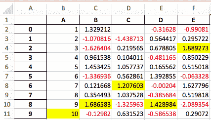

# 表格可视化

> 原文：[`pandas.pydata.org/docs/user_guide/style.html`](https://pandas.pydata.org/docs/user_guide/style.html)

本节演示使用 Styler 类可视化表格数据。有关使用图表进行可视化的信息，请参阅图表可视化。本文档是以 Jupyter Notebook 编写的，可在此处查看或下载[这里](https://nbviewer.org/github/pandas-dev/pandas/blob/main/doc/source/user_guide/style.ipynb)。

## Styler 对象和自定义显示

样式和输出显示定制应在对数据框中的数据进行处理**之后**执行。如果对数据框进行进一步更改，Styler**不会**动态更新。`DataFrame.style`属性是一个返回 Styler 对象的属性。它在其上定义了一个`_repr_html_`方法，因此在 Jupyter Notebook 中会自动呈现。

Styler，可用于大数据，但主要设计用于小数据，目前具有输出到以下格式的功能：

+   HTML

+   LaTeX

+   字符串（以及 CSV 扩展）

+   Excel

+   （JSON 目前不可用）

这些中的前三个具有设计用于格式化和自定义输出的显示定制方法。这些方法包括：

+   格式化数值、索引和列标题，使用.format()和.format_index()，

+   重命名索引或列标题标签，使用.relabel_index()

+   隐藏某些列、索引和/或列标题，或索引名称，使用.hide()

+   连接相似的数据框，使用.concat()

## 格式化显示

### 格式化数值

Styler 将*显示*值与*实际*值区分开，无论是数据值还是索引或列标题。为了控制显示值，文本在每个单元格中以字符串形式打印，我们可以使用.format()和.format_index()方法根据[格式规范字符串](https://docs.python.org/3/library/string.html#format-specification-mini-language)或接受单个值并返回字符串的可调用对象来操作这一点。可以为整个表格、索引或单独的列或 MultiIndex 级别定义此操作。我们还可以覆盖索引名称。

此外，格式化函数具有 **精度** 参数，专门用于帮助格式化浮点数，以及 **小数** 和 **千位分隔符** 以支持其他语言环境，一个 **na_rep** 参数用于显示缺失数据，以及一个 **escape** 和 **hyperlinks** 参数用于帮助显示安全的 HTML 或安全的 LaTeX。默认格式化程序配置为采用 pandas 的全局选项，如 `styler.format.precision` 选项，可使用 `with pd.option_context('format.precision', 2):` 进行控制。

```py
[2]: 
```

```py
import pandas as pd
import numpy as np
import matplotlib as mpl

df = pd.DataFrame({
    "strings": ["Adam", "Mike"],
    "ints": [1, 3],
    "floats": [1.123, 1000.23]
})
df.style \
  .format(precision=3, thousands=".", decimal=",") \
  .format_index(str.upper, axis=1) \
  .relabel_index(["row 1", "row 2"], axis=0) 
```

```py
[2]: 
```

|   | 字符串 | 整数 | 浮点数 |
| --- | --- | --- | --- |
| 第一行 | 亚当 | 1 | 1,123 |
| 第二行 | 迈克 | 3 | 1,000.230 |

使用 Styler 来操纵显示是一个有用的功能，因为保持索引和数据值用于其他目的可以提供更大的控制。您不必覆盖 DataFrame 来按照自己的喜好显示它。以下是一个更全面的示例，展示了在仍依赖底层数据进行索引和计算的情况下使用格式化函数。

```py
[3]: 
```

```py
weather_df = pd.DataFrame(np.random.rand(10,2)*5,
                          index=pd.date_range(start="2021-01-01", periods=10),
                          columns=["Tokyo", "Beijing"])

def rain_condition(v):
    if v < 1.75:
        return "Dry"
    elif v < 2.75:
        return "Rain"
    return "Heavy Rain"

def make_pretty(styler):
    styler.set_caption("Weather Conditions")
    styler.format(rain_condition)
    styler.format_index(lambda v: v.strftime("%A"))
    styler.background_gradient(axis=None, vmin=1, vmax=5, cmap="YlGnBu")
    return styler

weather_df 
```

```py
[3]: 
```

|  | 东京 | 北京 |
| --- | --- | --- |
| 2021-01-01 | 2.552517 | 1.976602 |
| 2021-01-02 | 1.665753 | 3.757927 |
| 2021-01-03 | 4.679882 | 2.242228 |
| 2021-01-04 | 1.268592 | 0.915911 |
| 2021-01-05 | 0.258386 | 4.647607 |
| 2021-01-06 | 1.279295 | 4.642458 |
| 2021-01-07 | 0.560487 | 3.670073 |
| 2021-01-08 | 0.980423 | 1.026641 |
| 2021-01-09 | 1.471664 | 1.384219 |
| 2021-01-10 | 4.617766 | 4.251794 |

```py
[4]: 
```

```py
weather_df.loc["2021-01-04":"2021-01-08"].style.pipe(make_pretty) 
```

```py
[4]: 
```

天气状况

|   | 东京 | 北京 |
| --- | --- | --- |
| 星期一 | 干燥 | 干燥 |
| 星期二 | 干燥 | 大雨 |
| 星期三 | 干燥 | 大雨 |
| 星期四 | 干燥 | 大雨 |
| 星期五 | 干燥 | 干燥 |

### 隐藏数据

索引和列标题可以完全隐藏，也可以选择要排除的行或列。这两个选项使用相同的方法执行。

可以通过调用 .hide() 而不带任何参数来隐藏索引以便渲染，如果您的索引是基于整数的，这可能很有用。同样，通过调用 .hide(axis=”columns”) 而不带任何其他参数可以隐藏列标题。

可以通过调用相同的 .hide() 方法并传入行/列标签、类似列表或行/列标签的切片来隐藏特定行或列以便渲染。

隐藏不会改变 CSS 类的整数排列，例如，隐藏 DataFrame 的前两列意味着列类索引仍将从 `col2` 开始，因为 `col0` 和 `col1` 简单地被忽略。

```py
[5]: 
```

```py
df = pd.DataFrame(np.random.randn(5, 5))
df.style \
  .hide(subset=[0, 2, 4], axis=0) \
  .hide(subset=[0, 2, 4], axis=1) 
```

```py
[5]: 
```

|   | 1 | 3 |
| --- | --- | --- |
| 1 | 0.561440 | -0.858225 |
| 3 | 0.176255 | 0.876609 |

要将功能反转为 **显示** 功能，最佳实践是组成一个隐藏项目的列表。

```py
[6]: 
```

```py
show = [0, 2, 4]
df.style \
  .hide([row for row in df.index if row not in show], axis=0) \
  .hide([col for col in df.columns if col not in show], axis=1) 
```

```py
[6]: 
```

|   | 0 | 2 | 4 |
| --- | --- | --- | --- |
| 0 | -0.056334 | -1.188982 | 0.482870 |
| 2 | -0.718731 | -0.499113 | -1.350023 |
| 4 | -0.720169 | 1.225336 | -0.512159 |

### 连接 DataFrame 输出

可以将两个或更多个样式化器连接在一起，前提是它们共享相同的列。这对于显示 DataFrame 的摘要统计信息非常有用，并经常与 DataFrame.agg 结合使用。

由于连接的对象是样式化器，它们可以独立进行样式设置，如下所示，它们的连接保留了这些样式。

```py
[7]: 
```

```py
summary_styler = df.agg(["sum", "mean"]).style \
                   .format(precision=3) \
                   .relabel_index(["Sum", "Average"])
df.style.format(precision=1).concat(summary_styler) 
```

```py
[7]: 
```

|   | 0 | 1 | 2 | 3 | 4 |
| --- | --- | --- | --- | --- | --- |
| 0 | -0.1 | 0.8 | -1.2 | 0.3 | 0.5 |
| 1 | 0.5 | 0.6 | 0.1 | -0.9 | 0.9 |
| 2 | -0.7 | -0.8 | -0.5 | 0.2 | -1.4 |
| 3 | 2.2 | 0.2 | 0.9 | 0.9 | 0.1 |
| 4 | -0.7 | -1.0 | 1.2 | -0.5 | -0.5 |
| 总和 | 1.179 | -0.213 | 0.506 | -0.082 | -0.430 |
| 平均值 | 0.236 | -0.043 | 0.101 | -0.016 | -0.086 |

## 样式化器对象和 HTML

样式化器最初是为了支持各种 HTML 格式选项而构建的。它的 HTML 输出创建了一个 HTML `<table>`，并利用 CSS 样式语言来操纵许多参数，包括颜色、字体、边框、背景等。查看[这里](https://www.w3schools.com/html/html_tables.asp)获取有关样式化 HTML 表格的更多信息。这使得在开箱即用的情况下具有很大的灵活性，甚至使 Web 开发人员能够将 DataFrame 集成到他们现有的用户界面设计中。

下面我们展示默认输出，看起来非常类似于标准 DataFrame HTML 表示。但是这里的 HTML 已经为每个单元格附加了一些 CSS 类，即使我们还没有创建任何样式。我们可以通过调用.to_html()方法来查看这些，该方法返回原始 HTML 字符串，这对于进一步处理或添加到文件中非常有用 - 请继续阅读有关 CSS 和 HTML 的更多信息。本节还将提供如何将此默认输出转换为更具沟通性的 DataFrame 输出的演示。例如我们如何构建`s`：

```py
[8]: 
```

```py
df = pd.DataFrame([[38.0, 2.0, 18.0, 22.0, 21, np.nan],[19, 439, 6, 452, 226,232]],
                  index=pd.Index(['Tumour (Positive)', 'Non-Tumour (Negative)'], name='Actual Label:'),
                  columns=pd.MultiIndex.from_product([['Decision Tree', 'Regression', 'Random'],['Tumour', 'Non-Tumour']], names=['Model:', 'Predicted:']))
df.style 
```

```py
[8]: 
```

| 模型: | 决策树 | 回归 | 随机 |
| --- | --- | --- |
| 预测: | 肿瘤 | 非肿瘤 | 肿瘤 | 非肿瘤 | 肿瘤 | 非肿瘤 |
| --- | --- | --- | --- | --- | --- | --- |
| 实际标签: |   |   |   |   |   |   |
| --- | --- | --- | --- | --- | --- | --- |
| 肿瘤（阳性） | 38.000000 | 2.000000 | 18.000000 | 22.000000 | 21 | nan |
| 非肿瘤（阴性） | 19.000000 | 439.000000 | 6.000000 | 452.000000 | 226 | 232.000000 |

```py
[10]: 
```

```py
s 
```

```py
[10]: 
```

多个癌症预测模型的混淆矩阵。

| 模型: | 决策树 | 回归 |
| --- | --- | --- |
| 预测: | 肿瘤 | 非肿瘤 | 肿瘤 | 非肿瘤 |
| --- | --- | --- | --- |
| 实际标签: |   |   |   |   |
| --- | --- | --- | --- | --- |
| 肿瘤（阳性） | 38 | 2 | 18 | 22 |
| 非肿瘤（阴性） | 19 | 439 | 6 | 452 |

我们采取的第一步是从 DataFrame 创建 Styler 对象，然后通过使用.hide()隐藏不需要的列来选择感兴趣的范围。

```py
[11]: 
```

```py
s = df.style.format('{:.0f}').hide([('Random', 'Tumour'), ('Random', 'Non-Tumour')], axis="columns")
s 
```

```py
[11]: 
```

| 模型： | 决策树 | 回归 |
| --- | --- | --- |
| 预测： | 肿瘤 | 非肿瘤 | 肿瘤 | 非肿瘤 |
| --- | --- | --- | --- | --- |
| 实际标签： |   |   |   |   |
| --- | --- | --- | --- | --- |
| 肿瘤（阳性） | 38 | 2 | 18 | 22 |
| 非肿瘤（阴性） | 19 | 439 | 6 | 452 |

## 添加样式的方法

有**3 种主要方法**可以向 Styler 添加自定义 CSS 样式：

+   使用.set_table_styles()来控制具有指定内部 CSS 的表格的更广泛区域。虽然表格样式允许灵活地添加控制表格所有各个部分的 CSS 选择器和属性，但对于单个单元格的规范来说，它们是笨重的。另外，请注意表格样式无法导出到 Excel。

+   使用.set_td_classes()直接将外部 CSS 类链接到数据单元格，或将由.set_table_styles()创建的内部 CSS 类链接。请参见这里。这些不能用于列标题行或索引，也无法导出到 Excel。

+   使用.apply()和.map()函数向特定数据单元格添加直接内部 CSS。请参见这里。从 v1.4.0 开始，还有直接作用于列标题行或索引的方法；.apply_index()和.map_index()。请注意，只有这些方法添加的样式才会导出到 Excel。这些方法的工作方式类似于 DataFrame.apply()和 DataFrame.map()。

## 表格样式

表格样式足够灵活，可以控制表格的所有各个部分，包括列标题和索引。然而，对于单个数据单元格或任何类型的条件格式化来说，它们可能会很笨重，因此我们建议表格样式用于广泛的样式设置，例如一次整行或整列。

表格样式还用于控制整个表格一次应用的功能，例如创建通用的悬停功能。`:hover` 伪选择器以及其他伪选择器只能以这种方式使用。

为了复制 CSS 选择器和属性（属性值对）的正常格式，���如

```py
tr:hover {
  background-color: #ffff99;
} 
```

传递样式给.set_table_styles()的必要格式是一个字典列表，每个字典包含一个 CSS 选择器标签和 CSS 属性。属性可以是一个 2 元组列表，也可以是一个常规的 CSS 字符串，例如：

```py
[13]: 
```

```py
cell_hover = {  # for row hover use <tr> instead of <td>
    'selector': 'td:hover',
    'props': [('background-color', '#ffffb3')]
}
index_names = {
    'selector': '.index_name',
    'props': 'font-style: italic; color: darkgrey; font-weight:normal;'
}
headers = {
    'selector': 'th:not(.index_name)',
    'props': 'background-color: #000066; color: white;'
}
s.set_table_styles([cell_hover, index_names, headers]) 
```

```py
[13]: 
```

| 模型： | 决策树 | 回归 |
| --- | --- | --- |
| 预测： | 肿瘤 | 非肿瘤 | 肿瘤 | 非肿瘤 |
| --- | --- | --- | --- | --- |
| 实际标签： |   |   |   |   |
| --- | --- | --- | --- | --- |
| 肿瘤（阳性） | 38 | 2 | 18 | 22 |
| 非肿瘤（阴性） | 19 | 439 | 6 | 452 |

接下来，我们只需添加几个针对表格特定部分的样式化元素。在这里要小心，因为我们正在*链接方法*，我们需要明确指示方法**不要**`覆盖`现有样式。

```py
[15]: 
```

```py
s.set_table_styles([
    {'selector': 'th.col_heading', 'props': 'text-align: center;'},
    {'selector': 'th.col_heading.level0', 'props': 'font-size: 1.5em;'},
    {'selector': 'td', 'props': 'text-align: center; font-weight: bold;'},
], overwrite=False) 
```

```py
[15]: 
```

| 模型： | 决策树 | 回归 |
| --- | --- | --- |
| 预测： | 肿瘤 | 非肿瘤 | 肿瘤 | 非肿瘤 |
| --- | --- | --- | --- | --- |
| 实际标签： |   |   |   |   |
| --- | --- | --- | --- | --- |
| 肿瘤（阳性） | 38 | 2 | 18 | 22 |
| 非肿瘤（阴性） | 19 | 439 | 6 | 452 |

作为一个便利方法（*自版本 1.2.0 起*），我们还可以将一个**字典**传递给.set_table_styles()，其中包含行或列键。在幕后，Styler 只是索引键并根据需要向给定的 CSS 选择器添加相关的`.col<m>`或`.row<n>`类。

```py
[17]: 
```

```py
s.set_table_styles({
    ('Regression', 'Tumour'): [{'selector': 'th', 'props': 'border-left: 1px solid white'},
                               {'selector': 'td', 'props': 'border-left: 1px solid #000066'}]
}, overwrite=False, axis=0) 
```

```py
[17]: 
```

| 模型： | 决策树 | 回归 |
| --- | --- | --- |
| 预测： | 肿瘤 | 非肿瘤 | 肿瘤 | 非肿瘤 |
| --- | --- | --- | --- | --- |
| 实际标签： |   |   |   |   |
| --- | --- | --- | --- | --- |
| 肿瘤（阳性） | 38 | 2 | 18 | 22 |
| 非肿瘤（阴性） | 19 | 439 | 6 | 452 |

## 设置类和链接到外部 CSS

如果您设计了一个网站，那么很可能您已经有一个控制其中表格和单元格对象样式的外部 CSS 文件。您可能希望使用这些原生文件，而不是在 Python 中重复所�� CSS（和重复任何维护工作）。

### 表属性

使用.set_table_attributes()非常容易向主`<table>`添加一个`class`。该方法还可以附加内联样式 - 在 CSS 层次结构中了解更多。

```py
[19]: 
```

```py
out = s.set_table_attributes('class="my-table-cls"').to_html()
print(out[out.find('<table'):][:109]) 
```

```py
<table id="T_xyz01" class="my-table-cls">
  <thead>
    <tr>
      <th class="index_name level0" >Model:</th>

```

### 数据单元格 CSS 类

*版本 1.2.0 中的新功能*

.set_td_classes()方法接受一个与底层 Styler 的 DataFrame 匹配的 DataFrame。该 DataFrame 将包含作为 css 类的字符串，添加到单个数据单元格中：`<table>`的`<td>`元素。我们将在工具提示部分添加边框。

```py
[20]: 
```

```py
s.set_table_styles([  # create internal CSS classes
    {'selector': '.true', 'props': 'background-color: #e6ffe6;'},
    {'selector': '.false', 'props': 'background-color: #ffe6e6;'},
], overwrite=False)
cell_color = pd.DataFrame([['true ', 'false ', 'true ', 'false '],
                           ['false ', 'true ', 'false ', 'true ']],
                          index=df.index,
                          columns=df.columns[:4])
s.set_td_classes(cell_color) 
```

```py
[20]: 
```

| 模型： | 决策树 | 回归 |
| --- | --- | --- |
| 预测： | 肿瘤 | 非肿瘤 | 肿瘤 | 非肿瘤 |
| --- | --- | --- | --- | --- |
| 实际标签： |   |   |   |   |
| --- | --- | --- | --- | --- |
| 肿瘤（阳性） | 38 | 2 | 18 | 22 |
| 非肿瘤（阴性） | 19 | 439 | 6 | 452 |

## 样式函数

### 处理数据

我们使用以下方法传递您的样式函数。这两种方法都接受一个函数（和一些其他关键字参数）并以某种方式应用于 DataFrame，呈现 CSS 样式。

+   .map()（逐元素）：接受一个接受单个值并返回带有 CSS 属性-值对的字符串的函数。

+   .apply()（按列/行/表格方式）：接受一个接受 Series 或 DataFrame 并返回具有相同形状的 Series、DataFrame 或 numpy 数组的函数，其中每个元素都是带有 CSS 属性-值对的字符串。此方法根据`axis`关键字参数一次传递您的 DataFrame 的每一列或行或整个表格。对于按列使用`axis=0`，按行使用`axis=1`，对于一次使用整个表格使用`axis=None`。

这种方法非常适用于对数据单元格应用多个复杂逻辑。我们创建一个新的 DataFrame 来演示这一点。

```py
[22]: 
```

```py
np.random.seed(0)
df2 = pd.DataFrame(np.random.randn(10,4), columns=['A','B','C','D'])
df2.style 
```

```py
[22]: 
```

|   | A | B | C | D |
| --- | --- | --- | --- | --- |
| 0 | 1.764052 | 0.400157 | 0.978738 | 2.240893 |
| 1 | 1.867558 | -0.977278 | 0.950088 | -0.151357 |
| 2 | -0.103219 | 0.410599 | 0.144044 | 1.454274 |
| 3 | 0.761038 | 0.121675 | 0.443863 | 0.333674 |
| 4 | 1.494079 | -0.205158 | 0.313068 | -0.854096 |
| 5 | -2.552990 | 0.653619 | 0.864436 | -0.742165 |
| 6 | 2.269755 | -1.454366 | 0.045759 | -0.187184 |
| 7 | 1.532779 | 1.469359 | 0.154947 | 0.378163 |
| 8 | -0.887786 | -1.980796 | -0.347912 | 0.156349 |
| 9 | 1.230291 | 1.202380 | -0.387327 | -0.302303 |

例如，我们可以构建一个函数，如果文本为负数则着色，并将其与部分淡化微不足道值的单元格的函数链接起来。由于这是逐个元素查看，我们使用`map`。

```py
[23]: 
```

```py
def style_negative(v, props=''):
    return props if v < 0 else None
s2 = df2.style.map(style_negative, props='color:red;')\
              .map(lambda v: 'opacity: 20%;' if (v < 0.3) and (v > -0.3) else None)
s2 
```

```py
[23]: 
```

|   | A | B | C | D |
| --- | --- | --- | --- | --- |
| 0 | 1.764052 | 0.400157 | 0.978738 | 2.240893 |
| 1 | 1.867558 | -0.977278 | 0.950088 | -0.151357 |
| 2 | -0.103219 | 0.410599 | 0.144044 | 1.454274 |
| 3 | 0.761038 | 0.121675 | 0.443863 | 0.333674 |
| 4 | 1.494079 | -0.205158 | 0.313068 | -0.854096 |
| 5 | -2.552990 | 0.653619 | 0.864436 | -0.742165 |
| 6 | 2.269755 | -1.454366 | 0.045759 | -0.187184 |
| 7 | 1.532779 | 1.469359 | 0.154947 | 0.378163 |
| 8 | -0.887786 | -1.980796 | -0.347912 | 0.156349 |
| 9 | 1.230291 | 1.202380 | -0.387327 | -0.302303 |

我们还可以构建一个函数，一次突出显示行、列和整个 DataFrame 中的最大值。在这种情况下，我们使用`apply`。下面我们突出显示列中的最大值。

```py
[25]: 
```

```py
def highlight_max(s, props=''):
    return np.where(s == np.nanmax(s.values), props, '')
s2.apply(highlight_max, props='color:white;background-color:darkblue', axis=0) 
```

```py
[25]: 
```

|   | A | B | C | D |
| --- | --- | --- | --- | --- |
| 0 | 1.764052 | 0.400157 | 0.978738 | 2.240893 |
| 1 | 1.867558 | -0.977278 | 0.950088 | -0.151357 |
| 2 | -0.103219 | 0.410599 | 0.144044 | 1.454274 |
| 3 | 0.761038 | 0.121675 | 0.443863 | 0.333674 |
| 4 | 1.494079 | -0.205158 | 0.313068 | -0.854096 |
| 5 | -2.552990 | 0.653619 | 0.864436 | -0.742165 |
| 6 | 2.269755 | -1.454366 | 0.045759 | -0.187184 |
| 7 | 1.532779 | 1.469359 | 0.154947 | 0.378163 |
| 8 | -0.887786 | -1.980796 | -0.347912 | 0.156349 |
| 9 | 1.230291 | 1.202380 | -0.387327 | -0.302303 |

我们可以在不同的轴上使用相同的函数，这里将 DataFrame 的最大值标记为紫色，行最大值标记为粉色。

```py
[27]: 
```

```py
s2.apply(highlight_max, props='color:white;background-color:pink;', axis=1)\
  .apply(highlight_max, props='color:white;background-color:purple', axis=None) 
```

```py
[27]: 
```

|   | A | B | C | D |
| --- | --- | --- | --- | --- |
| 0 | 1.764052 | 0.400157 | 0.978738 | 2.240893 |
| 1 | 1.867558 | -0.977278 | 0.950088 | -0.151357 |
| 2 | -0.103219 | 0.410599 | 0.144044 | 1.454274 |
| 3 | 0.761038 | 0.121675 | 0.443863 | 0.333674 |
| 4 | 1.494079 | -0.205158 | 0.313068 | -0.854096 |
| 5 | -2.552990 | 0.653619 | 0.864436 | -0.742165 |
| 6 | 2.269755 | -1.454366 | 0.045759 | -0.187184 |
| 7 | 1.532779 | 1.469359 | 0.154947 | 0.378163 |
| 8 | -0.887786 | -1.980796 | -0.347912 | 0.156349 |
| 9 | 1.230291 | 1.202380 | -0.387327 | -0.302303 |

最后一个示例显示了某些样式被其他样式覆盖的情况。通常，最近应用的样式是活动的，但您可以在 CSS 层次结构部分中了解更多信息。您还可以将这些样式应用于 DataFrame 的更细粒度部分 - 请阅读子集切片部分了解更多信息。

可以仅使用类来复制某些功能，但可能会更加繁琐。请参阅优化的第 3) 项

*调试提示*: 如果你在编写样式函数时遇到困难，尝试将其直接传递给`DataFrame.apply`。在内部，`Styler.apply`使用`DataFrame.apply`，因此结果应该是相同的，并且使用`DataFrame.apply`，您将能够检查每个单元格中预期函数的 CSS 字符串输出。

### 操作索引和列标题

通过使用以下方式实现标题的类似应用：

+   .map_index()（逐元素）：接受一个接受单个值并返回具有 CSS 属性-值对的字符串的函数。 

+   .apply_index()（逐级）：接受一个接受 Series 并返回具有相同形状的 Series 或 numpy 数组的函数，其中每个元素都是具有 CSS 属性-值对的字符串。此方法逐个传递您的索引的每个级别。要为索引设置样式，请使用`axis=0`，要为列标题设置样式，请使用`axis=1`。

您可以选择`MultiIndex`的`level`，但目前这些方法没有类似的`subset`应用程序可用。

```py
[29]: 
```

```py
s2.map_index(lambda v: "color:pink;" if v>4 else "color:darkblue;", axis=0)
s2.apply_index(lambda s: np.where(s.isin(["A", "B"]), "color:pink;", "color:darkblue;"), axis=1) 
```

```py
[29]: 
```

|   | A | B | C | D |
| --- | --- | --- | --- | --- |
| 0 | 1.764052 | 0.400157 | 0.978738 | 2.240893 |
| 1 | 1.867558 | -0.977278 | 0.950088 | -0.151357 |
| 2 | -0.103219 | 0.410599 | 0.144044 | 1.454274 |
| 3 | 0.761038 | 0.121675 | 0.443863 | 0.333674 |
| 4 | 1.494079 | -0.205158 | 0.313068 | -0.854096 |
| 5 | -2.552990 | 0.653619 | 0.864436 | -0.742165 |
| 6 | 2.269755 | -1.454366 | 0.045759 | -0.187184 |
| 7 | 1.532779 | 1.469359 | 0.154947 | 0.378163 |
| 8 | -0.887786 | -1.980796 | -0.347912 | 0.156349 |
| 9 | 1.230291 | 1.202380 | -0.387327 | -0.302303 |

## 工具提示和标题

可以使用.set_caption()方法添加表格标题。您可以使用表格样式来控制与标题相关的 CSS。

```py
[30]: 
```

```py
s.set_caption("Confusion matrix for multiple cancer prediction models.")\
 .set_table_styles([{
     'selector': 'caption',
     'props': 'caption-side: bottom; font-size:1.25em;'
 }], overwrite=False) 
```

```py
[30]: 
```

多种癌症预测模型的混淆矩阵。

| 模型： | 决策树 | 回归 |
| --- | --- | --- |
| 预测： | 肿瘤 | 非肿瘤 | 肿瘤 | 非肿瘤 |
| --- | --- | --- | --- | --- |
| 实际标签： |   |   |   |   |
| --- | --- | --- | --- | --- |
| 肿瘤（阳性） | 38 | 2 | 18 | 22 |
| 非肿瘤（阴性） | 19 | 439 | 6 | 452 |

添加工具提示（*自版本 1.3.0 起*）可以使用.set_tooltips()方法来完成，方式与您可以通过提供基于字符串的 DataFrame 添加 CSS 类到数据单元格的方式相同。您不必为工具提示指定`css_class`名称或任何 css`props`，因为有标准默认值，但如果您想要更多的视觉控制，可以选择这样做。

```py
[32]: 
```

```py
tt = pd.DataFrame([['This model has a very strong true positive rate',
                    "This model's total number of false negatives is too high"]],
                  index=['Tumour (Positive)'], columns=df.columns[[0,3]])
s.set_tooltips(tt, props='visibility: hidden; position: absolute; z-index: 1; border: 1px solid #000066;'
                         'background-color: white; color: #000066; font-size: 0.8em;'
                         'transform: translate(0px, -24px); padding: 0.6em; border-radius: 0.5em;') 
```

```py
[32]: 
```

多种癌症预测模型的混淆矩阵。

| 模型： | 决策树 | 回归 |
| --- | --- | --- |
| 预测： | 肿瘤 | 非肿瘤 | 肿瘤 | 非肿瘤 |
| --- | --- | --- | --- | --- |
| 实际标签： |   |   |   |   |
| --- | --- | --- | --- | --- |
| 肿瘤（阳性） | 38 | 2 | 18 | 22 |
| 非肿瘤（阴性） | 19 | 439 | 6 | 452 |

我们表格中唯一剩下的事情是添加突出显示的边框，以吸引观众注意工具提示。我们将像以前一样使用表格样式创建内部 CSS 类。**设置类总是覆盖**，因此我们需要确保添加先前的类。

```py
[34]: 
```

```py
s.set_table_styles([  # create internal CSS classes
    {'selector': '.border-red', 'props': 'border: 2px dashed red;'},
    {'selector': '.border-green', 'props': 'border: 2px dashed green;'},
], overwrite=False)
cell_border = pd.DataFrame([['border-green ', ' ', ' ', 'border-red '],
                           [' ', ' ', ' ', ' ']],
                          index=df.index,
                          columns=df.columns[:4])
s.set_td_classes(cell_color + cell_border) 
```

```py
[34]: 
```

多种癌症预测模型的混淆矩阵。

| 模型： | 决策树 | 回归 |
| --- | --- | --- |
| 预测： | 肿瘤 | 非肿瘤 | 肿瘤 | 非肿瘤 |
| --- | --- | --- | --- | --- |
| 实际标签： |   |   |   |   |
| --- | --- | --- | --- | --- |
| 肿瘤（阳性） | 38 | 2 | 18 | 22 |
| 非肿瘤（阴性） | 19 | 439 | 6 | 452 |

## 使用切片进行更精细的控制

到目前为止，我们展示的`Styler.apply`和`Styler.map`函数示例尚未展示`subset`参数的使用。这是一个很有用的参数，它允许您灵活地应用样式到特定的行或列，而无需将该逻辑编码到您的`style`函数中。

传递给`subset`的值类似于对 DataFrame 进行切片；

+   将标量视为列标签

+   将列表（或 Series 或 NumPy 数组）视为多列标签

+   元组被视为`(行索引器，列索引器)`

考虑使用`pd.IndexSlice`构建最后一个元组。我们将创建一个 MultiIndexed DataFrame 来展示功能。

```py
[36]: 
```

```py
df3 = pd.DataFrame(np.random.randn(4,4),
                   pd.MultiIndex.from_product([['A', 'B'], ['r1', 'r2']]),
                   columns=['c1','c2','c3','c4'])
df3 
```

```py
[36]: 
```

|  |  | c1 | c2 | c3 | c4 |
| --- | --- | --- | --- | --- | --- |
| A | r1 | -1.048553 | -1.420018 | -1.706270 | 1.950775 |
| r2 | -0.509652 | -0.438074 | -1.252795 | 0.777490 |
| B | r1 | -1.613898 | -0.212740 | -0.895467 | 0.386902 |
| r2 | -0.510805 | -1.180632 | -0.028182 | 0.428332 |

我们将使用子集来用红色文字突出显示第三和第四列中的最大值。我们将用黄色突出显示切片区域。

```py
[37]: 
```

```py
slice_ = ['c3', 'c4']
df3.style.apply(highlight_max, props='color:red;', axis=0, subset=slice_)\
         .set_properties(**{'background-color': '#ffffb3'}, subset=slice_) 
```

```py
[37]: 
```

|   |   | c1 | c2 | c3 | c4 |
| --- | --- | --- | --- | --- | --- |
| A | r1 | -1.048553 | -1.420018 | -1.706270 | 1.950775 |
| r2 | -0.509652 | -0.438074 | -1.252795 | 0.777490 |
| B | r1 | -1.613898 | -0.212740 | -0.895467 | 0.386902 |
| r2 | -0.510805 | -1.180632 | -0.028182 | 0.428332 |

如果建议结合`IndexSlice`使用，则可以更灵活地跨越两个维度进行索引。

```py
[38]: 
```

```py
idx = pd.IndexSlice
slice_ = idx[idx[:,'r1'], idx['c2':'c4']]
df3.style.apply(highlight_max, props='color:red;', axis=0, subset=slice_)\
         .set_properties(**{'background-color': '#ffffb3'}, subset=slice_) 
```

```py
[38]: 
```

|   |   | c1 | c2 | c3 | c4 |
| --- | --- | --- | --- | --- | --- |
| A | r1 | -1.048553 | -1.420018 | -1.706270 | 1.950775 |
| r2 | -0.509652 | -0.438074 | -1.252795 | 0.777490 |
| B | r1 | -1.613898 | -0.212740 | -0.895467 | 0.386902 |
| r2 | -0.510805 | -1.180632 | -0.028182 | 0.428332 |

这也提供了在与`axis=1`一起使用时对行进行子选择的灵活性。

```py
[39]: 
```

```py
slice_ = idx[idx[:,'r2'], :]
df3.style.apply(highlight_max, props='color:red;', axis=1, subset=slice_)\
         .set_properties(**{'background-color': '#ffffb3'}, subset=slice_) 
```

```py
[39]: 
```

|   |   | c1 | c2 | c3 | c4 |
| --- | --- | --- | --- | --- | --- |
| A | r1 | -1.048553 | -1.420018 | -1.706270 | 1.950775 |
| r2 | -0.509652 | -0.438074 | -1.252795 | 0.777490 |
| B | r1 | -1.613898 | -0.212740 | -0.895467 | 0.386902 |
| r2 | -0.510805 | -1.180632 | -0.028182 | 0.428332 |

还有提供**条件过滤**的空间。

假设我们想要突出显示仅在第 2 和第 4 列中的最大值，前提是第 1 和第 3 列的总和小于-2.0 *(基本上排除行* `(:,'r2')`*)*。

```py
[40]: 
```

```py
slice_ = idx[idx[(df3['c1'] + df3['c3']) < -2.0], ['c2', 'c4']]
df3.style.apply(highlight_max, props='color:red;', axis=1, subset=slice_)\
         .set_properties(**{'background-color': '#ffffb3'}, subset=slice_) 
```

```py
[40]: 
```

|   |   | c1 | c2 | c3 | c4 |
| --- | --- | --- | --- | --- | --- |
| A | r1 | -1.048553 | -1.420018 | -1.706270 | 1.950775 |
| r2 | -0.509652 | -0.438074 | -1.252795 | 0.777490 |
| B | r1 | -1.613898 | -0.212740 | -0.895467 | 0.386902 |
| r2 | -0.510805 | -1.180632 | -0.028182 | 0.428332 |

目前仅支持基于标签的切片，不支持位置的切片，也不支持可调用对象。

如果您的样式函数使用了`subset`或`axis`关键字参数，请考虑将函数包装在`functools.partial`中，部分化该关键字。

```py
my_func2 = functools.partial(my_func, subset=42) 
```

## 优化

通常，对于较小的表格和大多数情况，渲染的 HTML 不需要优化，我们并不真正推荐这样做。有两种情况值得考虑：

+   如果您正在渲染和设计一个非常大的 HTML 表格，某些浏览器可能会出现性能问题。

+   如果您正在使用`Styler`动态创建在线用户界面的一部分，并希望提高网络性能。

在这里，我们建议采取以下步骤来实施：

### 1\. 移除 UUID 和 cell_ids

忽略 `uuid` 并将 `cell_ids` 设置为 `False`。这将防止不必要的 HTML。

这是次优的：

```py
[41]: 
```

```py
df4 = pd.DataFrame([[1,2],[3,4]])
s4 = df4.style 
```

这是更好的：

```py
[42]: 
```

```py
from pandas.io.formats.style import Styler
s4 = Styler(df4, uuid_len=0, cell_ids=False) 
```

### 2\. 使用表格样式

使用表格样式是可能的（例如，一次为所有单元格或行或列），因为 CSS 几乎总是比其他格式更有效。

这是次优的：

```py
[43]: 
```

```py
props = 'font-family: "Times New Roman", Times, serif; color: #e83e8c; font-size:1.3em;'
df4.style.map(lambda x: props, subset=[1]) 
```

```py
[43]: 
```

|   | 0 | 1 |
| --- | --- | --- |
| 0 | 1 | 2 |
| 1 | 3 | 4 |

这是更好的：

```py
[44]: 
```

```py
df4.style.set_table_styles([{'selector': 'td.col1', 'props': props}]) 
```

```py
[44]: 
```

|   | 0 | 1 |
| --- | --- | --- |
| 0 | 1 | 2 |
| 1 | 3 | 4 |

### 3\. 设置类而不是使用 Styler 函数

对于大型数据框，其中许多单元格应用相同的样式，将样式声明为类并将这些类应用于数据单元格可能更有效，而不是直接应用样式于单元格。然而，当您不关心优化时，使用 Styler 函数 api 可能仍然更容易。

这是次优的：

```py
[45]: 
```

```py
df2.style.apply(highlight_max, props='color:white;background-color:darkblue;', axis=0)\
         .apply(highlight_max, props='color:white;background-color:pink;', axis=1)\
         .apply(highlight_max, props='color:white;background-color:purple', axis=None) 
```

```py
[45]: 
```

|   | A | B | C | D |
| --- | --- | --- | --- | --- |
| 0 | 1.764052 | 0.400157 | 0.978738 | 2.240893 |
| 1 | 1.867558 | -0.977278 | 0.950088 | -0.151357 |
| 2 | -0.103219 | 0.410599 | 0.144044 | 1.454274 |
| 3 | 0.761038 | 0.121675 | 0.443863 | 0.333674 |
| 4 | 1.494079 | -0.205158 | 0.313068 | -0.854096 |
| 5 | -2.552990 | 0.653619 | 0.864436 | -0.742165 |
| 6 | 2.269755 | -1.454366 | 0.045759 | -0.187184 |
| 7 | 1.532779 | 1.469359 | 0.154947 | 0.378163 |
| 8 | -0.887786 | -1.980796 | -0.347912 | 0.156349 |
| 9 | 1.230291 | 1.202380 | -0.387327 | -0.302303 |

这是更好的：

```py
[46]: 
```

```py
build = lambda x: pd.DataFrame(x, index=df2.index, columns=df2.columns)
cls1 = build(df2.apply(highlight_max, props='cls-1 ', axis=0))
cls2 = build(df2.apply(highlight_max, props='cls-2 ', axis=1, result_type='expand').values)
cls3 = build(highlight_max(df2, props='cls-3 '))
df2.style.set_table_styles([
    {'selector': '.cls-1', 'props': 'color:white;background-color:darkblue;'},
    {'selector': '.cls-2', 'props': 'color:white;background-color:pink;'},
    {'selector': '.cls-3', 'props': 'color:white;background-color:purple;'}
]).set_td_classes(cls1 + cls2 + cls3) 
```

```py
[46]: 
```

|   | A | B | C | D |
| --- | --- | --- | --- | --- |
| 0 | 1.764052 | 0.400157 | 0.978738 | 2.240893 |
| 1 | 1.867558 | -0.977278 | 0.950088 | -0.151357 |
| 2 | -0.103219 | 0.410599 | 0.144044 | 1.454274 |
| 3 | 0.761038 | 0.121675 | 0.443863 | 0.333674 |
| 4 | 1.494079 | -0.205158 | 0.313068 | -0.854096 |
| 5 | -2.552990 | 0.653619 | 0.864436 | -0.742165 |
| 6 | 2.269755 | -1.454366 | 0.045759 | -0.187184 |
| 7 | 1.532779 | 1.469359 | 0.154947 | 0.378163 |
| 8 | -0.887786 | -1.980796 | -0.347912 | 0.156349 |
| 9 | 1.230291 | 1.202380 | -0.387327 | -0.302303 |

### 4\. 不要使用工具提示

工具提示需要 `cell_ids` 来工作，并为 *每个* 数据单元格生成额外的 HTML 元素。

### 5\. 如果每个字节都很重要，请使用字符串替换

您可以删除不必要的 HTML，或通过替换默认的 CSS 字典来缩短默认类名。您可以在下面阅读更多关于 CSS 的信息。

```py
[47]: 
```

```py
my_css = {
    "row_heading": "",
    "col_heading": "",
    "index_name": "",
    "col": "c",
    "row": "r",
    "col_trim": "",
    "row_trim": "",
    "level": "l",
    "data": "",
    "blank": "",
}
html = Styler(df4, uuid_len=0, cell_ids=False)
html.set_table_styles([{'selector': 'td', 'props': props},
                       {'selector': '.c1', 'props': 'color:green;'},
                       {'selector': '.l0', 'props': 'color:blue;'}],
                      css_class_names=my_css)
print(html.to_html()) 
```

```py
<style type="text/css">
#T_ td {
  font-family: "Times New Roman", Times, serif;
  color: #e83e8c;
  font-size: 1.3em;
}
#T_ .c1 {
  color: green;
}
#T_ .l0 {
  color: blue;
}
</style>
<table id="T_">
  <thead>
    <tr>
      <th class=" l0" >&nbsp;</th>
      <th class=" l0 c0" >0</th>
      <th class=" l0 c1" >1</th>
    </tr>
  </thead>
  <tbody>
    <tr>
      <th class=" l0 r0" >0</th>
      <td class=" r0 c0" >1</td>
      <td class=" r0 c1" >2</td>
    </tr>
    <tr>
      <th class=" l0 r1" >1</th>
      <td class=" r1 c0" >3</td>
      <td class=" r1 c1" >4</td>
    </tr>
  </tbody>
</table>

```

```py
[48]: 
```

```py
html 
```

```py
[48]: 
```

|   | 0 | 1 |
| --- | --- | --- |
| 0 | 1 | 2 |
| 1 | 3 | 4 |

## 内置样式

一些样式函数是如此常见，以至于我们已经“内置”到 `Styler` 中，因此您不必自己编写并应用它们。当前这些函数的列表如下：

+   .highlight_null：用于识别缺失数据。

+   .highlight_min 和 .highlight_max：用于识别数据中的极值。

+   .highlight_between 和 .highlight_quantile: 用于识别数据中的类别。

+   .background_gradient: 基于数值范围高亮单元格的灵活方法。

+   .text_gradient: 基于数值范围高亮文本的类似方法。

+   .bar: 在单元格背景中显示迷你图表。

每个函数的个别文档通常会提供更多关于它们参数的示例。

### 高亮空值

```py
[49]: 
```

```py
df2.iloc[0,2] = np.nan
df2.iloc[4,3] = np.nan
df2.loc[:4].style.highlight_null(color='yellow') 
```

```py
[49]: 
```

|   | A | B | C | D |
| --- | --- | --- | --- | --- |
| 0 | 1.764052 | 0.400157 | nan | 2.240893 |
| 1 | 1.867558 | -0.977278 | 0.950088 | -0.151357 |
| 2 | -0.103219 | 0.410599 | 0.144044 | 1.454274 |
| 3 | 0.761038 | 0.121675 | 0.443863 | 0.333674 |
| 4 | 1.494079 | -0.205158 | 0.313068 | nan |

### 高亮最小值或最大值

```py
[50]: 
```

```py
df2.loc[:4].style.highlight_max(axis=1, props='color:white; font-weight:bold; background-color:darkblue;') 
```

```py
[50]: 
```

|   | A | B | C | D |
| --- | --- | --- | --- | --- |
| 0 | 1.764052 | 0.400157 | nan | 2.240893 |
| 1 | 1.867558 | -0.977278 | 0.950088 | -0.151357 |
| 2 | -0.103219 | 0.410599 | 0.144044 | 1.454274 |
| 3 | 0.761038 | 0.121675 | 0.443863 | 0.333674 |
| 4 | 1.494079 | -0.205158 | 0.313068 | nan |

### 高亮区间

该方法接受浮点数范围，或者索引匹配的 NumPy 数组或 Series。

```py
[51]: 
```

```py
left = pd.Series([1.0, 0.0, 1.0], index=["A", "B", "D"])
df2.loc[:4].style.highlight_between(left=left, right=1.5, axis=1, props='color:white; background-color:purple;') 
```

```py
[51]: 
```

|   | A | B | C | D |
| --- | --- | --- | --- | --- |
| 0 | 1.764052 | 0.400157 | nan | 2.240893 |
| 1 | 1.867558 | -0.977278 | 0.950088 | -0.151357 |
| 2 | -0.103219 | 0.410599 | 0.144044 | 1.454274 |
| 3 | 0.761038 | 0.121675 | 0.443863 | 0.333674 |
| 4 | 1.494079 | -0.205158 | 0.313068 | nan |

### 高亮分位数

用于检测最高或最低百分位值

```py
[52]: 
```

```py
df2.loc[:4].style.highlight_quantile(q_left=0.85, axis=None, color='yellow') 
```

```py
[52]: 
```

|   | A | B | C | D |
| --- | --- | --- | --- | --- |
| 0 | 1.764052 | 0.400157 | nan | 2.240893 |
| 1 | 1.867558 | -0.977278 | 0.950088 | -0.151357 |
| 2 | -0.103219 | 0.410599 | 0.144044 | 1.454274 |
| 3 | 0.761038 | 0.121675 | 0.443863 | 0.333674 |
| 4 | 1.494079 | -0.205158 | 0.313068 | nan |

### 背景渐变和文本渐变

你可以使用 `background_gradient` 和 `text_gradient` 方法创建“热图”。这需要 matplotlib，我们将使用 [Seaborn](http://seaborn.pydata.org/) 来获得漂亮的颜色映射。

```py
[53]: 
```

```py
import seaborn as sns
cm = sns.light_palette("green", as_cmap=True)

df2.style.background_gradient(cmap=cm) 
```

```py
[53]: 
```

|   | A | B | C | D |
| --- | --- | --- | --- | --- |
| 0 | 1.764052 | 0.400157 | nan | 2.240893 |
| 1 | 1.867558 | -0.977278 | 0.950088 | -0.151357 |
| 2 | -0.103219 | 0.410599 | 0.144044 | 1.454274 |
| 3 | 0.761038 | 0.121675 | 0.443863 | 0.333674 |
| 4 | 1.494079 | -0.205158 | 0.313068 | nan |
| 5 | -2.552990 | 0.653619 | 0.864436 | -0.742165 |
| 6 | 2.269755 | -1.454366 | 0.045759 | -0.187184 |
| 7 | 1.532779 | 1.469359 | 0.154947 | 0.378163 |
| 8 | -0.887786 | -1.980796 | -0.347912 | 0.156349 |
| 9 | 1.230291 | 1.202380 | -0.387327 | -0.302303 |

```py
[54]: 
```

```py
df2.style.text_gradient(cmap=cm) 
```

```py
[54]: 
```

|   | A | B | C | D |
| --- | --- | --- | --- | --- |
| 0 | 1.764052 | 0.400157 | nan | 2.240893 |
| 1 | 1.867558 | -0.977278 | 0.950088 | -0.151357 |
| 2 | -0.103219 | 0.410599 | 0.144044 | 1.454274 |
| 3 | 0.761038 | 0.121675 | 0.443863 | 0.333674 |
| 4 | 1.494079 | -0.205158 | 0.313068 | nan |
| 5 | -2.552990 | 0.653619 | 0.864436 | -0.742165 |
| 6 | 2.269755 | -1.454366 | 0.045759 | -0.187184 |
| 7 | 1.532779 | 1.469359 | 0.154947 | 0.378163 |
| 8 | -0.887786 | -1.980796 | -0.347912 | 0.156349 |
| 9 | 1.230291 | 1.202380 | -0.387327 | -0.302303 |

.背景渐变 和 .文本渐变 有许多关键字参数可用于自定义渐变和颜色。请参阅文档。

### 设置属性

当样式实际上不依赖于值时，请使用 `Styler.set_properties`。这只是一个简单的 `.map` 的包装器，其中函数为所有单元格返回相同的属性。

```py
[55]: 
```

```py
df2.loc[:4].style.set_properties(**{'background-color': 'black',
                           'color': 'lawngreen',
                           'border-color': 'white'}) 
```

```py
[55]: 
```

|   | A | B | C | D |
| --- | --- | --- | --- | --- |
| 0 | 1.764052 | 0.400157 | nan | 2.240893 |
| 1 | 1.867558 | -0.977278 | 0.950088 | -0.151357 |
| 2 | -0.103219 | 0.410599 | 0.144044 | 1.454274 |
| 3 | 0.761038 | 0.121675 | 0.443863 | 0.333674 |
| 4 | 1.494079 | -0.205158 | 0.313068 | nan |

### 条形图

您可以在 DataFrame 中包含“条形图”。

```py
[56]: 
```

```py
df2.style.bar(subset=['A', 'B'], color='#d65f5f') 
```

```py
[56]: 
```

|   | A | B | C | D |
| --- | --- | --- | --- | --- |
| 0 | 1.764052 | 0.400157 | nan | 2.240893 |
| 1 | 1.867558 | -0.977278 | 0.950088 | -0.151357 |
| 2 | -0.103219 | 0.410599 | 0.144044 | 1.454274 |
| 3 | 0.761038 | 0.121675 | 0.443863 | 0.333674 |
| 4 | 1.494079 | -0.205158 | 0.313068 | nan |
| 5 | -2.552990 | 0.653619 | 0.864436 | -0.742165 |
| 6 | 2.269755 | -1.454366 | 0.045759 | -0.187184 |
| 7 | 1.532779 | 1.469359 | 0.154947 | 0.378163 |
| 8 | -0.887786 | -1.980796 | -0.347912 | 0.156349 |
| 9 | 1.230291 | 1.202380 | -0.387327 | -0.302303 |

附加关键字参数可更好地控制居中和定位，您可以传递一个`[color_negative, color_positive]`列表来突出显示较低和较高的值，或者使用 matplotlib 颜色映射。

为了展示一个示例，这里展示了如何使用新的 `align` 选项来更改上述内容，结���设置 `vmin` 和 `vmax` 限制，图形的 `width`，以及单元格的底层 css `props`，留出空间来显示文本和条形图。我们还使用 `text_gradient` 来使用 matplotlib 颜色映射将文本着色为与条形图相同的颜色（尽管在这种情况下，可能最好不使用此额外效果）。

```py
[57]: 
```

```py
df2.style.format('{:.3f}', na_rep="")\
         .bar(align=0, vmin=-2.5, vmax=2.5, cmap="bwr", height=50,
              width=60, props="width: 120px; border-right: 1px solid black;")\
         .text_gradient(cmap="bwr", vmin=-2.5, vmax=2.5) 
```

```py
[57]: 
```

|   | A | B | C | D |
| --- | --- | --- | --- | --- |
| 0 | 1.764 | 0.400 |  | 2.241 |
| 1 | 1.868 | -0.977 | 0.950 | -0.151 |
| 2 | -0.103 | 0.411 | 0.144 | 1.454 |
| 3 | 0.761 | 0.122 | 0.444 | 0.334 |
| 4 | 1.494 | -0.205 | 0.313 |  |
| 5 | -2.553 | 0.654 | 0.864 | -0.742 |
| 6 | 2.270 | -1.454 | 0.046 | -0.187 |
| 7 | 1.533 | 1.469 | 0.155 | 0.378 |
| 8 | -0.888 | -1.981 | -0.348 | 0.156 |
| 9 | 1.230 | 1.202 | -0.387 | -0.302 |

以下示例旨在突出新对齐选项的行为：

```py
[59]: 
```

```py
HTML(head) 
```

```py
[59]: 
```

| 对齐 | 全负数 | 正负数混合 | 全正数 | 大正数 |
| --- | --- | --- | --- | --- |
| left |

&#124;  &#124;

&#124; --- &#124;

&#124; -100 &#124;

&#124; -60 &#124;

&#124; -30 &#124;

&#124; -20 &#124;

|

&#124;  &#124;

&#124; --- &#124;

&#124; -10 &#124;

&#124; -5 &#124;

&#124; 0 &#124;

&#124; 90 &#124;

|

&#124;  &#124;

&#124; --- &#124;

&#124; 10 &#124;

&#124; 20 &#124;

&#124; 50 &#124;

&#124; 100 &#124;

|

&#124;  &#124;

&#124; --- &#124;

&#124; 100 &#124;

&#124; 103 &#124;

&#124; 101 &#124;

&#124; 102 &#124;

|

| right |
| --- |

&#124;  &#124;

&#124; --- &#124;

&#124; -100 &#124;

&#124; -60 &#124;

&#124; -30 &#124;

&#124; -20 &#124;

|

&#124;  &#124;

&#124; --- &#124;

&#124; -10 &#124;

&#124; -5 &#124;

&#124; 0 &#124;

&#124; 90 &#124;

|

&#124;  &#124;

&#124; --- &#124;

&#124; 10 &#124;

&#124; 20 &#124;

&#124; 50 &#124;

&#124; 100 &#124;

|

&#124;  &#124;

&#124; --- &#124;

&#124; 100 &#124;

&#124; 103 &#124;

&#124; 101 &#124;

&#124; 102 &#124;

|

| zero |
| --- |

&#124;  &#124;

&#124; --- &#124;

&#124; -100 &#124;

&#124; -60 &#124;

&#124; -30 &#124;

&#124; -20 &#124;

|

&#124;  &#124;

&#124; --- &#124;

&#124; -10 &#124;

&#124; -5 &#124;

&#124; 0 &#124;

&#124; 90 &#124;

|

&#124;  &#124;

&#124; --- &#124;

&#124; 10 &#124;

&#124; 20 &#124;

&#124; 50 &#124;

&#124; 100 &#124;

|

&#124;  &#124;

&#124; --- &#124;

&#124; 100 &#124;

&#124; 103 &#124;

&#124; 101 &#124;

&#124; 102 &#124;

|

| mid |
| --- |

&#124;  &#124;

&#124; --- &#124;

&#124; -100 &#124;

&#124; -60 &#124;

&#124; -30 &#124;

&#124; -20 &#124;

|

&#124;  &#124;

&#124; --- &#124;

&#124; -10 &#124;

&#124; -5 &#124;

&#124; 0 &#124;

&#124; 90 &#124;

|

&#124;  &#124;

&#124; --- &#124;

&#124; 10 &#124;

&#124; 20 &#124;

&#124; 50 &#124;

&#124; 100 &#124;

|

&#124;  &#124;

&#124; --- &#124;

&#124; 100 &#124;

&#124; 103 &#124;

&#124; 101 &#124;

&#124; 102 &#124;

|

| 平均 |
| --- |

&#124;  &#124;

&#124; --- &#124;

&#124; -100 &#124;

&#124; -60 &#124;

&#124; -30 &#124;

&#124; -20 &#124;

|

&#124;  &#124;

&#124; --- &#124;

&#124; -10 &#124;

&#124; -5 &#124;

&#124; 0 &#124;

&#124; 90 &#124;

|

&#124;  &#124;

&#124; --- &#124;

&#124; 10 &#124;

&#124; 20 &#124;

&#124; 50 &#124;

&#124; 100 &#124;

|

&#124;  &#124;

&#124; --- &#124;

&#124; 100 &#124;

&#124; 103 &#124;

&#124; 101 &#124;

&#124; 102 &#124;

|

| 99 |
| --- |

&#124;  &#124;

&#124; --- &#124;

&#124; -100 &#124;

&#124; -60 &#124;

&#124; -30 &#124;

&#124; -20 &#124;

|

&#124;  &#124;

&#124; --- &#124;

&#124; -10 &#124;

&#124; -5 &#124;

&#124; 0 &#124;

&#124; 90 &#124;

|

&#124;  &#124;

&#124; --- &#124;

&#124; 10 &#124;

&#124; 20 &#124;

&#124; 50 &#124;

&#124; 100 &#124;

|

&#124;  &#124;

&#124; --- &#124;

&#124; 100 &#124;

&#124; 103 &#124;

&#124; 101 &#124;

&#124; 102 &#124;

|

## 分享样式

假设你为 DataFrame 构建了一个漂亮的样式，现在你想将相同的样式应用于第二个 DataFrame。使用 `df1.style.export` 导出样式，并使用 `df1.style.set` 在第二个 DataFrame 上导入它。

```py
[60]: 
```

```py
style1 = df2.style\
            .map(style_negative, props='color:red;')\
            .map(lambda v: 'opacity: 20%;' if (v < 0.3) and (v > -0.3) else None)\
            .set_table_styles([{"selector": "th", "props": "color: blue;"}])\
            .hide(axis="index")
style1 
```

```py
[60]: 
```

| A | B | C | D |
| --- | --- | --- | --- |
| 1.764052 | 0.400157 | nan | 2.240893 |
| 1.867558 | -0.977278 | 0.950088 | -0.151357 |
| -0.103219 | 0.410599 | 0.144044 | 1.454274 |
| 0.761038 | 0.121675 | 0.443863 | 0.333674 |
| 1.494079 | -0.205158 | 0.313068 | nan |
| -2.552990 | 0.653619 | 0.864436 | -0.742165 |
| 2.269755 | -1.454366 | 0.045759 | -0.187184 |
| 1.532779 | 1.469359 | 0.154947 | 0.378163 |
| -0.887786 | -1.980796 | -0.347912 | 0.156349 |
| 1.230291 | 1.202380 | -0.387327 | -0.302303 |

```py
[61]: 
```

```py
style2 = df3.style
style2.use(style1.export())
style2 
```

```py
[61]: 
```

| c1 | c2 | c3 | c4 |
| --- | --- | --- | --- |
| -1.048553 | -1.420018 | -1.706270 | 1.950775 |
| -0.509652 | -0.438074 | -1.252795 | 0.777490 |
| -1.613898 | -0.212740 | -0.895467 | 0.386902 |
| -0.510805 | -1.180632 | -0.028182 | 0.428332 |

注意，即使它们是数据感知的，你也能够共享样式。这些样式在被新的 DataFrame 使用后被重新评估。

## 限制

+   仅 DataFrame（使用 `Series.to_frame().style`）

+   索引和列不需要唯一，但是某些样式函数只能与唯一索引一起使用。

+   没有大型的 repr，构建性能不是很好；尽管我们有一些 HTML 优化

+   你只能应用样式，不能插入新的 HTML 实体，除非通过子类化。

## 其他有趣且有用的东西

这里有一些有趣的例子。

### 小部件

`Styler` 与小部件的交互效果相当不错。如果你在网上查看而不是自己运行笔记本，你将错过交互式调整颜色板的功能。

```py
[62]: 
```

```py
from ipywidgets import widgets
@widgets.interact
def f(h_neg=(0, 359, 1), h_pos=(0, 359), s=(0., 99.9), l=(0., 99.9)):
    return df2.style.background_gradient(
        cmap=sns.palettes.diverging_palette(h_neg=h_neg, h_pos=h_pos, s=s, l=l,
                                            as_cmap=True)
    ) 
```

### 放大

```py
[63]: 
```

```py
def magnify():
    return [dict(selector="th",
                 props=[("font-size", "4pt")]),
            dict(selector="td",
                 props=[('padding', "0em 0em")]),
            dict(selector="th:hover",
                 props=[("font-size", "12pt")]),
            dict(selector="tr:hover td:hover",
                 props=[('max-width', '200px'),
                        ('font-size', '12pt')])
] 
```

```py
[64]: 
```

```py
np.random.seed(25)
cmap = cmap=sns.diverging_palette(5, 250, as_cmap=True)
bigdf = pd.DataFrame(np.random.randn(20, 25)).cumsum()

bigdf.style.background_gradient(cmap, axis=1)\
    .set_properties(**{'max-width': '80px', 'font-size': '1pt'})\
    .set_caption("Hover to magnify")\
    .format(precision=2)\
    .set_table_styles(magnify()) 
```

```py
[64]: 
```

鼠标悬停放大

|   | 0 | 1 | 2 | 3 | 4 | 5 | 6 | 7 | 8 | 9 | 10 | 11 | 12 | 13 | 14 | 15 | 16 | 17 | 18 | 19 | 20 | 21 | 22 | 23 | 24 |
| --- | --- | --- | --- | --- | --- | --- | --- | --- | --- | --- | --- | --- | --- | --- | --- | --- | --- | --- | --- | --- | --- | --- | --- | --- | --- |
| 0 | 0.23 | 1.03 | -0.84 | -0.59 | -0.96 | -0.22 | -0.62 | 1.84 | -2.05 | 0.87 | -0.92 | -0.23 | 2.15 | -1.33 | 0.08 | -1.25 | 1.20 | -1.05 | 1.06 | -0.42 | 2.29 | -2.59 | 2.82 | 0.68 | -1.58 |
| 1 | -1.75 | 1.56 | -1.13 | -1.10 | 1.03 | 0.00 | -2.46 | 3.45 | -1.66 | 1.27 | -0.52 | -0.02 | 1.52 | -1.09 | -1.86 | -1.13 | -0.68 | -0.81 | 0.35 | -0.06 | 1.79 | -2.82 | 2.26 | 0.78 | 0.44 |
| 2 | -0.65 | 3.22 | -1.76 | 0.52 | 2.20 | -0.37 | -3.00 | 3.73 | -1.87 | 2.46 | 0.21 | -0.24 | -0.10 | -0.78 | -3.02 | -0.82 | -0.21 | -0.23 | 0.86 | -0.68 | 1.45 | -4.89 | 3.03 | 1.91 | 0.61 |
| 3 | -1.62 | 3.71 | -2.31 | 0.43 | 4.17 | -0.43 | -3.86 | 4.16 | -2.15 | 1.08 | 0.12 | 0.60 | -0.89 | 0.27 | -3.67 | -2.71 | -0.31 | -1.59 | 1.35 | -1.83 | 0.91 | -5.80 | 2.81 | 2.11 | 0.28 |
| 4 | -3.35 | 4.48 | -1.86 | -1.70 | 5.19 | -1.02 | -3.81 | 4.72 | -0.72 | 1.08 | -0.18 | 0.83 | -0.22 | -1.08 | -4.27 | -2.88 | -0.97 | -1.78 | 1.53 | -1.80 | 2.21 | -6.34 | 3.34 | 2.49 | 2.09 |
| 5 | -0.84 | 4.23 | -1.65 | -2.00 | 5.34 | -0.99 | -4.13 | 3.94 | -1.06 | -0.94 | 1.24 | 0.09 | -1.78 | -0.11 | -4.45 | -0.85 | -2.06 | -1.35 | 0.80 | -1.63 | 1.54 | -6.51 | 2.80 | 2.14 | 3.77 |
| 6 | -0.74 | 5.35 | -2.11 | -1.13 | 4.20 | -1.85 | -3.20 | 3.76 | -3.22 | -1.23 | 0.34 | 0.57 | -1.82 | 0.54 | -4.43 | -1.83 | -4.03 | -2.62 | -0.20 | -4.68 | 1.93 | -8.46 | 3.34 | 2.52 | 5.81 |
| 7 | -0.44 | 4.69 | -2.30 | -0.21 | 5.93 | -2.63 | -1.83 | 5.46 | -4.50 | -3.16 | -1.73 | 0.18 | 0.11 | 0.04 | -5.99 | -0.45 | -6.20 | -3.89 | 0.71 | -3.95 | 0.67 | -7.26 | 2.97 | 3.39 | 6.66 |
| 8 | 0.92 | 5.80 | -3.33 | -0.65 | 5.99 | -3.19 | -1.83 | 5.63 | -3.53 | -1.30 | -1.61 | 0.82 | -2.45 | -0.40 | -6.06 | -0.52 | -6.60 | -3.48 | -0.04 | -4.60 | 0.51 | -5.85 | 3.23 | 2.40 | 5.08 |
| 9 | 0.38 | 5.54 | -4.49 | -0.80 | 7.05 | -2.64 | -0.44 | 5.35 | -1.96 | -0.33 | -0.80 | 0.26 | -3.37 | -0.82 | -6.05 | -2.61 | -8.45 | -4.45 | 0.41 | -4.71 | 1.89 | -6.93 | 2.14 | 3.00 | 5.16 |
| 10 | 2.06 | 5.84 | -3.90 | -0.98 | 7.78 | -2.49 | -0.59 | 5.59 | -2.22 | -0.71 | -0.46 | 1.80 | -2.79 | 0.48 | -5.97 | -3.44 | -7.77 | -5.49 | -0.70 | -4.61 | -0.52 | -7.72 | 1.54 | 5.02 | 5.81 |
| 11 | 1.86 | 4.47 | -2.17 | -1.38 | 5.90 | -0.49 | 0.02 | 5.78 | -1.04 | -0.60 | 0.49 | 1.96 | -1.47 | 1.88 | -5.92 | -4.55 | -8.15 | -3.42 | -2.24 | -4.33 | -1.17 | -7.90 | 1.36 | 5.31 | 5.83 |
| 12 | 3.19 | 4.22 | -3.06 | -2.27 | 5.93 | -2.64 | 0.33 | 6.72 | -2.84 | -0.20 | 1.89 | 2.63 | -1.53 | 0.75 | -5.27 | -4.53 | -7.57 | -2.85 | -2.17 | -4.78 | -1.13 | -8.99 | 2.11 | 6.42 | 5.60 |
| 13 | 2.31 | 4.45 | -3.87 | -2.05 | 6.76 | -3.25 | -2.17 | 7.99 | -2.56 | -0.80 | 0.71 | 2.33 | -0.16 | -0.46 | -5.10 | -3.79 | -7.58 | -4.00 | 0.33 | -3.67 | -1.05 | -8.71 | 2.47 | 5.87 | 6.71 |
| 14 | 3.78 | 4.33 | -3.88 | -1.58 | 6.22 | -3.23 | -1.46 | 5.57 | -2.93 | -0.33 | -0.97 | 1.72 | 3.61 | 0.29 | -4.21 | -4.10 | -6.68 | -4.50 | -2.19 | -2.43 | -1.64 | -9.36 | 3.36 | 6.11 | 7.53 |
| 15 | 5.64 | 5.31 | -3.98 | -2.26 | 5.91 | -3.30 | -1.03 | 5.68 | -3.06 | -0.33 | -1.16 | 2.19 | 4.20 | 1.01 | -3.22 | -4.31 | -5.74 | -4.44 | -2.30 | -1.36 | -1.20 | -11.27 | 2.59 | 6.69 | 5.91 |
| 16 | 4.08 | 4.34 | -2.44 | -3.30 | 6.04 | -2.52 | -0.47 | 5.28 | -4.84 | 1.58 | 0.23 | 0.10 | 5.79 | 1.80 | -3.13 | -3.85 | -5.53 | -2.97 | -2.13 | -1.15 | -0.56 | -13.13 | 2.07 | 6.16 | 4.94 |
| 17 | 5.64 | 4.57 | -3.53 | -3.76 | 6.58 | -2.58 | -0.75 | 6.58 | -4.78 | 3.63 | -0.29 | 0.56 | 5.76 | 2.05 | -2.27 | -2.31 | -4.95 | -3.16 | -3.06 | -2.43 | 0.84 | -12.57 | 3.56 | 7.36 | 4.70 |
| 18 | 5.99 | 5.82 | -2.85 | -4.15 | 7.12 | -3.32 | -1.21 | 7.93 | -4.85 | 1.44 | -0.63 | 0.35 | 7.47 | 0.87 | -1.52 | -2.09 | -4.23 | -2.55 | -2.46 | -2.89 | 1.90 | -9.74 | 3.43 | 7.07 | 4.39 |
| 19 | 4.03 | 6.23 | -4.10 | -4.11 | 7.19 | -4.10 | -1.52 | 6.53 | -5.21 | -0.24 | 0.01 | 1.16 | 6.43 | -1.97 | -2.64 | -1.66 | -5.20 | -3.25 | -2.87 | -1.65 | 1.64 | -10.66 | 2.83 | 7.48 | 3.94 |

### 粘性标题

如果您在笔记本中显示一个大的矩阵或 DataFrame，但您想要始终看到列和行标题，您可以使用.set_sticky 方法来操作表格样式 CSS。

```py
[65]: 
```

```py
bigdf = pd.DataFrame(np.random.randn(16, 100))
bigdf.style.set_sticky(axis="index") 
```

```py
[65]: 
```

|   | 0 | 1 | 2 | 3 | 4 | 5 | 6 | 7 | 8 | 9 | 10 | 11 | 12 | 13 | 14 | 15 | 16 | 17 | 18 | 19 | 20 | 21 | 22 | 23 | 24 | 25 | 26 | 27 | 28 | 29 | 30 | 31 | 32 | 33 | 34 | 35 | 36 | 37 | 38 | 39 | 40 | 41 | 42 | 43 | 44 | 45 | 46 | 47 | 48 | 49 | 50 | 51 | 52 | 53 | 54 | 55 | 56 | 57 | 58 | 59 | 60 | 61 | 62 | 63 | 64 | 65 | 66 | 67 | 68 | 69 | 70 | 71 | 72 | 73 | 74 | 75 | 76 | 77 | 78 | 79 | 80 | 81 | 82 | 83 | 84 | 85 | 86 | 87 | 88 | 89 | 90 | 91 | 92 | 93 | 94 | 95 | 96 | 97 | 98 | 99 |
| --- | --- | --- | --- | --- | --- | --- | --- | --- | --- | --- | --- | --- | --- | --- | --- | --- | --- | --- | --- | --- | --- | --- | --- | --- | --- | --- | --- | --- | --- | --- | --- | --- | --- | --- | --- | --- | --- | --- | --- | --- | --- | --- | --- | --- | --- | --- | --- | --- | --- | --- | --- | --- | --- | --- | --- | --- | --- | --- | --- | --- | --- | --- | --- | --- | --- | --- | --- | --- | --- | --- | --- | --- | --- | --- | --- | --- | --- | --- | --- | --- | --- | --- | --- | --- | --- | --- | --- | --- | --- | --- | --- | --- | --- | --- | --- | --- | --- | --- | --- | --- | --- | --- | --- | --- | --- | --- | --- | --- | --- |
| 0 | -0.773866 | -0.240521 | -0.217165 | 1.173609 | 0.686390 | 0.008358 | 0.696232 | 0.173166 | 0.620498 | 0.504067 | 0.428066 | -0.051824 | 0.719915 | 0.057165 | 0.562808 | -0.369536 | 0.483399 | 0.620765 | -0.354342 | -1.469471 | -1.937266 | 0.038031 | -1.518162 | -0.417599 | 0.386717 | 0.716193 | 0.489961 | 0.733957 | 0.914415 | 0.679894 | 0.255448 | -0.508338 | 0.332030 | -0.111107 | -0.251983 | -1.456620 | 0.409630 | 1.062320 | -0.577115 | 0.718796 | -0.399260 | -1.311389 | 0.649122 | 0.091566 | 0.628872 | 0.297894 | -0.142290 | -0.542291 | -0.914290 | 1.144514 | 0.313584 | 1.182635 | 1.214235 | -0.416446 | -1.653940 | -2.550787 | 0.442473 | 0.052127 | -0.464469 | -0.523852 | 0.989726 | -1.325539 | -0.199687 | -1.226727 | 0.290018 | 1.164574 | 0.817841 | -0.309509 | 0.496599 | 0.943536 | -0.091850 | -2.802658 | 2.126219 | -0.521161 | 0.288098 | -0.454663 | -1.676143 | -0.357661 | -0.788960 | 0.185911 | -0.017106 | 2.454020 | 1.832706 | -0.911743 | -0.655873 | -0.000514 | -2.226997 | 0.677285 | -0.140249 | -0.408407 | -0.838665 | 0.482228 | 1.243458 | -0.477394 | -0.220343 | -2.463966 | 0.237325 | -0.307380 | 1.172478 | 0.819492 |
| 1 | 0.405906 | -0.978919 | 1.267526 | 0.145250 | -1.066786 | -2.114192 | -1.128346 | -1.082523 | 0.372216 | 0.004127 | -0.211984 | 0.937326 | -0.935890 | -1.704118 | 0.611789 | -1.030015 | 0.636123 | -1.506193 | 1.736609 | 1.392958 | 1.009424 | 0.353266 | 0.697339 | -0.297424 | 0.428702 | -0.145346 | -0.333553 | -0.974699 | 0.665314 | 0.971944 | 0.121950 | -1.439668 | 1.018808 | 1.442399 | -0.199585 | -1.165916 | 0.645656 | 1.436466 | -0.921215 | 1.293906 | -2.706443 | 1.460928 | -0.823197 | 0.292952 | -1.448992 | 0.026692 | -0.975883 | 0.392823 | 0.442166 | 0.745741 | 1.187982 | -0.218570 | 0.305288 | 0.054932 | -1.476953 | -0.114434 | 0.014103 | 0.825394 | -0.060654 | -0.413688 | 0.974836 | 1.339210 | 1.034838 | 0.040775 | 0.705001 | 0.017796 | 1.867681 | -0.390173 | 2.285277 | 2.311464 | -0.085070 | -0.648115 | 0.576300 | -0.790087 | -1.183798 | -1.334558 | -0.454118 | 0.319302 | 1.706488 | 0.830429 | 0.502476 | -0.079631 | 0.414635 | 0.332511 | 0.042935 | -0.160910 | 0.918553 | -0.292697 | -1.303834 | -0.199604 | 0.871023 | -1.370681 | -0.205701 | -0.492973 | 1.123083 | -0.081842 | -0.118527 | 0.245838 | -0.315742 | -0.511806 |
| 2 | 0.011470 | -0.036104 | 1.399603 | -0.418176 | -0.412229 | -1.234783 | -1.121500 | 1.196478 | -0.569522 | 0.422022 | -0.220484 | 0.804338 | 2.892667 | -0.511055 | -0.168722 | -1.477996 | -1.969917 | 0.471354 | 1.698548 | 0.137105 | -0.762052 | 0.199379 | -0.964346 | -0.256692 | 1.265275 | 0.848762 | -0.784161 | 1.863776 | -0.355569 | 0.854552 | 0.768061 | -2.075718 | -2.501069 | 1.109868 | 0.957545 | -0.683276 | 0.307764 | 0.733073 | 1.706250 | -1.118091 | 0.374961 | -1.414503 | -0.524183 | -1.662696 | 0.687921 | 0.521732 | 1.451396 | -0.833491 | -0.362796 | -1.174444 | -0.813893 | -0.893220 | 0.770743 | 1.156647 | -0.647444 | 0.125929 | 0.513600 | -0.537874 | 1.992052 | -1.946584 | -0.104759 | 0.484779 | -0.290936 | -0.441075 | 0.542993 | -1.050038 | 1.630482 | 0.239771 | -1.177310 | 0.464804 | -0.966995 | 0.646086 | 0.486899 | 1.022196 | -2.267827 | -1.229616 | 1.313805 | 1.073292 | 2.324940 | -0.542720 | -1.504292 | 0.777643 | -0.618553 | 0.011342 | 1.385062 | 1.363552 | -0.549834 | 0.688896 | 1.361288 | -0.381137 | 0.797812 | -1.128198 | 0.369208 | 0.540132 | 0.413853 | -0.200308 | -0.969126 | 0.981293 | -0.009783 | -0.320020 |
| 3 | -0.574816 | 1.419977 | 0.434813 | -1.101217 | -1.586275 | 1.979573 | 0.378298 | 0.782326 | 2.178987 | 0.657564 | 0.683774 | -0.091000 | -0.059552 | -0.738908 | -0.907653 | -0.701936 | 0.580039 | -0.618757 | 0.453684 | 1.665382 | -0.152321 | 0.880077 | 0.571073 | -0.604736 | 0.532359 | 0.515031 | -0.959844 | -0.887184 | 0.435781 | 0.862093 | -0.956321 | -0.625909 | 0.194472 | 0.442490 | 0.526503 | -0.215274 | 0.090711 | 0.932592 | 0.811999 | -2.497026 | 0.631545 | 0.321418 | -0.425549 | -1.078832 | 0.753444 | 0.199790 | -0.360526 | -0.013448 | -0.819476 | 0.814869 | 0.442118 | -0.972048 | -0.060603 | -2.349825 | 1.265445 | -0.573257 | 0.429124 | 1.049783 | 1.954773 | 0.071883 | -0.094209 | 0.265616 | 0.948318 | 0.331645 | 1.343401 | -0.167934 | -1.105252 | -0.167077 | -0.096576 | -0.838161 | -0.208564 | 0.394534 | 0.762533 | 1.235357 | -0.207282 | -0.202946 | -0.468025 | 0.256944 | 2.587584 | 1.186697 | -1.031903 | 1.428316 | 0.658899 | -0.046582 | -0.075422 | 1.329359 | -0.684267 | -1.524182 | 2.014061 | 3.770933 | 0.647353 | -1.021377 | -0.345493 | 0.582811 | 0.797812 | 1.326020 | 1.422857 | -3.077007 | 0.184083 | 1.478935 |
| 4 | -0.600142 | 1.929561 | -2.346771 | -0.669700 | -1.165258 | 0.814788 | 0.444449 | -0.576758 | 0.353091 | 0.408893 | 0.091391 | -2.294389 | 0.485506 | -0.081304 | -0.716272 | -1.648010 | 1.005361 | -1.489603 | 0.363098 | 0.758602 | -1.373847 | -0.972057 | 1.988537 | 0.319829 | 1.169060 | 0.146585 | 1.030388 | 1.165984 | 1.369563 | 0.730984 | -1.383696 | -0.515189 | -0.808927 | -1.174651 | -1.631502 | -1.123414 | -0.478155 | -1.583067 | 1.419074 | 1.668777 | 1.567517 | 0.222103 | -0.336040 | -1.352064 | 0.251032 | -0.401695 | 0.268413 | -0.012299 | -0.918953 | 2.921208 | -0.581588 | 0.672848 | 1.251136 | 1.382263 | 1.429897 | 1.290990 | -1.272673 | -0.308611 | -0.422988 | -0.675642 | 0.874441 | 1.305736 | -0.262585 | -1.099395 | -0.667101 | -0.646737 | -0.556338 | -0.196591 | 0.119306 | -0.266455 | -0.524267 | 2.650951 | 0.097318 | -0.974697 | 0.189964 | 1.141155 | -0.064434 | 1.104971 | -1.508908 | -0.031833 | 0.803919 | -0.659221 | 0.939145 | 0.214041 | -0.531805 | 0.956060 | 0.249328 | 0.637903 | -0.510158 | 1.850287 | -0.348407 | 2.001376 | -0.389643 | -0.024786 | -0.470973 | 0.869339 | 0.170667 | 0.598062 | 1.217262 | 1.274013 |
| 5 | -0.389981 | -0.752441 | -0.734871 | 3.517318 | -1.173559 | -0.004956 | 0.145419 | 2.151368 | -3.086037 | -1.569139 | 1.449784 | -0.868951 | -1.687716 | -0.994401 | 1.153266 | 1.803045 | -0.819059 | 0.847970 | 0.227102 | -0.500762 | 0.868210 | 1.823540 | 1.161007 | -0.307606 | -0.713416 | 0.363560 | -0.822162 | 2.427681 | -0.129537 | -0.078716 | 1.345644 | -1.286094 | 0.237242 | -0.136056 | 0.596664 | -1.412381 | 1.206341 | 0.299860 | 0.705238 | 0.142412 | -1.059382 | 0.833468 | 1.060015 | -0.527045 | -1.135732 | -1.140983 | -0.779540 | -0.640875 | -1.217196 | -1.675663 | 0.241263 | -0.273322 | -1.697936 | -0.594943 | 0.101154 | 1.391735 | -0.426953 | 1.008344 | -0.818577 | 1.924570 | -0.578900 | -0.457395 | -1.096705 | 0.418522 | -0.155623 | 0.169706 | -2.533706 | 0.018904 | 1.434160 | 0.744095 | 0.647626 | -0.770309 | 2.329141 | -0.141547 | -1.761594 | 0.702091 | -1.531450 | -0.788427 | -0.184622 | -1.942321 | 1.530113 | 0.503406 | 1.105845 | -0.935120 | -1.115483 | -2.249762 | 1.307135 | 0.788412 | -0.441091 | 0.073561 | 0.812101 | -0.916146 | 1.573714 | -0.309508 | 0.499987 | 0.187594 | 0.558913 | 0.903246 | 0.317901 | -0.809797 |
| 6 | 1.128248 | 1.516826 | -0.186735 | -0.668157 | 1.132259 | -0.246648 | -0.855167 | 0.732283 | 0.931802 | 1.318684 | -1.198418 | -1.149318 | 0.586321 | -1.171937 | -0.607731 | 2.753747 | 1.479287 | -1.136365 | -0.020485 | 0.320444 | -1.955755 | 0.660402 | -1.545371 | 0.200519 | -0.017263 | 1.634686 | 0.599246 | 0.462989 | 0.023721 | 0.225546 | 0.170972 | -0.027496 | -0.061233 | -0.566411 | -0.669567 | 0.601618 | 0.503656 | -0.678253 | -2.907108 | -1.717123 | 0.397631 | 1.300108 | 0.215821 | -0.593075 | -0.225944 | -0.946057 | 1.000308 | 0.393160 | 1.342074 | -0.370687 | -0.166413 | -0.419814 | -0.255931 | 1.789478 | 0.282378 | 0.742260 | -0.050498 | 1.415309 | 0.838166 | -1.400292 | -0.937976 | -1.499148 | 0.801859 | 0.224824 | 0.283572 | 0.643703 | -1.198465 | 0.527206 | 0.215202 | 0.437048 | 1.312868 | 0.741243 | 0.077988 | 0.006123 | 0.190370 | 0.018007 | -1.026036 | -2.378430 | -1.069949 | 0.843822 | 1.289216 | -1.423369 | -0.462887 | 0.197330 | -0.935076 | 0.441271 | 0.414643 | -0.377887 | -0.530515 | 0.621592 | 1.009572 | 0.569718 | 0.175291 | -0.656279 | -0.112273 | -0.392137 | -1.043558 | -0.467318 | -0.384329 | -2.009207 |
| 7 | 0.658598 | 0.101830 | -0.682781 | 0.229349 | -0.305657 | 0.404877 | 0.252244 | -0.837784 | -0.039624 | 0.329457 | 0.751694 | 1.469070 | -0.157199 | 1.032628 | -0.584639 | -0.925544 | 0.342474 | -0.969363 | 0.133480 | -0.385974 | -0.600278 | 0.281939 | 0.868579 | 1.129803 | -0.041898 | 0.961193 | 0.131521 | -0.792889 | -1.285737 | 0.073934 | -1.333315 | -1.044125 | 1.277338 | 1.492257 | 0.411379 | 1.771805 | -1.111128 | 1.123233 | -1.019449 | 1.738357 | -0.690764 | -0.120710 | -0.421359 | -0.727294 | -0.857759 | -0.069436 | -0.328334 | -0.558180 | 1.063474 | -0.519133 | -0.496902 | 1.089589 | -1.615801 | 0.080174 | -0.229938 | -0.498420 | -0.624615 | 0.059481 | -0.093158 | -1.784549 | -0.503789 | -0.140528 | 0.002653 | -0.484930 | 0.055914 | -0.680948 | -0.994271 | 1.277052 | 0.037651 | 2.155421 | -0.437589 | 0.696404 | 0.417752 | -0.544785 | 1.190690 | 0.978262 | 0.752102 | 0.504472 | 0.139853 | -0.505089 | -0.264975 | -1.603194 | 0.731847 | 0.010903 | -1.165346 | -0.125195 | -1.032685 | -0.465520 | 1.514808 | 0.304762 | 0.793414 | 0.314635 | -1.638279 | 0.111737 | -0.777037 | 0.251783 | 1.126303 | -0.808798 | 0.422064 | -0.349264 |
| 8 | -0.356362 | -0.089227 | 0.609373 | 0.542382 | -0.768681 | -0.048074 | 2.015458 | -1.552351 | 0.251552 | 1.459635 | 0.949707 | 0.339465 | -0.001372 | 1.798589 | 1.559163 | 0.231783 | 0.423141 | -0.310530 | 0.353795 | 2.173336 | -0.196247 | -0.375636 | -0.858221 | 0.258410 | 0.656430 | 0.960819 | 1.137893 | 1.553405 | 0.038981 | -0.632038 | -0.132009 | -1.834997 | -0.242576 | -0.297879 | -0.441559 | -0.769691 | 0.224077 | -0.153009 | 0.519526 | -0.680188 | 0.535851 | 0.671496 | -0.183064 | 0.301234 | 1.288256 | -2.478240 | -0.360403 | 0.424067 | -0.834659 | -0.128464 | -0.489013 | -0.014888 | -1.461230 | -1.435223 | -1.319802 | 1.083675 | 0.979140 | -0.375291 | 1.110189 | -1.011351 | 0.587886 | -0.822775 | -1.183865 | 1.455173 | 1.134328 | 0.239403 | -0.837991 | -1.130932 | 0.783168 | 1.845520 | 1.437072 | -1.198443 | 1.379098 | 2.129113 | 0.260096 | -0.011975 | 0.043302 | 0.722941 | 1.028152 | -0.235806 | 1.145245 | -1.359598 | 0.232189 | 0.503712 | -0.614264 | -0.530606 | -2.435803 | -0.255238 | -0.064423 | 0.784643 | 0.256346 | 0.128023 | 1.414103 | -1.118659 | 0.877353 | 0.500561 | 0.463651 | -2.034512 | -0.981683 | -0.691944 |
| 9 | -1.113376 | -1.169402 | 0.680539 | -1.534212 | 1.653817 | -1.295181 | -0.566826 | 0.477014 | 1.413371 | 0.517105 | 1.401153 | -0.872685 | 0.830957 | 0.181507 | -0.145616 | 0.694592 | -0.751208 | 0.324444 | 0.681973 | -0.054972 | 0.917776 | -1.024810 | -0.206446 | -0.600113 | 0.852805 | 1.455109 | -0.079769 | 0.076076 | 0.207699 | -1.850458 | -0.124124 | -0.610871 | -0.883362 | 0.219049 | -0.685094 | -0.645330 | -0.242805 | -0.775602 | 0.233070 | 2.422642 | -1.423040 | -0.582421 | 0.968304 | -0.701025 | -0.167850 | 0.277264 | 1.301231 | 0.301205 | -3.081249 | -0.562868 | 0.192944 | -0.664592 | 0.565686 | 0.190913 | -0.841858 | -1.856545 | -1.022777 | 1.295968 | 0.451921 | 0.659955 | 0.065818 | -0.319586 | 0.253495 | -1.144646 | -0.483404 | 0.555902 | 0.807069 | 0.714196 | 0.661196 | 0.053667 | 0.346833 | -1.288977 | -0.386734 | -1.262127 | 0.477495 | -0.494034 | -0.911414 | 1.152963 | -0.342365 | -0.160187 | 0.470054 | -0.853063 | -1.387949 | -0.257257 | -1.030690 | -0.110210 | 0.328911 | -0.555923 | 0.987713 | -0.501957 | 2.069887 | -0.067503 | 0.316029 | -1.506232 | 2.201621 | 0.492097 | -0.085193 | -0.977822 | 1.039147 | -0.653932 |
| 10 | -0.405638 | -1.402027 | -1.166242 | 1.306184 | 0.856283 | -1.236170 | -0.646721 | -1.474064 | 0.082960 | 0.090310 | -0.169977 | 0.406345 | 0.915427 | -0.974503 | 0.271637 | 1.539184 | -0.098866 | -0.525149 | 1.063933 | 0.085827 | -0.129622 | 0.947959 | -0.072496 | -0.237592 | 0.012549 | 1.065761 | 0.996596 | -0.172481 | 2.583139 | -0.028578 | -0.254856 | 1.328794 | -1.592951 | 2.434350 | -0.341500 | -0.307719 | -1.333273 | -1.100845 | 0.209097 | 1.734777 | 0.639632 | 0.424779 | -0.129327 | 0.905029 | -0.482909 | 1.731628 | -2.783425 | -0.333677 | -0.110895 | 1.212636 | -0.208412 | 0.427117 | 1.348563 | 0.043859 | 1.772519 | -1.416106 | 0.401155 | 0.807157 | 0.303427 | -1.246288 | 0.178774 | -0.066126 | -1.862288 | 1.241295 | 0.377021 | -0.822320 | -0.749014 | 1.463652 | 1.602268 | -1.043877 | 1.185290 | -0.565783 | -1.076879 | 1.360241 | -0.121991 | 0.991043 | 1.007952 | 0.450185 | -0.744376 | 1.388876 | -0.316847 | -0.841655 | -1.056842 | -0.500226 | 0.096959 | 1.176896 | -2.939652 | 1.792213 | 0.316340 | 0.303218 | 1.024967 | -0.590871 | -0.453326 | -0.795981 | -0.393301 | -0.374372 | -1.270199 | 1.618372 | 1.197727 | -0.914863 |
| 11 | -0.625210 | 0.288911 | 0.288374 | -1.372667 | -0.591395 | -0.478942 | 1.335664 | -0.459855 | -1.615975 | -1.189676 | 0.374767 | -2.488733 | 0.586656 | -1.422008 | 0.496030 | 1.911128 | -0.560660 | -0.499614 | -0.372171 | -1.833069 | 0.237124 | -0.944446 | 0.912140 | 0.359790 | -1.359235 | 0.166966 | -0.047107 | -0.279789 | -0.594454 | -0.739013 | -1.527645 | 0.401668 | 1.791252 | -2.774848 | 0.523873 | 2.207585 | 0.488999 | -0.339283 | 0.131711 | 0.018409 | 1.186551 | -0.424318 | 1.554994 | -0.205917 | -0.934975 | 0.654102 | -1.227761 | -0.461025 | -0.421201 | -0.058615 | -0.584563 | 0.336913 | -0.477102 | -1.381463 | 0.757745 | -0.268968 | 0.034870 | 1.231686 | 0.236600 | 1.234720 | -0.040247 | 0.029582 | 1.034905 | 0.380204 | -0.012108 | -0.859511 | -0.990340 | -1.205172 | -1.030178 | 0.426676 | 0.497796 | -0.876808 | 0.957963 | 0.173016 | 0.131612 | -1.003556 | -1.069908 | -1.799207 | 1.429598 | -0.116015 | -1.454980 | 0.261917 | 0.444412 | 0.273290 | 0.844115 | 0.218745 | -1.033350 | -1.188295 | 0.058373 | 0.800523 | -1.627068 | 0.861651 | 0.871018 | -0.003733 | -0.243354 | 0.947296 | 0.509406 | 0.044546 | 0.266896 | 1.337165 |
| 12 | 0.699142 | -1.928033 | 0.105363 | 1.042322 | 0.715206 | -0.763783 | 0.098798 | -1.157898 | 0.134105 | 0.042041 | 0.674826 | 0.165649 | -1.622970 | -3.131274 | 0.597649 | -1.880331 | 0.663980 | -0.256033 | -1.524058 | 0.492799 | 0.221163 | 0.429622 | -0.659584 | 1.264506 | -0.032131 | -2.114907 | -0.264043 | 0.457835 | -0.676837 | -0.629003 | 0.489145 | -0.551686 | 0.942622 | -0.512043 | -0.455893 | 0.021244 | -0.178035 | -2.498073 | -0.171292 | 0.323510 | -0.545163 | -0.668909 | -0.150031 | 0.521620 | -0.428980 | 0.676463 | 0.369081 | -0.724832 | 0.793542 | 1.237422 | 0.401275 | 2.141523 | 0.249012 | 0.486755 | -0.163274 | 0.592222 | -0.292600 | -0.547168 | 0.619104 | -0.013605 | 0.776734 | 0.131424 | 1.189480 | -0.666317 | -0.939036 | 1.105515 | 0.621452 | 1.586605 | -0.760970 | 1.649646 | 0.283199 | 1.275812 | -0.452012 | 0.301361 | -0.976951 | -0.268106 | -0.079255 | -1.258332 | 2.216658 | -1.175988 | -0.863497 | -1.653022 | -0.561514 | 0.450753 | 0.417200 | 0.094676 | -2.231054 | 1.316862 | -0.477441 | 0.646654 | -0.200252 | 1.074354 | -0.058176 | 0.120990 | 0.222522 | -0.179507 | 0.421655 | -0.914341 | -0.234178 | 0.741524 |
| 13 | 0.932714 | 1.423761 | -1.280835 | 0.347882 | -0.863171 | -0.852580 | 1.044933 | 2.094536 | 0.806206 | 0.416201 | -1.109503 | 0.145302 | -0.996871 | 0.325456 | -0.605081 | 1.175326 | 1.645054 | 0.293432 | -2.766822 | 1.032849 | 0.079115 | -1.414132 | 1.463376 | 2.335486 | 0.411951 | -0.048543 | 0.159284 | -0.651554 | -1.093128 | 1.568390 | -0.077807 | -2.390779 | -0.842346 | -0.229675 | -0.999072 | -1.367219 | -0.792042 | -1.878575 | 1.451452 | 1.266250 | -0.734315 | 0.266152 | 0.735523 | -0.430860 | 0.229864 | 0.850083 | -2.241241 | 1.063850 | 0.289409 | -0.354360 | 0.113063 | -0.173006 | 1.386998 | 1.886236 | 0.587119 | -0.961133 | 0.399295 | 1.461560 | 0.310823 | 0.280220 | -0.879103 | -1.326348 | 0.003337 | -1.085908 | -0.436723 | 2.111926 | 0.106068 | 0.615597 | 2.152996 | -0.196155 | 0.025747 | -0.039061 | 0.656823 | -0.347105 | 2.513979 | 1.758070 | 1.288473 | -0.739185 | -0.691592 | -0.098728 | -0.276386 | 0.489981 | 0.516278 | -0.838258 | 0.596673 | -0.331053 | 0.521174 | -0.145023 | 0.836693 | -1.092166 | 0.361733 | -1.169981 | 0.046731 | 0.655377 | -0.756852 | 1.285805 | -0.095019 | 0.360253 | 1.370621 | 0.083010 |
| 14 | 0.888893 | 2.288725 | -1.032332 | 0.212273 | -1.091826 | 1.692498 | 1.025367 | 0.550854 | 0.679430 | -1.335712 | -0.798341 | 2.265351 | -1.006938 | 2.059761 | 0.420266 | -1.189657 | 0.506674 | 0.260847 | -0.533145 | 0.727267 | 1.412276 | 1.482106 | -0.996258 | 0.588641 | -0.412642 | -0.920733 | -0.874691 | 0.839002 | 0.501668 | -0.342493 | -0.533806 | -2.146352 | -0.597339 | 0.115726 | 0.850683 | -0.752239 | 0.377263 | -0.561982 | 0.262783 | -0.356676 | -0.367462 | 0.753611 | -1.267414 | -1.330698 | -0.536453 | 0.840938 | -0.763108 | -0.268100 | -0.677424 | 1.606831 | 0.151732 | -2.085701 | 1.219296 | 0.400863 | 0.591165 | -1.485213 | 1.501979 | 1.196569 | -0.214154 | 0.339554 | -0.034446 | 1.176452 | 0.546340 | -1.255630 | -1.309210 | -0.445437 | 0.189437 | -0.737463 | 0.843767 | -0.605632 | -0.060777 | 0.409310 | 1.285569 | -0.622638 | 1.018193 | 0.880680 | 0.046805 | -1.818058 | -0.809829 | 0.875224 | 0.409569 | -0.116621 | -1.238919 | 3.305724 | -0.024121 | -1.756500 | 1.328958 | 0.507593 | -0.866554 | -2.240848 | -0.661376 | -0.671824 | 0.215720 | -0.296326 | 0.481402 | 0.829645 | -0.721025 | 1.263914 | 0.549047 | -1.234945 |
| 15 | -1.978838 | 0.721823 | -0.559067 | -1.235243 | 0.420716 | -0.598845 | 0.359576 | -0.619366 | -1.757772 | -1.156251 | 0.705212 | 0.875071 | -1.020376 | 0.394760 | -0.147970 | 0.230249 | 1.355203 | 1.794488 | 2.678058 | -0.153565 | -0.460959 | -0.098108 | -1.407930 | -2.487702 | 1.823014 | 0.099873 | -0.517603 | -0.509311 | -1.833175 | -0.900906 | 0.459493 | -0.655440 | 1.466122 | -1.531389 | -0.422106 | 0.421422 | 0.578615 | 0.259795 | 0.018941 | -0.168726 | 1.611107 | -1.586550 | -1.384941 | 0.858377 | 1.033242 | 1.701343 | 1.748344 | -0.371182 | -0.843575 | 2.089641 | -0.345430 | -1.740556 | 0.141915 | -2.197138 | 0.689569 | -0.150025 | 0.287456 | 0.654016 | -1.521919 | -0.918008 | -0.587528 | 0.230636 | 0.262637 | 0.615674 | 0.600044 | -0.494699 | -0.743089 | 0.220026 | -0.242207 | 0.528216 | -0.328174 | -1.536517 | -1.476640 | -1.162114 | -1.260222 | 1.106252 | -1.467408 | -0.349341 | -1.841217 | 0.031296 | -0.076475 | -0.353383 | 0.807545 | 0.779064 | -2.398417 | -0.267828 | 1.549734 | 0.814397 | 0.284770 | -0.659369 | 0.761040 | -0.722067 | 0.810332 | 1.501295 | 1.440865 | -1.367459 | -0.700301 | -1.540662 | 0.159837 | -0.625415 |

也可以将 MultiIndexes 粘在一起，甚至只针对特定级别进行操作。

```py
[66]: 
```

```py
bigdf.index = pd.MultiIndex.from_product([["A","B"],[0,1],[0,1,2,3]])
bigdf.style.set_sticky(axis="index", pixel_size=18, levels=[1,2]) 
```

```py
[66]: 
```

|   |   |   | 0 | 1 | 2 | 3 | 4 | 5 | 6 | 7 | 8 | 9 | 10 | 11 | 12 | 13 | 14 | 15 | 16 | 17 | 18 | 19 | 20 | 21 | 22 | 23 | 24 | 25 | 26 | 27 | 28 | 29 | 30 | 31 | 32 | 33 | 34 | 35 | 36 | 37 | 38 | 39 | 40 | 41 | 42 | 43 | 44 | 45 | 46 | 47 | 48 | 49 | 50 | 51 | 52 | 53 | 54 | 55 | 56 | 57 | 58 | 59 | 60 | 61 | 62 | 63 | 64 | 65 | 66 | 67 | 68 | 69 | 70 | 71 | 72 | 73 | 74 | 75 | 76 | 77 | 78 | 79 | 80 | 81 | 82 | 83 | 84 | 85 | 86 | 87 | 88 | 89 | 90 | 91 | 92 | 93 | 94 | 95 | 96 | 97 | 98 | 99 |
| --- | --- | --- | --- | --- | --- | --- | --- | --- | --- | --- | --- | --- | --- | --- | --- | --- | --- | --- | --- | --- | --- | --- | --- | --- | --- | --- | --- | --- | --- | --- | --- | --- | --- | --- | --- | --- | --- | --- | --- | --- | --- | --- | --- | --- | --- | --- | --- | --- | --- | --- | --- | --- | --- | --- | --- | --- | --- | --- | --- | --- | --- | --- | --- | --- | --- | --- | --- | --- | --- | --- | --- | --- | --- | --- | --- | --- | --- | --- | --- | --- | --- | --- | --- | --- | --- | --- | --- | --- | --- | --- | --- | --- | --- | --- | --- | --- | --- | --- | --- | --- | --- | --- |
| A | 0 | 0 | -0.773866 | -0.240521 | -0.217165 | 1.173609 | 0.686390 | 0.008358 | 0.696232 | 0.173166 | 0.620498 | 0.504067 | 0.428066 | -0.051824 | 0.719915 | 0.057165 | 0.562808 | -0.369536 | 0.483399 | 0.620765 | -0.354342 | -1.469471 | -1.937266 | 0.038031 | -1.518162 | -0.417599 | 0.386717 | 0.716193 | 0.489961 | 0.733957 | 0.914415 | 0.679894 | 0.255448 | -0.508338 | 0.332030 | -0.111107 | -0.251983 | -1.456620 | 0.409630 | 1.062320 | -0.577115 | 0.718796 | -0.399260 | -1.311389 | 0.649122 | 0.091566 | 0.628872 | 0.297894 | -0.142290 | -0.542291 | -0.914290 | 1.144514 | 0.313584 | 1.182635 | 1.214235 | -0.416446 | -1.653940 | -2.550787 | 0.442473 | 0.052127 | -0.464469 | -0.523852 | 0.989726 | -1.325539 | -0.199687 | -1.226727 | 0.290018 | 1.164574 | 0.817841 | -0.309509 | 0.496599 | 0.943536 | -0.091850 | -2.802658 | 2.126219 | -0.521161 | 0.288098 | -0.454663 | -1.676143 | -0.357661 | -0.788960 | 0.185911 | -0.017106 | 2.454020 | 1.832706 | -0.911743 | -0.655873 | -0.000514 | -2.226997 | 0.677285 | -0.140249 | -0.408407 | -0.838665 | 0.482228 | 1.243458 | -0.477394 | -0.220343 | -2.463966 | 0.237325 | -0.307380 | 1.172478 | 0.819492 |
| 1 | 0.405906 | -0.978919 | 1.267526 | 0.145250 | -1.066786 | -2.114192 | -1.128346 | -1.082523 | 0.372216 | 0.004127 | -0.211984 | 0.937326 | -0.935890 | -1.704118 | 0.611789 | -1.030015 | 0.636123 | -1.506193 | 1.736609 | 1.392958 | 1.009424 | 0.353266 | 0.697339 | -0.297424 | 0.428702 | -0.145346 | -0.333553 | -0.974699 | 0.665314 | 0.971944 | 0.121950 | -1.439668 | 1.018808 | 1.442399 | -0.199585 | -1.165916 | 0.645656 | 1.436466 | -0.921215 | 1.293906 | -2.706443 | 1.460928 | -0.823197 | 0.292952 | -1.448992 | 0.026692 | -0.975883 | 0.392823 | 0.442166 | 0.745741 | 1.187982 | -0.218570 | 0.305288 | 0.054932 | -1.476953 | -0.114434 | 0.014103 | 0.825394 | -0.060654 | -0.413688 | 0.974836 | 1.339210 | 1.034838 | 0.040775 | 0.705001 | 0.017796 | 1.867681 | -0.390173 | 2.285277 | 2.311464 | -0.085070 | -0.648115 | 0.576300 | -0.790087 | -1.183798 | -1.334558 | -0.454118 | 0.319302 | 1.706488 | 0.830429 | 0.502476 | -0.079631 | 0.414635 | 0.332511 | 0.042935 | -0.160910 | 0.918553 | -0.292697 | -1.303834 | -0.199604 | 0.871023 | -1.370681 | -0.205701 | -0.492973 | 1.123083 | -0.081842 | -0.118527 | 0.245838 | -0.315742 | -0.511806 |
| 2 | 0.011470 | -0.036104 | 1.399603 | -0.418176 | -0.412229 | -1.234783 | -1.121500 | 1.196478 | -0.569522 | 0.422022 | -0.220484 | 0.804338 | 2.892667 | -0.511055 | -0.168722 | -1.477996 | -1.969917 | 0.471354 | 1.698548 | 0.137105 | -0.762052 | 0.199379 | -0.964346 | -0.256692 | 1.265275 | 0.848762 | -0.784161 | 1.863776 | -0.355569 | 0.854552 | 0.768061 | -2.075718 | -2.501069 | 1.109868 | 0.957545 | -0.683276 | 0.307764 | 0.733073 | 1.706250 | -1.118091 | 0.374961 | -1.414503 | -0.524183 | -1.662696 | 0.687921 | 0.521732 | 1.451396 | -0.833491 | -0.362796 | -1.174444 | -0.813893 | -0.893220 | 0.770743 | 1.156647 | -0.647444 | 0.125929 | 0.513600 | -0.537874 | 1.992052 | -1.946584 | -0.104759 | 0.484779 | -0.290936 | -0.441075 | 0.542993 | -1.050038 | 1.630482 | 0.239771 | -1.177310 | 0.464804 | -0.966995 | 0.646086 | 0.486899 | 1.022196 | -2.267827 | -1.229616 | 1.313805 | 1.073292 | 2.324940 | -0.542720 | -1.504292 | 0.777643 | -0.618553 | 0.011342 | 1.385062 | 1.363552 | -0.549834 | 0.688896 | 1.361288 | -0.381137 | 0.797812 | -1.128198 | 0.369208 | 0.540132 | 0.413853 | -0.200308 | -0.969126 | 0.981293 | -0.009783 | -0.320020 |
| 3 | -0.574816 | 1.419977 | 0.434813 | -1.101217 | -1.586275 | 1.979573 | 0.378298 | 0.782326 | 2.178987 | 0.657564 | 0.683774 | -0.091000 | -0.059552 | -0.738908 | -0.907653 | -0.701936 | 0.580039 | -0.618757 | 0.453684 | 1.665382 | -0.152321 | 0.880077 | 0.571073 | -0.604736 | 0.532359 | 0.515031 | -0.959844 | -0.887184 | 0.435781 | 0.862093 | -0.956321 | -0.625909 | 0.194472 | 0.442490 | 0.526503 | -0.215274 | 0.090711 | 0.932592 | 0.811999 | -2.497026 | 0.631545 | 0.321418 | -0.425549 | -1.078832 | 0.753444 | 0.199790 | -0.360526 | -0.013448 | -0.819476 | 0.814869 | 0.442118 | -0.972048 | -0.060603 | -2.349825 | 1.265445 | -0.573257 | 0.429124 | 1.049783 | 1.954773 | 0.071883 | -0.094209 | 0.265616 | 0.948318 | 0.331645 | 1.343401 | -0.167934 | -1.105252 | -0.167077 | -0.096576 | -0.838161 | -0.208564 | 0.394534 | 0.762533 | 1.235357 | -0.207282 | -0.202946 | -0.468025 | 0.256944 | 2.587584 | 1.186697 | -1.031903 | 1.428316 | 0.658899 | -0.046582 | -0.075422 | 1.329359 | -0.684267 | -1.524182 | 2.014061 | 3.770933 | 0.647353 | -1.021377 | -0.345493 | 0.582811 | 0.797812 | 1.326020 | 1.422857 | -3.077007 | 0.184083 | 1.478935 |
| 1 | 0 | -0.600142 | 1.929561 | -2.346771 | -0.669700 | -1.165258 | 0.814788 | 0.444449 | -0.576758 | 0.353091 | 0.408893 | 0.091391 | -2.294389 | 0.485506 | -0.081304 | -0.716272 | -1.648010 | 1.005361 | -1.489603 | 0.363098 | 0.758602 | -1.373847 | -0.972057 | 1.988537 | 0.319829 | 1.169060 | 0.146585 | 1.030388 | 1.165984 | 1.369563 | 0.730984 | -1.383696 | -0.515189 | -0.808927 | -1.174651 | -1.631502 | -1.123414 | -0.478155 | -1.583067 | 1.419074 | 1.668777 | 1.567517 | 0.222103 | -0.336040 | -1.352064 | 0.251032 | -0.401695 | 0.268413 | -0.012299 | -0.918953 | 2.921208 | -0.581588 | 0.672848 | 1.251136 | 1.382263 | 1.429897 | 1.290990 | -1.272673 | -0.308611 | -0.422988 | -0.675642 | 0.874441 | 1.305736 | -0.262585 | -1.099395 | -0.667101 | -0.646737 | -0.556338 | -0.196591 | 0.119306 | -0.266455 | -0.524267 | 2.650951 | 0.097318 | -0.974697 | 0.189964 | 1.141155 | -0.064434 | 1.104971 | -1.508908 | -0.031833 | 0.803919 | -0.659221 | 0.939145 | 0.214041 | -0.531805 | 0.956060 | 0.249328 | 0.637903 | -0.510158 | 1.850287 | -0.348407 | 2.001376 | -0.389643 | -0.024786 | -0.470973 | 0.869339 | 0.170667 | 0.598062 | 1.217262 | 1.274013 |
| 1 | -0.389981 | -0.752441 | -0.734871 | 3.517318 | -1.173559 | -0.004956 | 0.145419 | 2.151368 | -3.086037 | -1.569139 | 1.449784 | -0.868951 | -1.687716 | -0.994401 | 1.153266 | 1.803045 | -0.819059 | 0.847970 | 0.227102 | -0.500762 | 0.868210 | 1.823540 | 1.161007 | -0.307606 | -0.713416 | 0.363560 | -0.822162 | 2.427681 | -0.129537 | -0.078716 | 1.345644 | -1.286094 | 0.237242 | -0.136056 | 0.596664 | -1.412381 | 1.206341 | 0.299860 | 0.705238 | 0.142412 | -1.059382 | 0.833468 | 1.060015 | -0.527045 | -1.135732 | -1.140983 | -0.779540 | -0.640875 | -1.217196 | -1.675663 | 0.241263 | -0.273322 | -1.697936 | -0.594943 | 0.101154 | 1.391735 | -0.426953 | 1.008344 | -0.818577 | 1.924570 | -0.578900 | -0.457395 | -1.096705 | 0.418522 | -0.155623 | 0.169706 | -2.533706 | 0.018904 | 1.434160 | 0.744095 | 0.647626 | -0.770309 | 2.329141 | -0.141547 | -1.761594 | 0.702091 | -1.531450 | -0.788427 | -0.184622 | -1.942321 | 1.530113 | 0.503406 | 1.105845 | -0.935120 | -1.115483 | -2.249762 | 1.307135 | 0.788412 | -0.441091 | 0.073561 | 0.812101 | -0.916146 | 1.573714 | -0.309508 | 0.499987 | 0.187594 | 0.558913 | 0.903246 | 0.317901 | -0.809797 |
| 2 | 1.128248 | 1.516826 | -0.186735 | -0.668157 | 1.132259 | -0.246648 | -0.855167 | 0.732283 | 0.931802 | 1.318684 | -1.198418 | -1.149318 | 0.586321 | -1.171937 | -0.607731 | 2.753747 | 1.479287 | -1.136365 | -0.020485 | 0.320444 | -1.955755 | 0.660402 | -1.545371 | 0.200519 | -0.017263 | 1.634686 | 0.599246 | 0.462989 | 0.023721 | 0.225546 | 0.170972 | -0.027496 | -0.061233 | -0.566411 | -0.669567 | 0.601618 | 0.503656 | -0.678253 | -2.907108 | -1.717123 | 0.397631 | 1.300108 | 0.215821 | -0.593075 | -0.225944 | -0.946057 | 1.000308 | 0.393160 | 1.342074 | -0.370687 | -0.166413 | -0.419814 | -0.255931 | 1.789478 | 0.282378 | 0.742260 | -0.050498 | 1.415309 | 0.838166 | -1.400292 | -0.937976 | -1.499148 | 0.801859 | 0.224824 | 0.283572 | 0.643703 | -1.198465 | 0.527206 | 0.215202 | 0.437048 | 1.312868 | 0.741243 | 0.077988 | 0.006123 | 0.190370 | 0.018007 | -1.026036 | -2.378430 | -1.069949 | 0.843822 | 1.289216 | -1.423369 | -0.462887 | 0.197330 | -0.935076 | 0.441271 | 0.414643 | -0.377887 | -0.530515 | 0.621592 | 1.009572 | 0.569718 | 0.175291 | -0.656279 | -0.112273 | -0.392137 | -1.043558 | -0.467318 | -0.384329 | -2.009207 |
| 3 | 0.658598 | 0.101830 | -0.682781 | 0.229349 | -0.305657 | 0.404877 | 0.252244 | -0.837784 | -0.039624 | 0.329457 | 0.751694 | 1.469070 | -0.157199 | 1.032628 | -0.584639 | -0.925544 | 0.342474 | -0.969363 | 0.133480 | -0.385974 | -0.600278 | 0.281939 | 0.868579 | 1.129803 | -0.041898 | 0.961193 | 0.131521 | -0.792889 | -1.285737 | 0.073934 | -1.333315 | -1.044125 | 1.277338 | 1.492257 | 0.411379 | 1.771805 | -1.111128 | 1.123233 | -1.019449 | 1.738357 | -0.690764 | -0.120710 | -0.421359 | -0.727294 | -0.857759 | -0.069436 | -0.328334 | -0.558180 | 1.063474 | -0.519133 | -0.496902 | 1.089589 | -1.615801 | 0.080174 | -0.229938 | -0.498420 | -0.624615 | 0.059481 | -0.093158 | -1.784549 | -0.503789 | -0.140528 | 0.002653 | -0.484930 | 0.055914 | -0.680948 | -0.994271 | 1.277052 | 0.037651 | 2.155421 | -0.437589 | 0.696404 | 0.417752 | -0.544785 | 1.190690 | 0.978262 | 0.752102 | 0.504472 | 0.139853 | -0.505089 | -0.264975 | -1.603194 | 0.731847 | 0.010903 | -1.165346 | -0.125195 | -1.032685 | -0.465520 | 1.514808 | 0.304762 | 0.793414 | 0.314635 | -1.638279 | 0.111737 | -0.777037 | 0.251783 | 1.126303 | -0.808798 | 0.422064 | -0.349264 |
| B | 0 | 0 | -0.356362 | -0.089227 | 0.609373 | 0.542382 | -0.768681 | -0.048074 | 2.015458 | -1.552351 | 0.251552 | 1.459635 | 0.949707 | 0.339465 | -0.001372 | 1.798589 | 1.559163 | 0.231783 | 0.423141 | -0.310530 | 0.353795 | 2.173336 | -0.196247 | -0.375636 | -0.858221 | 0.258410 | 0.656430 | 0.960819 | 1.137893 | 1.553405 | 0.038981 | -0.632038 | -0.132009 | -1.834997 | -0.242576 | -0.297879 | -0.441559 | -0.769691 | 0.224077 | -0.153009 | 0.519526 | -0.680188 | 0.535851 | 0.671496 | -0.183064 | 0.301234 | 1.288256 | -2.478240 | -0.360403 | 0.424067 | -0.834659 | -0.128464 | -0.489013 | -0.014888 | -1.461230 | -1.435223 | -1.319802 | 1.083675 | 0.979140 | -0.375291 | 1.110189 | -1.011351 | 0.587886 | -0.822775 | -1.183865 | 1.455173 | 1.134328 | 0.239403 | -0.837991 | -1.130932 | 0.783168 | 1.845520 | 1.437072 | -1.198443 | 1.379098 | 2.129113 | 0.260096 | -0.011975 | 0.043302 | 0.722941 | 1.028152 | -0.235806 | 1.145245 | -1.359598 | 0.232189 | 0.503712 | -0.614264 | -0.530606 | -2.435803 | -0.255238 | -0.064423 | 0.784643 | 0.256346 | 0.128023 | 1.414103 | -1.118659 | 0.877353 | 0.500561 | 0.463651 | -2.034512 | -0.981683 | -0.691944 |
| 1 | -1.113376 | -1.169402 | 0.680539 | -1.534212 | 1.653817 | -1.295181 | -0.566826 | 0.477014 | 1.413371 | 0.517105 | 1.401153 | -0.872685 | 0.830957 | 0.181507 | -0.145616 | 0.694592 | -0.751208 | 0.324444 | 0.681973 | -0.054972 | 0.917776 | -1.024810 | -0.206446 | -0.600113 | 0.852805 | 1.455109 | -0.079769 | 0.076076 | 0.207699 | -1.850458 | -0.124124 | -0.610871 | -0.883362 | 0.219049 | -0.685094 | -0.645330 | -0.242805 | -0.775602 | 0.233070 | 2.422642 | -1.423040 | -0.582421 | 0.968304 | -0.701025 | -0.167850 | 0.277264 | 1.301231 | 0.301205 | -3.081249 | -0.562868 | 0.192944 | -0.664592 | 0.565686 | 0.190913 | -0.841858 | -1.856545 | -1.022777 | 1.295968 | 0.451921 | 0.659955 | 0.065818 | -0.319586 | 0.253495 | -1.144646 | -0.483404 | 0.555902 | 0.807069 | 0.714196 | 0.661196 | 0.053667 | 0.346833 | -1.288977 | -0.386734 | -1.262127 | 0.477495 | -0.494034 | -0.911414 | 1.152963 | -0.342365 | -0.160187 | 0.470054 | -0.853063 | -1.387949 | -0.257257 | -1.030690 | -0.110210 | 0.328911 | -0.555923 | 0.987713 | -0.501957 | 2.069887 | -0.067503 | 0.316029 | -1.506232 | 2.201621 | 0.492097 | -0.085193 | -0.977822 | 1.039147 | -0.653932 |
| 2 | -0.405638 | -1.402027 | -1.166242 | 1.306184 | 0.856283 | -1.236170 | -0.646721 | -1.474064 | 0.082960 | 0.090310 | -0.169977 | 0.406345 | 0.915427 | -0.974503 | 0.271637 | 1.539184 | -0.098866 | -0.525149 | 1.063933 | 0.085827 | -0.129622 | 0.947959 | -0.072496 | -0.237592 | 0.012549 | 1.065761 | 0.996596 | -0.172481 | 2.583139 | -0.028578 | -0.254856 | 1.328794 | -1.592951 | 2.434350 | -0.341500 | -0.307719 | -1.333273 | -1.100845 | 0.209097 | 1.734777 | 0.639632 | 0.424779 | -0.129327 | 0.905029 | -0.482909 | 1.731628 | -2.783425 | -0.333677 | -0.110895 | 1.212636 | -0.208412 | 0.427117 | 1.348563 | 0.043859 | 1.772519 | -1.416106 | 0.401155 | 0.807157 | 0.303427 | -1.246288 | 0.178774 | -0.066126 | -1.862288 | 1.241295 | 0.377021 | -0.822320 | -0.749014 | 1.463652 | 1.602268 | -1.043877 | 1.185290 | -0.565783 | -1.076879 | 1.360241 | -0.121991 | 0.991043 | 1.007952 | 0.450185 | -0.744376 | 1.388876 | -0.316847 | -0.841655 | -1.056842 | -0.500226 | 0.096959 | 1.176896 | -2.939652 | 1.792213 | 0.316340 | 0.303218 | 1.024967 | -0.590871 | -0.453326 | -0.795981 | -0.393301 | -0.374372 | -1.270199 | 1.618372 | 1.197727 | -0.914863 |
| 3 | -0.625210 | 0.288911 | 0.288374 | -1.372667 | -0.591395 | -0.478942 | 1.335664 | -0.459855 | -1.615975 | -1.189676 | 0.374767 | -2.488733 | 0.586656 | -1.422008 | 0.496030 | 1.911128 | -0.560660 | -0.499614 | -0.372171 | -1.833069 | 0.237124 | -0.944446 | 0.912140 | 0.359790 | -1.359235 | 0.166966 | -0.047107 | -0.279789 | -0.594454 | -0.739013 | -1.527645 | 0.401668 | 1.791252 | -2.774848 | 0.523873 | 2.207585 | 0.488999 | -0.339283 | 0.131711 | 0.018409 | 1.186551 | -0.424318 | 1.554994 | -0.205917 | -0.934975 | 0.654102 | -1.227761 | -0.461025 | -0.421201 | -0.058615 | -0.584563 | 0.336913 | -0.477102 | -1.381463 | 0.757745 | -0.268968 | 0.034870 | 1.231686 | 0.236600 | 1.234720 | -0.040247 | 0.029582 | 1.034905 | 0.380204 | -0.012108 | -0.859511 | -0.990340 | -1.205172 | -1.030178 | 0.426676 | 0.497796 | -0.876808 | 0.957963 | 0.173016 | 0.131612 | -1.003556 | -1.069908 | -1.799207 | 1.429598 | -0.116015 | -1.454980 | 0.261917 | 0.444412 | 0.273290 | 0.844115 | 0.218745 | -1.033350 | -1.188295 | 0.058373 | 0.800523 | -1.627068 | 0.861651 | 0.871018 | -0.003733 | -0.243354 | 0.947296 | 0.509406 | 0.044546 | 0.266896 | 1.337165 |
| 1 | 0 | 0.699142 | -1.928033 | 0.105363 | 1.042322 | 0.715206 | -0.763783 | 0.098798 | -1.157898 | 0.134105 | 0.042041 | 0.674826 | 0.165649 | -1.622970 | -3.131274 | 0.597649 | -1.880331 | 0.663980 | -0.256033 | -1.524058 | 0.492799 | 0.221163 | 0.429622 | -0.659584 | 1.264506 | -0.032131 | -2.114907 | -0.264043 | 0.457835 | -0.676837 | -0.629003 | 0.489145 | -0.551686 | 0.942622 | -0.512043 | -0.455893 | 0.021244 | -0.178035 | -2.498073 | -0.171292 | 0.323510 | -0.545163 | -0.668909 | -0.150031 | 0.521620 | -0.428980 | 0.676463 | 0.369081 | -0.724832 | 0.793542 | 1.237422 | 0.401275 | 2.141523 | 0.249012 | 0.486755 | -0.163274 | 0.592222 | -0.292600 | -0.547168 | 0.619104 | -0.013605 | 0.776734 | 0.131424 | 1.189480 | -0.666317 | -0.939036 | 1.105515 | 0.621452 | 1.586605 | -0.760970 | 1.649646 | 0.283199 | 1.275812 | -0.452012 | 0.301361 | -0.976951 | -0.268106 | -0.079255 | -1.258332 | 2.216658 | -1.175988 | -0.863497 | -1.653022 | -0.561514 | 0.450753 | 0.417200 | 0.094676 | -2.231054 | 1.316862 | -0.477441 | 0.646654 | -0.200252 | 1.074354 | -0.058176 | 0.120990 | 0.222522 | -0.179507 | 0.421655 | -0.914341 | -0.234178 | 0.741524 |
| 1 | 0.932714 | 1.423761 | -1.280835 | 0.347882 | -0.863171 | -0.852580 | 1.044933 | 2.094536 | 0.806206 | 0.416201 | -1.109503 | 0.145302 | -0.996871 | 0.325456 | -0.605081 | 1.175326 | 1.645054 | 0.293432 | -2.766822 | 1.032849 | 0.079115 | -1.414132 | 1.463376 | 2.335486 | 0.411951 | -0.048543 | 0.159284 | -0.651554 | -1.093128 | 1.568390 | -0.077807 | -2.390779 | -0.842346 | -0.229675 | -0.999072 | -1.367219 | -0.792042 | -1.878575 | 1.451452 | 1.266250 | -0.734315 | 0.266152 | 0.735523 | -0.430860 | 0.229864 | 0.850083 | -2.241241 | 1.063850 | 0.289409 | -0.354360 | 0.113063 | -0.173006 | 1.386998 | 1.886236 | 0.587119 | -0.961133 | 0.399295 | 1.461560 | 0.310823 | 0.280220 | -0.879103 | -1.326348 | 0.003337 | -1.085908 | -0.436723 | 2.111926 | 0.106068 | 0.615597 | 2.152996 | -0.196155 | 0.025747 | -0.039061 | 0.656823 | -0.347105 | 2.513979 | 1.758070 | 1.288473 | -0.739185 | -0.691592 | -0.098728 | -0.276386 | 0.489981 | 0.516278 | -0.838258 | 0.596673 | -0.331053 | 0.521174 | -0.145023 | 0.836693 | -1.092166 | 0.361733 | -1.169981 | 0.046731 | 0.655377 | -0.756852 | 1.285805 | -0.095019 | 0.360253 | 1.370621 | 0.083010 |
| 2 | 0.888893 | 2.288725 | -1.032332 | 0.212273 | -1.091826 | 1.692498 | 1.025367 | 0.550854 | 0.679430 | -1.335712 | -0.798341 | 2.265351 | -1.006938 | 2.059761 | 0.420266 | -1.189657 | 0.506674 | 0.260847 | -0.533145 | 0.727267 | 1.412276 | 1.482106 | -0.996258 | 0.588641 | -0.412642 | -0.920733 | -0.874691 | 0.839002 | 0.501668 | -0.342493 | -0.533806 | -2.146352 | -0.597339 | 0.115726 | 0.850683 | -0.752239 | 0.377263 | -0.561982 | 0.262783 | -0.356676 | -0.367462 | 0.753611 | -1.267414 | -1.330698 | -0.536453 | 0.840938 | -0.763108 | -0.268100 | -0.677424 | 1.606831 | 0.151732 | -2.085701 | 1.219296 | 0.400863 | 0.591165 | -1.485213 | 1.501979 | 1.196569 | -0.214154 | 0.339554 | -0.034446 | 1.176452 | 0.546340 | -1.255630 | -1.309210 | -0.445437 | 0.189437 | -0.737463 | 0.843767 | -0.605632 | -0.060777 | 0.409310 | 1.285569 | -0.622638 | 1.018193 | 0.880680 | 0.046805 | -1.818058 | -0.809829 | 0.875224 | 0.409569 | -0.116621 | -1.238919 | 3.305724 | -0.024121 | -1.756500 | 1.328958 | 0.507593 | -0.866554 | -2.240848 | -0.661376 | -0.671824 | 0.215720 | -0.296326 | 0.481402 | 0.829645 | -0.721025 | 1.263914 | 0.549047 | -1.234945 |
| 3 | -1.978838 | 0.721823 | -0.559067 | -1.235243 | 0.420716 | -0.598845 | 0.359576 | -0.619366 | -1.757772 | -1.156251 | 0.705212 | 0.875071 | -1.020376 | 0.394760 | -0.147970 | 0.230249 | 1.355203 | 1.794488 | 2.678058 | -0.153565 | -0.460959 | -0.098108 | -1.407930 | -2.487702 | 1.823014 | 0.099873 | -0.517603 | -0.509311 | -1.833175 | -0.900906 | 0.459493 | -0.655440 | 1.466122 | -1.531389 | -0.422106 | 0.421422 | 0.578615 | 0.259795 | 0.018941 | -0.168726 | 1.611107 | -1.586550 | -1.384941 | 0.858377 | 1.033242 | 1.701343 | 1.748344 | -0.371182 | -0.843575 | 2.089641 | -0.345430 | -1.740556 | 0.141915 | -2.197138 | 0.689569 | -0.150025 | 0.287456 | 0.654016 | -1.521919 | -0.918008 | -0.587528 | 0.230636 | 0.262637 | 0.615674 | 0.600044 | -0.494699 | -0.743089 | 0.220026 | -0.242207 | 0.528216 | -0.328174 | -1.536517 | -1.476640 | -1.162114 | -1.260222 | 1.106252 | -1.467408 | -0.349341 | -1.841217 | 0.031296 | -0.076475 | -0.353383 | 0.807545 | 0.779064 | -2.398417 | -0.267828 | 1.549734 | 0.814397 | 0.284770 | -0.659369 | 0.761040 | -0.722067 | 0.810332 | 1.501295 | 1.440865 | -1.367459 | -0.700301 | -1.540662 | 0.159837 | -0.625415 |

### HTML 转义

假设您必须在 HTML 中显示 HTML，当渲染器无法区分时可能会有些麻烦。 您可以使用`escape`格式选项来处理此问题，甚至可以在包含 HTML 本身的格式化程序中使用它。

```py
[67]: 
```

```py
df4 = pd.DataFrame([['<div></div>', '"&other"', '<span></span>']])
df4.style 
```

```py
[67]: 
```

|   | 0 | 1 | 2 |
| --- | --- | --- | --- |
| 0 |  | "&other" |  |

```py
[68]: 
```

```py
df4.style.format(escape="html") 
```

```py
[68]: 
```

|   | 0 | 1 | 2 |
| --- | --- | --- | --- |
| 0 | <div></div> | "&other" | <span></span> |

```py
[69]: 
```

```py
df4.style.format('<a href="https://pandas.pydata.org" target="_blank">{}</a>', escape="html") 
```

```py
[69]: 
```

|   | 0 | 1 | 2 |
| --- | --- | --- | --- |
| 0 | [<div></div>](https://pandas.pydata.org) | ["&other"](https://pandas.pydata.org) | [<span></span>](https://pandas.pydata.org) |

## 导出到 Excel

从版本 0.20.0 开始，可以使用`OpenPyXL`或`XlsxWriter`引擎将带有样式的`DataFrames`导出到 Excel 工作表。支持的 CSS2.2 属性包括：

+   `background-color`

+   `border-style` 属性

+   `border-width` 属性

+   `border-color` 属性

+   `color`

+   `font-family`

+   `font-style`

+   `font-weight`

+   `text-align`

+   `text-decoration`

+   `vertical-align`

+   `white-space: nowrap`

+   支持简写和特定侧边框属性（例如`border-style`和`border-left-style`），以及所有边的`border`简写（`border: 1px solid green`）或指定边（`border-left: 1px solid green`）。使用`border`简写将覆盖之前设置的任何��框属性（有关更多详细信息，请参阅[CSS Working Group](https://drafts.csswg.org/css-backgrounds/#border-shorthands)）

+   目前仅支持 CSS2 命名颜色和形式为`#rgb`或`#rrggbb`的十六进制颜色。

+   以下伪 CSS 属性也可用于设置 Excel 特定的样式属性：

    +   `number-format`

    +   `border-style`（用于 Excel 特定样式：“hair”、“mediumDashDot”、“dashDotDot”、“mediumDashDotDot”、“dashDot”、“slantDashDot”或“mediumDashed”）

表级样式和数据单元格 CSS 类不包括在导出到 Excel 中：单个单元格必须通过`Styler.apply`和/或`Styler.map`方法映射其属性。

```py
[70]: 
```

```py
df2.style.\
    map(style_negative, props='color:red;').\
    highlight_max(axis=0).\
    to_excel('styled.xlsx', engine='openpyxl') 
```

输出的屏幕截图：



## 导出到 LaTeX

从版本 1.3.0 开始，支持将`Styler`导出到 LaTeX。.to_latex 方法的文档提供了更多详细信息和大量示例。

## 更多关于 CSS 和 HTML

层叠样式表（CSS）语言旨在影响浏览器如何呈现 HTML 元素，具有其自己的特点。它从不报告错误：它只是悄悄地忽略它们，不按照您的意图呈现您的对象，因此有时可能令人沮丧。以下是关于`Styler`如何创建 HTML 并与 CSS 交互的简要入门，以及避免常见陷阱的建议。

### CSS 类和 Id

每个单元格附加的 CSS `class` 的精确结构如下。

+   具有索引和列名称的单元格包括`index_name`和`level<k>`，其中`k`是其在多重索引中的级别

+   索引标签单元格包括

    +   `row_heading`

    +   `level<k>`，其中`k`是多重索引中的级别

    +   `row<m>`，其中`m`是行的数字位置

+   列标签单元格包括

    +   `col_heading`

    +   `level<k>`，其中`k`是多重索引中的级别

    +   `col<n>`，其中`n`是列的数字位置

+   数据单元格包括

    +   `data`

    +   `row<m>`，其中`m`是单元格的数字位置。

    +   `col<n>`，其中`n`是单元格的数字位置。

+   空单元格包括`blank`

+   裁剪的单元格包括`col_trim`或`row_trim`

`id`的结构是`T_uuid_level<k>_row<m>_col<n>`，其中`level<k>`仅用于标题，标题只会有`row<m>`或`col<n>`中的一个，取决于需要哪个。默认情况下，我们还为每个 DataFrame 的每个行/列标识符添加了一个唯一的 UUID，以便一个 DataFrame 的样式不会与同一笔记本或页面中的另一个 DataFrame 的样式发生冲突。您可以在优化中阅读更多关于 UUID 使用的内容。

通过调用.to_html()方法，我们可以看到 HTML 的示例。

```py
[71]: 
```

```py
print(pd.DataFrame([[1,2],[3,4]], index=['i1', 'i2'], columns=['c1', 'c2']).style.to_html()) 
```

```py
<style type="text/css">
</style>
<table id="T_a1de3">
  <thead>
    <tr>
      <th class="blank level0" >&nbsp;</th>
      <th id="T_a1de3_level0_col0" class="col_heading level0 col0" >c1</th>
      <th id="T_a1de3_level0_col1" class="col_heading level0 col1" >c2</th>
    </tr>
  </thead>
  <tbody>
    <tr>
      <th id="T_a1de3_level0_row0" class="row_heading level0 row0" >i1</th>
      <td id="T_a1de3_row0_col0" class="data row0 col0" >1</td>
      <td id="T_a1de3_row0_col1" class="data row0 col1" >2</td>
    </tr>
    <tr>
      <th id="T_a1de3_level0_row1" class="row_heading level0 row1" >i2</th>
      <td id="T_a1de3_row1_col0" class="data row1 col0" >3</td>
      <td id="T_a1de3_row1_col1" class="data row1 col1" >4</td>
    </tr>
  </tbody>
</table>

```

### CSS 层次结构

示例表明，当 CSS 样式重叠时，HTML 渲染中排在后面的样式优先。因此，以下会产生不同的结果：

```py
[72]: 
```

```py
df4 = pd.DataFrame([['text']])
df4.style.map(lambda x: 'color:green;')\
         .map(lambda x: 'color:red;') 
```

```py
[72]: 
```

|   | 0 |
| --- | --- |
| 0 | 文本 |

```py
[73]: 
```

```py
df4.style.map(lambda x: 'color:red;')\
         .map(lambda x: 'color:green;') 
```

```py
[73]: 
```

|   | 0 |
| --- | --- |
| 0 | 文本 |

这仅适用于层次结构或重要性相等的 CSS 规则。您可以在[这里阅读更多关于 CSS 特异性的内容](https://www.w3schools.com/css/css_specificity.asp)，但对于我们的目的，总结关键点就足够了：

每个 HTML 元素的 CSS 重要性分数是通过从零开始并添加以下内容得出的：

+   1000 用于内联样式属性

+   100 用于每个 ID

+   10 用于每个属性、类或伪类

+   1 用于每个元素名称或伪元素

让我们用这个来描述以下配置的操作

```py
[74]: 
```

```py
df4.style.set_uuid('a_')\
         .set_table_styles([{'selector': 'td', 'props': 'color:red;'}])\
         .map(lambda x: 'color:green;') 
```

```py
[74]: 
```

|   | 0 |
| --- | --- |
| 0 | 文本 |

这段文字是红色的，因为生成的选择器`#T_a_ td`价值为 101（ID 加元素），而`#T_a_row0_col0`只值为 100（ID），因此尽管在 HTML 中排在前面，但被认为是次要的。

```py
[75]: 
```

```py
df4.style.set_uuid('b_')\
         .set_table_styles([{'selector': 'td', 'props': 'color:red;'},
                            {'selector': '.cls-1', 'props': 'color:blue;'}])\
         .map(lambda x: 'color:green;')\
         .set_td_classes(pd.DataFrame([['cls-1']])) 
```

```py
[75]: 
```

|   | 0 |
| --- | --- |
| 0 | 文本 |

在上述情况下，文本是蓝色的，因为选择器`#T_b_ .cls-1`价值为 110（ID 加类），优先级更高。

```py
[76]: 
```

```py
df4.style.set_uuid('c_')\
         .set_table_styles([{'selector': 'td', 'props': 'color:red;'},
                            {'selector': '.cls-1', 'props': 'color:blue;'},
                            {'selector': 'td.data', 'props': 'color:yellow;'}])\
         .map(lambda x: 'color:green;')\
         .set_td_classes(pd.DataFrame([['cls-1']])) 
```

```py
[76]: 
```

|   | 0 |
| --- | --- |
| 0 | 文本 |

现在我们创建了另一个表格样式，这次选择器`T_c_ td.data`（ID 加元素加类）被提升到 111。

如果您的样式未能应用，并且真的很令人沮丧，请尝试使用`!important`王牌。

```py
[77]: 
```

```py
df4.style.set_uuid('d_')\
         .set_table_styles([{'selector': 'td', 'props': 'color:red;'},
                            {'selector': '.cls-1', 'props': 'color:blue;'},
                            {'selector': 'td.data', 'props': 'color:yellow;'}])\
         .map(lambda x: 'color:green !important;')\
         .set_td_classes(pd.DataFrame([['cls-1']])) 
```

```py
[77]: 
```

|   | 0 |
| --- | --- |
| 0 | 文本 |

终于得到了那个绿色的文本！

## 可扩展性

pandas 的核心是，并将始终是其“高性能、易于使用的数据结构”。考虑到这一点，我们希望`DataFrame.style`实现两个目标

+   提供一个对交互使用愉悦且对许多任务“足够好”的 API

+   为专用库提供基础

如果您在此基础上构建了一个很棒的库，请告诉我们，我们将链接到它。

### 子类化

如果默认模板不完全符合您的需求，您可以创建 Styler 的子类并扩展或覆盖模板。我们将展示一个扩展默认模板以在每个表格之前插入自定义标题的示例。

```py
[78]: 
```

```py
from jinja2 import Environment, ChoiceLoader, FileSystemLoader
from IPython.display import HTML
from pandas.io.formats.style import Styler 
```

我们将使用以下模板：

```py
[79]: 
```

```py
with open("templates/myhtml.tpl") as f:
    print(f.read()) 
```

```py


<h1>{{ table_title|default("My Table") }}</h1>
{{ super() }}


```

现在我们已经创建了一个模板，我们需要设置一个`Styler`的子类，让它知道这个模板。

```py
[80]: 
```

```py
class MyStyler(Styler):
    env = Environment(
        loader=ChoiceLoader([
            FileSystemLoader("templates"),  # contains ours
            Styler.loader,  # the default
        ])
    )
    template_html_table = env.get_template("myhtml.tpl") 
```

注意我们在环境的加载器中包含了原始加载器。这是因为我们扩展了原始模板，所以 Jinja 环境需要能够找到它。

现在我们可以使用自定义样式。它的`__init__`接受一个 DataFrame。

```py
[81]: 
```

```py
MyStyler(df3) 
```

```py
[81]: 
```

# 我的表

|   |   | c1 | c2 | c3 | c4 |
| --- | --- | --- | --- | --- | --- |
| A | r1 | -1.048553 | -1.420018 | -1.706270 | 1.950775 |
| r2 | -0.509652 | -0.438074 | -1.252795 | 0.777490 |
| B | r1 | -1.613898 | -0.212740 | -0.895467 | 0.386902 |
| r2 | -0.510805 | -1.180632 | -0.028182 | 0.428332 |

我们的自定义模板接受一个`table_title`关键字。我们可以在`.to_html`方法中提供值。

```py
[82]: 
```

```py
HTML(MyStyler(df3).to_html(table_title="Extending Example")) 
```

```py
[82]: 
```

# 扩展示例

|   |   | c1 | c2 | c3 | c4 |
| --- | --- | --- | --- | --- | --- |
| A | r1 | -1.048553 | -1.420018 | -1.706270 | 1.950775 |
| r2 | -0.509652 | -0.438074 | -1.252795 | 0.777490 |
| B | r1 | -1.613898 | -0.212740 | -0.895467 | 0.386902 |
| r2 | -0.510805 | -1.180632 | -0.028182 | 0.428332 |

为了方便起见，我们提供了`Styler.from_custom_template`方法，它与自定义子类相同。

```py
[83]: 
```

```py
EasyStyler = Styler.from_custom_template("templates", "myhtml.tpl")
HTML(EasyStyler(df3).to_html(table_title="Another Title")) 
```

```py
[83]: 
```

# 另一个标题

|   |   | c1 | c2 | c3 | c4 |
| --- | --- | --- | --- | --- | --- |
| A | r1 | -1.048553 | -1.420018 | -1.706270 | 1.950775 |
| r2 | -0.509652 | -0.438074 | -1.252795 | 0.777490 |
| B | r1 | -1.613898 | -0.212740 | -0.895467 | 0.386902 |
| r2 | -0.510805 | -1.180632 | -0.028182 | 0.428332 |

#### 模板结构

这是样式生成模板和表生成模板的模板结构：

样式模板：

```py
[85]: 
```

```py
HTML(style_structure) 
```

```py
[85]: 
```

before_stylestyle

```py
<style type="text/css">
```

table_stylesbefore_cellstylecellstyle

```py
</style>
```

表模板：

```py
[87]: 
```

```py
HTML(table_structure) 
```

```py
[87]: 
```

before_tabletable

```py
<table ...>
```

captiontheadbefore_head_rowshead_tr（循环遍历标题）after_head_rowstbodybefore_rowstr（循环遍历数据行）after_rows

```py
</table>
```

after_table

查看 [GitHub 仓库](https://github.com/pandas-dev/pandas) 中的模板以获取更多详细信息。

## Styler 对象和自定义显示

样式和输出显示自定义应在处理 DataFrame 中的数据之后执行。如果对 DataFrame 进行进一步更改，Styler **不会**动态更新。`DataFrame.style` 属性是一个返回 Styler 对象的属性。它在 Jupyter Notebook 中自动呈现，具有定义的 `_repr_html_` 方法。

Styler 可用于大数据，但主要设计用于小数据，目前可以输出以下格式：

+   HTML

+   LaTeX

+   字符串（以及 CSV 扩展）

+   Excel

+   （JSON 目前不可用）

这三个都有显示自定义方法，旨在格式化和自定义输出。这些包括：

+   格式化值，索引和列标题，使用 .format() 和 .format_index()，

+   重命名索引或列标题标签，使用.relabel_index()

+   隐藏某些列、索引和/或列标题，或索引名称，使用.hide()

+   连接相似的数据框，使用.concat()

## 格式化显示

### 格式化值

Styler 区分*显示*值和*实际*值，无论是数据值还是索引或列标题。要控制显示值，文本以字符串形式打印在每个单元格中，我们可以使用.format()和.format_index()方法根据[格式规范字符串](https://docs.python.org/3/library/string.html#format-specification-mini-language)或接受单个值并返回字符串的可调用对象来操作。可以为整个表格、索引、单独的列或 MultiIndex 级别定义此功能。我们还可以覆盖索引名称。

此外，格式函数具有**精度**参数，专门用于格式化浮点数，以及**小数**和**千位分隔符**来支持其他语言环境，一个**na_rep**参数用于显示缺失数据，以及一个**escape**和**hyperlinks**参数用于帮助显示安全的 HTML 或安全的 LaTeX。默认格式化程序配置为采用 pandas 的全局选项，如`styler.format.precision`选项，可使用`with pd.option_context('format.precision', 2):`进行控制。

```py
[2]: 
```

```py
import pandas as pd
import numpy as np
import matplotlib as mpl

df = pd.DataFrame({
    "strings": ["Adam", "Mike"],
    "ints": [1, 3],
    "floats": [1.123, 1000.23]
})
df.style \
  .format(precision=3, thousands=".", decimal=",") \
  .format_index(str.upper, axis=1) \
  .relabel_index(["row 1", "row 2"], axis=0) 
```

```py
[2]: 
```

|   | 字符串 | 整数 | 浮点数 |
| --- | --- | --- | --- |
| 第一行 | 亚当 | 1 | 1,123 |
| 第二行 | 迈克 | 3 | 1.000,230 |

使用 Styler 来操纵显示是一个有用的功能，因为保持索引和数据值用于其他目的可以更好地控制。您不必覆盖 DataFrame 以按照您喜欢的方式显示它。以下是一个更全面的示例，展示了在仍依赖底层数据进行索引和计算的情况下使用格式化函数。

```py
[3]: 
```

```py
weather_df = pd.DataFrame(np.random.rand(10,2)*5,
                          index=pd.date_range(start="2021-01-01", periods=10),
                          columns=["Tokyo", "Beijing"])

def rain_condition(v):
    if v < 1.75:
        return "Dry"
    elif v < 2.75:
        return "Rain"
    return "Heavy Rain"

def make_pretty(styler):
    styler.set_caption("Weather Conditions")
    styler.format(rain_condition)
    styler.format_index(lambda v: v.strftime("%A"))
    styler.background_gradient(axis=None, vmin=1, vmax=5, cmap="YlGnBu")
    return styler

weather_df 
```

```py
[3]: 
```

|  | 东京 | 北京 |
| --- | --- | --- |
| 2021-01-01 | 2.552517 | 1.976602 |
| 2021-01-02 | 1.665753 | 3.757927 |
| 2021-01-03 | 4.679882 | 2.242228 |
| 2021-01-04 | 1.268592 | 0.915911 |
| 2021-01-05 | 0.258386 | 4.647607 |
| 2021-01-06 | 1.279295 | 4.642458 |
| 2021-01-07 | 0.560487 | 3.670073 |
| 2021-01-08 | 0.980423 | 1.026641 |
| 2021-01-09 | 1.471664 | 1.384219 |
| 2021-01-10 | 4.617766 | 4.251794 |

```py
[4]: 
```

```py
weather_df.loc["2021-01-04":"2021-01-08"].style.pipe(make_pretty) 
```

```py
[4]: 
```

天气状况

|   | 东京 | 北京 |
| --- | --- | --- |
| 星期一 | 干燥 | 干燥 |
| 星期二 | 干燥 | 大雨 |
| 星期三 | 干燥 | 大雨 |
| 星期四 | 干燥 | 大雨 |
| 星期五 | 干燥 | 干燥 |

### 隐藏数据

索引和列标题可以完全隐藏，也可以选择要排除的行或列。这两个选项都使用相同的方法执行。

可以通过调用.hide()而不带任何参数来隐藏索引的渲染，如果您的索引是基于整数的，这可能很有用。类似地，可以通过调用.hide(axis=”columns”)而不带任何其他参数来隐藏列标题。

可以通过调用相同的.hide()方法并将行/列标签、类似列表或行/列标签的切片传递给`subset`参数来隐藏渲染中的特定行或列。

隐藏不会改变 CSS 类的整数排列，例如，隐藏数据框的前两列意味着列类索引仍将从`col2`开始，因为`col0`和`col1`将被简单忽略。

```py
[5]: 
```

```py
df = pd.DataFrame(np.random.randn(5, 5))
df.style \
  .hide(subset=[0, 2, 4], axis=0) \
  .hide(subset=[0, 2, 4], axis=1) 
```

```py
[5]: 
```

|   | 1 | 3 |
| --- | --- | --- |
| 1 | 0.561440 | -0.858225 |
| 3 | 0.176255 | 0.876609 |

要将功能反转为**显示**功能，最佳做法是组成一个隐藏项目列表。

```py
[6]: 
```

```py
show = [0, 2, 4]
df.style \
  .hide([row for row in df.index if row not in show], axis=0) \
  .hide([col for col in df.columns if col not in show], axis=1) 
```

```py
[6]: 
```

|   | 0 | 2 | 4 |
| --- | --- | --- | --- |
| 0 | -0.056334 | -1.188982 | 0.482870 |
| 2 | -0.718731 | -0.499113 | -1.350023 |
| 4 | -0.720169 | 1.225336 | -0.512159 |

### 连接数据框输出

两个或更多的样式化对象可以连接在一起，前提是它们共享相同的列。这对于显示数据框的摘要统计信息非常有用，并经常与 DataFrame.agg 结合使用。

由于连接的对象是样式化的，它们可以独立进行样式设置，如下所示，它们的连接保留了这些样式。

```py
[7]: 
```

```py
summary_styler = df.agg(["sum", "mean"]).style \
                   .format(precision=3) \
                   .relabel_index(["Sum", "Average"])
df.style.format(precision=1).concat(summary_styler) 
```

```py
[7]: 
```

|   | 0 | 1 | 2 | 3 | 4 |
| --- | --- | --- | --- | --- | --- |
| 0 | -0.1 | 0.8 | -1.2 | 0.3 | 0.5 |
| 1 | 0.5 | 0.6 | 0.1 | -0.9 | 0.9 |
| 2 | -0.7 | -0.8 | -0.5 | 0.2 | -1.4 |
| 3 | 2.2 | 0.2 | 0.9 | 0.9 | 0.1 |
| 4 | -0.7 | -1.0 | 1.2 | -0.5 | -0.5 |
| 总和 | 1.179 | -0.213 | 0.506 | -0.082 | -0.430 |
| 平均值 | 0.236 | -0.043 | 0.101 | -0.016 | -0.086 |

### 格式化数值

Styler 区分*显示*值和*实际*值，无论是数据值还是索引或列标题。要控制显示值，文本将作为字符串打印在每个单元格中，我们可以使用.format()和.format_index()方法根据[格式规范字符串](https://docs.python.org/3/library/string.html#format-specification-mini-language)或一个接受单个值并返回一个字符串的可调用对象来操作这一点。可以为整个表格、索引或单独的列或多级索引级别定义这一点。我们还可以覆盖索引名称。

此外，格式函数具有**精度**参数，专门用于格式化浮点数，以及**小数**和**千位分隔符**以支持其他语言环境，一个**na_rep**参数用于显示缺失数据，以及一个**escape**和**hyperlinks**参数用于帮助显示安全的 HTML 或安全的 LaTeX。默认格式化程序配置为采用 pandas 的全局选项，如`styler.format.precision`选项，可使用`with pd.option_context('format.precision', 2):`进行控制。

```py
[2]: 
```

```py
import pandas as pd
import numpy as np
import matplotlib as mpl

df = pd.DataFrame({
    "strings": ["Adam", "Mike"],
    "ints": [1, 3],
    "floats": [1.123, 1000.23]
})
df.style \
  .format(precision=3, thousands=".", decimal=",") \
  .format_index(str.upper, axis=1) \
  .relabel_index(["row 1", "row 2"], axis=0) 
```

```py
[2]: 
```

|   | STRINGS | INTS | FLOATS |
| --- | --- | --- | --- |
| row 1 | Adam | 1 | 1,123 |
| row 2 | Mike | 3 | 1.000,230 |

使用 Styler 来操纵显示是一个有用的功能，因为保留索引和数据值以供其他目的使用可以更好地控制。您不必覆盖 DataFrame 以按照您喜欢的方式显示它。以下是一个更全面的示例，展示了在仍依赖底层数据进行索引和计算的情况下使用格式化函数的更多示例。

```py
[3]: 
```

```py
weather_df = pd.DataFrame(np.random.rand(10,2)*5,
                          index=pd.date_range(start="2021-01-01", periods=10),
                          columns=["Tokyo", "Beijing"])

def rain_condition(v):
    if v < 1.75:
        return "Dry"
    elif v < 2.75:
        return "Rain"
    return "Heavy Rain"

def make_pretty(styler):
    styler.set_caption("Weather Conditions")
    styler.format(rain_condition)
    styler.format_index(lambda v: v.strftime("%A"))
    styler.background_gradient(axis=None, vmin=1, vmax=5, cmap="YlGnBu")
    return styler

weather_df 
```

```py
[3]: 
```

|  | Tokyo | Beijing |
| --- | --- | --- |
| 2021-01-01 | 2.552517 | 1.976602 |
| 2021-01-02 | 1.665753 | 3.757927 |
| 2021-01-03 | 4.679882 | 2.242228 |
| 2021-01-04 | 1.268592 | 0.915911 |
| 2021-01-05 | 0.258386 | 4.647607 |
| 2021-01-06 | 1.279295 | 4.642458 |
| 2021-01-07 | 0.560487 | 3.670073 |
| 2021-01-08 | 0.980423 | 1.026641 |
| 2021-01-09 | 1.471664 | 1.384219 |
| 2021-01-10 | 4.617766 | 4.251794 |

```py
[4]: 
```

```py
weather_df.loc["2021-01-04":"2021-01-08"].style.pipe(make_pretty) 
```

```py
[4]: 
```

天气状况

|   | Tokyo | Beijing |
| --- | --- | --- |
| Monday | Dry | Dry |
| Tuesday | Dry | Heavy Rain |
| Wednesday | Dry | Heavy Rain |
| Thursday | Dry | Heavy Rain |
| Friday | Dry | Dry |

### 隐藏数据

索引和列标题可以完全隐藏，也可以选择要排除的行或列。这两个选项使用相同的方法执行。

可以通过调用.hide()而不带任何参数来隐藏索引的呈现，如果您的索引是基于整数的，这可能很有用。同样，通过调用.hide(axis=”columns”)而不带任何其他参数来隐藏列标题。

可以通过调用相同的.hide()方法并传递行/列标签、类似列表或行/列标签的切片来隐藏特定行或列以进行呈现。 

隐藏不会改变 CSS 类的整数排列，例如，隐藏 DataFrame 的前两列意味着列类索引仍将从`col2`开始，因为`col0`和`col1`将被简单忽略。

```py
[5]: 
```

```py
df = pd.DataFrame(np.random.randn(5, 5))
df.style \
  .hide(subset=[0, 2, 4], axis=0) \
  .hide(subset=[0, 2, 4], axis=1) 
```

```py
[5]: 
```

|   | 1 | 3 |
| --- | --- | --- |
| 1 | 0.561440 | -0.858225 |
| 3 | 0.176255 | 0.876609 |

要将功能反转为**显示**功能，最佳实践是组成一个隐藏项目列表。

```py
[6]: 
```

```py
show = [0, 2, 4]
df.style \
  .hide([row for row in df.index if row not in show], axis=0) \
  .hide([col for col in df.columns if col not in show], axis=1) 
```

```py
[6]: 
```

|   | 0 | 2 | 4 |
| --- | --- | --- | --- |
| 0 | -0.056334 | -1.188982 | 0.482870 |
| 2 | -0.718731 | -0.499113 | -1.350023 |
| 4 | -0.720169 | 1.225336 | -0.512159 |

### 连接 DataFrame 输出

两个或更多的 Stylers 可以连接在一起，前提是它们共享相同的列。这对于显示 DataFrame 的摘要统计信息非常有用，并经常与 DataFrame.agg 结合使用。

由于连接的对象是 Stylers，它们可以独立进行样式设置，如下所示，它们的连接保留了这些样式。

```py
[7]: 
```

```py
summary_styler = df.agg(["sum", "mean"]).style \
                   .format(precision=3) \
                   .relabel_index(["Sum", "Average"])
df.style.format(precision=1).concat(summary_styler) 
```

```py
[7]: 
```

|   | 0 | 1 | 2 | 3 | 4 |
| --- | --- | --- | --- | --- | --- |
| 0 | -0.1 | 0.8 | -1.2 | 0.3 | 0.5 |
| 1 | 0.5 | 0.6 | 0.1 | -0.9 | 0.9 |
| 2 | -0.7 | -0.8 | -0.5 | 0.2 | -1.4 |
| 3 | 2.2 | 0.2 | 0.9 | 0.9 | 0.1 |
| 4 | -0.7 | -1.0 | 1.2 | -0.5 | -0.5 |
| 总和 | 1.179 | -0.213 | 0.506 | -0.082 | -0.430 |
| 平均值 | 0.236 | -0.043 | 0.101 | -0.016 | -0.086 |

## Styler 对象和 HTML

Styler 最初是为了支持各种 HTML 格式选项而构建的。其 HTML 输出创建了一个 HTML `<table>`，并利用 CSS 样式语言来操纵许多参数，包括颜色、字体、边框、背景等。查看[这里](https://www.w3schools.com/html/html_tables.asp)以获取有关样式化 HTML 表格的更多信息。这使得在开箱即用的情况下具有很大的灵活性，甚至使 Web 开发人员能够将 DataFrame 集成到其现有用户界面设计中。

下面我们展示了默认输出，看起来非常类似于标准的 DataFrame HTML 表示。但是这里的 HTML 已经为每个单元格附加了一些 CSS 类，即使我们还没有创建任何样式。我们可以通过调用.to_html()方法来查看这些，该方法返回原始 HTML 字符串，这对于进一步处理或添加到文件中非常有用 - 请继续阅读有关 CSS 和 HTML 的更多信息。本节还将提供如何将此默认输出转换为更具沟通性的 DataFrame 输出的演示。例如，我们如何构建 `s`：

```py
[8]: 
```

```py
df = pd.DataFrame([[38.0, 2.0, 18.0, 22.0, 21, np.nan],[19, 439, 6, 452, 226,232]],
                  index=pd.Index(['Tumour (Positive)', 'Non-Tumour (Negative)'], name='Actual Label:'),
                  columns=pd.MultiIndex.from_product([['Decision Tree', 'Regression', 'Random'],['Tumour', 'Non-Tumour']], names=['Model:', 'Predicted:']))
df.style 
```

```py
[8]: 
```

| 模型: | 决策树 | 回归 | 随机 |
| --- | --- | --- | --- |
| 预测值: | 肿瘤 | 非肿瘤 | 肿瘤 | 非肿瘤 | 肿瘤 | 非肿瘤 |
| --- | --- | --- | --- | --- | --- | --- |
| 实际标签: |   |   |   |   |   |   |
| --- | --- | --- | --- | --- | --- | --- |
| 肿瘤 (阳性) | 38.000000 | 2.000000 | 18.000000 | 22.000000 | 21 | nan |
| 非肿瘤 (阴性) | 19.000000 | 439.000000 | 6.000000 | 452.000000 | 226 | 232.000000 |

```py
[10]: 
```

```py
s 
```

```py
[10]: 
```

多个癌症预测模型的混淆矩阵。

| 模型: | 决策树 | 回归 |
| --- | --- | --- |
| 预测值: | 肿瘤 | 非肿瘤 | 肿瘤 | 非肿瘤 |
| --- | --- | --- | --- | --- |
| 实际标签: |   |   |   |   |
| --- | --- | --- | --- | --- |
| 肿瘤 (阳性) | 38 | 2 | 18 | 22 |
| 非肿瘤 (阴性) | 19 | 439 | 6 | 452 |

我们采取的第一步是从 DataFrame 创建 Styler 对象，然后通过.hide()隐藏不需要的列来选择感兴趣的范围。

```py
[11]: 
```

```py
s = df.style.format('{:.0f}').hide([('Random', 'Tumour'), ('Random', 'Non-Tumour')], axis="columns")
s 
```

```py
[11]: 
```

| 模型: | 决策树 | 回归 |
| --- | --- | --- |
| 预测: | 肿瘤 | 非肿瘤 | 肿瘤 | 非肿瘤 |
| --- | --- | --- | --- | --- |
| 实际标签: |   |   |   |   |
| --- | --- | --- | --- | --- |
| 肿瘤（阳性） | 38 | 2 | 18 | 22 |
| 非肿瘤（阴性） | 19 | 439 | 6 | 452 |

## 添加样式的方法

有**3 种主要方法可以添加自定义 CSS 样式**到 Styler：

+   使用.set_table_styles()来控制具有指定内部 CSS 的表格的更广泛区域。虽然表格样式允许灵活添加 CSS 选择器和属性来控制表格的所有各个部分，但对于单个单元格的规范来说，它们是笨重的。另外，请注意表格样式无法导出到 Excel。

+   使用.set_td_classes()直接将外部 CSS 类链接到数据单元格，或将由.set_table_styles()创建的内部 CSS 类链接到数据单元格。请参见这里。这些不能用于列标题行或索引，也不会导出到 Excel。

+   使用.apply()和.map()函数来向特定数据单元格直接添加内部 CSS。请参见这里。从 v1.4.0 开始，还有直接作用于列标题行或索引的方法；.apply_index()和.map_index()。请注意，只有这些方法添加的样式才会导出到 Excel。这些方法的工作方式类似于 DataFrame.apply()和 DataFrame.map()。

## 表格样式

表格样式足够灵活，可以控制表格的所有各个部分，包括列标题和索引。然而，它们可能对于输入单个数据单元格或任何类型的条件格式化来说过于笨重，因此我们建议表格样式用于广泛的样式设置，例如一次性整行或整列。

表格样式还用于控制可以一次应用于整个表格的功能，例如创建通用的悬停功能。`:hover`伪选择器以及其他伪选择器只能以这种方式使用。

为了复制 CSS 选择器和属性（属性值对）的正常格式，例如

```py
tr:hover {
  background-color: #ffff99;
} 
```

传递样式到.set_table_styles()的必要格式是一个包含 CSS 选择器标签和 CSS 属性的字典列表。属性可以是一个 2 元组的列表，也可以是一个常规的 CSS 字符串，例如：

```py
[13]: 
```

```py
cell_hover = {  # for row hover use <tr> instead of <td>
    'selector': 'td:hover',
    'props': [('background-color', '#ffffb3')]
}
index_names = {
    'selector': '.index_name',
    'props': 'font-style: italic; color: darkgrey; font-weight:normal;'
}
headers = {
    'selector': 'th:not(.index_name)',
    'props': 'background-color: #000066; color: white;'
}
s.set_table_styles([cell_hover, index_names, headers]) 
```

```py
[13]: 
```

| 模型： | 决策树 | 回归 |
| --- | --- | --- |
| 预测值： | 肿瘤 | 非肿瘤 | 肿瘤 | 非肿瘤 |
| --- | --- | --- | --- | --- |
| 实际标签： |   |   |   |   |
| --- | --- | --- | --- | --- |
| 肿瘤（阳性） | 38 | 2 | 18 | 22 |
| 非肿瘤（阴性） | 19 | 439 | 6 | 452 |

接下来，我们只需添加几个针对表格特定部分的样式化元素。在这里要小心，因为我们正在*链接方法*，我们需要明确指示方法**不要**`覆盖`现有样式。

```py
[15]: 
```

```py
s.set_table_styles([
    {'selector': 'th.col_heading', 'props': 'text-align: center;'},
    {'selector': 'th.col_heading.level0', 'props': 'font-size: 1.5em;'},
    {'selector': 'td', 'props': 'text-align: center; font-weight: bold;'},
], overwrite=False) 
```

```py
[15]: 
```

| 模型： | 决策树 | 回归 |
| --- | --- | --- |
| 预测值： | 肿瘤 | 非肿瘤 | 肿瘤 | 非肿瘤 |
| --- | --- | --- | --- | --- |
| 实际标签： |   |   |   |   |
| --- | --- | --- | --- | --- |
| 肿瘤（阳性） | 38 | 2 | 18 | 22 |
| 非肿瘤（阴性） | 19 | 439 | 6 | 452 |

作为一个便利方法（*自版本 1.2.0 起*），我们还可以向.set_table_styles()传递一个**字典**，其中包含行或列键。在幕后，Styler 只是索引这些键，并根据需要向给定的 CSS 选择器添加相关的`.col<m>`或`.row<n>`类。

```py
[17]: 
```

```py
s.set_table_styles({
    ('Regression', 'Tumour'): [{'selector': 'th', 'props': 'border-left: 1px solid white'},
                               {'selector': 'td', 'props': 'border-left: 1px solid #000066'}]
}, overwrite=False, axis=0) 
```

```py
[17]: 
```

| 模型： | 决策树 | 回归 |
| --- | --- | --- |
| 预测值： | 肿瘤 | 非肿瘤 | 肿瘤 | 非肿瘤 |
| --- | --- | --- | --- | --- |
| 实际标签： |   |   |   |   |
| --- | --- | --- | --- | --- |
| 肿瘤（阳性） | 38 | 2 | 18 | 22 |
| 非肿瘤（阴性） | 19 | 439 | 6 | 452 |

## 设置类和链接到外部 CSS

如果您设计过网站，那么您很可能已经有一个控制其中表格和单元格对象样式的外部 CSS 文件。您可能希望使用这些原生文件，而不是在 Python 中重复所有 CSS（以及重复任何维护工作）。

### 表属性

通过.set_table_attributes()很容易向主`<table>`添加一个`class`。这个方法还可以附加内联样式 - 在 CSS 层次结构中了解更多。

```py
[19]: 
```

```py
out = s.set_table_attributes('class="my-table-cls"').to_html()
print(out[out.find('<table'):][:109]) 
```

```py
<table id="T_xyz01" class="my-table-cls">
  <thead>
    <tr>
      <th class="index_name level0" >Model:</th>

```

### 数据单元格 CSS 类

*版本 1.2.0 中的新功能*

.set_td_classes()方法接受一个与底层 Styler 的 DataFrame 匹配的 DataFrame。该 DataFrame 将包含作为 css 类添加到单个数据单元格的`<td>`元素的字符串：`<table>`。我们将内部创建我们的类，将它们添加到表格样式中。我们将在工具提示部分保存添加边框。

```py
[20]: 
```

```py
s.set_table_styles([  # create internal CSS classes
    {'selector': '.true', 'props': 'background-color: #e6ffe6;'},
    {'selector': '.false', 'props': 'background-color: #ffe6e6;'},
], overwrite=False)
cell_color = pd.DataFrame([['true ', 'false ', 'true ', 'false '],
                           ['false ', 'true ', 'false ', 'true ']],
                          index=df.index,
                          columns=df.columns[:4])
s.set_td_classes(cell_color) 
```

```py
[20]: 
```

| 模型： | 决策树 | 回归 |
| --- | --- | --- |
| 预测： | 肿瘤 | 非肿瘤 | 肿瘤 | 非肿瘤 |
| --- | --- | --- | --- | --- |
| 实际标签： |   |   |   |   |
| --- | --- | --- | --- | --- |
| 肿瘤（阳性） | 38 | 2 | 18 | 22 |
| 非肿瘤（阴性） | 19 | 439 | 6 | 452 |

### 表格属性

使用 .set_table_attributes() 非常容易向主 `<table>` 添加一个 `class`。此方法还可以附加内联样式 - 请在 CSS 层次结构 中阅读更多。

```py
[19]: 
```

```py
out = s.set_table_attributes('class="my-table-cls"').to_html()
print(out[out.find('<table'):][:109]) 
```

```py
<table id="T_xyz01" class="my-table-cls">
  <thead>
    <tr>
      <th class="index_name level0" >Model:</th>

```

### 数据单元 CSS 类

*版本 1.2.0 中的新功能*

.set_td_classes() 方法接受一个与底层 Styler 的 DataFrame 具有匹配索引和列的 DataFrame。该 DataFrame 将包含字符串作为要添加到单个数据单元的 css 类的类：`<table>` 的 `<td>` 元素。我们将不使用外部 CSS，而是在内部创建我们的类并将它们添加到表格样式中。我们将保存添加边框的工作，直到 工具提示部分。

```py
[20]: 
```

```py
s.set_table_styles([  # create internal CSS classes
    {'selector': '.true', 'props': 'background-color: #e6ffe6;'},
    {'selector': '.false', 'props': 'background-color: #ffe6e6;'},
], overwrite=False)
cell_color = pd.DataFrame([['true ', 'false ', 'true ', 'false '],
                           ['false ', 'true ', 'false ', 'true ']],
                          index=df.index,
                          columns=df.columns[:4])
s.set_td_classes(cell_color) 
```

```py
[20]: 
```

| 模型： | 决策树 | 回归 |
| --- | --- | --- |
| 预测： | 肿瘤 | 非肿瘤 | 肿瘤 | 非肿瘤 |
| --- | --- | --- | --- | --- |
| 实际标签： |   |   |   |   |
| --- | --- | --- | --- | --- |
| 肿瘤（阳性） | 38 | 2 | 18 | 22 |
| 非肿瘤（阴性） | 19 | 439 | 6 | 452 |

## Styler 函数

### 数据处理

我们使用以下方法来传递您的样式函数。这两种方法都接受一个函数（以及一些其他关键字参数），并以某种方式将其应用于 DataFrame，从而呈现 CSS 样式。

+   .map()（逐元素）：接受一个函数，该函数接受一个值，并返回一个带有 CSS 属性-值对的字符串。

+   .apply()（列 / 行 / 表格）：接受一个函数，该函数接受一个 Series 或 DataFrame，并返回一个形状相同的 Series、DataFrame 或 numpy 数组，其中每个元素都是带有 CSS 属性-值对的字符串。此方法逐个列或行传递您的 DataFrame，或者一次传递整个表格，具体取决于 `axis` 关键字参数。对于列向使用 `axis=0`，对于行向使用 `axis=1`，对于整个表格同时使用 `axis=None`。

此方法适用于对数据单元应用多个复杂逻辑。我们创建一个新的 DataFrame 来演示这一点。

```py
[22]: 
```

```py
np.random.seed(0)
df2 = pd.DataFrame(np.random.randn(10,4), columns=['A','B','C','D'])
df2.style 
```

```py
[22]: 
```

|   | A | B | C | D |
| --- | --- | --- | --- | --- |
| 0 | 1.764052 | 0.400157 | 0.978738 | 2.240893 |
| 1 | 1.867558 | -0.977278 | 0.950088 | -0.151357 |
| 2 | -0.103219 | 0.410599 | 0.144044 | 1.454274 |
| 3 | 0.761038 | 0.121675 | 0.443863 | 0.333674 |
| 4 | 1.494079 | -0.205158 | 0.313068 | -0.854096 |
| 5 | -2.552990 | 0.653619 | 0.864436 | -0.742165 |
| 6 | 2.269755 | -1.454366 | 0.045759 | -0.187184 |
| 7 | 1.532779 | 1.469359 | 0.154947 | 0.378163 |
| 8 | -0.887786 | -1.980796 | -0.347912 | 0.156349 |
| 9 | 1.230291 | 1.202380 | -0.387327 | -0.302303 |

例如，我们可以构建一个函数，如果文本为负数则着色，并将其与一个部分淡化微不足道值的单元格的函数链接起来。由于这是逐个元素处理的，我们使用`map`。

```py
[23]: 
```

```py
def style_negative(v, props=''):
    return props if v < 0 else None
s2 = df2.style.map(style_negative, props='color:red;')\
              .map(lambda v: 'opacity: 20%;' if (v < 0.3) and (v > -0.3) else None)
s2 
```

```py
[23]: 
```

|   | A | B | C | D |
| --- | --- | --- | --- | --- |
| 0 | 1.764052 | 0.400157 | 0.978738 | 2.240893 |
| 1 | 1.867558 | -0.977278 | 0.950088 | -0.151357 |
| 2 | -0.103219 | 0.410599 | 0.144044 | 1.454274 |
| 3 | 0.761038 | 0.121675 | 0.443863 | 0.333674 |
| 4 | 1.494079 | -0.205158 | 0.313068 | -0.854096 |
| 5 | -2.552990 | 0.653619 | 0.864436 | -0.742165 |
| 6 | 2.269755 | -1.454366 | 0.045759 | -0.187184 |
| 7 | 1.532779 | 1.469359 | 0.154947 | 0.378163 |
| 8 | -0.887786 | -1.980796 | -0.347912 | 0.156349 |
| 9 | 1.230291 | 1.202380 | -0.387327 | -0.302303 |

我们还可以构建一个函数，一次性突出显示行、列和 DataFrame 中的最大值。在这种情况下，我们使用`apply`。下面我们突出显示了一列中的最大值。

```py
[25]: 
```

```py
def highlight_max(s, props=''):
    return np.where(s == np.nanmax(s.values), props, '')
s2.apply(highlight_max, props='color:white;background-color:darkblue', axis=0) 
```

```py
[25]: 
```

|   | A | B | C | D |
| --- | --- | --- | --- | --- |
| 0 | 1.764052 | 0.400157 | 0.978738 | 2.240893 |
| 1 | 1.867558 | -0.977278 | 0.950088 | -0.151357 |
| 2 | -0.103219 | 0.410599 | 0.144044 | 1.454274 |
| 3 | 0.761038 | 0.121675 | 0.443863 | 0.333674 |
| 4 | 1.494079 | -0.205158 | 0.313068 | -0.854096 |
| 5 | -2.552990 | 0.653619 | 0.864436 | -0.742165 |
| 6 | 2.269755 | -1.454366 | 0.045759 | -0.187184 |
| 7 | 1.532779 | 1.469359 | 0.154947 | 0.378163 |
| 8 | -0.887786 | -1.980796 | -0.347912 | 0.156349 |
| 9 | 1.230291 | 1.202380 | -0.387327 | -0.302303 |

我们可以在不同的轴上使用相同的函数，这里突出显示了 DataFrame 中的最大值为紫色，行最大值为粉色。

```py
[27]: 
```

```py
s2.apply(highlight_max, props='color:white;background-color:pink;', axis=1)\
  .apply(highlight_max, props='color:white;background-color:purple', axis=None) 
```

```py
[27]: 
```

|   | A | B | C | D |
| --- | --- | --- | --- | --- |
| 0 | 1.764052 | 0.400157 | 0.978738 | 2.240893 |
| 1 | 1.867558 | -0.977278 | 0.950088 | -0.151357 |
| 2 | -0.103219 | 0.410599 | 0.144044 | 1.454274 |
| 3 | 0.761038 | 0.121675 | 0.443863 | 0.333674 |
| 4 | 1.494079 | -0.205158 | 0.313068 | -0.854096 |
| 5 | -2.552990 | 0.653619 | 0.864436 | -0.742165 |
| 6 | 2.269755 | -1.454366 | 0.045759 | -0.187184 |
| 7 | 1.532779 | 1.469359 | 0.154947 | 0.378163 |
| 8 | -0.887786 | -1.980796 | -0.347912 | 0.156349 |
| 9 | 1.230291 | 1.202380 | -0.387327 | -0.302303 |

这个最后的例子展示了一些样式被其他样式覆盖的情况。一般来说，最近应用的样式是有效的，但你可以在 CSS 层级结构部分了解更多。你也可以将这些样式应用于 DataFrame 的更细粒度部分 - 在子集切片部分了解更多。

也可以仅使用类来复制部分此功能，但可能会更加繁琐。参见优化的第 3 条。

*调试提示*：如果您在编写样式函数时遇到问题，请尝试将其直接传递给`DataFrame.apply`。在内部，`Styler.apply`使用`DataFrame.apply`，因此结果应该是相同的，并且使用`DataFrame.apply`，您将能够检查每个单元格中预期函数的 CSS 字符串输出。

### 作用于索引和列标题

通过使用以下方式实现标题的类似应用：

+   .map_index()（逐元素）：接受一个接受单个值并返回带有 CSS 属性-值对的字符串的函数。

+   .apply_index()（逐级）：接受一个接受 Series 并返回一个具有相同形状的 Series 或 numpy 数组的函数，其中每个元素都是带有 CSS 属性-值对的字符串。此方法逐个传递您的索引级别。要样式化索引，请使用`axis=0`，要样式化列标题，请使用`axis=1`。

您可以选择`MultiIndex`的`level`，但目前这些方法没有类似的`subset`应用程序。

```py
[29]: 
```

```py
s2.map_index(lambda v: "color:pink;" if v>4 else "color:darkblue;", axis=0)
s2.apply_index(lambda s: np.where(s.isin(["A", "B"]), "color:pink;", "color:darkblue;"), axis=1) 
```

```py
[29]: 
```

|   | A | B | C | D |
| --- | --- | --- | --- | --- |
| 0 | 1.764052 | 0.400157 | 0.978738 | 2.240893 |
| 1 | 1.867558 | -0.977278 | 0.950088 | -0.151357 |
| 2 | -0.103219 | 0.410599 | 0.144044 | 1.454274 |
| 3 | 0.761038 | 0.121675 | 0.443863 | 0.333674 |
| 4 | 1.494079 | -0.205158 | 0.313068 | -0.854096 |
| 5 | -2.552990 | 0.653619 | 0.864436 | -0.742165 |
| 6 | 2.269755 | -1.454366 | 0.045759 | -0.187184 |
| 7 | 1.532779 | 1.469359 | 0.154947 | 0.378163 |
| 8 | -0.887786 | -1.980796 | -0.347912 | 0.156349 |
| 9 | 1.230291 | 1.202380 | -0.387327 | -0.302303 |

### 作用于数据

我们使用以下方法传递您的样式函数。这两种方法都接受一个函数（以及一些其他关键字参数），并以某种方式将其应用于 DataFrame，呈现 CSS 样式。

+   .map()（逐元素）：接受一个接受单个值并返回带有 CSS 属性-值对的字符串的函数。

+   .apply()（列-/行-/表格级）：接受一个接受 Series 或 DataFrame 并返回具有相同形状的 Series、DataFrame 或 numpy 数组的函数，其中每个元素都是带有 CSS 属性-值对的字符串。此方法逐个传递您的 DataFrame 的每一列或行，或者根据`axis`关键字参数一次传递整个表格。对于按列使用`axis=0`，按行使用`axis=1`，对于一次传递整个表格使用`axis=None`。

此方法可用于对数据单元应用多个复杂逻辑。我们创建一个新的 DataFrame 来演示这一点。

```py
[22]: 
```

```py
np.random.seed(0)
df2 = pd.DataFrame(np.random.randn(10,4), columns=['A','B','C','D'])
df2.style 
```

```py
[22]: 
```

|   | A | B | C | D |
| --- | --- | --- | --- | --- |
| 0 | 1.764052 | 0.400157 | 0.978738 | 2.240893 |
| 1 | 1.867558 | -0.977278 | 0.950088 | -0.151357 |
| 2 | -0.103219 | 0.410599 | 0.144044 | 1.454274 |
| 3 | 0.761038 | 0.121675 | 0.443863 | 0.333674 |
| 4 | 1.494079 | -0.205158 | 0.313068 | -0.854096 |
| 5 | -2.552990 | 0.653619 | 0.864436 | -0.742165 |
| 6 | 2.269755 | -1.454366 | 0.045759 | -0.187184 |
| 7 | 1.532779 | 1.469359 | 0.154947 | 0.378163 |
| 8 | -0.887786 | -1.980796 | -0.347912 | 0.156349 |
| 9 | 1.230291 | 1.202380 | -0.387327 | -0.302303 |

例如，我们可以构建一个函数，如果文本为负数则着色，并将其与一个部分淡化微不足道值的函数链接。由于这是逐个元素查看，我们使用`map`。

```py
[23]: 
```

```py
def style_negative(v, props=''):
    return props if v < 0 else None
s2 = df2.style.map(style_negative, props='color:red;')\
              .map(lambda v: 'opacity: 20%;' if (v < 0.3) and (v > -0.3) else None)
s2 
```

```py
[23]: 
```

|   | A | B | C | D |
| --- | --- | --- | --- | --- |
| 0 | 1.764052 | 0.400157 | 0.978738 | 2.240893 |
| 1 | 1.867558 | -0.977278 | 0.950088 | -0.151357 |
| 2 | -0.103219 | 0.410599 | 0.144044 | 1.454274 |
| 3 | 0.761038 | 0.121675 | 0.443863 | 0.333674 |
| 4 | 1.494079 | -0.205158 | 0.313068 | -0.854096 |
| 5 | -2.552990 | 0.653619 | 0.864436 | -0.742165 |
| 6 | 2.269755 | -1.454366 | 0.045759 | -0.187184 |
| 7 | 1.532779 | 1.469359 | 0.154947 | 0.378163 |
| 8 | -0.887786 | -1.980796 | -0.347912 | 0.156349 |
| 9 | 1.230291 | 1.202380 | -0.387327 | -0.302303 |

我们还可以构建一个函数，一次性突出显示行、列和整个数据框中的最大值。在这种情况下，我们使用`apply`。下面我们突出显示一列中的最大值。

```py
[25]: 
```

```py
def highlight_max(s, props=''):
    return np.where(s == np.nanmax(s.values), props, '')
s2.apply(highlight_max, props='color:white;background-color:darkblue', axis=0) 
```

```py
[25]: 
```

|   | A | B | C | D |
| --- | --- | --- | --- | --- |
| 0 | 1.764052 | 0.400157 | 0.978738 | 2.240893 |
| 1 | 1.867558 | -0.977278 | 0.950088 | -0.151357 |
| 2 | -0.103219 | 0.410599 | 0.144044 | 1.454274 |
| 3 | 0.761038 | 0.121675 | 0.443863 | 0.333674 |
| 4 | 1.494079 | -0.205158 | 0.313068 | -0.854096 |
| 5 | -2.552990 | 0.653619 | 0.864436 | -0.742165 |
| 6 | 2.269755 | -1.454366 | 0.045759 | -0.187184 |
| 7 | 1.532779 | 1.469359 | 0.154947 | 0.378163 |
| 8 | -0.887786 | -1.980796 | -0.347912 | 0.156349 |
| 9 | 1.230291 | 1.202380 | -0.387327 | -0.302303 |

我们可以在不同的轴上使用相同的函数，这里突出显示数据框中的最大值为紫色，行最大值为粉色。

```py
[27]: 
```

```py
s2.apply(highlight_max, props='color:white;background-color:pink;', axis=1)\
  .apply(highlight_max, props='color:white;background-color:purple', axis=None) 
```

```py
[27]: 
```

|   | A | B | C | D |
| --- | --- | --- | --- | --- |
| 0 | 1.764052 | 0.400157 | 0.978738 | 2.240893 |
| 1 | 1.867558 | -0.977278 | 0.950088 | -0.151357 |
| 2 | -0.103219 | 0.410599 | 0.144044 | 1.454274 |
| 3 | 0.761038 | 0.121675 | 0.443863 | 0.333674 |
| 4 | 1.494079 | -0.205158 | 0.313068 | -0.854096 |
| 5 | -2.552990 | 0.653619 | 0.864436 | -0.742165 |
| 6 | 2.269755 | -1.454366 | 0.045759 | -0.187184 |
| 7 | 1.532779 | 1.469359 | 0.154947 | 0.378163 |
| 8 | -0.887786 | -1.980796 | -0.347912 | 0.156349 |
| 9 | 1.230291 | 1.202380 | -0.387327 | -0.302303 |

这个最后的例子展示了一些样式被其他样式覆盖的情况。一般来说，最近应用的样式是活动的，但你可以在 CSS 层级结构部分中了解更多。你也可以将这些样式应用于数据框的更细粒度部分 - 在子集切片部分中了解更多。

只使用类可以复制部分此功能，但可能更加繁琐。请参见优化的第 3 条

*调试提示*: 如果你在编写样式函数时遇到困难，尝试将其直接传递给`DataFrame.apply`。在内部，`Styler.apply`使用`DataFrame.apply`，因此结果应该是相同的，而使用`DataFrame.apply`，您将能够检查每个单元格中预期函数的 CSS 字符串输出。

### 对索引和列标题进行操作

通过使用以下方式实现标题的类似应用：

+   .map_index()（逐元素）：接受一个接受单个值并返回带有 CSS 属性-值对的字符串的函数。

+   .apply_index()（逐级）：接受一个接受 Series 并返回具有相同形状的 Series 或 numpy 数组的函数，其中每个元素都是带有 CSS 属性-值对的字符串。此方法逐个传递您的索引的每个级别。要为索引设置样式，请使用`axis=0`，要为列标题设置样式，请使用`axis=1`。

您可以选择`MultiIndex`的`level`，但目前这些方法没有类似的`subset`应用程序。

```py
[29]: 
```

```py
s2.map_index(lambda v: "color:pink;" if v>4 else "color:darkblue;", axis=0)
s2.apply_index(lambda s: np.where(s.isin(["A", "B"]), "color:pink;", "color:darkblue;"), axis=1) 
```

```py
[29]: 
```

|   | A | B | C | D |
| --- | --- | --- | --- | --- |
| 0 | 1.764052 | 0.400157 | 0.978738 | 2.240893 |
| 1 | 1.867558 | -0.977278 | 0.950088 | -0.151357 |
| 2 | -0.103219 | 0.410599 | 0.144044 | 1.454274 |
| 3 | 0.761038 | 0.121675 | 0.443863 | 0.333674 |
| 4 | 1.494079 | -0.205158 | 0.313068 | -0.854096 |
| 5 | -2.552990 | 0.653619 | 0.864436 | -0.742165 |
| 6 | 2.269755 | -1.454366 | 0.045759 | -0.187184 |
| 7 | 1.532779 | 1.469359 | 0.154947 | 0.378163 |
| 8 | -0.887786 | -1.980796 | -0.347912 | 0.156349 |
| 9 | 1.230291 | 1.202380 | -0.387327 | -0.302303 |

## 工具提示和标题

表标题可以使用 .set_caption() 方法添加。您可以使用表样式来控制与标题相关的 CSS。

```py
[30]: 
```

```py
s.set_caption("Confusion matrix for multiple cancer prediction models.")\
 .set_table_styles([{
     'selector': 'caption',
     'props': 'caption-side: bottom; font-size:1.25em;'
 }], overwrite=False) 
```

```py
[30]: 
```

多个癌症预测模型的混淆矩阵。

| 模型: | 决策树 | 回归 |
| --- | --- | --- |
| 预测: | 肿瘤 | 非肿瘤 | 肿瘤 | 非肿瘤 |
| --- | --- | --- | --- | --- |
| 实际标签: |   |   |   |   |
| --- | --- | --- | --- | --- |
| 肿瘤（阳性） | 38 | 2 | 18 | 22 |
| 非肿瘤（阴性） | 19 | 439 | 6 | 452 |

添加工具提示（*自版本 1.3.0 起*）可以使用 .set_tooltips() 方法来完成，方式与您可以通过提供基于字符串的 DataFrame 来为数据单元格添加 CSS 类名相同。您不必为工具提示指定`css_class`名称或任何 css`props`，因为有标准默认值，但如果您想要更多的视觉控制，可以选择该选项。

```py
[32]: 
```

```py
tt = pd.DataFrame([['This model has a very strong true positive rate',
                    "This model's total number of false negatives is too high"]],
                  index=['Tumour (Positive)'], columns=df.columns[[0,3]])
s.set_tooltips(tt, props='visibility: hidden; position: absolute; z-index: 1; border: 1px solid #000066;'
                         'background-color: white; color: #000066; font-size: 0.8em;'
                         'transform: translate(0px, -24px); padding: 0.6em; border-radius: 0.5em;') 
```

```py
[32]: 
```

多个癌症预测模型的混淆矩阵。

| 模型: | 决策树 | 回归 |
| --- | --- | --- |
| 预测值: | ��瘤 | 非肿瘤 | 肿瘤 | 非肿瘤 |
| --- | --- | --- | --- | --- |
| 实际标签: |   |   |   |   |
| --- | --- | --- | --- | --- |
| 肿瘤（阳性） | 38 | 2 | 18 | 22 |
| 非肿瘤（阴性） | 19 | 439 | 6 | 452 |

我们表格中唯一剩下的事情就是添加突出显示的边框，以吸引观众注意力到工具提示上。我们将像之前一样使用表格样式创建内部 CSS 类。**设置类总是会覆盖**，所以我们需要确保添加之前的类。

```py
[34]: 
```

```py
s.set_table_styles([  # create internal CSS classes
    {'selector': '.border-red', 'props': 'border: 2px dashed red;'},
    {'selector': '.border-green', 'props': 'border: 2px dashed green;'},
], overwrite=False)
cell_border = pd.DataFrame([['border-green ', ' ', ' ', 'border-red '],
                           [' ', ' ', ' ', ' ']],
                          index=df.index,
                          columns=df.columns[:4])
s.set_td_classes(cell_color + cell_border) 
```

```py
[34]: 
```

多个癌症预测模型的混淆矩阵。

| 模型: | 决策树 | 回归 |
| --- | --- | --- |
| 预测值: | 肿瘤 | 非肿瘤 | 肿瘤 | 非肿瘤 |
| --- | --- | --- | --- | --- |
| 实际标签: |   |   |   |   |
| --- | --- | --- | --- | --- |
| 肿瘤（阳性） | 38 | 2 | 18 | 22 |
| 非肿瘤（阴性） | 19 | 439 | 6 | 452 |

## 使用切片进行更精细的控制

到目前为止，我们展示的`Styler.apply`和`Styler.map`函数的示例还没有展示`subset`参数的使用。这是一个很有用的参数，它允许很多灵活性：它允许您对特定行或列应用样式，而无需将该逻辑编码到您的`style`函数中。

传递给`subset`的值类似于对 DataFrame 进行切片；

+   标量被视为列标签

+   列表（或 Series 或 NumPy 数组）被视为多个列标签

+   元组被视为`(行索引器，列索引器)`

考虑使用`pd.IndexSlice`来构建最后一个元组。我们将创建一个多级索引的 DataFrame 来展示其功能。

```py
[36]: 
```

```py
df3 = pd.DataFrame(np.random.randn(4,4),
                   pd.MultiIndex.from_product([['A', 'B'], ['r1', 'r2']]),
                   columns=['c1','c2','c3','c4'])
df3 
```

```py
[36]: 
```

|  |  | c1 | c2 | c3 | c4 |
| --- | --- | --- | --- | --- | --- |
| A | r1 | -1.048553 | -1.420018 | -1.706270 | 1.950775 |
| r2 | -0.509652 | -0.438074 | -1.252795 | 0.777490 |
| B | r1 | -1.613898 | -0.212740 | -0.895467 | 0.386902 |
| r2 | -0.510805 | -1.180632 | -0.028182 | 0.428332 |

我们将使用 subset 来突出显示第三和第四列中的最大值，并使用红色文本。我们将用黄色突出显示切片区域。

```py
[37]: 
```

```py
slice_ = ['c3', 'c4']
df3.style.apply(highlight_max, props='color:red;', axis=0, subset=slice_)\
         .set_properties(**{'background-color': '#ffffb3'}, subset=slice_) 
```

```py
[37]: 
```

|   |   | c1 | c2 | c3 | c4 |
| --- | --- | --- | --- | --- | --- |
| A | r1 | -1.048553 | -1.420018 | -1.706270 | 1.950775 |
| r2 | -0.509652 | -0.438074 | -1.252795 | 0.777490 |
| B | r1 | -1.613898 | -0.212740 | -0.895467 | 0.386902 |
| r2 | -0.510805 | -1.180632 | -0.028182 | 0.428332 |

如果与建议的`IndexSlice`结合使用，它可以更灵活地跨越两个维度进行索引。

```py
[38]: 
```

```py
idx = pd.IndexSlice
slice_ = idx[idx[:,'r1'], idx['c2':'c4']]
df3.style.apply(highlight_max, props='color:red;', axis=0, subset=slice_)\
         .set_properties(**{'background-color': '#ffffb3'}, subset=slice_) 
```

```py
[38]: 
```

|   |   | c1 | c2 | c3 | c4 |
| --- | --- | --- | --- | --- | --- |
| A | r1 | -1.048553 | -1.420018 | -1.706270 | 1.950775 |
| r2 | -0.509652 | -0.438074 | -1.252795 | 0.777490 |
| B | r1 | -1.613898 | -0.212740 | -0.895467 | 0.386902 |
| r2 | -0.510805 | -1.180632 | -0.028182 | 0.428332 |

这也提供了在`axis=1`中使用时对行进行子选择的灵活性。

```py
[39]: 
```

```py
slice_ = idx[idx[:,'r2'], :]
df3.style.apply(highlight_max, props='color:red;', axis=1, subset=slice_)\
         .set_properties(**{'background-color': '#ffffb3'}, subset=slice_) 
```

```py
[39]: 
```

|   |   | c1 | c2 | c3 | c4 |
| --- | --- | --- | --- | --- | --- |
| A | r1 | -1.048553 | -1.420018 | -1.706270 | 1.950775 |
| r2 | -0.509652 | -0.438074 | -1.252795 | 0.777490 |
| B | r1 | -1.613898 | -0.212740 | -0.895467 | 0.386902 |
| r2 | -0.510805 | -1.180632 | -0.028182 | 0.428332 |

还有提供**条件过滤**的余地。

假设我们想要在仅在列 2 和 4 的情况下突出显示最大值，只要列 1 和 3 的总和小于 -2.0 *（基本上排除行* `(:,'r2')`）*。

```py
[40]: 
```

```py
slice_ = idx[idx[(df3['c1'] + df3['c3']) < -2.0], ['c2', 'c4']]
df3.style.apply(highlight_max, props='color:red;', axis=1, subset=slice_)\
         .set_properties(**{'background-color': '#ffffb3'}, subset=slice_) 
```

```py
[40]: 
```

|   |   | c1 | c2 | c3 | c4 |
| --- | --- | --- | --- | --- | --- |
| A | r1 | -1.048553 | -1.420018 | -1.706270 | 1.950775 |
| r2 | -0.509652 | -0.438074 | -1.252795 | 0.777490 |
| B | r1 | -1.613898 | -0.212740 | -0.895467 | 0.386902 |
| r2 | -0.510805 | -1.180632 | -0.028182 | 0.428332 |

目前仅支持基于标签的切片，不支持位置切片，也不支持可调用对象。

如果您的样式函数使用 `subset` 或 `axis` 关键字参数，请考虑将函数包装在 `functools.partial` 中，将该关键字部分化。

```py
my_func2 = functools.partial(my_func, subset=42) 
```

## 优化

一般来说，对于较小的表格和大多数情况，渲染的 HTML 不需要优化，我们也不建议这样做。有两种情况值得考虑：

+   渲染和设计非常庞大的 HTML 表格时，某些浏览器会出现性能问题。

+   如果您正在使用 `Styler` 动态创建在线用户界面的一部分，并且希望提高网络性能。

在这里，我们建议采取以下步骤实现：

### 1\. 删除 UUID 和单元格 ID

忽略 `uuid` 并将 `cell_ids` 设置为 `False`。这将防止不必要的 HTML。

这是次优的：

```py
[41]: 
```

```py
df4 = pd.DataFrame([[1,2],[3,4]])
s4 = df4.style 
```

这更好：

```py
[42]: 
```

```py
from pandas.io.formats.style import Styler
s4 = Styler(df4, uuid_len=0, cell_ids=False) 
```

### 2\. 使用表格样式

在可能的情况下使用表格样式（例如一次为所有单元格或行或列），因为 CSS 几乎总是比其他格式更高效。

这是次优的：

```py
[43]: 
```

```py
props = 'font-family: "Times New Roman", Times, serif; color: #e83e8c; font-size:1.3em;'
df4.style.map(lambda x: props, subset=[1]) 
```

```py
[43]: 
```

|   | 0 | 1 |
| --- | --- | --- |
| 0 | 1 | 2 |
| 1 | 3 | 4 |

这更好：

```py
[44]: 
```

```py
df4.style.set_table_styles([{'selector': 'td.col1', 'props': props}]) 
```

```py
[44]: 
```

|   | 0 | 1 |
| --- | --- | --- |
| 0 | 1 | 2 |
| 1 | 3 | 4 |

### 3\. 设置类，而不是使用 Styler 函数

对于应用相同样式于许多单元格的大型数据帧，将样式声明为类，然后将这些类应用于数据单元格可能更有效，而不是直接将样式应用于单元格。然而，当您不关心优化时，使用 Styler 函数 api 可能更容易。

这是次优的：

```py
[45]: 
```

```py
df2.style.apply(highlight_max, props='color:white;background-color:darkblue;', axis=0)\
         .apply(highlight_max, props='color:white;background-color:pink;', axis=1)\
         .apply(highlight_max, props='color:white;background-color:purple', axis=None) 
```

```py
[45]: 
```

|   | A | B | C | D |
| --- | --- | --- | --- | --- |
| 0 | 1.764052 | 0.400157 | 0.978738 | 2.240893 |
| 1 | 1.867558 | -0.977278 | 0.950088 | -0.151357 |
| 2 | -0.103219 | 0.410599 | 0.144044 | 1.454274 |
| 3 | 0.761038 | 0.121675 | 0.443863 | 0.333674 |
| 4 | 1.494079 | -0.205158 | 0.313068 | -0.854096 |
| 5 | -2.552990 | 0.653619 | 0.864436 | -0.742165 |
| 6 | 2.269755 | -1.454366 | 0.045759 | -0.187184 |
| 7 | 1.532779 | 1.469359 | 0.154947 | 0.378163 |
| 8 | -0.887786 | -1.980796 | -0.347912 | 0.156349 |
| 9 | 1.230291 | 1.202380 | -0.387327 | -0.302303 |

这更好：

```py
[46]: 
```

```py
build = lambda x: pd.DataFrame(x, index=df2.index, columns=df2.columns)
cls1 = build(df2.apply(highlight_max, props='cls-1 ', axis=0))
cls2 = build(df2.apply(highlight_max, props='cls-2 ', axis=1, result_type='expand').values)
cls3 = build(highlight_max(df2, props='cls-3 '))
df2.style.set_table_styles([
    {'selector': '.cls-1', 'props': 'color:white;background-color:darkblue;'},
    {'selector': '.cls-2', 'props': 'color:white;background-color:pink;'},
    {'selector': '.cls-3', 'props': 'color:white;background-color:purple;'}
]).set_td_classes(cls1 + cls2 + cls3) 
```

```py
[46]: 
```

|   | A | B | C | D |
| --- | --- | --- | --- | --- |
| 0 | 1.764052 | 0.400157 | 0.978738 | 2.240893 |
| 1 | 1.867558 | -0.977278 | 0.950088 | -0.151357 |
| 2 | -0.103219 | 0.410599 | 0.144044 | 1.454274 |
| 3 | 0.761038 | 0.121675 | 0.443863 | 0.333674 |
| 4 | 1.494079 | -0.205158 | 0.313068 | -0.854096 |
| 5 | -2.552990 | 0.653619 | 0.864436 | -0.742165 |
| 6 | 2.269755 | -1.454366 | 0.045759 | -0.187184 |
| 7 | 1.532779 | 1.469359 | 0.154947 | 0.378163 |
| 8 | -0.887786 | -1.980796 | -0.347912 | 0.156349 |
| 9 | 1.230291 | 1.202380 | -0.387327 | -0.302303 |

### 4\. 不要使用工具提示

工具提示需要 `cell_ids` 才能工作，并为 *每个* 数据单元格生成额外的 HTML 元素。

### 5\. 如果每个字节都很重要，请使用字符串替换

您可以通过替换默认 CSS 字典来移除不必要的 HTML，或者缩短默认类名。您可以在 下文 了解更多有关 CSS 的信息。

```py
[47]: 
```

```py
my_css = {
    "row_heading": "",
    "col_heading": "",
    "index_name": "",
    "col": "c",
    "row": "r",
    "col_trim": "",
    "row_trim": "",
    "level": "l",
    "data": "",
    "blank": "",
}
html = Styler(df4, uuid_len=0, cell_ids=False)
html.set_table_styles([{'selector': 'td', 'props': props},
                       {'selector': '.c1', 'props': 'color:green;'},
                       {'selector': '.l0', 'props': 'color:blue;'}],
                      css_class_names=my_css)
print(html.to_html()) 
```

```py
<style type="text/css">
#T_ td {
  font-family: "Times New Roman", Times, serif;
  color: #e83e8c;
  font-size: 1.3em;
}
#T_ .c1 {
  color: green;
}
#T_ .l0 {
  color: blue;
}
</style>
<table id="T_">
  <thead>
    <tr>
      <th class=" l0" >&nbsp;</th>
      <th class=" l0 c0" >0</th>
      <th class=" l0 c1" >1</th>
    </tr>
  </thead>
  <tbody>
    <tr>
      <th class=" l0 r0" >0</th>
      <td class=" r0 c0" >1</td>
      <td class=" r0 c1" >2</td>
    </tr>
    <tr>
      <th class=" l0 r1" >1</th>
      <td class=" r1 c0" >3</td>
      <td class=" r1 c1" >4</td>
    </tr>
  </tbody>
</table>

```

```py
[48]: 
```

```py
html 
```

```py
[48]: 
```

|   | 0 | 1 |
| --- | --- | --- |
| 0 | 1 | 2 |
| 1 | 3 | 4 |

### 1\. 移除 UUID 和 cell_ids

忽略 `uuid` 并将 `cell_ids` 设置为 `False`。这样可以避免生成不必要的 HTML。

这是次优的：

```py
[41]: 
```

```py
df4 = pd.DataFrame([[1,2],[3,4]])
s4 = df4.style 
```

这是更好的：

```py
[42]: 
```

```py
from pandas.io.formats.style import Styler
s4 = Styler(df4, uuid_len=0, cell_ids=False) 
```

### 2\. 使用表格样式

在可能的情况下使用表格样式（例如，一次为所有单元格、行或列）会更有效，因为 CSS 几乎总是比其他格式更高效。

这是次优的：

```py
[43]: 
```

```py
props = 'font-family: "Times New Roman", Times, serif; color: #e83e8c; font-size:1.3em;'
df4.style.map(lambda x: props, subset=[1]) 
```

```py
[43]: 
```

|   | 0 | 1 |
| --- | --- | --- |
| 0 | 1 | 2 |
| 1 | 3 | 4 |

这是更好的：

```py
[44]: 
```

```py
df4.style.set_table_styles([{'selector': 'td.col1', 'props': props}]) 
```

```py
[44]: 
```

|   | 0 | 1 |
| --- | --- | --- |
| 0 | 1 | 2 |
| 1 | 3 | 4 |

### 3\. 设置类而不是使用 Styler 函数

对于大型数据框，如果对许多单元格应用相同的样式，将样式声明为类，然后将这些类应用于数据单元格可能更有效，而不是直接将样式应用于单元格。然而，如果您不关心优化，直接使用 Styler 函数 api 可能更容易。

这是次优的：

```py
[45]: 
```

```py
df2.style.apply(highlight_max, props='color:white;background-color:darkblue;', axis=0)\
         .apply(highlight_max, props='color:white;background-color:pink;', axis=1)\
         .apply(highlight_max, props='color:white;background-color:purple', axis=None) 
```

```py
[45]: 
```

|   | A | B | C | D |
| --- | --- | --- | --- | --- |
| 0 | 1.764052 | 0.400157 | 0.978738 | 2.240893 |
| 1 | 1.867558 | -0.977278 | 0.950088 | -0.151357 |
| 2 | -0.103219 | 0.410599 | 0.144044 | 1.454274 |
| 3 | 0.761038 | 0.121675 | 0.443863 | 0.333674 |
| 4 | 1.494079 | -0.205158 | 0.313068 | -0.854096 |
| 5 | -2.552990 | 0.653619 | 0.864436 | -0.742165 |
| 6 | 2.269755 | -1.454366 | 0.045759 | -0.187184 |
| 7 | 1.532779 | 1.469359 | 0.154947 | 0.378163 |
| 8 | -0.887786 | -1.980796 | -0.347912 | 0.156349 |
| 9 | 1.230291 | 1.202380 | -0.387327 | -0.302303 |

这是更好的：

```py
[46]: 
```

```py
build = lambda x: pd.DataFrame(x, index=df2.index, columns=df2.columns)
cls1 = build(df2.apply(highlight_max, props='cls-1 ', axis=0))
cls2 = build(df2.apply(highlight_max, props='cls-2 ', axis=1, result_type='expand').values)
cls3 = build(highlight_max(df2, props='cls-3 '))
df2.style.set_table_styles([
    {'selector': '.cls-1', 'props': 'color:white;background-color:darkblue;'},
    {'selector': '.cls-2', 'props': 'color:white;background-color:pink;'},
    {'selector': '.cls-3', 'props': 'color:white;background-color:purple;'}
]).set_td_classes(cls1 + cls2 + cls3) 
```

```py
[46]: 
```

|   | A | B | C | D |
| --- | --- | --- | --- | --- |
| 0 | 1.764052 | 0.400157 | 0.978738 | 2.240893 |
| 1 | 1.867558 | -0.977278 | 0.950088 | -0.151357 |
| 2 | -0.103219 | 0.410599 | 0.144044 | 1.454274 |
| 3 | 0.761038 | 0.121675 | 0.443863 | 0.333674 |
| 4 | 1.494079 | -0.205158 | 0.313068 | -0.854096 |
| 5 | -2.552990 | 0.653619 | 0.864436 | -0.742165 |
| 6 | 2.269755 | -1.454366 | 0.045759 | -0.187184 |
| 7 | 1.532779 | 1.469359 | 0.154947 | 0.378163 |
| 8 | -0.887786 | -1.980796 | -0.347912 | 0.156349 |
| 9 | 1.230291 | 1.202380 | -0.387327 | -0.302303 |

### 4\. 不要使用工具提示

工具提示需要 `cell_ids` 来工作，并且它们会为 *每个* 数据单元格生成额外的 HTML 元素。

### 5\. 如果每个字节都很重要，请使用字符串替换。

您可以通过替换默认的 CSS 字典来删除不必要的 HTML，或者缩短默认类名。您可以在下面稍微了解一下 CSS。

```py
[47]: 
```

```py
my_css = {
    "row_heading": "",
    "col_heading": "",
    "index_name": "",
    "col": "c",
    "row": "r",
    "col_trim": "",
    "row_trim": "",
    "level": "l",
    "data": "",
    "blank": "",
}
html = Styler(df4, uuid_len=0, cell_ids=False)
html.set_table_styles([{'selector': 'td', 'props': props},
                       {'selector': '.c1', 'props': 'color:green;'},
                       {'selector': '.l0', 'props': 'color:blue;'}],
                      css_class_names=my_css)
print(html.to_html()) 
```

```py
<style type="text/css">
#T_ td {
  font-family: "Times New Roman", Times, serif;
  color: #e83e8c;
  font-size: 1.3em;
}
#T_ .c1 {
  color: green;
}
#T_ .l0 {
  color: blue;
}
</style>
<table id="T_">
  <thead>
    <tr>
      <th class=" l0" >&nbsp;</th>
      <th class=" l0 c0" >0</th>
      <th class=" l0 c1" >1</th>
    </tr>
  </thead>
  <tbody>
    <tr>
      <th class=" l0 r0" >0</th>
      <td class=" r0 c0" >1</td>
      <td class=" r0 c1" >2</td>
    </tr>
    <tr>
      <th class=" l0 r1" >1</th>
      <td class=" r1 c0" >3</td>
      <td class=" r1 c1" >4</td>
    </tr>
  </tbody>
</table>

```

```py
[48]: 
```

```py
html 
```

```py
[48]: 
```

|   | 0 | 1 |
| --- | --- | --- |
| 0 | 1 | 2 |
| 1 | 3 | 4 |

## 内置样式

一些样式函数非常常见，我们已经“内置”到 `Styler` 中，所以您不必自己编写并应用它们。目前这样的函数列表如下：

+   .highlight_null：用于识别缺失数据。

+   .highlight_min 和 .highlight_max：用于识别数据极值的功能。

+   .highlight_between 和 .highlight_quantile：用于识别数据内的类别。

+   .background_gradient：根据数值范围高亮单元格的灵活方法。

+   .text_gradient：类似的方法，根据数值范围高亮文本。

+   .bar：在单元格背景中显示迷你图表。

每个函数的具体文档通常会提供更多的参数示例。

### 强调空值

```py
[49]: 
```

```py
df2.iloc[0,2] = np.nan
df2.iloc[4,3] = np.nan
df2.loc[:4].style.highlight_null(color='yellow') 
```

```py
[49]: 
```

|   | A | B | C | D |
| --- | --- | --- | --- | --- |
| 0 | 1.764052 | 0.400157 | nan | 2.240893 |
| 1 | 1.867558 | -0.977278 | 0.950088 | -0.151357 |
| 2 | -0.103219 | 0.410599 | 0.144044 | 1.454274 |
| 3 | 0.761038 | 0.121675 | 0.443863 | 0.333674 |
| 4 | 1.494079 | -0.205158 | 0.313068 | nan |

### 强调最小值或最大值

```py
[50]: 
```

```py
df2.loc[:4].style.highlight_max(axis=1, props='color:white; font-weight:bold; background-color:darkblue;') 
```

```py
[50]: 
```

|   | A | B | C | D |
| --- | --- | --- | --- | --- |
| 0 | 1.764052 | 0.400157 | nan | 2.240893 |
| 1 | 1.867558 | -0.977278 | 0.950088 | -0.151357 |
| 2 | -0.103219 | 0.410599 | 0.144044 | 1.454274 |
| 3 | 0.761038 | 0.121675 | 0.443863 | 0.333674 |
| 4 | 1.494079 | -0.205158 | 0.313068 | nan |

### 强调之间

该方法接受浮点数范围，或者如果索引匹配，还可以接受 NumPy 数组或 Series。

```py
[51]: 
```

```py
left = pd.Series([1.0, 0.0, 1.0], index=["A", "B", "D"])
df2.loc[:4].style.highlight_between(left=left, right=1.5, axis=1, props='color:white; background-color:purple;') 
```

```py
[51]: 
```

|   | A | B | C | D |
| --- | --- | --- | --- | --- |
| 0 | 1.764052 | 0.400157 | nan | 2.240893 |
| 1 | 1.867558 | -0.977278 | 0.950088 | -0.151357 |
| 2 | -0.103219 | 0.410599 | 0.144044 | 1.454274 |
| 3 | 0.761038 | 0.121675 | 0.443863 | 0.333674 |
| 4 | 1.494079 | -0.205158 | 0.313068 | nan |

### 强调分位数

用于检测最高或最低百分位数值

```py
[52]: 
```

```py
df2.loc[:4].style.highlight_quantile(q_left=0.85, axis=None, color='yellow') 
```

```py
[52]: 
```

|   | A | B | C | D |
| --- | --- | --- | --- | --- |
| 0 | 1.764052 | 0.400157 | nan | 2.240893 |
| 1 | 1.867558 | -0.977278 | 0.950088 | -0.151357 |
| 2 | -0.103219 | 0.410599 | 0.144044 | 1.454274 |
| 3 | 0.761038 | 0.121675 | 0.443863 | 0.333674 |
| 4 | 1.494079 | -0.205158 | 0.313068 | nan |

### 背景渐变和文本渐变

您可以使用`background_gradient`和`text_gradient`方法创建“热图”。这需要 matplotlib，并且我们将使用[Seaborn](http://seaborn.pydata.org/)来获得漂亮的颜色映射。

```py
[53]: 
```

```py
import seaborn as sns
cm = sns.light_palette("green", as_cmap=True)

df2.style.background_gradient(cmap=cm) 
```

```py
[53]: 
```

|   | A | B | C | D |
| --- | --- | --- | --- | --- |
| 0 | 1.764052 | 0.400157 | nan | 2.240893 |
| 1 | 1.867558 | -0.977278 | 0.950088 | -0.151357 |
| 2 | -0.103219 | 0.410599 | 0.144044 | 1.454274 |
| 3 | 0.761038 | 0.121675 | 0.443863 | 0.333674 |
| 4 | 1.494079 | -0.205158 | 0.313068 | nan |
| 5 | -2.552990 | 0.653619 | 0.864436 | -0.742165 |
| 6 | 2.269755 | -1.454366 | 0.045759 | -0.187184 |
| 7 | 1.532779 | 1.469359 | 0.154947 | 0.378163 |
| 8 | -0.887786 | -1.980796 | -0.347912 | 0.156349 |
| 9 | 1.230291 | 1.202380 | -0.387327 | -0.302303 |

```py
[54]: 
```

```py
df2.style.text_gradient(cmap=cm) 
```

```py
[54]: 
```

|   | A | B | C | D |
| --- | --- | --- | --- | --- |
| 0 | 1.764052 | 0.400157 | nan | 2.240893 |
| 1 | 1.867558 | -0.977278 | 0.950088 | -0.151357 |
| 2 | -0.103219 | 0.410599 | 0.144044 | 1.454274 |
| 3 | 0.761038 | 0.121675 | 0.443863 | 0.333674 |
| 4 | 1.494079 | -0.205158 | 0.313068 | nan |
| 5 | -2.552990 | 0.653619 | 0.864436 | -0.742165 |
| 6 | 2.269755 | -1.454366 | 0.045759 | -0.187184 |
| 7 | 1.532779 | 1.469359 | 0.154947 | 0.378163 |
| 8 | -0.887786 | -1.980796 | -0.347912 | 0.156349 |
| 9 | 1.230291 | 1.202380 | -0.387327 | -0.302303 |

.background_gradient 和.text_gradient 有许多关键字参数可自定义渐变和颜色。请参阅文档。

### 设置属性

使用`Styler.set_properties`当样式实际上并不依赖于数值时。这只是一个简单的`.map`的包装，其中函数为所有单元格返回相同的属性。

```py
[55]: 
```

```py
df2.loc[:4].style.set_properties(**{'background-color': 'black',
                           'color': 'lawngreen',
                           'border-color': 'white'}) 
```

```py
[55]: 
```

|   | A | B | C | D |
| --- | --- | --- | --- | --- |
| 0 | 1.764052 | 0.400157 | nan | 2.240893 |
| 1 | 1.867558 | -0.977278 | 0.950088 | -0.151357 |
| 2 | -0.103219 | 0.410599 | 0.144044 | 1.454274 |
| 3 | 0.761038 | 0.121675 | 0.443863 | 0.333674 |
| 4 | 1.494079 | -0.205158 | 0.313068 | nan |

### 条形图

您可以在 DataFrame 中包含“条形图”。

```py
[56]: 
```

```py
df2.style.bar(subset=['A', 'B'], color='#d65f5f') 
```

```py
[56]: 
```

|   | A | B | C | D |
| --- | --- | --- | --- | --- |
| 0 | 1.764052 | 0.400157 | nan | 2.240893 |
| 1 | 1.867558 | -0.977278 | 0.950088 | -0.151357 |
| 2 | -0.103219 | 0.410599 | 0.144044 | 1.454274 |
| 3 | 0.761038 | 0.121675 | 0.443863 | 0.333674 |
| 4 | 1.494079 | -0.205158 | 0.313068 | nan |
| 5 | -2.552990 | 0.653619 | 0.864436 | -0.742165 |
| 6 | 2.269755 | -1.454366 | 0.045759 | -0.187184 |
| 7 | 1.532779 | 1.469359 | 0.154947 | 0.378163 |
| 8 | -0.887786 | -1.980796 | -0.347912 | 0.156349 |
| 9 | 1.230291 | 1.202380 | -0.387327 | -0.302303 |

附加关键字参数可以更好地控制居中和定位，您可以传递一个`[color_negative, color_positive]`列表来突出显示较低和较高的值，或者一个 matplotlib colormap。

展示一个示例，这里是如何使用新的`align`选项来改变上述内容的，结合设置`vmin`和`vmax`限制，图形的`width`，以及单元格的底层 css`props`，留出空间来显示文本和条形。我们还使用`text_gradient`来使用 matplotlib colormap 将文本着色为与条形相同的颜色（尽管在这种情况下，可能最好不使用这种额外效果）。

```py
[57]: 
```

```py
df2.style.format('{:.3f}', na_rep="")\
         .bar(align=0, vmin=-2.5, vmax=2.5, cmap="bwr", height=50,
              width=60, props="width: 120px; border-right: 1px solid black;")\
         .text_gradient(cmap="bwr", vmin=-2.5, vmax=2.5) 
```

```py
[57]: 
```

|   | A | B | C | D |
| --- | --- | --- | --- | --- |
| 0 | 1.764 | 0.400 |  | 2.241 |
| 1 | 1.868 | -0.977 | 0.950 | -0.151 |
| 2 | -0.103 | 0.411 | 0.144 | 1.454 |
| 3 | 0.761 | 0.122 | 0.444 | 0.334 |
| 4 | 1.494 | -0.205 | 0.313 |  |
| 5 | -2.553 | 0.654 | 0.864 | -0.742 |
| 6 | 2.270 | -1.454 | 0.046 | -0.187 |
| 7 | 1.533 | 1.469 | 0.155 | 0.378 |
| 8 | -0.888 | -1.981 | -0.348 | 0.156 |
| 9 | 1.230 | 1.202 | -0.387 | -0.302 |

以下示例旨在突出新对齐选项的行为：

```py
[59]: 
```

```py
HTML(head) 
```

```py
[59]: 
```

| Align | All Negative | Both Neg and Pos | All Positive | Large Positive |
| --- | --- | --- | --- | --- |
| left |

&#124;  &#124;

&#124; --- &#124;

&#124; -100 &#124;

&#124; -60 &#124;

&#124; -30 &#124;

&#124; -20 &#124;

|

&#124;  &#124;

&#124; --- &#124;

&#124; -10 &#124;

&#124; -5 &#124;

&#124; 0 &#124;

&#124; 90 &#124;

|

&#124;  &#124;

&#124; --- &#124;

&#124; 10 &#124;

&#124; 20 &#124;

&#124; 50 &#124;

&#124; 100 &#124;

|

&#124;  &#124;

&#124; --- &#124;

&#124; 100 &#124;

&#124; 103 &#124;

&#124; 101 &#124;

&#124; 102 &#124;

|

| right |
| --- |

&#124;  &#124;

&#124; --- &#124;

&#124; -100 &#124;

&#124; -60 &#124;

&#124; -30 &#124;

&#124; -20 &#124;

|

&#124;  &#124;

&#124; --- &#124;

&#124; -10 &#124;

&#124; -5 &#124;

&#124; 0 &#124;

&#124; 90 &#124;

|

&#124;  &#124;

&#124; --- &#124;

&#124; 10 &#124;

&#124; 20 &#124;

&#124; 50 &#124;

&#124; 100 &#124;

|

&#124;  &#124;

&#124; --- &#124;

&#124; 100 &#124;

&#124; 103 &#124;

&#124; 101 &#124;

&#124; 102 &#124;

|

| zero |
| --- |

&#124;  &#124;

&#124; --- &#124;

&#124; -100 &#124;

&#124; -60 &#124;

&#124; -30 &#124;

&#124; -20 &#124;

|

&#124;  &#124;

&#124; --- &#124;

&#124; -10 &#124;

&#124; -5 &#124;

&#124; 0 &#124;

&#124; 90 &#124;

|

&#124;  &#124;

&#124; --- &#124;

&#124; 10 &#124;

&#124; 20 &#124;

&#124; 50 &#124;

&#124; 100 &#124;

|

&#124;  &#124;

&#124; --- &#124;

&#124; 100 &#124;

&#124; 103 &#124;

&#124; 101 &#124;

&#124; 102 &#124;

|

| mid |
| --- |

&#124;  &#124;

&#124; --- &#124;

&#124; -100 &#124;

&#124; -60 &#124;

&#124; -30 &#124;

&#124; -20 &#124;

|

&#124;  &#124;

&#124; --- &#124;

&#124; -10 &#124;

&#124; -5 &#124;

&#124; 0 &#124;

&#124; 90 &#124;

|

&#124;  &#124;

&#124; --- &#124;

&#124; 10 &#124;

&#124; 20 &#124;

&#124; 50 &#124;

&#124; 100 &#124;

|

&#124;  &#124;

&#124; --- &#124;

&#124; 100 &#124;

&#124; 103 &#124;

&#124; 101 &#124;

&#124; 102 &#124;

|

| mean |
| --- |

&#124;  &#124;

&#124; --- &#124;

&#124; -100 &#124;

&#124; -60 &#124;

&#124; -30 &#124;

&#124; -20 &#124;

|

&#124;  &#124;

&#124; --- &#124;

&#124; -10 &#124;

&#124; -5 &#124;

&#124; 0 &#124;

&#124; 90 &#124;

|

&#124;  &#124;

&#124; --- &#124;

&#124; 10 &#124;

&#124; 20 &#124;

&#124; 50 &#124;

&#124; 100 &#124;

|

&#124;  &#124;

&#124; --- &#124;

&#124; 100 &#124;

&#124; 103 &#124;

&#124; 101 &#124;

&#124; 102 &#124;

|

| 99 |
| --- |

&#124;  &#124;

&#124; --- &#124;

&#124; -100 &#124;

&#124; -60 &#124;

&#124; -30 &#124;

&#124; -20 &#124;

|

&#124;  &#124;

&#124; --- &#124;

&#124; -10 &#124;

&#124; -5 &#124;

&#124; 0 &#124;

&#124; 90 &#124;

|

&#124;  &#124;

&#124; --- &#124;

&#124; 10 &#124;

&#124; 20 &#124;

&#124; 50 &#124;

&#124; 100 &#124;

|

&#124;  &#124;

&#124; --- &#124;

&#124; 100 &#124;

&#124; 103 &#124;

&#124; 101 &#124;

&#124; 102 &#124;

|

### Highlight Null

```py
[49]: 
```

```py
df2.iloc[0,2] = np.nan
df2.iloc[4,3] = np.nan
df2.loc[:4].style.highlight_null(color='yellow') 
```

```py
[49]: 
```

|   | A | B | C | D |
| --- | --- | --- | --- | --- |
| 0 | 1.764052 | 0.400157 | nan | 2.240893 |
| 1 | 1.867558 | -0.977278 | 0.950088 | -0.151357 |
| 2 | -0.103219 | 0.410599 | 0.144044 | 1.454274 |
| 3 | 0.761038 | 0.121675 | 0.443863 | 0.333674 |
| 4 | 1.494079 | -0.205158 | 0.313068 | nan |

### Highlight Min or Max

```py
[50]: 
```

```py
df2.loc[:4].style.highlight_max(axis=1, props='color:white; font-weight:bold; background-color:darkblue;') 
```

```py
[50]: 
```

|   | A | B | C | D |
| --- | --- | --- | --- | --- |
| 0 | 1.764052 | 0.400157 | nan | 2.240893 |
| 1 | 1.867558 | -0.977278 | 0.950088 | -0.151357 |
| 2 | -0.103219 | 0.410599 | 0.144044 | 1.454274 |
| 3 | 0.761038 | 0.121675 | 0.443863 | 0.333674 |
| 4 | 1.494079 | -0.205158 | 0.313068 | nan |

### Highlight Between

此方法接受浮点数范围，或者 NumPy 数组或 Series，只要索引匹配。

```py
[51]: 
```

```py
left = pd.Series([1.0, 0.0, 1.0], index=["A", "B", "D"])
df2.loc[:4].style.highlight_between(left=left, right=1.5, axis=1, props='color:white; background-color:purple;') 
```

```py
[51]: 
```

|   | A | B | C | D |
| --- | --- | --- | --- | --- |
| 0 | 1.764052 | 0.400157 | nan | 2.240893 |
| 1 | 1.867558 | -0.977278 | 0.950088 | -0.151357 |
| 2 | -0.103219 | 0.410599 | 0.144044 | 1.454274 |
| 3 | 0.761038 | 0.121675 | 0.443863 | 0.333674 |
| 4 | 1.494079 | -0.205158 | 0.313068 | nan |

### Highlight Quantile

用于检测最高或最低百分位值

```py
[52]: 
```

```py
df2.loc[:4].style.highlight_quantile(q_left=0.85, axis=None, color='yellow') 
```

```py
[52]: 
```

|   | A | B | C | D |
| --- | --- | --- | --- | --- |
| 0 | 1.764052 | 0.400157 | nan | 2.240893 |
| 1 | 1.867558 | -0.977278 | 0.950088 | -0.151357 |
| 2 | -0.103219 | 0.410599 | 0.144044 | 1.454274 |
| 3 | 0.761038 | 0.121675 | 0.443863 | 0.333674 |
| 4 | 1.494079 | -0.205158 | 0.313068 | nan |

### 背景渐变和文本渐变

您可以使用`background_gradient`和`text_gradient`方法创建“热图”。这些需要 matplotlib，我们将使用[Seaborn](http://seaborn.pydata.org/)来获得漂亮的颜色映射。

```py
[53]: 
```

```py
import seaborn as sns
cm = sns.light_palette("green", as_cmap=True)

df2.style.background_gradient(cmap=cm) 
```

```py
[53]: 
```

|   | A | B | C | D |
| --- | --- | --- | --- | --- |
| 0 | 1.764052 | 0.400157 | nan | 2.240893 |
| 1 | 1.867558 | -0.977278 | 0.950088 | -0.151357 |
| 2 | -0.103219 | 0.410599 | 0.144044 | 1.454274 |
| 3 | 0.761038 | 0.121675 | 0.443863 | 0.333674 |
| 4 | 1.494079 | -0.205158 | 0.313068 | nan |
| 5 | -2.552990 | 0.653619 | 0.864436 | -0.742165 |
| 6 | 2.269755 | -1.454366 | 0.045759 | -0.187184 |
| 7 | 1.532779 | 1.469359 | 0.154947 | 0.378163 |
| 8 | -0.887786 | -1.980796 | -0.347912 | 0.156349 |
| 9 | 1.230291 | 1.202380 | -0.387327 | -0.302303 |

```py
[54]: 
```

```py
df2.style.text_gradient(cmap=cm) 
```

```py
[54]: 
```

|   | A | B | C | D |
| --- | --- | --- | --- | --- |
| 0 | 1.764052 | 0.400157 | nan | 2.240893 |
| 1 | 1.867558 | -0.977278 | 0.950088 | -0.151357 |
| 2 | -0.103219 | 0.410599 | 0.144044 | 1.454274 |
| 3 | 0.761038 | 0.121675 | 0.443863 | 0.333674 |
| 4 | 1.494079 | -0.205158 | 0.313068 | nan |
| 5 | -2.552990 | 0.653619 | 0.864436 | -0.742165 |
| 6 | 2.269755 | -1.454366 | 0.045759 | -0.187184 |
| 7 | 1.532779 | 1.469359 | 0.154947 | 0.378163 |
| 8 | -0.887786 | -1.980796 | -0.347912 | 0.156349 |
| 9 | 1.230291 | 1.202380 | -0.387327 | -0.302303 |

.background_gradient 和 .text_gradient 有许多关键字参数可用于自定义渐变和颜色。请参阅文档。

### 设置属性

当样式实际上不依赖于值时，请使用`Styler.set_properties`。这只是一个简单的`.map`的包装器，其中函数为所有单元格返回相同的属性。

```py
[55]: 
```

```py
df2.loc[:4].style.set_properties(**{'background-color': 'black',
                           'color': 'lawngreen',
                           'border-color': 'white'}) 
```

```py
[55]: 
```

|   | A | B | C | D |
| --- | --- | --- | --- | --- |
| 0 | 1.764052 | 0.400157 | nan | 2.240893 |
| 1 | 1.867558 | -0.977278 | 0.950088 | -0.151357 |
| 2 | -0.103219 | 0.410599 | 0.144044 | 1.454274 |
| 3 | 0.761038 | 0.121675 | 0.443863 | 0.333674 |
| 4 | 1.494079 | -0.205158 | 0.313068 | nan |

### 条形图

您可以在 DataFrame 中包含“条形图”。

```py
[56]: 
```

```py
df2.style.bar(subset=['A', 'B'], color='#d65f5f') 
```

```py
[56]: 
```

|   | A | B | C | D |
| --- | --- | --- | --- | --- |
| 0 | 1.764052 | 0.400157 | nan | 2.240893 |
| 1 | 1.867558 | -0.977278 | 0.950088 | -0.151357 |
| 2 | -0.103219 | 0.410599 | 0.144044 | 1.454274 |
| 3 | 0.761038 | 0.121675 | 0.443863 | 0.333674 |
| 4 | 1.494079 | -0.205158 | 0.313068 | nan |
| 5 | -2.552990 | 0.653619 | 0.864436 | -0.742165 |
| 6 | 2.269755 | -1.454366 | 0.045759 | -0.187184 |
| 7 | 1.532779 | 1.469359 | 0.154947 | 0.378163 |
| 8 | -0.887786 | -1.980796 | -0.347912 | 0.156349 |
| 9 | 1.230291 | 1.202380 | -0.387327 | -0.302303 |

附加关键字参数可更好地控制居中和定位，您可以传递一个`[color_negative, color_positive]`列表来突出显示较低和较高的值，或者一个 matplotlib 颜色映射。

为了展示一个示例，这里展示了如何使用新的`align`选项来更改上述内容，结合设置`vmin`和`vmax`限制，图形的`width`，以及单元格的底层 css `props`，留出空间来显示文本和条形图。我们还使用`text_gradient`来使用 matplotlib 颜色映射对文本着色，尽管在这种情况下，可能最好不使用这种额外效果。

```py
[57]: 
```

```py
df2.style.format('{:.3f}', na_rep="")\
         .bar(align=0, vmin=-2.5, vmax=2.5, cmap="bwr", height=50,
              width=60, props="width: 120px; border-right: 1px solid black;")\
         .text_gradient(cmap="bwr", vmin=-2.5, vmax=2.5) 
```

```py
[57]: 
```

|   | A | B | C | D |
| --- | --- | --- | --- | --- |
| 0 | 1.764 | 0.400 |  | 2.241 |
| 1 | 1.868 | -0.977 | 0.950 | -0.151 |
| 2 | -0.103 | 0.411 | 0.144 | 1.454 |
| 3 | 0.761 | 0.122 | 0.444 | 0.334 |
| 4 | 1.494 | -0.205 | 0.313 |  |
| 5 | -2.553 | 0.654 | 0.864 | -0.742 |
| 6 | 2.270 | -1.454 | 0.046 | -0.187 |
| 7 | 1.533 | 1.469 | 0.155 | 0.378 |
| 8 | -0.888 | -1.981 | -0.348 | 0.156 |
| 9 | 1.230 | 1.202 | -0.387 | -0.302 |

以下示例旨在突出新对齐选项的行为：

```py
[59]: 
```

```py
HTML(head) 
```

```py
[59]: 
```

| 对齐 | 全负 | 正负混合 | 全正 | 大正数 |
| --- | --- | --- | --- | --- |
| 左对齐 |

&#124;  &#124;

&#124; --- &#124;

&#124; -100 &#124;

&#124; -60 &#124;

&#124; -30 &#124;

&#124; -20 &#124;

|

&#124;  &#124;

&#124; --- &#124;

&#124; -10 &#124;

&#124; -5 &#124;

&#124; 0 &#124;

&#124; 90 &#124;

|

&#124;  &#124;

&#124; --- &#124;

&#124; 10 &#124;

&#124; 20 &#124;

&#124; 50 &#124;

&#124; 100 &#124;

|

&#124;  &#124;

&#124; --- &#124;

&#124; 100 &#124;

&#124; 103 &#124;

&#124; 101 &#124;

&#124; 102 &#124;

|

| 右对齐 |
| --- |

&#124;  &#124;

&#124; --- &#124;

&#124; -100 &#124;

&#124; -60 &#124;

&#124; -30 &#124;

&#124; -20 &#124;

|

&#124;  &#124;

&#124; --- &#124;

&#124; -10 &#124;

&#124; -5 &#124;

&#124; 0 &#124;

&#124; 90 &#124;

|

&#124;  &#124;

&#124; --- &#124;

&#124; 10 &#124;

&#124; 20 &#124;

&#124; 50 &#124;

&#124; 100 &#124;

|

&#124;  &#124;

&#124; --- &#124;

&#124; 100 &#124;

&#124; 103 &#124;

&#124; 101 &#124;

&#124; 102 &#124;

|

| 零 |
| --- |

&#124;  &#124;

&#124; --- &#124;

&#124; -100 &#124;

&#124; -60 &#124;

&#124; -30 &#124;

&#124; -20 &#124;

|

&#124;  &#124;

&#124; --- &#124;

&#124; -10 &#124;

&#124; -5 &#124;

&#124; 0 &#124;

&#124; 90 &#124;

|

&#124;  &#124;

&#124; --- &#124;

&#124; 10 &#124;

&#124; 20 &#124;

&#124; 50 &#124;

&#124; 100 &#124;

|

&#124;  &#124;

&#124; --- &#124;

&#124; 100 &#124;

&#124; 103 &#124;

&#124; 101 &#124;

&#124; 102 &#124;

|

| 中值 |
| --- |

&#124;  &#124;

&#124; --- &#124;

&#124; -100 &#124;

&#124; -60 &#124;

&#124; -30 &#124;

&#124; -20 &#124;

|

&#124;  &#124;

&#124; --- &#124;

&#124; -10 &#124;

&#124; -5 &#124;

&#124; 0 &#124;

&#124; 90 &#124;

|

&#124;  &#124;

&#124; --- &#124;

&#124; 10 &#124;

&#124; 20 &#124;

&#124; 50 &#124;

&#124; 100 &#124;

|

&#124;  &#124;

&#124; --- &#124;

&#124; 100 &#124;

&#124; 103 &#124;

&#124; 101 &#124;

&#124; 102 &#124;

|

| 平均值 |
| --- |

&#124;  &#124;

&#124; --- &#124;

&#124; -100 &#124;

&#124; -60 &#124;

&#124; -30 &#124;

&#124; -20 &#124;

|

&#124;  &#124;

&#124; --- &#124;

&#124; -10 &#124;

&#124; -5 &#124;

&#124; 0 &#124;

&#124; 90 &#124;

|

&#124;  &#124;

&#124; --- &#124;

&#124; 10 &#124;

&#124; 20 &#124;

&#124; 50 &#124;

&#124; 100 &#124;

|

&#124;  &#124;

&#124; --- &#124;

&#124; 100 &#124;

&#124; 103 &#124;

&#124; 101 &#124;

&#124; 102 &#124;

|

| 99 |
| --- |

&#124;  &#124;

&#124; --- &#124;

&#124; -100 &#124;

&#124; -60 &#124;

&#124; -30 &#124;

&#124; -20 &#124;

|

&#124;  &#124;

&#124; --- &#124;

&#124; -10 &#124;

&#124; -5 &#124;

&#124; 0 &#124;

&#124; 90 &#124;

|

&#124;  &#124;

&#124; --- &#124;

&#124; 10 &#124;

&#124; 20 &#124;

&#124; 50 &#124;

&#124; 100 &#124;

|

&#124;  &#124;

&#124; --- &#124;

&#124; 100 &#124;

&#124; 103 &#124;

&#124; 101 &#124;

&#124; 102 &#124;

|

## 分享样式

假设您为 DataFrame 建立了一个可爱的样式，现在您想将相同的样式应用于第二个 DataFrame。使用`df1.style.export`导出样式，并使用`df1.style.set`在第二个 DataFrame 上导入样式

```py
[60]: 
```

```py
style1 = df2.style\
            .map(style_negative, props='color:red;')\
            .map(lambda v: 'opacity: 20%;' if (v < 0.3) and (v > -0.3) else None)\
            .set_table_styles([{"selector": "th", "props": "color: blue;"}])\
            .hide(axis="index")
style1 
```

```py
[60]: 
```

| A | B | C | D |
| --- | --- | --- | --- |
| 1.764052 | 0.400157 | nan | 2.240893 |
| 1.867558 | -0.977278 | 0.950088 | -0.151357 |
| -0.103219 | 0.410599 | 0.144044 | 1.454274 |
| 0.761038 | 0.121675 | 0.443863 | 0.333674 |
| 1.494079 | -0.205158 | 0.313068 | nan |
| -2.552990 | 0.653619 | 0.864436 | -0.742165 |
| 2.269755 | -1.454366 | 0.045759 | -0.187184 |
| 1.532779 | 1.469359 | 0.154947 | 0.378163 |
| -0.887786 | -1.980796 | -0.347912 | 0.156349 |
| 1.230291 | 1.202380 | -0.387327 | -0.302303 |

```py
[61]: 
```

```py
style2 = df3.style
style2.use(style1.export())
style2 
```

```py
[61]: 
```

| c1 | c2 | c3 | c4 |
| --- | --- | --- | --- |
| -1.048553 | -1.420018 | -1.706270 | 1.950775 |
| -0.509652 | -0.438074 | -1.252795 | 0.777490 |
| -1.613898 | -0.212740 | -0.895467 | 0.386902 |
| -0.510805 | -1.180632 | -0.028182 | 0.428332 |

请注意，即使它们是数据感知的，您也能够共享样式。这些样式在新的 DataFrame 上重新评估，它们已经被`use`。

## 限制

+   仅适用于 DataFrame（使用`Series.to_frame().style`）

+   索引和列不需要唯一，但某些样式功能只能与唯一索引一起使用。

+   不适用大的 repr，构造性能并不好；虽然我们有一些 HTML 优化

+   您只能应用样式，不能插入新的 HTML 实体，除非通过子类化。

## 其他有趣且有用的东西

这里有一些有趣的例子。

### 小部件

`Styler`与小部件的互动效果相当不错。如果您在线查看而不是自己运行笔记本，则无法交互地调整调色板。

```py
[62]: 
```

```py
from ipywidgets import widgets
@widgets.interact
def f(h_neg=(0, 359, 1), h_pos=(0, 359), s=(0., 99.9), l=(0., 99.9)):
    return df2.style.background_gradient(
        cmap=sns.palettes.diverging_palette(h_neg=h_neg, h_pos=h_pos, s=s, l=l,
                                            as_cmap=True)
    ) 
```

### 放大

```py
[63]: 
```

```py
def magnify():
    return [dict(selector="th",
                 props=[("font-size", "4pt")]),
            dict(selector="td",
                 props=[('padding', "0em 0em")]),
            dict(selector="th:hover",
                 props=[("font-size", "12pt")]),
            dict(selector="tr:hover td:hover",
                 props=[('max-width', '200px'),
                        ('font-size', '12pt')])
] 
```

```py
[64]: 
```

```py
np.random.seed(25)
cmap = cmap=sns.diverging_palette(5, 250, as_cmap=True)
bigdf = pd.DataFrame(np.random.randn(20, 25)).cumsum()

bigdf.style.background_gradient(cmap, axis=1)\
    .set_properties(**{'max-width': '80px', 'font-size': '1pt'})\
    .set_caption("Hover to magnify")\
    .format(precision=2)\
    .set_table_styles(magnify()) 
```

```py
[64]: 
```

悬停放大

|   | 0 | 1 | 2 | 3 | 4 | 5 | 6 | 7 | 8 | 9 | 10 | 11 | 12 | 13 | 14 | 15 | 16 | 17 | 18 | 19 | 20 | 21 | 22 | 23 | 24 |
| --- | --- | --- | --- | --- | --- | --- | --- | --- | --- | --- | --- | --- | --- | --- | --- | --- | --- | --- | --- | --- | --- | --- | --- | --- | --- |
| 0 | 0.23 | 1.03 | -0.84 | -0.59 | -0.96 | -0.22 | -0.62 | 1.84 | -2.05 | 0.87 | -0.92 | -0.23 | 2.15 | -1.33 | 0.08 | -1.25 | 1.20 | -1.05 | 1.06 | -0.42 | 2.29 | -2.59 | 2.82 | 0.68 | -1.58 |
| 1 | -1.75 | 1.56 | -1.13 | -1.10 | 1.03 | 0.00 | -2.46 | 3.45 | -1.66 | 1.27 | -0.52 | -0.02 | 1.52 | -1.09 | -1.86 | -1.13 | -0.68 | -0.81 | 0.35 | -0.06 | 1.79 | -2.82 | 2.26 | 0.78 | 0.44 |
| 2 | -0.65 | 3.22 | -1.76 | 0.52 | 2.20 | -0.37 | -3.00 | 3.73 | -1.87 | 2.46 | 0.21 | -0.24 | -0.10 | -0.78 | -3.02 | -0.82 | -0.21 | -0.23 | 0.86 | -0.68 | 1.45 | -4.89 | 3.03 | 1.91 | 0.61 |
| 3 | -1.62 | 3.71 | -2.31 | 0.43 | 4.17 | -0.43 | -3.86 | 4.16 | -2.15 | 1.08 | 0.12 | 0.60 | -0.89 | 0.27 | -3.67 | -2.71 | -0.31 | -1.59 | 1.35 | -1.83 | 0.91 | -5.80 | 2.81 | 2.11 | 0.28 |
| 4 | -3.35 | 4.48 | -1.86 | -1.70 | 5.19 | -1.02 | -3.81 | 4.72 | -0.72 | 1.08 | -0.18 | 0.83 | -0.22 | -1.08 | -4.27 | -2.88 | -0.97 | -1.78 | 1.53 | -1.80 | 2.21 | -6.34 | 3.34 | 2.49 | 2.09 |
| 5 | -0.84 | 4.23 | -1.65 | -2.00 | 5.34 | -0.99 | -4.13 | 3.94 | -1.06 | -0.94 | 1.24 | 0.09 | -1.78 | -0.11 | -4.45 | -0.85 | -2.06 | -1.35 | 0.80 | -1.63 | 1.54 | -6.51 | 2.80 | 2.14 | 3.77 |
| 6 | -0.74 | 5.35 | -2.11 | -1.13 | 4.20 | -1.85 | -3.20 | 3.76 | -3.22 | -1.23 | 0.34 | 0.57 | -1.82 | 0.54 | -4.43 | -1.83 | -4.03 | -2.62 | -0.20 | -4.68 | 1.93 | -8.46 | 3.34 | 2.52 | 5.81 |
| 7 | -0.44 | 4.69 | -2.30 | -0.21 | 5.93 | -2.63 | -1.83 | 5.46 | -4.50 | -3.16 | -1.73 | 0.18 | 0.11 | 0.04 | -5.99 | -0.45 | -6.20 | -3.89 | 0.71 | -3.95 | 0.67 | -7.26 | 2.97 | 3.39 | 6.66 |
| 8 | 0.92 | 5.80 | -3.33 | -0.65 | 5.99 | -3.19 | -1.83 | 5.63 | -3.53 | -1.30 | -1.61 | 0.82 | -2.45 | -0.40 | -6.06 | -0.52 | -6.60 | -3.48 | -0.04 | -4.60 | 0.51 | -5.85 | 3.23 | 2.40 | 5.08 |
| 9 | 0.38 | 5.54 | -4.49 | -0.80 | 7.05 | -2.64 | -0.44 | 5.35 | -1.96 | -0.33 | -0.80 | 0.26 | -3.37 | -0.82 | -6.05 | -2.61 | -8.45 | -4.45 | 0.41 | -4.71 | 1.89 | -6.93 | 2.14 | 3.00 | 5.16 |
| 10 | 2.06 | 5.84 | -3.90 | -0.98 | 7.78 | -2.49 | -0.59 | 5.59 | -2.22 | -0.71 | -0.46 | 1.80 | -2.79 | 0.48 | -5.97 | -3.44 | -7.77 | -5.49 | -0.70 | -4.61 | -0.52 | -7.72 | 1.54 | 5.02 | 5.81 |
| 11 | 1.86 | 4.47 | -2.17 | -1.38 | 5.90 | -0.49 | 0.02 | 5.78 | -1.04 | -0.60 | 0.49 | 1.96 | -1.47 | 1.88 | -5.92 | -4.55 | -8.15 | -3.42 | -2.24 | -4.33 | -1.17 | -7.90 | 1.36 | 5.31 | 5.83 |
| 12 | 3.19 | 4.22 | -3.06 | -2.27 | 5.93 | -2.64 | 0.33 | 6.72 | -2.84 | -0.20 | 1.89 | 2.63 | -1.53 | 0.75 | -5.27 | -4.53 | -7.57 | -2.85 | -2.17 | -4.78 | -1.13 | -8.99 | 2.11 | 6.42 | 5.60 |
| 13 | 2.31 | 4.45 | -3.87 | -2.05 | 6.76 | -3.25 | -2.17 | 7.99 | -2.56 | -0.80 | 0.71 | 2.33 | -0.16 | -0.46 | -5.10 | -3.79 | -7.58 | -4.00 | 0.33 | -3.67 | -1.05 | -8.71 | 2.47 | 5.87 | 6.71 |
| 14 | 3.78 | 4.33 | -3.88 | -1.58 | 6.22 | -3.23 | -1.46 | 5.57 | -2.93 | -0.33 | -0.97 | 1.72 | 3.61 | 0.29 | -4.21 | -4.10 | -6.68 | -4.50 | -2.19 | -2.43 | -1.64 | -9.36 | 3.36 | 6.11 | 7.53 |
| 15 | 5.64 | 5.31 | -3.98 | -2.26 | 5.91 | -3.30 | -1.03 | 5.68 | -3.06 | -0.33 | -1.16 | 2.19 | 4.20 | 1.01 | -3.22 | -4.31 | -5.74 | -4.44 | -2.30 | -1.36 | -1.20 | -11.27 | 2.59 | 6.69 | 5.91 |
| 16 | 4.08 | 4.34 | -2.44 | -3.30 | 6.04 | -2.52 | -0.47 | 5.28 | -4.84 | 1.58 | 0.23 | 0.10 | 5.79 | 1.80 | -3.13 | -3.85 | -5.53 | -2.97 | -2.13 | -1.15 | -0.56 | -13.13 | 2.07 | 6.16 | 4.94 |
| 17 | 5.64 | 4.57 | -3.53 | -3.76 | 6.58 | -2.58 | -0.75 | 6.58 | -4.78 | 3.63 | -0.29 | 0.56 | 5.76 | 2.05 | -2.27 | -2.31 | -4.95 | -3.16 | -3.06 | -2.43 | 0.84 | -12.57 | 3.56 | 7.36 | 4.70 |
| 18 | 5.99 | 5.82 | -2.85 | -4.15 | 7.12 | -3.32 | -1.21 | 7.93 | -4.85 | 1.44 | -0.63 | 0.35 | 7.47 | 0.87 | -1.52 | -2.09 | -4.23 | -2.55 | -2.46 | -2.89 | 1.90 | -9.74 | 3.43 | 7.07 | 4.39 |
| 19 | 4.03 | 6.23 | -4.10 | -4.11 | 7.19 | -4.10 | -1.52 | 6.53 | -5.21 | -0.24 | 0.01 | 1.16 | 6.43 | -1.97 | -2.64 | -1.66 | -5.20 | -3.25 | -2.87 | -1.65 | 1.64 | -10.66 | 2.83 | 7.48 | 3.94 |

### 粘性标题

如果您在笔记本中显示一个大型矩阵或数据框，但是希望始终看到列和行标题，可以使用.set_sticky 方法，该方法操作表格样式的 CSS。

```py
[65]: 
```

```py
bigdf = pd.DataFrame(np.random.randn(16, 100))
bigdf.style.set_sticky(axis="index") 
```

```py
[65]: 
```

|   | 0 | 1 | 2 | 3 | 4 | 5 | 6 | 7 | 8 | 9 | 10 | 11 | 12 | 13 | 14 | 15 | 16 | 17 | 18 | 19 | 20 | 21 | 22 | 23 | 24 | 25 | 26 | 27 | 28 | 29 | 30 | 31 | 32 | 33 | 34 | 35 | 36 | 37 | 38 | 39 | 40 | 41 | 42 | 43 | 44 | 45 | 46 | 47 | 48 | 49 | 50 | 51 | 52 | 53 | 54 | 55 | 56 | 57 | 58 | 59 | 60 | 61 | 62 | 63 | 64 | 65 | 66 | 67 | 68 | 69 | 70 | 71 | 72 | 73 | 74 | 75 | 76 | 77 | 78 | 79 | 80 | 81 | 82 | 83 | 84 | 85 | 86 | 87 | 88 | 89 | 90 | 91 | 92 | 93 | 94 | 95 | 96 | 97 | 98 | 99 |
| --- | --- | --- | --- | --- | --- | --- | --- | --- | --- | --- | --- | --- | --- | --- | --- | --- | --- | --- | --- | --- | --- | --- | --- | --- | --- | --- | --- | --- | --- | --- | --- | --- | --- | --- | --- | --- | --- | --- | --- | --- | --- | --- | --- | --- | --- | --- | --- | --- | --- | --- | --- | --- | --- | --- | --- | --- | --- | --- | --- | --- | --- | --- | --- | --- | --- | --- | --- | --- | --- | --- | --- | --- | --- | --- | --- | --- | --- | --- | --- | --- | --- | --- | --- | --- | --- | --- | --- | --- | --- | --- | --- | --- | --- | --- | --- | --- | --- |
| 0 | -0.773866 | -0.240521 | -0.217165 | 1.173609 | 0.686390 | 0.008358 | 0.696232 | 0.173166 | 0.620498 | 0.504067 | 0.428066 | -0.051824 | 0.719915 | 0.057165 | 0.562808 | -0.369536 | 0.483399 | 0.620765 | -0.354342 | -1.469471 | -1.937266 | 0.038031 | -1.518162 | -0.417599 | 0.386717 | 0.716193 | 0.489961 | 0.733957 | 0.914415 | 0.679894 | 0.255448 | -0.508338 | 0.332030 | -0.111107 | -0.251983 | -1.456620 | 0.409630 | 1.062320 | -0.577115 | 0.718796 | -0.399260 | -1.311389 | 0.649122 | 0.091566 | 0.628872 | 0.297894 | -0.142290 | -0.542291 | -0.914290 | 1.144514 | 0.313584 | 1.182635 | 1.214235 | -0.416446 | -1.653940 | -2.550787 | 0.442473 | 0.052127 | -0.464469 | -0.523852 | 0.989726 | -1.325539 | -0.199687 | -1.226727 | 0.290018 | 1.164574 | 0.817841 | -0.309509 | 0.496599 | 0.943536 | -0.091850 | -2.802658 | 2.126219 | -0.521161 | 0.288098 | -0.454663 | -1.676143 | -0.357661 | -0.788960 | 0.185911 | -0.017106 | 2.454020 | 1.832706 | -0.911743 | -0.655873 | -0.000514 | -2.226997 | 0.677285 | -0.140249 | -0.408407 | -0.838665 | 0.482228 | 1.243458 | -0.477394 | -0.220343 | -2.463966 | 0.237325 | -0.307380 | 1.172478 | 0.819492 |
| 1 | 0.405906 | -0.978919 | 1.267526 | 0.145250 | -1.066786 | -2.114192 | -1.128346 | -1.082523 | 0.372216 | 0.004127 | -0.211984 | 0.937326 | -0.935890 | -1.704118 | 0.611789 | -1.030015 | 0.636123 | -1.506193 | 1.736609 | 1.392958 | 1.009424 | 0.353266 | 0.697339 | -0.297424 | 0.428702 | -0.145346 | -0.333553 | -0.974699 | 0.665314 | 0.971944 | 0.121950 | -1.439668 | 1.018808 | 1.442399 | -0.199585 | -1.165916 | 0.645656 | 1.436466 | -0.921215 | 1.293906 | -2.706443 | 1.460928 | -0.823197 | 0.292952 | -1.448992 | 0.026692 | -0.975883 | 0.392823 | 0.442166 | 0.745741 | 1.187982 | -0.218570 | 0.305288 | 0.054932 | -1.476953 | -0.114434 | 0.014103 | 0.825394 | -0.060654 | -0.413688 | 0.974836 | 1.339210 | 1.034838 | 0.040775 | 0.705001 | 0.017796 | 1.867681 | -0.390173 | 2.285277 | 2.311464 | -0.085070 | -0.648115 | 0.576300 | -0.790087 | -1.183798 | -1.334558 | -0.454118 | 0.319302 | 1.706488 | 0.830429 | 0.502476 | -0.079631 | 0.414635 | 0.332511 | 0.042935 | -0.160910 | 0.918553 | -0.292697 | -1.303834 | -0.199604 | 0.871023 | -1.370681 | -0.205701 | -0.492973 | 1.123083 | -0.081842 | -0.118527 | 0.245838 | -0.315742 | -0.511806 |
| 2 | 0.011470 | -0.036104 | 1.399603 | -0.418176 | -0.412229 | -1.234783 | -1.121500 | 1.196478 | -0.569522 | 0.422022 | -0.220484 | 0.804338 | 2.892667 | -0.511055 | -0.168722 | -1.477996 | -1.969917 | 0.471354 | 1.698548 | 0.137105 | -0.762052 | 0.199379 | -0.964346 | -0.256692 | 1.265275 | 0.848762 | -0.784161 | 1.863776 | -0.355569 | 0.854552 | 0.768061 | -2.075718 | -2.501069 | 1.109868 | 0.957545 | -0.683276 | 0.307764 | 0.733073 | 1.706250 | -1.118091 | 0.374961 | -1.414503 | -0.524183 | -1.662696 | 0.687921 | 0.521732 | 1.451396 | -0.833491 | -0.362796 | -1.174444 | -0.813893 | -0.893220 | 0.770743 | 1.156647 | -0.647444 | 0.125929 | 0.513600 | -0.537874 | 1.992052 | -1.946584 | -0.104759 | 0.484779 | -0.290936 | -0.441075 | 0.542993 | -1.050038 | 1.630482 | 0.239771 | -1.177310 | 0.464804 | -0.966995 | 0.646086 | 0.486899 | 1.022196 | -2.267827 | -1.229616 | 1.313805 | 1.073292 | 2.324940 | -0.542720 | -1.504292 | 0.777643 | -0.618553 | 0.011342 | 1.385062 | 1.363552 | -0.549834 | 0.688896 | 1.361288 | -0.381137 | 0.797812 | -1.128198 | 0.369208 | 0.540132 | 0.413853 | -0.200308 | -0.969126 | 0.981293 | -0.009783 | -0.320020 |
| 3 | -0.574816 | 1.419977 | 0.434813 | -1.101217 | -1.586275 | 1.979573 | 0.378298 | 0.782326 | 2.178987 | 0.657564 | 0.683774 | -0.091000 | -0.059552 | -0.738908 | -0.907653 | -0.701936 | 0.580039 | -0.618757 | 0.453684 | 1.665382 | -0.152321 | 0.880077 | 0.571073 | -0.604736 | 0.532359 | 0.515031 | -0.959844 | -0.887184 | 0.435781 | 0.862093 | -0.956321 | -0.625909 | 0.194472 | 0.442490 | 0.526503 | -0.215274 | 0.090711 | 0.932592 | 0.811999 | -2.497026 | 0.631545 | 0.321418 | -0.425549 | -1.078832 | 0.753444 | 0.199790 | -0.360526 | -0.013448 | -0.819476 | 0.814869 | 0.442118 | -0.972048 | -0.060603 | -2.349825 | 1.265445 | -0.573257 | 0.429124 | 1.049783 | 1.954773 | 0.071883 | -0.094209 | 0.265616 | 0.948318 | 0.331645 | 1.343401 | -0.167934 | -1.105252 | -0.167077 | -0.096576 | -0.838161 | -0.208564 | 0.394534 | 0.762533 | 1.235357 | -0.207282 | -0.202946 | -0.468025 | 0.256944 | 2.587584 | 1.186697 | -1.031903 | 1.428316 | 0.658899 | -0.046582 | -0.075422 | 1.329359 | -0.684267 | -1.524182 | 2.014061 | 3.770933 | 0.647353 | -1.021377 | -0.345493 | 0.582811 | 0.797812 | 1.326020 | 1.422857 | -3.077007 | 0.184083 | 1.478935 |
| 4 | -0.600142 | 1.929561 | -2.346771 | -0.669700 | -1.165258 | 0.814788 | 0.444449 | -0.576758 | 0.353091 | 0.408893 | 0.091391 | -2.294389 | 0.485506 | -0.081304 | -0.716272 | -1.648010 | 1.005361 | -1.489603 | 0.363098 | 0.758602 | -1.373847 | -0.972057 | 1.988537 | 0.319829 | 1.169060 | 0.146585 | 1.030388 | 1.165984 | 1.369563 | 0.730984 | -1.383696 | -0.515189 | -0.808927 | -1.174651 | -1.631502 | -1.123414 | -0.478155 | -1.583067 | 1.419074 | 1.668777 | 1.567517 | 0.222103 | -0.336040 | -1.352064 | 0.251032 | -0.401695 | 0.268413 | -0.012299 | -0.918953 | 2.921208 | -0.581588 | 0.672848 | 1.251136 | 1.382263 | 1.429897 | 1.290990 | -1.272673 | -0.308611 | -0.422988 | -0.675642 | 0.874441 | 1.305736 | -0.262585 | -1.099395 | -0.667101 | -0.646737 | -0.556338 | -0.196591 | 0.119306 | -0.266455 | -0.524267 | 2.650951 | 0.097318 | -0.974697 | 0.189964 | 1.141155 | -0.064434 | 1.104971 | -1.508908 | -0.031833 | 0.803919 | -0.659221 | 0.939145 | 0.214041 | -0.531805 | 0.956060 | 0.249328 | 0.637903 | -0.510158 | 1.850287 | -0.348407 | 2.001376 | -0.389643 | -0.024786 | -0.470973 | 0.869339 | 0.170667 | 0.598062 | 1.217262 | 1.274013 |
| 5 | -0.389981 | -0.752441 | -0.734871 | 3.517318 | -1.173559 | -0.004956 | 0.145419 | 2.151368 | -3.086037 | -1.569139 | 1.449784 | -0.868951 | -1.687716 | -0.994401 | 1.153266 | 1.803045 | -0.819059 | 0.847970 | 0.227102 | -0.500762 | 0.868210 | 1.823540 | 1.161007 | -0.307606 | -0.713416 | 0.363560 | -0.822162 | 2.427681 | -0.129537 | -0.078716 | 1.345644 | -1.286094 | 0.237242 | -0.136056 | 0.596664 | -1.412381 | 1.206341 | 0.299860 | 0.705238 | 0.142412 | -1.059382 | 0.833468 | 1.060015 | -0.527045 | -1.135732 | -1.140983 | -0.779540 | -0.640875 | -1.217196 | -1.675663 | 0.241263 | -0.273322 | -1.697936 | -0.594943 | 0.101154 | 1.391735 | -0.426953 | 1.008344 | -0.818577 | 1.924570 | -0.578900 | -0.457395 | -1.096705 | 0.418522 | -0.155623 | 0.169706 | -2.533706 | 0.018904 | 1.434160 | 0.744095 | 0.647626 | -0.770309 | 2.329141 | -0.141547 | -1.761594 | 0.702091 | -1.531450 | -0.788427 | -0.184622 | -1.942321 | 1.530113 | 0.503406 | 1.105845 | -0.935120 | -1.115483 | -2.249762 | 1.307135 | 0.788412 | -0.441091 | 0.073561 | 0.812101 | -0.916146 | 1.573714 | -0.309508 | 0.499987 | 0.187594 | 0.558913 | 0.903246 | 0.317901 | -0.809797 |
| 6 | 1.128248 | 1.516826 | -0.186735 | -0.668157 | 1.132259 | -0.246648 | -0.855167 | 0.732283 | 0.931802 | 1.318684 | -1.198418 | -1.149318 | 0.586321 | -1.171937 | -0.607731 | 2.753747 | 1.479287 | -1.136365 | -0.020485 | 0.320444 | -1.955755 | 0.660402 | -1.545371 | 0.200519 | -0.017263 | 1.634686 | 0.599246 | 0.462989 | 0.023721 | 0.225546 | 0.170972 | -0.027496 | -0.061233 | -0.566411 | -0.669567 | 0.601618 | 0.503656 | -0.678253 | -2.907108 | -1.717123 | 0.397631 | 1.300108 | 0.215821 | -0.593075 | -0.225944 | -0.946057 | 1.000308 | 0.393160 | 1.342074 | -0.370687 | -0.166413 | -0.419814 | -0.255931 | 1.789478 | 0.282378 | 0.742260 | -0.050498 | 1.415309 | 0.838166 | -1.400292 | -0.937976 | -1.499148 | 0.801859 | 0.224824 | 0.283572 | 0.643703 | -1.198465 | 0.527206 | 0.215202 | 0.437048 | 1.312868 | 0.741243 | 0.077988 | 0.006123 | 0.190370 | 0.018007 | -1.026036 | -2.378430 | -1.069949 | 0.843822 | 1.289216 | -1.423369 | -0.462887 | 0.197330 | -0.935076 | 0.441271 | 0.414643 | -0.377887 | -0.530515 | 0.621592 | 1.009572 | 0.569718 | 0.175291 | -0.656279 | -0.112273 | -0.392137 | -1.043558 | -0.467318 | -0.384329 | -2.009207 |
| 7 | 0.658598 | 0.101830 | -0.682781 | 0.229349 | -0.305657 | 0.404877 | 0.252244 | -0.837784 | -0.039624 | 0.329457 | 0.751694 | 1.469070 | -0.157199 | 1.032628 | -0.584639 | -0.925544 | 0.342474 | -0.969363 | 0.133480 | -0.385974 | -0.600278 | 0.281939 | 0.868579 | 1.129803 | -0.041898 | 0.961193 | 0.131521 | -0.792889 | -1.285737 | 0.073934 | -1.333315 | -1.044125 | 1.277338 | 1.492257 | 0.411379 | 1.771805 | -1.111128 | 1.123233 | -1.019449 | 1.738357 | -0.690764 | -0.120710 | -0.421359 | -0.727294 | -0.857759 | -0.069436 | -0.328334 | -0.558180 | 1.063474 | -0.519133 | -0.496902 | 1.089589 | -1.615801 | 0.080174 | -0.229938 | -0.498420 | -0.624615 | 0.059481 | -0.093158 | -1.784549 | -0.503789 | -0.140528 | 0.002653 | -0.484930 | 0.055914 | -0.680948 | -0.994271 | 1.277052 | 0.037651 | 2.155421 | -0.437589 | 0.696404 | 0.417752 | -0.544785 | 1.190690 | 0.978262 | 0.752102 | 0.504472 | 0.139853 | -0.505089 | -0.264975 | -1.603194 | 0.731847 | 0.010903 | -1.165346 | -0.125195 | -1.032685 | -0.465520 | 1.514808 | 0.304762 | 0.793414 | 0.314635 | -1.638279 | 0.111737 | -0.777037 | 0.251783 | 1.126303 | -0.808798 | 0.422064 | -0.349264 |
| 8 | -0.356362 | -0.089227 | 0.609373 | 0.542382 | -0.768681 | -0.048074 | 2.015458 | -1.552351 | 0.251552 | 1.459635 | 0.949707 | 0.339465 | -0.001372 | 1.798589 | 1.559163 | 0.231783 | 0.423141 | -0.310530 | 0.353795 | 2.173336 | -0.196247 | -0.375636 | -0.858221 | 0.258410 | 0.656430 | 0.960819 | 1.137893 | 1.553405 | 0.038981 | -0.632038 | -0.132009 | -1.834997 | -0.242576 | -0.297879 | -0.441559 | -0.769691 | 0.224077 | -0.153009 | 0.519526 | -0.680188 | 0.535851 | 0.671496 | -0.183064 | 0.301234 | 1.288256 | -2.478240 | -0.360403 | 0.424067 | -0.834659 | -0.128464 | -0.489013 | -0.014888 | -1.461230 | -1.435223 | -1.319802 | 1.083675 | 0.979140 | -0.375291 | 1.110189 | -1.011351 | 0.587886 | -0.822775 | -1.183865 | 1.455173 | 1.134328 | 0.239403 | -0.837991 | -1.130932 | 0.783168 | 1.845520 | 1.437072 | -1.198443 | 1.379098 | 2.129113 | 0.260096 | -0.011975 | 0.043302 | 0.722941 | 1.028152 | -0.235806 | 1.145245 | -1.359598 | 0.232189 | 0.503712 | -0.614264 | -0.530606 | -2.435803 | -0.255238 | -0.064423 | 0.784643 | 0.256346 | 0.128023 | 1.414103 | -1.118659 | 0.877353 | 0.500561 | 0.463651 | -2.034512 | -0.981683 | -0.691944 |
| 9 | -1.113376 | -1.169402 | 0.680539 | -1.534212 | 1.653817 | -1.295181 | -0.566826 | 0.477014 | 1.413371 | 0.517105 | 1.401153 | -0.872685 | 0.830957 | 0.181507 | -0.145616 | 0.694592 | -0.751208 | 0.324444 | 0.681973 | -0.054972 | 0.917776 | -1.024810 | -0.206446 | -0.600113 | 0.852805 | 1.455109 | -0.079769 | 0.076076 | 0.207699 | -1.850458 | -0.124124 | -0.610871 | -0.883362 | 0.219049 | -0.685094 | -0.645330 | -0.242805 | -0.775602 | 0.233070 | 2.422642 | -1.423040 | -0.582421 | 0.968304 | -0.701025 | -0.167850 | 0.277264 | 1.301231 | 0.301205 | -3.081249 | -0.562868 | 0.192944 | -0.664592 | 0.565686 | 0.190913 | -0.841858 | -1.856545 | -1.022777 | 1.295968 | 0.451921 | 0.659955 | 0.065818 | -0.319586 | 0.253495 | -1.144646 | -0.483404 | 0.555902 | 0.807069 | 0.714196 | 0.661196 | 0.053667 | 0.346833 | -1.288977 | -0.386734 | -1.262127 | 0.477495 | -0.494034 | -0.911414 | 1.152963 | -0.342365 | -0.160187 | 0.470054 | -0.853063 | -1.387949 | -0.257257 | -1.030690 | -0.110210 | 0.328911 | -0.555923 | 0.987713 | -0.501957 | 2.069887 | -0.067503 | 0.316029 | -1.506232 | 2.201621 | 0.492097 | -0.085193 | -0.977822 | 1.039147 | -0.653932 |
| 10 | -0.405638 | -1.402027 | -1.166242 | 1.306184 | 0.856283 | -1.236170 | -0.646721 | -1.474064 | 0.082960 | 0.090310 | -0.169977 | 0.406345 | 0.915427 | -0.974503 | 0.271637 | 1.539184 | -0.098866 | -0.525149 | 1.063933 | 0.085827 | -0.129622 | 0.947959 | -0.072496 | -0.237592 | 0.012549 | 1.065761 | 0.996596 | -0.172481 | 2.583139 | -0.028578 | -0.254856 | 1.328794 | -1.592951 | 2.434350 | -0.341500 | -0.307719 | -1.333273 | -1.100845 | 0.209097 | 1.734777 | 0.639632 | 0.424779 | -0.129327 | 0.905029 | -0.482909 | 1.731628 | -2.783425 | -0.333677 | -0.110895 | 1.212636 | -0.208412 | 0.427117 | 1.348563 | 0.043859 | 1.772519 | -1.416106 | 0.401155 | 0.807157 | 0.303427 | -1.246288 | 0.178774 | -0.066126 | -1.862288 | 1.241295 | 0.377021 | -0.822320 | -0.749014 | 1.463652 | 1.602268 | -1.043877 | 1.185290 | -0.565783 | -1.076879 | 1.360241 | -0.121991 | 0.991043 | 1.007952 | 0.450185 | -0.744376 | 1.388876 | -0.316847 | -0.841655 | -1.056842 | -0.500226 | 0.096959 | 1.176896 | -2.939652 | 1.792213 | 0.316340 | 0.303218 | 1.024967 | -0.590871 | -0.453326 | -0.795981 | -0.393301 | -0.374372 | -1.270199 | 1.618372 | 1.197727 | -0.914863 |
| 11 | -0.625210 | 0.288911 | 0.288374 | -1.372667 | -0.591395 | -0.478942 | 1.335664 | -0.459855 | -1.615975 | -1.189676 | 0.374767 | -2.488733 | 0.586656 | -1.422008 | 0.496030 | 1.911128 | -0.560660 | -0.499614 | -0.372171 | -1.833069 | 0.237124 | -0.944446 | 0.912140 | 0.359790 | -1.359235 | 0.166966 | -0.047107 | -0.279789 | -0.594454 | -0.739013 | -1.527645 | 0.401668 | 1.791252 | -2.774848 | 0.523873 | 2.207585 | 0.488999 | -0.339283 | 0.131711 | 0.018409 | 1.186551 | -0.424318 | 1.554994 | -0.205917 | -0.934975 | 0.654102 | -1.227761 | -0.461025 | -0.421201 | -0.058615 | -0.584563 | 0.336913 | -0.477102 | -1.381463 | 0.757745 | -0.268968 | 0.034870 | 1.231686 | 0.236600 | 1.234720 | -0.040247 | 0.029582 | 1.034905 | 0.380204 | -0.012108 | -0.859511 | -0.990340 | -1.205172 | -1.030178 | 0.426676 | 0.497796 | -0.876808 | 0.957963 | 0.173016 | 0.131612 | -1.003556 | -1.069908 | -1.799207 | 1.429598 | -0.116015 | -1.454980 | 0.261917 | 0.444412 | 0.273290 | 0.844115 | 0.218745 | -1.033350 | -1.188295 | 0.058373 | 0.800523 | -1.627068 | 0.861651 | 0.871018 | -0.003733 | -0.243354 | 0.947296 | 0.509406 | 0.044546 | 0.266896 | 1.337165 |
| 12 | 0.699142 | -1.928033 | 0.105363 | 1.042322 | 0.715206 | -0.763783 | 0.098798 | -1.157898 | 0.134105 | 0.042041 | 0.674826 | 0.165649 | -1.622970 | -3.131274 | 0.597649 | -1.880331 | 0.663980 | -0.256033 | -1.524058 | 0.492799 | 0.221163 | 0.429622 | -0.659584 | 1.264506 | -0.032131 | -2.114907 | -0.264043 | 0.457835 | -0.676837 | -0.629003 | 0.489145 | -0.551686 | 0.942622 | -0.512043 | -0.455893 | 0.021244 | -0.178035 | -2.498073 | -0.171292 | 0.323510 | -0.545163 | -0.668909 | -0.150031 | 0.521620 | -0.428980 | 0.676463 | 0.369081 | -0.724832 | 0.793542 | 1.237422 | 0.401275 | 2.141523 | 0.249012 | 0.486755 | -0.163274 | 0.592222 | -0.292600 | -0.547168 | 0.619104 | -0.013605 | 0.776734 | 0.131424 | 1.189480 | -0.666317 | -0.939036 | 1.105515 | 0.621452 | 1.586605 | -0.760970 | 1.649646 | 0.283199 | 1.275812 | -0.452012 | 0.301361 | -0.976951 | -0.268106 | -0.079255 | -1.258332 | 2.216658 | -1.175988 | -0.863497 | -1.653022 | -0.561514 | 0.450753 | 0.417200 | 0.094676 | -2.231054 | 1.316862 | -0.477441 | 0.646654 | -0.200252 | 1.074354 | -0.058176 | 0.120990 | 0.222522 | -0.179507 | 0.421655 | -0.914341 | -0.234178 | 0.741524 |
| 13 | 0.932714 | 1.423761 | -1.280835 | 0.347882 | -0.863171 | -0.852580 | 1.044933 | 2.094536 | 0.806206 | 0.416201 | -1.109503 | 0.145302 | -0.996871 | 0.325456 | -0.605081 | 1.175326 | 1.645054 | 0.293432 | -2.766822 | 1.032849 | 0.079115 | -1.414132 | 1.463376 | 2.335486 | 0.411951 | -0.048543 | 0.159284 | -0.651554 | -1.093128 | 1.568390 | -0.077807 | -2.390779 | -0.842346 | -0.229675 | -0.999072 | -1.367219 | -0.792042 | -1.878575 | 1.451452 | 1.266250 | -0.734315 | 0.266152 | 0.735523 | -0.430860 | 0.229864 | 0.850083 | -2.241241 | 1.063850 | 0.289409 | -0.354360 | 0.113063 | -0.173006 | 1.386998 | 1.886236 | 0.587119 | -0.961133 | 0.399295 | 1.461560 | 0.310823 | 0.280220 | -0.879103 | -1.326348 | 0.003337 | -1.085908 | -0.436723 | 2.111926 | 0.106068 | 0.615597 | 2.152996 | -0.196155 | 0.025747 | -0.039061 | 0.656823 | -0.347105 | 2.513979 | 1.758070 | 1.288473 | -0.739185 | -0.691592 | -0.098728 | -0.276386 | 0.489981 | 0.516278 | -0.838258 | 0.596673 | -0.331053 | 0.521174 | -0.145023 | 0.836693 | -1.092166 | 0.361733 | -1.169981 | 0.046731 | 0.655377 | -0.756852 | 1.285805 | -0.095019 | 0.360253 | 1.370621 | 0.083010 |
| 14 | 0.888893 | 2.288725 | -1.032332 | 0.212273 | -1.091826 | 1.692498 | 1.025367 | 0.550854 | 0.679430 | -1.335712 | -0.798341 | 2.265351 | -1.006938 | 2.059761 | 0.420266 | -1.189657 | 0.506674 | 0.260847 | -0.533145 | 0.727267 | 1.412276 | 1.482106 | -0.996258 | 0.588641 | -0.412642 | -0.920733 | -0.874691 | 0.839002 | 0.501668 | -0.342493 | -0.533806 | -2.146352 | -0.597339 | 0.115726 | 0.850683 | -0.752239 | 0.377263 | -0.561982 | 0.262783 | -0.356676 | -0.367462 | 0.753611 | -1.267414 | -1.330698 | -0.536453 | 0.840938 | -0.763108 | -0.268100 | -0.677424 | 1.606831 | 0.151732 | -2.085701 | 1.219296 | 0.400863 | 0.591165 | -1.485213 | 1.501979 | 1.196569 | -0.214154 | 0.339554 | -0.034446 | 1.176452 | 0.546340 | -1.255630 | -1.309210 | -0.445437 | 0.189437 | -0.737463 | 0.843767 | -0.605632 | -0.060777 | 0.409310 | 1.285569 | -0.622638 | 1.018193 | 0.880680 | 0.046805 | -1.818058 | -0.809829 | 0.875224 | 0.409569 | -0.116621 | -1.238919 | 3.305724 | -0.024121 | -1.756500 | 1.328958 | 0.507593 | -0.866554 | -2.240848 | -0.661376 | -0.671824 | 0.215720 | -0.296326 | 0.481402 | 0.829645 | -0.721025 | 1.263914 | 0.549047 | -1.234945 |
| 15 | -1.978838 | 0.721823 | -0.559067 | -1.235243 | 0.420716 | -0.598845 | 0.359576 | -0.619366 | -1.757772 | -1.156251 | 0.705212 | 0.875071 | -1.020376 | 0.394760 | -0.147970 | 0.230249 | 1.355203 | 1.794488 | 2.678058 | -0.153565 | -0.460959 | -0.098108 | -1.407930 | -2.487702 | 1.823014 | 0.099873 | -0.517603 | -0.509311 | -1.833175 | -0.900906 | 0.459493 | -0.655440 | 1.466122 | -1.531389 | -0.422106 | 0.421422 | 0.578615 | 0.259795 | 0.018941 | -0.168726 | 1.611107 | -1.586550 | -1.384941 | 0.858377 | 1.033242 | 1.701343 | 1.748344 | -0.371182 | -0.843575 | 2.089641 | -0.345430 | -1.740556 | 0.141915 | -2.197138 | 0.689569 | -0.150025 | 0.287456 | 0.654016 | -1.521919 | -0.918008 | -0.587528 | 0.230636 | 0.262637 | 0.615674 | 0.600044 | -0.494699 | -0.743089 | 0.220026 | -0.242207 | 0.528216 | -0.328174 | -1.536517 | -1.476640 | -1.162114 | -1.260222 | 1.106252 | -1.467408 | -0.349341 | -1.841217 | 0.031296 | -0.076475 | -0.353383 | 0.807545 | 0.779064 | -2.398417 | -0.267828 | 1.549734 | 0.814397 | 0.284770 | -0.659369 | 0.761040 | -0.722067 | 0.810332 | 1.501295 | 1.440865 | -1.367459 | -0.700301 | -1.540662 | 0.159837 | -0.625415 |

也可以粘贴多级索引，甚至只有特定级别。

```py
[66]: 
```

```py
bigdf.index = pd.MultiIndex.from_product([["A","B"],[0,1],[0,1,2,3]])
bigdf.style.set_sticky(axis="index", pixel_size=18, levels=[1,2]) 
```

```py
[66]: 
```

|   |   |   | 0 | 1 | 2 | 3 | 4 | 5 | 6 | 7 | 8 | 9 | 10 | 11 | 12 | 13 | 14 | 15 | 16 | 17 | 18 | 19 | 20 | 21 | 22 | 23 | 24 | 25 | 26 | 27 | 28 | 29 | 30 | 31 | 32 | 33 | 34 | 35 | 36 | 37 | 38 | 39 | 40 | 41 | 42 | 43 | 44 | 45 | 46 | 47 | 48 | 49 | 50 | 51 | 52 | 53 | 54 | 55 | 56 | 57 | 58 | 59 | 60 | 61 | 62 | 63 | 64 | 65 | 66 | 67 | 68 | 69 | 70 | 71 | 72 | 73 | 74 | 75 | 76 | 77 | 78 | 79 | 80 | 81 | 82 | 83 | 84 | 85 | 86 | 87 | 88 | 89 | 90 | 91 | 92 | 93 | 94 | 95 | 96 | 97 | 98 | 99 |
| --- | --- | --- | --- | --- | --- | --- | --- | --- | --- | --- | --- | --- | --- | --- | --- | --- | --- | --- | --- | --- | --- | --- | --- | --- | --- | --- | --- | --- | --- | --- | --- | --- | --- | --- | --- | --- | --- | --- | --- | --- | --- | --- | --- | --- | --- | --- | --- | --- | --- | --- | --- | --- | --- | --- | --- | --- | --- | --- | --- | --- | --- | --- | --- | --- | --- | --- | --- | --- | --- | --- | --- | --- | --- | --- | --- | --- | --- | --- | --- | --- | --- | --- | --- | --- | --- | --- | --- | --- | --- | --- | --- | --- | --- | --- | --- | --- | --- | --- | --- | --- | --- | --- |
| A | 0 | 0 | -0.773866 | -0.240521 | -0.217165 | 1.173609 | 0.686390 | 0.008358 | 0.696232 | 0.173166 | 0.620498 | 0.504067 | 0.428066 | -0.051824 | 0.719915 | 0.057165 | 0.562808 | -0.369536 | 0.483399 | 0.620765 | -0.354342 | -1.469471 | -1.937266 | 0.038031 | -1.518162 | -0.417599 | 0.386717 | 0.716193 | 0.489961 | 0.733957 | 0.914415 | 0.679894 | 0.255448 | -0.508338 | 0.332030 | -0.111107 | -0.251983 | -1.456620 | 0.409630 | 1.062320 | -0.577115 | 0.718796 | -0.399260 | -1.311389 | 0.649122 | 0.091566 | 0.628872 | 0.297894 | -0.142290 | -0.542291 | -0.914290 | 1.144514 | 0.313584 | 1.182635 | 1.214235 | -0.416446 | -1.653940 | -2.550787 | 0.442473 | 0.052127 | -0.464469 | -0.523852 | 0.989726 | -1.325539 | -0.199687 | -1.226727 | 0.290018 | 1.164574 | 0.817841 | -0.309509 | 0.496599 | 0.943536 | -0.091850 | -2.802658 | 2.126219 | -0.521161 | 0.288098 | -0.454663 | -1.676143 | -0.357661 | -0.788960 | 0.185911 | -0.017106 | 2.454020 | 1.832706 | -0.911743 | -0.655873 | -0.000514 | -2.226997 | 0.677285 | -0.140249 | -0.408407 | -0.838665 | 0.482228 | 1.243458 | -0.477394 | -0.220343 | -2.463966 | 0.237325 | -0.307380 | 1.172478 | 0.819492 |
| 1 | 0.405906 | -0.978919 | 1.267526 | 0.145250 | -1.066786 | -2.114192 | -1.128346 | -1.082523 | 0.372216 | 0.004127 | -0.211984 | 0.937326 | -0.935890 | -1.704118 | 0.611789 | -1.030015 | 0.636123 | -1.506193 | 1.736609 | 1.392958 | 1.009424 | 0.353266 | 0.697339 | -0.297424 | 0.428702 | -0.145346 | -0.333553 | -0.974699 | 0.665314 | 0.971944 | 0.121950 | -1.439668 | 1.018808 | 1.442399 | -0.199585 | -1.165916 | 0.645656 | 1.436466 | -0.921215 | 1.293906 | -2.706443 | 1.460928 | -0.823197 | 0.292952 | -1.448992 | 0.026692 | -0.975883 | 0.392823 | 0.442166 | 0.745741 | 1.187982 | -0.218570 | 0.305288 | 0.054932 | -1.476953 | -0.114434 | 0.014103 | 0.825394 | -0.060654 | -0.413688 | 0.974836 | 1.339210 | 1.034838 | 0.040775 | 0.705001 | 0.017796 | 1.867681 | -0.390173 | 2.285277 | 2.311464 | -0.085070 | -0.648115 | 0.576300 | -0.790087 | -1.183798 | -1.334558 | -0.454118 | 0.319302 | 1.706488 | 0.830429 | 0.502476 | -0.079631 | 0.414635 | 0.332511 | 0.042935 | -0.160910 | 0.918553 | -0.292697 | -1.303834 | -0.199604 | 0.871023 | -1.370681 | -0.205701 | -0.492973 | 1.123083 | -0.081842 | -0.118527 | 0.245838 | -0.315742 | -0.511806 |
| 2 | 0.011470 | -0.036104 | 1.399603 | -0.418176 | -0.412229 | -1.234783 | -1.121500 | 1.196478 | -0.569522 | 0.422022 | -0.220484 | 0.804338 | 2.892667 | -0.511055 | -0.168722 | -1.477996 | -1.969917 | 0.471354 | 1.698548 | 0.137105 | -0.762052 | 0.199379 | -0.964346 | -0.256692 | 1.265275 | 0.848762 | -0.784161 | 1.863776 | -0.355569 | 0.854552 | 0.768061 | -2.075718 | -2.501069 | 1.109868 | 0.957545 | -0.683276 | 0.307764 | 0.733073 | 1.706250 | -1.118091 | 0.374961 | -1.414503 | -0.524183 | -1.662696 | 0.687921 | 0.521732 | 1.451396 | -0.833491 | -0.362796 | -1.174444 | -0.813893 | -0.893220 | 0.770743 | 1.156647 | -0.647444 | 0.125929 | 0.513600 | -0.537874 | 1.992052 | -1.946584 | -0.104759 | 0.484779 | -0.290936 | -0.441075 | 0.542993 | -1.050038 | 1.630482 | 0.239771 | -1.177310 | 0.464804 | -0.966995 | 0.646086 | 0.486899 | 1.022196 | -2.267827 | -1.229616 | 1.313805 | 1.073292 | 2.324940 | -0.542720 | -1.504292 | 0.777643 | -0.618553 | 0.011342 | 1.385062 | 1.363552 | -0.549834 | 0.688896 | 1.361288 | -0.381137 | 0.797812 | -1.128198 | 0.369208 | 0.540132 | 0.413853 | -0.200308 | -0.969126 | 0.981293 | -0.009783 | -0.320020 |
| 3 | -0.574816 | 1.419977 | 0.434813 | -1.101217 | -1.586275 | 1.979573 | 0.378298 | 0.782326 | 2.178987 | 0.657564 | 0.683774 | -0.091000 | -0.059552 | -0.738908 | -0.907653 | -0.701936 | 0.580039 | -0.618757 | 0.453684 | 1.665382 | -0.152321 | 0.880077 | 0.571073 | -0.604736 | 0.532359 | 0.515031 | -0.959844 | -0.887184 | 0.435781 | 0.862093 | -0.956321 | -0.625909 | 0.194472 | 0.442490 | 0.526503 | -0.215274 | 0.090711 | 0.932592 | 0.811999 | -2.497026 | 0.631545 | 0.321418 | -0.425549 | -1.078832 | 0.753444 | 0.199790 | -0.360526 | -0.013448 | -0.819476 | 0.814869 | 0.442118 | -0.972048 | -0.060603 | -2.349825 | 1.265445 | -0.573257 | 0.429124 | 1.049783 | 1.954773 | 0.071883 | -0.094209 | 0.265616 | 0.948318 | 0.331645 | 1.343401 | -0.167934 | -1.105252 | -0.167077 | -0.096576 | -0.838161 | -0.208564 | 0.394534 | 0.762533 | 1.235357 | -0.207282 | -0.202946 | -0.468025 | 0.256944 | 2.587584 | 1.186697 | -1.031903 | 1.428316 | 0.658899 | -0.046582 | -0.075422 | 1.329359 | -0.684267 | -1.524182 | 2.014061 | 3.770933 | 0.647353 | -1.021377 | -0.345493 | 0.582811 | 0.797812 | 1.326020 | 1.422857 | -3.077007 | 0.184083 | 1.478935 |
| 1 | 0 | -0.600142 | 1.929561 | -2.346771 | -0.669700 | -1.165258 | 0.814788 | 0.444449 | -0.576758 | 0.353091 | 0.408893 | 0.091391 | -2.294389 | 0.485506 | -0.081304 | -0.716272 | -1.648010 | 1.005361 | -1.489603 | 0.363098 | 0.758602 | -1.373847 | -0.972057 | 1.988537 | 0.319829 | 1.169060 | 0.146585 | 1.030388 | 1.165984 | 1.369563 | 0.730984 | -1.383696 | -0.515189 | -0.808927 | -1.174651 | -1.631502 | -1.123414 | -0.478155 | -1.583067 | 1.419074 | 1.668777 | 1.567517 | 0.222103 | -0.336040 | -1.352064 | 0.251032 | -0.401695 | 0.268413 | -0.012299 | -0.918953 | 2.921208 | -0.581588 | 0.672848 | 1.251136 | 1.382263 | 1.429897 | 1.290990 | -1.272673 | -0.308611 | -0.422988 | -0.675642 | 0.874441 | 1.305736 | -0.262585 | -1.099395 | -0.667101 | -0.646737 | -0.556338 | -0.196591 | 0.119306 | -0.266455 | -0.524267 | 2.650951 | 0.097318 | -0.974697 | 0.189964 | 1.141155 | -0.064434 | 1.104971 | -1.508908 | -0.031833 | 0.803919 | -0.659221 | 0.939145 | 0.214041 | -0.531805 | 0.956060 | 0.249328 | 0.637903 | -0.510158 | 1.850287 | -0.348407 | 2.001376 | -0.389643 | -0.024786 | -0.470973 | 0.869339 | 0.170667 | 0.598062 | 1.217262 | 1.274013 |
| 1 | -0.389981 | -0.752441 | -0.734871 | 3.517318 | -1.173559 | -0.004956 | 0.145419 | 2.151368 | -3.086037 | -1.569139 | 1.449784 | -0.868951 | -1.687716 | -0.994401 | 1.153266 | 1.803045 | -0.819059 | 0.847970 | 0.227102 | -0.500762 | 0.868210 | 1.823540 | 1.161007 | -0.307606 | -0.713416 | 0.363560 | -0.822162 | 2.427681 | -0.129537 | -0.078716 | 1.345644 | -1.286094 | 0.237242 | -0.136056 | 0.596664 | -1.412381 | 1.206341 | 0.299860 | 0.705238 | 0.142412 | -1.059382 | 0.833468 | 1.060015 | -0.527045 | -1.135732 | -1.140983 | -0.779540 | -0.640875 | -1.217196 | -1.675663 | 0.241263 | -0.273322 | -1.697936 | -0.594943 | 0.101154 | 1.391735 | -0.426953 | 1.008344 | -0.818577 | 1.924570 | -0.578900 | -0.457395 | -1.096705 | 0.418522 | -0.155623 | 0.169706 | -2.533706 | 0.018904 | 1.434160 | 0.744095 | 0.647626 | -0.770309 | 2.329141 | -0.141547 | -1.761594 | 0.702091 | -1.531450 | -0.788427 | -0.184622 | -1.942321 | 1.530113 | 0.503406 | 1.105845 | -0.935120 | -1.115483 | -2.249762 | 1.307135 | 0.788412 | -0.441091 | 0.073561 | 0.812101 | -0.916146 | 1.573714 | -0.309508 | 0.499987 | 0.187594 | 0.558913 | 0.903246 | 0.317901 | -0.809797 |
| 2 | 1.128248 | 1.516826 | -0.186735 | -0.668157 | 1.132259 | -0.246648 | -0.855167 | 0.732283 | 0.931802 | 1.318684 | -1.198418 | -1.149318 | 0.586321 | -1.171937 | -0.607731 | 2.753747 | 1.479287 | -1.136365 | -0.020485 | 0.320444 | -1.955755 | 0.660402 | -1.545371 | 0.200519 | -0.017263 | 1.634686 | 0.599246 | 0.462989 | 0.023721 | 0.225546 | 0.170972 | -0.027496 | -0.061233 | -0.566411 | -0.669567 | 0.601618 | 0.503656 | -0.678253 | -2.907108 | -1.717123 | 0.397631 | 1.300108 | 0.215821 | -0.593075 | -0.225944 | -0.946057 | 1.000308 | 0.393160 | 1.342074 | -0.370687 | -0.166413 | -0.419814 | -0.255931 | 1.789478 | 0.282378 | 0.742260 | -0.050498 | 1.415309 | 0.838166 | -1.400292 | -0.937976 | -1.499148 | 0.801859 | 0.224824 | 0.283572 | 0.643703 | -1.198465 | 0.527206 | 0.215202 | 0.437048 | 1.312868 | 0.741243 | 0.077988 | 0.006123 | 0.190370 | 0.018007 | -1.026036 | -2.378430 | -1.069949 | 0.843822 | 1.289216 | -1.423369 | -0.462887 | 0.197330 | -0.935076 | 0.441271 | 0.414643 | -0.377887 | -0.530515 | 0.621592 | 1.009572 | 0.569718 | 0.175291 | -0.656279 | -0.112273 | -0.392137 | -1.043558 | -0.467318 | -0.384329 | -2.009207 |
| 3 | 0.658598 | 0.101830 | -0.682781 | 0.229349 | -0.305657 | 0.404877 | 0.252244 | -0.837784 | -0.039624 | 0.329457 | 0.751694 | 1.469070 | -0.157199 | 1.032628 | -0.584639 | -0.925544 | 0.342474 | -0.969363 | 0.133480 | -0.385974 | -0.600278 | 0.281939 | 0.868579 | 1.129803 | -0.041898 | 0.961193 | 0.131521 | -0.792889 | -1.285737 | 0.073934 | -1.333315 | -1.044125 | 1.277338 | 1.492257 | 0.411379 | 1.771805 | -1.111128 | 1.123233 | -1.019449 | 1.738357 | -0.690764 | -0.120710 | -0.421359 | -0.727294 | -0.857759 | -0.069436 | -0.328334 | -0.558180 | 1.063474 | -0.519133 | -0.496902 | 1.089589 | -1.615801 | 0.080174 | -0.229938 | -0.498420 | -0.624615 | 0.059481 | -0.093158 | -1.784549 | -0.503789 | -0.140528 | 0.002653 | -0.484930 | 0.055914 | -0.680948 | -0.994271 | 1.277052 | 0.037651 | 2.155421 | -0.437589 | 0.696404 | 0.417752 | -0.544785 | 1.190690 | 0.978262 | 0.752102 | 0.504472 | 0.139853 | -0.505089 | -0.264975 | -1.603194 | 0.731847 | 0.010903 | -1.165346 | -0.125195 | -1.032685 | -0.465520 | 1.514808 | 0.304762 | 0.793414 | 0.314635 | -1.638279 | 0.111737 | -0.777037 | 0.251783 | 1.126303 | -0.808798 | 0.422064 | -0.349264 |
| B | 0 | 0 | -0.356362 | -0.089227 | 0.609373 | 0.542382 | -0.768681 | -0.048074 | 2.015458 | -1.552351 | 0.251552 | 1.459635 | 0.949707 | 0.339465 | -0.001372 | 1.798589 | 1.559163 | 0.231783 | 0.423141 | -0.310530 | 0.353795 | 2.173336 | -0.196247 | -0.375636 | -0.858221 | 0.258410 | 0.656430 | 0.960819 | 1.137893 | 1.553405 | 0.038981 | -0.632038 | -0.132009 | -1.834997 | -0.242576 | -0.297879 | -0.441559 | -0.769691 | 0.224077 | -0.153009 | 0.519526 | -0.680188 | 0.535851 | 0.671496 | -0.183064 | 0.301234 | 1.288256 | -2.478240 | -0.360403 | 0.424067 | -0.834659 | -0.128464 | -0.489013 | -0.014888 | -1.461230 | -1.435223 | -1.319802 | 1.083675 | 0.979140 | -0.375291 | 1.110189 | -1.011351 | 0.587886 | -0.822775 | -1.183865 | 1.455173 | 1.134328 | 0.239403 | -0.837991 | -1.130932 | 0.783168 | 1.845520 | 1.437072 | -1.198443 | 1.379098 | 2.129113 | 0.260096 | -0.011975 | 0.043302 | 0.722941 | 1.028152 | -0.235806 | 1.145245 | -1.359598 | 0.232189 | 0.503712 | -0.614264 | -0.530606 | -2.435803 | -0.255238 | -0.064423 | 0.784643 | 0.256346 | 0.128023 | 1.414103 | -1.118659 | 0.877353 | 0.500561 | 0.463651 | -2.034512 | -0.981683 | -0.691944 |
| 1 | -1.113376 | -1.169402 | 0.680539 | -1.534212 | 1.653817 | -1.295181 | -0.566826 | 0.477014 | 1.413371 | 0.517105 | 1.401153 | -0.872685 | 0.830957 | 0.181507 | -0.145616 | 0.694592 | -0.751208 | 0.324444 | 0.681973 | -0.054972 | 0.917776 | -1.024810 | -0.206446 | -0.600113 | 0.852805 | 1.455109 | -0.079769 | 0.076076 | 0.207699 | -1.850458 | -0.124124 | -0.610871 | -0.883362 | 0.219049 | -0.685094 | -0.645330 | -0.242805 | -0.775602 | 0.233070 | 2.422642 | -1.423040 | -0.582421 | 0.968304 | -0.701025 | -0.167850 | 0.277264 | 1.301231 | 0.301205 | -3.081249 | -0.562868 | 0.192944 | -0.664592 | 0.565686 | 0.190913 | -0.841858 | -1.856545 | -1.022777 | 1.295968 | 0.451921 | 0.659955 | 0.065818 | -0.319586 | 0.253495 | -1.144646 | -0.483404 | 0.555902 | 0.807069 | 0.714196 | 0.661196 | 0.053667 | 0.346833 | -1.288977 | -0.386734 | -1.262127 | 0.477495 | -0.494034 | -0.911414 | 1.152963 | -0.342365 | -0.160187 | 0.470054 | -0.853063 | -1.387949 | -0.257257 | -1.030690 | -0.110210 | 0.328911 | -0.555923 | 0.987713 | -0.501957 | 2.069887 | -0.067503 | 0.316029 | -1.506232 | 2.201621 | 0.492097 | -0.085193 | -0.977822 | 1.039147 | -0.653932 |
| 2 | -0.405638 | -1.402027 | -1.166242 | 1.306184 | 0.856283 | -1.236170 | -0.646721 | -1.474064 | 0.082960 | 0.090310 | -0.169977 | 0.406345 | 0.915427 | -0.974503 | 0.271637 | 1.539184 | -0.098866 | -0.525149 | 1.063933 | 0.085827 | -0.129622 | 0.947959 | -0.072496 | -0.237592 | 0.012549 | 1.065761 | 0.996596 | -0.172481 | 2.583139 | -0.028578 | -0.254856 | 1.328794 | -1.592951 | 2.434350 | -0.341500 | -0.307719 | -1.333273 | -1.100845 | 0.209097 | 1.734777 | 0.639632 | 0.424779 | -0.129327 | 0.905029 | -0.482909 | 1.731628 | -2.783425 | -0.333677 | -0.110895 | 1.212636 | -0.208412 | 0.427117 | 1.348563 | 0.043859 | 1.772519 | -1.416106 | 0.401155 | 0.807157 | 0.303427 | -1.246288 | 0.178774 | -0.066126 | -1.862288 | 1.241295 | 0.377021 | -0.822320 | -0.749014 | 1.463652 | 1.602268 | -1.043877 | 1.185290 | -0.565783 | -1.076879 | 1.360241 | -0.121991 | 0.991043 | 1.007952 | 0.450185 | -0.744376 | 1.388876 | -0.316847 | -0.841655 | -1.056842 | -0.500226 | 0.096959 | 1.176896 | -2.939652 | 1.792213 | 0.316340 | 0.303218 | 1.024967 | -0.590871 | -0.453326 | -0.795981 | -0.393301 | -0.374372 | -1.270199 | 1.618372 | 1.197727 | -0.914863 |
| 3 | -0.625210 | 0.288911 | 0.288374 | -1.372667 | -0.591395 | -0.478942 | 1.335664 | -0.459855 | -1.615975 | -1.189676 | 0.374767 | -2.488733 | 0.586656 | -1.422008 | 0.496030 | 1.911128 | -0.560660 | -0.499614 | -0.372171 | -1.833069 | 0.237124 | -0.944446 | 0.912140 | 0.359790 | -1.359235 | 0.166966 | -0.047107 | -0.279789 | -0.594454 | -0.739013 | -1.527645 | 0.401668 | 1.791252 | -2.774848 | 0.523873 | 2.207585 | 0.488999 | -0.339283 | 0.131711 | 0.018409 | 1.186551 | -0.424318 | 1.554994 | -0.205917 | -0.934975 | 0.654102 | -1.227761 | -0.461025 | -0.421201 | -0.058615 | -0.584563 | 0.336913 | -0.477102 | -1.381463 | 0.757745 | -0.268968 | 0.034870 | 1.231686 | 0.236600 | 1.234720 | -0.040247 | 0.029582 | 1.034905 | 0.380204 | -0.012108 | -0.859511 | -0.990340 | -1.205172 | -1.030178 | 0.426676 | 0.497796 | -0.876808 | 0.957963 | 0.173016 | 0.131612 | -1.003556 | -1.069908 | -1.799207 | 1.429598 | -0.116015 | -1.454980 | 0.261917 | 0.444412 | 0.273290 | 0.844115 | 0.218745 | -1.033350 | -1.188295 | 0.058373 | 0.800523 | -1.627068 | 0.861651 | 0.871018 | -0.003733 | -0.243354 | 0.947296 | 0.509406 | 0.044546 | 0.266896 | 1.337165 |
| 1 | 0 | 0.699142 | -1.928033 | 0.105363 | 1.042322 | 0.715206 | -0.763783 | 0.098798 | -1.157898 | 0.134105 | 0.042041 | 0.674826 | 0.165649 | -1.622970 | -3.131274 | 0.597649 | -1.880331 | 0.663980 | -0.256033 | -1.524058 | 0.492799 | 0.221163 | 0.429622 | -0.659584 | 1.264506 | -0.032131 | -2.114907 | -0.264043 | 0.457835 | -0.676837 | -0.629003 | 0.489145 | -0.551686 | 0.942622 | -0.512043 | -0.455893 | 0.021244 | -0.178035 | -2.498073 | -0.171292 | 0.323510 | -0.545163 | -0.668909 | -0.150031 | 0.521620 | -0.428980 | 0.676463 | 0.369081 | -0.724832 | 0.793542 | 1.237422 | 0.401275 | 2.141523 | 0.249012 | 0.486755 | -0.163274 | 0.592222 | -0.292600 | -0.547168 | 0.619104 | -0.013605 | 0.776734 | 0.131424 | 1.189480 | -0.666317 | -0.939036 | 1.105515 | 0.621452 | 1.586605 | -0.760970 | 1.649646 | 0.283199 | 1.275812 | -0.452012 | 0.301361 | -0.976951 | -0.268106 | -0.079255 | -1.258332 | 2.216658 | -1.175988 | -0.863497 | -1.653022 | -0.561514 | 0.450753 | 0.417200 | 0.094676 | -2.231054 | 1.316862 | -0.477441 | 0.646654 | -0.200252 | 1.074354 | -0.058176 | 0.120990 | 0.222522 | -0.179507 | 0.421655 | -0.914341 | -0.234178 | 0.741524 |
| 1 | 0.932714 | 1.423761 | -1.280835 | 0.347882 | -0.863171 | -0.852580 | 1.044933 | 2.094536 | 0.806206 | 0.416201 | -1.109503 | 0.145302 | -0.996871 | 0.325456 | -0.605081 | 1.175326 | 1.645054 | 0.293432 | -2.766822 | 1.032849 | 0.079115 | -1.414132 | 1.463376 | 2.335486 | 0.411951 | -0.048543 | 0.159284 | -0.651554 | -1.093128 | 1.568390 | -0.077807 | -2.390779 | -0.842346 | -0.229675 | -0.999072 | -1.367219 | -0.792042 | -1.878575 | 1.451452 | 1.266250 | -0.734315 | 0.266152 | 0.735523 | -0.430860 | 0.229864 | 0.850083 | -2.241241 | 1.063850 | 0.289409 | -0.354360 | 0.113063 | -0.173006 | 1.386998 | 1.886236 | 0.587119 | -0.961133 | 0.399295 | 1.461560 | 0.310823 | 0.280220 | -0.879103 | -1.326348 | 0.003337 | -1.085908 | -0.436723 | 2.111926 | 0.106068 | 0.615597 | 2.152996 | -0.196155 | 0.025747 | -0.039061 | 0.656823 | -0.347105 | 2.513979 | 1.758070 | 1.288473 | -0.739185 | -0.691592 | -0.098728 | -0.276386 | 0.489981 | 0.516278 | -0.838258 | 0.596673 | -0.331053 | 0.521174 | -0.145023 | 0.836693 | -1.092166 | 0.361733 | -1.169981 | 0.046731 | 0.655377 | -0.756852 | 1.285805 | -0.095019 | 0.360253 | 1.370621 | 0.083010 |
| 2 | 0.888893 | 2.288725 | -1.032332 | 0.212273 | -1.091826 | 1.692498 | 1.025367 | 0.550854 | 0.679430 | -1.335712 | -0.798341 | 2.265351 | -1.006938 | 2.059761 | 0.420266 | -1.189657 | 0.506674 | 0.260847 | -0.533145 | 0.727267 | 1.412276 | 1.482106 | -0.996258 | 0.588641 | -0.412642 | -0.920733 | -0.874691 | 0.839002 | 0.501668 | -0.342493 | -0.533806 | -2.146352 | -0.597339 | 0.115726 | 0.850683 | -0.752239 | 0.377263 | -0.561982 | 0.262783 | -0.356676 | -0.367462 | 0.753611 | -1.267414 | -1.330698 | -0.536453 | 0.840938 | -0.763108 | -0.268100 | -0.677424 | 1.606831 | 0.151732 | -2.085701 | 1.219296 | 0.400863 | 0.591165 | -1.485213 | 1.501979 | 1.196569 | -0.214154 | 0.339554 | -0.034446 | 1.176452 | 0.546340 | -1.255630 | -1.309210 | -0.445437 | 0.189437 | -0.737463 | 0.843767 | -0.605632 | -0.060777 | 0.409310 | 1.285569 | -0.622638 | 1.018193 | 0.880680 | 0.046805 | -1.818058 | -0.809829 | 0.875224 | 0.409569 | -0.116621 | -1.238919 | 3.305724 | -0.024121 | -1.756500 | 1.328958 | 0.507593 | -0.866554 | -2.240848 | -0.661376 | -0.671824 | 0.215720 | -0.296326 | 0.481402 | 0.829645 | -0.721025 | 1.263914 | 0.549047 | -1.234945 |
| 3 | -1.978838 | 0.721823 | -0.559067 | -1.235243 | 0.420716 | -0.598845 | 0.359576 | -0.619366 | -1.757772 | -1.156251 | 0.705212 | 0.875071 | -1.020376 | 0.394760 | -0.147970 | 0.230249 | 1.355203 | 1.794488 | 2.678058 | -0.153565 | -0.460959 | -0.098108 | -1.407930 | -2.487702 | 1.823014 | 0.099873 | -0.517603 | -0.509311 | -1.833175 | -0.900906 | 0.459493 | -0.655440 | 1.466122 | -1.531389 | -0.422106 | 0.421422 | 0.578615 | 0.259795 | 0.018941 | -0.168726 | 1.611107 | -1.586550 | -1.384941 | 0.858377 | 1.033242 | 1.701343 | 1.748344 | -0.371182 | -0.843575 | 2.089641 | -0.345430 | -1.740556 | 0.141915 | -2.197138 | 0.689569 | -0.150025 | 0.287456 | 0.654016 | -1.521919 | -0.918008 | -0.587528 | 0.230636 | 0.262637 | 0.615674 | 0.600044 | -0.494699 | -0.743089 | 0.220026 | -0.242207 | 0.528216 | -0.328174 | -1.536517 | -1.476640 | -1.162114 | -1.260222 | 1.106252 | -1.467408 | -0.349341 | -1.841217 | 0.031296 | -0.076475 | -0.353383 | 0.807545 | 0.779064 | -2.398417 | -0.267828 | 1.549734 | 0.814397 | 0.284770 | -0.659369 | 0.761040 | -0.722067 | 0.810332 | 1.501295 | 1.440865 | -1.367459 | -0.700301 | -1.540662 | 0.159837 | -0.625415 |

### HTML 转义

假设你必须在 HTML 中显示 HTML，当渲染器无法区分时可能会有些麻烦。您可以使用`escape`格式选项来处理这个问题，甚至可以在包含 HTML 本身的格式化程序中使用它。

```py
[67]: 
```

```py
df4 = pd.DataFrame([['<div></div>', '"&other"', '<span></span>']])
df4.style 
```

```py
[67]: 
```

|   | 0 | 1 | 2 |
| --- | --- | --- | --- |
| 0 |  | "&other" |  |

```py
[68]: 
```

```py
df4.style.format(escape="html") 
```

```py
[68]: 
```

|   | 0 | 1 | 2 |
| --- | --- | --- | --- |
| 0 | <div></div> | "&other" | <span></span> |

```py
[69]: 
```

```py
df4.style.format('<a href="https://pandas.pydata.org" target="_blank">{}</a>', escape="html") 
```

```py
[69]: 
```

|   | 0 | 1 | 2 |
| --- | --- | --- | --- |
| 0 | [<div></div>](https://pandas.pydata.org) | ["&other"](https://pandas.pydata.org) | [<span></span>](https://pandas.pydata.org) |

### 小部件

`Styler` 与小部件的交互非常好。如果您在线查看而不是自己运行笔记本，您将错过交互调整颜色调色板的功能。

```py
[62]: 
```

```py
from ipywidgets import widgets
@widgets.interact
def f(h_neg=(0, 359, 1), h_pos=(0, 359), s=(0., 99.9), l=(0., 99.9)):
    return df2.style.background_gradient(
        cmap=sns.palettes.diverging_palette(h_neg=h_neg, h_pos=h_pos, s=s, l=l,
                                            as_cmap=True)
    ) 
```

### 放大

```py
[63]: 
```

```py
def magnify():
    return [dict(selector="th",
                 props=[("font-size", "4pt")]),
            dict(selector="td",
                 props=[('padding', "0em 0em")]),
            dict(selector="th:hover",
                 props=[("font-size", "12pt")]),
            dict(selector="tr:hover td:hover",
                 props=[('max-width', '200px'),
                        ('font-size', '12pt')])
] 
```

```py
[64]: 
```

```py
np.random.seed(25)
cmap = cmap=sns.diverging_palette(5, 250, as_cmap=True)
bigdf = pd.DataFrame(np.random.randn(20, 25)).cumsum()

bigdf.style.background_gradient(cmap, axis=1)\
    .set_properties(**{'max-width': '80px', 'font-size': '1pt'})\
    .set_caption("Hover to magnify")\
    .format(precision=2)\
    .set_table_styles(magnify()) 
```

```py
[64]: 
```

悬停放大

|   | 0 | 1 | 2 | 3 | 4 | 5 | 6 | 7 | 8 | 9 | 10 | 11 | 12 | 13 | 14 | 15 | 16 | 17 | 18 | 19 | 20 | 21 | 22 | 23 | 24 |
| --- | --- | --- | --- | --- | --- | --- | --- | --- | --- | --- | --- | --- | --- | --- | --- | --- | --- | --- | --- | --- | --- | --- | --- | --- | --- |
| 0 | 0.23 | 1.03 | -0.84 | -0.59 | -0.96 | -0.22 | -0.62 | 1.84 | -2.05 | 0.87 | -0.92 | -0.23 | 2.15 | -1.33 | 0.08 | -1.25 | 1.20 | -1.05 | 1.06 | -0.42 | 2.29 | -2.59 | 2.82 | 0.68 | -1.58 |
| 1 | -1.75 | 1.56 | -1.13 | -1.10 | 1.03 | 0.00 | -2.46 | 3.45 | -1.66 | 1.27 | -0.52 | -0.02 | 1.52 | -1.09 | -1.86 | -1.13 | -0.68 | -0.81 | 0.35 | -0.06 | 1.79 | -2.82 | 2.26 | 0.78 | 0.44 |
| 2 | -0.65 | 3.22 | -1.76 | 0.52 | 2.20 | -0.37 | -3.00 | 3.73 | -1.87 | 2.46 | 0.21 | -0.24 | -0.10 | -0.78 | -3.02 | -0.82 | -0.21 | -0.23 | 0.86 | -0.68 | 1.45 | -4.89 | 3.03 | 1.91 | 0.61 |
| 3 | -1.62 | 3.71 | -2.31 | 0.43 | 4.17 | -0.43 | -3.86 | 4.16 | -2.15 | 1.08 | 0.12 | 0.60 | -0.89 | 0.27 | -3.67 | -2.71 | -0.31 | -1.59 | 1.35 | -1.83 | 0.91 | -5.80 | 2.81 | 2.11 | 0.28 |
| 4 | -3.35 | 4.48 | -1.86 | -1.70 | 5.19 | -1.02 | -3.81 | 4.72 | -0.72 | 1.08 | -0.18 | 0.83 | -0.22 | -1.08 | -4.27 | -2.88 | -0.97 | -1.78 | 1.53 | -1.80 | 2.21 | -6.34 | 3.34 | 2.49 | 2.09 |
| 5 | -0.84 | 4.23 | -1.65 | -2.00 | 5.34 | -0.99 | -4.13 | 3.94 | -1.06 | -0.94 | 1.24 | 0.09 | -1.78 | -0.11 | -4.45 | -0.85 | -2.06 | -1.35 | 0.80 | -1.63 | 1.54 | -6.51 | 2.80 | 2.14 | 3.77 |
| 6 | -0.74 | 5.35 | -2.11 | -1.13 | 4.20 | -1.85 | -3.20 | 3.76 | -3.22 | -1.23 | 0.34 | 0.57 | -1.82 | 0.54 | -4.43 | -1.83 | -4.03 | -2.62 | -0.20 | -4.68 | 1.93 | -8.46 | 3.34 | 2.52 | 5.81 |
| 7 | -0.44 | 4.69 | -2.30 | -0.21 | 5.93 | -2.63 | -1.83 | 5.46 | -4.50 | -3.16 | -1.73 | 0.18 | 0.11 | 0.04 | -5.99 | -0.45 | -6.20 | -3.89 | 0.71 | -3.95 | 0.67 | -7.26 | 2.97 | 3.39 | 6.66 |
| 8 | 0.92 | 5.80 | -3.33 | -0.65 | 5.99 | -3.19 | -1.83 | 5.63 | -3.53 | -1.30 | -1.61 | 0.82 | -2.45 | -0.40 | -6.06 | -0.52 | -6.60 | -3.48 | -0.04 | -4.60 | 0.51 | -5.85 | 3.23 | 2.40 | 5.08 |
| 9 | 0.38 | 5.54 | -4.49 | -0.80 | 7.05 | -2.64 | -0.44 | 5.35 | -1.96 | -0.33 | -0.80 | 0.26 | -3.37 | -0.82 | -6.05 | -2.61 | -8.45 | -4.45 | 0.41 | -4.71 | 1.89 | -6.93 | 2.14 | 3.00 | 5.16 |
| 10 | 2.06 | 5.84 | -3.90 | -0.98 | 7.78 | -2.49 | -0.59 | 5.59 | -2.22 | -0.71 | -0.46 | 1.80 | -2.79 | 0.48 | -5.97 | -3.44 | -7.77 | -5.49 | -0.70 | -4.61 | -0.52 | -7.72 | 1.54 | 5.02 | 5.81 |
| 11 | 1.86 | 4.47 | -2.17 | -1.38 | 5.90 | -0.49 | 0.02 | 5.78 | -1.04 | -0.60 | 0.49 | 1.96 | -1.47 | 1.88 | -5.92 | -4.55 | -8.15 | -3.42 | -2.24 | -4.33 | -1.17 | -7.90 | 1.36 | 5.31 | 5.83 |
| 12 | 3.19 | 4.22 | -3.06 | -2.27 | 5.93 | -2.64 | 0.33 | 6.72 | -2.84 | -0.20 | 1.89 | 2.63 | -1.53 | 0.75 | -5.27 | -4.53 | -7.57 | -2.85 | -2.17 | -4.78 | -1.13 | -8.99 | 2.11 | 6.42 | 5.60 |
| 13 | 2.31 | 4.45 | -3.87 | -2.05 | 6.76 | -3.25 | -2.17 | 7.99 | -2.56 | -0.80 | 0.71 | 2.33 | -0.16 | -0.46 | -5.10 | -3.79 | -7.58 | -4.00 | 0.33 | -3.67 | -1.05 | -8.71 | 2.47 | 5.87 | 6.71 |
| 14 | 3.78 | 4.33 | -3.88 | -1.58 | 6.22 | -3.23 | -1.46 | 5.57 | -2.93 | -0.33 | -0.97 | 1.72 | 3.61 | 0.29 | -4.21 | -4.10 | -6.68 | -4.50 | -2.19 | -2.43 | -1.64 | -9.36 | 3.36 | 6.11 | 7.53 |
| 15 | 5.64 | 5.31 | -3.98 | -2.26 | 5.91 | -3.30 | -1.03 | 5.68 | -3.06 | -0.33 | -1.16 | 2.19 | 4.20 | 1.01 | -3.22 | -4.31 | -5.74 | -4.44 | -2.30 | -1.36 | -1.20 | -11.27 | 2.59 | 6.69 | 5.91 |
|  |
| 17 | 5.64 | 4.57 | -3.53 | -3.76 | 6.58 | -2.58 | -0.75 | 6.58 | -4.78 | 3.63 | -0.29 | 0.56 | 5.76 | 2.05 | -2.27 | -2.31 | -4.95 | -3.16 | -3.06 | -2.43 | 0.84 | -12.57 | 3.56 | 7.36 | 4.70 |
| 18 | 5.99 | 5.82 | -2.85 | -4.15 | 7.12 | -3.32 | -1.21 | 7.93 | -4.85 | 1.44 | -0.63 | 0.35 | 7.47 | 0.87 | -1.52 | -2.09 | -4.23 | -2.55 | -2.46 | -2.89 | 1.90 | -9.74 | 3.43 | 7.07 | 4.39 |
| 19 | 4.03 | 6.23 | -4.10 | -4.11 | 7.19 | -4.10 | -1.52 | 6.53 | -5.21 | -0.24 | 0.01 | 1.16 | 6.43 | -1.97 | -2.64 | -1.66 | -5.20 | -3.25 | -2.87 | -1.65 | 1.64 | -10.66 | 2.83 | 7.48 | 3.94 |

### 固定表头

如果你在笔记本中显示一个大矩阵或 DataFrame，但希望始终看到列和行标题，可以使用 .set_sticky 方法来操作表格样式的 CSS。

```py
[65]: 
```

```py
bigdf = pd.DataFrame(np.random.randn(16, 100))
bigdf.style.set_sticky(axis="index") 
```

```py
[65]: 
```

|   | 0 | 1 | 2 | 3 | 4 | 5 | 6 | 7 | 8 | 9 | 10 | 11 | 12 | 13 | 14 | 15 | 16 | 17 | 18 | 19 | 20 | 21 | 22 | 23 | 24 | 25 | 26 | 27 | 28 | 29 | 30 | 31 | 32 | 33 | 34 | 35 | 36 | 37 | 38 | 39 | 40 | 41 | 42 | 43 | 44 | 45 | 46 | 47 | 48 | 49 | 50 | 51 | 52 | 53 | 54 | 55 | 56 | 57 | 58 | 59 | 60 | 61 | 62 | 63 | 64 | 65 | 66 | 67 | 68 | 69 | 70 | 71 | 72 | 73 | 74 | 75 | 76 | 77 | 78 | 79 | 80 | 81 | 82 | 83 | 84 | 85 | 86 | 87 | 88 | 89 | 90 | 91 | 92 | 93 | 94 | 95 | 96 | 97 | 98 | 99 |
| --- | --- | --- | --- | --- | --- | --- | --- | --- | --- | --- | --- | --- | --- | --- | --- | --- | --- | --- | --- | --- | --- | --- | --- | --- | --- | --- | --- | --- | --- | --- | --- | --- | --- | --- | --- | --- | --- | --- | --- | --- | --- | --- | --- | --- | --- | --- | --- | --- | --- | --- | --- | --- | --- | --- | --- | --- | --- | --- | --- | --- | --- | --- | --- | --- | --- | --- | --- | --- | --- | --- | --- | --- | --- | --- | --- | --- | --- | --- | --- | --- | --- | --- | --- | --- | --- | --- | --- | --- | --- | --- | --- | --- | --- | --- | --- | --- | --- | --- | --- | --- | --- | --- | --- | --- | --- | --- | --- | --- | --- | --- | --- | --- | --- |
| 0 | -0.773866 | -0.240521 | -0.217165 | 1.173609 | 0.686390 | 0.008358 | 0.696232 | 0.173166 | 0.620498 | 0.504067 | 0.428066 | -0.051824 | 0.719915 | 0.057165 | 0.562808 | -0.369536 | 0.483399 | 0.620765 | -0.354342 | -1.469471 | -1.937266 | 0.038031 | -1.518162 | -0.417599 | 0.386717 | 0.716193 | 0.489961 | 0.733957 | 0.914415 | 0.679894 | 0.255448 | -0.508338 | 0.332030 | -0.111107 | -0.251983 | -1.456620 | 0.409630 | 1.062320 | -0.577115 | 0.718796 | -0.399260 | -1.311389 | 0.649122 | 0.091566 | 0.628872 | 0.297894 | -0.142290 | -0.542291 | -0.914290 | 1.144514 | 0.313584 | 1.182635 | 1.214235 | -0.416446 | -1.653940 | -2.550787 | 0.442473 | 0.052127 | -0.464469 | -0.523852 | 0.989726 | -1.325539 | -0.199687 | -1.226727 | 0.290018 | 1.164574 | 0.817841 | -0.309509 | 0.496599 | 0.943536 | -0.091850 | -2.802658 | 2.126219 | -0.521161 | 0.288098 | -0.454663 | -1.676143 | -0.357661 | -0.788960 | 0.185911 | -0.017106 | 2.454020 | 1.832706 | -0.911743 | -0.655873 | -0.000514 | -2.226997 | 0.677285 | -0.140249 | -0.408407 | -0.838665 | 0.482228 | 1.243458 | -0.477394 | -0.220343 | -2.463966 | 0.237325 | -0.307380 | 1.172478 | 0.819492 |
| 1 | 0.405906 | -0.978919 | 1.267526 | 0.145250 | -1.066786 | -2.114192 | -1.128346 | -1.082523 | 0.372216 | 0.004127 | -0.211984 | 0.937326 | -0.935890 | -1.704118 | 0.611789 | -1.030015 | 0.636123 | -1.506193 | 1.736609 | 1.392958 | 1.009424 | 0.353266 | 0.697339 | -0.297424 | 0.428702 | -0.145346 | -0.333553 | -0.974699 | 0.665314 | 0.971944 | 0.121950 | -1.439668 | 1.018808 | 1.442399 | -0.199585 | -1.165916 | 0.645656 | 1.436466 | -0.921215 | 1.293906 | -2.706443 | 1.460928 | -0.823197 | 0.292952 | -1.448992 | 0.026692 | -0.975883 | 0.392823 | 0.442166 | 0.745741 | 1.187982 | -0.218570 | 0.305288 | 0.054932 | -1.476953 | -0.114434 | 0.014103 | 0.825394 | -0.060654 | -0.413688 | 0.974836 | 1.339210 | 1.034838 | 0.040775 | 0.705001 | 0.017796 | 1.867681 | -0.390173 | 2.285277 | 2.311464 | -0.085070 | -0.648115 | 0.576300 | -0.790087 | -1.183798 | -1.334558 | -0.454118 | 0.319302 | 1.706488 | 0.830429 | 0.502476 | -0.079631 | 0.414635 | 0.332511 | 0.042935 | -0.160910 | 0.918553 | -0.292697 | -1.303834 | -0.199604 | 0.871023 | -1.370681 | -0.205701 | -0.492973 | 1.123083 | -0.081842 | -0.118527 | 0.245838 | -0.315742 | -0.511806 |
| 2 | 0.011470 | -0.036104 | 1.399603 | -0.418176 | -0.412229 | -1.234783 | -1.121500 | 1.196478 | -0.569522 | 0.422022 | -0.220484 | 0.804338 | 2.892667 | -0.511055 | -0.168722 | -1.477996 | -1.969917 | 0.471354 | 1.698548 | 0.137105 | -0.762052 | 0.199379 | -0.964346 | -0.256692 | 1.265275 | 0.848762 | -0.784161 | 1.863776 | -0.355569 | 0.854552 | 0.768061 | -2.075718 | -2.501069 | 1.109868 | 0.957545 | -0.683276 | 0.307764 | 0.733073 | 1.706250 | -1.118091 | 0.374961 | -1.414503 | -0.524183 | -1.662696 | 0.687921 | 0.521732 | 1.451396 | -0.833491 | -0.362796 | -1.174444 | -0.813893 | -0.893220 | 0.770743 | 1.156647 | -0.647444 | 0.125929 | 0.513600 | -0.537874 | 1.992052 | -1.946584 | -0.104759 | 0.484779 | -0.290936 | -0.441075 | 0.542993 | -1.050038 | 1.630482 | 0.239771 | -1.177310 | 0.464804 | -0.966995 | 0.646086 | 0.486899 | 1.022196 | -2.267827 | -1.229616 | 1.313805 | 1.073292 | 2.324940 | -0.542720 | -1.504292 | 0.777643 | -0.618553 | 0.011342 | 1.385062 | 1.363552 | -0.549834 | 0.688896 | 1.361288 | -0.381137 | 0.797812 | -1.128198 | 0.369208 | 0.540132 | 0.413853 | -0.200308 | -0.969126 | 0.981293 | -0.009783 | -0.320020 |
| 3 | -0.574816 | 1.419977 | 0.434813 | -1.101217 | -1.586275 | 1.979573 | 0.378298 | 0.782326 | 2.178987 | 0.657564 | 0.683774 | -0.091000 | -0.059552 | -0.738908 | -0.907653 | -0.701936 | 0.580039 | -0.618757 | 0.453684 | 1.665382 | -0.152321 | 0.880077 | 0.571073 | -0.604736 | 0.532359 | 0.515031 | -0.959844 | -0.887184 | 0.435781 | 0.862093 | -0.956321 | -0.625909 | 0.194472 | 0.442490 | 0.526503 | -0.215274 | 0.090711 | 0.932592 | 0.811999 | -2.497026 | 0.631545 | 0.321418 | -0.425549 | -1.078832 | 0.753444 | 0.199790 | -0.360526 | -0.013448 | -0.819476 | 0.814869 | 0.442118 | -0.972048 | -0.060603 | -2.349825 | 1.265445 | -0.573257 | 0.429124 | 1.049783 | 1.954773 | 0.071883 | -0.094209 | 0.265616 | 0.948318 | 0.331645 | 1.343401 | -0.167934 | -1.105252 | -0.167077 | -0.096576 | -0.838161 | -0.208564 | 0.394534 | 0.762533 | 1.235357 | -0.207282 | -0.202946 | -0.468025 | 0.256944 | 2.587584 | 1.186697 | -1.031903 | 1.428316 | 0.658899 | -0.046582 | -0.075422 | 1.329359 | -0.684267 | -1.524182 | 2.014061 | 3.770933 | 0.647353 | -1.021377 | -0.345493 | 0.582811 | 0.797812 | 1.326020 | 1.422857 | -3.077007 | 0.184083 | 1.478935 |
| 4 | -0.600142 | 1.929561 | -2.346771 | -0.669700 | -1.165258 | 0.814788 | 0.444449 | -0.576758 | 0.353091 | 0.408893 | 0.091391 | -2.294389 | 0.485506 | -0.081304 | -0.716272 | -1.648010 | 1.005361 | -1.489603 | 0.363098 | 0.758602 | -1.373847 | -0.972057 | 1.988537 | 0.319829 | 1.169060 | 0.146585 | 1.030388 | 1.165984 | 1.369563 | 0.730984 | -1.383696 | -0.515189 | -0.808927 | -1.174651 | -1.631502 | -1.123414 | -0.478155 | -1.583067 | 1.419074 | 1.668777 | 1.567517 | 0.222103 | -0.336040 | -1.352064 | 0.251032 | -0.401695 | 0.268413 | -0.012299 | -0.918953 | 2.921208 | -0.581588 | 0.672848 | 1.251136 | 1.382263 | 1.429897 | 1.290990 | -1.272673 | -0.308611 | -0.422988 | -0.675642 | 0.874441 | 1.305736 | -0.262585 | -1.099395 | -0.667101 | -0.646737 | -0.556338 | -0.196591 | 0.119306 | -0.266455 | -0.524267 | 2.650951 | 0.097318 | -0.974697 | 0.189964 | 1.141155 | -0.064434 | 1.104971 | -1.508908 | -0.031833 | 0.803919 | -0.659221 | 0.939145 | 0.214041 | -0.531805 | 0.956060 | 0.249328 | 0.637903 | -0.510158 | 1.850287 | -0.348407 | 2.001376 | -0.389643 | -0.024786 | -0.470973 | 0.869339 | 0.170667 | 0.598062 | 1.217262 | 1.274013 |
| 5 | -0.389981 | -0.752441 | -0.734871 | 3.517318 | -1.173559 | -0.004956 | 0.145419 | 2.151368 | -3.086037 | -1.569139 | 1.449784 | -0.868951 | -1.687716 | -0.994401 | 1.153266 | 1.803045 | -0.819059 | 0.847970 | 0.227102 | -0.500762 | 0.868210 | 1.823540 | 1.161007 | -0.307606 | -0.713416 | 0.363560 | -0.822162 | 2.427681 | -0.129537 | -0.078716 | 1.345644 | -1.286094 | 0.237242 | -0.136056 | 0.596664 | -1.412381 | 1.206341 | 0.299860 | 0.705238 | 0.142412 | -1.059382 | 0.833468 | 1.060015 | -0.527045 | -1.135732 | -1.140983 | -0.779540 | -0.640875 | -1.217196 | -1.675663 | 0.241263 | -0.273322 | -1.697936 | -0.594943 | 0.101154 | 1.391735 | -0.426953 | 1.008344 | -0.818577 | 1.924570 | -0.578900 | -0.457395 | -1.096705 | 0.418522 | -0.155623 | 0.169706 | -2.533706 | 0.018904 | 1.434160 | 0.744095 | 0.647626 | -0.770309 | 2.329141 | -0.141547 | -1.761594 | 0.702091 | -1.531450 | -0.788427 | -0.184622 | -1.942321 | 1.530113 | 0.503406 | 1.105845 | -0.935120 | -1.115483 | -2.249762 | 1.307135 | 0.788412 | -0.441091 | 0.073561 | 0.812101 | -0.916146 | 1.573714 | -0.309508 | 0.499987 | 0.187594 | 0.558913 | 0.903246 | 0.317901 | -0.809797 |
| 6 | 1.128248 | 1.516826 | -0.186735 | -0.668157 | 1.132259 | -0.246648 | -0.855167 | 0.732283 | 0.931802 | 1.318684 | -1.198418 | -1.149318 | 0.586321 | -1.171937 | -0.607731 | 2.753747 | 1.479287 | -1.136365 | -0.020485 | 0.320444 | -1.955755 | 0.660402 | -1.545371 | 0.200519 | -0.017263 | 1.634686 | 0.599246 | 0.462989 | 0.023721 | 0.225546 | 0.170972 | -0.027496 | -0.061233 | -0.566411 | -0.669567 | 0.601618 | 0.503656 | -0.678253 | -2.907108 | -1.717123 | 0.397631 | 1.300108 | 0.215821 | -0.593075 | -0.225944 | -0.946057 | 1.000308 | 0.393160 | 1.342074 | -0.370687 | -0.166413 | -0.419814 | -0.255931 | 1.789478 | 0.282378 | 0.742260 | -0.050498 | 1.415309 | 0.838166 | -1.400292 | -0.937976 | -1.499148 | 0.801859 | 0.224824 | 0.283572 | 0.643703 | -1.198465 | 0.527206 | 0.215202 | 0.437048 | 1.312868 | 0.741243 | 0.077988 | 0.006123 | 0.190370 | 0.018007 | -1.026036 | -2.378430 | -1.069949 | 0.843822 | 1.289216 | -1.423369 | -0.462887 | 0.197330 | -0.935076 | 0.441271 | 0.414643 | -0.377887 | -0.530515 | 0.621592 | 1.009572 | 0.569718 | 0.175291 | -0.656279 | -0.112273 | -0.392137 | -1.043558 | -0.467318 | -0.384329 | -2.009207 |
| 7 | 0.658598 | 0.101830 | -0.682781 | 0.229349 | -0.305657 | 0.404877 | 0.252244 | -0.837784 | -0.039624 | 0.329457 | 0.751694 | 1.469070 | -0.157199 | 1.032628 | -0.584639 | -0.925544 | 0.342474 | -0.969363 | 0.133480 | -0.385974 | -0.600278 | 0.281939 | 0.868579 | 1.129803 | -0.041898 | 0.961193 | 0.131521 | -0.792889 | -1.285737 | 0.073934 | -1.333315 | -1.044125 | 1.277338 | 1.492257 | 0.411379 | 1.771805 | -1.111128 | 1.123233 | -1.019449 | 1.738357 | -0.690764 | -0.120710 | -0.421359 | -0.727294 | -0.857759 | -0.069436 | -0.328334 | -0.558180 | 1.063474 | -0.519133 | -0.496902 | 1.089589 | -1.615801 | 0.080174 | -0.229938 | -0.498420 | -0.624615 | 0.059481 | -0.093158 | -1.784549 | -0.503789 | -0.140528 | 0.002653 | -0.484930 | 0.055914 | -0.680948 | -0.994271 | 1.277052 | 0.037651 | 2.155421 | -0.437589 | 0.696404 | 0.417752 | -0.544785 | 1.190690 | 0.978262 | 0.752102 | 0.504472 | 0.139853 | -0.505089 | -0.264975 | -1.603194 | 0.731847 | 0.010903 | -1.165346 | -0.125195 | -1.032685 | -0.465520 | 1.514808 | 0.304762 | 0.793414 | 0.314635 | -1.638279 | 0.111737 | -0.777037 | 0.251783 | 1.126303 | -0.808798 | 0.422064 | -0.349264 |
| 8 | -0.356362 | -0.089227 | 0.609373 | 0.542382 | -0.768681 | -0.048074 | 2.015458 | -1.552351 | 0.251552 | 1.459635 | 0.949707 | 0.339465 | -0.001372 | 1.798589 | 1.559163 | 0.231783 | 0.423141 | -0.310530 | 0.353795 | 2.173336 | -0.196247 | -0.375636 | -0.858221 | 0.258410 | 0.656430 | 0.960819 | 1.137893 | 1.553405 | 0.038981 | -0.632038 | -0.132009 | -1.834997 | -0.242576 | -0.297879 | -0.441559 | -0.769691 | 0.224077 | -0.153009 | 0.519526 | -0.680188 | 0.535851 | 0.671496 | -0.183064 | 0.301234 | 1.288256 | -2.478240 | -0.360403 | 0.424067 | -0.834659 | -0.128464 | -0.489013 | -0.014888 | -1.461230 | -1.435223 | -1.319802 | 1.083675 | 0.979140 | -0.375291 | 1.110189 | -1.011351 | 0.587886 | -0.822775 | -1.183865 | 1.455173 | 1.134328 | 0.239403 | -0.837991 | -1.130932 | 0.783168 | 1.845520 | 1.437072 | -1.198443 | 1.379098 | 2.129113 | 0.260096 | -0.011975 | 0.043302 | 0.722941 | 1.028152 | -0.235806 | 1.145245 | -1.359598 | 0.232189 | 0.503712 | -0.614264 | -0.530606 | -2.435803 | -0.255238 | -0.064423 | 0.784643 | 0.256346 | 0.128023 | 1.414103 | -1.118659 | 0.877353 | 0.500561 | 0.463651 | -2.034512 | -0.981683 | -0.691944 |
| 9 | -1.113376 | -1.169402 | 0.680539 | -1.534212 | 1.653817 | -1.295181 | -0.566826 | 0.477014 | 1.413371 | 0.517105 | 1.401153 | -0.872685 | 0.830957 | 0.181507 | -0.145616 | 0.694592 | -0.751208 | 0.324444 | 0.681973 | -0.054972 | 0.917776 | -1.024810 | -0.206446 | -0.600113 | 0.852805 | 1.455109 | -0.079769 | 0.076076 | 0.207699 | -1.850458 | -0.124124 | -0.610871 | -0.883362 | 0.219049 | -0.685094 | -0.645330 | -0.242805 | -0.775602 | 0.233070 | 2.422642 | -1.423040 | -0.582421 | 0.968304 | -0.701025 | -0.167850 | 0.277264 | 1.301231 | 0.301205 | -3.081249 | -0.562868 | 0.192944 | -0.664592 | 0.565686 | 0.190913 | -0.841858 | -1.856545 | -1.022777 | 1.295968 | 0.451921 | 0.659955 | 0.065818 | -0.319586 | 0.253495 | -1.144646 | -0.483404 | 0.555902 | 0.807069 | 0.714196 | 0.661196 | 0.053667 | 0.346833 | -1.288977 | -0.386734 | -1.262127 | 0.477495 | -0.494034 | -0.911414 | 1.152963 | -0.342365 | -0.160187 | 0.470054 | -0.853063 | -1.387949 | -0.257257 | -1.030690 | -0.110210 | 0.328911 | -0.555923 | 0.987713 | -0.501957 | 2.069887 | -0.067503 | 0.316029 | -1.506232 | 2.201621 | 0.492097 | -0.085193 | -0.977822 | 1.039147 | -0.653932 |
| 10 | -0.405638 | -1.402027 | -1.166242 | 1.306184 | 0.856283 | -1.236170 | -0.646721 | -1.474064 | 0.082960 | 0.090310 | -0.169977 | 0.406345 | 0.915427 | -0.974503 | 0.271637 | 1.539184 | -0.098866 | -0.525149 | 1.063933 | 0.085827 | -0.129622 | 0.947959 | -0.072496 | -0.237592 | 0.012549 | 1.065761 | 0.996596 | -0.172481 | 2.583139 | -0.028578 | -0.254856 | 1.328794 | -1.592951 | 2.434350 | -0.341500 | -0.307719 | -1.333273 | -1.100845 | 0.209097 | 1.734777 | 0.639632 | 0.424779 | -0.129327 | 0.905029 | -0.482909 | 1.731628 | -2.783425 | -0.333677 | -0.110895 | 1.212636 | -0.208412 | 0.427117 | 1.348563 | 0.043859 | 1.772519 | -1.416106 | 0.401155 | 0.807157 | 0.303427 | -1.246288 | 0.178774 | -0.066126 | -1.862288 | 1.241295 | 0.377021 | -0.822320 | -0.749014 | 1.463652 | 1.602268 | -1.043877 | 1.185290 | -0.565783 | -1.076879 | 1.360241 | -0.121991 | 0.991043 | 1.007952 | 0.450185 | -0.744376 | 1.388876 | -0.316847 | -0.841655 | -1.056842 | -0.500226 | 0.096959 | 1.176896 | -2.939652 | 1.792213 | 0.316340 | 0.303218 | 1.024967 | -0.590871 | -0.453326 | -0.795981 | -0.393301 | -0.374372 | -1.270199 | 1.618372 | 1.197727 | -0.914863 |
| 11 | -0.625210 | 0.288911 | 0.288374 | -1.372667 | -0.591395 | -0.478942 | 1.335664 | -0.459855 | -1.615975 | -1.189676 | 0.374767 | -2.488733 | 0.586656 | -1.422008 | 0.496030 | 1.911128 | -0.560660 | -0.499614 | -0.372171 | -1.833069 | 0.237124 | -0.944446 | 0.912140 | 0.359790 | -1.359235 | 0.166966 | -0.047107 | -0.279789 | -0.594454 | -0.739013 | -1.527645 | 0.401668 | 1.791252 | -2.774848 | 0.523873 | 2.207585 | 0.488999 | -0.339283 | 0.131711 | 0.018409 | 1.186551 | -0.424318 | 1.554994 | -0.205917 | -0.934975 | 0.654102 | -1.227761 | -0.461025 | -0.421201 | -0.058615 | -0.584563 | 0.336913 | -0.477102 | -1.381463 | 0.757745 | -0.268968 | 0.034870 | 1.231686 | 0.236600 | 1.234720 | -0.040247 | 0.029582 | 1.034905 | 0.380204 | -0.012108 | -0.859511 | -0.990340 | -1.205172 | -1.030178 | 0.426676 | 0.497796 | -0.876808 | 0.957963 | 0.173016 | 0.131612 | -1.003556 | -1.069908 | -1.799207 | 1.429598 | -0.116015 | -1.454980 | 0.261917 | 0.444412 | 0.273290 | 0.844115 | 0.218745 | -1.033350 | -1.188295 | 0.058373 | 0.800523 | -1.627068 | 0.861651 | 0.871018 | -0.003733 | -0.243354 | 0.947296 | 0.509406 | 0.044546 | 0.266896 | 1.337165 |
| 12 | 0.699142 | -1.928033 | 0.105363 | 1.042322 | 0.715206 | -0.763783 | 0.098798 | -1.157898 | 0.134105 | 0.042041 | 0.674826 | 0.165649 | -1.622970 | -3.131274 | 0.597649 | -1.880331 | 0.663980 | -0.256033 | -1.524058 | 0.492799 | 0.221163 | 0.429622 | -0.659584 | 1.264506 | -0.032131 | -2.114907 | -0.264043 | 0.457835 | -0.676837 | -0.629003 | 0.489145 | -0.551686 | 0.942622 | -0.512043 | -0.455893 | 0.021244 | -0.178035 | -2.498073 | -0.171292 | 0.323510 | -0.545163 | -0.668909 | -0.150031 | 0.521620 | -0.428980 | 0.676463 | 0.369081 | -0.724832 | 0.793542 | 1.237422 | 0.401275 | 2.141523 | 0.249012 | 0.486755 | -0.163274 | 0.592222 | -0.292600 | -0.547168 | 0.619104 | -0.013605 | 0.776734 | 0.131424 | 1.189480 | -0.666317 | -0.939036 | 1.105515 | 0.621452 | 1.586605 | -0.760970 | 1.649646 | 0.283199 | 1.275812 | -0.452012 | 0.301361 | -0.976951 | -0.268106 | -0.079255 | -1.258332 | 2.216658 | -1.175988 | -0.863497 | -1.653022 | -0.561514 | 0.450753 | 0.417200 | 0.094676 | -2.231054 | 1.316862 | -0.477441 | 0.646654 | -0.200252 | 1.074354 | -0.058176 | 0.120990 | 0.222522 | -0.179507 | 0.421655 | -0.914341 | -0.234178 | 0.741524 |
| 13 | 0.932714 | 1.423761 | -1.280835 | 0.347882 | -0.863171 | -0.852580 | 1.044933 | 2.094536 | 0.806206 | 0.416201 | -1.109503 | 0.145302 | -0.996871 | 0.325456 | -0.605081 | 1.175326 | 1.645054 | 0.293432 | -2.766822 | 1.032849 | 0.079115 | -1.414132 | 1.463376 | 2.335486 | 0.411951 | -0.048543 | 0.159284 | -0.651554 | -1.093128 | 1.568390 | -0.077807 | -2.390779 | -0.842346 | -0.229675 | -0.999072 | -1.367219 | -0.792042 | -1.878575 | 1.451452 | 1.266250 | -0.734315 | 0.266152 | 0.735523 | -0.430860 | 0.229864 | 0.850083 | -2.241241 | 1.063850 | 0.289409 | -0.354360 | 0.113063 | -0.173006 | 1.386998 | 1.886236 | 0.587119 | -0.961133 | 0.399295 | 1.461560 | 0.310823 | 0.280220 | -0.879103 | -1.326348 | 0.003337 | -1.085908 | -0.436723 | 2.111926 | 0.106068 | 0.615597 | 2.152996 | -0.196155 | 0.025747 | -0.039061 | 0.656823 | -0.347105 | 2.513979 | 1.758070 | 1.288473 | -0.739185 | -0.691592 | -0.098728 | -0.276386 | 0.489981 | 0.516278 | -0.838258 | 0.596673 | -0.331053 | 0.521174 | -0.145023 | 0.836693 | -1.092166 | 0.361733 | -1.169981 | 0.046731 | 0.655377 | -0.756852 | 1.285805 | -0.095019 | 0.360253 | 1.370621 | 0.083010 |
| 14 | 0.888893 | 2.288725 | -1.032332 | 0.212273 | -1.091826 | 1.692498 | 1.025367 | 0.550854 | 0.679430 | -1.335712 | -0.798341 | 2.265351 | -1.006938 | 2.059761 | 0.420266 | -1.189657 | 0.506674 | 0.260847 | -0.533145 | 0.727267 | 1.412276 | 1.482106 | -0.996258 | 0.588641 | -0.412642 | -0.920733 | -0.874691 | 0.839002 | 0.501668 | -0.342493 | -0.533806 | -2.146352 | -0.597339 | 0.115726 | 0.850683 | -0.752239 | 0.377263 | -0.561982 | 0.262783 | -0.356676 | -0.367462 | 0.753611 | -1.267414 | -1.330698 | -0.536453 | 0.840938 | -0.763108 | -0.268100 | -0.677424 | 1.606831 | 0.151732 | -2.085701 | 1.219296 | 0.400863 | 0.591165 | -1.485213 | 1.501979 | 1.196569 | -0.214154 | 0.339554 | -0.034446 | 1.176452 | 0.546340 | -1.255630 | -1.309210 | -0.445437 | 0.189437 | -0.737463 | 0.843767 | -0.605632 | -0.060777 | 0.409310 | 1.285569 | -0.622638 | 1.018193 | 0.880680 | 0.046805 | -1.818058 | -0.809829 | 0.875224 | 0.409569 | -0.116621 | -1.238919 | 3.305724 | -0.024121 | -1.756500 | 1.328958 | 0.507593 | -0.866554 | -2.240848 | -0.661376 | -0.671824 | 0.215720 | -0.296326 | 0.481402 | 0.829645 | -0.721025 | 1.263914 | 0.549047 | -1.234945 |
| 15 | -1.978838 | 0.721823 | -0.559067 | -1.235243 | 0.420716 | -0.598845 | 0.359576 | -0.619366 | -1.757772 | -1.156251 | 0.705212 | 0.875071 | -1.020376 | 0.394760 | -0.147970 | 0.230249 | 1.355203 | 1.794488 | 2.678058 | -0.153565 | -0.460959 | -0.098108 | -1.407930 | -2.487702 | 1.823014 | 0.099873 | -0.517603 | -0.509311 | -1.833175 | -0.900906 | 0.459493 | -0.655440 | 1.466122 | -1.531389 | -0.422106 | 0.421422 | 0.578615 | 0.259795 | 0.018941 | -0.168726 | 1.611107 | -1.586550 | -1.384941 | 0.858377 | 1.033242 | 1.701343 | 1.748344 | -0.371182 | -0.843575 | 2.089641 | -0.345430 | -1.740556 | 0.141915 | -2.197138 | 0.689569 | -0.150025 | 0.287456 | 0.654016 | -1.521919 | -0.918008 | -0.587528 | 0.230636 | 0.262637 | 0.615674 | 0.600044 | -0.494699 | -0.743089 | 0.220026 | -0.242207 | 0.528216 | -0.328174 | -1.536517 | -1.476640 | -1.162114 | -1.260222 | 1.106252 | -1.467408 | -0.349341 | -1.841217 | 0.031296 | -0.076475 | -0.353383 | 0.807545 | 0.779064 | -2.398417 | -0.267828 | 1.549734 | 0.814397 | 0.284770 | -0.659369 | 0.761040 | -0.722067 | 0.810332 | 1.501295 | 1.440865 | -1.367459 | -0.700301 | -1.540662 | 0.159837 | -0.625415 |

也可以粘贴多个索引，甚至只有特定级别。

```py
[66]: 
```

```py
bigdf.index = pd.MultiIndex.from_product([["A","B"],[0,1],[0,1,2,3]])
bigdf.style.set_sticky(axis="index", pixel_size=18, levels=[1,2]) 
```

```py
[66]: 
```

|   |   |   | 0 | 1 | 2 | 3 | 4 | 5 | 6 | 7 | 8 | 9 | 10 | 11 | 12 | 13 | 14 | 15 | 16 | 17 | 18 | 19 | 20 | 21 | 22 | 23 | 24 | 25 | 26 | 27 | 28 | 29 | 30 | 31 | 32 | 33 | 34 | 35 | 36 | 37 | 38 | 39 | 40 | 41 | 42 | 43 | 44 | 45 | 46 | 47 | 48 | 49 | 50 | 51 | 52 | 53 | 54 | 55 | 56 | 57 | 58 | 59 | 60 | 61 | 62 | 63 | 64 | 65 | 66 | 67 | 68 | 69 | 70 | 71 | 72 | 73 | 74 | 75 | 76 | 77 | 78 | 79 | 80 | 81 | 82 | 83 | 84 | 85 | 86 | 87 | 88 | 89 | 90 | 91 | 92 | 93 | 94 | 95 | 96 |
| --- | --- | --- | --- | --- | --- | --- | --- | --- | --- | --- | --- | --- | --- | --- | --- | --- | --- | --- | --- | --- | --- | --- | --- | --- | --- | --- | --- | --- | --- | --- | --- | --- | --- | --- | --- | --- | --- | --- | --- | --- | --- | --- | --- | --- | --- | --- | --- | --- | --- | --- | --- | --- | --- | --- | --- | --- | --- | --- | --- | --- | --- | --- | --- | --- | --- | --- | --- | --- | --- | --- | --- | --- | --- | --- | --- | --- | --- | --- | --- | --- | --- | --- | --- | --- | --- | --- | --- | --- | --- | --- | --- | --- | --- | --- | --- | --- | --- | --- | --- |
| A | 0 | 0 | -0.773866 | -0.240521 | -0.217165 | 1.173609 | 0.686390 | 0.008358 | 0.696232 | 0.173166 | 0.620498 | 0.504067 | 0.428066 | -0.051824 | 0.719915 | 0.057165 | 0.562808 | -0.369536 | 0.483399 | 0.620765 | -0.354342 | -1.469471 | -1.937266 | 0.038031 | -1.518162 | -0.417599 | 0.386717 | 0.716193 | 0.489961 | 0.733957 | 0.914415 | 0.679894 | 0.255448 | -0.508338 | 0.332030 | -0.111107 | -0.251983 | -1.456620 | 0.409630 | 1.062320 | -0.577115 | 0.718796 | -0.399260 | -1.311389 | 0.649122 | 0.091566 | 0.628872 | 0.297894 | -0.142290 | -0.542291 | -0.914290 | 1.144514 | 0.313584 | 1.182635 | 1.214235 | -0.416446 | -1.653940 | -2.550787 | 0.442473 | 0.052127 | -0.464469 | -0.523852 | 0.989726 | -1.325539 | -0.199687 | -1.226727 | 0.290018 | 1.164574 | 0.817841 | -0.309509 | 0.496599 | 0.943536 | -0.091850 | -2.802658 | 2.126219 | -0.521161 | 0.288098 | -0.454663 | -1.676143 | -0.357661 | -0.788960 | 0.185911 | -0.017106 | 2.454020 | 1.832706 | -0.911743 | -0.655873 | -0.000514 | -2.226997 | 0.677285 | -0.140249 | -0.408407 | -0.838665 | 0.482228 | 1.243458 | -0.477394 | -0.220343 | -2.463966 | 0.237325 | -0.307380 | 1.172478 | 0.819492 |
| 1 | 0.405906 | -0.978919 | 1.267526 | 0.145250 | -1.066786 | -2.114192 | -1.128346 | -1.082523 | 0.372216 | 0.004127 | -0.211984 | 0.937326 | -0.935890 | -1.704118 | 0.611789 | -1.030015 | 0.636123 | -1.506193 | 1.736609 | 1.392958 | 1.009424 | 0.353266 | 0.697339 | -0.297424 | 0.428702 | -0.145346 | -0.333553 | -0.974699 | 0.665314 | 0.971944 | 0.121950 | -1.439668 | 1.018808 | 1.442399 | -0.199585 | -1.165916 | 0.645656 | 1.436466 | -0.921215 | 1.293906 | -2.706443 | 1.460928 | -0.823197 | 0.292952 | -1.448992 | 0.026692 | -0.975883 | 0.392823 | 0.442166 | 0.745741 | 1.187982 | -0.218570 | 0.305288 | 0.054932 | -1.476953 | -0.114434 | 0.014103 | 0.825394 | -0.060654 | -0.413688 | 0.974836 | 1.339210 | 1.034838 | 0.040775 | 0.705001 | 0.017796 | 1.867681 | -0.390173 | 2.285277 | 2.311464 | -0.085070 | -0.648115 | 0.576300 | -0.790087 | -1.183798 | -1.334558 | -0.454118 | 0.319302 | 1.706488 | 0.830429 | 0.502476 | -0.079631 | 0.414635 | 0.332511 | 0.042935 | -0.160910 | 0.918553 | -0.292697 | -1.303834 | -0.199604 | 0.871023 | -1.370681 | -0.205701 | -0.492973 | 1.123083 | -0.081842 | -0.118527 | 0.245838 | -0.315742 | -0.511806 |
| 2 | 0.011470 | -0.036104 | 1.399603 | -0.418176 | -0.412229 | -1.234783 | -1.121500 | 1.196478 | -0.569522 | 0.422022 | -0.220484 | 0.804338 | 2.892667 | -0.511055 | -0.168722 | -1.477996 | -1.969917 | 0.471354 | 1.698548 | 0.137105 | -0.762052 | 0.199379 | -0.964346 | -0.256692 | 1.265275 | 0.848762 | -0.784161 | 1.863776 | -0.355569 | 0.854552 | 0.768061 | -2.075718 | -2.501069 | 1.109868 | 0.957545 | -0.683276 | 0.307764 | 0.733073 | 1.706250 | -1.118091 | 0.374961 | -1.414503 | -0.524183 | -1.662696 | 0.687921 | 0.521732 | 1.451396 | -0.833491 | -0.362796 | -1.174444 | -0.813893 | -0.893220 | 0.770743 | 1.156647 | -0.647444 | 0.125929 | 0.513600 | -0.537874 | 1.992052 | -1.946584 | -0.104759 | 0.484779 | -0.290936 | -0.441075 | 0.542993 | -1.050038 | 1.630482 | 0.239771 | -1.177310 | 0.464804 | -0.966995 | 0.646086 | 0.486899 | 1.022196 | -2.267827 | -1.229616 | 1.313805 | 1.073292 | 2.324940 | -0.542720 | -1.504292 | 0.777643 | -0.618553 | 0.011342 | 1.385062 | 1.363552 | -0.549834 | 0.688896 | 1.361288 | -0.381137 | 0.797812 | -1.128198 | 0.369208 | 0.540132 | 0.413853 | -0.200308 | -0.969126 | 0.981293 | -0.009783 | -0.320020 |
| 3 | -0.574816 | 1.419977 | 0.434813 | -1.101217 | -1.586275 | 1.979573 | 0.378298 | 0.782326 | 2.178987 | 0.657564 | 0.683774 | -0.091000 | -0.059552 | -0.738908 | -0.907653 | -0.701936 | 0.580039 | -0.618757 | 0.453684 | 1.665382 | -0.152321 | 0.880077 | 0.571073 | -0.604736 | 0.532359 | 0.515031 | -0.959844 | -0.887184 | 0.435781 | 0.862093 | -0.956321 | -0.625909 | 0.194472 | 0.442490 | 0.526503 | -0.215274 | 0.090711 | 0.932592 | 0.811999 | -2.497026 | 0.631545 | 0.321418 | -0.425549 | -1.078832 | 0.753444 | 0.199790 | -0.360526 | -0.013448 | -0.819476 | 0.814869 | 0.442118 | -0.972048 | -0.060603 | -2.349825 | 1.265445 | -0.573257 | 0.429124 | 1.049783 | 1.954773 | 0.071883 | -0.094209 | 0.265616 | 0.948318 | 0.331645 | 1.343401 | -0.167934 | -1.105252 | -0.167077 | -0.096576 | -0.838161 | -0.208564 | 0.394534 | 0.762533 | 1.235357 | -0.207282 | -0.202946 | -0.468025 | 0.256944 | 2.587584 | 1.186697 | -1.031903 | 1.428316 | 0.658899 | -0.046582 | -0.075422 | 1.329359 | -0.684267 | -1.524182 | 2.014061 | 3.770933 | 0.647353 | -1.021377 | -0.345493 | 0.582811 | 0.797812 | 1.326020 | 1.422857 | -3.077007 | 0.184083 | 1.478935 |
| 1 | 0 | -0.600142 | 1.929561 | -2.346771 | -0.669700 | -1.165258 | 0.814788 | 0.444449 | -0.576758 | 0.353091 | 0.408893 | 0.091391 | -2.294389 | 0.485506 | -0.081304 | -0.716272 | -1.648010 | 1.005361 | -1.489603 | 0.363098 | 0.758602 | -1.373847 | -0.972057 | 1.988537 | 0.319829 | 1.169060 | 0.146585 | 1.030388 | 1.165984 | 1.369563 | 0.730984 | -1.383696 | -0.515189 | -0.808927 | -1.174651 | -1.631502 | -1.123414 | -0.478155 | -1.583067 | 1.419074 | 1.668777 | 1.567517 | 0.222103 | -0.336040 | -1.352064 | 0.251032 | -0.401695 | 0.268413 | -0.012299 | -0.918953 | 2.921208 | -0.581588 | 0.672848 | 1.251136 | 1.382263 | 1.429897 | 1.290990 | -1.272673 | -0.308611 | -0.422988 | -0.675642 | 0.874441 | 1.305736 | -0.262585 | -1.099395 | -0.667101 | -0.646737 | -0.556338 | -0.196591 | 0.119306 | -0.266455 | -0.524267 | 2.650951 | 0.097318 | -0.974697 | 0.189964 | 1.141155 | -0.064434 | 1.104971 | -1.508908 | -0.031833 | 0.803919 | -0.659221 | 0.939145 | 0.214041 | -0.531805 | 0.956060 | 0.249328 | 0.637903 | -0.510158 | 1.850287 | -0.348407 | 2.001376 | -0.389643 | -0.024786 | -0.470973 | 0.869339 | 0.170667 | 0.598062 | 1.217262 | 1.274013 |
| 1 | -0.389981 | -0.752441 | -0.734871 | 3.517318 | -1.173559 | -0.004956 | 0.145419 | 2.151368 | -3.086037 | -1.569139 | 1.449784 | -0.868951 | -1.687716 | -0.994401 | 1.153266 | 1.803045 | -0.819059 | 0.847970 | 0.227102 | -0.500762 | 0.868210 | 1.823540 | 1.161007 | -0.307606 | -0.713416 | 0.363560 | -0.822162 | 2.427681 | -0.129537 | -0.078716 | 1.345644 | -1.286094 | 0.237242 | -0.136056 | 0.596664 | -1.412381 | 1.206341 | 0.299860 | 0.705238 | 0.142412 | -1.059382 | 0.833468 | 1.060015 | -0.527045 | -1.135732 | -1.140983 | -0.779540 | -0.640875 | -1.217196 | -1.675663 | 0.241263 | -0.273322 | -1.697936 | -0.594943 | 0.101154 | 1.391735 | -0.426953 | 1.008344 | -0.818577 | 1.924570 | -0.578900 | -0.457395 | -1.096705 | 0.418522 | -0.155623 | 0.169706 | -2.533706 | 0.018904 | 1.434160 | 0.744095 | 0.647626 | -0.770309 | 2.329141 | -0.141547 | -1.761594 | 0.702091 | -1.531450 | -0.788427 | -0.184622 | -1.942321 | 1.530113 | 0.503406 | 1.105845 | -0.935120 | -1.115483 | -2.249762 | 1.307135 | 0.788412 | -0.441091 | 0.073561 | 0.812101 | -0.916146 | 1.573714 | -0.309508 | 0.499987 | 0.187594 | 0.558913 | 0.903246 | 0.317901 | -0.809797 |
| 2 | 1.128248 | 1.516826 | -0.186735 | -0.668157 | 1.132259 | -0.246648 | -0.855167 | 0.732283 | 0.931802 | 1.318684 | -1.198418 | -1.149318 | 0.586321 | -1.171937 | -0.607731 | 2.753747 | 1.479287 | -1.136365 | -0.020485 | 0.320444 | -1.955755 | 0.660402 | -1.545371 | 0.200519 | -0.017263 | 1.634686 | 0.599246 | 0.462989 | 0.023721 | 0.225546 | 0.170972 | -0.027496 | -0.061233 | -0.566411 | -0.669567 | 0.601618 | 0.503656 | -0.678253 | -2.907108 | -1.717123 | 0.397631 | 1.300108 | 0.215821 | -0.593075 | -0.225944 | -0.946057 | 1.000308 | 0.393160 | 1.342074 | -0.370687 | -0.166413 | -0.419814 | -0.255931 | 1.789478 | 0.282378 | 0.742260 | -0.050498 | 1.415309 | 0.838166 | -1.400292 | -0.937976 | -1.499148 | 0.801859 | 0.224824 | 0.283572 | 0.643703 | -1.198465 | 0.527206 | 0.215202 | 0.437048 | 1.312868 | 0.741243 | 0.077988 | 0.006123 | 0.190370 | 0.018007 | -1.026036 | -2.378430 | -1.069949 | 0.843822 | 1.289216 | -1.423369 | -0.462887 | 0.197330 | -0.935076 | 0.441271 | 0.414643 | -0.377887 | -0.530515 | 0.621592 | 1.009572 | 0.569718 | 0.175291 | -0.656279 | -0.112273 | -0.392137 | -1.043558 | -0.467318 | -0.384329 | -2.009207 |
| 3 | 0.658598 | 0.101830 | -0.682781 | 0.229349 | -0.305657 | 0.404877 | 0.252244 | -0.837784 | -0.039624 | 0.329457 | 0.751694 | 1.469070 | -0.157199 | 1.032628 | -0.584639 | -0.925544 | 0.342474 | -0.969363 | 0.133480 | -0.385974 | -0.600278 | 0.281939 | 0.868579 | 1.129803 | -0.041898 | 0.961193 | 0.131521 | -0.792889 | -1.285737 | 0.073934 | -1.333315 | -1.044125 | 1.277338 | 1.492257 | 0.411379 | 1.771805 | -1.111128 | 1.123233 | -1.019449 | 1.738357 | -0.690764 | -0.120710 | -0.421359 | -0.727294 | -0.857759 | -0.069436 | -0.328334 | -0.558180 | 1.063474 | -0.519133 | -0.496902 | 1.089589 | -1.615801 | 0.080174 | -0.229938 | -0.498420 | -0.624615 | 0.059481 | -0.093158 | -1.784549 | -0.503789 | -0.140528 | 0.002653 | -0.484930 | 0.055914 | -0.680948 | -0.994271 | 1.277052 | 0.037651 | 2.155421 | -0.437589 | 0.696404 | 0.417752 | -0.544785 | 1.190690 | 0.978262 | 0.752102 | 0.504472 | 0.139853 | -0.505089 | -0.264975 | -1.603194 | 0.731847 | 0.010903 | -1.165346 | -0.125195 | -1.032685 | -0.465520 | 1.514808 | 0.304762 | 0.793414 | 0.314635 | -1.638279 | 0.111737 | -0.777037 | 0.251783 | 1.126303 | -0.808798 | 0.422064 | -0.349264 |
| B | 0 | 0 | -0.356362 | -0.089227 | 0.609373 | 0.542382 | -0.768681 | -0.048074 | 2.015458 | -1.552351 | 0.251552 | 1.459635 | 0.949707 | 0.339465 | -0.001372 | 1.798589 | 1.559163 | 0.231783 | 0.423141 | -0.310530 | 0.353795 | 2.173336 | -0.196247 | -0.375636 | -0.858221 | 0.258410 | 0.656430 | 0.960819 | 1.137893 | 1.553405 | 0.038981 | -0.632038 | -0.132009 | -1.834997 | -0.242576 | -0.297879 | -0.441559 | -0.769691 | 0.224077 | -0.153009 | 0.519526 | -0.680188 | 0.535851 | 0.671496 | -0.183064 | 0.301234 | 1.288256 | -2.478240 | -0.360403 | 0.424067 | -0.834659 | -0.128464 | -0.489013 | -0.014888 | -1.461230 | -1.435223 | -1.319802 | 1.083675 | 0.979140 | -0.375291 | 1.110189 | -1.011351 | 0.587886 | -0.822775 | -1.183865 | 1.455173 | 1.134328 | 0.239403 | -0.837991 | -1.130932 | 0.783168 | 1.845520 | 1.437072 | -1.198443 | 1.379098 | 2.129113 | 0.260096 | -0.011975 | 0.043302 | 0.722941 | 1.028152 | -0.235806 | 1.145245 | -1.359598 | 0.232189 | 0.503712 | -0.614264 | -0.530606 | -2.435803 | -0.255238 | -0.064423 | 0.784643 | 0.256346 | 0.128023 | 1.414103 | -1.118659 | 0.877353 | 0.500561 | 0.463651 | -2.034512 | -0.981683 | -0.691944 |
| 1 | -1.113376 | -1.169402 | 0.680539 | -1.534212 | 1.653817 | -1.295181 | -0.566826 | 0.477014 | 1.413371 | 0.517105 | 1.401153 | -0.872685 | 0.830957 | 0.181507 | -0.145616 | 0.694592 | -0.751208 | 0.324444 | 0.681973 | -0.054972 | 0.917776 | -1.024810 | -0.206446 | -0.600113 | 0.852805 | 1.455109 | -0.079769 | 0.076076 | 0.207699 | -1.850458 | -0.124124 | -0.610871 | -0.883362 | 0.219049 | -0.685094 | -0.645330 | -0.242805 | -0.775602 | 0.233070 | 2.422642 | -1.423040 | -0.582421 | 0.968304 | -0.701025 | -0.167850 | 0.277264 | 1.301231 | 0.301205 | -3.081249 | -0.562868 | 0.192944 | -0.664592 | 0.565686 | 0.190913 | -0.841858 | -1.856545 | -1.022777 | 1.295968 | 0.451921 | 0.659955 | 0.065818 | -0.319586 | 0.253495 | -1.144646 | -0.483404 | 0.555902 | 0.807069 | 0.714196 | 0.661196 | 0.053667 | 0.346833 | -1.288977 | -0.386734 | -1.262127 | 0.477495 | -0.494034 | -0.911414 | 1.152963 | -0.342365 | -0.160187 | 0.470054 | -0.853063 | -1.387949 | -0.257257 | -1.030690 | -0.110210 | 0.328911 | -0.555923 | 0.987713 | -0.501957 | 2.069887 | -0.067503 | 0.316029 | -1.506232 | 2.201621 | 0.492097 | -0.085193 | -0.977822 | 1.039147 | -0.653932 |
| 2 | -0.405638 | -1.402027 | -1.166242 | 1.306184 | 0.856283 | -1.236170 | -0.646721 | -1.474064 | 0.082960 | 0.090310 | -0.169977 | 0.406345 | 0.915427 | -0.974503 | 0.271637 | 1.539184 | -0.098866 | -0.525149 | 1.063933 | 0.085827 | -0.129622 | 0.947959 | -0.072496 | -0.237592 | 0.012549 | 1.065761 | 0.996596 | -0.172481 | 2.583139 | -0.028578 | -0.254856 | 1.328794 | -1.592951 | 2.434350 | -0.341500 | -0.307719 | -1.333273 | -1.100845 | 0.209097 | 1.734777 | 0.639632 | 0.424779 | -0.129327 | 0.905029 | -0.482909 | 1.731628 | -2.783425 | -0.333677 | -0.110895 | 1.212636 | -0.208412 | 0.427117 | 1.348563 | 0.043859 | 1.772519 | -1.416106 | 0.401155 | 0.807157 | 0.303427 | -1.246288 | 0.178774 | -0.066126 | -1.862288 | 1.241295 | 0.377021 | -0.822320 | -0.749014 | 1.463652 | 1.602268 | -1.043877 | 1.185290 | -0.565783 | -1.076879 | 1.360241 | -0.121991 | 0.991043 | 1.007952 | 0.450185 | -0.744376 | 1.388876 | -0.316847 | -0.841655 | -1.056842 | -0.500226 | 0.096959 | 1.176896 | -2.939652 | 1.792213 | 0.316340 | 0.303218 | 1.024967 | -0.590871 | -0.453326 | -0.795981 | -0.393301 | -0.374372 | -1.270199 | 1.618372 | 1.197727 | -0.914863 |
| 3 | -0.625210 | 0.288911 | 0.288374 | -1.372667 | -0.591395 | -0.478942 | 1.335664 | -0.459855 | -1.615975 | -1.189676 | 0.374767 | -2.488733 | 0.586656 | -1.422008 | 0.496030 | 1.911128 | -0.560660 | -0.499614 | -0.372171 | -1.833069 | 0.237124 | -0.944446 | 0.912140 | 0.359790 | -1.359235 | 0.166966 | -0.047107 | -0.279789 | -0.594454 | -0.739013 | -1.527645 | 0.401668 | 1.791252 | -2.774848 | 0.523873 | 2.207585 | 0.488999 | -0.339283 | 0.131711 | 0.018409 | 1.186551 | -0.424318 | 1.554994 | -0.205917 | -0.934975 | 0.654102 | -1.227761 | -0.461025 | -0.421201 | -0.058615 | -0.584563 | 0.336913 | -0.477102 | -1.381463 | 0.757745 | -0.268968 | 0.034870 | 1.231686 | 0.236600 | 1.234720 | -0.040247 | 0.029582 | 1.034905 | 0.380204 | -0.012108 | -0.859511 | -0.990340 | -1.205172 | -1.030178 | 0.426676 | 0.497796 | -0.876808 | 0.957963 | 0.173016 | 0.131612 | -1.003556 | -1.069908 | -1.799207 | 1.429598 | -0.116015 | -1.454980 | 0.261917 | 0.444412 | 0.273290 | 0.844115 | 0.218745 | -1.033350 | -1.188295 | 0.058373 | 0.800523 | -1.627068 | 0.861651 | 0.871018 | -0.003733 | -0.243354 | 0.947296 | 0.509406 | 0.044546 | 0.266896 | 1.337165 |
| 1 | 0 | 0.699142 | -1.928033 | 0.105363 | 1.042322 | 0.715206 | -0.763783 | 0.098798 | -1.157898 | 0.134105 | 0.042041 | 0.674826 | 0.165649 | -1.622970 | -3.131274 | 0.597649 | -1.880331 | 0.663980 | -0.256033 | -1.524058 | 0.492799 | 0.221163 | 0.429622 | -0.659584 | 1.264506 | -0.032131 | -2.114907 | -0.264043 | 0.457835 | -0.676837 | -0.629003 | 0.489145 | -0.551686 | 0.942622 | -0.512043 | -0.455893 | 0.021244 | -0.178035 | -2.498073 | -0.171292 | 0.323510 | -0.545163 | -0.668909 | -0.150031 | 0.521620 | -0.428980 | 0.676463 | 0.369081 | -0.724832 | 0.793542 | 1.237422 | 0.401275 | 2.141523 | 0.249012 | 0.486755 | -0.163274 | 0.592222 | -0.292600 | -0.547168 | 0.619104 | -0.013605 | 0.776734 | 0.131424 | 1.189480 | -0.666317 | -0.939036 | 1.105515 | 0.621452 | 1.586605 | -0.760970 | 1.649646 | 0.283199 | 1.275812 | -0.452012 | 0.301361 | -0.976951 | -0.268106 | -0.079255 | -1.258332 | 2.216658 | -1.175988 | -0.863497 | -1.653022 | -0.561514 | 0.450753 | 0.417200 | 0.094676 | -2.231054 | 1.316862 | -0.477441 | 0.646654 | -0.200252 | 1.074354 | -0.058176 | 0.120990 | 0.222522 | -0.179507 | 0.421655 | -0.914341 | -0.234178 | 0.741524 |
| 1 | 0.932714 | 1.423761 | -1.280835 | 0.347882 | -0.863171 | -0.852580 | 1.044933 | 2.094536 | 0.806206 | 0.416201 | -1.109503 | 0.145302 | -0.996871 | 0.325456 | -0.605081 | 1.175326 | 1.645054 | 0.293432 | -2.766822 | 1.032849 | 0.079115 | -1.414132 | 1.463376 | 2.335486 | 0.411951 | -0.048543 | 0.159284 | -0.651554 | -1.093128 | 1.568390 | -0.077807 | -2.390779 | -0.842346 | -0.229675 | -0.999072 | -1.367219 | -0.792042 | -1.878575 | 1.451452 | 1.266250 | -0.734315 | 0.266152 | 0.735523 | -0.430860 | 0.229864 | 0.850083 | -2.241241 | 1.063850 | 0.289409 | -0.354360 | 0.113063 | -0.173006 | 1.386998 | 1.886236 | 0.587119 | -0.961133 | 0.399295 | 1.461560 | 0.310823 | 0.280220 | -0.879103 | -1.326348 | 0.003337 | -1.085908 | -0.436723 | 2.111926 | 0.106068 | 0.615597 | 2.152996 | -0.196155 | 0.025747 | -0.039061 | 0.656823 | -0.347105 | 2.513979 | 1.758070 | 1.288473 | -0.739185 | -0.691592 | -0.098728 | -0.276386 | 0.489981 | 0.516278 | -0.838258 | 0.596673 | -0.331053 | 0.521174 | -0.145023 | 0.836693 | -1.092166 | 0.361733 | -1.169981 | 0.046731 | 0.655377 | -0.756852 | 1.285805 | -0.095019 | 0.360253 | 1.370621 | 0.083010 |
| 2 | 0.888893 | 2.288725 | -1.032332 | 0.212273 | -1.091826 | 1.692498 | 1.025367 | 0.550854 | 0.679430 | -1.335712 | -0.798341 | 2.265351 | -1.006938 | 2.059761 | 0.420266 | -1.189657 | 0.506674 | 0.260847 | -0.533145 | 0.727267 | 1.412276 | 1.482106 | -0.996258 | 0.588641 | -0.412642 | -0.920733 | -0.874691 | 0.839002 | 0.501668 | -0.342493 | -0.533806 | -2.146352 | -0.597339 | 0.115726 | 0.850683 | -0.752239 | 0.377263 | -0.561982 | 0.262783 | -0.356676 | -0.367462 | 0.753611 | -1.267414 | -1.330698 | -0.536453 | 0.840938 | -0.763108 | -0.268100 | -0.677424 | 1.606831 | 0.151732 | -2.085701 | 1.219296 | 0.400863 | 0.591165 | -1.485213 | 1.501979 | 1.196569 | -0.214154 | 0.339554 | -0.034446 | 1.176452 | 0.546340 | -1.255630 | -1.309210 | -0.445437 | 0.189437 | -0.737463 | 0.843767 | -0.605632 | -0.060777 | 0.409310 | 1.285569 | -0.622638 | 1.018193 | 0.880680 | 0.046805 | -1.818058 | -0.809829 | 0.875224 | 0.409569 | -0.116621 | -1.238919 | 3.305724 | -0.024121 | -1.756500 | 1.328958 | 0.507593 | -0.866554 | -2.240848 | -0.661376 | -0.671824 | 0.215720 | -0.296326 | 0.481402 | 0.829645 | -0.721025 | 1.263914 | 0.549047 | -1.234945 |
| 3 | -1.978838 | 0.721823 | -0.559067 | -1.235243 | 0.420716 | -0.598845 | 0.359576 | -0.619366 | -1.757772 | -1.156251 | 0.705212 | 0.875071 | -1.020376 | 0.394760 | -0.147970 | 0.230249 | 1.355203 | 1.794488 | 2.678058 | -0.153565 | -0.460959 | -0.098108 | -1.407930 | -2.487702 | 1.823014 | 0.099873 | -0.517603 | -0.509311 | -1.833175 | -0.900906 | 0.459493 | -0.655440 | 1.466122 | -1.531389 | -0.422106 | 0.421422 | 0.578615 | 0.259795 | 0.018941 | -0.168726 | 1.611107 | -1.586550 | -1.384941 | 0.858377 | 1.033242 | 1.701343 | 1.748344 | -0.371182 | -0.843575 | 2.089641 | -0.345430 | -1.740556 | 0.141915 | -2.197138 | 0.689569 | -0.150025 | 0.287456 | 0.654016 | -1.521919 | -0.918008 | -0.587528 | 0.230636 | 0.262637 | 0.615674 | 0.600044 | -0.494699 | -0.743089 | 0.220026 | -0.242207 | 0.528216 | -0.328174 | -1.536517 | -1.476640 | -1.162114 | -1.260222 | 1.106252 | -1.467408 | -0.349341 | -1.841217 | 0.031296 | -0.076475 | -0.353383 | 0.807545 | 0.779064 | -2.398417 | -0.267828 | 1.549734 | 0.814397 | 0.284770 | -0.659369 | 0.761040 | -0.722067 | 0.810332 | 1.501295 | 1.440865 | -1.367459 | -0.700301 | -1.540662 | 0.159837 | -0.625415 |

### HTML 转义

假设您必须在 HTML 中显示 HTML，当渲染器无法区分时可能会有些麻烦。您可以使用`escape`格式选项来处理这个问题，甚至可以在包含 HTML 本身的格式化程序中使用它。

```py
[67]: 
```

```py
df4 = pd.DataFrame([['<div></div>', '"&other"', '<span></span>']])
df4.style 
```

```py
[67]: 
```

|   | 0 | 1 | 2 |
| --- | --- | --- | --- |
| 0 |  | "&other" |  |

```py
[68]: 
```

```py
df4.style.format(escape="html") 
```

```py
[68]: 
```

|   | 0 | 1 | 2 |
| --- | --- | --- | --- |
| 0 | <div></div> | "&other" | <span></span> |

```py
[69]: 
```

```py
df4.style.format('<a href="https://pandas.pydata.org" target="_blank">{}</a>', escape="html") 
```

```py
[69]: 
```

|   | 0 | 1 | 2 |
| --- | --- | --- | --- |
| 0 | [<div></div>](https://pandas.pydata.org) | ["&other"](https://pandas.pydata.org) | [<span></span>](https://pandas.pydata.org) |

## 导出到 Excel

从版本 0.20.0 开始，可以使用 `OpenPyXL` 或 `XlsxWriter` 引擎将带有样式的 `DataFrames` 导出到 Excel 工作表。支持的 CSS2.2 属性包括：

+   `background-color`

+   `border-style` 属性

+   `border-width` 属性

+   `border-color` 属性

+   `color`

+   `font-family`

+   `font-style`

+   `font-weight`

+   `text-align`

+   `text-decoration`

+   `vertical-align`

+   `white-space: nowrap`

+   支持简写和特定边框属性（例如 `border-style` 和 `border-left-style`），以及所有边的 `border` 简写（`border: 1px solid green`）或指定边（`border-left: 1px solid green`）。使用 `border` 简写将覆盖之前设置的任何边框属性（有关更多详细信息，请参阅 [CSS Working Group](https://drafts.csswg.org/css-backgrounds/#border-shorthands)）

+   目前仅支持 CSS2 命名颜色和形式为 `#rgb` 或 `#rrggbb` 的十六进制颜色。

+   以下伪 CSS 属性也可用于设置 Excel 特定的样式属性：

    +   `number-format`

    +   `border-style`（用于 Excel 特定样式的“hair”、“mediumDashDot”、“dashDotDot”、“mediumDashDotDot”、“dashDot”、“slantDashDot”或“mediumDashed”）

表级样式和数据单元格 CSS 类不包括在导出到 Excel 中：单个单元格必须通过 `Styler.apply` 和/或 `Styler.map` 方法映射其属性。

```py
[70]: 
```

```py
df2.style.\
    map(style_negative, props='color:red;').\
    highlight_max(axis=0).\
    to_excel('styled.xlsx', engine='openpyxl') 
```

输出的屏幕截图：


## 导出到 LaTeX

从版本 1.3.0 开始，支持将 `Styler` 导出到 LaTeX。有关 .to_latex 方法的文档提供了更多详细信息和大量示例。

## 关于 CSS 和 HTML 的更多信息

层叠样式表（CSS）语言旨在影响浏览器如何呈现 HTML 元素，具有其自己的特点。它从不报告错误：它只是默默地忽略它们，不会按照您的意图呈现对象，因此有时可能令人沮丧。以下是关于 `Styler` 如何创建 HTML 并与 CSS 交互的简要介绍，以及避免常见陷阱的建议。

### CSS 类和 Ids

每个单元格附加的 CSS `class` 的精确结构如下。

+   具有索引和列名称的单元格包括 `index_name` 和 `level<k>`，其中 `k` 是其在 MultiIndex 中的级别

+   索引标签单元格包括

    +   `row_heading`

    +   `level<k>`，其中 `k` 是 MultiIndex 中的级别

    +   `row<m>`，其中 `m` 是行的数字位置

+   列标签单元格包括

    +   `col_heading`

    +   `level<k>`，其中 `k` 是 MultiIndex 中的级别

    +   `col<n>`，其中 `n` 是列的数字位置

+   数据单元格包括

    +   `data`

    +   `row<m>`，其中 `m` 是单元格的数字位置。

    +   `col<n>`，其中 `n` 是单元格的数字位置。

+   空白单元格包括 `blank`

+   裁剪单元格包括 `col_trim` 或 `row_trim`

`id`的结构是`T_uuid_level<k>_row<m>_col<n>`，其中`level<k>`仅用于标题，标题只会有`row<m>`或`col<n>`中的一个，取决于需要哪个。默认情况下，我们还为每个 DataFrame 的每行/列标识符添加了一个 UUID，以便一个 DataFrame 的样式不会与同一笔记本或页面中另一个 DataFrame 的样式发生冲突。您可以在优化中阅读更多关于 UUID 使用的信息。

我们可以通过调用.to_html()方法来查看 HTML 的示例。

```py
[71]: 
```

```py
print(pd.DataFrame([[1,2],[3,4]], index=['i1', 'i2'], columns=['c1', 'c2']).style.to_html()) 
```

```py
<style type="text/css">
</style>
<table id="T_a1de3">
  <thead>
    <tr>
      <th class="blank level0" >&nbsp;</th>
      <th id="T_a1de3_level0_col0" class="col_heading level0 col0" >c1</th>
      <th id="T_a1de3_level0_col1" class="col_heading level0 col1" >c2</th>
    </tr>
  </thead>
  <tbody>
    <tr>
      <th id="T_a1de3_level0_row0" class="row_heading level0 row0" >i1</th>
      <td id="T_a1de3_row0_col0" class="data row0 col0" >1</td>
      <td id="T_a1de3_row0_col1" class="data row0 col1" >2</td>
    </tr>
    <tr>
      <th id="T_a1de3_level0_row1" class="row_heading level0 row1" >i2</th>
      <td id="T_a1de3_row1_col0" class="data row1 col0" >3</td>
      <td id="T_a1de3_row1_col1" class="data row1 col1" >4</td>
    </tr>
  </tbody>
</table>

```

### CSS 层次结构

示例已经表明，当 CSS 样式重叠时，出现在 HTML 渲染中的最后一个将具有优先权。因此，以下会产生不同的结果：

```py
[72]: 
```

```py
df4 = pd.DataFrame([['text']])
df4.style.map(lambda x: 'color:green;')\
         .map(lambda x: 'color:red;') 
```

```py
[72]: 
```

|   | 0 |
| --- | --- |
| 0 | text |

```py
[73]: 
```

```py
df4.style.map(lambda x: 'color:red;')\
         .map(lambda x: 'color:green;') 
```

```py
[73]: 
```

|   | 0 |
| --- | --- |
| 0 | text |

这仅适用于层次结构或重要性相等的 CSS 规则。您可以在[这里](https://www.w3schools.com/css/css_specificity.asp)阅读更多关于 CSS 特异性的信息，但对于我们的目的，总结关键点就足够了：

每个 HTML 元素的 CSS 重要性分数是从零开始，然后逐渐增加：

+   1000 用于内联样式属性

+   每个 ID 的 100

+   每个属性、类或伪类的 10 个

+   每个元素名称或伪元素的 1

让我们用这个来描述以下配置的操作

```py
[74]: 
```

```py
df4.style.set_uuid('a_')\
         .set_table_styles([{'selector': 'td', 'props': 'color:red;'}])\
         .map(lambda x: 'color:green;') 
```

```py
[74]: 
```

|   | 0 |
| --- | --- |
| 0 | text |

这段文字是红色的，因为生成的选择器`#T_a_ td`价值为 101（ID 加元素），而`#T_a_row0_col0`只值 100（ID），因此被认为是次要的，即使在 HTML 中它出现在前一个之后。

```py
[75]: 
```

```py
df4.style.set_uuid('b_')\
         .set_table_styles([{'selector': 'td', 'props': 'color:red;'},
                            {'selector': '.cls-1', 'props': 'color:blue;'}])\
         .map(lambda x: 'color:green;')\
         .set_td_classes(pd.DataFrame([['cls-1']])) 
```

```py
[75]: 
```

|   | 0 |
| --- | --- |
| 0 | text |

在上述情况下，文本是蓝色的，因为选择器`#T_b_ .cls-1`价值为 110（ID 加类），具有优先权。

```py
[76]: 
```

```py
df4.style.set_uuid('c_')\
         .set_table_styles([{'selector': 'td', 'props': 'color:red;'},
                            {'selector': '.cls-1', 'props': 'color:blue;'},
                            {'selector': 'td.data', 'props': 'color:yellow;'}])\
         .map(lambda x: 'color:green;')\
         .set_td_classes(pd.DataFrame([['cls-1']])) 
```

```py
[76]: 
```

|   | 0 |
| --- | --- |
| 0 | text |

现在我们创建了另一个表格样式，这次选择器`T_c_ td.data`（ID 加元素加类）被提升到 111。

如果您的样式未能应用，并且真的很令人沮丧，请尝试`!important`王牌。

```py
[77]: 
```

```py
df4.style.set_uuid('d_')\
         .set_table_styles([{'selector': 'td', 'props': 'color:red;'},
                            {'selector': '.cls-1', 'props': 'color:blue;'},
                            {'selector': 'td.data', 'props': 'color:yellow;'}])\
         .map(lambda x: 'color:green !important;')\
         .set_td_classes(pd.DataFrame([['cls-1']])) 
```

```py
[77]: 
```

|   | 0 |
| --- | --- |
| 0 | text |

最终终于得到了那个绿色的文本！

### CSS 类和 ID

附加到每个单元格的 CSS `class`的精确结构如下。

+   包含索引和列名的单元格包括`index_name`和`level<k>`，其中`k`是在 MultiIndex 中的级别。

+   索引标签单元格包括

    +   `row_heading`

    +   `level<k>`，其中`k`是 MultiIndex 中的级别

    +   `row<m>`，其中`m`是行的数字位置

+   列标签单元格包括

    +   `col_heading`

    +   `level<k>`，其中`k`是 MultiIndex 中的级别

    +   `col<n>`，其中`n`是列的数字位置

+   数据单元格包括

    +   `data`

    +   `row<m>`，其中`m`是单元格的数字位置。

    +   `col<n>`，其中`n`是单元格的数字位置。

+   空白单元格包括`blank`

+   裁剪单元格包括`col_trim`或`row_trim`

`id`的结构是`T_uuid_level<k>_row<m>_col<n>`，其中`level<k>`仅用于标题，标题只会有`row<m>`或`col<n>`中的一个，取决于需要哪个。默认情况下，我们还为每个 DataFrame 的每行/列标识符添加了一个 UUID，以确保同一笔记本或页面中的一个 DataFrame 的样式不会与另一个 DataFrame 的样式发生冲突。您可以在优化中了解有关 UUID 使用的更多信息。

我们可以通过调用.to_html()方法来查看 HTML 的示例。

```py
[71]: 
```

```py
print(pd.DataFrame([[1,2],[3,4]], index=['i1', 'i2'], columns=['c1', 'c2']).style.to_html()) 
```

```py
<style type="text/css">
</style>
<table id="T_a1de3">
  <thead>
    <tr>
      <th class="blank level0" >&nbsp;</th>
      <th id="T_a1de3_level0_col0" class="col_heading level0 col0" >c1</th>
      <th id="T_a1de3_level0_col1" class="col_heading level0 col1" >c2</th>
    </tr>
  </thead>
  <tbody>
    <tr>
      <th id="T_a1de3_level0_row0" class="row_heading level0 row0" >i1</th>
      <td id="T_a1de3_row0_col0" class="data row0 col0" >1</td>
      <td id="T_a1de3_row0_col1" class="data row0 col1" >2</td>
    </tr>
    <tr>
      <th id="T_a1de3_level0_row1" class="row_heading level0 row1" >i2</th>
      <td id="T_a1de3_row1_col0" class="data row1 col0" >3</td>
      <td id="T_a1de3_row1_col1" class="data row1 col1" >4</td>
    </tr>
  </tbody>
</table>

```

### CSS 层次结构

示例��经表明，当 CSS 样式重叠时，HTML 渲染中排在后面的样式优先。因此，以下会产生不同的结果：

```py
[72]: 
```

```py
df4 = pd.DataFrame([['text']])
df4.style.map(lambda x: 'color:green;')\
         .map(lambda x: 'color:red;') 
```

```py
[72]: 
```

|   | 0 |
| --- | --- |
| 0 | 文本 |

```py
[73]: 
```

```py
df4.style.map(lambda x: 'color:red;')\
         .map(lambda x: 'color:green;') 
```

```py
[73]: 
```

|   | 0 |
| --- | --- |
| 0 | 文本 |

这仅适用于层次结构或重要性相等的 CSS 规则。您可以在[这里](https://www.w3schools.com/css/css_specificity.asp)了解更多关于 CSS 特异性的信息，但对于我们的目的，总结关键点就足够了：

对每个 HTML 元素的 CSS 重要性得分是从零开始，然后逐步添加：

+   内联样式属性 1000

+   每个 ID100

+   每个属性、类或伪类 10

+   每个元素名称或伪元素 1

让我们使用这个来描述以下配置的操作

```py
[74]: 
```

```py
df4.style.set_uuid('a_')\
         .set_table_styles([{'selector': 'td', 'props': 'color:red;'}])\
         .map(lambda x: 'color:green;') 
```

```py
[74]: 
```

|   | 0 |
| --- | --- |
| 0 | 文本 |

这段文字是红色的，因为生成的选择器`#T_a_ td`价值为 101（ID 加元素），而`#T_a_row0_col0`只值 100（ID），因此被认为是次要的，即使在 HTML 中它出现在前一个之后。

```py
[75]: 
```

```py
df4.style.set_uuid('b_')\
         .set_table_styles([{'selector': 'td', 'props': 'color:red;'},
                            {'selector': '.cls-1', 'props': 'color:blue;'}])\
         .map(lambda x: 'color:green;')\
         .set_td_classes(pd.DataFrame([['cls-1']])) 
```

```py
[75]: 
```

|   | 0 |
| --- | --- |
| 0 | 文本 |

在上述情况下，文字是蓝色的，因为选择器`#T_b_ .cls-1`价值为 110（ID 加类），具有优先权。

```py
[76]: 
```

```py
df4.style.set_uuid('c_')\
         .set_table_styles([{'selector': 'td', 'props': 'color:red;'},
                            {'selector': '.cls-1', 'props': 'color:blue;'},
                            {'selector': 'td.data', 'props': 'color:yellow;'}])\
         .map(lambda x: 'color:green;')\
         .set_td_classes(pd.DataFrame([['cls-1']])) 
```

```py
[76]: 
```

|   | 0 |
| --- | --- |
| 0 | 文本 |

现在我们创建了另一种表格样式，这次选择器`T_c_ td.data`（ID 加元素加类）被提升到了 111。

如果您的样式未能应用，这真的很令人沮丧，请尝试使用`!important`王牌。

```py
[77]: 
```

```py
df4.style.set_uuid('d_')\
         .set_table_styles([{'selector': 'td', 'props': 'color:red;'},
                            {'selector': '.cls-1', 'props': 'color:blue;'},
                            {'selector': 'td.data', 'props': 'color:yellow;'}])\
         .map(lambda x: 'color:green !important;')\
         .set_td_classes(pd.DataFrame([['cls-1']])) 
```

```py
[77]: 
```

|   | 0 |
| --- | --- |
| 0 | 文本 |

终于得到了那个绿色的文字！

## 可扩展性

pandas 的核心是，并将始终是“高性能、易于使用的数据结构”。考虑到这一点，我们希望`DataFrame.style`实现两个目标

+   提供一个令人愉快的交互式使用 API，并且对于许多任务来说“足够好”

+   为专用库提供基础

如果您在此基础上构建了一个很棒的库，请告诉我们，我们将链接到它。

### 子类化

如果默认模板不完全符合您的需求，您可以子类化`Styler`并扩展或覆盖模板。我们将展示一个扩展默认模板以在每个表格之前插入自定义标题的示例。

```py
[78]: 
```

```py
from jinja2 import Environment, ChoiceLoader, FileSystemLoader
from IPython.display import HTML
from pandas.io.formats.style import Styler 
```

我们将使用以下模板：

```py
[79]: 
```

```py
with open("templates/myhtml.tpl") as f:
    print(f.read()) 
```

```py


<h1>{{ table_title|default("My Table") }}</h1>
{{ super() }}


```

现在我们已经创建了一个模板，我们需要设置一个了解该模板的`Styler`子类。

```py
[80]: 
```

```py
class MyStyler(Styler):
    env = Environment(
        loader=ChoiceLoader([
            FileSystemLoader("templates"),  # contains ours
            Styler.loader,  # the default
        ])
    )
    template_html_table = env.get_template("myhtml.tpl") 
```

请注意，我们在环境的加载器中包含了原始加载器。这是因为我们扩展了原始模板，所以 Jinja 环境需要能够找到它。

现在我们可以使用自定义的样式。它的`__init__`接受一个 DataFrame。

```py
[81]: 
```

```py
MyStyler(df3) 
```

```py
[81]: 
```

# 我的表格

|   |   | c1 | c2 | c3 | c4 |
| --- | --- | --- | --- | --- | --- |
| A | r1 | -1.048553 | -1.420018 | -1.706270 | 1.950775 |
| r2 | -0.509652 | -0.438074 | -1.252795 | 0.777490 |
| B | r1 | -1.613898 | -0.212740 | -0.895467 | 0.386902 |
| r2 | -0.510805 | -1.180632 | -0.028182 | 0.428332 |

我们的自定义模板接受一个`table_title`关键字。我们可以在`.to_html`方法中提供值。

```py
[82]: 
```

```py
HTML(MyStyler(df3).to_html(table_title="Extending Example")) 
```

```py
[82]: 
```

# 扩展示例

|   |   | c1 | c2 | c3 | c4 |
| --- | --- | --- | --- | --- | --- |
| A | r1 | -1.048553 | -1.420018 | -1.706270 | 1.950775 |
| r2 | -0.509652 | -0.438074 | -1.252795 | 0.777490 |
| B | r1 | -1.613898 | -0.212740 | -0.895467 | 0.386902 |
| r2 | -0.510805 | -1.180632 | -0.028182 | 0.428332 |

为了方便起见，我们提供了`Styler.from_custom_template`方法，它与自定义子类相同。

```py
[83]: 
```

```py
EasyStyler = Styler.from_custom_template("templates", "myhtml.tpl")
HTML(EasyStyler(df3).to_html(table_title="Another Title")) 
```

```py
[83]: 
```

# 另一个标题

|   |   | c1 | c2 | c3 | c4 |
| --- | --- | --- | --- | --- | --- |
| A | r1 | -1.048553 | -1.420018 | -1.706270 | 1.950775 |
| r2 | -0.509652 | -0.438074 | -1.252795 | 0.777490 |
| B | r1 | -1.613898 | -0.212740 | -0.895467 | 0.386902 |
| r2 | -0.510805 | -1.180632 | -0.028182 | 0.428332 |

#### 模板结构

这是样式生成模板和表格生成模板的模板结构:

样式模板:

```py
[85]: 
```

```py
HTML(style_structure) 
```

```py
[85]: 
```

before_stylestyle

```py
<style type="text/css">
```

表格样式 before_cellstylecellstyle

```py
</style>
```

表格模板:

```py
[87]: 
```

```py
HTML(table_structure) 
```

```py
[87]: 
```

before_tabletable

```py
<table ...>
```

captiontheadbefore_head_rowshead_tr（循环遍历标题）after_head_rowstbodybefore_rowstr（循环遍历数据行）after_rows

```py
</table>
```

after_table

查看[Github 存储库](https://github.com/pandas-dev/pandas)中的模板以获取更多详细信息。

### 子类化

如果默认模板不完全符合您的需求，您可以子类化`Styler`并扩展或覆盖模板。我们将展示一个示例，扩展默认模板以在每个表格之前插入自定义标题。

```py
[78]: 
```

```py
from jinja2 import Environment, ChoiceLoader, FileSystemLoader
from IPython.display import HTML
from pandas.io.formats.style import Styler 
```

我们将使用以下模板:

```py
[79]: 
```

```py
with open("templates/myhtml.tpl") as f:
    print(f.read()) 
```

```py


<h1>{{ table_title|default("My Table") }}</h1>
{{ super() }}


```

现在我们已经创建了一个模板，我们需要设置一个`Styler`的子类，让它知道这个模板。

```py
[80]: 
```

```py
class MyStyler(Styler):
    env = Environment(
        loader=ChoiceLoader([
            FileSystemLoader("templates"),  # contains ours
            Styler.loader,  # the default
        ])
    )
    template_html_table = env.get_template("myhtml.tpl") 
```

请注意，我们在环境的加载器中包含了原始加载器。这是因为我们扩展了原始模板，所以 Jinja 环境需要能够找到它。

现在我们可以使用自定义的样式。它的`__init__`接受一个 DataFrame。

```py
[81]: 
```

```py
MyStyler(df3) 
```

```py
[81]: 
```

# 我的表格

|   |   | c1 | c2 | c3 | c4 |
| --- | --- | --- | --- | --- | --- |
| A | r1 | -1.048553 | -1.420018 | -1.706270 | 1.950775 |
| r2 | -0.509652 | -0.438074 | -1.252795 | 0.777490 |
| B | r1 | -1.613898 | -0.212740 | -0.895467 | 0.386902 |
| r2 | -0.510805 | -1.180632 | -0.028182 | 0.428332 |

我们的自定义模板接受一个`table_title`关键字。我们可以在`.to_html`方法中提供值。

```py
[82]: 
```

```py
HTML(MyStyler(df3).to_html(table_title="Extending Example")) 
```

```py
[82]: 
```

# 扩展示例

|   |   | c1 | c2 | c3 | c4 |
| --- | --- | --- | --- | --- | --- |
| A | r1 | -1.048553 | -1.420018 | -1.706270 | 1.950775 |
| r2 | -0.509652 | -0.438074 | -1.252795 | 0.777490 |
| B | r1 | -1.613898 | -0.212740 | -0.895467 | 0.386902 |
| r2 | -0.510805 | -1.180632 | -0.028182 | 0.428332 |

为方便起见，我们提供了`Styler.from_custom_template`方法，其功能与自定义子类相同。

```py
[83]: 
```

```py
EasyStyler = Styler.from_custom_template("templates", "myhtml.tpl")
HTML(EasyStyler(df3).to_html(table_title="Another Title")) 
```

```py
[83]: 
```

# 另一个标题

|   |   | c1 | c2 | c3 | c4 |
| --- | --- | --- | --- | --- | --- |
| A | r1 | -1.048553 | -1.420018 | -1.706270 | 1.950775 |
| r2 | -0.509652 | -0.438074 | -1.252795 | 0.777490 |
| B | r1 | -1.613898 | -0.212740 | -0.895467 | 0.386902 |
| r2 | -0.510805 | -1.180632 | -0.028182 | 0.428332 |

#### 模板结构

这是样式生成模板和表格生成模板的模板结构：

样式模板:

```py
[85]: 
```

```py
HTML(style_structure) 
```

```py
[85]: 
```

before_stylestyle

```py
<style type="text/css">
```

table_stylesbefore_cellstylecellstyle

```py
</style>
```

表格模板:

```py
[87]: 
```

```py
HTML(table_structure) 
```

```py
[87]: 
```

before_tabletable

```py
<table ...>
```

captiontheadbefore_head_rowshead_tr (循环遍历标题)after_head_rowstbodybefore_rowstr (循环遍历数据行)after_rows

```py
</table>
```

after_table

查看更多详细信息，请参考[GitHub 仓库](https://github.com/pandas-dev/pandas)中的模板。

#### 模板结构

这是样式生成模板和表格生成模板的模板结构：

样式模板:

```py
[85]: 
```

```py
HTML(style_structure) 
```

```py
[85]: 
```

before_stylestyle

```py
<style type="text/css">
```

table_stylesbefore_cellstylecellstyle

```py
</style>
```

表格模板:

```py
[87]: 
```

```py
HTML(table_structure) 
```

```py
[87]: 
```

before_tabletable

```py
<table ...>
```

captiontheadbefore_head_rowshead_tr (循环遍历标题)after_head_rowstbodybefore_rowstr (循环遍历数据行)after_rows

```py
</table>
```

after_table

查看更多详细信息，请参考[GitHub 仓库](https://github.com/pandas-dev/pandas)中的模板。
