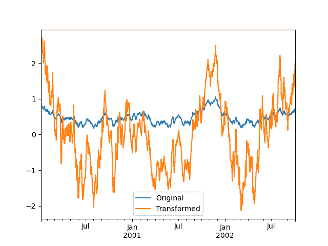
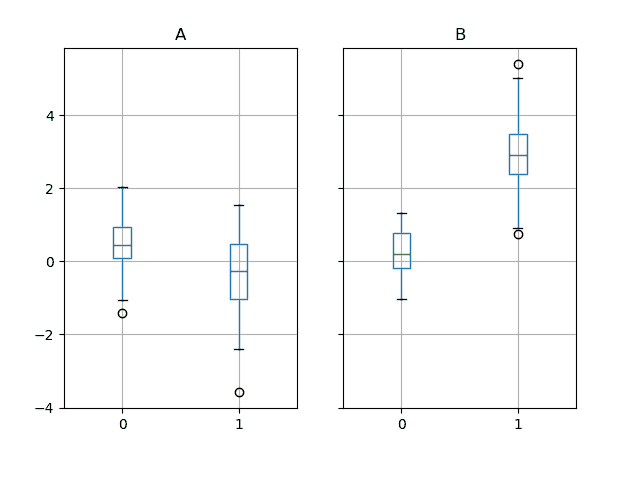

# 按组分组：分割-应用-合并

> 原文：[`pandas.pydata.org/docs/user_guide/groupby.html`](https://pandas.pydata.org/docs/user_guide/groupby.html)

通过“按组”我们指的是涉及以下一个或多个步骤的过程：

+   根据某些标准将数据分成组。

+   **应用**一个函数到每个组独立地。

+   **合并**结果到数据结构中。

在这些中，分割步骤是最直接的。在应用步骤中，我们可能希望执行以下操作之一：

+   **聚合**：为每个组计算摘要统计信息（或统计信息）。一些例子：

    > +   计算组的总和或均值。
    > +   
    > +   计算组大小/计数。

+   **转换**：执行一些组特定的计算并返回一个类似索引的对象。一些例子：

    > +   在组内标准化数据（zscore）。
    > +   
    > +   使用从每个组派生的值填充组内的 NAs。

+   **过滤**：根据按组计算的结果为 True 或 False 来丢弃一些组。一些例子：

    > +   丢弃属于只有少数成员的组的数据。
    > +   
    > +   根据组总和或均值筛选数据。

这些操作中的许多是在 GroupBy 对象上定义的。这些操作类似于聚合 API、窗口 API 和重采样 API 的操作。

可能某个操作不属于这些类别之一，或是它们的某种组合。在这种情况下，可能可以使用 GroupBy 的`apply`方法来计算操作。该方法将检查应用步骤的结果，并尝试将它们合理地组合成单个结果，如果它不适合上述三个类别之一。

注意

使用内置的 GroupBy 操作将一个操作分成多个步骤，比使用带有用户定义的 Python 函数的`apply`方法更有效。

GroupBy 这个名字对于那些使用过基于 SQL 的工具（或`itertools`）的人应该很熟悉，你可以编写类似以下代码：

```py
SELECT  Column1,  Column2,  mean(Column3),  sum(Column4)
FROM  SomeTable
GROUP  BY  Column1,  Column2 
```

我们的目标是使像这样的操作自然且易于使用 pandas 表达。我们将讨论 GroupBy 功能的每���领域，然后提供一些非平凡的例子/用例。

查看食谱以获取一些高级策略。

## 将对象分成组

分组的抽象定义是提供标签到组名的映射。要创建一个 GroupBy 对象（稍后会详细介绍 GroupBy 对象），您可以执行以下操作：

```py
In [1]: speeds = pd.DataFrame(
 ...:    [
 ...:        ("bird", "Falconiformes", 389.0),
 ...:        ("bird", "Psittaciformes", 24.0),
 ...:        ("mammal", "Carnivora", 80.2),
 ...:        ("mammal", "Primates", np.nan),
 ...:        ("mammal", "Carnivora", 58),
 ...:    ],
 ...:    index=["falcon", "parrot", "lion", "monkey", "leopard"],
 ...:    columns=("class", "order", "max_speed"),
 ...: )
 ...: 

In [2]: speeds
Out[2]: 
 class           order  max_speed
falcon     bird   Falconiformes      389.0
parrot     bird  Psittaciformes       24.0
lion     mammal       Carnivora       80.2
monkey   mammal        Primates        NaN
leopard  mammal       Carnivora       58.0

In [3]: grouped = speeds.groupby("class")

In [4]: grouped = speeds.groupby(["class", "order"]) 
```

映射可以以多种不同的方式指定：

+   一个 Python 函数，用于对每个索引标签进行调用。

+   与索引长度相同的列表或 NumPy 数组。

+   一个字典或`Series`，提供`标签 -> 组名`的映射。

+   对于`DataFrame`对象，需要一个字符串，指示要用于分组的列名或索引级别名称。

+   上述任何一种事物的列表。

我们将分组对象统称为**键**。例如，考虑以下`DataFrame`：

注意

传递给`groupby`的字符串可以是列名，也可以是索引级别。如果一个字符串同时匹配列名和索引级别名称，将引发`ValueError`。

```py
In [5]: df = pd.DataFrame(
 ...:    {
 ...:        "A": ["foo", "bar", "foo", "bar", "foo", "bar", "foo", "foo"],
 ...:        "B": ["one", "one", "two", "three", "two", "two", "one", "three"],
 ...:        "C": np.random.randn(8),
 ...:        "D": np.random.randn(8),
 ...:    }
 ...: )
 ...: 

In [6]: df
Out[6]: 
 A      B         C         D
0  foo    one  0.469112 -0.861849
1  bar    one -0.282863 -2.104569
2  foo    two -1.509059 -0.494929
3  bar  three -1.135632  1.071804
4  foo    two  1.212112  0.721555
5  bar    two -0.173215 -0.706771
6  foo    one  0.119209 -1.039575
7  foo  three -1.044236  0.271860 
```

在 DataFrame 上，通过调用`groupby()`我们可以获得一个 GroupBy 对象。此方法返回一个`pandas.api.typing.DataFrameGroupBy`实例。我们可以自然地按照`A`或`B`列，或两者进行分组：

```py
In [7]: grouped = df.groupby("A")

In [8]: grouped = df.groupby("B")

In [9]: grouped = df.groupby(["A", "B"]) 
```

注意

`df.groupby('A')`只是`df.groupby(df['A'])`的语法糖。

如果我们还在列`A`和`B`上有一个 MultiIndex，我们可以按照除指定列之外的所有列进行分组：

```py
In [10]: df2 = df.set_index(["A", "B"])

In [11]: grouped = df2.groupby(level=df2.index.names.difference(["B"]))

In [12]: grouped.sum()
Out[12]: 
 C         D
A 
bar -1.591710 -1.739537
foo -0.752861 -1.402938 
```

上述 GroupBy 将根据其索引（行）拆分 DataFrame。要按列拆分，请先进行转置：

```py
In [13]: def get_letter_type(letter):
 ....:    if letter.lower() in 'aeiou':
 ....:        return 'vowel'
 ....:    else:
 ....:        return 'consonant'
 ....: 

In [14]: grouped = df.T.groupby(get_letter_type) 
```

pandas `Index`对象支持重复值。如果在 groupby 操作中使用非唯一索引作为组键，则相同索引值的所有值将被视为一个组，因此聚合函数的输出将仅包含唯一索引值：

```py
In [15]: index = [1, 2, 3, 1, 2, 3]

In [16]: s = pd.Series([1, 2, 3, 10, 20, 30], index=index)

In [17]: s
Out[17]: 
1     1
2     2
3     3
1    10
2    20
3    30
dtype: int64

In [18]: grouped = s.groupby(level=0)

In [19]: grouped.first()
Out[19]: 
1    1
2    2
3    3
dtype: int64

In [20]: grouped.last()
Out[20]: 
1    10
2    20
3    30
dtype: int64

In [21]: grouped.sum()
Out[21]: 
1    11
2    22
3    33
dtype: int64 
```

注意，**直到需要为止才会发生分割**。创建 GroupBy 对象仅验证您是否传递了有效的映射。

注意

许多种复杂的数据操作可以用 GroupBy 操作来表达（尽管不能保证是最有效的实现）。您可以通过标签映射函数进行创造性的操作。

### GroupBy 排序

默认情况下，在`groupby`操作期间对组键进行排序。但是，您可以传递`sort=False`以实现潜在的加速。使用`sort=False`时，组键之间的顺序遵循键在原始数据框中出现的顺序：

```py
In [22]: df2 = pd.DataFrame({"X": ["B", "B", "A", "A"], "Y": [1, 2, 3, 4]})

In [23]: df2.groupby(["X"]).sum()
Out[23]: 
 Y
X 
A  7
B  3

In [24]: df2.groupby(["X"], sort=False).sum()
Out[24]: 
 Y
X 
B  3
A  7 
```

注意，`groupby`将保留*每个组内*排序的*观测*顺序。例如，下面通过`groupby()`创建的组按照它们在原始`DataFrame`中出现的顺序排列：

```py
In [25]: df3 = pd.DataFrame({"X": ["A", "B", "A", "B"], "Y": [1, 4, 3, 2]})

In [26]: df3.groupby("X").get_group("A")
Out[26]: 
 X  Y
0  A  1
2  A  3

In [27]: df3.groupby(["X"]).get_group(("B",))
Out[27]: 
 X  Y
1  B  4
3  B  2 
```

#### GroupBy dropna

默认情况下，在`groupby`操作期间，将排除`NA`值作为组键。但是，如果您想要在组键中包含`NA`值，可以传递`dropna=False`来实现。

```py
In [28]: df_list = [[1, 2, 3], [1, None, 4], [2, 1, 3], [1, 2, 2]]

In [29]: df_dropna = pd.DataFrame(df_list, columns=["a", "b", "c"])

In [30]: df_dropna
Out[30]: 
 a    b  c
0  1  2.0  3
1  1  NaN  4
2  2  1.0  3
3  1  2.0  2 
```

```py
# Default ``dropna`` is set to True, which will exclude NaNs in keys
In [31]: df_dropna.groupby(by=["b"], dropna=True).sum()
Out[31]: 
 a  c
b 
1.0  2  3
2.0  2  5

# In order to allow NaN in keys, set ``dropna`` to False
In [32]: df_dropna.groupby(by=["b"], dropna=False).sum()
Out[32]: 
 a  c
b 
1.0  2  3
2.0  2  5
NaN  1  4 
```

`dropna`参数的默认设置是`True`，这意味着`NA`不包括在组键中。  ### GroupBy 对象属性

`groups`属性是一个字典，其键是计算出的唯一组，相应的值是属于每个组的轴标签。在上面的示例中，我们有：

```py
In [33]: df.groupby("A").groups
Out[33]: {'bar': [1, 3, 5], 'foo': [0, 2, 4, 6, 7]}

In [34]: df.T.groupby(get_letter_type).groups
Out[34]: {'consonant': ['B', 'C', 'D'], 'vowel': ['A']} 
```

对 GroupBy 对象调用标准的 Python `len`函数将返回组的数量，这与`groups`字典的长度相同：

```py
In [35]: grouped = df.groupby(["A", "B"])

In [36]: grouped.groups
Out[36]: {('bar', 'one'): [1], ('bar', 'three'): [3], ('bar', 'two'): [5], ('foo', 'one'): [0, 6], ('foo', 'three'): [7], ('foo', 'two'): [2, 4]}

In [37]: len(grouped)
Out[37]: 6 
```

`GroupBy`将为列名、GroupBy 操作和其他属性提供制表完成：

```py
In [38]: n = 10

In [39]: weight = np.random.normal(166, 20, size=n)

In [40]: height = np.random.normal(60, 10, size=n)

In [41]: time = pd.date_range("1/1/2000", periods=n)

In [42]: gender = np.random.choice(["male", "female"], size=n)

In [43]: df = pd.DataFrame(
 ....:    {"height": height, "weight": weight, "gender": gender}, index=time
 ....: )
 ....: 

In [44]: df
Out[44]: 
 height      weight  gender
2000-01-01  42.849980  157.500553    male
2000-01-02  49.607315  177.340407    male
2000-01-03  56.293531  171.524640    male
2000-01-04  48.421077  144.251986  female
2000-01-05  46.556882  152.526206    male
2000-01-06  68.448851  168.272968  female
2000-01-07  70.757698  136.431469    male
2000-01-08  58.909500  176.499753  female
2000-01-09  76.435631  174.094104  female
2000-01-10  45.306120  177.540920    male

In [45]: gb = df.groupby("gender") 
```

```py
In [46]: gb.<TAB>  # noqa: E225, E999
gb.agg        gb.boxplot    gb.cummin     gb.describe   gb.filter     gb.get_group  gb.height     gb.last       gb.median     gb.ngroups    gb.plot       gb.rank       gb.std        gb.transform
gb.aggregate  gb.count      gb.cumprod    gb.dtype      gb.first      gb.groups     gb.hist       gb.max        gb.min        gb.nth        gb.prod       gb.resample   gb.sum        gb.var
gb.apply      gb.cummax     gb.cumsum     gb.fillna     gb.gender     gb.head       gb.indices    gb.mean       gb.name       gb.ohlc       gb.quantile   gb.size       gb.tail       gb.weight 
```  ### 带有多重索引的 GroupBy

使用 层次化索引数据，按层次结构的一个级别进行分组非常自然。

让我们创建一个具有两级 `MultiIndex` 的 Series。

```py
In [47]: arrays = [
 ....:    ["bar", "bar", "baz", "baz", "foo", "foo", "qux", "qux"],
 ....:    ["one", "two", "one", "two", "one", "two", "one", "two"],
 ....: ]
 ....: 

In [48]: index = pd.MultiIndex.from_arrays(arrays, names=["first", "second"])

In [49]: s = pd.Series(np.random.randn(8), index=index)

In [50]: s
Out[50]: 
first  second
bar    one      -0.919854
 two      -0.042379
baz    one       1.247642
 two      -0.009920
foo    one       0.290213
 two       0.495767
qux    one       0.362949
 two       1.548106
dtype: float64 
```

然后，我们可以按 `s` 中的一个级别进行分组。

```py
In [51]: grouped = s.groupby(level=0)

In [52]: grouped.sum()
Out[52]: 
first
bar   -0.962232
baz    1.237723
foo    0.785980
qux    1.911055
dtype: float64 
```

如果 MultiIndex 指定了名称，则可以直接将这些名称传递而不是级别号：

```py
In [53]: s.groupby(level="second").sum()
Out[53]: 
second
one    0.980950
two    1.991575
dtype: float64 
```

支持具有多级别的分组。

```py
In [54]: arrays = [
 ....:    ["bar", "bar", "baz", "baz", "foo", "foo", "qux", "qux"],
 ....:    ["doo", "doo", "bee", "bee", "bop", "bop", "bop", "bop"],
 ....:    ["one", "two", "one", "two", "one", "two", "one", "two"],
 ....: ]
 ....: 

In [55]: index = pd.MultiIndex.from_arrays(arrays, names=["first", "second", "third"])

In [56]: s = pd.Series(np.random.randn(8), index=index)

In [57]: s
Out[57]: 
first  second  third
bar    doo     one     -1.131345
 two     -0.089329
baz    bee     one      0.337863
 two     -0.945867
foo    bop     one     -0.932132
 two      1.956030
qux    bop     one      0.017587
 two     -0.016692
dtype: float64

In [58]: s.groupby(level=["first", "second"]).sum()
Out[58]: 
first  second
bar    doo      -1.220674
baz    bee      -0.608004
foo    bop       1.023898
qux    bop       0.000895
dtype: float64 
```

索引级别名称可以作为键提供。

```py
In [59]: s.groupby(["first", "second"]).sum()
Out[59]: 
first  second
bar    doo      -1.220674
baz    bee      -0.608004
foo    bop       1.023898
qux    bop       0.000895
dtype: float64 
```

更多关于 `sum` 函数和聚合的信息稍后。

### 使用 Index 级别和列分组的 DataFrame

可以通过列和索引级别的组合对 DataFrame 进行分组。您可以同时指定列名和索引名，或者使用 `Grouper`。

让我们首先创建一个带有 MultiIndex 的 DataFrame：

```py
In [60]: arrays = [
 ....:    ["bar", "bar", "baz", "baz", "foo", "foo", "qux", "qux"],
 ....:    ["one", "two", "one", "two", "one", "two", "one", "two"],
 ....: ]
 ....: 

In [61]: index = pd.MultiIndex.from_arrays(arrays, names=["first", "second"])

In [62]: df = pd.DataFrame({"A": [1, 1, 1, 1, 2, 2, 3, 3], "B": np.arange(8)}, index=index)

In [63]: df
Out[63]: 
 A  B
first second 
bar   one     1  0
 two     1  1
baz   one     1  2
 two     1  3
foo   one     2  4
 two     2  5
qux   one     3  6
 two     3  7 
```

然后我们将 `df` 按 `second` 索引级别和 `A` 列分组。

```py
In [64]: df.groupby([pd.Grouper(level=1), "A"]).sum()
Out[64]: 
 B
second A 
one    1  2
 2  4
 3  6
two    1  4
 2  5
 3  7 
```

索引级别也可以通过名称指定。

```py
In [65]: df.groupby([pd.Grouper(level="second"), "A"]).sum()
Out[65]: 
 B
second A 
one    1  2
 2  4
 3  6
two    1  4
 2  5
 3  7 
```

索引级别名称可以直接作为键传递给 `groupby`。

```py
In [66]: df.groupby(["second", "A"]).sum()
Out[66]: 
 B
second A 
one    1  2
 2  4
 3  6
two    1  4
 2  5
 3  7 
```

### 在 GroupBy 中的 DataFrame 列选择

从 DataFrame 创建 GroupBy 对象后，您可能希望针对每列执行不同的操作。因此，通过在 GroupBy 对象上使用 `[]`，方式类似于从 DataFrame 获取列的方式，您可以执行以下操作：

```py
In [67]: df = pd.DataFrame(
 ....:    {
 ....:        "A": ["foo", "bar", "foo", "bar", "foo", "bar", "foo", "foo"],
 ....:        "B": ["one", "one", "two", "three", "two", "two", "one", "three"],
 ....:        "C": np.random.randn(8),
 ....:        "D": np.random.randn(8),
 ....:    }
 ....: )
 ....: 

In [68]: df
Out[68]: 
 A      B         C         D
0  foo    one -0.575247  1.346061
1  bar    one  0.254161  1.511763
2  foo    two -1.143704  1.627081
3  bar  three  0.215897 -0.990582
4  foo    two  1.193555 -0.441652
5  bar    two -0.077118  1.211526
6  foo    one -0.408530  0.268520
7  foo  three -0.862495  0.024580

In [69]: grouped = df.groupby(["A"])

In [70]: grouped_C = grouped["C"]

In [71]: grouped_D = grouped["D"] 
```

这主要是对另一种方式的语法糖，后者要冗长得多：

```py
In [72]: df["C"].groupby(df["A"])
Out[72]: <pandas.core.groupby.generic.SeriesGroupBy object at 0x7ff2cef1c730> 
```

此外，该方法避免了重新计算从传递的键派生的内部分组信息。

如果您想要对它们进行操作，还可以包括分组列。

```py
In [73]: grouped[["A", "B"]].sum()
Out[73]: 
 A                  B
A 
bar        barbarbar        onethreetwo
foo  foofoofoofoofoo  onetwotwoonethree 
```  ## 遍历分组

拥有 GroupBy 对象后，通过分组的数据进行迭代是非常自然的，并且功能类似于 [`itertools.groupby()`](https://docs.python.org/3/library/itertools.html#itertools.groupby "(在 Python v3.12 中)"):

```py
In [74]: grouped = df.groupby('A')

In [75]: for name, group in grouped:
 ....:    print(name)
 ....:    print(group)
 ....: 
bar
 A      B         C         D
1  bar    one  0.254161  1.511763
3  bar  three  0.215897 -0.990582
5  bar    two -0.077118  1.211526
foo
 A      B         C         D
0  foo    one -0.575247  1.346061
2  foo    two -1.143704  1.627081
4  foo    two  1.193555 -0.441652
6  foo    one -0.408530  0.268520
7  foo  three -0.862495  0.024580 
```

在按多个键进行分组的情况下，组名将是一个元组：

```py
In [76]: for name, group in df.groupby(['A', 'B']):
 ....:    print(name)
 ....:    print(group)
 ....: 
('bar', 'one')
 A    B         C         D
1  bar  one  0.254161  1.511763
('bar', 'three')
 A      B         C         D
3  bar  three  0.215897 -0.990582
('bar', 'two')
 A    B         C         D
5  bar  two -0.077118  1.211526
('foo', 'one')
 A    B         C         D
0  foo  one -0.575247  1.346061
6  foo  one -0.408530  0.268520
('foo', 'three')
 A      B         C        D
7  foo  three -0.862495  0.02458
('foo', 'two')
 A    B         C         D
2  foo  two -1.143704  1.627081
4  foo  two  1.193555 -0.441652 
```

参见 遍历分组。

## 选择一个组

可以使用 `DataFrameGroupBy.get_group()` 选择单个组：

```py
In [77]: grouped.get_group("bar")
Out[77]: 
 A      B         C         D
1  bar    one  0.254161  1.511763
3  bar  three  0.215897 -0.990582
5  bar    two -0.077118  1.211526 
```

或者针对在多列上分组的对象：

```py
In [78]: df.groupby(["A", "B"]).get_group(("bar", "one"))
Out[78]: 
 A    B         C         D
1  bar  one  0.254161  1.511763 
```

## 聚合

聚合是一种减少分组对象维度的 GroupBy 操作。聚合的结果是，或者至少被视为，每列在一个组中的标量值。例如，生成一组值中每列的总和。

```py
In [79]: animals = pd.DataFrame(
 ....:    {
 ....:        "kind": ["cat", "dog", "cat", "dog"],
 ....:        "height": [9.1, 6.0, 9.5, 34.0],
 ....:        "weight": [7.9, 7.5, 9.9, 198.0],
 ....:    }
 ....: )
 ....: 

In [80]: animals
Out[80]: 
 kind  height  weight
0  cat     9.1     7.9
1  dog     6.0     7.5
2  cat     9.5     9.9
3  dog    34.0   198.0

In [81]: animals.groupby("kind").sum()
Out[81]: 
 height  weight
kind 
cat     18.6    17.8
dog     40.0   205.5 
```

在结果中，默认情况下，组的键出现在索引中。通过传递 `as_index=False`，可以将它们包含在列中。

```py
In [82]: animals.groupby("kind", as_index=False).sum()
Out[82]: 
 kind  height  weight
0  cat    18.6    17.8
1  dog    40.0   205.5 
```

### 内置聚合方法

许多常见的聚合内置到 GroupBy 对象中作为方法。在下面列出的方法中，带有 `*` 的方法 *没有* 一个高效的、GroupBy 特定的实现。

| 方法 | 描述 |
| --- | --- |
| `any()` | 计算组中是否有任何真值 |
| `all()` | 计算组中所有值是否都为真值 |
| `count()` | 计算组中非 NA 值的数量 |
| `cov()` * | 计算组的协方差 |
| `first()` | 计算每个组中首次出现的值 |
| `idxmax()` | 计算每个组中最大值的索引 |
| `idxmin()` | 计算每个组中最小值的索引 |
| `last()` | 计算每个组中最后出现的值 |
| `max()` | 计算每个组的最大值 |
| `mean()` | 计算每个组的平均值 |
| `median()` | 计算每个组的中位数 |
| `min()` | 计算每个组的最小值 |
| `nunique()` | 计算每个组中唯一值的数量 |
| `prod()` | 计算每个组中值的乘积 |
| `quantile()` | 计算每个组中值的给定分位数 |
| `sem()` | 计算每个组中值的均值标准误差 |
| `size()` | 计算每个组中值的数量 |
| `skew()` * | 计算每个组中值的偏度 |
| `std()` | 计算每个组中值的标准偏差 |
| `sum()` | 计算每个组中值的总和 |
| `var()` | 计算每个组中值的方差 |

一些示例：

```py
In [83]: df.groupby("A")[["C", "D"]].max()
Out[83]: 
 C         D
A 
bar  0.254161  1.511763
foo  1.193555  1.627081

In [84]: df.groupby(["A", "B"]).mean()
Out[84]: 
 C         D
A   B 
bar one    0.254161  1.511763
 three  0.215897 -0.990582
 two   -0.077118  1.211526
foo one   -0.491888  0.807291
 three -0.862495  0.024580
 two    0.024925  0.592714 
```

另一个聚合示例是计算每个组的大小。这包含在 GroupBy 中作为`size`方法。它返回一个 Series，其索引由组名组成，值是每个组的大小。

```py
In [85]: grouped = df.groupby(["A", "B"])

In [86]: grouped.size()
Out[86]: 
A    B 
bar  one      1
 three    1
 two      1
foo  one      2
 three    1
 two      2
dtype: int64 
```

虽然`DataFrameGroupBy.describe()`方法本身不是一个约简函数，但它可以方便地生成关于每个组的摘要统计信息的集合。

```py
In [87]: grouped.describe()
Out[87]: 
 C                      ...         D 
 count      mean       std  ...       50%       75%       max
A   B                                ... 
bar one     1.0  0.254161       NaN  ...  1.511763  1.511763  1.511763
 three   1.0  0.215897       NaN  ... -0.990582 -0.990582 -0.990582
 two     1.0 -0.077118       NaN  ...  1.211526  1.211526  1.211526
foo one     2.0 -0.491888  0.117887  ...  0.807291  1.076676  1.346061
 three   1.0 -0.862495       NaN  ...  0.024580  0.024580  0.024580
 two     2.0  0.024925  1.652692  ...  0.592714  1.109898  1.627081

[6 rows x 16 columns] 
```

另一个聚合示例是计算每个组的唯一值数量。这类似于`DataFrameGroupBy.value_counts()`函数，不同之处在于它只计算唯一值的数量。

```py
In [88]: ll = [['foo', 1], ['foo', 2], ['foo', 2], ['bar', 1], ['bar', 1]]

In [89]: df4 = pd.DataFrame(ll, columns=["A", "B"])

In [90]: df4
Out[90]: 
 A  B
0  foo  1
1  foo  2
2  foo  2
3  bar  1
4  bar  1

In [91]: df4.groupby("A")["B"].nunique()
Out[91]: 
A
bar    1
foo    2
Name: B, dtype: int64 
```

注意

聚合函数**不会**在`as_index=True`（默认情况下）时返回您正在聚合的组作为命名*列*，分组的列将是返回对象的**索引**。

传递`as_index=False` **将** 返回您正在聚合的分组作为命名列，而不管它们在输入中是命名**索引**还是*列*。### `aggregate()` 方法

注意

`aggregate()` 方法可以接受许多不同类型的输入。本节详细介绍了使用字符串别名进行各种 GroupBy 方法的其他输入详细信息，请参见下文各节。

任何 pandas 实现的缩减方法都可以作为字符串传递给`aggregate()`。鼓励用户使用简写形式`agg`。它将像调用相应的方法一样运行。

```py
In [92]: grouped = df.groupby("A")

In [93]: grouped[["C", "D"]].aggregate("sum")
Out[93]: 
 C         D
A 
bar  0.392940  1.732707
foo -1.796421  2.824590

In [94]: grouped = df.groupby(["A", "B"])

In [95]: grouped.agg("sum")
Out[95]: 
 C         D
A   B 
bar one    0.254161  1.511763
 three  0.215897 -0.990582
 two   -0.077118  1.211526
foo one   -0.983776  1.614581
 three -0.862495  0.024580
 two    0.049851  1.185429 
```

聚合的结果将使用组名作为新索引。在多个键的情况下，默认情况下结果是一个 MultiIndex。如上所述，这可以通过使用`as_index`选项进行更改：

```py
In [96]: grouped = df.groupby(["A", "B"], as_index=False)

In [97]: grouped.agg("sum")
Out[97]: 
 A      B         C         D
0  bar    one  0.254161  1.511763
1  bar  three  0.215897 -0.990582
2  bar    two -0.077118  1.211526
3  foo    one -0.983776  1.614581
4  foo  three -0.862495  0.024580
5  foo    two  0.049851  1.185429

In [98]: df.groupby("A", as_index=False)[["C", "D"]].agg("sum")
Out[98]: 
 A         C         D
0  bar  0.392940  1.732707
1  foo -1.796421  2.824590 
```

请注意，您可以使用`DataFrame.reset_index()` DataFrame 函数来达到与列名存储在结果`MultiIndex`中相同的结果，尽管这将多做一次复制。

```py
In [99]: df.groupby(["A", "B"]).agg("sum").reset_index()
Out[99]: 
 A      B         C         D
0  bar    one  0.254161  1.511763
1  bar  three  0.215897 -0.990582
2  bar    two -0.077118  1.211526
3  foo    one -0.983776  1.614581
4  foo  three -0.862495  0.024580
5  foo    two  0.049851  1.185429 
```  ### 使用自定义函数进行聚合

用户还可以为自定义聚合提供自己的用户定义函数（UDFs）。

警告

使用 UDF 进行聚合时，UDF 不应更改提供的`Series`。有关更多信息，请参见使用用户定义函数（UDF）方法进行突变。

注意

使用 UDF 进行聚合通常不如在 GroupBy 上使用 pandas 内置方法高效。考虑将复杂操作分解为一系列使用内置方法的操作链。

```py
In [100]: animals
Out[100]: 
 kind  height  weight
0  cat     9.1     7.9
1  dog     6.0     7.5
2  cat     9.5     9.9
3  dog    34.0   198.0

In [101]: animals.groupby("kind")[["height"]].agg(lambda x: set(x))
Out[101]: 
 height
kind 
cat    {9.1, 9.5}
dog   {34.0, 6.0} 
```

结果的 dtype 将反映聚合函数的 dtype。如果不同组的结果具有不同的 dtype，则将以与`DataFrame`构造相同的方式确定通用 dtype。

```py
In [102]: animals.groupby("kind")[["height"]].agg(lambda x: x.astype(int).sum())
Out[102]: 
 height
kind 
cat       18
dog       40 
```  ### 同时应用多个函数

在分组的`Series`上，你可以传递一个函数列表或字典给`SeriesGroupBy.agg()`，输出一个 DataFrame：

```py
In [103]: grouped = df.groupby("A")

In [104]: grouped["C"].agg(["sum", "mean", "std"])
Out[104]: 
 sum      mean       std
A 
bar  0.392940  0.130980  0.181231
foo -1.796421 -0.359284  0.912265 
```

在分组的`DataFrame`上，你可以传递一个函数列表给`DataFrameGroupBy.agg()`以聚合每一列，这将产生一个带有分层列索引的聚合结果：

```py
In [105]: grouped[["C", "D"]].agg(["sum", "mean", "std"])
Out[105]: 
 C                             D 
 sum      mean       std       sum      mean       std
A 
bar  0.392940  0.130980  0.181231  1.732707  0.577569  1.366330
foo -1.796421 -0.359284  0.912265  2.824590  0.564918  0.884785 
```

结果的聚合将以函数本身命名。如果需要重命名，则可以为`Series`添加一个链接操作，像这样：

```py
In [106]: (
 .....:    grouped["C"]
 .....:    .agg(["sum", "mean", "std"])
 .....:    .rename(columns={"sum": "foo", "mean": "bar", "std": "baz"})
 .....: )
 .....: 
Out[106]: 
 foo       bar       baz
A 
bar  0.392940  0.130980  0.181231
foo -1.796421 -0.359284  0.912265 
```

对于分组的`DataFrame`，您可以以类似的方式重命名：

```py
In [107]: (
 .....:    grouped[["C", "D"]].agg(["sum", "mean", "std"]).rename(
 .....:        columns={"sum": "foo", "mean": "bar", "std": "baz"}
 .....:    )
 .....: )
 .....: 
Out[107]: 
 C                             D 
 foo       bar       baz       foo       bar       baz
A 
bar  0.392940  0.130980  0.181231  1.732707  0.577569  1.366330
foo -1.796421 -0.359284  0.912265  2.824590  0.564918  0.884785 
```

注意

通常情况下，输出列名应该是唯一的，但 pandas 允许你将相同函数（或两个同名函数）应用于同一列。

```py
In [108]: grouped["C"].agg(["sum", "sum"])
Out[108]: 
 sum       sum
A 
bar  0.392940  0.392940
foo -1.796421 -1.796421 
```

pandas 也允许你提供多个 lambda 函数。在这种情况下，pandas 会篡改（无名）lambda 函数的名称，对每个后续 lambda 函数追加 `_<i>`。

```py
In [109]: grouped["C"].agg([lambda x: x.max() - x.min(), lambda x: x.median() - x.mean()])
Out[109]: 
 <lambda_0>  <lambda_1>
A 
bar    0.331279    0.084917
foo    2.337259   -0.215962 
```  ### 命名聚合

为了支持具有对输出列名的控制的特定列聚合，pandas 接受在 `DataFrameGroupBy.agg()` 和 `SeriesGroupBy.agg()` 中的特殊语法，称为“命名聚合”，其中

+   关键字是 *输出* 列名

+   这些值是元组，第一个元素是要选择的列，第二个元素是要应用于该列的聚合函数。pandas 提供了带有字段 `['column', 'aggfunc']` 的 `NamedAgg` 命名元组，以使参数更清晰。通常情况下，聚合可以是可调用对象或字符串别名。

```py
In [110]: animals
Out[110]: 
 kind  height  weight
0  cat     9.1     7.9
1  dog     6.0     7.5
2  cat     9.5     9.9
3  dog    34.0   198.0

In [111]: animals.groupby("kind").agg(
 .....:    min_height=pd.NamedAgg(column="height", aggfunc="min"),
 .....:    max_height=pd.NamedAgg(column="height", aggfunc="max"),
 .....:    average_weight=pd.NamedAgg(column="weight", aggfunc="mean"),
 .....: )
 .....: 
Out[111]: 
 min_height  max_height  average_weight
kind 
cat          9.1         9.5            8.90
dog          6.0        34.0          102.75 
```

`NamedAgg` 就是一个 `namedtuple`。普通元组也是允许的。

```py
In [112]: animals.groupby("kind").agg(
 .....:    min_height=("height", "min"),
 .....:    max_height=("height", "max"),
 .....:    average_weight=("weight", "mean"),
 .....: )
 .....: 
Out[112]: 
 min_height  max_height  average_weight
kind 
cat          9.1         9.5            8.90
dog          6.0        34.0          102.75 
```

如果你想要的列名不是有效的 Python 关键字，构造一个字典并解包关键字参数

```py
In [113]: animals.groupby("kind").agg(
 .....:    **{
 .....:        "total weight": pd.NamedAgg(column="weight", aggfunc="sum")
 .....:    }
 .....: )
 .....: 
Out[113]: 
 total weight
kind 
cat           17.8
dog          205.5 
```

在使用命名聚合时，额外的关键字参数不会传递给聚合函数；只有 `(column, aggfunc)` 对应的键值对应该作为 `**kwargs` 传递。如果你的聚合函数需要额外的参数，可以使用 `functools.partial()` 部分应用它们。

命名聚合对于 Series 分组聚合也是有效的。在这种情况下，没有列选择，所以值只是函数。

```py
In [114]: animals.groupby("kind").height.agg(
 .....:    min_height="min",
 .....:    max_height="max",
 .....: )
 .....: 
Out[114]: 
 min_height  max_height
kind 
cat          9.1         9.5
dog          6.0        34.0 
```

### 对 DataFrame 列应用不同函数

通过将字典传递给 `aggregate`，你可以对 DataFrame 的列应用不同的聚合函数：

```py
In [115]: grouped.agg({"C": "sum", "D": lambda x: np.std(x, ddof=1)})
Out[115]: 
 C         D
A 
bar  0.392940  1.366330
foo -1.796421  0.884785 
```

函数名称也可以是字符串。为了使字符串有效，它必须在 GroupBy 上实现：

```py
In [116]: grouped.agg({"C": "sum", "D": "std"})
Out[116]: 
 C         D
A 
bar  0.392940  1.366330
foo -1.796421  0.884785 
```  ## 转换

转换是一个 GroupBy 操作，其结果与被分组的对象索引相同。常见示例包括 `cumsum()` 和 `diff()`。

```py
In [117]: speeds
Out[117]: 
 class           order  max_speed
falcon     bird   Falconiformes      389.0
parrot     bird  Psittaciformes       24.0
lion     mammal       Carnivora       80.2
monkey   mammal        Primates        NaN
leopard  mammal       Carnivora       58.0

In [118]: grouped = speeds.groupby("class")["max_speed"]

In [119]: grouped.cumsum()
Out[119]: 
falcon     389.0
parrot     413.0
lion        80.2
monkey       NaN
leopard    138.2
Name: max_speed, dtype: float64

In [120]: grouped.diff()
Out[120]: 
falcon       NaN
parrot    -365.0
lion         NaN
monkey       NaN
leopard      NaN
Name: max_speed, dtype: float64 
```

与聚合不同，用于拆分原始对象的分组不包含在结果中。

注意

由于转换不包括用于拆分结果的分组，因此 `DataFrame.groupby()` 和 `Series.groupby()` 中的参数 `as_index` 和 `sort` 没有效果。

转换的常见用途是将结果添加回原始 DataFrame 中。

```py
In [121]: result = speeds.copy()

In [122]: result["cumsum"] = grouped.cumsum()

In [123]: result["diff"] = grouped.diff()

In [124]: result
Out[124]: 
 class           order  max_speed  cumsum   diff
falcon     bird   Falconiformes      389.0   389.0    NaN
parrot     bird  Psittaciformes       24.0   413.0 -365.0
lion     mammal       Carnivora       80.2    80.2    NaN
monkey   mammal        Primates        NaN     NaN    NaN
leopard  mammal       Carnivora       58.0   138.2    NaN 
```

### 内置转换方法

GroupBy 上的以下方法作为转换操作。

| 方法 | 描述 |
| --- | --- |
| `bfill()` | 在每个组内向后填充 NA 值 |
| `cumcount()` | 计算每个组内的累积计数 |
| `cummax()` | 计算每个组内的累积最大值 |
| `cummin()` | 计算每个组内的累积最小值 |
| `cumprod()` | 计算每个组内的累积乘积 |
| `cumsum()` | 计算每个组内的累积总和 |
| `diff()` | 计算每个组内相邻值之间的差异 |
| `ffill()` | 在每个组内填充 NA 值 |
| `pct_change()` | 计算每个组内相邻值之间的百分比变化 |
| `rank()` | 计算每个组内每个值的排名 |
| `shift()` | 在每个组内上下移动值 |

此外，将任何内置聚合方法作为字符串传递给`transform()`（参见下一节）将在组内广播结果，产生转换后的结果。如果聚合方法有高效实现，这也将是高效的。

### `transform()` 方法

与聚合方法类似，`transform()` 方法可以接受字符串别名，指向前一节中内置的转换方法。它也可以接受字符串别名，指向内置的聚合方法。当提供聚合方法时，结果将在组内广播。

```py
In [125]: speeds
Out[125]: 
 class           order  max_speed
falcon     bird   Falconiformes      389.0
parrot     bird  Psittaciformes       24.0
lion     mammal       Carnivora       80.2
monkey   mammal        Primates        NaN
leopard  mammal       Carnivora       58.0

In [126]: grouped = speeds.groupby("class")[["max_speed"]]

In [127]: grouped.transform("cumsum")
Out[127]: 
 max_speed
falcon       389.0
parrot       413.0
lion          80.2
monkey         NaN
leopard      138.2

In [128]: grouped.transform("sum")
Out[128]: 
 max_speed
falcon       413.0
parrot       413.0
lion         138.2
monkey       138.2
leopard      138.2 
```

除了字符串别名外，`transform()` 方法还可以接受用户定义的函数（UDFs）。UDF 必须：

+   返回的结果要么与组块的大小相同，要么可以广播到组块的大小（例如，标量，`grouped.transform(lambda x: x.iloc[-1])`）。

+   在组块上逐列操作。使用 chunk.apply 对第一组块应用转换。

+   不要在组块上执行原位操作。组块应被视为不可变的，对组块的更改可能会产生意外结果。查看使用用户定义函数（UDF）方法进行变异获取更多信息。

+   （可选）一次操作整个组块的所有列。如果支持此操作，将从*第二*块开始使用快速路径。

注意

通过提供 UDF 给 `transform` 进行转换通常比在 GroupBy 上使用内置方法性能较差。考虑将复杂操作拆分为一系列利用内置方法的操作。

本节中的所有示例都可以通过调用内置方法而不是使用 UDFs 来提高性能。查看下面的示例。

从版本 2.0.0 开始更改：当在分组的 DataFrame 上使用 `.transform` 并且转换函数返回一个 DataFrame 时，pandas 现在会将结果的索引与输入的索引对齐。您可以在转换函数内部调用 `.to_numpy()` 来避免对齐。

与聚合方法类似，结果的数据类型将反映转换函数的数据类型。如果不同组的结果具有不同的数据类型，则将以与 `DataFrame` 构造相同的方式确定公共数据类型。

假设我们希望在每个组内标准化数据：

```py
In [129]: index = pd.date_range("10/1/1999", periods=1100)

In [130]: ts = pd.Series(np.random.normal(0.5, 2, 1100), index)

In [131]: ts = ts.rolling(window=100, min_periods=100).mean().dropna()

In [132]: ts.head()
Out[132]: 
2000-01-08    0.779333
2000-01-09    0.778852
2000-01-10    0.786476
2000-01-11    0.782797
2000-01-12    0.798110
Freq: D, dtype: float64

In [133]: ts.tail()
Out[133]: 
2002-09-30    0.660294
2002-10-01    0.631095
2002-10-02    0.673601
2002-10-03    0.709213
2002-10-04    0.719369
Freq: D, dtype: float64

In [134]: transformed = ts.groupby(lambda x: x.year).transform(
 .....:    lambda x: (x - x.mean()) / x.std()
 .....: )
 .....: 
```

我们期望结果现在在每个组内具有均值为 0 和标准差为 1（浮点误差范围内），我们可以轻松检查：

```py
# Original Data
In [135]: grouped = ts.groupby(lambda x: x.year)

In [136]: grouped.mean()
Out[136]: 
2000    0.442441
2001    0.526246
2002    0.459365
dtype: float64

In [137]: grouped.std()
Out[137]: 
2000    0.131752
2001    0.210945
2002    0.128753
dtype: float64

# Transformed Data
In [138]: grouped_trans = transformed.groupby(lambda x: x.year)

In [139]: grouped_trans.mean()
Out[139]: 
2000   -4.870756e-16
2001   -1.545187e-16
2002    4.136282e-16
dtype: float64

In [140]: grouped_trans.std()
Out[140]: 
2000    1.0
2001    1.0
2002    1.0
dtype: float64 
```

我们还可以直观比较原始数据和转换后的数据集。

```py
In [141]: compare = pd.DataFrame({"Original": ts, "Transformed": transformed})

In [142]: compare.plot()
Out[142]: <Axes: > 
```



具有较低维度输出的转换函数将被广播以匹配输入数组的形状。

```py
In [143]: ts.groupby(lambda x: x.year).transform(lambda x: x.max() - x.min())
Out[143]: 
2000-01-08    0.623893
2000-01-09    0.623893
2000-01-10    0.623893
2000-01-11    0.623893
2000-01-12    0.623893
 ... 
2002-09-30    0.558275
2002-10-01    0.558275
2002-10-02    0.558275
2002-10-03    0.558275
2002-10-04    0.558275
Freq: D, Length: 1001, dtype: float64 
```

另一个常见的数据转换是用组均值替换缺失数据。

```py
In [144]: cols = ["A", "B", "C"]

In [145]: values = np.random.randn(1000, 3)

In [146]: values[np.random.randint(0, 1000, 100), 0] = np.nan

In [147]: values[np.random.randint(0, 1000, 50), 1] = np.nan

In [148]: values[np.random.randint(0, 1000, 200), 2] = np.nan

In [149]: data_df = pd.DataFrame(values, columns=cols)

In [150]: data_df
Out[150]: 
 A         B         C
0    1.539708 -1.166480  0.533026
1    1.302092 -0.505754       NaN
2   -0.371983  1.104803 -0.651520
3   -1.309622  1.118697 -1.161657
4   -1.924296  0.396437  0.812436
..        ...       ...       ...
995 -0.093110  0.683847 -0.774753
996 -0.185043  1.438572       NaN
997 -0.394469 -0.642343  0.011374
998 -1.174126  1.857148       NaN
999  0.234564  0.517098  0.393534

[1000 rows x 3 columns]

In [151]: countries = np.array(["US", "UK", "GR", "JP"])

In [152]: key = countries[np.random.randint(0, 4, 1000)]

In [153]: grouped = data_df.groupby(key)

# Non-NA count in each group
In [154]: grouped.count()
Out[154]: 
 A    B    C
GR  209  217  189
JP  240  255  217
UK  216  231  193
US  239  250  217

In [155]: transformed = grouped.transform(lambda x: x.fillna(x.mean())) 
```

我们可以验证转换后数据中组均值未发生变化，并且转换后数据不包含任何缺失值。

```py
In [156]: grouped_trans = transformed.groupby(key)

In [157]: grouped.mean()  # original group means
Out[157]: 
 A         B         C
GR -0.098371 -0.015420  0.068053
JP  0.069025  0.023100 -0.077324
UK  0.034069 -0.052580 -0.116525
US  0.058664 -0.020399  0.028603

In [158]: grouped_trans.mean()  # transformation did not change group means
Out[158]: 
 A         B         C
GR -0.098371 -0.015420  0.068053
JP  0.069025  0.023100 -0.077324
UK  0.034069 -0.052580 -0.116525
US  0.058664 -0.020399  0.028603

In [159]: grouped.count()  # original has some missing data points
Out[159]: 
 A    B    C
GR  209  217  189
JP  240  255  217
UK  216  231  193
US  239  250  217

In [160]: grouped_trans.count()  # counts after transformation
Out[160]: 
 A    B    C
GR  228  228  228
JP  267  267  267
UK  247  247  247
US  258  258  258

In [161]: grouped_trans.size()  # Verify non-NA count equals group size
Out[161]: 
GR    228
JP    267
UK    247
US    258
dtype: int64 
```

如上面的注意中所述，本节中的每个示例都可以使用内置方法更有效地计算。在下面的代码中，使用 UDF 的低效方法被注释掉，更快的替代方法出现在下面。

```py
# result = ts.groupby(lambda x: x.year).transform(
#     lambda x: (x - x.mean()) / x.std()
# )
In [162]: grouped = ts.groupby(lambda x: x.year)

In [163]: result = (ts - grouped.transform("mean")) / grouped.transform("std")

# result = ts.groupby(lambda x: x.year).transform(lambda x: x.max() - x.min())
In [164]: grouped = ts.groupby(lambda x: x.year)

In [165]: result = grouped.transform("max") - grouped.transform("min")

# grouped = data_df.groupby(key)
# result = grouped.transform(lambda x: x.fillna(x.mean()))
In [166]: grouped = data_df.groupby(key)

In [167]: result = data_df.fillna(grouped.transform("mean")) 
```  ### 窗口和重采样操作

可以将 `resample()`、`expanding()` 和 `rolling()` 作为 groupby 的方法使用。

下面的示例将在列 B 的样本上应用 `rolling()` 方法，基于列 A 的组。

```py
In [168]: df_re = pd.DataFrame({"A": [1] * 10 + [5] * 10, "B": np.arange(20)})

In [169]: df_re
Out[169]: 
 A   B
0   1   0
1   1   1
2   1   2
3   1   3
4   1   4
.. ..  ..
15  5  15
16  5  16
17  5  17
18  5  18
19  5  19

[20 rows x 2 columns]

In [170]: df_re.groupby("A").rolling(4).B.mean()
Out[170]: 
A 
1  0      NaN
 1      NaN
 2      NaN
 3      1.5
 4      2.5
 ... 
5  15    13.5
 16    14.5
 17    15.5
 18    16.5
 19    17.5
Name: B, Length: 20, dtype: float64 
```

`expanding()` 方法将为每个特定组的所有成员累积给定操作（在示例中为 `sum()`）。

```py
In [171]: df_re.groupby("A").expanding().sum()
Out[171]: 
 B
A 
1 0     0.0
 1     1.0
 2     3.0
 3     6.0
 4    10.0
...     ...
5 15   75.0
 16   91.0
 17  108.0
 18  126.0
 19  145.0

[20 rows x 1 columns] 
```

假设您想要在数据框的每个组中使用 `resample()` 方法获得每日频率，并希望使用 `ffill()` 方法填充缺失值。

```py
In [172]: df_re = pd.DataFrame(
 .....:    {
 .....:        "date": pd.date_range(start="2016-01-01", periods=4, freq="W"),
 .....:        "group": [1, 1, 2, 2],
 .....:        "val": [5, 6, 7, 8],
 .....:    }
 .....: ).set_index("date")
 .....: 

In [173]: df_re
Out[173]: 
 group  val
date 
2016-01-03      1    5
2016-01-10      1    6
2016-01-17      2    7
2016-01-24      2    8

In [174]: df_re.groupby("group").resample("1D", include_groups=False).ffill()
Out[174]: 
 val
group date 
1     2016-01-03    5
 2016-01-04    5
 2016-01-05    5
 2016-01-06    5
 2016-01-07    5
...               ...
2     2016-01-20    7
 2016-01-21    7
 2016-01-22    7
 2016-01-23    7
 2016-01-24    8

[16 rows x 1 columns] 
```  ## 过滤

过滤是一个 GroupBy 操作，它对原始分组对象进行子集化。它可以过滤掉整个组、部分组或两者。过滤返回调用对象的过滤版本，包括提供的分组列。在下面的示例中，`class` 包含在结果中。

```py
In [175]: speeds
Out[175]: 
 class           order  max_speed
falcon     bird   Falconiformes      389.0
parrot     bird  Psittaciformes       24.0
lion     mammal       Carnivora       80.2
monkey   mammal        Primates        NaN
leopard  mammal       Carnivora       58.0

In [176]: speeds.groupby("class").nth(1)
Out[176]: 
 class           order  max_speed
parrot    bird  Psittaciformes       24.0
monkey  mammal        Primates        NaN 
```

注意

与聚合不同，过滤不会将组键添加到结果的索引中。因此，传递 `as_index=False` 或 `sort=True` 不会影响这些方法。

过滤将尊重对 GroupBy 对象列的子集。

```py
In [177]: speeds.groupby("class")[["order", "max_speed"]].nth(1)
Out[177]: 
 order  max_speed
parrot  Psittaciformes       24.0
monkey        Primates        NaN 
```

### 内置过滤

GroupBy 上的以下方法充当过滤。所有这些方法都有一个高效的、GroupBy 特定的实现。

| 方法 | 描述 |
| --- | --- |
| `head()` | 选择每个组的前几行 |
| `nth()` | 选择每个组的第 n 行 |
| `tail()` | 选择每个组的底部行 |

用户还可以使用变换以及布尔索引在组内构建复杂的过滤。例如，假设我们有产品和其体积的组，并且希望将数据子集缩小到仅捕获每个组内总体积不超过 90%的最大产品。

```py
In [178]: product_volumes = pd.DataFrame(
 .....:    {
 .....:        "group": list("xxxxyyy"),
 .....:        "product": list("abcdefg"),
 .....:        "volume": [10, 30, 20, 15, 40, 10, 20],
 .....:    }
 .....: )
 .....: 

In [179]: product_volumes
Out[179]: 
 group product  volume
0     x       a      10
1     x       b      30
2     x       c      20
3     x       d      15
4     y       e      40
5     y       f      10
6     y       g      20

# Sort by volume to select the largest products first
In [180]: product_volumes = product_volumes.sort_values("volume", ascending=False)

In [181]: grouped = product_volumes.groupby("group")["volume"]

In [182]: cumpct = grouped.cumsum() / grouped.transform("sum")

In [183]: cumpct
Out[183]: 
4    0.571429
1    0.400000
2    0.666667
6    0.857143
3    0.866667
0    1.000000
5    1.000000
Name: volume, dtype: float64

In [184]: significant_products = product_volumes[cumpct <= 0.9]

In [185]: significant_products.sort_values(["group", "product"])
Out[185]: 
 group product  volume
1     x       b      30
2     x       c      20
3     x       d      15
4     y       e      40
6     y       g      20 
```

### `filter`方法

注意

通过向`filter`提供用户定义函数（UDF）进行过滤通常比使用 GroupBy 上的内置方法性能较差。考虑将复杂操作分解为一系列利用内置方法的操作。

`filter`方法接受一个用户定义函数（UDF），当应用于整个组时，返回`True`或`False`。`filter`方法的结果是 UDF 返回`True`的组的子集。

假设我们只想取属于总和大于 2 的组的元素。

```py
In [186]: sf = pd.Series([1, 1, 2, 3, 3, 3])

In [187]: sf.groupby(sf).filter(lambda x: x.sum() > 2)
Out[187]: 
3    3
4    3
5    3
dtype: int64 
```

另一个有用的操作是过滤出仅属于只有几个成员的组的元素。

```py
In [188]: dff = pd.DataFrame({"A": np.arange(8), "B": list("aabbbbcc")})

In [189]: dff.groupby("B").filter(lambda x: len(x) > 2)
Out[189]: 
 A  B
2  2  b
3  3  b
4  4  b
5  5  b 
```

或者，而不是删除有问题的组，我们可以返回一个类似索引对象，其中未通过过滤器的组填充为 NaN。

```py
In [190]: dff.groupby("B").filter(lambda x: len(x) > 2, dropna=False)
Out[190]: 
 A    B
0  NaN  NaN
1  NaN  NaN
2  2.0    b
3  3.0    b
4  4.0    b
5  5.0    b
6  NaN  NaN
7  NaN  NaN 
```

对于具有多列的数据框，过滤器应明确指定列作为过滤条件。

```py
In [191]: dff["C"] = np.arange(8)

In [192]: dff.groupby("B").filter(lambda x: len(x["C"]) > 2)
Out[192]: 
 A  B  C
2  2  b  2
3  3  b  3
4  4  b  4
5  5  b  5 
```  ## 灵活的`apply`

对于分组数据上的一些操作可能不适合于聚合、转换或过滤类别。对于这些情况，可以使用`apply`函数。

警告

`apply`必须尝试从结果中推断出它应该充当规约器、转换器*或*过滤器，具体取决于传递给它的内容。因此，分组列可能包含在输出中，也可能不包含。虽然它试图智能猜测如何行事，但有时可能猜错。

注意

本节中的所有示例都可以更可靠、更高效地使用其他 pandas 功能计算。

```py
In [193]: df
Out[193]: 
 A      B         C         D
0  foo    one -0.575247  1.346061
1  bar    one  0.254161  1.511763
2  foo    two -1.143704  1.627081
3  bar  three  0.215897 -0.990582
4  foo    two  1.193555 -0.441652
5  bar    two -0.077118  1.211526
6  foo    one -0.408530  0.268520
7  foo  three -0.862495  0.024580

In [194]: grouped = df.groupby("A")

# could also just call .describe()
In [195]: grouped["C"].apply(lambda x: x.describe())
Out[195]: 
A 
bar  count    3.000000
 mean     0.130980
 std      0.181231
 min     -0.077118
 25%      0.069390
 ... 
foo  min     -1.143704
 25%     -0.862495
 50%     -0.575247
 75%     -0.408530
 max      1.193555
Name: C, Length: 16, dtype: float64 
```

返回结果的维度也可能会改变：

```py
In [196]: grouped = df.groupby('A')['C']

In [197]: def f(group):
 .....:    return pd.DataFrame({'original': group,
 .....:                         'demeaned': group - group.mean()})
 .....: 

In [198]: grouped.apply(f)
Out[198]: 
 original  demeaned
A 
bar 1  0.254161  0.123181
 3  0.215897  0.084917
 5 -0.077118 -0.208098
foo 0 -0.575247 -0.215962
 2 -1.143704 -0.784420
 4  1.193555  1.552839
 6 -0.408530 -0.049245
 7 -0.862495 -0.503211 
```

Series 上的`apply`可以对来自应用函数的返回值本身为系列的值进行操作，并可能将结果上转换为数据框：

```py
In [199]: def f(x):
 .....:    return pd.Series([x, x ** 2], index=["x", "x²"])
 .....: 

In [200]: s = pd.Series(np.random.rand(5))

In [201]: s
Out[201]: 
0    0.582898
1    0.098352
2    0.001438
3    0.009420
4    0.815826
dtype: float64

In [202]: s.apply(f)
Out[202]: 
 x       x²
0  0.582898  0.339770
1  0.098352  0.009673
2  0.001438  0.000002
3  0.009420  0.000089
4  0.815826  0.665572 
```

与 aggregate()方法类似，结果的数据类型将反映应用函数的数据类型。如果不同组的结果具有不同的数据类型，则将以与`DataFrame`构造相同的方式确定公共数据类型。

### 使用`group_keys`控制分组列的放置

要控制分组列是否包含在索引中，可以使用默认为`True`的`group_keys`参数。比较

```py
In [203]: df.groupby("A", group_keys=True).apply(lambda x: x, include_groups=False)
Out[203]: 
 B         C         D
A 
bar 1    one  0.254161  1.511763
 3  three  0.215897 -0.990582
 5    two -0.077118  1.211526
foo 0    one -0.575247  1.346061
 2    two -1.143704  1.627081
 4    two  1.193555 -0.441652
 6    one -0.408530  0.268520
 7  three -0.862495  0.024580 
```

与

```py
In [204]: df.groupby("A", group_keys=False).apply(lambda x: x, include_groups=False)
Out[204]: 
 B         C         D
0    one -0.575247  1.346061
1    one  0.254161  1.511763
2    two -1.143704  1.627081
3  three  0.215897 -0.990582
4    two  1.193555 -0.441652
5    two -0.077118  1.211526
6    one -0.408530  0.268520
7  three -0.862495  0.024580 
```

## Numba 加速例程

版本 1.1 中的新功能。

如果已安装[Numba](https://numba.pydata.org/)作为可选依赖项，则`transform`和`aggregate`方法支持`engine='numba'`和`engine_kwargs`参数。有关参数的一般用法和性能考虑，请参阅使用 Numba 增强性能。

函数签名必须以`values, index` **完全**开始，因为属于每个组的数据将传递给`values`，分组索引将传递给`index`。

警告

当使用`engine='numba'`时，内部不会有“回退”行为。分组数据和分组索引将作为 NumPy 数组传递给 JITed 用户定义的函数，不会尝试任何替代执行。

## 其他有用的功能

### 排除非数值列

再次考虑我们一直在看的示例 DataFrame：

```py
In [205]: df
Out[205]: 
 A      B         C         D
0  foo    one -0.575247  1.346061
1  bar    one  0.254161  1.511763
2  foo    two -1.143704  1.627081
3  bar  three  0.215897 -0.990582
4  foo    two  1.193555 -0.441652
5  bar    two -0.077118  1.211526
6  foo    one -0.408530  0.268520
7  foo  three -0.862495  0.024580 
```

假设我们希望按`A`列分组计算标准差。有一个小问题，即我们不关心列`B`中的数据，因为它不是数值型的。您可以通过指定`numeric_only=True`来避免非数值列：

```py
In [206]: df.groupby("A").std(numeric_only=True)
Out[206]: 
 C         D
A 
bar  0.181231  1.366330
foo  0.912265  0.884785 
```

请注意，`df.groupby('A').colname.std().`比`df.groupby('A').std().colname`更有效。因此，如果聚合函数的结果只需要在一列（这里是`colname`）上，可以在应用聚合函数之前*进行*过滤。

```py
In [207]: from decimal import Decimal

In [208]: df_dec = pd.DataFrame(
 .....:    {
 .....:        "id": [1, 2, 1, 2],
 .....:        "int_column": [1, 2, 3, 4],
 .....:        "dec_column": [
 .....:            Decimal("0.50"),
 .....:            Decimal("0.15"),
 .....:            Decimal("0.25"),
 .....:            Decimal("0.40"),
 .....:        ],
 .....:    }
 .....: )
 .....: 

In [209]: df_dec.groupby(["id"])[["dec_column"]].sum()
Out[209]: 
 dec_column
id 
1        0.75
2        0.55 
```

### (不)观察到的分类值处理

当使用`Categorical`分组器（作为单个分组器或作为多个分组器的一部分）时，`observed`关键字控制是否返回所有可能分组值的笛卡尔积（`observed=False`）或仅返回观察到的分组值（`observed=True`）。

显示所有数值：

```py
In [210]: pd.Series([1, 1, 1]).groupby(
 .....:    pd.Categorical(["a", "a", "a"], categories=["a", "b"]), observed=False
 .....: ).count()
 .....: 
Out[210]: 
a    3
b    0
dtype: int64 
```

仅显示观察到的值：

```py
In [211]: pd.Series([1, 1, 1]).groupby(
 .....:    pd.Categorical(["a", "a", "a"], categories=["a", "b"]), observed=True
 .....: ).count()
 .....: 
Out[211]: 
a    3
dtype: int64 
```

分组后返回的数据类型将*始终*包括*所有*被分组的类别。

```py
In [212]: s = (
 .....:    pd.Series([1, 1, 1])
 .....:    .groupby(pd.Categorical(["a", "a", "a"], categories=["a", "b"]), observed=True)
 .....:    .count()
 .....: )
 .....: 

In [213]: s.index.dtype
Out[213]: CategoricalDtype(categories=['a', 'b'], ordered=False, categories_dtype=object) 
```  ### NA 组处理

通过`NA`，我们指的是任何`NA`值，包括`NA`、`NaN`、`NaT`和`None`。如果在分组键中存在任何`NA`值，默认情况下这些值将被排除。换句话说，任何“`NA`组”都将被删除。您可以通过指定`dropna=False`来包含 NA 组。

```py
In [214]: df = pd.DataFrame({"key": [1.0, 1.0, np.nan, 2.0, np.nan], "A": [1, 2, 3, 4, 5]})

In [215]: df
Out[215]: 
 key  A
0  1.0  1
1  1.0  2
2  NaN  3
3  2.0  4
4  NaN  5

In [216]: df.groupby("key", dropna=True).sum()
Out[216]: 
 A
key 
1.0  3
2.0  4

In [217]: df.groupby("key", dropna=False).sum()
Out[217]: 
 A
key 
1.0  3
2.0  4
NaN  8 
```

### 使用有序因子进行分组

作为 pandas 的`Categorical`类的实例表示的分类变量可以用作分组键。如果是这样，级别的顺序将被保留。当`observed=False`和`sort=False`时���任何未观察到的类别将以特定顺序出现在结果的末尾。

```py
In [218]: days = pd.Categorical(
 .....:    values=["Wed", "Mon", "Thu", "Mon", "Wed", "Sat"],
 .....:    categories=["Mon", "Tue", "Wed", "Thu", "Fri", "Sat", "Sun"],
 .....: )
 .....: 

In [219]: data = pd.DataFrame(
 .....:   {
 .....:       "day": days,
 .....:       "workers": [3, 4, 1, 4, 2, 2],
 .....:   }
 .....: )
 .....: 

In [220]: data
Out[220]: 
 day  workers
0  Wed        3
1  Mon        4
2  Thu        1
3  Mon        4
4  Wed        2
5  Sat        2

In [221]: data.groupby("day", observed=False, sort=True).sum()
Out[221]: 
 workers
day 
Mon        8
Tue        0
Wed        5
Thu        1
Fri        0
Sat        2
Sun        0

In [222]: data.groupby("day", observed=False, sort=False).sum()
Out[222]: 
 workers
day 
Wed        5
Mon        8
Thu        1
Sat        2
Tue        0
Fri        0
Sun        0 
```

### 使用分组器规范进行分组

您可能需要指定更多数据以正确分组。您可以使用`pd.Grouper`来提供这种局部控制。

```py
In [223]: import datetime

In [224]: df = pd.DataFrame(
 .....:    {
 .....:        "Branch": "A A A A A A A B".split(),
 .....:        "Buyer": "Carl Mark Carl Carl Joe Joe Joe Carl".split(),
 .....:        "Quantity": [1, 3, 5, 1, 8, 1, 9, 3],
 .....:        "Date": [
 .....:            datetime.datetime(2013, 1, 1, 13, 0),
 .....:            datetime.datetime(2013, 1, 1, 13, 5),
 .....:            datetime.datetime(2013, 10, 1, 20, 0),
 .....:            datetime.datetime(2013, 10, 2, 10, 0),
 .....:            datetime.datetime(2013, 10, 1, 20, 0),
 .....:            datetime.datetime(2013, 10, 2, 10, 0),
 .....:            datetime.datetime(2013, 12, 2, 12, 0),
 .....:            datetime.datetime(2013, 12, 2, 14, 0),
 .....:        ],
 .....:    }
 .....: )
 .....: 

In [225]: df
Out[225]: 
 Branch Buyer  Quantity                Date
0      A  Carl         1 2013-01-01 13:00:00
1      A  Mark         3 2013-01-01 13:05:00
2      A  Carl         5 2013-10-01 20:00:00
3      A  Carl         1 2013-10-02 10:00:00
4      A   Joe         8 2013-10-01 20:00:00
5      A   Joe         1 2013-10-02 10:00:00
6      A   Joe         9 2013-12-02 12:00:00
7      B  Carl         3 2013-12-02 14:00:00 
```

按照特定列和所需频率进行分组。这类似于重新采样。

```py
In [226]: df.groupby([pd.Grouper(freq="1ME", key="Date"), "Buyer"])[["Quantity"]].sum()
Out[226]: 
 Quantity
Date       Buyer 
2013-01-31 Carl          1
 Mark          3
2013-10-31 Carl          6
 Joe           9
2013-12-31 Carl          3
 Joe           9 
```

当指定`freq`时，`pd.Grouper`返回的对象将是`pandas.api.typing.TimeGrouper`的实例。当存在具有相同名称的列和索引时，您可以使用`key`按列分组，使用`level`按索引分组。

```py
In [227]: df = df.set_index("Date")

In [228]: df["Date"] = df.index + pd.offsets.MonthEnd(2)

In [229]: df.groupby([pd.Grouper(freq="6ME", key="Date"), "Buyer"])[["Quantity"]].sum()
Out[229]: 
 Quantity
Date       Buyer 
2013-02-28 Carl          1
 Mark          3
2014-02-28 Carl          9
 Joe          18

In [230]: df.groupby([pd.Grouper(freq="6ME", level="Date"), "Buyer"])[["Quantity"]].sum()
Out[230]: 
 Quantity
Date       Buyer 
2013-01-31 Carl          1
 Mark          3
2014-01-31 Carl          9
 Joe          18 
```

### 获取每个组的第一行

就像对于 DataFrame 或 Series 一样，您可以在 groupby 上调用 head 和 tail：

```py
In [231]: df = pd.DataFrame([[1, 2], [1, 4], [5, 6]], columns=["A", "B"])

In [232]: df
Out[232]: 
 A  B
0  1  2
1  1  4
2  5  6

In [233]: g = df.groupby("A")

In [234]: g.head(1)
Out[234]: 
 A  B
0  1  2
2  5  6

In [235]: g.tail(1)
Out[235]: 
 A  B
1  1  4
2  5  6 
```

这显示了每个组的第一行或最后一行。

### 获取每个组的第 n 行

要从每个组中选择第 n 个项目，请使用`DataFrameGroupBy.nth()`或`SeriesGroupBy.nth()`。提供的参数可以是任何整数、整数列表、切片或切片列表；请参见下面的示例。当组的第 n 个元素不存在时，*不*会引发错误；而是不返回相应的行。

一般来说，此操作充当过滤器。在某些情况下，它还会返回每个组一行，因此也是一种缩减。但是，由于通常它可以返回零个或多个组的行，因此 pandas 在所有情况下都将其视为过滤器。

```py
In [236]: df = pd.DataFrame([[1, np.nan], [1, 4], [5, 6]], columns=["A", "B"])

In [237]: g = df.groupby("A")

In [238]: g.nth(0)
Out[238]: 
 A    B
0  1  NaN
2  5  6.0

In [239]: g.nth(-1)
Out[239]: 
 A    B
1  1  4.0
2  5  6.0

In [240]: g.nth(1)
Out[240]: 
 A    B
1  1  4.0 
```

如果组的第 n 个元素不存在，则结果中不包括相应的行。特别是，如果指定的`n`大于任何组，结果将是一个空的 DataFrame。

```py
In [241]: g.nth(5)
Out[241]: 
Empty DataFrame
Columns: [A, B]
Index: [] 
```

如果要选择第 n 个非空项目，请使用`dropna` kwarg。对于 DataFrame，这应该是`'any'`或`'all'`，就像您传递给 dropna 一样：

```py
# nth(0) is the same as g.first()
In [242]: g.nth(0, dropna="any")
Out[242]: 
 A    B
1  1  4.0
2  5  6.0

In [243]: g.first()
Out[243]: 
 B
A 
1  4.0
5  6.0

# nth(-1) is the same as g.last()
In [244]: g.nth(-1, dropna="any")
Out[244]: 
 A    B
1  1  4.0
2  5  6.0

In [245]: g.last()
Out[245]: 
 B
A 
1  4.0
5  6.0

In [246]: g.B.nth(0, dropna="all")
Out[246]: 
1    4.0
2    6.0
Name: B, dtype: float64 
```

您还可以通过指定多个 nth 值作为整数列表来从每个组中选择多个行。

```py
In [247]: business_dates = pd.date_range(start="4/1/2014", end="6/30/2014", freq="B")

In [248]: df = pd.DataFrame(1, index=business_dates, columns=["a", "b"])

# get the first, 4th, and last date index for each month
In [249]: df.groupby([df.index.year, df.index.month]).nth([0, 3, -1])
Out[249]: 
 a  b
2014-04-01  1  1
2014-04-04  1  1
2014-04-30  1  1
2014-05-01  1  1
2014-05-06  1  1
2014-05-30  1  1
2014-06-02  1  1
2014-06-05  1  1
2014-06-30  1  1 
```

您还可以使用切片或切片列表。

```py
In [250]: df.groupby([df.index.year, df.index.month]).nth[1:]
Out[250]: 
 a  b
2014-04-02  1  1
2014-04-03  1  1
2014-04-04  1  1
2014-04-07  1  1
2014-04-08  1  1
...        .. ..
2014-06-24  1  1
2014-06-25  1  1
2014-06-26  1  1
2014-06-27  1  1
2014-06-30  1  1

[62 rows x 2 columns]

In [251]: df.groupby([df.index.year, df.index.month]).nth[1:, :-1]
Out[251]: 
 a  b
2014-04-01  1  1
2014-04-02  1  1
2014-04-03  1  1
2014-04-04  1  1
2014-04-07  1  1
...        .. ..
2014-06-24  1  1
2014-06-25  1  1
2014-06-26  1  1
2014-06-27  1  1
2014-06-30  1  1

[65 rows x 2 columns] 
```

### 枚举组项目

要查看每行出现在其组内的顺序，请使用`cumcount`方法：

```py
In [252]: dfg = pd.DataFrame(list("aaabba"), columns=["A"])

In [253]: dfg
Out[253]: 
 A
0  a
1  a
2  a
3  b
4  b
5  a

In [254]: dfg.groupby("A").cumcount()
Out[254]: 
0    0
1    1
2    2
3    0
4    1
5    3
dtype: int64

In [255]: dfg.groupby("A").cumcount(ascending=False)
Out[255]: 
0    3
1    2
2    1
3    1
4    0
5    0
dtype: int64 
```

### 枚举组

要查看组的排序（而不是由`cumcount`给出的组内行的顺序），您可以使用`DataFrameGroupBy.ngroup()`。

请注意，分组的编号与在迭代 groupby 对象时看到组的顺序相匹配，而不是它们首次观察到的顺序。

```py
In [256]: dfg = pd.DataFrame(list("aaabba"), columns=["A"])

In [257]: dfg
Out[257]: 
 A
0  a
1  a
2  a
3  b
4  b
5  a

In [258]: dfg.groupby("A").ngroup()
Out[258]: 
0    0
1    0
2    0
3    1
4    1
5    0
dtype: int64

In [259]: dfg.groupby("A").ngroup(ascending=False)
Out[259]: 
0    1
1    1
2    1
3    0
4    0
5    1
dtype: int64 
```

### 绘图

Groupby 也适用于一些绘图方法。在这种情况下，假设我们怀疑第一列中的值在“B”组中平均高出 3 倍。

```py
In [260]: np.random.seed(1234)

In [261]: df = pd.DataFrame(np.random.randn(50, 2))

In [262]: df["g"] = np.random.choice(["A", "B"], size=50)

In [263]: df.loc[df["g"] == "B", 1] += 3 
```

我们可以通过箱线图轻松可视化这一点：

```py
In [264]: df.groupby("g").boxplot()
Out[264]: 
A         Axes(0.1,0.15;0.363636x0.75)
B    Axes(0.536364,0.15;0.363636x0.75)
dtype: object 
```



调用`boxplot`的结果是一个字典，其键是我们分组列`g`的值（“A”和“B”）。结果字典的值可以通过`boxplot`的`return_type`关键字控制。有关更多信息，请参阅可视化文档。

警告

由于历史原因，`df.groupby("g").boxplot()` 不等同于 `df.boxplot(by="g")`。请参见这里进行解释。

### 管道函数调用

与`DataFrame`和`Series`提供的功能类似，接受`GroupBy`对象的函数可以使用`pipe`方法链接在一起，以实现更清晰、更易读的语法。要了解有关`.pipe`的一般信息，请参见这里。

结合`.groupby`和`.pipe`通常在需要重用 GroupBy 对象时很有用。

举个例子，假设有一个包含店铺、产品、收入和销量列的 DataFrame。我们想要对每个店铺和每种产品进行*价格*（即收入/销量）的分组计算。我们可以通过多步操作来实现，但使用管道表达可以使代码更易读。首先设置数据：

```py
In [265]: n = 1000

In [266]: df = pd.DataFrame(
 .....:    {
 .....:        "Store": np.random.choice(["Store_1", "Store_2"], n),
 .....:        "Product": np.random.choice(["Product_1", "Product_2"], n),
 .....:        "Revenue": (np.random.random(n) * 50 + 10).round(2),
 .....:        "Quantity": np.random.randint(1, 10, size=n),
 .....:    }
 .....: )
 .....: 

In [267]: df.head(2)
Out[267]: 
 Store    Product  Revenue  Quantity
0  Store_2  Product_1    26.12         1
1  Store_2  Product_1    28.86         1 
```

现在我们找到每个店铺/产品的价格。

```py
In [268]: (
 .....:    df.groupby(["Store", "Product"])
 .....:    .pipe(lambda grp: grp.Revenue.sum() / grp.Quantity.sum())
 .....:    .unstack()
 .....:    .round(2)
 .....: )
 .....: 
Out[268]: 
Product  Product_1  Product_2
Store 
Store_1       6.82       7.05
Store_2       6.30       6.64 
```

当您想要将分组对象传递给某个任意函数时，管道也可以表达性强，例如：

```py
In [269]: def mean(groupby):
 .....:    return groupby.mean()
 .....: 

In [270]: df.groupby(["Store", "Product"]).pipe(mean)
Out[270]: 
 Revenue  Quantity
Store   Product 
Store_1 Product_1  34.622727  5.075758
 Product_2  35.482815  5.029630
Store_2 Product_1  32.972837  5.237589
 Product_2  34.684360  5.224000 
```

这里`mean`接受一个 GroupBy 对象，并分别找到每个店铺-产品组合的收入和销量列的平均值。`mean`函数可以是任何接受 GroupBy 对象的函数；`.pipe`将 GroupBy 对象作为参数传递给您指定的函数。

## 示例

### 多列因子化

通过使用`DataFrameGroupBy.ngroup()`，我们可以类似于`factorize()`（如在重塑 API 中进一步描述）的方式提取关于组的信息，但这种方式自然地适用于混合类型和不同来源的多列。这在处理中间分类步骤时可能很有用，当组行之间的关系比它们的内容更重要时，或者作为仅接受整数编码的算法的输入。 （有关 pandas 对完整分类数据的支持的更多信息，请参见分类介绍和 API 文档。）

```py
In [271]: dfg = pd.DataFrame({"A": [1, 1, 2, 3, 2], "B": list("aaaba")})

In [272]: dfg
Out[272]: 
 A  B
0  1  a
1  1  a
2  2  a
3  3  b
4  2  a

In [273]: dfg.groupby(["A", "B"]).ngroup()
Out[273]: 
0    0
1    0
2    1
3    2
4    1
dtype: int64

In [274]: dfg.groupby(["A", [0, 0, 0, 1, 1]]).ngroup()
Out[274]: 
0    0
1    0
2    1
3    3
4    2
dtype: int64 
```

### 按索引器分组以‘resample’数据

重新采样从已有观察数据或生成数据的模型中产生新的假设样本（重新采样）。这些新样本类似于现有样本。

为了使`resample`在非日期时间索引上起作用，可以使用以下过程。

在以下示例中，**df.index // 5**返回一个整数数组，用于确定哪些内容被选中进行分组操作。

注意

下面的示例展示了如何通过将样本合并为更少的样本来进行降采样。通过使用 **df.index // 5**，我们将样本聚合到箱中。通过应用 **std()** 函数，我们将许多样本中包含的信息聚合成一小部分值，即它们的标准差，从而减少样本数量。

```py
In [275]: df = pd.DataFrame(np.random.randn(10, 2))

In [276]: df
Out[276]: 
 0         1
0 -0.793893  0.321153
1  0.342250  1.618906
2 -0.975807  1.918201
3 -0.810847 -1.405919
4 -1.977759  0.461659
5  0.730057 -1.316938
6 -0.751328  0.528290
7 -0.257759 -1.081009
8  0.505895 -1.701948
9 -1.006349  0.020208

In [277]: df.index // 5
Out[277]: Index([0, 0, 0, 0, 0, 1, 1, 1, 1, 1], dtype='int64')

In [278]: df.groupby(df.index // 5).std()
Out[278]: 
 0         1
0  0.823647  1.312912
1  0.760109  0.942941 
```

### 返回一个 Series 以传播名称

分组 DataFrame 列，计算一组指标并返回一个命名 Series。该 Series 的名称将用作列索引的名称。这在与重塑操作（如堆叠）结合使用时特别有用，其中列索引名称将用作插入列的名称：

```py
In [279]: df = pd.DataFrame(
 .....:    {
 .....:        "a": [0, 0, 0, 0, 1, 1, 1, 1, 2, 2, 2, 2],
 .....:        "b": [0, 0, 1, 1, 0, 0, 1, 1, 0, 0, 1, 1],
 .....:        "c": [1, 0, 1, 0, 1, 0, 1, 0, 1, 0, 1, 0],
 .....:        "d": [0, 0, 0, 1, 0, 0, 0, 1, 0, 0, 0, 1],
 .....:    }
 .....: )
 .....: 

In [280]: def compute_metrics(x):
 .....:    result = {"b_sum": x["b"].sum(), "c_mean": x["c"].mean()}
 .....:    return pd.Series(result, name="metrics")
 .....: 

In [281]: result = df.groupby("a").apply(compute_metrics, include_groups=False)

In [282]: result
Out[282]: 
metrics  b_sum  c_mean
a 
0          2.0     0.5
1          2.0     0.5
2          2.0     0.5

In [283]: result.stack(future_stack=True)
Out[283]: 
a  metrics
0  b_sum      2.0
 c_mean     0.5
1  b_sum      2.0
 c_mean     0.5
2  b_sum      2.0
 c_mean     0.5
dtype: float64 
```

## 将对象拆分为组

分组的抽象定义是提供标签到组名的映射。要创建一个 GroupBy 对象（稍后会详细介绍 GroupBy 对象），您可以执行以下操作：

```py
In [1]: speeds = pd.DataFrame(
 ...:    [
 ...:        ("bird", "Falconiformes", 389.0),
 ...:        ("bird", "Psittaciformes", 24.0),
 ...:        ("mammal", "Carnivora", 80.2),
 ...:        ("mammal", "Primates", np.nan),
 ...:        ("mammal", "Carnivora", 58),
 ...:    ],
 ...:    index=["falcon", "parrot", "lion", "monkey", "leopard"],
 ...:    columns=("class", "order", "max_speed"),
 ...: )
 ...: 

In [2]: speeds
Out[2]: 
 class           order  max_speed
falcon     bird   Falconiformes      389.0
parrot     bird  Psittaciformes       24.0
lion     mammal       Carnivora       80.2
monkey   mammal        Primates        NaN
leopard  mammal       Carnivora       58.0

In [3]: grouped = speeds.groupby("class")

In [4]: grouped = speeds.groupby(["class", "order"]) 
```

映射可以通过多种不同的方式指定：

+   一个要在每个索引标签上调用的 Python 函数。

+   与索引长度相同的列表或 NumPy 数组。

+   一个字典或 `Series`，提供一个 `标签 -> 分组名称` 的映射。

+   对于 `DataFrame` 对象，一个字符串，指示要用于分组的列名或索引级别名称。

+   以上任何一种的列表。

总体上，我们将分组对象称为**键**。例如，考虑以下 `DataFrame`：

注意

传递给 `groupby` 的字符串可以是列名或索引级别。如果一个字符串同时匹配列名和索引级别名称，将引发 `ValueError`。

```py
In [5]: df = pd.DataFrame(
 ...:    {
 ...:        "A": ["foo", "bar", "foo", "bar", "foo", "bar", "foo", "foo"],
 ...:        "B": ["one", "one", "two", "three", "two", "two", "one", "three"],
 ...:        "C": np.random.randn(8),
 ...:        "D": np.random.randn(8),
 ...:    }
 ...: )
 ...: 

In [6]: df
Out[6]: 
 A      B         C         D
0  foo    one  0.469112 -0.861849
1  bar    one -0.282863 -2.104569
2  foo    two -1.509059 -0.494929
3  bar  three -1.135632  1.071804
4  foo    two  1.212112  0.721555
5  bar    two -0.173215 -0.706771
6  foo    one  0.119209 -1.039575
7  foo  three -1.044236  0.271860 
```

在 DataFrame 上，通过调用 `groupby()` 方法，我们可以获得一个 GroupBy 对象。该方法返回一个 `pandas.api.typing.DataFrameGroupBy` 实例。我们可以自然地按照 `A` 或 `B` 列，或两者都进行分组：

```py
In [7]: grouped = df.groupby("A")

In [8]: grouped = df.groupby("B")

In [9]: grouped = df.groupby(["A", "B"]) 
```

注意

`df.groupby('A')` 只是 `df.groupby(df['A'])` 的语法糖。

如果我们在列 `A` 和 `B` 上还有一个 MultiIndex，我们可以按照除指定列之外的所有列进行分组：

```py
In [10]: df2 = df.set_index(["A", "B"])

In [11]: grouped = df2.groupby(level=df2.index.names.difference(["B"]))

In [12]: grouped.sum()
Out[12]: 
 C         D
A 
bar -1.591710 -1.739537
foo -0.752861 -1.402938 
```

上述 GroupBy 将根据其索引（行）拆分 DataFrame。要按列拆分，首先进行转置：

```py
In [13]: def get_letter_type(letter):
 ....:    if letter.lower() in 'aeiou':
 ....:        return 'vowel'
 ....:    else:
 ....:        return 'consonant'
 ....: 

In [14]: grouped = df.T.groupby(get_letter_type) 
```

pandas `Index` 对象支持重复值。如果在 groupby 操作中使用非唯一索引作为分组键，则相同索引值的所有值将被视为一个组，因此聚合函数的输出将只包含唯一索引值：

```py
In [15]: index = [1, 2, 3, 1, 2, 3]

In [16]: s = pd.Series([1, 2, 3, 10, 20, 30], index=index)

In [17]: s
Out[17]: 
1     1
2     2
3     3
1    10
2    20
3    30
dtype: int64

In [18]: grouped = s.groupby(level=0)

In [19]: grouped.first()
Out[19]: 
1    1
2    2
3    3
dtype: int64

In [20]: grouped.last()
Out[20]: 
1    10
2    20
3    30
dtype: int64

In [21]: grouped.sum()
Out[21]: 
1    11
2    22
3    33
dtype: int64 
```

请注意，**直到需要拆分为止**，不会发生拆分。创建 GroupBy 对象仅验证您已传递了有效的映射。

注意

许多种复杂的数据操作可以用 GroupBy 操作来表达（尽管不能保证是最有效的实现）。您可以在标签映射函数中发挥创造力。

### GroupBy 排序

默认情况下，在`groupby`操作期间，组键会被排序。但是，你可以传递`sort=False`以提高速度。使用`sort=False`时，组键的顺序遵循键在原始 DataFrame 中出现的顺序：

```py
In [22]: df2 = pd.DataFrame({"X": ["B", "B", "A", "A"], "Y": [1, 2, 3, 4]})

In [23]: df2.groupby(["X"]).sum()
Out[23]: 
 Y
X 
A  7
B  3

In [24]: df2.groupby(["X"], sort=False).sum()
Out[24]: 
 Y
X 
B  3
A  7 
```

注意，`groupby`会保留*观察值*在每个组内排序的顺序。例如，下面由`groupby()`创建的组按照它们在原始`DataFrame`中出现的顺序：

```py
In [25]: df3 = pd.DataFrame({"X": ["A", "B", "A", "B"], "Y": [1, 4, 3, 2]})

In [26]: df3.groupby("X").get_group("A")
Out[26]: 
 X  Y
0  A  1
2  A  3

In [27]: df3.groupby(["X"]).get_group(("B",))
Out[27]: 
 X  Y
1  B  4
3  B  2 
```

#### GroupBy dropna

默认情况下，在`groupby`操作期间，`NA`值会被排除在组键之外。但是，如果你想要在组键中包含`NA`值，可以传递`dropna=False`来实现。

```py
In [28]: df_list = [[1, 2, 3], [1, None, 4], [2, 1, 3], [1, 2, 2]]

In [29]: df_dropna = pd.DataFrame(df_list, columns=["a", "b", "c"])

In [30]: df_dropna
Out[30]: 
 a    b  c
0  1  2.0  3
1  1  NaN  4
2  2  1.0  3
3  1  2.0  2 
```

```py
# Default ``dropna`` is set to True, which will exclude NaNs in keys
In [31]: df_dropna.groupby(by=["b"], dropna=True).sum()
Out[31]: 
 a  c
b 
1.0  2  3
2.0  2  5

# In order to allow NaN in keys, set ``dropna`` to False
In [32]: df_dropna.groupby(by=["b"], dropna=False).sum()
Out[32]: 
 a  c
b 
1.0  2  3
2.0  2  5
NaN  1  4 
```

`dropna`参数的默认设置是`True`，这意味着`NA`不包括在组键中。  ### GroupBy 对象属性

`groups`属性是一个字典，其键是计算出的唯一组，相应的值是属于每个组的轴标签。在上面的例子中，我们有：

```py
In [33]: df.groupby("A").groups
Out[33]: {'bar': [1, 3, 5], 'foo': [0, 2, 4, 6, 7]}

In [34]: df.T.groupby(get_letter_type).groups
Out[34]: {'consonant': ['B', 'C', 'D'], 'vowel': ['A']} 
```

对 GroupBy 对象调用标准的 Python `len`函数会返回组的数量，这与`groups`字典的长度相同：

```py
In [35]: grouped = df.groupby(["A", "B"])

In [36]: grouped.groups
Out[36]: {('bar', 'one'): [1], ('bar', 'three'): [3], ('bar', 'two'): [5], ('foo', 'one'): [0, 6], ('foo', 'three'): [7], ('foo', 'two'): [2, 4]}

In [37]: len(grouped)
Out[37]: 6 
```

`GroupBy`将为列名、GroupBy 操作和其他属性提供自动补全：

```py
In [38]: n = 10

In [39]: weight = np.random.normal(166, 20, size=n)

In [40]: height = np.random.normal(60, 10, size=n)

In [41]: time = pd.date_range("1/1/2000", periods=n)

In [42]: gender = np.random.choice(["male", "female"], size=n)

In [43]: df = pd.DataFrame(
 ....:    {"height": height, "weight": weight, "gender": gender}, index=time
 ....: )
 ....: 

In [44]: df
Out[44]: 
 height      weight  gender
2000-01-01  42.849980  157.500553    male
2000-01-02  49.607315  177.340407    male
2000-01-03  56.293531  171.524640    male
2000-01-04  48.421077  144.251986  female
2000-01-05  46.556882  152.526206    male
2000-01-06  68.448851  168.272968  female
2000-01-07  70.757698  136.431469    male
2000-01-08  58.909500  176.499753  female
2000-01-09  76.435631  174.094104  female
2000-01-10  45.306120  177.540920    male

In [45]: gb = df.groupby("gender") 
```

```py
In [46]: gb.<TAB>  # noqa: E225, E999
gb.agg        gb.boxplot    gb.cummin     gb.describe   gb.filter     gb.get_group  gb.height     gb.last       gb.median     gb.ngroups    gb.plot       gb.rank       gb.std        gb.transform
gb.aggregate  gb.count      gb.cumprod    gb.dtype      gb.first      gb.groups     gb.hist       gb.max        gb.min        gb.nth        gb.prod       gb.resample   gb.sum        gb.var
gb.apply      gb.cummax     gb.cumsum     gb.fillna     gb.gender     gb.head       gb.indices    gb.mean       gb.name       gb.ohlc       gb.quantile   gb.size       gb.tail       gb.weight 
```  ### 带有 MultiIndex 的 GroupBy

对于分层索引数据，按照层次结构的一个级别进行分组是非常自然的。

让我们创建一个带有两级`MultiIndex`的 Series。

```py
In [47]: arrays = [
 ....:    ["bar", "bar", "baz", "baz", "foo", "foo", "qux", "qux"],
 ....:    ["one", "two", "one", "two", "one", "two", "one", "two"],
 ....: ]
 ....: 

In [48]: index = pd.MultiIndex.from_arrays(arrays, names=["first", "second"])

In [49]: s = pd.Series(np.random.randn(8), index=index)

In [50]: s
Out[50]: 
first  second
bar    one      -0.919854
 two      -0.042379
baz    one       1.247642
 two      -0.009920
foo    one       0.290213
 two       0.495767
qux    one       0.362949
 two       1.548106
dtype: float64 
```

然后我们可以按照`s`中的一个级别进行分组。

```py
In [51]: grouped = s.groupby(level=0)

In [52]: grouped.sum()
Out[52]: 
first
bar   -0.962232
baz    1.237723
foo    0.785980
qux    1.911055
dtype: float64 
```

如果 MultiIndex 有指定的名称，可以传递这些名称而不是级别编号：

```py
In [53]: s.groupby(level="second").sum()
Out[53]: 
second
one    0.980950
two    1.991575
dtype: float64 
```

支持使用多个级别进行分组。

```py
In [54]: arrays = [
 ....:    ["bar", "bar", "baz", "baz", "foo", "foo", "qux", "qux"],
 ....:    ["doo", "doo", "bee", "bee", "bop", "bop", "bop", "bop"],
 ....:    ["one", "two", "one", "two", "one", "two", "one", "two"],
 ....: ]
 ....: 

In [55]: index = pd.MultiIndex.from_arrays(arrays, names=["first", "second", "third"])

In [56]: s = pd.Series(np.random.randn(8), index=index)

In [57]: s
Out[57]: 
first  second  third
bar    doo     one     -1.131345
 two     -0.089329
baz    bee     one      0.337863
 two     -0.945867
foo    bop     one     -0.932132
 two      1.956030
qux    bop     one      0.017587
 two     -0.016692
dtype: float64

In [58]: s.groupby(level=["first", "second"]).sum()
Out[58]: 
first  second
bar    doo      -1.220674
baz    bee      -0.608004
foo    bop       1.023898
qux    bop       0.000895
dtype: float64 
```

索引级别名称可以作为键提供。

```py
In [59]: s.groupby(["first", "second"]).sum()
Out[59]: 
first  second
bar    doo      -1.220674
baz    bee      -0.608004
foo    bop       1.023898
qux    bop       0.000895
dtype: float64 
```

更多关于`sum`函数和聚合的内容稍后再说。

### 使用索引级别和列对 DataFrame 进行分组

DataFrame 可以通过列和索引级别的组合进行分组。你可以同时指定列和索引名称，或者使用`Grouper`。

让我们首先创建一个带有 MultiIndex 的 DataFrame：

```py
In [60]: arrays = [
 ....:    ["bar", "bar", "baz", "baz", "foo", "foo", "qux", "qux"],
 ....:    ["one", "two", "one", "two", "one", "two", "one", "two"],
 ....: ]
 ....: 

In [61]: index = pd.MultiIndex.from_arrays(arrays, names=["first", "second"])

In [62]: df = pd.DataFrame({"A": [1, 1, 1, 1, 2, 2, 3, 3], "B": np.arange(8)}, index=index)

In [63]: df
Out[63]: 
 A  B
first second 
bar   one     1  0
 two     1  1
baz   one     1  2
 two     1  3
foo   one     2  4
 two     2  5
qux   one     3  6
 two     3  7 
```

然后我们按`second`索引级别和`A`列对`df`进行分组。

```py
In [64]: df.groupby([pd.Grouper(level=1), "A"]).sum()
Out[64]: 
 B
second A 
one    1  2
 2  4
 3  6
two    1  4
 2  5
 3  7 
```

索引级别也可以通过名称指定。

```py
In [65]: df.groupby([pd.Grouper(level="second"), "A"]).sum()
Out[65]: 
 B
second A 
one    1  2
 2  4
 3  6
two    1  4
 2  5
 3  7 
```

索引级别名称可以直接作为`groupby`的键来指定。

```py
In [66]: df.groupby(["second", "A"]).sum()
Out[66]: 
 B
second A 
one    1  2
 2  4
 3  6
two    1  4
 2  5
 3  7 
```

### 在 GroupBy 中进行 DataFrame 列选择

一旦你从 DataFrame 创建了 GroupBy 对象，你可能想要针对每一列做一些不同的事情。因此，通过在 GroupBy 对象上使用`[]`，类似于从 DataFrame 获取列的方式，你可以做到：

```py
In [67]: df = pd.DataFrame(
 ....:    {
 ....:        "A": ["foo", "bar", "foo", "bar", "foo", "bar", "foo", "foo"],
 ....:        "B": ["one", "one", "two", "three", "two", "two", "one", "three"],
 ....:        "C": np.random.randn(8),
 ....:        "D": np.random.randn(8),
 ....:    }
 ....: )
 ....: 

In [68]: df
Out[68]: 
 A      B         C         D
0  foo    one -0.575247  1.346061
1  bar    one  0.254161  1.511763
2  foo    two -1.143704  1.627081
3  bar  three  0.215897 -0.990582
4  foo    two  1.193555 -0.441652
5  bar    two -0.077118  1.211526
6  foo    one -0.408530  0.268520
7  foo  three -0.862495  0.024580

In [69]: grouped = df.groupby(["A"])

In [70]: grouped_C = grouped["C"]

In [71]: grouped_D = grouped["D"] 
```

这主要是语法糖，替代方法更冗长：

```py
In [72]: df["C"].groupby(df["A"])
Out[72]: <pandas.core.groupby.generic.SeriesGroupBy object at 0x7ff2cef1c730> 
```

此外，该方法避免了重新计算从传递的键派生的内部分组信息。

如果你想要对它们进行操作，也可以包括分组列。

```py
In [73]: grouped[["A", "B"]].sum()
Out[73]: 
 A                  B
A 
bar        barbarbar        onethreetwo
foo  foofoofoofoofoo  onetwotwoonethree 
```

### GroupBy sorting

默认情况下，在`groupby`操作期间对分组键进行排序。但是，您可以传递`sort=False`以实现潜在的加速。使用`sort=False`，组键之间的顺序遵循键在原始数据框中出现的顺序：

```py
In [22]: df2 = pd.DataFrame({"X": ["B", "B", "A", "A"], "Y": [1, 2, 3, 4]})

In [23]: df2.groupby(["X"]).sum()
Out[23]: 
 Y
X 
A  7
B  3

In [24]: df2.groupby(["X"], sort=False).sum()
Out[24]: 
 Y
X 
B  3
A  7 
```

请注意，`groupby`将保留*观察结果*在每个组内排序的顺序。例如，下面由`groupby()`创建的组按照它们在原始`DataFrame`中出现的顺序排列：

```py
In [25]: df3 = pd.DataFrame({"X": ["A", "B", "A", "B"], "Y": [1, 4, 3, 2]})

In [26]: df3.groupby("X").get_group("A")
Out[26]: 
 X  Y
0  A  1
2  A  3

In [27]: df3.groupby(["X"]).get_group(("B",))
Out[27]: 
 X  Y
1  B  4
3  B  2 
```

#### GroupBy dropna

在`groupby`操作期间，默认情况下会排除`NA`值在分组键中。然而，如果您想要在分组键中包括`NA`值，您可以传递`dropna=False`来实现。

```py
In [28]: df_list = [[1, 2, 3], [1, None, 4], [2, 1, 3], [1, 2, 2]]

In [29]: df_dropna = pd.DataFrame(df_list, columns=["a", "b", "c"])

In [30]: df_dropna
Out[30]: 
 a    b  c
0  1  2.0  3
1  1  NaN  4
2  2  1.0  3
3  1  2.0  2 
```

```py
# Default ``dropna`` is set to True, which will exclude NaNs in keys
In [31]: df_dropna.groupby(by=["b"], dropna=True).sum()
Out[31]: 
 a  c
b 
1.0  2  3
2.0  2  5

# In order to allow NaN in keys, set ``dropna`` to False
In [32]: df_dropna.groupby(by=["b"], dropna=False).sum()
Out[32]: 
 a  c
b 
1.0  2  3
2.0  2  5
NaN  1  4 
```

`dropna`参数的默认设置是`True`，这意味着`NA`不包括在分组键中。  #### GroupBy dropna

在`groupby`操作期间，默认情况下会排除`NA`值在分组键中。然而，如果您想要在分组键中包括`NA`值，您可以传递`dropna=False`来实现。

```py
In [28]: df_list = [[1, 2, 3], [1, None, 4], [2, 1, 3], [1, 2, 2]]

In [29]: df_dropna = pd.DataFrame(df_list, columns=["a", "b", "c"])

In [30]: df_dropna
Out[30]: 
 a    b  c
0  1  2.0  3
1  1  NaN  4
2  2  1.0  3
3  1  2.0  2 
```

```py
# Default ``dropna`` is set to True, which will exclude NaNs in keys
In [31]: df_dropna.groupby(by=["b"], dropna=True).sum()
Out[31]: 
 a  c
b 
1.0  2  3
2.0  2  5

# In order to allow NaN in keys, set ``dropna`` to False
In [32]: df_dropna.groupby(by=["b"], dropna=False).sum()
Out[32]: 
 a  c
b 
1.0  2  3
2.0  2  5
NaN  1  4 
```

`dropna`参数的默认设置是`True`，这意味着`NA`不包括在分组键中。

### GroupBy 对象属性

`groups`属性是一个字典，其键是计算出的唯一组，相应的值是属于每个组的轴标签。在上面的示例中，我们有：

```py
In [33]: df.groupby("A").groups
Out[33]: {'bar': [1, 3, 5], 'foo': [0, 2, 4, 6, 7]}

In [34]: df.T.groupby(get_letter_type).groups
Out[34]: {'consonant': ['B', 'C', 'D'], 'vowel': ['A']} 
```

对 GroupBy 对象调用标准的 Python `len`函数将返回组的数量，这与`groups`字典的长度相同：

```py
In [35]: grouped = df.groupby(["A", "B"])

In [36]: grouped.groups
Out[36]: {('bar', 'one'): [1], ('bar', 'three'): [3], ('bar', 'two'): [5], ('foo', 'one'): [0, 6], ('foo', 'three'): [7], ('foo', 'two'): [2, 4]}

In [37]: len(grouped)
Out[37]: 6 
```

`GroupBy`将为列名、GroupBy 操作和其他属性提供制表完成：

```py
In [38]: n = 10

In [39]: weight = np.random.normal(166, 20, size=n)

In [40]: height = np.random.normal(60, 10, size=n)

In [41]: time = pd.date_range("1/1/2000", periods=n)

In [42]: gender = np.random.choice(["male", "female"], size=n)

In [43]: df = pd.DataFrame(
 ....:    {"height": height, "weight": weight, "gender": gender}, index=time
 ....: )
 ....: 

In [44]: df
Out[44]: 
 height      weight  gender
2000-01-01  42.849980  157.500553    male
2000-01-02  49.607315  177.340407    male
2000-01-03  56.293531  171.524640    male
2000-01-04  48.421077  144.251986  female
2000-01-05  46.556882  152.526206    male
2000-01-06  68.448851  168.272968  female
2000-01-07  70.757698  136.431469    male
2000-01-08  58.909500  176.499753  female
2000-01-09  76.435631  174.094104  female
2000-01-10  45.306120  177.540920    male

In [45]: gb = df.groupby("gender") 
```

```py
In [46]: gb.<TAB>  # noqa: E225, E999
gb.agg        gb.boxplot    gb.cummin     gb.describe   gb.filter     gb.get_group  gb.height     gb.last       gb.median     gb.ngroups    gb.plot       gb.rank       gb.std        gb.transform
gb.aggregate  gb.count      gb.cumprod    gb.dtype      gb.first      gb.groups     gb.hist       gb.max        gb.min        gb.nth        gb.prod       gb.resample   gb.sum        gb.var
gb.apply      gb.cummax     gb.cumsum     gb.fillna     gb.gender     gb.head       gb.indices    gb.mean       gb.name       gb.ohlc       gb.quantile   gb.size       gb.tail       gb.weight 
```

### 带有 MultiIndex 的 GroupBy

对于具有分层索引数据，按照层次结构的一个级别进行分组是非常自然的。

让我们创建一个具有两级`MultiIndex`的 Series。

```py
In [47]: arrays = [
 ....:    ["bar", "bar", "baz", "baz", "foo", "foo", "qux", "qux"],
 ....:    ["one", "two", "one", "two", "one", "two", "one", "two"],
 ....: ]
 ....: 

In [48]: index = pd.MultiIndex.from_arrays(arrays, names=["first", "second"])

In [49]: s = pd.Series(np.random.randn(8), index=index)

In [50]: s
Out[50]: 
first  second
bar    one      -0.919854
 two      -0.042379
baz    one       1.247642
 two      -0.009920
foo    one       0.290213
 two       0.495767
qux    one       0.362949
 two       1.548106
dtype: float64 
```

然后我们可以按`s`中的一个级别进行分组。

```py
In [51]: grouped = s.groupby(level=0)

In [52]: grouped.sum()
Out[52]: 
first
bar   -0.962232
baz    1.237723
foo    0.785980
qux    1.911055
dtype: float64 
```

如果 MultiIndex 指定了名称，可以传递这些名称而不是级别编号：

```py
In [53]: s.groupby(level="second").sum()
Out[53]: 
second
one    0.980950
two    1.991575
dtype: float64 
```

支持多级别分组。

```py
In [54]: arrays = [
 ....:    ["bar", "bar", "baz", "baz", "foo", "foo", "qux", "qux"],
 ....:    ["doo", "doo", "bee", "bee", "bop", "bop", "bop", "bop"],
 ....:    ["one", "two", "one", "two", "one", "two", "one", "two"],
 ....: ]
 ....: 

In [55]: index = pd.MultiIndex.from_arrays(arrays, names=["first", "second", "third"])

In [56]: s = pd.Series(np.random.randn(8), index=index)

In [57]: s
Out[57]: 
first  second  third
bar    doo     one     -1.131345
 two     -0.089329
baz    bee     one      0.337863
 two     -0.945867
foo    bop     one     -0.932132
 two      1.956030
qux    bop     one      0.017587
 two     -0.016692
dtype: float64

In [58]: s.groupby(level=["first", "second"]).sum()
Out[58]: 
first  second
bar    doo      -1.220674
baz    bee      -0.608004
foo    bop       1.023898
qux    bop       0.000895
dtype: float64 
```

索引级别名称可以作为键提供。

```py
In [59]: s.groupby(["first", "second"]).sum()
Out[59]: 
first  second
bar    doo      -1.220674
baz    bee      -0.608004
foo    bop       1.023898
qux    bop       0.000895
dtype: float64 
```

更多关于`sum`函数和聚合的内容稍后再说。

### 使用索引级别和列对 DataFrame 进行分组

DataFrame 可以通过列和索引级别的组合进行分组。您可以指定列和索引名称，或者使用`Grouper`。

让我们首先创建一个具有 MultiIndex 的 DataFrame：

```py
In [60]: arrays = [
 ....:    ["bar", "bar", "baz", "baz", "foo", "foo", "qux", "qux"],
 ....:    ["one", "two", "one", "two", "one", "two", "one", "two"],
 ....: ]
 ....: 

In [61]: index = pd.MultiIndex.from_arrays(arrays, names=["first", "second"])

In [62]: df = pd.DataFrame({"A": [1, 1, 1, 1, 2, 2, 3, 3], "B": np.arange(8)}, index=index)

In [63]: df
Out[63]: 
 A  B
first second 
bar   one     1  0
 two     1  1
baz   one     1  2
 two     1  3
foo   one     2  4
 two     2  5
qux   one     3  6
 two     3  7 
```

然后我们按照`second`索引级别和`A`列对`df`进行分组。

```py
In [64]: df.groupby([pd.Grouper(level=1), "A"]).sum()
Out[64]: 
 B
second A 
one    1  2
 2  4
 3  6
two    1  4
 2  5
 3  7 
```

索引级别也可以通过名称指定。

```py
In [65]: df.groupby([pd.Grouper(level="second"), "A"]).sum()
Out[65]: 
 B
second A 
one    1  2
 2  4
 3  6
two    1  4
 2  5
 3  7 
```

索引级别名称可以直接作为键传递给`groupby`。

```py
In [66]: df.groupby(["second", "A"]).sum()
Out[66]: 
 B
second A 
one    1  2
 2  4
 3  6
two    1  4
 2  5
 3  7 
```

### GroupBy 中的 DataFrame 列选择

一旦您从 DataFrame 创建了 GroupBy 对象，您可能希望对每个列执行不同的操作。因此，通过在 GroupBy 对象上使用`[]`，类似于从 DataFrame 获取列的方式，您可以执行：

```py
In [67]: df = pd.DataFrame(
 ....:    {
 ....:        "A": ["foo", "bar", "foo", "bar", "foo", "bar", "foo", "foo"],
 ....:        "B": ["one", "one", "two", "three", "two", "two", "one", "three"],
 ....:        "C": np.random.randn(8),
 ....:        "D": np.random.randn(8),
 ....:    }
 ....: )
 ....: 

In [68]: df
Out[68]: 
 A      B         C         D
0  foo    one -0.575247  1.346061
1  bar    one  0.254161  1.511763
2  foo    two -1.143704  1.627081
3  bar  three  0.215897 -0.990582
4  foo    two  1.193555 -0.441652
5  bar    two -0.077118  1.211526
6  foo    one -0.408530  0.268520
7  foo  three -0.862495  0.024580

In [69]: grouped = df.groupby(["A"])

In [70]: grouped_C = grouped["C"]

In [71]: grouped_D = grouped["D"] 
```

这主要是为了替代更冗长的替代方法而提供的语法糖：

```py
In [72]: df["C"].groupby(df["A"])
Out[72]: <pandas.core.groupby.generic.SeriesGroupBy object at 0x7ff2cef1c730> 
```

此外，此方法避免了重新计算从传递的键派生的内部分组信息。

如果要对它们进行操作，还可以包括分��列。

```py
In [73]: grouped[["A", "B"]].sum()
Out[73]: 
 A                  B
A 
bar        barbarbar        onethreetwo
foo  foofoofoofoofoo  onetwotwoonethree 
```

## 通过组进行迭代

有了 GroupBy 对象，通过分组数据进行迭代非常自然，类似于[`itertools.groupby()`](https://docs.python.org/3/library/itertools.html#itertools.groupby "(在 Python v3.12 中)")的操作：

```py
In [74]: grouped = df.groupby('A')

In [75]: for name, group in grouped:
 ....:    print(name)
 ....:    print(group)
 ....: 
bar
 A      B         C         D
1  bar    one  0.254161  1.511763
3  bar  three  0.215897 -0.990582
5  bar    two -0.077118  1.211526
foo
 A      B         C         D
0  foo    one -0.575247  1.346061
2  foo    two -1.143704  1.627081
4  foo    two  1.193555 -0.441652
6  foo    one -0.408530  0.268520
7  foo  three -0.862495  0.024580 
```

在按多个键分组的情况下，组名将是一个元组：

```py
In [76]: for name, group in df.groupby(['A', 'B']):
 ....:    print(name)
 ....:    print(group)
 ....: 
('bar', 'one')
 A    B         C         D
1  bar  one  0.254161  1.511763
('bar', 'three')
 A      B         C         D
3  bar  three  0.215897 -0.990582
('bar', 'two')
 A    B         C         D
5  bar  two -0.077118  1.211526
('foo', 'one')
 A    B         C         D
0  foo  one -0.575247  1.346061
6  foo  one -0.408530  0.268520
('foo', 'three')
 A      B         C        D
7  foo  three -0.862495  0.02458
('foo', 'two')
 A    B         C         D
2  foo  two -1.143704  1.627081
4  foo  two  1.193555 -0.441652 
```

参见通过组进行迭代。

## 选择一个组

可以使用`DataFrameGroupBy.get_group()`选择单个组：

```py
In [77]: grouped.get_group("bar")
Out[77]: 
 A      B         C         D
1  bar    one  0.254161  1.511763
3  bar  three  0.215897 -0.990582
5  bar    two -0.077118  1.211526 
```

或者对于在多列上分组的对象：

```py
In [78]: df.groupby(["A", "B"]).get_group(("bar", "one"))
Out[78]: 
 A    B         C         D
1  bar  one  0.254161  1.511763 
```

## 聚合

聚合是 GroupBy 操作，它减少了分组对象的维度。聚合的结果是每列在组中的一个标量值，或者至少被视为这样。例如，产生值组中每列的总和。

```py
In [79]: animals = pd.DataFrame(
 ....:    {
 ....:        "kind": ["cat", "dog", "cat", "dog"],
 ....:        "height": [9.1, 6.0, 9.5, 34.0],
 ....:        "weight": [7.9, 7.5, 9.9, 198.0],
 ....:    }
 ....: )
 ....: 

In [80]: animals
Out[80]: 
 kind  height  weight
0  cat     9.1     7.9
1  dog     6.0     7.5
2  cat     9.5     9.9
3  dog    34.0   198.0

In [81]: animals.groupby("kind").sum()
Out[81]: 
 height  weight
kind 
cat     18.6    17.8
dog     40.0   205.5 
```

在结果中，默认情况下组的键出现在索引中。可以通过传递`as_index=False`来将其包含在列中。

```py
In [82]: animals.groupby("kind", as_index=False).sum()
Out[82]: 
 kind  height  weight
0  cat    18.6    17.8
1  dog    40.0   205.5 
```

### 内置聚合方法

许多常见的聚合操作内置在 GroupBy 对象中作为方法。在下面列出的方法中，带有`*`的方法*没有*高效的、GroupBy 特定的实现。

| 方法 | 描述 |
| --- | --- |
| `any()` | 计算组中任何值是否为真 |
| `all()` | 计算组中所有值是否为真 |
| `count()` | 计算组中非 NA 值的数量 |
| `cov()` * | 计算组的协方差 |
| `first()` | 计算每个组中首次出现的值 |
| `idxmax()` | 计算每个组中最大值的索引 |
| `idxmin()` | 计算每个组中最小值的索引 |
| `last()` | 计算每个组中最后出现的值 |
| `max()` | 计算每个组中的最大值 |
| `mean()` | 计算每个组的平均值 |
| `median()` | 计算每个组的中位数 |
| `min()` | 计算每个组中的最小值 |
| `nunique()` | 计算每个组中唯一值的数量 |
| `prod()` | 计算每个组中值的乘积 |
| `quantile()` | 计算每个组中值的给定分位数 |
| `sem()` | 计算每个组中值的平均标准误差 |
| `size()` | 计算每个组中的值的数量 |
| `skew()` * | 计算每个组中值的偏度 |
| `std()` | 计算每个组中值的标准偏差 |
| `sum()` | 计算每个组中值的总和 |
| `var()` | 计算每个组中值的方差 |

一些示例：

```py
In [83]: df.groupby("A")[["C", "D"]].max()
Out[83]: 
 C         D
A 
bar  0.254161  1.511763
foo  1.193555  1.627081

In [84]: df.groupby(["A", "B"]).mean()
Out[84]: 
 C         D
A   B 
bar one    0.254161  1.511763
 three  0.215897 -0.990582
 two   -0.077118  1.211526
foo one   -0.491888  0.807291
 three -0.862495  0.024580
 two    0.024925  0.592714 
```

另一个聚合示例是计算每个组的大小。这包含在 GroupBy 中作为`size`方法。它返回一个 Series，其索引由组名组成，值是每个组的大小。

```py
In [85]: grouped = df.groupby(["A", "B"])

In [86]: grouped.size()
Out[86]: 
A    B 
bar  one      1
 three    1
 two      1
foo  one      2
 three    1
 two      2
dtype: int64 
```

`DataFrameGroupBy.describe()` 方法本身不是一个减少器，但可以方便地生成关于每个组的摘要统计信息的集合。

```py
In [87]: grouped.describe()
Out[87]: 
 C                      ...         D 
 count      mean       std  ...       50%       75%       max
A   B                                ... 
bar one     1.0  0.254161       NaN  ...  1.511763  1.511763  1.511763
 three   1.0  0.215897       NaN  ... -0.990582 -0.990582 -0.990582
 two     1.0 -0.077118       NaN  ...  1.211526  1.211526  1.211526
foo one     2.0 -0.491888  0.117887  ...  0.807291  1.076676  1.346061
 three   1.0 -0.862495       NaN  ...  0.024580  0.024580  0.024580
 two     2.0  0.024925  1.652692  ...  0.592714  1.109898  1.627081

[6 rows x 16 columns] 
```

另一个聚合示例是计算每个组的唯一值的数量。这类似于`DataFrameGroupBy.value_counts()`函数，只是它只计算唯一值的数量。

```py
In [88]: ll = [['foo', 1], ['foo', 2], ['foo', 2], ['bar', 1], ['bar', 1]]

In [89]: df4 = pd.DataFrame(ll, columns=["A", "B"])

In [90]: df4
Out[90]: 
 A  B
0  foo  1
1  foo  2
2  foo  2
3  bar  1
4  bar  1

In [91]: df4.groupby("A")["B"].nunique()
Out[91]: 
A
bar    1
foo    2
Name: B, dtype: int64 
```

注意

聚合函数**不会**在`as_index=True`（默认情况下）时将聚合的组作为命名*列*返回。分组的列将是返回对象的**索引**。

传递`as_index=False` **将**返回聚合的组作为命名列，无论它们在输入中是命名的**索引**还是*列*。### `aggregate()` 方法

注意

`aggregate()` 方法可以接受许多不同类型的输入。本节详细介绍了使用字符串别名进行各种 GroupBy 方法的聚合；其他输入在下面的各节中详细说明。

pandas 实现的任何减少方法都可以作为字符串传递给`aggregate()`。鼓励用户使用简写`agg`。它将操作，就好像调用了相应的方法一样。

```py
In [92]: grouped = df.groupby("A")

In [93]: grouped[["C", "D"]].aggregate("sum")
Out[93]: 
 C         D
A 
bar  0.392940  1.732707
foo -1.796421  2.824590

In [94]: grouped = df.groupby(["A", "B"])

In [95]: grouped.agg("sum")
Out[95]: 
 C         D
A   B 
bar one    0.254161  1.511763
 three  0.215897 -0.990582
 two   -0.077118  1.211526
foo one   -0.983776  1.614581
 three -0.862495  0.024580
 two    0.049851  1.185429 
```

聚合的结果将具有组名作为新索引。在多个键的情况下，默认情况下结果是 MultiIndex。如上所述，可以通过使用`as_index`选项来更改这一点：

```py
In [96]: grouped = df.groupby(["A", "B"], as_index=False)

In [97]: grouped.agg("sum")
Out[97]: 
 A      B         C         D
0  bar    one  0.254161  1.511763
1  bar  three  0.215897 -0.990582
2  bar    two -0.077118  1.211526
3  foo    one -0.983776  1.614581
4  foo  three -0.862495  0.024580
5  foo    two  0.049851  1.185429

In [98]: df.groupby("A", as_index=False)[["C", "D"]].agg("sum")
Out[98]: 
 A         C         D
0  bar  0.392940  1.732707
1  foo -1.796421  2.824590 
```

请注意，您可以使用`DataFrame.reset_index()` DataFrame 函数来实现与列名存储在结果`MultiIndex`中相同的结果，尽管这将产生额外的副本。

```py
In [99]: df.groupby(["A", "B"]).agg("sum").reset_index()
Out[99]: 
 A      B         C         D
0  bar    one  0.254161  1.511763
1  bar  three  0.215897 -0.990582
2  bar    two -0.077118  1.211526
3  foo    one -0.983776  1.614581
4  foo  three -0.862495  0.024580
5  foo    two  0.049851  1.185429 
```  ### 使用用户定义函数进行聚合

用户还可以为自定义聚合提供自己的用户定义函数（UDFs）。

警告

在使用 UDF 进行聚合时，UDF 不应该改变提供的`Series`。有关更多信息，请参阅使用用户定义函数（UDF）方法进行变异。

注意

使用 UDF 进行聚合通常比在 GroupBy 上使用 pandas 内置方法性能较差。考虑将复杂操作拆分为一系列利用内置方法的操作链。

```py
In [100]: animals
Out[100]: 
 kind  height  weight
0  cat     9.1     7.9
1  dog     6.0     7.5
2  cat     9.5     9.9
3  dog    34.0   198.0

In [101]: animals.groupby("kind")[["height"]].agg(lambda x: set(x))
Out[101]: 
 height
kind 
cat    {9.1, 9.5}
dog   {34.0, 6.0} 
```

结果 dtype 将反映聚合函数的 dtype。如果不同组的结果具有不同的 dtype，则将以与`DataFrame`构造相同的方式确定公共 dtype。

```py
In [102]: animals.groupby("kind")[["height"]].agg(lambda x: x.astype(int).sum())
Out[102]: 
 height
kind 
cat       18
dog       40 
```  ### 一次应用多个函数

在分组的`Series`上，您可以将函数列表或字典传递给`SeriesGroupBy.agg()`，输出一个 DataFrame：

```py
In [103]: grouped = df.groupby("A")

In [104]: grouped["C"].agg(["sum", "mean", "std"])
Out[104]: 
 sum      mean       std
A 
bar  0.392940  0.130980  0.181231
foo -1.796421 -0.359284  0.912265 
```

在分组的`DataFrame`上，您可以将函数列表传递给`DataFrameGroupBy.agg()`，以对每列进行聚合，从而产生具有分层列索引的聚合结果：

```py
In [105]: grouped[["C", "D"]].agg(["sum", "mean", "std"])
Out[105]: 
 C                             D 
 sum      mean       std       sum      mean       std
A 
bar  0.392940  0.130980  0.181231  1.732707  0.577569  1.366330
foo -1.796421 -0.359284  0.912265  2.824590  0.564918  0.884785 
```

结果聚合以函数本身命名。如果需要重命名，则可以像这样为`Series`添加一个链接操作：

```py
In [106]: (
 .....:    grouped["C"]
 .....:    .agg(["sum", "mean", "std"])
 .....:    .rename(columns={"sum": "foo", "mean": "bar", "std": "baz"})
 .....: )
 .....: 
Out[106]: 
 foo       bar       baz
A 
bar  0.392940  0.130980  0.181231
foo -1.796421 -0.359284  0.912265 
```

对于分组的`DataFrame`，您可以以类似的方式重命名：

```py
In [107]: (
 .....:    grouped[["C", "D"]].agg(["sum", "mean", "std"]).rename(
 .....:        columns={"sum": "foo", "mean": "bar", "std": "baz"}
 .....:    )
 .....: )
 .....: 
Out[107]: 
 C                             D 
 foo       bar       baz       foo       bar       baz
A 
bar  0.392940  0.130980  0.181231  1.732707  0.577569  1.366330
foo -1.796421 -0.359284  0.912265  2.824590  0.564918  0.884785 
```

注意

通常情况下，输出列名应该是唯一的，但是 pandas 允许您将相同的函数（或两个具有相同名称的函数）应用于同一列。

```py
In [108]: grouped["C"].agg(["sum", "sum"])
Out[108]: 
 sum       sum
A 
bar  0.392940  0.392940
foo -1.796421 -1.796421 
```

pandas 还允许您提供多个 lambda。在这种情况下，pandas 将破坏（无名）lambda 函数的名称，对每个后续 lambda 添加`_<i>`。

```py
In [109]: grouped["C"].agg([lambda x: x.max() - x.min(), lambda x: x.median() - x.mean()])
Out[109]: 
 <lambda_0>  <lambda_1>
A 
bar    0.331279    0.084917
foo    2.337259   -0.215962 
```  ### 命名聚合

为了支持*控制输出列名的特定列聚合*，pandas 在`DataFrameGroupBy.agg()` 和`SeriesGroupBy.agg()` 中接受特殊语法，称为“命名聚合”，其中

+   关键字是*输出*列名

+   值是元组，其第一个元素是要选择的列，第二个元素是要应用于该列的聚合。pandas 提供了带有字段`['column', 'aggfunc']`的`NamedAgg` 命名元组，以使参数更清晰。通常，聚合可以是可调用的或字符串别名。

```py
In [110]: animals
Out[110]: 
 kind  height  weight
0  cat     9.1     7.9
1  dog     6.0     7.5
2  cat     9.5     9.9
3  dog    34.0   198.0

In [111]: animals.groupby("kind").agg(
 .....:    min_height=pd.NamedAgg(column="height", aggfunc="min"),
 .....:    max_height=pd.NamedAgg(column="height", aggfunc="max"),
 .....:    average_weight=pd.NamedAgg(column="weight", aggfunc="mean"),
 .....: )
 .....: 
Out[111]: 
 min_height  max_height  average_weight
kind 
cat          9.1         9.5            8.90
dog          6.0        34.0          102.75 
```

`NamedAgg` 只是一个`namedtuple`。也允许使用普通元组。

```py
In [112]: animals.groupby("kind").agg(
 .....:    min_height=("height", "min"),
 .....:    max_height=("height", "max"),
 .....:    average_weight=("weight", "mean"),
 .....: )
 .....: 
Out[112]: 
 min_height  max_height  average_weight
kind 
cat          9.1         9.5            8.90
dog          6.0        34.0          102.75 
```

如果您想要的列名不是有效的 Python 关键字，请构建一个字典并解压关键字参数

```py
In [113]: animals.groupby("kind").agg(
 .....:    **{
 .....:        "total weight": pd.NamedAgg(column="weight", aggfunc="sum")
 .....:    }
 .....: )
 .....: 
Out[113]: 
 total weight
kind 
cat           17.8
dog          205.5 
```

在使用命名聚合时，额外的关键字参数不会传递给聚合函数；只有`(column, aggfunc)`对作为`**kwargs`传递。如果您的聚合函数需要额外的参数，可以使用`functools.partial()`部分应用它们。

命名聚合对于 Series 分组聚合也是有效的。在这种情况下，没有列选择，因此值只是函数。

```py
In [114]: animals.groupby("kind").height.agg(
 .....:    min_height="min",
 .....:    max_height="max",
 .....: )
 .....: 
Out[114]: 
 min_height  max_height
kind 
cat          9.1         9.5
dog          6.0        34.0 
```

### 对 DataFrame 列应用不同的函数

通过将字典传递给`aggregate`，您可以对 DataFrame 的列应用不同的聚合：

```py
In [115]: grouped.agg({"C": "sum", "D": lambda x: np.std(x, ddof=1)})
Out[115]: 
 C         D
A 
bar  0.392940  1.366330
foo -1.796421  0.884785 
```

函数名称也可以是字符串。为了使字符串有效，必须在 GroupBy 上实现它：

```py
In [116]: grouped.agg({"C": "sum", "D": "std"})
Out[116]: 
 C         D
A 
bar  0.392940  1.366330
foo -1.796421  0.884785 
```

### 内置聚合方法

许多常见的聚合在 GroupBy 对象中作为方法内置。在下面列出的方法中，带有`*`的方法 *没有* 高效的、GroupBy 特定的实现。

| 方法 | 描述 |
| --- | --- |
| `any()` | 计算组中任何值是否为真 |
| `all()` | 计算组中所有值是否为真 |
| `count()` | 计算组中非 NA 值的数量 |
| `cov()` * | 计算组的协方差 |
| `first()` | 计算每个组中首次出现的值 |
| `idxmax()` | 计算每个组中最大值的索引 |
| `idxmin()` | 计算每个组中最小值的索引 |
| `last()` | 计算每个组中最后出现的值 |
| `max()` | 计算每个组中的最大值 |
| `mean()` | 计算每个组的均值 |
| `median()` | 计算每个组的中位数 |
| `min()` | 计算每个组中的最小值 |
| `nunique()` | 计算每个组中唯一值的数量 |
| `prod()` | 计算每个组中值的乘积 |
| `quantile()` | 计算每个组中值的给定分位数 |
| `sem()` | 计算每个组中值的均值标准误差 |
| `size()` | 计算每个组中值的数量 |
| `skew()` * | 计算每个组中值的偏度 |
| `std()` | 计算每个组中值的标准差 |
| `sum()` | 计算每个组中值的总和 |
| `var()` | 计算每个组中值的方差 |

一些示例:

```py
In [83]: df.groupby("A")[["C", "D"]].max()
Out[83]: 
 C         D
A 
bar  0.254161  1.511763
foo  1.193555  1.627081

In [84]: df.groupby(["A", "B"]).mean()
Out[84]: 
 C         D
A   B 
bar one    0.254161  1.511763
 three  0.215897 -0.990582
 two   -0.077118  1.211526
foo one   -0.491888  0.807291
 three -0.862495  0.024580
 two    0.024925  0.592714 
```

另一个聚合示例是计算每个组的大小。这包含在 GroupBy 中作为`size`方法。它返回一个 Series，其索引由组名组成，值是每个组的大小。

```py
In [85]: grouped = df.groupby(["A", "B"])

In [86]: grouped.size()
Out[86]: 
A    B 
bar  one      1
 three    1
 two      1
foo  one      2
 three    1
 two      2
dtype: int64 
```

虽然`DataFrameGroupBy.describe()`方法本身不是一个缩减器，但它可以用于方便地生成关于每个组的摘要统计信息的集合。

```py
In [87]: grouped.describe()
Out[87]: 
 C                      ...         D 
 count      mean       std  ...       50%       75%       max
A   B                                ... 
bar one     1.0  0.254161       NaN  ...  1.511763  1.511763  1.511763
 three   1.0  0.215897       NaN  ... -0.990582 -0.990582 -0.990582
 two     1.0 -0.077118       NaN  ...  1.211526  1.211526  1.211526
foo one     2.0 -0.491888  0.117887  ...  0.807291  1.076676  1.346061
 three   1.0 -0.862495       NaN  ...  0.024580  0.024580  0.024580
 two     2.0  0.024925  1.652692  ...  0.592714  1.109898  1.627081

[6 rows x 16 columns] 
```

另一个聚合示例是计算每个组的唯一值的数量。这类似于`DataFrameGroupBy.value_counts()`函数，只是它只计算唯一值的数量。

```py
In [88]: ll = [['foo', 1], ['foo', 2], ['foo', 2], ['bar', 1], ['bar', 1]]

In [89]: df4 = pd.DataFrame(ll, columns=["A", "B"])

In [90]: df4
Out[90]: 
 A  B
0  foo  1
1  foo  2
2  foo  2
3  bar  1
4  bar  1

In [91]: df4.groupby("A")["B"].nunique()
Out[91]: 
A
bar    1
foo    2
Name: B, dtype: int64 
```

注意

当`as_index=True`时，默认情况下，聚合函数**不会**将你正在聚合的组作为命名*列*返回。分组的列将是返回对象的**索引**。

传递`as_index=False` **将**返回你正在聚合的组作为命名列，无论它们在输入中是命名的**索引**还是*列*。

### `aggregate()` 方法

注意

`aggregate()`方法可以接受许多不同类型的输入。本节详细介绍了使用字符串别名进行各种 GroupBy 方法的详细信息；其他输入在下面的各节中详细说明。

任何 pandas 实现的缩减方法都可以作为字符串传递给`aggregate()`。鼓励用户使用简写`agg`。它将操作，就好像调用了相应的方法一样。

```py
In [92]: grouped = df.groupby("A")

In [93]: grouped[["C", "D"]].aggregate("sum")
Out[93]: 
 C         D
A 
bar  0.392940  1.732707
foo -1.796421  2.824590

In [94]: grouped = df.groupby(["A", "B"])

In [95]: grouped.agg("sum")
Out[95]: 
 C         D
A   B 
bar one    0.254161  1.511763
 three  0.215897 -0.990582
 two   -0.077118  1.211526
foo one   -0.983776  1.614581
 three -0.862495  0.024580
 two    0.049851  1.185429 
```

聚合的结果将以组名作为新索引。在多个键的情况下，默认情况下结果是 MultiIndex。如上所述，这可以通过使用`as_index`选项来更改：

```py
In [96]: grouped = df.groupby(["A", "B"], as_index=False)

In [97]: grouped.agg("sum")
Out[97]: 
 A      B         C         D
0  bar    one  0.254161  1.511763
1  bar  three  0.215897 -0.990582
2  bar    two -0.077118  1.211526
3  foo    one -0.983776  1.614581
4  foo  three -0.862495  0.024580
5  foo    two  0.049851  1.185429

In [98]: df.groupby("A", as_index=False)[["C", "D"]].agg("sum")
Out[98]: 
 A         C         D
0  bar  0.392940  1.732707
1  foo -1.796421  2.824590 
```

请注意，您可以使用`DataFrame.reset_index()` DataFrame 函数来实现与列名相同的结果，因为列名存储在生成的`MultiIndex`中，尽管这将产生额外的副本。

```py
In [99]: df.groupby(["A", "B"]).agg("sum").reset_index()
Out[99]: 
 A      B         C         D
0  bar    one  0.254161  1.511763
1  bar  three  0.215897 -0.990582
2  bar    two -0.077118  1.211526
3  foo    one -0.983776  1.614581
4  foo  three -0.862495  0.024580
5  foo    two  0.049851  1.185429 
```

### 使用用户定义函数进行聚合

用户还可以为自定义聚合提供自己的用户定义函数（UDFs）。

警告

在使用 UDF 进行聚合时，UDF 不应更改提供的`Series`。有关更多信息，请参阅使用用户定义函数（UDF）方法进行变异。

注意

使用 UDF 进行聚合通常比在 GroupBy 上使用 pandas 内置方法性能更低。考虑将复杂操作分解为一系列利用内置方法的操作。

```py
In [100]: animals
Out[100]: 
 kind  height  weight
0  cat     9.1     7.9
1  dog     6.0     7.5
2  cat     9.5     9.9
3  dog    34.0   198.0

In [101]: animals.groupby("kind")[["height"]].agg(lambda x: set(x))
Out[101]: 
 height
kind 
cat    {9.1, 9.5}
dog   {34.0, 6.0} 
```

结果的 dtype 将反映聚合函数的 dtype。如果不同组的结果具有不同的 dtype，则将以与`DataFrame`构造相同的方式确定公共 dtype。

```py
In [102]: animals.groupby("kind")[["height"]].agg(lambda x: x.astype(int).sum())
Out[102]: 
 height
kind 
cat       18
dog       40 
```

### 一次应用多个函数

在分组的`Series`上，您可以将函数列表或字典传递给`SeriesGroupBy.agg()`，输出一个 DataFrame：

```py
In [103]: grouped = df.groupby("A")

In [104]: grouped["C"].agg(["sum", "mean", "std"])
Out[104]: 
 sum      mean       std
A 
bar  0.392940  0.130980  0.181231
foo -1.796421 -0.359284  0.912265 
```

在分组的`DataFrame`上，您可以将函数列表传递给`DataFrameGroupBy.agg()`以聚合每列，这将产生一个具有分层列索引的聚合结果：

```py
In [105]: grouped[["C", "D"]].agg(["sum", "mean", "std"])
Out[105]: 
 C                             D 
 sum      mean       std       sum      mean       std
A 
bar  0.392940  0.130980  0.181231  1.732707  0.577569  1.366330
foo -1.796421 -0.359284  0.912265  2.824590  0.564918  0.884785 
```

结果的聚合以函数本身命名。如果需要重命名，则可以为`Series`添加一个链接操作，如下所示：

```py
In [106]: (
 .....:    grouped["C"]
 .....:    .agg(["sum", "mean", "std"])
 .....:    .rename(columns={"sum": "foo", "mean": "bar", "std": "baz"})
 .....: )
 .....: 
Out[106]: 
 foo       bar       baz
A 
bar  0.392940  0.130980  0.181231
foo -1.796421 -0.359284  0.912265 
```

对于分组的`DataFrame`，您可以以类似的方式重命名：

```py
In [107]: (
 .....:    grouped[["C", "D"]].agg(["sum", "mean", "std"]).rename(
 .....:        columns={"sum": "foo", "mean": "bar", "std": "baz"}
 .....:    )
 .....: )
 .....: 
Out[107]: 
 C                             D 
 foo       bar       baz       foo       bar       baz
A 
bar  0.392940  0.130980  0.181231  1.732707  0.577569  1.366330
foo -1.796421 -0.359284  0.912265  2.824590  0.564918  0.884785 
```

注意

一般来说，输出列名应该是唯一的，但 pandas 允许您将相同函数（或具有相同名称的两个函数）应用于同一列。

```py
In [108]: grouped["C"].agg(["sum", "sum"])
Out[108]: 
 sum       sum
A 
bar  0.392940  0.392940
foo -1.796421 -1.796421 
```

pandas 还允许您提供多个 lambda 函数。在这种情况下，pandas 将对（无名称）lambda 函数的名称进行修改，对每个后续 lambda 追加`_<i>`。

```py
In [109]: grouped["C"].agg([lambda x: x.max() - x.min(), lambda x: x.median() - x.mean()])
Out[109]: 
 <lambda_0>  <lambda_1>
A 
bar    0.331279    0.084917
foo    2.337259   -0.215962 
```

### 命名聚合

为了支持具有对输出列名称的控制的特定列聚合，pandas 接受在`DataFrameGroupBy.agg()`和`SeriesGroupBy.agg()`中的特殊语法，称为“命名聚合”，其中

+   关键字是*输出*列名

+   这些值是元组，第一个元素是要选择的列，第二个元素是要应用于该列的聚合。pandas 提供了`NamedAgg`命名元组，字段为`['column', 'aggfunc']`，以便更清晰地了解参数是什么。通常，聚合可以是可调用的函数或字符串别名。

```py
In [110]: animals
Out[110]: 
 kind  height  weight
0  cat     9.1     7.9
1  dog     6.0     7.5
2  cat     9.5     9.9
3  dog    34.0   198.0

In [111]: animals.groupby("kind").agg(
 .....:    min_height=pd.NamedAgg(column="height", aggfunc="min"),
 .....:    max_height=pd.NamedAgg(column="height", aggfunc="max"),
 .....:    average_weight=pd.NamedAgg(column="weight", aggfunc="mean"),
 .....: )
 .....: 
Out[111]: 
 min_height  max_height  average_weight
kind 
cat          9.1         9.5            8.90
dog          6.0        34.0          102.75 
```

`NamedAgg`只是一个`namedtuple`。也允许使用普通元组。

```py
In [112]: animals.groupby("kind").agg(
 .....:    min_height=("height", "min"),
 .....:    max_height=("height", "max"),
 .....:    average_weight=("weight", "mean"),
 .....: )
 .....: 
Out[112]: 
 min_height  max_height  average_weight
kind 
cat          9.1         9.5            8.90
dog          6.0        34.0          102.75 
```

如果您想要的列名不是有效的 Python 关键字，请构造一个字典并展开关键字参数

```py
In [113]: animals.groupby("kind").agg(
 .....:    **{
 .....:        "total weight": pd.NamedAgg(column="weight", aggfunc="sum")
 .....:    }
 .....: )
 .....: 
Out[113]: 
 total weight
kind 
cat           17.8
dog          205.5 
```

在使用命名聚合时，额外的关键字参数不会传递给聚合函数；只有 `(column, aggfunc)` 对应的键值对应该作为 `**kwargs` 传递。如果您的聚合函数需要额外的参数，可以使用 `functools.partial()` 部分应用它们。

命名聚合对于 Series groupby 聚合也是有效的。在这种情况下，没有列选择，因此值只是函数。

```py
In [114]: animals.groupby("kind").height.agg(
 .....:    min_height="min",
 .....:    max_height="max",
 .....: )
 .....: 
Out[114]: 
 min_height  max_height
kind 
cat          9.1         9.5
dog          6.0        34.0 
```

### 对 DataFrame 列应用不同函数

通过将字典传递给 `aggregate`，您可以对 DataFrame 的列应用��同的聚合：

```py
In [115]: grouped.agg({"C": "sum", "D": lambda x: np.std(x, ddof=1)})
Out[115]: 
 C         D
A 
bar  0.392940  1.366330
foo -1.796421  0.884785 
```

函数名称也可以是字符串。为了使字符串有效，必须在 GroupBy 上实现它：

```py
In [116]: grouped.agg({"C": "sum", "D": "std"})
Out[116]: 
 C         D
A 
bar  0.392940  1.366330
foo -1.796421  0.884785 
```

## 转换

转换是一个 GroupBy 操作，其结果与被分组的结果索引相同。常见示例包括 `cumsum()` 和 `diff()`。

```py
In [117]: speeds
Out[117]: 
 class           order  max_speed
falcon     bird   Falconiformes      389.0
parrot     bird  Psittaciformes       24.0
lion     mammal       Carnivora       80.2
monkey   mammal        Primates        NaN
leopard  mammal       Carnivora       58.0

In [118]: grouped = speeds.groupby("class")["max_speed"]

In [119]: grouped.cumsum()
Out[119]: 
falcon     389.0
parrot     413.0
lion        80.2
monkey       NaN
leopard    138.2
Name: max_speed, dtype: float64

In [120]: grouped.diff()
Out[120]: 
falcon       NaN
parrot    -365.0
lion         NaN
monkey       NaN
leopard      NaN
Name: max_speed, dtype: float64 
```

与聚合不同，用于拆分原始对象的分组不包含在结果中。

注意

由于转换不包括用于拆分结果的分组，因此在 `DataFrame.groupby()` 和 `Series.groupby()` 中的参数 `as_index` 和 `sort` 没有效果。

转换的常见用途是将结果添加回原始 DataFrame 中。

```py
In [121]: result = speeds.copy()

In [122]: result["cumsum"] = grouped.cumsum()

In [123]: result["diff"] = grouped.diff()

In [124]: result
Out[124]: 
 class           order  max_speed  cumsum   diff
falcon     bird   Falconiformes      389.0   389.0    NaN
parrot     bird  Psittaciformes       24.0   413.0 -365.0
lion     mammal       Carnivora       80.2    80.2    NaN
monkey   mammal        Primates        NaN     NaN    NaN
leopard  mammal       Carnivora       58.0   138.2    NaN 
```

### 内置的转换方法

GroupBy 上的以下方法作为转换操作。

| 方法 | 描述 |
| --- | --- |
| `bfill()` | 在每个组内填充 NA 值 |
| `cumcount()` | 计算每个组内的累积计数 |
| `cummax()` | 计算每个组内的累积最大值 |
| `cummin()` | 计算每个组内的累积最小值 |
| `cumprod()` | 计算每个组内的累积乘积 |
| `cumsum()` | 计算每个组内的累积和 |
| `diff()` | 计算每个组内相邻值之间的差异 |
| `ffill()` | 在每个组内填充 NA 值 |
| `pct_change()` | 计算每个组内相邻值之间的百分比变化 |
| `rank()` | 计算每个组内每个值的排名 |
| `shift()` | 在每个组内上下移动值 |

此外，将任何内置聚合方法作为字符串传递给`transform()`（请参阅下一节）将在组内广播结果，生成转换后的结果。如果聚合方法有高效的实现，这也将具有高性能。

### `transform()` 方法

类似于聚合方法，`transform()` 方法可以接受字符串别名，指向前一节中内置的转换方法。它还*可以*接受��符串别名，指向内置的聚合方法。当提供聚合方法时，结果将在组内广播。

```py
In [125]: speeds
Out[125]: 
 class           order  max_speed
falcon     bird   Falconiformes      389.0
parrot     bird  Psittaciformes       24.0
lion     mammal       Carnivora       80.2
monkey   mammal        Primates        NaN
leopard  mammal       Carnivora       58.0

In [126]: grouped = speeds.groupby("class")[["max_speed"]]

In [127]: grouped.transform("cumsum")
Out[127]: 
 max_speed
falcon       389.0
parrot       413.0
lion          80.2
monkey         NaN
leopard      138.2

In [128]: grouped.transform("sum")
Out[128]: 
 max_speed
falcon       413.0
parrot       413.0
lion         138.2
monkey       138.2
leopard      138.2 
```

除了字符串别名外，`transform()` 方法还可以接受用户定义的函数（UDFs）。UDF 必须：

+   返回的结果要么与组块的大小相同，要么可以广播到组块的大小（例如，标量，`grouped.transform(lambda x: x.iloc[-1])`）。

+   在组块上逐列操作。使用 chunk.apply 将转换应用于第一个组块。

+   不要在组块上执行就地操作。组块应被视为不可变的，对组块的更改可能会产生意外结果。有关更多信息，请参见使用用户定义函数（UDF）方法进行变异。

+   （可选）一次性操作整个组块的所有列。如果支持此操作，将从*第二*块开始使用快速路径。

注意

通过提供 UDF 给`transform`进行转换通常比在 GroupBy 上使用内置方法性能更低。考虑将复杂操作分解为一系列利用内置方法的操作。

本节中的所有示例都可以通过调用内置方法而不是使用 UDFs 来提高性能。请参见下面的示例。

从版本 2.0.0 开始更改：当在分组的 DataFrame 上使用`.transform`并且转换函数返回一个 DataFrame 时，pandas 现在会将结果的索引与输入的索引对齐。您可以在转换函数内部调用`.to_numpy()`以避免对齐。

与聚合方法类似，结果的 dtype 将反映转换函数的 dtype。如果不同组的结果具有不同的 dtype，则将以与`DataFrame`构造相同的方式确定公共 dtype。

假设我们希望在每个组内标准化数据：

```py
In [129]: index = pd.date_range("10/1/1999", periods=1100)

In [130]: ts = pd.Series(np.random.normal(0.5, 2, 1100), index)

In [131]: ts = ts.rolling(window=100, min_periods=100).mean().dropna()

In [132]: ts.head()
Out[132]: 
2000-01-08    0.779333
2000-01-09    0.778852
2000-01-10    0.786476
2000-01-11    0.782797
2000-01-12    0.798110
Freq: D, dtype: float64

In [133]: ts.tail()
Out[133]: 
2002-09-30    0.660294
2002-10-01    0.631095
2002-10-02    0.673601
2002-10-03    0.709213
2002-10-04    0.719369
Freq: D, dtype: float64

In [134]: transformed = ts.groupby(lambda x: x.year).transform(
 .....:    lambda x: (x - x.mean()) / x.std()
 .....: )
 .....: 
```

我们期望结果现在在每个组内具有均值 0 和标准差 1（直到浮点误差），我们可以轻松检查：

```py
# Original Data
In [135]: grouped = ts.groupby(lambda x: x.year)

In [136]: grouped.mean()
Out[136]: 
2000    0.442441
2001    0.526246
2002    0.459365
dtype: float64

In [137]: grouped.std()
Out[137]: 
2000    0.131752
2001    0.210945
2002    0.128753
dtype: float64

# Transformed Data
In [138]: grouped_trans = transformed.groupby(lambda x: x.year)

In [139]: grouped_trans.mean()
Out[139]: 
2000   -4.870756e-16
2001   -1.545187e-16
2002    4.136282e-16
dtype: float64

In [140]: grouped_trans.std()
Out[140]: 
2000    1.0
2001    1.0
2002    1.0
dtype: float64 
```

我们还可以直观地比较原始数据集和转换后的数据集。

```py
In [141]: compare = pd.DataFrame({"Original": ts, "Transformed": transformed})

In [142]: compare.plot()
Out[142]: <Axes: > 
```


具有较低维度输出的转换函数将被广播以匹配输入数组的形状。

```py
In [143]: ts.groupby(lambda x: x.year).transform(lambda x: x.max() - x.min())
Out[143]: 
2000-01-08    0.623893
2000-01-09    0.623893
2000-01-10    0.623893
2000-01-11    0.623893
2000-01-12    0.623893
 ... 
2002-09-30    0.558275
2002-10-01    0.558275
2002-10-02    0.558275
2002-10-03    0.558275
2002-10-04    0.558275
Freq: D, Length: 1001, dtype: float64 
```

另一个常见的数据转换是用组均值替换缺失数据。

```py
In [144]: cols = ["A", "B", "C"]

In [145]: values = np.random.randn(1000, 3)

In [146]: values[np.random.randint(0, 1000, 100), 0] = np.nan

In [147]: values[np.random.randint(0, 1000, 50), 1] = np.nan

In [148]: values[np.random.randint(0, 1000, 200), 2] = np.nan

In [149]: data_df = pd.DataFrame(values, columns=cols)

In [150]: data_df
Out[150]: 
 A         B         C
0    1.539708 -1.166480  0.533026
1    1.302092 -0.505754       NaN
2   -0.371983  1.104803 -0.651520
3   -1.309622  1.118697 -1.161657
4   -1.924296  0.396437  0.812436
..        ...       ...       ...
995 -0.093110  0.683847 -0.774753
996 -0.185043  1.438572       NaN
997 -0.394469 -0.642343  0.011374
998 -1.174126  1.857148       NaN
999  0.234564  0.517098  0.393534

[1000 rows x 3 columns]

In [151]: countries = np.array(["US", "UK", "GR", "JP"])

In [152]: key = countries[np.random.randint(0, 4, 1000)]

In [153]: grouped = data_df.groupby(key)

# Non-NA count in each group
In [154]: grouped.count()
Out[154]: 
 A    B    C
GR  209  217  189
JP  240  255  217
UK  216  231  193
US  239  250  217

In [155]: transformed = grouped.transform(lambda x: x.fillna(x.mean())) 
```

我们可以验证转换后数据中组均值未发生变化，并且转换后数据不包含 NA 值。

```py
In [156]: grouped_trans = transformed.groupby(key)

In [157]: grouped.mean()  # original group means
Out[157]: 
 A         B         C
GR -0.098371 -0.015420  0.068053
JP  0.069025  0.023100 -0.077324
UK  0.034069 -0.052580 -0.116525
US  0.058664 -0.020399  0.028603

In [158]: grouped_trans.mean()  # transformation did not change group means
Out[158]: 
 A         B         C
GR -0.098371 -0.015420  0.068053
JP  0.069025  0.023100 -0.077324
UK  0.034069 -0.052580 -0.116525
US  0.058664 -0.020399  0.028603

In [159]: grouped.count()  # original has some missing data points
Out[159]: 
 A    B    C
GR  209  217  189
JP  240  255  217
UK  216  231  193
US  239  250  217

In [160]: grouped_trans.count()  # counts after transformation
Out[160]: 
 A    B    C
GR  228  228  228
JP  267  267  267
UK  247  247  247
US  258  258  258

In [161]: grouped_trans.size()  # Verify non-NA count equals group size
Out[161]: 
GR    228
JP    267
UK    247
US    258
dtype: int64 
```

如上面的注释中所述，本节中的每个示例都可以使用内置方法更有效地计算。在下面的代码中，使用 UDF 的低效方法被注释掉，更快的替代方法出现在下面。

```py
# result = ts.groupby(lambda x: x.year).transform(
#     lambda x: (x - x.mean()) / x.std()
# )
In [162]: grouped = ts.groupby(lambda x: x.year)

In [163]: result = (ts - grouped.transform("mean")) / grouped.transform("std")

# result = ts.groupby(lambda x: x.year).transform(lambda x: x.max() - x.min())
In [164]: grouped = ts.groupby(lambda x: x.year)

In [165]: result = grouped.transform("max") - grouped.transform("min")

# grouped = data_df.groupby(key)
# result = grouped.transform(lambda x: x.fillna(x.mean()))
In [166]: grouped = data_df.groupby(key)

In [167]: result = data_df.fillna(grouped.transform("mean")) 
```  ### 窗口和重新采样操作

可以将`resample()`、`expanding()`和`rolling()`作为 groupby 的方法使用。

下面的示例将在列 B 的样本上应用`rolling()`方法，基于列 A 的分组。

```py
In [168]: df_re = pd.DataFrame({"A": [1] * 10 + [5] * 10, "B": np.arange(20)})

In [169]: df_re
Out[169]: 
 A   B
0   1   0
1   1   1
2   1   2
3   1   3
4   1   4
.. ..  ..
15  5  15
16  5  16
17  5  17
18  5  18
19  5  19

[20 rows x 2 columns]

In [170]: df_re.groupby("A").rolling(4).B.mean()
Out[170]: 
A 
1  0      NaN
 1      NaN
 2      NaN
 3      1.5
 4      2.5
 ... 
5  15    13.5
 16    14.5
 17    15.5
 18    16.5
 19    17.5
Name: B, Length: 20, dtype: float64 
```

`expanding()`方法将为每个特定组的所有成员累积给定操作（示例中为`sum()`）。

```py
In [171]: df_re.groupby("A").expanding().sum()
Out[171]: 
 B
A 
1 0     0.0
 1     1.0
 2     3.0
 3     6.0
 4    10.0
...     ...
5 15   75.0
 16   91.0
 17  108.0
 18  126.0
 19  145.0

[20 rows x 1 columns] 
```

假设你想要使用`resample()`方法在数据框的每个组中获得每日频率，并希望使用`ffill()`方法完成缺失值。

```py
In [172]: df_re = pd.DataFrame(
 .....:    {
 .....:        "date": pd.date_range(start="2016-01-01", periods=4, freq="W"),
 .....:        "group": [1, 1, 2, 2],
 .....:        "val": [5, 6, 7, 8],
 .....:    }
 .....: ).set_index("date")
 .....: 

In [173]: df_re
Out[173]: 
 group  val
date 
2016-01-03      1    5
2016-01-10      1    6
2016-01-17      2    7
2016-01-24      2    8

In [174]: df_re.groupby("group").resample("1D", include_groups=False).ffill()
Out[174]: 
 val
group date 
1     2016-01-03    5
 2016-01-04    5
 2016-01-05    5
 2016-01-06    5
 2016-01-07    5
...               ...
2     2016-01-20    7
 2016-01-21    7
 2016-01-22    7
 2016-01-23    7
 2016-01-24    8

[16 rows x 1 columns] 
```

### 内置转换方法

下面的 GroupBy 方法作为转换操作。

| 方法 | 描述 |
| --- | --- |
| `bfill()` | 在每个组内部填充 NA 值 |
| `cumcount()` | 计算每个组内的累计计数 |
| `cummax()` | 计算每个组内的累积最大值 |
| `cummin()` | 计算每个组内的累积最小值 |
| `cumprod()` | 计算每个组内的累积乘积 |
| `cumsum()` | 计算每个组内的累积和 |
| `diff()` | 计算每个组内相邻值之间的差异 |
| `ffill()` | 在每个组内前向填充 NA 值 |
| `pct_change()` | 计算每个组内相邻值之间的百分比变化 |
| `rank()` | 计算每个组内每个值的排名 |
| `shift()` | 在每个组内上下移动值 |

此外，将任何内置聚合方法作为字符串传递给`transform()`（请参见下一节）将在组中广播结果，产生一个转换后的结果。如果聚合方法有高效的实现，这也将是高性能的。

### `transform()` 方法

与聚合方法类似，`transform()` 方法可以接受前一节中内置转换方法的字符串别名。它还可以接受内置聚合方法的字符串别名。当提供聚合方法时，结果将在组中广播。

```py
In [125]: speeds
Out[125]: 
 class           order  max_speed
falcon     bird   Falconiformes      389.0
parrot     bird  Psittaciformes       24.0
lion     mammal       Carnivora       80.2
monkey   mammal        Primates        NaN
leopard  mammal       Carnivora       58.0

In [126]: grouped = speeds.groupby("class")[["max_speed"]]

In [127]: grouped.transform("cumsum")
Out[127]: 
 max_speed
falcon       389.0
parrot       413.0
lion          80.2
monkey         NaN
leopard      138.2

In [128]: grouped.transform("sum")
Out[128]: 
 max_speed
falcon       413.0
parrot       413.0
lion         138.2
monkey       138.2
leopard      138.2 
```

除了字符串别名外，`transform()` 方法还可以接受用户定义函数（UDFs）。UDF 必须：

+   返回一个与组块大小相同或可广播到组块大小的结果（例如，一个标量，`grouped.transform(lambda x: x.iloc[-1])`）。

+   逐列在组块上操作。使用 chunk.apply 将转换应用于第一个组块。

+   不要对组块进行原地操作。组块应被视为不可变的，对组块的更改可能会产生意想不到的结果。有关更多信息，请参阅使用用户定义函数（UDF）方法进行变异。

+   （可选）一次操作整个组块的所有列。如果支持此操作，将从*第二*块开始使用快速路径。

注意

通过向`transform`提供 UDF 进行转换通常不如在 GroupBy 上使用内置方法高效。考虑将复杂操作分解为一系列利用内置方法的操作链。

本节中的所有示例都可以通过调用内置方法而不是使用 UDFs 来提高性能。请参见下面的示例。

从版本 2.0.0 开始更改：当在分组的 DataFrame 上使用`.transform`并且转换函数返回一个 DataFrame 时，pandas 现在会将结果的索引与输入的索引对齐。您可以在转换函数中调用`.to_numpy()`以避免对齐。

与聚合方法类似，结果的数据类型将反映转换函数的数据类型。如果不同组的结果具有不同的数据类型，则将以与 `DataFrame` 构造相同的方式确定公共数据类型。

假设我们希望在每个组内标准化数据：

```py
In [129]: index = pd.date_range("10/1/1999", periods=1100)

In [130]: ts = pd.Series(np.random.normal(0.5, 2, 1100), index)

In [131]: ts = ts.rolling(window=100, min_periods=100).mean().dropna()

In [132]: ts.head()
Out[132]: 
2000-01-08    0.779333
2000-01-09    0.778852
2000-01-10    0.786476
2000-01-11    0.782797
2000-01-12    0.798110
Freq: D, dtype: float64

In [133]: ts.tail()
Out[133]: 
2002-09-30    0.660294
2002-10-01    0.631095
2002-10-02    0.673601
2002-10-03    0.709213
2002-10-04    0.719369
Freq: D, dtype: float64

In [134]: transformed = ts.groupby(lambda x: x.year).transform(
 .....:    lambda x: (x - x.mean()) / x.std()
 .....: )
 .....: 
```

我们期望结果现在在每个组内具有均值为 0 和标准差为 1（直到浮点误差为止），我们可以轻松检查：

```py
# Original Data
In [135]: grouped = ts.groupby(lambda x: x.year)

In [136]: grouped.mean()
Out[136]: 
2000    0.442441
2001    0.526246
2002    0.459365
dtype: float64

In [137]: grouped.std()
Out[137]: 
2000    0.131752
2001    0.210945
2002    0.128753
dtype: float64

# Transformed Data
In [138]: grouped_trans = transformed.groupby(lambda x: x.year)

In [139]: grouped_trans.mean()
Out[139]: 
2000   -4.870756e-16
2001   -1.545187e-16
2002    4.136282e-16
dtype: float64

In [140]: grouped_trans.std()
Out[140]: 
2000    1.0
2001    1.0
2002    1.0
dtype: float64 
```

我们还可以直观地比较原始数据集和转换后的数据集。

```py
In [141]: compare = pd.DataFrame({"Original": ts, "Transformed": transformed})

In [142]: compare.plot()
Out[142]: <Axes: > 
```


具有较低维度输出的转换函数将被广播以匹配输入数组的形状。

```py
In [143]: ts.groupby(lambda x: x.year).transform(lambda x: x.max() - x.min())
Out[143]: 
2000-01-08    0.623893
2000-01-09    0.623893
2000-01-10    0.623893
2000-01-11    0.623893
2000-01-12    0.623893
 ... 
2002-09-30    0.558275
2002-10-01    0.558275
2002-10-02    0.558275
2002-10-03    0.558275
2002-10-04    0.558275
Freq: D, Length: 1001, dtype: float64 
```

另一个常见的数据转换是用组平均值替换缺失数据。

```py
In [144]: cols = ["A", "B", "C"]

In [145]: values = np.random.randn(1000, 3)

In [146]: values[np.random.randint(0, 1000, 100), 0] = np.nan

In [147]: values[np.random.randint(0, 1000, 50), 1] = np.nan

In [148]: values[np.random.randint(0, 1000, 200), 2] = np.nan

In [149]: data_df = pd.DataFrame(values, columns=cols)

In [150]: data_df
Out[150]: 
 A         B         C
0    1.539708 -1.166480  0.533026
1    1.302092 -0.505754       NaN
2   -0.371983  1.104803 -0.651520
3   -1.309622  1.118697 -1.161657
4   -1.924296  0.396437  0.812436
..        ...       ...       ...
995 -0.093110  0.683847 -0.774753
996 -0.185043  1.438572       NaN
997 -0.394469 -0.642343  0.011374
998 -1.174126  1.857148       NaN
999  0.234564  0.517098  0.393534

[1000 rows x 3 columns]

In [151]: countries = np.array(["US", "UK", "GR", "JP"])

In [152]: key = countries[np.random.randint(0, 4, 1000)]

In [153]: grouped = data_df.groupby(key)

# Non-NA count in each group
In [154]: grouped.count()
Out[154]: 
 A    B    C
GR  209  217  189
JP  240  255  217
UK  216  231  193
US  239  250  217

In [155]: transformed = grouped.transform(lambda x: x.fillna(x.mean())) 
```

我们可以验证转换后的数据中组平均值未发生变化，并且转换后的数据不包含任何 NAs。

```py
In [156]: grouped_trans = transformed.groupby(key)

In [157]: grouped.mean()  # original group means
Out[157]: 
 A         B         C
GR -0.098371 -0.015420  0.068053
JP  0.069025  0.023100 -0.077324
UK  0.034069 -0.052580 -0.116525
US  0.058664 -0.020399  0.028603

In [158]: grouped_trans.mean()  # transformation did not change group means
Out[158]: 
 A         B         C
GR -0.098371 -0.015420  0.068053
JP  0.069025  0.023100 -0.077324
UK  0.034069 -0.052580 -0.116525
US  0.058664 -0.020399  0.028603

In [159]: grouped.count()  # original has some missing data points
Out[159]: 
 A    B    C
GR  209  217  189
JP  240  255  217
UK  216  231  193
US  239  250  217

In [160]: grouped_trans.count()  # counts after transformation
Out[160]: 
 A    B    C
GR  228  228  228
JP  267  267  267
UK  247  247  247
US  258  258  258

In [161]: grouped_trans.size()  # Verify non-NA count equals group size
Out[161]: 
GR    228
JP    267
UK    247
US    258
dtype: int64 
```

如上面的注释中所提到的，本节中的每个示例都可以使用内置方法更有效地计算。在下面的代码中，使用 UDF 的低效方法被注释掉，更快的替代方法出现在下面。

```py
# result = ts.groupby(lambda x: x.year).transform(
#     lambda x: (x - x.mean()) / x.std()
# )
In [162]: grouped = ts.groupby(lambda x: x.year)

In [163]: result = (ts - grouped.transform("mean")) / grouped.transform("std")

# result = ts.groupby(lambda x: x.year).transform(lambda x: x.max() - x.min())
In [164]: grouped = ts.groupby(lambda x: x.year)

In [165]: result = grouped.transform("max") - grouped.transform("min")

# grouped = data_df.groupby(key)
# result = grouped.transform(lambda x: x.fillna(x.mean()))
In [166]: grouped = data_df.groupby(key)

In [167]: result = data_df.fillna(grouped.transform("mean")) 
```

### 窗口和重采样操作

可以使用 `resample()`、`expanding()` 和 `rolling()` 作为 groupby 的方法。

下面的示例将在列 B 的样本上应用 `rolling()` 方法，基于列 A 的分组。

```py
In [168]: df_re = pd.DataFrame({"A": [1] * 10 + [5] * 10, "B": np.arange(20)})

In [169]: df_re
Out[169]: 
 A   B
0   1   0
1   1   1
2   1   2
3   1   3
4   1   4
.. ..  ..
15  5  15
16  5  16
17  5  17
18  5  18
19  5  19

[20 rows x 2 columns]

In [170]: df_re.groupby("A").rolling(4).B.mean()
Out[170]: 
A 
1  0      NaN
 1      NaN
 2      NaN
 3      1.5
 4      2.5
 ... 
5  15    13.5
 16    14.5
 17    15.5
 18    16.5
 19    17.5
Name: B, Length: 20, dtype: float64 
```

`expanding()` 方法将为每个特定组的所有成员累积给定操作（在示例中为 `sum()`）。

```py
In [171]: df_re.groupby("A").expanding().sum()
Out[171]: 
 B
A 
1 0     0.0
 1     1.0
 2     3.0
 3     6.0
 4    10.0
...     ...
5 15   75.0
 16   91.0
 17  108.0
 18  126.0
 19  145.0

[20 rows x 1 columns] 
```

假设您想要在数据框的每个组中使用 `resample()` 方法获得每日频率，并希望使用 `ffill()` 方法填充缺失值。

```py
In [172]: df_re = pd.DataFrame(
 .....:    {
 .....:        "date": pd.date_range(start="2016-01-01", periods=4, freq="W"),
 .....:        "group": [1, 1, 2, 2],
 .....:        "val": [5, 6, 7, 8],
 .....:    }
 .....: ).set_index("date")
 .....: 

In [173]: df_re
Out[173]: 
 group  val
date 
2016-01-03      1    5
2016-01-10      1    6
2016-01-17      2    7
2016-01-24      2    8

In [174]: df_re.groupby("group").resample("1D", include_groups=False).ffill()
Out[174]: 
 val
group date 
1     2016-01-03    5
 2016-01-04    5
 2016-01-05    5
 2016-01-06    5
 2016-01-07    5
...               ...
2     2016-01-20    7
 2016-01-21    7
 2016-01-22    7
 2016-01-23    7
 2016-01-24    8

[16 rows x 1 columns] 
```

## 过滤

过滤是一个 GroupBy 操作，它对原始分组对象进行子集化。它可以过滤掉整个组、部分组或两者。过滤返回调用对象的过滤版本，包括提供时的分组列。在以下示例中，`class` 包含在结果中。

```py
In [175]: speeds
Out[175]: 
 class           order  max_speed
falcon     bird   Falconiformes      389.0
parrot     bird  Psittaciformes       24.0
lion     mammal       Carnivora       80.2
monkey   mammal        Primates        NaN
leopard  mammal       Carnivora       58.0

In [176]: speeds.groupby("class").nth(1)
Out[176]: 
 class           order  max_speed
parrot    bird  Psittaciformes       24.0
monkey  mammal        Primates        NaN 
```

注意

与聚合不同，过滤不会将组键添加到结果的索引中。因此，传递 `as_index=False` 或 `sort=True` 不会影响这些方法。

过滤将尊重对 GroupBy 对象列的子集。

```py
In [177]: speeds.groupby("class")[["order", "max_speed"]].nth(1)
Out[177]: 
 order  max_speed
parrot  Psittaciformes       24.0
monkey        Primates        NaN 
```

### 内置过滤器

GroupBy 上的以下方法作为过滤器。所有这些方法都有一个高效的、特定于 GroupBy 的实现。

| 方法 | 描述 |
| --- | --- |
| `head()` | 选择每个组的前几行 |
| `nth()` | 选择每个组的第 n 行 |
| `tail()` | 选择每个组的底部行 |

用户还可以在布尔索引中使用转换来构建组内的复杂过滤。例如，假设我们有产品和其体积的组，并且希望将数据子集限制为每个组中总体积不超过 90%的最大产品。

```py
In [178]: product_volumes = pd.DataFrame(
 .....:    {
 .....:        "group": list("xxxxyyy"),
 .....:        "product": list("abcdefg"),
 .....:        "volume": [10, 30, 20, 15, 40, 10, 20],
 .....:    }
 .....: )
 .....: 

In [179]: product_volumes
Out[179]: 
 group product  volume
0     x       a      10
1     x       b      30
2     x       c      20
3     x       d      15
4     y       e      40
5     y       f      10
6     y       g      20

# Sort by volume to select the largest products first
In [180]: product_volumes = product_volumes.sort_values("volume", ascending=False)

In [181]: grouped = product_volumes.groupby("group")["volume"]

In [182]: cumpct = grouped.cumsum() / grouped.transform("sum")

In [183]: cumpct
Out[183]: 
4    0.571429
1    0.400000
2    0.666667
6    0.857143
3    0.866667
0    1.000000
5    1.000000
Name: volume, dtype: float64

In [184]: significant_products = product_volumes[cumpct <= 0.9]

In [185]: significant_products.sort_values(["group", "product"])
Out[185]: 
 group product  volume
1     x       b      30
2     x       c      20
3     x       d      15
4     y       e      40
6     y       g      20 
```

### `filter`方法

注意

通过向`filter`提供用户定义函数（UDF）进行过滤通常不如使用 GroupBy 上的内置方法高效。考虑将复杂操作分解为一系列利用内置方法的操作链。

`filter`方法接受一个用户定义函数（UDF），当应用于整个组时，返回`True`或`False`。然后，`filter`方法的结果是 UDF 返回`True`的组的子集。

假设我们只想获取属于组总和大于 2 的元素。

```py
In [186]: sf = pd.Series([1, 1, 2, 3, 3, 3])

In [187]: sf.groupby(sf).filter(lambda x: x.sum() > 2)
Out[187]: 
3    3
4    3
5    3
dtype: int64 
```

另一个有用的操作是过滤出只有几个成员的组中的元素。

```py
In [188]: dff = pd.DataFrame({"A": np.arange(8), "B": list("aabbbbcc")})

In [189]: dff.groupby("B").filter(lambda x: len(x) > 2)
Out[189]: 
 A  B
2  2  b
3  3  b
4  4  b
5  5  b 
```

或者，我们可以返回一个类似索引对象，其中未通过过滤器的组填充为 NaN。

```py
In [190]: dff.groupby("B").filter(lambda x: len(x) > 2, dropna=False)
Out[190]: 
 A    B
0  NaN  NaN
1  NaN  NaN
2  2.0    b
3  3.0    b
4  4.0    b
5  5.0    b
6  NaN  NaN
7  NaN  NaN 
```

对于具有多列的数据框，过滤器应明确指定列作为过滤条件。

```py
In [191]: dff["C"] = np.arange(8)

In [192]: dff.groupby("B").filter(lambda x: len(x["C"]) > 2)
Out[192]: 
 A  B  C
2  2  b  2
3  3  b  3
4  4  b  4
5  5  b  5 
```

### 内置过滤

GroupBy 上的以下方法充当过滤器。所有这些方法都有高效的、GroupBy 特定的实现。

| 方法 | 描述 |
| --- | --- |
| `head()` | 选择每个组的顶部行 |
| `nth()` | 选择每个组的第 n 行 |
| `tail()` | 选择每个组的底部行 |

用户还可以在布尔索引中使用转换来构建组内的复杂过滤。例如，假设我们有产品和其体积的组，并且希望将数据子集限制为每个组中总体积不超过 90%的最大产品。

```py
In [178]: product_volumes = pd.DataFrame(
 .....:    {
 .....:        "group": list("xxxxyyy"),
 .....:        "product": list("abcdefg"),
 .....:        "volume": [10, 30, 20, 15, 40, 10, 20],
 .....:    }
 .....: )
 .....: 

In [179]: product_volumes
Out[179]: 
 group product  volume
0     x       a      10
1     x       b      30
2     x       c      20
3     x       d      15
4     y       e      40
5     y       f      10
6     y       g      20

# Sort by volume to select the largest products first
In [180]: product_volumes = product_volumes.sort_values("volume", ascending=False)

In [181]: grouped = product_volumes.groupby("group")["volume"]

In [182]: cumpct = grouped.cumsum() / grouped.transform("sum")

In [183]: cumpct
Out[183]: 
4    0.571429
1    0.400000
2    0.666667
6    0.857143
3    0.866667
0    1.000000
5    1.000000
Name: volume, dtype: float64

In [184]: significant_products = product_volumes[cumpct <= 0.9]

In [185]: significant_products.sort_values(["group", "product"])
Out[185]: 
 group product  volume
1     x       b      30
2     x       c      20
3     x       d      15
4     y       e      40
6     y       g      20 
```

### `filter`方法

注意

通过向`filter`提供用户定义函数（UDF）进行过滤通常不如使用 GroupBy 上的内置方法高效。考虑将复杂操作分解为一系列利用内置方法的操作链。

`filter`方法接受一个用户定义函数（UDF），当应用于整个组时，返回`True`或`False`。`filter`方法的结果是 UDF 返回`True`的组的子集。

假设我们只想获取属于组总和大于 2 的元素。

```py
In [186]: sf = pd.Series([1, 1, 2, 3, 3, 3])

In [187]: sf.groupby(sf).filter(lambda x: x.sum() > 2)
Out[187]: 
3    3
4    3
5    3
dtype: int64 
```

另一个有用的操作是过滤出仅属于几个成员组的元素。

```py
In [188]: dff = pd.DataFrame({"A": np.arange(8), "B": list("aabbbbcc")})

In [189]: dff.groupby("B").filter(lambda x: len(x) > 2)
Out[189]: 
 A  B
2  2  b
3  3  b
4  4  b
5  5  b 
```

或者，与其删除违规组，我们可以返回一个类似索引的对象，其中未通过筛选器的组将填充为 NaN。

```py
In [190]: dff.groupby("B").filter(lambda x: len(x) > 2, dropna=False)
Out[190]: 
 A    B
0  NaN  NaN
1  NaN  NaN
2  2.0    b
3  3.0    b
4  4.0    b
5  5.0    b
6  NaN  NaN
7  NaN  NaN 
```

对于具有多列的 DataFrame，筛选器应明确指定列作为筛选条件。

```py
In [191]: dff["C"] = np.arange(8)

In [192]: dff.groupby("B").filter(lambda x: len(x["C"]) > 2)
Out[192]: 
 A  B  C
2  2  b  2
3  3  b  3
4  4  b  4
5  5  b  5 
```

## 灵活的`apply`

对于分组数据的某些操作可能不适合聚合、转换或筛选类别。对于这些情况，可以使用`apply`函数。

警告

`apply`必须尝试从结果推断它应该作为规约器、转换器*或*过滤器进行操作，具体取决于传递给它的内容。因此，分组列可能包含在输出中，也可能不包含在输出中。虽然它试图智能猜测如何行事，但有时可能猜错。

注意

本节中的所有示例都可以使用其他 pandas 功能更可靠、更高效地计算。

```py
In [193]: df
Out[193]: 
 A      B         C         D
0  foo    one -0.575247  1.346061
1  bar    one  0.254161  1.511763
2  foo    two -1.143704  1.627081
3  bar  three  0.215897 -0.990582
4  foo    two  1.193555 -0.441652
5  bar    two -0.077118  1.211526
6  foo    one -0.408530  0.268520
7  foo  three -0.862495  0.024580

In [194]: grouped = df.groupby("A")

# could also just call .describe()
In [195]: grouped["C"].apply(lambda x: x.describe())
Out[195]: 
A 
bar  count    3.000000
 mean     0.130980
 std      0.181231
 min     -0.077118
 25%      0.069390
 ... 
foo  min     -1.143704
 25%     -0.862495
 50%     -0.575247
 75%     -0.408530
 max      1.193555
Name: C, Length: 16, dtype: float64 
```

返回结果的维度也可能会改变：

```py
In [196]: grouped = df.groupby('A')['C']

In [197]: def f(group):
 .....:    return pd.DataFrame({'original': group,
 .....:                         'demeaned': group - group.mean()})
 .....: 

In [198]: grouped.apply(f)
Out[198]: 
 original  demeaned
A 
bar 1  0.254161  0.123181
 3  0.215897  0.084917
 5 -0.077118 -0.208098
foo 0 -0.575247 -0.215962
 2 -1.143704 -0.784420
 4  1.193555  1.552839
 6 -0.408530 -0.049245
 7 -0.862495 -0.503211 
```

对于 Series 上的`apply`可以操作来自应用函数的返回值，该返回值本身是一个 series，并且可能将结果上转换为 DataFrame：

```py
In [199]: def f(x):
 .....:    return pd.Series([x, x ** 2], index=["x", "x²"])
 .....: 

In [200]: s = pd.Series(np.random.rand(5))

In [201]: s
Out[201]: 
0    0.582898
1    0.098352
2    0.001438
3    0.009420
4    0.815826
dtype: float64

In [202]: s.apply(f)
Out[202]: 
 x       x²
0  0.582898  0.339770
1  0.098352  0.009673
2  0.001438  0.000002
3  0.009420  0.000089
4  0.815826  0.665572 
```

类似于 aggregate() 方法，结果 dtype 将反映应用函数的 dtype。如果不同组的结果具有不同的 dtype，则将以与`DataFrame`构造相同的方式确定通用 dtype。

### 使用`group_keys`控制分组列的放置

要控制是否在索引中包含分组列，可以使用默认为`True`的`group_keys`参数。对比

```py
In [203]: df.groupby("A", group_keys=True).apply(lambda x: x, include_groups=False)
Out[203]: 
 B         C         D
A 
bar 1    one  0.254161  1.511763
 3  three  0.215897 -0.990582
 5    two -0.077118  1.211526
foo 0    one -0.575247  1.346061
 2    two -1.143704  1.627081
 4    two  1.193555 -0.441652
 6    one -0.408530  0.268520
 7  three -0.862495  0.024580 
```

使用

```py
In [204]: df.groupby("A", group_keys=False).apply(lambda x: x, include_groups=False)
Out[204]: 
 B         C         D
0    one -0.575247  1.346061
1    one  0.254161  1.511763
2    two -1.143704  1.627081
3  three  0.215897 -0.990582
4    two  1.193555 -0.441652
5    two -0.077118  1.211526
6    one -0.408530  0.268520
7  three -0.862495  0.024580 
```

### 使用`group_keys`控制分组列的放置

要控制是否在索引中包含分组列，可以使用默认为`True`的`group_keys`参数。对比

```py
In [203]: df.groupby("A", group_keys=True).apply(lambda x: x, include_groups=False)
Out[203]: 
 B         C         D
A 
bar 1    one  0.254161  1.511763
 3  three  0.215897 -0.990582
 5    two -0.077118  1.211526
foo 0    one -0.575247  1.346061
 2    two -1.143704  1.627081
 4    two  1.193555 -0.441652
 6    one -0.408530  0.268520
 7  three -0.862495  0.024580 
```

使用

```py
In [204]: df.groupby("A", group_keys=False).apply(lambda x: x, include_groups=False)
Out[204]: 
 B         C         D
0    one -0.575247  1.346061
1    one  0.254161  1.511763
2    two -1.143704  1.627081
3  three  0.215897 -0.990582
4    two  1.193555 -0.441652
5    two -0.077118  1.211526
6    one -0.408530  0.268520
7  three -0.862495  0.024580 
```

## Numba 加速例程

自版本 1.1 新增。

如果 [Numba](https://numba.pydata.org/) 安装为可选依赖项，则`transform`和`aggregate`方法支持`engine='numba'`和`engine_kwargs`参数。请参阅 使用 Numba 提升性能 了解参数的一般用法和性能考虑。

函数签名必须以`values, index` **完全**开头，因为属于每个组的数据将被传递给`values`，分组索引将被传递给`index`。

警告

当使用`engine='numba'`时，内部不会有“回退”行为。分组数据和分组索引将作为 NumPy 数组传递给 JITed 用户定义的函数，不会尝试任何替代执行。

## 其他有用的功能

### 排除非数值列

再次考虑我们一直在看的示例 DataFrame：

```py
In [205]: df
Out[205]: 
 A      B         C         D
0  foo    one -0.575247  1.346061
1  bar    one  0.254161  1.511763
2  foo    two -1.143704  1.627081
3  bar  three  0.215897 -0.990582
4  foo    two  1.193555 -0.441652
5  bar    two -0.077118  1.211526
6  foo    one -0.408530  0.268520
7  foo  three -0.862495  0.024580 
```

假设我们希望按`A`列分组计算标准差。有一个小问题，即我们不关心列`B`中的数据，因为它不是数值型的。您可以通过指定`numeric_only=True`来避免非数值列：

```py
In [206]: df.groupby("A").std(numeric_only=True)
Out[206]: 
 C         D
A 
bar  0.181231  1.366330
foo  0.912265  0.884785 
```

请注意，`df.groupby('A').colname.std().`比`df.groupby('A').std().colname`更有效。因此，如果聚合函数的结果只需要在一列（这里是`colname`）上，可以在应用聚合函数*之前*对其进行过滤。

```py
In [207]: from decimal import Decimal

In [208]: df_dec = pd.DataFrame(
 .....:    {
 .....:        "id": [1, 2, 1, 2],
 .....:        "int_column": [1, 2, 3, 4],
 .....:        "dec_column": [
 .....:            Decimal("0.50"),
 .....:            Decimal("0.15"),
 .....:            Decimal("0.25"),
 .....:            Decimal("0.40"),
 .....:        ],
 .....:    }
 .....: )
 .....: 

In [209]: df_dec.groupby(["id"])[["dec_column"]].sum()
Out[209]: 
 dec_column
id 
1        0.75
2        0.55 
```

### 处理（未）观察到的分类值

当使用`Categorical`分组器（作为单个分组器或作为多个分组器的一部分）时，`observed`关键字控制是否返回所有可能的分组器值的笛卡尔积（`observed=False`）或仅返回观察到的分组器值（`observed=True`）。

显示所有值：

```py
In [210]: pd.Series([1, 1, 1]).groupby(
 .....:    pd.Categorical(["a", "a", "a"], categories=["a", "b"]), observed=False
 .....: ).count()
 .....: 
Out[210]: 
a    3
b    0
dtype: int64 
```

仅显示观察值：

```py
In [211]: pd.Series([1, 1, 1]).groupby(
 .....:    pd.Categorical(["a", "a", "a"], categories=["a", "b"]), observed=True
 .....: ).count()
 .....: 
Out[211]: 
a    3
dtype: int64 
```

分组的返回 dtype 将*始终*包括*所有*被分组的类别。

```py
In [212]: s = (
 .....:    pd.Series([1, 1, 1])
 .....:    .groupby(pd.Categorical(["a", "a", "a"], categories=["a", "b"]), observed=True)
 .....:    .count()
 .....: )
 .....: 

In [213]: s.index.dtype
Out[213]: CategoricalDtype(categories=['a', 'b'], ordered=False, categories_dtype=object) 
```  ### NA 组处理

通过`NA`，我们指的是任何`NA`值，包括`NA`、`NaN`、`NaT`和`None`。如果在分组键中存在任何`NA`值，默认情况下这些值将被排除。换句话说，任何“`NA`组”将被删除。您可以通过指定`dropna=False`来包含 NA 组。

```py
In [214]: df = pd.DataFrame({"key": [1.0, 1.0, np.nan, 2.0, np.nan], "A": [1, 2, 3, 4, 5]})

In [215]: df
Out[215]: 
 key  A
0  1.0  1
1  1.0  2
2  NaN  3
3  2.0  4
4  NaN  5

In [216]: df.groupby("key", dropna=True).sum()
Out[216]: 
 A
key 
1.0  3
2.0  4

In [217]: df.groupby("key", dropna=False).sum()
Out[217]: 
 A
key 
1.0  3
2.0  4
NaN  8 
```

### 使用有序因子进行分组

以 pandas 的`Categorical`类的实例表示的分类变量可以用作分组键。如果是这样，级别的顺序将被保留。当`observed=False`和`sort=False`时，任何未观察到的类别将按顺序排在结果的末尾。

```py
In [218]: days = pd.Categorical(
 .....:    values=["Wed", "Mon", "Thu", "Mon", "Wed", "Sat"],
 .....:    categories=["Mon", "Tue", "Wed", "Thu", "Fri", "Sat", "Sun"],
 .....: )
 .....: 

In [219]: data = pd.DataFrame(
 .....:   {
 .....:       "day": days,
 .....:       "workers": [3, 4, 1, 4, 2, 2],
 .....:   }
 .....: )
 .....: 

In [220]: data
Out[220]: 
 day  workers
0  Wed        3
1  Mon        4
2  Thu        1
3  Mon        4
4  Wed        2
5  Sat        2

In [221]: data.groupby("day", observed=False, sort=True).sum()
Out[221]: 
 workers
day 
Mon        8
Tue        0
Wed        5
Thu        1
Fri        0
Sat        2
Sun        0

In [222]: data.groupby("day", observed=False, sort=False).sum()
Out[222]: 
 workers
day 
Wed        5
Mon        8
Thu        1
Sat        2
Tue        0
Fri        0
Sun        0 
```

### 使用分组器规范进行分组

您可能需要指定更多数据以正确分组。您可以使用`pd.Grouper`提供此本地控制。

```py
In [223]: import datetime

In [224]: df = pd.DataFrame(
 .....:    {
 .....:        "Branch": "A A A A A A A B".split(),
 .....:        "Buyer": "Carl Mark Carl Carl Joe Joe Joe Carl".split(),
 .....:        "Quantity": [1, 3, 5, 1, 8, 1, 9, 3],
 .....:        "Date": [
 .....:            datetime.datetime(2013, 1, 1, 13, 0),
 .....:            datetime.datetime(2013, 1, 1, 13, 5),
 .....:            datetime.datetime(2013, 10, 1, 20, 0),
 .....:            datetime.datetime(2013, 10, 2, 10, 0),
 .....:            datetime.datetime(2013, 10, 1, 20, 0),
 .....:            datetime.datetime(2013, 10, 2, 10, 0),
 .....:            datetime.datetime(2013, 12, 2, 12, 0),
 .....:            datetime.datetime(2013, 12, 2, 14, 0),
 .....:        ],
 .....:    }
 .....: )
 .....: 

In [225]: df
Out[225]: 
 Branch Buyer  Quantity                Date
0      A  Carl         1 2013-01-01 13:00:00
1      A  Mark         3 2013-01-01 13:05:00
2      A  Carl         5 2013-10-01 20:00:00
3      A  Carl         1 2013-10-02 10:00:00
4      A   Joe         8 2013-10-01 20:00:00
5      A   Joe         1 2013-10-02 10:00:00
6      A   Joe         9 2013-12-02 12:00:00
7      B  Carl         3 2013-12-02 14:00:00 
```

使用所需频率按特定列分组。这类似于重新取样。

```py
In [226]: df.groupby([pd.Grouper(freq="1ME", key="Date"), "Buyer"])[["Quantity"]].sum()
Out[226]: 
 Quantity
Date       Buyer 
2013-01-31 Carl          1
 Mark          3
2013-10-31 Carl          6
 Joe           9
2013-12-31 Carl          3
 Joe           9 
```

当指定`freq`时，`pd.Grouper`返回的对象将是`pandas.api.typing.TimeGrouper`的实例。当存在具有相同名称的列和索引时，您可以使用`key`按列分组，使用`level`按索引分组。

```py
In [227]: df = df.set_index("Date")

In [228]: df["Date"] = df.index + pd.offsets.MonthEnd(2)

In [229]: df.groupby([pd.Grouper(freq="6ME", key="Date"), "Buyer"])[["Quantity"]].sum()
Out[229]: 
 Quantity
Date       Buyer 
2013-02-28 Carl          1
 Mark          3
2014-02-28 Carl          9
 Joe          18

In [230]: df.groupby([pd.Grouper(freq="6ME", level="Date"), "Buyer"])[["Quantity"]].sum()
Out[230]: 
 Quantity
Date       Buyer 
2013-01-31 Carl          1
 Mark          3
2014-01-31 Carl          9
 Joe          18 
```

### 获取每个组的前几行

就像对 DataFrame 或 Series 调用 head 和 tail 一样，你可以在 groupby 上调用它们：

```py
In [231]: df = pd.DataFrame([[1, 2], [1, 4], [5, 6]], columns=["A", "B"])

In [232]: df
Out[232]: 
 A  B
0  1  2
1  1  4
2  5  6

In [233]: g = df.groupby("A")

In [234]: g.head(1)
Out[234]: 
 A  B
0  1  2
2  5  6

In [235]: g.tail(1)
Out[235]: 
 A  B
1  1  4
2  5  6 
```

这显示每个组的前 n 行或最后 n 行。

### 获取每个组的第 n 行

要从每个组中选择第 n 个项目，请使用 `DataFrameGroupBy.nth()` 或 `SeriesGroupBy.nth()`。提供的参数可以是任何整数、整数列表、切片或切片列表；请参见下面的示例。当组的第 n 个元素不存在时，*不* 会引发错误；相反，不会返回相应的行。

一般来说，此操作作为过滤器。在某些情况下，它还会返回每个组的一行，因此也是一种缩减。但是，由于一般情况下它可以返回零个或多个组的行，因此 pandas 在所有情况下都将其视为过滤器。

```py
In [236]: df = pd.DataFrame([[1, np.nan], [1, 4], [5, 6]], columns=["A", "B"])

In [237]: g = df.groupby("A")

In [238]: g.nth(0)
Out[238]: 
 A    B
0  1  NaN
2  5  6.0

In [239]: g.nth(-1)
Out[239]: 
 A    B
1  1  4.0
2  5  6.0

In [240]: g.nth(1)
Out[240]: 
 A    B
1  1  4.0 
```

如果组的第 n 个元素不存在，则结果中不包括相应的行。特别是，如果指定的 `n` 大于任何组，结果将是一个空的 DataFrame。

```py
In [241]: g.nth(5)
Out[241]: 
Empty DataFrame
Columns: [A, B]
Index: [] 
```

如果要选择第 n 个非空项目，请使用 `dropna` kwarg。对于 DataFrame，这应该是 `'any'` 或 `'all'`，就像您传递给 dropna 一样：

```py
# nth(0) is the same as g.first()
In [242]: g.nth(0, dropna="any")
Out[242]: 
 A    B
1  1  4.0
2  5  6.0

In [243]: g.first()
Out[243]: 
 B
A 
1  4.0
5  6.0

# nth(-1) is the same as g.last()
In [244]: g.nth(-1, dropna="any")
Out[244]: 
 A    B
1  1  4.0
2  5  6.0

In [245]: g.last()
Out[245]: 
 B
A 
1  4.0
5  6.0

In [246]: g.B.nth(0, dropna="all")
Out[246]: 
1    4.0
2    6.0
Name: B, dtype: float64 
```

您还可以通过将多个 nth 值指定为整数列表来从每个组中选择多行。

```py
In [247]: business_dates = pd.date_range(start="4/1/2014", end="6/30/2014", freq="B")

In [248]: df = pd.DataFrame(1, index=business_dates, columns=["a", "b"])

# get the first, 4th, and last date index for each month
In [249]: df.groupby([df.index.year, df.index.month]).nth([0, 3, -1])
Out[249]: 
 a  b
2014-04-01  1  1
2014-04-04  1  1
2014-04-30  1  1
2014-05-01  1  1
2014-05-06  1  1
2014-05-30  1  1
2014-06-02  1  1
2014-06-05  1  1
2014-06-30  1  1 
```

您还可以使用切片或切片列表。

```py
In [250]: df.groupby([df.index.year, df.index.month]).nth[1:]
Out[250]: 
 a  b
2014-04-02  1  1
2014-04-03  1  1
2014-04-04  1  1
2014-04-07  1  1
2014-04-08  1  1
...        .. ..
2014-06-24  1  1
2014-06-25  1  1
2014-06-26  1  1
2014-06-27  1  1
2014-06-30  1  1

[62 rows x 2 columns]

In [251]: df.groupby([df.index.year, df.index.month]).nth[1:, :-1]
Out[251]: 
 a  b
2014-04-01  1  1
2014-04-02  1  1
2014-04-03  1  1
2014-04-04  1  1
2014-04-07  1  1
...        .. ..
2014-06-24  1  1
2014-06-25  1  1
2014-06-26  1  1
2014-06-27  1  1
2014-06-30  1  1

[65 rows x 2 columns] 
```

### 枚举组项目

要查看每行在其组内出现的顺序，使用 `cumcount` 方法：

```py
In [252]: dfg = pd.DataFrame(list("aaabba"), columns=["A"])

In [253]: dfg
Out[253]: 
 A
0  a
1  a
2  a
3  b
4  b
5  a

In [254]: dfg.groupby("A").cumcount()
Out[254]: 
0    0
1    1
2    2
3    0
4    1
5    3
dtype: int64

In [255]: dfg.groupby("A").cumcount(ascending=False)
Out[255]: 
0    3
1    2
2    1
3    1
4    0
5    0
dtype: int64 
```

### 枚举分组

要查看组的顺序（而不是由 `cumcount` 给出的组内行的顺序），可以使用 `DataFrameGroupBy.ngroup()`。

请注意，给定给组的数字与在迭代 groupby 对象时看到组的顺序相匹配，而不是它们首次观察到的顺序。

```py
In [256]: dfg = pd.DataFrame(list("aaabba"), columns=["A"])

In [257]: dfg
Out[257]: 
 A
0  a
1  a
2  a
3  b
4  b
5  a

In [258]: dfg.groupby("A").ngroup()
Out[258]: 
0    0
1    0
2    0
3    1
4    1
5    0
dtype: int64

In [259]: dfg.groupby("A").ngroup(ascending=False)
Out[259]: 
0    1
1    1
2    1
3    0
4    0
5    1
dtype: int64 
```

### 绘图

Groupby 也适用于一些绘图方法。在这种情况下，假设我们怀疑第一列的值在“B”组中平均高出 3 倍。

```py
In [260]: np.random.seed(1234)

In [261]: df = pd.DataFrame(np.random.randn(50, 2))

In [262]: df["g"] = np.random.choice(["A", "B"], size=50)

In [263]: df.loc[df["g"] == "B", 1] += 3 
```

我们可以通过箱线图轻松可视化这一点：

```py
In [264]: df.groupby("g").boxplot()
Out[264]: 
A         Axes(0.1,0.15;0.363636x0.75)
B    Axes(0.536364,0.15;0.363636x0.75)
dtype: object 
```


调用 `boxplot` 的结果是一个字典，其键是我们分组列 `g` 的值（“A” 和 “B”）。结果字典的值可以通过 `boxplot` 的 `return_type` 关键字进行控制。更多信息请参见可视化文档。

警告

由于历史原因，`df.groupby("g").boxplot()` 与 `df.boxplot(by="g")` 不等效。请参见这里进行解释。

### 管道函数调用

与 `DataFrame` 和 `Series` 提供的功能类似，可以使用 `pipe` 方法将接受 `GroupBy` 对象的函数链接在一起，以提供更清晰、更可读的语法。要阅读有关 `.pipe` 的一般信息，请参阅此处。

当您需要重用 GroupBy 对象时，组合 `.groupby` 和 `.pipe` 通常很有用。

例如，假设有一个 DataFrame，其中包含商店、产品、收入和销售数量的列。我们想要对每个商店和每个产品进行分组计算*价格*（即收入/数量）。我们可以通过多步操作来实现这一点，但是以管道的方式表达可以使代码更易读。首先设置数据：

```py
In [265]: n = 1000

In [266]: df = pd.DataFrame(
 .....:    {
 .....:        "Store": np.random.choice(["Store_1", "Store_2"], n),
 .....:        "Product": np.random.choice(["Product_1", "Product_2"], n),
 .....:        "Revenue": (np.random.random(n) * 50 + 10).round(2),
 .....:        "Quantity": np.random.randint(1, 10, size=n),
 .....:    }
 .....: )
 .....: 

In [267]: df.head(2)
Out[267]: 
 Store    Product  Revenue  Quantity
0  Store_2  Product_1    26.12         1
1  Store_2  Product_1    28.86         1 
```

现在我们找到了每个商店/产品的价格。

```py
In [268]: (
 .....:    df.groupby(["Store", "Product"])
 .....:    .pipe(lambda grp: grp.Revenue.sum() / grp.Quantity.sum())
 .....:    .unstack()
 .....:    .round(2)
 .....: )
 .....: 
Out[268]: 
Product  Product_1  Product_2
Store 
Store_1       6.82       7.05
Store_2       6.30       6.64 
```

当您希望将分组对象传递给某个任意函数时，管道也可以很有表现力，例如：

```py
In [269]: def mean(groupby):
 .....:    return groupby.mean()
 .....: 

In [270]: df.groupby(["Store", "Product"]).pipe(mean)
Out[270]: 
 Revenue  Quantity
Store   Product 
Store_1 Product_1  34.622727  5.075758
 Product_2  35.482815  5.029630
Store_2 Product_1  32.972837  5.237589
 Product_2  34.684360  5.224000 
```

在这里，`mean` 接受一个 GroupBy 对象，并分别为每个商店/产品组合找到 Revenue 和 Quantity 列的均值。`mean` 函数可以是接受 GroupBy 对象的任何函数；`.pipe` 将把 GroupBy 对象作为参数传递给您指定的函数。

### 排除非数值列

再次考虑我们一直在查看的示例 DataFrame：

```py
In [205]: df
Out[205]: 
 A      B         C         D
0  foo    one -0.575247  1.346061
1  bar    one  0.254161  1.511763
2  foo    two -1.143704  1.627081
3  bar  three  0.215897 -0.990582
4  foo    two  1.193555 -0.441652
5  bar    two -0.077118  1.211526
6  foo    one -0.408530  0.268520
7  foo  three -0.862495  0.024580 
```

假设我们希望按列 `A` 进行分组计算标准差。有一个轻微的问题，即我们不关心列 `B` 中的数据，因为它不是数值数据。您可以通过指定 `numeric_only=True` 来避免非数值列：

```py
In [206]: df.groupby("A").std(numeric_only=True)
Out[206]: 
 C         D
A 
bar  0.181231  1.366330
foo  0.912265  0.884785 
```

请注意，`df.groupby('A').colname.std().` 比 `df.groupby('A').std().colname` 更高效。因此，如果聚合函数的结果仅需要在一列（此处为 `colname`）上（在应用聚合函数之前）进行过滤，那么它可能比较*好*。

```py
In [207]: from decimal import Decimal

In [208]: df_dec = pd.DataFrame(
 .....:    {
 .....:        "id": [1, 2, 1, 2],
 .....:        "int_column": [1, 2, 3, 4],
 .....:        "dec_column": [
 .....:            Decimal("0.50"),
 .....:            Decimal("0.15"),
 .....:            Decimal("0.25"),
 .....:            Decimal("0.40"),
 .....:        ],
 .....:    }
 .....: )
 .....: 

In [209]: df_dec.groupby(["id"])[["dec_column"]].sum()
Out[209]: 
 dec_column
id 
1        0.75
2        0.55 
```

### 处理（未）观察到的分类值

当使用 `Categorical` 分组器（作为单个分组器或作为多个分组器的一部分）时，`observed` 关键字控制是否返回所有可能分组器值的笛卡尔积（`observed=False`），或仅返回观察到的分组器值（`observed=True`）。

显示所有值：

```py
In [210]: pd.Series([1, 1, 1]).groupby(
 .....:    pd.Categorical(["a", "a", "a"], categories=["a", "b"]), observed=False
 .....: ).count()
 .....: 
Out[210]: 
a    3
b    0
dtype: int64 
```

仅显示观察到的值：

```py
In [211]: pd.Series([1, 1, 1]).groupby(
 .....:    pd.Categorical(["a", "a", "a"], categories=["a", "b"]), observed=True
 .....: ).count()
 .....: 
Out[211]: 
a    3
dtype: int64 
```

分组的返回 dtype 将始终包括所有分组的类别。

```py
In [212]: s = (
 .....:    pd.Series([1, 1, 1])
 .....:    .groupby(pd.Categorical(["a", "a", "a"], categories=["a", "b"]), observed=True)
 .....:    .count()
 .....: )
 .....: 

In [213]: s.index.dtype
Out[213]: CategoricalDtype(categories=['a', 'b'], ordered=False, categories_dtype=object) 
```

### NA 组处理

通过 `NA`，我们指的是任何 `NA` 值，包括 `NA`、`NaN`、`NaT` 和 `None`。如果在分组键中有任何 `NA` 值，默认情况下这些值将被排除。换句话说，任何“`NA` 组”都将被删除。您可以通过指定 `dropna=False` 来包含 NA 组。

```py
In [214]: df = pd.DataFrame({"key": [1.0, 1.0, np.nan, 2.0, np.nan], "A": [1, 2, 3, 4, 5]})

In [215]: df
Out[215]: 
 key  A
0  1.0  1
1  1.0  2
2  NaN  3
3  2.0  4
4  NaN  5

In [216]: df.groupby("key", dropna=True).sum()
Out[216]: 
 A
key 
1.0  3
2.0  4

In [217]: df.groupby("key", dropna=False).sum()
Out[217]: 
 A
key 
1.0  3
2.0  4
NaN  8 
```

### 使用有序因子分组

表示为 pandas 的 `Categorical` 类实例的分类变量可以用作分组键。如果是这样，则将保留级别的顺序。当 `observed=False` 和 `sort=False` 时，任何未观察到的类别将以相应顺序的结果的末尾。

```py
In [218]: days = pd.Categorical(
 .....:    values=["Wed", "Mon", "Thu", "Mon", "Wed", "Sat"],
 .....:    categories=["Mon", "Tue", "Wed", "Thu", "Fri", "Sat", "Sun"],
 .....: )
 .....: 

In [219]: data = pd.DataFrame(
 .....:   {
 .....:       "day": days,
 .....:       "workers": [3, 4, 1, 4, 2, 2],
 .....:   }
 .....: )
 .....: 

In [220]: data
Out[220]: 
 day  workers
0  Wed        3
1  Mon        4
2  Thu        1
3  Mon        4
4  Wed        2
5  Sat        2

In [221]: data.groupby("day", observed=False, sort=True).sum()
Out[221]: 
 workers
day 
Mon        8
Tue        0
Wed        5
Thu        1
Fri        0
Sat        2
Sun        0

In [222]: data.groupby("day", observed=False, sort=False).sum()
Out[222]: 
 workers
day 
Wed        5
Mon        8
Thu        1
Sat        2
Tue        0
Fri        0
Sun        0 
```

### 使用分组器规范进行分组

你可能需要指定更多数据以正确分组。您可以使用`pd.Grouper`来提供这种局部控制。

```py
In [223]: import datetime

In [224]: df = pd.DataFrame(
 .....:    {
 .....:        "Branch": "A A A A A A A B".split(),
 .....:        "Buyer": "Carl Mark Carl Carl Joe Joe Joe Carl".split(),
 .....:        "Quantity": [1, 3, 5, 1, 8, 1, 9, 3],
 .....:        "Date": [
 .....:            datetime.datetime(2013, 1, 1, 13, 0),
 .....:            datetime.datetime(2013, 1, 1, 13, 5),
 .....:            datetime.datetime(2013, 10, 1, 20, 0),
 .....:            datetime.datetime(2013, 10, 2, 10, 0),
 .....:            datetime.datetime(2013, 10, 1, 20, 0),
 .....:            datetime.datetime(2013, 10, 2, 10, 0),
 .....:            datetime.datetime(2013, 12, 2, 12, 0),
 .....:            datetime.datetime(2013, 12, 2, 14, 0),
 .....:        ],
 .....:    }
 .....: )
 .....: 

In [225]: df
Out[225]: 
 Branch Buyer  Quantity                Date
0      A  Carl         1 2013-01-01 13:00:00
1      A  Mark         3 2013-01-01 13:05:00
2      A  Carl         5 2013-10-01 20:00:00
3      A  Carl         1 2013-10-02 10:00:00
4      A   Joe         8 2013-10-01 20:00:00
5      A   Joe         1 2013-10-02 10:00:00
6      A   Joe         9 2013-12-02 12:00:00
7      B  Carl         3 2013-12-02 14:00:00 
```

按照特定列和所需的频率进行分组。这类似于重采样。

```py
In [226]: df.groupby([pd.Grouper(freq="1ME", key="Date"), "Buyer"])[["Quantity"]].sum()
Out[226]: 
 Quantity
Date       Buyer 
2013-01-31 Carl          1
 Mark          3
2013-10-31 Carl          6
 Joe           9
2013-12-31 Carl          3
 Joe           9 
```

当指定了`freq`时，`pd.Grouper`返回的对象将是`pandas.api.typing.TimeGrouper`的实例。当列和索引具有相同的名称时，您可以使用`key`按列进行分组，并使用`level`按索引进行分组。

```py
In [227]: df = df.set_index("Date")

In [228]: df["Date"] = df.index + pd.offsets.MonthEnd(2)

In [229]: df.groupby([pd.Grouper(freq="6ME", key="Date"), "Buyer"])[["Quantity"]].sum()
Out[229]: 
 Quantity
Date       Buyer 
2013-02-28 Carl          1
 Mark          3
2014-02-28 Carl          9
 Joe          18

In [230]: df.groupby([pd.Grouper(freq="6ME", level="Date"), "Buyer"])[["Quantity"]].sum()
Out[230]: 
 Quantity
Date       Buyer 
2013-01-31 Carl          1
 Mark          3
2014-01-31 Carl          9
 Joe          18 
```

### 获取每个组的第一行

就像对 DataFrame 或 Series 一样，您可以在 groupby 上调用 head 和 tail：

```py
In [231]: df = pd.DataFrame([[1, 2], [1, 4], [5, 6]], columns=["A", "B"])

In [232]: df
Out[232]: 
 A  B
0  1  2
1  1  4
2  5  6

In [233]: g = df.groupby("A")

In [234]: g.head(1)
Out[234]: 
 A  B
0  1  2
2  5  6

In [235]: g.tail(1)
Out[235]: 
 A  B
1  1  4
2  5  6 
```

这显示了每个组的前 n 行或最后 n 行。

### 获取每个组的第 n 行

要从每个组中选择第 n 个项目，请使用`DataFrameGroupBy.nth()`或`SeriesGroupBy.nth()`。提供的参数可以是任何整数、整数列表、切片或切片列表；请参阅下面的示例。如果组的第 n 个元素不存在，则不会引发错误；而是不返回相应的行。

一般来说，这个操作 acts as a filtration。在某些情况下，它还会返回每个组的一行，使其也成为一个减少。但是，因为一般来说它可以返回零个或多个每组的行，所以 pandas 在所有情况下都将其视为过滤器。

```py
In [236]: df = pd.DataFrame([[1, np.nan], [1, 4], [5, 6]], columns=["A", "B"])

In [237]: g = df.groupby("A")

In [238]: g.nth(0)
Out[238]: 
 A    B
0  1  NaN
2  5  6.0

In [239]: g.nth(-1)
Out[239]: 
 A    B
1  1  4.0
2  5  6.0

In [240]: g.nth(1)
Out[240]: 
 A    B
1  1  4.0 
```

如果组的第 n 个元素不存在，则结果中不包括相应的行。特别地，如果指定的`n`大于任何组，结果将是一个空的 DataFrame。

```py
In [241]: g.nth(5)
Out[241]: 
Empty DataFrame
Columns: [A, B]
Index: [] 
```

如果要选择第 n 个非空项目，请使用`dropna` kwarg。对于 DataFrame，这应该是`'any'`或`'all'`，就像您要传递给 dropna 的一样：

```py
# nth(0) is the same as g.first()
In [242]: g.nth(0, dropna="any")
Out[242]: 
 A    B
1  1  4.0
2  5  6.0

In [243]: g.first()
Out[243]: 
 B
A 
1  4.0
5  6.0

# nth(-1) is the same as g.last()
In [244]: g.nth(-1, dropna="any")
Out[244]: 
 A    B
1  1  4.0
2  5  6.0

In [245]: g.last()
Out[245]: 
 B
A 
1  4.0
5  6.0

In [246]: g.B.nth(0, dropna="all")
Out[246]: 
1    4.0
2    6.0
Name: B, dtype: float64 
```

您还可以通过指定多个 nth 值作为整数列表来从每个组中选择多个行。

```py
In [247]: business_dates = pd.date_range(start="4/1/2014", end="6/30/2014", freq="B")

In [248]: df = pd.DataFrame(1, index=business_dates, columns=["a", "b"])

# get the first, 4th, and last date index for each month
In [249]: df.groupby([df.index.year, df.index.month]).nth([0, 3, -1])
Out[249]: 
 a  b
2014-04-01  1  1
2014-04-04  1  1
2014-04-30  1  1
2014-05-01  1  1
2014-05-06  1  1
2014-05-30  1  1
2014-06-02  1  1
2014-06-05  1  1
2014-06-30  1  1 
```

您还可以使用切片或切片列表。

```py
In [250]: df.groupby([df.index.year, df.index.month]).nth[1:]
Out[250]: 
 a  b
2014-04-02  1  1
2014-04-03  1  1
2014-04-04  1  1
2014-04-07  1  1
2014-04-08  1  1
...        .. ..
2014-06-24  1  1
2014-06-25  1  1
2014-06-26  1  1
2014-06-27  1  1
2014-06-30  1  1

[62 rows x 2 columns]

In [251]: df.groupby([df.index.year, df.index.month]).nth[1:, :-1]
Out[251]: 
 a  b
2014-04-01  1  1
2014-04-02  1  1
2014-04-03  1  1
2014-04-04  1  1
2014-04-07  1  1
...        .. ..
2014-06-24  1  1
2014-06-25  1  1
2014-06-26  1  1
2014-06-27  1  1
2014-06-30  1  1

[65 rows x 2 columns] 
```

### 枚举组项目

要查看每行出现在其组内的顺序，请使用`cumcount`方法：

```py
In [252]: dfg = pd.DataFrame(list("aaabba"), columns=["A"])

In [253]: dfg
Out[253]: 
 A
0  a
1  a
2  a
3  b
4  b
5  a

In [254]: dfg.groupby("A").cumcount()
Out[254]: 
0    0
1    1
2    2
3    0
4    1
5    3
dtype: int64

In [255]: dfg.groupby("A").cumcount(ascending=False)
Out[255]: 
0    3
1    2
2    1
3    1
4    0
5    0
dtype: int64 
```

### 枚举组

要查看组的排序顺序（而不是由`cumcount`给出的组内行的顺序），可以使用`DataFrameGroupBy.ngroup()`。

请注意，给定组的数字与在迭代 groupby 对象时看到组的顺序相匹配，而不是它们首次观察到的顺序。

```py
In [256]: dfg = pd.DataFrame(list("aaabba"), columns=["A"])

In [257]: dfg
Out[257]: 
 A
0  a
1  a
2  a
3  b
4  b
5  a

In [258]: dfg.groupby("A").ngroup()
Out[258]: 
0    0
1    0
2    0
3    1
4    1
5    0
dtype: int64

In [259]: dfg.groupby("A").ngroup(ascending=False)
Out[259]: 
0    1
1    1
2    1
3    0
4    0
5    1
dtype: int64 
```

### 绘图

Groupby 也适用于一些绘图方法。在这种情况下，假设我们怀疑列 1 中的值在组“B”中平均高出 3 倍。

```py
In [260]: np.random.seed(1234)

In [261]: df = pd.DataFrame(np.random.randn(50, 2))

In [262]: df["g"] = np.random.choice(["A", "B"], size=50)

In [263]: df.loc[df["g"] == "B", 1] += 3 
```

我们可以用箱线图轻松可视化这个过程：

```py
In [264]: df.groupby("g").boxplot()
Out[264]: 
A         Axes(0.1,0.15;0.363636x0.75)
B    Axes(0.536364,0.15;0.363636x0.75)
dtype: object 
```


调用 `boxplot` 的结果是一个字典，其键是我们的分组列 `g` 的值（“A” 和 “B”）。结果字典的值可以通过 `boxplot` 的 `return_type` 关键字控制。有关更多信息，请参阅可视化文档。

警告

由于历史原因，`df.groupby("g").boxplot()` 不等同于 `df.boxplot(by="g")`。请参见此处进行解释。

### 管道函数调用

与 `DataFrame` 和 `Series` 提供的功能类似，接受 `GroupBy` 对象的函数可以使用 `pipe` 方法链接在一起，以实现更清晰、更易读的语法。要了解一般术语中的 `.pipe`，请参阅此处。

当您需要重用 GroupBy 对象时，结合 `.groupby` 和 `.pipe` 通常很有用。

例如，想象一下有一个 DataFrame，其中包含商店、产品、收入和销售数量的列。我们希望对每个店铺和每个产品进行分组计算*价格*（即收入/数量）。我们可以通过多步操作来完成此操作，但是以管道的方式表达可以使代码更易读。首先我们设置数据：

```py
In [265]: n = 1000

In [266]: df = pd.DataFrame(
 .....:    {
 .....:        "Store": np.random.choice(["Store_1", "Store_2"], n),
 .....:        "Product": np.random.choice(["Product_1", "Product_2"], n),
 .....:        "Revenue": (np.random.random(n) * 50 + 10).round(2),
 .....:        "Quantity": np.random.randint(1, 10, size=n),
 .....:    }
 .....: )
 .....: 

In [267]: df.head(2)
Out[267]: 
 Store    Product  Revenue  Quantity
0  Store_2  Product_1    26.12         1
1  Store_2  Product_1    28.86         1 
```

我们现在找到了每个店铺/产品的价格。

```py
In [268]: (
 .....:    df.groupby(["Store", "Product"])
 .....:    .pipe(lambda grp: grp.Revenue.sum() / grp.Quantity.sum())
 .....:    .unstack()
 .....:    .round(2)
 .....: )
 .....: 
Out[268]: 
Product  Product_1  Product_2
Store 
Store_1       6.82       7.05
Store_2       6.30       6.64 
```

当您想要将分组对象传递给某个任意函数时，管道也可以很表达式，例如：

```py
In [269]: def mean(groupby):
 .....:    return groupby.mean()
 .....: 

In [270]: df.groupby(["Store", "Product"]).pipe(mean)
Out[270]: 
 Revenue  Quantity
Store   Product 
Store_1 Product_1  34.622727  5.075758
 Product_2  35.482815  5.029630
Store_2 Product_1  32.972837  5.237589
 Product_2  34.684360  5.224000 
```

这里 `mean` 接受一个 GroupBy 对象，并分别为每个 Store-Product 组合找到 Revenue 和 Quantity 列的均值。`mean` 函数可以是任何接受 GroupBy 对象的函数；`.pipe` 将把 GroupBy 对象作为参数传递到您指定的函数中。

## 示例

### 多列因子化

通过使用 `DataFrameGroupBy.ngroup()`，我们可以提取有关组的信息，方式类似于 `factorize()`（在重塑 API 中进一步描述），但它自然适用于不同类型和不同来源的多列。在处理中，当组行之间的关系比它们的内容更重要时，或者作为仅接受整数编码的算法的输入时，这可能是一个中间的类别步骤。 （有关 pandas 对完整分类数据的支持的更多信息，请参见分类介绍和 API 文档。）

```py
In [271]: dfg = pd.DataFrame({"A": [1, 1, 2, 3, 2], "B": list("aaaba")})

In [272]: dfg
Out[272]: 
 A  B
0  1  a
1  1  a
2  2  a
3  3  b
4  2  a

In [273]: dfg.groupby(["A", "B"]).ngroup()
Out[273]: 
0    0
1    0
2    1
3    2
4    1
dtype: int64

In [274]: dfg.groupby(["A", [0, 0, 0, 1, 1]]).ngroup()
Out[274]: 
0    0
1    0
2    1
3    3
4    2
dtype: int64 
```

### 按索引器分组以“重新采样”数据

重新采样会从已经存在的观察数据或生成数据的模型中产生新的假设样本（重新采样）。这些新样本与预先存在的样本类似。

为了使重采样适用于非日期时间索引，可以使用以下过程。

在以下示例中，**df.index // 5** 返回一个整数数组，用于确定哪些内容被选中进行分组操作。

注意

下面的示例显示了如何通过将样本合并为较少的样本来进行降采样。在这里，通过使用**df.index // 5**，我们将样本聚合到箱中。通过应用**std()**函数，我们将许多样本中包含的信息聚合成一小部分值，即它们的标准差，从而减少样本数量。

```py
In [275]: df = pd.DataFrame(np.random.randn(10, 2))

In [276]: df
Out[276]: 
 0         1
0 -0.793893  0.321153
1  0.342250  1.618906
2 -0.975807  1.918201
3 -0.810847 -1.405919
4 -1.977759  0.461659
5  0.730057 -1.316938
6 -0.751328  0.528290
7 -0.257759 -1.081009
8  0.505895 -1.701948
9 -1.006349  0.020208

In [277]: df.index // 5
Out[277]: Index([0, 0, 0, 0, 0, 1, 1, 1, 1, 1], dtype='int64')

In [278]: df.groupby(df.index // 5).std()
Out[278]: 
 0         1
0  0.823647  1.312912
1  0.760109  0.942941 
```

### 返回一个 Series 以传播名称

分组 DataFrame 列，计算一组指标并返回一个命名 Series。Series 名称用作列索引的名称。这在与重塑操作（如堆叠）结合使用时特别有用，其中列索引名称将用作插入列的名称：

```py
In [279]: df = pd.DataFrame(
 .....:    {
 .....:        "a": [0, 0, 0, 0, 1, 1, 1, 1, 2, 2, 2, 2],
 .....:        "b": [0, 0, 1, 1, 0, 0, 1, 1, 0, 0, 1, 1],
 .....:        "c": [1, 0, 1, 0, 1, 0, 1, 0, 1, 0, 1, 0],
 .....:        "d": [0, 0, 0, 1, 0, 0, 0, 1, 0, 0, 0, 1],
 .....:    }
 .....: )
 .....: 

In [280]: def compute_metrics(x):
 .....:    result = {"b_sum": x["b"].sum(), "c_mean": x["c"].mean()}
 .....:    return pd.Series(result, name="metrics")
 .....: 

In [281]: result = df.groupby("a").apply(compute_metrics, include_groups=False)

In [282]: result
Out[282]: 
metrics  b_sum  c_mean
a 
0          2.0     0.5
1          2.0     0.5
2          2.0     0.5

In [283]: result.stack(future_stack=True)
Out[283]: 
a  metrics
0  b_sum      2.0
 c_mean     0.5
1  b_sum      2.0
 c_mean     0.5
2  b_sum      2.0
 c_mean     0.5
dtype: float64 
```

### 多列因子化

通过使用`DataFrameGroupBy.ngroup()`，我们可以类似于`factorize()`（在重塑 API 中进一步描述）的方式提取关于组的信息，但这种方式自然地适用于混合类型和不同来源的多列。这在处理中间类别步骤时可能很有用，当组行之间的关系比它们的内容更重要时，或者作为仅接受整数编码的算法的输入。（有关 pandas 对完整分类数据的支持的更多信息，请参阅分类介绍和 API 文档。）

```py
In [271]: dfg = pd.DataFrame({"A": [1, 1, 2, 3, 2], "B": list("aaaba")})

In [272]: dfg
Out[272]: 
 A  B
0  1  a
1  1  a
2  2  a
3  3  b
4  2  a

In [273]: dfg.groupby(["A", "B"]).ngroup()
Out[273]: 
0    0
1    0
2    1
3    2
4    1
dtype: int64

In [274]: dfg.groupby(["A", [0, 0, 0, 1, 1]]).ngroup()
Out[274]: 
0    0
1    0
2    1
3    3
4    2
dtype: int64 
```

### 按索引器对数据进行“重采样”分组

重采样从已有的观测数据或生成数据的模型中产生新的假设样本（重采样）。这些新样本与现有样本相似。

为了使重采样适用于非日期时间索引，可以使用以下过程。

在以下示例中，**df.index // 5** 返回一个整数数组，用于确定哪些内容被选中进行分组操作。

注意

下面的示例显示了如何通过将样本合并为较少的样本来进行降采样。在这里，通过使用**df.index // 5**，我们将样本聚合到箱中。通过应用**std()**函数，我们将许多样本中包含的信息聚合成一小部分值，即它们的标准差，从而减少样本数量。

```py
In [275]: df = pd.DataFrame(np.random.randn(10, 2))

In [276]: df
Out[276]: 
 0         1
0 -0.793893  0.321153
1  0.342250  1.618906
2 -0.975807  1.918201
3 -0.810847 -1.405919
4 -1.977759  0.461659
5  0.730057 -1.316938
6 -0.751328  0.528290
7 -0.257759 -1.081009
8  0.505895 -1.701948
9 -1.006349  0.020208

In [277]: df.index // 5
Out[277]: Index([0, 0, 0, 0, 0, 1, 1, 1, 1, 1], dtype='int64')

In [278]: df.groupby(df.index // 5).std()
Out[278]: 
 0         1
0  0.823647  1.312912
1  0.760109  0.942941 
```

### 返回一个 Series 以传播名称

对 DataFrame 列进行分组，计算一组指标，并返回一个命名的 Series。Series 的名称将用作列索引的名称。这在与重塑操作（如堆叠）结合使用时特别有用，其中列索引名称将用作插入列的名称：

```py
In [279]: df = pd.DataFrame(
 .....:    {
 .....:        "a": [0, 0, 0, 0, 1, 1, 1, 1, 2, 2, 2, 2],
 .....:        "b": [0, 0, 1, 1, 0, 0, 1, 1, 0, 0, 1, 1],
 .....:        "c": [1, 0, 1, 0, 1, 0, 1, 0, 1, 0, 1, 0],
 .....:        "d": [0, 0, 0, 1, 0, 0, 0, 1, 0, 0, 0, 1],
 .....:    }
 .....: )
 .....: 

In [280]: def compute_metrics(x):
 .....:    result = {"b_sum": x["b"].sum(), "c_mean": x["c"].mean()}
 .....:    return pd.Series(result, name="metrics")
 .....: 

In [281]: result = df.groupby("a").apply(compute_metrics, include_groups=False)

In [282]: result
Out[282]: 
metrics  b_sum  c_mean
a 
0          2.0     0.5
1          2.0     0.5
2          2.0     0.5

In [283]: result.stack(future_stack=True)
Out[283]: 
a  metrics
0  b_sum      2.0
 c_mean     0.5
1  b_sum      2.0
 c_mean     0.5
2  b_sum      2.0
 c_mean     0.5
dtype: float64 
```
