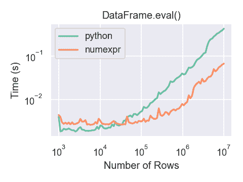

# 提高性能

> 原文：[`pandas.pydata.org/docs/user_guide/enhancingperf.html`](https://pandas.pydata.org/docs/user_guide/enhancingperf.html)

在本教程的这一部分中，我们将研究如何加速在 pandas 的`DataFrame`上操作的某些函数，使用 Cython、Numba 和`pandas.eval()`。通常，使用 Cython 和 Numba 可以比使用`pandas.eval()`提供更大的加速，但需要更多的代码。

注意

除了按照本教程中的步骤操作外，强烈建议有兴趣提高性能的用户安装 pandas 的推荐依赖项。这些依赖项通常不会默认安装，但如果存在将提供速度改进。

## Cython（为 pandas 编写 C 扩展）

对于许多用例，仅使用纯 Python 和 NumPy 编写 pandas 就足够了。然而，在一些计算密集型应用中，通过将工作转移到[cython](https://cython.org/)可以实现相当大的加速。

本教程假设您已经尽可能在 Python 中进行了重构，例如尝试消除 for 循环并利用 NumPy 的向量化。在 Python 中进行优化总是值得的。

本教程演示了将缓慢计算进行 Cython 化的“典型”过程。我们使用了来自 Cython 文档的一个[示例](https://docs.cython.org/en/latest/src/quickstart/cythonize.html)，但在 pandas 的上下文中。我们的最终 Cython 化解决方案比纯 Python 解决方案快约 100 倍。

### 纯 Python

我们有一个要对其进行逐行应用函数的`DataFrame`。

```py
In [1]: df = pd.DataFrame(
 ...:    {
 ...:        "a": np.random.randn(1000),
 ...:        "b": np.random.randn(1000),
 ...:        "N": np.random.randint(100, 1000, (1000)),
 ...:        "x": "x",
 ...:    }
 ...: )
 ...: 

In [2]: df
Out[2]: 
 a         b    N  x
0    0.469112 -0.218470  585  x
1   -0.282863 -0.061645  841  x
2   -1.509059 -0.723780  251  x
3   -1.135632  0.551225  972  x
4    1.212112 -0.497767  181  x
..        ...       ...  ... ..
995 -1.512743  0.874737  374  x
996  0.933753  1.120790  246  x
997 -0.308013  0.198768  157  x
998 -0.079915  1.757555  977  x
999 -1.010589 -1.115680  770  x

[1000 rows x 4 columns] 
```

这是纯 Python 中的函数：

```py
In [3]: def f(x):
 ...:    return x * (x - 1)
 ...: 

In [4]: def integrate_f(a, b, N):
 ...:    s = 0
 ...:    dx = (b - a) / N
 ...:    for i in range(N):
 ...:        s += f(a + i * dx)
 ...:    return s * dx
 ...: 
```

我们通过使用`DataFrame.apply()`（按行）来实现我们的结果：

```py
In [5]: %timeit df.apply(lambda x: integrate_f(x["a"], x["b"], x["N"]), axis=1)
74.9 ms +- 728 us per loop (mean +- std. dev. of 7 runs, 10 loops each) 
```

让我们看看在此操作期间花费时间的地方，使用[prun ipython 魔术函数](https://ipython.readthedocs.io/en/stable/interactive/magics.html#magic-prun)：

```py
# most time consuming 4 calls
In [6]: %prun -l 4 df.apply(lambda x: integrate_f(x["a"], x["b"], x["N"]), axis=1)  # noqa E999
 605956 function calls (605938 primitive calls) in 0.167 seconds

 Ordered by: internal time
 List reduced from 163 to 4 due to restriction <4>

 ncalls  tottime  percall  cumtime  percall filename:lineno(function)
 1000    0.097    0.000    0.148    0.000 <ipython-input-4-c2a74e076cf0>:1(integrate_f)
 552423    0.051    0.000    0.051    0.000 <ipython-input-3-c138bdd570e3>:1(f)
 3000    0.003    0.000    0.012    0.000 series.py:1095(__getitem__)
 3000    0.002    0.000    0.005    0.000 series.py:1220(_get_value) 
```

绝大部分时间都花费在`integrate_f`或`f`内部，因此我们将集中精力将这两个函数进行 Cython 化。### 纯 Cython

首先，我们需要在 IPython 中导入 Cython 魔术函数：

```py
In [7]: %load_ext Cython 
```

现在，让我们简单地将我们的函数复制到 Cython 中：

```py
In [8]: %%cython
 ...: def f_plain(x):
 ...:    return x * (x - 1)
 ...: def integrate_f_plain(a, b, N):
 ...:    s = 0
 ...:    dx = (b - a) / N
 ...:    for i in range(N):
 ...:        s += f_plain(a + i * dx)
 ...:    return s * dx
 ...: 
```

```py
In [9]: %timeit df.apply(lambda x: integrate_f_plain(x["a"], x["b"], x["N"]), axis=1)
46.6 ms +- 466 us per loop (mean +- std. dev. of 7 runs, 10 loops each) 
```

与纯 Python 方法相比，这已经将性能提升了三分之一。### 声明 C 类型

我们可以对函数变量和返回类型进行注释，以及使用`cdef`和`cpdef`来提高性能：

```py
In [10]: %%cython
 ....: cdef double f_typed(double x) except? -2:
 ....:    return x * (x - 1)
 ....: cpdef double integrate_f_typed(double a, double b, int N):
 ....:    cdef int i
 ....:    cdef double s, dx
 ....:    s = 0
 ....:    dx = (b - a) / N
 ....:    for i in range(N):
 ....:        s += f_typed(a + i * dx)
 ....:    return s * dx
 ....: 
```

```py
In [11]: %timeit df.apply(lambda x: integrate_f_typed(x["a"], x["b"], x["N"]), axis=1)
7.76 ms +- 83.8 us per loop (mean +- std. dev. of 7 runs, 100 loops each) 
```

使用 C 类型对函数进行注释，与原始的 Python 实现相比，性能提升了十多倍。### 使用 ndarray

在重新分析时，会花费时间从每一行创建一个`Series`，并从索引和系列中调用`__getitem__`（每行三次）。这些 Python 函数调用是昂贵的，可以通过传递`np.ndarray`来改进。

```py
In [12]: %prun -l 4 df.apply(lambda x: integrate_f_typed(x["a"], x["b"], x["N"]), axis=1)
 52533 function calls (52515 primitive calls) in 0.019 seconds

 Ordered by: internal time
 List reduced from 161 to 4 due to restriction <4>

 ncalls  tottime  percall  cumtime  percall filename:lineno(function)
 3000    0.003    0.000    0.012    0.000 series.py:1095(__getitem__)
 3000    0.002    0.000    0.005    0.000 series.py:1220(_get_value)
 3000    0.002    0.000    0.002    0.000 base.py:3777(get_loc)
 3000    0.002    0.000    0.002    0.000 indexing.py:2765(check_dict_or_set_indexers) 
```

```py
In [13]: %%cython
 ....: cimport numpy as np
 ....: import numpy as np
 ....: cdef double f_typed(double x) except? -2:
 ....:    return x * (x - 1)
 ....: cpdef double integrate_f_typed(double a, double b, int N):
 ....:    cdef int i
 ....:    cdef double s, dx
 ....:    s = 0
 ....:    dx = (b - a) / N
 ....:    for i in range(N):
 ....:        s += f_typed(a + i * dx)
 ....:    return s * dx
 ....: cpdef np.ndarray[double] apply_integrate_f(np.ndarray col_a, np.ndarray col_b,
 ....:                                           np.ndarray col_N):
 ....:    assert (col_a.dtype == np.float64
 ....:            and col_b.dtype == np.float64 and col_N.dtype == np.dtype(int))
 ....:    cdef Py_ssize_t i, n = len(col_N)
 ....:    assert (len(col_a) == len(col_b) == n)
 ....:    cdef np.ndarray[double] res = np.empty(n)
 ....:    for i in range(len(col_a)):
 ....:        res[i] = integrate_f_typed(col_a[i], col_b[i], col_N[i])
 ....:    return res
 ....: 
Content of stderr:
In file included from /home/runner/micromamba/envs/test/lib/python3.10/site-packages/numpy/core/include/numpy/ndarraytypes.h:1929,
 from /home/runner/micromamba/envs/test/lib/python3.10/site-packages/numpy/core/include/numpy/ndarrayobject.h:12,
 from /home/runner/micromamba/envs/test/lib/python3.10/site-packages/numpy/core/include/numpy/arrayobject.h:5,
 from /home/runner/.cache/ipython/cython/_cython_magic_96d1519457caba8fa4f96b759be00659f51c6b18.c:1215:
/home/runner/micromamba/envs/test/lib/python3.10/site-packages/numpy/core/include/numpy/npy_1_7_deprecated_api.h:17:2: warning: #warning "Using deprecated NumPy API, disable it with " "#define NPY_NO_DEPRECATED_API NPY_1_7_API_VERSION" [-Wcpp]
 17 | #warning "Using deprecated NumPy API, disable it with " \
 |  ^~~~~~~ 
```

该实现创建一个零数组，并插入应用于每一行的`integrate_f_typed`的结果。在 Cython 中循环`ndarray`比在`Series`对象上循环更快。

由于`apply_integrate_f`被类型化为接受`np.ndarray`，因此需要调用`Series.to_numpy()`来利用此函数。

```py
In [14]: %timeit apply_integrate_f(df["a"].to_numpy(), df["b"].to_numpy(), df["N"].to_numpy())
834 us +- 4.04 us per loop (mean +- std. dev. of 7 runs, 1,000 loops each) 
```

性能比以前的实现提高了近十倍。### 禁用编译器指令

现在大部分时间都花在`apply_integrate_f`上。禁用 Cython 的`boundscheck`和`wraparound`检查可以获得更多性能。

```py
In [15]: %prun -l 4 apply_integrate_f(df["a"].to_numpy(), df["b"].to_numpy(), df["N"].to_numpy())
 78 function calls in 0.001 seconds

 Ordered by: internal time
 List reduced from 21 to 4 due to restriction <4>

 ncalls  tottime  percall  cumtime  percall filename:lineno(function)
 1    0.001    0.001    0.001    0.001 <string>:1(<module>)
 1    0.000    0.000    0.001    0.001 {built-in method builtins.exec}
 3    0.000    0.000    0.000    0.000 frame.py:4062(__getitem__)
 3    0.000    0.000    0.000    0.000 base.py:541(to_numpy) 
```

```py
In [16]: %%cython
 ....: cimport cython
 ....: cimport numpy as np
 ....: import numpy as np
 ....: cdef np.float64_t f_typed(np.float64_t x) except? -2:
 ....:    return x * (x - 1)
 ....: cpdef np.float64_t integrate_f_typed(np.float64_t a, np.float64_t b, np.int64_t N):
 ....:    cdef np.int64_t i
 ....:    cdef np.float64_t s = 0.0, dx
 ....:    dx = (b - a) / N
 ....:    for i in range(N):
 ....:        s += f_typed(a + i * dx)
 ....:    return s * dx
 ....: @cython.boundscheck(False)
 ....: @cython.wraparound(False)
 ....: cpdef np.ndarray[np.float64_t] apply_integrate_f_wrap(
 ....:    np.ndarray[np.float64_t] col_a,
 ....:    np.ndarray[np.float64_t] col_b,
 ....:    np.ndarray[np.int64_t] col_N
 ....: ):
 ....:    cdef np.int64_t i, n = len(col_N)
 ....:    assert len(col_a) == len(col_b) == n
 ....:    cdef np.ndarray[np.float64_t] res = np.empty(n, dtype=np.float64)
 ....:    for i in range(n):
 ....:        res[i] = integrate_f_typed(col_a[i], col_b[i], col_N[i])
 ....:    return res
 ....: 
Content of stderr:
In file included from /home/runner/micromamba/envs/test/lib/python3.10/site-packages/numpy/core/include/numpy/ndarraytypes.h:1929,
 from /home/runner/micromamba/envs/test/lib/python3.10/site-packages/numpy/core/include/numpy/ndarrayobject.h:12,
 from /home/runner/micromamba/envs/test/lib/python3.10/site-packages/numpy/core/include/numpy/arrayobject.h:5,
 from /home/runner/.cache/ipython/cython/_cython_magic_3bb7bde31cdaf5ab952bfe5a612c6edef03550d0.c:1216:
/home/runner/micromamba/envs/test/lib/python3.10/site-packages/numpy/core/include/numpy/npy_1_7_deprecated_api.h:17:2: warning: #warning "Using deprecated NumPy API, disable it with " "#define NPY_NO_DEPRECATED_API NPY_1_7_API_VERSION" [-Wcpp]
 17 | #warning "Using deprecated NumPy API, disable it with " \
 |  ^~~~~~~ 
```

```py
In [17]: %timeit apply_integrate_f_wrap(df["a"].to_numpy(), df["b"].to_numpy(), df["N"].to_numpy())
620 us +- 2.65 us per loop (mean +- std. dev. of 7 runs, 1,000 loops each) 
```

然而，访问数组中无效位置的循环索引器`i`会导致段错误，因为内存访问没有经过检查。有关`boundscheck`和`wraparound`的更多信息，请参阅 Cython 文档中关于[编译器指令](https://cython.readthedocs.io/en/latest/src/userguide/source_files_and_compilation.html#compiler-directives)的部分。## Numba（JIT 编译）

作为静态编译 Cython 代码的替代方案，可以使用动态即时（JIT）编译器[Numba](https://numba.pydata.org/)。

Numba 允许您编写一个纯 Python 函数，该函数可以通过使用`@jit`装饰器编译为本机机器指令，性能类似于 C、C++和 Fortran，。

Numba 通过在导入时、运行时或静态（使用包含的 pycc 工具）生成优化的机器代码来工作。 Numba 支持将 Python 编译为在 CPU 或 GPU 硬件上运行，并设计用于与 Python 科学软件堆栈集成。

注意

`@jit`编译将增加函数运行时的开销，因此在使用小数据集时可能无法实现性能优势。考虑[缓存](https://numba.readthedocs.io/en/stable/developer/caching.html)您的函数，以避免每次运行函数时的编译开销。

Numba 可以与 pandas 一起以 2 种方式使用：

1.  在选择的 pandas 方法中指定`engine="numba"`关键字

1.  定义自己的 Python 函数，并使用`@jit`装饰器，并将`Series`或`DataFrame`的底层 NumPy 数组（使用`Series.to_numpy()`）传递给函数

### pandas Numba 引擎

如果已安装 Numba，可以在选择的 pandas 方法中指定`engine="numba"`以使用 Numba 执行该方法。支持`engine="numba"`的方法还将具有一个`engine_kwargs`关键字，接受一个字典，允许指定`"nogil"`、`"nopython"`和`"parallel"`键以及布尔值传递给`@jit`装饰器。如果未指定`engine_kwargs`，则默认为`{"nogil": False, "nopython": True, "parallel": False}`，除非另有规定。

注意

就性能而言，**使用 Numba 引擎运行函数的第一次将会很慢**，因为 Numba 会有一些函数编译开销。然而，JIT 编译的函数会被缓存，后续调用将会很快。一般来说，Numba 引擎在处理大量数据点时表现良好（例如 100 万个以上）。

```py
In [1]: data = pd.Series(range(1_000_000))  # noqa: E225

In [2]: roll = data.rolling(10)

In [3]: def f(x):
 ...:    return np.sum(x) + 5
# Run the first time, compilation time will affect performance
In [4]: %timeit -r 1 -n 1 roll.apply(f, engine='numba', raw=True)
1.23 s ± 0 ns per loop (mean ± std. dev. of 1 run, 1 loop each)
# Function is cached and performance will improve
In [5]: %timeit roll.apply(f, engine='numba', raw=True)
188 ms ± 1.93 ms per loop (mean ± std. dev. of 7 runs, 10 loops each)

In [6]: %timeit roll.apply(f, engine='cython', raw=True)
3.92 s ± 59 ms per loop (mean ± std. dev. of 7 runs, 1 loop each) 
```

如果您的计算硬件包含多个 CPU，则将`parallel`设置为`True`可以实现最大的性能增益，以利用多个 CPU。在内部，pandas 利用 numba 来并行计算`DataFrame`的列；因此，这种性能优势仅对具有大量列的`DataFrame`有益。

```py
In [1]: import numba

In [2]: numba.set_num_threads(1)

In [3]: df = pd.DataFrame(np.random.randn(10_000, 100))

In [4]: roll = df.rolling(100)

In [5]: %timeit roll.mean(engine="numba", engine_kwargs={"parallel": True})
347 ms ± 26 ms per loop (mean ± std. dev. of 7 runs, 1 loop each)

In [6]: numba.set_num_threads(2)

In [7]: %timeit roll.mean(engine="numba", engine_kwargs={"parallel": True})
201 ms ± 2.97 ms per loop (mean ± std. dev. of 7 runs, 1 loop each) 
```

### 自定义函数示例

通过使用`@jit`修饰的自定义 Python 函数，可以通过使用`Series.to_numpy()`将它们的 NumPy 数组表示传递给 pandas 对象。

```py
import numba

@numba.jit
def f_plain(x):
    return x * (x - 1)

@numba.jit
def integrate_f_numba(a, b, N):
    s = 0
    dx = (b - a) / N
    for i in range(N):
        s += f_plain(a + i * dx)
    return s * dx

@numba.jit
def apply_integrate_f_numba(col_a, col_b, col_N):
    n = len(col_N)
    result = np.empty(n, dtype="float64")
    assert len(col_a) == len(col_b) == n
    for i in range(n):
        result[i] = integrate_f_numba(col_a[i], col_b[i], col_N[i])
    return result

def compute_numba(df):
    result = apply_integrate_f_numba(
        df["a"].to_numpy(), df["b"].to_numpy(), df["N"].to_numpy()
    )
    return pd.Series(result, index=df.index, name="result") 
```

```py
In [4]: %timeit compute_numba(df)
1000 loops, best of 3: 798 us per loop 
```

在这个例子中，使用 Numba 比 Cython 更快。

Numba 还可以用于编写不需要用户显式循环遍历向量观测的向量化函数；向量化函数将自动应用于每一行。考虑以下示例，将每个观测值加倍：

```py
import numba

def double_every_value_nonumba(x):
    return x * 2

@numba.vectorize
def double_every_value_withnumba(x):  # noqa E501
    return x * 2 
```

```py
# Custom function without numba
In [5]: %timeit df["col1_doubled"] = df["a"].apply(double_every_value_nonumba)  # noqa E501
1000 loops, best of 3: 797 us per loop

# Standard implementation (faster than a custom function)
In [6]: %timeit df["col1_doubled"] = df["a"] * 2
1000 loops, best of 3: 233 us per loop

# Custom function with numba
In [7]: %timeit df["col1_doubled"] = double_every_value_withnumba(df["a"].to_numpy())
1000 loops, best of 3: 145 us per loop 
```

### 注意事项

Numba 最擅长加速将数值函数应用于 NumPy 数组的函数。如果尝试`@jit`一个包含不受支持的[Python](https://numba.readthedocs.io/en/stable/reference/pysupported.html)或[NumPy](https://numba.readthedocs.io/en/stable/reference/numpysupported.html)代码的函数，编译将会回退到[对象模式](https://numba.readthedocs.io/en/stable/glossary.html#term-object-mode)，这很可能不会加速您的函数。如果希望 Numba 在无法以加速代码的方式编译函数时抛出错误，请将参数`nopython=True`传递给 Numba（例如`@jit(nopython=True)`）。有关 Numba 模式故障排除的更多信息，请参阅[Numba 故障排除页面](https://numba.pydata.org/numba-doc/latest/user/troubleshoot.html#the-compiled-code-is-too-slow)。

使用`parallel=True`（例如`@jit(parallel=True)`）可能会导致`SIGABRT`，如果线程层导致不安全行为。您可以在使用`parallel=True`运行 JIT 函数之前，首先[指定一个安全的线程层](https://numba.readthedocs.io/en/stable/user/threading-layer.html#selecting-a-threading-layer-for-safe-parallel-execution)。

通常，如果在使用 Numba 时遇到段错误（`SIGSEGV`），请将问题报告给[Numba 问题跟踪器。](https://github.com/numba/numba/issues/new/choose)  ## 通过`eval()`进行表达式评估

顶层函数`pandas.eval()`实现了对`Series`和`DataFrame`的高性能表达式评估。表达式评估允许将操作表达为字符串，并且可以通过一次性评估大型`DataFrame`的算术和布尔表达式，潜在地提供性能改进。

注意

您不应该对简单表达式或涉及小 DataFrame 的表达式使用`eval()`。实际上，对于较小的表达式或对象，`eval()`比纯 Python 慢几个数量级。一个好的经验法则是只有在您有超过 10,000 行的`DataFrame`时才使用`eval()`。

### 支持的语法

这些操作由`pandas.eval()`支持：

+   算术运算，除了左移（`<<`）和右移（`>>`）运算符，例如，`df + 2 * pi / s ** 4 % 42 - the_golden_ratio`

+   比较操作，包括链式比较，例如，`2 < df < df2`

+   布尔运算，例如，`df < df2 and df3 < df4 or not df_bool`

+   `list`和`tuple`字面值，例如，`[1, 2]`或`(1, 2)`

+   属性访问，例如，`df.a`

+   下标表达式，例如，`df[0]`

+   简单变量评估，例如，`pd.eval("df")`（这并不是很有用）

+   数学函数：`sin`、`cos`、`exp`、`log`、`expm1`、`log1p`、`sqrt`、`sinh`、`cosh`、`tanh`、`arcsin`、`arccos`、`arctan`、`arccosh`、`arcsinh`、`arctanh`、`abs`、`arctan2`和`log10`。

以下 Python 语法**不**允许：

+   表达式

    > +   除数学函数外的函数调用。
    > +   
    > +   `is`/`is not`操作
    > +   
    > +   `if`表达式
    > +   
    > +   `lambda`表达式
    > +   
    > +   `list`/`set`/`dict`推导
    > +   
    > +   字面`dict`和`set`表达式
    > +   
    > +   `yield`表达式
    > +   
    > +   生成器表达式
    > +   
    > +   由标量值组成的布尔表达式

+   语句

    > +   不允许使用[简单](https://docs.python.org/3/reference/simple_stmts.html)或[复合](https://docs.python.org/3/reference/compound_stmts.html)语句。这包括`for`、`while`和`if`。

### 本地变量

你必须*显式引用*你想在表达式中使用的任何本地变量，方法是在名称前面放置`@`字符。这个机制对于`DataFrame.query()`和`DataFrame.eval()`都是相同的。例如，

```py
In [18]: df = pd.DataFrame(np.random.randn(5, 2), columns=list("ab"))

In [19]: newcol = np.random.randn(len(df))

In [20]: df.eval("b + @newcol")
Out[20]: 
0   -0.206122
1   -1.029587
2    0.519726
3   -2.052589
4    1.453210
dtype: float64

In [21]: df.query("b < @newcol")
Out[21]: 
 a         b
1  0.160268 -0.848896
3  0.333758 -1.180355
4  0.572182  0.439895 
```

如果你不在本地变量前面加上`@`前缀，pandas 会引发异常，告诉你该变量未定义。

当使用`DataFrame.eval()`和`DataFrame.query()`时，这允许你在表达式中拥有一个本地变量和一个`DataFrame`列具有相同的名称。

```py
In [22]: a = np.random.randn()

In [23]: df.query("@a < a")
Out[23]: 
 a         b
0  0.473349  0.891236
1  0.160268 -0.848896
2  0.803311  1.662031
3  0.333758 -1.180355
4  0.572182  0.439895

In [24]: df.loc[a < df["a"]]  # same as the previous expression
Out[24]: 
 a         b
0  0.473349  0.891236
1  0.160268 -0.848896
2  0.803311  1.662031
3  0.333758 -1.180355
4  0.572182  0.439895 
```

警告

如果你不能在那个上下文中使用`@`前缀，`pandas.eval()`会引发异常。

```py
In [25]: a, b = 1, 2

In [26]: pd.eval("@a + b")
Traceback (most recent call last):

 File ~/micromamba/envs/test/lib/python3.10/site-packages/IPython/core/interactiveshell.py:3577 in run_code
 exec(code_obj, self.user_global_ns, self.user_ns)

 Cell In[26], line 1
 pd.eval("@a + b")

 File ~/work/pandas/pandas/pandas/core/computation/eval.py:325 in eval
 _check_for_locals(expr, level, parser)

 File ~/work/pandas/pandas/pandas/core/computation/eval.py:167 in _check_for_locals
 raise SyntaxError(msg)

 File <string>
SyntaxError: The '@' prefix is not allowed in top-level eval calls.
please refer to your variables by name without the '@' prefix. 
```

在这种情况下，你应该像在标准 Python 中那样简单地引用变量。

```py
In [27]: pd.eval("a + b")
Out[27]: 3 
```

### `pandas.eval()` 解析器

有两种不同的表达式语法解析器。

默认的`'pandas'`解析器允许更直观地表达类似查询的操作（比较、连接和离散）。特别是，`&`和`|`运算符的优先级被设置为与相应布尔操作`and`和`or`的优先级相等。

例如，上面的连接可以不使用括号写出。或者，你可以使用`'python'`解析器来强制执行严格的 Python 语义。

```py
In [28]: nrows, ncols = 20000, 100

In [29]: df1, df2, df3, df4 = [pd.DataFrame(np.random.randn(nrows, ncols)) for _ in range(4)]

In [30]: expr = "(df1 > 0) & (df2 > 0) & (df3 > 0) & (df4 > 0)"

In [31]: x = pd.eval(expr, parser="python")

In [32]: expr_no_parens = "df1 > 0 & df2 > 0 & df3 > 0 & df4 > 0"

In [33]: y = pd.eval(expr_no_parens, parser="pandas")

In [34]: np.all(x == y)
Out[34]: True 
```

相同的表达式也可以用单词[`and`](https://docs.python.org/3/reference/expressions.html#and "(in Python v3.12)")“与”在一起：

```py
In [35]: expr = "(df1 > 0) & (df2 > 0) & (df3 > 0) & (df4 > 0)"

In [36]: x = pd.eval(expr, parser="python")

In [37]: expr_with_ands = "df1 > 0 and df2 > 0 and df3 > 0 and df4 > 0"

In [38]: y = pd.eval(expr_with_ands, parser="pandas")

In [39]: np.all(x == y)
Out[39]: True 
```

这里的[`and`](https://docs.python.org/3/reference/expressions.html#and "(in Python v3.12)")和[`or`](https://docs.python.org/3/reference/expressions.html#or "(in Python v3.12)")运算符具有与 Python 中相同的优先级。

### `pandas.eval()` 引擎

有两种不同的表达式引擎。

`'numexpr'`引擎是更高性能的引擎，可以相对于大型`DataFrame`的标准 Python 语法提供性能改进。这个引擎需要安装可选依赖`numexpr`。

`'python'` 引擎通常*不*有用，除非用于测试其他评估引擎。使用`engine='python'`和可能会导致性能下降，不会获得**任何**性能优势。

```py
In [40]: %timeit df1 + df2 + df3 + df4
7.42 ms +- 81.8 us per loop (mean +- std. dev. of 7 runs, 100 loops each) 
```

```py
In [41]: %timeit pd.eval("df1 + df2 + df3 + df4", engine="python")
8.11 ms +- 161 us per loop (mean +- std. dev. of 7 runs, 100 loops each) 
```

### `DataFrame.eval()` 方法

除了顶层的`pandas.eval()`函数外，还可以在`DataFrame`的“上下文”中评估表达式。

```py
In [42]: df = pd.DataFrame(np.random.randn(5, 2), columns=["a", "b"])

In [43]: df.eval("a + b")
Out[43]: 
0   -0.161099
1    0.805452
2    0.747447
3    1.189042
4   -2.057490
dtype: float64 
```

任何有效的`pandas.eval()`表达式也是有效的`DataFrame.eval()`表达式，额外的好处是您不必在要评估的列名前加上`DataFrame`的名称。

此外，您可以在表达式中执行列的赋值。这允许*公式化评估*。赋值目标可以是新列名或现有列名，必须是有效的 Python 标识符。

```py
In [44]: df = pd.DataFrame(dict(a=range(5), b=range(5, 10)))

In [45]: df = df.eval("c = a + b")

In [46]: df = df.eval("d = a + b + c")

In [47]: df = df.eval("a = 1")

In [48]: df
Out[48]: 
 a  b   c   d
0  1  5   5  10
1  1  6   7  14
2  1  7   9  18
3  1  8  11  22
4  1  9  13  26 
```

返回带有新列或修改列的`DataFrame`的副本，原始框架保持不变。

```py
In [49]: df
Out[49]: 
 a  b   c   d
0  1  5   5  10
1  1  6   7  14
2  1  7   9  18
3  1  8  11  22
4  1  9  13  26

In [50]: df.eval("e = a - c")
Out[50]: 
 a  b   c   d   e
0  1  5   5  10  -4
1  1  6   7  14  -6
2  1  7   9  18  -8
3  1  8  11  22 -10
4  1  9  13  26 -12

In [51]: df
Out[51]: 
 a  b   c   d
0  1  5   5  10
1  1  6   7  14
2  1  7   9  18
3  1  8  11  22
4  1  9  13  26 
```

可以通过使用多行字符串执行多列赋值。

```py
In [52]: df.eval(
 ....: """
 ....: c = a + b
 ....: d = a + b + c
 ....: a = 1""",
 ....: )
 ....: 
Out[52]: 
 a  b   c   d
0  1  5   6  12
1  1  6   7  14
2  1  7   8  16
3  1  8   9  18
4  1  9  10  20 
```

标准 Python 中的等效操作将是

```py
In [53]: df = pd.DataFrame(dict(a=range(5), b=range(5, 10)))

In [54]: df["c"] = df["a"] + df["b"]

In [55]: df["d"] = df["a"] + df["b"] + df["c"]

In [56]: df["a"] = 1

In [57]: df
Out[57]: 
 a  b   c   d
0  1  5   5  10
1  1  6   7  14
2  1  7   9  18
3  1  8  11  22
4  1  9  13  26 
```

### `eval()` 性能比较

`pandas.eval()` 在包含大型数组的表达式中表现良好。

```py
In [58]: nrows, ncols = 20000, 100

In [59]: df1, df2, df3, df4 = [pd.DataFrame(np.random.randn(nrows, ncols)) for _ in range(4)] 
```

`DataFrame` 算术：

```py
In [60]: %timeit df1 + df2 + df3 + df4
7.34 ms +- 117 us per loop (mean +- std. dev. of 7 runs, 100 loops each) 
```

```py
In [61]: %timeit pd.eval("df1 + df2 + df3 + df4")
2.85 ms +- 58.8 us per loop (mean +- std. dev. of 7 runs, 100 loops each) 
```

`DataFrame` 比较：

```py
In [62]: %timeit (df1 > 0) & (df2 > 0) & (df3 > 0) & (df4 > 0)
5.98 ms +- 37 us per loop (mean +- std. dev. of 7 runs, 100 loops each) 
```

```py
In [63]: %timeit pd.eval("(df1 > 0) & (df2 > 0) & (df3 > 0) & (df4 > 0)")
9.38 ms +- 36.7 us per loop (mean +- std. dev. of 7 runs, 100 loops each) 
```

`DataFrame` 具有不对齐轴的算术。

```py
In [64]: s = pd.Series(np.random.randn(50))

In [65]: %timeit df1 + df2 + df3 + df4 + s
12.6 ms +- 105 us per loop (mean +- std. dev. of 7 runs, 100 loops each) 
```

```py
In [66]: %timeit pd.eval("df1 + df2 + df3 + df4 + s")
3.69 ms +- 62 us per loop (mean +- std. dev. of 7 runs, 100 loops each) 
```

注意

操作如下

```py
1 and 2  # would parse to 1 & 2, but should evaluate to 2
3 or 4  # would parse to 3 | 4, but should evaluate to 3
~1  # this is okay, but slower when using eval 
```

应该在 Python 中执行。如果尝试对不是`bool`或`np.bool_`类型的标量操作执行任何布尔/位操作，将引发异常。

这里是一个图表，显示了`pandas.eval()`的运行时间与涉及计算的框架大小的关系。两条线代表两种不同的引擎。



只有当您的`DataFrame`的行数超过约 10 万行时，使用`numexpr`引擎与`pandas.eval()`才会带来性能优势。

此图是使用包含使用`numpy.random.randn()`生成的浮点值的 3 列的`DataFrame`创建的。

### 使用`numexpr`的表达式评估限制

由于`NaT`，导致对象 dtype 或涉及日期时间操作的表达式必须在 Python 空间中评估，但表达式的一部分仍然可以使用`numexpr`进行评估。例如：

```py
In [67]: df = pd.DataFrame(
 ....:    {"strings": np.repeat(list("cba"), 3), "nums": np.repeat(range(3), 3)}
 ....: )
 ....: 

In [68]: df
Out[68]: 
 strings  nums
0       c     0
1       c     0
2       c     0
3       b     1
4       b     1
5       b     1
6       a     2
7       a     2
8       a     2

In [69]: df.query("strings == 'a' and nums == 1")
Out[69]: 
Empty DataFrame
Columns: [strings, nums]
Index: [] 
```

比较的数值部分（`nums == 1`）将由`numexpr`评估，比较的对象部分（`"strings == 'a'`）将由 Python 评估。## Cython（为 pandas 编写 C 扩展）

对于许多用例，纯 Python 和 NumPy 编写 pandas 已经足够了。然而，在一些计算密集型应用中，通过将工作转移到[cython](https://cython.org/)可以实现相当大的加速。

本教程假设您已经尽可能在 Python 中进行了重构，例如尝试消除 for 循环并利用 NumPy 向量化。在 Python 中进行优化总是值得的。

本教程演示了将一个缓慢的计算转换为 Cython 的“典型”过程。我们使用了来自 Cython 文档的一个[示例](https://docs.cython.org/en/latest/src/quickstart/cythonize.html)，但在 pandas 的上下文中。我们的最终 cython 化解决方案比纯 Python 解决方案快约 100 倍。

### 纯 Python

我们有一个`DataFrame`，我们想要逐行应用一个函数。

```py
In [1]: df = pd.DataFrame(
 ...:    {
 ...:        "a": np.random.randn(1000),
 ...:        "b": np.random.randn(1000),
 ...:        "N": np.random.randint(100, 1000, (1000)),
 ...:        "x": "x",
 ...:    }
 ...: )
 ...: 

In [2]: df
Out[2]: 
 a         b    N  x
0    0.469112 -0.218470  585  x
1   -0.282863 -0.061645  841  x
2   -1.509059 -0.723780  251  x
3   -1.135632  0.551225  972  x
4    1.212112 -0.497767  181  x
..        ...       ...  ... ..
995 -1.512743  0.874737  374  x
996  0.933753  1.120790  246  x
997 -0.308013  0.198768  157  x
998 -0.079915  1.757555  977  x
999 -1.010589 -1.115680  770  x

[1000 rows x 4 columns] 
```

这是纯 Python 中的函数：

```py
In [3]: def f(x):
 ...:    return x * (x - 1)
 ...: 

In [4]: def integrate_f(a, b, N):
 ...:    s = 0
 ...:    dx = (b - a) / N
 ...:    for i in range(N):
 ...:        s += f(a + i * dx)
 ...:    return s * dx
 ...: 
```

我们通过使用`DataFrame.apply()`（逐行）来实现我们的结果：

```py
In [5]: %timeit df.apply(lambda x: integrate_f(x["a"], x["b"], x["N"]), axis=1)
74.9 ms +- 728 us per loop (mean +- std. dev. of 7 runs, 10 loops each) 
```

让我们看看在此操作期间时间花费在哪里，使用[prun ipython 魔术函数](https://ipython.readthedocs.io/en/stable/interactive/magics.html#magic-prun)：

```py
# most time consuming 4 calls
In [6]: %prun -l 4 df.apply(lambda x: integrate_f(x["a"], x["b"], x["N"]), axis=1)  # noqa E999
 605956 function calls (605938 primitive calls) in 0.167 seconds

 Ordered by: internal time
 List reduced from 163 to 4 due to restriction <4>

 ncalls  tottime  percall  cumtime  percall filename:lineno(function)
 1000    0.097    0.000    0.148    0.000 <ipython-input-4-c2a74e076cf0>:1(integrate_f)
 552423    0.051    0.000    0.051    0.000 <ipython-input-3-c138bdd570e3>:1(f)
 3000    0.003    0.000    0.012    0.000 series.py:1095(__getitem__)
 3000    0.002    0.000    0.005    0.000 series.py:1220(_get_value) 
```

绝大多数时间都花在`integrate_f`或`f`内部，因此我们将集中精力将这两个函数进行 cython 化。### 纯 Cython

首先，我们需要将 Cython 魔术函数导入到 IPython 中：

```py
In [7]: %load_ext Cython 
```

现在，让��们简单地将我们的函数复制到 Cython 中：

```py
In [8]: %%cython
 ...: def f_plain(x):
 ...:    return x * (x - 1)
 ...: def integrate_f_plain(a, b, N):
 ...:    s = 0
 ...:    dx = (b - a) / N
 ...:    for i in range(N):
 ...:        s += f_plain(a + i * dx)
 ...:    return s * dx
 ...: 
```

```py
In [9]: %timeit df.apply(lambda x: integrate_f_plain(x["a"], x["b"], x["N"]), axis=1)
46.6 ms +- 466 us per loop (mean +- std. dev. of 7 runs, 10 loops each) 
```

与纯 Python 方法相比，这将性能提升了三分之一。### 声明 C 类型

我们可以注释函数变量和返回类型，以及使用`cdef`和`cpdef`来提高性能：

```py
In [10]: %%cython
 ....: cdef double f_typed(double x) except? -2:
 ....:    return x * (x - 1)
 ....: cpdef double integrate_f_typed(double a, double b, int N):
 ....:    cdef int i
 ....:    cdef double s, dx
 ....:    s = 0
 ....:    dx = (b - a) / N
 ....:    for i in range(N):
 ....:        s += f_typed(a + i * dx)
 ....:    return s * dx
 ....: 
```

```py
In [11]: %timeit df.apply(lambda x: integrate_f_typed(x["a"], x["b"], x["N"]), axis=1)
7.76 ms +- 83.8 us per loop (mean +- std. dev. of 7 runs, 100 loops each) 
```

使用 C 类型对函数进行注释，与原始的 Python 实现相比，性能提升了十多倍。### 使用 ndarray

在重新分析时，时间花在从每一行创建一个`Series`，并且从索引和系列中调用`__getitem__`（每行三次）。这些 Python 函数调用很昂贵，可以通过传递一个`np.ndarray`来改进。

```py
In [12]: %prun -l 4 df.apply(lambda x: integrate_f_typed(x["a"], x["b"], x["N"]), axis=1)
 52533 function calls (52515 primitive calls) in 0.019 seconds

 Ordered by: internal time
 List reduced from 161 to 4 due to restriction <4>

 ncalls  tottime  percall  cumtime  percall filename:lineno(function)
 3000    0.003    0.000    0.012    0.000 series.py:1095(__getitem__)
 3000    0.002    0.000    0.005    0.000 series.py:1220(_get_value)
 3000    0.002    0.000    0.002    0.000 base.py:3777(get_loc)
 3000    0.002    0.000    0.002    0.000 indexing.py:2765(check_dict_or_set_indexers) 
```

```py
In [13]: %%cython
 ....: cimport numpy as np
 ....: import numpy as np
 ....: cdef double f_typed(double x) except? -2:
 ....:    return x * (x - 1)
 ....: cpdef double integrate_f_typed(double a, double b, int N):
 ....:    cdef int i
 ....:    cdef double s, dx
 ....:    s = 0
 ....:    dx = (b - a) / N
 ....:    for i in range(N):
 ....:        s += f_typed(a + i * dx)
 ....:    return s * dx
 ....: cpdef np.ndarray[double] apply_integrate_f(np.ndarray col_a, np.ndarray col_b,
 ....:                                           np.ndarray col_N):
 ....:    assert (col_a.dtype == np.float64
 ....:            and col_b.dtype == np.float64 and col_N.dtype == np.dtype(int))
 ....:    cdef Py_ssize_t i, n = len(col_N)
 ....:    assert (len(col_a) == len(col_b) == n)
 ....:    cdef np.ndarray[double] res = np.empty(n)
 ....:    for i in range(len(col_a)):
 ....:        res[i] = integrate_f_typed(col_a[i], col_b[i], col_N[i])
 ....:    return res
 ....: 
Content of stderr:
In file included from /home/runner/micromamba/envs/test/lib/python3.10/site-packages/numpy/core/include/numpy/ndarraytypes.h:1929,
 from /home/runner/micromamba/envs/test/lib/python3.10/site-packages/numpy/core/include/numpy/ndarrayobject.h:12,
 from /home/runner/micromamba/envs/test/lib/python3.10/site-packages/numpy/core/include/numpy/arrayobject.h:5,
 from /home/runner/.cache/ipython/cython/_cython_magic_96d1519457caba8fa4f96b759be00659f51c6b18.c:1215:
/home/runner/micromamba/envs/test/lib/python3.10/site-packages/numpy/core/include/numpy/npy_1_7_deprecated_api.h:17:2: warning: #warning "Using deprecated NumPy API, disable it with " "#define NPY_NO_DEPRECATED_API NPY_1_7_API_VERSION" [-Wcpp]
 17 | #warning "Using deprecated NumPy API, disable it with " \
 |  ^~~~~~~ 
```

这个实现创建一个零数组，并插入应用于每一行的`integrate_f_typed`的结果。在 Cython 中循环`ndarray`比在`Series`对象上循环更快。

由于`apply_integrate_f`被定义为接受一个`np.ndarray`，因此需要调用`Series.to_numpy()`来利用这个函数。

```py
In [14]: %timeit apply_integrate_f(df["a"].to_numpy(), df["b"].to_numpy(), df["N"].to_numpy())
834 us +- 4.04 us per loop (mean +- std. dev. of 7 runs, 1,000 loops each) 
```

性能比之前的实现提高了近十倍。### 禁用编译器指令

大部分时间现在花在`apply_integrate_f`上。禁用 Cython 的`boundscheck`和`wraparound`检查可以提高性能。

```py
In [15]: %prun -l 4 apply_integrate_f(df["a"].to_numpy(), df["b"].to_numpy(), df["N"].to_numpy())
 78 function calls in 0.001 seconds

 Ordered by: internal time
 List reduced from 21 to 4 due to restriction <4>

 ncalls  tottime  percall  cumtime  percall filename:lineno(function)
 1    0.001    0.001    0.001    0.001 <string>:1(<module>)
 1    0.000    0.000    0.001    0.001 {built-in method builtins.exec}
 3    0.000    0.000    0.000    0.000 frame.py:4062(__getitem__)
 3    0.000    0.000    0.000    0.000 base.py:541(to_numpy) 
```

```py
In [16]: %%cython
 ....: cimport cython
 ....: cimport numpy as np
 ....: import numpy as np
 ....: cdef np.float64_t f_typed(np.float64_t x) except? -2:
 ....:    return x * (x - 1)
 ....: cpdef np.float64_t integrate_f_typed(np.float64_t a, np.float64_t b, np.int64_t N):
 ....:    cdef np.int64_t i
 ....:    cdef np.float64_t s = 0.0, dx
 ....:    dx = (b - a) / N
 ....:    for i in range(N):
 ....:        s += f_typed(a + i * dx)
 ....:    return s * dx
 ....: @cython.boundscheck(False)
 ....: @cython.wraparound(False)
 ....: cpdef np.ndarray[np.float64_t] apply_integrate_f_wrap(
 ....:    np.ndarray[np.float64_t] col_a,
 ....:    np.ndarray[np.float64_t] col_b,
 ....:    np.ndarray[np.int64_t] col_N
 ....: ):
 ....:    cdef np.int64_t i, n = len(col_N)
 ....:    assert len(col_a) == len(col_b) == n
 ....:    cdef np.ndarray[np.float64_t] res = np.empty(n, dtype=np.float64)
 ....:    for i in range(n):
 ....:        res[i] = integrate_f_typed(col_a[i], col_b[i], col_N[i])
 ....:    return res
 ....: 
Content of stderr:
In file included from /home/runner/micromamba/envs/test/lib/python3.10/site-packages/numpy/core/include/numpy/ndarraytypes.h:1929,
 from /home/runner/micromamba/envs/test/lib/python3.10/site-packages/numpy/core/include/numpy/ndarrayobject.h:12,
 from /home/runner/micromamba/envs/test/lib/python3.10/site-packages/numpy/core/include/numpy/arrayobject.h:5,
 from /home/runner/.cache/ipython/cython/_cython_magic_3bb7bde31cdaf5ab952bfe5a612c6edef03550d0.c:1216:
/home/runner/micromamba/envs/test/lib/python3.10/site-packages/numpy/core/include/numpy/npy_1_7_deprecated_api.h:17:2: warning: #warning "Using deprecated NumPy API, disable it with " "#define NPY_NO_DEPRECATED_API NPY_1_7_API_VERSION" [-Wcpp]
 17 | #warning "Using deprecated NumPy API, disable it with " \
 |  ^~~~~~~ 
```

```py
In [17]: %timeit apply_integrate_f_wrap(df["a"].to_numpy(), df["b"].to_numpy(), df["N"].to_numpy())
620 us +- 2.65 us per loop (mean +- std. dev. of 7 runs, 1,000 loops each) 
```

然而，循环索引器`i`访问数组中的无效位置会导致段错误，因为内存访问没有检查。有关`boundscheck`和`wraparound`的更多信息，请参阅 Cython 文档中关于[编译器指令](https://cython.readthedocs.io/en/latest/src/userguide/source_files_and_compilation.html#compiler-directives)的部分。### 纯 Python

我们有一个`DataFrame`，我们想要逐行应用一个函数。

```py
In [1]: df = pd.DataFrame(
 ...:    {
 ...:        "a": np.random.randn(1000),
 ...:        "b": np.random.randn(1000),
 ...:        "N": np.random.randint(100, 1000, (1000)),
 ...:        "x": "x",
 ...:    }
 ...: )
 ...: 

In [2]: df
Out[2]: 
 a         b    N  x
0    0.469112 -0.218470  585  x
1   -0.282863 -0.061645  841  x
2   -1.509059 -0.723780  251  x
3   -1.135632  0.551225  972  x
4    1.212112 -0.497767  181  x
..        ...       ...  ... ..
995 -1.512743  0.874737  374  x
996  0.933753  1.120790  246  x
997 -0.308013  0.198768  157  x
998 -0.079915  1.757555  977  x
999 -1.010589 -1.115680  770  x

[1000 rows x 4 columns] 
```

这是纯 Python 中的函数：

```py
In [3]: def f(x):
 ...:    return x * (x - 1)
 ...: 

In [4]: def integrate_f(a, b, N):
 ...:    s = 0
 ...:    dx = (b - a) / N
 ...:    for i in range(N):
 ...:        s += f(a + i * dx)
 ...:    return s * dx
 ...: 
```

我们通过使用`DataFrame.apply()`（逐行）来实现我们的结果：

```py
In [5]: %timeit df.apply(lambda x: integrate_f(x["a"], x["b"], x["N"]), axis=1)
74.9 ms +- 728 us per loop (mean +- std. dev. of 7 runs, 10 loops each) 
```

让我们看看在这个操作中时间花在哪里，使用[prun ipython magic function](https://ipython.readthedocs.io/en/stable/interactive/magics.html#magic-prun)：

```py
# most time consuming 4 calls
In [6]: %prun -l 4 df.apply(lambda x: integrate_f(x["a"], x["b"], x["N"]), axis=1)  # noqa E999
 605956 function calls (605938 primitive calls) in 0.167 seconds

 Ordered by: internal time
 List reduced from 163 to 4 due to restriction <4>

 ncalls  tottime  percall  cumtime  percall filename:lineno(function)
 1000    0.097    0.000    0.148    0.000 <ipython-input-4-c2a74e076cf0>:1(integrate_f)
 552423    0.051    0.000    0.051    0.000 <ipython-input-3-c138bdd570e3>:1(f)
 3000    0.003    0.000    0.012    0.000 series.py:1095(__getitem__)
 3000    0.002    0.000    0.005    0.000 series.py:1220(_get_value) 
```

绝大部分时间都花在`integrate_f`或`f`内部，因此我们将集中精力将这两个函数进行 Cython 化。

### 纯 Cython

首先，我们需要将 Cython 魔术函数导入到 IPython 中：

```py
In [7]: %load_ext Cython 
```

现在，让我们简单地将我们的函数复制到 Cython 中：

```py
In [8]: %%cython
 ...: def f_plain(x):
 ...:    return x * (x - 1)
 ...: def integrate_f_plain(a, b, N):
 ...:    s = 0
 ...:    dx = (b - a) / N
 ...:    for i in range(N):
 ...:        s += f_plain(a + i * dx)
 ...:    return s * dx
 ...: 
```

```py
In [9]: %timeit df.apply(lambda x: integrate_f_plain(x["a"], x["b"], x["N"]), axis=1)
46.6 ms +- 466 us per loop (mean +- std. dev. of 7 runs, 10 loops each) 
```

与纯 Python 方法相比，性能提高了三分之一。

### 声明 C 类型

我们可以注释函数变量和返回类型，以及使用`cdef`和`cpdef`来提高性能：

```py
In [10]: %%cython
 ....: cdef double f_typed(double x) except? -2:
 ....:    return x * (x - 1)
 ....: cpdef double integrate_f_typed(double a, double b, int N):
 ....:    cdef int i
 ....:    cdef double s, dx
 ....:    s = 0
 ....:    dx = (b - a) / N
 ....:    for i in range(N):
 ....:        s += f_typed(a + i * dx)
 ....:    return s * dx
 ....: 
```

```py
In [11]: %timeit df.apply(lambda x: integrate_f_typed(x["a"], x["b"], x["N"]), axis=1)
7.76 ms +- 83.8 us per loop (mean +- std. dev. of 7 runs, 100 loops each) 
```

使用 C 类型注释函数与原始 Python 实现相比，性能提高了十倍以上。

### 使用 ndarray

在重新分析时，时间花在从每一行创建一个`Series`，并且从索引和系列中调用`__getitem__`（每行三次）。这些 Python 函数调用很昂贵，可以通过传递一个`np.ndarray`来改进。

```py
In [12]: %prun -l 4 df.apply(lambda x: integrate_f_typed(x["a"], x["b"], x["N"]), axis=1)
 52533 function calls (52515 primitive calls) in 0.019 seconds

 Ordered by: internal time
 List reduced from 161 to 4 due to restriction <4>

 ncalls  tottime  percall  cumtime  percall filename:lineno(function)
 3000    0.003    0.000    0.012    0.000 series.py:1095(__getitem__)
 3000    0.002    0.000    0.005    0.000 series.py:1220(_get_value)
 3000    0.002    0.000    0.002    0.000 base.py:3777(get_loc)
 3000    0.002    0.000    0.002    0.000 indexing.py:2765(check_dict_or_set_indexers) 
```

```py
In [13]: %%cython
 ....: cimport numpy as np
 ....: import numpy as np
 ....: cdef double f_typed(double x) except? -2:
 ....:    return x * (x - 1)
 ....: cpdef double integrate_f_typed(double a, double b, int N):
 ....:    cdef int i
 ....:    cdef double s, dx
 ....:    s = 0
 ....:    dx = (b - a) / N
 ....:    for i in range(N):
 ....:        s += f_typed(a + i * dx)
 ....:    return s * dx
 ....: cpdef np.ndarray[double] apply_integrate_f(np.ndarray col_a, np.ndarray col_b,
 ....:                                           np.ndarray col_N):
 ....:    assert (col_a.dtype == np.float64
 ....:            and col_b.dtype == np.float64 and col_N.dtype == np.dtype(int))
 ....:    cdef Py_ssize_t i, n = len(col_N)
 ....:    assert (len(col_a) == len(col_b) == n)
 ....:    cdef np.ndarray[double] res = np.empty(n)
 ....:    for i in range(len(col_a)):
 ....:        res[i] = integrate_f_typed(col_a[i], col_b[i], col_N[i])
 ....:    return res
 ....: 
Content of stderr:
In file included from /home/runner/micromamba/envs/test/lib/python3.10/site-packages/numpy/core/include/numpy/ndarraytypes.h:1929,
 from /home/runner/micromamba/envs/test/lib/python3.10/site-packages/numpy/core/include/numpy/ndarrayobject.h:12,
 from /home/runner/micromamba/envs/test/lib/python3.10/site-packages/numpy/core/include/numpy/arrayobject.h:5,
 from /home/runner/.cache/ipython/cython/_cython_magic_96d1519457caba8fa4f96b759be00659f51c6b18.c:1215:
/home/runner/micromamba/envs/test/lib/python3.10/site-packages/numpy/core/include/numpy/npy_1_7_deprecated_api.h:17:2: warning: #warning "Using deprecated NumPy API, disable it with " "#define NPY_NO_DEPRECATED_API NPY_1_7_API_VERSION" [-Wcpp]
 17 | #warning "Using deprecated NumPy API, disable it with " \
 |  ^~~~~~~ 
```

这个实现创建了一个零数组，并插入了对每一行应用`integrate_f_typed`的结果。在 Cython 中循环遍历`ndarray`比循环遍历`Series`对象更快。

由于`apply_integrate_f`被定义为接受`np.ndarray`，因此需要调用`Series.to_numpy()`来利用这个函数。

```py
In [14]: %timeit apply_integrate_f(df["a"].to_numpy(), df["b"].to_numpy(), df["N"].to_numpy())
834 us +- 4.04 us per loop (mean +- std. dev. of 7 runs, 1,000 loops each) 
```

性能比以前的实现提高了近十倍。

### 禁用编译器指令

现在大部分时间都花在了`apply_integrate_f`上。禁用 Cython 的`boundscheck`和`wraparound`检查可以提高性能。

```py
In [15]: %prun -l 4 apply_integrate_f(df["a"].to_numpy(), df["b"].to_numpy(), df["N"].to_numpy())
 78 function calls in 0.001 seconds

 Ordered by: internal time
 List reduced from 21 to 4 due to restriction <4>

 ncalls  tottime  percall  cumtime  percall filename:lineno(function)
 1    0.001    0.001    0.001    0.001 <string>:1(<module>)
 1    0.000    0.000    0.001    0.001 {built-in method builtins.exec}
 3    0.000    0.000    0.000    0.000 frame.py:4062(__getitem__)
 3    0.000    0.000    0.000    0.000 base.py:541(to_numpy) 
```

```py
In [16]: %%cython
 ....: cimport cython
 ....: cimport numpy as np
 ....: import numpy as np
 ....: cdef np.float64_t f_typed(np.float64_t x) except? -2:
 ....:    return x * (x - 1)
 ....: cpdef np.float64_t integrate_f_typed(np.float64_t a, np.float64_t b, np.int64_t N):
 ....:    cdef np.int64_t i
 ....:    cdef np.float64_t s = 0.0, dx
 ....:    dx = (b - a) / N
 ....:    for i in range(N):
 ....:        s += f_typed(a + i * dx)
 ....:    return s * dx
 ....: @cython.boundscheck(False)
 ....: @cython.wraparound(False)
 ....: cpdef np.ndarray[np.float64_t] apply_integrate_f_wrap(
 ....:    np.ndarray[np.float64_t] col_a,
 ....:    np.ndarray[np.float64_t] col_b,
 ....:    np.ndarray[np.int64_t] col_N
 ....: ):
 ....:    cdef np.int64_t i, n = len(col_N)
 ....:    assert len(col_a) == len(col_b) == n
 ....:    cdef np.ndarray[np.float64_t] res = np.empty(n, dtype=np.float64)
 ....:    for i in range(n):
 ....:        res[i] = integrate_f_typed(col_a[i], col_b[i], col_N[i])
 ....:    return res
 ....: 
Content of stderr:
In file included from /home/runner/micromamba/envs/test/lib/python3.10/site-packages/numpy/core/include/numpy/ndarraytypes.h:1929,
 from /home/runner/micromamba/envs/test/lib/python3.10/site-packages/numpy/core/include/numpy/ndarrayobject.h:12,
 from /home/runner/micromamba/envs/test/lib/python3.10/site-packages/numpy/core/include/numpy/arrayobject.h:5,
 from /home/runner/.cache/ipython/cython/_cython_magic_3bb7bde31cdaf5ab952bfe5a612c6edef03550d0.c:1216:
/home/runner/micromamba/envs/test/lib/python3.10/site-packages/numpy/core/include/numpy/npy_1_7_deprecated_api.h:17:2: warning: #warning "Using deprecated NumPy API, disable it with " "#define NPY_NO_DEPRECATED_API NPY_1_7_API_VERSION" [-Wcpp]
 17 | #warning "Using deprecated NumPy API, disable it with " \
 |  ^~~~~~~ 
```

```py
In [17]: %timeit apply_integrate_f_wrap(df["a"].to_numpy(), df["b"].to_numpy(), df["N"].to_numpy())
620 us +- 2.65 us per loop (mean +- std. dev. of 7 runs, 1,000 loops each) 
```

然而，循环索引器`i`访问数组中的无效位置会导致段错误，因为内存访问没有被检查。有关`boundscheck`和`wraparound`的更多信息，请参阅 Cython 文档中关于[编译器指令](https://cython.readthedocs.io/en/latest/src/userguide/source_files_and_compilation.html#compiler-directives)的部分。

## Numba（即时编译）

一个替代静态编译 Cython 代码的方法是使用动态即时（JIT）编译器[Numba](https://numba.pydata.org/)。

Numba 允许您编写一个纯 Python 函数，可以通过使用`@jit`装饰将其 JIT 编译为本机机器指令，性能类似于 C、C++和 Fortran。

Numba 通过在导入时、运行时或静态（使用包含的 pycc 工具）生成优化的机器代码来工作。Numba 支持将 Python 编译为在 CPU 或 GPU 硬件上运行，并设计用于与 Python 科学软件堆栈集成。

注意

`@jit`编译会增加函数运行时的开销，因此在使用小数据集时可能无法实现性能优势。考虑[缓存](https://numba.readthedocs.io/en/stable/developer/caching.html)你的函数，以避免每次运行函数时的编译开销。

Numba 可以在 pandas 中以两种方式使用：

1.  在选择的 pandas 方法中指定`engine="numba"`关键字

1.  定义自己的 Python 函数，并用`@jit`装饰，将`Series`或`DataFrame`的底层 NumPy 数组（使用`Series.to_numpy()`）传递给函数。

### pandas Numba 引擎

如果已安装 Numba，可以在选择 pandas 方法中指定 `engine="numba"` 来使用 Numba 执行该方法。支持 `engine="numba"` 的方法还将具有一个 `engine_kwargs` 关键字，接受一个字典，允许指定 `"nogil"`、`"nopython"` 和 `"parallel"` 键以及布尔值传递给 `@jit` 装饰器。如果未指定 `engine_kwargs`，则默认为 `{"nogil": False, "nopython": True, "parallel": False}`，除非另有规定。

注意

就性能而言，**使用 Numba 引擎运行函数的第一次将会很慢**，因为 Numba 将有一些函数编译开销。然而，JIT 编译的函数会被缓存，后续调用将会很快。一般来说，Numba 引擎在大量数据点（例如 100 万以上）上表现良好。

```py
In [1]: data = pd.Series(range(1_000_000))  # noqa: E225

In [2]: roll = data.rolling(10)

In [3]: def f(x):
 ...:    return np.sum(x) + 5
# Run the first time, compilation time will affect performance
In [4]: %timeit -r 1 -n 1 roll.apply(f, engine='numba', raw=True)
1.23 s ± 0 ns per loop (mean ± std. dev. of 1 run, 1 loop each)
# Function is cached and performance will improve
In [5]: %timeit roll.apply(f, engine='numba', raw=True)
188 ms ± 1.93 ms per loop (mean ± std. dev. of 7 runs, 10 loops each)

In [6]: %timeit roll.apply(f, engine='cython', raw=True)
3.92 s ± 59 ms per loop (mean ± std. dev. of 7 runs, 1 loop each) 
```

如果您的计算硬件包含多个 CPU，将 `parallel` 设置为 `True` 可以实现最大的性能提升，以利用多个 CPU。在内部，pandas 利用 numba 对 `DataFrame` 的列进行并行计算；因此，这种性能优势仅对具有大量列的 `DataFrame` 有益。

```py
In [1]: import numba

In [2]: numba.set_num_threads(1)

In [3]: df = pd.DataFrame(np.random.randn(10_000, 100))

In [4]: roll = df.rolling(100)

In [5]: %timeit roll.mean(engine="numba", engine_kwargs={"parallel": True})
347 ms ± 26 ms per loop (mean ± std. dev. of 7 runs, 1 loop each)

In [6]: numba.set_num_threads(2)

In [7]: %timeit roll.mean(engine="numba", engine_kwargs={"parallel": True})
201 ms ± 2.97 ms per loop (mean ± std. dev. of 7 runs, 1 loop each) 
```

### 自定义函数示例

通过使用 `Series.to_numpy()` 将 pandas 对象的 NumPy 数组表示传递给自定义 Python 函数，并使用 `@jit` 装饰器可以与 pandas 对象一起使用。

```py
import numba

@numba.jit
def f_plain(x):
    return x * (x - 1)

@numba.jit
def integrate_f_numba(a, b, N):
    s = 0
    dx = (b - a) / N
    for i in range(N):
        s += f_plain(a + i * dx)
    return s * dx

@numba.jit
def apply_integrate_f_numba(col_a, col_b, col_N):
    n = len(col_N)
    result = np.empty(n, dtype="float64")
    assert len(col_a) == len(col_b) == n
    for i in range(n):
        result[i] = integrate_f_numba(col_a[i], col_b[i], col_N[i])
    return result

def compute_numba(df):
    result = apply_integrate_f_numba(
        df["a"].to_numpy(), df["b"].to_numpy(), df["N"].to_numpy()
    )
    return pd.Series(result, index=df.index, name="result") 
```

```py
In [4]: %timeit compute_numba(df)
1000 loops, best of 3: 798 us per loop 
```

在这个例子中，使用 Numba 比 Cython 更快。

Numba 还可以用于编写不需要用户显式循环观察向量的向量化函数；向量化函数将自动应用于每一行。考虑以下示例，将每个观察值加倍：

```py
import numba

def double_every_value_nonumba(x):
    return x * 2

@numba.vectorize
def double_every_value_withnumba(x):  # noqa E501
    return x * 2 
```

```py
# Custom function without numba
In [5]: %timeit df["col1_doubled"] = df["a"].apply(double_every_value_nonumba)  # noqa E501
1000 loops, best of 3: 797 us per loop

# Standard implementation (faster than a custom function)
In [6]: %timeit df["col1_doubled"] = df["a"] * 2
1000 loops, best of 3: 233 us per loop

# Custom function with numba
In [7]: %timeit df["col1_doubled"] = double_every_value_withnumba(df["a"].to_numpy())
1000 loops, best of 3: 145 us per loop 
```

### 注意事项

Numba 最擅长加速将数值函数应用于 NumPy 数组的函数。如果尝试对包含不受支持的 [Python](https://numba.readthedocs.io/en/stable/reference/pysupported.html) 或 [NumPy](https://numba.readthedocs.io/en/stable/reference/numpysupported.html) 代码的函数进行 `@jit`，编译将会回退到 [object mode](https://numba.readthedocs.io/en/stable/glossary.html#term-object-mode)，这很可能不会加速函数。如果希望 Numba 在无法编译函数以加速代码时抛出错误，请传递参数 `nopython=True` 给 Numba（例如 `@jit(nopython=True)`）。有关故障排除 Numba 模式的更多信息，请参阅 [Numba 故障排除页面](https://numba.pydata.org/numba-doc/latest/user/troubleshoot.html#the-compiled-code-is-too-slow)。

使用`parallel=True`（例如`@jit(parallel=True)`）可能会导致`SIGABRT`，如果线程层导致不安全行为。您可以在使用`parallel=True`运行 JIT 函数之前，首先[指定一个安全的线程层](https://numba.readthedocs.io/en/stable/user/threading-layer.html#selecting-a-threading-layer-for-safe-parallel-execution)。

通常，如果在使用 Numba 时遇到段错误（`SIGSEGV`），请将问题报告给[Numba 问题跟踪器。](https://github.com/numba/numba/issues/new/choose)

### pandas Numba 引擎

如果安装了 Numba，可以在选择 pandas 方法中指定`engine="numba"`以使用 Numba 执行该方法。支持`engine="numba"`的方法还将具有一个`engine_kwargs`关键字，接受一个字典，允许指定`"nogil"`、`"nopython"`和`"parallel"`键及其布尔值传递给`@jit`装饰器。如果未指定`engine_kwargs`，则默认为`{"nogil": False, "nopython": True, "parallel": False}`，除非另有规定。

注意

就性能而言，**使用 Numba 引擎运行函数的第一次将会很慢**，因为 Numba 将有一些函数编译开销。然而，JIT 编译的函数会被缓存，后续调用将会很快。一般来说，Numba 引擎在大量数据点（例如 100 万个以上）上表现良好。

```py
In [1]: data = pd.Series(range(1_000_000))  # noqa: E225

In [2]: roll = data.rolling(10)

In [3]: def f(x):
 ...:    return np.sum(x) + 5
# Run the first time, compilation time will affect performance
In [4]: %timeit -r 1 -n 1 roll.apply(f, engine='numba', raw=True)
1.23 s ± 0 ns per loop (mean ± std. dev. of 1 run, 1 loop each)
# Function is cached and performance will improve
In [5]: %timeit roll.apply(f, engine='numba', raw=True)
188 ms ± 1.93 ms per loop (mean ± std. dev. of 7 runs, 10 loops each)

In [6]: %timeit roll.apply(f, engine='cython', raw=True)
3.92 s ± 59 ms per loop (mean ± std. dev. of 7 runs, 1 loop each) 
```

如果您的计算硬件包含多个 CPU，通过将`parallel`设置为`True`可以实现最大的性能提升，以利用多个 CPU。在内部，pandas 利用 numba 来并行计算`DataFrame`的列；因此，这种性能优势仅对具有大量列的`DataFrame`有益。

```py
In [1]: import numba

In [2]: numba.set_num_threads(1)

In [3]: df = pd.DataFrame(np.random.randn(10_000, 100))

In [4]: roll = df.rolling(100)

In [5]: %timeit roll.mean(engine="numba", engine_kwargs={"parallel": True})
347 ms ± 26 ms per loop (mean ± std. dev. of 7 runs, 1 loop each)

In [6]: numba.set_num_threads(2)

In [7]: %timeit roll.mean(engine="numba", engine_kwargs={"parallel": True})
201 ms ± 2.97 ms per loop (mean ± std. dev. of 7 runs, 1 loop each) 
```

### 自定义函数示例

通过使用`@jit`装饰的自定义 Python 函数，可以通过`Series.to_numpy()`将它们的 NumPy 数组表示传递给 pandas 对象。

```py
import numba

@numba.jit
def f_plain(x):
    return x * (x - 1)

@numba.jit
def integrate_f_numba(a, b, N):
    s = 0
    dx = (b - a) / N
    for i in range(N):
        s += f_plain(a + i * dx)
    return s * dx

@numba.jit
def apply_integrate_f_numba(col_a, col_b, col_N):
    n = len(col_N)
    result = np.empty(n, dtype="float64")
    assert len(col_a) == len(col_b) == n
    for i in range(n):
        result[i] = integrate_f_numba(col_a[i], col_b[i], col_N[i])
    return result

def compute_numba(df):
    result = apply_integrate_f_numba(
        df["a"].to_numpy(), df["b"].to_numpy(), df["N"].to_numpy()
    )
    return pd.Series(result, index=df.index, name="result") 
```

```py
In [4]: %timeit compute_numba(df)
1000 loops, best of 3: 798 us per loop 
```

在这个例子中，使用 Numba 比 Cython 更快。

Numba 还可以用于编写矢量化函数，无需用户显式循环遍历向量的观测值；矢量化函数将自动应用于每一行。考虑以下示例，将每个观测值加倍：

```py
import numba

def double_every_value_nonumba(x):
    return x * 2

@numba.vectorize
def double_every_value_withnumba(x):  # noqa E501
    return x * 2 
```

```py
# Custom function without numba
In [5]: %timeit df["col1_doubled"] = df["a"].apply(double_every_value_nonumba)  # noqa E501
1000 loops, best of 3: 797 us per loop

# Standard implementation (faster than a custom function)
In [6]: %timeit df["col1_doubled"] = df["a"] * 2
1000 loops, best of 3: 233 us per loop

# Custom function with numba
In [7]: %timeit df["col1_doubled"] = double_every_value_withnumba(df["a"].to_numpy())
1000 loops, best of 3: 145 us per loop 
```

### 注意事项

Numba 最擅长加速将数值函数应用于 NumPy 数组的函数。如果尝试`@jit`一个包含不受支持的[Python](https://numba.readthedocs.io/en/stable/reference/pysupported.html)或[NumPy](https://numba.readthedocs.io/en/stable/reference/numpysupported.html)代码的函数，编译将会回到[对象模式](https://numba.readthedocs.io/en/stable/glossary.html#term-object-mode)，这通常不会加速您的函数。如果希望 Numba 在无法编译函数以加快代码速度时抛出错误，请向 Numba 传递参数`nopython=True`（例如，`@jit(nopython=True)`）。有关 Numba 模式故障排除的更多信息，请参阅[Numba 故障排除页面](https://numba.pydata.org/numba-doc/latest/user/troubleshoot.html#the-compiled-code-is-too-slow)。

使用`parallel=True`（例如，`@jit(parallel=True)`）可能会导致`SIGABRT`，如果线程层导致不安全的行为。在使用`parallel=True`运行 JIT 函数之前，可以首先[指定安全的线程层](https://numba.readthedocs.io/en/stable/user/threading-layer.html#selecting-a-threading-layer-for-safe-parallel-execution)。

通常，如果在使用 Numba 时遇到了段错误（`SIGSEGV`），请将问题报告给[Numba 问题跟踪器。](https://github.com/numba/numba/issues/new/choose)

## 通过`eval()`进行表达式评估

顶层函数`pandas.eval()`实现了`Series`和`DataFrame`的高性能表达式评估。表达式评估允许将操作表示为字符串，并且可以通过一次评估大型`DataFrame`上的所有算术和布尔表达式来提供性能改进。

注意

对于简单表达式或涉及小型 DataFrame 的表达式，不应使用`eval()`。事实上，对于较小的表达式或对象，`eval()`比纯 Python 慢几个数量级。一个好的经验法则是仅在具有超过 10,000 行的`DataFrame`时使用`eval()`。

### 支持的语法

这些操作由`pandas.eval()`支持：

+   除了左移（`<<`）和右移（`>>`）操作符之外的算术操作，例如，`df + 2 * pi / s ** 4 % 42 - the_golden_ratio`

+   包括链式比较在内的比较操作，例如，`2 < df < df2`

+   布尔操作，例如，`df < df2 and df3 < df4 or not df_bool`

+   `list`和`tuple`字面值，例如，`[1, 2]`或`(1, 2)`

+   属性访问，例如，`df.a`

+   下标表达式，例如，`df[0]`

+   简单的变量评估，例如，`pd.eval("df")`（这并不是很有用）

+   数学函数：`sin`、`cos`、`exp`、`log`、`expm1`、`log1p`、`sqrt`、`sinh`、`cosh`、`tanh`、`arcsin`、`arccos`、`arctan`、`arccosh`、`arcsinh`、`arctanh`、`abs`、`arctan2`和`log10`。

以下 Python 语法**不**允许：

+   表达式

    > +   除数学函数外的函数调用。
    > +   
    > +   `is`/`is not`操作
    > +   
    > +   `if`表达式
    > +   
    > +   `lambda`表达式
    > +   
    > +   `list`/`set`/`dict`推导式
    > +   
    > +   字面`dict`和`set`表达式
    > +   
    > +   `yield`表达式
    > +   
    > +   生成器表达式
    > +   
    > +   由标量值组成的布尔表达式

+   语句

    > +   既不允许[简单](https://docs.python.org/3/reference/simple_stmts.html)也不允许[复合](https://docs.python.org/3/reference/compound_stmts.html)语句。这包括`for`、`while`和`if`。

### 本地变量

您必须*显式引用*您想在表达式中使用的任何本地变量，方法是在名称前面放置`@`字符。这个机制对于`DataFrame.query()`和`DataFrame.eval()`都是相同的。例如，

```py
In [18]: df = pd.DataFrame(np.random.randn(5, 2), columns=list("ab"))

In [19]: newcol = np.random.randn(len(df))

In [20]: df.eval("b + @newcol")
Out[20]: 
0   -0.206122
1   -1.029587
2    0.519726
3   -2.052589
4    1.453210
dtype: float64

In [21]: df.query("b < @newcol")
Out[21]: 
 a         b
1  0.160268 -0.848896
3  0.333758 -1.180355
4  0.572182  0.439895 
```

如果您没有使用`@`前缀来引用本地变量，pandas 将引发异常，告诉您该变量未定义。

当使用`DataFrame.eval()`和`DataFrame.query()`时，这允许您在表达式中具有与局部变量和`DataFrame`列相同的名称。

```py
In [22]: a = np.random.randn()

In [23]: df.query("@a < a")
Out[23]: 
 a         b
0  0.473349  0.891236
1  0.160268 -0.848896
2  0.803311  1.662031
3  0.333758 -1.180355
4  0.572182  0.439895

In [24]: df.loc[a < df["a"]]  # same as the previous expression
Out[24]: 
 a         b
0  0.473349  0.891236
1  0.160268 -0.848896
2  0.803311  1.662031
3  0.333758 -1.180355
4  0.572182  0.439895 
```

警告

`pandas.eval()`如果您在该上下文中不能使用`@`前缀，将会引发异常，因为它在那个上下文中未定义。

```py
In [25]: a, b = 1, 2

In [26]: pd.eval("@a + b")
Traceback (most recent call last):

 File ~/micromamba/envs/test/lib/python3.10/site-packages/IPython/core/interactiveshell.py:3577 in run_code
 exec(code_obj, self.user_global_ns, self.user_ns)

 Cell In[26], line 1
 pd.eval("@a + b")

 File ~/work/pandas/pandas/pandas/core/computation/eval.py:325 in eval
 _check_for_locals(expr, level, parser)

 File ~/work/pandas/pandas/pandas/core/computation/eval.py:167 in _check_for_locals
 raise SyntaxError(msg)

 File <string>
SyntaxError: The '@' prefix is not allowed in top-level eval calls.
please refer to your variables by name without the '@' prefix. 
```

在这种情况下，您应该像在标准 Python 中那样简单地引用变量。

```py
In [27]: pd.eval("a + b")
Out[27]: 3 
```

### `pandas.eval()`解析器

有两种不同的表达语法解析器。

默认的`'pandas'`解析器允许更直观的语法来表达类似查询的操作（比较、连接和或）。特别是，`&`和`|`运算符的优先级被设置为与相应的布尔操作`and`和`or`相等。

例如，上述连接可以不使用括号来编写。或者，您可以使用`'python'`解析器来强制执行严格的 Python 语义。

```py
In [28]: nrows, ncols = 20000, 100

In [29]: df1, df2, df3, df4 = [pd.DataFrame(np.random.randn(nrows, ncols)) for _ in range(4)]

In [30]: expr = "(df1 > 0) & (df2 > 0) & (df3 > 0) & (df4 > 0)"

In [31]: x = pd.eval(expr, parser="python")

In [32]: expr_no_parens = "df1 > 0 & df2 > 0 & df3 > 0 & df4 > 0"

In [33]: y = pd.eval(expr_no_parens, parser="pandas")

In [34]: np.all(x == y)
Out[34]: True 
```

相同的表达式也可以用单词[`and`](https://docs.python.org/3/reference/expressions.html#and "(in Python v3.12)")“与”在一起：

```py
In [35]: expr = "(df1 > 0) & (df2 > 0) & (df3 > 0) & (df4 > 0)"

In [36]: x = pd.eval(expr, parser="python")

In [37]: expr_with_ands = "df1 > 0 and df2 > 0 and df3 > 0 and df4 > 0"

In [38]: y = pd.eval(expr_with_ands, parser="pandas")

In [39]: np.all(x == y)
Out[39]: True 
```

这里的[`and`](https://docs.python.org/3/reference/expressions.html#and "(in Python v3.12)")和[`or`](https://docs.python.org/3/reference/expressions.html#or "(in Python v3.12)")运算符具有与 Python 中相同的优先级。

### `pandas.eval()`引擎

有两种不同的表达式引擎。

`'numexpr'`引擎是更高性能的引擎，可以相对于大型`DataFrame`的标准 Python 语法带来性能改进。此引擎需要安装可选依赖项`numexpr`。

`'python'`引擎通常*不*有用，除非用于测试其他评估引擎。使用`engine='python'`和可能会导致性能下降，不会获得**任何**性能优势。

```py
In [40]: %timeit df1 + df2 + df3 + df4
7.42 ms +- 81.8 us per loop (mean +- std. dev. of 7 runs, 100 loops each) 
```

```py
In [41]: %timeit pd.eval("df1 + df2 + df3 + df4", engine="python")
8.11 ms +- 161 us per loop (mean +- std. dev. of 7 runs, 100 loops each) 
```

### `DataFrame.eval()`方法

除了顶层`pandas.eval()`函数外，您还可以在`DataFrame`的“上下文”中评估表达式。

```py
In [42]: df = pd.DataFrame(np.random.randn(5, 2), columns=["a", "b"])

In [43]: df.eval("a + b")
Out[43]: 
0   -0.161099
1    0.805452
2    0.747447
3    1.189042
4   -2.057490
dtype: float64 
```

任何有效的`pandas.eval()`表达式也是有效的`DataFrame.eval()`表达式，额外的好处是您不必在要评估的列名前加上`DataFrame`的名称。

此外，您可以在表达式中执行列的赋值。这允许*公式化评估*。赋值目标可以是新列名或现有列名，并且必须是有效的 Python 标识符。

```py
In [44]: df = pd.DataFrame(dict(a=range(5), b=range(5, 10)))

In [45]: df = df.eval("c = a + b")

In [46]: df = df.eval("d = a + b + c")

In [47]: df = df.eval("a = 1")

In [48]: df
Out[48]: 
 a  b   c   d
0  1  5   5  10
1  1  6   7  14
2  1  7   9  18
3  1  8  11  22
4  1  9  13  26 
```

返回具有新列或修改列的`DataFrame`的副本，原始框架保持不变。

```py
In [49]: df
Out[49]: 
 a  b   c   d
0  1  5   5  10
1  1  6   7  14
2  1  7   9  18
3  1  8  11  22
4  1  9  13  26

In [50]: df.eval("e = a - c")
Out[50]: 
 a  b   c   d   e
0  1  5   5  10  -4
1  1  6   7  14  -6
2  1  7   9  18  -8
3  1  8  11  22 -10
4  1  9  13  26 -12

In [51]: df
Out[51]: 
 a  b   c   d
0  1  5   5  10
1  1  6   7  14
2  1  7   9  18
3  1  8  11  22
4  1  9  13  26 
```

可以通过使用多行字符串执行多列赋值。

```py
In [52]: df.eval(
 ....: """
 ....: c = a + b
 ....: d = a + b + c
 ....: a = 1""",
 ....: )
 ....: 
Out[52]: 
 a  b   c   d
0  1  5   6  12
1  1  6   7  14
2  1  7   8  16
3  1  8   9  18
4  1  9  10  20 
```

标准 Python 中的等效操作将是

```py
In [53]: df = pd.DataFrame(dict(a=range(5), b=range(5, 10)))

In [54]: df["c"] = df["a"] + df["b"]

In [55]: df["d"] = df["a"] + df["b"] + df["c"]

In [56]: df["a"] = 1

In [57]: df
Out[57]: 
 a  b   c   d
0  1  5   5  10
1  1  6   7  14
2  1  7   9  18
3  1  8  11  22
4  1  9  13  26 
```

### `eval()`性能比较

`pandas.eval()`在包含大型数组的表达式中表现良好。

```py
In [58]: nrows, ncols = 20000, 100

In [59]: df1, df2, df3, df4 = [pd.DataFrame(np.random.randn(nrows, ncols)) for _ in range(4)] 
```

`DataFrame`算术：

```py
In [60]: %timeit df1 + df2 + df3 + df4
7.34 ms +- 117 us per loop (mean +- std. dev. of 7 runs, 100 loops each) 
```

```py
In [61]: %timeit pd.eval("df1 + df2 + df3 + df4")
2.85 ms +- 58.8 us per loop (mean +- std. dev. of 7 runs, 100 loops each) 
```

`DataFrame`比较：

```py
In [62]: %timeit (df1 > 0) & (df2 > 0) & (df3 > 0) & (df4 > 0)
5.98 ms +- 37 us per loop (mean +- std. dev. of 7 runs, 100 loops each) 
```

```py
In [63]: %timeit pd.eval("(df1 > 0) & (df2 > 0) & (df3 > 0) & (df4 > 0)")
9.38 ms +- 36.7 us per loop (mean +- std. dev. of 7 runs, 100 loops each) 
```

`DataFrame`在未对齐轴上的算术运算。

```py
In [64]: s = pd.Series(np.random.randn(50))

In [65]: %timeit df1 + df2 + df3 + df4 + s
12.6 ms +- 105 us per loop (mean +- std. dev. of 7 runs, 100 loops each) 
```

```py
In [66]: %timeit pd.eval("df1 + df2 + df3 + df4 + s")
3.69 ms +- 62 us per loop (mean +- std. dev. of 7 runs, 100 loops each) 
```

注意

诸如

```py
1 and 2  # would parse to 1 & 2, but should evaluate to 2
3 or 4  # would parse to 3 | 4, but should evaluate to 3
~1  # this is okay, but slower when using eval 
```

应在 Python 中执行。如果尝试对不是`bool`或`np.bool_`类型的标量操作数执行任何布尔/位操作，将引发异常。

这里是一个显示`pandas.eval()`运行时间与涉及计算的数据框大小的函数关系的图。两条线代表两种不同的引擎。


只有当您的`DataFrame`的行数超过约 10 万行时，使用`numexpr`引擎与`pandas.eval()`才能看到性能优势。

此图是使用包含使用`numpy.random.randn()`生成的浮点值的 3 列的`DataFrame`创建的。

### 使用`numexpr`的表达式评估限制

由于`NaT`，会导致对象 dtype 或涉及日期时间操作的表达式必须在 Python 空间中评估，但表达式的一部分仍然可以使用`numexpr`评估。例如：

```py
In [67]: df = pd.DataFrame(
 ....:    {"strings": np.repeat(list("cba"), 3), "nums": np.repeat(range(3), 3)}
 ....: )
 ....: 

In [68]: df
Out[68]: 
 strings  nums
0       c     0
1       c     0
2       c     0
3       b     1
4       b     1
5       b     1
6       a     2
7       a     2
8       a     2

In [69]: df.query("strings == 'a' and nums == 1")
Out[69]: 
Empty DataFrame
Columns: [strings, nums]
Index: [] 
```

比较的数值部分（`nums == 1`）将由`numexpr`评估，比较的对象部分（`"strings == 'a'`）将由 Python 评估。

### 支持的语法

这些操作由`pandas.eval()`支持：

+   除左移（`<<`）和右移（`>>`）运算符外的算术运算，例如，`df + 2 * pi / s ** 4 % 42 - the_golden_ratio`

+   比较操作，包括链式比较，例如，`2 < df < df2`

+   布尔运算，例如，`df < df2 and df3 < df4 or not df_bool`

+   `list`和`tuple`字面值，例如，`[1, 2]`或`(1, 2)`

+   属性访问，例如，`df.a`

+   下标表达式，例如，`df[0]`

+   简单的变量评估，例如，`pd.eval("df")`（这并不是很有用）

+   数学函数：`sin`、`cos`、`exp`、`log`、`expm1`、`log1p`、`sqrt`、`sinh`、`cosh`、`tanh`、`arcsin`、`arccos`、`arctan`、`arccosh`、`arcsinh`、`arctanh`、`abs`、`arctan2`和`log10`。

以下 Python 语法**不**允许：

+   表达式

    > +   除数学函数外的函数调用。
    > +   
    > +   `is`/`is not`操作
    > +   
    > +   `if`表达式
    > +   
    > +   `lambda`表达式
    > +   
    > +   `list`/`set`/`dict`推导式
    > +   
    > +   字面`dict`和`set`表达式
    > +   
    > +   `yield`表达式
    > +   
    > +   生成器表达式
    > +   
    > +   仅由标量值组成的布尔表达式

+   语句

    > +   不允许简单或复合语句。这包括`for`、`while`和`if`。

### 局部变量

你必须通过在名称前加上`@`字符来*显式引用*任何你想在表达式中使用的本地变量。这个机制对于`DataFrame.query()`和`DataFrame.eval()`都是相同的。例如，

```py
In [18]: df = pd.DataFrame(np.random.randn(5, 2), columns=list("ab"))

In [19]: newcol = np.random.randn(len(df))

In [20]: df.eval("b + @newcol")
Out[20]: 
0   -0.206122
1   -1.029587
2    0.519726
3   -2.052589
4    1.453210
dtype: float64

In [21]: df.query("b < @newcol")
Out[21]: 
 a         b
1  0.160268 -0.848896
3  0.333758 -1.180355
4  0.572182  0.439895 
```

如果你不在本地变量前加上`@`前缀，pandas 会引发一个异常，告诉你该变量未定义。

在使用`DataFrame.eval()`和`DataFrame.query()`时，这允许你在表达式中同时拥有一个本地变量和一个`DataFrame`列具有相同的名称。

```py
In [22]: a = np.random.randn()

In [23]: df.query("@a < a")
Out[23]: 
 a         b
0  0.473349  0.891236
1  0.160268 -0.848896
2  0.803311  1.662031
3  0.333758 -1.180355
4  0.572182  0.439895

In [24]: df.loc[a < df["a"]]  # same as the previous expression
Out[24]: 
 a         b
0  0.473349  0.891236
1  0.160268 -0.848896
2  0.803311  1.662031
3  0.333758 -1.180355
4  0.572182  0.439895 
```

警告

如果你不能在上下文中使用`@`前缀因为它没有被定义，`pandas.eval()`会引发一个异常。

```py
In [25]: a, b = 1, 2

In [26]: pd.eval("@a + b")
Traceback (most recent call last):

 File ~/micromamba/envs/test/lib/python3.10/site-packages/IPython/core/interactiveshell.py:3577 in run_code
 exec(code_obj, self.user_global_ns, self.user_ns)

 Cell In[26], line 1
 pd.eval("@a + b")

 File ~/work/pandas/pandas/pandas/core/computation/eval.py:325 in eval
 _check_for_locals(expr, level, parser)

 File ~/work/pandas/pandas/pandas/core/computation/eval.py:167 in _check_for_locals
 raise SyntaxError(msg)

 File <string>
SyntaxError: The '@' prefix is not allowed in top-level eval calls.
please refer to your variables by name without the '@' prefix. 
```

在这种情况下，你应该像在标准 Python 中那样简单地引用变量。

```py
In [27]: pd.eval("a + b")
Out[27]: 3 
```

### `pandas.eval()`解析器

有两种不同的表达式语法解析器。

默认的`'pandas'`解析器允许更直观地表达类似查询的操作（比较、连接和分离）。特别是，`&`和`|`运算符的优先级被设置为与相应的布尔运算`and`和`or`相同。

例如，上面的连接词可以不用括号写。或者，你可以使用`'python'`解析器来强制执行严格的 Python 语义。

```py
In [28]: nrows, ncols = 20000, 100

In [29]: df1, df2, df3, df4 = [pd.DataFrame(np.random.randn(nrows, ncols)) for _ in range(4)]

In [30]: expr = "(df1 > 0) & (df2 > 0) & (df3 > 0) & (df4 > 0)"

In [31]: x = pd.eval(expr, parser="python")

In [32]: expr_no_parens = "df1 > 0 & df2 > 0 & df3 > 0 & df4 > 0"

In [33]: y = pd.eval(expr_no_parens, parser="pandas")

In [34]: np.all(x == y)
Out[34]: True 
```

同样的表达式也可以用单词[`and`](https://docs.python.org/3/reference/expressions.html#and "(在 Python v3.12 中)")来“与”起来：

```py
In [35]: expr = "(df1 > 0) & (df2 > 0) & (df3 > 0) & (df4 > 0)"

In [36]: x = pd.eval(expr, parser="python")

In [37]: expr_with_ands = "df1 > 0 and df2 > 0 and df3 > 0 and df4 > 0"

In [38]: y = pd.eval(expr_with_ands, parser="pandas")

In [39]: np.all(x == y)
Out[39]: True 
```

这里的[`and`](https://docs.python.org/3/reference/expressions.html#and "(在 Python v3.12 中)")和[`or`](https://docs.python.org/3/reference/expressions.html#or "(在 Python v3.12 中)")运算符具有与 Python 中相同的优先级。

### `pandas.eval()`引擎

有两种不同的表达式引擎。

`'numexpr'`引擎是更高性能的引擎，可以相对于大型`DataFrame`的标准 Python 语法带来性能改进。这个引擎需要安装可选依赖`numexpr`。

`'python'`引擎通常*不*有用，除了用于测试其他评估引擎。使用`engine='python'`和`eval()`不会带来任何性能优势，反而可能会降低性能。

```py
In [40]: %timeit df1 + df2 + df3 + df4
7.42 ms +- 81.8 us per loop (mean +- std. dev. of 7 runs, 100 loops each) 
```

```py
In [41]: %timeit pd.eval("df1 + df2 + df3 + df4", engine="python")
8.11 ms +- 161 us per loop (mean +- std. dev. of 7 runs, 100 loops each) 
```

### `DataFrame.eval()`方法

除了顶层`pandas.eval()`函数外，您还可以在`DataFrame`的“上下文”中评估表达式。

```py
In [42]: df = pd.DataFrame(np.random.randn(5, 2), columns=["a", "b"])

In [43]: df.eval("a + b")
Out[43]: 
0   -0.161099
1    0.805452
2    0.747447
3    1.189042
4   -2.057490
dtype: float64 
```

任何有效的`pandas.eval()`表达式也是有效的`DataFrame.eval()`表达式，额外的好处是您不必在感兴趣的列名之前加上`DataFrame`的名称。

此外，您可以在表达式中执行列的赋值。这允许*公式评估*。赋值目标可以是新列名或现有列名，并且必须是有效的 Python 标识符。

```py
In [44]: df = pd.DataFrame(dict(a=range(5), b=range(5, 10)))

In [45]: df = df.eval("c = a + b")

In [46]: df = df.eval("d = a + b + c")

In [47]: df = df.eval("a = 1")

In [48]: df
Out[48]: 
 a  b   c   d
0  1  5   5  10
1  1  6   7  14
2  1  7   9  18
3  1  8  11  22
4  1  9  13  26 
```

返回具有新列或修改列的`DataFrame`的副本，原始框架保持不变。

```py
In [49]: df
Out[49]: 
 a  b   c   d
0  1  5   5  10
1  1  6   7  14
2  1  7   9  18
3  1  8  11  22
4  1  9  13  26

In [50]: df.eval("e = a - c")
Out[50]: 
 a  b   c   d   e
0  1  5   5  10  -4
1  1  6   7  14  -6
2  1  7   9  18  -8
3  1  8  11  22 -10
4  1  9  13  26 -12

In [51]: df
Out[51]: 
 a  b   c   d
0  1  5   5  10
1  1  6   7  14
2  1  7   9  18
3  1  8  11  22
4  1  9  13  26 
```

可以通过使用多行字符串执行多列赋值。

```py
In [52]: df.eval(
 ....: """
 ....: c = a + b
 ....: d = a + b + c
 ....: a = 1""",
 ....: )
 ....: 
Out[52]: 
 a  b   c   d
0  1  5   6  12
1  1  6   7  14
2  1  7   8  16
3  1  8   9  18
4  1  9  10  20 
```

标准 Python 中的等效操作是

```py
In [53]: df = pd.DataFrame(dict(a=range(5), b=range(5, 10)))

In [54]: df["c"] = df["a"] + df["b"]

In [55]: df["d"] = df["a"] + df["b"] + df["c"]

In [56]: df["a"] = 1

In [57]: df
Out[57]: 
 a  b   c   d
0  1  5   5  10
1  1  6   7  14
2  1  7   9  18
3  1  8  11  22
4  1  9  13  26 
```

### `eval()`性能比较

`pandas.eval()`适用于包含大型数组的表达式。

```py
In [58]: nrows, ncols = 20000, 100

In [59]: df1, df2, df3, df4 = [pd.DataFrame(np.random.randn(nrows, ncols)) for _ in range(4)] 
```

`DataFrame`算术：

```py
In [60]: %timeit df1 + df2 + df3 + df4
7.34 ms +- 117 us per loop (mean +- std. dev. of 7 runs, 100 loops each) 
```

```py
In [61]: %timeit pd.eval("df1 + df2 + df3 + df4")
2.85 ms +- 58.8 us per loop (mean +- std. dev. of 7 runs, 100 loops each) 
```

`DataFrame`比较：

```py
In [62]: %timeit (df1 > 0) & (df2 > 0) & (df3 > 0) & (df4 > 0)
5.98 ms +- 37 us per loop (mean +- std. dev. of 7 runs, 100 loops each) 
```

```py
In [63]: %timeit pd.eval("(df1 > 0) & (df2 > 0) & (df3 > 0) & (df4 > 0)")
9.38 ms +- 36.7 us per loop (mean +- std. dev. of 7 runs, 100 loops each) 
```

具有不对齐轴的`DataFrame`算术。

```py
In [64]: s = pd.Series(np.random.randn(50))

In [65]: %timeit df1 + df2 + df3 + df4 + s
12.6 ms +- 105 us per loop (mean +- std. dev. of 7 runs, 100 loops each) 
```

```py
In [66]: %timeit pd.eval("df1 + df2 + df3 + df4 + s")
3.69 ms +- 62 us per loop (mean +- std. dev. of 7 runs, 100 loops each) 
```

注意

在 Python 中应执行诸如

```py
1 and 2  # would parse to 1 & 2, but should evaluate to 2
3 or 4  # would parse to 3 | 4, but should evaluate to 3
~1  # this is okay, but slower when using eval 
```

如果尝试对不是`bool`或`np.bool_`类型的标量操作执行任何布尔/位操作，将引发异常。

这里是一个显示`pandas.eval()`运行时间与涉及计算的框架大小函数关系的图表。两条线代表两种不同的引擎。


只有当您的`DataFrame`的行数超过约 100,000 行时，使用`numexpr`引擎与`pandas.eval()`才能看到性能优势。

此图是使用包含使用`numpy.random.randn()`生成的浮点值的 3 列的`DataFrame`创建的。

### 使用`numexpr`的表达式评估限制

由于`NaT`会导致结果为对象数据类型或涉及日期时间操作，因此表达式必须在 Python 空间中进行评估，但表达式的一部分仍然可以使用`numexpr`进行评估。例如：

```py
In [67]: df = pd.DataFrame(
 ....:    {"strings": np.repeat(list("cba"), 3), "nums": np.repeat(range(3), 3)}
 ....: )
 ....: 

In [68]: df
Out[68]: 
 strings  nums
0       c     0
1       c     0
2       c     0
3       b     1
4       b     1
5       b     1
6       a     2
7       a     2
8       a     2

In [69]: df.query("strings == 'a' and nums == 1")
Out[69]: 
Empty DataFrame
Columns: [strings, nums]
Index: [] 
```

比较的数值部分（`nums == 1`）将由`numexpr`评估，而比较的对象部分（`"strings == 'a'`）将由 Python 评估。
