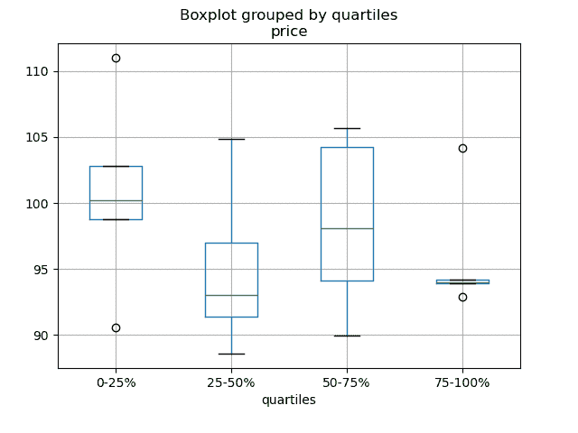

# 食谱

> 原文：[`pandas.pydata.org/docs/user_guide/cookbook.html`](https://pandas.pydata.org/docs/user_guide/cookbook.html)

这是一个*简短而精炼*的示例和链接存储库，包含有用的 pandas 示例。我们鼓励用户为此文档添加内容。

在这一部分添加有趣的链接和/或内联示例是一个很好的*首次拉取请求*。

在可能的情况下，已插入简化、精简、适合新用户的内联示例，以补充 Stack-Overflow 和 GitHub 链接。许多链接包含了比内联示例提供的更详细的信息。

pandas（pd）和 NumPy（np）是唯一两个缩写导入的模块。其余模块都明确导入，以供新用户使用。

## 习语

这些都是一些很棒的 pandas `习语`

[对一列进行 if-then/if-then-else 条件判断，并对另一列或多列进行赋值：](https://stackoverflow.com/questions/17128302/python-pandas-idiom-for-if-then-else)

```py
In [1]: df = pd.DataFrame(
 ...:    {"AAA": [4, 5, 6, 7], "BBB": [10, 20, 30, 40], "CCC": [100, 50, -30, -50]}
 ...: )
 ...: 

In [2]: df
Out[2]: 
 AAA  BBB  CCC
0    4   10  100
1    5   20   50
2    6   30  -30
3    7   40  -50 
```

### if-then…

对一列进行 if-then 条件判断

```py
In [3]: df.loc[df.AAA >= 5, "BBB"] = -1

In [4]: df
Out[4]: 
 AAA  BBB  CCC
0    4   10  100
1    5   -1   50
2    6   -1  -30
3    7   -1  -50 
```

一个带有对 2 列赋值的 if-then：

```py
In [5]: df.loc[df.AAA >= 5, ["BBB", "CCC"]] = 555

In [6]: df
Out[6]: 
 AAA  BBB  CCC
0    4   10  100
1    5  555  555
2    6  555  555
3    7  555  555 
```

添加另一行具有不同逻辑，以执行-else

```py
In [7]: df.loc[df.AAA < 5, ["BBB", "CCC"]] = 2000

In [8]: df
Out[8]: 
 AAA   BBB   CCC
0    4  2000  2000
1    5   555   555
2    6   555   555
3    7   555   555 
```

或者在设置了掩码之后使用 pandas where

```py
In [9]: df_mask = pd.DataFrame(
 ...:    {"AAA": [True] * 4, "BBB": [False] * 4, "CCC": [True, False] * 2}
 ...: )
 ...: 

In [10]: df.where(df_mask, -1000)
Out[10]: 
 AAA   BBB   CCC
0    4 -1000  2000
1    5 -1000 -1000
2    6 -1000   555
3    7 -1000 -1000 
```

[使用 NumPy 的 where()进行 if-then-else 条件判断](https://stackoverflow.com/questions/19913659/pandas-conditional-creation-of-a-series-dataframe-column)

```py
In [11]: df = pd.DataFrame(
 ....:    {"AAA": [4, 5, 6, 7], "BBB": [10, 20, 30, 40], "CCC": [100, 50, -30, -50]}
 ....: )
 ....: 

In [12]: df
Out[12]: 
 AAA  BBB  CCC
0    4   10  100
1    5   20   50
2    6   30  -30
3    7   40  -50

In [13]: df["logic"] = np.where(df["AAA"] > 5, "high", "low")

In [14]: df
Out[14]: 
 AAA  BBB  CCC logic
0    4   10  100   low
1    5   20   50   low
2    6   30  -30  high
3    7   40  -50  high 
```

### 分割

[使用布尔条件拆分数据框](https://stackoverflow.com/questions/14957116/how-to-split-a-dataframe-according-to-a-boolean-criterion)

```py
In [15]: df = pd.DataFrame(
 ....:    {"AAA": [4, 5, 6, 7], "BBB": [10, 20, 30, 40], "CCC": [100, 50, -30, -50]}
 ....: )
 ....: 

In [16]: df
Out[16]: 
 AAA  BBB  CCC
0    4   10  100
1    5   20   50
2    6   30  -30
3    7   40  -50

In [17]: df[df.AAA <= 5]
Out[17]: 
 AAA  BBB  CCC
0    4   10  100
1    5   20   50

In [18]: df[df.AAA > 5]
Out[18]: 
 AAA  BBB  CCC
2    6   30  -30
3    7   40  -50 
```

### 构建条件

[使用多列条件进行选择](https://stackoverflow.com/questions/15315452/selecting-with-complex-criteria-from-pandas-dataframe)

```py
In [19]: df = pd.DataFrame(
 ....:    {"AAA": [4, 5, 6, 7], "BBB": [10, 20, 30, 40], "CCC": [100, 50, -30, -50]}
 ....: )
 ....: 

In [20]: df
Out[20]: 
 AAA  BBB  CCC
0    4   10  100
1    5   20   50
2    6   30  -30
3    7   40  -50 
```

…并且（不带赋值返回一个 Series）

```py
In [21]: df.loc[(df["BBB"] < 25) & (df["CCC"] >= -40), "AAA"]
Out[21]: 
0    4
1    5
Name: AAA, dtype: int64 
```

…或者（不带赋值返回一个 Series）

```py
In [22]: df.loc[(df["BBB"] > 25) | (df["CCC"] >= -40), "AAA"]
Out[22]: 
0    4
1    5
2    6
3    7
Name: AAA, dtype: int64 
```

…或者（带有赋值修改 DataFrame。）

```py
In [23]: df.loc[(df["BBB"] > 25) | (df["CCC"] >= 75), "AAA"] = 999

In [24]: df
Out[24]: 
 AAA  BBB  CCC
0  999   10  100
1    5   20   50
2  999   30  -30
3  999   40  -50 
```

[使用 argsort 选择最接近某个值的数据行](https://stackoverflow.com/questions/17758023/return-rows-in-a-dataframe-closest-to-a-user-defined-number)

```py
In [25]: df = pd.DataFrame(
 ....:    {"AAA": [4, 5, 6, 7], "BBB": [10, 20, 30, 40], "CCC": [100, 50, -30, -50]}
 ....: )
 ....: 

In [26]: df
Out[26]: 
 AAA  BBB  CCC
0    4   10  100
1    5   20   50
2    6   30  -30
3    7   40  -50

In [27]: aValue = 43.0

In [28]: df.loc[(df.CCC - aValue).abs().argsort()]
Out[28]: 
 AAA  BBB  CCC
1    5   20   50
0    4   10  100
2    6   30  -30
3    7   40  -50 
```

[使用二进制运算符动态减少条件列表](https://stackoverflow.com/questions/21058254/pandas-boolean-operation-in-a-python-list/21058331)

```py
In [29]: df = pd.DataFrame(
 ....:    {"AAA": [4, 5, 6, 7], "BBB": [10, 20, 30, 40], "CCC": [100, 50, -30, -50]}
 ....: )
 ....: 

In [30]: df
Out[30]: 
 AAA  BBB  CCC
0    4   10  100
1    5   20   50
2    6   30  -30
3    7   40  -50

In [31]: Crit1 = df.AAA <= 5.5

In [32]: Crit2 = df.BBB == 10.0

In [33]: Crit3 = df.CCC > -40.0 
```

可以硬编码：

```py
In [34]: AllCrit = Crit1 & Crit2 & Crit3 
```

…或者可以使用一个动态构建的条件列表

```py
In [35]: import functools

In [36]: CritList = [Crit1, Crit2, Crit3]

In [37]: AllCrit = functools.reduce(lambda x, y: x & y, CritList)

In [38]: df[AllCrit]
Out[38]: 
 AAA  BBB  CCC
0    4   10  100 
```

## 选择

### 数据框

索引文档。

[同时使用行标签和值条件](https://stackoverflow.com/questions/14725068/pandas-using-row-labels-in-boolean-indexing)

```py
In [39]: df = pd.DataFrame(
 ....:    {"AAA": [4, 5, 6, 7], "BBB": [10, 20, 30, 40], "CCC": [100, 50, -30, -50]}
 ....: )
 ....: 

In [40]: df
Out[40]: 
 AAA  BBB  CCC
0    4   10  100
1    5   20   50
2    6   30  -30
3    7   40  -50

In [41]: df[(df.AAA <= 6) & (df.index.isin([0, 2, 4]))]
Out[41]: 
 AAA  BBB  CCC
0    4   10  100
2    6   30  -30 
```

使用 loc 进行基于标签的切片和 iloc 进行基于位置的切片 [GH 2904](https://github.com/pandas-dev/pandas/issues/2904)

```py
In [42]: df = pd.DataFrame(
 ....:    {"AAA": [4, 5, 6, 7], "BBB": [10, 20, 30, 40], "CCC": [100, 50, -30, -50]},
 ....:    index=["foo", "bar", "boo", "kar"],
 ....: )
 ....: 
```

有两种明确的切片方法，还有第三种通用情况

1.  位置导向（Python 切片样式：不包括结束位置）

1.  标签导向（非 Python 切片样式：包括结束位置）

1.  通用（取决于切片样式：取决于切片是否包含标签或位置）

```py
In [43]: df.loc["bar":"kar"]  # Label
Out[43]: 
 AAA  BBB  CCC
bar    5   20   50
boo    6   30  -30
kar    7   40  -50

# Generic
In [44]: df[0:3]
Out[44]: 
 AAA  BBB  CCC
foo    4   10  100
bar    5   20   50
boo    6   30  -30

In [45]: df["bar":"kar"]
Out[45]: 
 AAA  BBB  CCC
bar    5   20   50
boo    6   30  -30
kar    7   40  -50 
```

当索引由具有非零起始或非单位增量的整数组成时，就会出现歧义。

```py
In [46]: data = {"AAA": [4, 5, 6, 7], "BBB": [10, 20, 30, 40], "CCC": [100, 50, -30, -50]}

In [47]: df2 = pd.DataFrame(data=data, index=[1, 2, 3, 4])  # Note index starts at 1.

In [48]: df2.iloc[1:3]  # Position-oriented
Out[48]: 
 AAA  BBB  CCC
2    5   20   50
3    6   30  -30

In [49]: df2.loc[1:3]  # Label-oriented
Out[49]: 
 AAA  BBB  CCC
1    4   10  100
2    5   20   50
3    6   30  -30 
```

[使用逆运算符（~）取掩码的补集](https://stackoverflow.com/q/14986510)

```py
In [50]: df = pd.DataFrame(
 ....:    {"AAA": [4, 5, 6, 7], "BBB": [10, 20, 30, 40], "CCC": [100, 50, -30, -50]}
 ....: )
 ....: 

In [51]: df
Out[51]: 
 AAA  BBB  CCC
0    4   10  100
1    5   20   50
2    6   30  -30
3    7   40  -50

In [52]: df[~((df.AAA <= 6) & (df.index.isin([0, 2, 4])))]
Out[52]: 
 AAA  BBB  CCC
1    5   20   50
3    7   40  -50 
```

### 新列

[高效动态地使用 DataFrame.map（之前称为 applymap）创建新列](https://stackoverflow.com/questions/16575868/efficiently-creating-additional-columns-in-a-pandas-dataframe-using-map)

```py
In [53]: df = pd.DataFrame({"AAA": [1, 2, 1, 3], "BBB": [1, 1, 2, 2], "CCC": [2, 1, 3, 1]})

In [54]: df
Out[54]: 
 AAA  BBB  CCC
0    1    1    2
1    2    1    1
2    1    2    3
3    3    2    1

In [55]: source_cols = df.columns  # Or some subset would work too

In [56]: new_cols = [str(x) + "_cat" for x in source_cols]

In [57]: categories = {1: "Alpha", 2: "Beta", 3: "Charlie"}

In [58]: df[new_cols] = df[source_cols].map(categories.get)

In [59]: df
Out[59]: 
 AAA  BBB  CCC  AAA_cat BBB_cat  CCC_cat
0    1    1    2    Alpha   Alpha     Beta
1    2    1    1     Beta   Alpha    Alpha
2    1    2    3    Alpha    Beta  Charlie
3    3    2    1  Charlie    Beta    Alpha 
```

[在 groupby 中使用 min() 时保留其他列](https://stackoverflow.com/q/23394476)

```py
In [60]: df = pd.DataFrame(
 ....:    {"AAA": [1, 1, 1, 2, 2, 2, 3, 3], "BBB": [2, 1, 3, 4, 5, 1, 2, 3]}
 ....: )
 ....: 

In [61]: df
Out[61]: 
 AAA  BBB
0    1    2
1    1    1
2    1    3
3    2    4
4    2    5
5    2    1
6    3    2
7    3    3 
```

方法 1：使用 idxmin() 获取最小值的索引

```py
In [62]: df.loc[df.groupby("AAA")["BBB"].idxmin()]
Out[62]: 
 AAA  BBB
1    1    1
5    2    1
6    3    2 
```

方法 2：先排序再取每个的第一个

```py
In [63]: df.sort_values(by="BBB").groupby("AAA", as_index=False).first()
Out[63]: 
 AAA  BBB
0    1    1
1    2    1
2    3    2 
```

注意相同的结果，除了索引。  ## 多级索引

多级索引 文档。

[从带标签的框架创建 MultiIndex](https://stackoverflow.com/questions/14916358/reshaping-dataframes-in-pandas-based-on-column-labels)

```py
In [64]: df = pd.DataFrame(
 ....:    {
 ....:        "row": [0, 1, 2],
 ....:        "One_X": [1.1, 1.1, 1.1],
 ....:        "One_Y": [1.2, 1.2, 1.2],
 ....:        "Two_X": [1.11, 1.11, 1.11],
 ....:        "Two_Y": [1.22, 1.22, 1.22],
 ....:    }
 ....: )
 ....: 

In [65]: df
Out[65]: 
 row  One_X  One_Y  Two_X  Two_Y
0    0    1.1    1.2   1.11   1.22
1    1    1.1    1.2   1.11   1.22
2    2    1.1    1.2   1.11   1.22

# As Labelled Index
In [66]: df = df.set_index("row")

In [67]: df
Out[67]: 
 One_X  One_Y  Two_X  Two_Y
row 
0      1.1    1.2   1.11   1.22
1      1.1    1.2   1.11   1.22
2      1.1    1.2   1.11   1.22

# With Hierarchical Columns
In [68]: df.columns = pd.MultiIndex.from_tuples([tuple(c.split("_")) for c in df.columns])

In [69]: df
Out[69]: 
 One        Two 
 X    Y     X     Y
row 
0    1.1  1.2  1.11  1.22
1    1.1  1.2  1.11  1.22
2    1.1  1.2  1.11  1.22

# Now stack & Reset
In [70]: df = df.stack(0, future_stack=True).reset_index(1)

In [71]: df
Out[71]: 
 level_1     X     Y
row 
0       One  1.10  1.20
0       Two  1.11  1.22
1       One  1.10  1.20
1       Two  1.11  1.22
2       One  1.10  1.20
2       Two  1.11  1.22

# And fix the labels (Notice the label 'level_1' got added automatically)
In [72]: df.columns = ["Sample", "All_X", "All_Y"]

In [73]: df
Out[73]: 
 Sample  All_X  All_Y
row 
0      One   1.10   1.20
0      Two   1.11   1.22
1      One   1.10   1.20
1      Two   1.11   1.22
2      One   1.10   1.20
2      Two   1.11   1.22 
```

### 算术

[对需要广播的 MultiIndex 进行算术运算](https://stackoverflow.com/questions/19501510/divide-entire-pandas-multiindex-dataframe-by-dataframe-variable/19502176#19502176)

```py
In [74]: cols = pd.MultiIndex.from_tuples(
 ....:    [(x, y) for x in ["A", "B", "C"] for y in ["O", "I"]]
 ....: )
 ....: 

In [75]: df = pd.DataFrame(np.random.randn(2, 6), index=["n", "m"], columns=cols)

In [76]: df
Out[76]: 
 A                   B                   C 
 O         I         O         I         O         I
n  0.469112 -0.282863 -1.509059 -1.135632  1.212112 -0.173215
m  0.119209 -1.044236 -0.861849 -2.104569 -0.494929  1.071804

In [77]: df = df.div(df["C"], level=1)

In [78]: df
Out[78]: 
 A                   B              C 
 O         I         O         I    O    I
n  0.387021  1.633022 -1.244983  6.556214  1.0  1.0
m -0.240860 -0.974279  1.741358 -1.963577  1.0  1.0 
```

### 切片

[使用 xs 切片 MultiIndex](https://stackoverflow.com/questions/12590131/how-to-slice-multindex-columns-in-pandas-dataframes)

```py
In [79]: coords = [("AA", "one"), ("AA", "six"), ("BB", "one"), ("BB", "two"), ("BB", "six")]

In [80]: index = pd.MultiIndex.from_tuples(coords)

In [81]: df = pd.DataFrame([11, 22, 33, 44, 55], index, ["MyData"])

In [82]: df
Out[82]: 
 MyData
AA one      11
 six      22
BB one      33
 two      44
 six      55 
```

要获取索引的第一个级别和第一个轴的交叉部分：

```py
# Note : level and axis are optional, and default to zero
In [83]: df.xs("BB", level=0, axis=0)
Out[83]: 
 MyData
one      33
two      44
six      55 
```

…现在是第一个轴的第二级。

```py
In [84]: df.xs("six", level=1, axis=0)
Out[84]: 
 MyData
AA      22
BB      55 
```

[使用 xs 切片 MultiIndex，方法 #2](https://stackoverflow.com/questions/14964493/multiindex-based-indexing-in-pandas)

```py
In [85]: import itertools

In [86]: index = list(itertools.product(["Ada", "Quinn", "Violet"], ["Comp", "Math", "Sci"]))

In [87]: headr = list(itertools.product(["Exams", "Labs"], ["I", "II"]))

In [88]: indx = pd.MultiIndex.from_tuples(index, names=["Student", "Course"])

In [89]: cols = pd.MultiIndex.from_tuples(headr)  # Notice these are un-named

In [90]: data = [[70 + x + y + (x * y) % 3 for x in range(4)] for y in range(9)]

In [91]: df = pd.DataFrame(data, indx, cols)

In [92]: df
Out[92]: 
 Exams     Labs 
 I  II    I  II
Student Course 
Ada     Comp      70  71   72  73
 Math      71  73   75  74
 Sci       72  75   75  75
Quinn   Comp      73  74   75  76
 Math      74  76   78  77
 Sci       75  78   78  78
Violet  Comp      76  77   78  79
 Math      77  79   81  80
 Sci       78  81   81  81

In [93]: All = slice(None)

In [94]: df.loc["Violet"]
Out[94]: 
 Exams     Labs 
 I  II    I  II
Course 
Comp      76  77   78  79
Math      77  79   81  80
Sci       78  81   81  81

In [95]: df.loc[(All, "Math"), All]
Out[95]: 
 Exams     Labs 
 I  II    I  II
Student Course 
Ada     Math      71  73   75  74
Quinn   Math      74  76   78  77
Violet  Math      77  79   81  80

In [96]: df.loc[(slice("Ada", "Quinn"), "Math"), All]
Out[96]: 
 Exams     Labs 
 I  II    I  II
Student Course 
Ada     Math      71  73   75  74
Quinn   Math      74  76   78  77

In [97]: df.loc[(All, "Math"), ("Exams")]
Out[97]: 
 I  II
Student Course 
Ada     Math    71  73
Quinn   Math    74  76
Violet  Math    77  79

In [98]: df.loc[(All, "Math"), (All, "II")]
Out[98]: 
 Exams Labs
 II   II
Student Course 
Ada     Math      73   74
Quinn   Math      76   77
Violet  Math      79   80 
```

[使用 xs 设置 MultiIndex 的部分](https://stackoverflow.com/questions/19319432/pandas-selecting-a-lower-level-in-a-dataframe-to-do-a-ffill)

### 排序

[按特定列或有序列的列进行排序，使用 MultiIndex](https://stackoverflow.com/q/14733871)

```py
In [99]: df.sort_values(by=("Labs", "II"), ascending=False)
Out[99]: 
 Exams     Labs 
 I  II    I  II
Student Course 
Violet  Sci       78  81   81  81
 Math      77  79   81  80
 Comp      76  77   78  79
Quinn   Sci       75  78   78  78
 Math      74  76   78  77
 Comp      73  74   75  76
Ada     Sci       72  75   75  75
 Math      71  73   75  74
 Comp      70  71   72  73 
```

部分选择，需要排序 [GH 2995](https://github.com/pandas-dev/pandas/issues/2995)

### 层次

[向 MultiIndex 添加级别](https://stackoverflow.com/questions/14744068/prepend-a-level-to-a-pandas-multiindex)

[展平分层列](https://stackoverflow.com/q/14507794)  ## 缺失数据

缺失数据 文档。

向前填充反向时间序列

```py
In [100]: df = pd.DataFrame(
 .....:    np.random.randn(6, 1),
 .....:    index=pd.date_range("2013-08-01", periods=6, freq="B"),
 .....:    columns=list("A"),
 .....: )
 .....: 

In [101]: df.loc[df.index[3], "A"] = np.nan

In [102]: df
Out[102]: 
 A
2013-08-01  0.721555
2013-08-02 -0.706771
2013-08-05 -1.039575
2013-08-06       NaN
2013-08-07 -0.424972
2013-08-08  0.567020

In [103]: df.bfill()
Out[103]: 
 A
2013-08-01  0.721555
2013-08-02 -0.706771
2013-08-05 -1.039575
2013-08-06 -0.424972
2013-08-07 -0.424972
2013-08-08  0.567020 
```

[在 NaN 值处重置的累积和](https://stackoverflow.com/questions/18196811/cumsum-reset-at-nan)

### 替换

[使用 replace 和反向引用](https://stackoverflow.com/questions/16818871/extracting-value-and-creating-new-column-out-of-it)  ## 分组

分组 文档。

[应用基本分组](https://stackoverflow.com/questions/15322632/python-pandas-df-groupy-agg-column-reference-in-agg)

与 agg 不同，apply 的可调用函数会传递一个子 DataFrame，这样你就可以访问所有的列

```py
In [104]: df = pd.DataFrame(
 .....:    {
 .....:        "animal": "cat dog cat fish dog cat cat".split(),
 .....:        "size": list("SSMMMLL"),
 .....:        "weight": [8, 10, 11, 1, 20, 12, 12],
 .....:        "adult": [False] * 5 + [True] * 2,
 .....:    }
 .....: )
 .....: 

In [105]: df
Out[105]: 
 animal size  weight  adult
0    cat    S       8  False
1    dog    S      10  False
2    cat    M      11  False
3   fish    M       1  False
4    dog    M      20  False
5    cat    L      12   True
6    cat    L      12   True

# List the size of the animals with the highest weight.
In [106]: df.groupby("animal").apply(lambda subf: subf["size"][subf["weight"].idxmax()], include_groups=False)
Out[106]: 
animal
cat     L
dog     M
fish    M
dtype: object 
```

[使用 get_group](https://stackoverflow.com/questions/14734533/how-to-access-pandas-groupby-dataframe-by-key)

```py
In [107]: gb = df.groupby("animal")

In [108]: gb.get_group("cat")
Out[108]: 
 animal size  weight  adult
0    cat    S       8  False
2    cat    M      11  False
5    cat    L      12   True
6    cat    L      12   True 
```

[对组中的不同项应用](https://stackoverflow.com/questions/15262134/apply-different-functions-to-different-items-in-group-object-python-pandas)

```py
In [109]: def GrowUp(x):
 .....:    avg_weight = sum(x[x["size"] == "S"].weight * 1.5)
 .....:    avg_weight += sum(x[x["size"] == "M"].weight * 1.25)
 .....:    avg_weight += sum(x[x["size"] == "L"].weight)
 .....:    avg_weight /= len(x)
 .....:    return pd.Series(["L", avg_weight, True], index=["size", "weight", "adult"])
 .....: 

In [110]: expected_df = gb.apply(GrowUp, include_groups=False)

In [111]: expected_df
Out[111]: 
 size   weight  adult
animal 
cat       L  12.4375   True
dog       L  20.0000   True
fish      L   1.2500   True 
```

[扩展 apply](https://stackoverflow.com/questions/14542145/reductions-down-a-column-in-pandas)

```py
In [112]: S = pd.Series([i / 100.0 for i in range(1, 11)])

In [113]: def cum_ret(x, y):
 .....:    return x * (1 + y)
 .....: 

In [114]: def red(x):
 .....:    return functools.reduce(cum_ret, x, 1.0)
 .....: 

In [115]: S.expanding().apply(red, raw=True)
Out[115]: 
0    1.010000
1    1.030200
2    1.061106
3    1.103550
4    1.158728
5    1.228251
6    1.314229
7    1.419367
8    1.547110
9    1.701821
dtype: float64 
```

[用组平均值替换一些值](https://stackoverflow.com/questions/14760757/replacing-values-with-groupby-means)

```py
In [116]: df = pd.DataFrame({"A": [1, 1, 2, 2], "B": [1, -1, 1, 2]})

In [117]: gb = df.groupby("A")

In [118]: def replace(g):
 .....:    mask = g < 0
 .....:    return g.where(~mask, g[~mask].mean())
 .....: 

In [119]: gb.transform(replace)
Out[119]: 
 B
0  1
1  1
2  1
3  2 
```

[按聚合数据排序组](https://stackoverflow.com/questions/14941366/pandas-sort-by-group-aggregate-and-column)

```py
In [120]: df = pd.DataFrame(
 .....:    {
 .....:        "code": ["foo", "bar", "baz"] * 2,
 .....:        "data": [0.16, -0.21, 0.33, 0.45, -0.59, 0.62],
 .....:        "flag": [False, True] * 3,
 .....:    }
 .....: )
 .....: 

In [121]: code_groups = df.groupby("code")

In [122]: agg_n_sort_order = code_groups[["data"]].transform("sum").sort_values(by="data")

In [123]: sorted_df = df.loc[agg_n_sort_order.index]

In [124]: sorted_df
Out[124]: 
 code  data   flag
1  bar -0.21   True
4  bar -0.59  False
0  foo  0.16  False
3  foo  0.45   True
2  baz  0.33  False
5  baz  0.62   True 
```

[创建多个聚合列](https://stackoverflow.com/questions/14897100/create-multiple-columns-in-pandas-aggregation-function)

```py
In [125]: rng = pd.date_range(start="2014-10-07", periods=10, freq="2min")

In [126]: ts = pd.Series(data=list(range(10)), index=rng)

In [127]: def MyCust(x):
 .....:    if len(x) > 2:
 .....:        return x.iloc[1] * 1.234
 .....:    return pd.NaT
 .....: 

In [128]: mhc = {"Mean": "mean", "Max": "max", "Custom": MyCust}

In [129]: ts.resample("5min").apply(mhc)
Out[129]: 
 Mean  Max Custom
2014-10-07 00:00:00   1.0    2  1.234
2014-10-07 00:05:00   3.5    4    NaT
2014-10-07 00:10:00   6.0    7  7.404
2014-10-07 00:15:00   8.5    9    NaT

In [130]: ts
Out[130]: 
2014-10-07 00:00:00    0
2014-10-07 00:02:00    1
2014-10-07 00:04:00    2
2014-10-07 00:06:00    3
2014-10-07 00:08:00    4
2014-10-07 00:10:00    5
2014-10-07 00:12:00    6
2014-10-07 00:14:00    7
2014-10-07 00:16:00    8
2014-10-07 00:18:00    9
Freq: 2min, dtype: int64 
```

[创建一个值计数列并重新分配回 DataFrame](https://stackoverflow.com/q/17709270)

```py
In [131]: df = pd.DataFrame(
 .....:    {"Color": "Red Red Red Blue".split(), "Value": [100, 150, 50, 50]}
 .....: )
 .....: 

In [132]: df
Out[132]: 
 Color  Value
0   Red    100
1   Red    150
2   Red     50
3  Blue     50

In [133]: df["Counts"] = df.groupby(["Color"]).transform(len)

In [134]: df
Out[134]: 
 Color  Value  Counts
0   Red    100       3
1   Red    150       3
2   Red     50       3
3  Blue     50       1 
```

[根据索引将列中的值组进行移动](https://stackoverflow.com/q/23198053/190597)

```py
In [135]: df = pd.DataFrame(
 .....:    {"line_race": [10, 10, 8, 10, 10, 8], "beyer": [99, 102, 103, 103, 88, 100]},
 .....:    index=[
 .....:        "Last Gunfighter",
 .....:        "Last Gunfighter",
 .....:        "Last Gunfighter",
 .....:        "Paynter",
 .....:        "Paynter",
 .....:        "Paynter",
 .....:    ],
 .....: )
 .....: 

In [136]: df
Out[136]: 
 line_race  beyer
Last Gunfighter         10     99
Last Gunfighter         10    102
Last Gunfighter          8    103
Paynter                 10    103
Paynter                 10     88
Paynter                  8    100

In [137]: df["beyer_shifted"] = df.groupby(level=0)["beyer"].shift(1)

In [138]: df
Out[138]: 
 line_race  beyer  beyer_shifted
Last Gunfighter         10     99            NaN
Last Gunfighter         10    102           99.0
Last Gunfighter          8    103          102.0
Paynter                 10    103            NaN
Paynter                 10     88          103.0
Paynter                  8    100           88.0 
```

[从每个组中选择具有最大值的行](https://stackoverflow.com/q/26701849/190597)

```py
In [139]: df = pd.DataFrame(
 .....:    {
 .....:        "host": ["other", "other", "that", "this", "this"],
 .....:        "service": ["mail", "web", "mail", "mail", "web"],
 .....:        "no": [1, 2, 1, 2, 1],
 .....:    }
 .....: ).set_index(["host", "service"])
 .....: 

In [140]: mask = df.groupby(level=0).agg("idxmax")

In [141]: df_count = df.loc[mask["no"]].reset_index()

In [142]: df_count
Out[142]: 
 host service  no
0  other     web   2
1   that    mail   1
2   this    mail   2 
```

[类似于 Python 的 itertools.groupby 的分组](https://stackoverflow.com/q/29142487/846892)

```py
In [143]: df = pd.DataFrame([0, 1, 0, 1, 1, 1, 0, 1, 1], columns=["A"])

In [144]: df["A"].groupby((df["A"] != df["A"].shift()).cumsum()).groups
Out[144]: {1: [0], 2: [1], 3: [2], 4: [3, 4, 5], 5: [6], 6: [7, 8]}

In [145]: df["A"].groupby((df["A"] != df["A"].shift()).cumsum()).cumsum()
Out[145]: 
0    0
1    1
2    0
3    1
4    2
5    3
6    0
7    1
8    2
Name: A, dtype: int64 
```

### 扩展数据

[对齐和截止日期](https://stackoverflow.com/questions/15489011/python-time-series-alignment-and-to-date-functions)

[基于值而不是计数的滚动计算窗口](https://stackoverflow.com/questions/14300768/pandas-rolling-computation-with-window-based-on-values-instead-of-counts)

[按时间间隔计算滚动均值](https://stackoverflow.com/questions/15771472/pandas-rolling-mean-by-time-interval)

### 分割

[分割一个框架](https://stackoverflow.com/questions/13353233/best-way-to-split-a-dataframe-given-an-edge/15449992#15449992)

创建一个数据框列表，根据包含在行中的逻辑进行分割。

```py
In [146]: df = pd.DataFrame(
 .....:    data={
 .....:        "Case": ["A", "A", "A", "B", "A", "A", "B", "A", "A"],
 .....:        "Data": np.random.randn(9),
 .....:    }
 .....: )
 .....: 

In [147]: dfs = list(
 .....:    zip(
 .....:        *df.groupby(
 .....:            (1 * (df["Case"] == "B"))
 .....:            .cumsum()
 .....:            .rolling(window=3, min_periods=1)
 .....:            .median()
 .....:        )
 .....:    )
 .....: )[-1]
 .....: 

In [148]: dfs[0]
Out[148]: 
 Case      Data
0    A  0.276232
1    A -1.087401
2    A -0.673690
3    B  0.113648

In [149]: dfs[1]
Out[149]: 
 Case      Data
4    A -1.478427
5    A  0.524988
6    B  0.404705

In [150]: dfs[2]
Out[150]: 
 Case      Data
7    A  0.577046
8    A -1.715002 
```

### 透视表

Pivot 文档。

[部分和和小计](https://stackoverflow.com/a/15574875)

```py
In [151]: df = pd.DataFrame(
 .....:    data={
 .....:        "Province": ["ON", "QC", "BC", "AL", "AL", "MN", "ON"],
 .....:        "City": [
 .....:            "Toronto",
 .....:            "Montreal",
 .....:            "Vancouver",
 .....:            "Calgary",
 .....:            "Edmonton",
 .....:            "Winnipeg",
 .....:            "Windsor",
 .....:        ],
 .....:        "Sales": [13, 6, 16, 8, 4, 3, 1],
 .....:    }
 .....: )
 .....: 

In [152]: table = pd.pivot_table(
 .....:    df,
 .....:    values=["Sales"],
 .....:    index=["Province"],
 .....:    columns=["City"],
 .....:    aggfunc="sum",
 .....:    margins=True,
 .....: )
 .....: 

In [153]: table.stack("City", future_stack=True)
Out[153]: 
 Sales
Province City 
AL       Calgary      8.0
 Edmonton     4.0
 Montreal     NaN
 Toronto      NaN
 Vancouver    NaN
...                   ...
All      Toronto     13.0
 Vancouver   16.0
 Windsor      1.0
 Winnipeg     3.0
 All         51.0

[48 rows x 1 columns] 
```

[类似于 R 中 plyr 的频率表](https://stackoverflow.com/questions/15589354/frequency-tables-in-pandas-like-plyr-in-r)

```py
In [154]: grades = [48, 99, 75, 80, 42, 80, 72, 68, 36, 78]

In [155]: df = pd.DataFrame(
 .....:    {
 .....:        "ID": ["x%d" % r for r in range(10)],
 .....:        "Gender": ["F", "M", "F", "M", "F", "M", "F", "M", "M", "M"],
 .....:        "ExamYear": [
 .....:            "2007",
 .....:            "2007",
 .....:            "2007",
 .....:            "2008",
 .....:            "2008",
 .....:            "2008",
 .....:            "2008",
 .....:            "2009",
 .....:            "2009",
 .....:            "2009",
 .....:        ],
 .....:        "Class": [
 .....:            "algebra",
 .....:            "stats",
 .....:            "bio",
 .....:            "algebra",
 .....:            "algebra",
 .....:            "stats",
 .....:            "stats",
 .....:            "algebra",
 .....:            "bio",
 .....:            "bio",
 .....:        ],
 .....:        "Participated": [
 .....:            "yes",
 .....:            "yes",
 .....:            "yes",
 .....:            "yes",
 .....:            "no",
 .....:            "yes",
 .....:            "yes",
 .....:            "yes",
 .....:            "yes",
 .....:            "yes",
 .....:        ],
 .....:        "Passed": ["yes" if x > 50 else "no" for x in grades],
 .....:        "Employed": [
 .....:            True,
 .....:            True,
 .....:            True,
 .....:            False,
 .....:            False,
 .....:            False,
 .....:            False,
 .....:            True,
 .....:            True,
 .....:            False,
 .....:        ],
 .....:        "Grade": grades,
 .....:    }
 .....: )
 .....: 

In [156]: df.groupby("ExamYear").agg(
 .....:    {
 .....:        "Participated": lambda x: x.value_counts()["yes"],
 .....:        "Passed": lambda x: sum(x == "yes"),
 .....:        "Employed": lambda x: sum(x),
 .....:        "Grade": lambda x: sum(x) / len(x),
 .....:    }
 .....: )
 .....: 
Out[156]: 
 Participated  Passed  Employed      Grade
ExamYear 
2007                 3       2         3  74.000000
2008                 3       3         0  68.500000
2009                 3       2         2  60.666667 
```

[使用年度数据绘制 pandas DataFrame 图表](https://stackoverflow.com/questions/30379789/plot-pandas-data-frame-with-year-over-year-data)

创建年份和月份交叉表：

```py
In [157]: df = pd.DataFrame(
 .....:    {"value": np.random.randn(36)},
 .....:    index=pd.date_range("2011-01-01", freq="ME", periods=36),
 .....: )
 .....: 

In [158]: pd.pivot_table(
 .....:    df, index=df.index.month, columns=df.index.year, values="value", aggfunc="sum"
 .....: )
 .....: 
Out[158]: 
 2011      2012      2013
1  -1.039268 -0.968914  2.565646
2  -0.370647 -1.294524  1.431256
3  -1.157892  0.413738  1.340309
4  -1.344312  0.276662 -1.170299
5   0.844885 -0.472035 -0.226169
6   1.075770 -0.013960  0.410835
7  -0.109050 -0.362543  0.813850
8   1.643563 -0.006154  0.132003
9  -1.469388 -0.923061 -0.827317
10  0.357021  0.895717 -0.076467
11 -0.674600  0.805244 -1.187678
12 -1.776904 -1.206412  1.130127 
```

### 应用

[滚动应用以组织 - 将嵌套列表转换为 MultiIndex 框架](https://stackoverflow.com/questions/17349981/converting-pandas-dataframe-with-categorical-values-into-binary-values)

```py
In [159]: df = pd.DataFrame(
 .....:    data={
 .....:        "A": [[2, 4, 8, 16], [100, 200], [10, 20, 30]],
 .....:        "B": [["a", "b", "c"], ["jj", "kk"], ["ccc"]],
 .....:    },
 .....:    index=["I", "II", "III"],
 .....: )
 .....: 

In [160]: def SeriesFromSubList(aList):
 .....:    return pd.Series(aList)
 .....: 

In [161]: df_orgz = pd.concat(
 .....:    {ind: row.apply(SeriesFromSubList) for ind, row in df.iterrows()}
 .....: )
 .....: 

In [162]: df_orgz
Out[162]: 
 0     1     2     3
I   A    2     4     8  16.0
 B    a     b     c   NaN
II  A  100   200   NaN   NaN
 B   jj    kk   NaN   NaN
III A   10  20.0  30.0   NaN
 B  ccc   NaN   NaN   NaN 
```

[使用 DataFrame 返回 Series 的滚动应用](https://stackoverflow.com/questions/19121854/using-rolling-apply-on-a-dataframe-object)

滚动应用于多列，其中函数在返回 Series 之前计算 Series

```py
In [163]: df = pd.DataFrame(
 .....:    data=np.random.randn(2000, 2) / 10000,
 .....:    index=pd.date_range("2001-01-01", periods=2000),
 .....:    columns=["A", "B"],
 .....: )
 .....: 

In [164]: df
Out[164]: 
 A         B
2001-01-01 -0.000144 -0.000141
2001-01-02  0.000161  0.000102
2001-01-03  0.000057  0.000088
2001-01-04 -0.000221  0.000097
2001-01-05 -0.000201 -0.000041
...              ...       ...
2006-06-19  0.000040 -0.000235
2006-06-20 -0.000123 -0.000021
2006-06-21 -0.000113  0.000114
2006-06-22  0.000136  0.000109
2006-06-23  0.000027  0.000030

[2000 rows x 2 columns]

In [165]: def gm(df, const):
 .....:    v = ((((df["A"] + df["B"]) + 1).cumprod()) - 1) * const
 .....:    return v.iloc[-1]
 .....: 

In [166]: s = pd.Series(
 .....:    {
 .....:        df.index[i]: gm(df.iloc[i: min(i + 51, len(df) - 1)], 5)
 .....:        for i in range(len(df) - 50)
 .....:    }
 .....: )
 .....: 

In [167]: s
Out[167]: 
2001-01-01    0.000930
2001-01-02    0.002615
2001-01-03    0.001281
2001-01-04    0.001117
2001-01-05    0.002772
 ... 
2006-04-30    0.003296
2006-05-01    0.002629
2006-05-02    0.002081
2006-05-03    0.004247
2006-05-04    0.003928
Length: 1950, dtype: float64 
```

[使用 DataFrame 返回标量的滚动应用](https://stackoverflow.com/questions/21040766/python-pandas-rolling-apply-two-column-input-into-function/21045831#21045831)

滚动应用于多列，其中函数返回标量（成交量加权平均价格）

```py
In [168]: rng = pd.date_range(start="2014-01-01", periods=100)

In [169]: df = pd.DataFrame(
 .....:    {
 .....:        "Open": np.random.randn(len(rng)),
 .....:        "Close": np.random.randn(len(rng)),
 .....:        "Volume": np.random.randint(100, 2000, len(rng)),
 .....:    },
 .....:    index=rng,
 .....: )
 .....: 

In [170]: df
Out[170]: 
 Open     Close  Volume
2014-01-01 -1.611353 -0.492885    1219
2014-01-02 -3.000951  0.445794    1054
2014-01-03 -0.138359 -0.076081    1381
2014-01-04  0.301568  1.198259    1253
2014-01-05  0.276381 -0.669831    1728
...              ...       ...     ...
2014-04-06 -0.040338  0.937843    1188
2014-04-07  0.359661 -0.285908    1864
2014-04-08  0.060978  1.714814     941
2014-04-09  1.759055 -0.455942    1065
2014-04-10  0.138185 -1.147008    1453

[100 rows x 3 columns]

In [171]: def vwap(bars):
 .....:    return (bars.Close * bars.Volume).sum() / bars.Volume.sum()
 .....: 

In [172]: window = 5

In [173]: s = pd.concat(
 .....:    [
 .....:        (pd.Series(vwap(df.iloc[i: i + window]), index=[df.index[i + window]]))
 .....:        for i in range(len(df) - window)
 .....:    ]
 .....: )
 .....: 

In [174]: s.round(2)
Out[174]: 
2014-01-06    0.02
2014-01-07    0.11
2014-01-08    0.10
2014-01-09    0.07
2014-01-10   -0.29
 ... 
2014-04-06   -0.63
2014-04-07   -0.02
2014-04-08   -0.03
2014-04-09    0.34
2014-04-10    0.29
Length: 95, dtype: float64 
```

## 时间序列

[在时间范围内](https://stackoverflow.com/questions/14539992/pandas-drop-rows-outside-of-time-range)

[在时间之间使用索引器](https://stackoverflow.com/questions/17559885/pandas-dataframe-mask-based-on-index)

[构建排除周末并仅包含特定时间的日期范围](https://stackoverflow.com/a/24014440)

[矢量化查找](https://stackoverflow.com/questions/13893227/vectorized-look-up-of-values-in-pandas-dataframe)

[聚合和绘制时间序列](https://nipunbatra.github.io/blog/visualisation/2013/05/01/aggregation-timeseries.html)

将具有小时列和天行的矩阵转换为连续行序列形式的时间序列。 [如何重新排列 Python pandas DataFrame？](https://stackoverflow.com/questions/15432659/how-to-rearrange-a-python-pandas-dataframe)

[重新索引时间序列时处理重复值](https://stackoverflow.com/questions/22244383/pandas-df-refill-adding-two-columns-of-different-shape)

计算每个 DatetimeIndex 条目的月份第一天

```py
In [175]: dates = pd.date_range("2000-01-01", periods=5)

In [176]: dates.to_period(freq="M").to_timestamp()
Out[176]: 
DatetimeIndex(['2000-01-01', '2000-01-01', '2000-01-01', '2000-01-01',
 '2000-01-01'],
 dtype='datetime64[ns]', freq=None) 
```

### 重新采样

重新采样 文档。

[使用 Grouper 而不是 TimeGrouper 进行时间分组](https://stackoverflow.com/questions/15297053/how-can-i-divide-single-values-of-a-dataframe-by-monthly-averages)

[带有一些缺失值的时间分组](https://stackoverflow.com/questions/33637312/pandas-grouper-by-frequency-with-completeness-requirement)

Grouper 的有效频率参数 时间序列

[使用 MultiIndex 进行分组](https://stackoverflow.com/questions/41483763/pandas-timegrouper-on-multiindex)

使用 TimeGrouper 和另一个分组创建子组，然后应用自定义函数 [GH 3791](https://github.com/pandas-dev/pandas/issues/3791)

[使用自定义周期重新采样](https://stackoverflow.com/questions/15408156/resampling-with-custom-periods)

[重新采样日内框架而不添加新天数](https://stackoverflow.com/questions/14898574/resample-intrday-pandas-dataframe-without-add-new-days)

[重新采样分钟数据](https://stackoverflow.com/questions/14861023/resampling-minute-data)

[使用 groupby 重新采样](https://stackoverflow.com/q/18677271/564538)  ## 合并

连接 文档。

[连接两个具有重叠索引的数据框（模拟 R rbind）](https://stackoverflow.com/questions/14988480/pandas-version-of-rbind)

```py
In [177]: rng = pd.date_range("2000-01-01", periods=6)

In [178]: df1 = pd.DataFrame(np.random.randn(6, 3), index=rng, columns=["A", "B", "C"])

In [179]: df2 = df1.copy() 
```

根据 df 构造，可能需要`ignore_index`

```py
In [180]: df = pd.concat([df1, df2], ignore_index=True)

In [181]: df
Out[181]: 
 A         B         C
0  -0.870117 -0.479265 -0.790855
1   0.144817  1.726395 -0.464535
2  -0.821906  1.597605  0.187307
3  -0.128342 -1.511638 -0.289858
4   0.399194 -1.430030 -0.639760
5   1.115116 -2.012600  1.810662
6  -0.870117 -0.479265 -0.790855
7   0.144817  1.726395 -0.464535
8  -0.821906  1.597605  0.187307
9  -0.128342 -1.511638 -0.289858
10  0.399194 -1.430030 -0.639760
11  1.115116 -2.012600  1.810662 
```

DataFrame 的自连接 [GH 2996](https://github.com/pandas-dev/pandas/issues/2996)

```py
In [182]: df = pd.DataFrame(
 .....:    data={
 .....:        "Area": ["A"] * 5 + ["C"] * 2,
 .....:        "Bins": [110] * 2 + [160] * 3 + [40] * 2,
 .....:        "Test_0": [0, 1, 0, 1, 2, 0, 1],
 .....:        "Data": np.random.randn(7),
 .....:    }
 .....: )
 .....: 

In [183]: df
Out[183]: 
 Area  Bins  Test_0      Data
0    A   110       0 -0.433937
1    A   110       1 -0.160552
2    A   160       0  0.744434
3    A   160       1  1.754213
4    A   160       2  0.000850
5    C    40       0  0.342243
6    C    40       1  1.070599

In [184]: df["Test_1"] = df["Test_0"] - 1

In [185]: pd.merge(
 .....:    df,
 .....:    df,
 .....:    left_on=["Bins", "Area", "Test_0"],
 .....:    right_on=["Bins", "Area", "Test_1"],
 .....:    suffixes=("_L", "_R"),
 .....: )
 .....: 
Out[185]: 
 Area  Bins  Test_0_L    Data_L  Test_1_L  Test_0_R    Data_R  Test_1_R
0    A   110         0 -0.433937        -1         1 -0.160552         0
1    A   160         0  0.744434        -1         1  1.754213         0
2    A   160         1  1.754213         0         2  0.000850         1
3    C    40         0  0.342243        -1         1  1.070599         0 
```

[如何设置索引和连接](https://stackoverflow.com/questions/14341805/pandas-merge-pd-merge-how-to-set-the-index-and-join)

[类似 KDB 的 asof 连接](https://stackoverflow.com/questions/12322289/kdb-like-asof-join-for-timeseries-data-in-pandas/12336039#12336039)

[基于值的条件进行连接](https://stackoverflow.com/questions/15581829/how-to-perform-an-inner-or-outer-join-of-dataframes-with-pandas-on-non-simplisti)

[使用 searchsorted 根据范围内的值合并](https://stackoverflow.com/questions/25125626/pandas-merge-with-logic/2512764)  ## 绘图

绘图 文档。

[使 Matplotlib 看起来像 R](https://stackoverflow.com/questions/14349055/making-matplotlib-graphs-look-like-r-by-default)

[设置 x 轴主要和次要标签](https://stackoverflow.com/questions/12945971/pandas-timeseries-plot-setting-x-axis-major-and-minor-ticks-and-labels)

[在 IPython Jupyter 笔记本中绘制多个图表](https://stackoverflow.com/questions/16392921/make-more-than-one-chart-in-same-ipython-notebook-cell)

[创建多行图](https://stackoverflow.com/questions/16568964/make-a-multiline-plot-from-csv-file-in-matplotlib)

[绘制热力图](https://stackoverflow.com/questions/17050202/plot-timeseries-of-histograms-in-python)

[注释时间序列图](https://stackoverflow.com/questions/11067368/annotate-time-series-plot-in-matplotlib)

[注释时间序列图 #2](https://stackoverflow.com/questions/17891493/annotating-points-from-a-pandas-dataframe-in-matplotlib-plot)

[使用 Pandas、Vincent 和 xlsxwriter 在 Excel 文件中生成嵌入式图表](https://pandas-xlsxwriter-charts.readthedocs.io/)

[为分层变量的每个四分位数绘制箱线图](https://stackoverflow.com/questions/23232989/boxplot-stratified-by-column-in-python-pandas)

```py
In [186]: df = pd.DataFrame(
 .....:    {
 .....:        "stratifying_var": np.random.uniform(0, 100, 20),
 .....:        "price": np.random.normal(100, 5, 20),
 .....:    }
 .....: )
 .....: 

In [187]: df["quartiles"] = pd.qcut(
 .....:    df["stratifying_var"], 4, labels=["0-25%", "25-50%", "50-75%", "75-100%"]
 .....: )
 .....: 

In [188]: df.boxplot(column="price", by="quartiles")
Out[188]: <Axes: title={'center': 'price'}, xlabel='quartiles'> 
```



## 数据输入/输出

[SQL vs HDF5 的性能比较](https://stackoverflow.com/q/16628329)

### CSV

CSV 文档

[read_csv 的实际应用](https://wesmckinney.com/blog/update-on-upcoming-pandas-v0-10-new-file-parser-other-performance-wins/)

[追加到 csv](https://stackoverflow.com/questions/17134942/pandas-dataframe-output-end-of-csv)

[逐块读取 csv](https://stackoverflow.com/questions/11622652/large-persistent-dataframe-in-pandas/12193309#12193309)

[逐块读取 csv 仅读取特定行](https://stackoverflow.com/questions/19674212/pandas-data-frame-select-rows-and-clear-memory)

[读取框架的前几行](https://stackoverflow.com/questions/15008970/way-to-read-first-few-lines-for-pandas-dataframe)

读取一个被压缩但不是由`gzip/bz2`（`read_csv`理解的原生压缩格式）压缩的文件。这个例子展示了一个`WinZipped`文件，但是是在上下文管理器中打开文件并使用该句柄读取的一般应用。[点击这里查看](https://stackoverflow.com/questions/17789907/pandas-convert-winzipped-csv-file-to-data-frame)

[从文件推断数据类型](https://stackoverflow.com/questions/15555005/get-inferred-dataframe-types-iteratively-using-chunksize)

处理坏行 [GH 2886](https://github.com/pandas-dev/pandas/issues/2886)

[在不写入重复数据的情况下编写多行索引 CSV](https://stackoverflow.com/questions/17349574/pandas-write-multiindex-rows-with-to-csv)

#### 读取多个文件以创建单个 DataFrame

将多个文件合并为单个 DataFrame 的最佳方法是逐个读取各个框架，将所有各个框架放入列表中，然后使用`pd.concat()`组合列表中的框架：

```py
In [189]: for i in range(3):
 .....:    data = pd.DataFrame(np.random.randn(10, 4))
 .....:    data.to_csv("file_{}.csv".format(i))
 .....: 

In [190]: files = ["file_0.csv", "file_1.csv", "file_2.csv"]

In [191]: result = pd.concat([pd.read_csv(f) for f in files], ignore_index=True) 
```

您可以使用相同的方法来读取所有匹配模式的文件。以下是使用`glob`的示例：

```py
In [192]: import glob

In [193]: import os

In [194]: files = glob.glob("file_*.csv")

In [195]: result = pd.concat([pd.read_csv(f) for f in files], ignore_index=True) 
```

最后，这种策略将适用于 io 文档中描述的其他`pd.read_*(...)`函数。

#### 解析多列中的日期组件

使用格式在多列中��析日期组件更快

```py
In [196]: i = pd.date_range("20000101", periods=10000)

In [197]: df = pd.DataFrame({"year": i.year, "month": i.month, "day": i.day})

In [198]: df.head()
Out[198]: 
 year  month  day
0  2000      1    1
1  2000      1    2
2  2000      1    3
3  2000      1    4
4  2000      1    5

In [199]: %timeit pd.to_datetime(df.year * 10000 + df.month * 100 + df.day, format='%Y%m%d')
 .....: ds = df.apply(lambda x: "%04d%02d%02d" % (x["year"], x["month"], x["day"]), axis=1)
 .....: ds.head()
 .....: %timeit pd.to_datetime(ds)
 .....: 
4.01 ms +- 635 us per loop (mean +- std. dev. of 7 runs, 100 loops each)
1.05 ms +- 7.39 us per loop (mean +- std. dev. of 7 runs, 1,000 loops each) 
```

#### 在标题和数据之间跳过行

```py
In [200]: data = """;;;;
 .....: ;;;;
 .....: ;;;;
 .....: ;;;;
 .....: ;;;;
 .....: ;;;;
 .....: ;;;;
 .....: ;;;;
 .....: ;;;;
 .....: ;;;;
 .....: date;Param1;Param2;Param4;Param5
 .....:    ;m²;°C;m²;m
 .....: ;;;;
 .....: 01.01.1990 00:00;1;1;2;3
 .....: 01.01.1990 01:00;5;3;4;5
 .....: 01.01.1990 02:00;9;5;6;7
 .....: 01.01.1990 03:00;13;7;8;9
 .....: 01.01.1990 04:00;17;9;10;11
 .....: 01.01.1990 05:00;21;11;12;13
 .....: """
 .....: 
```

##### 选项 1：显式传递行以跳过行。

```py
In [201]: from io import StringIO

In [202]: pd.read_csv(
 .....:    StringIO(data),
 .....:    sep=";",
 .....:    skiprows=[11, 12],
 .....:    index_col=0,
 .....:    parse_dates=True,
 .....:    header=10,
 .....: )
 .....: 
Out[202]: 
 Param1  Param2  Param4  Param5
date 
1990-01-01 00:00:00       1       1       2       3
1990-01-01 01:00:00       5       3       4       5
1990-01-01 02:00:00       9       5       6       7
1990-01-01 03:00:00      13       7       8       9
1990-01-01 04:00:00      17       9      10      11
1990-01-01 05:00:00      21      11      12      13 
```

##### 选项 2：先读取列名，然后读取数据

```py
In [203]: pd.read_csv(StringIO(data), sep=";", header=10, nrows=10).columns
Out[203]: Index(['date', 'Param1', 'Param2', 'Param4', 'Param5'], dtype='object')

In [204]: columns = pd.read_csv(StringIO(data), sep=";", header=10, nrows=10).columns

In [205]: pd.read_csv(
 .....:    StringIO(data), sep=";", index_col=0, header=12, parse_dates=True, names=columns
 .....: )
 .....: 
Out[205]: 
 Param1  Param2  Param4  Param5
date 
1990-01-01 00:00:00       1       1       2       3
1990-01-01 01:00:00       5       3       4       5
1990-01-01 02:00:00       9       5       6       7
1990-01-01 03:00:00      13       7       8       9
1990-01-01 04:00:00      17       9      10      11
1990-01-01 05:00:00      21      11      12      13 
```  ### SQL

SQL 文档

[使用 SQL 从数据库中读取数据](https://stackoverflow.com/questions/10065051/python-pandas-and-databases-like-mysql)  ### Excel

Excel 文档

[从类文件句柄中读取](https://stackoverflow.com/questions/15588713/sheets-of-excel-workbook-from-a-url-into-a-pandas-dataframe)

[修改 XlsxWriter 输出中的格式](https://pbpython.com/improve-pandas-excel-output.html)

仅加载可见工作表 [GH 19842#issuecomment-892150745](https://github.com/pandas-dev/pandas/issues/19842#issuecomment-892150745)  ### HTML

[从无法处理默认请求标头的服务器读取 HTML 表格](https://stackoverflow.com/a/18939272/564538)  ### HDFStore

HDFStores 文档

[使用时间戳索引进行简单查询](https://stackoverflow.com/questions/13926089/selecting-columns-from-pandas-hdfstore-table)

使用链接的多表层次结构管理异构数据 [GH 3032](https://github.com/pandas-dev/pandas/issues/3032)

[合并拥有数百万行的磁盘上的表](https://stackoverflow.com/questions/14614512/merging-two-tables-with-millions-of-rows-in-python/14617925#14617925)

[在多个进程/线程写入存储时避免不一致性](https://stackoverflow.com/a/29014295/2858145)

通过分块去重大型存储，本质上是一个递归减少操作。展示了一个从 csv 文件中接收数据并按块创建存储的函数，同时还进行了日期解析。[请看这里](https://stackoverflow.com/questions/16110252/need-to-compare-very-large-files-around-1-5gb-in-python/16110391#16110391)

[逐块从 csv 文件创建存储](https://stackoverflow.com/questions/20428355/appending-column-to-frame-of-hdf-file-in-pandas/20428786#20428786)

[在创建唯一索引的同时追加到存储中](https://stackoverflow.com/questions/16997048/how-does-one-append-large-amounts-of-data-to-a-pandas-hdfstore-and-get-a-natural/16999397#16999397)

[大数据工作流](https://stackoverflow.com/q/14262433)

[读取一系列文件，然后在追加时为存储提供全局唯一索引](https://stackoverflow.com/questions/16997048/how-does-one-append-large-amounts-of-data-to-a-pandas-hdfstore-and-get-a-natural)

[在具有低组密度的 HDFStore 上进行 Groupby](https://stackoverflow.com/questions/15798209/pandas-group-by-query-on-large-data-in-hdfstore)

[在具有高组密度的 HDFStore 上进行分组](https://stackoverflow.com/questions/25459982/trouble-with-grouby-on-millions-of-keys-on-a-chunked-file-in-python-pandas/25471765#25471765)

[在 HDFStore 上进行分层查询](https://stackoverflow.com/questions/22777284/improve-query-performance-from-a-large-hdfstore-table-with-pandas/22820780#22820780)

[在 HDFStore 上进行计数](https://stackoverflow.com/questions/20497897/converting-dict-of-dicts-into-pandas-dataframe-memory-issues)

[解决 HDFStore 异常](https://stackoverflow.com/questions/15488809/how-to-trouble-shoot-hdfstore-exception-cannot-find-the-correct-atom-type)

使用字符串设置`min_itemsize`

[使用 ptrepack 在存储上创建完全排序的索引](https://stackoverflow.com/questions/17893370/ptrepack-sortby-needs-full-index)

将属性存储到组节点

```py
In [206]: df = pd.DataFrame(np.random.randn(8, 3))

In [207]: store = pd.HDFStore("test.h5")

In [208]: store.put("df", df)

# you can store an arbitrary Python object via pickle
In [209]: store.get_storer("df").attrs.my_attribute = {"A": 10}

In [210]: store.get_storer("df").attrs.my_attribute
Out[210]: {'A': 10} 
```

您可以通过将`driver`参数传递给 PyTables 在内存中创建或加载 HDFStore。只有在关闭 HDFStore 时才将更改写入磁盘。

```py
In [211]: store = pd.HDFStore("test.h5", "w", driver="H5FD_CORE")

In [212]: df = pd.DataFrame(np.random.randn(8, 3))

In [213]: store["test"] = df

# only after closing the store, data is written to disk:
In [214]: store.close() 
```  ### 二进制文件

pandas readily accepts NumPy record arrays, if you need to read in a binary file consisting of an array of C structs. For example, given this C program in a file called `main.c` compiled with `gcc main.c -std=gnu99` on a 64-bit machine,

```py
#include  <stdio.h>
#include  <stdint.h>

typedef  struct  _Data
{
  int32_t  count;
  double  avg;
  float  scale;
}  Data;

int  main(int  argc,  const  char  *argv[])
{
  size_t  n  =  10;
  Data  d[n];

  for  (int  i  =  0;  i  <  n;  ++i)
  {
  d[i].count  =  i;
  d[i].avg  =  i  +  1.0;
  d[i].scale  =  (float)  i  +  2.0f;
  }

  FILE  *file  =  fopen("binary.dat",  "wb");
  fwrite(&d,  sizeof(Data),  n,  file);
  fclose(file);

  return  0;
} 
```

以下 Python 代码将把二进制文件`'binary.dat'`读入 pandas 的`DataFrame`中，其中结构的每个元素对应于框架中的一列：

```py
names = "count", "avg", "scale"

# note that the offsets are larger than the size of the type because of
# struct padding
offsets = 0, 8, 16
formats = "i4", "f8", "f4"
dt = np.dtype({"names": names, "offsets": offsets, "formats": formats}, align=True)
df = pd.DataFrame(np.fromfile("binary.dat", dt)) 
```

注意

结构元素的偏移量可能因创建文件的机器架构而异。不建议使用这种原始二进制文件格式进行通用数据存储，因为它不跨平台。我们建议使用 HDF5 或 parquet，这两者都受到 pandas 的 IO 设施支持。

## 计算

[时间序列的数值积分（基于样本）](https://nbviewer.ipython.org/gist/metakermit/5720498)

### 相关性

通常很有用从`DataFrame.corr()`计算的相关性矩阵中获取下三角形式（或上三角形式）。可以通过向`where`传递布尔掩码来实现：

```py
In [215]: df = pd.DataFrame(np.random.random(size=(100, 5)))

In [216]: corr_mat = df.corr()

In [217]: mask = np.tril(np.ones_like(corr_mat, dtype=np.bool_), k=-1)

In [218]: corr_mat.where(mask)
Out[218]: 
 0         1         2        3   4
0       NaN       NaN       NaN      NaN NaN
1 -0.079861       NaN       NaN      NaN NaN
2 -0.236573  0.183801       NaN      NaN NaN
3 -0.013795 -0.051975  0.037235      NaN NaN
4 -0.031974  0.118342 -0.073499 -0.02063 NaN 
```

`DataFrame.corr`中的`method`参数除了命名的相关类型外还可以接受可调用对象。在这里，我们为`DataFrame`对象计算[距离相关性](https://en.wikipedia.org/wiki/Distance_correlation)矩阵。

```py
In [219]: def distcorr(x, y):
 .....:    n = len(x)
 .....:    a = np.zeros(shape=(n, n))
 .....:    b = np.zeros(shape=(n, n))
 .....:    for i in range(n):
 .....:        for j in range(i + 1, n):
 .....:            a[i, j] = abs(x[i] - x[j])
 .....:            b[i, j] = abs(y[i] - y[j])
 .....:    a += a.T
 .....:    b += b.T
 .....:    a_bar = np.vstack([np.nanmean(a, axis=0)] * n)
 .....:    b_bar = np.vstack([np.nanmean(b, axis=0)] * n)
 .....:    A = a - a_bar - a_bar.T + np.full(shape=(n, n), fill_value=a_bar.mean())
 .....:    B = b - b_bar - b_bar.T + np.full(shape=(n, n), fill_value=b_bar.mean())
 .....:    cov_ab = np.sqrt(np.nansum(A * B)) / n
 .....:    std_a = np.sqrt(np.sqrt(np.nansum(A ** 2)) / n)
 .....:    std_b = np.sqrt(np.sqrt(np.nansum(B ** 2)) / n)
 .....:    return cov_ab / std_a / std_b
 .....: 

In [220]: df = pd.DataFrame(np.random.normal(size=(100, 3)))

In [221]: df.corr(method=distcorr)
Out[221]: 
 0         1         2
0  1.000000  0.197613  0.216328
1  0.197613  1.000000  0.208749
2  0.216328  0.208749  1.000000 
```

## Timedeltas

Timedeltas 文档。

[使用 timedeltas](https://github.com/pandas-dev/pandas/pull/2899)

```py
In [222]: import datetime

In [223]: s = pd.Series(pd.date_range("2012-1-1", periods=3, freq="D"))

In [224]: s - s.max()
Out[224]: 
0   -2 days
1   -1 days
2    0 days
dtype: timedelta64[ns]

In [225]: s.max() - s
Out[225]: 
0   2 days
1   1 days
2   0 days
dtype: timedelta64[ns]

In [226]: s - datetime.datetime(2011, 1, 1, 3, 5)
Out[226]: 
0   364 days 20:55:00
1   365 days 20:55:00
2   366 days 20:55:00
dtype: timedelta64[ns]

In [227]: s + datetime.timedelta(minutes=5)
Out[227]: 
0   2012-01-01 00:05:00
1   2012-01-02 00:05:00
2   2012-01-03 00:05:00
dtype: datetime64[ns]

In [228]: datetime.datetime(2011, 1, 1, 3, 5) - s
Out[228]: 
0   -365 days +03:05:00
1   -366 days +03:05:00
2   -367 days +03:05:00
dtype: timedelta64[ns]

In [229]: datetime.timedelta(minutes=5) + s
Out[229]: 
0   2012-01-01 00:05:00
1   2012-01-02 00:05:00
2   2012-01-03 00:05:00
dtype: datetime64[ns] 
```

[添加和减去增量和日期](https://stackoverflow.com/questions/16385785/add-days-to-dates-in-dataframe)

```py
In [230]: deltas = pd.Series([datetime.timedelta(days=i) for i in range(3)])

In [231]: df = pd.DataFrame({"A": s, "B": deltas})

In [232]: df
Out[232]: 
 A      B
0 2012-01-01 0 days
1 2012-01-02 1 days
2 2012-01-03 2 days

In [233]: df["New Dates"] = df["A"] + df["B"]

In [234]: df["Delta"] = df["A"] - df["New Dates"]

In [235]: df
Out[235]: 
 A      B  New Dates   Delta
0 2012-01-01 0 days 2012-01-01  0 days
1 2012-01-02 1 days 2012-01-03 -1 days
2 2012-01-03 2 days 2012-01-05 -2 days

In [236]: df.dtypes
Out[236]: 
A             datetime64[ns]
B            timedelta64[ns]
New Dates     datetime64[ns]
Delta        timedelta64[ns]
dtype: object 
```

[另一个例子](https://stackoverflow.com/questions/15683588/iterating-through-a-pandas-dataframe)

值可以使用`np.nan`设置为 NaT，类似于 datetime。

```py
In [237]: y = s - s.shift()

In [238]: y
Out[238]: 
0      NaT
1   1 days
2   1 days
dtype: timedelta64[ns]

In [239]: y[1] = np.nan

In [240]: y
Out[240]: 
0      NaT
1      NaT
2   1 days
dtype: timedelta64[ns] 
```

## 创建示例数据

要从一些给定值的每个组合创建一个数据框，就像 R 的`expand.grid()`函数一样，我们可以创建一个字典，其中键是列名，值是数据值的列表：

```py
In [241]: def expand_grid(data_dict):
 .....:    rows = itertools.product(*data_dict.values())
 .....:    return pd.DataFrame.from_records(rows, columns=data_dict.keys())
 .....: 

In [242]: df = expand_grid(
 .....:    {"height": [60, 70], "weight": [100, 140, 180], "sex": ["Male", "Female"]}
 .....: )
 .....: 

In [243]: df
Out[243]: 
 height  weight     sex
0       60     100    Male
1       60     100  Female
2       60     140    Male
3       60     140  Female
4       60     180    Male
5       60     180  Female
6       70     100    Male
7       70     100  Female
8       70     140    Male
9       70     140  Female
10      70     180    Male
11      70     180  Female 
```

## 常数系列

要评估系列是否具有恒定值，我们可以检查`series.nunique() <= 1`。然而，一种更高效的方法，不需要首先计算所有唯一值，是：

```py
In [244]: v = s.to_numpy()

In [245]: is_constant = v.shape[0] == 0 or (s[0] == s).all() 
```

此方法假定系列不包含缺失值。对于我们将删除 NA 值的情况，我们可以先简单地删除这些值：

```py
In [246]: v = s.dropna().to_numpy()

In [247]: is_constant = v.shape[0] == 0 or (s[0] == s).all() 
```

如果缺失值被视为与任何其他值不同，则可以使用：

```py
In [248]: v = s.to_numpy()

In [249]: is_constant = v.shape[0] == 0 or (s[0] == s).all() or not pd.notna(v).any() 
```

（请注意，此示例不区分`np.nan`、`pd.NA`和`None`之间的区别）

## 惯用法

这些是一些巧妙的 pandas`惯用法`

[对一列进行 if-then/if-then-else，并对另一个或多个列进行赋值：](https://stackoverflow.com/questions/17128302/python-pandas-idiom-for-if-then-else)

```py
In [1]: df = pd.DataFrame(
 ...:    {"AAA": [4, 5, 6, 7], "BBB": [10, 20, 30, 40], "CCC": [100, 50, -30, -50]}
 ...: )
 ...: 

In [2]: df
Out[2]: 
 AAA  BBB  CCC
0    4   10  100
1    5   20   50
2    6   30  -30
3    7   40  -50 
```

### if-then…

对一列进行 if-then

```py
In [3]: df.loc[df.AAA >= 5, "BBB"] = -1

In [4]: df
Out[4]: 
 AAA  BBB  CCC
0    4   10  100
1    5   -1   50
2    6   -1  -30
3    7   -1  -50 
```

对两列进行 if-then 赋值：

```py
In [5]: df.loc[df.AAA >= 5, ["BBB", "CCC"]] = 555

In [6]: df
Out[6]: 
 AAA  BBB  CCC
0    4   10  100
1    5  555  555
2    6  555  555
3    7  555  555 
```

添加另一行具有不同逻辑，以执行-else

```py
In [7]: df.loc[df.AAA < 5, ["BBB", "CCC"]] = 2000

In [8]: df
Out[8]: 
 AAA   BBB   CCC
0    4  2000  2000
1    5   555   555
2    6   555   555
3    7   555   555 
```

或者在设置好掩码后使用 pandas where

```py
In [9]: df_mask = pd.DataFrame(
 ...:    {"AAA": [True] * 4, "BBB": [False] * 4, "CCC": [True, False] * 2}
 ...: )
 ...: 

In [10]: df.where(df_mask, -1000)
Out[10]: 
 AAA   BBB   CCC
0    4 -1000  2000
1    5 -1000 -1000
2    6 -1000   555
3    7 -1000 -1000 
```

[使用 NumPy 的 where()进行 if-then-else](https://stackoverflow.com/questions/19913659/pandas-conditional-creation-of-a-series-dataframe-column)

```py
In [11]: df = pd.DataFrame(
 ....:    {"AAA": [4, 5, 6, 7], "BBB": [10, 20, 30, 40], "CCC": [100, 50, -30, -50]}
 ....: )
 ....: 

In [12]: df
Out[12]: 
 AAA  BBB  CCC
0    4   10  100
1    5   20   50
2    6   30  -30
3    7   40  -50

In [13]: df["logic"] = np.where(df["AAA"] > 5, "high", "low")

In [14]: df
Out[14]: 
 AAA  BBB  CCC logic
0    4   10  100   low
1    5   20   50   low
2    6   30  -30  high
3    7   40  -50  high 
```

### 分割

[根据布尔条件拆分框架](https://stackoverflow.com/questions/14957116/how-to-split-a-dataframe-according-to-a-boolean-criterion)

```py
In [15]: df = pd.DataFrame(
 ....:    {"AAA": [4, 5, 6, 7], "BBB": [10, 20, 30, 40], "CCC": [100, 50, -30, -50]}
 ....: )
 ....: 

In [16]: df
Out[16]: 
 AAA  BBB  CCC
0    4   10  100
1    5   20   50
2    6   30  -30
3    7   40  -50

In [17]: df[df.AAA <= 5]
Out[17]: 
 AAA  BBB  CCC
0    4   10  100
1    5   20   50

In [18]: df[df.AAA > 5]
Out[18]: 
 AAA  BBB  CCC
2    6   30  -30
3    7   40  -50 
```

### 构建条件

[使用多列条件选择](https://stackoverflow.com/questions/15315452/selecting-with-complex-criteria-from-pandas-dataframe)

```py
In [19]: df = pd.DataFrame(
 ....:    {"AAA": [4, 5, 6, 7], "BBB": [10, 20, 30, 40], "CCC": [100, 50, -30, -50]}
 ....: )
 ....: 

In [20]: df
Out[20]: 
 AAA  BBB  CCC
0    4   10  100
1    5   20   50
2    6   30  -30
3    7   40  -50 
```

…并且（不带赋值返回一个 Series）

```py
In [21]: df.loc[(df["BBB"] < 25) & (df["CCC"] >= -40), "AAA"]
Out[21]: 
0    4
1    5
Name: AAA, dtype: int64 
```

…或者（不带赋值返回一个 Series）

```py
In [22]: df.loc[(df["BBB"] > 25) | (df["CCC"] >= -40), "AAA"]
Out[22]: 
0    4
1    5
2    6
3    7
Name: AAA, dtype: int64 
```

…或者（使用赋值修改 DataFrame。）

```py
In [23]: df.loc[(df["BBB"] > 25) | (df["CCC"] >= 75), "AAA"] = 999

In [24]: df
Out[24]: 
 AAA  BBB  CCC
0  999   10  100
1    5   20   50
2  999   30  -30
3  999   40  -50 
```

[使用 argsort 选择最接近某个值的数据行](https://stackoverflow.com/questions/17758023/return-rows-in-a-dataframe-closest-to-a-user-defined-number)

```py
In [25]: df = pd.DataFrame(
 ....:    {"AAA": [4, 5, 6, 7], "BBB": [10, 20, 30, 40], "CCC": [100, 50, -30, -50]}
 ....: )
 ....: 

In [26]: df
Out[26]: 
 AAA  BBB  CCC
0    4   10  100
1    5   20   50
2    6   30  -30
3    7   40  -50

In [27]: aValue = 43.0

In [28]: df.loc[(df.CCC - aValue).abs().argsort()]
Out[28]: 
 AAA  BBB  CCC
1    5   20   50
0    4   10  100
2    6   30  -30
3    7   40  -50 
```

[使用二进制运算符动态减少条件列表](https://stackoverflow.com/questions/21058254/pandas-boolean-operation-in-a-python-list/21058331)

```py
In [29]: df = pd.DataFrame(
 ....:    {"AAA": [4, 5, 6, 7], "BBB": [10, 20, 30, 40], "CCC": [100, 50, -30, -50]}
 ....: )
 ....: 

In [30]: df
Out[30]: 
 AAA  BBB  CCC
0    4   10  100
1    5   20   50
2    6   30  -30
3    7   40  -50

In [31]: Crit1 = df.AAA <= 5.5

In [32]: Crit2 = df.BBB == 10.0

In [33]: Crit3 = df.CCC > -40.0 
```

可以硬编码：

```py
In [34]: AllCrit = Crit1 & Crit2 & Crit3 
```

…或者可以使用一个动态构建的条件列表

```py
In [35]: import functools

In [36]: CritList = [Crit1, Crit2, Crit3]

In [37]: AllCrit = functools.reduce(lambda x, y: x & y, CritList)

In [38]: df[AllCrit]
Out[38]: 
 AAA  BBB  CCC
0    4   10  100 
```

### if-then…

对一列进行 if-then

```py
In [3]: df.loc[df.AAA >= 5, "BBB"] = -1

In [4]: df
Out[4]: 
 AAA  BBB  CCC
0    4   10  100
1    5   -1   50
2    6   -1  -30
3    7   -1  -50 
```

对两列进行 if-then 赋值：

```py
In [5]: df.loc[df.AAA >= 5, ["BBB", "CCC"]] = 555

In [6]: df
Out[6]: 
 AAA  BBB  CCC
0    4   10  100
1    5  555  555
2    6  555  555
3    7  555  555 
```

添加另一行具有不同逻辑，以执行-else

```py
In [7]: df.loc[df.AAA < 5, ["BBB", "CCC"]] = 2000

In [8]: df
Out[8]: 
 AAA   BBB   CCC
0    4  2000  2000
1    5   555   555
2    6   555   555
3    7   555   555 
```

或者在设置好掩码后使用 pandas where

```py
In [9]: df_mask = pd.DataFrame(
 ...:    {"AAA": [True] * 4, "BBB": [False] * 4, "CCC": [True, False] * 2}
 ...: )
 ...: 

In [10]: df.where(df_mask, -1000)
Out[10]: 
 AAA   BBB   CCC
0    4 -1000  2000
1    5 -1000 -1000
2    6 -1000   555
3    7 -1000 -1000 
```

[使用 NumPy 的 where()进行 if-then-else](https://stackoverflow.com/questions/19913659/pandas-conditional-creation-of-a-series-dataframe-column)

```py
In [11]: df = pd.DataFrame(
 ....:    {"AAA": [4, 5, 6, 7], "BBB": [10, 20, 30, 40], "CCC": [100, 50, -30, -50]}
 ....: )
 ....: 

In [12]: df
Out[12]: 
 AAA  BBB  CCC
0    4   10  100
1    5   20   50
2    6   30  -30
3    7   40  -50

In [13]: df["logic"] = np.where(df["AAA"] > 5, "high", "low")

In [14]: df
Out[14]: 
 AAA  BBB  CCC logic
0    4   10  100   low
1    5   20   50   low
2    6   30  -30  high
3    7   40  -50  high 
```

### 分割

[根据布尔条件拆分框架](https://stackoverflow.com/questions/14957116/how-to-split-a-dataframe-according-to-a-boolean-criterion)

```py
In [15]: df = pd.DataFrame(
 ....:    {"AAA": [4, 5, 6, 7], "BBB": [10, 20, 30, 40], "CCC": [100, 50, -30, -50]}
 ....: )
 ....: 

In [16]: df
Out[16]: 
 AAA  BBB  CCC
0    4   10  100
1    5   20   50
2    6   30  -30
3    7   40  -50

In [17]: df[df.AAA <= 5]
Out[17]: 
 AAA  BBB  CCC
0    4   10  100
1    5   20   50

In [18]: df[df.AAA > 5]
Out[18]: 
 AAA  BBB  CCC
2    6   30  -30
3    7   40  -50 
```

### 构建条件

[使用多列条件选择](https://stackoverflow.com/questions/15315452/selecting-with-complex-criteria-from-pandas-dataframe)

```py
In [19]: df = pd.DataFrame(
 ....:    {"AAA": [4, 5, 6, 7], "BBB": [10, 20, 30, 40], "CCC": [100, 50, -30, -50]}
 ....: )
 ....: 

In [20]: df
Out[20]: 
 AAA  BBB  CCC
0    4   10  100
1    5   20   50
2    6   30  -30
3    7   40  -50 
```

…并且（不带赋值返回一个 Series）

```py
In [21]: df.loc[(df["BBB"] < 25) & (df["CCC"] >= -40), "AAA"]
Out[21]: 
0    4
1    5
Name: AAA, dtype: int64 
```

…或者（不带赋值返回一个 Series）

```py
In [22]: df.loc[(df["BBB"] > 25) | (df["CCC"] >= -40), "AAA"]
Out[22]: 
0    4
1    5
2    6
3    7
Name: AAA, dtype: int64 
```

…或者（使用赋值修改 DataFrame。）

```py
In [23]: df.loc[(df["BBB"] > 25) | (df["CCC"] >= 75), "AAA"] = 999

In [24]: df
Out[24]: 
 AAA  BBB  CCC
0  999   10  100
1    5   20   50
2  999   30  -30
3  999   40  -50 
```

[使用 argsort 选择最接近某个值的数据行](https://stackoverflow.com/questions/17758023/return-rows-in-a-dataframe-closest-to-a-user-defined-number)

```py
In [25]: df = pd.DataFrame(
 ....:    {"AAA": [4, 5, 6, 7], "BBB": [10, 20, 30, 40], "CCC": [100, 50, -30, -50]}
 ....: )
 ....: 

In [26]: df
Out[26]: 
 AAA  BBB  CCC
0    4   10  100
1    5   20   50
2    6   30  -30
3    7   40  -50

In [27]: aValue = 43.0

In [28]: df.loc[(df.CCC - aValue).abs().argsort()]
Out[28]: 
 AAA  BBB  CCC
1    5   20   50
0    4   10  100
2    6   30  -30
3    7   40  -50 
```

[使用二进制运算符动态减少一组条件](https://stackoverflow.com/questions/21058254/pandas-boolean-operation-in-a-python-list/21058331)

```py
In [29]: df = pd.DataFrame(
 ....:    {"AAA": [4, 5, 6, 7], "BBB": [10, 20, 30, 40], "CCC": [100, 50, -30, -50]}
 ....: )
 ....: 

In [30]: df
Out[30]: 
 AAA  BBB  CCC
0    4   10  100
1    5   20   50
2    6   30  -30
3    7   40  -50

In [31]: Crit1 = df.AAA <= 5.5

In [32]: Crit2 = df.BBB == 10.0

In [33]: Crit3 = df.CCC > -40.0 
```

可以硬编码：

```py
In [34]: AllCrit = Crit1 & Crit2 & Crit3 
```

…或者可以使用动态构建的条件列表

```py
In [35]: import functools

In [36]: CritList = [Crit1, Crit2, Crit3]

In [37]: AllCrit = functools.reduce(lambda x, y: x & y, CritList)

In [38]: df[AllCrit]
Out[38]: 
 AAA  BBB  CCC
0    4   10  100 
```

## 选择

### 数据框

索引 文档。

[同时使用行标签和值条件](https://stackoverflow.com/questions/14725068/pandas-using-row-labels-in-boolean-indexing)

```py
In [39]: df = pd.DataFrame(
 ....:    {"AAA": [4, 5, 6, 7], "BBB": [10, 20, 30, 40], "CCC": [100, 50, -30, -50]}
 ....: )
 ....: 

In [40]: df
Out[40]: 
 AAA  BBB  CCC
0    4   10  100
1    5   20   50
2    6   30  -30
3    7   40  -50

In [41]: df[(df.AAA <= 6) & (df.index.isin([0, 2, 4]))]
Out[41]: 
 AAA  BBB  CCC
0    4   10  100
2    6   30  -30 
```

使用 loc 进行基于标签的切片和 iloc 进行基于位置的切片 [GH 2904](https://github.com/pandas-dev/pandas/issues/2904)

```py
In [42]: df = pd.DataFrame(
 ....:    {"AAA": [4, 5, 6, 7], "BBB": [10, 20, 30, 40], "CCC": [100, 50, -30, -50]},
 ....:    index=["foo", "bar", "boo", "kar"],
 ....: )
 ....: 
```

有两种明确的切片方法，还有第三种通用情况

1.  基于位置的（Python 切片风格：不包含结束）

1.  基于标签的（非 Python 切片风格：包含结束）

1.  通用（切片风格：取决于切片是否包含标签或位置）

```py
In [43]: df.loc["bar":"kar"]  # Label
Out[43]: 
 AAA  BBB  CCC
bar    5   20   50
boo    6   30  -30
kar    7   40  -50

# Generic
In [44]: df[0:3]
Out[44]: 
 AAA  BBB  CCC
foo    4   10  100
bar    5   20   50
boo    6   30  -30

In [45]: df["bar":"kar"]
Out[45]: 
 AAA  BBB  CCC
bar    5   20   50
boo    6   30  -30
kar    7   40  -50 
```

当索引由具有非零起始或非单位增量的整数组成时会出现歧义。

```py
In [46]: data = {"AAA": [4, 5, 6, 7], "BBB": [10, 20, 30, 40], "CCC": [100, 50, -30, -50]}

In [47]: df2 = pd.DataFrame(data=data, index=[1, 2, 3, 4])  # Note index starts at 1.

In [48]: df2.iloc[1:3]  # Position-oriented
Out[48]: 
 AAA  BBB  CCC
2    5   20   50
3    6   30  -30

In [49]: df2.loc[1:3]  # Label-oriented
Out[49]: 
 AAA  BBB  CCC
1    4   10  100
2    5   20   50
3    6   30  -30 
```

[使用逆运算符(~)获取掩码的补集](https://stackoverflow.com/q/14986510)

```py
In [50]: df = pd.DataFrame(
 ....:    {"AAA": [4, 5, 6, 7], "BBB": [10, 20, 30, 40], "CCC": [100, 50, -30, -50]}
 ....: )
 ....: 

In [51]: df
Out[51]: 
 AAA  BBB  CCC
0    4   10  100
1    5   20   50
2    6   30  -30
3    7   40  -50

In [52]: df[~((df.AAA <= 6) & (df.index.isin([0, 2, 4])))]
Out[52]: 
 AAA  BBB  CCC
1    5   20   50
3    7   40  -50 
```

### 新列

[使用 DataFrame.map（以前称为 applymap）高效动态创建新列](https://stackoverflow.com/questions/16575868/efficiently-creating-additional-columns-in-a-pandas-dataframe-using-map)

```py
In [53]: df = pd.DataFrame({"AAA": [1, 2, 1, 3], "BBB": [1, 1, 2, 2], "CCC": [2, 1, 3, 1]})

In [54]: df
Out[54]: 
 AAA  BBB  CCC
0    1    1    2
1    2    1    1
2    1    2    3
3    3    2    1

In [55]: source_cols = df.columns  # Or some subset would work too

In [56]: new_cols = [str(x) + "_cat" for x in source_cols]

In [57]: categories = {1: "Alpha", 2: "Beta", 3: "Charlie"}

In [58]: df[new_cols] = df[source_cols].map(categories.get)

In [59]: df
Out[59]: 
 AAA  BBB  CCC  AAA_cat BBB_cat  CCC_cat
0    1    1    2    Alpha   Alpha     Beta
1    2    1    1     Beta   Alpha    Alpha
2    1    2    3    Alpha    Beta  Charlie
3    3    2    1  Charlie    Beta    Alpha 
```

[在 groupby 中使用 min() 时保留其他列](https://stackoverflow.com/q/23394476)

```py
In [60]: df = pd.DataFrame(
 ....:    {"AAA": [1, 1, 1, 2, 2, 2, 3, 3], "BBB": [2, 1, 3, 4, 5, 1, 2, 3]}
 ....: )
 ....: 

In [61]: df
Out[61]: 
 AAA  BBB
0    1    2
1    1    1
2    1    3
3    2    4
4    2    5
5    2    1
6    3    2
7    3    3 
```

方法 1：使用 idxmin() 获取最小值的索引

```py
In [62]: df.loc[df.groupby("AAA")["BBB"].idxmin()]
Out[62]: 
 AAA  BBB
1    1    1
5    2    1
6    3    2 
```

方法 2：排序然后取每个的第一个

```py
In [63]: df.sort_values(by="BBB").groupby("AAA", as_index=False).first()
Out[63]: 
 AAA  BBB
0    1    1
1    2    1
2    3    2 
```

注意相同的结果，除了索引。

### 数据框

索引 文档。

[同时使用行标签和值条件](https://stackoverflow.com/questions/14725068/pandas-using-row-labels-in-boolean-indexing)

```py
In [39]: df = pd.DataFrame(
 ....:    {"AAA": [4, 5, 6, 7], "BBB": [10, 20, 30, 40], "CCC": [100, 50, -30, -50]}
 ....: )
 ....: 

In [40]: df
Out[40]: 
 AAA  BBB  CCC
0    4   10  100
1    5   20   50
2    6   30  -30
3    7   40  -50

In [41]: df[(df.AAA <= 6) & (df.index.isin([0, 2, 4]))]
Out[41]: 
 AAA  BBB  CCC
0    4   10  100
2    6   30  -30 
```

使用 loc 进行基于标签的切片和 iloc 进行基于位置的切片 [GH 2904](https://github.com/pandas-dev/pandas/issues/2904)

```py
In [42]: df = pd.DataFrame(
 ....:    {"AAA": [4, 5, 6, 7], "BBB": [10, 20, 30, 40], "CCC": [100, 50, -30, -50]},
 ....:    index=["foo", "bar", "boo", "kar"],
 ....: )
 ....: 
```

有两种明确的切片方法，还有第三种通用情况

1.  基于位置的（Python 切片风格：不包含结束）

1.  基于标签的（非 Python 切片风格：包含结束）

1.  通用（切片风格：取决于切片是否包含标签或位置）

```py
In [43]: df.loc["bar":"kar"]  # Label
Out[43]: 
 AAA  BBB  CCC
bar    5   20   50
boo    6   30  -30
kar    7   40  -50

# Generic
In [44]: df[0:3]
Out[44]: 
 AAA  BBB  CCC
foo    4   10  100
bar    5   20   50
boo    6   30  -30

In [45]: df["bar":"kar"]
Out[45]: 
 AAA  BBB  CCC
bar    5   20   50
boo    6   30  -30
kar    7   40  -50 
```

当索引由具有非零起始或非单位增量的整数组成时会出现歧义。

```py
In [46]: data = {"AAA": [4, 5, 6, 7], "BBB": [10, 20, 30, 40], "CCC": [100, 50, -30, -50]}

In [47]: df2 = pd.DataFrame(data=data, index=[1, 2, 3, 4])  # Note index starts at 1.

In [48]: df2.iloc[1:3]  # Position-oriented
Out[48]: 
 AAA  BBB  CCC
2    5   20   50
3    6   30  -30

In [49]: df2.loc[1:3]  # Label-oriented
Out[49]: 
 AAA  BBB  CCC
1    4   10  100
2    5   20   50
3    6   30  -30 
```

[使用逆运算符(~)获取掩码的补集](https://stackoverflow.com/q/14986510)

```py
In [50]: df = pd.DataFrame(
 ....:    {"AAA": [4, 5, 6, 7], "BBB": [10, 20, 30, 40], "CCC": [100, 50, -30, -50]}
 ....: )
 ....: 

In [51]: df
Out[51]: 
 AAA  BBB  CCC
0    4   10  100
1    5   20   50
2    6   30  -30
3    7   40  -50

In [52]: df[~((df.AAA <= 6) & (df.index.isin([0, 2, 4])))]
Out[52]: 
 AAA  BBB  CCC
1    5   20   50
3    7   40  -50 
```

### 新列

[使用 DataFrame.map（以前称为 applymap）高效动态创建新列](https://stackoverflow.com/questions/16575868/efficiently-creating-additional-columns-in-a-pandas-dataframe-using-map)

```py
In [53]: df = pd.DataFrame({"AAA": [1, 2, 1, 3], "BBB": [1, 1, 2, 2], "CCC": [2, 1, 3, 1]})

In [54]: df
Out[54]: 
 AAA  BBB  CCC
0    1    1    2
1    2    1    1
2    1    2    3
3    3    2    1

In [55]: source_cols = df.columns  # Or some subset would work too

In [56]: new_cols = [str(x) + "_cat" for x in source_cols]

In [57]: categories = {1: "Alpha", 2: "Beta", 3: "Charlie"}

In [58]: df[new_cols] = df[source_cols].map(categories.get)

In [59]: df
Out[59]: 
 AAA  BBB  CCC  AAA_cat BBB_cat  CCC_cat
0    1    1    2    Alpha   Alpha     Beta
1    2    1    1     Beta   Alpha    Alpha
2    1    2    3    Alpha    Beta  Charlie
3    3    2    1  Charlie    Beta    Alpha 
```

[在 groupby 中使用 min() 时保留其他列](https://stackoverflow.com/q/23394476)

```py
In [60]: df = pd.DataFrame(
 ....:    {"AAA": [1, 1, 1, 2, 2, 2, 3, 3], "BBB": [2, 1, 3, 4, 5, 1, 2, 3]}
 ....: )
 ....: 

In [61]: df
Out[61]: 
 AAA  BBB
0    1    2
1    1    1
2    1    3
3    2    4
4    2    5
5    2    1
6    3    2
7    3    3 
```

方法 1：使用 idxmin() 获取最小值的索引

```py
In [62]: df.loc[df.groupby("AAA")["BBB"].idxmin()]
Out[62]: 
 AAA  BBB
1    1    1
5    2    1
6    3    2 
```

方法 2：排序然后取每个的第一个

```py
In [63]: df.sort_values(by="BBB").groupby("AAA", as_index=False).first()
Out[63]: 
 AAA  BBB
0    1    1
1    2    1
2    3    2 
```

注意相同的结果，除了索引。

## 多重索引

多级索引 文档。

[从带标签的框架创建 MultiIndex](https://stackoverflow.com/questions/14916358/reshaping-dataframes-in-pandas-based-on-column-labels)

```py
In [64]: df = pd.DataFrame(
 ....:    {
 ....:        "row": [0, 1, 2],
 ....:        "One_X": [1.1, 1.1, 1.1],
 ....:        "One_Y": [1.2, 1.2, 1.2],
 ....:        "Two_X": [1.11, 1.11, 1.11],
 ....:        "Two_Y": [1.22, 1.22, 1.22],
 ....:    }
 ....: )
 ....: 

In [65]: df
Out[65]: 
 row  One_X  One_Y  Two_X  Two_Y
0    0    1.1    1.2   1.11   1.22
1    1    1.1    1.2   1.11   1.22
2    2    1.1    1.2   1.11   1.22

# As Labelled Index
In [66]: df = df.set_index("row")

In [67]: df
Out[67]: 
 One_X  One_Y  Two_X  Two_Y
row 
0      1.1    1.2   1.11   1.22
1      1.1    1.2   1.11   1.22
2      1.1    1.2   1.11   1.22

# With Hierarchical Columns
In [68]: df.columns = pd.MultiIndex.from_tuples([tuple(c.split("_")) for c in df.columns])

In [69]: df
Out[69]: 
 One        Two 
 X    Y     X     Y
row 
0    1.1  1.2  1.11  1.22
1    1.1  1.2  1.11  1.22
2    1.1  1.2  1.11  1.22

# Now stack & Reset
In [70]: df = df.stack(0, future_stack=True).reset_index(1)

In [71]: df
Out[71]: 
 level_1     X     Y
row 
0       One  1.10  1.20
0       Two  1.11  1.22
1       One  1.10  1.20
1       Two  1.11  1.22
2       One  1.10  1.20
2       Two  1.11  1.22

# And fix the labels (Notice the label 'level_1' got added automatically)
In [72]: df.columns = ["Sample", "All_X", "All_Y"]

In [73]: df
Out[73]: 
 Sample  All_X  All_Y
row 
0      One   1.10   1.20
0      Two   1.11   1.22
1      One   1.10   1.20
1      Two   1.11   1.22
2      One   1.10   1.20
2      Two   1.11   1.22 
```

### 算术

[对需要广播的 MultiIndex 执行算术运算](https://stackoverflow.com/questions/19501510/divide-entire-pandas-multiindex-dataframe-by-dataframe-variable/19502176#19502176)

```py
In [74]: cols = pd.MultiIndex.from_tuples(
 ....:    [(x, y) for x in ["A", "B", "C"] for y in ["O", "I"]]
 ....: )
 ....: 

In [75]: df = pd.DataFrame(np.random.randn(2, 6), index=["n", "m"], columns=cols)

In [76]: df
Out[76]: 
 A                   B                   C 
 O         I         O         I         O         I
n  0.469112 -0.282863 -1.509059 -1.135632  1.212112 -0.173215
m  0.119209 -1.044236 -0.861849 -2.104569 -0.494929  1.071804

In [77]: df = df.div(df["C"], level=1)

In [78]: df
Out[78]: 
 A                   B              C 
 O         I         O         I    O    I
n  0.387021  1.633022 -1.244983  6.556214  1.0  1.0
m -0.240860 -0.974279  1.741358 -1.963577  1.0  1.0 
```

### 切片

[使用 xs 切片 MultiIndex](https://stackoverflow.com/questions/12590131/how-to-slice-multindex-columns-in-pandas-dataframes)

```py
In [79]: coords = [("AA", "one"), ("AA", "six"), ("BB", "one"), ("BB", "two"), ("BB", "six")]

In [80]: index = pd.MultiIndex.from_tuples(coords)

In [81]: df = pd.DataFrame([11, 22, 33, 44, 55], index, ["MyData"])

In [82]: df
Out[82]: 
 MyData
AA one      11
 six      22
BB one      33
 two      44
 six      55 
```

要获取索引的第一级和第一轴的交叉部分：

```py
# Note : level and axis are optional, and default to zero
In [83]: df.xs("BB", level=0, axis=0)
Out[83]: 
 MyData
one      33
two      44
six      55 
```

…现在是第一轴的第二级。

```py
In [84]: df.xs("six", level=1, axis=0)
Out[84]: 
 MyData
AA      22
BB      55 
```

[使用 xs 切片 MultiIndex，方法 #2](https://stackoverflow.com/questions/14964493/multiindex-based-indexing-in-pandas)

```py
In [85]: import itertools

In [86]: index = list(itertools.product(["Ada", "Quinn", "Violet"], ["Comp", "Math", "Sci"]))

In [87]: headr = list(itertools.product(["Exams", "Labs"], ["I", "II"]))

In [88]: indx = pd.MultiIndex.from_tuples(index, names=["Student", "Course"])

In [89]: cols = pd.MultiIndex.from_tuples(headr)  # Notice these are un-named

In [90]: data = [[70 + x + y + (x * y) % 3 for x in range(4)] for y in range(9)]

In [91]: df = pd.DataFrame(data, indx, cols)

In [92]: df
Out[92]: 
 Exams     Labs 
 I  II    I  II
Student Course 
Ada     Comp      70  71   72  73
 Math      71  73   75  74
 Sci       72  75   75  75
Quinn   Comp      73  74   75  76
 Math      74  76   78  77
 Sci       75  78   78  78
Violet  Comp      76  77   78  79
 Math      77  79   81  80
 Sci       78  81   81  81

In [93]: All = slice(None)

In [94]: df.loc["Violet"]
Out[94]: 
 Exams     Labs 
 I  II    I  II
Course 
Comp      76  77   78  79
Math      77  79   81  80
Sci       78  81   81  81

In [95]: df.loc[(All, "Math"), All]
Out[95]: 
 Exams     Labs 
 I  II    I  II
Student Course 
Ada     Math      71  73   75  74
Quinn   Math      74  76   78  77
Violet  Math      77  79   81  80

In [96]: df.loc[(slice("Ada", "Quinn"), "Math"), All]
Out[96]: 
 Exams     Labs 
 I  II    I  II
Student Course 
Ada     Math      71  73   75  74
Quinn   Math      74  76   78  77

In [97]: df.loc[(All, "Math"), ("Exams")]
Out[97]: 
 I  II
Student Course 
Ada     Math    71  73
Quinn   Math    74  76
Violet  Math    77  79

In [98]: df.loc[(All, "Math"), (All, "II")]
Out[98]: 
 Exams Labs
 II   II
Student Course 
Ada     Math      73   74
Quinn   Math      76   77
Violet  Math      79   80 
```

[使用 xs 设置 MultiIndex 的部分](https://stackoverflow.com/questions/19319432/pandas-selecting-a-lower-level-in-a-dataframe-to-do-a-ffill)

### 排序

[按特定列或有序列的列排序，使用 MultiIndex](https://stackoverflow.com/q/14733871)

```py
In [99]: df.sort_values(by=("Labs", "II"), ascending=False)
Out[99]: 
 Exams     Labs 
 I  II    I  II
Student Course 
Violet  Sci       78  81   81  81
 Math      77  79   81  80
 Comp      76  77   78  79
Quinn   Sci       75  78   78  78
 Math      74  76   78  77
 Comp      73  74   75  76
Ada     Sci       72  75   75  75
 Math      71  73   75  74
 Comp      70  71   72  73 
```

部分选择，需要排序 [GH 2995](https://github.com/pandas-dev/pandas/issues/2995)

### 层级

[在 MultiIndex 前添加一个级别](https://stackoverflow.com/questions/14744068/prepend-a-level-to-a-pandas-multiindex)

[展平分层列](https://stackoverflow.com/q/14507794)

### 算术

[对需要广播的 MultiIndex 执行算术运算](https://stackoverflow.com/questions/19501510/divide-entire-pandas-multiindex-dataframe-by-dataframe-variable/19502176#19502176)

```py
In [74]: cols = pd.MultiIndex.from_tuples(
 ....:    [(x, y) for x in ["A", "B", "C"] for y in ["O", "I"]]
 ....: )
 ....: 

In [75]: df = pd.DataFrame(np.random.randn(2, 6), index=["n", "m"], columns=cols)

In [76]: df
Out[76]: 
 A                   B                   C 
 O         I         O         I         O         I
n  0.469112 -0.282863 -1.509059 -1.135632  1.212112 -0.173215
m  0.119209 -1.044236 -0.861849 -2.104569 -0.494929  1.071804

In [77]: df = df.div(df["C"], level=1)

In [78]: df
Out[78]: 
 A                   B              C 
 O         I         O         I    O    I
n  0.387021  1.633022 -1.244983  6.556214  1.0  1.0
m -0.240860 -0.974279  1.741358 -1.963577  1.0  1.0 
```

### 切片

[使用 xs 切片 MultiIndex](https://stackoverflow.com/questions/12590131/how-to-slice-multindex-columns-in-pandas-dataframes)

```py
In [79]: coords = [("AA", "one"), ("AA", "six"), ("BB", "one"), ("BB", "two"), ("BB", "six")]

In [80]: index = pd.MultiIndex.from_tuples(coords)

In [81]: df = pd.DataFrame([11, 22, 33, 44, 55], index, ["MyData"])

In [82]: df
Out[82]: 
 MyData
AA one      11
 six      22
BB one      33
 two      44
 six      55 
```

要获取索引的第一级和第一轴的交叉部分：

```py
# Note : level and axis are optional, and default to zero
In [83]: df.xs("BB", level=0, axis=0)
Out[83]: 
 MyData
one      33
two      44
six      55 
```

…现在是第一轴的第二级。

```py
In [84]: df.xs("six", level=1, axis=0)
Out[84]: 
 MyData
AA      22
BB      55 
```

[使用 xs 切片 MultiIndex，方法 #2](https://stackoverflow.com/questions/14964493/multiindex-based-indexing-in-pandas)

```py
In [85]: import itertools

In [86]: index = list(itertools.product(["Ada", "Quinn", "Violet"], ["Comp", "Math", "Sci"]))

In [87]: headr = list(itertools.product(["Exams", "Labs"], ["I", "II"]))

In [88]: indx = pd.MultiIndex.from_tuples(index, names=["Student", "Course"])

In [89]: cols = pd.MultiIndex.from_tuples(headr)  # Notice these are un-named

In [90]: data = [[70 + x + y + (x * y) % 3 for x in range(4)] for y in range(9)]

In [91]: df = pd.DataFrame(data, indx, cols)

In [92]: df
Out[92]: 
 Exams     Labs 
 I  II    I  II
Student Course 
Ada     Comp      70  71   72  73
 Math      71  73   75  74
 Sci       72  75   75  75
Quinn   Comp      73  74   75  76
 Math      74  76   78  77
 Sci       75  78   78  78
Violet  Comp      76  77   78  79
 Math      77  79   81  80
 Sci       78  81   81  81

In [93]: All = slice(None)

In [94]: df.loc["Violet"]
Out[94]: 
 Exams     Labs 
 I  II    I  II
Course 
Comp      76  77   78  79
Math      77  79   81  80
Sci       78  81   81  81

In [95]: df.loc[(All, "Math"), All]
Out[95]: 
 Exams     Labs 
 I  II    I  II
Student Course 
Ada     Math      71  73   75  74
Quinn   Math      74  76   78  77
Violet  Math      77  79   81  80

In [96]: df.loc[(slice("Ada", "Quinn"), "Math"), All]
Out[96]: 
 Exams     Labs 
 I  II    I  II
Student Course 
Ada     Math      71  73   75  74
Quinn   Math      74  76   78  77

In [97]: df.loc[(All, "Math"), ("Exams")]
Out[97]: 
 I  II
Student Course 
Ada     Math    71  73
Quinn   Math    74  76
Violet  Math    77  79

In [98]: df.loc[(All, "Math"), (All, "II")]
Out[98]: 
 Exams Labs
 II   II
Student Course 
Ada     Math      73   74
Quinn   Math      76   77
Violet  Math      79   80 
```

[使用 xs 设置 MultiIndex 的部分](https://stackoverflow.com/questions/19319432/pandas-selecting-a-lower-level-in-a-dataframe-to-do-a-ffill)

### 排序

[按特定列或有序列的列排序，使用 MultiIndex](https://stackoverflow.com/q/14733871)

```py
In [99]: df.sort_values(by=("Labs", "II"), ascending=False)
Out[99]: 
 Exams     Labs 
 I  II    I  II
Student Course 
Violet  Sci       78  81   81  81
 Math      77  79   81  80
 Comp      76  77   78  79
Quinn   Sci       75  78   78  78
 Math      74  76   78  77
 Comp      73  74   75  76
Ada     Sci       72  75   75  75
 Math      71  73   75  74
 Comp      70  71   72  73 
```

部分选择，需要排序 [GH 2995](https://github.com/pandas-dev/pandas/issues/2995)

### 层级

[在 MultiIndex 前添加一个级别](https://stackoverflow.com/questions/14744068/prepend-a-level-to-a-pandas-multiindex)

[展平分层列](https://stackoverflow.com/q/14507794)

## 缺失数据

缺失数据 文档。

填充反转时间序列

```py
In [100]: df = pd.DataFrame(
 .....:    np.random.randn(6, 1),
 .....:    index=pd.date_range("2013-08-01", periods=6, freq="B"),
 .....:    columns=list("A"),
 .....: )
 .....: 

In [101]: df.loc[df.index[3], "A"] = np.nan

In [102]: df
Out[102]: 
 A
2013-08-01  0.721555
2013-08-02 -0.706771
2013-08-05 -1.039575
2013-08-06       NaN
2013-08-07 -0.424972
2013-08-08  0.567020

In [103]: df.bfill()
Out[103]: 
 A
2013-08-01  0.721555
2013-08-02 -0.706771
2013-08-05 -1.039575
2013-08-06 -0.424972
2013-08-07 -0.424972
2013-08-08  0.567020 
```

[在 NaN 值处重置累积和](https://stackoverflow.com/questions/18196811/cumsum-reset-at-nan)

### 替换

[使用带有 backrefs 的 replace](https://stackoverflow.com/questions/16818871/extracting-value-and-creating-new-column-out-of-it)

### 替换

[使用带有 backrefs 的 replace](https://stackoverflow.com/questions/16818871/extracting-value-and-creating-new-column-out-of-it)

## 分组

分组 文档。

[应用基本分组](https://stackoverflow.com/questions/15322632/python-pandas-df-groupy-agg-column-reference-in-agg)

与 agg 不同，apply 的可调用函数传递一个子数据框，使您可以访问所有列

```py
In [104]: df = pd.DataFrame(
 .....:    {
 .....:        "animal": "cat dog cat fish dog cat cat".split(),
 .....:        "size": list("SSMMMLL"),
 .....:        "weight": [8, 10, 11, 1, 20, 12, 12],
 .....:        "adult": [False] * 5 + [True] * 2,
 .....:    }
 .....: )
 .....: 

In [105]: df
Out[105]: 
 animal size  weight  adult
0    cat    S       8  False
1    dog    S      10  False
2    cat    M      11  False
3   fish    M       1  False
4    dog    M      20  False
5    cat    L      12   True
6    cat    L      12   True

# List the size of the animals with the highest weight.
In [106]: df.groupby("animal").apply(lambda subf: subf["size"][subf["weight"].idxmax()], include_groups=False)
Out[106]: 
animal
cat     L
dog     M
fish    M
dtype: object 
```

[使用 get_group](https://stackoverflow.com/questions/14734533/how-to-access-pandas-groupby-dataframe-by-key)

```py
In [107]: gb = df.groupby("animal")

In [108]: gb.get_group("cat")
Out[108]: 
 animal size  weight  adult
0    cat    S       8  False
2    cat    M      11  False
5    cat    L      12   True
6    cat    L      12   True 
```

[应用于组中的不同项](https://stackoverflow.com/questions/15262134/apply-different-functions-to-different-items-in-group-object-python-pandas)

```py
In [109]: def GrowUp(x):
 .....:    avg_weight = sum(x[x["size"] == "S"].weight * 1.5)
 .....:    avg_weight += sum(x[x["size"] == "M"].weight * 1.25)
 .....:    avg_weight += sum(x[x["size"] == "L"].weight)
 .....:    avg_weight /= len(x)
 .....:    return pd.Series(["L", avg_weight, True], index=["size", "weight", "adult"])
 .....: 

In [110]: expected_df = gb.apply(GrowUp, include_groups=False)

In [111]: expected_df
Out[111]: 
 size   weight  adult
animal 
cat       L  12.4375   True
dog       L  20.0000   True
fish      L   1.2500   True 
```

[扩展应用](https://stackoverflow.com/questions/14542145/reductions-down-a-column-in-pandas)

```py
In [112]: S = pd.Series([i / 100.0 for i in range(1, 11)])

In [113]: def cum_ret(x, y):
 .....:    return x * (1 + y)
 .....: 

In [114]: def red(x):
 .....:    return functools.reduce(cum_ret, x, 1.0)
 .....: 

In [115]: S.expanding().apply(red, raw=True)
Out[115]: 
0    1.010000
1    1.030200
2    1.061106
3    1.103550
4    1.158728
5    1.228251
6    1.314229
7    1.419367
8    1.547110
9    1.701821
dtype: float64 
```

[用其余组的均值替换一些值](https://stackoverflow.com/questions/14760757/replacing-values-with-groupby-means)

```py
In [116]: df = pd.DataFrame({"A": [1, 1, 2, 2], "B": [1, -1, 1, 2]})

In [117]: gb = df.groupby("A")

In [118]: def replace(g):
 .....:    mask = g < 0
 .....:    return g.where(~mask, g[~mask].mean())
 .....: 

In [119]: gb.transform(replace)
Out[119]: 
 B
0  1
1  1
2  1
3  2 
```

[按聚合数据对组进行排序](https://stackoverflow.com/questions/14941366/pandas-sort-by-group-aggregate-and-column)

```py
In [120]: df = pd.DataFrame(
 .....:    {
 .....:        "code": ["foo", "bar", "baz"] * 2,
 .....:        "data": [0.16, -0.21, 0.33, 0.45, -0.59, 0.62],
 .....:        "flag": [False, True] * 3,
 .....:    }
 .....: )
 .....: 

In [121]: code_groups = df.groupby("code")

In [122]: agg_n_sort_order = code_groups[["data"]].transform("sum").sort_values(by="data")

In [123]: sorted_df = df.loc[agg_n_sort_order.index]

In [124]: sorted_df
Out[124]: 
 code  data   flag
1  bar -0.21   True
4  bar -0.59  False
0  foo  0.16  False
3  foo  0.45   True
2  baz  0.33  False
5  baz  0.62   True 
```

[创建多个聚合列](https://stackoverflow.com/questions/14897100/create-multiple-columns-in-pandas-aggregation-function)

```py
In [125]: rng = pd.date_range(start="2014-10-07", periods=10, freq="2min")

In [126]: ts = pd.Series(data=list(range(10)), index=rng)

In [127]: def MyCust(x):
 .....:    if len(x) > 2:
 .....:        return x.iloc[1] * 1.234
 .....:    return pd.NaT
 .....: 

In [128]: mhc = {"Mean": "mean", "Max": "max", "Custom": MyCust}

In [129]: ts.resample("5min").apply(mhc)
Out[129]: 
 Mean  Max Custom
2014-10-07 00:00:00   1.0    2  1.234
2014-10-07 00:05:00   3.5    4    NaT
2014-10-07 00:10:00   6.0    7  7.404
2014-10-07 00:15:00   8.5    9    NaT

In [130]: ts
Out[130]: 
2014-10-07 00:00:00    0
2014-10-07 00:02:00    1
2014-10-07 00:04:00    2
2014-10-07 00:06:00    3
2014-10-07 00:08:00    4
2014-10-07 00:10:00    5
2014-10-07 00:12:00    6
2014-10-07 00:14:00    7
2014-10-07 00:16:00    8
2014-10-07 00:18:00    9
Freq: 2min, dtype: int64 
```

[创建一个值计数列并重新分配回数据框](https://stackoverflow.com/q/17709270)

```py
In [131]: df = pd.DataFrame(
 .....:    {"Color": "Red Red Red Blue".split(), "Value": [100, 150, 50, 50]}
 .....: )
 .....: 

In [132]: df
Out[132]: 
 Color  Value
0   Red    100
1   Red    150
2   Red     50
3  Blue     50

In [133]: df["Counts"] = df.groupby(["Color"]).transform(len)

In [134]: df
Out[134]: 
 Color  Value  Counts
0   Red    100       3
1   Red    150       3
2   Red     50       3
3  Blue     50       1 
```

[基于索引将列值的组移位](https://stackoverflow.com/q/23198053/190597)

```py
In [135]: df = pd.DataFrame(
 .....:    {"line_race": [10, 10, 8, 10, 10, 8], "beyer": [99, 102, 103, 103, 88, 100]},
 .....:    index=[
 .....:        "Last Gunfighter",
 .....:        "Last Gunfighter",
 .....:        "Last Gunfighter",
 .....:        "Paynter",
 .....:        "Paynter",
 .....:        "Paynter",
 .....:    ],
 .....: )
 .....: 

In [136]: df
Out[136]: 
 line_race  beyer
Last Gunfighter         10     99
Last Gunfighter         10    102
Last Gunfighter          8    103
Paynter                 10    103
Paynter                 10     88
Paynter                  8    100

In [137]: df["beyer_shifted"] = df.groupby(level=0)["beyer"].shift(1)

In [138]: df
Out[138]: 
 line_race  beyer  beyer_shifted
Last Gunfighter         10     99            NaN
Last Gunfighter         10    102           99.0
Last Gunfighter          8    103          102.0
Paynter                 10    103            NaN
Paynter                 10     88          103.0
Paynter                  8    100           88.0 
```

[每个组中选择具有最大值的行](https://stackoverflow.com/q/26701849/190597)

```py
In [139]: df = pd.DataFrame(
 .....:    {
 .....:        "host": ["other", "other", "that", "this", "this"],
 .....:        "service": ["mail", "web", "mail", "mail", "web"],
 .....:        "no": [1, 2, 1, 2, 1],
 .....:    }
 .....: ).set_index(["host", "service"])
 .....: 

In [140]: mask = df.groupby(level=0).agg("idxmax")

In [141]: df_count = df.loc[mask["no"]].reset_index()

In [142]: df_count
Out[142]: 
 host service  no
0  other     web   2
1   that    mail   1
2   this    mail   2 
```

[类似于 Python 的 itertools.groupby 的分组](https://stackoverflow.com/q/29142487/846892)

```py
In [143]: df = pd.DataFrame([0, 1, 0, 1, 1, 1, 0, 1, 1], columns=["A"])

In [144]: df["A"].groupby((df["A"] != df["A"].shift()).cumsum()).groups
Out[144]: {1: [0], 2: [1], 3: [2], 4: [3, 4, 5], 5: [6], 6: [7, 8]}

In [145]: df["A"].groupby((df["A"] != df["A"].shift()).cumsum()).cumsum()
Out[145]: 
0    0
1    1
2    0
3    1
4    2
5    3
6    0
7    1
8    2
Name: A, dtype: int64 
```

### 扩展数据

[对齐和截止日期](https://stackoverflow.com/questions/15489011/python-time-series-alignment-and-to-date-functions)

[基于值而不是计数的滚动计算窗口](https://stackoverflow.com/questions/14300768/pandas-rolling-computation-with-window-based-on-values-instead-of-counts)

[时间间隔滚动均值](https://stackoverflow.com/questions/15771472/pandas-rolling-mean-by-time-interval)

### 分割

[拆分框架](https://stackoverflow.com/questions/13353233/best-way-to-split-a-dataframe-given-an-edge/15449992#15449992)

创建一个数据框列表，根据包含在行中的逻辑进行分割。

```py
In [146]: df = pd.DataFrame(
 .....:    data={
 .....:        "Case": ["A", "A", "A", "B", "A", "A", "B", "A", "A"],
 .....:        "Data": np.random.randn(9),
 .....:    }
 .....: )
 .....: 

In [147]: dfs = list(
 .....:    zip(
 .....:        *df.groupby(
 .....:            (1 * (df["Case"] == "B"))
 .....:            .cumsum()
 .....:            .rolling(window=3, min_periods=1)
 .....:            .median()
 .....:        )
 .....:    )
 .....: )[-1]
 .....: 

In [148]: dfs[0]
Out[148]: 
 Case      Data
0    A  0.276232
1    A -1.087401
2    A -0.673690
3    B  0.113648

In [149]: dfs[1]
Out[149]: 
 Case      Data
4    A -1.478427
5    A  0.524988
6    B  0.404705

In [150]: dfs[2]
Out[150]: 
 Case      Data
7    A  0.577046
8    A -1.715002 
```

### 透视表

���视表 文档。

[部分总和和小计](https://stackoverflow.com/a/15574875)

```py
In [151]: df = pd.DataFrame(
 .....:    data={
 .....:        "Province": ["ON", "QC", "BC", "AL", "AL", "MN", "ON"],
 .....:        "City": [
 .....:            "Toronto",
 .....:            "Montreal",
 .....:            "Vancouver",
 .....:            "Calgary",
 .....:            "Edmonton",
 .....:            "Winnipeg",
 .....:            "Windsor",
 .....:        ],
 .....:        "Sales": [13, 6, 16, 8, 4, 3, 1],
 .....:    }
 .....: )
 .....: 

In [152]: table = pd.pivot_table(
 .....:    df,
 .....:    values=["Sales"],
 .....:    index=["Province"],
 .....:    columns=["City"],
 .....:    aggfunc="sum",
 .....:    margins=True,
 .....: )
 .....: 

In [153]: table.stack("City", future_stack=True)
Out[153]: 
 Sales
Province City 
AL       Calgary      8.0
 Edmonton     4.0
 Montreal     NaN
 Toronto      NaN
 Vancouver    NaN
...                   ...
All      Toronto     13.0
 Vancouver   16.0
 Windsor      1.0
 Winnipeg     3.0
 All         51.0

[48 rows x 1 columns] 
```

[类似于 R 中的 plyr 的频率表](https://stackoverflow.com/questions/15589354/frequency-tables-in-pandas-like-plyr-in-r)

```py
In [154]: grades = [48, 99, 75, 80, 42, 80, 72, 68, 36, 78]

In [155]: df = pd.DataFrame(
 .....:    {
 .....:        "ID": ["x%d" % r for r in range(10)],
 .....:        "Gender": ["F", "M", "F", "M", "F", "M", "F", "M", "M", "M"],
 .....:        "ExamYear": [
 .....:            "2007",
 .....:            "2007",
 .....:            "2007",
 .....:            "2008",
 .....:            "2008",
 .....:            "2008",
 .....:            "2008",
 .....:            "2009",
 .....:            "2009",
 .....:            "2009",
 .....:        ],
 .....:        "Class": [
 .....:            "algebra",
 .....:            "stats",
 .....:            "bio",
 .....:            "algebra",
 .....:            "algebra",
 .....:            "stats",
 .....:            "stats",
 .....:            "algebra",
 .....:            "bio",
 .....:            "bio",
 .....:        ],
 .....:        "Participated": [
 .....:            "yes",
 .....:            "yes",
 .....:            "yes",
 .....:            "yes",
 .....:            "no",
 .....:            "yes",
 .....:            "yes",
 .....:            "yes",
 .....:            "yes",
 .....:            "yes",
 .....:        ],
 .....:        "Passed": ["yes" if x > 50 else "no" for x in grades],
 .....:        "Employed": [
 .....:            True,
 .....:            True,
 .....:            True,
 .....:            False,
 .....:            False,
 .....:            False,
 .....:            False,
 .....:            True,
 .....:            True,
 .....:            False,
 .....:        ],
 .....:        "Grade": grades,
 .....:    }
 .....: )
 .....: 

In [156]: df.groupby("ExamYear").agg(
 .....:    {
 .....:        "Participated": lambda x: x.value_counts()["yes"],
 .....:        "Passed": lambda x: sum(x == "yes"),
 .....:        "Employed": lambda x: sum(x),
 .....:        "Grade": lambda x: sum(x) / len(x),
 .....:    }
 .....: )
 .....: 
Out[156]: 
 Participated  Passed  Employed      Grade
ExamYear 
2007                 3       2         3  74.000000
2008                 3       3         0  68.500000
2009                 3       2         2  60.666667 
```

[使用年度数据绘制 pandas 数据框](https://stackoverflow.com/questions/30379789/plot-pandas-data-frame-with-year-over-year-data)

创建年份和月份交叉表：

```py
In [157]: df = pd.DataFrame(
 .....:    {"value": np.random.randn(36)},
 .....:    index=pd.date_range("2011-01-01", freq="ME", periods=36),
 .....: )
 .....: 

In [158]: pd.pivot_table(
 .....:    df, index=df.index.month, columns=df.index.year, values="value", aggfunc="sum"
 .....: )
 .....: 
Out[158]: 
 2011      2012      2013
1  -1.039268 -0.968914  2.565646
2  -0.370647 -1.294524  1.431256
3  -1.157892  0.413738  1.340309
4  -1.344312  0.276662 -1.170299
5   0.844885 -0.472035 -0.226169
6   1.075770 -0.013960  0.410835
7  -0.109050 -0.362543  0.813850
8   1.643563 -0.006154  0.132003
9  -1.469388 -0.923061 -0.827317
10  0.357021  0.895717 -0.076467
11 -0.674600  0.805244 -1.187678
12 -1.776904 -1.206412  1.130127 
```

### 应用

[滚动应用以组织 - 将嵌套列表转换为多索引框架](https://stackoverflow.com/questions/17349981/converting-pandas-dataframe-with-categorical-values-into-binary-values)

```py
In [159]: df = pd.DataFrame(
 .....:    data={
 .....:        "A": [[2, 4, 8, 16], [100, 200], [10, 20, 30]],
 .....:        "B": [["a", "b", "c"], ["jj", "kk"], ["ccc"]],
 .....:    },
 .....:    index=["I", "II", "III"],
 .....: )
 .....: 

In [160]: def SeriesFromSubList(aList):
 .....:    return pd.Series(aList)
 .....: 

In [161]: df_orgz = pd.concat(
 .....:    {ind: row.apply(SeriesFromSubList) for ind, row in df.iterrows()}
 .....: )
 .....: 

In [162]: df_orgz
Out[162]: 
 0     1     2     3
I   A    2     4     8  16.0
 B    a     b     c   NaN
II  A  100   200   NaN   NaN
 B   jj    kk   NaN   NaN
III A   10  20.0  30.0   NaN
 B  ccc   NaN   NaN   NaN 
```

[使用返回系列的数据框的滚动应用](https://stackoverflow.com/questions/19121854/using-rolling-apply-on-a-dataframe-object)

滚动应用到多列，其中函数在返回系列之前计算系列的标量

```py
In [163]: df = pd.DataFrame(
 .....:    data=np.random.randn(2000, 2) / 10000,
 .....:    index=pd.date_range("2001-01-01", periods=2000),
 .....:    columns=["A", "B"],
 .....: )
 .....: 

In [164]: df
Out[164]: 
 A         B
2001-01-01 -0.000144 -0.000141
2001-01-02  0.000161  0.000102
2001-01-03  0.000057  0.000088
2001-01-04 -0.000221  0.000097
2001-01-05 -0.000201 -0.000041
...              ...       ...
2006-06-19  0.000040 -0.000235
2006-06-20 -0.000123 -0.000021
2006-06-21 -0.000113  0.000114
2006-06-22  0.000136  0.000109
2006-06-23  0.000027  0.000030

[2000 rows x 2 columns]

In [165]: def gm(df, const):
 .....:    v = ((((df["A"] + df["B"]) + 1).cumprod()) - 1) * const
 .....:    return v.iloc[-1]
 .....: 

In [166]: s = pd.Series(
 .....:    {
 .....:        df.index[i]: gm(df.iloc[i: min(i + 51, len(df) - 1)], 5)
 .....:        for i in range(len(df) - 50)
 .....:    }
 .....: )
 .....: 

In [167]: s
Out[167]: 
2001-01-01    0.000930
2001-01-02    0.002615
2001-01-03    0.001281
2001-01-04    0.001117
2001-01-05    0.002772
 ... 
2006-04-30    0.003296
2006-05-01    0.002629
2006-05-02    0.002081
2006-05-03    0.004247
2006-05-04    0.003928
Length: 1950, dtype: float64 
```

[使用 DataFrame 返回标量的滚动应用](https://stackoverflow.com/questions/21040766/python-pandas-rolling-apply-two-column-input-into-function/21045831#21045831)

滚动应用于多列，其中函数返回标量（成交量加权平均价格）

```py
In [168]: rng = pd.date_range(start="2014-01-01", periods=100)

In [169]: df = pd.DataFrame(
 .....:    {
 .....:        "Open": np.random.randn(len(rng)),
 .....:        "Close": np.random.randn(len(rng)),
 .....:        "Volume": np.random.randint(100, 2000, len(rng)),
 .....:    },
 .....:    index=rng,
 .....: )
 .....: 

In [170]: df
Out[170]: 
 Open     Close  Volume
2014-01-01 -1.611353 -0.492885    1219
2014-01-02 -3.000951  0.445794    1054
2014-01-03 -0.138359 -0.076081    1381
2014-01-04  0.301568  1.198259    1253
2014-01-05  0.276381 -0.669831    1728
...              ...       ...     ...
2014-04-06 -0.040338  0.937843    1188
2014-04-07  0.359661 -0.285908    1864
2014-04-08  0.060978  1.714814     941
2014-04-09  1.759055 -0.455942    1065
2014-04-10  0.138185 -1.147008    1453

[100 rows x 3 columns]

In [171]: def vwap(bars):
 .....:    return (bars.Close * bars.Volume).sum() / bars.Volume.sum()
 .....: 

In [172]: window = 5

In [173]: s = pd.concat(
 .....:    [
 .....:        (pd.Series(vwap(df.iloc[i: i + window]), index=[df.index[i + window]]))
 .....:        for i in range(len(df) - window)
 .....:    ]
 .....: )
 .....: 

In [174]: s.round(2)
Out[174]: 
2014-01-06    0.02
2014-01-07    0.11
2014-01-08    0.10
2014-01-09    0.07
2014-01-10   -0.29
 ... 
2014-04-06   -0.63
2014-04-07   -0.02
2014-04-08   -0.03
2014-04-09    0.34
2014-04-10    0.29
Length: 95, dtype: float64 
```

### 扩展数据

[对齐和截止日期](https://stackoverflow.com/questions/15489011/python-time-series-alignment-and-to-date-functions)

[基于值而不是计数的滚动计算窗口](https://stackoverflow.com/questions/14300768/pandas-rolling-computation-with-window-based-on-values-instead-of-counts)

[按时间间隔计算滚动均值](https://stackoverflow.com/questions/15771472/pandas-rolling-mean-by-time-interval)

### 分割

[分割一个框架](https://stackoverflow.com/questions/13353233/best-way-to-split-a-dataframe-given-an-edge/15449992#15449992)

创建一个数据框列表，根据行中包含的逻辑进行分割。

```py
In [146]: df = pd.DataFrame(
 .....:    data={
 .....:        "Case": ["A", "A", "A", "B", "A", "A", "B", "A", "A"],
 .....:        "Data": np.random.randn(9),
 .....:    }
 .....: )
 .....: 

In [147]: dfs = list(
 .....:    zip(
 .....:        *df.groupby(
 .....:            (1 * (df["Case"] == "B"))
 .....:            .cumsum()
 .....:            .rolling(window=3, min_periods=1)
 .....:            .median()
 .....:        )
 .....:    )
 .....: )[-1]
 .....: 

In [148]: dfs[0]
Out[148]: 
 Case      Data
0    A  0.276232
1    A -1.087401
2    A -0.673690
3    B  0.113648

In [149]: dfs[1]
Out[149]: 
 Case      Data
4    A -1.478427
5    A  0.524988
6    B  0.404705

In [150]: dfs[2]
Out[150]: 
 Case      Data
7    A  0.577046
8    A -1.715002 
```

### 数据透视

数据透视 文档。

[部分和小计求和](https://stackoverflow.com/a/15574875)

```py
In [151]: df = pd.DataFrame(
 .....:    data={
 .....:        "Province": ["ON", "QC", "BC", "AL", "AL", "MN", "ON"],
 .....:        "City": [
 .....:            "Toronto",
 .....:            "Montreal",
 .....:            "Vancouver",
 .....:            "Calgary",
 .....:            "Edmonton",
 .....:            "Winnipeg",
 .....:            "Windsor",
 .....:        ],
 .....:        "Sales": [13, 6, 16, 8, 4, 3, 1],
 .....:    }
 .....: )
 .....: 

In [152]: table = pd.pivot_table(
 .....:    df,
 .....:    values=["Sales"],
 .....:    index=["Province"],
 .....:    columns=["City"],
 .....:    aggfunc="sum",
 .....:    margins=True,
 .....: )
 .....: 

In [153]: table.stack("City", future_stack=True)
Out[153]: 
 Sales
Province City 
AL       Calgary      8.0
 Edmonton     4.0
 Montreal     NaN
 Toronto      NaN
 Vancouver    NaN
...                   ...
All      Toronto     13.0
 Vancouver   16.0
 Windsor      1.0
 Winnipeg     3.0
 All         51.0

[48 rows x 1 columns] 
```

[频率表，类似于 R 中的 plyr](https://stackoverflow.com/questions/15589354/frequency-tables-in-pandas-like-plyr-in-r)

```py
In [154]: grades = [48, 99, 75, 80, 42, 80, 72, 68, 36, 78]

In [155]: df = pd.DataFrame(
 .....:    {
 .....:        "ID": ["x%d" % r for r in range(10)],
 .....:        "Gender": ["F", "M", "F", "M", "F", "M", "F", "M", "M", "M"],
 .....:        "ExamYear": [
 .....:            "2007",
 .....:            "2007",
 .....:            "2007",
 .....:            "2008",
 .....:            "2008",
 .....:            "2008",
 .....:            "2008",
 .....:            "2009",
 .....:            "2009",
 .....:            "2009",
 .....:        ],
 .....:        "Class": [
 .....:            "algebra",
 .....:            "stats",
 .....:            "bio",
 .....:            "algebra",
 .....:            "algebra",
 .....:            "stats",
 .....:            "stats",
 .....:            "algebra",
 .....:            "bio",
 .....:            "bio",
 .....:        ],
 .....:        "Participated": [
 .....:            "yes",
 .....:            "yes",
 .....:            "yes",
 .....:            "yes",
 .....:            "no",
 .....:            "yes",
 .....:            "yes",
 .....:            "yes",
 .....:            "yes",
 .....:            "yes",
 .....:        ],
 .....:        "Passed": ["yes" if x > 50 else "no" for x in grades],
 .....:        "Employed": [
 .....:            True,
 .....:            True,
 .....:            True,
 .....:            False,
 .....:            False,
 .....:            False,
 .....:            False,
 .....:            True,
 .....:            True,
 .....:            False,
 .....:        ],
 .....:        "Grade": grades,
 .....:    }
 .....: )
 .....: 

In [156]: df.groupby("ExamYear").agg(
 .....:    {
 .....:        "Participated": lambda x: x.value_counts()["yes"],
 .....:        "Passed": lambda x: sum(x == "yes"),
 .....:        "Employed": lambda x: sum(x),
 .....:        "Grade": lambda x: sum(x) / len(x),
 .....:    }
 .....: )
 .....: 
Out[156]: 
 Participated  Passed  Employed      Grade
ExamYear 
2007                 3       2         3  74.000000
2008                 3       3         0  68.500000
2009                 3       2         2  60.666667 
```

[使用年度数据绘制 pandas DataFrame](https://stackoverflow.com/questions/30379789/plot-pandas-data-frame-with-year-over-year-data)

创建年份和月份交叉表：

```py
In [157]: df = pd.DataFrame(
 .....:    {"value": np.random.randn(36)},
 .....:    index=pd.date_range("2011-01-01", freq="ME", periods=36),
 .....: )
 .....: 

In [158]: pd.pivot_table(
 .....:    df, index=df.index.month, columns=df.index.year, values="value", aggfunc="sum"
 .....: )
 .....: 
Out[158]: 
 2011      2012      2013
1  -1.039268 -0.968914  2.565646
2  -0.370647 -1.294524  1.431256
3  -1.157892  0.413738  1.340309
4  -1.344312  0.276662 -1.170299
5   0.844885 -0.472035 -0.226169
6   1.075770 -0.013960  0.410835
7  -0.109050 -0.362543  0.813850
8   1.643563 -0.006154  0.132003
9  -1.469388 -0.923061 -0.827317
10  0.357021  0.895717 -0.076467
11 -0.674600  0.805244 -1.187678
12 -1.776904 -1.206412  1.130127 
```

### 应用

[滚动应用以组织 - 将嵌套列表转换为 MultiIndex 框架](https://stackoverflow.com/questions/17349981/converting-pandas-dataframe-with-categorical-values-into-binary-values)

```py
In [159]: df = pd.DataFrame(
 .....:    data={
 .....:        "A": [[2, 4, 8, 16], [100, 200], [10, 20, 30]],
 .....:        "B": [["a", "b", "c"], ["jj", "kk"], ["ccc"]],
 .....:    },
 .....:    index=["I", "II", "III"],
 .....: )
 .....: 

In [160]: def SeriesFromSubList(aList):
 .....:    return pd.Series(aList)
 .....: 

In [161]: df_orgz = pd.concat(
 .....:    {ind: row.apply(SeriesFromSubList) for ind, row in df.iterrows()}
 .....: )
 .....: 

In [162]: df_orgz
Out[162]: 
 0     1     2     3
I   A    2     4     8  16.0
 B    a     b     c   NaN
II  A  100   200   NaN   NaN
 B   jj    kk   NaN   NaN
III A   10  20.0  30.0   NaN
 B  ccc   NaN   NaN   NaN 
```

[使用 DataFrame 返回 Series 的滚动应用](https://stackoverflow.com/questions/19121854/using-rolling-apply-on-a-dataframe-object)

滚动应用于多列，其中函数在返回 Series 之前计算 Series

```py
In [163]: df = pd.DataFrame(
 .....:    data=np.random.randn(2000, 2) / 10000,
 .....:    index=pd.date_range("2001-01-01", periods=2000),
 .....:    columns=["A", "B"],
 .....: )
 .....: 

In [164]: df
Out[164]: 
 A         B
2001-01-01 -0.000144 -0.000141
2001-01-02  0.000161  0.000102
2001-01-03  0.000057  0.000088
2001-01-04 -0.000221  0.000097
2001-01-05 -0.000201 -0.000041
...              ...       ...
2006-06-19  0.000040 -0.000235
2006-06-20 -0.000123 -0.000021
2006-06-21 -0.000113  0.000114
2006-06-22  0.000136  0.000109
2006-06-23  0.000027  0.000030

[2000 rows x 2 columns]

In [165]: def gm(df, const):
 .....:    v = ((((df["A"] + df["B"]) + 1).cumprod()) - 1) * const
 .....:    return v.iloc[-1]
 .....: 

In [166]: s = pd.Series(
 .....:    {
 .....:        df.index[i]: gm(df.iloc[i: min(i + 51, len(df) - 1)], 5)
 .....:        for i in range(len(df) - 50)
 .....:    }
 .....: )
 .....: 

In [167]: s
Out[167]: 
2001-01-01    0.000930
2001-01-02    0.002615
2001-01-03    0.001281
2001-01-04    0.001117
2001-01-05    0.002772
 ... 
2006-04-30    0.003296
2006-05-01    0.002629
2006-05-02    0.002081
2006-05-03    0.004247
2006-05-04    0.003928
Length: 1950, dtype: float64 
```

[使用 DataFrame 返回标量的滚动应用](https://stackoverflow.com/questions/21040766/python-pandas-rolling-apply-two-column-input-into-function/21045831#21045831)

滚动应用于多列，其中函数返回标量（成交量加权平均价格）

```py
In [168]: rng = pd.date_range(start="2014-01-01", periods=100)

In [169]: df = pd.DataFrame(
 .....:    {
 .....:        "Open": np.random.randn(len(rng)),
 .....:        "Close": np.random.randn(len(rng)),
 .....:        "Volume": np.random.randint(100, 2000, len(rng)),
 .....:    },
 .....:    index=rng,
 .....: )
 .....: 

In [170]: df
Out[170]: 
 Open     Close  Volume
2014-01-01 -1.611353 -0.492885    1219
2014-01-02 -3.000951  0.445794    1054
2014-01-03 -0.138359 -0.076081    1381
2014-01-04  0.301568  1.198259    1253
2014-01-05  0.276381 -0.669831    1728
...              ...       ...     ...
2014-04-06 -0.040338  0.937843    1188
2014-04-07  0.359661 -0.285908    1864
2014-04-08  0.060978  1.714814     941
2014-04-09  1.759055 -0.455942    1065
2014-04-10  0.138185 -1.147008    1453

[100 rows x 3 columns]

In [171]: def vwap(bars):
 .....:    return (bars.Close * bars.Volume).sum() / bars.Volume.sum()
 .....: 

In [172]: window = 5

In [173]: s = pd.concat(
 .....:    [
 .....:        (pd.Series(vwap(df.iloc[i: i + window]), index=[df.index[i + window]]))
 .....:        for i in range(len(df) - window)
 .....:    ]
 .....: )
 .....: 

In [174]: s.round(2)
Out[174]: 
2014-01-06    0.02
2014-01-07    0.11
2014-01-08    0.10
2014-01-09    0.07
2014-01-10   -0.29
 ... 
2014-04-06   -0.63
2014-04-07   -0.02
2014-04-08   -0.03
2014-04-09    0.34
2014-04-10    0.29
Length: 95, dtype: float64 
```

## 时间序列

[在时间之间](https://stackoverflow.com/questions/14539992/pandas-drop-rows-outside-of-time-range)

[在时间之间使用索引器](https://stackoverflow.com/questions/17559885/pandas-dataframe-mask-based-on-index)

[构建一个排除周末并仅包含特定时间的日期范围](https://stackoverflow.com/a/24014440)

[向量化查找](https://stackoverflow.com/questions/13893227/vectorized-look-up-of-values-in-pandas-dataframe)

[聚合和绘图时间序列](https://nipunbatra.github.io/blog/visualisation/2013/05/01/aggregation-timeseries.html)

将一个以小时为列、天为行的矩阵转换为连续的行序列，形成时间序列。[如何重新排列 Python pandas DataFrame？](https://stackoverflow.com/questions/15432659/how-to-rearrange-a-python-pandas-dataframe)

[重新索引时间序列到指定频率时处理重复项](https://stackoverflow.com/questions/22244383/pandas-df-refill-adding-two-columns-of-different-shape)

计算 DatetimeIndex 中每个条目的月份第一天

```py
In [175]: dates = pd.date_range("2000-01-01", periods=5)

In [176]: dates.to_period(freq="M").to_timestamp()
Out[176]: 
DatetimeIndex(['2000-01-01', '2000-01-01', '2000-01-01', '2000-01-01',
 '2000-01-01'],
 dtype='datetime64[ns]', freq=None) 
```

### 重采样

重采样 文档。

[使用 Grouper 而不是 TimeGrouper 对值进行时间分组](https://stackoverflow.com/questions/15297053/how-can-i-divide-single-values-of-a-dataframe-by-monthly-averages)

[带有一些缺失值的时间分组](https://stackoverflow.com/questions/33637312/pandas-grouper-by-frequency-with-completeness-requirement)

Grouper 的有效频率参数 时间序列

[使用 MultiIndex 进行分组](https://stackoverflow.com/questions/41483763/pandas-timegrouper-on-multiindex)

使用 TimeGrouper 和另一个分组来创建子组，然后应用自定义函数 [GH 3791](https://github.com/pandas-dev/pandas/issues/3791)

[使用自定义周期进行重采样](https://stackoverflow.com/questions/15408156/resampling-with-custom-periods)

[在不添加新日期的情况下重采样日内框架](https://stackoverflow.com/questions/14898574/resample-intrday-pandas-dataframe-without-add-new-days)

[重采样分钟数据](https://stackoverflow.com/questions/14861023/resampling-minute-data)

[与 groupby 一起重采样](https://stackoverflow.com/q/18677271/564538)  ### 重采样

重采样 文档。

[使用 Grouper 而不是 TimeGrouper 对值进行时间分组](https://stackoverflow.com/questions/15297053/how-can-i-divide-single-values-of-a-dataframe-by-monthly-averages)

[带有一些缺失值的时间分组](https://stackoverflow.com/questions/33637312/pandas-grouper-by-frequency-with-completeness-requirement)

Grouper 的有效频率参数 时间序列

[使用 MultiIndex 进行分组](https://stackoverflow.com/questions/41483763/pandas-timegrouper-on-multiindex)

使用 TimeGrouper 和另一个分组来创建子组，然后应用自定义函数 [GH 3791](https://github.com/pandas-dev/pandas/issues/3791)

[使用自定义周期进行重采样](https://stackoverflow.com/questions/15408156/resampling-with-custom-periods)

[在不添加新日期的情况下重采样日内框架](https://stackoverflow.com/questions/14898574/resample-intrday-pandas-dataframe-without-add-new-days)

[重采样分钟数据](https://stackoverflow.com/questions/14861023/resampling-minute-data)

[与 groupby 一起重采样](https://stackoverflow.com/q/18677271/564538)

## 合并

连接 文档。

[将两个具有重叠索引的数据框连接在一起（模拟 R rbind）](https://stackoverflow.com/questions/14988480/pandas-version-of-rbind)

```py
In [177]: rng = pd.date_range("2000-01-01", periods=6)

In [178]: df1 = pd.DataFrame(np.random.randn(6, 3), index=rng, columns=["A", "B", "C"])

In [179]: df2 = df1.copy() 
```

根据 df 构造，可能需要使用 `ignore_index`

```py
In [180]: df = pd.concat([df1, df2], ignore_index=True)

In [181]: df
Out[181]: 
 A         B         C
0  -0.870117 -0.479265 -0.790855
1   0.144817  1.726395 -0.464535
2  -0.821906  1.597605  0.187307
3  -0.128342 -1.511638 -0.289858
4   0.399194 -1.430030 -0.639760
5   1.115116 -2.012600  1.810662
6  -0.870117 -0.479265 -0.790855
7   0.144817  1.726395 -0.464535
8  -0.821906  1.597605  0.187307
9  -0.128342 -1.511638 -0.289858
10  0.399194 -1.430030 -0.639760
11  1.115116 -2.012600  1.810662 
```

DataFrame 的自连接 [GH 2996](https://github.com/pandas-dev/pandas/issues/2996)

```py
In [182]: df = pd.DataFrame(
 .....:    data={
 .....:        "Area": ["A"] * 5 + ["C"] * 2,
 .....:        "Bins": [110] * 2 + [160] * 3 + [40] * 2,
 .....:        "Test_0": [0, 1, 0, 1, 2, 0, 1],
 .....:        "Data": np.random.randn(7),
 .....:    }
 .....: )
 .....: 

In [183]: df
Out[183]: 
 Area  Bins  Test_0      Data
0    A   110       0 -0.433937
1    A   110       1 -0.160552
2    A   160       0  0.744434
3    A   160       1  1.754213
4    A   160       2  0.000850
5    C    40       0  0.342243
6    C    40       1  1.070599

In [184]: df["Test_1"] = df["Test_0"] - 1

In [185]: pd.merge(
 .....:    df,
 .....:    df,
 .....:    left_on=["Bins", "Area", "Test_0"],
 .....:    right_on=["Bins", "Area", "Test_1"],
 .....:    suffixes=("_L", "_R"),
 .....: )
 .....: 
Out[185]: 
 Area  Bins  Test_0_L    Data_L  Test_1_L  Test_0_R    Data_R  Test_1_R
0    A   110         0 -0.433937        -1         1 -0.160552         0
1    A   160         0  0.744434        -1         1  1.754213         0
2    A   160         1  1.754213         0         2  0.000850         1
3    C    40         0  0.342243        -1         1  1.070599         0 
```

[如何设置索引和连接](https://stackoverflow.com/questions/14341805/pandas-merge-pd-merge-how-to-set-the-index-and-join)

[类似 KDB 的 asof 连接](https://stackoverflow.com/questions/12322289/kdb-like-asof-join-for-timeseries-data-in-pandas/12336039#12336039)

[基于值的条件进行连接](https://stackoverflow.com/questions/15581829/how-to-perform-an-inner-or-outer-join-of-dataframes-with-pandas-on-non-simplisti)

[使用 searchsorted 根据范围内的值合并](https://stackoverflow.com/questions/25125626/pandas-merge-with-logic/2512764)

## 绘图

绘图 文档。

[使 Matplotlib 看起来像 R](https://stackoverflow.com/questions/14349055/making-matplotlib-graphs-look-like-r-by-default)

[设置 x 轴主要和次要标签](https://stackoverflow.com/questions/12945971/pandas-timeseries-plot-setting-x-axis-major-and-minor-ticks-and-labels)

[在 IPython Jupyter 笔记本中绘制多个图表](https://stackoverflow.com/questions/16392921/make-more-than-one-chart-in-same-ipython-notebook-cell)

[创建多线图](https://stackoverflow.com/questions/16568964/make-a-multiline-plot-from-csv-file-in-matplotlib)

[绘制热图](https://stackoverflow.com/questions/17050202/plot-timeseries-of-histograms-in-python)

[标注时间序列图](https://stackoverflow.com/questions/11067368/annotate-time-series-plot-in-matplotlib)

[标注时间序列图 #2](https://stackoverflow.com/questions/17891493/annotating-points-from-a-pandas-dataframe-in-matplotlib-plot)

[使用 Pandas、Vincent 和 xlsxwriter 在 Excel 文件中生成嵌入式图表](https://pandas-xlsxwriter-charts.readthedocs.io/)

[按分层变量的四分位数绘制箱线图](https://stackoverflow.com/questions/23232989/boxplot-stratified-by-column-in-python-pandas)

```py
In [186]: df = pd.DataFrame(
 .....:    {
 .....:        "stratifying_var": np.random.uniform(0, 100, 20),
 .....:        "price": np.random.normal(100, 5, 20),
 .....:    }
 .....: )
 .....: 

In [187]: df["quartiles"] = pd.qcut(
 .....:    df["stratifying_var"], 4, labels=["0-25%", "25-50%", "50-75%", "75-100%"]
 .....: )
 .....: 

In [188]: df.boxplot(column="price", by="quartiles")
Out[188]: <Axes: title={'center': 'price'}, xlabel='quartiles'> 
```


## 数据输入/输出

[SQL 与 HDF5 的性能比较](https://stackoverflow.com/q/16628329)

### CSV

CSV 文档

[read_csv 的应用](https://wesmckinney.com/blog/update-on-upcoming-pandas-v0-10-new-file-parser-other-performance-wins/)

[追加到 csv](https://stackoverflow.com/questions/17134942/pandas-dataframe-output-end-of-csv)

[逐块读取 csv](https://stackoverflow.com/questions/11622652/large-persistent-dataframe-in-pandas/12193309#12193309)

[逐块读取 csv 仅选择特定行](https://stackoverflow.com/questions/19674212/pandas-data-frame-select-rows-and-clear-memory)

[读取框架的前几行](https://stackoverflow.com/questions/15008970/way-to-read-first-few-lines-for-pandas-dataframe)

读取一个被压缩但不是由`gzip/bz2`（`read_csv`理解的原生压缩格式）压缩的文件。这个例子展示了一个`WinZipped`文件，但是是在上下文管理器中打开文件并使用该句柄读取的一般应用。[看这里](https://stackoverflow.com/questions/17789907/pandas-convert-winzipped-csv-file-to-data-frame)

[从文件推断数据类型](https://stackoverflow.com/questions/15555005/get-inferred-dataframe-types-iteratively-using-chunksize)

处理错误行 [GH 2886](https://github.com/pandas-dev/pandas/issues/2886)

[写入多行索引 CSV 而不写入重复项](https://stackoverflow.com/questions/17349574/pandas-write-multiindex-rows-with-to-csv)

#### 读取多个文件以创建单个 DataFrame

将多个文件合并为单个 DataFrame 的最佳方法是逐个读取各个框架，将所有单个框架放入列表中，然后使用`pd.concat()`组合列表中的框架：

```py
In [189]: for i in range(3):
 .....:    data = pd.DataFrame(np.random.randn(10, 4))
 .....:    data.to_csv("file_{}.csv".format(i))
 .....: 

In [190]: files = ["file_0.csv", "file_1.csv", "file_2.csv"]

In [191]: result = pd.concat([pd.read_csv(f) for f in files], ignore_index=True) 
```

您可以使用相同的方法来读取匹配模式的所有文件。这是一个使用`glob`的示例：

```py
In [192]: import glob

In [193]: import os

In [194]: files = glob.glob("file_*.csv")

In [195]: result = pd.concat([pd.read_csv(f) for f in files], ignore_index=True) 
```

最后，这种策略将适用于其他在 io 文档中描述的`pd.read_*(...)`函数。

#### 解析多列中的日期组件

在多列中解析日期组件使用格式更快

```py
In [196]: i = pd.date_range("20000101", periods=10000)

In [197]: df = pd.DataFrame({"year": i.year, "month": i.month, "day": i.day})

In [198]: df.head()
Out[198]: 
 year  month  day
0  2000      1    1
1  2000      1    2
2  2000      1    3
3  2000      1    4
4  2000      1    5

In [199]: %timeit pd.to_datetime(df.year * 10000 + df.month * 100 + df.day, format='%Y%m%d')
 .....: ds = df.apply(lambda x: "%04d%02d%02d" % (x["year"], x["month"], x["day"]), axis=1)
 .....: ds.head()
 .....: %timeit pd.to_datetime(ds)
 .....: 
4.01 ms +- 635 us per loop (mean +- std. dev. of 7 runs, 100 loops each)
1.05 ms +- 7.39 us per loop (mean +- std. dev. of 7 runs, 1,000 loops each) 
```

#### 在标题和数据之间跳过行

```py
In [200]: data = """;;;;
 .....: ;;;;
 .....: ;;;;
 .....: ;;;;
 .....: ;;;;
 .....: ;;;;
 .....: ;;;;
 .....: ;;;;
 .....: ;;;;
 .....: ;;;;
 .....: date;Param1;Param2;Param4;Param5
 .....:    ;m²;°C;m²;m
 .....: ;;;;
 .....: 01.01.1990 00:00;1;1;2;3
 .....: 01.01.1990 01:00;5;3;4;5
 .....: 01.01.1990 02:00;9;5;6;7
 .....: 01.01.1990 03:00;13;7;8;9
 .....: 01.01.1990 04:00;17;9;10;11
 .....: 01.01.1990 05:00;21;11;12;13
 .....: """
 .....: 
```

##### 选项 1：显式传递行以跳过行

```py
In [201]: from io import StringIO

In [202]: pd.read_csv(
 .....:    StringIO(data),
 .....:    sep=";",
 .....:    skiprows=[11, 12],
 .....:    index_col=0,
 .....:    parse_dates=True,
 .....:    header=10,
 .....: )
 .....: 
Out[202]: 
 Param1  Param2  Param4  Param5
date 
1990-01-01 00:00:00       1       1       2       3
1990-01-01 01:00:00       5       3       4       5
1990-01-01 02:00:00       9       5       6       7
1990-01-01 03:00:00      13       7       8       9
1990-01-01 04:00:00      17       9      10      11
1990-01-01 05:00:00      21      11      12      13 
```

##### 选项 2：先读取列名，然后读取数据

```py
In [203]: pd.read_csv(StringIO(data), sep=";", header=10, nrows=10).columns
Out[203]: Index(['date', 'Param1', 'Param2', 'Param4', 'Param5'], dtype='object')

In [204]: columns = pd.read_csv(StringIO(data), sep=";", header=10, nrows=10).columns

In [205]: pd.read_csv(
 .....:    StringIO(data), sep=";", index_col=0, header=12, parse_dates=True, names=columns
 .....: )
 .....: 
Out[205]: 
 Param1  Param2  Param4  Param5
date 
1990-01-01 00:00:00       1       1       2       3
1990-01-01 01:00:00       5       3       4       5
1990-01-01 02:00:00       9       5       6       7
1990-01-01 03:00:00      13       7       8       9
1990-01-01 04:00:00      17       9      10      11
1990-01-01 05:00:00      21      11      12      13 
```  ### SQL

SQL 文档

[使用 SQL 从数据库中读取数据](https://stackoverflow.com/questions/10065051/python-pandas-and-databases-like-mysql)  ### Excel

Excel 文档

[从类文件句柄中读取](https://stackoverflow.com/questions/15588713/sheets-of-excel-workbook-from-a-url-into-a-pandas-dataframe)

[修改 XlsxWriter 输出中的格式](https://pbpython.com/improve-pandas-excel-output.html)

仅加载可见工作表 [GH 19842#issuecomment-892150745](https://github.com/pandas-dev/pandas/issues/19842#issuecomment-892150745)  ### HTML

[从无法处理默认请求标头的服务器中读取 HTML 表格](https://stackoverflow.com/a/18939272/564538)  ### HDFStore

HDFStores 文档

[使用时间戳索引进行简单查询](https://stackoverflow.com/questions/13926089/selecting-columns-from-pandas-hdfstore-table)

使用链接的多表层次结构管理异构数据 [GH 3032](https://github.com/pandas-dev/pandas/issues/3032)

[合并具有数百万行的磁盘表](https://stackoverflow.com/questions/14614512/merging-two-tables-with-millions-of-rows-in-python/14617925#14617925)

[在多个进程/线程从多个进程/线程写入存储时避免不一致性](https://stackoverflow.com/a/29014295/2858145)

通过块来去重大型存储，本质上是一个递归减少操作。展示了一个从 csv 文件中获取数据并按块创建存储的函数，同时进行日期解析。[点击这里查看](https://stackoverflow.com/questions/16110252/need-to-compare-very-large-files-around-1-5gb-in-python/16110391#16110391)

[逐块从 csv 文件创建存储](https://stackoverflow.com/questions/20428355/appending-column-to-frame-of-hdf-file-in-pandas/20428786#20428786)

[在创建唯一索引的同时向存储追加数据](https://stackoverflow.com/questions/16997048/how-does-one-append-large-amounts-of-data-to-a-pandas-hdfstore-and-get-a-natural/16999397#16999397)

[大数据工作流程](https://stackoverflow.com/q/14262433)

[读取一系列文件，然后在追加时为存储提供全局唯一索引](https://stackoverflow.com/questions/16997048/how-does-one-append-large-amounts-of-data-to-a-pandas-hdfstore-and-get-a-natural)

[在 HDFStore 上进行低组密度的 Groupby](https://stackoverflow.com/questions/15798209/pandas-group-by-query-on-large-data-in-hdfstore)

[在 HDFStore 上进行高组密度的 Groupby](https://stackoverflow.com/questions/25459982/trouble-with-grouby-on-millions-of-keys-on-a-chunked-file-in-python-pandas/25471765#25471765)

[在 HDFStore 上进行分层查询](https://stackoverflow.com/questions/22777284/improve-query-performance-from-a-large-hdfstore-table-with-pandas/22820780#22820780)

[在 HDFStore 上进行计数](https://stackoverflow.com/questions/20497897/converting-dict-of-dicts-into-pandas-dataframe-memory-issues)

[排除 HDFStore 异常](https://stackoverflow.com/questions/15488809/how-to-trouble-shoot-hdfstore-exception-cannot-find-the-correct-atom-type)

[使用字符串设置 min_itemsize](https://stackoverflow.com/questions/15988871/hdfstore-appendstring-dataframe-fails-when-string-column-contents-are-longer)

[使用 ptrepack 在存储上创建完全排序的索引](https://stackoverflow.com/questions/17893370/ptrepack-sortby-needs-full-index)

将属性存储到组节点

```py
In [206]: df = pd.DataFrame(np.random.randn(8, 3))

In [207]: store = pd.HDFStore("test.h5")

In [208]: store.put("df", df)

# you can store an arbitrary Python object via pickle
In [209]: store.get_storer("df").attrs.my_attribute = {"A": 10}

In [210]: store.get_storer("df").attrs.my_attribute
Out[210]: {'A': 10} 
```

你可以通过将 `driver` 参数传递给 PyTables 来在内存中创建或加载 HDFStore。只有在关闭 HDFStore 时才会将更改写入磁盘。

```py
In [211]: store = pd.HDFStore("test.h5", "w", driver="H5FD_CORE")

In [212]: df = pd.DataFrame(np.random.randn(8, 3))

In [213]: store["test"] = df

# only after closing the store, data is written to disk:
In [214]: store.close() 
```  ### 二进制文件

pandas 可以轻松接受 NumPy 记录数组，如果你需要读取由 C 结构数组组成的二进制文件。例如，给定一个名为 `main.c` 的 C 程序，在 64 位机器上使用 `gcc main.c -std=gnu99` 编译，

```py
#include  <stdio.h>
#include  <stdint.h>

typedef  struct  _Data
{
  int32_t  count;
  double  avg;
  float  scale;
}  Data;

int  main(int  argc,  const  char  *argv[])
{
  size_t  n  =  10;
  Data  d[n];

  for  (int  i  =  0;  i  <  n;  ++i)
  {
  d[i].count  =  i;
  d[i].avg  =  i  +  1.0;
  d[i].scale  =  (float)  i  +  2.0f;
  }

  FILE  *file  =  fopen("binary.dat",  "wb");
  fwrite(&d,  sizeof(Data),  n,  file);
  fclose(file);

  return  0;
} 
```

以下 Python 代码将把二进制文件 `'binary.dat'` 读入 pandas 的 `DataFrame`，其中结构的每个元素对应于框架中的一列：

```py
names = "count", "avg", "scale"

# note that the offsets are larger than the size of the type because of
# struct padding
offsets = 0, 8, 16
formats = "i4", "f8", "f4"
dt = np.dtype({"names": names, "offsets": offsets, "formats": formats}, align=True)
df = pd.DataFrame(np.fromfile("binary.dat", dt)) 
```

注意

结构元素的偏移量可能会因文件创建时所用机器的架构而异。不建议使用这种原始二进制文件格式进行通用数据存储，因为它不跨平台。我们建议使用 HDF5 或 parquet，这两种格式都受到 pandas 的 IO 功能支持。### CSV

CSV 文档

[read_csv 演示](https://wesmckinney.com/blog/update-on-upcoming-pandas-v0-10-new-file-parser-other-performance-wins/)

[追加到 csv](https://stackoverflow.com/questions/17134942/pandas-dataframe-output-end-of-csv)

[逐块读取 csv](https://stackoverflow.com/questions/11622652/large-persistent-dataframe-in-pandas/12193309#12193309)

[逐块读取 csv 中的特定行](https://stackoverflow.com/questions/19674212/pandas-data-frame-select-rows-and-clear-memory)

[读取框架的前几行](https://stackoverflow.com/questions/15008970/way-to-read-first-few-lines-for-pandas-dataframe)

读取已压缩但不是由 `gzip/bz2`（`read_csv` 理解的原生压缩格式）压缩的文件。此示例展示了一个 `WinZipped` 文件，但是是在上下文管理器中打开文件并使用该句柄进行读取的一般应用。[点击这里查看](https://stackoverflow.com/questions/17789907/pandas-convert-winzipped-csv-file-to-data-frame)

[从文件推断数据类型](https://stackoverflow.com/questions/15555005/get-inferred-dataframe-types-iteratively-using-chunksize)

处理错误行 [GH 2886](https://github.com/pandas-dev/pandas/issues/2886)

[写入具有多行索引的 CSV，避免写入重复行](https://stackoverflow.com/questions/17349574/pandas-write-multiindex-rows-with-to-csv)

#### 读取多个文件以创建单个 DataFrame

将多个文件合并为单个 DataFrame 的最佳方法是逐个读取各个框架，将所有单独的框架放入列表中，然后使用 `pd.concat()` 组合列表中的框架：

```py
In [189]: for i in range(3):
 .....:    data = pd.DataFrame(np.random.randn(10, 4))
 .....:    data.to_csv("file_{}.csv".format(i))
 .....: 

In [190]: files = ["file_0.csv", "file_1.csv", "file_2.csv"]

In [191]: result = pd.concat([pd.read_csv(f) for f in files], ignore_index=True) 
```

您可以使用相同的方法来读取所有匹配模式的文件。以下是使用 `glob` 的示例：

```py
In [192]: import glob

In [193]: import os

In [194]: files = glob.glob("file_*.csv")

In [195]: result = pd.concat([pd.read_csv(f) for f in files], ignore_index=True) 
```

最后，这种策略将适用于 io 文档 中描述的其他 `pd.read_*(...)` 函数。

#### 解析多列中的日期组件

使用格式解析多列中的日期组件更快

```py
In [196]: i = pd.date_range("20000101", periods=10000)

In [197]: df = pd.DataFrame({"year": i.year, "month": i.month, "day": i.day})

In [198]: df.head()
Out[198]: 
 year  month  day
0  2000      1    1
1  2000      1    2
2  2000      1    3
3  2000      1    4
4  2000      1    5

In [199]: %timeit pd.to_datetime(df.year * 10000 + df.month * 100 + df.day, format='%Y%m%d')
 .....: ds = df.apply(lambda x: "%04d%02d%02d" % (x["year"], x["month"], x["day"]), axis=1)
 .....: ds.head()
 .....: %timeit pd.to_datetime(ds)
 .....: 
4.01 ms +- 635 us per loop (mean +- std. dev. of 7 runs, 100 loops each)
1.05 ms +- 7.39 us per loop (mean +- std. dev. of 7 runs, 1,000 loops each) 
```

#### 在标题和数据之间跳过行

```py
In [200]: data = """;;;;
 .....: ;;;;
 .....: ;;;;
 .....: ;;;;
 .....: ;;;;
 .....: ;;;;
 .....: ;;;;
 .....: ;;;;
 .....: ;;;;
 .....: ;;;;
 .....: date;Param1;Param2;Param4;Param5
 .....:    ;m²;°C;m²;m
 .....: ;;;;
 .....: 01.01.1990 00:00;1;1;2;3
 .....: 01.01.1990 01:00;5;3;4;5
 .....: 01.01.1990 02:00;9;5;6;7
 .....: 01.01.1990 03:00;13;7;8;9
 .....: 01.01.1990 04:00;17;9;10;11
 .....: 01.01.1990 05:00;21;11;12;13
 .....: """
 .....: 
```

##### 选项 1：显式传递要跳过的行数

```py
In [201]: from io import StringIO

In [202]: pd.read_csv(
 .....:    StringIO(data),
 .....:    sep=";",
 .....:    skiprows=[11, 12],
 .....:    index_col=0,
 .....:    parse_dates=True,
 .....:    header=10,
 .....: )
 .....: 
Out[202]: 
 Param1  Param2  Param4  Param5
date 
1990-01-01 00:00:00       1       1       2       3
1990-01-01 01:00:00       5       3       4       5
1990-01-01 02:00:00       9       5       6       7
1990-01-01 03:00:00      13       7       8       9
1990-01-01 04:00:00      17       9      10      11
1990-01-01 05:00:00      21      11      12      13 
```

##### 选项 2：先读取列名，然后读取数据

```py
In [203]: pd.read_csv(StringIO(data), sep=";", header=10, nrows=10).columns
Out[203]: Index(['date', 'Param1', 'Param2', 'Param4', 'Param5'], dtype='object')

In [204]: columns = pd.read_csv(StringIO(data), sep=";", header=10, nrows=10).columns

In [205]: pd.read_csv(
 .....:    StringIO(data), sep=";", index_col=0, header=12, parse_dates=True, names=columns
 .....: )
 .....: 
Out[205]: 
 Param1  Param2  Param4  Param5
date 
1990-01-01 00:00:00       1       1       2       3
1990-01-01 01:00:00       5       3       4       5
1990-01-01 02:00:00       9       5       6       7
1990-01-01 03:00:00      13       7       8       9
1990-01-01 04:00:00      17       9      10      11
1990-01-01 05:00:00      21      11      12      13 
```

#### 读取多个文件以创建单个 DataFrame

将多个文件合并为单个 DataFrame 的最佳方法是逐个读取各个框架，将所有单独的框架放入列表中，然后使用 `pd.concat()` 组合列表中的框架：

```py
In [189]: for i in range(3):
 .....:    data = pd.DataFrame(np.random.randn(10, 4))
 .....:    data.to_csv("file_{}.csv".format(i))
 .....: 

In [190]: files = ["file_0.csv", "file_1.csv", "file_2.csv"]

In [191]: result = pd.concat([pd.read_csv(f) for f in files], ignore_index=True) 
```

您可以使用相同的方法来读取所有匹配模式的文件。以下是使用 `glob` 的示例：

```py
In [192]: import glob

In [193]: import os

In [194]: files = glob.glob("file_*.csv")

In [195]: result = pd.concat([pd.read_csv(f) for f in files], ignore_index=True) 
```

最后，这种策略将适用于 io 文档 中描述的其他 `pd.read_*(...)` 函数。

#### 解析多列中的日期组件

在多列中解析日期组件时，使用格式更快

```py
In [196]: i = pd.date_range("20000101", periods=10000)

In [197]: df = pd.DataFrame({"year": i.year, "month": i.month, "day": i.day})

In [198]: df.head()
Out[198]: 
 year  month  day
0  2000      1    1
1  2000      1    2
2  2000      1    3
3  2000      1    4
4  2000      1    5

In [199]: %timeit pd.to_datetime(df.year * 10000 + df.month * 100 + df.day, format='%Y%m%d')
 .....: ds = df.apply(lambda x: "%04d%02d%02d" % (x["year"], x["month"], x["day"]), axis=1)
 .....: ds.head()
 .....: %timeit pd.to_datetime(ds)
 .....: 
4.01 ms +- 635 us per loop (mean +- std. dev. of 7 runs, 100 loops each)
1.05 ms +- 7.39 us per loop (mean +- std. dev. of 7 runs, 1,000 loops each) 
```

#### 在标题和数据之间跳过行

```py
In [200]: data = """;;;;
 .....: ;;;;
 .....: ;;;;
 .....: ;;;;
 .....: ;;;;
 .....: ;;;;
 .....: ;;;;
 .....: ;;;;
 .....: ;;;;
 .....: ;;;;
 .....: date;Param1;Param2;Param4;Param5
 .....:    ;m²;°C;m²;m
 .....: ;;;;
 .....: 01.01.1990 00:00;1;1;2;3
 .....: 01.01.1990 01:00;5;3;4;5
 .....: 01.01.1990 02:00;9;5;6;7
 .....: 01.01.1990 03:00;13;7;8;9
 .....: 01.01.1990 04:00;17;9;10;11
 .....: 01.01.1990 05:00;21;11;12;13
 .....: """
 .....: 
```

##### 选项 1：显式传递行以跳过行

```py
In [201]: from io import StringIO

In [202]: pd.read_csv(
 .....:    StringIO(data),
 .....:    sep=";",
 .....:    skiprows=[11, 12],
 .....:    index_col=0,
 .....:    parse_dates=True,
 .....:    header=10,
 .....: )
 .....: 
Out[202]: 
 Param1  Param2  Param4  Param5
date 
1990-01-01 00:00:00       1       1       2       3
1990-01-01 01:00:00       5       3       4       5
1990-01-01 02:00:00       9       5       6       7
1990-01-01 03:00:00      13       7       8       9
1990-01-01 04:00:00      17       9      10      11
1990-01-01 05:00:00      21      11      12      13 
```

##### 选项 2：先读取列名，然后读取数据

```py
In [203]: pd.read_csv(StringIO(data), sep=";", header=10, nrows=10).columns
Out[203]: Index(['date', 'Param1', 'Param2', 'Param4', 'Param5'], dtype='object')

In [204]: columns = pd.read_csv(StringIO(data), sep=";", header=10, nrows=10).columns

In [205]: pd.read_csv(
 .....:    StringIO(data), sep=";", index_col=0, header=12, parse_dates=True, names=columns
 .....: )
 .....: 
Out[205]: 
 Param1  Param2  Param4  Param5
date 
1990-01-01 00:00:00       1       1       2       3
1990-01-01 01:00:00       5       3       4       5
1990-01-01 02:00:00       9       5       6       7
1990-01-01 03:00:00      13       7       8       9
1990-01-01 04:00:00      17       9      10      11
1990-01-01 05:00:00      21      11      12      13 
```

##### 选项 1：显式传递行以跳过行

```py
In [201]: from io import StringIO

In [202]: pd.read_csv(
 .....:    StringIO(data),
 .....:    sep=";",
 .....:    skiprows=[11, 12],
 .....:    index_col=0,
 .....:    parse_dates=True,
 .....:    header=10,
 .....: )
 .....: 
Out[202]: 
 Param1  Param2  Param4  Param5
date 
1990-01-01 00:00:00       1       1       2       3
1990-01-01 01:00:00       5       3       4       5
1990-01-01 02:00:00       9       5       6       7
1990-01-01 03:00:00      13       7       8       9
1990-01-01 04:00:00      17       9      10      11
1990-01-01 05:00:00      21      11      12      13 
```

##### 选项 2：先读取列名，然后读取数据

```py
In [203]: pd.read_csv(StringIO(data), sep=";", header=10, nrows=10).columns
Out[203]: Index(['date', 'Param1', 'Param2', 'Param4', 'Param5'], dtype='object')

In [204]: columns = pd.read_csv(StringIO(data), sep=";", header=10, nrows=10).columns

In [205]: pd.read_csv(
 .....:    StringIO(data), sep=";", index_col=0, header=12, parse_dates=True, names=columns
 .....: )
 .....: 
Out[205]: 
 Param1  Param2  Param4  Param5
date 
1990-01-01 00:00:00       1       1       2       3
1990-01-01 01:00:00       5       3       4       5
1990-01-01 02:00:00       9       5       6       7
1990-01-01 03:00:00      13       7       8       9
1990-01-01 04:00:00      17       9      10      11
1990-01-01 05:00:00      21      11      12      13 
```

### SQL

SQL 文档

[使用 SQL 从数据库中读取数据](https://stackoverflow.com/questions/10065051/python-pandas-and-databases-like-mysql)

### Excel

Excel 文档

[从类文件句柄读取](https://stackoverflow.com/questions/15588713/sheets-of-excel-workbook-from-a-url-into-a-pandas-dataframe)

[修改 XlsxWriter 输出中的格式](https://pbpython.com/improve-pandas-excel-output.html)

仅加载可见工作表 [GH 19842#issuecomment-892150745](https://github.com/pandas-dev/pandas/issues/19842#issuecomment-892150745)

### HTML

[从无法处理默认请求头的服务器读取 HTML 表格](https://stackoverflow.com/a/18939272/564538)

### HDFStore

HDFStores 文档

[使用时间戳索引进行简单查询](https://stackoverflow.com/questions/13926089/selecting-columns-from-pandas-hdfstore-table)

使用链接的多表层次结构管理异构数据 [GH 3032](https://github.com/pandas-dev/pandas/issues/3032)

[合并具有数百万行的磁盘上的表](https://stackoverflow.com/questions/14614512/merging-two-tables-with-millions-of-rows-in-python/14617925#14617925)

[在多个进程/线程从多个进程/线程写入存储时避免不一致性](https://stackoverflow.com/a/29014295/2858145)

通过块对大型存储进行去重，本质上是一个递归减少操作。展示了一个从 csv 文件中接收数据并按块创建存储的函数，同时也进行了日期解析。[点击这里查看](https://stackoverflow.com/questions/16110252/need-to-compare-very-large-files-around-1-5gb-in-python/16110391#16110391)

[从 csv 文件逐块创建存储](https://stackoverflow.com/questions/20428355/appending-column-to-frame-of-hdf-file-in-pandas/20428786#20428786)

[在创建唯一索引的同时向存储追加数据](https://stackoverflow.com/questions/16997048/how-does-one-append-large-amounts-of-data-to-a-pandas-hdfstore-and-get-a-natural/16999397#16999397)

[大数据工作流](https://stackoverflow.com/q/14262433)

[读取一系列文件，然后在追加时为存储提供全局唯一索引](https://stackoverflow.com/questions/16997048/how-does-one-append-large-amounts-of-data-to-a-pandas-hdfstore-and-get-a-natural)

[在具有低组密度的 HDFStore 上进行分组](https://stackoverflow.com/questions/15798209/pandas-group-by-query-on-large-data-in-hdfstore)

[在具有高组密度的 HDFStore 上进行分组](https://stackoverflow.com/questions/25459982/trouble-with-grouby-on-millions-of-keys-on-a-chunked-file-in-python-pandas/25471765#25471765)

[在 HDFStore 上进行分层查询](https://stackoverflow.com/questions/22777284/improve-query-performance-from-a-large-hdfstore-table-with-pandas/22820780#22820780)

[使用 HDFStore 进行计数](https://stackoverflow.com/questions/20497897/converting-dict-of-dicts-into-pandas-dataframe-memory-issues)

[解决 HDFStore 异常](https://stackoverflow.com/questions/15488809/how-to-trouble-shoot-hdfstore-exception-cannot-find-the-correct-atom-type)

[使用字符串设置 `min_itemsize`](https://stackoverflow.com/questions/15988871/hdfstore-appendstring-dataframe-fails-when-string-column-contents-are-longer)

[使用 ptrepack 在存储上创建完全排序的索引](https://stackoverflow.com/questions/17893370/ptrepack-sortby-needs-full-index)

将属性存储到组节点

```py
In [206]: df = pd.DataFrame(np.random.randn(8, 3))

In [207]: store = pd.HDFStore("test.h5")

In [208]: store.put("df", df)

# you can store an arbitrary Python object via pickle
In [209]: store.get_storer("df").attrs.my_attribute = {"A": 10}

In [210]: store.get_storer("df").attrs.my_attribute
Out[210]: {'A': 10} 
```

通过将 `driver` 参数传递给 PyTables，可以在内存中创建或加载 HDFStore。只有在关闭 HDFStore 时才会将更改写入磁盘。

```py
In [211]: store = pd.HDFStore("test.h5", "w", driver="H5FD_CORE")

In [212]: df = pd.DataFrame(np.random.randn(8, 3))

In [213]: store["test"] = df

# only after closing the store, data is written to disk:
In [214]: store.close() 
```

### 二进制文件

如果需要读取由 C 结构数组组成的二进制文件，pandas 可以轻松接受 NumPy 记录数组。例如，给定一个名为 `main.c` 的文件中的 C 程序，在 64 位机器上使用 `gcc main.c -std=gnu99` 编译，

```py
#include  <stdio.h>
#include  <stdint.h>

typedef  struct  _Data
{
  int32_t  count;
  double  avg;
  float  scale;
}  Data;

int  main(int  argc,  const  char  *argv[])
{
  size_t  n  =  10;
  Data  d[n];

  for  (int  i  =  0;  i  <  n;  ++i)
  {
  d[i].count  =  i;
  d[i].avg  =  i  +  1.0;
  d[i].scale  =  (float)  i  +  2.0f;
  }

  FILE  *file  =  fopen("binary.dat",  "wb");
  fwrite(&d,  sizeof(Data),  n,  file);
  fclose(file);

  return  0;
} 
```

以下 Python 代码将二进制文件 `'binary.dat'` 读入 pandas 的 `DataFrame` 中，结构的每个元素对应帧中的一列：

```py
names = "count", "avg", "scale"

# note that the offsets are larger than the size of the type because of
# struct padding
offsets = 0, 8, 16
formats = "i4", "f8", "f4"
dt = np.dtype({"names": names, "offsets": offsets, "formats": formats}, align=True)
df = pd.DataFrame(np.fromfile("binary.dat", dt)) 
```

注意

结构元素的偏移量可能因创建文件的机器架构而异。不建议使用这种原始二进制文件格式进行通用数据存储，因为它不跨平台。我们建议使用 HDF5 或 parquet，这两者都受到 pandas IO 设施的支持。

## 计算

[时间序列的数值积分（基于样本）](https://nbviewer.ipython.org/gist/metakermit/5720498)

### 相关性

通常，从 `DataFrame.corr()` 计算的相关矩阵的下三角形式（或上三角形式）是很有用的。可以通过向 `where` 传递布尔掩码来实现如下：

```py
In [215]: df = pd.DataFrame(np.random.random(size=(100, 5)))

In [216]: corr_mat = df.corr()

In [217]: mask = np.tril(np.ones_like(corr_mat, dtype=np.bool_), k=-1)

In [218]: corr_mat.where(mask)
Out[218]: 
 0         1         2        3   4
0       NaN       NaN       NaN      NaN NaN
1 -0.079861       NaN       NaN      NaN NaN
2 -0.236573  0.183801       NaN      NaN NaN
3 -0.013795 -0.051975  0.037235      NaN NaN
4 -0.031974  0.118342 -0.073499 -0.02063 NaN 
```

`DataFrame.corr` 中的 `method` 参数除了命名的相关性类型外还可以接受可调用对象。在这里，我们为 `DataFrame` 对象计算 [距离相关性](https://en.wikipedia.org/wiki/Distance_correlation) 矩阵。

```py
In [219]: def distcorr(x, y):
 .....:    n = len(x)
 .....:    a = np.zeros(shape=(n, n))
 .....:    b = np.zeros(shape=(n, n))
 .....:    for i in range(n):
 .....:        for j in range(i + 1, n):
 .....:            a[i, j] = abs(x[i] - x[j])
 .....:            b[i, j] = abs(y[i] - y[j])
 .....:    a += a.T
 .....:    b += b.T
 .....:    a_bar = np.vstack([np.nanmean(a, axis=0)] * n)
 .....:    b_bar = np.vstack([np.nanmean(b, axis=0)] * n)
 .....:    A = a - a_bar - a_bar.T + np.full(shape=(n, n), fill_value=a_bar.mean())
 .....:    B = b - b_bar - b_bar.T + np.full(shape=(n, n), fill_value=b_bar.mean())
 .....:    cov_ab = np.sqrt(np.nansum(A * B)) / n
 .....:    std_a = np.sqrt(np.sqrt(np.nansum(A ** 2)) / n)
 .....:    std_b = np.sqrt(np.sqrt(np.nansum(B ** 2)) / n)
 .....:    return cov_ab / std_a / std_b
 .....: 

In [220]: df = pd.DataFrame(np.random.normal(size=(100, 3)))

In [221]: df.corr(method=distcorr)
Out[221]: 
 0         1         2
0  1.000000  0.197613  0.216328
1  0.197613  1.000000  0.208749
2  0.216328  0.208749  1.000000 
```

### 相关性

通常，从 `DataFrame.corr()` 计算的相关矩阵的下三角形式（或上三角形式）是很有用的。可以通过向 `where` 传递布尔掩码来实现如下：

```py
In [215]: df = pd.DataFrame(np.random.random(size=(100, 5)))

In [216]: corr_mat = df.corr()

In [217]: mask = np.tril(np.ones_like(corr_mat, dtype=np.bool_), k=-1)

In [218]: corr_mat.where(mask)
Out[218]: 
 0         1         2        3   4
0       NaN       NaN       NaN      NaN NaN
1 -0.079861       NaN       NaN      NaN NaN
2 -0.236573  0.183801       NaN      NaN NaN
3 -0.013795 -0.051975  0.037235      NaN NaN
4 -0.031974  0.118342 -0.073499 -0.02063 NaN 
```

`DataFrame.corr` 中的 `method` 参数除了命名的相关性类型外还可以接受可调用对象。在这里，我们为 `DataFrame` 对象计算 [距离相关性](https://en.wikipedia.org/wiki/Distance_correlation) 矩阵。

```py
In [219]: def distcorr(x, y):
 .....:    n = len(x)
 .....:    a = np.zeros(shape=(n, n))
 .....:    b = np.zeros(shape=(n, n))
 .....:    for i in range(n):
 .....:        for j in range(i + 1, n):
 .....:            a[i, j] = abs(x[i] - x[j])
 .....:            b[i, j] = abs(y[i] - y[j])
 .....:    a += a.T
 .....:    b += b.T
 .....:    a_bar = np.vstack([np.nanmean(a, axis=0)] * n)
 .....:    b_bar = np.vstack([np.nanmean(b, axis=0)] * n)
 .....:    A = a - a_bar - a_bar.T + np.full(shape=(n, n), fill_value=a_bar.mean())
 .....:    B = b - b_bar - b_bar.T + np.full(shape=(n, n), fill_value=b_bar.mean())
 .....:    cov_ab = np.sqrt(np.nansum(A * B)) / n
 .....:    std_a = np.sqrt(np.sqrt(np.nansum(A ** 2)) / n)
 .....:    std_b = np.sqrt(np.sqrt(np.nansum(B ** 2)) / n)
 .....:    return cov_ab / std_a / std_b
 .....: 

In [220]: df = pd.DataFrame(np.random.normal(size=(100, 3)))

In [221]: df.corr(method=distcorr)
Out[221]: 
 0         1         2
0  1.000000  0.197613  0.216328
1  0.197613  1.000000  0.208749
2  0.216328  0.208749  1.000000 
```

## 时间增量

时间增量 文档。

[使用时间差](https://github.com/pandas-dev/pandas/pull/2899)

```py
In [222]: import datetime

In [223]: s = pd.Series(pd.date_range("2012-1-1", periods=3, freq="D"))

In [224]: s - s.max()
Out[224]: 
0   -2 days
1   -1 days
2    0 days
dtype: timedelta64[ns]

In [225]: s.max() - s
Out[225]: 
0   2 days
1   1 days
2   0 days
dtype: timedelta64[ns]

In [226]: s - datetime.datetime(2011, 1, 1, 3, 5)
Out[226]: 
0   364 days 20:55:00
1   365 days 20:55:00
2   366 days 20:55:00
dtype: timedelta64[ns]

In [227]: s + datetime.timedelta(minutes=5)
Out[227]: 
0   2012-01-01 00:05:00
1   2012-01-02 00:05:00
2   2012-01-03 00:05:00
dtype: datetime64[ns]

In [228]: datetime.datetime(2011, 1, 1, 3, 5) - s
Out[228]: 
0   -365 days +03:05:00
1   -366 days +03:05:00
2   -367 days +03:05:00
dtype: timedelta64[ns]

In [229]: datetime.timedelta(minutes=5) + s
Out[229]: 
0   2012-01-01 00:05:00
1   2012-01-02 00:05:00
2   2012-01-03 00:05:00
dtype: datetime64[ns] 
```

[添加和减去时间差和日期](https://stackoverflow.com/questions/16385785/add-days-to-dates-in-dataframe)

```py
In [230]: deltas = pd.Series([datetime.timedelta(days=i) for i in range(3)])

In [231]: df = pd.DataFrame({"A": s, "B": deltas})

In [232]: df
Out[232]: 
 A      B
0 2012-01-01 0 days
1 2012-01-02 1 days
2 2012-01-03 2 days

In [233]: df["New Dates"] = df["A"] + df["B"]

In [234]: df["Delta"] = df["A"] - df["New Dates"]

In [235]: df
Out[235]: 
 A      B  New Dates   Delta
0 2012-01-01 0 days 2012-01-01  0 days
1 2012-01-02 1 days 2012-01-03 -1 days
2 2012-01-03 2 days 2012-01-05 -2 days

In [236]: df.dtypes
Out[236]: 
A             datetime64[ns]
B            timedelta64[ns]
New Dates     datetime64[ns]
Delta        timedelta64[ns]
dtype: object 
```

[另一个示例](https://stackoverflow.com/questions/15683588/iterating-through-a-pandas-dataframe)

可以使用 np.nan 将值设置为 NaT，类似于 datetime

```py
In [237]: y = s - s.shift()

In [238]: y
Out[238]: 
0      NaT
1   1 days
2   1 days
dtype: timedelta64[ns]

In [239]: y[1] = np.nan

In [240]: y
Out[240]: 
0      NaT
1      NaT
2   1 days
dtype: timedelta64[ns] 
```

## 创建示例数据

要从给定值的每个组合创建数据框，类似于 R 的`expand.grid()`函数，我们可以创建一个字典，其中键是列名，值是数据值的列表：

```py
In [241]: def expand_grid(data_dict):
 .....:    rows = itertools.product(*data_dict.values())
 .....:    return pd.DataFrame.from_records(rows, columns=data_dict.keys())
 .....: 

In [242]: df = expand_grid(
 .....:    {"height": [60, 70], "weight": [100, 140, 180], "sex": ["Male", "Female"]}
 .....: )
 .....: 

In [243]: df
Out[243]: 
 height  weight     sex
0       60     100    Male
1       60     100  Female
2       60     140    Male
3       60     140  Female
4       60     180    Male
5       60     180  Female
6       70     100    Male
7       70     100  Female
8       70     140    Male
9       70     140  Female
10      70     180    Male
11      70     180  Female 
```

## 恒定系列

要评估一个系列是否具有恒定值，我们可以检查`series.nunique() <= 1`。然而，一种更高效的方法，不需要首先计算所有唯一值，是：

```py
In [244]: v = s.to_numpy()

In [245]: is_constant = v.shape[0] == 0 or (s[0] == s).all() 
```

此方法假定系列不包含缺失值。对于我们将删除 NA 值的情况，我们可以先简单地删除这些值：

```py
In [246]: v = s.dropna().to_numpy()

In [247]: is_constant = v.shape[0] == 0 or (s[0] == s).all() 
```

如果缺失值被视为与任何其他值不同，则可以使用：

```py
In [248]: v = s.to_numpy()

In [249]: is_constant = v.shape[0] == 0 or (s[0] == s).all() or not pd.notna(v).any() 
```

（请注意，此示例不区分`np.nan`、`pd.NA`和`None`之间的差异）
