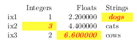
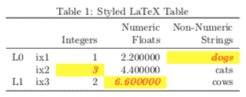
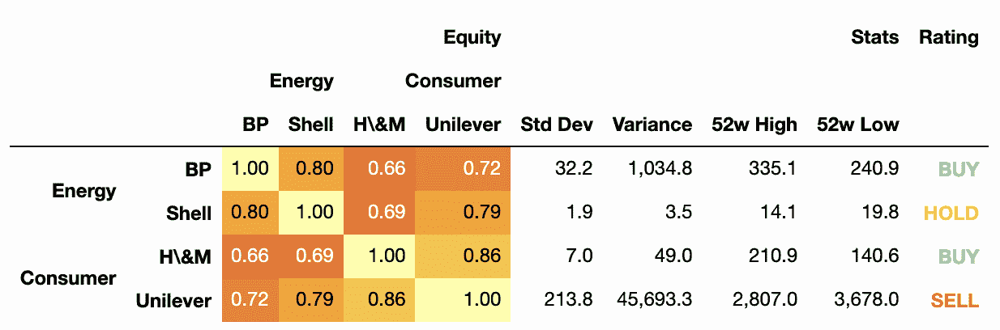
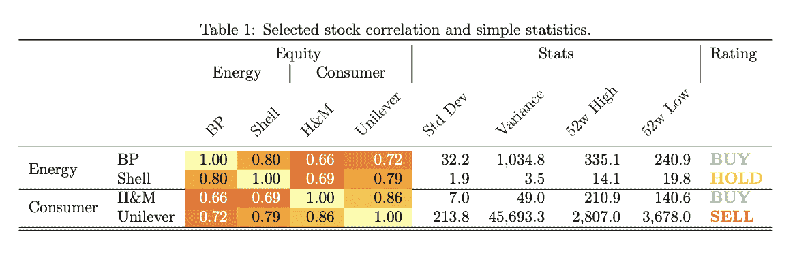

# pandas.io.formats.style.Styler.to_latex

> 原文：[`pandas.pydata.org/docs/reference/api/pandas.io.formats.style.Styler.to_latex.html`](https://pandas.pydata.org/docs/reference/api/pandas.io.formats.style.Styler.to_latex.html)

```py
Styler.to_latex(buf=None, *, column_format=None, position=None, position_float=None, hrules=None, clines=None, label=None, caption=None, sparse_index=None, sparse_columns=None, multirow_align=None, multicol_align=None, siunitx=False, environment=None, encoding=None, convert_css=False)
```

将 Styler 写入 LaTeX 格式的文件、缓冲区或字符串。

从版本 1.3.0 开始新增。

参数：

**buf**str、路径对象、类文件对象或 None，默认为 None

字符串、实现 `os.PathLike[str]` 的路径对象或实现字符串 `write()` 函数的类文件对象。如果为 None，则将结果作为字符串返回。

**column_format**str，可选

放置在位置的 LaTeX 列规范：

\begin{tabular}{<column_format>}

对于索引和非数字数据列，默认为 ‘l’，对于数值数据列，默认为 ‘r’，如果 `siunitx` 为 `True`，则为 ‘S’。

**position**str，可选

表的 LaTeX 定位参数（例如 ‘h!’），放置在位置：

`\\begin{table}[<position>]`。

**position_float**{“centering”, “raggedleft”, “raggedright”}，可选

放置在位置的 LaTeX 浮动命令：

\begin{table}[<position>]

\<position_float>

如果 `environment` 是 “longtable”，则不能使用。

**hrules**bool

设置为 True 以从 {booktabs} LaTeX 包添加 \toprule、\midrule 和 \bottomrule。默认为 `pandas.options.styler.latex.hrules`，为 False。

在版本 1.4.0 中更改。

**clines**str，可选

用于控制添加 \cline 命令以分隔索引标签。可能的值为：

> +   None：不添加 cline 命令（默认值）。
> +   
> +   “all;data”：为每个索引值添加一个 cline，延伸表的宽度，包括数据条目。
> +   
> +   “all;index”：与上述相同，只是线条仅延伸到索引条目的宽度。
> +   
> +   “skip-last;data”：除了最后一级（永远不会稀疏化）之外，为每个索引值添加一个 cline，延伸表的宽度。
> +   
> +   “skip-last;index”：与上述相同，只是线条仅延伸到索引条目的宽度。

从版本 1.4.0 开始新增。

**label**str，可选

包含为 LaTeX 添加的标签：\label{<label>}。这与主 .tex 文件中的 \ref{<label>} 一起使用。

**caption**str、元组，可选

如果是字符串，则包含为 LaTeX 表添加的标题：\caption{<caption>}。如果是元组，即 (“完整标题”, “简短标题”)，则将标题包含为：\caption[<caption[1]>]{<caption[0]>}。

**sparse_index**bool，可选

是否稀疏化显示分层索引。设置为 False 将为每一行的分层键中的每个明确级别元素显示一个。默认为 `pandas.options.styler.sparse.index`，为 True。

**sparse_columns**bool，可选

是否稀疏化显示分层索引。设置为 False 将为每个列的分层键中的每个明确级别元素显示一个。默认为 `pandas.options.styler.sparse.columns`，为 True。

**multirow_align**{“c”, “t”, “b”, “naive”}，可选

如果稀疏化分层 MultiIndexes，文本是居中对齐、顶部对齐还是底部对齐，使用 multirow 包。如果未给出，默认为`pandas.options.styler.latex.multirow_align`，即“c”。如果给出“naive”，则会渲染为无 multirow。

在 1.4.0 版本中更改。

**multicol_align**{“r”, “c”, “l”, “naive-l”, “naive-r”}，可选

如果稀疏化分层 MultiIndex 列，文本是否对齐在左侧、中间或右侧。如果未给出，默认为`pandas.options.styler.latex.multicol_align`，即“r”。如果给出了一个简单的选项，则会渲染为无多列。管道修饰符也可以添加到非简单值上，以绘制垂直线，例如，“|r”将在右对齐的合并单元格的左侧绘制一条线。

在 1.4.0 版本中更改。

**siunitx**bool，默认为 False

设置为`True`以使 LaTeX 与{siunitx}包兼容。

**环境**str，可选

如果给出，将替换`\\begin{table}`中的‘table’的环境。如果指定了‘longtable’，则会呈现更合适的模板。如果未给出，默认为`pandas.options.styler.latex.environment`，即 None。

1.4.0 版本中的新功能。

**encoding**str，可选

字符编码设置。默认为`pandas.options.styler.render.encoding`，即“utf-8”。

**convert_css**bool，默认为 False

将简单的单元格样式从 CSS 转换为 LaTeX 格式。任何未在转换表中找到的 CSS 都将被丢弃。可以通过添加选项--latex 来强制应用样式。请参阅注释。

返回：

str 或 None

如果 buf 为 None，则将结果作为字符串返回。否则返回 None。

另请参见

`Styler.format`

格式化单元格的文本显示值。

注释

**Latex 包**

对于以下功能，我们建议使用以下 LaTeX 插入：

| 功��� | 包含 |
| --- | --- |
| 稀疏列 | 无：包含在默认的{tabular}环境中 |
| 稀疏行 | \usepackage{multirow} |
| hrules | \usepackage{booktabs} |
| 颜色 | \usepackage[table]{xcolor} |
| siunitx | \usepackage{siunitx} |
| 粗体（带有 siunitx） | \usepackage{etoolbox}\robustify\bfseries\sisetup{detect-all = true} *(在{document}内)* |
| 斜体（带有 siunitx） | \usepackage{etoolbox}\robustify\itshape\sisetup{detect-all = true} *(在{document}内)* |
| 环境 | 如果 arg 为“longtable”则使用\usepackage{longtable} &#124; 或任何其他相关的环境包 |
| 超链接 | \usepackage{hyperref} |

**单元格样式**

只有在伴随的样式函数已经用适当的 LaTeX 命令构建时，LaTeX 样式才能被渲染。所有样式功能都围绕着 CSS `(<attribute>, <value>)`对的概念构建（参见表格可视化），这应该被一个 LaTeX `(<command>, <options>)`方法所取代。每个单元格将使用嵌套的 LaTeX 命令及其伴随的选项进行单独样式化。

例如，以下代码将在 HTML-CSS 中突出显示并加粗一个单元格：

```py
>>> df = pd.DataFrame([[1,2], [3,4]])
>>> s = df.style.highlight_max(axis=None,
...                            props='background-color:red; font-weight:bold;')
>>> s.to_html() 
```

使用仅限于 LaTeX 的命令的等效格式如下：

```py
>>> s = df.style.highlight_max(axis=None,
...                            props='cellcolor:{red}; bfseries: ;')
>>> s.to_latex() 
```

在内部，这些结构化的 LaTeX `(<command>, <options>)` 对被转换为 `display_value`，默认结构为：`\<command><options> <display_value>`。在存在多个命令的情况下，后者会递归嵌套，因此上面的示例突出显示的单元格呈现为 `\cellcolor{red} \bfseries 4`。

偶尔，这种格式不适合应用的命令或正在使用的 LaTeX 包的组合，因此可以在元组的 `<options>` 中添加附加标志，以产生所需括号的不同位置（**默认**与 `--nowrap` 相同）：

| 元组格式 | 输出结构 |
| --- | --- |
| （<command>,<options>） | \<command><options> <display_value> |
| （<command>,<options> `--nowrap`） | \<command><options> <display_value> |
| （<command>,<options> `--rwrap`） | \<command><options>{<display_value>} |
| （<command>,<options> `--wrap`） | {\<command><options> <display_value>} |
| （<command>,<options> `--lwrap`） | {\<command><options>} <display_value> |
| （<command>,<options> `--dwrap`） | {\<command><options>}{<display_value>} |

例如，应始终使用带有 -rwrap 的 textbf 命令来设置字体粗细，因此 `('textbf', '--rwrap')` 将渲染一个可用的单元格，用大括号包裹，如 `\textbf{<display_value>}`。

更全面的示例如下：

```py
>>> df = pd.DataFrame([[1, 2.2, "dogs"], [3, 4.4, "cats"], [2, 6.6, "cows"]],
...                   index=["ix1", "ix2", "ix3"],
...                   columns=["Integers", "Floats", "Strings"])
>>> s = df.style.highlight_max(
...     props='cellcolor:[HTML]{FFFF00}; color:{red};'
...           'textit:--rwrap; textbf:--rwrap;'
... )
>>> s.to_latex() 
```



**表格样式**

在内部，Styler 使用其 `table_styles` 对象来解析 `column_format`、`position`、`position_float` 和 `label` 输入参数。这些参数以以下格式添加到表样式中：

```py
set_table_styles([
    {"selector": "column_format", "props": f":{column_format};"},
    {"selector": "position", "props": f":{position};"},
    {"selector": "position_float", "props": f":{position_float};"},
    {"selector": "label", "props": f":{{{label.replace(':','§')}}};"}
], overwrite=False) 
```

对于 `hrules` 参数的例外情况，实际上它同时控制所有三个命令：`toprule`、`bottomrule` 和 `midrule`。可以将 `hrules` 设置为 `True`，也可以手动设置每个单独的规则定义，通过手动设置 `table_styles`，例如下面我们设置一个常规的 `toprule`，为 `bottomrule` 设置一个 `hline`，并排除 `midrule`：

```py
set_table_styles([
    {'selector': 'toprule', 'props': ':toprule;'},
    {'selector': 'bottomrule', 'props': ':hline;'},
], overwrite=False) 
```

如果其他 `commands` 被添加到表样式中，它们将被检测到，并立即放置在‘\begin{tabular}’命令的上方。例如，要添加奇偶行着色，来自 {colortbl} 包，格式为 `\rowcolors{1}{pink}{red}`，使用：

```py
set_table_styles([
    {'selector': 'rowcolors', 'props': ':{1}{pink}{red};'}
], overwrite=False) 
```

使用这些参数的更全面的示例如下：

```py
>>> df.columns = pd.MultiIndex.from_tuples([
...     ("Numeric", "Integers"),
...     ("Numeric", "Floats"),
...     ("Non-Numeric", "Strings")
... ])
>>> df.index = pd.MultiIndex.from_tuples([
...     ("L0", "ix1"), ("L0", "ix2"), ("L1", "ix3")
... ])
>>> s = df.style.highlight_max(
...     props='cellcolor:[HTML]{FFFF00}; color:{red}; itshape:; bfseries:;'
... )
>>> s.to_latex(
...     column_format="rrrrr", position="h", position_float="centering",
...     hrules=True, label="table:5", caption="Styled LaTeX Table",
...     multirow_align="t", multicol_align="r"
... ) 
```



**格式化**

要格式化值，应先使用 `Styler.format()`，然后再调用 Styler.to_latex，以及其他方法，例如 `Styler.hide()`：

```py
>>> s.clear()
>>> s.table_styles = []
>>> s.caption = None
>>> s.format({
...    ("Numeric", "Integers"): '\${}',
...    ("Numeric", "Floats"): '{:.3f}',
...    ("Non-Numeric", "Strings"): str.upper
... })  
 Numeric      Non-Numeric
 Integers   Floats    Strings
L0    ix1       $1   2.200      DOGS
 ix2       $3   4.400      CATS
L1    ix3       $2   6.600      COWS 
```

```py
>>> s.to_latex()  
\begin{tabular}{llrrl}
{} & {} & \multicolumn{2}{r}{Numeric} & {Non-Numeric} \\
{} & {} & {Integers} & {Floats} & {Strings} \\
\multirow[c]{2}{*}{L0} & ix1 & \\$1 & 2.200 & DOGS \\
 & ix2 & \$3 & 4.400 & CATS \\
L1 & ix3 & \$2 & 6.600 & COWS \\
\end{tabular} 
```

**CSS 转换**

这种方法可以将使用 HTML-CSS 构建的 Styler 转换为 LaTeX，使用以下有限的转换。

| CSS 属性 | CSS 值 | LaTeX 命令 | LaTeX 选项 |
| --- | --- | --- | --- |
| 字体粗细 | 粗体更粗 | bfseriesbfseries |  |
| 字体样式 | 斜体倾斜 | itshapeslshape |  |
| 背景颜色 | 红色#fe01ea#f0ergb(128,255,0)rgba(128,0,0,0.5)rgb(25%,255,50%) | 单元格颜色 | {红色}–lwrap[HTML]{FE01EA}–lwrap[HTML]{FF00EE}–lwrap[rgb]{0.5,1,0}–lwrap[rgb]{0.5,0,0}–lwrap[rgb]{0.25,1,0.5}–lwrap |
| 颜色 | 红色#fe01ea#f0ergb(128,255,0)rgba(128,0,0,0.5)rgb(25%,255,50%) | 颜色 | {红色}[HTML]{FE01EA}[HTML]{FF00EE}[rgb]{0.5,1,0}[rgb]{0.5,0,0}[rgb]{0.25,1,0.5} |

也可以使用`--latex`标志向 HTML-CSS Styler 添加用户定义的仅 LaTeX 样式，并添加 LaTeX 解析选项，转换器将在 CSS 注释中检测到。

```py
>>> df = pd.DataFrame([[1]])
>>> df.style.set_properties(
...     **{"font-weight": "bold /* --dwrap */", "Huge": "--latex--rwrap"}
... ).to_latex(convert_css=True)  
\begin{tabular}{lr}
{} & {0} \\
0 & {\bfseries}{\Huge{1}} \\
\end{tabular} 
```

例子

下面我们给出一个完整的逐步示例，添加一些高级功能并注意一些常见的陷阱。

首先，我们像往常一样创建 DataFrame 和 Styler，包括 MultiIndex 行和列，这允许更高级的格式选项：

```py
>>> cidx = pd.MultiIndex.from_arrays([
...     ["Equity", "Equity", "Equity", "Equity",
...      "Stats", "Stats", "Stats", "Stats", "Rating"],
...     ["Energy", "Energy", "Consumer", "Consumer", "", "", "", "", ""],
...     ["BP", "Shell", "H&M", "Unilever",
...      "Std Dev", "Variance", "52w High", "52w Low", ""]
... ])
>>> iidx = pd.MultiIndex.from_arrays([
...     ["Equity", "Equity", "Equity", "Equity"],
...     ["Energy", "Energy", "Consumer", "Consumer"],
...     ["BP", "Shell", "H&M", "Unilever"]
... ])
>>> styler = pd.DataFrame([
...     [1, 0.8, 0.66, 0.72, 32.1678, 32.1678**2, 335.12, 240.89, "Buy"],
...     [0.8, 1.0, 0.69, 0.79, 1.876, 1.876**2, 14.12, 19.78, "Hold"],
...     [0.66, 0.69, 1.0, 0.86, 7, 7**2, 210.9, 140.6, "Buy"],
...     [0.72, 0.79, 0.86, 1.0, 213.76, 213.76**2, 2807, 3678, "Sell"],
... ], columns=cidx, index=iidx).style 
```

其次，我们将格式化显示，并且，由于我们的表格相当宽，将隐藏索引的重复级别-0：

```py
>>> (styler.format(subset="Equity", precision=2)
...       .format(subset="Stats", precision=1, thousands=",")
...       .format(subset="Rating", formatter=str.upper)
...       .format_index(escape="latex", axis=1)
...       .format_index(escape="latex", axis=0)
...       .hide(level=0, axis=0)) 
```

请注意，索引和列标题中的一个字符串条目是“H&M”。如果不将`escape="latex"`选项应用于`format_index`方法，则生成的 LaTeX 将无法渲染，并且返回的错误很难调试。使用适当的转义，将“&”转换为“\&”。

第三，我们将对我们的对象应用一些（CSS-HTML）样式。我们将使用内置方法，并定义自己的方法来突出显示股票推荐：

```py
>>> def rating_color(v):
...     if v == "Buy": color = "#33ff85"
...     elif v == "Sell": color = "#ff5933"
...     else: color = "#ffdd33"
...     return f"color: {color}; font-weight: bold;"
>>> (styler.background_gradient(cmap="inferno", subset="Equity", vmin=0, vmax=1)
...       .map(rating_color, subset="Rating")) 
```

所有上述样式在转换为 HTML（见下文）和 LaTeX 后都可以使用：



然而，最后我们想要添加一个仅 LaTeX 样式（来自{graphicx}包），这不容易从 CSS 转换，pandas 不支持它。请注意这里使用的`--latex`标志，以及`--rwrap`以确保格式正确，转换时不被忽略。

```py
>>> styler.map_index(
...     lambda v: "rotatebox:{45}--rwrap--latex;", level=2, axis=1
... ) 
```

最后，我们渲染我们的 LaTeX，根据需要添加其他选项：

```py
>>> styler.to_latex(
...     caption="Selected stock correlation and simple statistics.",
...     clines="skip-last;data",
...     convert_css=True,
...     position_float="centering",
...     multicol_align="|c|",
...     hrules=True,
... )  
\begin{table}
\centering
\caption{Selected stock correlation and simple statistics.}
\begin{tabular}{llrrrrrrrrl}
\toprule
 &  & \multicolumn{4}{|c|}{Equity} & \multicolumn{4}{|c|}{Stats} & Rating \\
 &  & \multicolumn{2}{|c|}{Energy} & \multicolumn{2}{|c|}{Consumer} &
\multicolumn{4}{|c|}{} &  \\
 &  & \rotatebox{45}{BP} & \rotatebox{45}{Shell} & \rotatebox{45}{H\&M} &
\rotatebox{45}{Unilever} & \rotatebox{45}{Std Dev} & \rotatebox{45}{Variance} &
\rotatebox{45}{52w High} & \rotatebox{45}{52w Low} & \rotatebox{45}{} \\
\midrule
\multirow[c]{2}{*}{Energy} & BP & {\cellcolor[HTML]{FCFFA4}}
\color[HTML]{000000} 1.00 & {\cellcolor[HTML]{FCA50A}} \color[HTML]{000000}
0.80 & {\cellcolor[HTML]{EB6628}} \color[HTML]{F1F1F1} 0.66 &
{\cellcolor[HTML]{F68013}} \color[HTML]{F1F1F1} 0.72 & 32.2 & 1,034.8 & 335.1
& 240.9 & \color[HTML]{33FF85} \bfseries BUY \\
 & Shell & {\cellcolor[HTML]{FCA50A}} \color[HTML]{000000} 0.80 &
{\cellcolor[HTML]{FCFFA4}} \color[HTML]{000000} 1.00 &
{\cellcolor[HTML]{F1731D}} \color[HTML]{F1F1F1} 0.69 &
{\cellcolor[HTML]{FCA108}} \color[HTML]{000000} 0.79 & 1.9 & 3.5 & 14.1 &
19.8 & \color[HTML]{FFDD33} \bfseries HOLD \\
\cline{1-11}
\multirow[c]{2}{*}{Consumer} & H\&M & {\cellcolor[HTML]{EB6628}}
\color[HTML]{F1F1F1} 0.66 & {\cellcolor[HTML]{F1731D}} \color[HTML]{F1F1F1}
0.69 & {\cellcolor[HTML]{FCFFA4}} \color[HTML]{000000} 1.00 &
{\cellcolor[HTML]{FAC42A}} \color[HTML]{000000} 0.86 & 7.0 & 49.0 & 210.9 &
140.6 & \color[HTML]{33FF85} \bfseries BUY \\
 & Unilever & {\cellcolor[HTML]{F68013}} \color[HTML]{F1F1F1} 0.72 &
{\cellcolor[HTML]{FCA108}} \color[HTML]{000000} 0.79 &
{\cellcolor[HTML]{FAC42A}} \color[HTML]{000000} 0.86 &
{\cellcolor[HTML]{FCFFA4}} \color[HTML]{000000} 1.00 & 213.8 & 45,693.3 &
2,807.0 & 3,678.0 & \color[HTML]{FF5933} \bfseries SELL \\
\cline{1-11}
\bottomrule
\end{tabular}
\end{table} 
```


